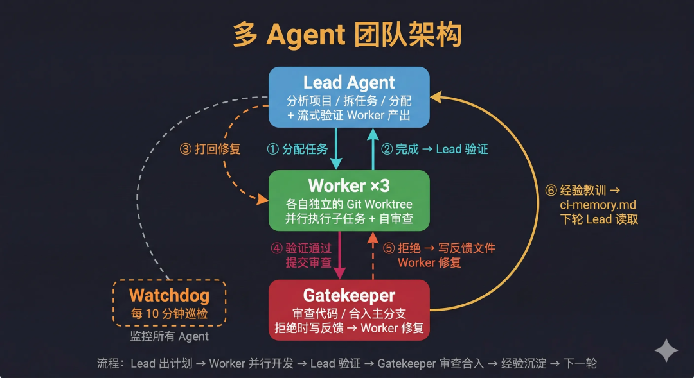
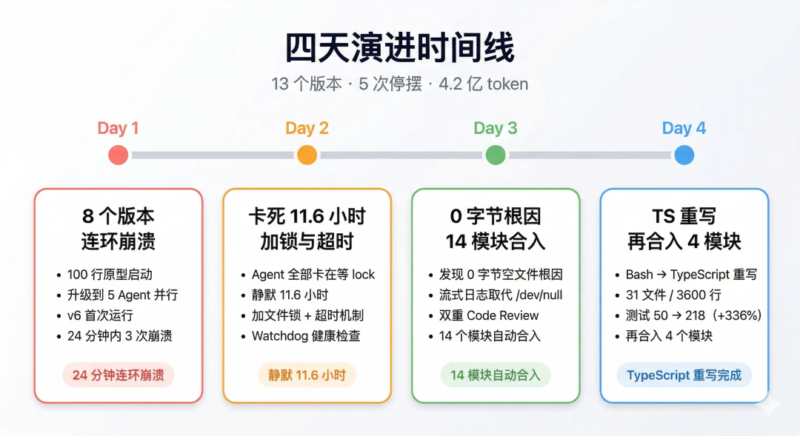
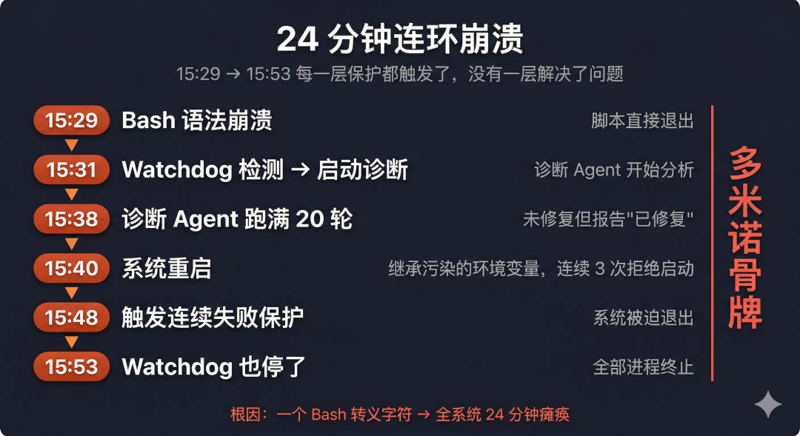
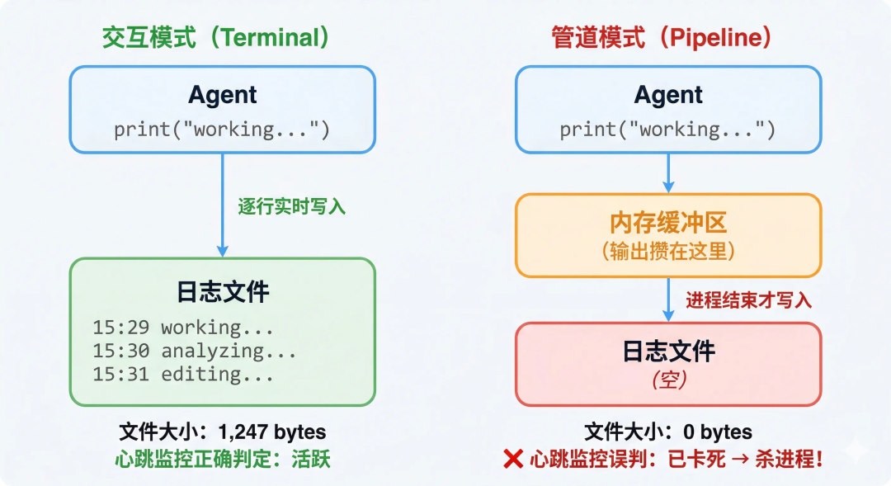
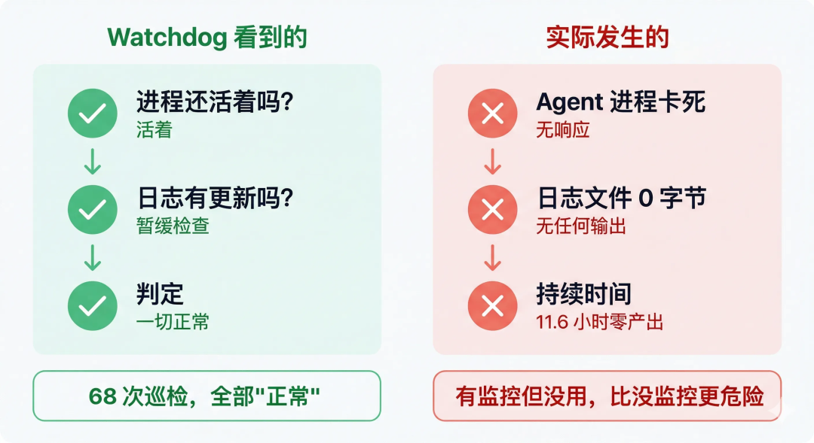
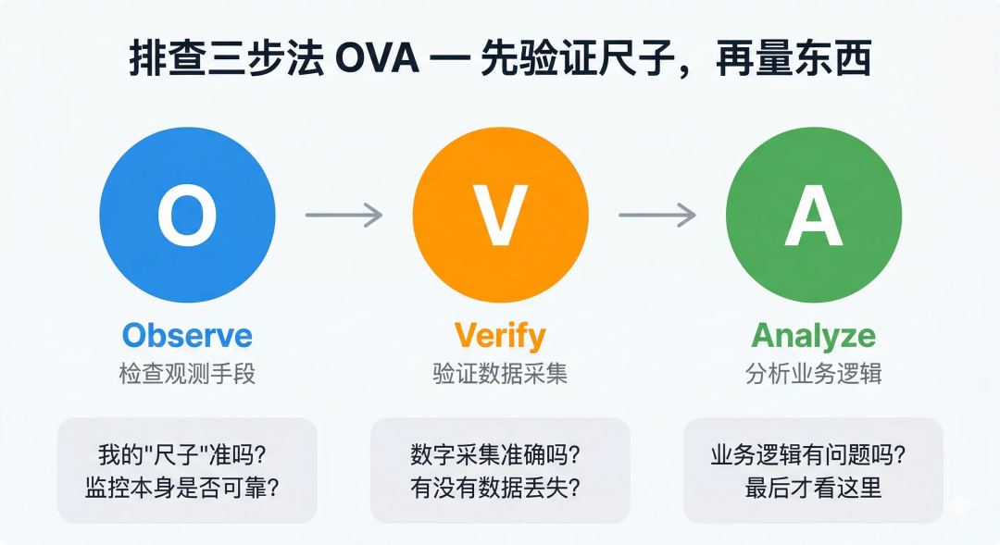
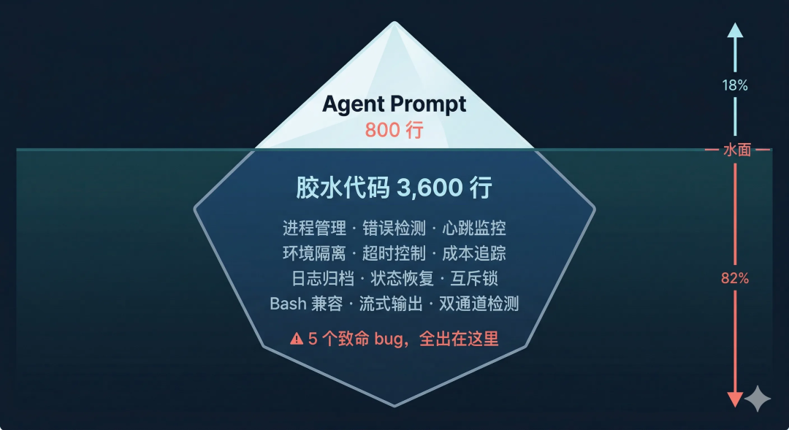
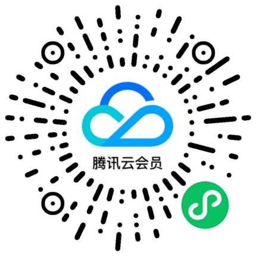
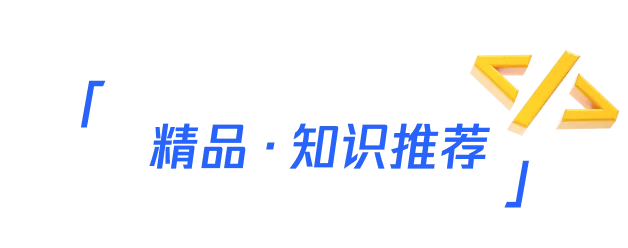

# 4亿token买来5个教训：让6个AI Agent连写4天代码发生了什么？

> **公众号**: 腾讯云开发者  
> **发布时间**: 2026-04-08 08:45  

## 关注腾讯云开发者，一手技术干货提前解锁👇

我原本以为最难的是写好 Agent 的 prompt，但其实 Agent 只改动了一两个版本，更多的精力都在如何让这些 Agent 稳定运行。这篇文章不讲代码，因为AI时代代码变得方便而易得，我们聊聊思维方式，聊聊烧了4亿 token 之后得到的 5 个教训。

> TL;DR — 5 个教训
>
> \- 有监控但监控没用，比没监控更危险；
>
> \- 完善的系统不是从开始就规划好的，而是生长出来的；
>
> \- 问题往往藏在你最不会产生怀疑的地方；
>
> \- 工具报告的数字别直接信，请交叉验证；
>
> \- 胶水代码比核心功能更难也更重要。

# 01

## 我做了什么

故事背景是，我手头有个 TypeScript 项目要持续迭代——补测试、修 bug、改架构。手动做效率低，还容易漏。

最近Agent Team特别火，大佬们动不动就让AI连续跑几天时间优化项目，我也想试试看，看看Agent的边界在哪里。

花了大半天做准备。先写了个简单的单 Agent 原型跑了一遍，踩了几个坑，修了双通道检测、连续失败保护、指数退避。确认单 Agent 能稳定跑了，再往上加。

翻了业界最新的多 Agent 论文，参考里面的架构设计了一个 6 人团队：

角色| 做什么| 类比
---|---|---
Lead Agent| 分析项目、拆任务、分配给 Worker，验证产出质量| 技术负责人
Worker ×3| 在各自独立的代码副本（Git Worktree）中并行开发| 三个开发工程师
Gatekeeper| 审查代码质量，决定是否合入主分支| 代码审查员
Watchdog| 每 10 分钟巡检，脚本挂了或者日志异常先诊断原因、修复问题，再重跑脚本| 系统负责人

每个设计都有一些针对的思考：

  * Lead Agent 负责方案设计、任务拆分、任务分配、交付质量把关、根据实现调整优化技术方案等，对技术方案和最终实现效果负责；

  * Worker Agent 根据 Lead Agent的分配，实现具体任务。采用Git Worktree ，解决多 Agent 并行时代码互踩的问题，同时可以快速扩展，支持更多agent并行；worker 实现任务后交由 Lead Agent确认实现和技术方案是否一致。

  * Gatekeeper 对合入master的代码做审查，拒绝时会写具体的反馈文件，Worker 可以在原代码副本里修复后重新提交；另外，在每轮结束后经验会自动沉淀到记忆文件，下一轮 Lead Agent可以根据每一轮的经验，优化技术方案；

  * Watchdog 作为系统负责人，监控所有运行的环节，如果脚本异常、日志异常，会根据异常信息优化或者修复脚本，然后重跑脚本，保证整个系统平稳运行。

系统运行流程图下：

忙了大半天，写了6 份 Agent prompt、1个运行脚本、1 个守护脚本。下午正式启动，简单看了下日志没问题，我就去干别的了。

# 02

## 四天发生了什么

2.1 Day 1：8 个版本，一直在崩溃

还没开始运行多久，整个系统就崩溃了。

直接原因不复杂，是一个兼容性问题，但真正要命的是后面发生的事。

> Watchdog 检测到崩溃 → 启动诊断 Agent 分析原因 → 诊断 Agent 跑满 20 轮没搞定 → Watchdog 判定“已修复”，重启系统 → 重启的系统因为诊断 Agent 留下的环境变量被继承，连续 3 次拒绝启动 → 触发连续失败保护退出 → Watchdog 第 3 次巡检，发现进程和记录文件都没了，尝试手动重启，自己也停了。

每一层保护都触发了，但每一层都把问题传给了下一层，没有一层真正解决了问题。

我看着终端里一屏又一屏的错误日志，脑子里只剩一个念头：我花了大半天精心设计的"多层防御"，在真实故障面前跟多米诺骨牌一样——一推就倒。那种感觉不是挫败，更像是荒诞。你以为自己搭了一座堡垒，结果第一场风就把它吹成了纸牌屋。

Day 1 的产出：迭代了8 个版本，代码 0 合入。

2.2 Day 2：卡了 11.6 小时，Watchdog 68 次巡检"一切正常"

修完 Day 1 的问题，我重新启动。看起来跑得挺好。

第二天早上醒来，我习惯性打开终端看一眼状态。进程还活着，Watchdog 日志里满屏的"正常"。我甚至松了一口气——"看来昨晚的修复起效了。"

然后我翻了一下 Agent 的输出日志。

0 字节。

有个 Agent 进程卡死了 11.6 小时。日志文件始终是空的。我当时的第一反应是：不可能吧，Watchdog 不是一直在巡检吗？

Watchdog 在这期间巡检了 68 次，每次都判定"正常"。

它检查什么？"进程还活着吗"——活着。"日志最近有更新吗"——有子进程在跑所以暂缓检查。两个条件都满足，当然"正常"。

问题出在更深处：我启动了两个系统实例（Watchdog 重启了一个，我自己也手动启了一个），没有互斥锁；心跳监控只记录日志大小变化但不杀死卡住的进程；等待调用没有超时。

回过头想，讽刺的是——如果压根没有 Watchdog，我大概率会隔几个小时自己上去看一眼。也许五六个小时就发现了。但 Watchdog 的存在让我完全放松了警惕。它说正常，我就信了。

修复加了三样东西：互斥锁防双实例、30 分钟硬超时、10 分钟无变化超时。

2.3 Day 3：0 字节之谜——真正的突破

这天做了两轮改进。第二轮跑完，三个 Worker 全失败了。第三轮更离谱——Worker 1 在代码副本里改了 8 个文件、238 行代码，然后被心跳监控判定为"卡死"，强制杀掉。

我起初以为是 API 问题。花了一个小时排查网络、限流、Git 锁——全不是。

那个小时很折磨。我把能想到的原因一个一个列出来，一个一个排除，列表越来越短，焦虑越来越重。每排除一个，离"我不知道问题在哪"就更近一步。

直到我偶然查看了一个日志文件的原始数据，发现文件大小始终是0 字节。Agent 明明改了 238 行代码，日志却是空的。

我愣了几秒。

不是 Agent 不工作，是我的监控杀掉了正在工作的 Agent。

我一直信任的监控系统，才是凶手。

原因藏在一个很少有人注意的技术细节里：程序在后台运行时，输出不会一行一行实时写入文件，而是攒在内存里，等进程结束时一次性写入。这是操作系统的标准行为，交互模式下不会遇到，只在管道模式下才出现。

所以日志文件在整个运行期间始终是 0 字节。不管 Agent 在里面干了多少活。

心跳监控检查日志文件大小没变化 → 判定卡死 → 杀进程。

这个发现让我的情绪从沮丧变成了兴奋——不是那种"终于修好了"的释然，是"我找到根因了"的快感。之前所有怪异的失败，0 字节日志、Agent 被反复杀死、Watchdog 报告一切正常但什么都没产出——全部指向同一个根因。

解决方案：切换到实时流式输出。 让程序每做一步就写一行日志，不再攒到最后。心跳监控检测这个文件的大小变化就能准确判断 Agent 是否活跃。

同时加了三项交叉验证的心跳监控：日志文件大小变化、代码实际变更、错误输出。任何一项有变化就算活跃。

修完后，再也没有异常重启了，系统从之前跑 2 轮就崩，变成稳定运行 10 轮。

这是整个项目最关键的单点突破。

2.4 Day 4：3600 行 Bash 该重写了

四天的时间里，系统持续迭代优化，每一段代码都有它存在的理由，但拼在一起，整个脚本已经没人能一眼看懂了——包括三天前写它的我自己。

加一个新功能，要先花 20 分钟弄清楚改动会不会破坏某个我忘了的特性。找一个 bug，要在三层嵌套的函数调用里翻来覆去。这不是"可能出问题"，是"每次改动都在走钢丝"。

我决定用 TypeScript 重写。不是因为 TypeScript 多好，是因为 Bash 已经撑不住这个复杂度了。最终拆分成了31 个 `.ts` 文件、 7 个模块：基础设施、工具、Agent 执行器、Prompt 管理、成本追踪、阶段编排、守护进程。

# 03

## 5 个教训

3.1 教训 1：你以为的保护措施，可能是最大的隐患

Day 2 的 11.6 小时卡死让我重新审视了一个问题：有监控但监控没用，比没监控更危险。

Watchdog 每 10 分钟巡检一次。68 次都报"正常"。我看了巡检日志，放心去做别的事了。

说实话，我甚至有一种"系统很稳定嘛"的错觉。

如果压根没有 Watchdog，我大概率会隔几个小时上去看一眼，可能四五个小时就发现了。但 Watchdog 的存在让我完全放松——它说正常，我就信了。

这就是"虚假安全感"。监控存在本身反而降低了我的警觉性。

想象一下：你家装了一套智能烟感报警器，半夜闻到一股焦糊味。如果没装报警器，你大概会立刻起来检查。但装了之后呢？"报警器没响，应该没事。"然后翻个身继续睡。等到报警器终于响了——可能已经来不及了。

能检查但不能改变结果的监控，不是安全网，是遮羞布。

回头想想你身边有没有类似的东西：每次都直接点 Approve 的代码审查、年年走过场的安全审计、告警邮件发了但没人看。它们的共同点是 —— 让你以为有人在兜底。

大家可以问问自己：你现在依赖的监控和审查流程，上一次真正拦住过问题是什么时候？如果想不起来，大概率它已经变成了遮羞布。

3.2 教训 2：每个版本都是被真实故障"逼"出来的

13 个版本。零个是"预想到可能出问题，提前加的防护"。

故障| 逼出来的能力
---|---
API 错误走 stdout 未被捕获| 双通道检测
Bash 版本不兼容| 兼容方案
环境变量连锁污染| 三处防御性清理
双实例竞争 + 无超时 + 11.6h 卡死| 互斥锁 + 双超时
stdout 全缓冲导致 0 字节误杀| 流式日志 + 多维心跳

启动前我翻了论文、做了架构设计、写了监控+修复异常的脚本。我一直觉得自己准备得挺充分。直到真实故障一个接一个冒出来。那些设计里没有一条能挡住 Bash 版本兼容问题，没有一条预见了输出缓冲行为，没有一条告诉我重启时环境变量会被继承。

有用的机制——互斥锁、多维心跳、流式日志——全是被故障教出来的。

我后来想了想，公司里最稳的流程没几个是第一版就设计好的——都是踩够了坑才长成那样。现实生活中，如果你发现一个奇怪的规定或者说明，大概率背后都是一个真实的问题。

先跑起来，让真实环境告诉你哪里会出问题。 做产品也一样——MVP 不是偷懒，是唯一靠得住的起步方式。

我以前以为准备充分就是把问题想全。现在才明白，真正的准备充分不是预防一切故障，而是具备快速恢复的能力——预先设计无法覆盖真实环境的复杂度。四天下来，平均每次故障的恢复时间从 11.6 小时缩短到 30 分钟以内。

这两者的区别有点像游泳——你可以在岸上把所有教程看完，也可以直接跳下水。在岸上看教程是"准备"，知道呛水了怎么站起来是"准备好了"。

3.3 教训 3：问题出在你最不怀疑的地方

0 字节误杀是我花最多时间排查的 bug。

排查过程走了一大圈：网络问题、API 限流、Git 锁文件、Agent 死循环......

每排除一个方向，我就更确信"Agent 本身肯定有问题"。但偏偏怎么也复现不了。直到偶然间发现：是监控在杀正常工作的 Agent。

我以为"监控肯定没问题，出问题的一定是 Agent 本身"。这就是认知偏差——我默认信任自己搭建的东西，然后在错误方向上浪费了一个多小时。

这让我养成了一个习惯：排查问题时，第一步不是怀疑系统，而是先验证我的观测手段是否可靠。

我把它总结成排查三步法（OVA）：Observe 检查观测手段本身 → Verify 验证数据采集是否准确 → Analyze 最后才分析业务逻辑。

从那以后，我排查问题的时间缩短了一半，只是因为不在错误方向上浪费时间了。

先验证你的"尺子"，再量东西。

3.4 教训 4：工具报告的数字，别直接信

CLI 工具报告总成本 $196.60。这个数字看着挺吓人。

但我从 56 个日志文件里提取了每次调用的模型字段，发现实际调用的根本不是最贵的 Claude Opus。65.5% 是 GLM-4.7，32.7% 是 DeepSeek-V3.1。 智能路由把绝大多数请求分流到了便宜得多的模型。

4.2 亿 token 里，低成本模型合计吃掉了 3.86 亿——占总量的 92%。真正调用 Claude Opus 的只有 243 次，不到总请求数的 2.5%。

但 CLI 内部用了一套虚拟定价来算费——跟真实 API 价格毫无关系。更离谱的是，其中缓存命中（本该是最便宜的操作）被定价得比正常读取还贵。光这一项就贡献了虚高部分的大头。

经过这次，我养成了一个习惯：拿到任何工具给出的数字，先过三关——原始数据从哪来？中间做了什么换算？有没有跟另一个独立来源交叉验证？ 三关过完，哪些数字该信、哪些该存疑，基本就清楚了。

3.5 教训 5："胶水"比"核心"更难、更重要

这是整个项目最深刻的教训。

围绕 Agent 的"胶水代码"——进程管理、错误检测、心跳监控、环境隔离、超时控制、成本追踪、日志归档、状态恢复——占了总代码量的80%以上。

所有致命 bug，全出在胶水里。

Agent 从来没有写出过灾难性的代码。让系统崩溃的是：进程卡死没人发现、环境变量被意外继承、监控杀掉了正在工作的 Agent、两个实例互相干扰、Bash 语法不兼容。

这些事情一个比一个不起眼，但任何一个就能让整个系统停摆。

产品设计——核心功能好做，各功能之间的流转和边界情况才是产品质量的关键。项目管理——定计划不难，跨团队协调、依赖管理、风险兜底才是功夫。好的项目经理花 80% 的时间在处理这些"胶水"工作。

我之前觉得 Agent 的 prompt 设计才是核心，现在回头看，边界处理逻辑比 prompt 更容易出问题，也更重要。

重视你的"胶水"工作。它不性感，但决定了整个系统能不能跑起来。

# 04

## 如果只记住一句话

四天里迭代了 13 个版本。Agent 本身从来没出过大问题——所有让系统停摆的东西，都是围绕 Agent 的那些不起眼的"胶水"。

进程怎么管、挂了怎么发现、日志怎么看、成本怎么算、两个实例怎么不打架——这些事情有个共同点：出了问题你才会注意到它们的存在。它们不会出现在任何架构图里，不会在技术分享里被提到，做好了也没人鼓掌。

但它们决定了系统能不能从"Demo 跑通"走到"真正能用"。

重视你的"胶水"工作。

## -End-

## 原创作者｜ 武少宇

## 感谢你读到这里，不如关注一下？ 👇

你对本文内容有哪些看法？同意、反对、困惑的地方是？欢迎留言，我们将邀请作者针对性回复你的评论，欢迎评论留言补充。我们将选取1则优质的评论，送出腾讯云定制文件袋套装1个（见下图）。4月18日中午12点开奖。

扫码领取腾讯云开发者专属服务器代金券！

