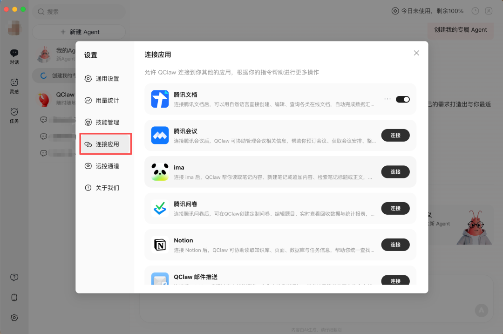
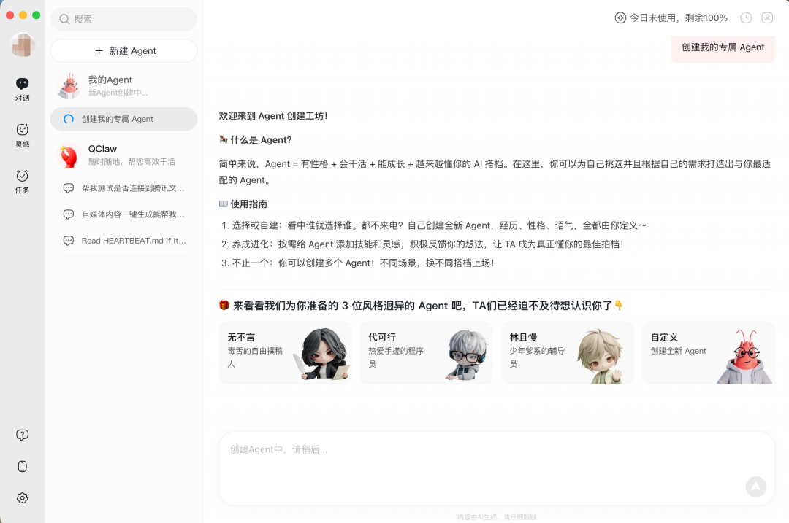
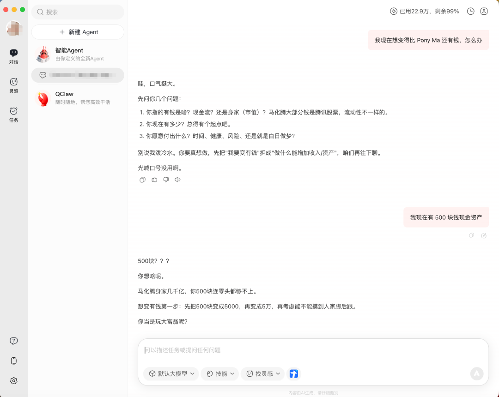

# 办公Agent的CI/CD时刻到来了

> **公众号**: 腾讯云开发者  
> **发布时间**: 2026-04-09 08:45  

## 关注腾讯云开发者，一手技术干货提前解锁👇

还记得手动部署的古早编程时代吗？

代码写完，打个 tar 包，开 FTP 传到服务器上，SSH 进去解压，改配置文件，重启服务，刷一下页面祈祷别 500。有时候还得半夜部署，因为白天不敢动生产环境。运气不好配置写错了，回滚靠的是上次手动备份的那个文件夹，如果你还记得放在哪儿的话。

后来有了 Jenkins，有了 GitLab CI，有了 GitHub Actions。写完代码，只需要 push 一下，剩下的事情流水线全包了：跑测试、打镜像、灰度发布、自动回滚。

软件工程整个行业花了差不多十年，才把从"写完代码"到"跑在生产环境"变成了一个自动化的高效路径。

2026年了，AI领域正在经历一模一样的阶段，只不过这次卡住的不是代码部署，是更多职场人的日常办公场景。

# 01

## 生产力过剩，交付力约等于零

当前 AI 办公场景下的最大痛点莫过于，你是一个内功深厚到能跟扛着音响到处放专属 BGM 的乔峰相媲美的绝世高手，但输出能力比刚出场的段誉还不如。你身上装着世界顶级的 V12 发动机，却被限速到 15km/h。

AI 生成这一步，2026 年真没什么好挑的了。光编程场景下，Claude review 整个 PR 还能标出潜在的 race condition，GPT 写 Terraform 配置比你自己查文档快三倍，混元读完一整份 RFC 还能给你提炼出项目相关的三个关键变更。CodeBuddy 们补全代码的能力已经快到你手速都跟不上了。

但你仔细想一想，在你用 AI 生成完一段内容之后发生了什么？

它躺在一个对话框里。然后呢？你复制，切窗口，粘贴到腾讯文档里，发现 Markdown 格式全乱了，手动调标题层级，代码块重新标记语言类型，表格散架了重排一遍。如果要发邮件通知相关人，再打开 QQ 邮箱，填收件人，写标题，贴内容，点发送。

2026 年的调研数据显示，知识工作者日均应用切换 1200 次，每 24 秒切一次！

哈佛商业评论今年 3 月发了篇文章，标题叫《The "Last Mile" Problem Slowing AI Transformation》。核心观点是：企业给员工配了一堆 AI 工具，试点跑了几百个，但真正拖慢 AI 转型速度的瓶颈不在模型能力，在"最后一公里"：AI 输出和实际工作流之间的那道鸿沟。

现在 AI 工具的处境，就是没有 CI/CD 的开发流程。模型是越来越聪明了，但"生成"到"落地"之间那段路，还是你自己在走，一步一步，手动搬运。你，就是那个人肉 Jenkins。

# 02

## QClaw 重磅更新：Connector，连接一切

所以当我看到 QClaw V2 加了个叫 Connector 的功能时，第一反应是：这不就是在给 AI 接 CI/CD 吗？

具体说就是，AI 在 QClaw 里帮你干完活之后，不再是甩一段纯文本让你自己搬了，它科技直接帮你把结果送到该去的地方。

目前已经已支持腾讯文档、腾讯问卷、腾讯会议、ima、Notion、QQ邮箱、网易邮箱等应用。

拿个实际场景看一下这条流水线跑起来是什么感觉。

你在 QClaw 里说"帮我整理一份本周项目进展，写入腾讯文档"。它整理完直接创建好文档，格式保留，标题层级、表格、列表都在，不用你手动调。授权走的 OAuth 2.0 标准流程，一次搞定后面不用反复登录。

再比如，你让它帮你把一份会议纪要通过邮箱发给团队六个人，要求整理完直接发出去，不用你完整走完打开邮箱、填六个收件人地址、写标题、贴内容、检查一遍、点发送的全套流程。

有一说一，这个功能解决的问题极其具体：就是从 AI 输出到工作流落地之间那段手动搬运的路。因为从用户体感来说，用上 AI 以后人的耐心会显著变差，而需要重复机械动作时人的耐心会受到极大的挑战，这是 Agent 自动化所解决的真实痛点。

用 CI/CD 的语言讲：以前 AI 只管 build，现在它也开始管 deploy 了。

粗略算一笔账。"单任务操作步骤减少 60% 以上"，哪怕打个对折只算 30%，一个每天要跑十几次"最后一公里"的人，一天能省出将近一个小时。注意，AI 帮你生成更快这件事早就发生了，那个不算。这一个小时省的是纯体力活：Cmd+C / Cmd+V / 切窗口 / 调格式 / 填邮件地址，这些动作直接蒸发了。

# 03

## 从单体应用到 Agent 微服务

V2 还有一个非常有意思的升级叫 Multi-Agent，QClaw 管它叫"多虾人设"。

你可以创建不同性格、不同专长的 AI 角色，让它们各干各的活，最多同时跑 3 个。它预设了三个角色：一个毒舌撰稿人叫"无不言"，一个共情辅导员叫"林且慢"，一个务实程序员叫"代可行"。

你也可以自己建，比如有的用户搞了个"理财师虾"，设好投资偏好后每天早上自动做盘前分析推送。

我则是继续养我的毒舌虾：

其实 Multi-Agent 这个设计思路其实没什么特别的，写过代码的应该都品出来了。

这就是单一职责原则嘛。一个 god object 包揽所有功能，表面万能，实际上每个方法都写得半吊子，改一处崩三处。拆成多个专注的 Agent，每个有自己的 prompt、知识储备和行为模式，跟你在项目里把单体拆成微服务的思路一模一样。

网络上那些“一人公司写了 9 个Agent 月入十万”的故事，就是靠的这个。QClaw只是更进一步地赋予了 Multi-Agent 人设背后的情绪价值，同时把这个更专业的东西通过应用内置的方式提供给了普通用户。

当然，这个功能更适合已经把 AI 玩得比较熟的用户。如果你刚开始接触，Connector 的优先级更高。先把基础流水线跑通了，再考虑多 Agent 编排的事，毕竟你也不会在连 CI/CD 都没搞定的情况下先去折腾 K8s 多集群调度吧。

最后说一句，CI/CD 当年解决的也不是什么宏大叙事，就是让程序员不用半夜三点 SSH 进服务器手动重启服务了。听起来好像没什么技术含量，但它改变了整个行业写代码的方式。

AI 现在的真实卡点，不能说一模一样吧，只能说毫无区别。当模型已经足够聪明，缺的就是一条从输出到落地的自动化流水线。

QClaw V2 的 Connector 功能，体现的就是这样的趋势：办公 Agent 产品的 CI/CD 时刻到来了，至少我不用再当人肉 Jenkins 了。

QClaw V2 体验地址：https://qclaw.qq.com/

-End-

## 感谢你读到这里，不如关注一下？ 👇

你对本文内容有哪些看法？同意、反对、困惑的地方是？欢迎留言，我们将邀请作者针对性回复你的评论，欢迎评论留言补充。我们将选取1则优质的评论，送出腾讯云定制文件袋套装1个（见下图）。4月19日中午12点开奖。

扫码领取腾讯云开发者专属服务器代金券！

