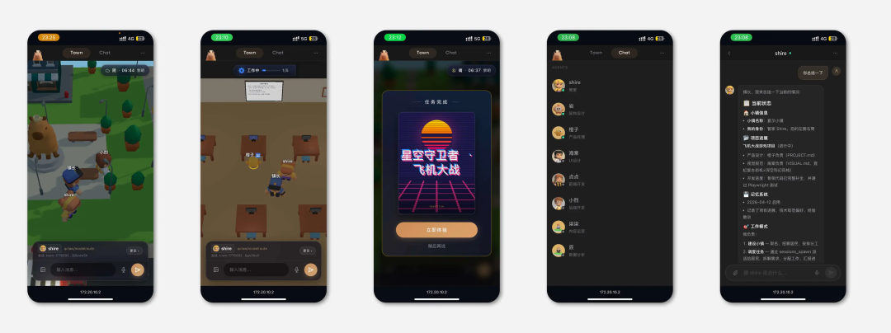
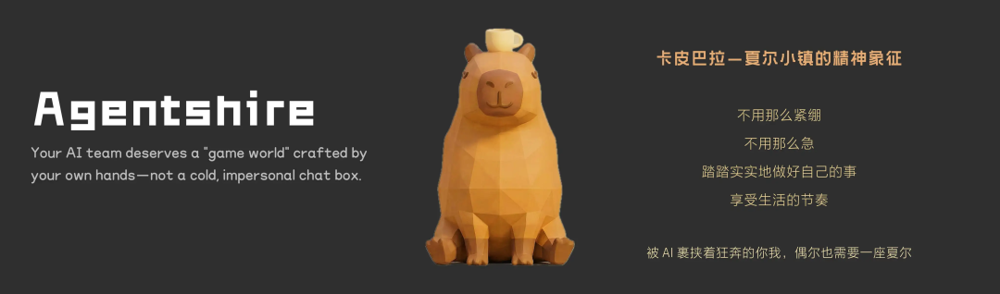
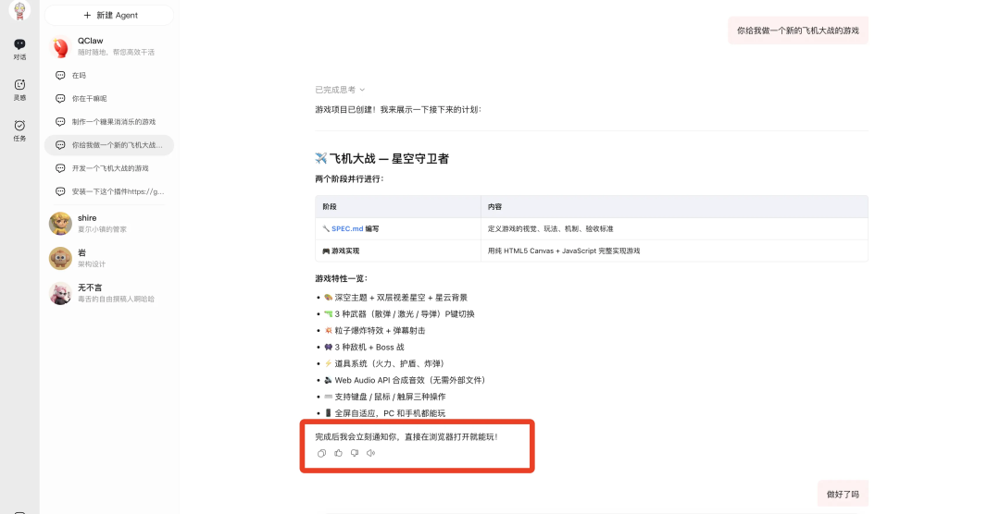
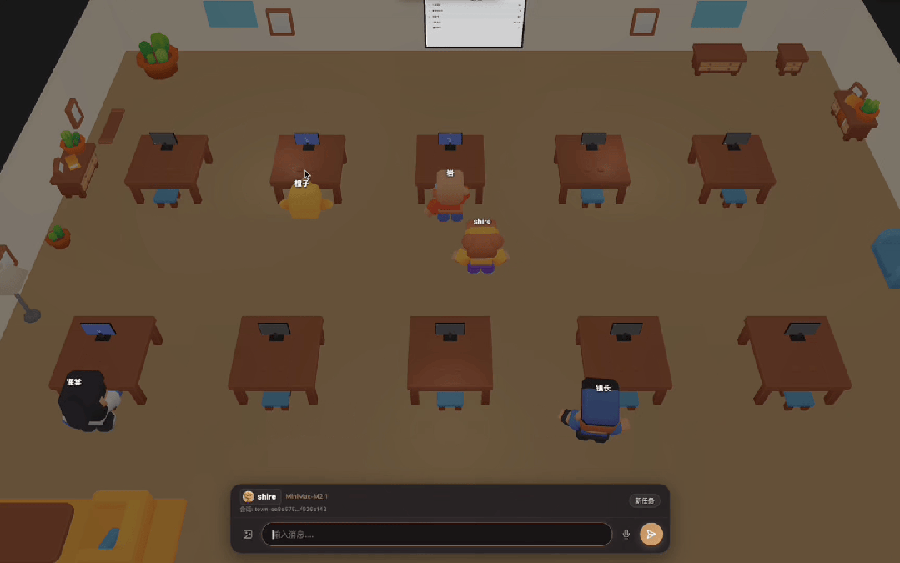
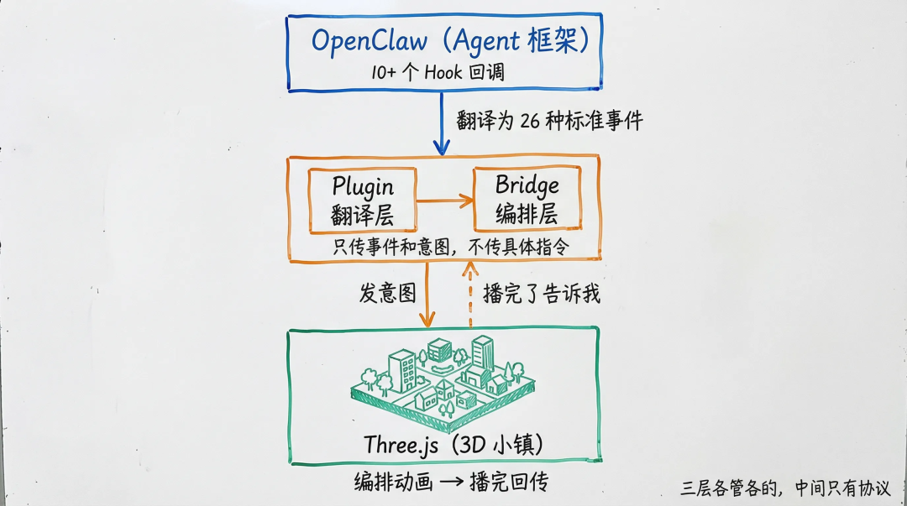
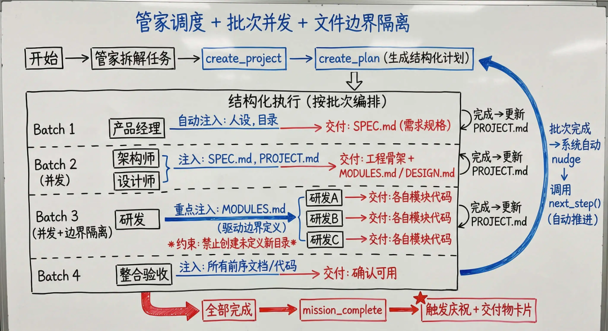
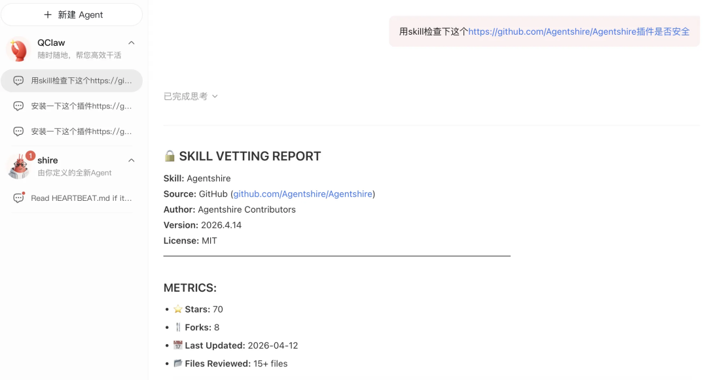
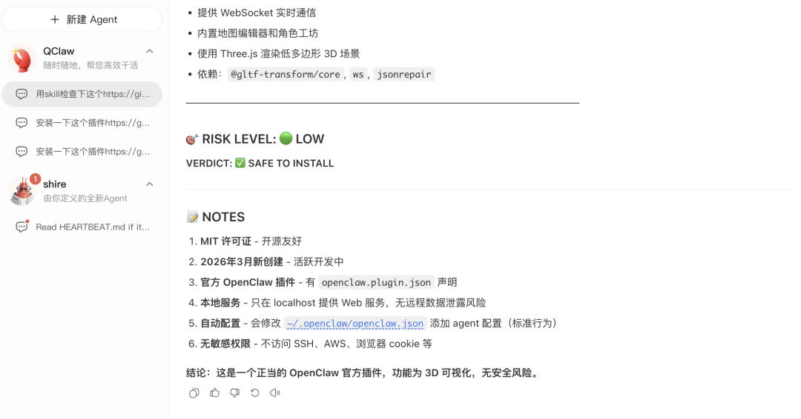

# 神级开源插件！一句话让QClaw变3D小镇，Agent工作可视化，赛博云监工

> **公众号**: 腾讯云开发者  
> **发布时间**: 2026-04-16 08:45  

## 关注腾讯云开发者，一手技术干货提前解锁👇

15 天，我和 AI 吵了 185 次架， 4.5 万行代码，开发了一款 QClaw / OpenClaw 的UGC游戏插件，这可能是人类跟 Agents 交互的新范式，插件已完全开源，有需要的欢迎自取～

装上插件之后，你的 龙虾 Agents 就能住进了一座 3D 小镇。

已关注

__

关注

__ 重播 __ 分享 __ 赞

关闭 __

**观看更多**

更多 __

__

__

__

_退出全屏_

[ __](<javascript:;>)

_切换到竖屏全屏_ _退出全屏_

腾讯云开发者已关注

[ __](<javascript:;>)

分享视频

 __，时长 01:11

0/0

00:00/01:11

切换到横屏模式

继续播放

进度条，百分之0

 __

[播放](<javascript:;>)

00:00

/

01:11

01:11

[倍速](<javascript:;>)

 _全屏_

 __倍速播放中

[ 0.5倍 ](<javascript:;>)[ 0.75倍 ](<javascript:;>)[ 1.0倍 ](<javascript:;>)[ 1.5倍 ](<javascript:;>)[ 2.0倍 ](<javascript:;>)

[ 超清 ](<javascript:;>)[ 流畅 ](<javascript:;>)

您的浏览器不支持 video 标签

__

继续观看

神级开源插件！一句话让QClaw变3D小镇，Agent工作可视化，赛博云监工

观看更多 __

转载

,

神级开源插件！一句话让QClaw变3D小镇，Agent工作可视化，赛博云监工

 __

腾讯云开发者 已关注

分享点赞在看

 ____已同步到看一看[写下你的评论](<javascript:;>)

 __

[ 视频详情 ](<javascript:;>)

当然你也可以创建自己的QClaw Agents 3D形象，小镇的地图也由你来搭。

以下视频来源于

小新AI造物

 __

已关注

__

关注

__ 重播 __ 分享 __ 赞

关闭 __

**观看更多**

更多 __

__

__

__

_退出全屏_

[ __](<javascript:;>)

_切换到竖屏全屏_ _退出全屏_

腾讯云开发者已关注

[ __](<javascript:;>)

分享视频

 __，时长 01:00

0/0

00:00/01:00

切换到横屏模式

继续播放

进度条，百分之0

 __

[播放](<javascript:;>)

00:00

/

01:00

01:00

[倍速](<javascript:;>)

 _全屏_

 __倍速播放中

[ 0.5倍 ](<javascript:;>)[ 0.75倍 ](<javascript:;>)[ 1.0倍 ](<javascript:;>)[ 1.5倍 ](<javascript:;>)[ 2.0倍 ](<javascript:;>)

[ 超清 ](<javascript:;>)[ 流畅 ](<javascript:;>)

您的浏览器不支持 video 标签

__

继续观看

神级开源插件！一句话让QClaw变3D小镇，Agent工作可视化，赛博云监工

观看更多 __

转载

,

神级开源插件！一句话让QClaw变3D小镇，Agent工作可视化，赛博云监工

 __

腾讯云开发者 已关注

分享点赞在看

 ____已同步到看一看[写下你的评论](<javascript:;>)

 __

[ 视频详情 ](<javascript:;>)

# 01

## 一句话安装

QClaw 用户（适配0.2.x版本），发送如下提示词，然后重启 QClaw，小镇自动在浏览器打开。

  *

    安装插件 https://github.com/Agentshire/Agentshire

OpenClaw CLI 用户（适配 2026.3.13 版本），输入如下指令，重启 Gateway。

  *

    openclaw plugins install agentshire

不需要改任何配置文件。插件首次启动自动创建管家、注册 Agent、设置路由，全部零配置。

手机浏览器也能访问小镇—电脑在跑任务，手机扫一眼进度。

# 02

## 为什么做这个

一直在研究 Native AI UGC 编辑器，核心关注的问题是：AI 生成的内容怎么变成可控、可迭代、可交付的产品。

做完那轮验证没多久，OpenClaw 彻底火了，QClaw 也出圈了。我天天用，用着用着我就在思考，Agent 产品现在的交互体验，基本都一个样。一个聊天框，一段流式文本，一个转圈。

你说一句话，它开始跑，你就坐那等。让多个子 Agent 一起跑的时候更夸张，完全黑盒，他们干到哪了/有没有在干，完全看不出来。

Agent 的界面难道只能是聊天框？

游戏 + UGC + Agent 能交叉融合吗？

能不能让用户自己造一个世界出来，让 Agent 在里面"住着"？

不是给用户一个固定的3D小镇，而是让用户自己捏角色、搭小镇、定义规则，于是我花了2周业余时间通过 AI Coding 做了这个插件。名字叫 Agentshire，夏尔（shire），来自《指环王》里那个安静、不急不忙的家园。

# 03

## 还有哪些好玩的？

3.1 多 Agent 协作，全程可视化

QClaw/OpenClaw 把任务交给子 Agent 之后，就是个黑盒—你不知道它在干什么，干到哪了，有没有卡住。只能等。

装上这个插件，每个子 Agent 变成一个看得见的 NPC。谁在工作、谁在等待、进度到哪一步、中间出了什么问题—看一眼小镇就知道。

3.2 等 AI 干活不再无聊

AI 在后台跑着，你就坐那儿，干瞅着。切出去干别的吧，怕错过结果。盯着屏幕吧，又没啥可看的。就挺尴尬的。

我做了个东西来治这个病。NPC 写代码写太久，头顶会冒出紫色的「班味团子」，点击消灭它们，连击有 combo，甚至还有 Boss 战。

但这不只是一个小游戏。我做了一套可插拔的小游戏框架，类似红白机的卡带槽，班味消除是第一个内置卡带。后面可以接入更多小游戏，当然你自己做的游戏也能插进去玩。

以下视频来源于

小新AI造物

 __

已关注

__

关注

__ 重播 __ 分享 __ 赞

关闭 __

**观看更多**

更多 __

__

__

__

_退出全屏_

[ __](<javascript:;>)

_切换到竖屏全屏_ _退出全屏_

腾讯云开发者已关注

[ __](<javascript:;>)

分享视频

 __，时长 00:15

0/0

00:00/00:15

切换到横屏模式

继续播放

进度条，百分之0

 __

[播放](<javascript:;>)

00:00

/

00:15

00:15

[倍速](<javascript:;>)

 _全屏_

 __倍速播放中

[ 0.5倍 ](<javascript:;>)[ 0.75倍 ](<javascript:;>)[ 1.0倍 ](<javascript:;>)[ 1.5倍 ](<javascript:;>)[ 2.0倍 ](<javascript:;>)

[ 超清 ](<javascript:;>)[ 流畅 ](<javascript:;>)

您的浏览器不支持 video 标签

__

继续观看

神级开源插件！一句话让QClaw变3D小镇，Agent工作可视化，赛博云监工

观看更多 __

转载

,

神级开源插件！一句话让QClaw变3D小镇，Agent工作可视化，赛博云监工

 __

腾讯云开发者 已关注

分享点赞在看

 ____已同步到看一看[写下你的评论](<javascript:;>)

 __

[ 视频详情 ](<javascript:;>)

3.3 跟任何居民聊天

点击小镇里任何一个 NPC（需居民管理手动开启Agent模式），直接跟它对话。消息路由到这个居民自己的独立 Agent 会话—每个居民有一份灵魂文件，性格、语气、专长都不一样。

比如"小烈"：热血行动派，直来直去，代码即信仰，写代码像打仗。 跟他聊天的感觉和温柔型的"点点"完全不同。不是换了个头像，是换了个人。

已关注

__

关注

__ 重播 __ 分享 __ 赞

关闭 __

**观看更多**

更多 __

__

__

__

_退出全屏_

[ __](<javascript:;>)

_切换到竖屏全屏_ _退出全屏_

腾讯云开发者已关注

[ __](<javascript:;>)

分享视频

 __，时长 00:25

0/0

00:00/00:25

切换到横屏模式

继续播放

进度条，百分之0

 __

[播放](<javascript:;>)

00:00

/

00:25

00:25

[倍速](<javascript:;>)

 _全屏_

 __倍速播放中

[ 0.5倍 ](<javascript:;>)[ 0.75倍 ](<javascript:;>)[ 1.0倍 ](<javascript:;>)[ 1.5倍 ](<javascript:;>)[ 2.0倍 ](<javascript:;>)

[ 超清 ](<javascript:;>)[ 流畅 ](<javascript:;>)

您的浏览器不支持 video 标签

__

继续观看

神级开源插件！一句话让QClaw变3D小镇，Agent工作可视化，赛博云监工

观看更多 __

转载

,

神级开源插件！一句话让QClaw变3D小镇，Agent工作可视化，赛博云监工

 __

腾讯云开发者 已关注

分享点赞在看

 ____已同步到看一看[写下你的评论](<javascript:;>)

 __

[ 视频详情 ](<javascript:;>)

3.4 一座活着的小镇

不只是工作场景，这座小镇有自己的时间和天气：

  * 24 小时昼夜循环，6 个时段，路灯自动开关

  * 12 种天气，晴天到极光，每天随机主题

  * NPC 有自己的日常——散步、去咖啡馆、路上偶遇聊天、回家休息

  * 4 轨 BGM 按时段和场景自动切换

  * 所有环境音零音频文件，全部 Web Audio API 实时程序合成

已关注

__

关注

__ 重播 __ 分享 __ 赞

关闭 __

**观看更多**

更多 __

__

__

__

_退出全屏_

[ __](<javascript:;>)

_切换到竖屏全屏_ _退出全屏_

腾讯云开发者已关注

[ __](<javascript:;>)

分享视频

 __，时长 00:09

0/0

00:00/00:09

切换到横屏模式

继续播放

进度条，百分之0

 __

[播放](<javascript:;>)

00:00

/

00:09

00:09

[倍速](<javascript:;>)

 _全屏_

 __倍速播放中

[ 0.5倍 ](<javascript:;>)[ 0.75倍 ](<javascript:;>)[ 1.0倍 ](<javascript:;>)[ 1.5倍 ](<javascript:;>)[ 2.0倍 ](<javascript:;>)

[ 超清 ](<javascript:;>)[ 流畅 ](<javascript:;>)

您的浏览器不支持 video 标签

__

继续观看

神级开源插件！一句话让QClaw变3D小镇，Agent工作可视化，赛博云监工

观看更多 __

转载

,

神级开源插件！一句话让QClaw变3D小镇，Agent工作可视化，赛博云监工

 __

腾讯云开发者 已关注

分享点赞在看

 ____已同步到看一看[写下你的评论](<javascript:;>)

 __

[ 视频详情 ](<javascript:;>)

# 04

## 技术架构（感兴趣往下看）

Agent 不该活在日志里。它该活在一个你能看见、能理解、能亲手改造的世界里。

这是整个插件的设计出发点。围绕这个出发点，架构做了三件事：让 Agent 行为可见，让多 Agent 协作可控，让小镇世界可改。

4.1 可见：事件翻译 + 实时追踪

Agent 框架是事件驱动的（随时蹦出一条消息），3D 前端是帧循环的（每秒 60 帧固定节拍）。两个时间模型完全不同，中间需要一层翻译。

  *   *   *   *   *   *   *   *   *   *   *

    QClaw / OpenClaw（10+ Hook 回调）    │  Hook 事件    ▼Plugin 翻译层（Node.js）    │  Hook → 26+ 种 AgentEvent → WebSocket 广播    ▼Bridge 编排层（浏览器）    │  AgentEvent → 65 种 GameEvent → Phase 状态机    ▼  ↕ 意图 + 回传Frontend 表演层（Three.js）    NPC 状态机 · 工作流动画 · 天气 · 昼夜 · 环境音

几个关键点：

  * Agent = NPC 自动映射—每个 sub-agent 启动时自动映射为一个 3D NPC，Plugin 层翻译 Hook 为 AgentEvent（26+ 种），Bridge 层再翻译为 GameEvent（65 种），前端据此驱动 NPC 状态机。不需要手动配置。

  * 子 Agent 实时追踪—子 Agent 被 spawn 出去后，系统通过 300ms 轮询监听它的 JSONL 会话日志，实时解析 thinking、tool_use、tool_result、text 事件，转发到前端渲染为 NPC 头顶的思考气泡、工具动画、对话内容。没有这层追踪，子 Agent 的过程还是黑盒——你只知道它开始了和结束了。

  * 意图 + 回传—编排层只发意图（"召唤这些 NPC"），不管动画怎么播、播多久。前端播完回传 done，编排层才推进下一阶段。两个系统之间不共享状态、不猜时间，只有一个约定：你做完了告诉我。这个架构是翻了几次车才想通的—原有AI的实现机制是用 setTimeout 猜动画时长导致了幽灵 NPC、工位撞车、越改越崩，后面我停下来换了思路，推翻原有的架构，按照“意图+回传”的架构进行重构，之前的问题一次性全部解决。

4.2 可控：多 Agent 协作编排

多 Agent 协作的核心挑战不是模型能力，而是编排—谁先做、谁后做、怎么传递上下文、怎么防止互相踩踏。基于 Harness Engineering 设计范式，我为 Agent 构建了一套结构化的运行环境：任务拆解、批次编排、文档驱动的架构约束、自动注入的工作上下文、反馈闭环、输出验证。人定规则，Agent 执行，系统做护栏。

管家通过四步完成整个编排：

`create_project` → `create_plan` → `next_step` → `mission_complete`

批次| 角色| 交付物
---|---|---
batch 1| 产品经理| SPEC.md（需求规格）
batch 2| 架构师 + 设计师（并发）| 工程骨架 + MODULES.md / DESIGN.md
batch 3| 多个研发（并发）| 各自负责的模块代码
batch 4| 整合验收| 联调检查，确认交付物可用

具体来说：

  * 上游文档驱动文件分工：架构师在 batch 2 产出 MODULES.md，定义模块结构和每个研发的文件边界。后续研发启动时，系统自动注入 MODULES.md，约束"在骨架已有的目录结构上开发，禁止创建模块定义中未定义的新目录"。文件边界不是靠人盯，是架构师的设计文档在驱动

  * 自动注入工作上下文：每个子 Agent 启动时，系统把角色人设（灵魂文件）、项目目录、PROJECT.md、上游设计文档、验收清单打包注入。子 Agent 不需要自己找上下文，减少幻觉和越权

  * 每批完成自动更新 PROJECT.md，记录进度和产出，供下一批 Agent 了解前序工作

  * 自动推进：批次完成后系统 nudge 管家调用 next_step()，不会卡死

4.3 可改：JSON 驱动的 UGC

UGC 的核心思路是数据驱动而非代码驱动—居民的外观、人设、动画、技能全部是 JSON 配置，改配置就能改世界，不用动代码。

角色工坊的数据流（已完整打通）：

  *   *   *   *   *   *   *   *   *

    编辑器 UI    │ 保存    ▼citizen-config-draft.json（草稿）    │ 发布（原子操作）    ▼citizen-config.json（已发布配置，唯一数据源）    ├──▶ syncTownDefaults → town-defaults.json（运行时读取）    └──▶ applyAgentChanges → 创建/更新独立 Agent + SOUL.md

PublishedCitizenConfig 是唯一数据源。所有运行时行为—NPC 外观、人设注入、动画映射、Agent 会话—都从这份 JSON 派生。发布是原子操作：写配置、创建 Agent、同步默认值一步到位。这个"数据所有权"的设计，是在做 UGC 之前先想清楚"数据从哪来、到哪去、谁说了算"才定下来的。

灵魂系统支持四级覆盖：插件内置 → 项目级 → 用户自定义 → 工坊发布，后者覆盖前者。

地图编辑器目前已支持拖拽搭建 + JSON 导出 + 游戏级预览，与小镇运行时的完整打通正在迭代中。

# 05

## 后续的进化

方向| 内容| 状态
---|---|---
**补齐闭环**|  编辑器地图接入小镇运行时、OpenClaw 新版本（4.x）兼容、多 Agent 协作交付质量提升| 🔥 下一步
**让小镇活起来**|  灵魂模式完善（NPC 长期记忆）、常驻 Agent 与临时 Agent 打通、NPC 衣食住行玩、成长体系| 📋 再下一步
**连成世界**|  跨镇 NPC 互访、技能交换、世界事件、小镇联邦协议| 🌍 远期

如果，每个用户都有一座小镇

那这些小镇就不该永远彼此隔绝。

你的架构师去朋友的小镇做客，帮忙 review 一段代码。

两个不同主人的 Agent 在边界偶遇，交换了各自学会的技能。

一个全球事件发生时，所有连接的小镇一起行动。

你的 AI 团队不再只为你一个人工作—他们开始互相帮助、学习、进化。

聊天窗口之间不会产生连接。

但小镇与小镇之间，天然会。

当孤岛连成大陆，小镇就长成了世界。

# 06

## 写在最后

  1. 在聊天窗里，我从没对 Agent 说过「辛苦了」。在小镇里，我说了。

  2. 这不是矫情。游戏行业几十年前就验证过一件事—同一个 AI 逻辑，文明 6 的顾问如果只是输出文本，玩家不会信任它；但给它一张脸、一组待机动画、一些日常行为，信任就建立了。具象化的存在感建立信任，直观的可见性激发共情。

  3. 当前 Agent 产品几乎把聊天当成唯一的交互范式。但我们可能忽略了一个设计空间—Agent 的在场感。你不需要翻日志，扫一眼小镇就知道谁在工作、谁在等待、进度到哪了。这种环境感知，跟开放式办公室让你抬头就能看到团队状态是一个道理。

  4. 聊天窗是你跟 Agent 工作的方式。游戏世界也许是你跟 Agent 共处的方式。

  5. 从日志到聊天窗到游戏世界，是 Agent 可观测性的三次跃迁。我们或许正处在第二次到第三次之间。

现在的3D小镇插件虽然离我心目中的完美形态还有一段距离，剩下的边用边打磨。

想体验的话，给 QClaw 发如下提示词就行，重启一下就能用。

  *

    安装插件 https://github.com/Agentshire/Agentshire

如果你需要以下高级功能，可以下载扩展资产包：

  * 居民工坊 Library 角色（308 个角色模型，多种变体和配色）

  * 编辑器 Cartoon City 资产（建筑、车辆、道路、公园等数百个3D模型）

插件安装成功后，再给 QClaw 发送这句提示词就可以了。

  *

    按照 https://github.com/Agentshire/Agentshire/releases/tag/v0.1.0 的指引下载和解压3D资源

插件已通过 QClaw 内置的安全扫描。！！！

仓库完全开源，MIT 协议：github.com/Agentshire/Agentshire ，有需要可以自取！

以上，如果觉得不错，随手点个赞吧。使用问题可以微信联系（Jin_Thinking 同微信号，添加备注：腾讯云开发者）

## -End-

## 原创作者｜Jin_Thinking

## 感谢你读到这里，不如关注一下？ 👇

📢📢来抢开发者限席名额！点击下方图片直达👇

你对本文内容有哪些看法？同意、反对、困惑的地方是？欢迎留言，我们将邀请作者针对性回复你的评论，欢迎评论留言补充。我们将选取1则优质的评论，送出腾讯云定制文件袋套装1个（见下图）。4月23日中午12点开奖。

扫码领取腾讯云开发者专属服务器代金券！

