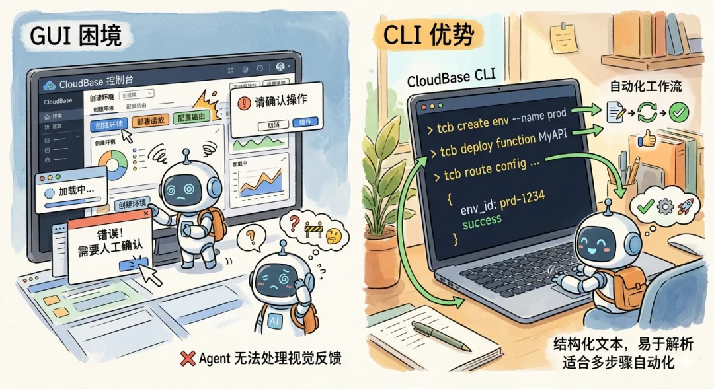
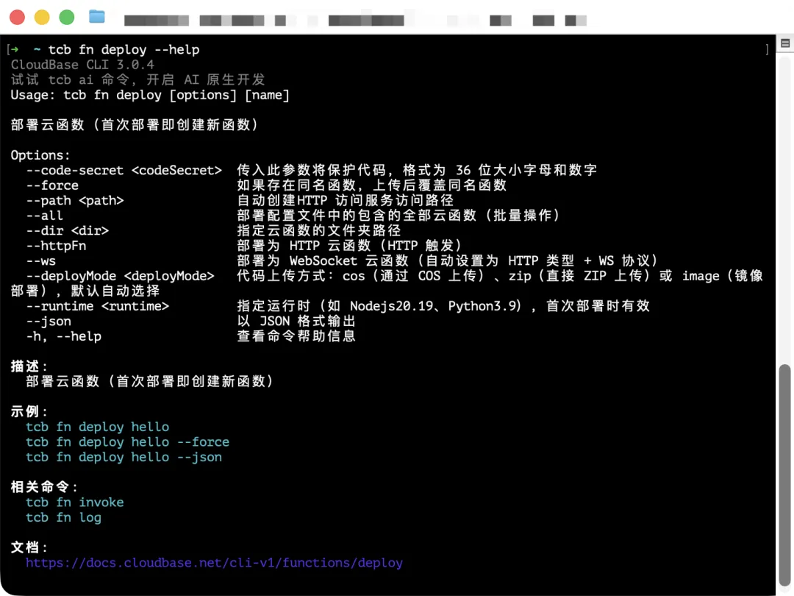
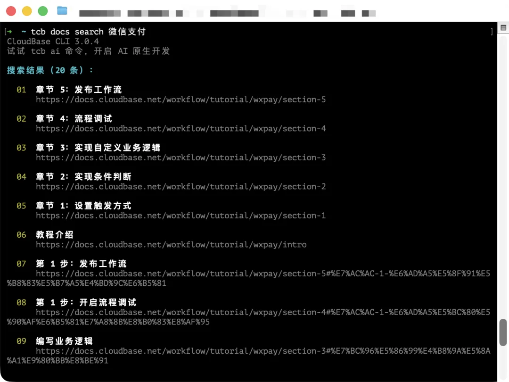

# 腾讯正式发布面向Agent设计的命令行工具：CloudBase CLI V3

> **公众号**: 腾讯云开发者  
> **发布时间**: 2026-04-14 08:45  

## 关注腾讯云开发者，一手技术干货提前解锁👇

我们很荣幸地宣布 CloudBase CLI V3 正式上线，这是一个面向 AI Agent 重新设计的 CloudBase 命令行工具。

这个版本新增了 15 个顶层命令模块，覆盖环境管理、数据库、用户权限、路由、域名、日志、AI 智能体等完整能力。现在，一个云项目从创建到上线的所有操作，都可以在终端内完成，不需要打开控制台。

V3 做了以下几个重要改变：

  * 补齐了过去缺失的大量命令，让几乎所有 CloudBase 操作都能在终端内完成；

  * 所有的命令都自带 `-h` 或 \--help 的自解释能力，可以让 AI Agent 能够自主发现并且读懂命令功能；

  * 新增 tcb docs 命令，解决了 CloudBase 文档过去对 Agent 读取不友好的问题；

  * 全面适配 \--json 输出模式，让所有命令的返回值变成机器可读的结构化数据。

# 01

## 为什么需要 CLI V3

我们观察到，越来越多的开发者在使用 Claude Code、Cursor、CodeBuddy 等 AI 工具来操作 CloudBase。创建环境、部署函数、配置路由，整个流程交给 Agent 来跑。

但传统的基于 GUI 的控制台，对 Agent 并不友好：Agent 无法点击按钮、无法读取页面上的视觉反馈、无法处理弹窗确认。每次碰到 CLI 覆盖不到的操作，Agent 就必须停下来，等人介入。

CLI 是一种更适合 Agent 的设计。命令行的输入输出都是结构化文本，Agent 可以直接解析和处理，不需要视觉理解；命令可以组合、可以脚本化，天然适合多步骤的自动化工作流。

CloudBase CLI V3 版本要解决的就是这个问题：完全面向 AI Agent 重新设计，让 Agent 能走完全程。

# 02

## 15 个新命令：从环境创建到项目上线的完整覆盖

V3 新增了 15 个顶层命令模块：

新增模块| 功能说明
---|---
`tcb env`| 环境全生命周期管理——创建、套餐变更、续费、销毁、资源用量查询
`tcb cors`| 安全域名管理（Web SDK 白名单）
`tcb domains`| 自定义域名绑定与 SSL 证书管理
`tcb routes`| HTTP 路由配置（替代 `tcb service`）
`tcb user`| 用户管理（创建、查询、修改、封禁、删除）
`tcb role`| 角色与权限策略管理（系统预设 + 自定义策略）
`tcb permission`| 资源级访问权限（数据库集合、存储、云函数）
`tcb agent`| AI 智能体管理（创建、部署、更新、删除）
`tcb ai`| AI CLI 统一入口，集成 Claude Code / CodeBuddy / Codex / aider 等
`tcb logs`| 统一日志检索（云函数、云托管、数据库、大模型，支持 CLS 语法）
`tcb api`| 腾讯云 API 通用透传——任何腾讯云产品的公开 API 都可以直接调用
`tcb docs`| CLI 内文档检索
`tcb app`| 应用一键部署（自动检测框架、安装依赖、构建、上传、绑定路由）
`tcb cloudrun`| 云托管管理（替代 `tcb fun`），支持灰度发布和流量管理
`tcb secrets`| 临时密钥管理
`tcb db`| NoSQL 原生命令、MySQL SQL 执行、备份回档、慢查询监控

同时对存量命令做了系统性整理：命令风格从冒号分隔（tcb functions:deploy）统一迁移为空格分隔（tcb fn deploy），更符合 CLI 惯例。详细迁移指南见文末 V3 迁移文档。

这意味着，V2 时代需要在"CLI + 控制台"之间来回切换的操作，现在全部可以在终端内完成。

# 03

## \--help：命令的自解释能力

CLI V3 的每一个命令和子命令都内置了 -h / \--help 参数，输出该命令的完整用法说明、参数列表和示例。

这意味着 Agent 在面对一个不熟悉的命令时，不需要查外部文档，直接 tcb <command> \--help 就能拿到结构化的用法说明：

  *

    tcb fn deploy --help

对于 Agent 来说，这是一套零成本的命令发现机制：先 tcb --help 看有哪些顶层命令，再 tcb <command> \--help 看具体用法，逐层探索，不需要任何外部知识。

# 04

## tcb docs：面向 Agent 的文档系统

Agent 面向 CloudBase 进行开发时，经常容易找不到正确的文档，通过搜索引擎的结果很容易过时或者不精确。

为了解决这个问题，我们在 CLI V3 版本新增了 tcb docs 命令。让 Agent 无需通过搜索引擎，可以直接在终端内查询 CloudBase 官方文档：

  *   *   *   *   *   *   *   *   *

    # 列出所有文档模块tcb docs list
    # 按路径读取指定文档tcb docs read 云函数tcb docs read https://docs.cloudbase.net/cloud-function/faq
    # 关键词全文搜索tcb docs search 微信支付

对于 Agent 来说，这形成了一个自主排查闭环：遇到不知道的知识 → tcb docs search 查文档 → 确认文档内容 → 执行后续操作。不需要人介入，不需要调用外部搜索。

PS：tcb docs 无需登录即可使用。

# 05

## \--json 输出模式：对机器可读的输出

V3 所有子命令统一支持 \--json 全局参数。加了这个参数，输出中没有进度条、没有颜色编码、没有任何人类可读的修饰——Agent 拿到的是纯粹的结构化数据。

成功时：

  *

    {"currentEnvId":"luke-personal-test-new-8d0d90f5f"}

失败时：

  *   *   *   *   *   *   *

    {"error":{"code":"FUNCTION_NOT_FOUND","message":"函数 ai-reply 不存在","exit_code":4}}

配合 V3 定义的六个结构化退出码，Agent 可以根据退出码直接走对应的响应路径：退出码| 含义| Agent 响应策略
---|---|---
`0`| 成功| 继续下一步
`1`| 通用错误| 检查命令逻辑，切换方案
`2`| 认证失败| 触发 `tcb login` 重新登录
`3`| 参数错误| 调用 `--help` 核查参数格式
`4`| 资源不存在| 验证资源名称是否正确
`5`| 云端 API 错误| 等待重试
`6`| 本地配置文件错误| 检查 `cloudbaserc.json`

失败不再是一个模糊的报错文本，而是一个确定性的信号。Agent 不需要靠语义理解来猜测下一步。

# 06

## 实战：Claude Code + CLI V3 搭建智能客服工单系统

我们用 Claude Code + CloudBase CLI V3 构建了一个智能客服工单系统，来验证 V3 的实际能力边界。

项目涵盖数据库、四个云函数、HTTP 路由、用户与权限管理、自定义域名和 SSL 证书全套部署。全程通过 tcb 命令完成，0 次控制台操作。

6.1 Step 1：创建并激活环境

  *   *

    tcb env create --alias"ticket-system-prod" --package baas_personal --yes --jsontcb env use luke-personal-test-new-8d0d90f5f --json

返回 { "currentEnvId": "luke-personal-test-new-8d0d90f5f" }。

设置全局默认环境后，后续所有命令无需重复传入 \--env-id。V3 的环境优先级为：全局配置 < cloudbaserc.json < 命令行 -e 参数，Agent 在需要切换时随时可以覆盖。

6.2 Step 2：初始化数据库

工单系统需要三个集合：tickets、ticket_history、user_roles。

  *   *   *   *   *   *

    tcb db nosql execute \  --command'[{"CommandType":"COMMAND","TableName":"tickets","Command": "{\"createIndexes\":\"tickets\",\"indexes\":[{\"key\": {\"assignee\":1,\"status\":1},\"name\":\"assignee_status_1\"},{\"key\": {\"customerId\":1,\"createdAt\":-1},\"name\":\"customerId_createdAt_1\"}]}"}]' \   --json

当命令返回退出码 1 时，Agent 自动切换命令格式重试——退出码体系在这里直接发挥了作用。

6.3 Step 3：部署云函数

项目包含四个云函数，三个事件函数，一个 HTTP 函数：

  *   *   *   *

    tcb fn deploy submit-ticket --jsontcb fn deploy assign-ticket --jsontcb fn deploy reply-ticket --jsontcb fn deploy ai-reply --dir . --yes --json

HTTP 函数（ai-reply）在 cloudbaserc.json 中声明 "type": "HTTP"。这里结合了 cloudbase-skills 中的 HTTP 云函数代码规范，Agent 直接对照规范生成鉴权逻辑和 HTTP 处理结构。

6.4 Step 4：配置安全规则与用户权限

  *   *   *   *   *   *   *   *   *   *   *   *   *

    # 数据库安全规则tcb permission set collection:tickets \  --level custom \  --rule '{"read":"doc.customerId == auth.uid","write":"false"}' \  --yes --json
    # 创建运营账号tcb user create ops-admin --password Secret123 --nickname "运营管理员" --jsontcb user list --username ops-admin --json
    # 分配管理员角色tcb role list --type system --jsontcb role update --id <administrator-role-id> --add-users "<uid>" --json

整个安全规则 + 用户创建 + 角色授权流程，Agent 通过五条命令完成闭环。

6.5 Step 5：配置 HTTP 路由

  *   *   *   *   *   *   *   *   *   *

    tcb routes add -e luke-personal-test-new-8d0d90f5f --data '{  "domain": "*",  "routes": [{      "path": "/api/ai-reply",      "upstreamResourceType": "WEB_SCF",       "upstreamResourceName": "ai-reply",      "enable": true,      "enableAuth": false    }]}'

tcb routes list --json 输出结构化路由表，Agent 可以直接核查配置是否符合预期。

6.6 Step 6：绑定自定义域名

  *   *   *   *   *

    tcb api ssl DescribeCertificates --jsontcb domains add luke.xxie.site --certid WZfHqLk2 --env-id luke-personal-test-new-8d0d90f5f --yestcb api dnspod CreateRecord \  --api-version 2021-03-23 \  --body '{"Domain":"xxie.site","SubDomain":"luke","RecordType":"CNAME","Value":"..."}'

输出：

查证书、绑域名、创建 CNAME 记录——三步操作在同一工作流上下文中完成。tcb api 将整个腾讯云生态收归统一入口，Agent 不需要在不同工具之间切换上下文。

6.7 Step 7：前端部署

  *

    cd frontend && tcb app deploy --yes

输出：

然后打开链接即可看到发布的 Web 应用：

6.8 总结：全程 CLI，0 次控制台

过去，AI 辅助开发停留在代码生成层面。AI 写完代码，部署和运维还是需要人打开控制台手动完成。

V3 的设计目标是让 tcb 成为 Agent 可以完整操控的接口。这些能力组合在一起——\--json 机器可读、结构化退出码、tcb api 统一入口、tcb docs 自主查阅文档——Agent 可以接管从环境创建到项目上线的完整链路。

下次让 AI Agent 做一个云上项目，试试完全不打开控制台，看它能走多远。

# 07

## 如何使用 V3 的 CLI 工具？

目前 V3 的 CLI 工具已发布至 npm，你可以通过 npm 安装使用。

  *   *

    npm install -g @cloudbase/clitcb login

相关文档

  * CloudBase CLI 文档：https://docs.cloudbase.net/cli-v1/install

  * V3 迁移指南：https://docs.cloudbase.net/cli-v1/migrate-v3

  * CloudBase MCP：https://docs.cloudbase.net/ai/cloudbase-ai-toolkit/

  * cloudbase-skills：https://github.com/TencentCloudBase/cloudbase-skills

## -End-

## 感谢你读到这里，不如关注一下？ 👇

你对本文内容有哪些看法？同意、反对、困惑的地方是？欢迎留言，我们将邀请作者针对性回复你的评论，欢迎评论留言补充。我们将选取1则优质的评论，送出腾讯云定制文件袋套装1个（见下图）。4月21日中午12点开奖。

扫码领取腾讯云开发者专属服务器代金券！

