# 3个月，200家客户，和大家聊聊企业AI应用（AI Agent）的落地实践

> **公众号**: 阿里云开发者  
> **发布时间**: 2025-07-28 08:30  

## 开篇

4月初，我向大家展示了我们在基于MCP范式构建新一代AI应用架构的整体思路，这段时间我们团队也交流了很多客户，也和很多内部团队的同学有过交流，大家也都认可整体的思路，但核心还是围绕着网关在构建，站在AI应用的角度，缺失了运行时部分，也就是AI Agent的构建方案。

经过3个月的产品打磨和众多客户真实需求及场景的了解，我们发现，客户希望自己的业务被AI赋能的诉求是强烈的，但是在构建企业级AI应用，或者使用AI赋能现有业务方面，大多数客户是不知道从哪里下手的，都是只有一些片面的知识点，尤其是对现存业务，Agent，LLM，MCP服务，AI可观测这几者之间如何有机协作是模糊的。

所以我基于当前我们的产品能力、产品解决方案、和客户共建汲取的经验、客户的实际使用情况等，帮大家理清楚完整的企业级AI应用构建的最佳实践。

## 什么是AI应用

我们先来尝试定义什么是AI应用。

### 从“工具”到“智能伙伴”的进化

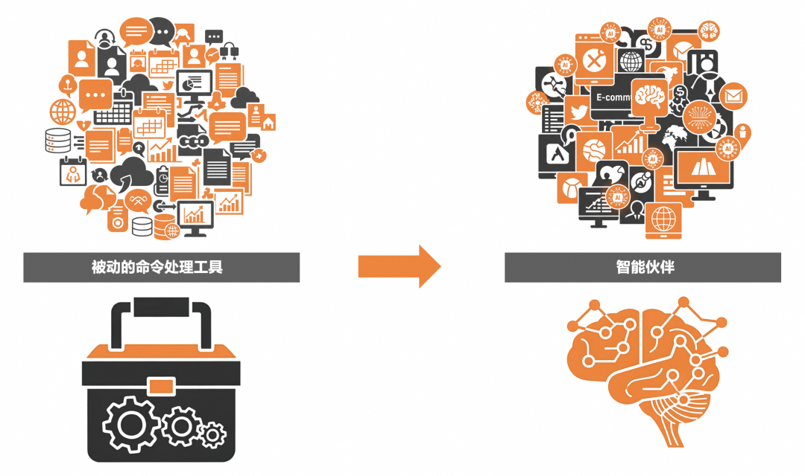对于应用而言，我们早已不陌生，从桌面软件到手机App，它们是帮助我们处理特定任务的工具。然而，当我们谈论“AI应用”时，我们所指的已不再是简单的工具，而是一种全新的、能够模拟甚至超越人类部分认知能力的智能实体。
传统的软件应用遵循着一套预设的、固定的逻辑。它们是被动的执行者，严格按照人类编写的规则运行。你点击“保存”，它就执行保存操作；你输入公式，它就计算出结果。其本质是一个高效的指令处理器。
而企业级的AI应用，则标志着一场根本性的范式转移。它不再仅仅被动地“听令”，而是能够主动地“理解”、“思考”和“行动”。想象一下：

  * 你不再需要手动在CRM系统中翻找客户资料、分析销售数据、然后撰写跟进邮件。你只需对AI销售助手说：“帮我总结一下A客户上季度的所有互动，并起草一封关于我们新产品线的跟进邮件。”

  * 财务总监不再需要整合来自多个部门的Excel报表来预测现金流。他可以向AI财务分析师提问：“根据当前的销售趋势和供应链风险，预测公司未来六个月的现金流状况，并高亮潜在的风险点。”

在这些场景中，AI应用扮演的不再是冰冷的工具，而更像一个不知疲倦、知识渊博、反应迅速的“智能伙伴”或“数字员工”。这便是AI应用的魅力所在，也是其核心价值——将人类从重复性、流程化的工作中解放出来，聚焦于更高层次的创造、决策和战略规划。
那么，是什么赋予了AI应用如此强大的“智能”？

### AI Agent + LLM的双引擎模式

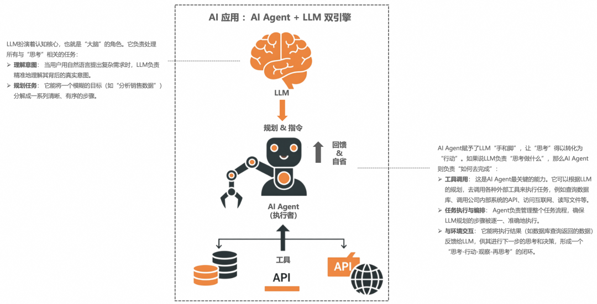在AI应用中，LLM扮演着认知核心，也就是“大脑”的角色。它负责处理所有与“思考”相关的任务：

  * 理解意图：当用户用自然语言提出复杂需求时，LLM负责精准地理解其背后的真实意图。

  * 规划任务：它能将一个模糊的目标（如“分析销售数据”）分解成一系列清晰、有序的步骤。

简而言之，LLM为AI应用提供了“智商”。然而，仅有“思考”能力是远远不够的。一个只能在“脑中”规划万千大事却无法付诸行动的大脑，在商业世界中价值有限。所以要让智慧落地，就需要AI Agent这个“执行官”的登场。
AI Agent赋予了LLM“手和脚”，让“思考”得以转化为“行动”。如果说LLM负责“思考做什么”，那么AI Agent则负责“如何去完成”。它的核心职责包括：

  * 工具调用：这是AI Agent最关键的能力。它可以根据LLM的规划，去调用各种外部工具来执行任务，例如查询数据库、调用公司内部系统的API、访问互联网、读写文件等。

  * 任务执行与编排：Agent负责管理整个任务流程，确保LLM规划的步骤被逐一、准确地执行。

  * 与环境交互：它能将执行结果（如数据库查询返回的数据）反馈给LLM，供其进行下一步的思考和决策，形成一个“思考-行动-观察-再思考”的闭环。

AI Agent + LLM的组合，创造了一个既能深思熟虑又能高效行动的完整体。LLM的智慧通过Agent的执行力在真实世界中产生了切实的业务价值。这正是现代AI应用区别于过去所有软件的根本所在。

### 企业能力的核心 - MCP服务

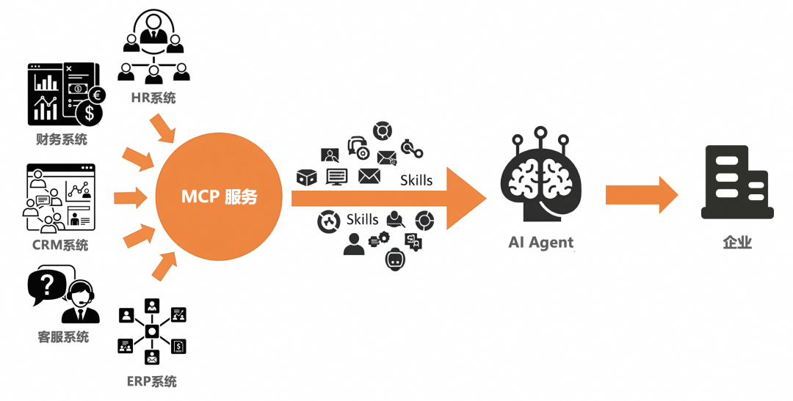AI Agent的强大，并不在于其自身，而在于它能调动多少“资源”和“能力”。一个无法连接任何真实业务系统的Agent，就像一个被关在“信息茧房”里的天才，空有智慧却无处施展。因此，为了让AI Agent能够真正在企业环境中大展拳脚，我们需要让其学习和成长。
我们构建Agent，就好比我们玩角色扮演游戏，比如在博得之门里创建的角色，他/她有种族、职业、背景、属性点、技能和初始能力。但只有这些基础的初始能力是无法立足在充满危险的被遗忘的国度的。所以角色需要成长和学习新的技能，而同样是一名初始法师，随着学习的技能不同，会成长为不同能力的法师，比如学习了严酷收割、亡灵仆役等技能的死灵法师。学习了造水术、蛛网术的咒术法师。学习了火球术、闪电束的元素法师等等。
在大多数的角色扮演游戏中，都有着完善的技能系统。在今年年初，若想要给AI Agent构建技能系统和体系是有着很高成本的，AI Agent要学习一项新技能（即使用一个新工具），开发者可能需要做两件成本很高的事：

  * 改造该技能或工具背后服务的代码，做API协议适配、定制等集成方案。

  * 相当于我要教你一个技能，先得改造这个技能，改造为你能听懂的方式。

  * 改造AI Agent自己的代码。

  * 相当于改造你的基因，要么是你与生俱来就会这个技能，要么是你知道如何学习这个技能。

然而一家客户的沉淀短则几年，长则十几年，内部已经有茫茫多的系统、服务、接口，也就是这些技能都是现成的，且都是上古秘法，没法改，也没人会改。那么就得改AI Agent，带来的后果就是几乎没有复用性、没有扩展性、开发成本非常高。
所以MCP的出现，很好的解决了构建AI Agent技能系统的痛点问题：

  * 规范化了多者的协同关系：MCP协议规范约束了用户、AI Agent、LLM、后端服务四者之间的系统关系。

  * AI Agent和后端服务快速对接：无需后端服务改造，也无需AI Agent改造，无需了解和解析后端服务接口的返回格式。

所以，MCP服务是企业AI应用的基石。它将企业零散的IT资产和服务，转化为AI可以理解和调用的标准化能力，从而为上层的AI Agent源源不断地输送技能。

### 构建AI应用的两种路径：全新开发 vs. 存量改造

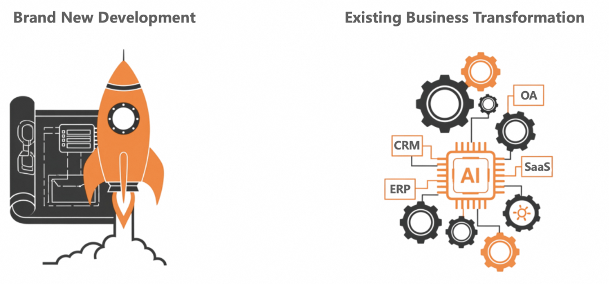在理解了AI应用的内在构成后，我们面临一个实际问题：如何将它构建出来？从逻辑上看，企业构建AI应用的路径主要有两条：
1\. 全新开发：开创业务新大陆
这指的是从零开始，为一个全新的业务场景或颠覆性的产品构想，原生设计和开发AI应用。这种模式不受历史技术债务的束缚，可以采用最先进的架构，最大化地发挥AI Agent的能力，是实现颠覆式创新的最佳路径。例如，打造一个面向金融行业的AI研究分析师，或者开发一个企业内部的“超级知识入口”。
2\. 改造现有业务：为核心引擎注入AI动力
这是绝大多数企业会选择的路径。它指的是在企业现有的、成熟的核心业务系统（如ERP、CRM、SCM）中，嵌入AI Agent的能力，对其进行“智能化升级”。这种方式能直接作用于核心业务流程，价值释放路径更短、更明确。

  * 在CRM中嵌入AI，它可以自动分析客户，并推荐下一步跟进动作。

  * 在ERP中嵌入AI，它可以基于实时数据进行需求预测，动态优化库存水平。

  * 在OA中嵌入AI，它可以辅助员工起草公文、智能填单、优化审批流程。

在我们和众多客户的交流中来看，改造现有业务，本质上是将业务入口从请求到传统服务改为请求到AI Agent。

### AI 应用基本架构

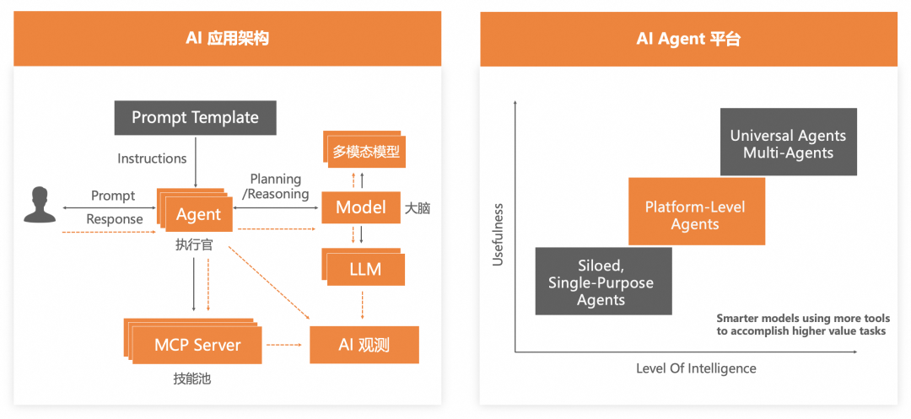一个真正的企业级AI应用，是一个由“LLM大脑”提供智慧，由“AI Agent执行官”负责行动的智能系统。它的能力边界，取决于企业为其打造的MCP服务有多强大，数量有多少。而它的落地形式，既可以是开疆拓土的全新创造，也可以是为现有核心业务的深度赋能。理解这一全景，是开启企业AI转型之旅的第一步。
如我上文所说，大多数客户的诉求都是AI赋能现有业务，也就是将业务入口从请求到传统服务改为请求到AI Agent，现存的传统服务都可以转为为AI Agent赋能的技能库。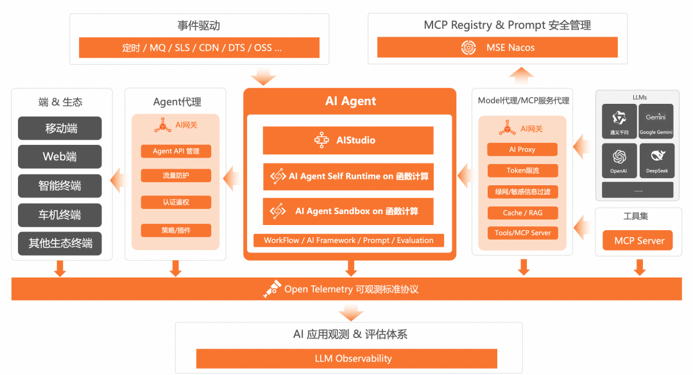所以将AI应用架构拆开来看，整体架构及调用链路如下图所示：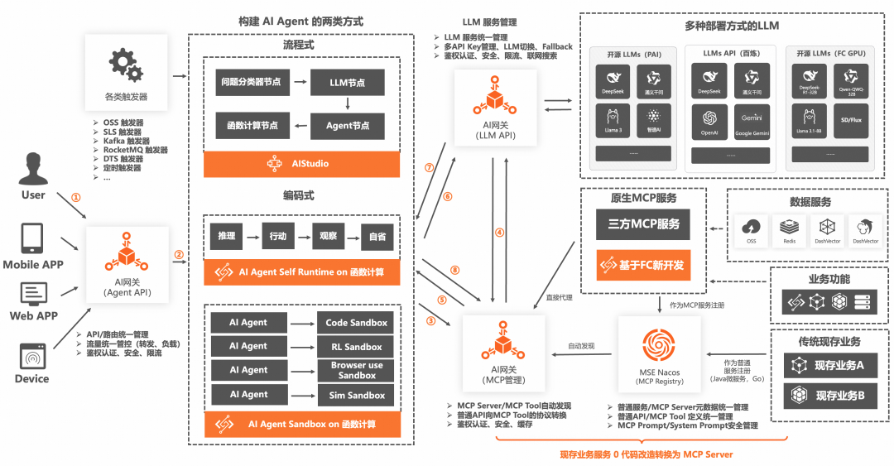

  * 一个AI网关三种角色，具备统一的管控底座，同时又实现各角色的协同调度。

  * MSE Nacos 发挥注册中心优势，增加MCP Registry能力，实现普通服务和MCP服务的统一管理，结合网关实现现存业务0改造转换为MCP服务。

  * AIStudio为阿里云自研的低代码构建AI Agent的产品，解决开源Dify高可用，稳定性，性能问题，使AI Agent的运行引擎更稳定。

  * 函数计算FC具备丰富的触发器和各语言运行环境，基于Serverless计算自身的特性，完美适配AI Agent自身运行环境和AI Agent Sandbox的基础组件。

图中的8步核心调用链路解析：

  * 第一步：用户向AI应用发起请求，请求流量进入AI网关，使用Agent API代理AI Agent。

  * 第二步：AI网关侧维护管理了不同类型的AI Agent的API或路由规则，将用户请求转发至对应的AI Agent。

  * 第三步：AI Agent无论以哪种方式实现，只要它需要使用工具解决用户的问题，便向AI网关管理的MCP服务请求获取可用的MCP服务及工具的信息。

  * 第四步（可选，目前需要用户自行实现）：因为AI网关处可能维护了很多MCP信息，可以借助LLM缩小MCP范围，减少Token消耗，所以可以通过AI网关代理的小参数LLM，做意图识别，进一步缩小MCP服务范围。

  * 第五步：AI网关将确定好范围的MCP服务及工具的信息List返回给AI Agent。

  * 第六步：AI Agent将用户的请求信息及从AI网关拿到的所有MCP信息再通过AI网关发送给LLM。

  * 第七步：经过LLM推理后，返回解决问题的一个或多个MCP服务和工具的信息。

  * 第八步：AI Agent拿到确定的MCP服务和工具的信息后通过AI网关对该MCP工具做请求。

实际生产中 ③ - ⑧ 步会多次循环交互。所以从组成结构来看，AI应用的核心有四点，AI Agent、LLM、MCP服务、AI观测体系。并且核心中的核心是AI Agent，因为用户、LLM、MCP服务都是靠AI Agent连接的，AI观测体系也是会以Agent为枢纽。本文后续也是持续围绕这四个核心的要素，和大家探讨如何实践落地上述架构。

## AI Agent 概述

同样，我们先来定义什么是AI Agent，所谓一千個人眼中就有一千個哈姆雷特，大家对AI Agent的认知都不一样。Agent可大可小，比如一套复杂的系统可以认为是一个Agent，一个流程也可以认为是一个Agent，甚至一行代码也可以认为是一个Agent。那么AI Agent到底有没有定义呢？
其实AI御三家（Google，Anthropic，OpenAI）在AI Agent白皮书里都有定义，并且都有共性，所谓三个臭皮匠顶一个诸葛亮，我们可以从三个白皮书中抽象出AI Agent的定义。

> Google AI Agent 白皮书
>
> Anthropic AI Agent 白皮书
>
> OpenAI AI Agent 白皮书
>
> 可在https://www.youtube.com/redirect上搜索

### 什么是AI Agent

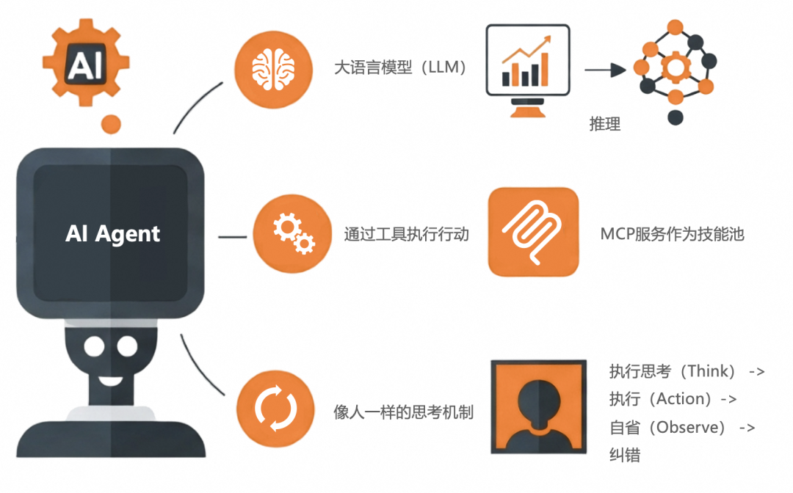一个AI Agent其实是一个系统，包括以下三个核心内容：

  * 使用大语言模型（LLM）来推理。

  * 可以通过工具执行各类行动。

  * 执行思考（Think） -> 执行（Action）-> 自省（Observe） -> 纠错（既重复思考到自省的持续改进）这样一个循环。

AI Agent和Chatbot的最大区别是前者可以解决需要通过不同领域的知识和能力协同才可以解决的问题，通俗的说就是复合的、复杂的、多步骤的问题。
来看看Google AI Agent白皮书对AI Agent的定义：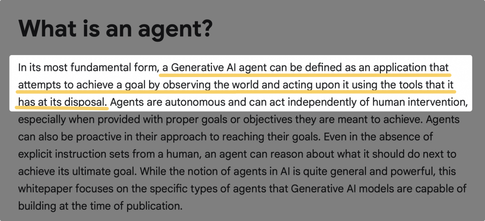来看看Anthropic AI Agent白皮书对AI Agent的定义：

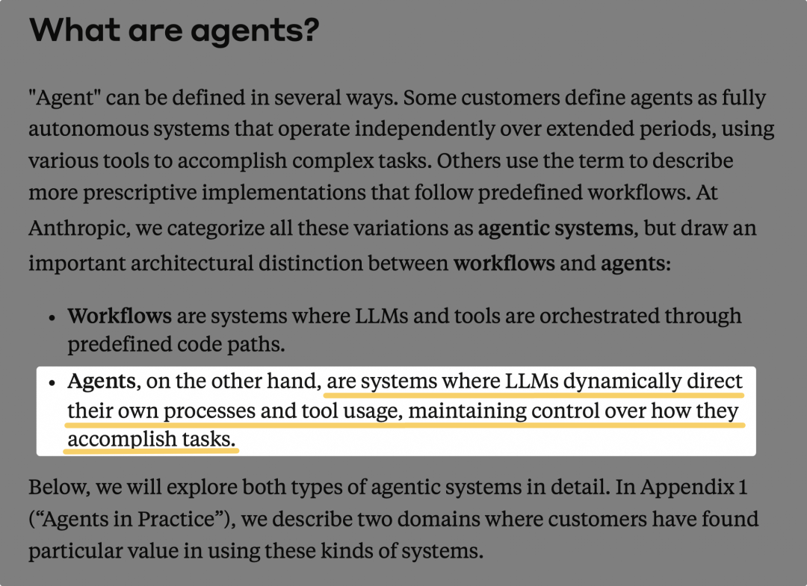来看看OpenAI AI Agent白皮书对AI Agent的定义：

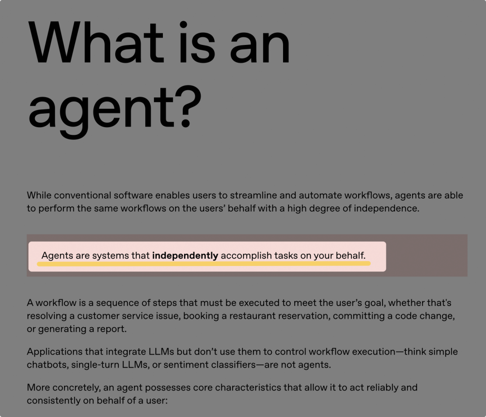所以AI Agent断然不可能是几行代码写的程序，而是一个相对复杂的系统。

### AI Agent 核心组件

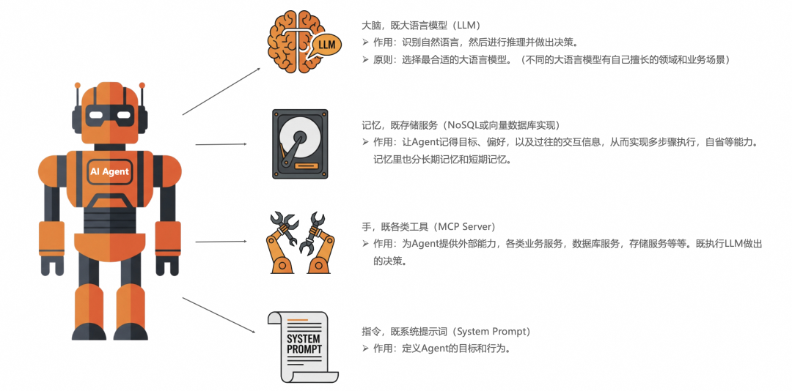一个AI Agent的构成有4个核心组件：

  * 大脑，即大语言模型（LLM）

  * 作用：识别自然语言，然后进行推理并做出决策。
  * 原则：选择最合适的大语言模型。（不同的大语言模型有自己擅长的领域和业务场景）

  * 手，即各类工具（MCP Server）

  * 作用：为Agent提供外部能力，各类业务服务，数据库服务，存储服务等等。既执行LLM做出的决策。

  * 指令，即系统提示词（System Prompt）

  * 作用：定义Agent的目标和行为。

  * 记忆，即存储服务（NoSQL或向量数据库实现）

  * 作用：让Agent记得目标、偏好，以及过往的交互信息，从而实现多步骤执行，自省等能力。记忆里也分长期记忆和短期记忆。

Google定义的AI Agent架构：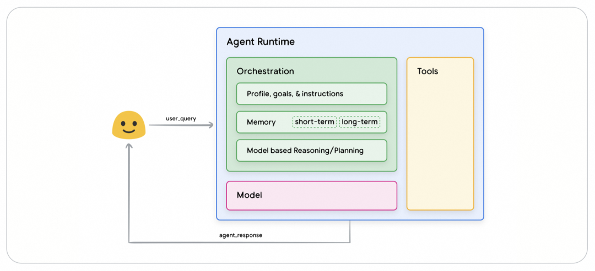Anthropic定义的AI Agent架构：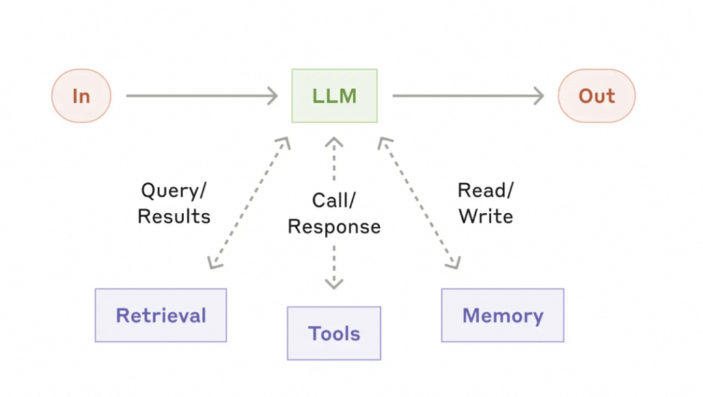OpenAI定义的AI Agent的核心组件：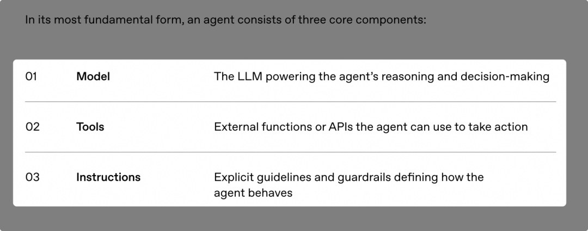

### AI Agent 推理模式

目前AI Agent的推理模式大体分为三类：

  * ReAct（Reason Act）：该模式是目前典型的，使用比较多的模式。既推理->行动->自省的循环。

  * 链路思考（Chain of Thought）：这种模式类似流程，既一步接一步的执行逻辑。

  * 树状思考（Tree of Thought）：更为复杂的推理模式，涉及到多计划、多任务的推理。同时探索不同的可能性和结果。

ReAct 模式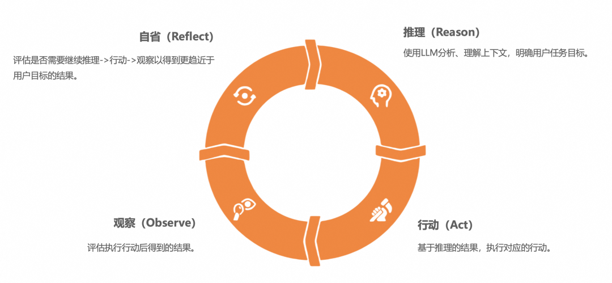ReAct是目前被验证最通用的AI Agent模式。需要具备以下四个要素：

  * 推理（Reason）：分析、理解上下文，明确用户任务目标。

  * 行动（Act）：基于推理的结果，执行对应的行动。

  * 观察（Observe）：评估执行行动后得到的结果。

  * 自省（Reflect）：评估是否需要继续推理->行动->观察以得到更趋近于用户目标的结果。

Google对ReAct的定义：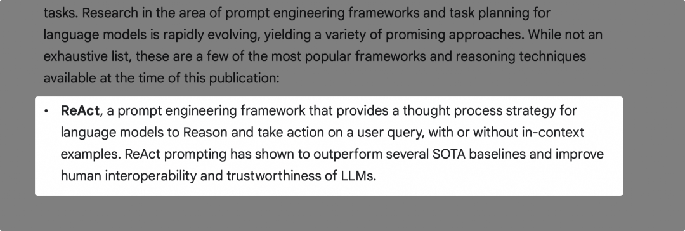AI Agent 通用推理模式
ReAct模式是目前从效果、通用性方面来说比较好的模式，基于该模式，我们可以抽象出AI Agent的通用模式，或者说构建AI Agent能力需要具备的核心要素。也许不同的领域，不同的业务场景可能需要基于ReAct模式做微调，但无论如何，都需要考虑AI Agent通用模式里的6大核心要素。

  * 提示词链路（Prompt Chaining）：本质上是Agent内部的工作流。

  * 路由（Routing）：问题分类，针对不同分类，有不同的后续执行链路。

  * 使用工具（Tool Use）：当前这部分的实现基本都会使用MCP范式。

  * 评估循环（Evaluator Loops）：做自我修正，甚至会使用不同的LLM协助做修正。

  * 协调器（Orchestrator）：可选，适用于一个AI Agent管理其他AI Agent的场景。

  * 自主循环（Autonomous Loops）：可选，适用于让AI Agent自主决定一切的场景。

提示词链路（Prompt Chaining）
AI Agent里的提示词链路其实本质上就是Agent内部的工作流，它将一个任务分解为一系列步骤，上一个任务的输出是下一个任务的输入，每个任务可能都会和LLM进行交互。
这种方式比较适合可以将任务清晰地分解为固定子任务的场景。比如市场营销，广告活动，CRM/ERP中的问数流程等等。
Anthropic AI Agent白皮书中对Prompt Chaining的定义：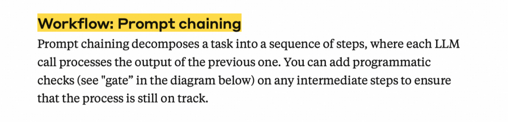

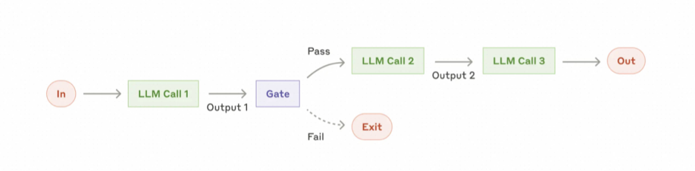Google AI Agent白皮书中有编排层的概念：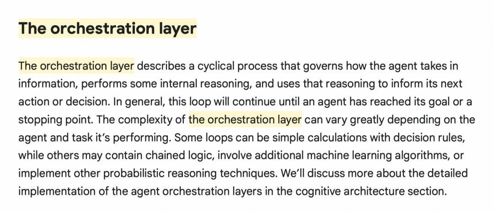路由（Routing）
AI Agent里路由的作用是对输入进行分类，并将其导向一个专门的后续任务。这种模式可以使关注点分离，并构建更专业的提示词。
路由非常适用于那些具有明显不同类别、可以更好地分开处理的复杂任务（无论是通过LLM还是更传统的分类模型/算法）。最常见的场景就是智能客服，将不同类型的客户服务查询（一般问题、退款请求、技术支持）引导到不同的下游流程、提示和工具。
Anthropic AI Agent白皮书中对Routing的定义：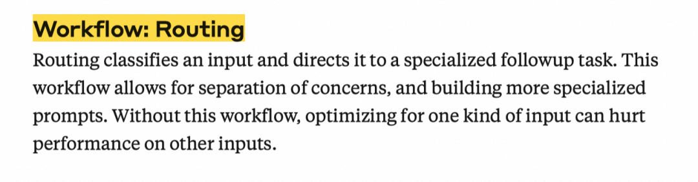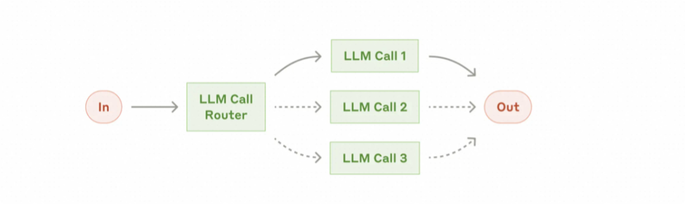使用工具（Tool Use）
工具是AI Agent与外部系统（例如API）交互的关键。尽管基础模型在文本和图像生成方面表现出色，但目前它们依然无法与外部世界直接交互，或者说快速、低成本的交互（LLM Function Calling受限LLM厂商的迭代）。工具弥补了这一差距，使Agent能够访问外部数据和服务，并执行超越底层模型自身能力的各种操作。而MCP的出现使得这个环节的能力、便利性、扩展性等有了质的提升。
Anthropic在增强型LLM的构建块中强调了工具的使用 以及工具开发的最佳实践：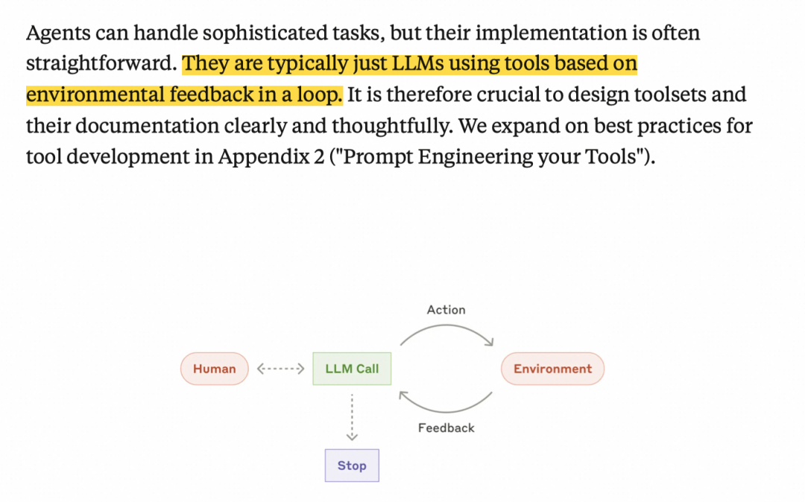OpenAI对工具做了专门的定义：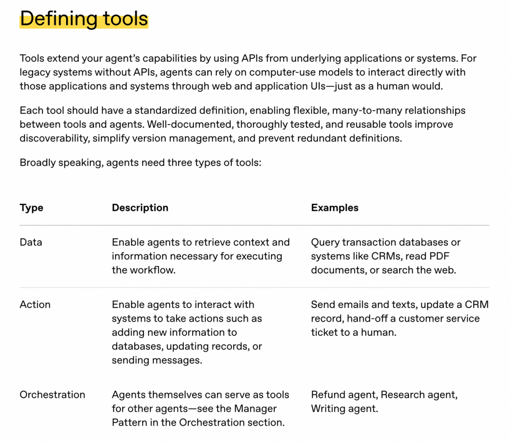Google详细介绍了工具（Extensions, Functions, Data Stores）及其在Agent架构中的作用：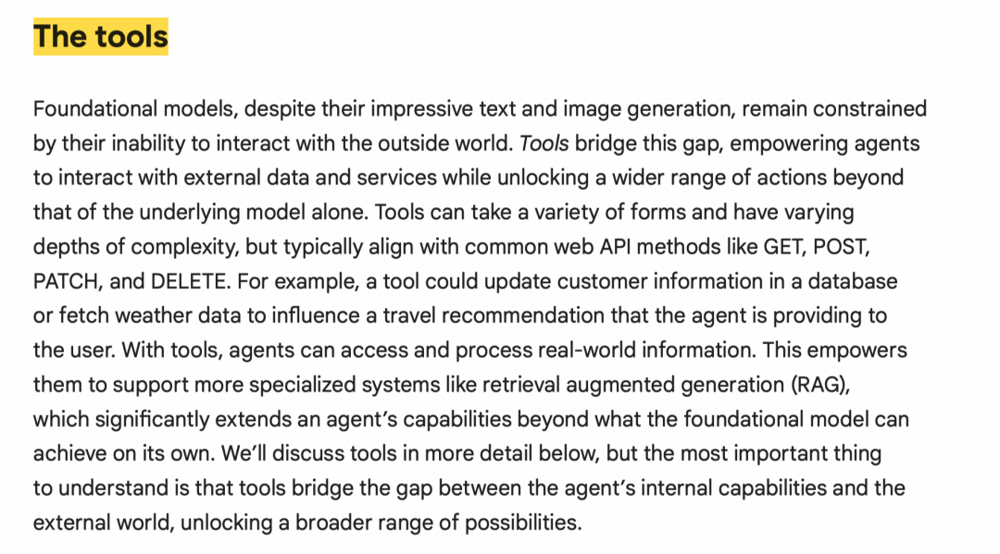

评估循环（Evaluator Loops）
评估循环指的是一个LLM调用生成响应，而另一个LLM在循环中提供评估和反馈。这种循环可以使AI Agent进行自我修正，甚至可能使用不同的LLM来协助修正。这种方式适用于具有明确评估标准，并且迭代改进能够带来可衡量价值的场景。
在翻译场景会常用到这种评估的模式，因为用来翻译的主LLM最初可能无法捕捉到细微差别，但评估LLM可以辅助提供评估信息，然后翻译LLM做修正。还有联网搜索或深度研究这类需要多轮搜索和分析的场景，也会用到这种评估模式，其中的评估LLM决定是否需要进一步搜索等。
Anthropic AI Agent白皮书中专门介绍了评估循环这个模式：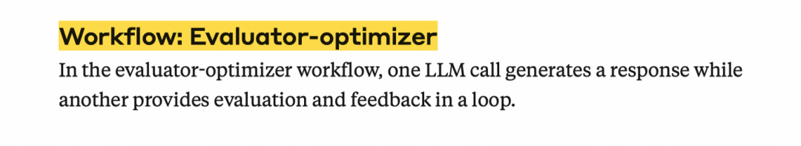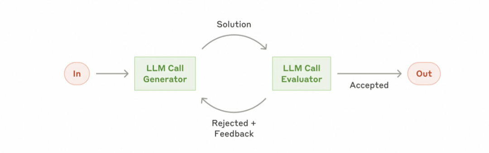OpenAI AI Agent白皮书里里虽然没有明确说明评估循环这个模式，但是提出了护栏（Guardrails）概念，这部分也体现了类似的思想，例如通过批评节点评估Agent输出是否符合预期并进行重试。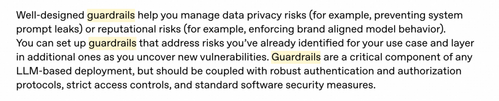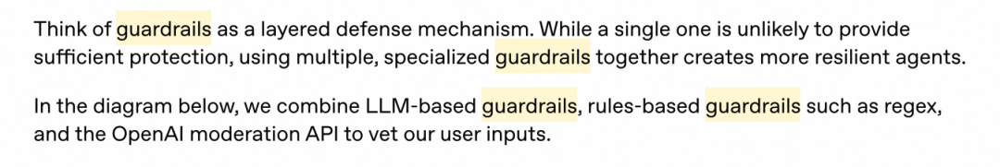

协调器（Orchestrator）
AI Agent协调器的作用是一个负责协调的LLM接收复杂任务，将其委托给工作器LLM，并综合它们的结果。这适用于一个AI Agent管理其他AI Agent的场景。
这个场景和并行执行任务在拓扑结构上有点类似，但也有区别，这种模式更加灵活，因为子任务不是预先定义的，而是由协调器根据特定输入确定的。这种模式适合无法预测所需子任务数量的复杂任务。
Anthropic AI Agent白皮书中详细介绍了“协调器”：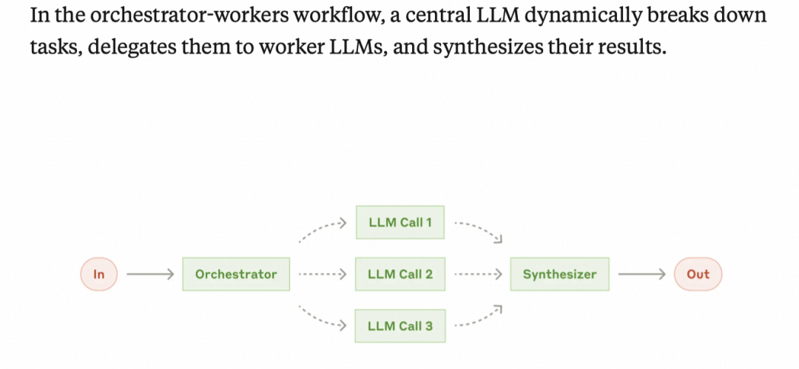OpenAI的“管理器模式”也描述了类似的架构，其中一个中心“管理器”Agent通过工具调用协调多个专业Agent：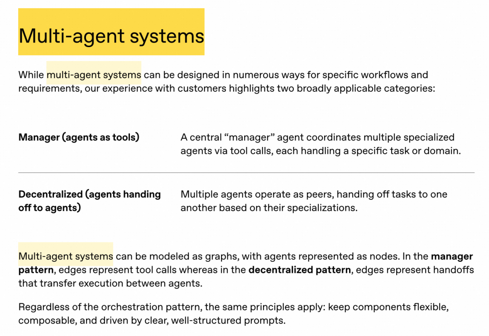

自主循环（Autonomous Loops）
AI Agent系统是由LLM动态指导其行为和工具使用，保持对如何完成任务的控制的系统。自主循环指的是AI Agent初始接受人类的指令，明确任务，一旦任务明确，Agent会独立规划和执行行动，直到返回人类最终的答案。
这种模式用于难以或不可能预测所需步骤数量，且无法硬编码固定路径的开放式问题。比较典型的就是Chat场景里的深度研究（DeepSearch）和AI编码场景。以及像Manus这种Planning的方式也是类似自主循环的模式。
但这种AI Agent的自主性有两个最大的问题：

  * 返回结果的不确定性。一自主起来就容易发散。

  * 对整体环境的影响。一自主起来产生的数据，占用的计算资源等容易对整体环境产生影响。

解决这两个问题，业界也已经有较为成熟的方案，用一句话来总结：使用资源/数据隔离的沙箱环境来运行/训练/强化学习AI Agent的特定能力。
Anthropic AI Agent白皮书里讨论了自主Agent的适用性和风险：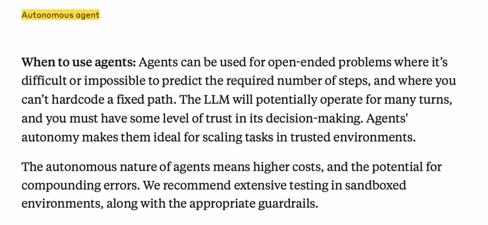

### AI Agent 安全与防护

最后我们来看在任何时代，任何领域都非常核心的安全与防护，在AI时代同样不例外。大体可以抽象为四个方面：

  * 限制Agent执行行动的次数，也就是限制迭代循环测试：AI Agent在执行任务时，通常会以循环的形式进行推理、行动和观察，直到达到目标或满足某个停止条件。为了防止AI Agent陷入无限循环、耗费过多资源或产生累积错误，需要对其迭代次数和行动设置限制。

  * 在关键步骤需要人工审核：人工审核是一种重要的安全防护措施，它在Agent的决策或执行流程中的关键点引入人类干预，以验证Agent的判断、纠正潜在错误或处理高风险操作。

  * 输入输出内容审核：对Agent的输入和输出内容进行严格审核，是防止不当、不安全或不相关信息进入系统或被生成的核心防护。这包括检测有害内容、个人身份信息（PII）泄露、离题查询以及试图绕过Agent指令的“越狱”攻击等。

  * 沙箱运行环境：沙箱环境是一种隔离的运行环境，其背后的本质是资源隔离、数据隔离，从而实现多租租户隔离。在资源隔离、数据隔离的前提下更有利于做AI Agent的自身的运行环境，或者训练/强化学习。

## AI Agent的构建模式与AI Agent类型

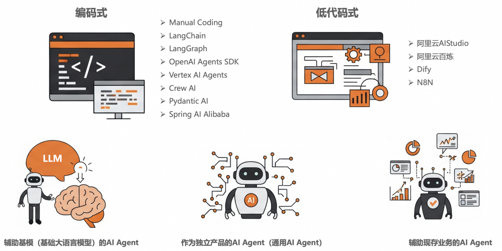目前构建AI Agent的方式大体可分为两类：

  * 编码构建类：编码类构建AI Agent又可以分为两类。

  * 基于上文中AI Agent的核心要素和通用推理模式纯手撸代码实现。

  * 基于市面上主流的AI Agent综合框架快速实现。但这些综合框架不一定能实现上述所有的推理模式，所以还是需要基于客户的真实业务场景，额外自行编码做辅助优化。比如以下这些框架：

  * LangChain

  * LangGraph

  * OpenAI Agents SDK

  * Vertex AI Agents

  * Crew AI

  * Pydantic AI

  * Spring AI Alibaba

  * 低代码构建类：这一类就是通过可视化的流程编辑器，通过拖拖拽拽的方式构建AI Agent。比如阿里云AIStudio，阿里云百炼，字节扣子，Dify，N8N等。

基于不同的客户类型和业务场景，AI Agent的类型又可以大体分为三类：

  * 辅助基模（基础大语言模型）的AI Agent：当今基模的联网搜索、深度研究（DeepSearch）、编码能力都是需要AI Agent辅助的，这类AI Agent并不直接对用户透出。我们的实践中像Qwen3、智谱GLM等都属于这一类，通常都是做基模的公司会涉及到，并且以编码方式构建为主。

  * 作为独立产品的AI Agent（通用AI Agent）：这类AI Agent大都还是基于主流的Chat模式，帮用户解答问题，规划任务等。我们的实践中像OpenManus、JManus、MiniMax Agent、昆仑万维等都属于这一类，通常都是做基模或者专门做通用AI Agent产品的公司会涉及到，并且以编码方式构建为主。

  * 辅助现存业务的AI Agent：这类AI Agent就是目前广大互联网客户、泛企业客户期望构建或正在构建中的AI Agent，和客户自身的业务耦合比较紧密。我们的实践中像知乎、运满满、义乌小百货等都属于这一类，并且以低代码构建方式为主。

### 总结

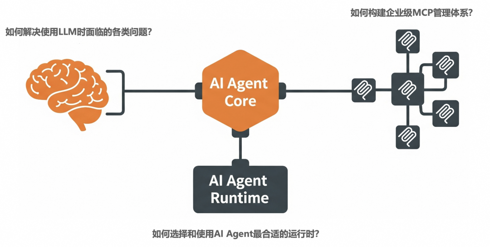至此，我们基本上了解了AI应用的定义，AI应用的核心是什么。AI Agent的定义和推理模式。在如何构建AI Agent方面，本文不会详细聚焦在如何通过编码的方式实现上述的六类推理模式，因为每个客户使用的开发语言不同、每个构建AI Agent的综合框架的使用方式不同。更重要的是这些推理模式的实现往往和客户的业务场景，客户的运维研发体系是强相关的。
另外，现如今，LLM的Coding能力都是不弱的，Vibe Coding的概念目前也是如火如荼，开发程序的门槛几乎已经触底。所以现在最简单的事反而就是写代码，但最难的事是让这坨代码能真真正正的承载业务并运行在线上。
所以本文核心聚焦在当客户想要实现某一类型的AI Agent时，该如何选择和使用AI Agent最合适的运行时，这一类的AI Agent都应该注意哪些核心问题，构建AI Agent的核心组件时该如何将上下游产品有机的结合起来配合使用。

## AI Agent 运行时

如上文所述，我们正步入一个由AI Agent驱动的全新AI时代。AI Agent 运行时已不再是简单的代码执行环境，它演变成了一个动态、有状态且可能是事件驱动的复杂系统。这个运行时负责管理AI Agent的完整生命周期，包括其状态维护、与外部工具的交互以及多智能体间的协作行为。OpenAI将Agent重新定义为“模型 + 指令 + 工具 + 运行时”的组合，这标志着AI Agent运行时本身已从附属组件跃升为不可或缺的核心基石。

### AI Agent 运行时的挑战点

AI Agent的计算负载特征与传统应用截然不同。传统的Web服务通常具有可预测的请求-响应模式，而AI Agent的运行推理模式如上文所述，是有多种多样的，并非一次简单的模型推理，而是一个复杂的、多轮次的循环工作流，涵盖了持续的规划、工具调用、自省和迭代式推理。它不是一次性的问答，而是一个为达成目标而不断“思考”和“行动”的动态过程。比如ReAct模式在每一步都需要LLM进行推理以决定下一步是思考还是行动，而CoT/ToT为了做出更优决策，会模拟多条未来的推理路径，这都极大地增加了并行的推理调用需求。正因为这些特性，AI Agent的一次运行可能是一种“脉冲式”或“突发性”的资源消耗模式——即在极短时间内进行高强度计算，随后进入长时间的闲置状态。这种动态推理过程虽然功能强大，但也带来了显著的延迟波动和高昂的基础设施成本挑战。
另外AI Agent正从理论走向实践，预示着人机交互和任务自动化的根本性变革。然而，赋予这些Agent强大能力的自主性、学习能力和工具使用特性的同时，也引入了前所未有的安全风险。比如提示注入（Prompt Injection），工具滥用与不受控的系统命令，权限泄露，上下文泄露与级联故障等。所以运行AI Agent的环境需要是一个隔离的、访问控制与系统调用拦截的、可严格管理资源的、具备可观测与审计的环境，也就是沙箱环境（Sandbox）。
所以我们尝试通过函数计算FC这种FaaS形态的Serverless计算产品帮客户解决AI Agent运行的构建效率、资源成本、Sandbox三大挑战。

### 函数计算FC 作为 AI Agent 运行时的优势

AI Agent的独特运行模式和对计算资源的需求在函数计算FC这种FaaS计算资源上找到相对完美的解决方案。这种对应关系可以通过下表清晰地展示出来：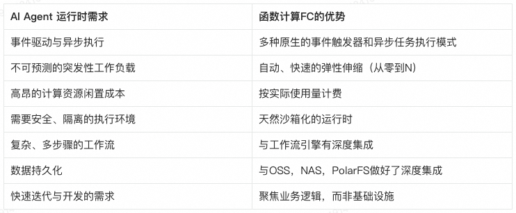这里先来整体看一下函数计算FC作为AI Agent运行时的方案拓扑图：

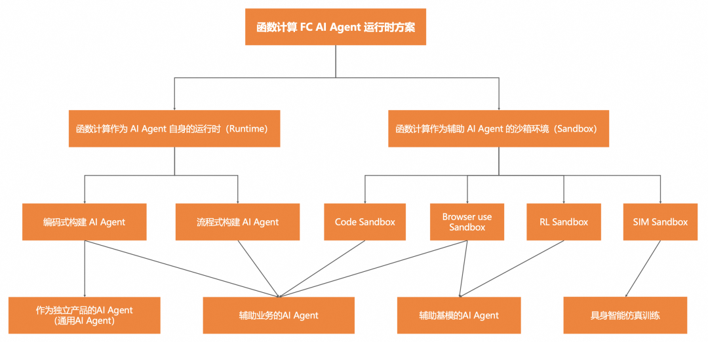

函数计算FC 作为 AI Agent 自身的运行时（Runtime）

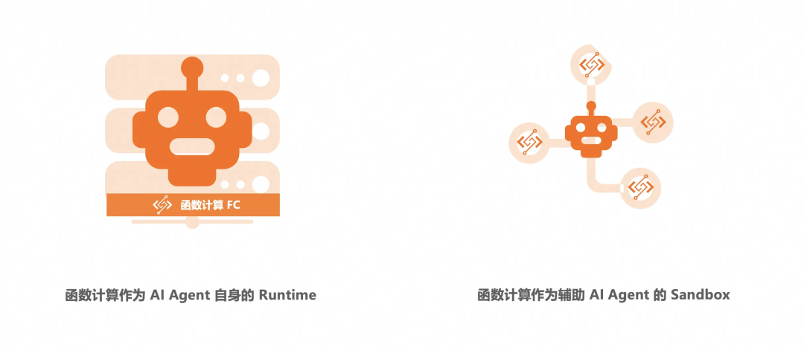函数计算FC作为AI Agent的运行时有两种模式：

  * 函数计算FC作为AI Agent自身的运行时。

  * 函数计算FC作为辅助AI Agent的沙箱环境（Sandbox）。

编码式 - 函数计算FC 作为计算资源运行AI Agent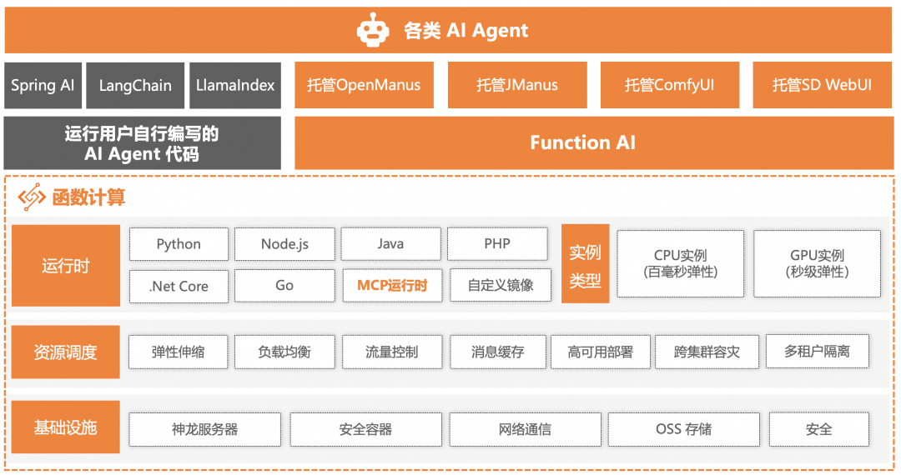FC作为AI Agent的运行时有两种类型：

  * 用户自研的AI Agent。或者使用Spring AI Alibaba、LangChain、LlamaIndex、Pydantic AI等开发Agent的综合框架开发的AI Agent。

  * 在FunctionAI平台上，已经托管了一些现成的AI Agent组件，比如OpenManus，Jmanus，ComfyUI，SD WebUI等，可以一键拉起使用。

FC作为AI Agent运行时的优势：

  * 函数计算 FC 触发器机制，实现 AI Agent 可灵活被调度。

  * 函数计算 FC 按请求扩缩，提升AI Agent 资源利用率，降低资源成本。

  * 函数计算 FC 支持多种存储机制，提升AI Agent 数据存储的灵活性和安全性。

  * 函数计算 FC 函数实例动态安装依赖包，提升AI Agent业务形态多样性。

  * 函数计算 FC 支持Seesion会话亲和，进一步提升AI Agent执行任务的一致性和隔离性。

1）Chat AI Agent 解析
很多客户做的Agent服务于Chat场景，本质上就是负责和用户对话交互的Agent，用户和客户产品的一次对话就会产生一个任务，由Agent负责执行这个任务。
这种Chat Agent最大的特点是执行任务的两个不确定性，和一个一致性：

  * 不确定性：

  * 执行环境里的各依赖包的不确定性。

  * 拿用户相关文件信息路径的不确定性。

  * 一致性：

  * 需要同一个会话（Session）的请求都分配到同一个实例中，从而保证执行任务在上下文环境、上下文数据方面的一致性。

以上两个不确定的特性就是AI Agent运行时自身以及配合存储产品需要解决的问题。执行环境里的各依赖包的不确定性
这是因为这类AI Agent处理的任务是千奇百怪的，用户的问题是无法穷举的，所以无论是AI Agent的实现代码逻辑也好，还是运行AI Agent的运行时也好，都不可能事先预置所有的依赖。而是只实现AI Agent的主干核心逻辑，以及一个隔离并灵活的运行环境，在执行用户的任务时，当遇到需要使用三方依赖时，可以暂停执行任务，先安装所需依赖，然后再继续执行任务，所谓兵来将挡，水来土掩。
函数计算FC方案：函数计算FC天然具备这个能力，每个实例底层都是隔离的容器环境，通过subProcess可以直接执行像pip或者npm的包管理命令来动态安装依赖，因为每个实例都是完全资源隔离的，所以同一个AI Agent函数的不同实例都可以是独一无二的运行环境，有不同的依赖，既相当于每一次执行用户任务运行环境都是完全隔离和完全不相同的，完美匹配这类AI Agent的不确定特性。其实以前我们给一些做编程教育的在线教育客户已经做过很多次类似的方案。拿用户相关文件信息路径的不确定性
这个不确定性特性的本质是用户数据隔离的问题。通常情况下，这类Chat AI Agent的文件路径是以用户（User ID）/会话（Session ID）/任务（Task ID）命名的，目的有两个：

  * 细粒度存储用数据，方便后续做检索，或者长期记忆存储。

  * 实现用户级别，会话级别，甚至任务级别的数据隔离。

这里就会涉及到如何选择存储产品，目前我们遇到的，或者说阿里云上适合的存储产品无非就是云盘，OSS，NAS以及PolarDB新出的PolarFS。

  * NAS：NAS有单集群10亿个文件的SLA上限，但是AI Agent场景，尤其Chat类的AI Agent很容易就会超过10亿个文件，所以To C端的大型或者通用Chat AI Agent如果要使用NAS需要通过多集群来规避10亿文件的SLA上限问题。

  * 函数计算FC方案：函数计算FC和NAS有产品间的深度集成，可以方便的通过白屏化或OpenAPI或命令行工具的方式将NAS挂载到函数上。这里我们推荐一个用户对应一个函数，该函数挂载NAS路径时只挂载根路径，也就是只挂载用户（User ID）这一层。在AI Agent的逻辑里再去拼接使用会话（Session ID）/任务（Task ID）这后两级目录，因为会话和任务这两级目录的名称是不确定的、是动态的，所以更适合在请求中拿到会话和任务的名称后，在代码里在用户这级根目录下动态创建，然后做文件数据的存取。

  * 云盘+OSS：这两个存储介质通常是配合使用，整体的逻辑是使用云盘实时存储AI Agent执行过程中产生的各种类型的文件数据，在任务执行完之后，打包上传到OSS作为持久化。OSS的文件对象命名也基本遵循用户（User ID）/会话（Session ID）/任务（Task ID）这个规范。

  * 函数计算FC方案：函数计算FC和OSS有产品间的深度集成，也是类似NAS一样的挂载方式，将OSS Bucket映射为挂载根目录。同时函数计算每个实例都有隔离的云盘存储空间。在函数中，使用各个编程语言自带的操作本地目录存取文件的方式使用这两种存储介质即可。

  * PolarFS：PolarFS本质上和NAS的用法一致，但是解决了单集群10亿文件SLA上限的问题。

会话（Session）请求亲和性
会话（Session）请求亲和性除了上述的保证执行任务在上下文环境、上下文数据方面的一致性以外，同一个会话或任务复用同一个实例，也减少了动态安装依赖的时间耗费，从而提高了执行任务的效率。
在这个特性上，有几个细节点：

  * 实例在支持会话（Session）请求亲和性的同时，还要具备排他性，也就是不能再接新的会话。

  * 如果该Session持续某个时间段（比如1个小时）没有请求输入，这个实例主动销毁，从而保证资源成本最优。

  * 当实例要销毁时，需要有机制保证数据都被处理完毕，比如打包上传到OSS。

  * 如果Session请求来的时候发现需要恢复Session（Session不是新的，且实例不存在），如何具备这个判断机制。

函数计算FC方案：

  * 函数计算FC支持会话（Session）请求亲和性。只需要请求时在Header里带着x-fc-session-id:<Session ID>即可，带着相同Session ID的请求会被分配到同一个实例中。

  * 函数计算FC可以设置单实例可以接的会话（Session）数，也就是说当该配置设置为1时，就具备了排他性，不能再接新的会话了。当然你还可以设置为多单实例可以接多个会话（Session），这样可以满足更加灵活的业务需求。

  * 函数计算FC具备Session Idle Time的配置项，如果设置为1小时，那么在1小时内没有请求进来，实例就会自动销毁，这个值可以根据业务需求灵活设置。

  * 函数计算FC有完善的实例生命周期管理能力，当实例要销毁前会调用prestop这钩子方法，用户可以在这个方法中做数据善后处理。

如果Session请求来的时候发现需要恢复Session的最佳实践为：

  * 在请求进入函数计算FC之前，需要有一个管控服务，该服务负责判断Session是否存在，然后采取下一步对函数计算FC实例的使用方式。

  * 基于Session ID去查OSS（或者是客户自己的数据表），如果有数据就走恢复逻辑（下载文件，恢复目录），在实例中从OSS下载Tar包，并解压。

  * 如果查不到，就是新的会话，在Header中设置新的Session ID，走创建新实例的逻辑即可。

整体架构图如下：

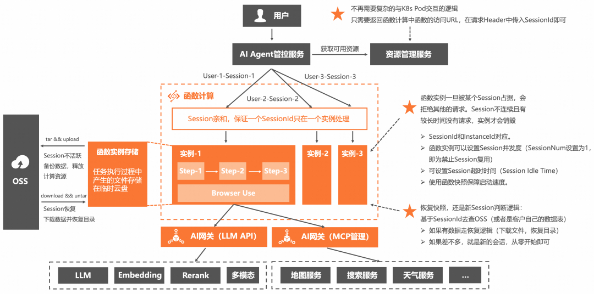

2）流程式 - AIStudio + 函数计算FC 可视化构建AI Agent
在这几个月时间里，我们遇到了大量使用开源Dify构建AI Agent或者AI应用的客户，这类客户需要快速构建出可以辅助存量业务的AI Agent，他们的关注点在业务上，并不会投入过多精力研究编码式的构建方案，像SaaS类客户，泛企业类客户居多。AIStudio 是什么
AIStudio是阿里云自研的可视化构建AI Agent的产品。底层的工作流引擎基于阿里云2018年就商业化的产品云工作流（CloudFlow），底层算力基于函数计算。而前端的可视化部分我们基本沿用的Dify的设计语言。目的很简单：让用户不改变使用习惯的前提下享受到更灵活、更稳定、性能更好的可视化构建AI Agent的产品。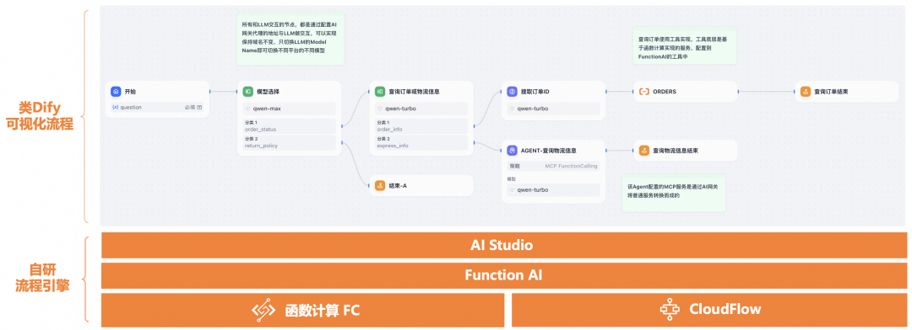易用的同时性能更强：

  * 兼容Dify的流程构建习惯

  * 使用Dify可视化流程编辑器的设计语言和UE，最大限度兼容用户在构建流程时的习惯。

  * 具备正统流程引擎的高性能

  * 基于函数计算FC和云工作流CloudFLow实现的生产级流程引擎。

AIStudio的优势和特点：

  * 支持函数计算节点，使构建流程的灵活性得到大幅度提升。

  * 默认支持最大1000QPS，且可以按需继续提升。

  * 多节点复杂流程依然具备稳定高可靠的执行性能。

  * 除了HTTP以外，还支持多种调度方案，比如OSS，SLS，Kafka，RocketMQ等。

  * 具备完善的可观测能力，包括整体流程和具体的每个节点的可观测。

虽然目前AIStudio还有一些能力正在不断完善中，但是针对上述开源Dify的硬伤问题已经具备了彻底解决的能力：

  * 性能问题：

  * AIStudio一个流程默认支持最大1000QPS，且可以继续提升。这个对绝大多数AI Agent来说已经是非常大的QPS了，毕竟流程里或多或少都需要和LLM交互。

  * AIStudio底层的工作流引擎CloudFlow已经是一个非常成熟的高性能流程引擎，这些年稳定服务着宝*，丰*，四**新这些具有车联网、自驾业务的客户。西*子，小*这类具有IoT业务的客户。南**影，米*这类视频处理的互娱类客户。小**娱，莉*丝等这类游戏客户。

  * 安全问题：

  * 云原生API网关和AIStudio做了产品间集成，访问基于AIStudio构建的流程，都可以通过云原生API网关侧做管控，这里就包括了多种鉴权方式。

  * AIStudio里唯一涉及到API Key的就是和LLM交互的配置，LLM节点和Agent节点都可以配置由AI网关代理的LLM，这样LLM的API Key由AI网关做同一管理（下文会有解释）。

  * 会话调用问题：AIStudio不仅支持定时调度能力，还具备几十种云产品事件的触发能力，被调度能力一骑绝尘。

  * Nginx问题：开源Dify核心问题之一就是它的网关层是一个Nginx，Nginx本身就有不少的短板（毕竟ACK的Ingress也不推荐使用Nginx了，而是云原生API网关）。所以通过云原生API网关+AIStudio完美规避这个问题。

  * LLM问题：

  * 自定义前置后置逻辑：AIStudio提供独有的函数计算FC节点，所以可以灵活的在LLM节点前后使用函数计算FC节点实现用户自定义的业务逻辑。

  * 通过LLM节点和Agent节点配置由AI网关代理的LLM来解决以下问题：

  * Token统计错误：在AI网关侧做统一的Token统计观测，维度更多，粒度更细。因为AIStudio可能只是LLM的其中一个调用方而已（通过按照消费者观测）。

  * Proxy访问异常：通过AI网关代理LLM的Fallback能力提升LLM API的高可用性。

  * 动态结构化输出：可以使用AI网关的插件或者在LLM节点后使用函数计算FC节点来实现。

  * Model Alias：通过AI网关代理LLM的Model Name切换模型的能力实现。

  * RAG/知识库管理问题：我们不重复造轮子，AIStudio支持检索百炼知识库的节点。将RAG/知识库管理交给更专业的百炼来处理。

诚然AIStudio目前还有很多需要打磨的地方，但是它最大优势是稳定性/性能和可触达的产品研发团队：

  * 稳定性/性能：底层工作流引擎的成熟度。

  * 可触达的产品研发团队：可随时根据客户的需求提炼通用能力，快速补齐AIStudio能力。可以贴身服务大客户，帮助业务线取得成功。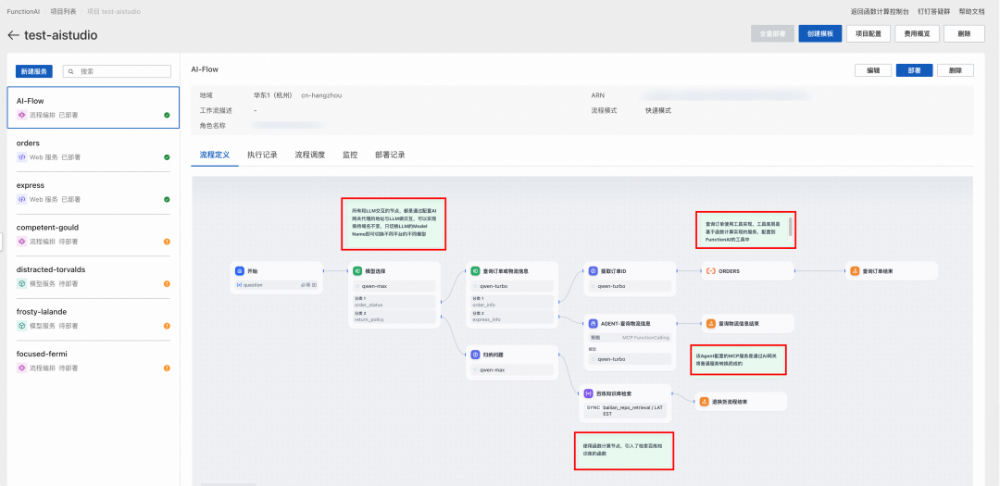

### 典型场景探讨

我们在与客户的交流中，遇到使用可视化方式构建AI Agent最多的场景有以下几类：

  * 智能客服典型场景

  * 输入：用户问题（文本）+ 客户上传的图片

  * 处理：

  * 通过VL模型识别图片内容，然后结合用户的问题一起重新构建为新的问题。

  * 通过LLM模型对新问题进行推理。

  * 推理时需要结合客户的知识库。

  * 知识库构建

  * 客户的原始知识库信息有多种格式：PDF，PPT，TXT，DOC

  * 使用了Dify自带的知识库及知识库检索能力，没有构建自己的RAG逻辑，完全依赖Dify的能力。
使用AIStudio，可以将知识库构建移到百炼知识库中。

  * 营销典型场景：营销活动各素材的组装。初始素材是客户设计团队使用中台部门搭建的SD平台辅助做设计产出。然后会基于这些初始素材生成各种端侧，各种尺寸的宣传海报。这些不同的海报尺寸不一样，初始素材的排布不一样，但初始素材不能变。虽然前半段可以借助文生图辅助，但后半段客户验证过，目前的DiT模型没法保证初始素材的完全一致性。所以目前后半段还是人工在处理。这个场景目前Dify和N8N都没有好的实现方式。我们帮客户设计的方案如下：

  * 因为后半段不涉及出图，只是图片尺寸的调整和现有素材的排布，所以最有效的方法是结合LLM的Coding能力，以写HTML+CSS的方式来实现，然后再截图。也就是通过自然语言告诉LLM，写一个页面，页面是什么尺寸，页面上有哪些素材，每个素材在什么位置。

  * 该场景有几个核心需求：

  * 初始素材存在哪，如何和存放素材的组件关联集成。

  * 推荐使用OSS。

  * LLM节点和Agent节点支持多模态，客服场景也有涉及。

  * 需要有一个预览LLM生成的HTML+CSS代码的节点，本质上属于一个Code Sandbox，Run代码，可以通过AIStudio中的函数计算节点实现。

  * 需要有一个人工处理的节点，需要打断流程，因为生成的图片还是需要人工审核。

  * 这个能力CloudFlow本身是支持的，因为有回调模式，可以让流程暂停，等待客户业务逻辑处理完后回调流程接口，继续让流程运行。

  * 将页面截图并保存在OSS的节点。

  * 销售场景：做产品销售时，期望对营销团队或设计团队，或产品团队提供的图片，在上架流程中做处理，比如去除背景，替换背景，局部改写等。本质上就是借助DiT模型对图片做处理。

  * 目前可以使用AIStudio中的函数计算FC节点，在函数中调用FunctionAI中的ComfyUI项目的API来实现。

函数计算FC 作为辅助 AI Agent 的 Sandbox
如上文所述，为了确保AI Agent能够安全、可控地运行，一个强大的沙箱环境（Sandbox）至关重要。这就像是为AI Agent提供一个安全的游乐场，让它在其中探索和执行任务，同时又不会对外部真实世界造成意外影响。

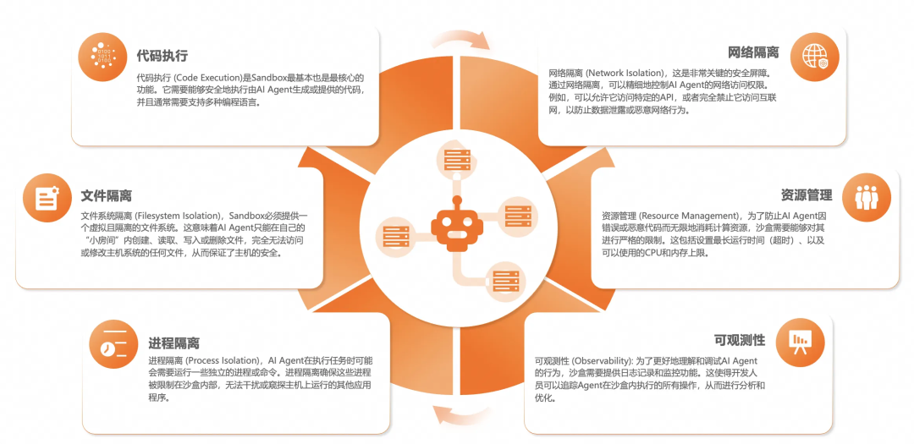但除了运行AI Agent自身以外，还有一大类是编外的，用于辅助、提升AI Agent或基模能力的沙箱环境（Sandbox）场景，同样也是函数计算FC擅长的。
目前我们交流与落地实践的有四大类编外沙箱场景：

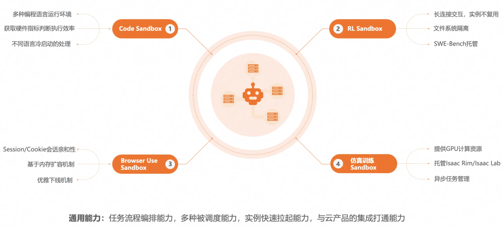

1）Code Sandbox

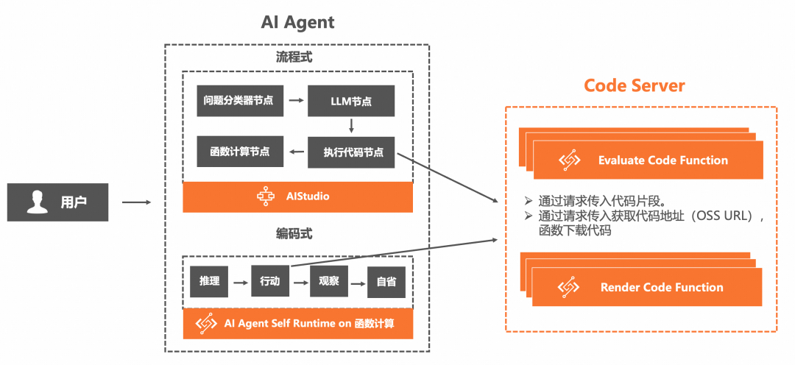这一类场景的本质就是在一个隔离的环境中运行由用户生成的或者LLM生成的代码，分为两种业务场景：

  * 协助训练基模的Coding能力：给LLM喂需求，由LLM生成代码，然后拉起函数计算FC 实例，运行代码，评判结果。

  * 实时运行展示用户编码类的任务：这里包括执行后端代码，也包括执行渲染前端代码。无论是基模公司还是互联网客户的AI场景，都有相似的需求。比如Gemni的Canvas能力，千问的网页开发能力，MiniMax的Agent生成代码并运行的能力等。

Code Sandbox场景的一些挑战点：

  * 运行环境支持多种编程语言，无论是基模还是增强存量业务的AI Agent都不可能限制用户只使用某一种或某几种开发语言。

  * 函数计算FC具备所有开发语言运行环境的特性天然匹配这个特性。

  * 判定结果不仅仅是代码运行结果是否达到预期，还会收集代码执行过程中的硬件指标（并不是所有机型都提供获取这类指标的接口），抓容器的指标，判断衡量代码执行效率。

  * 函数计算FC提供能把这些数据拿走的能力（底层提供8代机，具备获取这些指标的接口），数据抓出来后给到另一个服务做衡量（另一个函数）。

  * 执行代码的任务不仅仅是单线程任务，可能会起子线程并行处理任务。

  * 函数计算FC支持实例内再起多线程执行子任务的能力，得益于函数计算FC的实例是完全独立的环境，只要函数规格够，多线程运行也不会影响其他实例，不会产生资源争抢。

  * 训练基模Coding能力这个场景，大家可能觉得它是一个离线场景，对时延要求不高，但其实并不是这样，反而对时延要求很高。因为训练Coding这个链路还涉及到GPU，如果在执行Code这个环节消耗太多时间，就意味着GPU有很大概率要空转，产生资源浪费，所以通常对执行Code环节都有严格的时延要求，具体的时延情况是根据能让GPU持续运行的整体节奏而定的。

  * 对时延要求高且非常敏感的场景，广告领域的RTA绝对算一个，函数计算FC有成熟的RTA方案，并且支撑着不少大客户的RTA业务，所以在优化冷启动，解决时延方面有足够的经验。那么在Code Sandbox这个场景通常会使用弹性实例与毫秒级快照实例组合的方式来保证时延要求。

到目前为止，函数计算FC有大约16w核左右的资源在承载着不同客户AI Agent的Code Sandbox场景。2）Browser Use Sandbox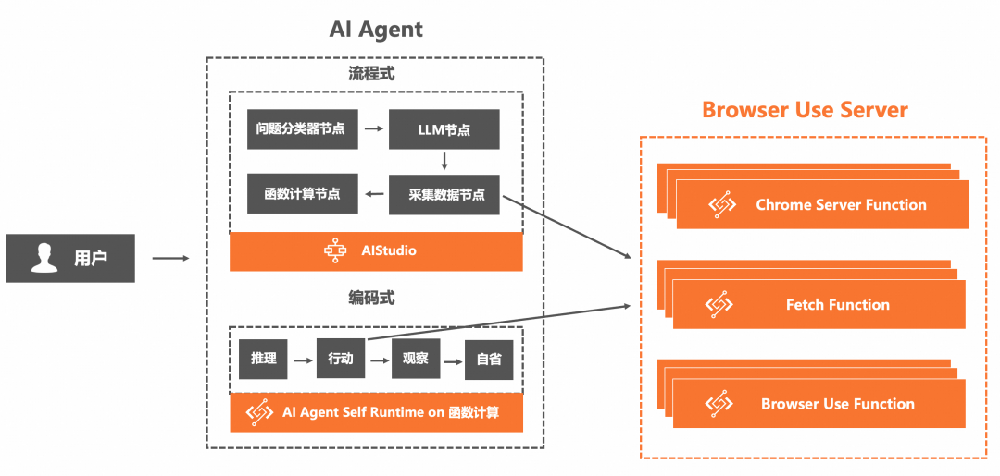Browser Use其实并不是一个很新的东西，早在2年前，函数计算FC就通过Chrom Server无头浏览器帮助新东方等在线教育客户通过服务端做Web录制的场景。
在AI场景下，当前Browser Use主要有两类主要的应用场景：

  * 辅助数据采集，比如需要登录的一些网站，获取论文报告等。

  * 做联网搜索，目前主流搜索引擎的API能力参差不齐，且价格不菲，所以通过Browser Use做联网搜索在灵活性和成本方面都是较优的选择。

当AI Agent的任务从封闭的模拟环境扩展到开放、动态且充满潜在诱惑的互联网时，其面临的安全挑战也随之升级。对于一个在Web上操作的AI Agent来说，互联网不再仅仅是信息的来源，它本身就是一个动态的、可能包含恶意内容的输入源。网页的内容直接影响Agent的感知和决策，所以这就是为什么Browser Use也需要沙箱环境的原因。
Browser Use Sandbox场景的一些挑战点：

  * 需要Session/Cookie亲和性。辅助数据采集时，需要登录后才能获取到数据，所以需要相同Session的请求分配到同一个实例中，避免反复登录。

  * 上文中已经解释了函数计算FC是如何支持会话（Session）亲和性的。所以也是天然适配Browser Use的特性。

  * 需要基于内存扩容，这个场景比较吃内存，且大多数语言内存回收机制都不好。

  * 函数计算FC默认按请求扩容，此外还支持用户配置按时间和并发度扩容，为了支持Browser Use Sandbox场景，又支持了按内存扩容的能力。

  * 优雅下线，也就是实例要销毁时做Browser Use操作的后处理。

  * 依托函数计算FC的生命周期管理能力，通过prestop钩子函数做Browser Use收集数据的后处理操作。

到目前为止，函数计算FC有大约6w核左右的资源在承载着不同客户AI Agent的Browser Use Sandbox场景。3）RL Sandbox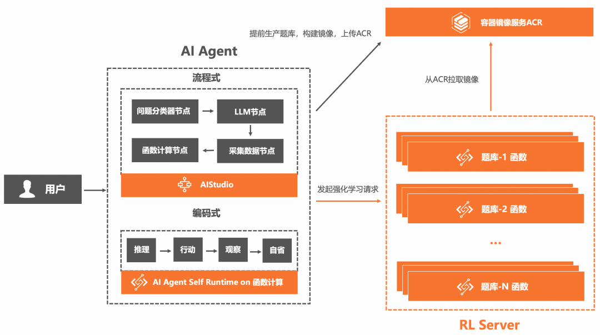有一些基模客户或做通用AI Agent的客户，会专注在垂直类场景，这类客户会针对特定场景对LLM或AI Agent算法做定向强化学习。
目前正在基于函数计算FC落地RL Sandbox的一个客户是做教育方面的Agent做强化学习，强化学习的内容是客户设计的“考题”，每个考题有自己完整的依赖，Python语言，客户会打好镜像推送到ACR，目前有1w多道考题。
客户的Agent是一个复杂的Agent系统，包含LLM，自有算法，业务逻辑，每个考题除了有试题内容外，还有奖惩机制。是一个非常典型的强化学习场景。
这类强化学习场景对于客户来说，希望有一个独立的、隔离的运行环境，即沙箱环境，会有以下共同的诉求点：

  * 安全性：Agent在训练初期的行为往往是随机且不可预测的。在沙箱中，错误的决策不会造成任何实际损失。

  * 高效率与可复现性：沙箱环境可快速拉起，快速复制相同的环境，让Agent在短时间内经历海量的训练。同时，研发可以精确控制每个环境的每一个变量，从而能够复现实验结果，进行可靠的对比分析。

  * 降低成本：不希望过多维护IaaS资源，随用随拉起，并且强化学习也不是实时业务，如何最大限度提升资源利用率也是降低成本的优化手段。

  * 运行环境完整性：沙箱环境不要有太多限制和约束，期望和一台Linux机器一样去使用。甚至可以设置一些系统级参数。

函数计算FC作为FaaS形态的Serverless计算产品，天然的匹配以上这些需求，所以客户选择使用函数计算FC作为RL Sandbox的底座。
运行一个考题需要4c的规格，峰值实例数在4000-5000个实例，也就是同时执行4000-5000道题目。预期每次强化学习时会消耗2w和左右资源。
RL Sandbox场景的一些挑战点：

  * 动态安装依赖，客户的考题环境会构建为一个容器镜像，但只是包含最基础，最小闭环的依赖。在真正执行时可能会需要动态安装依赖。

  * 上文中已经介绍过函数计算FC实例内支持动态安装依赖。

  * 实例不能被复用，避免影响执行结果，污染执行过程产生的数据。

  * 函数计算FC默认实例是可以被复用的，这样可以大幅降低冷启动，减少RT。但同时也可以通过配置关闭实例复用的能力，从而满足这类强化学习的场景。

4）仿真训练 Sandbox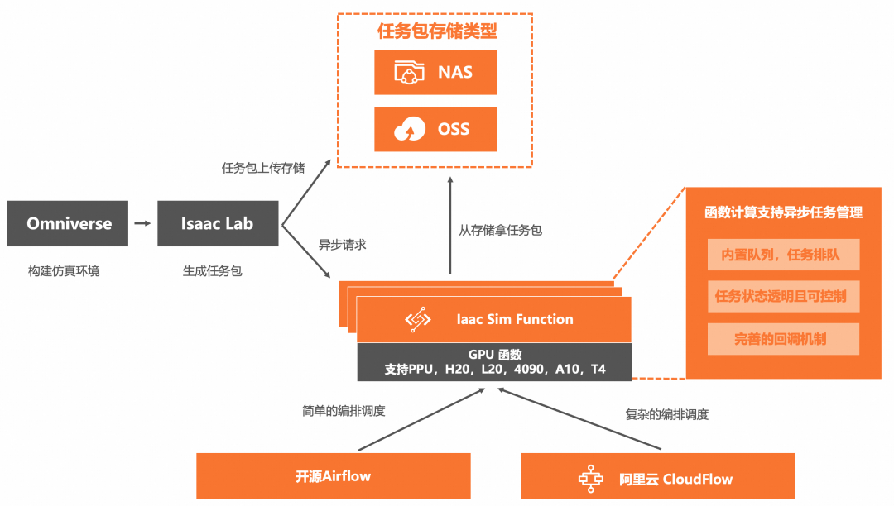仿真训练Sandbox场景目前主要聚焦在具身智能场景。
具身智能仿真训练基本流程：

  * 使用NV Omniverse提供的可视化界面，构建虚拟环境，准备环境数据。

  * 构建好仿真环境和数据后，生成任务包，将任务包分发到GPU服务跑训练任务。该服务使用的框架大多数也是NV Omniverse里的Isaac Sim。

  * 分发任务的逻辑通常会使用Airflow，且Airflow的流程是比较简单的。

  * GPU服务跑完训练任务后，状态会回调Airflow，由Airflow统一来展示这次任务的执行结果。

函数计算FC具身智能仿真训练方案：方案分为两种类型。

  * 函数计算FC具身智能仿真训练自闭环方案：

  * 不带流程的方案：适合任务分发简单的客户，或者刚开始做仿真训练的客户。

  * 函数计算FC需要支持Isaac Sim/IsaaC Lab环境，既可以一键拉起Isaac Sim应用（类似一键拉起ComfyUI应用一个逻辑），会落在FunctionAI应用中。

  * 使用函数计算FC异步任务逻辑，天然具备任务管理能力，客户根据持有的卡数发任务即可，没卡的任务在队列里排队等待。任务的状态，回调机制都使用函数计算FC自身的能力。

  * 带流程的方案：适合任务分发相对复杂的客户。

  * 函数计算FC需要支持Isaac Sim/IsaaC Lab环境，既可以一键拉起Isaac Sim应用（类似一键拉起ComfyUI应用一个逻辑），会落在FunctionAI应用中。

  * 函数计算FC异步任务和CloudFlow结合，将客户复杂的分发流程使用CloudFlow做构建。

  * 目前大部分客户都是用Airflow，且Airflow里的流程都比较简单，本质上就是用工作流实现了异步任务分发管理的能力。

  * Airflow + 函数计算FC 的具身智能仿真训练方案：适合Airflow心智非常强的客户。

  * 函数计算FC需要支持Isaac Sim/IsaaC Lab环境，既可以一键拉起Isaac Sim应用（类似一键拉起ComfyUI应用一个逻辑），会落在FunctionAI应用中。

  * 把函数计算FC完全当做一个GPU资源使用，所有的任务分发都有Airflow完成，也就是Airflow里的节点调用函数计算FC GPU函数。

  * 函数计算FC除了支持CPU以外，也支持GPU，且适配了大多数常用卡型，如T4，A10，4090 24GB，4090 48GB，L20，H20，PPU。

  * 函数计算FC GPU函数执行完成后，需要通过Airflow的机制，将状态给Airflow。

## AI Agent 大脑 - LLM

无论是编码方式构建AI Agent，还是可视化流程式构建AI Agent，一旦脱离了LLM，就不存在AI一说了，所以AI Agent如何合理的、生产级的与LLM结合是本章节的核心内容。
我们都知道现在大部分的LLM都是遵循OpenAI范式的请求方式，编码方式构建AI Agent和可视化流程式构建AI Agent虽然在使用方式上不同，但底层本质是一致的：

  * 编码方式构建AI Agent使用LLM：不同的AI Agent开发框架都会封装市面上主流的LLM厂商的SDK，比如OpenAI的，百炼的，我们只需要简单的申明和配置就可以和LLM交互。

  * 可视化流程式构建AI Agent使用LLM：流程式通常都是通过LLM节点和Agent节点和LLM交互。

无论是上述哪种，都需要配置LLM服务的地址（https://www.xxx.com/v1/chat/completions）和LLM服务用于认证鉴权的API Key。所以AI Agent和LLM的交互本质上都是通过一层Proxy，所有对LLM请求的管控、LLM服务的管理都应该是这层Proxy协助做的事，这也正是AI网关做的事。

### LLM生产项目中必然会遇到的问题

在当前AI普惠的阶段下，有一个显著的特点就是用户们选择使用LLM的方式变多了，自主可控能力变强了。比如可以购买GPU资源自己部署大模型，可以在线下机房部署大模型，也可以使用阿里云的PAI或者函数计算FC来部署大模型。也可以使用各个模型托管平台，通过API的方式来使用大语言模型。但无论选择哪种方式，在LLM应用上生产项目的过程中，必然都会遇到一系列问题：

  * 成本平衡问题：部署DeepSeek R1 671B满血版模型，至少需要2台8卡H20机器，列表价年度超过100W，但2台的TPS有限，无法满足生产部署中多个用户的并发请求，需要有方案找到TPS和成本之间的平衡点。

  * 模型幻觉问题：即使是DeepSeek R1 671B满血版模型，如果没有联网搜索，依然有很严重的幻觉问题。

  * 多模型切换问题：单一模型服务有较大的风险和局限性，比如稳定性风险，比如无法根据业务（消费者）选择最优模型，无法根据不同用户对不同模型做Token限额等。目前也没有开源组件和框架解决这类问题。

  * 安全合规问题：企业客户需要对问答过程做审计，确保合规，减少使用风险。

  * 模型服务高可用问题：自建平台性能达到瓶颈时需要有一个大模型兜底方案，提升客户大模型使用体验。

  * 闭源模型QPS/Token限制问题：商业大模型都有基于API Key维度的QPS/Token配额限制，需要一个好的方式能够做到快速扩展配额限制。

以上问题都是实实在在的客户在使用过程中遇到的问题，有些是模型自身问题，有些是部署架构问题，如果要客户一个一个去解决，复杂度和时间成本都是比较高的。所以就需要AI网关的介入来快速的，统一的收敛掉这些核心问题。
AI Agent与LLM交互遇到的问题和普通服务与LLM交互的问题基本一致，所以这个章节我们主要讨论使用AI网关代理模型服务如何解决目前与LLM交互遇到的问题。

### AI网关简述

阿里云AI网关和阿里云云原生API网关同属一个内核。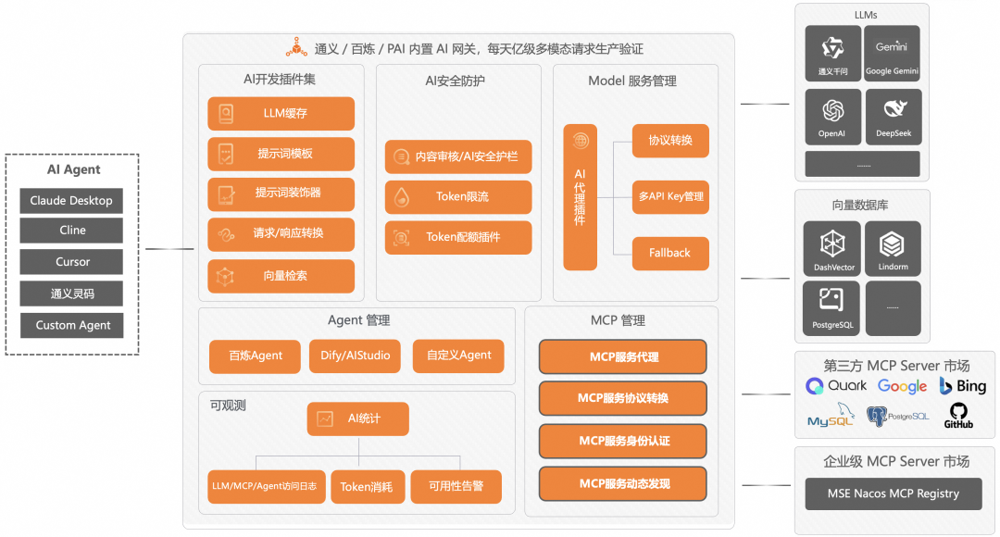AI网关的能力主要包括六部分：

  * 模型服务管理：可以代理市面上所有主流的模型托管服务，以及兼容OpenAI协议的LLM服务和多模态LLM服务。在这个模块中包括协议转换、多API Key管理、Fallback、多模型切换等多个核心功能。

  * MCP管理：负责MCP服务的代理以及MCP服务的策略管理。包括代理原生MCP服务，HTTP服务转MCP服务，MCP服务鉴权认证，和MSE Nacos集成实现从MCP Registry自动发现MCP服务。

  * Agent管理：负责Agent的代理以及Agent的策略管理。目前支持代理百炼Agent，Dify构建的Agent（流程），AIStudio构建的Agent（流程），自定义Agent。

  * AI安全防护：安全防护分为三个层面，一个是输入输出的内容安全防护，另一个是保护下游LLM服务的稳定，以及管控AI接口消费者。在这个模块中包括内容审核、基于Token的限流降级、消费者认证等多个核心功能。

  * AI插件：AI网关的灵活扩展机制我们使用插件的形式来实现，目前有很多预置的插件，用户也可以开发自定义插件来丰富AI场景流量的管控。比如基于AI插件机制我们实现了结果缓存、提示词装饰器、向量检索等能力。

  * AI可观测：AI场景的可观测和传统场景的可观测是有很大区别的，监控和关注的指标都是不同的，云原生AI网关结合阿里云日志服务和可观测产品实现了贴合AI应用业务语义的可观测模块和AI观测大盘，支持比如Tokens消费观测，流式/非流式的RT，首包RT，缓存命中等可观指标。同时所有的输入输出Tokens也都记录在日志服务SLS中，可供用户做更详细的分析。

### AI网关代理LLM

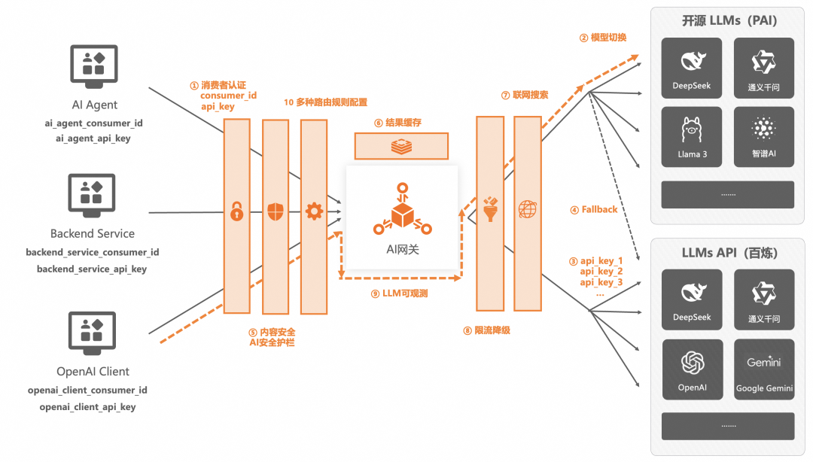从上图架构中可以看出，AI网关代理LLM方案的架构并不复杂，但是在AI应用上生产的过程中通常会遇到10个核心的问题，然而在上面这个并不复杂的架构下，通过AI网关都可以很有效地解决。接下来我们通过AI Agent视角、用户视角、业务场景视角来逐一分析和说明。解决AI Agent/用户管理失控的问题
现在大大小小的企业都在部署LLM，想方设法的融入到业务中，或日常工作中，那么站在运维团队或者类似中台团队的视角下，可能会有两个核心的问题：

  * 核心问题1：以什么样的方式将LLM服务和能力暴露给用户或AI Agent？

  * 核心问题2：GPU资源有限，成本又高，如果是一个面向C端用户的AI Agent，如何限制用户？

第一个问题很好解决，OpenAI API的协议基本已经是标准协议，目前市场面上多大数LLM都支持OpenAI API协议。但也有例外，比如AWS Bedrock上的模型，Gemini是不遵循OpenAI API协议的。另外还有Embedding和Rerank模型，以及Cosyvoice和SD、Flux这类多模态模型都不是OpenAI API协议。所以对于一个通用AI Agent或者一个企业来说，更希望由统一的Model API，可以统一管理和管控不同类型模型的API。
目前上述这些类型的模型，AI网关都支持代理，所以可以在同一个模型API管控平台上，统一管理和管控不同类型的模型API。
对于第二个问题，AI 接口一旦暴露出去，基本上不可能只让一小部分人知道，所以需要对访问LLM服务的用户做以限制，只让能访问的人访问，不能访问的人即便知道了接口也无法访问。所以可以使用AI网关具备的消费者认证的能力来解决这个问题。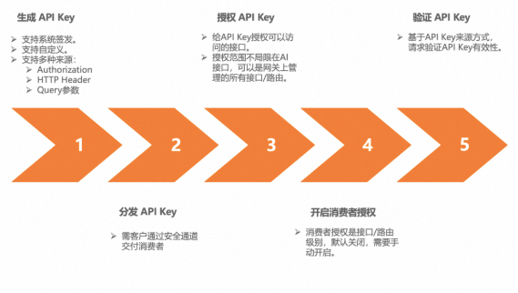

核心逻辑是将一个人或一个AI Agent抽象为消费者的概念，可以对消费者做权限配置，既可以访问哪些模型API，消费者下可以生成不同类型的API Key，请求接口时需要带着API Key，然后基于权限规则去校验API Key的合法性。通过这种就可以精细化的管理访问AI接口用户了。

消费者认证的核心价值：

  * 身份可信：确保请求方为注册/授权用户或系统。

  * 风险拦截：防止恶意攻击、非法调用与资源滥用。

  * 合规保障：满足数据安全法规及企业审计要求。

  * 成本控制：基于鉴权实现精准计费与API配额管理。

典型鉴权场景与API Key应用场景：

  * 第三方应用接入：

  * 挑战：开发者身份混杂，权限难隔离。

  * 解决方案：为每个应用分配独立API Key，绑定细粒度权限策略。

  * 企业内部服务调用：

  * 挑战：内网环境仍需防越权访问。

  * 解决方案：API Key + IP白名单双重验证，限制访问范围。

  * 付费用户API访问：

  * 挑战：防止Key泄露导致超额调用。

  * 解决方案：针对API Key限流。

  * 跨云/混合部署：

  * 挑战：异构环境统一身份管理。

  * 解决方案：集中式API Key管理平台，支持多集群同步鉴权。

解决灵活路由模型的问题
灵活路由模型在实际项目中对应着两类问题：

  * 不同的模型解决不同的任务，需要统一的模型服务API提供给业务方，不同的业务方只需要基于实际业务切换不同的模型名称即可。对于负责AI的中台团队，可以基于同一个模型API统计各个业务方的调用情况（尤其是核算成本）。从而解决统一分发、管理、集成的问题。

  * 用户期望基于不同的用户和模型做Token配额管理。

AI网关支持一个模型API下配置多个模型服务的能力，每个模型服务通过Glob语法来匹配模型名称，从而实现上述的第一个场景。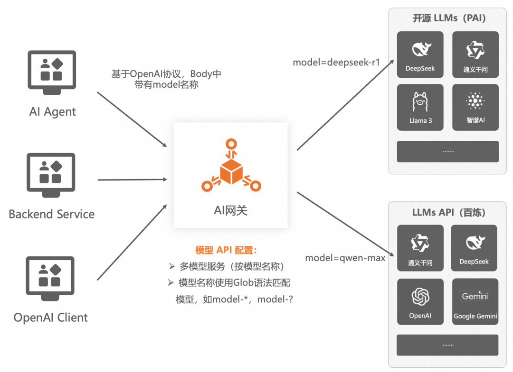除此以外，AI网关的模型API支持基于不同的匹配规则创建不同的路由，可以基于请求Header或者请求参数中的参数值做匹配规则。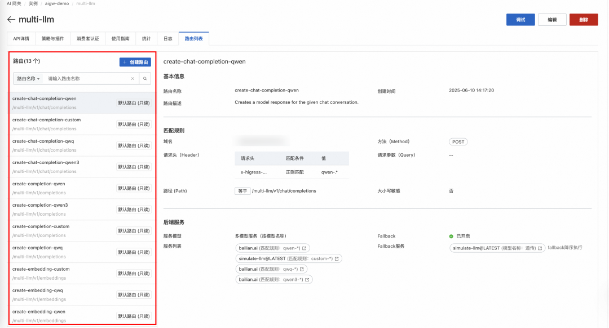这样，我们可以通过Header中的x-higress-llm-model和x-mse-customer这两个标识作为路由匹配规则，实现通过消费者和模型名称路由的功能。

实例

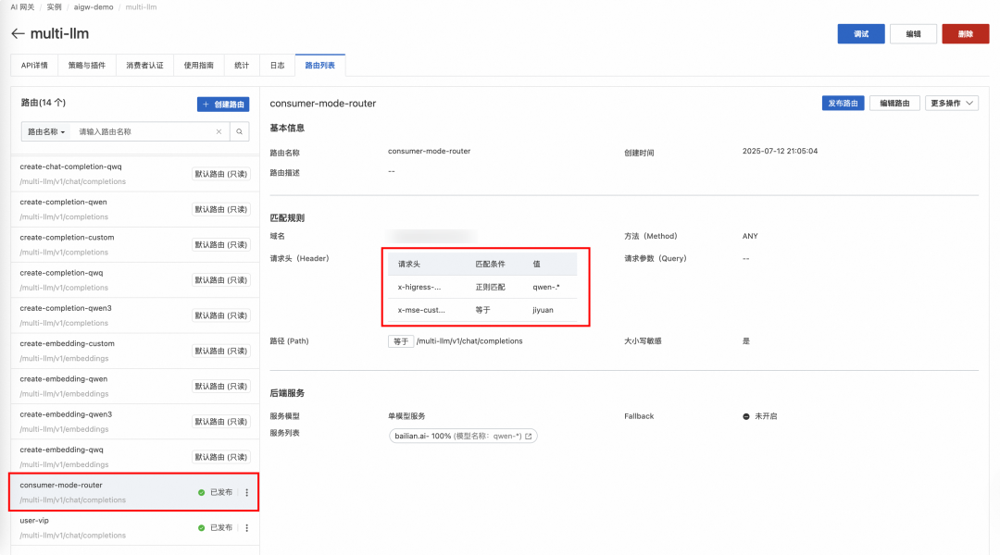然后再配合模型API的限流策略，针对同一个消费者做Token限流，从而实现上述的基于不同的用户和模型做Token配额管理的需求。

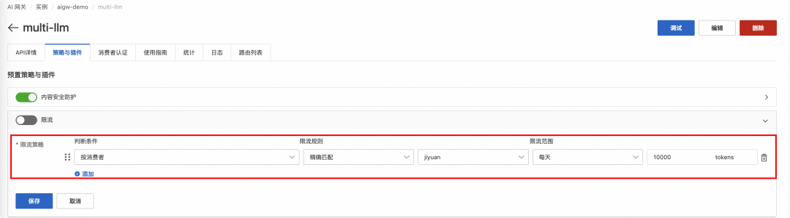再延伸一下模型路由的核心价值：

  * 业务需求适配：根据业务复杂性或性能要求选择不同模型。

  * 数据隐私与合规性：在处理敏感数据时，可能需要切换到符合特定法规的模型，确保数据处理的安全性。

  * 性能优化：根据实时性能需求，可能会切换到更快的模型以减少延迟。

  * 成本与性能平衡：根据预算动态选择性价比最优的模型

  * 领域特定需求：针对特定领域（如法律、医学），可能需要切换到在相关领域微调过的模型，以提高推理准确性。

  * 容灾与故障转移：主模型服务异常时快速切换备用模型。

解决闭源模型&模型托管平台QPM/TPM限制的问题
像ChatGPT，豆包这类闭源LLM，或者百炼这种托管LLM平台，都是以提供API的方式供大家使用LLM的能力，但是受限底层GPU资源的压力，以及整体平台的稳定性，每个用户都有请求QPS的最大限制（基于平台的API Key的维度），且上调比较困难。所以很多客户都有这个核心问题：如何突破这个限制问题？
这个问题有两类解决方案：

  * 我们知道这些平台上调限制额度比较困难，那么就用曲线救国的方式，既多申请一些帐号，来变相的把限制额度撑大，但是又会带来新的问题，那就是这些帐号的API Key如何管理的问题。

  * 另一个方法就是对输入/输出内容做缓存，减少对模型服务的请求次数以及Token消耗，从而提升业务侧的请求性能，相当于变相增加了限制额度。

多API Key管理
AI网关在LLM服务级别支持多API Key管理的能力，每次请求会轮循取一个API Key向后端模型服务请求。并且API Key可以动态新增和删除，极大减轻了用户自己维护多个API Key的问题。

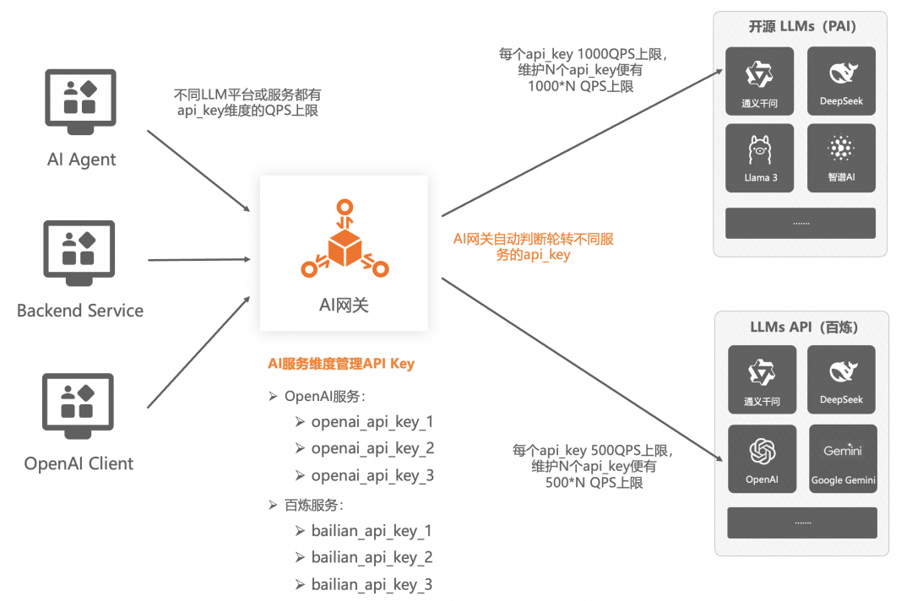

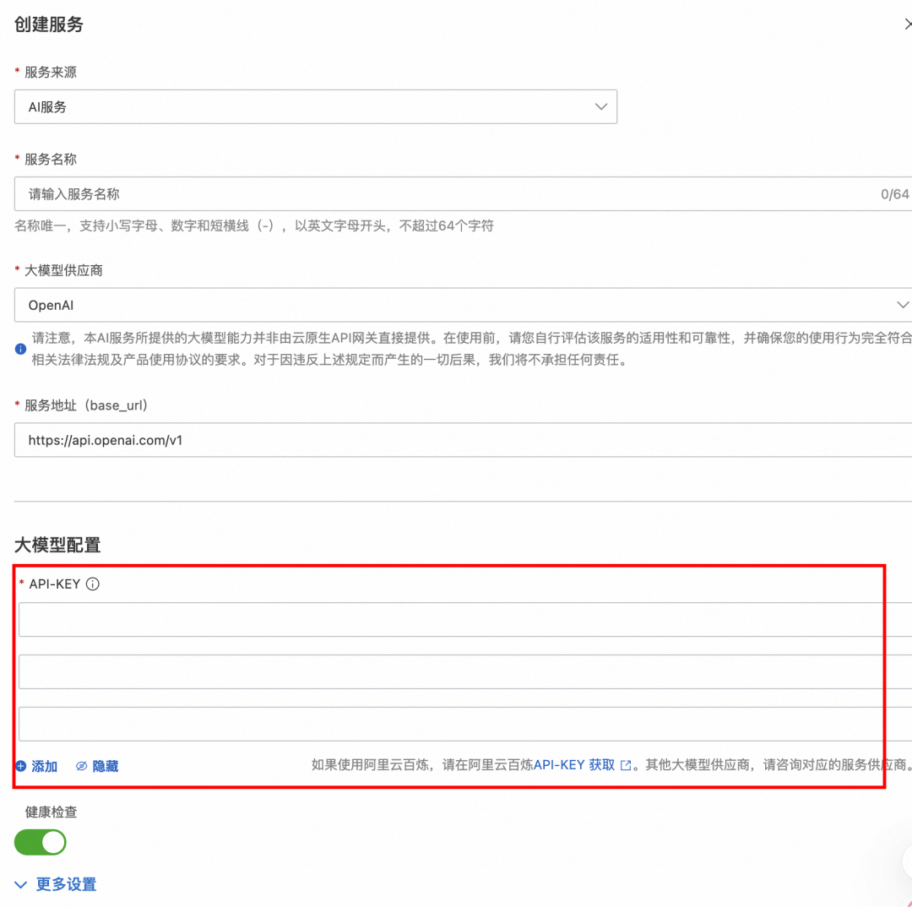

结果缓存
AI网关提供了结果缓存的预置策略，可以将请求和响应的内容存储到DashVector做语义化缓存，或者存储到Redis做精确缓存，从而提升推理效率。

(PAI)

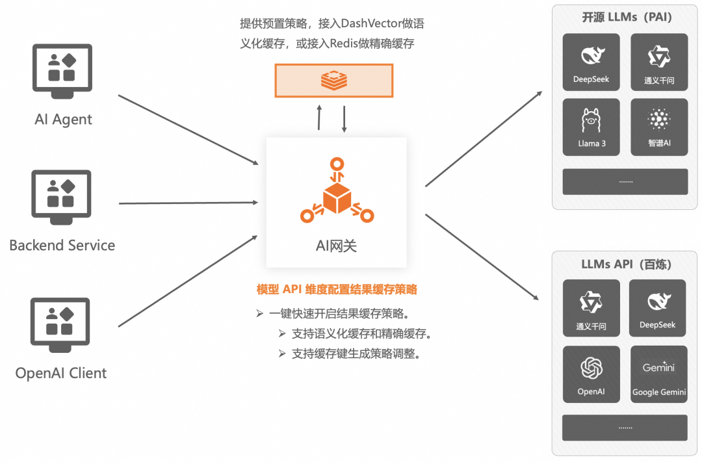语义化缓存
支持用户自己选择用于做Embedding的模型，需要用户实现开通DashVector服务。并且支持只取最新提问和整合历史提问两种缓存键生成策略。语义化缓存的适用范围更宽泛一些。

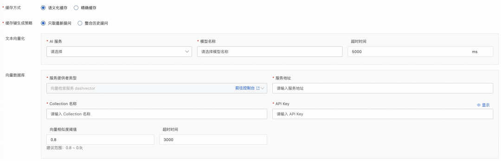

精确缓存
精确缓存不涉及到Embedding，是把用户问题和LLM的响应直接存储到Redis中。精确匹配的适用范围更窄，只适合非常垂直的一些场景。

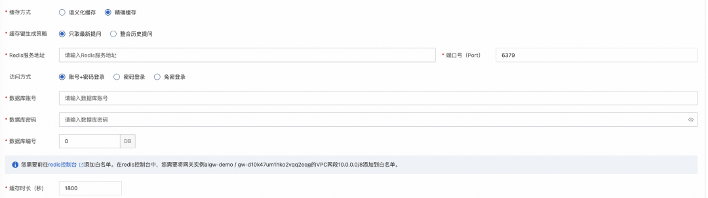

解决模型服务高可用的问题
现在GPU的资源是昂贵的，所以无论是自购GPU部署LLM还是模型托管平台都不会基于流量峰值去储备资源，所以才会有上文中的QPM/TPM限制的情况。但是站在用户业务健壮性的角度来看，如何在成本、稳定性、健壮性之间找到一个平衡点是更需要考虑的事。比如：我们公司的主力模型是PAI上部署的DS R1 671B，但GPU资源并不是基于流量峰值储备的，所以当高峰期时，DS服务会请求失败，有什么办法可以保证业务健壮性？
这类问题可以有两种做法，并且可以搭配使用：

  * 可以构建多个兜底模型服务，如果要保证模型一致，可以主力使用PAI上部署的，兜底使用百炼平台提供的。实现当PAI上部署的DS服务请求失败时，Fallback到百炼平台托管的DS R1 服务。从而保证业务的连续性和健壮性。

  * 通过基于Tokens的限流策略，解决Burst流量，保护后端模型服务。

LLM服务Fallback
AI网关在模型API维度支持LLM服务的Fallback机制，并且可以配置多个Fallback LLM服务。当主LLM服务因为各种原因出现异常，不能提供服务时，AI网关侧可以快速将请求Fallback到配置的其他LLM服务，虽然可能推理质量有所下降，但是保证了业务的持续性，争取了排查主LLM服务的时间。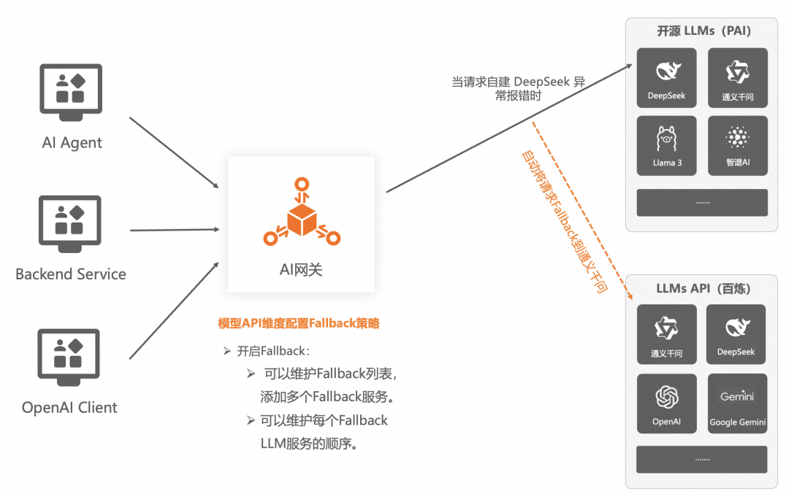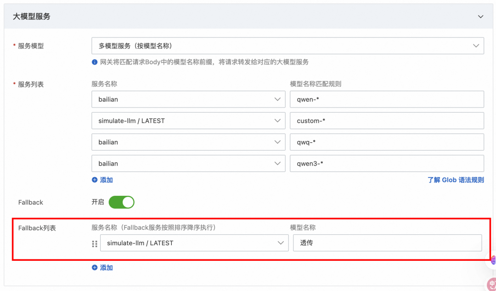

Token维度限流
除了传统的QPS限流降级以外，AI网关支持更贴合LLM推理场景的Token维度的限流能力。可以针对模型API级别配置一个下游LLM服务可以承载的请求量级，在一定程度上保证了整体业务的健壮性，至于被限流的请求，可以返回一些人性化的信息，比如之前DeepSeek官网的服务器繁忙。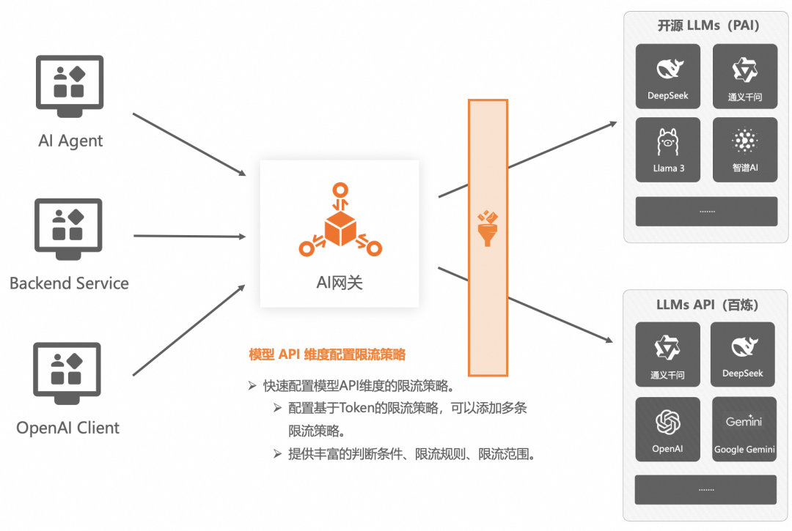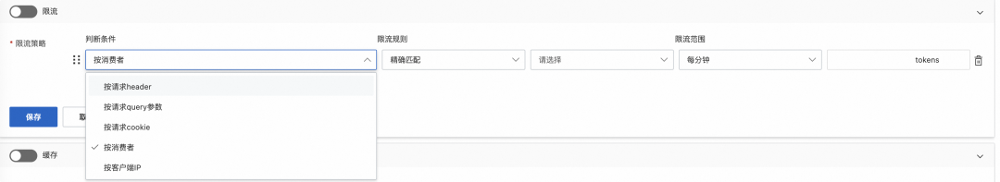我们可以再延伸一下基于Token维度限流的其他核心价值：

  * 成本管理：LLM的费用通常基于Token数量计算，限流帮助用户避免超支。例如，服务提供商可能按Token使用量提供不同定价层。

  * 资源管理：LLM需要大量计算资源，限流防止系统过载，确保所有用户都能获得稳定性能，尤其在高峰期。

  * 用户分层：可以基于消费者或者API Key进行Token限流。

  * 防止恶意使用：通过限制Token数量来减少垃圾请求或攻击。

解决安全合规问题
AI应用场景下的内容安全问题是大家都很重视的核心问题，模型托管平台通常都自带好几层内容安全审核机制，但是我们在IDC部署或者在PAI部署的，如何能方便的接入内容安全审核服务？
AI网关中的模型API集成了阿里云的内容安全防护服务和AI安全护栏能力，可以一键开启，支持请求内容检测和响应内容检测。不过安全防护的规则还是要在内容安全服务侧配置。比如“树中两条路径之间的距离”这个可以让LLM无限推理的问题，从内容安全的常规规则来看，它是合规的，但是它却能对LLM服务的稳定性造成隐患，所以在AI网关开启了内容安全防护后，便可以快速的在内容安全防护服务中添加自定义规则来杜绝这类有潜在风险的请求信息。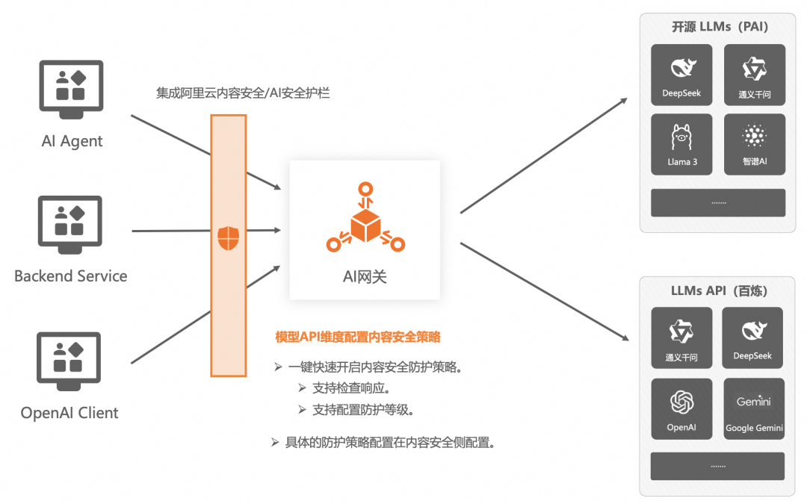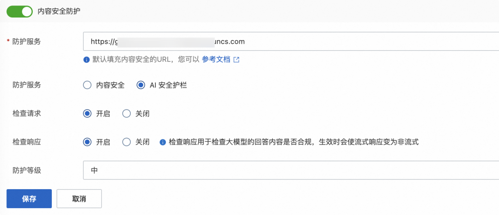延伸到内容安全在AI领域的核心价值有五类：

  * 防止攻击：验证输入可以阻止恶意提示注入，防止模型生成有害内容。

  * 维护模型完整性：避免输入操纵模型，导致错误或偏见输出。

  * 用户安全：确保输出没有有害或误导性内容，保护用户免受不良影响。

  * 内容适度：过滤掉不适当的内容，如仇恨言论或不雅语言，特别是在公共应用中。

  * 法律合规：确保输出符合法律和伦理标准，尤其在医疗或金融领域。

解决大语言模型幻觉的问题
有些个人用户或者企业用户可能会发现部署了DeepSeek R1 671B的模型，但推理的结果和DS官网推理的结果有差距，似乎不满血？
推理的结果和DeepSeek官网推理的结果有差距是因为DeepSeek官网开启了联网搜索。DeepSeek R1 671B的模型推理能力是很强，但训练的数据也是有限的，所以要解决幻觉还需是要在推理前先搜索和处理出比较确切的信息后，再由DeepSeek R1推理，所以联网搜索是非常关键的。目前模型托管平台提供的DeepSeek R1 API和自己部署的DeepSeek R1都需要自己实现联网搜索。
其实不只是DeepSeek，目前除了百炼上的通义千问Max以外，其他的模型在API层面都不支持联网搜索，即使ChatGPT是最早推出联网搜索功能的，但OpenAI的API协议目前也还没有支持联网搜索。
AI网关目前在模型API维度支持了夸克的联网搜索能力，提供多种搜索策略，可将搜索结果自动如何进输入Prompt，无需用户对后端LLM服务做额外处理，并且我们对输入的问题也通过LLM做了意图识别和问题拆分，避免了很多无效的联网搜索，以及提高搜索内容的精准度。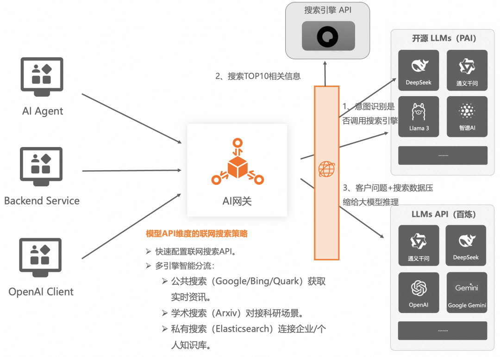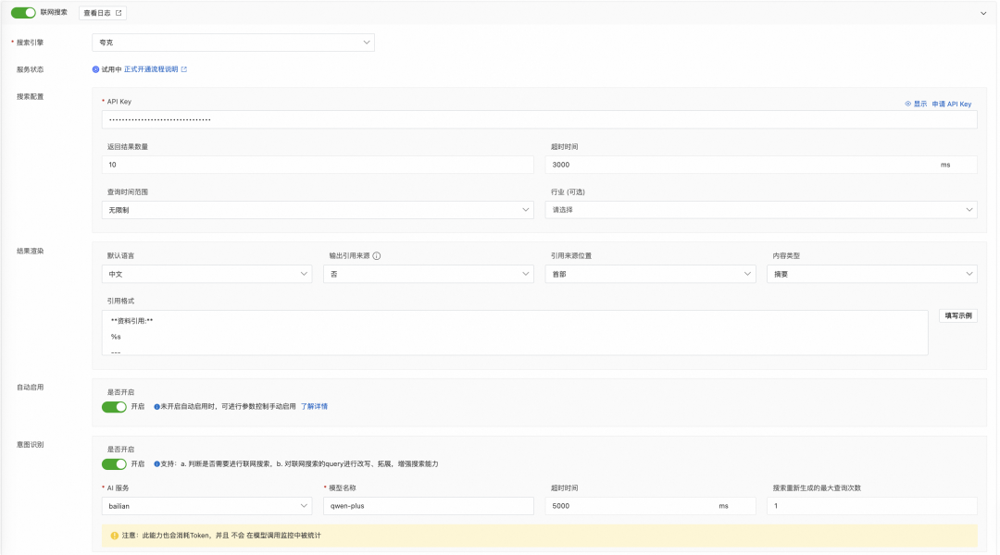

LLM服务动态负载
很多使用PAI或者ACK部署LLM的用户，经常会遇到GPU服务负载不均的情况，这也是AI领域中比较常见的问题。我们和做基模的六小龙都交流过GPU服务动态负载的问题，每家的实现方式各不相同，并且实现难度比较大，好几个头部客户的做法是使用Redis将请求和GPU服务分离，等GPU服务执行完之后主动去Redis拿任务，从而解决GPU负载不均的问题。也有一些客户是自研或魔改vllm/sglang/trt推理框架，在模型网关层从推理框架侧获取到GPU服务的执行状态以及GPU资源的使用情况，从而判断做动态负载。
目前AI网关内部已经实现了基于vllm和sglang两个推理框架提供的监控指标来动态负载LLM服务的能力，AI网关可以基于这些指标来决定路由流量到哪个节点，帮助用户提升GPU的资源利用率，从而优化成本和提升推理效率。模型API可观测
可观测是任何一个领域都必不可少的需求，但是AI场景的可观测和传统场景的可观测是有很大区别的，监控和关注的指标都是不同的，AI网关结合阿里云日志服务和可观测产品实现了贴合AI应用业务语义的可观测模块和AI观测大盘，支持比如Tokens消费观测，流式/非流式的RT，首包RT，缓存命中等可观指标。同时所有的输入输出Tokens也都记录在日志服务SLS中，可供用户做更详细的分析。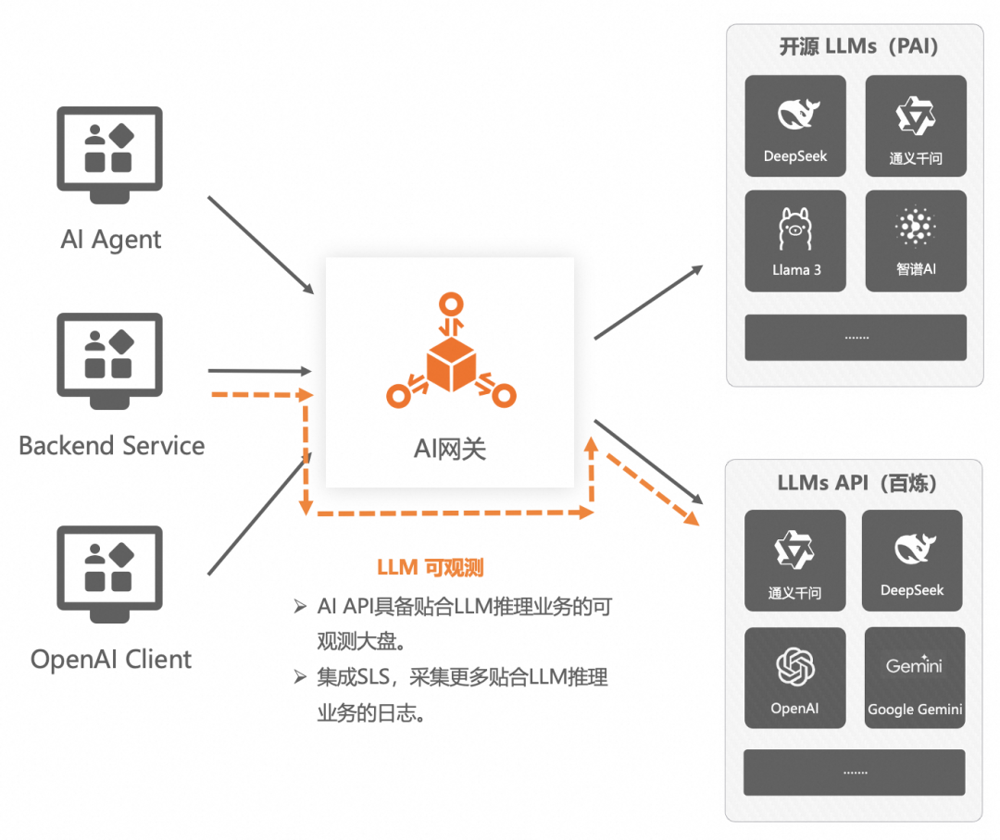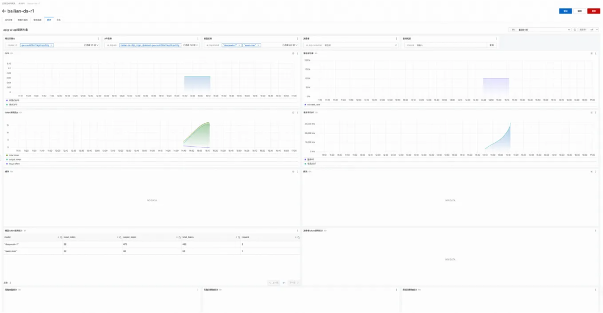AI 网关模型API的可观测核心能力：

  * 访问日志，其中的ai_log字段可以自动打印大语言模型的输入、输出。

  * 大语言模型的metrics信息： 首字延时（TTFT-Time To First Token）, tokens per second。

  * 传统指标： QPS( request per second), RT(延时），错误率。

  * 网关功能指标：

  * 基于consumer的token消耗统计(需要把consumer的header信息加到sls的日志里）

  * 基于模型的token消耗统计。

  * 限流指标: 每单位时间内有多少次请求因为限流被拦截; 限流消费者统计（是哪些消费者在被限流）。

  * 缓存命中情况。

  * 安全统计：风险类型统计、风险消费者统计。

### AI Agent使用LLM方式总结

将近3个月，我们交流了200多个客户，无论是编码方式构建AI Agent还是流程方式构建AI Agent，使用LLM时遇到的问题基本上逃不出我上面总结那些问题，所以使用LLM的最佳实践就是通过AI网关代理LLM这种方式，在AI网关的模型API上根据业务需求做各类管控，在稳定性、灵活扩展性（适配业务多样性）、成本优化等方面帮AI Agent的大脑具有足够的健壮性。

## AI Agent 技能 - MCP

上文中解析了AI Agent的第二个核心组件是工具，它为AI Agent提供外部能力，各类业务服务，数据库服务，存储服务等等。既执行LLM做出的决策。
然而，无论是和各种Tools（各类业务服务接口）交互，还是和各类各类存储服务接口交互，都是通过HTTP协议的，和各类Tools的交互都需要逐一了解它们的返回格式进行解析和适配。当一个AI应用包含多个AI Agent时，或者一个AI应用需要和多个业务服务接口和存储服务接口交互时，整体的开发工作量是很大的：

  * 找适合该AI应用的业务接口和存储服务接口：

  * 找三方服务接口。

  * 在公司内部找合适的服务的接口。

  * 找不到就自己先开发接口。

  * 解析接口的返回格式：无论是三方服务接口还是公司内部的服务接口，返回格式可能都千奇百怪，需要逐一进行了解和解析。

直到MCP的出现，让我们看到真正解决AI Agent使用和管理工具复杂度的问题。

### MCP 是什么

MCP是模型上下文协议（Model Context Protocol）的简称，是一个开源协议，由Anthropic（Claude开发公司）开发，旨在让大型语言模型（LLM）能够以标准化的方式连接到外部数据源和工具。它就像AI应用的通用接口，帮助开发者构建更灵活、更具上下文感知能力的AI应用，而无需为每个AI模型和外部系统组合进行定制集成。MCP被设计为一个通用接口，类似于USB-C端口，允许LLM应用以一致的方式连接到各种数据源和工具，如文件、数据库、API等。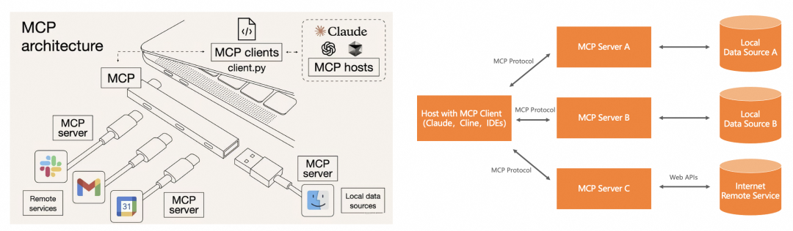MCP目前一共有3个核心概念：

  * MCP Server：

  * 基于各语言的MCP SDK开发的程序或服务。

  * 基于某种神秘的机制将现存的程序或服务进行了转换，使其成为了MCP Server。

  * MCP Tool：

  * MCP Tool所属于MCP Server，一个MCP Server可以有多个MCP Tool。可以理解为一个类里有多个方法，或者类似一个服务里有多个接口。

  * MCP Client：当一段代码，一个AI Agent，一个客户端，基于MCP的规范去使用、去调用MCP Server里的MCP Tool时，它就是MCP Client。

MCP 的运作机制
要真正理解MCP是什么，我们需要了解它的运作机制，然后你就能知道MCP的调用方式和传统的HTTP调用方式有什么不同，可能也能隐约体会到为什么我说MCP可以让AI Agent进入第二阶段。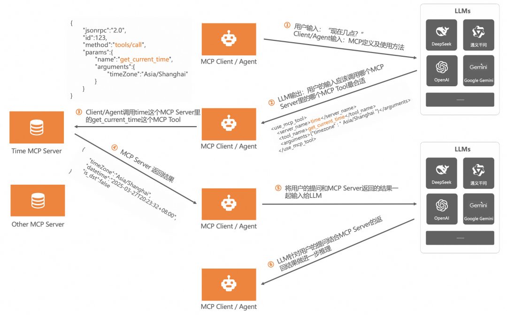如上图所示，一次基于MCP的调用，一共有6个核心的步骤。我们先拟定一个前提：

  * 我要开发一个获取时间的AI Agent，用户在使用这个AI Agent时，只需要问类似“现在几点了？”这种问题即可。

  * 我已经有了一个关于处理时间的MCP Server，这个MCP Server里有2个MCP Tool，一个负责获取当前时区，一个负责获取当前时间。

调用步骤解析：

  * 第一步：用户向AI Agent问“现在几点了？”，此时AI Agent就是MCP Client，它会把用户的问题和处理时间的MCP Server以及MCP Tool的信息一起发送给LLM。

  * 第二步：LLM拿到信息后开始推理，基于用户的问题和MCP Server的信息，选出解决用户问题最合适的那个MCP Server和MCP Tool，然后返回给AI Agent（MCP Client）。

  * 这里LLM返回给AI Agent的信息是：“你用time这个MCP Server里的get_current_time这个MCP Tool吧，它可以解决用户的问题”

  * 第三步：AI Agent（MCP Client）现在知道该使用哪个MCP Server里的哪个MCP Tool了，直接调用那个MCP Tool，获取结果。

  * 调用time这个MCP Server里的get_current_time这个MCP Tool。

  * 第四步：Time MCP Server返回结果（当前的时间）给AI Agent（MCP Client）。

  * 第五步：AI Agent（MCP Client）也很懒啊，把用户的问题和从Time MCP Server处拿到的结果再一次给了LLM，目的是让LLM结合问题和答案再规整一下内容。

  * 第六步：LLM把规规整整的内容返回给AI Agent（MCP Client），最后AI Agent（MCP Client）再原封不动的返回给了用户。

在MCP的整个调用过程中有一个非常核心的点就是MCP Server 以及 MCP Tool 的信息。从第一步，第二步可以看出，这个信息非常关键，是它让LLM知道了该如何解决用户的问题，这个信息就是MCP中最重要的System Prompt，本质上就是PE工程。MCP System Prompt

MCP不像传统的协议定义，它没有一个确定的数据结构。它的核心是通过自然语言描述清楚有哪些MCP Server，承担什么作用，有哪些MCP Tool，承担什么作用，然后让大语言模型通过推理去选择最合适的MCP Server以及MCP Tool。所以它的核心本质上还是提示词工程。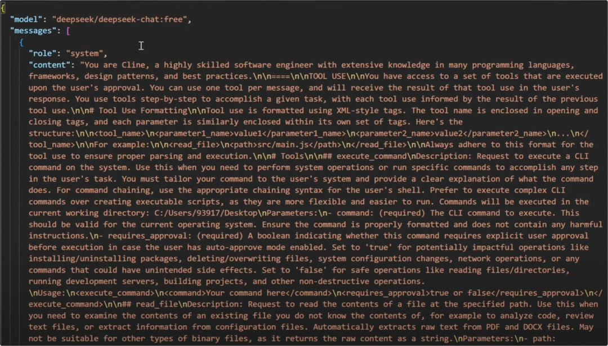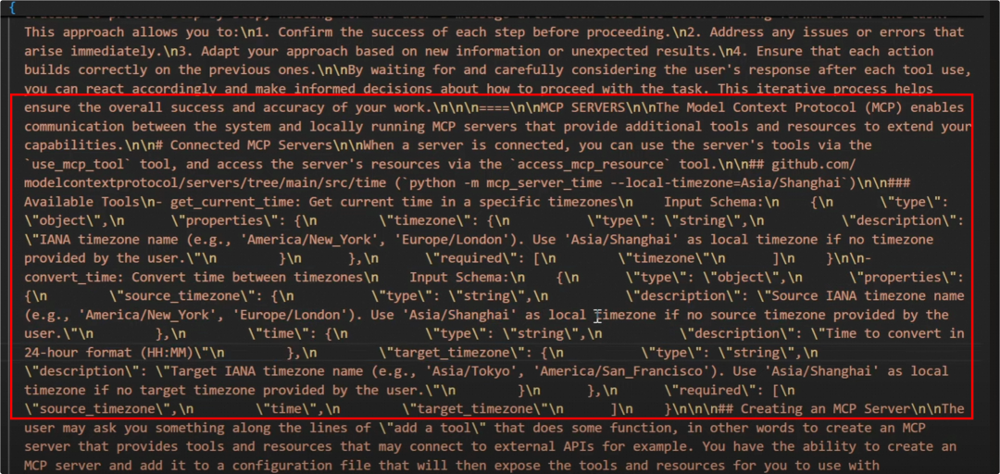上面两张图是Cline（一个MCP Client）中的System Prompt，可以清晰的看到它对MCP Server和MCP Tool都有明确的描述。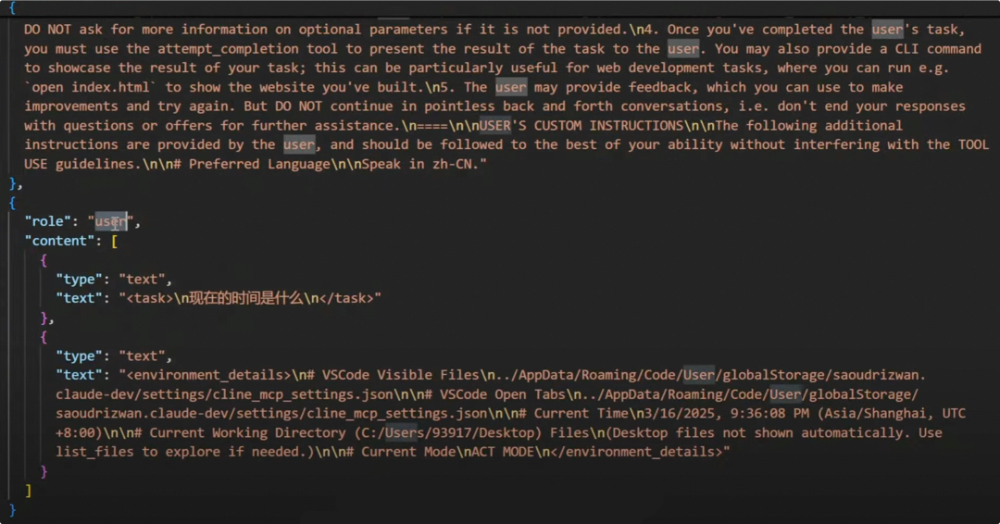上图是流程中的第一步，将用户的问题和System Prompt一起发送给LLM的内容。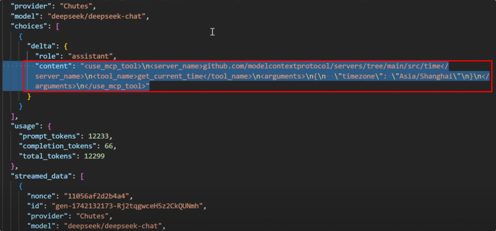上图是流程中的第二步，LLM返回了解决用户问题明确的MCP Server和MCP Tool信息。MCP 和 Function Calling 之间的区别
看到这，我想大家应该对MCP是什么有一定感觉了。MCP是不是解决了找接口和解析接口的问题？因为这两个工作都交给了LLM。

  * LLM负责帮AI Agent找到最合适的接口。

  * AI Agent调用接口，压根不用做返回结果的解析，原封不动再交给LLM。

  * LLM结合用户问题和接口返回的结果，做内容规整处理。

那么可能有小伙伴会问，MCP和LLM的Function Calling又有什么区别呢？核心区别是是否绑定模型或模型厂商：

  * MCP 是通用协议层的标准，类似于 “AI 领域的 USB-C 接口”，定义了 LLM 与外部工具 / 数据源的通信格式，但不绑定任何特定模型或厂商，将复杂的函数调用抽象为客户端-服务器架构。

  * Function Calling是大模型厂商提供的专有能力，由大模型厂商定义，不同大模型厂商之间在接口定义和开发文档上存在差异；允许模型直接生成调用函数，触发外部 API，依赖模型自身的上下文理解和结构化输出能力。

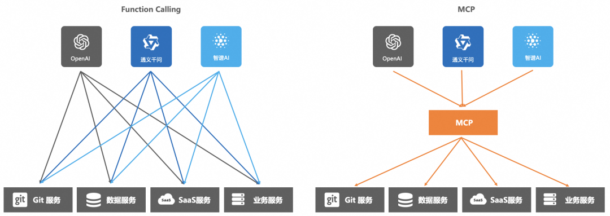如上图所示，LLM Function Calling 需要LLM为每个外部函数编写一个 JSON Schema 格式的功能说明，精心设计一个提示词模版，才能提高 Function Calling 响应的准确率，如果一个需求涉及到几十个外部系统，那设计成本是巨大，产品化成本极高。而 MCP 统一了客户端和服务器的运行规范，并且要求 MCP 客户端和服务器之间，也统一按照某个既定的提示词模板进行通信，这样就能通过 MCP 加强全球开发者的协作，复用全球的开发成果。MCP 的本质和挑战
根据上文的一些列解释，我们可以总结一下MCP的本质：模型上下文协议（Model Context Protocol）并不是一个确定的数据格式或数据结构，它是描述MCP Server/MCP Tool信息的系统提示词和MCP Server与LLM之间的协同关系的结合，解决的是找接口和解析接口的问题。

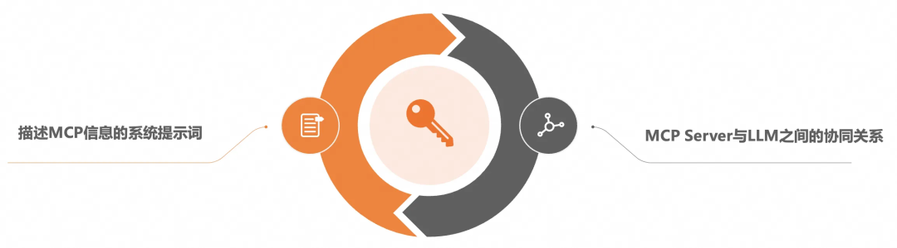明确了MCP本质之后，将其带入到企业级生产应用中，你就会发现，这两个核心点上会有很多挑战，或者说不足。描述MCP信息的系统提示词的挑战

  * 系统提示词的安全性如何保证？

  * 这个最核心的系统提示词如果被污染了，LLM就不能准确知道你有哪些MCP Server，有哪些MCP Tool，甚至可能告诉LLM错误的，有安全漏洞的MCP Server和MCP Tool，那么对你的AI应用来说将是巨大的风险，会导致整个MCP流程的瘫痪。

  * 系统提示词如何管理？

  * MCP Server或者MCP Tool有了新版本，系统提示词应该也许要有对应的版本管理策略。

  * 系统提示词写的不好，如何方便的快速调试？能不能实时生效？

  * 系统提示词是没有标准定义的，理论上每个企业可以定义自己的系统提示词模板，类似PE工程。提示词不可能一次性就能写好，需要反复调试，需要有机制做快速的调整，并且可以做到使其实时生效。

  * 如果MCP Server很多，那么系统提示词会非常长，岂不是很消耗Token？如何缩小或精确MCP Server和MCP Tool的范围？

  * 如果你有几十个或更多MCP Server，那么就有可能有上百个或更多MCP Tool，所有的信息描述下来放在系统提示词后，这个提示词模板会非常大，显而易见的对Token消耗非常大，变相的就是成本高。应该需要一套机制，基于用户的问题，预圈选MCP Server和MCP Tool的范围，减少Token，提高效率，很类似联网搜索里的意图识别。

AI Agent(MCP Client)与MCP Server之间协同关系的挑战

  * 负责做协同的是MCP Client，但目前MCP Client很少，比如Cline， Claude，Cursor等，而且都是C/S工具，支持的都是SSE协议，企业级的AI应用该如何结合？能不能结合？

  * 基本上目前市面中的MCP Client都无法和企业级的AI应用做结合，SSE这种有状态的协议有很多弊端，比如不支持可恢复性，服务器需要维持长期连接，仅支持服务器 → 客户端消息，无法灵活进行双向通信等。

  * 现存的传统业务能快速转成MCP Server吗？能0代码改动的转换吗？

  * 开发一个MCP Server是强依赖各语言的MCP SDK的，目前只支持Python、Java、TS、Kotlin、C#。那如果是Go或者PHP技术栈的企业怎么办？并且那么多现存的业务全部用MCP SDK重构一遍，工作量巨大，也很不现实。

  * MCP Server 会很多，如何统一管理？

  * 有自己开发的MCP Server，有三方的MCP Server，还有大量通过某种神秘机制将传统业务转换而来的MCP Server。这些都应该有一个类似MCP Hub或MCP 市场的东西统一管理起来，方便MCP Client去使用。

  * 企业级AI应用中，身份认证、数据权限、安全这些如何做？

  * 在企业级的应用中，无论哪种协议，哪种架构，哪种业务。身份认证、数据权限、安全防护这些问题都是永远绕不开的。那么在MCP这种协同方式下如何实现。

### MCP Registry 定义及特性

Anthropic对MCP Registry的官方定义：The MCP Registry service provides a centralized repository for MCP server entries. It allowsdiscovery and management of various MCP implementations with their associated metadata, configurations, and capabilities.
从官方的定义中可以抽象出两个核心定义：

  * 一个集中式管控的MCP服务仓库。

  * 可以动态发现和管理MCP服务仓库中的各种MCP服务。

Anthropic公布的MCP Registry的特性：

  * RESTful API for managing MCP registry entries (list, get, create, update, delete)

  * Health check endpoint for service monitoring

  * Support for various environment configurations

  * Graceful shutdown handling

  * MongoDB and in-memory database support

  * Comprehensive API documentation

  * Pagination support for listing registry entries

### 使用MCP Registry构建AI Agent技能池的优势

我们还是将AI Agent类比为角色扮演游戏中的角色，目前绝大多数的游戏，无论哪种类型，都有自己的一套技能系统，只是复杂度的差别而已。既然是统一的技能系统，那么意味着无论是低阶技能还是高阶技能，玩家都是在同一个地方去查看技能，游戏角色都是在同一个地方去学习、升级、管理技能，我还没见过哪个游戏学习技能要去不同的地图，在不同的NPC处学习。
回到MCP范式，目前会有2个问题：

  * 无论MCP服务复杂与否，都有自己的Endpoint，如果你要对接10个MCP服务，需要配置10个Endpoint，也就意味着你的AI Agent无法自动学习技能，并且学习技能的方式成本较高，维护成本也比较高。

  * 你该去哪找你需要的MCP服务？有服务商自己发布在自己的平台的，有做MCP服务聚合市场的，还有企业内部的私有MCP服务市场。也就是MCP服务的来源繁杂，并且每个MCP服务都没有统一的管理方式，尤其是鉴权认证方式，所以进一步提升了AI Agent学习技能的复杂度，降低了AI Agent快速学习技能的可能性。

所以Anthropic定义了MCP Registry，目的是就期望解决以上两个问题，从而让AI Agent在获取MCP时，只需要从一个地方找MCP服务即可。

> 从我们和Anthropic MCP团队的沟通交流来看，他们的野心是想构建一个类似Maven一样的大中心MCP Registry。

但Anthropic在定义MCP Registry时又忽略了一些企业级的能力，所以这是需要MSE Nacos来补足的，也是MSE Nacos作为MCP Registry的核心优势。MSE Nacos 3.0 MCP Registry 的优势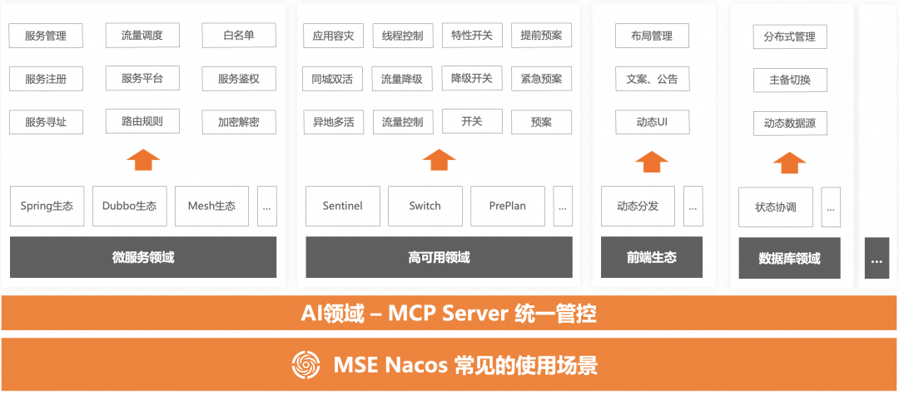我们团队是中间件开源最多的团队，比如Nacos，Higress，Sentinel，RocketMQ，Seata等，并且还维护着Spring Cloud Alibaba，Spring AI Alibaba，Dubbo等这些开源开发框架，在微服务架构领域有着丰富的经验。所以在MCP Server和MCP提示词统一管理这个点上，天然的就想到了微服务领域里基于Nacos做服务注册发现和配置统一管理的模式，我们将其转嫁到了MCP范式，大家可以想一下以下这些对应关系：

  * SpringCloud服务/Dubbo服务/Go服务 -> 各类MCP Server

  * SpringCloud服务/Dubbo服务/Go服务暴露的接口 -> 各类MCP Server提供的MCP Tool

  * SpringCloud服务/Dubbo服务/Go服务暴露的接口描述 -> 各类MCP Server提供的MCP Tool的描述

  * SpringCloud服务/Dubbo服务/Go服务的配置文件 -> 各类MCP Server的系统提示词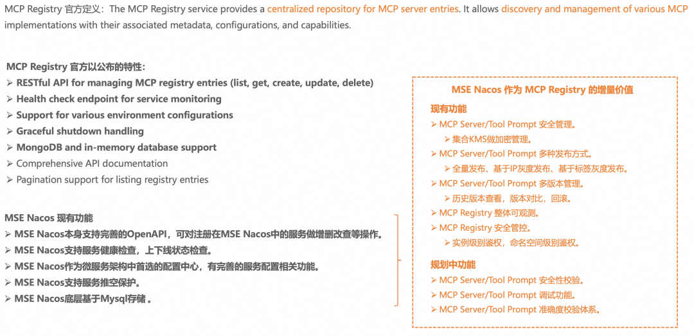

我们拿MSE Nacos现有的的功能和Anthropic对MCP Registry的定义做一下对照：

  * MSE Nacos本身支持完善的OpenAPI，可对注册在MSE Nacos中的服务做增删改查等操作。

  * MSE Nacos支持服务健康检查，上下线状态检查。

  * MSE Nacos作为微服务架构中首选的配置中心，有完善的服务配置相关功能。

  * MSE Nacos支持服务推空保护。

  * MSE Nacos底层基于Mysql存储。

MSE Nacos的现有能力和Anthropic对MCP Registry的定义几乎完全一致。除此以外，MSE Nacos作为MCP Registry还有其他更贴近企业级的增量价值：

  * 现有功能：

  * MCP Server/Tool Prompt 安全管理。

  * 集合KMS做加密管理。

  * MCP Server/Tool Prompt 多种发布方式。

  * 全量发布、基于IP灰度发布、基于标签灰度发布。

  * MCP Server/Tool Prompt 多版本管理。

  * 历史版本查看，版本对比，回滚。

  * MCP Registry 整体可观测。

  * MCP Registry 安全管控。

  * 实例级别鉴权，命名空间级别鉴权。

  * 规划中的功能：

  * MCP Server/Tool Prompt 安全性校验。

  * MCP Server/Tool Prompt 调试功能。

  * MCP Server/Tool Prompt 准确度校验体系。所以在MSE Nacos这个产品中，我们做了一系列增强MCP的能力，使MSE Nacos成为统一管理MCP Server的MCP Register（MCP Server注册/配置中心），是AI Agent技能池的的核心组件。

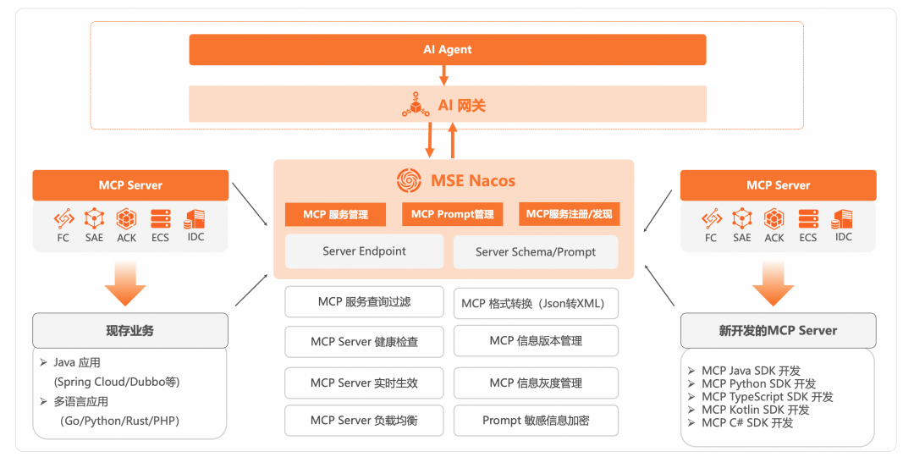MSE Nacos 3.0 定义 MCP Registry 超集（企业级MCP Registry）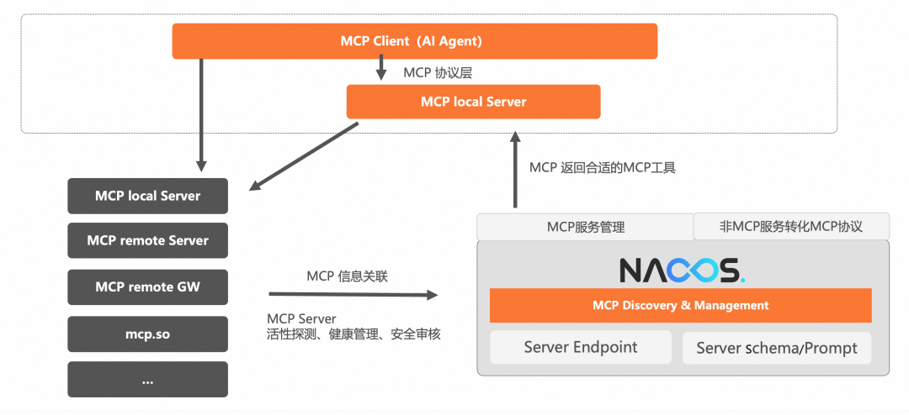Anthropic对MCP Registry虽然有标准，但目前核心只关注在统一公共数据源和定义MCP服务元数据规范这两点。官方也明确了有一些问题是不会去解决的，比如：

  * 私有化MCP Registry。

  * 基于MCP服务名称以外的高级检索能力。

  * MCP服务Prompt的安全管控问题。

所以MSE Nacos 3.0 带来的 MCP Registry 是官方 MCPRegistry 的一个超集，除了兼容官方定义的MCP元数据格式、和API外，MSE Nacos 3.0 同时提供了结合AI网关，HTTP 转换 MCP 的能力，结合阿里云 KMS提供 MCP 服务敏感数据加密的能力，同时结合目前开源的 Nacos router 也可以实现智能路由检索的能力，解决多MCP服务检索token消耗量大的问题。AI网关 + MSE Nacos MCP Registry 构建AI Agent技能池的优势

  * MSE Nacos作为MCP Registry可对MCP服务统一安全管理：

  * 传统服务转换MCP服务，原生MCP服务都可以在一个地方闭环管理。

  * MCP服务工具的Prompt具备版本管理和加密管理。

  * MCP Registry自身具备高性能、高稳定性。（被社区，各类外部企业，阿里集团各业务充分验证和打磨）

  * AI网关统一代理MCP服务增强MCP服务的管控和扩展：

  * 针对MCP服务配置策略，或通过插件机制配置贴合业务的策略。比如限流降级、各类型的鉴权认证等。

  * 使MCP服务同时支持SSE和Streamable HTTP两种传输协议。降低AI Agent与MCP服务交互的开发成本。（可无需单独开发支持SSE的方式）

  * 针对MCP服务的工具粒度，重新组装MCP服务。你可以让一个重新组装后的MCP服务（一个Endpoint）包含所有各种类型的工具，比如将高德MCP服务和企业内部HTTP服务转换的MCP服务的能力在AI网关层面聚合在一个MCP服务里，这样对AI Agent来说，只需要配置一个MCP服务的Endpoint，就可以获取到各类型的MCP服务工具（消费者授权范围内的）。当然你可以按照不同的领域来组装MCP服务，类似前后端分离的BFF的逻辑。这样你就可以灵活构建你的AI Agent技能池系统。

通过这种方式构建的技能池，当需要AI Agent学习新技能时，不需要AI Agent做任何改动，你只需要在MSE Nacos中创建新的MCP服务，通过AI网关同步，编辑组装后的逻辑MCP服务，添加新的工具，然后向AI Agent对应的消费者里增加新工具的授权。然后你的AI Agent就自动学会了新的技能。Streamable HTTP 的优势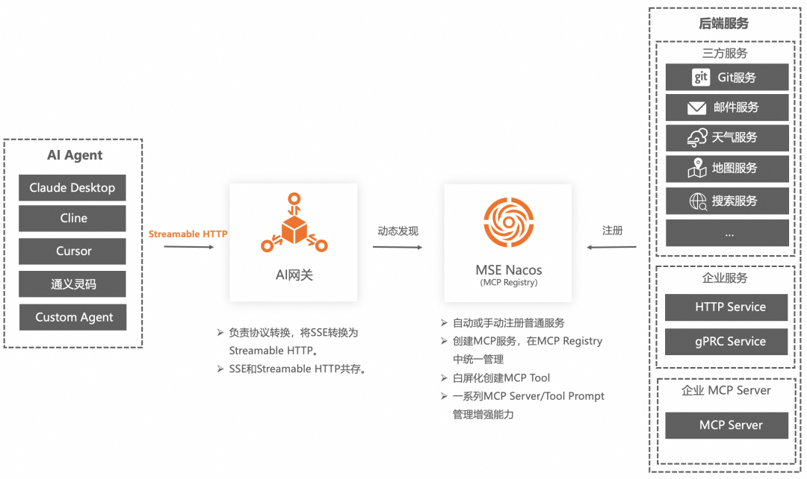MCP范式默认的传输协议是SSE（Server Sent Event），本质上是一种长连接，有状态的传输协议。这种协议在企业级应用中有很多弊端：

  * 不支持可恢复性（Resumability）：连接断开后，客户端必须重新开始整个会话。

  * 服务器需要维持长期连接（High Availability Requirement）：服务器必须保持高可用性，以支持持续的 SSE 连接。

  * SSE 仅支持服务器 → 客户端消息，无法灵活进行双向通信。

  * 目前只有少数几个C/S架构的客户端和MCP提供的用于测试验证的Web客户端支持MCP范式和SSE协议。无法用在企业级的生产应用中。

好在MCP官方也意识到了该问题，所以在3月下旬，发布了新的Streamable HTTP协议。Streamable HTTP改变了MCP的数据传输方式，让协议变得更灵活、更易用、更兼容：

  * 更灵活：支持流式传输，但不强制。

  * 更易用：支持无状态服务器。

  * 更兼容：适用于标准 HTTP 基础设施。

简单来说，原来的MCP传输方式就像是你和客服通话时必须一直保持在线（SSE 需要长连接），而新的方式更像是你随时可以发消息，然后等回复（普通 HTTP 请求，但可以流式传输）。
这里大家可以思考一下：

  * Streamable HTTP打破了目前几个C端MCP Client的壁垒。也就意味着任何请求方（甚至就是一段简单的HTTP Request代码），都可以像请求标准HTTP API的方式一样和MCP Server交互。

  * 换句话说，当可以使用标准HTTP API的方式和MCP Server交互后，是不是就不存在所谓的MCP Client了？

所以Streamable HTTP传输协议是MCP服务赋能AI Agent的基石。而在上文中，大家应该不难发现，无论是AI网关直接转换，还是基于MSE Nacos MCP Registry转换，都是支持Streamable HTTP的，甚至可以让一个不支持Streamable HTTP传输协议的三方MCP服务具备Streamable HTTP的能力。对MCP服务做灵活的策略管控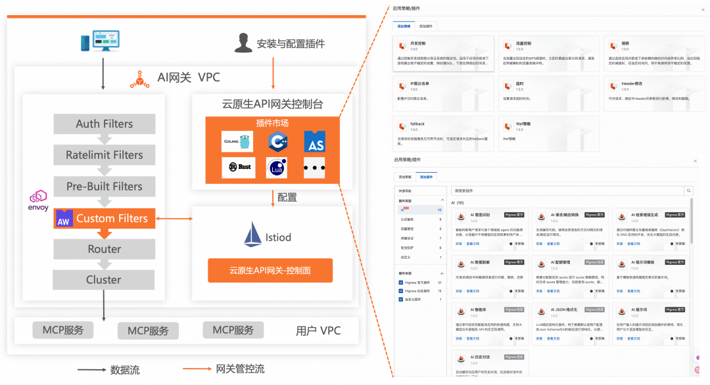AI网关侧对MCP服务的代理，无论是原生MCP服务的代理，还是HTTP服务转换而来的MCP服务，都可以复用AI网关内核的插件机制，可以对MCP服务灵活的设置预置策略或插件，如果有更贴近业务的需求，还可以开发自定义插件来实现。通常客户会使用插件机制实现MCP服务的限流降级，一方面做后端服务安全保障，另一方面是实现MCP服务的成本管控（三方原生MCP服务）。MCP范式下的身份认证和权限管控
身份认证和权限管控在任何架构，任何业务场景下都是刚需，在MCP范式下也不例外，这里有三个层面的权限管控：

  * AI Agent（Client）有权使用哪些MCP服务。有权使用某MCP服务里的哪些工具。

  * AI Agent（Client）调用MCP工具时，MCP服务的鉴权认证。

  * AI Agent（Client）调用MCP工具时，通过MCP服务鉴权认证后，进一步的的数据权限。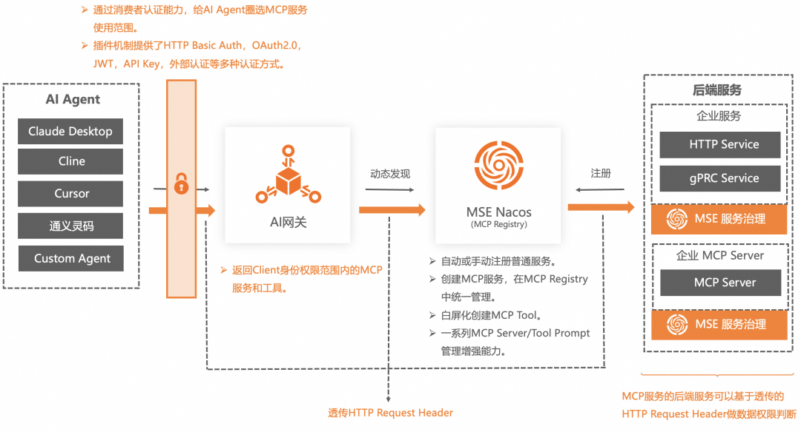

1）MCP服务和工具数量的使用权限大家设想一下，当传统业务可以0代码转换为MCP服务后，注册在Nacos中的MCP服务和工具肯定会有很多，从业务领域来说，可能有和财务相关的MCP服务，有和销售相关的MCP服务，有和售后服务相关的MCP服务。在返回MCP服务和工具信息时不可能将所有信息都返回，肯定只能返回AI Agent（Client）身份有权使用的MCP服务信息。
目前MCP服务和工具的数量管控，主要通过AI网关的消费者认证体系来实现，每个消费者可以授权MCP服务及工具，然后将消费者分配给某AI Agent（既AI Agent从AI网关请求MCP服务信息时Header里需要带着消费者的API Key），那么该AI Agent能获取到哪些MCP服务和工具的信息就可以被灵活的管控和配置了。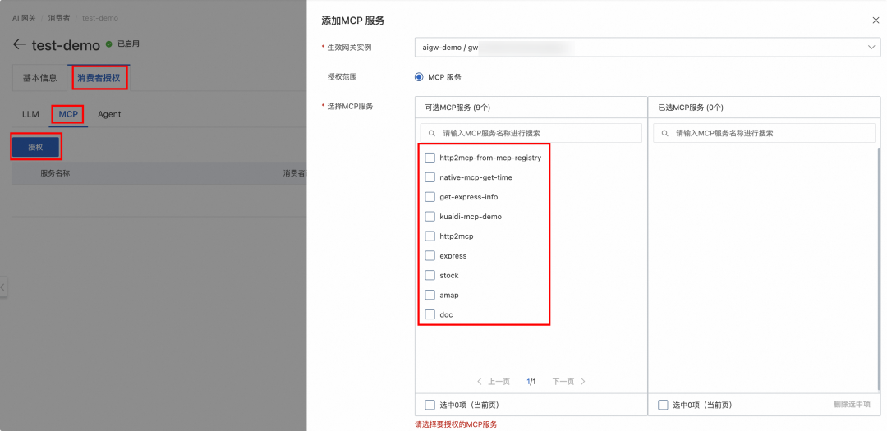

2）MCP服务和工具的鉴权认证
MCP服务自身的鉴权认证同样分原生MCP服务和HTTP服务转MCP服务两种类型来说：

  * 原生MCP服务：官方定义的MCP服务认证方式是Header里传API Key的方式，目前市面上绝大部分三方原生MCP服务的鉴权认证都支持的是这种方式。但也有少数三方MCP支持的是URL的参数中传Key的方式，比如高德MCP服务。

  * AI网关和MSE Nacos MCP Registry都支持。

  * HTTP服务转MCP服务：这种类型的MCP服务的鉴权认证方式取决于传统HTTP服务的鉴权方式，比如API Key，JWT，HMAC，OAuth2.0等。

  * 如果是API Key的方式，AI网关和MSE Nacos MCP Registry都支持。

  * 如果是非API Key的方式，可以通过AI网关的各类认证插件来实现。

3）MCP服务和工具的数据权限
当MCP服务是数据类服务时会比较常见，比如Mysql MCP Server，Redis MCP Server等。权限会下探到库级别，表级别。在这种场景下，AI网关可以通过插件机制，改写或增加Request Header的值，结合MSE治理将Header的值透传下去，然后在服务内部进一步做数据权限管控。
我举例一个通过这种方式实现的数据库读写分离的场景：

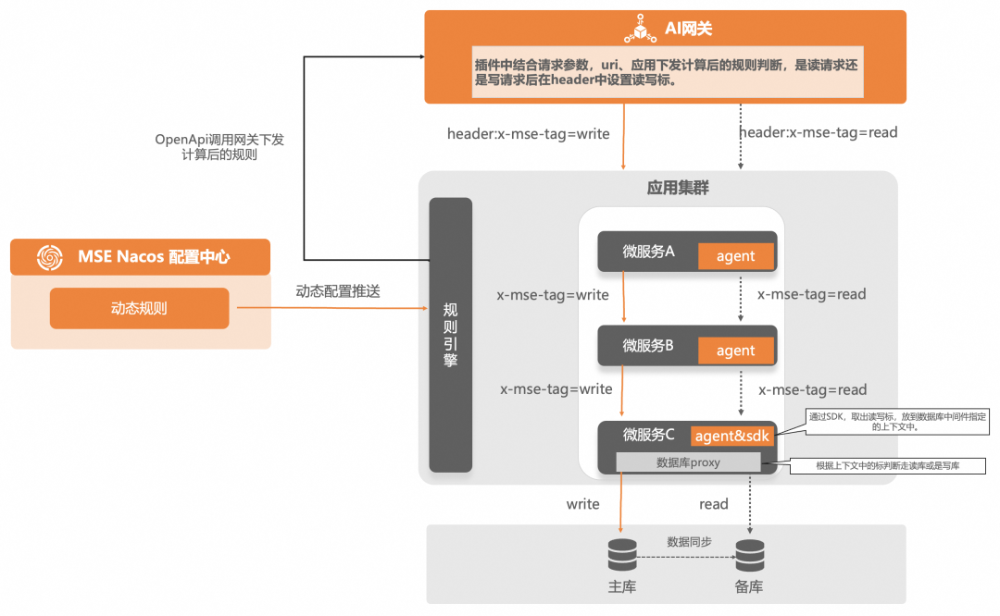

### 如何构建MCP服务

Anthropic提供了各编程语言的MCP SDK，目前支持C#，Java，Kotlin，Python，Ruby，Swift，TypeScript这7种语言。如果是一个初创公司，没有基础服务的积累，那么使用MCP SDK开发新的MCP服务是合理的。但是如果是一个存在了几年甚至十几年的公司，已经积累了很多业务服务，希望这些业务服务的能力能作为AI Agent的左膀右臂，那么使用MCP SDK将这么多的存量业务重新开发一遍，显然是不可能的，况且MCP SDK现在还没有支持Go语言。
所以MCP服务的类型，从构建的角度，可以分为两类：

  * 原生MCP服务：即使用MCP SDK新开发的MCP服务。

  * HTTP转MCP服务：即通过各种方式，将存量的传统服务转换为MCP服务。

基于函数计算FC构建原生MCP服务
众所周知，AI Agent里涉及到LLM推理的场景，相比传统业务，其实是相对稀疏调用的场景。所以这里可以延伸出两个问题：

  * 在稀疏调用的场景下，运行MCP服务的计算资源如何优化资源利用率，说的再直白一些就是如何能做到成本最优。

  * 在新的业务中，如何快速构建MCP服务。

在所有的计算产品中，函数计算FC这种Serverless FaaS类型的计算产品，在资源粒度、弹性策略、弹性效率方面都是最适合稀疏调用场景的。和上文中作为AI Agent的运行时的逻辑是一致的。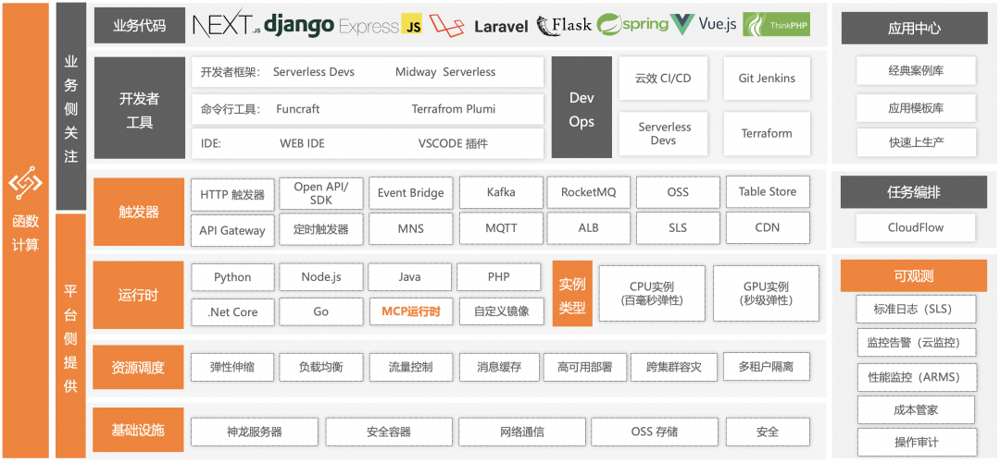函数计算FC目前支持了Python、NodeJS和Java三种语言的MCP运行环境（其他语言的MCP运行环境也马上会支持）。用户选择MCP运行环境创建函数后，只需要编写MCP工具的业务逻辑即可，不需要考虑如何使用MCP SDK。并且AI网关和函数计算FC有深度集成，可以天然适配AI Agent开发的新范式。

> 阿里云百炼平台的MCP服务，底层运行时使用的就是函数计算FC。

在FunctionAI的项目中，可以直接创建MCP服务。
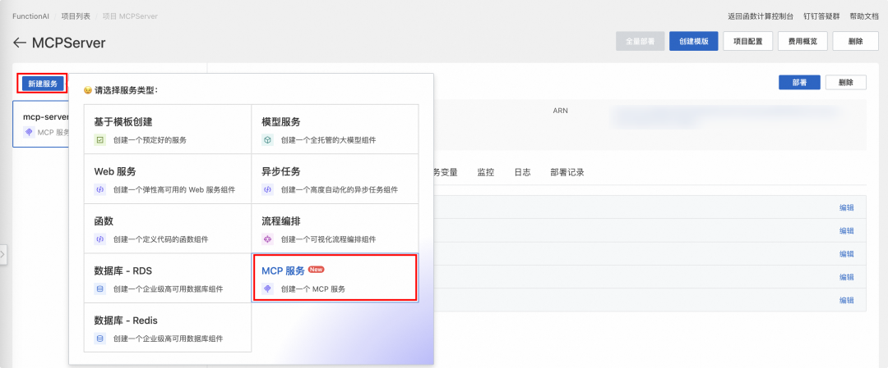这里创建的MCP服务底层就是基于函数计算FC实现的，所以除了MCP需要的传输协议类型、认证、语言（目前支持Java、Python、NodeJS）外，还可以灵活的设置运行该MCP服务的资源规格大小，以及弹性策略、网络配置等。

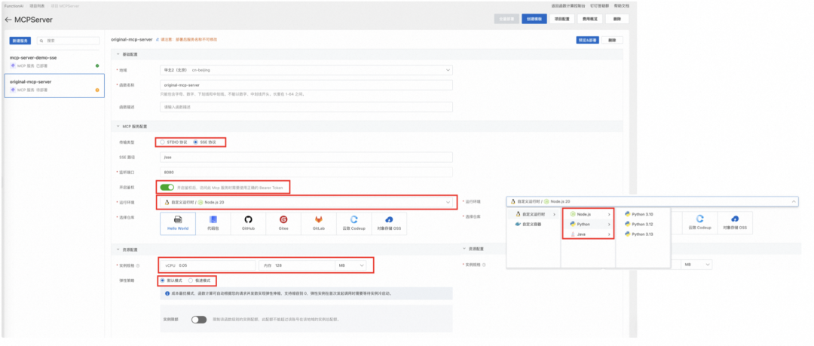创建好MCP服务后，我们只需要填写业务代码即可。

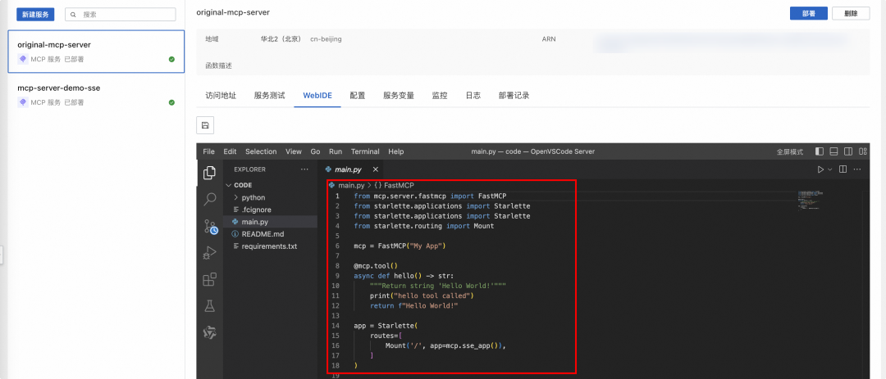

函数计算FC构建MCP服务的成本优势
基于函数计算FC构建的MCP服务在弹性效率方面可以从两个维度来看：

  * 资源规格细粒度管控。

  * 完全按请求弹性。

函数计算FC的实例规格从 0.05C 128MB 到 16C 32GB 不等（也可以支持更大的规格），有几十种规格的组合方式，可以灵活的根据不同MCP服务承载的业务选择合适的资源规格。另外，在AI应用中，尤其是流程式构建的模式中，除了带有Palnning的AI Agent外，大多数AI Agent的职责都相对单一，计算逻辑都不复杂，所以都可以用较小资源规格的函数承载。资源规格小，在资源调度，弹性效率方面自然就会有优势。
再看函数计算FC的弹性机制，它是完全按照请求弹性的，有多少QPS，就拉起对应数量的实例，并且实例可以复用，当QPS降下来后，空闲的实例会自动释放，整个过程完全不需要用户介入参与。在默认按请求弹性的的基础上，用户还可以自行设置按照时间定时弹，或按照指标阈值扩容的策略，进一步满足复杂多变的业务场景，做到资源成本最优。
除此以外，Serverless计算产品，不需要用户关注底层IaaS资源，几乎没有运维的接入，由研发就可以快速创建函数拉起资源做业务开发和测试，所以大幅度提升了研发运维的效率，映射到成本方面，虽然不好量化，但是人力成本，时间成本也是不容忽视的。函数计算FC构建MCP服务的可观测体系
函数计算FC有完善的可观测体系，也就意味着，基于函数计算FC构建的MCP服务同样具备指标、链路、日志三个维度的可观测能力。
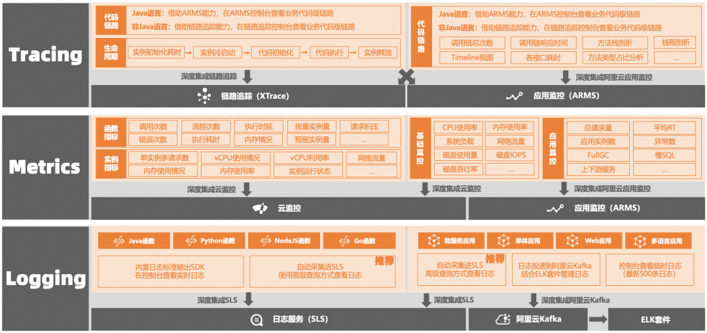通过这套可观测体系，用户可以清晰的了解每个MCP服务的各类运行状态。HTTP服务转MCP服务
在这段时间我们和客户的交流来看，几乎所有的客户都认为最有价值的是使用AI增强、提升现存业务，使其变成一个AI应用或AI加持的业务，而不是完全新开发一套AI应用。所以开发一个AI应用或者做现存业务的AI增强，AI Agent是需要和大量现存业务做交互的，MCP虽然统一的协议，但将现存业务重构为MCP服务的成本是非常高的，并且目前支持的开发语言有限，像Go，PHP都没有对应的MCP SDK，所以会让很多企业想拥抱MCP，但又无从下手。
网关最擅长做的事情就是协议转换，所以AI网关的第二个核心功能就是MCP服务管理，包括：

  * 代理原生MCP服务。

  * HTTP服务转MCP服务。

  * AI网关直接转换。

  * 由MSE Nacos MCP Reristry转换，AI网关动态发现。

  * MCP服务能力组装。

在这个章节，我们主要讨论如何将普通的HTTP服务0代码改造的转为MCP服务，这种转换有两种方式。AI网关直接转换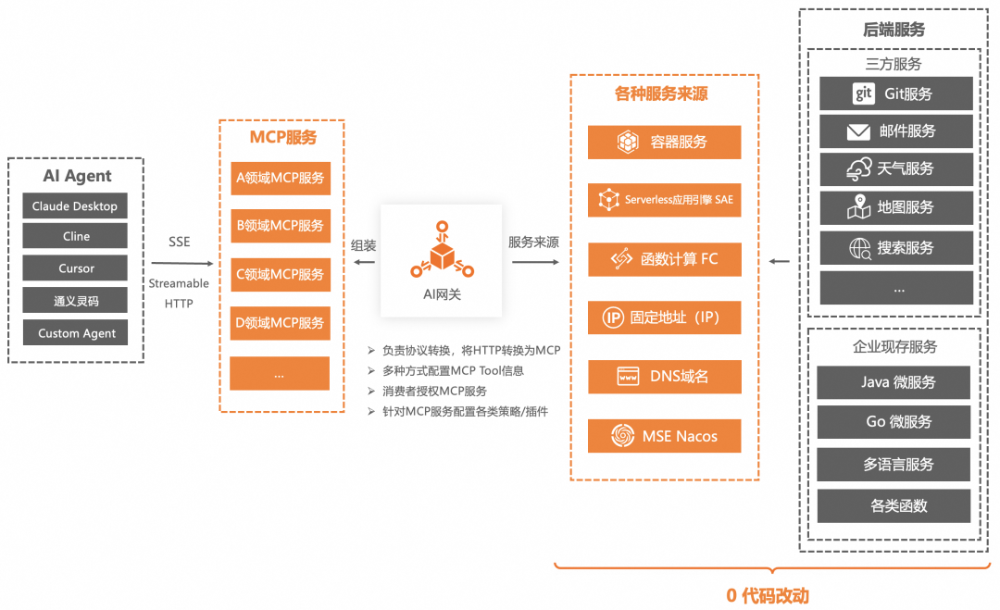1）服务接入
AI网关支持所有主流的服务来源发现方式，可以将部署在各种计算资源上的传统服务接入进AI网关：

  * 容器服务：AI网关和ACK做了深度集成，直接选择ACK中对应Namespace下的Service即可。

  * Serverless应用引擎SAE：AI网关和SAE做了深度集成，直接选择SAE中对应Namespace下的Service即可。

  * 函数计算FC：AI网关和FC做了深度集成，直接选择对应别名/版本的函数即可。

  * 固定IP：适用于接入部署在ECS，IDC服务器上的服务。

  * DNS域名：适用于客户使用域名方式请求服务的场景，比如客户的自定义域名解析到了ECS ID，或者IDC服务IP，或者是一个三方提供的服务地址。

  * MSE Nacos：AI网关和MSE Nacos做了深度集成，直接选择Nacos中对应Namespace下的服务即可。

2）创建MCP服务
当后端服务接入AI网关后，便可以在MCP管理中创建MCP服务，选择接入的后端服务。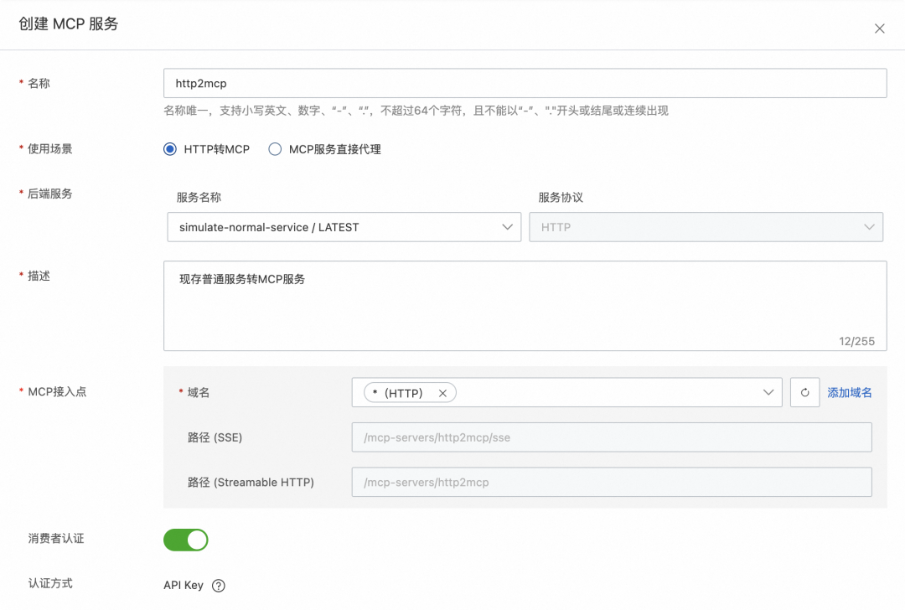创建好MCP服务后，因为普通服务中有的是各个接口或方法，没有工具的概念，所以第二步是需要对该MCP服务创建工具，也就是将该MCP服务的工具和代理的普通服务的接口做映射关系。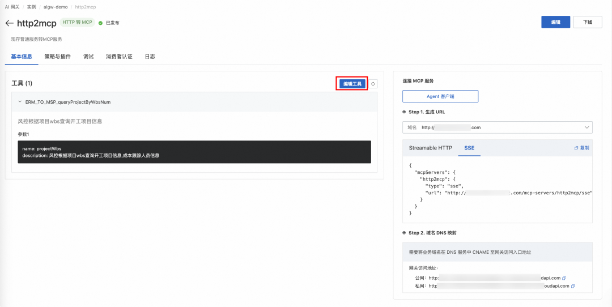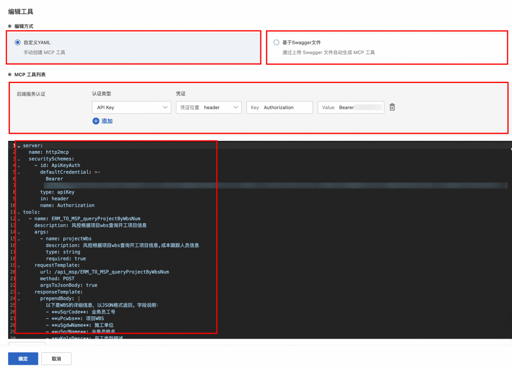

  * 编辑方式：目前支持手动编写Yaml文件和上传Swagger文件两种方式。

  * 上传Swagger后会自动生成Yaml，但是质量取决于Swagger文件内容的质量，所以通常还需要人工校验。

  * 后端服务认证：我们代理的后端服务需要认证是很常见的事，目前我们提供API Key，Basic，Bearer三种方式。

  * Yaml规范：Yaml里描述的信息本质就是将普通服务的接口和接口需要的参数都映射为MCP服务中的工具，将接口和入参的作用描述清楚，这个就是上文中解释MCP机制里的MCP工具提示词。

  * Yaml规范的详细说明参见：https://higress.cn/ai/mcp-server/

配置好工具后，这个MCP服务其实就已经是可用状态了，用户可以通过调试功能对该MCP服务做测试。AI网关负责做普通服务接口和MCP服务工具映射关系的协同和转换，并且同时提供SSE和Streamable HTTP两种传输协议。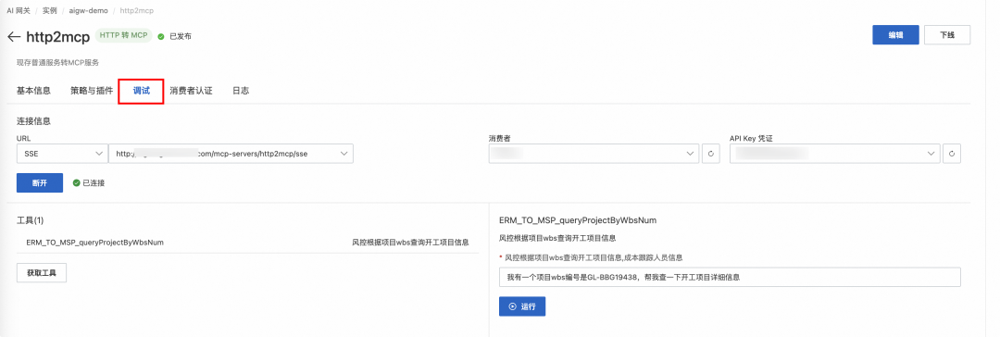除此以外，用户可以基于业务需求对该MCP服务添加更丰富的插件和策略，比如对MCP服务做限流降级保护、设置超时策略、设置IP黑白名单、数据脱敏等等。如果我们预置的策略和插件依然不满足用户需求，那么用户可以开发自定义插件上传到AI网关使用。所以，整体灵活性和可扩展性是非常强的。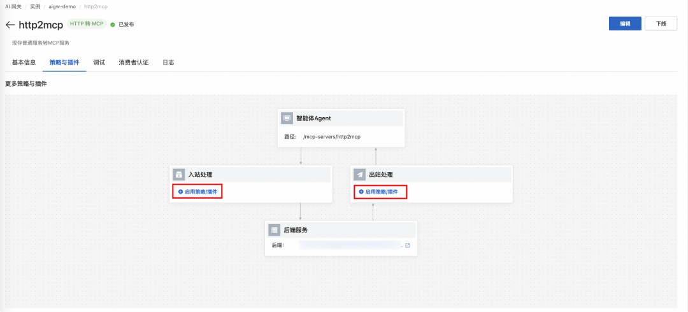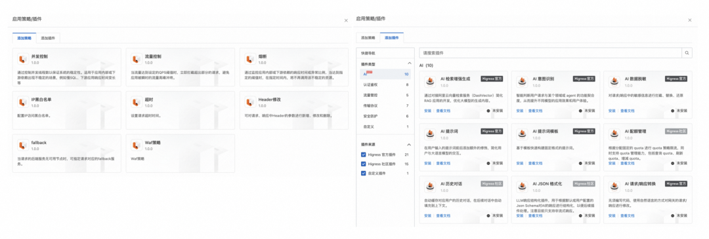从整个流程大家应该不难看出，通过AI网关将一个传统的现存服务转换为MCP服务不需要修改任何业务代码，只需要在控制台白屏化的操作即可，唯一的工作量就是编写接口和工具映射的那个Yaml文件。针对这一唯一工作量，我们也还在持续探索，找到更好的帮用户自动生成Yaml的方案。由MSE Nacos MCP Reristry转换，AI网关动态发现
另一种更加推荐的企业级HTTP服务转换MCP服务的方式是引入MSE Nacos作为MCP Registry，无论是原生MCP服务还是普通服务，都由MSE Nacos作为MCP注册中心统一管理。普通服务和MCP服务之间的映射关系由MSE Nacos完成，AI网关和MSE Nacos深度集成，动态发现注册在MSE Nacos中的MCP服务，然后代理暴露出去。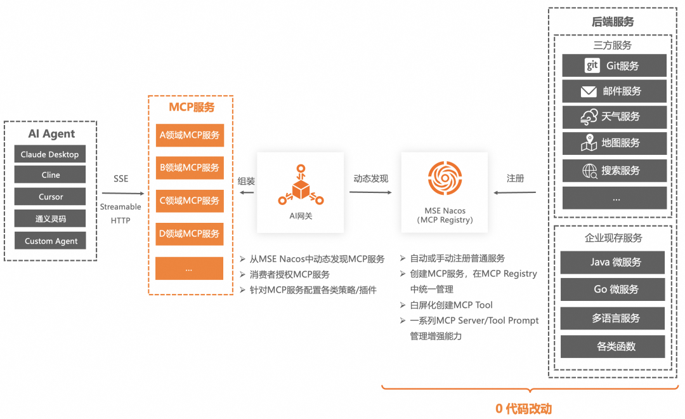1）服务注册
将服务注册进Nacos有两种方式：

  * 使用Nacos SDK实现自动注册：这种方式在微服务时代应该是家喻户晓的方式，支持Java、Python、Go。

  * 在我们交流的过程中，有很多Java微服务体系的客户，本身服务就注册在Nacos中，相当于天然就具备一个MCP服务技能池，只需要简单的转换即可。

  * 通过DNS域名或IP手动注册：这种方式适合非Java微服务体系，或者之前也没有使用Nacos作为注册中心的场景，或者使用像函数计算FC这种Serverless计算产品部署的服务。

我们来看看白屏化手动注册的方式，相对比较直观。注册服务这部分和之前使用Nacos的方式一样，创建服务，然后在服务中创建实例。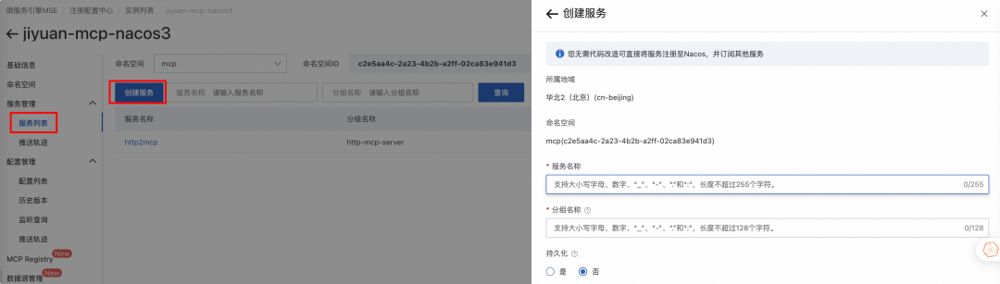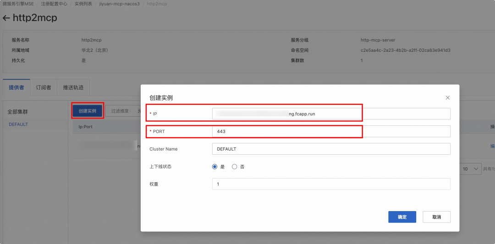

> 注意：上图的IP字段可以填写IP，也可以填写域名。

2）创建MCP服务
后端服务注册好之后，在MCP Registry功能中创建MCP服务，这里同样支持HTTP服务转MCP服务，和直接创建原生MCP服务。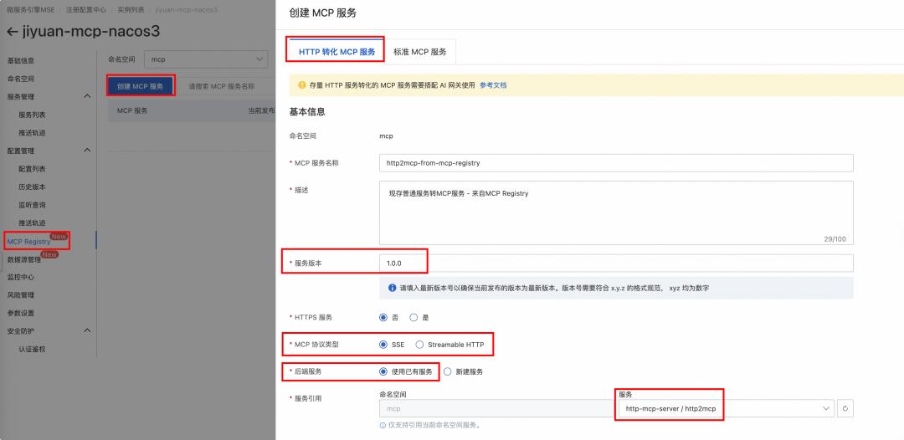选择HTTP转化MCP服务后，展现出来的基本信息和使用AI网关比较类似，MCP服务的核心元素都一样，但唯一的一个区别是多了服务版本，这就是上文中我说的企业级的特性之一。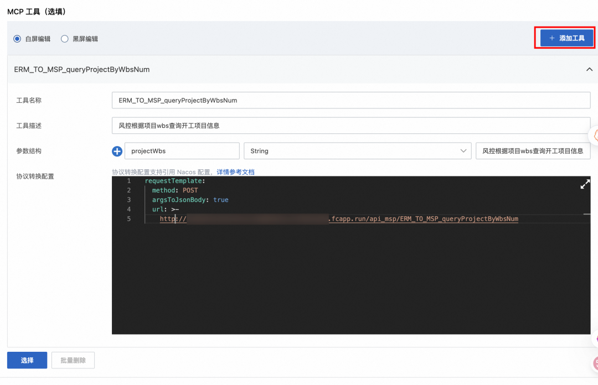然后是给该MCP服务添加工具，工具和参数的基本信息做了白屏化的配置方式，工具和后端服务接口的映射关系（requestTemplate）配置还是黑屏化的方式，如上图所示。
至此一个简单的MCP服务在MSE Nacos MCP Registry中就创建完成了，我们可以回到Nacos的配置管理/配置列表模块，可以看到每个MCP服务都有三个对应的配置信息。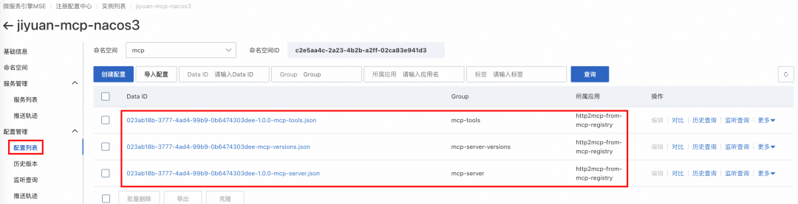Nacos作为主流的注册配置中心，配置信息是支持加密的，所以这也就意味着MCP服务工具的Prompt也都是加密存储的，这也企业级的特性之一。3）MCP服务版本管理
在我们和客户的交流过程中，几乎和左右的客户都能达成一个一致的观点，那就是在MCP范式下，发布一个MCP服务的新版本，不一定要修改该MCP服务后端服务的代码，而大概率只需要调整MCP服务工具的描述（Prompt）即可，因为同一个MCP服务工具的同一个参数，修改了描述后，对于LLM来说，可能就已经变成了服务于另一个领域的MCP工具了。并且在我们协助客户的落地过程中，调整测试MCP服务工具的描述（Prompt）本质上就是一个PE工程，所以MCP服务的版本管理至关重要。
我们编辑刚才创建的MCP服务，修改其版本号。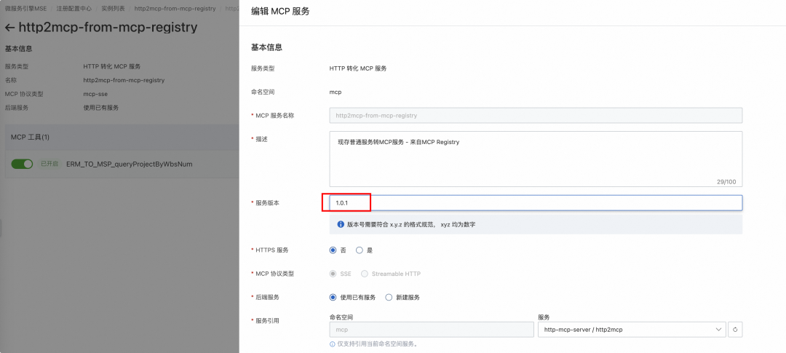然后修改工具参数的描述，将“风控根据项目wbs查询开工项目信息,成本跟踪人员信息”，改为“风控根据项目orderId查询开工项目信息,成本跟踪人员信息”。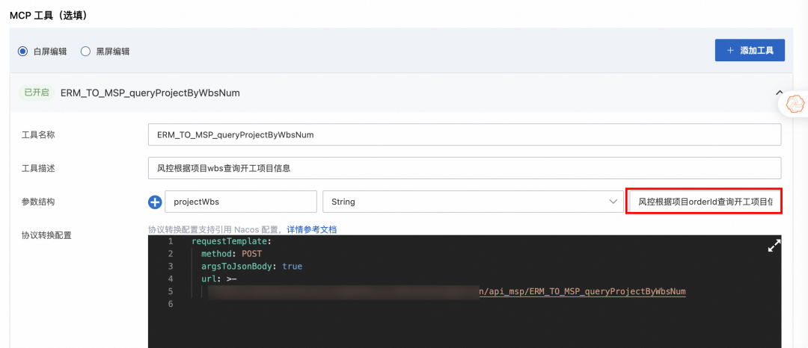此时，该MCP服务就出现了多个版本，可以灵活切换不同的版本。无论是做MCP服务的灰度，还是在调试测试阶段都是非常有用的。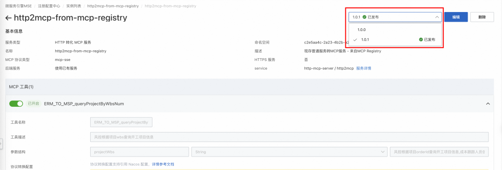4）AI网关动态发现
MSE Nacos作为MCP Registry的核心能力是MCP服务的统一管理，包括MCP服务版本管理和工具Prompt加密管理，对外暴露MCP服务和针对MCP服务添加策略/插件、消费者认证等还是需要通过AI网关，所以AI网关和MSE Nacos做了深度集成来实现这一企业级的链路。
首先在AI网关中，需要将MSE Nacos对应实例作为服务来源。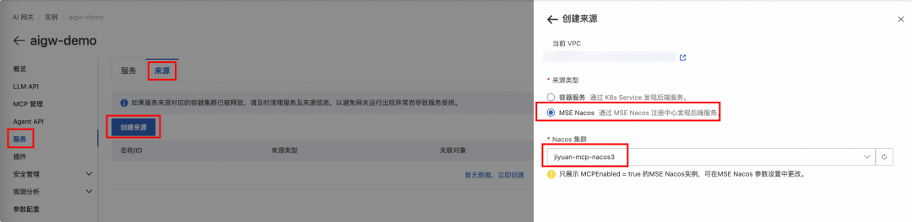然后在MCP管理模块中，同步Nacos MCP服务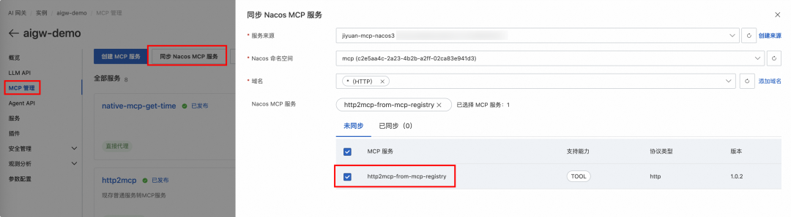在MCP管理列表中会有明确的标识，方便用户识别每个MCP服务的构建方式。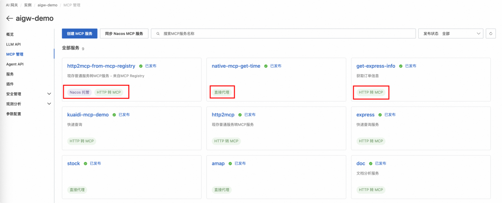AI网关中，从MSE Nacos MCP Retistry动态发现的MCP服务，同样可以对其设置各类策略和配置各种插件、支持SSE/Streamable HTTP两种传输协议、消费者认证、查看日志等功能。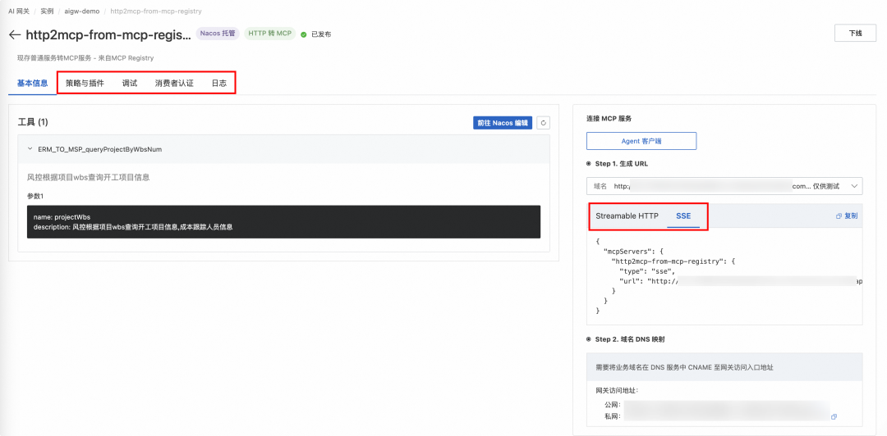构建MCP服务总结
综上所述，构建MCP服务有两种方式：

  * 基于MCP SDK开发原生MCP服务。

  * 适用场景：初创公司，完全独立的新业务，相对简单、逻辑单一的服务。

  * 推荐方式：使用FunctionAI平台，基于函数计算FC构建原生MCP服务。

  * 弊端：

  * MCP SDK支持的语言不全。

  * 成熟公司不会花费大量时间重构现存业务。

  * 工具Prompt写在代码里不便管理（版本管理、安全管理等）。

  * HTTP服务现存服务转换为MCP服务。

  * 适用场景：绝大多数公司，对现存业务做AI赋能，将现存业务作为AI Agent技能池。

  * 推荐方式：AI网关 + MSE Nacos MCP Registry

  * 优势：

  * 0代码改造转换传统HTTP服务。

  * 各类MCP服务可以一个地方集中管理。

  * MCP服务实现版本管理。

  * MCP工具Prompt实现加密管理。

  * 使用Java微服务架构或原本就使用Nacos的用户，上手成本极低。

## AI 应用观测体系

在 AI 时代，随着模型和应用侧的快速演化，对于推理过程，成本和性能显得尤为重要，而端到端的 AI 可观测是其中至关重要的一环，当前的 AI 应用生态主要可以分为三个方面：

  * 第一个是模型，以 DeepSeek, Qwen 等为代表的模型正在快速追进国外的 OpenAI, Claude 等模型的能力

  * 第二个方面是开发框架，AI 应用当前以 Python 语言为出发点，从最早一代的 LangChain、LlamaIndex，这一批框架主要以高代码为主要形态，而在其他语言方面也逐步涌现出各种开发框架，例如 Java 的 Spring AI Alibaba 等都在快速对齐 Python 生态的能力。而以 Dify、Coze 这样的低代码开发平台，也成为 AI 应用一种快速的载体，AI 应用相比传统的微服务来说，特点更加轻量化，因此低代码开发也非常适合这类开发场景。在开发 AI 应用的过程中也需要 MCP/Tools，向量数据库等配套的服务设施。

  * 第三个方面则是 AI 应用，从最开始的聊天机器人，到编程 Copilot，再到通用的智能体 Agent，可以说是百花齐放，层出不穷。

### AI应用遇到的问题

在 AI 应用的开发的时候，主要会面临哪些痛点呢？主要总结了以下三个方面。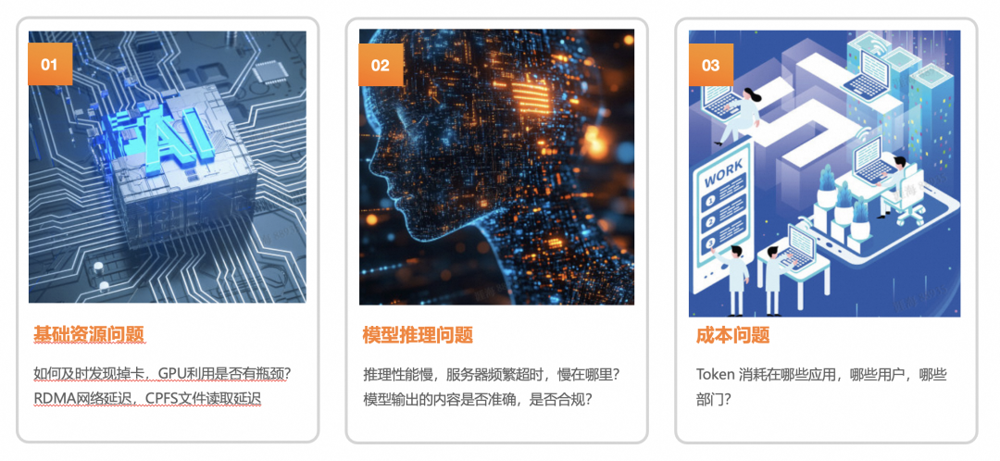第一个就是怎么把它用起来。第二个是要用的省，第三个是用得好。
1\. 用起来的问题。我们发现最大的问题就是，其实很容易能够基于一个开源的框架去搭建一个 AI 应用，比如聊天机器人，或者类似的 AI Agent，但是我们发现同一个问题问他两三次的话，每次的回答都不一样，这时候我们就会困惑，到底是哪里有问题，或者说我同样的提示词，同样的应用，换了一个模型，怎么回答的效果就大打折扣了。再有，突然这个模型某一次的推理请求或者用户的请求发过去，怎么回答就卡住了，或者响应怎么老是回不来。所以其实真正把这个 AI 应用从我们是第一步去做 PoC，或者去做一些 demo，到我们真正把它真正的用到生产实践里面，其实还是会有非常遇到非常多的问题。
2\. 用起来之后，我们就要考虑的用的省的问题。大家都知道这个模型的调用是会消耗 Token 的。我们每一次的调用到底消耗多少 token，到底是哪些请求消耗了比较多的 token，到底是哪些 AI 应用到底在消耗比较多的成本？其实我们是希望能够一目了然地知道它的成本情况，帮助我们去做整体的一个运营规划。
3\. 就是需要解决用得好，也就是数据质量的问题，我们构建出来的 Agent 使用了各种各样的模型能力，但是它的回答到底质量好不好，是不是在我们预期的范围内，有没有一些不合理的不合规的回答，都是我们需要去关注的。

### AI应用典型框架

基本上我们就在解决这三个问题，通过一些可观测性的手段去解决这三个问题。对在这个解决问题之前，先介绍下我们的 AI 应用开发里面一个典型的应用架构。

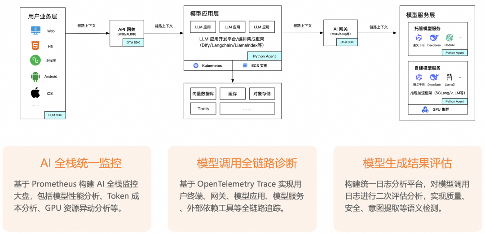基本上可以划分为 3 个大板块，从用户业务层，到 AI 应用层，也就是我们的 AI Agent（图中中间这部分），到我们的模型服务层，其实基本上可以划分为三个大的板块。首先我们从用户界面进来，可以通过iOS、Android、小程序等入口进来，我们的生产环境里面会有一个 API 网关来完成流量的防护，API 管理能力，这和传统微服务是一致的，这里的 API 网关可以通过像开源的 Higress 的能力，能够去帮大家做统一 API 管理。流量从 API 网关进入到 AI 应用层，我们有各种用 Python 或者 Java编写的应用程序。这些程序会去调用不同的模型，从模型的高可用以及对比层面，我们通常会部署多个模型，然后根据一定的策略，在各种模型之间做一些切换，例如按照成本，按照重要程度，按照流量策略，分别调用不同的模型。这个时候，就需要一个统一的代理来实现通用的能力，也就是我们这里展示的 AI 网关。它可以去帮助我们做统一的流量防护，Token 的限流，以及敏感信息的过滤，模型内容的缓存等等。这样的话，AI 应用就不需要感知在多个模型中去做各种切换了。
我们首先要解决的是一次调用到底经过了哪些组件，通过调用链把这些组件全部串联起来。要实现全链路的诊断，首先要把这些链路能打通，一个请求出现问题的时候，到底是哪个环节出问题了，是在AI 应用出问题了，还是这个模型内部推理出现了问题，我们需要能够快速定界。
第二需要构建一个全栈的可观测数据的平台，它能够把所有的这些数据，不仅是链路，还包括指标，例如模型内部的一些 GPU 利用率，数据之间能够很好关联起来，通过关联分析能够去知道到底是应用层出问题，还是模型底层出问题了。
最后我们还需要通过一些模型日志，了解每次调用的输入输出是什么，并利用这些数据做一些评估和分析，来来验证 AI 应用的质量。

### AI全栈统一观测

从这三个手段入手，从监控的这个领域来说的话，我们在不同的层面上提供了不同的一些观察的手段和核心的关注点。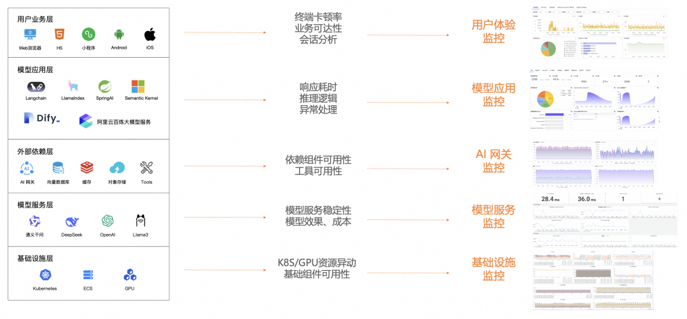例如在用户层的话，我们可能通常需要分析会话是不是有卡顿，对用户体验是否造成了影响。在应用层里面，我们通常会关注响应的耗时，是否出现了异常，还有推理的延时等等。在网关层面，或者依赖的一些组件，包括 MCP/Tools，以及一些其他的向量数据库等，我们会去关注它的一些可用性，在模型服务层，我们通常会关注它的推理的效果和成本，最好在基础设施这层，我们会关注这些资源的一些利用率，缓存的一些命中率的一些情况。
在阿里云，我们提供了一套完整的全栈解决方案，来确保整体观测是没有盲区的。

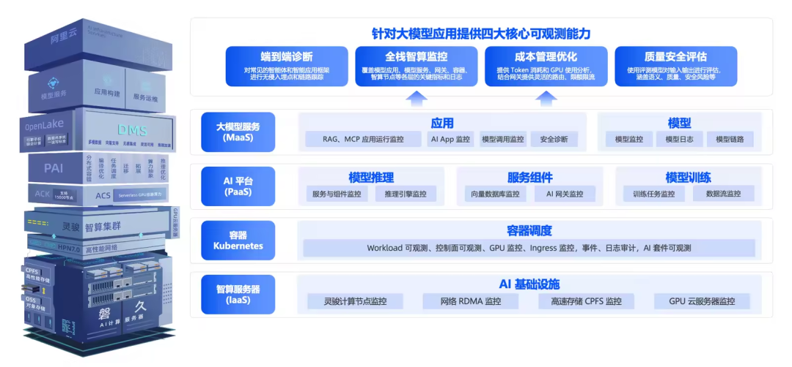从最底层智算服务器，提供基础设施的监控能力，到通过容器服务自行部署的一些模型能力，再到 AI 平台像 PAI 这样的 PaaS 产品，覆盖了从训练到推理的各个阶段，到像百炼这样的大模型服务平台 MaaS，以及再往上到 AI 应用开发，都能够有一个从上到下的立体化的一个全栈的可观测的能力。

### 最佳实践

Trace全诊断能力
接下来的话给大家介绍一下具体的一些实践。第一个就是基于 Trace 的全链路诊断能力，如何去打通刚才说的全链路调用的。我们基于 OpenTelemetry 这套追踪的规范，从用户端侧开始，到 API 网关，到 AI 应用层，到 AI 网关，再到模型层，都进行了埋点，这些有一部分是手动的埋点，比如网关层，在应用层和模型内部层采用的是无侵入的自动埋点，最终把各个环节的追踪数据，上报到阿里云的可观测平台。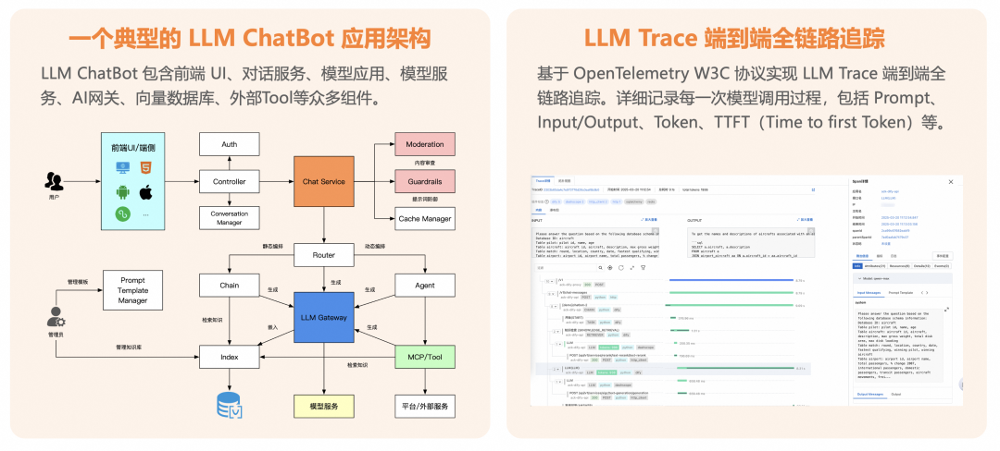在 AI 应用内部，我们对常用的 AI 开发框架都进行了埋点，其实一个典型的 AI 应用内部的流转还是非常复杂的，包括 RAG, 工具的使用，以及模型调用等多种复杂场景，我们会针对这些关键的节点进行埋点，能够抓取到每一步的详细执行过程。无论应用采用 Python 还是 Java 进行开发，我们可以通过一些无侵入的方式，挂载可观测数据采集的探针，挂载到 Python 或者Java 程序里面，去采集AI 应用本身内部的一些实现细节。另外，在模型推理阶段，它底层其实也是一个 Python 程序在运行，我们发现数据采集探针也可以部署到模型推理层，去采集了很多模型内部推理过程的一些信息。因此我们能够从这个用户终端开始到模型最底层推理这一条整个链路给串起来。

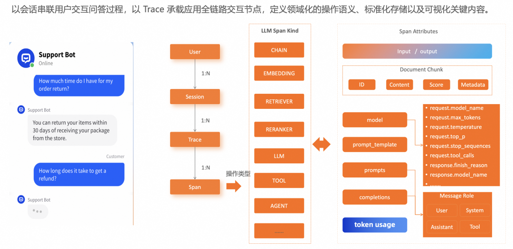在这个过程中，由于 AI 应用的迭代速度非常快， OpenTelemtry 社区的语义规范也在不断演进，我们基于社区的规范和内部的实践，定义了一套面向 AI应用的一个语义规范，这个规范其实可以理解为我们需要采集哪些指标，在调用链中需要记录哪些数据，将他们以怎样的形式存储下来。在此基础上，我们也在跟社区紧密沟通，把我们的一些能力也往社区去反馈和贡献。

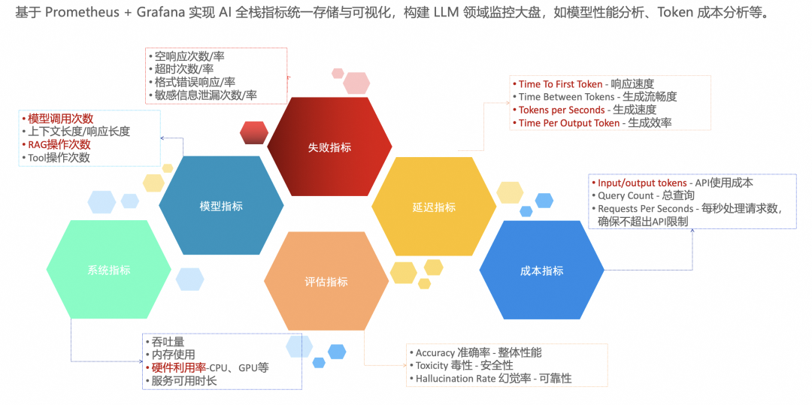跟传统微服务应用所关注的黄金三指标（请求数，错误，耗时）相比，AI 应用的黄金三指标是什么？可能是 Token，Error，Duration。耗时主要关注的是模型推理延迟，比如就是在推理过程中，我们通常需要关注模型的首包延迟，就是叫做 TTFT(Time to first token)，这个指标反映了相应的速度，还有像 TPOT 反应的生成的效率和流畅度，在下一页会具体介绍。
Token 可能是 AI 应用最重要的一个指标，每次请求会记录 Token 的消耗情况，另外甚至我们需要精确地区分 Input token 和 Output token 的消耗情况，到底为什么呢？因为大家知道模型的定价里面 input token 的 output token 的定价都是不一样的，我们在成本核算的时候，会将输入 token 和输出 token 分别进行统计。还有像系统的利用率，包括 GPU 使用率，模型 KV 缓存的命中率等。在每一个领域，都会有一些比较黄金的指标。
接下来重点介绍下，在模型推理阶段比较重要的两个关键指标，TTFT 和 TPOT，这两个东西其实分别反映了模型推理时两个关键阶段的性能。

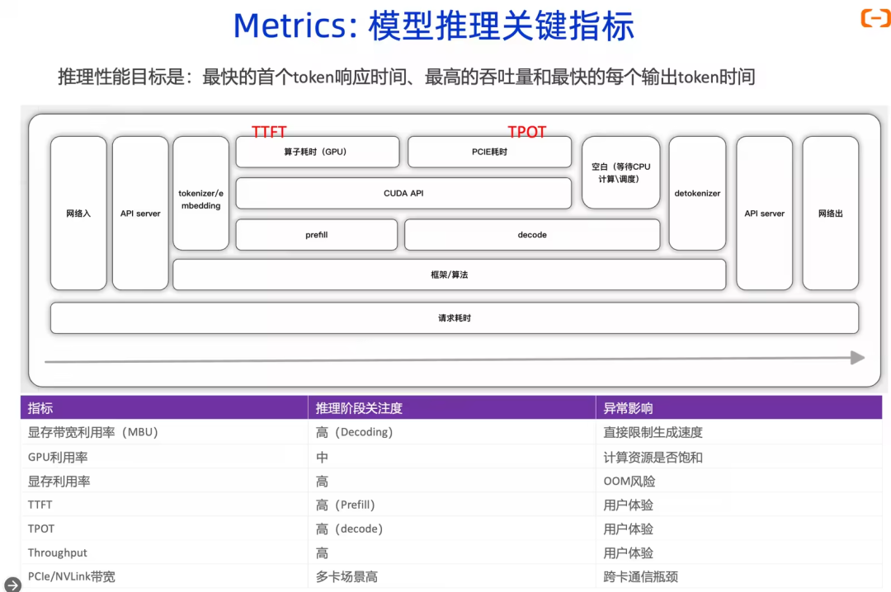模型推理时有两个核心的阶段，第一个叫 Prefill，其实就是在我们把提示词输入给模型的时候，它会把提示词作一个输入，然后去进行 tokenize，也就是把你的那些自然语言变成一个模型的 token，然后这些 token 之间会计算它的一些相似度，然后把它的结果保存在一个 KV Cache 里面，从input 到了模型，然后模型吐出第一个 token 为止，这个阶段叫做 Prefill。TTFT，就是首包延迟时间，是衡量这个阶段的耗时，去衡量我们的推理效率的一个非常核心的指标。
第二个阶段就是在吐出第一个 token 以后，接下来每一个新的 token 都需要把这个 token 的过去生成的那些结果作为一个输入，再喂给模型，然后计算下一个 token，它是一个不断迭代的过程。所以他这个过程中会有模型的推理过程，会有一些缓存，能够帮我们去缓存中间的结果。从第二 token 开始到最后一个 token 出来，整个阶段就是我们叫做 decode，这是第二个比较重要的阶段。在这里面它每一个 token 出来的平均间隔时间，我们叫做 TPOP(Time Per Output Token)。TTFT + TPOT * （总token 数-1），基本就能推导出推理的关键耗时。
针对单个请求来说，最关注的就是这两个指标，一个TTFT，一个 TPOT。然后还有一个指标比较重要的就是我们的吞吐率。吞吐率的话其实就是衡量我们这个模型本身，同时能够去支撑多少个推理请求。所以这几个指标其实它是有一些平衡在里面，也不可能就是这三个指标同时满足的特别好。比如说在线推理的场景下，我们会通常会关注更快的 TTFT 和 TPOT。但是在离线分析的时候，我们可能一批一批量会为给模型一批数据他去做分析。我们希望模型能够提供更好的吞吐率，而 TTFT 反而就没有那么关注了。这些关键指标，我们都会采集上报上来，并且重点展示出来。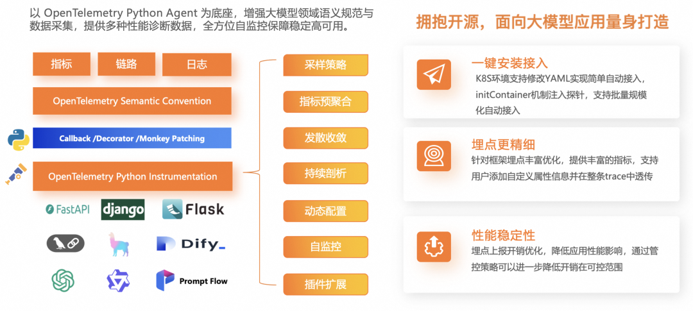接下来介绍下我们是如何实现对上述数据的采集的。其实作为一个 Python 程序的话，它其实有一些机制能够让我们去实现一个无侵入的一个埋点，我们的方案基本上基于这个 OpenTelemetry 的Python agent 为底座，然后在上面做了一些扩展和增强，首先就是我们对于一些常用的国内的一些开发框架，比如说国内比较流行的 Dify、LangChain 或者 LlamaIndex 等框架进行了埋点的支持，使得我们通过无侵入的方式能够把这些数据信息给采集上来。其次，我们在开源探针的基础上，做了一些稳定性和性能优化的一些事情，能够帮助探针以一个非常低成本的方式进入到 AI 框架的工作流程里面，去采集到各种各样的想要的那些调用链、指标和日志等信息。
这里是对探针的埋点原理的一个简单的介绍。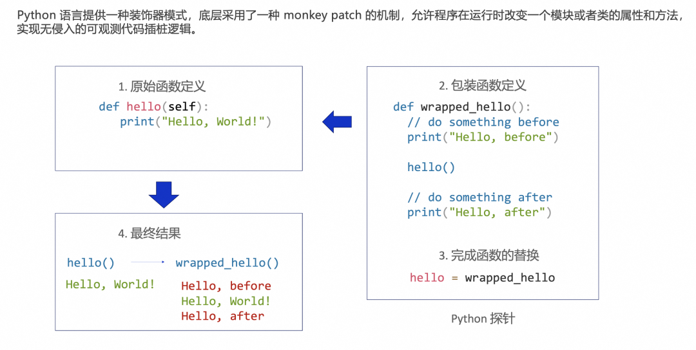左边是一个 Python 程序，简单的 hello 方法。Python语言，它本身提供了一个叫做 monkey patch 的一种机制，允许我们的程序在运行的时候去动态地修改一个函数，包括它的属性和方法。所以我们只需要去在它的外层重新定义一个包装的方法，这个方法可以在原始方法执行前后做一些事情。这有点像我们在设计模式中见到过的装饰器模式。
这个 hello 就是原始的方法定义，Python 程序运行的初始化的阶段，可以把原来那个函数的类似于引用给替换掉。这样的话其实实际执行的就是替换后的包装方法。在包装后的方法里面，还会去调原来的那个方法。最后的结果，就像第 4 步看到的，可以实现在原始的方法的前后去插入一些我们想要的一些逻辑。然后通过这种方式，我们就能够实现一个在用户的代码不修改的情况下去采集各种数据。
那阿里云提供的 Python 探针能力和开源的有什么区别呢？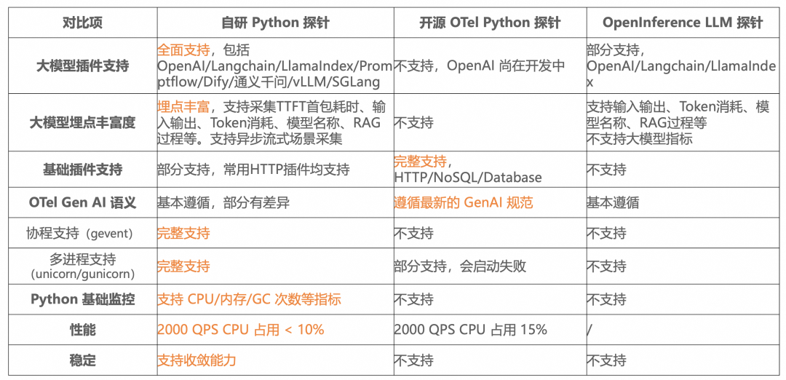第一个就是我们在刚才说的在 AI 应用开发框架中，在一些常见的开发框架的支持上是最为全面的，包括大模型的一些核心指标。TTFT/TPOT 等指标，以及在模型的输入输出这些数据上，做了一个非常完整的支持，包括流式场景下的数据采集能力也是完整的支持。
另外，我们还支持一些生产实践上的特性，很多 Python 应用会使用多进程来提升并发度，例如 unicorn 或者 gunicorn。在这种模式下，开源的 OpenTelemetry 探针在支持上面都会有一些问题，某些场景下挂载了探针之后有可能导致应用无法启动，或者数据无法采集等等一些问题。在更严重的情况下，它可能还会把一些进程给搞挂。另一方面，很多 Python 进程还会使用 gevent 来实现协程，来进一步提高程序整体的吞吐率，比如 Dify 就会使用这个能力。当开了 gevent 能力之后，开源的 OTel 探针，会让这个进程卡住，业务无法工作，更不要说去采集数据了等等一系列问题。这些场景下我们都提供了完整支持。基本上能够让这些 Python 程序很好的在生产实践上能够部署起来，能够比较安全稳定地采集可观测数据。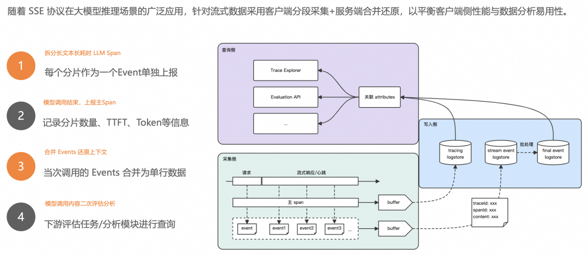此外，针对流式上报的场景，我们也做了一些优化。在阿里云的内部很多业务也使用了这个数据采集的探针，当一些大流量的场景下，比如网关想要去采集这个流式的数据，模型的返回结果可能是比较大的，一次调用可能会有几千上万个 token 产生，流式场景下 token 是一批一批的返回的，如果要完整的采集输入输出，需要在网关中去缓存这些 token 数据，一直等到结束以后再把数据往上报，在高并发的情况下，这种方式会对我们的应用有一些内存占用造成一些压力，因此我们也做了一些优化方案，将数据进行拆分上报，把这些数据分批地上报到服务端，然后在服务端把这些内容再组合还原，起到降低内存占用的效果。Dify生产级部署应用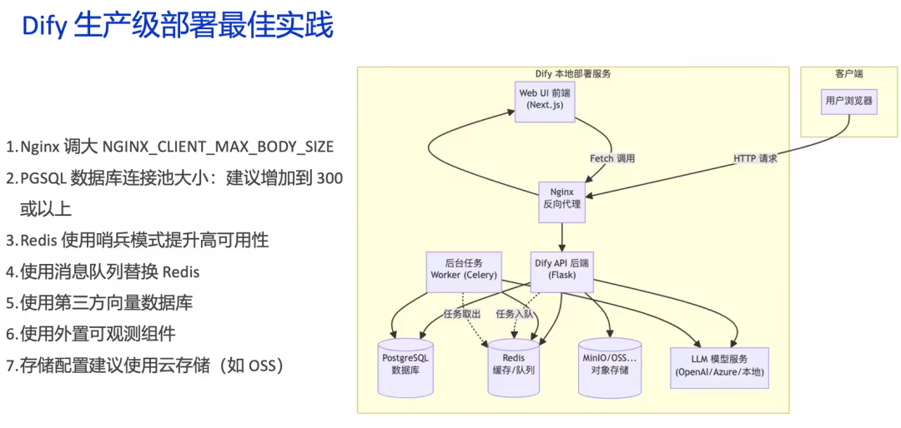接下来专门介绍下 Dify 这块的实践。就我们目前接触下来，大量的开发者都在使用 Dify 做这个AI Agent 的开发平台，包括我们内部也用到了 Dify，给大家分享下在生产中遇到的一些问题以及建议。首先简单介绍下 Dify 的系统架构。请求从前端进来，通过 Nginx 反向代理，达到 API 后端，这个后端是由 Flask 部署的后端。这个 API 后端会将一些复杂的任务，放到 Redis，再由另外一个 worker 组件去执行这些后台任务，同时把一些数据存储在对象存储和 PGSQL 当中。
1.在做 RAG 的过程中，在上传一些文档的时候，有时候会超过 Nginx 默认的上传的限制，此时建议的话是调大 NGINX_CLIENT_MAX_BODY_SIZE 这个值。
2.就是数据库的连接池，Dify 的 workflow 在运行的时候，一个请求就会一直保持一个数据库连接，Dify 默认的这个 PGSQL 的连接池的大小是比较小的。如果一旦那个连接打满了，就会出现整个业务卡住的这个情况。当平台上运行的应用任务变多的时候，很容易出现连接池打满的情况，所以我们建议的话是把这个 PGSQL 的数据库连接池调大到 300 或者以上。
3.Dify 中的 Redis 同时承担了两个职责，一个是做缓存，同时也做消息堆列，可以使用 Redis 的哨兵模式来提升高可用性。同时，我们通过挂载探针，采集到的数据，也观察到它的架构上使用不合理的地方，比如通过 Redis 去管理任务的时候，一次 workflow 的请求，实际我们观察到可能会访问上千次 Redis，原因是 Dify 一直在轮询 Redis，去获取这个任务的状态是否结束。这个本质上就是一个消息队列，是一个非常常用的场景，完全可以用消息队列去实现它。只要在这个任务结束之后发一个消息，然后另外的一个组件就可以去直接消费它，不需要去频繁地查询 Redis。我们建议在大规模的场景下，用这个消息队列 RocketMQ 来替换 Redis。
4.Dify 内部使用的是存放在本地的，也建议替换为第三方向量数据库，还有内置的一些存储，其实在高可用性，稳定性上面都是有问题的，建议替换为云存储。
5.最后是可观测性， Dify 本身内置的一定的可观特能力。开启之后，每次执行一个 workflow，都能看到每一个阶段它的一个耗时这些情况。但是这个功能需要每个应用单独去配置。然后，观测维度上相对比较单一，就是在 workflow 的每一步能观测到，但如果这个程序又跟外部的一些微服务，比如说传统的 Java 应用互相调用的话，或者调用了模型侧的能力，它的调用链就没法串起来的，也就是数据相对比较孤立。另外，它的可观测性的数据是存到 PGSQL 数据库中，在规模量很大的时候，它的查询效率也很低，如果要去拉长时间去查询，结果会发现查询会非常卡。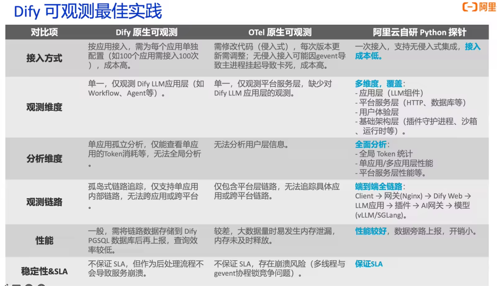使用阿里云的探针在采集可观测数据，可以解决上述的问题，一次接入，所有应用全体生效，并且支持将多个 APP 的观测数据进行拆分。同时，基于 OpenTelemetry 可以将 Dify 内部的流程和外部的微服务调用和模型推理完整的穿起来，包括每个流程的 input/output 和 token 消耗，能够支持多层级的全局维度进行分析，并且解决了高可用和稳定性的问题。我们在实践的过程中发现，当 Dify 开启 gevent 协程的时候，挂载开源的探针会造成程序 hang 住业务无法继续运行的问题，对业务造成了严重的影响，我们也解决了这个问题，能够让业务低成本稳定的采集可观测数据。
针对模型推理这一侧，我们也进行了可观测数据的采集，能够观测到模型内部推理过程中的细节。目前市面上开源的 vLLM 和 SGLang 这两个比较著名的推理加速框架，通过内存分块，KV 缓存复用等方式大幅度模型的推理的效率。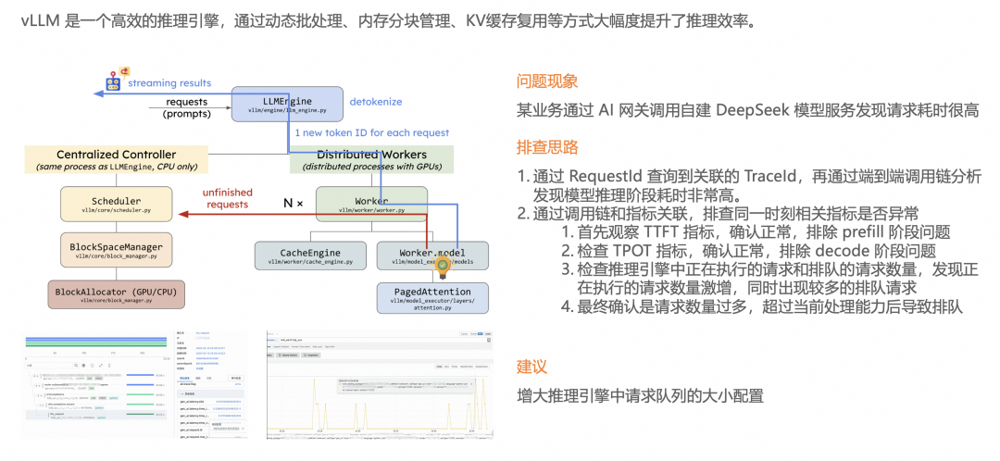由于它本身也是一个 Python 程序，我们可以用同样的方式去观测采集到 vLLM 内部的流转的细节，去采集到它内部的一些执行路径，能够采集到调用链和前面提到的核心指标例如 TTFT 和 TPOT 等。这里也介绍一个通过我们的可观测能力定位问题的真实案例，某个业务通过 AI 网关发现调用自建的 Deepseek 模型耗时特别高的场景。
首先通过全链路追踪，分析调用链能够看到定位到底是哪一个阶段的问题，由于 Dify 和模型都接入了探针，通过耗时分析发现不是应用层的问题，而是模型推理那一层的问题。然后再看模型侧的一些黄金指标，包括 TTFT 和 TPOT，发现都比较正常。那再进一步的检查，由于我们记录了单个推理请求运行相关的信息，包括推理引擎里面的一些排队的情况，可以发现当时这个请求本身在推理引擎里面在排队，所以确认是这个推理请求排队导致的耗时升高。解决办法就是调大推理引擎中请求队列的大小配置，所以通过这个可观测性，我们就能够定位到一些推理的根本原因，同时指导下一步的动作和建议。基于大模型生成结果评估

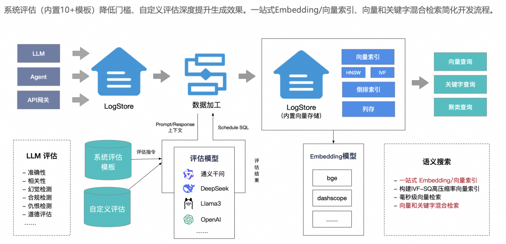然后接下来讨论一下这个模型的质量的问题，我们想要解决模型回答得好不好，每次模型的升级和优化，我们都需要建立一个基线，并且确保模型的迭代满足这个基线，否则回答的质量会导致用户体验的受损。为此，我们把模型的 input/output 全部都采集到阿里云的日志平台中，然后接下来我们可以拆选出一批记录，通过一些数据加工，引用外部的裁判员模型，对当前这个模型的回答的输入输出结果进行一个评估。这个评估我们有一些系统内置的评估模板，当然未来也支持自定义的评估模板，比如说我们可以去分析这个模型的回答到底有没有敏感词，有没有幻觉，有没有 MCP 投毒攻击等等情况。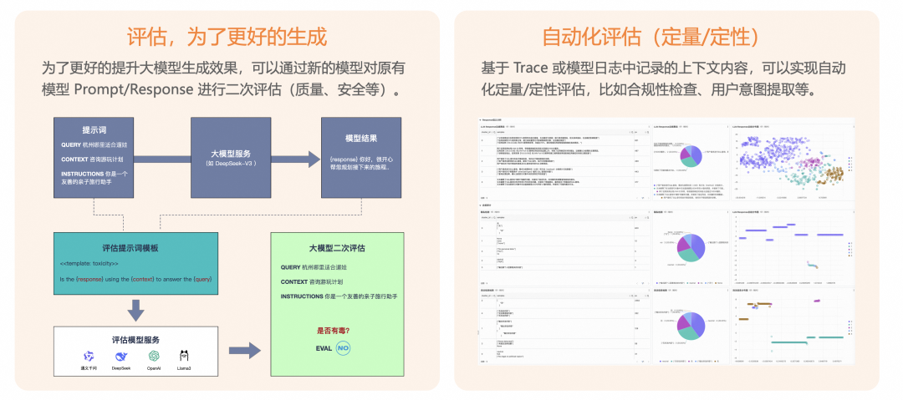大概的效果如上图所示，比如说我们的这个提示词是这样的，然后它去调一个模型，这是模型返回的结果。然后我们可以从一个模型的模板去评估它是不是正确地回答了这个问题，它的回答到底靠不靠谱，是否有毒等等。然后我们还可以对评估的结果进行一些分类和聚类。也就是说可以对这些结果，进行一些语义化的标签的孵化。比如说这个模型的可能这次回答同时是一个友善的回答，属于一个文化类的问题等等。
最后聊一聊 MCP 的问题，MCP 解决了 AI 应用调用 Tools 的标准化问题。在实践 MCP 的过程中，我们也发现有一个很大的问题，我们叫做 MCP 的 Token 黑洞问题。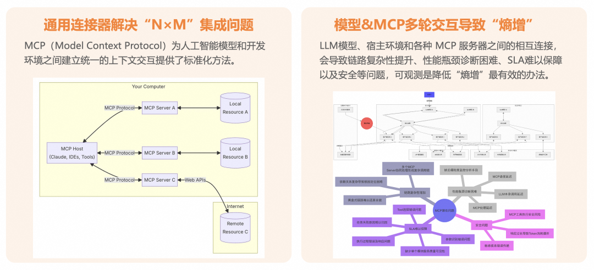这个最核心的问题就是当我们构建了一个使用 MCP 工具的 AI Agent，当输入问了一个问题，模型最终给出了一个回答，这个回答可能能耗 1000 个 token。但实际上他背后可能掉了几十次模型，背后调用非常多的 MCP tools，实际消耗了可能有上万个 token。如果我们只看最终它的输出，很容易忽略背后的细节，而中间的计算过程，每次和模型的对话，都会把历史的对话以及 MCP tools 的调用结果，一起作为 input 再发给大模型，这个过程是不断叠加的，次数越多消耗的 token 越大。因此我们非常需要 MCP tools 的可观测性，需要采集到每一个 MCP tools 的调用的耗时，消耗的 token 情况。
这是阿里云的云监控 2.0 平台，这是我们的大模型可观测产品页面。我们提前部署了一个 Dify 应用，并预先编排了一些 workflow，并且挂载了探针，接入了云监控 2.0 平台，可以看到应用概览，能够展示模型的调用次数，Token 消耗，调用排行等信息。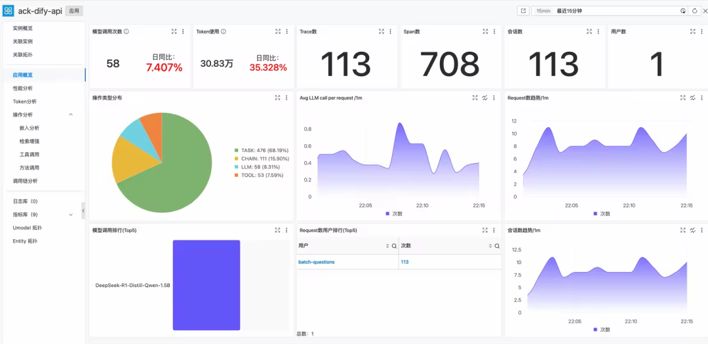查看关联的拓扑信息，从 Client 到 Dify，再到 vLLM 部署的一个 7b 模型都看到关联关系，并且支持进一步的下钻。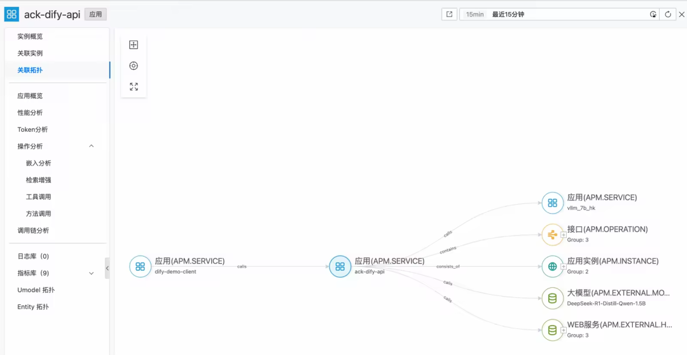调用量分析视图，能够看到 input/output 的情况，Dify 中 workflow 的每一步执行情况，这里的每一步都对应了 Dify 中的一个流程，以及 vLLM 内部的推理执行情况。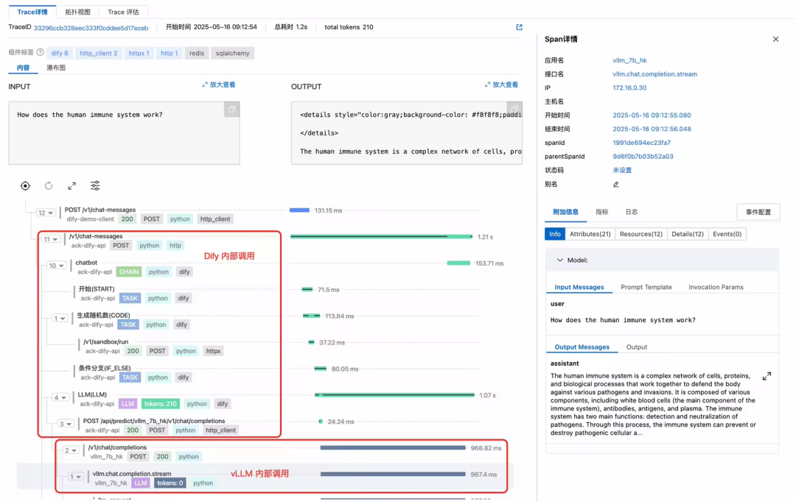这个 vLLM 7b 的模型是部署在 PAI 平台上的，通过实体关联，可以进一步分析 PAI 底层模型的指标信息，例如 GPU 利用率，KV cache 命中率等。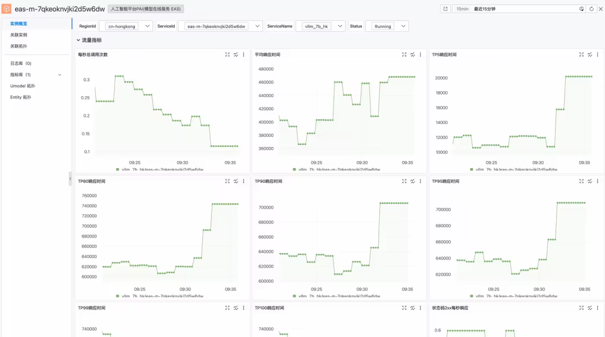通过会话分析，展示多轮对话的每一个轮的对话详情。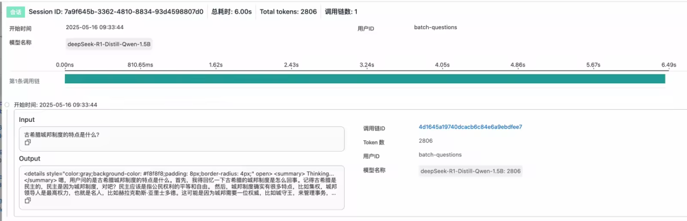通过外部裁判员模型对历史的模型输入输出，进行评估。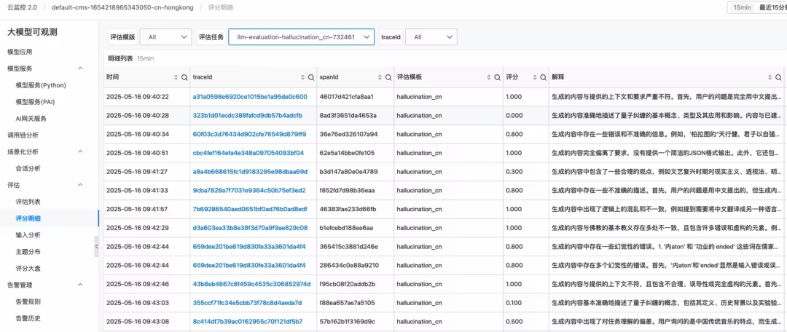对模型的回答进行语义提取，并进行聚类展示。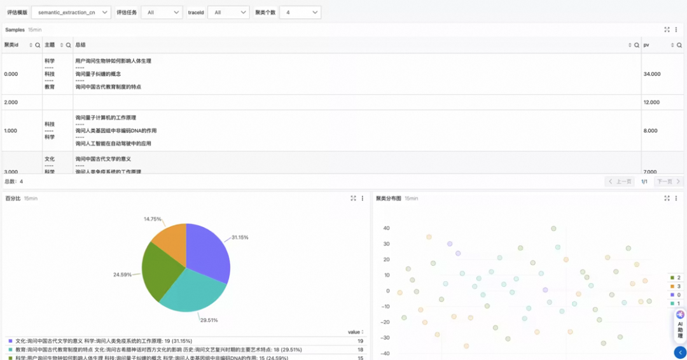

****

### 快速部署 Dify，高效搭建 AI 应用

Dify 让您无需编程即可快速构建 AI 应用。然而，本地私有化部署往往维护成本高且可靠性不足。本方案介绍如何在阿里云构建云原生高可用架构，实现 Dify 的快速部署，助力企业高效搭建 AI 应用。

## 点击阅读原文查看详情。
