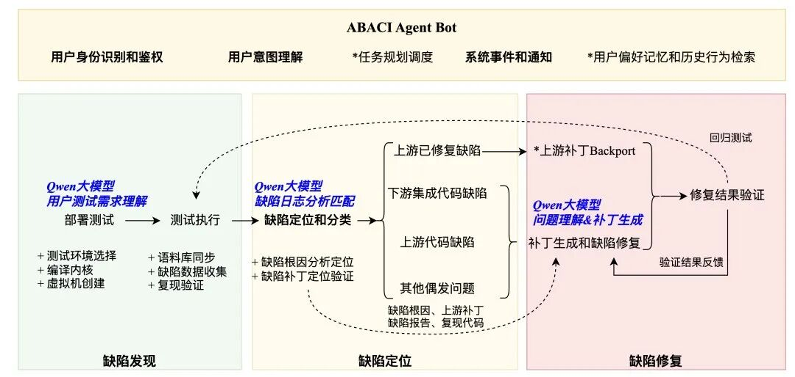
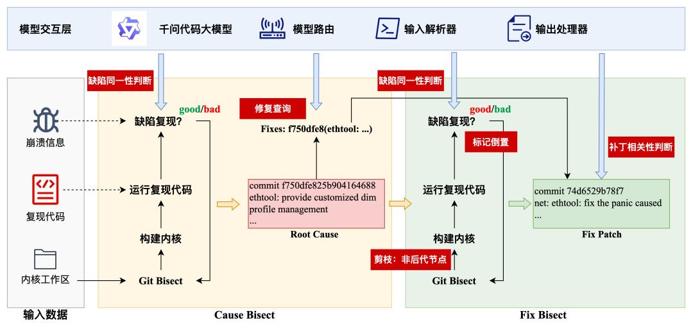
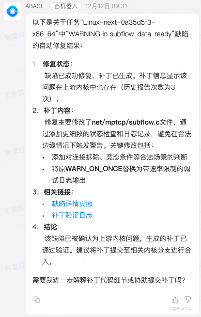
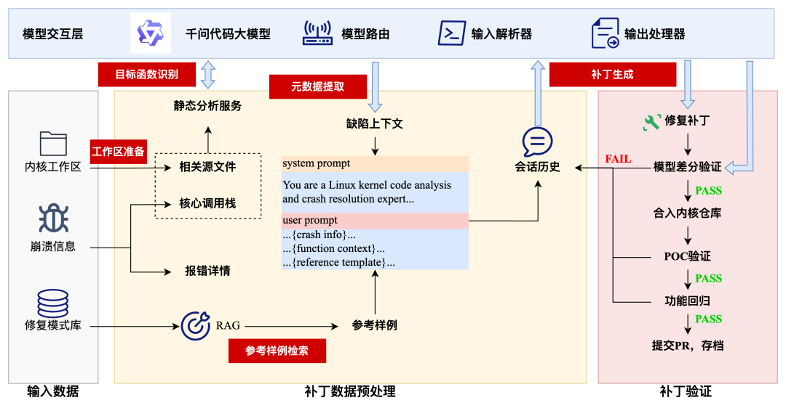
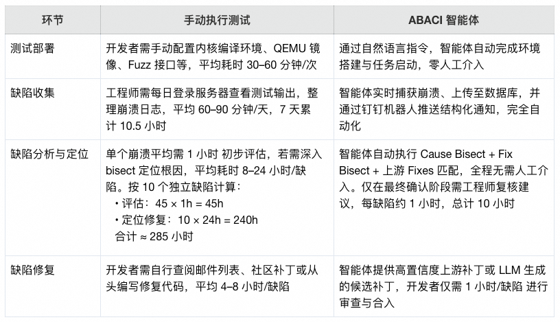
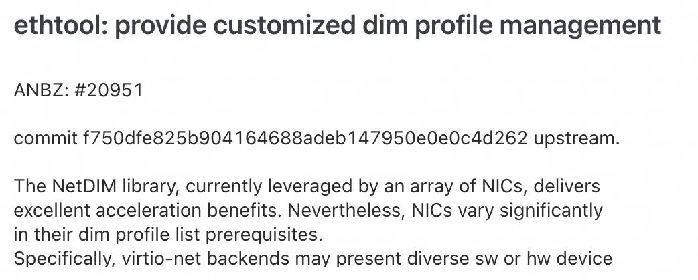
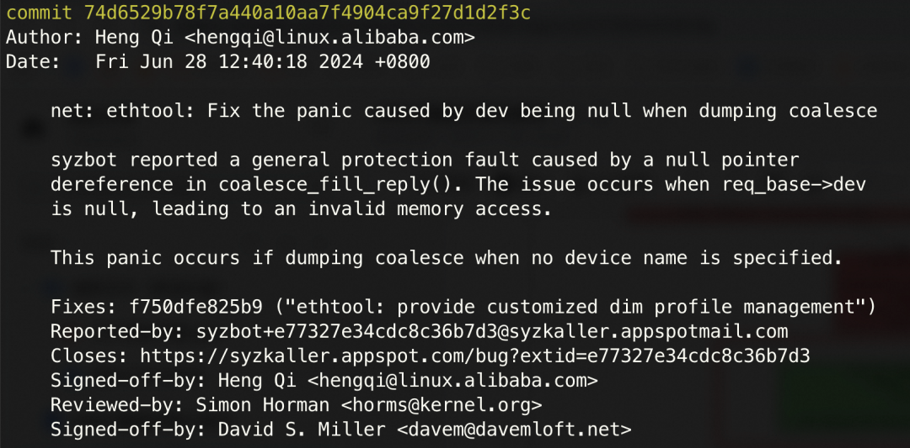

# ABACI内核缺陷智能体：让模糊测试真正“自动化”

> **公众号**: 阿里云开发者  
> **发布时间**: 2026-02-27 08:30  

阿里妹导读

本文介绍了ABACI内核缺陷智能体如何通过自动化技术改进Linux内核的测试、分析和修复过程。

## 一、内核缺陷智能体：

## 测试-分析-修复全链路自动化

传统的测试手段，如单元测试、静态分析和人工代码审查，面对Linux内核这样千万行级别的庞大代码库时显得力不从心。尤其是在新内核版本频繁迭代的背景下，它们要么覆盖率不足，难以触及深层路径；要么误报率高，消耗大量人力进行验证。如何在短时间内高效、系统地发现和处理缺陷，成为内核研发团队面临的核心挑战。

在这样的背景下，模糊测试（Fuzzing）正在成为现代内核研发流程中不可或缺的一环，通过自动生成大量非预期的输入，观察系统是否出现崩溃或异常行为，是保障内核质量与安全的重要防线。但是Fuzzing测试部署与运维却高度依赖专家经验，同时修复Fuzzing测试报告的缺陷也极具挑战，这些问题使得Fuzzing难以真正“持续化”，往往停留在“小团队、周期性、手动干预”的状态，无法融入日常研发流程。

ABACI 内核缺陷智能体，正是为了解决这个痛点，我们希望能够实现“低介入、可持续”的内核缺陷智能体，真正实现Fuzzing测试在内核研发流程中的常态化运行，深度融合大语言模型的自动化决策和代码开发能力，构建覆盖“缺陷发现—缺陷分析—缺陷修复”的全链路闭环。

  * 用户意图理解与人机协同：通过钉钉机器人（ABACI Agent Bot）实现与用户协作与主动通知，支持自然语言输入测试目标，用户通过与机器人交互执行测试任务，机器人实时通知测试结果和内核问题；

  * 自动测试部署：智能体自动完成内核配置、QEMU环境搭建与测试任务启动，理解测试需求并自动生成测试接口描述文件，实现模糊测试任务一键执行；

  * 自动化缺陷定位分析：融合LLM语义分析与Bisect确定性推理，精准定位崩溃根因，并主动匹配上游社区已有修复方案，提升分析效率；

  * 智能化补丁生成：基于崩溃上下文与历史修复模式，由LLM生成初步补丁，并通过编译验证、执行反馈等多轮迭代优化补丁质量；

内核缺陷智能体将缺陷发现—缺陷分析—缺陷修复的全链路自闭环，使模糊测试不再依赖专家逐行分析、反复调试，而是由智能体覆盖从发现到修复的各个环节，大幅减少重复性人工投入，实现低成本、可持续的质量保障。

## 二、智能驱动缺陷挖掘与精准归因

本章将重点阐述内核缺陷智能体中的两个核心环节：

1\. 智能体如何理解用户意图并自动完成复杂测试环境的构建；

2\. 如何融合语义分析与确定性推理，实现高效精准的缺陷归因。

### 2.1 自动化模糊测试部署

传统模糊测试的启动过程高度依赖专家经验，涉及仓库克隆、分支检出、内核配置、QEMU 环境搭建、Fuzz 接口描述文件编写等多个步骤，操作繁琐且易出错。为降低使用门槛，智能体引入 LLM 的自然语言理解能力，支持开发者以日常语言表达测试需求，例如：

“请在最新的 linux-next 分支上，针对 io_uring 子系统进行测试”

智能体首先对这句话进行语义解析，提取出关键参数：

  * 目标内核仓库：

https://git.kernel.org/pub/scm/linux/kernel/git/next/linux-next.git

  * 分支名称：用户未提及，默认为 master

  * 架构平台：用户未提及，默认为 x86_64

  * 待测子系统：fs/io_uring

  * 内核配置需求：应启用异步 I/O、内存调试及 Fuzz 测试相关选项

  * 测试接口：io_uring_setup、io_uring_enter、io_uring_register 等系统调用集合

整个测试准备过程由智能体自主执行。第一步是源码获取与编译环境初始化：系统克隆指定仓库，检出目标提交，并基于测试需求生成适配的 .config 文件。在此过程中，智能体会自动开启一系列关键编译选项，确保测试具备足够的检测能力。例如：

  * 启用 CONFIG_KASAN 以捕捉内存越界、Use-After-Free 等常见错误；

  * 打开 CONFIG_KCOV 支持代码覆盖率反馈，提升 fuzz 路径探索效率；

  * 激活 CONFIG_UBSAN 检测整数溢出、除零等未定义行为；

  * 加载 CONFIG_BLK_DEV_LOOP、CONFIG_VIRTIO_BLK、CONFIG_TMPFS 等块设备与文件系统驱动，扩大 io_uring 的 I/O 攻击面；

  * 同时启用 CONFIG_IO_URING、CONFIG_IO_WQ 等核心模块，并打开 CONFIG_DEBUG_INFO 和 CONFIG_DEBUG_FS，为后续崩溃分析提供完整的符号与运行时上下文支持。

接下来，智能体构建适用于该内核版本的 QEMU 镜像，并配置合理的启动参数。这包括设置内核命令行（cmdline）以禁用不必要的服务（如图形界面、网络服务）、启用串口日志输出（console=ttyS0），以及设定 QEMU 的 CPU 核心数（建议 ≥4 以触发并发路径）、内存大小（≥4GB）和 virtio-blk 设备模拟选项，确保 io_uring 能在接近真实负载的环境中运行。

完成上述准备后，智能体依据预设模板生成完整的测试配置文件（包含 io_uring 相关 syscall 描述），并启动 fuzz 进程。在测试运行期间，智能体持续监听测试进程的运行状态和输出的缺陷文件，实时将发现的 Crash 上传到缺陷数据库，并调度其他测试机并行执行后续的复现与分析流程，实现“测试运行”与“缺陷处理”的并行运行模式。

### 2.2 根因定位和上游补丁发现

模糊测试的价值不仅在于发现问题，更在于快速推动修复落地。然而，一个典型的崩溃报告往往只是现象的表征，其背后的根本原因可能隐藏在数百次提交之中。传统做法依赖工程师手动 bisect、比对日志和邮件列表，耗时动辄数天。为此，智能体构建了一套融合确定性推理与语义理解的归因体系，系统性地提升了缺陷定位效率。

如图所示，整个流程分为两步：首先在当前使用的内核分支中执行 Cause Bisect，识别导致该问题首次出现的引入提交（Root Cause）；随后在上游主线仓库中开展 Fix Bisect，查找是否存在已被社区修复但尚未合入的补丁。

#### Cause Bisect

在 Cause Bisect 阶段，ABACI将当前可复现崩溃的版本标记为“bad”，选择一个确认无此问题的历史版本标记为“good”，然后通过 git bisect 在两者之间进行二分搜索。每轮迭代中，智能体检出中间内核版本并编译构建内核，并在 QEMU 中运行原始复现代码，观察是否触发相同崩溃，相应的标记“good”和“bad”版本，最终定位到引入问题的Commit（Root Cause）。

#### 缺陷同一性判断

Bisect的正确运行，高度依赖于good/bad标记的正确生成，但遗憾的是复现代码的运行结果并非只有Crash/No Crash两种情况，在不同的内核版本中可能会有报告不同的Crash。

例如由于内核配置、调度随机性或代码演进的影响，同一缺陷在不同版本中可能表现出截然不同的日志形式。若仅依赖崩溃标题或关键字匹配，极易误判。例如，在 net/unix/af_unix.c 中曾存在一个竞争释放问题：

  * 在早期版本中，当两个线程并发执行 unix_stream_sendmsg() 与 unix_release_sock() 时，因缺少引用计数保护，可能导致 sk->sk_receive_queue 中的 skb 被提前释放，而另一路径仍尝试访问它，当启用 KASAN 后，该问题表现为 KASAN: use-after-free in unix_stream_sendmsg；

  * 后续开发者添加了 WARN_ON(skb->users != 1) 防御检查，使得原崩溃消失，转而输出一条 warning：“WARNING: at net/unix/af_unix.c:...”；

  * 直至最终通过引入 u->iolock 锁机制才彻底修复。

表面上看，一个是内存错误，另一个是警告提示，是两个不同的缺陷，但实际上是一个缺陷在不同版本中的不同表现形式。而在同一个内核版本中，一个内核缺陷也会有不同的表现形式，例如另一个ext4 文件系统的典型案例：

  * Crash A 报告为 BUG: KASAN: null-ptr-deref in ext4_write_inline_data

  * Crash B 则显示 KASAN: use-after-free Read in ext4_evict_inode

尽管标题不同，但两者均发生在 ext4_clear_inode() 调用之后，访问了已被释放的 inode->i_ext_cache 成员。是否表现为 NULL 解引用或悬垂指针读取，取决于内存回收时机的竞争条件。

可以预见，如果仅通过字符串匹配和正则匹配的方式，在Bisect中，以上两种情况都会将同一个内核问题误判为两个不同的Crash，导致Bisect给出错误的结果，而内核缺陷智能体引入大模型能力，基于上下文语义判断出这种“同一根本问题的不同表现”的情况，确保Bisect的正确标记和执行。

#### Fixes匹配

在成功定位引入 commit 后，智能体并不急于启动 Fix Bisect，而是优先尝试一条更高效的路径：通过 Fixes: 标签直接匹配上游修复补丁。Linux 内核社区长期遵循良好的提交规范，绝大多数修复都会在其 commit message 中明确标注，例如

commit e2f3c4d5a6b7
Author: Linus Torvalds <torvalds@linux-foundation.org>
Date: Mon Jan 10 12:00:00 2022 +0800

unix: add iolock protection in stream send path

Prevent use-after-free in unix_stream_sendmsg by holding iolock
across skb access. This fixes a race condition introduced in
commit a1b2c3d4e5f6.

Fixes: a1b2c3d4e5f6 ("unix: simplify skb queue handling")

智能体主动查询上游仓库中所有包含 Fixes: 字段的 commits，提取哈希值并与当前引入 commit 进行比对。一旦匹配成功，即认为找到了潜在修复方案。随后，LLM 进一步分析该补丁的修改内容，判断其是否真正解决了当前问题，若确认无误，则可以跳过 fix bisect，直接返回推荐补丁。

#### Fix Biect和剪枝策略

在 Fixes 匹配失败的情况下，智能体会启动 Fix Bisect 作为兜底策略。此时，为避免在庞大的上游历史中盲目搜索，智能体引入 bisect 剪枝机制（Bisect Pruning）。其核心逻辑是：一个缺陷的修复 commit 必须出现在其引入 commit 的后代路径上，如果没有引入问题，则一定不存在针对尚未出现的问题的修复。

因此，在确认引入 commit 后，系统调用 git rev-list <cause-commit>..master 获取所有可达的后续节点集合。在 Fix Bisect 的每一轮中，若推荐的测试点不属于该集合，则直接跳过，并引导搜索向另一侧收敛。配合标记倒置（将存在问题的版本标记为good，将不存在问题的版本标记为bad），即可实现在Git树中找到此内核缺陷的修复补丁，当然找到的补丁还有可以只是无意中隐藏或掩盖了内核缺陷，所以还需要智能体对补丁内容进行进一步审查，判断此补丁是否值得推荐给用户参考。

### 2.3 通过钉钉机器人实现人机协作

尽管自动化程度不断提升，但在复杂场景下，人的判断仍是不可或缺的一环。为此，内核缺陷智能体将钉钉群作为主要交互载体，打造一个自然、安全、高效的协作环境。

所有关键事件例如测试启动、崩溃发现、崩溃定位完成、修复建议生成，均通过专属机器人以结构化卡片形式实时推送。每条消息包含问题摘要、影响范围、日志链接、分析结论与参考方案。用户也可通过 @机器人发送自然语言指令，如“@ABACI 帮我看一下我的测试任务报告了哪些问题”，系统将自动解析意图并返回对应结果，实现双向交互闭环。

权限控制基于用户ID实现细粒度隔离。每位用户默认只能查看和操作自己发起的任务及相关结果，防止敏感信息泄露，但跨用户协作仍被充分支持。例如，测试人员发现一个待发布版本中的严重问题，可邀请开发人员共同分析。后者可在不重复运行测试的前提下，直接查看完整上下文，参与讨论并提出修复建议。

内核缺陷智能体根据以下维度评估缺陷优先级，并决定是否在钉钉群里即时通知，实现及时的缺陷处理响应的同时减少无效打扰，让工程师专注于真正需要关注的问题

  * 有明确修复方案：匹配到上游补丁，视为高优先级，提示可快速合入；

  * 新发现缺陷：首次出现的崩溃自动提级，避免遗漏潜在风险；

  * 涉及自研代码修改：问题出现在Anolis自研补丁或定制模块中

通过以上设计，智能体实现了从“用户一句话”到“完整测试执行”，再到“精准归因+修复建议”的全链路闭环。下一章将聚焦于缺陷修复环节，探讨如何基于崩溃上下文与历史修复模式，由 LLM 自动生成高质量补丁，并通过多轮验证优化实现修复质量的持续提升。

## 三、缺陷修复

### 3.1. ABACI修复智能体架构

由于内核级别缺陷的修复高度依赖人工经验，周期长、成本高，众多ABACI测试智能体发现的内核缺陷长期处于未解决状态。为解决这一卡点，我们研究并开发了ABACI修复智能体，通过利用ABACI测试智能体提供的测试环境和漏洞信息，同时融合静态分析、历史补丁知识库与代码大模型推理能力，构建了一个高鲁棒性、可迭代、自验证的智能修复流水线，打通了从漏洞发现 → 漏洞分析 → 补丁生成 → 补丁验证 → 自动提交 PR的完整闭环流程，显著提升了内核安全漏洞的响应效率与修复质量。

ABACI修复智能体具备以下四个关键特性：

  * 自动化：无需人工干预即可完成整个修复流程；

  * 闭环化：涵盖从复现、定位、修复到验证的全生命周期；

  * 完备性：结合缺陷相关的上下文和历史补丁修复模式库，给出完备的修复依据；

  * 可靠性：通过多重验证机制确保生成补丁的功能正确性与安全性；

### 3.2. 多源输入数据融合

ABACI修复智能体依赖的输入数据由以下三部分构成：内核工作区、上下文信息和修复模式库。

#### 内核工作区

基于 ABACI 测试阶段保留的关键元信息（包括触发漏洞时所使用的内核版本、完整的 .config 编译配置、工具链版本等），系统会动态部署一个干净、可复现的内核开发与修复环境。该工作区专用于漏洞修复与回归验证，确保修复过程不受外部干扰。为提升资源利用效率并严格解耦“测试”与“修复”两个阶段，每次修复任务完成后，系统会自动清理该工作区；当下一次修复任务启动时，再根据原始测试上下文重新构建，从而保证环境的一致性与可重复性。

#### 崩溃上下文信息

模糊测试阶段成功触发该漏洞的完整证据链，主要包括：

  * 漏洞证明（Proof-of-Concept, PoC）：能够稳定复现漏洞的最小输入或操作序列；

  * 原始缺陷报告：由内核崩溃机制（如KASAN、UBSAN 等）生成的原始日志，涵盖寄存器状态、调用栈、内存布局及错误类型等关键诊断信息。

这些信息共同构成了漏洞的“数字指纹”，是定位根因和验证修复有效性的核心依据。

#### 修复模式库

通过对 Linux 内核开源社区长期积累的历史缺陷及其官方补丁进行系统性采集、解析与结构化处理，我们构建了一个高质量的修复知识库。该库以历史漏洞的自然语言描述、崩溃调用栈特征、缺陷类型作为索引，关联存储已被社区接受的真实补丁。在修复过程中，系统可基于当前漏洞的上下文特征，从该库中检索语义或结构相似的历史案例，提取通用修复模式，为自动生成合理、合规的补丁提供先验知识支持。

### 3.3. 迭代式修复工作流

在 ABACI 修复智能体中，所有补丁生成策略均遵循一个结构清晰、高度自动化的迭代式修复工作流。该流程从缺陷复现到补丁输出，环环相扣，确保生成的修复方案既准确又可直接集成：

#### Step 1. 工作区准备

基于 ABACI 在测试阶段保留的缺陷触发环境，系统自动重建完整的修复工作区，包括：

1\. 部署与原始缺陷一致的测试环境；

2\. 获取并编译对应版本的 Linux 内核源码；

3\. 配置必要的构建工具链和调试支持，为后续复现与修复奠定基础。

#### Step 2. 缺陷验证

在重建环境中，系统通过提供的 PoC 尝试复现原始缺陷，确认漏洞依然可触发。同时，重新捕获一份“干净”的崩溃报告，用于后续分析。此步骤确保修复目标明确且可验证。

#### Step 3. 目标函数识别

ABACI 对缺陷报告（如 crash log、调用栈等）进行深度解析，精准定位包含漏洞的函数（或函数集合）。系统综合考虑调用栈路径、内联函数展开信息以及代码上下文长度，动态调整分析窗口，以提高目标函数识别的准确性。

#### Step 4. 元数据提取

一旦锁定目标函数，ABACI 调用内置的静态分析服务，从内核代码仓库中提取该函数的完整源码、精确文件路径及其局部上下文（如头文件依赖、宏定义、相邻函数等）。这些元数据为大模型提供充分的语义背景，显著降低生成补丁时出现语法错误或逻辑偏差的风险。

#### Step 5. 修复模式参考样例检索

系统利用缺陷标题、调用栈特征等关键信息，在预构建的修复模式库中进行相似性匹配。通过设定合理的相似度阈值，筛选出历史修复案例中高度相关的参考样例。这些样例经过结构化整理后，作为上下文提示输入给 LLM，为其提供可借鉴的修复策略。

#### Step 6. 补丁生成

LLM 接收前述所有上下文信息，并被指令以“函数重写”的方式输出修正后的完整函数体。相较于直接生成 diff 片段，该策略大幅简化了 LLM 的生成任务，使其更专注于逻辑修复而非格式细节，从而显著提升补丁的正确性与可读性。

#### Step 7. 函数重写与 Diff 创建

ABACI将 LLM 生成的新函数体自动替换原文件中的旧实现，并调用 Git 工具生成标准的 .diff 格式补丁文件。该补丁符合内核社区的提交规范，可直接供开发者审查、测试和合入主线代码库，实现从自动修复到人工集成的无缝衔接。

### 3.4. 多阶段验证闭环

在内核测试场景中，一个缺陷的“有效补丁”必须同时满足四个严苛条件：

1\. 可应用性：补丁能干净地打到源代码上；

2\. 可编译性：打完补丁的内核仓能成功编译；

3\. 漏洞消除：触发该缺陷的的漏洞证明无法再触发该漏洞；

4\. 功能保留：不影响内核的其他功能，通过其他的测试用例。

为全面保障补丁的有效性，ABACI采用静态分析与动态测试相结合的三阶段验证机制，对每份生成的补丁执行三步验证。具体验证流程包括以下三个阶段：

1\. 多裁判模型差分静态验证利用多个独立的静态分析工具对补丁进行交叉检查，识别潜在的语法错误、控制流异常或语义不一致问题，确保补丁在静态层面具备基本正确性。

2\. PoC 验证测试在真实内核环境中运行原始漏洞的 PoC，验证补丁是否真正阻断了漏洞触发路径，确保漏洞已被有效修复。

3\. 功能回归测试对补丁后的内核重启ABACI测试，确认补丁未引入新的功能退化或副作用，保障系统整体稳定性。

若任一环节失败，ABACI会自动捕获详细的诊断信息（如编译错误日志、崩溃输出、测试失败报告等），并将这些反馈作为上下文重新注入大模型，驱动其在下一轮迭代中修正错误。该闭环修复流程将持续进行，直至满足终止条件，即成功生成通过全部验证的有效补丁或者达到最大迭代次数宣告修复失败。

通过这一严谨、自动化的验证闭环，ABACI不仅提升了补丁的可靠性，也显著增强了 LLM 在复杂系统软件修复任务中的鲁棒性与实用性。

## 四、应用效果

ABACI内核缺陷智能体的效果在实际内核版本测试与维护流程中已经得到验证。通过将模糊测试、缺陷分析与修复建议全链路自动化，ABACI 显著降低了人工干预成本，提升了缺陷响应速度，并推动了高质量补丁的快速合入。

### 4.1 效率提升：人工投入减少超96%

在近一年的内核质量保障工作中，我们对比了传统手动测试流程与 ABACI 智能体驱动的自动化流程在资源消耗上的差异，每个内核版本测试周期一般为7天，平均需处理5～10个缺陷。

> 总计人工投入
>
> 手动流程：≈ 300 小时（约 37.5 人日）
>
> ABACI 智能体流程：≈ 10 小时（约 1.25 人日）
>
> => 效率提升：人工投入减少 96.6%，节省 290 小时（约 36 人日）

这一结果表明，ABACI 不仅实现了“低介入”，更真正做到了“可持续”——即使在高频迭代的内核开发节奏下，也能以极低成本维持高质量的缺陷发现与修复能力。

### 4.2 修复闭环案例：从崩溃报告到 PR 合入

案例：general protection fault in coalesce_fill_reply

该缺陷在下游商业内核中频繁触发 General Protection Fault（GPF），导致系统不稳定。传统排查需数天时间定位根本原因。

ABACI 智能体处理流程如下：

  * 自动复现：利用原始 POC 在 QEMU 中稳定复现崩溃；

  * Cause-Bisect：定位到该问题由某自研补丁引入；

  * Fix-Bisect + Fixes 匹配：在上游主线仓库中发现，自 commit 74d6529b78f7 起，该崩溃不再出现；

  * 补丁分析：LLM 对比崩溃上下文与 74d6529b78f7 的修改内容，确认其通过增强边界检查消除了非法内存访问；

  * 建议生成：智能体生成结构化报告，明确建议：“合入上游 commit 74d6529b78f7 可修复此问题”；

  * 人机协同：研发工程师在钉钉群中收到通知，一键查看补丁详情与验证结果，确认属于遗留了上游内核提交修复补丁，在下游内核中 cherry-pick 并提交 PR。

> ABACI处理缺陷从发现到修复合入仅用 1～2 个工作日，而传统流程预估需 5～7 天。

## 结语

ABACI内核缺陷智能体代表了智能化系统软件质量保障的一次重要实践突破。面对Linux内核这一高度复杂、持续演进的超大规模代码库，传统测试与修复手段在效率、覆盖深度和可持续性方面已逼近瓶颈。ABACI通过将大语言模型的语义理解与推理能力，与模糊测试、确定性二分定位（bisect）、静态分析及自动化验证等工程方法深度融合，构建了一个端到端、低人工介入、高闭环率的内核缺陷治理平台。

该智能体不仅实现了“一句话启动测试”“自动归因根因”“智能推荐或生成补丁”等关键能力，更通过钉钉机器人构建了高效的人机协同通道，在保障自动化效率的同时保留了人类专家的关键判断权。实际应用表明，ABACI可将单个内核版本周期中的人工投入从约 300 小时压缩至 10 小时以内，缺陷从发现到修复合入的周期缩短 80% 以上。

更重要的是，尽管当前系统仍在自主决策、复杂逻辑修复等方面存在提升空间，ABACI所验证的技术路径，为未来操作系统、编译器、运行时等底层基础设施的智能维护提供了可复用的范式。未来，ABACI将持续进化，朝着“无人值守、主动防御、社区对齐”的目标迈进，真正成为守护内核稳定与安全的智能守门人。
