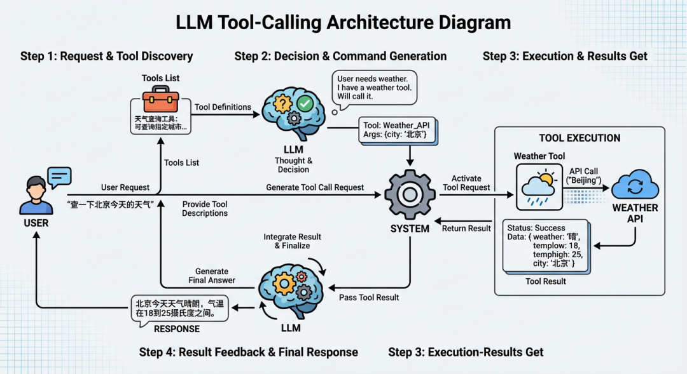
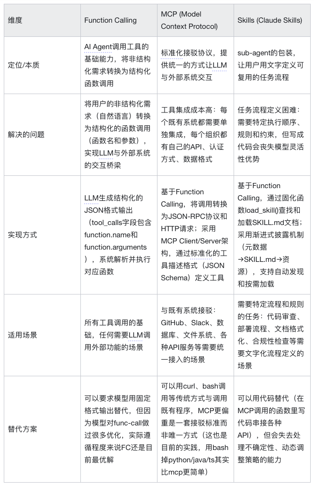

# AI Agent系列｜深入解析Function Calling、MCP和Skills的本质差异与最佳实践

> **公众号**: 阿里云开发者  
> **发布时间**: 2026-02-26 08:30  

阿里妹导读

本系列文章基于 Lynxe 作者沈询的实战经验，深入浅出解析 ReAct Agent 的核心原理与工程价值，帮助开发者快速掌握从“写流程”到“造智能体”的关键跃迁。

## 关于这个系列

作为 Lynxe(原JManus）的作者，我花费了很多课余时间来完善这个Func-Agent框架，也因此对于什么是ReAct Based Agent 有了更深一些的理解。

所以想把这些内容总结出来，是因为这个项目本身核心目的就是探索Agent的前沿最佳实践，目前已经有所小成，Lynxe能解决我自己面对的80%以上的问题了，所以我觉得值得把我实验下来有效的东西写出来，方便大家快速入门。

你可以访问 Lynxe(菱科斯)阅读详细源码来学习agent的一些最佳实践。这是一个非常完善的产品级的 Func-Agent框架。

https://github.com/spring-ai-alibaba/Lynxe

## 系列计划

  * [AI Agent系列｜什么是 ReAct Agent？](<https://mp.weixin.qq.com/s?__biz=MzIzOTU0NTQ0MA==&mid=2247558441&idx=1&sn=f856bc1bf23341b6c7e1cf249d0f522e&scene=21#wechat_redirect>)

  * [AI Agent系列｜深入了解智能体工作流核心：Agent vs 传统编程 vs Workflow 的本质区别](<https://mp.weixin.qq.com/s?__biz=MzIzOTU0NTQ0MA==&mid=2247558448&idx=1&sn=c8e6b35103ed82f7e4689c8b5f910c68&scene=21#wechat_redirect>)

  * 深入解析Function Calling、MCP和Skills的本质差异与最佳实践 (本篇)

  * 上下文管理的一些实践

  * 并行执行的最佳实践与我走过的弯路

在前面的文章中，我们介绍了什么是 ReAct Agent，以及 Agent 与传统编程、Workflow 的本质区别。

现在我们来聊聊一个大家广为谈论的话题：AI Agent 的工具能力是什么？Function Calling、MCP 和 Skills 这三者有什么区别？它们背后的核心原理是什么？

## 一句话总结

  * Function Calling：AI Agent 调用工具的基础能力，也是后面两个能够存在的基础。

  * MCP (Model Context Protocol)：由 Anthropic 推动的开放标准，为 LLM 应用提供标准化接口以连接和交互外部数据源和工具，现已捐赠给linux基金会。

  * Skills：Anthropic Claude的一个新的尝试，可以允许用户更细致的用文字定义指令、脚本和资源，跟MCP有竞合关系，我们后面会从不同角度来阐述这个竞合关系（虽然很多人认为是互补，但实际上，这两个是竞争关系更大一些）。

## 为什么需要这些技术：理解工具调用的基础

要讲明白为什么这几个概念是竞合关系，我们需要先简单了解一下AI Agent工具调用的基本原理。

### AI Agent工具调用的基本流程

### 一个典型的AI Agent工具调用流程是这样的：

1、LLM接收用户请求和工具描述

  * 用户提出需求（比如"帮我查一下北京今天的天气"）

  * 系统向LLM提供可用工具的列表和描述（比如"天气查询工具：可以查询指定城市的天气信息"）

2、LLM决定是否需要调用工具

  * LLM根据用户需求和工具描述，判断是否需要调用工具

  * 如果需要，LLM会生成结构化的工具调用请求

这里的关键是LLM返回的是结构化的JSON格式，而不是自然语言。比如用户说"帮我查一下北京今天的天气"，LLM可能会返回：

  *   *   *   *   *

    {  "id": "chatcmpl-abc123",  "object": "chat.completion",  "choices": [    {      "index": 0,      "message": {        "role": "assistant",        "content": null,        "tool_calls": [          {            "id": "call_abc123",            "type": "function",            "function": {              "name": "get_weather",              "arguments": "{\"city\": \"北京\", \"date\": \"today\"}"            }          }        ]      },      "finish_reason": "tool_calls"    }  ]}

这种结构化的输出格式，就是Function Calling的核心机制。它让系统能够稳定地解析LLM的意图，而不需要复杂的文本解析逻辑。注意关键字段：

  * tool_calls：当需要调用工具时，这里包含工具调用的信息；

  * function.name：要调用的工具名称；

  * function.arguments：工具的参数（JSON字符串格式）；

3、系统解析并执行工具调用

  * 系统解析LLM生成的工具调用请求；

  * 执行对应的工具函数（比如调用天气API）；

  * 获取工具执行结果 还是以上面的llm返回为例；

上面的JSON格式会被系统解析并转换为真正的函数调用。以JavaScript为例：

  *   *   *   *   *   *   *   *   *   *   *   *   *   *   *   *   *

    // 1. 从LLM响应中提取工具调用信息const toolCall = response.choices[0].message.tool_calls[0];const functionName = toolCall.function.name;  // "get_weather"const functionArgs = JSON.parse(toolCall.function.arguments);  // {city: "北京", date: "today"}
    // 2. 根据工具名称找到对应的函数const tools = {  get_weather: (city, date) => {    // 执行天气查询逻辑    return `北京今天天气：25°C，晴天`;  },  // ... 其他工具};
    // 3. 执行工具调用const result = tools[functionName](functionArgs.city, functionArgs.date);// 实际调用：tools["get_weather"]("北京", "today")

这个过程是自动的：系统根据`function.name`找到对应的函数，解析`function.arguments`获取参数，然后执行调用。这就是Function Calling让工具调用变得可预测和可靠的核心机制。

4、将结果返回给LLM

  * 工具执行结果被返回给LLM；

  * LLM根据结果决定下一步行动（继续调用工具，或者生成最终回答）。

### 小结：工具调用的本质

这个流程的核心在于：LLM需要把用户的非结构化需求（一段自然语言文本）转换为结构化的函数调用（函数名和参数），然后与其他应用程序交互，再将结构化结果返回给模型，让模型能够基于这些结果进行下一步决策。

问题的本质在于，历史上其他系统（数据库、API、文件系统等）只能处理结构化信息，而LLM擅长处理非结构化信息（文本）。因此，LLM必须想办法在两种信息形式之间架起桥梁：将非结构化的用户需求转换为结构化的函数调用，这样才能与外部系统交互。

这就是Function Calling的本质，也是后面MCP和Skills能够存在的前置条件。

## 既然有了工具调用，为什么又会有MCP和Skills呢？

Function Calling确实解决了核心问题：让LLM能够稳定地输出结构化的工具调用请求，实现了"非结构化→结构化"的转换。这是AI Agent工具能力的基础。

但在实际应用中，开发者很快发现了一个新的问题：工具集成成本太高。

### Function calling会有工具集成成本高的问题

现实世界中，有大量的既有系统和数据：数据库里存储着业务数据，文件系统里有各种文档和代码，GitHub上有项目仓库和Issue，dingding里有团队沟通记录，还有各种API服务提供实时数据。这些既有系统里有着丰富的信息，如果能让LLM直接使用这些系统和数据，AI Agent的能力会大大增强。

但问题是：如何让LLM能够使用这些既有系统？

在Function Calling的框架下，每个既有系统都需要单独集成到应用中。每个组织或公司都有自己的API、认证方式、数据格式，开发者需要为每个组织或公司编写对应的函数实现。这就是MCP产生的原因：提供一个服务，可以让既有系统快速集成到LLM中。

MCP的核心其实还是基于Function Calling的。它做的事情很简单：把Function Calling的调用，在客户端转换成一套JSON+HTTP的请求。然后提供一套Server来响应这个JSON+HTTP请求，这样就能实现各类应用都可以被LLM使用的效果。

  *   *   *   *

    LLM -> Function Calling -> MCP Client -> JSON+HTTP请求 -> MCP Server -> 既有系统（GitHub/Slack/数据库等）                                                                    ↓LLM <- Function Calling结果 <- MCP Client <- JSON响应 <- MCP Server <- 既有系统返回结果

但MCP解决了工具集成的问题后，又出现了另一个问题。

**Function Calling和MCP都会有任务流程定义困难的问题**

在实际使用中，用户经常需要让AI Agent按照特定的方式执行任务。比如，格式化Excel表格要按照公司的品牌指南，法律审查要遵循特定的合规性要求，数据分析要按照组织的工作流程。这些任务往往需要复杂的提示词和多个步骤的组合。

但在Function Calling和MCP的框架下，用户面临一个两难的问题：当前的大模型很难仅仅依托自己的模型能力就做出最优的工具调用步骤。很多任务需要特定的执行顺序、规则和约束，但把这些步骤全部写成代码又不太现实。就像我们在第一篇文章里讲的，模型的核心优势是面对不确定性时可以走一步看一步，动态调整策略。如果全部落成程序，就会丧失模型的核心优势。

举个例子，我们以Lynxe实际在跑的一个`new_branch`流程定义为例，我这个流程用文字写到一个markdown里面，每次都让模型遵照执行：

  *   *   *   *   *   *   *

    1) 确认本地的 VERSION 与 pom.xml 与 本地branch 中的版本一致，不一致的话以pom.xml为准2) mvn package 3) 进入 ui-vue3 运行pnpm lint 4) 退回项目目录， git merge upstream/main5) 项目目录，运行 make ui-deploy6) git 提交 branch到origin7) git 打包 tag名字与pom的版本号一致，先删除远程tag（如果存在）：git push upstream :refs/tags/v{版本号}，然后上传tag到 upstream (上传之前请先用git remote 看一下upstream是哪里，确认是spring-ai-alibaba/JManus)

这个流程有7个步骤，每个步骤都有特定的顺序、条件和规则。如果完全写成代码，每一步都要处理各种异常情况（比如版本不一致、tag已存在、upstream地址不对等），代码会变得非常复杂。但如果只给模型一个简单的提示词"帮我创建新分支"，模型可能无法按照这个精确的流程执行，或者执行顺序不对。 而用文字表达，非常直接简单，而且实际跑的过程中只有很小的概率会出错，非常爽。

而这就是这个问题的本质：如何在尽可能的准确的前提下，能让用户能用文字（而非代码）指导模型按照特定的流程和规则执行任务？

这就是Skills产生的原因（其实也是Lynxe的Func-Agent产生的核心原因）：提供一个方式，让用户可以用文字定义指令、脚本和资源，形成可复用的任务流程。

Skills的核心其实也是基于Function Calling的。它做的事情很巧妙：通过一个固化的函数和参数，让模型去查找和加载固定的skills文档。

这里的关键是，Skills完全依赖于Function Calling这个基础能力。 如果没有Function Calling，Skills就无法工作。Skills只是在Function Calling之上的一个巧妙应用：把"加载文档"这个操作封装成一个函数，然后让Claude在需要时自动调用。

具体工作流程是这样的：

  * 初始化阶段：用户用文字定义指令、脚本和资源，打包成Skills（包含SKILL.md和可选的脚本、参考资料等）。Claude在启动时会读取所有Skills的元数据（名称和描述），这些元数据被加载到模型的上下文中（每个约100 token）。

  * 发现阶段：当用户发起请求时，Claude会根据请求内容，对比已加载的Skills元数据，判断是否需要使用某个Skill。这个判断过程本质上就是LLM根据上下文做决策，跟Function Calling中判断是否需要调用工具是一样的。

  * 加载阶段（Function Calling）：如果Claude判断需要某个Skill，它会通过Function Calling机制调用一个专门的加载函数（类似`load_skill(skill_name)`），将对应的SKILL.md文档内容读取并加载到当前上下文中。这一步完全依赖Function Calling的能力。

  * 执行阶段（继续使用Function Calling）：SKILL.md的内容（包含指令、流程、示例等）被加入到上下文后，Claude按照文档中定义的指令执行任务。如果SKILL.md中定义了需要执行脚本（比如`scripts/rotate_pdf.py`），Claude还是会通过Function Calling调用执行脚本的函数。如果需要加载参考资料，同样是通过Function Calling调用读取文件的函数。

可以看到，整个Skills的运行过程，从加载文档、执行脚本到读取资源，每一步都离不开Function Calling。Skills并没有创造新的能力，它只是把Function Calling这个基础能力组织成了一个更易用的形式：让用户可以用文字定义流程，让Claude自动发现和加载相关知识。 从本质来说，他替代的是mcp 调用的函数里面，过去可能会用代码写的一套串接各种API的逻辑流程，用这种方式，可以增强流程的适应性，其实也是呼应了我们第二篇文章的核心观点：Agent将决策权完全下放给了 Agent 和 Prompt，能够解决原有写程序不能解决的问题——比如处理不确定性、动态调整策略、理解自然语言意图等。

  *   *   *   *   *   *   *   *   *   *   *   *   *

    Claude 判断是否需调用某 Skill（基于请求内容匹配已加载的 skill_name 与 description）↓若需要，则通过 Function Calling 调用 load_skill(skill_name)↓将对应 SKILL.md 的内容注入当前上下文，作为执行指令依据↓Claude 依照 SKILL.md 中定义的流程执行任务↓在执行过程中，按需通过 Function Calling：  • 调用 bash 执行附带脚本  • 调用 read_file 读取所需资源文件↓整合执行结果

## Function Calling、MCP、Skills的核心定位

通过前面的分析，我们可以看到Function Calling、MCP和Skills三者之间的本质关系：MCP和Skills都是基于Function Calling的，它们只是在Function Calling这个基础能力之上的不同应用方式。

MCP的核心是解决与既有系统的接驳问题 ： 实际上，与外部系统接驳的方法并不只有MCP这一种——我们完全可以用curl、bash等传统方式来与程序接驳。MCP的价值在于它提供了一套标准化的接驳协议，让不同的工具和数据源能够以统一的方式被LLM使用。通过JSON-RPC协议和标准化的工具描述格式，MCP降低了工具集成的成本，让开发者不需要为每个系统单独编写集成代码。但本质上，MCP更偏重是一套接驳标准，而不是唯一的接驳方式。

Skills则实际上是一个sub-agent的包装 ： 它让用户可以用文字来写流程，替代了过去在MCP调用的函数里用代码写的一套串接各种API的逻辑流程。这种方式可以增强流程的环境适应性——因为模型可以根据实际情况动态调整策略，处理不确定性，理解自然语言意图。这正是我们第二篇文章提到的核心观点：Agent将决策权完全下放给了模型和Prompt，能够解决原有写程序不能解决的问题。但代价就是不可能100%准确，因为模型的行为存在不确定性，无法像传统代码那样保证完全可预测的执行结果。

## MCP与Skills的竞争关系

虽然很多人认为MCP和Skills是互补关系，但实际上，这两者更多是竞争关系。这种竞争主要体现在它们解决的是同一个问题：如何整合多个既有系统，实现复杂的多步骤任务。

要理解它们的竞争关系，我们需要回到Function Calling的本质：LLM要实现工具调用，实际上最需要的内容只有：函数名、参数要求，以及一个description。基于这个前提，我们来看看MCP和Skills的不同解决思路：

MCP的解决思路：通过标准化的协议和Server架构，引入了一个新的协议转换Server（这个Server可以用Node.js、Python或其他语言来实现）。但这个协议转换层往往也只是先做了函数调用的协议转换，然后再增加一个description，打包，发布。这个流程是非常薄的——它本质上只是在Function Calling的基础上，增加了一层JSON-RPC协议转换。

Skills的解决思路：选择了更简单的办法，可以不需要这层协议转发Server，直接用bash以参数形式调用，结果其实是一样的，还更省事。换句话说，MCP的JSON-RPC可以被直接替换为命令行脚本或curl远程调用，在本地直接调用。这样甚至都不需要额外做MCP封装了。而且在这个基础上，Skills还能支持更复杂的流程定义——通过SKILL.md文档告知LLM如何组合多个接口调用，所以长流程任务的成功率会更高。

这就是为什么说它们是竞争关系：当用户选择使用Skills时，他们就不需要在MCP Server的函数中编写复杂的串接代码了；反之，如果选择在MCP Server中实现完整逻辑，Skills的价值就会降低。它们解决的是同一个问题（如何整合多个既有系统），但采用了不同的方法（协议转换Server+代码型流程定义 vs 直接命令行调用+文字化流程定义）。

## 三者的总结性对比表

## Lynxe的实践与总结

首先，我们也认为Agent这种将决策委托给LLM的方式，是一种更有潜力的、能够提供完全不同体验的、面向未来的方案。通过Function Calling、MCP和Skills这些技术，我们看到了AI Agent工具能力的完整体系正在形成。

但我们也并不认为Skills就是终局。在Lynxe的开发实践中，我们发现Skills仍然有两个核心问题没有解决：

1\. Skills的需求描述部分不够结构化

Skills仅仅通过`description`字段来描述sub-agent的要求，这会导致模型生成的信息非常容易不准确，从而导致sub-agent（也就是Skill）无法获得充分的信息，最终导致sub-agent无法达成用户期望。当任务复杂度增加时，纯文本描述的不确定性会放大，模型可能误解需求，或者遗漏关键信息。

2\. Agent无法与既有的系统接驳

Agent仅仅只能通过聊天的方式与既有系统接驳，这种方式最后无论怎么做，都只能是个对话框。但真实的系统，远远不止有对话框这一种输入的方式。我们的大量表单都不是只有一个textarea的。现有的Agent方案很难集成到复杂的业务系统中，比如需要多步骤表单、需要实时数据展示、需要与现有UI组件交互的场景。

这就是Lynxe这套Func-Agent思路的原因。如果一句话来表达，就是：一切都是函数，函数才是第一公民。

在Lynxe的设计中，我们让每个Agent能力都通过函数的方式暴露，这样就能更好地把Agent集成到既有的系统中，让他不再仅仅是一个对话框。通过函数化的接口，Lynxe的Func-Agent可以：

  * 接受结构化的参数输入，而不是依赖纯文本描述；

  * 返回结构化的结果，方便与现有系统集成；

  * 支持多种调用方式，不仅仅是聊天界面；

  * 与现有的业务逻辑、表单、API无缝对接；

这种方式既保留了Agent处理不确定性的核心优势，又解决了结构化输入输出和系统集成的问题，为Agent在实际业务场景中的应用提供了更可行的路径。
