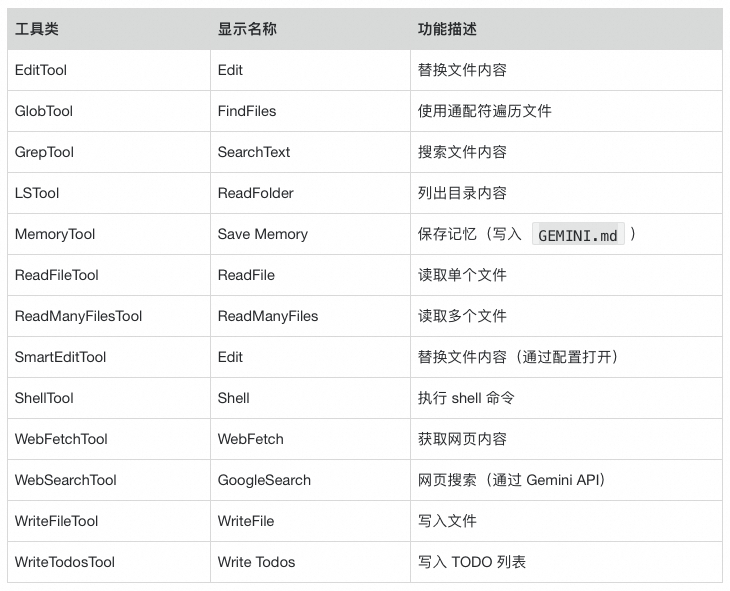
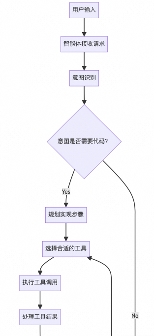
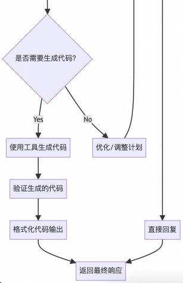

# AI coding 智能体设计

> **公众号**: 阿里云开发者  
> **发布时间**: 2025-12-29 08:30  

理解 AI coding 智能体的设计，可以帮助开发者更好地使用 AI coding 工具，实现开发提效。

  * 了解用户提示词预处理，帮助我们写出高效的用户提示词。例如：为什么在提示词中使用 `@`字符引入文件、目录作为上下文，可以减少会话轮次？如何自定义命令？

  * 了解智能体如何处理 MCP 扩展，如何解析 MCP 的 prompt 和 tool 能力，从而更好的进行 MCP 设计，为 AI coding 智能体提供子命令扩展和工具集扩展。

  * 了解 SubAgent 的实现，理解上下文隔离的意义，基于高内聚、低耦合原则进行智能体的模块化设计，降低系统复杂度。

  * 了解 MCP 工具调用的局限性，从而理解 Claude Code 推出 Skills、Code Execution with MCP 的动机和原理。

  * 为什么规约驱动开发（spec-driven development）成为 AI coding 的最佳实践？通过对开源项目 OpenSpec 的解读，了解规约驱动开发背后的奥秘和改进点。

本文从分析 Gemini-CLI 源代码开始，解读 AI coding 工具的智能体设计。Claude Code 本身不开源，但是实现原理大同小异。

在分析 Gemini-CLI 过程中，特别感谢 Qwen Code 团队，他们的开源项目中的 openaiContentGenerator [1]包提供了OpenAI API的兼容层，使用这个模块可以很容易将 Gemini-CLI 内置的谷歌认证和外部模型切换为公司内部模型。

## 一、Gemini-CLI 的用户提示词预处理

在 Gemini-CLI 中输入提示词，首先对输入的内容进行预处理。

  * 如果提示词的第一个字符是斜线（/），将提示词视为命令，执行特定操作，或者替换为预置提示词和大模型交互。

  * 如果提示词中包含 `@`字符+路径，检查 `@`字符后的路径是否存在，读取文件作为上下文，再发送给大模型。可减少不必要的模型会话。

### 1.1 内置命令

Gemini-CLI 的内置命令在 `packages/cli/src/ui/commands/`目录下定义。

  * 例如 `clear `命令在文件 `packages/cli/src/ui/commands/clearCommand.ts `中定义。

  * 内置命令可以执行特定操作。例如：`/clear `命令用于重置对话、清空上下文。

  * 内置命令可以使用预置用户提示词调用大模型完成相关任务。例如：`/init `命令使用大模型分析工程代码创建 `GEMINI.md `文件。

内置命令列表参见：docs/cli/commands.md [2]。

### 1.2 MCP Server 提供的提示词命令

MCP server 提供两种能力：工具和提示词。工具被拼装为模型上下文，而提示词则作为 Gemini-CLI 的扩展命令。

例如安装 mcp-server-commands [3]命令行工具后，该工具通过 STDIO 协议提供 MCP 服务，在 `~/.gemini/settings.json `配置示例如下：

  *   *   *   *   *   *   *   *   *   *

    {  "mcpServers": {    "mcp-server-commands": {      "command": "npx",      "args": [        "mcp-server-commands"      ]    }  }}

在 Gemini-CLI 中输入斜线触发命令补全，可以看到新增的 `run_command` 命令，该命令有`[MCP]`标识和内置命令相区分：

  *   *   *   *   *   *

    ╭─────────────────────────────────────────────────────────────────────────╮│ > /                                                                     │╰─────────────────────────────────────────────────────────────────────────╯ run_command [MCP]   Include command output in the prompt. This is effectively a user tool call. clear               Clear the screen and conversation history compress            Compresses the context by replacing it with a summary

### 1.3 扩展包提供的提示词命令

从 Gemini-CLI 的官方扩展市场[4]下载扩展。扩展包安装在 `~/.gemini/extensions`目录下，每个扩展下面的 `commands/`子目录提供扩展命令。

以`gemini-cli-security`扩展为示例，安装命令如下：

  *   *

    $ gemini extensions install \  https://github.com/gemini-cli-extensions/security

安装后重启 Gemini-CLI，执行命令 `/extensions list`查看安装的扩展：

  *   *   *   *

    > /extensions list
    Installed extensions:  gemini-cli-security (v0.3.0) - active

在 Gemini-CLI 中输入斜线触发命令补全，可以看到由扩展引入的新命令命令，这些命令有`[<extension>]`标识，以便和内置命令相区分：

  *   *   *   *   *

    ╭─────────────────────────────────────────────────────────────────────────╮│  > /security:                                                           │╰─────────────────────────────────────────────────────────────────────────╯ security:analyze             [gemini-cli-security] Analyzes code changes on your current branch for common security vulnerabilities security:analyze-github-pr   [gemini-cli-security] Only to be used with the run-gemini-cli GitHub Action. Analyzes code changes on a GitHub…

### 1.4 本地文件自定义命令

用户可以通过在特定目录下创建 `*.toml`文件，创建扩展命令。

  * 用户级：`~/.gemini/commands/*.toml`

  * 项目级：`<project>/.gemini/commands/*.toml`

  * 扩展级：`<extension>/commands/*.toml`（扩展包提供的命令扩展）

扩展文件名（包含相对路径名）作为扩展命令，文件内容定义提示词。

  * prompt = "提示词"

  * description = "命令描述（可选）"

### 1.5 @路径扩展

在提示词中出现的 “`@路径`”，在将提示词发送给大模型之前会提前读取相关文件（如果路径是目录名，会读取目录下所有文件）作为上下文，可以减少一轮或多轮和大模型的对话，提升效率。

## 二、Gemini-CLI 的工具注册和工具调用

在 Gemini-CLI 和大模型会话中，将工具列表作为上下文提供给大模型 ，由大模型决定是否调用，Gemini-CLI 接收到大模型的调用指令请求，由 Gemini-CLI 执行相应的调用指令，将命令输出作为上下文提供大模型，最终完成相应的任务。

### 2.1 注册核心工具

Gemini-CLI 内置的核心工具在 `packages/core/src/tools/`目录下定义，通过调用 `packages/core/src/config/config.ts`的`createToolRegistry`方法对工具注册。

可以通过配置文件中的 `coreTools`（如：`"coreTools": ["ReadFileTool", "GlobTool", "ShellTool(ls)"]`）限制工具的访问，默认所有内置工具均可用。

这些核心工具，每个工具使用 TypeScript 实现相关功能，或者调用外部命令实现。

核心工具如下表所示：

### 2.2 子智能体注册为工具

目前只有一个子智能体（SubAgent）：CodebaseInvestigatorAgent，用于针对复杂请求的代码分析工作。Gemini-CLI 将子智能体 `CodebaseInvestigatorAgent`封装为工具，和其他工具以同样的流程调用。该子智能体被设置为只能使用只读工具。

子智能体在执行时有隔离的上下文空间，不会污染主智能体的上下文，通过高内聚松耦合的子智能体，有效降低智能体设计的复杂度。目前 Claude Code 已经提供用户自定义子智能体功能。

### 2.3 用户自定义工具

还支持通过用户指定命令提供自定义工具的发现。用配置`tools.discoveryCommand`设置自定义工具的发现命令（如 `bin/get_tools`），该命令的输出是一个 JSON 数组，提供自定义工具的定义。

参见 `docs/get-started/configuration.md`中的示例：

  *   *   *   *   *   *

    "tools": {                                                                       "sandbox": "docker",                                                           "discoveryCommand": "bin/get_tools",                                           "callCommand": "bin/call_tool",                                                "exclude": ["write_file"]                                                    },

### 2.4 MCP 注册为工具

通过 `settings.json`配置的 MCP Servers，以及扩展（extensions）包含的 MCP Servers，用于发现自定义工具。

在 `settings.json`中每一个 `mcpServers.<SERVER_NAME>`小节支持三种 MCP 配置：stdio/SSE/streamable HTTP。

  * command、`args`、`env`、`cwd`：用于设置 stdio 协议 MCP 连接。

  * url：用于 SSE 协议。

  * httpUrl：用于 streamable HTTP 协议。

  * headers：设置 HTTP 头。

  * includeTools、`excludeTools`：从 MCP 服务中包含和排除工具。

示例：

  *   *   *   *   *   *   *   *   *   *   *   *   *

    {  ...,  "mcpServers": {    "mainServer": {      "command": "bin/mcp_server.py"    },    "anotherServer": {      "command": "node",      "args": ["mcp_server.js", "--verbose"]    }  },  ...}

MCP client 连接 MCP server 将返回注册到工具列表。参见代码文件 `packages/core/src/tools/mcp-client-manager.ts`、 `packages/core/src/tools/mcp-client.ts`。

流程图如下：

  *   *   *   *   *

    1. maybeDiscoverMcpServer (入口)   ├─ 权限检查   ├─ 创建/重用 McpClient   └─ 调用 connect() + discover()
    2. connect() (连接)   └─ connectToMcpServer()      ├─ 创建 MCP Client 实例      ├─ 注册能力 (roots)      ├─ createTransport() (创建传输层)      │  ├─ StdioClientTransport (stdio)      │  ├─ SSEClientTransport (SSE)      │  ├─ StreamableHTTPClientTransport (HTTP)      │  └─ OAuth 认证处理      └─ client.connect(transport)
    3. discover() (发现)   ├─ discoverPrompts() (发现提示)   └─ discoverTools() (发现工具)      ├─ 检查服务器能力      ├─ mcpToTool().tool() (获取工具列表)      ├─ 遍历 functionDeclarations      ├─ isEnabled() (过滤工具)      └─ new DiscoveredMCPTool() (封装工具)
    4. 工具注册   └─ toolRegistry.registerTool(tool)
    5. 工具执行 (运行时)   └─ DiscoveredMCPToolInvocation.execute()      ├─ mcpTool.callTool() (调用 MCP 服务器)      ├─ 处理响应      └─ transformMcpContentToParts() (转换内容)

### 2.5 工具列表作为上下文提供给大模型

会话时，工具列表作为上下文传递给大模型。这个过程中，MCP server 提供的工具和内置工具一样写入上下文。一个 MCP server 可能会广播上百个工具，如果一个 AI coding 智能体添加了过多的 MCP server，太多的 MCP 工具会导致大模型上下文爆炸。即使少量配置的 MCP server，对于大部分场景用不到的 tools，会大量消耗大模型 token，非常不经济。

Claude Code 引入和 Skills 扩展，以及提出了大模型通过编码调用 MCP，都是为了解决传统 MCP 工具广播造成的 token 爆炸问题。

Gemini-CLI 中相关执行链路：

  *   *   *   *   *

    1. 工具注册   └─ ToolRegistry.registerTool()      └─ 工具被添加到 allKnownTools Map
    2. 获取工具列表   └─ GeminiClient.startChat() 或 setTools()      └─ toolRegistry.getFunctionDeclarations()         └─ ToolRegistry.getFunctionDeclarations()            ├─ getActiveTools() - 过滤被排除的工具            └─ tool.schema - 获取每个工具的 FunctionDeclaration
    3. 封装工具格式   └─ const tools: Tool[] = [{ functionDeclarations: toolDeclarations }]      └─ Tool 格式: { functionDeclarations: FunctionDeclaration[] }
    4. 存储到 GeminiChat   └─ new GeminiChat(config, { tools, ... }, history)      └─ this.generationConfig.tools = tools
    5. 发送消息时传递   └─ GeminiChat.sendMessageStream()      └─ makeApiCallAndProcessStream()         └─ generateContentStream({              model,              contents,              config: { ...this.generationConfig, ...params.config }            })            └─ config.tools 包含工具列表
    6. ContentGenerator 处理   ├─ Gemini API (GoogleGenAI)   │  └─ 直接传递 tools 到 SDK   │   └─ OpenAI 兼容 API      └─ convertGeminiToolsToOpenAI()         └─ 转换为 OpenAI 格式            └─ { type: 'function', function: { name, description, parameters } }
    7. API 调用   └─ 工具列表作为请求参数的一部分发送给大模型

Gemini API 的提示词中封装工具列表，示例如下：

  *   *   *   *   *

    {  "model": "gemini-2.0-flash",  "request": {    "contents": [      { "role": "user", "parts": [{ "text": "用户消息1" }] },      { "role": "model", "parts": [{ "text": "模型回复1" }] },      { "role": "user", "parts": [{ "text": "用户消息2" }] }    ],    "systemInstruction": {      "role": "user",      "parts": [{ "text": "系统提示词内容..." }]    },    "tools": [      {        "functionDeclarations": [          { "name": "read_file", "description": "...", "parameters": {"..."} },          { "name": "write_file", "description": "...", "parameters": {"..."} }        ]      }    ],    "generationConfig": {      "temperature": 0.7,      "maxOutputTokens": 8192    }  }}

OpenAI 兼容 API 的提示词中封装工具列表，示例如下：

  *   *   *   *   *

    {  "model": "gpt-4",  "messages": [    {      "role": "system",      "content": "系统提示词内容..."    },    {      "role": "user",      "content": "用户消息1"    },    {      "role": "assistant",      "content": "模型回复1"    },    {      "role": "user",      "content": "用户消息2"    }  ],  "tools": [    {      "type": "function",      "function": {        "name": "read_file",        "description": "...",        "parameters": { /* JSON Schema */ }      }    },    {      "type": "function",      "function": {        "name": "write_file",        "description": "...",        "parameters": { /* JSON Schema */ }      }    }  ],  "temperature": 0.7,  "max_tokens": 8192}

### 2.6 大模型工具调用请求和结果返回

大模型如果判断需要执行相应工具，会在输出中包含工具调用。

Gemini API 的工具调用请求：

  *   *   *   *   *   *   *   *

    // 从响应中提取的格式{  "functionCall": {    "id": "...",        // 工具调用ID    "name": "string",      // 工具名称    "args": Record<string, unknown>  // 工具参数（JSON对象）  }}

OpenAI 兼容API的工具调用请求：

  *   *   *   *   *   *   *   *   *   *   *   *

    {  "tool_calls": [    {      "id": "...",      "type": "function",      "function": {        "name": "...",        "arguments": "..."  // JSON 字符串      }    }  ]}

Gemini-CLI 执行相关命令后，执行结果以 JSON格式封装。

GEMINI API 将执行结果作为用户消息的一部分返回，格式示例：

  *   *   *   *   *

    // 作为用户消息的一部分发送{  "role": "user",  "parts": [    {      "functionResponse": {        "id": "call_123",        "name": "read_file",        "response": {          "output": "文件内容..."        }      }    },    {      "functionResponse": {        "id": "call_124",        "name": "write_file",        "response": {          "error": "..."       // 错误信息        }      }    }  ]}

OpenAI 兼容 API 将工具返回以新的 role（tool）返回：

  *   *   *   *   *   *

    // OpenAI API 格式{  "role": "tool",  "tool_call_id": "call_123",  "content": "工具执行结果字符串"}

## 三、Gemini-CLI 的架构设计

Gemini-CLI、Claude Code 不但是强大的 AI coding 工具，用户也可以将其扩展为更加通用的智能体。例如在 Claude Agent SDK [5]文档中写到 Claude Code 可以扩展为：

  * 编程类智能体：

  * 诊断并修复生产环境问题的 SRE（站点可靠性工程）智能体

  * 审查代码漏洞的安全审计机器人

  * 对突发事件进行分类处理的值班工程师助手

  * 强制执行代码风格与最佳实践的代码审查智能体

  * 业务类智能体：

  * 审核合同与合规性的法律助手

  * 分析财务报告与预测的金融顾问

  * 解决技术问题的客户支持智能体

  * 为营销团队提供内容创作支持的助手

分析 Gemini-CLI 架构，理解智能体设计，通过扩展放大智能体能力为我所用。

### 3.1 流程图

Gemini-CLI 智能体流程图如下：

### 3.2 意图识别和智能路由

意图识别步骤是代码生成流程的第一阶段。当用户向 Gemini-CLI 提交请求时，系统必须首先理解用户想要完成什么任务，分析确定请求是需要代码生成还是可以通过直接响应来处理。

意图识别主要通过提示词工程和智能体ReAct架构实现。

文件`packages/core/src/core/prompts.ts`中的主系统提示词包含指导模型分析用户请求的特定指令：

  * 对于软件工程任务，模型被指示思考用户请求和相关代码库上下文。

  * 模型被指示使用 `CodebaseInvestigatorAgent`处理复杂任务或使用直接工具处理简单搜索。

  * 提示提供了一个结构化的工作流程，用于在采取行动之前理解和制定代码库上下文策略。

  * 详见后面的“主系统提示词”。

路由决策主要通过提示工程实现，配合少量支持代码。

  * 没有显式的路由代码：路由决策由模型根据系统提示自主做出，而非硬编码的条件判断。

  * 配置驱动可用性：智能体是否可用由配置决定，影响工具列表。

  * 提示工程实现路由：系统提示明确指导何时使用智能体、何时使用直接工具。

  * 工具化智能体：通过`SubagentToolWrapper`将智能体包装为工具，使其可被模型调用。

相关调用链路如下：

  *   *   *   *   *

    1. 系统提示构建   └─ getCoreSystemPrompt()      ├─ 检查配置（enableCodebaseInvestigator）      ├─ 选择提示模板（primaryWorkflows_prefix_ci 等）      └─ 组合提示片段         └─ 包含任务分类指导
    2. 模型接收系统提示   └─ 系统提示包含：      ├─ 角色定位："specializing in software engineering tasks"      ├─ 软件工程任务示例："fixing bugs, adding features, refactoring, or explaining code"      ├─ 处理流程：Understand → Plan → Implement → Verify → Finalize      └─ 路由指导：复杂任务 → CodebaseInvestigatorAgent，简单任务 → 直接工具
    3. 模型自主分类（运行时）   └─ 模型根据系统提示的指导      ├─ 分析用户请求      ├─ 判断是否为软件工程任务      │  └─ 基于关键词和上下文：      │     - "fixing bugs" → 软件工程任务      │     - "adding features" → 软件工程任务      │     - "refactoring" → 软件工程任务      │     - "explaining code" → 软件工程任务      │     - "what is..." → 可能是一般信息任务      │     - "how does..." → 可能是一般信息任务      └─ 决定处理方式：         - 软件工程任务 → 遵循工作流程（使用工具）         - 一般信息任务 → 直接回答（不使用代码生成工具）
    4. 路由决策（如果是软件工程任务）   └─ 模型评估复杂度      ├─ 复杂任务（重构、系统分析）      │  └─ 检查 CodebaseInvestigatorAgent 是否可用      │     └─ 如果可用 → 调用 CodebaseInvestigatorAgent      │     └─ 如果不可用 → 使用直接工具      └─ 简单任务（查找文件、函数）         └─ 直接使用 search_file_content 或 glob

### 3.3 主流程的 ReAct 框架

简单的编码任务，不使用`CodebaseInvestigatorAgent`子智能体，在主流程的 ReAct 架构中实现。

  * 文件`packages/cli/src/nonInteractiveCli.ts`中的 while 循环。

  * Reasoning：用`geminiClient.sendMessageStream()` 调用模型。

  * Acting：用`executeToolCall()` 执行工具。

  * Observing：收集 `toolResponseParts`。

  * Updating：将结果设为 `currentMessages`，继续循环。

以一个简单的编码任务为例，流程如下：

  *   *   *   *   *

    用户输入: "在 helper.ts 中添加 formatDate 函数"    ↓runNonInteractive()    ↓[初始化] 处理命令、设置取消监听    ↓┌────────────────────────────────────────┐│      ReAct Loop Start(whiletrue)     │└────────────────────────────────────────┘    ↓[Turn 1 - REASONING]geminiClient.sendMessageStream()    ├─> 系统提示词: "使用 GREP/GLOB 搜索"    ├─> 模型分析: "需要先查看文件内容"    └─> 返回工具调用: [read_file, search_file_content]    ↓[Turn 1 - ACTING]executeToolCall(read_file) → 读取 helper.tsexecuteToolCall(search_file_content) → 搜索 formatDate    ↓[Turn 1 - OBSERVING]收集工具结果 → toolResponseParts    ↓[Turn 1 - UPDATING]currentMessages = [{ role: 'user', parts: toolResponseParts }]    ↓[Turn 2 - REASONING]模型收到文件内容，分析如何添加函数    └─> 返回工具调用: [replace]    ↓[Turn 2 - ACTING]executeToolCall(replace) → 修改文件    ↓[Turn 2 - OBSERVING]收集修改结果    ↓[Turn 2 - UPDATING]currentMessages = [{ role: 'user', parts: toolResponseParts }]    ↓[Turn 3 - REASONING]模型确认任务完成    └─> 返回文本响应（无工具调用）    ↓[终止]toolCallRequests.length === 0    └─> return (退出循环)

### 3.4 子智能体的 ReAct 框架

子智能体`CodebaseInvestigatorAgent`封装为一个工具，针对复杂的软件工程场景，大模型第一轮返回对子智能体 `CodebaseInvestigatorAgent`的调用请求。于是 Gemini-CLI 调用子智能体对本地代码工程做分析，查找代码文件和内容。

子智能体有自己的系统提示词，参见后面的“代码库调查 SubAgent 的系统提示词”。

子智能体的运行的 ReAct 框架代码见文件：`packages/core/src/agents/executor.ts`。

流程图如下：

  *   *   *   *   *

    ┌─────────────────────────────────────────────────────────────┐│            CodebaseInvestigatorAgent ReAct Loop             │└─────────────────────────────────────────────────────────────┘
    初始化阶段  ├─ 创建 GeminiChat 实例  ├─ 准备工具列表（ls, read_file, glob, grep）  └─ 构建初始查询（基于 objective 参数）
    主循环 (whiletrue)  │  ├─ 【终止检查】  │   ├─ 检查 max_turns (15)  │   ├─ 检查 max_time_minutes (5)  │   └─ 检查 AbortSignal  │  ├─ 【Reasoning 阶段】  │   ├─ executeTurn()  │   ├─ callModel() → 调用 Gemini API  │   ├─ 提取 functionCalls  │   └─ 提取思考内容（THOUGHT_CHUNK）  │  ├─ 【Acting 阶段】  │   ├─ processFunctionCalls()  │   ├─ 验证工具权限（只读工具白名单）  │   ├─ 执行工具调用（ls, read_file, glob, grep）  │   └─ 收集工具执行结果  │  ├─ 【Observing 阶段】  │   ├─ 检查是否调用了 complete_task  │   ├─ 验证输出模式（CodebaseInvestigationReportSchema）  │   └─ 判断任务是否完成  │  └─ 【Updating 阶段】      ├─ 如果完成：返回结构化报告      ├─ 如果未完成：将工具结果作为 nextMessage      └─ 继续下一轮循环
    终止条件  ├─ GOAL: 成功调用 complete_task 并验证输出  ├─ MAX_TURNS: 达到 15 轮  ├─ TIMEOUT: 超过 5 分钟  ├─ ABORTED: 用户取消  └─ ERROR: 协议违反（未调用 complete_task）

### 3.5 完成编码

完成编码任务是通过大模型返回的工具调用实现的。

  *   *   *   *   *   *   *   *   *   *   *   *   *   *   *   *   *

    用户请求 (fixing bugs, adding features)    ↓模型分析任务类型    ↓模型返回工具调用 (functionCall)    ↓Gemini-CLI 解析工具调用    ↓工具验证和确认    ↓工具执行 (EditTool / WriteFileTool)    ↓文件系统写入 (FileSystemService.writeTextFile)    ↓执行结果返回给模型    ↓模型继续处理或完成

针对要修改的文件，模型通过 functionCall 返回修改请求，示例如下：

  *   *   *   *   *   *   *   *   *   *   *   *

    {  "functionCall": {    "id": "call_123",    "name": "replace",  // 或 "edit"    "args": {      "file_path": "src/utils/helper.ts",      "old_string": "function oldFunction() {\n  return 'old';\n}",      "new_string": "function newFunction() {\n  return 'new';\n}",      "expected_replacements": 1  // 可选    }  }}

针对要替换或新增的文件，模型返回 WriteFileTool (创建新文件或覆盖)，示例如下：

  *   *   *   *   *   *   *   *   *   *

    {  "functionCall": {    "id": "call_456",    "name": "write_file",    "args": {      "file_path": "src/new-feature.ts",      "content": "export function newFeature() {\n  // implementation\n}"    }  }}

工具执行完成后，结果被封装为 functionResponse 并添加到对话历史，在下次请求时发送给模型：

  *   *   *   *   *   *   *   *   *

    {  "functionResponse": {    "id": "call_123",    "name": "replace",    "response": {      "output": "Successfully modified file: src/utils/helper.ts (1 replacements)."    }  }}

### 3.6 记忆压缩

记忆压缩的触发条件：

  * 用户提示词超过最大值的 20%（`DEFAULT_COMPRESSION_TOKEN_THRESHOLD`），启动压缩。

  * 记忆压缩方法：

  * 使用 `findCompressSplitPoint` 函数找到压缩分割点。

  * 保留最近 30% 的对话历史 (COMPRESSION_PRESERVE_THRESHOLD = 0.3)。

  * 使用大模型和提示词，将较早的历史通过模型进行总结压缩。提示词参见后面的“记忆压缩系统提示词”。

  * 如果压缩后 token 数量反而增加，则标记为压缩失败。

记忆压缩的完整流程图如下：

  *   *   *   *   *

    触发点：sendMessageStream() 发送消息前  │  ├─ tryCompressChat(prompt_id, force=false)  │   │  │   └─ ChatCompressionService.compress()  │       │  │       ├─ 【步骤 1】获取对话历史  │       │   └─ chat.getHistory(true)  // curated history  │       │  │       ├─ 【步骤 2】早期退出检查  │       │   ├─ 历史为空？→ NOOP  │       │   └─ 之前压缩失败且未强制？→ NOOP  │       │  │       ├─ 【步骤 3】Token 阈值检查  │       │   ├─ 获取当前 token 数：chat.getLastPromptTokenCount()  │       │   ├─ 计算阈值：threshold * tokenLimit(model)  │       │   └─ 未超过阈值？→ NOOP  │       │  │       ├─ 【步骤 4】找到分割点  │       │   ├─ findCompressSplitPoint(history, 0.7)  │       │   ├─ 计算字符数，找到 70% 位置  │       │   ├─ 只在用户消息（非 functionResponse）处分割  │       │   ├─ historyToCompress = history[0:splitPoint]  │       │   └─ historyToKeep = history[splitPoint:]  │       │  │       ├─ 【步骤 5】调用模型生成摘要  │       │   ├─ 准备输入：  │       │   │   ├─ contents: [...historyToCompress, 压缩指令]  │       │   │   └─ systemInstruction: getCompressionPrompt()  │       │   ├─ 调用：config.getContentGenerator().generateContent()  │       │   └─ 提取摘要：getResponseText(summaryResponse)  │       │  │       ├─ 【步骤 6】构建新历史  │       │   ├─ extraHistory = [  │       │   │     { role: 'user', parts: [{ text: summary }] },  │       │   │     { role: 'model', parts: [{ text: 'Got it...' }] },  │       │   │     ...historyToKeep  │       │   │   ]  │       │   └─ 计算新 token 数：JSON.stringify().length / 4  │       │  │       ├─ 【步骤 7】验证压缩效果  │       │   ├─ newTokenCount > originalTokenCount？  │       │   │   └─ 是 → COMPRESSION_FAILED_INFLATED_TOKEN_COUNT  │       │   └─ 否 → COMPRESSED  │       │  │       └─ 【步骤 8】返回结果  │           ├─ newHistory: 压缩后的历史（或 null）  │           └─ info: 压缩状态和统计信息  │  └─ 处理压缩结果      ├─ 压缩失败？      │   └─ 设置 hasFailedCompressionAttempt = true      │      └─ 压缩成功？          ├─ 更新对话历史：this.chat = await this.startChat(newHistory)          ├─ 更新 token 计数：this.updateTelemetryTokenCount()          └─ 强制完整 IDE 上下文：this.forceFullIdeContext = true

## 四、Gemini-CLI 的预置提示词

Gemini-CLI 的意图理解、智能路由能力，大部分是通过提示词实现的。

### 4.1 主系统提示词

参见文件 packages/core/src/core/prompts.ts [6]的 `getCoreSystemPrompt()`方法。

关于主系统提示词的说明：

  * 主系统提示词由以下所示的 preamble、coreMandates、primaryWorkflows* 等几个部分组成。

  * 可以通过环境变量 `GEMINI_PROMPT_*`（如 `GEMINI_PROMPT_PREAMBLE=false`）关闭相关的提示词。

  * 提示词中的类似 `${CodebaseInvestigatorAgent.name}`的语法是变量替换。

  * 提示词中的类似`${(function () { ... }()`的语法是 IIFE（立即执行函数表达式），以便利用更加灵活的条件判断等指令生成字符串。

  * 可以使用文件绕过系统提示词，使用文件内容作为系统提示词（不建议）：

  * 如果有环境变量 `GEMINI_SYSTEM_MD`，使用该环境变量指向的文件作为系统提示词。

  * 默认检查是否存在文件 `~/.gemini/system.md`，如果存在则使用该文件作为系统提示词。

系统提示词的中文译文如下：

1.Preamble

  *   *   *

    你是一个专门从事软件工程任务的交互式 CLI 代理。  你的主要目标是帮助用户安全高效地完成任务，  严格遵守以下指令并使用你可用的工具。

2.CoreMandates

  *   *   *   *   *

    # 核心职责
    - **约定：** 在读取或修改代码时严格遵守现有项目约定。    先分析周围代码、测试和配置。
    - **库/框架：** 绝不假设某个库/框架可用或合适。    在使用前验证其在项目中的既定用法（检查导入语句、    配置文件如 'package.json'、'Cargo.toml'、    'requirements.txt'、'build.gradle' 等，或观察相邻文件）。
    - **风格与结构：** 模仿项目中现有代码的风格（格式、命名）、    结构、框架选择、类型和架构模式。
    - **惯用更改：** 编辑时理解本地上下文（导入、函数/类），    确保您的更改能够自然且惯用地集成。
    - **注释：** 谨慎添加代码注释。重点关注 *为什么* 要做某事，    特别是对于复杂逻辑，而不是 *做什么*。仅在必要时添加    高价值注释以提高清晰度或按用户要求添加。    不要编辑与您更改的代码分开的注释。    *绝不* 通过注释与用户交谈或描述您的更改。
    - **主动性：** 彻底完成用户的请求。添加功能或修复错误时，    这包括添加测试以确保质量。除非用户另有说明，    否则将所有创建的文件（尤其是测试）视为永久工件。
    - **确认模糊/扩展：** 不要在请求的明确范围之外采取重大行动，    除非与用户确认。如果被问及 *如何* 做某事，先解释，不要直接操作。
    - **解释更改：** 完成代码修改或文件操作后，    *不要* 提供摘要，除非被要求。
    - **不要回滚更改：** 除非用户要求，否则不要回滚对代码库的更改。    只有在您所做的更改导致错误或用户明确要求您回滚更改时，    才回滚您所做的更改。

3.PrimaryWorkflows_* (根据不同条件选择不同提示词)

a.primaryWorkflows_prefix_ci_todo（if enableCodebaseInvestigator && enableWriteTodosTool）

  *   *   *   *   *

    # 主要工作流程
    ## 软件工程任务
    当被要求执行诸如修复错误、添加功能、重构或解释代码等任务时，  请遵循以下步骤：
    1. **理解与策略：** 思考用户请求以及相关的代码库上下文。     当任务涉及**复杂的重构、代码库探索或系统级分析**时，     你的**第一且主要的工具**必须是「${CodebaseInvestigatorAgent.name}」。     使用它来全面了解代码、其结构和依赖关系。     对于**简单的、有针对性的搜索**（如查找特定函数名、文件路径或变量声明），     你应该直接使用「${GREP_TOOL_NAME}」或「${GLOB_TOOL_NAME}」。
    2. **计划：** 基于第一步的理解，制定一个连贯且有根据的计划，     说明你打算如何解决用户的任务。     如果使用了「${CodebaseInvestigatorAgent.name}」，     请不要忽视其输出，你必须将其作为计划的基础。     对于复杂任务，将其分解为更小、可管理的子任务，     并使用「`${WRITE_TODOS_TOOL_NAME}`」工具跟踪进度。     如果有助于用户理解你的思路，     请提供一个极为简洁但清晰的计划。     在计划中，应包含编写单元测试来验证更改的迭代开发过程，     并在过程中使用输出日志或调试语句辅助实现解决方案。

b.PrimaryWorkflows_prefix_ci（if enableCodebaseInvestigator）

  *   *   *   *   *

    # 主要工作流程
    ## 软件工程任务
    当被要求执行诸如修复错误、添加功能、重构或解释代码等任务时，  请遵循以下顺序：
    1. **理解与制定策略：** 思考用户的要求和相关代码库的上下文。     当任务涉及**复杂重构、代码库探索或系统范围分析**时，     您的**第一个且主要的工具**必须是 '${CodebaseInvestigatorAgent.name}'。     使用它来全面了解代码、其结构和依赖关系。     对于**简单的、有针对性的搜索**（如查找特定函数名、文件路径或变量声明），     您应直接使用 '${GREP_TOOL_NAME}' 或 '${GLOB_TOOL_NAME}'。
    2. **规划：** 基于第一步的理解，构建一个连贯且有根据的计划     来解决用户的任务。     如果使用了 '${CodebaseInvestigatorAgent.name}'，     请不要忽视其输出，您必须将其作为计划的基础。     如果这有助于用户理解您的思考过程，     请与用户分享一个极其简洁但清晰的计划。     作为计划的一部分，您应该使用迭代开发过程，     包括编写单元测试来验证您的更改。     在这个过程中使用输出日志或调试语句来得出解决方案。

c.PrimaryWorkflows_todo（if enableWriteTodosTool）

  *   *   *   *   *

    # 主要工作流程
    ## 软件工程任务
    当被要求执行诸如修复错误、添加功能、重构或解释代码等任务时，  请遵循以下步骤：
    1. **理解：** 思考用户请求及相关代码库上下文。     广泛使用 '${GREP_TOOL_NAME}' 和 '${GLOB_TOOL_NAME}' 搜索工具     （若独立则并行使用），以了解文件结构、现有代码模式和规范。     使用 '${READ_FILE_TOOL_NAME}' 和 '${READ_MANY_FILES_TOOL_NAME}'     来理解上下文并验证你可能有的任何假设。
    2. **计划：** 制定一个连贯且有根据（基于第1步的理解）的计划，     说明你打算如何解决用户的任务。     对于复杂的任务，将其分解为更小、易于管理的子任务，     并使用 \`${WRITE_TODOS_TOOL_NAME}\` 工具来跟踪你的进度。     如果有助于用户理解你的思路，     可向用户提供一个极其简洁但清晰的计划。     作为计划的一部分，你应该采用包含编写单元测试     以验证更改的迭代开发过程。     在此过程中使用输出日志或调试语句来得出解决方案。

d.PrimaryWorkflows_prefix

  *   *   *   *   *   *   *   *   *   *   *   *   *   *   *   *   *   *   *   *

    # 主要工作流程
    ## 软件工程任务
    当被要求执行诸如修复错误、添加功能、重构或解释代码等任务时，  请遵循以下步骤：
    1. **理解：** 思考用户的需求以及相关的代码库上下文。     广泛使用 '${GREP_TOOL_NAME}' 和 '${GLOB_TOOL_NAME}' 搜索工具     （如果独立则并行使用），以了解文件结构、现有代码模式和规范。     使用 '${READ_FILE_TOOL_NAME}' 和 '${READ_MANY_FILES_TOOL_NAME}'     来理解上下文并验证你可能有的任何假设。
    2. **计划：** 制定一个连贯且基于第一步理解的计划，     说明你打算如何解决用户的任务。     如果对用户理解你的思路有帮助，     可以向用户提供一个极其简洁但清晰的计划。     作为计划的一部分，你应该采用包含编写单元测试     来验证更改的迭代开发过程。     在这一过程中使用输出日志或调试语句来得出解决方案。

4.PrimaryWorkflows_suffix

  *   *   *   *   *

    # 主要工作流程
    ## 新应用程序
    **目标：** 自主实现并交付一个视觉吸引人、实质性完成且功能性的原型。  利用您可支配的所有工具来实现应用程序。  您可能特别有用的工具包括 '${WRITE_FILE_TOOL_NAME}'、  '${EDIT_TOOL_NAME}' 和 '${SHELL_TOOL_NAME}'。
    1. **理解需求：** 分析用户请求以识别核心功能、     期望的用户体验（UX）、视觉美学、应用程序类型/平台     （网络、移动、桌面、CLI、库、2D 或 3D 游戏）和明确的约束。     如果初始规划的关键信息缺失或模糊，     请提出简洁、有针对性的澄清问题。
    2. **提出计划：** 制定内部开发计划。     向用户呈现清晰简洁的高级摘要。     此摘要必须有效传达应用程序的类型和核心目的、     将使用的主要技术、主要功能以及用户如何与之交互，     以及视觉设计和用户体验（UX）的一般方法，     以实现美观、现代和精良的交付，     特别是对于基于 UI 的应用程序。     对于需要视觉资源的应用程序（如游戏或丰富的 UI），     简要描述获取或生成占位符的策略     （例如，简单的几何形状、程序生成的图案或开源资源，     如果可行且许可证允许）。     确保以结构化和易于理解的方式呈现此信息。
       - 当未指定关键技术时，优先选择以下内容：       - **网站（前端）：** React（JavaScript/TypeScript）配合 Bootstrap CSS，         结合 Material Design 原则用于 UI/UX。       - **后端 API：** Node.js 配合 Express.js（JavaScript/TypeScript）         或 Python 配合 FastAPI。       - **全栈：** Next.js（React/Node.js）使用 Bootstrap CSS 和 Material Design 原则，         或 Python（Django/Flask）用于后端配合 React/Vue.js 前端，         使用 Bootstrap CSS 和 Material Design 原则进行样式设计。       - **CLI：** Python 或 Go。       - **移动应用：** Compose Multiplatform（Kotlin Multiplatform）         或 Flutter（Dart）使用 Material Design 库和原则，         在 Android 和 iOS 之间共享代码。         当针对 Android 或 iOS 单独开发原生应用时，         使用 Jetpack Compose（Kotlin JVM）配合 Material Design 原则         或 SwiftUI（Swift）。       - **3D 游戏：** HTML/CSS/JavaScript 配合 Three.js。       - **2D 游戏：** HTML/CSS/JavaScript。
    3. **用户批准：** 获得用户对提议计划的批准。
    4. **实现：** 根据批准的计划，利用所有可用工具自主实现     每个功能和设计元素。     开始时，确保使用 '${SHELL_TOOL_NAME}' 执行诸如     'npm init'、'npx create-react-app' 之类的命令来搭建应用程序框架。     力求实现全部范围。     主动创建或获取必要的占位符资源     （例如，图像、图标、游戏精灵、3D 模型，     如果无法生成复杂资源则使用基本原语）     以确保应用程序在视觉上连贯且功能完整，     尽量减少对用户提供这些资源的依赖。     如果模型可以生成简单资源（例如，单色方块精灵、简单的 3D 立方体），     则应该这样做。     否则，应该明确指出使用了什么类型的占位符，     如果绝对必要，用户可能用什么来替换它们。     仅在推进绝对必要时使用占位符，     目的是用更精细的版本替换它们，     或在润色过程中指导用户替换，如果生成不可行。
    5. **验证：** 根据原始请求、已批准的计划审查工作。     修复错误、偏差和所有占位符（如可行），     或确保占位符在视觉上适合原型。     确保样式、交互产生高质量、功能性和美观的原型，     符合设计目标。     最后，但最重要的是，构建应用程序并确保没有编译错误。
    6. **征求反馈：** 如果仍然适用，     提供启动应用程序的说明并请求用户对原型的反馈。

5.OperationalGuidelines

  *   *   *   *   *

    # 操作指南
    ## Shell 工具输出令牌效率：
    必须遵循这些指南以避免过度消耗令牌。
    - 使用 '${SHELL_TOOL_NAME}' 时，始终优先选择    能减少输出详细程度的命令标志。- 力求在捕获必要信息的同时最小化工具输出令牌。- 如果命令预计将产生大量输出，    在可用且合适的情况下使用静默标志。- 始终考虑输出详细程度与信息需求之间的权衡。    如果命令的完整输出对于理解结果至关重要，    避免过度的静默化可能掩盖重要细节。- 如果命令没有静默标志或对于可能产生长输出但无用的命令，    将 stdout 和 stderr 重定向到项目临时目录中的临时文件：    ${tempDir}。    例如：'command > ${path.posix.join(tempDir, 'out.log')}    2> ${path.posix.join(tempDir, 'err.log')}'。- 命令运行后，使用 'grep'、'tail'、'head' 等命令    （或平台等效命令）检查临时文件    （例如 '${path.posix.join(tempDir, 'out.log')}'    和 '${path.posix.join(tempDir, 'err.log')}'）。    完成后删除临时文件。
    ## 语气和风格（CLI 交互）
    - **简洁直接：** 采用适合 CLI 环境的专业、直接和简洁的语气。- **最小输出：** 实际可行时，每次响应的文本输出    （不包括工具使用/代码生成）少于 3 行。    严格专注于用户查询。- **必要时清晰胜过简洁：** 虽然简洁是关键，    但在需要时优先考虑清晰性进行必要的解释或寻求澄清    （如果请求含糊不清）。- **无闲聊：** 避免对话填充、前言（"好的，我现在将..."）    或后记（"我已经完成了更改..."）。直接进入行动或回答。- **格式：** 使用 GitHub 风格的 Markdown。    响应将以等宽字体呈现。- **工具与文本：** 使用工具执行操作，    仅使用文本输出进行通信。    除非是所需代码/命令本身的一部分，    否则不要在工具调用或代码块中添加解释性注释。- **无法处理时：** 如果无法/不愿意完成请求，    简要说明（1–2 句话），无需过度解释。    如果合适，提供替代方案。
    ## 安全和安全规则
    - **解释关键命令：** 在执行使用 '${SHELL_TOOL_NAME}'    修改文件系统、代码库或系统状态的命令之前，    必须简要解释命令的目的和潜在影响。    优先考虑用户的理解和安全性。- **安全优先：** 始终应用安全最佳实践。    永远不要引入暴露、记录或提交机密信息、    API 密钥或其他敏感信息的代码。
    ## 工具使用
    - **并行性：** 在可行时并行执行多个独立的工具调用    （例如搜索代码库）。- **命令执行：** 使用 '${SHELL_TOOL_NAME}' 工具运行 shell 命令，    记住安全规则，首先解释修改命令。- **后台进程：** 对于不太可能自行停止的命令，    使用后台进程（通过 \`&\`），例如 \`node server.js &\`。    如果不确定，请询问用户。
    - **交互式命令：** 某些命令是交互式的，    这意味着它们可以在执行期间接受用户输入    （例如 ssh、vim）。    仅执行非交互式命令。    在可用时使用命令的非交互式版本    （例如 \`npm init -y\` 而不是 \`npm init\`）。    交互式 shell 命令不受支持，    可能会导致挂起直到用户取消。
    - **记住事实：** 当用户明确要求时，    或当他们陈述一个明确、简洁的信息片段时，    使用 '${MEMORY_TOOL_NAME}' 工具记住特定的*用户相关*事实或偏好，    这些信息将有助于个性化或简化*您与他们的未来互动*    （例如，首选编码风格、他们常用的项目路径、个人工具别名）。    此工具用于跨会话持续的用户特定信息。    不要将其用于一般项目上下文或信息。    如果不确定是否保存某些内容，    您可以询问用户："我应该为您记住这个吗？"
    - **尊重用户确认：** 大多数工具调用（也称为'函数调用'）    首先需要用户确认，用户将批准或取消函数调用。    如果用户取消函数调用，请尊重他们的选择，    不要再次尝试进行函数调用。    仅当用户在后续提示中请求相同工具调用时，    才重新请求工具调用。    当用户取消函数调用时，    假设用户是出于善意，    并考虑询问他们是否偏好任何替代的前进路径。
    ## 交互详情
    - **帮助命令：** 用户可以使用 '/help' 显示帮助信息。- **反馈：** 要报告错误或提供反馈，请使用 /bug 命令。

6.Sandbox

  *   *   *   *   *

    ${(function () {  // 根据环境变量确定沙箱状态  const isSandboxExec = process.env['SANDBOX'] === 'sandbox-exec';  const isGenericSandbox = !!process.env['SANDBOX']; // 检查 SANDBOX 是否设置为任何非空值
      if (isSandboxExec) {    return `# macOS Seatbelt您正在 macOS seatbelt 下运行，  对项目目录或系统临时目录之外的文件访问权限有限，  对端口等主机系统资源的访问权限也有限。  如果您遇到的失败可能是由于 macOS Seatbelt 造成的  （例如，如果某个命令失败并显示 "Operation not permitted" 或类似错误），  当您向用户报告错误时，还需解释为什么您认为可能是由于 macOS Seatbelt 造成的，  以及用户如何调整其 Seatbelt 配置文件。`;  } elseif (isGenericSandbox) {    return `# 沙箱您正在沙箱容器中运行，  对项目目录或系统临时目录之外的文件访问权限有限，  对端口等主机系统资源的访问权限也有限。  如果您遇到的失败可能是由于沙箱造成的  （例如，如果某个命令失败并显示 "Operation not permitted" 或类似错误），  当您向用户报告错误时，还需解释为什么您认为可能是由于沙箱造成的，  以及用户如何调整其沙箱配置。`;  } else {    return `# 沙箱外您正在沙箱容器之外运行，直接在用户的系统上运行。  对于特别可能修改项目目录或系统临时目录之外用户系统的关键命令，  在向用户解释命令时（根据上述解释关键命令规则），  还应提醒用户考虑启用沙箱。`;  }})()}

7.Git

  *   *   *   *   *

    ${(function () {  if (isGitRepository(process.cwd())) {    return `# Git 仓库- 当前工作（项目）目录由一个 git 仓库管理。- 当被要求提交更改或准备提交时，始终先使用 shell 命令收集信息：  - \`git status\` 确保所有相关文件已被跟踪和暂存，      根据需要使用 \`git add ...\`。  - \`git diff HEAD\` 查看自上次提交以来工作树中被跟踪文件的所有更改      （包括未暂存的更改）。    - 当部分提交有意义或用户要求时，        使用 \`git diff --staged\` 仅查看已暂存的更改。  - \`git log -n 3\` 查看最近的提交消息并匹配其风格      （详细程度、格式、签名行等）。- 尽可能合并 shell 命令以节省时间/步骤，    例如 \`git status && git diff HEAD && git log -n 3\`。- 始终提出一个提交消息草案。    永远不要只是要求用户提供完整的提交消息。- 偏好清晰、简洁的提交消息，    更多关注 "为什么" 而不是 "什么"。- 让用户保持了解情况，并在需要时请求澄清或确认。- 每次提交后，通过运行 \`git status\` 确认提交是否成功。- 如果提交失败，除非被要求，    否则永远不要尝试绕过问题。- 未经用户明确要求，    永远不要将更改推送到远程仓库。`;  }  return'';})()}

8.FinalReminder

  *   *   *   *   *   *   *   *   *   *   *

    # 最终提醒
    您的核心功能是高效且安全的协助。  在追求极致简洁的同时，务必确保清晰明确，  特别是在涉及安全和潜在系统修改时。  始终优先考虑用户的控制权和项目约定。  切勿对文件内容做任何假设；  应使用 '${READ_FILE_TOOL_NAME}' 或 '${READ_MANY_FILES_TOOL_NAME}'  来确保不会做出广泛的假设。  最后，您是一个代理——  请持续工作直至用户的问题完全解决。

### 4.2 记忆压缩系统提示词

记忆压缩的触发条件：

  * 用户提示词超过最大值的 20%（`DEFAULT_COMPRESSION_TOKEN_THRESHOLD`），启动压缩。

  * 记忆压缩方法：

  * 使用 `findCompressSplitPoint` 函数找到压缩分割点。

  * 保留最近 30% 的对话历史 (COMPRESSION_PRESERVE_THRESHOLD = 0.3)。

  * 使用大模型和提示词，将较早的历史通过模型进行总结压缩。

  * 如果压缩后 token 数量反而增加，则标记为压缩失败。

记忆压缩系统提示词如下（文件 packages/core/src/core/prompts.ts 的 `getCompressionPrompt()`方法）。译文如下：

  *   *   *   *   *

    你是负责将内部聊天历史总结为给定结构的组件。
    当对话历史变得过大时，你将被调用来  将整个历史提炼成简洁的结构化 XML 快照。  此快照至关重要，因为它将成为代理过去唯一的记忆。  代理将仅基于此快照继续工作。  所有重要细节、计划、错误和用户指令都必须保留。
    首先，你将在私有 <scratchpad> 中思考整个历史。  回顾用户的总体目标、代理的操作、工具输出、  文件修改以及任何未解决的问题。  识别对未来操作至关重要的每一条信息。
    在你的推理完成后，生成最终的 <state_snapshot> XML 对象。  要包含极其密集的信息。省略任何无关的对话填充。
    结构必须如下：
    <state_snapshot>    <overall_goal>        <!-- 用一句话简洁描述用户的高级目标。 -->        <!-- 示例：将认证服务重构为使用新的 JWT 库。 -->    </overall_goal>
        <key_knowledge>        <!-- 代理必须记住的关键事实、约定和约束，               基于对话历史和与用户的交互。使用项目符号。 -->        <!-- 示例：         - 构建命令：\`npm run build\`         - 测试：使用 \`npm test\` 运行测试。             测试文件必须以 \`.test.ts\` 结尾。         - API 端点：主要 API 端点是             \`https://api.example.com/v2\`。        -->    </key_knowledge>
        <file_system_state>        <!-- 列出已创建、读取、修改或删除的文件。               注明其状态和关键学习点。 -->        <!-- 示例：         - 当前目录：\`/home/user/project/src\`         - 已读取：\`package.json\` - 确认 'axios' 是依赖项。         - 已修改：\`services/auth.ts\` -             用 'jose' 替换了 'jsonwebtoken'。         - 已创建：\`tests/new-feature.test.ts\` -             新功能的初始测试结构。        -->    </file_system_state>
        <recent_actions>        <!-- 代理最后几个重要操作及其结果的摘要。               专注于事实。 -->        <!-- 示例：         - 运行 \`grep 'old_function'\` 返回了             2 个文件中的 3 个结果。         - 运行 \`npm run test\`，由于             \`UserProfile.test.ts\` 中的快照不匹配而失败。         - 运行 \`ls -F static/\` 并发现图像资源存储为 \`.webp\`。        -->    </recent_actions>
        <current_plan>        <!-- 代理的分步计划。标记已完成的步骤。 -->        <!-- 示例：         1. [已完成] 识别所有使用已弃用 'UserAPI' 的文件。         2. [进行中] 重构 \`src/components/UserProfile.tsx\`              以使用新的 'ProfileAPI'。         3. [待办] 重构剩余文件。         4. [待办] 更新测试以反映 API 更改。        -->    </current_plan></state_snapshot>

### 4.3 代码库调查 SubAgent 的系统提示词

代码库调查以 SubAgent 方式定义，目前属于实验功能。

  * 默认开启，可以通过配置 `experimental.codebaseInvestigatorSettings.enabled = false`关闭。

  * SubAgent 和其他内部工具以工具方式注册，通过工具调用方式执行。

  * 仅允许运行只读工具，如：`[LS_TOOL_NAME, READ_FILE_TOOL_NAME, GLOB_TOOL_NAME, GREP_TOOL_NAME]`

代码库调查 SubAgent 的系统提示词译文如下：

  *   *   *   *   *

    你是**代码库调查员**，  一个超专业的人工智能代理，  专门逆向工程复杂的软件项目。  你是更大开发系统中的一个子代理。你的**唯一目的**是构建与给定调查相关的完整代码心智模型。  你必须识别所有相关文件，理解它们的作用，  并预见潜在变更的直接架构后果。你是更大系统中的一个子代理。  你的唯一责任是提供深入、可行的上下文。- **要：** 找出作为问题及其解决方案一部分的关键模块、类和函数。  - **要：** 理解*为什么*代码是这样编写的。质疑一切。  - **要：** 预见变更的连锁反应。    如果修改了 \`function A\`，你必须检查它的调用者。    如果修改了数据结构，你必须确定类型定义需要在哪里更新。  - **要：** 向调用你的主代理提供结论和见解。    如果代理试图解决一个 bug，你应该提供 bug 的根本原因、影响以及如何修复等。    如果是新功能，你应该提供关于在哪里实现、需要什么变更等方面的见解。  - **不要：** 自己编写最终实现代码。  - **不要：** 停留在第一个相关文件。    你的目标是全面了解整个相关子系统。你在非交互循环中运行，  必须基于提供的信息和工具输出进行推理。---## 核心指令<RULES>1. **深度分析，不仅是文件查找：**     你的目标是理解代码背后的*为什么*。     不要只是列出文件；解释它们的目的和关键组件的作用。     你的最终报告应该让另一个代理能够做出正确完整的修复。2. **系统性与好奇探索：**     从高价值线索开始（如回溯或工单号），并在需要时扩大搜索范围。     像进行代码审查的高级工程师一样思考。     初始文件包含线索（导入、函数调用、令人困惑的逻辑）。     **如果你发现不理解的内容，必须优先调查直到清楚为止。**     将困惑视为深入挖掘的信号。3. **全面而精确：**     你的目标是找到需要理解或更改的完整且最小位置集。     在确定考虑了潜在修复的影响之前不要停止     （例如，类型错误、对调用者的破坏性变更、代码重用机会）。4. **网络搜索：**     你可以使用 \`web_fetch\` 工具研究不理解的库、语言特性或概念     （例如，"gettext.translation 在 localedir=None 时做什么？"）。</RULES>---## 草稿管理**这是你最重要的功能。你的草稿是你的记忆和计划。**1. **初始化：**     在你的第一个回合，你**必须**创建 \`<scratchpad>\` 部分。     分析 \`task\` 并创建调查目标的初始 \`Checklist\` 和     \`Questions to Resolve\` 部分来记录任何初始不确定性。2. **持续更新：**     在**每个** \`<OBSERVATION>\` 之后，你**必须**更新草稿。     * 标记已完成的清单项：\`[x]\`。     * 在跟踪架构时添加新清单项。     * **在 \`Questions to Resolve\` 中明确记录问题**       （例如，\`[ ] 此列表中 'None' 元素的目的是什么？\`）。       在该列表为空之前不要认为调查已完成。     * 记录带文件路径的 \`Key Findings\` 以及它们的目的和相关性说明。     * 更新 \`Irrelevant Paths to Ignore\` 以避免重新调查死胡同。3. **纸上思考：**     草稿必须显示你的推理过程，包括如何解决问题。---## 终止只有当你的 \`Questions to Resolve\` 列表为空  且你已识别出所有文件和必要的变更*考虑因素*时，  你的任务才算完成。完成时，你**必须**调用 \`complete_task\` 工具。  此工具的 \`report\` 参数**必须**是包含你发现的有效 JSON 对象。**最终报告示例**\`\`\`json{  "SummaryOfFindings": "核心问题是 \`updateUser\` 函数中的竞态条件。      该函数读取用户状态，执行异步操作，然后写回状态。      如果另一个请求在异步操作期间修改用户状态，该更改将被覆盖。      修复需要实现事务性读-改-写模式，可能使用数据库锁或版本系统。",  "ExplorationTrace": [    "使用 \`grep\` 搜索 \`updateUser\` 来定位主要函数。",    "阅读文件 \`src/controllers/userController.js\` 以了解函数逻辑。",    "使用 \`ls -R\` 查找相关文件，如服务或数据库模型。",    "阅读 \`src/services/userService.js\` 和 \`src/models/User.js\`        以了解数据流和状态管理方式。"  ],  "RelevantLocations": [    {      "FilePath": "src/controllers/userController.js",      "Reasoning": "此文件包含有竞态条件的 \`updateUser\` 函数。          它是有问题逻辑的入口点。",      "KeySymbols": ["updateUser", "getUser", "saveUser"]    },    {      "FilePath": "src/services/userService.js",      "Reasoning": "此服务被控制器调用并处理与数据层的直接交互。          任何锁定机制都可能在此处实现。",      "KeySymbols": ["updateUserData"]    }  ]}\`\`\`

### 4.4 内置/init命令生成 GEMINI.md用户提示词

内置`/init`命令使用预置用户提示词，调用大模型分析本地工程，创建`GEMINI.md`文件。

预置的用户提示词英文版参见文件：packages/cli/src/ui/commands/initCommand.ts[7]

翻译成中文如下：

  *   *   *   *   *

    你是一个AI代理，  将Gemini的强大功能直接带入终端。  你的任务是分析当前目录并生成一个全面的 GEMINI.md 文件，  用作未来交互的指导上下文。
    **分析过程：**
    1. **初步探索：**   * 首先列出文件和目录以获得结构的高层概览。   * 阅读 README 文件（如 `README.md`、`README.txt`）       （如果存在）。这通常是最好的起点。
    2. **迭代深入探索（最多10个文件）：**   * 基于初步发现，选择几个看起来最重要的文件       （如配置文件、主要源代码文件、文档）。   * 阅读它们。随着了解的深入，完善你的理解       并决定接下来读哪些文件。       你不需要一次性决定所有10个文件。       让你的发现指导你的探索。
    3. **识别项目类型：**   * **代码项目：** 寻找如 `package.json`、       `requirements.txt`、`pom.xml`、`go.mod`、       `Cargo.toml`、`build.gradle` 或 `src` 目录等线索。       如果找到这些，这很可能是一个软件项目。   * **非代码项目：** 如果没有找到与代码相关的文件，       这可能是用于文档、研究论文、笔记或其他内容的目录。
    **GEMINI.md 内容生成：**
    **对于代码项目：**
    * **项目概述：** 对项目的目的、主要技术和架构    进行清晰简洁的总结。* **构建和运行：** 记录构建、运行和测试项目的关键命令。    从你读过的文件中推断这些命令    （如 `package.json` 中的 `scripts`、`Makefile` 等）。    如果你找不到明确的命令，提供一个带有 TODO 的占位符。* **开发规范：** 描述你可以从代码库中推断出的    任何编码风格、测试实践或贡献指南。
    **对于非代码项目：**
    * **目录概述：** 描述目录的用途和内容。    它是用来做什么的？包含什么类型的信息？* **关键文件：** 列出最重要的文件并简要解释它们包含什么。* **使用方法：** 解释此目录的内容应该如何使用。
    **最终输出：**
    将完整内容写入 `GEMINI.md` 文件。  输出必须是格式良好的 Markdown。

## 五、AI coding 工具的能力扩展

### 5.1 Gemini-CLI 的可扩展性设计

从上述 Gemini-CLI 的代码分析，可以看到 Gemini-CLI 提供了强大的可扩展性设计。

扩展能力| 说明
---|---
命令| 通过在特定文件夹创建 TOML 文件，创建自定义命令：

  * 用户级自定义命令：在`~/.gemini/commands/`目录下创建 `*.toml`文件。
  * 项目级自定义命令：在.gemini/commands/）下创建 *.toml文件。

MCP| 通过配置文件添加 MCP Serrver。即在 `~/.gemini/settings.json`配置 MCP 服务，通过三方的 MCP Server 提供扩展的 prompts 和 tools。其中 prompt 提示词作为子命令，工具则传递给大模型使用。
工具| 小众，可忽略。可以通过`~/.gemini/settings.json`配置 `tools.discoveryCommand`，该命令用于提供用户自定义的工具列表。
子智能体| 暂不支持自定义子智能体。提供子智能体扩展框架，目前仅有一个可用的实验阶段的子智能体，不提供用户自定义子智能体扩展的机制，未来应会支持。短期可以参考 Codebase Investigator 子智能体硬编码实现。
插件扩展| 支持通过安装扩展（extension）提供附加的命令、MCP。提供官方扩展市场[8]。
记忆管理| 工程目录下的 `GEMINI.md`保存工程长期记忆，可以用`/init`命令生成。支持通过配置文件定义多个上下文文件，例如 `AGENTS.md`。

  *   *   *   *   *

    {  "context": {    "fileName": ["AGENTS.md", "CONTEXT.md", "GEMINI.md"]  }}

### 5.2 Claude Code 的可扩展性设计

Claude Code 无论模型还是命令行工具都是 AI coding 领域的 SOTA，代码不开源，仅从使用角度介绍 Claude Code 的可扩展设计。

扩展能力| 说明
---|---
命令| 通过在特定文件夹创建 Markdown 文件，创建自定义命令：用户级自定义命令：在`~/.claude/commands/`目录下创建 `*.md`文件。项目级自定义命令：在`.claude/commands/`）下创建 `*.md`文件。参见文档[9]
MCP| 使用 `claude scp` 命令为 Claude 添加MCP，支持不同协议、不同的 scope：

  * claude mcp add --transport http sentry https://mcp.sentry.dev/mcp
  * claude mcp add --transport sse --scope project atlassian https://mcp.atlassian.com/v1/sse
  * claude mcp add --transport stdio --scope user clickup --env CLICKUP_API_KEY=YOUR_KEY --env CLICKUP_TEAM_ID=YOUR_ID -- npx -y @hauptsache.net/clickup-mcp

当配置了越来越多的 MCP Server，会导致大模型上下文爆炸，还有调用多个 MCP 工具时，中间数据向大模型传递也不经济。Claude Code 的博客介绍了一个新的方案：使用代码执行MCP，解决 MCP 以上两个问题。参见文档[10][11]
Hooks| 类似 Git 的 Hooks，Claude 通过 hook 脚本机制确保在 Cluade 执行步骤中执行特定脚本，实现如通知、格式化文件等能力。支持的 Hook 脚本：

  * PreToolUse：在工具调用前运行（可阻止调用）
  * PostToolUse：在工具调用完成后运行
  * UserPromptSubmit：在用户提交提示后、Claude 处理之前运行
  * Notification：在 Claude Code 发送通知时运行
  * Stop：在 Claude Code 完成响应时运行
  * SubagentStop：在子智能体任务完成时运行
  * PreCompact：在 Claude Code 即将执行压缩操作前运行
  * SessionStart：在 Claude Code 启动新会话或恢复已有会话时运行
  * SessionEnd：在 Claude Code 会话结束时运行

参见文档[12]示例项目[13]
Skills| 在用户主目录（`~/.claude/skills/`）或项目目录（`.claude/skills/`）下创建 Skills。和 MCP 等工具的区别在于懒加载。

  * 初始只加载 `SKILL.md`的YAML头中的名称和描述（小于1k）。
  * 如果模型确定某 skill 和任务相关，再二次加载完整的SKILL.md到上下文。
  * 也可以将 SKILL.md文档拆解为多个文档，在文档中引用其他文档。Claude 会三次加载这些文件。
  * 最终调用 Skill 中的命令脚本，执行命令后将执行结果发给大模型。

参见文档[14][15]Anthropics 官方 Skills 扩展[16]
子智能体| 可以使用 `/agents`命令创建新的子智能体。子智能体通过 Markdown 文件定义，可以保存在全局目录（`~/.claude/agents/`）或者项目级目录（`.claude/agents/`）。参见文档[17]
插件扩展| 提供插件（plugins）扩展机制，使用 `/plugin`命令安装插件，插件支持对命令、Agent、Hook、MCP扩展。没有官方插件市场，可以自建或将某个 GitHub 仓库添加为插件市场。参见文档[18]
记忆管理| 工程目录下的 `CLAUDE.md`保存工程长期记忆，可以用`/init`命令生成。
Claude Agent SDK| 提供 TypeScript 和 Python 语言的 SDK，提供更加强大的定制整合能力。参见文档[19]

### 5.3 MCP 服务扩展

GitHub 上的高星 MCP 服务列表[20]

## 六、规约驱动开发模式

## （spec-driven development）

开源软件 OpenSpec [21]提供了完整的 spec-driven 开发模式，支持对各种 AI coding 工具的整合。整合方法如下：

  * 创建两个公共文件：

  * 在项目中创建 `openspec/AGENTS.md`文件。该文件是 OpenSpec 使用的指南文档。

  * 在项目中创建 `openspec/project.md`文件。该文件内容中包含占位字符，用户需要按照模板完善文件内容，定义项目代码格式规范、架构、测试框架等。

  * 更新工具的核心记忆文件（例如：`CLAUDE.md`），在文件头新增 spec-driven 开发模式描述信息。

  * 针对用户选择支持的 AI coding 工具，创建三个子命令（如果支持命令扩展的话）。以 Claude Code 为例：

  * 文件`.claude/commands/openspec/proposal.md`：分析用户需求，生成 proposal 、tasks 等 Markdown 文件。

  * 文件`.claude/commands/openspec/apply.md`：遵循前一步生成的 spec，按照 tasks 描述步骤开发。

  * 文件`.claude/commands/openspec/archive.md`：将开发完毕的 spec 存档到 archive 目录，避免影响后续开发。

开发过程，运行次序如下：

1\. 先运行指令创建 spec： `openspec:proposal 详细述求说明... ...`

2\. 运行指令，开始代码生成：`openspec:apply`

3\. 最后运行指令将 spec 文件归档：`openspec:archive`

`AI CODING 工具记忆文件（如 ``CLAUDE.md`）头部插入的提示词

  * 原始英文提示词，参见[22]

  * 中文翻译

  *   *   *   *   *   *   *   *   *   *   *   *   *   *   *   *   *

    <!-- OPENSPEC:START --># OpenSpec 指令
    这些指令适用于在此项目中工作的AI助手。
    当请求满足以下条件时，请始终打开 \`@/openspec/AGENTS.md\`：- 提及规划或提案（如 proposal、spec、change、plan 等词汇）- 引入新功能、破坏性变更、架构调整或重要的性能/安全工作- 内容听起来含糊不清，您需要在编码前获取权威规范
    使用 \`@/openspec/AGENTS.md\` 来学习：- 如何创建和应用变更提案- 规范格式和约定- 项目结构和指南
    请保留此管理块，以便 'openspec update' 可以刷新指令。<!-- OPENSPEC:END -->

文件`openspec/AGENTS.md`中的提示词

  * 原始英文提示词，参见[23]

  * 中文翻译

  *   *   *   *   *

    # OpenSpec 指令
    使用 OpenSpec 进行规范驱动开发的 AI 编码助手指令。## TL;DR 快速检查清单- 搜索现有工作：\`openspec spec list --long\`，\`openspec list\`（仅全文搜索使用 \`rg\`）- 决定范围：新增能力 vs 修改现有能力- 选择唯一的 \`change-id\`：kebab-case，动词开头（\`add-\`，\`update-\`，\`remove-\`，\`refactor-\`）- 脚手架：\`proposal.md\`，\`tasks.md\`，\`design.md\`（仅需要时），以及每个受影响能力的增量规范- 编写增量：使用 \`## ADDED|MODIFIED|REMOVED|RENAMED Requirements\`；每个需求至少包含一个 \`#### Scenario:\`- 验证：\`openspec validate [change-id] --strict\` 并修复问题- 请求批准：在提案获批前不要开始实施## 三阶段工作流### 第1阶段：创建变更当需要以下操作时创建提案：- 添加功能或特性- 进行破坏性变更（API、schema）- 更改架构或模式- 优化性能（更改行为）- 更新安全模式触发词（示例）：- "Help me create a change proposal"- "Help me plan a change"- "Help me create a proposal"- "I want to create a spec proposal"- "I want to create a spec"宽松匹配指导：- 包含其中一个：\`proposal\`，\`change\`，\`spec\`- 以及其中一个：\`create\`，\`plan\`，\`make\`，\`start\`，\`help\`跳过提案的情况：- Bug修复（恢复预期行为）- 拼写错误、格式、注释- 依赖更新（非破坏性）- 配置更改- 现有行为的测试**工作流程**1. 查看 \`openspec/project.md\`，\`openspec list\` 和 \`openspec list --specs\` 以了解当前上下文。2. 选择一个唯一的动词开头的 \`change-id\` 并创建脚手架 \`proposal.md\`，\`tasks.md\`，可选的 \`design.md\`，以及 \`openspec/changes/<id>/\` 目录下的增量规范。3. 使用 \`## ADDED|MODIFIED|REMOVED Requirements\` 草拟规范增量，每个需求至少有一个 \`#### Scenario:\`。4. 运行 \`openspec validate <id> --strict\` 并在分享提案前解决任何问题。### 第2阶段：实施变更将这些步骤作为待办事项跟踪并逐一完成。1. **阅读 proposal.md** - 了解要构建的内容2. **阅读 design.md**（如果存在） - 查看技术决策3. **阅读 tasks.md** - 获取实施清单4. **按顺序实施任务** - 按顺序完成5. **确认完成** - 在更新状态前确保 \`tasks.md\` 中的每一项都已完成6. **更新清单** - 所有工作完成后，将每个任务设置为 \`- [x]\` 以便列表反映实际情况7. **批准关卡** - 提案审查和批准前不要开始实施### 第3阶段：归档变更部署后，创建单独的 PR 来：- 移动 \`changes/[name]/\` → \`changes/archive/YYYY-MM-DD-[name]/\`- 如果能力发生变化则更新 \`specs/\`- 对于仅工具变更使用 \`openspec archive <change-id> --skip-specs --yes\`（始终显式传递变更ID）- 运行 \`openspec validate --strict\` 确认归档的变更通过检查## 任何任务之前**上下文检查清单：**- [ ] 阅读 \`specs/[capability]/spec.md\` 中的相关规范- [ ] 在 \`changes/\` 中检查是否有冲突的待处理变更- [ ] 阅读 \`openspec/project.md\` 了解约定- [ ] 运行 \`openspec list\` 查看活动变更- [ ] 运行 \`openspec list --specs\` 查看现有能力**创建规范之前：**- 始终检查能力是否已存在- 优先修改现有规范而非创建副本- 使用 \`openspec show [spec]\` 查看当前状态- 如果请求模糊，在创建脚手架前询问1-2个澄清问题### 搜索指导- 枚举规范：\`openspec spec list --long\`（或 \`--json\` 用于脚本）- 枚举变更：\`openspec list\`（或 \`openspec change list --json\` - 已弃用但可用）- 显示详情：  - 规范：\`openspec show <spec-id> --type spec\`（使用 \`--json\` 进行过滤）  - 变更：\`openspec show <change-id> --json --deltas-only\`- 全文搜索（使用 ripgrep）：\`rg -n "Requirement:|Scenario:" openspec/specs\`## 快速开始### CLI 命令\`\`\`bash# 基本命令openspec list                  # 列出活动变更openspec list --specs          # 列出规范openspec show [item]           # 显示变更或规范openspec validate [item]       # 验证变更或规范openspec archive <change-id> [--yes|-y]   # 部署后归档（添加 --yes 用于非交互式运行）# 项目管理openspec init [path]           # 初始化 OpenSpecopenspec update [path]         # 更新指令文件# 交互模式openspec show                  # 提示选择openspec validate              # 批量验证模式# 调试openspec show [change] --json --deltas-onlyopenspec validate [change] --strict\`\`\`### 命令标志- \`--json\` - 机器可读输出- \`--type change|spec\` - 区分项目- \`--strict\` - 全面验证- \`--no-interactive\` - 禁用提示- \`--skip-specs\` - 归档时跳过规范更新- \`--yes\`/\`-y\` - 跳过确认提示（非交互式归档）## 目录结构\`\`\`openspec/├── project.md              # 项目约定├── specs/                  # 当前真相 - 实际构建的│   └── [capability]/       # 单一专注能力│       ├── spec.md         # 需求和场景│       └── design.md       # 技术模式├── changes/                # 提案 - 应该改变的│   ├── [change-name]/│   │   ├── proposal.md     # 为什么、改变什么、影响│   │   ├── tasks.md        # 实施清单│   │   ├── design.md       # 技术决策（可选；见标准）│   │   └── specs/          # 增量变更│   │       └── [capability]/│   │           └── spec.md # ADDED/MODIFIED/REMOVED│   └── archive/            # 已完成的变更\`\`\`## 创建变更提案### 决策树\`\`\`新请求？├─ Bug修复恢复规范行为？ → 直接修复├─ 拼写/格式/注释？ → 直接修复├─ 新功能/能力？ → 创建提案├─ 破坏性变更？ → 创建提案├─ 架构变更？ → 创建提案└─ 不清楚？ → 创建提案（更安全）\`\`\`### 提案结构1. **创建目录：** \`changes/[change-id]/\`（kebab-case，动词开头，唯一）2. **编写 proposal.md：**\`\`\`markdown# Change: [变更简要描述]## Why[1-2句话说明问题/机会]## What Changes- [变更列表]- [用 **BREAKING** 标记破坏性变更]## Impact- 受影响的规范：[列出能力]- 受影响的代码：[关键文件/系统]\`\`\`3. **创建规范增量：** \`specs/[capability]/spec.md\`\`\`\`markdown## ADDED Requirements### Requirement: New FeatureThe system SHALL provide...#### Scenario: Success case- **WHEN** user performs action- **THEN** expected result## MODIFIED Requirements### Requirement: Existing Feature[完整的修改后需求]## REMOVED Requirements### Requirement: Old Feature**Reason**: [为什么移除]**Migration**: [如何处理]\`\`\`如果影响多个能力，在 \`changes/[change-id]/specs/<capability>/spec.md\` 下为每个能力创建多个增量文件。4. **创建 tasks.md：**\`\`\`markdown## 1. Implementation- [ ] 1.1 创建数据库schema- [ ] 1.2 实施API端点- [ ] 1.3 添加前端组件- [ ] 1.4 编写测试\`\`\`5. **需要时创建 design.md：**如果以下任一情况适用则创建 \`design.md\`，否则省略：- 跨切变更（多个服务/模块）或新的架构模式- 新的外部依赖或重大的数据模型变更- 安全、性能或迁移复杂性- 需要编码前技术决策的模糊性最小的 \`design.md\` 骨架：\`\`\`markdown## Context[背景、约束、利益相关者]## Goals / Non-Goals- Goals: [...]- Non-Goals: [...]## Decisions- Decision: [什么和为什么]- Alternatives considered: [选项 + 理由]## Risks / Trade-offs- [风险] → 缓解措施## Migration Plan[步骤、回滚]## Open Questions- [...]\`\`\`## 规范文件格式### 关键：场景格式**正确**（使用 #### 标题）：\`\`\`markdown#### Scenario: User login success- **WHEN** valid credentials provided- **THEN** return JWT token\`\`\`**错误**（不要使用项目符号或粗体）：\`\`\`markdown- **Scenario: User login**  ❌**Scenario**: User login     ❌### Scenario: User login      ❌\`\`\`每个需求必须至少有一个场景。### 需求措辞- 对规范性需求使用 SHALL/MUST（除非有意使用非规范性，否则避免 should/may）### 增量操作- \`## ADDED Requirements\` - 新能力- \`## MODIFIED Requirements\` - 更改行为- \`## REMOVED Requirements\` - 已弃用功能- \`## RENAMED Requirements\` - 名称更改标题与 \`trim(header)\` 匹配 - 忽略空白符。#### 何时使用 ADDED vs MODIFIED- ADDED: 引入可以作为独立需求存在的新能力或子能力。当变更正交时优先使用 ADDED（例如添加"斜杠命令配置"）而非更改现有需求的语义。- MODIFIED: 更改现有需求的行为、范围或验收标准。始终粘贴完整的更新后需求内容（标题+所有场景）。归档器会用您提供的内容替换整个需求；部分增量将丢弃先前细节。- RENAMED: 仅名称更改时使用。如果同时更改行为，使用 RENAMED（名称）加上 MODIFIED（内容）引用新名称。常见陷阱：使用 MODIFIED 添加新关注点而不包含先前文本。这会在归档时导致细节丢失。如果您没有明确更改现有需求，请在 ADDED 下添加新需求。正确编写 MODIFIED 需求：1) 在 \`openspec/specs/<capability>/spec.md\` 中定位现有需求。2) 复制整个需求块（从 \`### Requirement: ...\` 到其场景）。3) 将其粘贴到 \`## MODIFIED Requirements\` 下并编辑以反映新行为。4) 确保标题文本完全匹配（忽略空白符）并至少保留一个 \`#### Scenario:\`。RENAMED 示例：\`\`\`markdown## RENAMED Requirements- FROM: \`### Requirement: Login\`- TO: \`### Requirement: User Authentication\`\`\`\`## 故障排除### 常见错误**"Change must have at least one delta"**- 检查 \`changes/[name]/specs/\` 是否存在 .md 文件- 验证文件是否有操作前缀（## ADDED Requirements）**"Requirement must have at least one scenario"**- 检查场景使用 \`#### Scenario:\` 格式（4个井号）- 不要对场景标题使用项目符号或粗体**静默场景解析失败**- 精确格式要求：\`#### Scenario: Name\`- 调试：\`openspec show [change] --json --deltas-only\`### 验证提示\`\`\`bash# 始终使用严格模式进行全面检查openspec validate [change] --strict# 调试增量解析openspec show [change] --json | jq '.deltas'# 检查特定需求openspec show [spec] --json -r 1\`\`\`## 顺利路径脚本\`\`\`bash# 1) 探索当前状态openspec spec list --longopenspec list# 可选全文搜索：# rg -n "Requirement:|Scenario:" openspec/specs# rg -n "^#|Requirement:" openspec/changes# 2) 选择变更ID并创建脚手架CHANGE=add-two-factor-authmkdir -p openspec/changes/$CHANGE/{specs/auth}printf"## Why\\n...\\n\\n## What Changes\\n- ...\\n\\n## Impact\\n- ...\\n" > openspec/changes/$CHANGE/proposal.mdprintf"## 1. Implementation\\n- [ ] 1.1 ...\\n" > openspec/changes/$CHANGE/tasks.md# 3) 添加增量（示例）cat > openspec/changes/$CHANGE/specs/auth/spec.md << 'EOF'## ADDED Requirements### Requirement: Two-Factor AuthenticationUsers MUST provide a second factor during login.#### Scenario: OTP required- **WHEN** valid credentials are provided- **THEN** an OTP challenge is requiredEOF# 4) 验证openspec validate $CHANGE --strict\`\`\`## 多能力示例\`\`\`openspec/changes/add-2fa-notify/├── proposal.md├── tasks.md└── specs/    ├── auth/    │   └── spec.md   # ADDED: Two-Factor Authentication    └── notifications/        └── spec.md   # ADDED: OTP email notification\`\`\`auth/spec.md\`\`\`markdown## ADDED Requirements### Requirement: Two-Factor Authentication...\`\`\`notifications/spec.md\`\`\`markdown## ADDED Requirements### Requirement: OTP Email Notification...\`\`\`## 最佳实践### 简单优先- 默认 <100 行新增代码- 单文件实施直到证明不足- 避免没有明确理由的框架- 选择简单、经过验证的模式### 复杂性触发器只在以下情况下增加复杂性：- 性能数据表明当前解决方案太慢- 具体的规模要求（>1000用户，>100MB数据）- 需要抽象的多个已验证用例### 清晰引用- 使用 \`file.ts:42\` 格式表示代码位置- 引用规范为 \`specs/auth/spec.md\`- 链接相关的变更和PR### 能力命名- 使用动词-名词：\`user-auth\`，\`payment-capture\`- 每个能力单一用途- 10分钟理解规则- 如果描述需要"AND"则拆分### 变更ID命名- 使用 kebab-case，简短且描述性：\`add-two-factor-auth\`- 优先使用动词开头前缀：\`add-\`，\`update-\`，\`remove-\`，\`refactor-\`- 确保唯一性；如果已被使用，追加 \`-2\`，\`-3\` 等## 工具选择指南| 任务 | 工具 | 原因 ||------|------|-----|| 按模式查找文件 | Glob | 快速模式匹配 || 搜索代码内容 | Grep | 优化的正则搜索 || 读取特定文件 | Read | 直接文件访问 || 探索未知范围 | Task | 多步调查 |## 错误恢复### 变更冲突1. 运行 \`openspec list\` 查看活动变更2. 检查规范重叠3. 与变更所有者协调4. 考虑合并提案### 验证失败1. 使用 \`--strict\` 标志运行2. 检查JSON输出详情3. 验证规范文件格式4. 确保场景格式正确### 缺失上下文1. 首先阅读 project.md2. 检查相关规范3. 查看近期归档4. 要求澄清## 快速参考### 阶段指示器- \`changes/\` - 已提议，尚未构建- \`specs/\` - 已构建和部署- \`archive/\` - 已完成的变更### 文件用途- \`proposal.md\` - 为什么和什么- \`tasks.md\` - 实施步骤- \`design.md\` - 技术决策- \`spec.md\` - 需求和行为### CLI 基础\`\`\`bashopenspec list              # 进行中的工作？openspec show [item]       # 查看详情openspec validate --strict # 是否正确？openspec archive <change-id> [--yes|-y]  # 标记完成（添加 --yes 用于自动化）\`\`\`
    记住：规范是真相。变更是提案。保持同步。

文件`openspec/projects.md`中的提示词

  * 原始英文提示词，参见[22]

  * 中文翻译

  *   *   *   *   *

    ## Purpose${context.description || '[Describe your project\'s purpose and goals]'}
    ## Tech Stack${context.techStack?.length   ? context.techStack.map(tech => `- ${tech}`).join('\n')   : '- [List your primary technologies]\n- [e.g., TypeScript, React, Node.js]'}
    ## Project Conventions
    ### Code Style[Describe your code style preferences,   formatting rules, and naming conventions]
    ### Architecture Patterns[Document your architectural decisions and patterns]
    ### Testing Strategy[Explain your testing approach and requirements]
    ### Git Workflow[Describe your branching strategy and commit conventions]
    ## Domain Context[Add domain-specific knowledge that AI assistants need to understand]
    ## Important Constraints[List any technical, business, or regulatory constraints]
    ## External Dependencies[Document key external services, APIs, or systems]

新增命令`openspec:proposal`的提示词由以下几个部分组合

  * 原始英文提示词，参见[23]

  * 中文翻译

  * baseGuardrails

  *   *   *   *   *   *   *   *   *   *   *   *

    **护栏**
    - 优先采用直接、简洁的实现方式，    仅在被要求或明显需要时才增加复杂性。
    - 将变更范围严格限制在所请求的结果内。
    - 如需额外的 OpenSpec 规范或说明，    请参考 \`openspec/AGENTS.md\`    （位于 \`openspec/\` 目录下——    如果未看到该文件，请运行    \`ls openspec\` 或 \`openspec update\` 命令）。

  * proposalGuardrails

  *

    识别任何模糊或不明确的细节，并在编辑文件前提出必要的后续问题。

  * proposalSteps

  *   *   *   *   *

    **步骤**
    1. 审查 \`openspec/project.md\`，     运行 \`openspec list\` 和 \`openspec list --specs\`，     并检查相关代码或文档（例如通过 \`rg\`/\`ls\`）     以确保提案基于当前行为；     注意任何需要澄清的差距。
    2. 选择一个独特的以动词开头的 \`change-id\`，     并在 \`openspec/changes/<id>/\` 下搭建     \`proposal.md\`、\`tasks.md\` 和 \`design.md\`（如需要）的框架。
    3. 将变更映射为具体的容量或需求，     将多范围的工作分解为具有明确关系和顺序的     不同规范增量。
    4. 当解决方案跨越多个系统、引入新模式     或在提交规范前需要讨论权衡时，     在 \`design.md\` 中记录架构推理。
    5. 在 \`changes/<id>/specs/<capability>/spec.md\` 中起草规范增量     （每个容量一个文件夹），     使用 \`## ADDED|MODIFIED|REMOVED Requirements\` 格式，     每项需求至少包含一个 \`#### Scenario:\`，     并在适当时交叉引用相关容量。
    6. 将 \`tasks.md\` 起草为有序列表，     列出小的、可验证的工作项目，     这些项目能提供用户可见的进展，     包括验证（测试、工具），     并突出显示依赖关系或可并行的工作。
    7. 使用 \`openspec validate <id> --strict\` 进行验证，     并在分享提案前解决每个问题。

  * proposalReferences

  *   *   *   *   *   *   *   *   *   *   *   *   *   *

    **参考**
    - 验证失败时，使用    \`openspec show <id> --json --deltas-only\`    或 \`openspec show <spec> --type spec\`    来检查详细信息。
    - 编写新需求前，先用    \`rg -n "Requirement:|Scenario:" openspec/specs\`    搜索已有的需求。
    - 使用 \`rg <keyword>\`、\`ls\`    或直接读取文件来浏览代码库，    确保提案与当前实现保持一致。

新增命令`openspec:apply`的提示词由以下几个部分组合

  * 原始英文提示词，参见[23]

  * 中文翻译

  * baseGuardrails

  *   *   *   *   *   *   *   *   *   *   *   *

    **护栏**
    - 优先采用直接、简洁的实现方式，    仅在被要求或明显需要时才增加复杂性。
    - 将变更范围严格限制在所请求的结果内。
    - 如需额外的 OpenSpec 规范或说明，    请参考 \`openspec/AGENTS.md\`    （位于 \`openspec/\` 目录下——    如果未看到该文件，请运行    \`ls openspec\` 或 \`openspec update\` 命令）。

  * applySteps

没有提示在每个步骤创建Git提交，差评。

  *   *   *   *   *   *   *   *   *   *   *   *   *   *   *   *   *   *   *

    **步骤**
    将这些步骤标记为待办事项（TODOs），然后逐个完成。
    1. 阅读 \`changes/<id>/proposal.md\`、     \`design.md\`（如果存在）和 \`tasks.md\`，     以确认范围和验收标准。
    2. 按顺序执行任务，     保持修改最小化且专注于所请求的变更。
    3. 在更新状态前确认已完成——     确保 \`tasks.md\` 中的每项内容都已完成。
    4. 所有工作完成后更新清单，     使每项任务都标记为 \`- [x]\` 并反映实际情况。
    5. 当需要额外上下文时，     参考 \`openspec list\` 或 \`openspec show <item>\`。

  * applyReferences

  *   *   *   *

    **参考**
    - 如果在实现过程中需要提案的更多上下文信息，    请使用 \`openspec show <id> --json --deltas-only\`。

新增命令`openspec:archive`的提示词由以下几个部分组合

  * 原始英文提示词，参见[23]

  * 中文翻译

  * baseGuardrails

  *   *   *   *   *   *   *   *   *   *   *   *

    **护栏**
    - 优先采用直接、简洁的实现方式，    仅在被要求或明显需要时才增加复杂性。
    - 将变更范围严格限制在所请求的结果内。
    - 如需额外的 OpenSpec 规范或说明，    请参考 \`openspec/AGENTS.md\`    （位于 \`openspec/\` 目录下——    如果未看到该文件，请运行    \`ls openspec\` 或 \`openspec update\` 命令）。

  * archiveSteps

  *   *   *   *   *

    **步骤**
    1. 确定要归档的变更 ID：     - 如果此提示中已包含特定的变更 ID       （例如在由斜杠命令参数填充的 \`<ChangeId>\` 块内），       请在去除空白字符后使用该值。     - 如果对话中松散地引用了变更       （例如通过标题或摘要），       请运行 \`openspec list\` 以显示可能的 ID，       分享相关候选结果，并确认用户想要归档的是哪一个。     - 否则，请回顾对话内容，运行 \`openspec list\`，       并询问用户要归档哪个变更；       在继续操作前等待确认的变更 ID。     - 如果仍无法确定单一的变更 ID，       请停止并告知用户目前无法进行归档。
    2. 通过运行 \`openspec list\`     （或 \`openspec show <id>\`）验证变更 ID，     如果变更不存在、已归档或尚未准备好归档，     则停止操作。
    3. 运行 \`openspec archive <id> --yes\`，     让 CLI 在无提示的情况下移动变更     并应用规范更新     （仅对纯工具性工作使用 \`--skip-specs\` 参数）。
    4. 检查命令输出，     以确认目标规范已更新     且变更已移至 \`changes/archive/\`。
    5. 使用 \`openspec validate --strict\` 进行验证，     如果发现任何异常，     请使用 \`openspec show <id>\` 进行检查。

  * archiveReferences

  *   *   *   *   *   *

    **参考**
    - 使用 \`openspec list\` 命令在归档前确认变更 ID。
    - 使用 \`openspec list --specs\` 检查刷新后的规范，    并在交付前解决任何验证问题。

AI coding 时代，规约、提示词可能超越代码本身成为项目的核心资产，保存在仓库，胜过流失在和AI的对话中，但是放在仓库中是最佳选择么？

参考链接：

[1]https://github.com/QwenLM/qwen-code/tree/main/packages/core/src/core/openaiContentGenerator[2]https://github.com/google-gemini/gemini-cli/blob/main/docs/cli/commands.md[3]https://www.npmjs.com/package/mcp-server-commands[4]https://geminicli.com/extensions/[5]https://docs.claude.com/en/docs/agent-sdk/overview[6]https://github.com/google-gemini/gemini-cli/blob/main/packages/core/src/core/prompts.ts[7]https://github.com/google-gemini/gemini-cli/blob/main/packages/cli/src/ui/commands/initCommand.ts[8]https://geminicli.com/extensions/[9]https://code.claude.com/docs/en/slash-commands[10]https://code.claude.com/docs/en/mcp[11]https://www.anthropic.com/engineering/code-execution-with-mcp[12]https://code.claude.com/docs/en/hooks-guide[13]https://github.com/decider/claude-hooks[14]https://docs.claude.com/en/docs/agents-and-tools/agent-skills/overview[15]https://www.anthropic.com/engineering/equipping-agents-for-the-real-world-with-agent-skills[16]https://github.com/anthropics/skills[17]https://code.claude.com/docs/en/sub-agents[18]https://code.claude.com/docs/en/plugins[19]https://docs.claude.com/en/docs/agent-sdk/overview[20]https://github.com/punkpeye/awesome-mcp-servers[21]https://github.com/Fission-AI/OpenSpec/[22]https://github.com/Fission-AI/OpenSpec/blob/main/src/core/templates/agents-root-stub.ts[23]https://github.com/Fission-AI/OpenSpec/blob/main/src/core/templates/slash-command-templates.ts
