# AI 智能体实战：100+次迭代后的意图识别提升之道

> **公众号**: 阿里云开发者  
> **发布时间**: 2025-08-05 08:30  


阿里妹导读

文章旨在为AI开发者提供可复用的技术路径与经验借鉴，帮助避免常见“踩坑”场景，从而构建更加智能、可靠的对话系统。

## 概述

我们在构建AI智能体的过程中，意图识别和槽位抽取是自然语言理解（NLU）的两个关键部分，会直接影响智能体的交互质量和用户体验。

意图识别（Intent Detection）的核心作用在于准确判断用户的语义目的。系统能将用户输入映射到预定义的意图类别（如"查询天气"、"预订餐厅"），这一步骤决定了后续业务流程的正确走向。若意图识别错误，整个对话流程就会偏离用户真实需求。

槽位抽取（Slot Filling）则负责结构化关键信息。从语句中提取出时间、地点、数量等实体参数。这些槽位值构成了执行具体操作的必备参数。例如在订餐场景中，必须准确提取"菜品名称"、"送餐地址"等核心槽位。

二者共同构成语义解析的完整链路，直接影响对话状态的准确性。

我们团队在过去一年中，负责开发了十余个智能体，进行了上百次迭代开发任务，通过不断掉坑和爬坑的过程，逐步探索出一套完善的方法论，显著提升了意图识别和槽位抽取的准确性，并附上了详实的数据对比，以供大家参考。

## 初级方案A（提示词工程）

这是我们最初采用的方案，也是当前多数智能体所采用的常见方法。在单一模型节点中，通过精心设计的提示词优化，实现意图识别与槽位抽取任务。

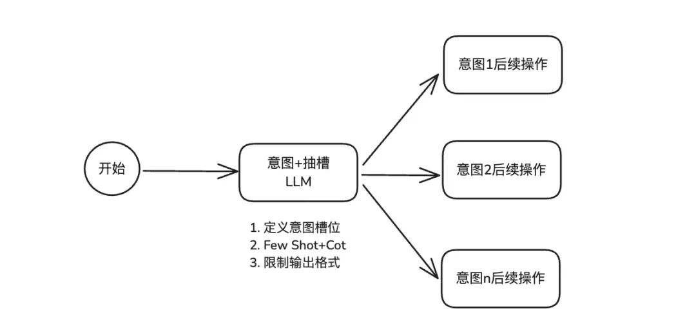

提示词工程进行意图识别和槽位提取主要涵盖三个关键模块。

首先是 “定义意图槽位”，此处需精准框定智能体需识别的各类意图范畴，以及对应槽位的名称、数据类型与取值范围，如同为智能体打造详尽的任务字典。

其次是 “每个意图和槽位的 Few-Shot + CoT”，为每个意图搭配 Few-Shot 示例，就像给智能体提供典型范例，使其领会如何从输入文本精准抽取槽位信息；同时融入 CoT，引导智能体逐步剖析用户输入，剖析语义结构，定位关键信息。

最后是 “输出格式”，明确规定智能体以结构化格式（如 JSON、XML 等标准数据格式）输出识别结果，确保后续系统能便捷解析利用，提升交互流程的连贯性与效率。

### 提示词关键部分

（1）定义意图槽位

  *   *   *   *   *   *   *   *   *   *   *   *   *   *   *   *   *   *   *   *

    ### 技能. 旅行相关的意图识别你的任务是根据技能1理解的最新提问，在以下意图类型中进行分类，并抽取相应的参数：
    1.交通出行   - 描述: 用户问题是需要网约车、地铁、出租车等交通服务推荐的问题，比如：“帮我要打个出租车”，“帮我要打个网约车”，“我要坐地铁去野生动物园”，“怎么做网约车”。   - 参数:      - 交通方式: 用户提问的交通类型，从用户历史提问中提取交通方式，只提取网约车、地铁、出租车、公交车、其它这几类，如果提问是打车去某个位置，提取为：网约车，坐几路车能去宋城，提取为：公交车，如果如果提问没明确，可为空。      - 位置意图: 附近位置/实际位置，提问包含"附近","旁边","周边"，为附近位置，否则是实际位置。比如"附近的厕所/小卖部/便利店/寄存点/码头/售票处/吸烟区"。      - 出发地: 提问中的出发地名称/当前位置，如南大门附近洗手间，提取为南大门，如果是提问杭州东站6号上车点，提取为：6号上车点，如果未明确，默认是当前位置      - 目的地位置类型: 提问中的目的地名称/设施名，如带我去东方明珠电视台，提取为东方明珠电视台；我附近的停车场，提取为停车场，未明确，不返回该参数。      - 地铁线路:提问中包含地铁线路，只提取数字，不要提取汉字，如1号线，提取为1。可为空。      - 标签:提问中对网约车上车点的特殊要求标签，只提取人少、最近、其它三个类型。如：帮我找个人最少的网约车上车点，打个车去西湖。帮我在最近的上车点打个车去西湖，提取标签为最近。如果未明确，不返回该参数。

    2. 美食导购   - 描述: 用户咨询茶饮，奶茶，火锅，小吃，咖啡，冰淇淋，西餐，美食、餐厅以及本地特色小吃，涉及“吃”相关的信息   - 参数:      - 问题类型: 附近推荐/非附近推荐，提问包含"附近","旁边","周边"相关的是附近推荐，否则非附近推荐      - 出发地: 用户提问中的出发地的地名,如东方明珠附近的美食推荐，提取出发地为东方明珠，提取不到则为当前位置      - 标签: 提问中的关键词,多个标签名用英文逗号‘,’分割开，如果没有明确，可为""。

### （2）Few-Shot + CoT

  *   *   *   *   *

    ### 下面是一些示例
    #### case1历史提问：空最新提问：我要打车去杭州野生动物园<回答>```JSON{ "意图类型": "交通出行","参数列表": {"交通方式":"网约车","位置意图": "实际位置", "目标位置": "杭州野生动物园"}}```
    #### case2历史提问：Human:我要打车 Assistant:为您查询到杭州东站以下网约车上车点，当前等候情况如下，请选择上车点 Human:帮我在6号上车点打车 Assistant:好的，请提供你要打车前往目的地的详细地址。最新提问：蚂蚁a空间思考过程：历史提问最后一条提问用户想去的目的地，用户最新提问是蚂蚁a空间，蚂蚁a空间是个地名，因此用户是想打车去蚂蚁a空间，提取意图类型为交通出行，交通方式为网约车，位置意图为实际位置，目的位置为蚂蚁a空间。<回答>```JSON{ "意图类型": "交通出行","参数列表": {"交通方式":"网约车","位置意图": "实际位置","目标位置": "蚂蚁a空间"}}```
    #### case3最新提问：附近有什么吃的思考过程：判断用户意图是想要找美食，提取意图类型为美食导购。<回答>```JSON{"意图类型": "美食导购","参数列表": {"问题类型": "附近推荐","出发地": "","标签": ""}}```

### （3）限制输出格式

  *   *   *   *   *

    ### 输出格式输出结果应严格遵循以下 JSON 格式：```json{"意图类型":"<意图类型>","参数列表":{"实体参数1":"实体参数1的取值","实体参数n":"实体参数n的取值"}}```

### 方案特性

优点

此方法的优点在于简单高效。通过提示词设计，无需添加复杂的额外算法或模型架构，就可使 AI 智能体快速具备意图识别和槽位抽取能力。在意图数量较少的情况下，这种方法能以较低成本实现较好效果，能满足用户需求。

缺点

当意图数量增多时，为每个意图定义槽位以及编写相应数量的 Few - Shot + CoT 内容，会使提示词长度大幅膨胀。会给模型带来巨大的处理负担，使模型难以准确地捕捉和理解其中的关键内容，容易出现混淆和错误的关联，进而影响其对意图和槽位的准确识别和抽取。

适用场景

该方案更加适用于那些意图分支相对较少，且业务场景对识别准确性具有一定容错空间的场景。

## 中级方案B（意图和抽槽节点分离）

# 为应对复杂意图分支场景，方案A所导致的提示词（prompt）膨胀以及准确性不足的问题。经过一段时间的探索与实践，我们采用了意图识别与槽位提取分离的优化方案。

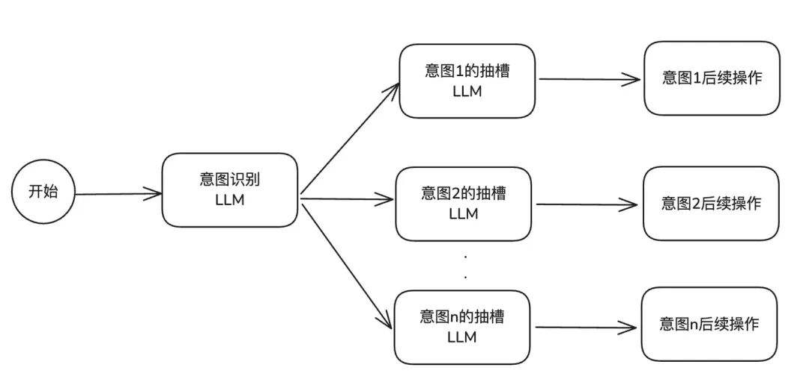

### 方案特性

优点

从系统结构层面来看，一个意图关联一个抽槽节点的配置方式，使得系统架构在逻辑上更为清晰简洁，极大地降低了结构的复杂程度，为后续的系统维护与功能迭代提供了极大的便利。这种对应关系确保了每个抽槽节点的职责单一且明确，仅专注于对应意图所关联信息的抽取任务，避免了多意图抽槽任务交叉可能带来的干扰与冲突。

同时，这种设计允许 prompt 长度支持更大，因为模型在对单意图进行语义解析时，不会受到其他无关意图信息的干扰，能够更加专注于对复杂文本语境中的关键要素进行捕捉与解读。

这种解耦架构在面对复杂多变的业务场景和不断变化的用户需求时，展现出了较强的适应能力。当需要新增或修改某个意图及其对应的抽槽规则时，只需针对相应的抽槽节点进行调整，而无需对整个系统架构进行大规模的重构，大大提高了系统的可维护性和可扩展性，确保了智能体能够快速响应业务变化，持续保持高效的语义理解与信息抽取能力，为各种应用场景提供精准、可靠的服务支持。

缺点

这种架构下，每个意图和抽槽都是独立的节点，这意味着在实际运行中，系统需要分别调用AI来处理意图识别和抽槽任务，这无疑增加了系统的调用次数。每一次调用都需要消耗一定的计算资源和时间，这就导致了整体系统的延迟增大。

这种延迟对于一些对实时性要求较高的应用场景来说，可能会成为一个明显的问题，影响用户体验。

适用场景

该方案更加适用于那些意图分支较为复杂且繁多，同时对延迟敏感度较低的业务场景，在这些场景下，其优势能够得到更充分发挥。

## 进阶方案C（意图识别优化：前置意图Rag召回）

### 进阶背景

按照前面的方案，我们研发并上线了一些 AI 智能体。客户用下来之后，反馈智能体不够智能，主要问题集中在智能体不能准确识别出客户想要表达的意思。

通过我们和业主、客户多次沟通交流，发现客户真正想要的是智能体能够理解准确各种各样、形式各异但意思相近的问题（比如方言类、反问语气、情绪化语气等），这就要求 LLM 节点得有很强的泛化和识别能力。

采用参数大、满血的大语言模型会比参数小的模型泛化能力强，固然准确性会有所提升。但这种大模型节点存在一些局限性，无法通过人工方式进行有效控制，难以快速修复 Bad Case，且满血模型的使用成本和响应时长也会升高。

所以，如何将特异的问题问题对应到准确的意图上，是阶段性的重点任务。经过研究，最后采用了LLM提前泛化意图的方法，再通过 RAG 召回的方式，来解决之前那些智能体意图识别不准确的问题。

### 方案说明

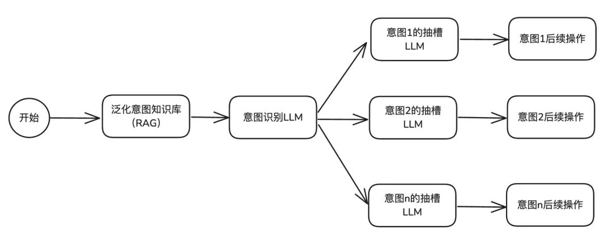

在前期方案基础上，我们加入了 RAG 召回能力，专门解决垂类领域和特异性表达Query的意图识别。在知识库里上传大量意图分类知识，用户提问时，先用 RAG 召回找到相似的 query 和意图对应关系，作为案例提交给 LLM 处理，让大模型更好地理解垂类或个性化分类判定逻辑。

这个方案对模型推理和泛化能力要求不高，建议选用性价比高的 qwen-turbo、qwen-plus 等模型。

### 意图知识库工作

### （1）意图语料种子

首先，我们要根据具体的垂类行业来确定意图分类，以及对每个意图进行精准的描述。

接下来，通过人工构造和收集线上的 Query 来获取意图语料。由于下一步要进行模型泛化，所以这里的种子语料数量最好能多一些，尽量达到 30～50 个左右。

（2）意图数据泛化

利用 LLM 对种子语料生成一批同义句，运用基模理解强化机制进行同义替换，实现全面覆盖。

每个意图都需要包含多种句式变体，涵盖口语化表达、地域化表达以及反问句转化训练等内容。例如，将「难道没有坐车的码吗？」这样的反问句，准确映射至「打卡乘车码」这一意图。

泛化意图query代码示例

  *   *   *   *   *

    from datetime import datetimefrom openai import OpenAI
    base_url = "xxxxx"api_key = "xxxxx"
    client = OpenAI(    base_url=base_url,    api_key=api_key,)
    if __name__ == "__main__":    from datetime import datetime    now = datetime.now()    intent = "查线路途经站点"    desc = "咨询某条公交线路或者某些公交线路路过哪些站点的问题"
        file_path = f"./data/{intent}.txt"   ## 待扩充的原始语料    with open(file_path,'r',encoding='utf-8') as file:        data_raw = file.readlines()
        data_raw = [data.strip() for data in data_raw]    data_pre = data_raw[:100]

        prefix = "我们是一个提供上海公交查询服务的一个应用平台,用户会在线上对我们进行提问.不同的问题,对应不同的意图.请你模拟线上真实用户,生成10条意图为<{}>的不同用户指令或提问,此意图含义为<{}>,生成时风格要口语化、简洁.避免礼貌用语."    styles = ["下面给你一些例子:",              "你的提问风格应该是直接命令式的,直接了当,用词简短,可省略部分信息,不超过12个字,下面给你一些例子:",              "你的提问风格应该是询问式的,用户以疑问句的形式提出问题,语言简短.不超过15个字,下面给你一些例子:",              "你的提问风格应该是描述性的,提问时提供一些背景信息或需求描述,下面给你一些例子:"]
        input_data = []
        prefix = prefix.format(intent, desc)    for style in styles:        for i in range(len(data_pre)):            if i<len(data_pre)-2:                prompt = prefix + style + data_pre[i] +','+data_pre[i+1]+','+data_pre[i+2]            input_data.append(prompt)

        input_data = input_data[:100]    print(len(input_data))
        for item in input_data:        completion = client.chat.completions.create(            model="Bailing-4.0-80B-64K-Chat-20250108",            messages=[                {"role": "user", "content": item}            ]        )
            result = completion.choices[0].message.content        print(result)

示例：泛化后【打开乘车码】意图的query列表

打开乘车码意图（泛化后的query）

  *   *   *   *   *

    把我的地铁乘车码调出来。把我的地铁乘车码展示一下。帮我扫码进地铁站。帮我显示上海地铁乘车码乘车码乘车码给我乘车码在哪乘车码怎么用乘地铁扫码乘地铁怎么扫码出地铁站出地铁站扫码出站二维码出站口在哪儿，扫码出站出站扫码出站扫码，地铁码拉出来。出站扫码怎么弄出站需要扫码出站需要扫码，帮我看看出站需要扫码，我现在要出站。出站要扫码，地铁码在哪？出站用二维码出站用哪个二维码出站用扫码，怎么弄出站用扫码吗？出站怎么扫码打开乘车码打开乘车码，进地铁站打开乘车码，我要进地铁站打开我的乘车码，我要坐地铁打开我的地铁乘车码打开我的地铁二维码。地铁乘车码地铁乘车码在哪地铁乘车码怎么弄地铁乘车码怎么生成？地铁乘车码怎么用地铁出站扫码地铁二维码地铁进站地铁进站二维码地铁进站码地铁进站扫码地铁进站扫码在哪？地铁卡扫码地铁卡怎么扫码地铁扫码地铁扫码乘车地铁扫码乘车，怎么弄？地铁扫码乘车步骤地铁扫码乘车步骤是什么？地铁扫码乘车流程地铁扫码乘车码怎么弄地铁扫码乘车怎么操作地铁扫码乘车怎么弄？地铁扫码出站地铁扫码出站怎么操作地铁扫码进站地铁扫码进站怎么操作？地铁扫码流程地铁扫码怎么弄地铁扫码怎么弄？地铁扫码怎么用二维码乘车码在哪给我乘车码给我打开地铁乘车码给我打开地铁扫码乘车给我地铁乘车码给我地铁的二维码给我调出地铁乘车码给我调出上海地铁的乘车码。给我个乘车码给我个地铁乘车二维码给我个地铁乘车二维码。给我个地铁乘车码给我个一号线的地铁乘车码给我看看乘车二维码给我看看乘车码给我看看地铁乘车码给我看看地铁的乘车码。给我看看我的地铁乘车码给我看看我的地铁乘车码。给我看一下我的上海地铁乘车码。给我拉起上海地铁的出站码。给我弄个地铁二维码给我扫码乘车码给我扫码乘地铁的码给我扫码进站的二维码给我扫码进站的码给我上海的乘车码给我刷新一下我的地铁乘车码。给我显示一下地铁乘车码给我一个地铁的乘车码给我一下乘车码给我一下乘地铁的码给我一下地铁的乘车码给我一下上海地铁的乘车码。给我展示地铁乘车码给我展示一下我的地铁乘车码。进地铁站进地铁站，需要扫码进地铁站扫码进站的二维码在哪进站口需要扫码，帮我看看进站扫码进站扫码，找不到二维码了。进站需要扫码进站需要扫码，怎么操作进站用地铁码，给我看看。快速出站，扫码乘车码给我看看。快速打开地铁乘车码快速打开我的地铁码拉起我的地铁乘车码拉起我的地铁二维码拉起一下进站的二维码扫乘车码扫个地铁乘车码扫个码，我要坐地铁。扫码乘车扫码乘车，我要进站扫码乘车码失效了怎么办？扫码乘车码在哪扫码乘车码怎么用？扫码乘车怎么绑定？扫码乘地铁怎么操作扫码乘坐地铁扫码出站扫码出站。扫码出站流程扫码出站流程是什么扫码出站怎么操作扫码出站怎么弄？扫码进地铁站扫码进地铁站怎么弄扫码进站扫码进站，怎么操作？扫码进站上海地铁扫码进站怎么操作？扫码坐地铁扫码坐地铁，咋整？扫一下进站的码。扫一下这个乘车码扫这个进站上海地铁乘车码上海地铁乘车码在哪上海地铁二维码上海地铁扫码刷码坐地铁刷新一下我的地铁乘车码我出站需要扫码，帮我弄一下我的乘车码在哪？我的地铁乘车码怎么用我进站要扫码我想出站我想出站，扫码我想出站，扫码就行吗我想扫码进站我需要乘车码我需要出站的二维码我需要地铁二维码，进站用。我需要扫码乘车我需要扫码出站我需要扫码出站。我需要扫码进地铁站。我要出站，帮我扫一下码我要出站，给我二维码我要出站，扫乘车码我要出站，扫码我要出站，扫码一下我要出站，扫下码我要出站扫码我要到站了，出站扫码怎么弄？我要进地铁站，扫码我要进地铁站，怎么扫码？我要进地铁站了，扫码我要进站我要进站，扫码我要进站，扫码。我要进站，扫一下我要扫码我要扫码乘车我要扫码进地铁站。我要扫码进站我要扫码进站，地铁码呢？我要扫码进站。我要扫码去地铁我要扫码坐地铁我要刷地铁码我要坐地铁，给我乘车码。我要坐地铁，扫个码我要坐地铁，扫码我要坐地铁，扫码乘车码呢？我要坐地铁了我要坐地铁了，给我打开二维码我要坐地铁了，扫码我要坐地铁了，怎么扫码我要做地铁，怎么扫码显示我的乘车码显示我的地铁出站码。现在出站要扫码，我这边的二维码能用吗？现在地铁扫码还管用吗？现在地铁扫码进站现在给我进站码现在进站现在进站，扫码现在就扫码进地铁站现在就扫码进站，快点。现在可以扫码乘车吗？现在能扫地铁码吗现在扫码现在扫码出站现在扫码出站。现在扫码进站现在扫码进站。现在扫码能进地铁站吗现在扫码坐地铁怎么操作现在扫一下乘车码现在扫一下地铁码现在我要乘车，扫码现在我要坐地铁，扫码进站。现在需要扫码乘车现在需要扫码乘车，给我一下。现在需要扫码进地铁站。现在要坐地铁，给我乘车码现在要坐地铁，怎么扫码需要乘车码需要地铁扫码需要扫码进地铁站怎么进地铁站怎么扫码坐地铁？怎么生成地铁乘车码怎么用二维码坐地铁展示我的地铁乘车码。展示我的地铁二维码直接给我地铁的乘车码直接给我一个乘车码直接进站扫码直接扫码乘车直接扫码进地铁站直接扫码进站直接扫码进站吧直接扫码坐地铁坐车需要扫码，给我看看坐地铁的二维码坐地铁的二维码失效了，怎么处理？坐地铁扫码坐地铁需要扫码，帮我打开。坐地铁需要扫码，码给我。坐地铁怎么扫码

### 方案特性

优点

通过将识别 Query 意图的工作，从 LLM 实时泛化识别过程转变为预泛化，从而掌控了项目整体的意图识别泛化能力水平，使得意图识别的准确性得以保持在较高水位。

在面对线上出现的未被覆盖的 query 意图识别场景时，能够迅速做出响应并加以修复，仅需通过添加知识库条目的方式，就能快速实现对该场景的覆盖，无需进行修改提示词以及调优等相对复杂繁琐的操作，大大提高了问题解决的效率。

缺点

方案需要对意图和问题数据开展泛化预处理工作，这在一定程度上增加了研发成本；

虽然在单轮会话中，意图识别能力表现良好，但在涉及多轮对话，需要综合多轮信息来综合判断意图的场景下，效果就显得不够理想了。

## 高阶方案D

## （合并意图抽槽节点 + 升级前置Rag召回能力）

现实场景中，业务需求往往远比预想的更为复杂。例如，如何依据多轮对话内容准确判断意图和槽位，以及如何合理切分不同意图的对话内容，避免其在模型识别过程中相互干扰等问题，都极具挑战性。

面对既要低延迟又要高准确性的意图识别和槽位填充任务，这对我们的技术方案提出了全新的挑战。基于这一挑战，我们设计并落地了此方案。

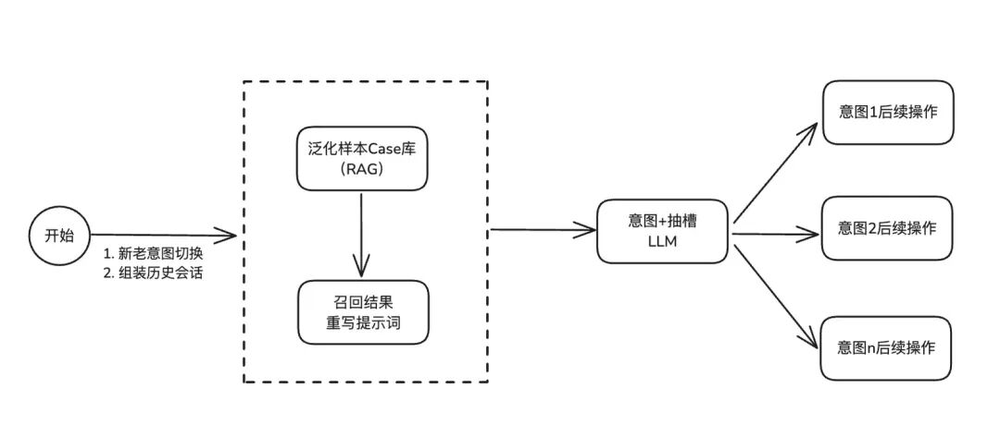

### 方案关键部分

### （1）意图及槽位CASE管理

### 为优化多轮对话中的意图解析与槽位抽取，我们采用了一种基于知识库管理的高效策略。

### 具体而言，通过将每个意图的典型场景进行泛化处理，预设包含【历史提问】、【最新提问】、【思考过程】、【处理】、【意图】、【槽位】等关键要素的样本案例，并借助知识库检索增强（Retrieval-Augmented Generation，RAG）能力进行统一管理。

### 当用户提交新问题时，系统将多轮历史对话与当前查询相结合，通过知识库进行精准召回。召回的案例将作为样本，对提示词进行改写，随后输入至大型语言模型（LLM）进行处理。这一方法有效避免了在意图分支较多时，因在提示词中为每个意图编写多个案例而导致提示词长度膨胀的困境。

### 不过，仍建议在基础提示词中保留一定数量的标准 Case，并确保覆盖每个意图分支，以避免因样本单一性导致 LLM 识别出现偏差，从而保障模型在复杂场景下的泛化能力和准确性。

### 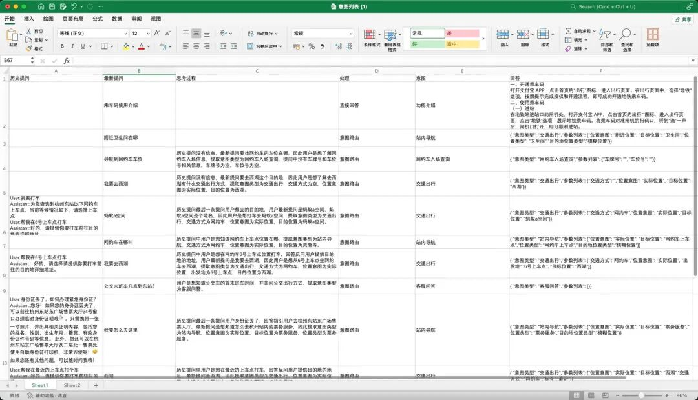

### （意图槽位case 模版格式）

### （2）组装历史会话召回

### 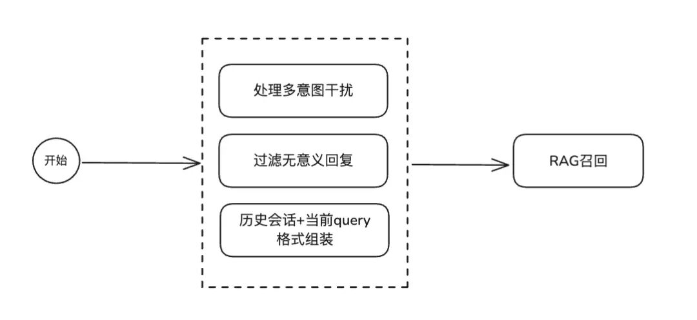

### 通过RAG的语义检索能力，我们的目标是召回与用户多轮对话内容最匹配的案例（CASE），以此指导大模型如何高效处理当前任务。为此，我们需要将用户的历史发言与当前查询（query）进行组合，再进行精准召回。

### 如果所使用的智能体平台本身具备历史会话与当前query联合召回的功能，自然是理想选择。然而，若平台未提供此功能，则需要自行进行相应的技术改造。在实施过程中，可能会遇到一些技术挑战，例如需要过滤多轮对话中的干扰信息，如卡片信息、无意义输出以及可能引起意图混淆的噪声内容等（关于意图混淆问题解法，在下一个节点会给出方案）。

### 这里放一个通过python组装历史会话+当前Query的python节点代码

  *   *   *   *   *   *   *   *   *   *   *   *   *   *   *   *   *   *   *

    import json
    def main(params: dict, context: dict) -> dict:    history = params.get('history', [])    query = params.get('query', '')
        query_message = f'最新提问[{query}]'    history_message = ''    for item in history:      role = item.get('role')      text = item.get('content').get('text')      if role == 'user':        history_message=f'{history_message}{role}:{text};'
        iflen(history_message) > 0:      history_message = f'历史对话[{history_message}]'      message = f'{history_message}{query_message}'    return message

组合出来的结果示例

  *

    历史对话[user:我要打车;user:我要去外滩;]最新提问[我在陆家嘴]

### （3）降低意图响应延迟策略

### 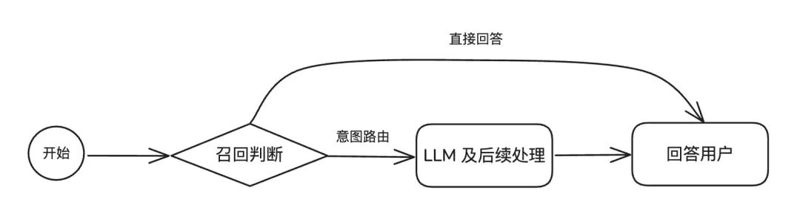

### 在项目推进过程中，我们深入分析了用户意图的处理方式，并发现部分用户意图可通过 FAQ（常见问题解答）模式，直接将预设文案反馈给客户。这种方式无需经过 LLM（大型语言模型）节点进行意图槽位处理和文案润色，从而降低部分意图分支的响应耗时。

为此，我们在意图知识库中特别设置了一个【处理】字段，其值分别为【意图路由】和【直接回答】。对于那些无需大模型处理的意图，我们将【处理】字段设置为【直接回答】。在进行 query 召回后，我们会进行判断，若该意图被标记为【直接回答】，则直接将 RAG 中预设的回答文案迅速返回给客户。

通过这种优化处理，我们不仅提高了智能体的响应效率，还确保了用户能够及时获得准确、简洁的答案，进一步提升了项目整体运行效果。

### （4）新老意图切断策略

在多轮对话场景下，意图解析和抽槽过程易受干扰，主要体现在以下两个方面：

话题迁移与意图混淆：多轮对话中话题可能切换或延伸，用户表达可能涉及旧意图或新意图。模型若无法准确追踪话题变化，容易混淆不同轮次的意图，导致意图解析不准确。

槽位更新与整合难题：多轮对话中，槽位信息可能在不同轮次中补充或更正。模型需要整合多轮信息以确定槽位值，若无法有效处理，会导致槽位抽取不准确，影响对话连贯性。

为了解决多轮对话中意图解析和槽位抽取易受干扰的问题，我们的方案是：

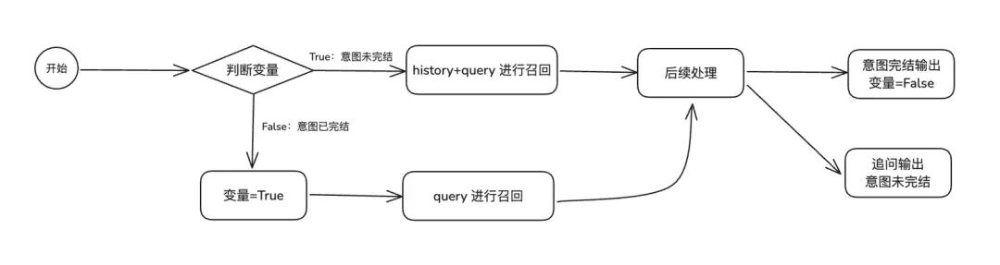

意图切断策略：当意图A的执行流程完全结束后，若新的会话意图B进入对话系统，应根据既定策略清空意图A的历史会话记录。这样可以避免意图A的信息对意图B的召回和后续处理过程产生干扰，从而提升意图解析和槽位抽取的准确性和独立性。

### 方案特性

优点

方案C在确保节点延迟稳定的基础上，显著提升了在复杂意图分支场景下的准确性。此外，针对线上意图抽槽过程中出现的Bad Case，我们可以通过维护知识库RAG进行快速修复，无需对智能体进行改动或重新发布。

缺点

需要对数据进行泛化预处理，并对【历史提问】、【最新提问】、【思考过程】、【意图】、【槽位】等字段进行内容准备和标注，工作量相较于仅进行意图分类的泛化要大得多。

因此，建议在前期泛化时，每个意图仅提交 5-10 个 Case，随着项目的推进，逐步对齐并控制成本。

## 方案横向对比数据

数据测试样本：采用已上线的出行行业智能体项目（上海地铁智能体），项目有13个预设意图分支，测评集数量443条用例。

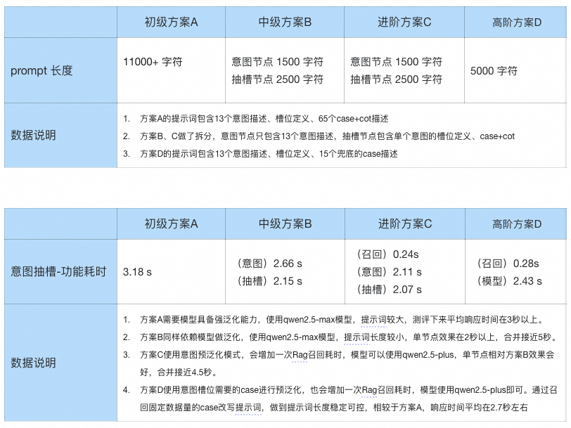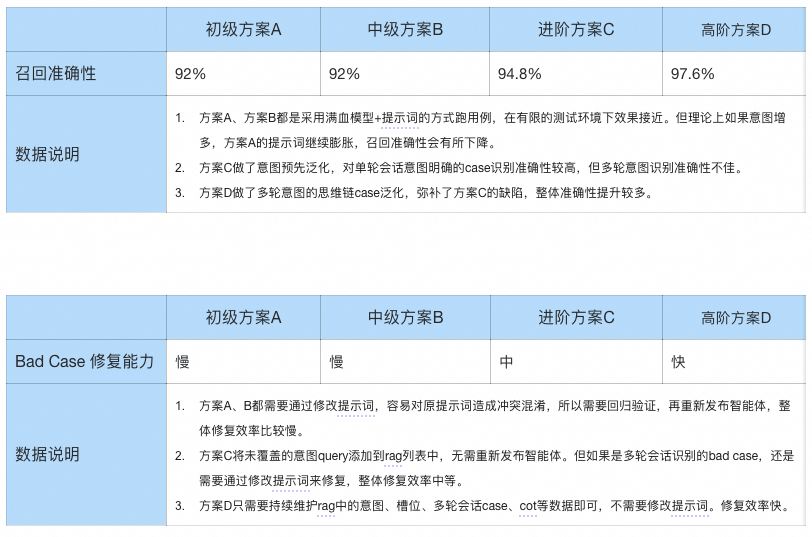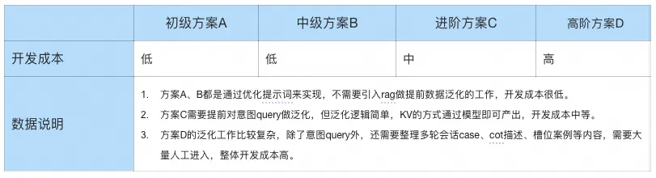

## 写在最后

在过去一年的智能体研发项目中，我们团队历经诸多挑战，不断探索、实践并逐步优化，最终产出当前的技术方案，是我们在实际项目推进过程中，逐步积累的实践成果。

四种方案在不同场景下皆有用武之地，通过对项目的评估，客户的诉求来选择对应的方案，才是最佳的实践效果。

****

### Kimi K2，开源万亿参数大模型

先进的混合专家（MoE）语言模型，在前沿知识、推理和编码任务中性能卓越，并优化了工具调用能力。本方案支持云上调用 API 与部署方案，无需编码，最快 5 分钟即可完成，成本最低 0 元。

## 点击阅读原文查看详情。
