# AI编码不是梦：手把手教你指挥Agent开发需求

> **公众号**: 阿里云开发者  
> **发布时间**: 2025-07-22 08:30  


## 前情介绍

AI已经持续火爆3年有余了，相关知识及理论本文不再赘述。本文主要聚焦于AI实践应用，首先从实操讲起（可直接复刻），然后再是实践背后的设计及思考，接着列举了团队在生产中的实践案例，最后谈谈感想展望。

  * 实践场景：后端领域开发

  * AI编码工具：可使用通义灵码等（可在生成的rule文件夹下创建多规则并按需选择，本文实践由其他内部AI软件进行）

  * AI大模型：Qwen-Max（编码，默认模型）、Claude-4-Sonnet（生成工程结构）

## 实践拆解

本章节以简单的增删改查为例来演示及说明AI在需求编码中的实践流程及应用，但并不意味着AI不能写业务逻辑，实际上我们已上线的需求业务逻辑也都先由AI编码完成。先睹为快（视频是一口气录制的，全程由AI完成编码及文件创建，无剪辑无快进）：

已关注

__

关注

__ 重播 __ 分享 __ 赞

关闭 __

**观看更多**

更多 __

__

__

__

_退出全屏_

[ __](<javascript:;>)

_切换到竖屏全屏_ _退出全屏_

阿里云开发者已关注

[ __](<javascript:;>)

分享视频

 __，时长 19:57

0/0

00:00/19:57

切换到横屏模式

继续播放

进度条，百分之0

 __

[播放](<javascript:;>)

00:00

/

19:57

19:57

[倍速](<javascript:;>)

 _全屏_

 __倍速播放中

[ 0.5倍 ](<javascript:;>)[ 0.75倍 ](<javascript:;>)[ 1.0倍 ](<javascript:;>)[ 1.5倍 ](<javascript:;>)[ 2.0倍 ](<javascript:;>)

[ 超清 ](<javascript:;>)[ 流畅 ](<javascript:;>)

您的浏览器不支持 video 标签

__

继续观看

AI编码不是梦：手把手教你指挥Agent开发需求

观看更多 __

转载

,

AI编码不是梦：手把手教你指挥Agent开发需求

 __

阿里云开发者 已关注

分享点赞在看

 ____已同步到看一看[写下你的评论](<javascript:;>)

 __

[ 视频详情 ](<javascript:;>)

视频中AI编码过程说明：接口定义->接口文档（至此再也不会成为开发瓶颈了）->建表shema（复制后可直接在DB控制台通过建表语句执行建表）->持久化层->业务逻辑层->接口实现。实际研发中也是按照这个过程分开执行的，未来继续探索更加丝滑的过程一体化编码。

### 材料准备

1.技术方案：技术方案模版参考（见文末），AI编写代码的依据，复制到钉钉文档编辑好后转为markdown格式，专门建个目录存放。

2.工程结构：代码工程的详细目录结构，借助AI生成，用来指导AI将代码文件放至合适的工程目录下。

3.内部AI软件（可使用通义灵码等）：AI编码工具，本文实践使用的相关能力如下（具体介绍见官方文档）：

a.Agent：类似自然人，有大脑、有手、有脚，可自动完成各种动作。（与之对应是Chat，只有大脑，需要手动采纳代码）

b.Copilot Rules：可用来沉淀Prompt、工程结构等可复用的相关资料，会在每次会话中作为上下文带给大模型，以实现模型输出可控及Prompt等资产共享。

i.User Rules：全局Rules，在所有Agent及行内会话生效。

ii.Project Rules：工程级Rules，只在当前工程中生效，也是本文实践使用重点。当前只有Always（一直生效）、Never（可手动选择生效）两种模式，相比Cursor有4种模式，但主打够用，如何呢，又能怎！

接下来按照下述拆解步骤，可以尽情享受一边喝茶一边指挥AI牛马来干活的时刻了。

### 分层拆解

说明：本章节每个小结由3部分组成：Agent提示词+Prompt Rule+AI输出截图，前2部分可直接复制，必要时进行微调即可。另外只有生成的工程结构的rule有必要设置为Always模式，其他rule均设置为Never，需要哪个选哪个。

##### 工程结构

> ## 根据 工程结构prompt 生成当前工程的目录结构
>
> 注意：claude-4-Sonnet生成的目录结构是最全面且最准确的，其他模型怎么调prompt都差点意思

  *   *   *   *   *

    帮我生成当前工程的文件夹目录树并用*中文注释*，生成结果以*树形结构*输出：1. 排除target目录和.git目录，其他目录保留。2. 使用最高效的方式列出每个工程模块的文件夹目录树，直到叶节点文件夹，但又不能包含具体文件。3. 生成结果整合到一个”工程结构.aonerule“文件中，并放在aone_copilot合适目录下。
    ------------------------------下面是其中一个模块输出格式示例：fulfill-admin-service/    # 服务层模块，主要包含业务逻辑和服务配置。├── src/    ├── main/        ├── java/            └── com/                └── ifp/                    └── service/                        ├── config/                # 配置类                        │   ├── diamod  # diamod配置                        │   ├── model  # 数据模型配置                        │   ├── resource  # 资源配置配置                        │   └── xstream  # xstream配置                        └── fbi/          # fbi类        └── resources/                             # 资源文件目录            └── explain-mapping/                         # 解释映射配置

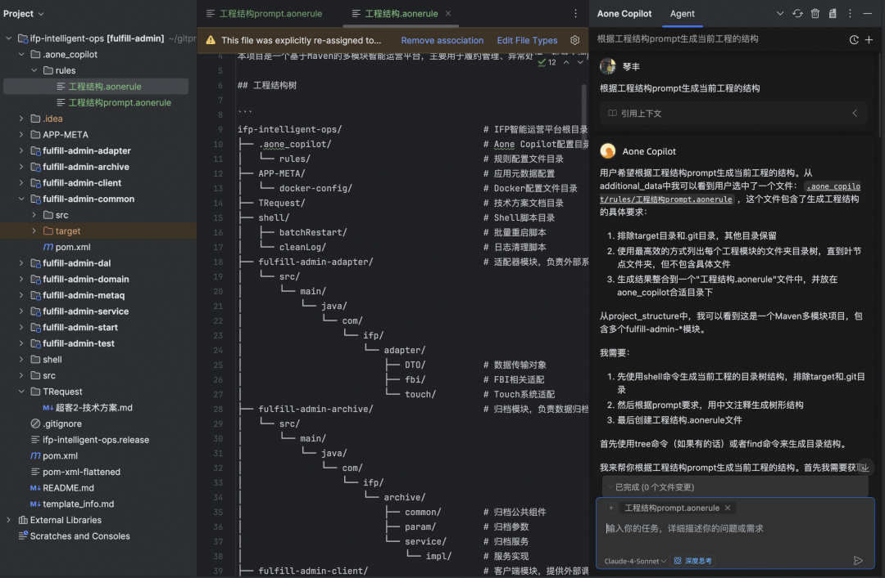

具体内容：

  *   *   *   *   *

    # IFP智能运营平台工程结构
    ## 项目概述本项目是一个基于Maven的多模块智能运营平台，主要用于履约管理、异常处理、机器人调度等业务功能。
    ## 工程结构树
    ```ifp-intelligent-ops/                           # IFP智能运营平台根目录├── .aone_copilot/                             # Aone Copilot配置目录│   └── rules/                                 # 规则配置文件目录├── APP-META/                                  # 应用元数据配置│   └── docker-config/                         # Docker配置文件目录├── TRequest/                                  # 技术方案文档目录├── shell/                                     # Shell脚本目录│   ├── batchRestart/                          # 批量重启脚本│   └── cleanLog/                              # 日志清理脚本├── fulfill-admin-adapter/                     # 适配器模块，负责外部系统接口适配│   └── src/│       └── main/│           └── java/│               └── com/│                   └── ifp/│                       └── adapter/│                           ├── DTO/           # 数据传输对象│                           ├── fbi/           # FBI相关适配│                           └── touch/         # Touch系统适配├── fulfill-admin-archive/                     # 归档模块，负责数据归档和历史数据管理│   └── src/│       └── main/│           └── java/│               └── com/│                   └── ifp/│                       └── archive/│                           ├── common/        # 归档公共组件│                           ├── param/         # 归档参数│                           └── service/       # 归档服务│                               └── impl/      # 服务实现├── fulfill-admin-client/                      # 客户端模块，提供外部调用接口│   └── src/│       └── main/│           └── java/│               └── com/│                   └── ifp/│                       └── client/│                           ├── constants/     # 客户端常量│                           ├── enums/         # 枚举定义│                           ├── model/         # 数据模型│                           │   ├── duty/      # 值班相关模型│                           │   ├── fbi/       # FBI相关模型│                           │   └── sls/       # SLS日志相关模型│                           ├── protocol/      # 协议定义│                           │   ├── dto/       # 协议数据传输对象│                           │   └── result/    # 协议返回结果│                           ├── request/       # 请求对象│                           ├── result/        # 返回结果│                           ├── service/       # 客户端服务接口│                           └── util/          # 工具类├── fulfill-admin-common/                      # 公共模块，包含通用组件和工具│   └── src/│       └── main/│           └── java/│               └── com/│                   └── ifp/│                       └── common/│                           ├── constants/     # 系统常量│                           ├── domain/        # 领域对象│                           │   ├── service/   # 领域服务│                           │   └── xflush/    # 刷新相关│                           ├── enums/         # 枚举定义│                           ├── exception/     # 异常定义│                           ├── switchcenter/  # 开关中心│                           └── util/          # 通用工具类├── fulfill-admin-dal/                         # 数据访问层模块，负责数据库操作│   └── src/│       └── main/│           ├── java/│           │   └── com/│           │       └── ifp/│           │           └── dal/│           │               ├── config/        # 数据库配置│           │               ├── dao/           # 数据访问对象│           │               │   ├── archive/   # 归档数据访问│           │               │   ├── dump/      # 导出数据访问│           │               │   ├── ifp/       # IFP数据访问│           │               │   │   └── basic/ # 基础数据访问│           │               │   ├── pos/       # POS数据访问│           │               │   ├── query/     # 查询数据访问│           │               │   └── reboot/    # 重启数据访问│           │               ├── dataobject/    # 数据对象│           │               ├── mapper/        # MyBatis映射器│           │               └── model/         # 数据模型│           └── resources/│               ├── mappers/                   # MyBatis映射文件│               │   ├── ifp_service_center/    # IFP服务中心映射├── fulfill-admin-metaq/                       # 消息队列模块，负责消息处理│   └── src/├── fulfill-admin-service/                     # 服务层模块，主要包含业务逻辑和服务配置│   └── src/│       └── main/│           ├── java/│           │   └── com/│           │       └── ifp/│           │           └── service/│           │               ├── abnormal/      # 异常处理服务│           │               ├── biz/           # 业务服务│           │               ├── bizquality/    # 业务质量服务│           │               │   ├── operate/   # 操作相关│           │               │   └── strategy/  # 策略相关│           │               ├── config/        # 配置类│           │               │   ├── diamond/   # Diamond配置│           │               │   ├── model/     # 数据模型配置│           │               │   ├── resource/  # 资源配置│           │               │   └── xstream/   # XStream配置│           │               ├── eagleeye/      # 鹰眼监控服务│           │               ├── fbi/           # FBI服务│           │               ├── judge/         # 判断服务│           │               │   ├── constants/ # 判断常量│           │               │   └── rules/     # 判断规则│           │               ├── model/         # 服务模型│           │               │   └── vo/        # 值对象│           │               ├── mq/            # 消息队列服务│           │               ├── protocol/      # 协议服务│           │               │   ├── business/  # 业务协议│           │               │   ├── impl/      # 协议实现│           │               │   └── param/     # 协议参数│           │               ├── provider/      # 服务提供者│           │               ├── proxy/         # 代理服务│           │               │   └── impl/      # 代理实现│           │               ├── qianwen/       # 千问AI服务│           │               ├── report/        # 报表服务│           │               │   ├── entity/    # 报表实体│           │               │   └── handler/   # 报表处理器│           │               ├── robot/         # 机器人服务│           │               │   ├── order/     # 订单机器人│           │               │   ├── protocol/  # 机器人协议│           │               │   ├── schedule/  # 调度机器人│           │               │   └── slslog/    # SLS日志机器人│           │               ├── schedulerx/    # SchedulerX调度服务│           │               ├── sls/           # SLS日志服务│           │               │   ├── processor/ # 日志处理器│           │               │   └── query/     # 日志查询│           │               ├── test/          # 测试服务│           │               ├── tt/            # TT工单服务│           │               └── util/          # 服务工具类│           └── resources/│               └── explain-mapping/           # 解释映射配置├── fulfill-admin-start/                       # 启动模块，应用程序入口和Web资源│   └── src/│       ├── main/│       │   ├── java/│       │   │   └── com/│       │   │       └── ifp/│       │   │           └── start/│       │   │               ├── config/        # 启动配置│       │   │               ├── controller/    # Web控制器│       │   │               │   ├── duty/      # 值班相关控制器│       │   │               │   ├── external/  # 外部接口控制器│       │   │               │   ├── fbi/       # FBI控制器│       │   │               │   ├── oms/       # OMS控制器│       │   │               │   ├── page/      # 页面控制器│       │   │               │   ├── qianwen/   # 千问控制器│       │   │               │   ├── robot/     # 机器人控制器│       │   │               │   └── sls/       # SLS控制器│       │   │               └── interceptor/   # 拦截器│       │   └── resources/│       │       ├── static/                    # 静态资源│       │       │   ├── adminlte/              # AdminLTE主题│       │       │   │   ├── css/               # CSS样式│       │       │   │   ├── js/                # JavaScript脚本│       │       │   │   └── plugins/           # 插件│       │       │   │       ├── font-awesome/  # FontAwesome图标│       │       │   │       └── ionicons/      # Ionicons图标│       │       │   ├── bootstrap/             # Bootstrap框架│       │       │   │   ├── css/               # CSS样式│       │       │   │   ├── fonts/             # 字体文件│       │       │   │   └── js/                # JavaScript脚本│       │       │   ├── jquery/                # jQuery库│       │       │   ├── jsoneditor/            # JSON编辑器│       │       │   │   └── img/               # 图片资源│       │       │   └── main/                  # 主要资源│       │       │       ├── css/               # CSS样式│       │       │       ├── img/               # 图片资源│       │       │       └── js/                # JavaScript脚本│       │       └── velocity/                  # Velocity模板│       │           ├── layout/                # 布局模板│       │           └── templates/             # 页面模板│       │               ├── modify/            # 修改页面模板│       │               ├── outer/             # 外部页面模板│       │               ├── querytool/         # 查询工具模板│       │               └── stable/            # 稳定页面模板│       └── test/│           ├── java/│           │   └── com/│           │       └── ifp/│           │           └── test/│           │               ├── autoconfig/    # 自动配置测试│           │               ├── diamond/       # Diamond测试│           │               └── sls/           # SLS测试│           └── resources/                     # 测试资源└── fulfill-admin-test/                        # 测试模块，包含集成测试和单元测试    └── src/        ├── main/        │   └── java/        │       ├── com/        │       │   ├── auto/                  # 自动化测试        │       │   ├── dto/                   # 测试DTO        │       │   └── ifp/                   # IFP测试        └── test/            ├── java/            │   └── com/            │       └── ifp/            │           ├── common/            # 公共测试            │           └── config/            # 配置测试            └── resources/                └── ddl/                       # 数据库DDL脚本```
    ## 模块说明
    ### 核心业务模块- **fulfill-admin-service**: 核心业务逻辑层，包含机器人调度、异常处理、质量监控等主要功能- **fulfill-admin-dal**: 数据访问层，负责与数据库交互，支持多数据源
    ### 接口和适配模块  - **fulfill-admin-client**: 对外提供的客户端SDK，包含接口定义和调用工具- **fulfill-admin-adapter**: 外部系统适配器，负责与FBI、Touch等系统集成
    ### 支撑模块- **fulfill-admin-common**: 公共工具和组件，提供通用功能支持- **fulfill-admin-start**: 应用启动模块，包含Web界面和启动配置- **fulfill-admin-archive**: 数据归档模块，负责历史数据管理- **fulfill-admin-metaq**: 消息队列处理模块- **fulfill-admin-test**: 测试模块，包含集成测试和单元测试
    ### 运维支持- **shell/**: 运维脚本，包含应用重启、日志清理等自动化脚本- **APP-META/**: 应用部署配置，包含各环境的Docker配置
    ## 技术架构特点1. **分层架构**: 采用经典的分层架构模式，职责清晰2. **模块化设计**: 各模块独立，便于维护和扩展3. **多数据源支持**: 支持多个数据库的数据访问4. **消息驱动**: 集成MetaQ消息队列，支持异步处理5. **可视化管理**: 提供Web管理界面，支持可视化操作

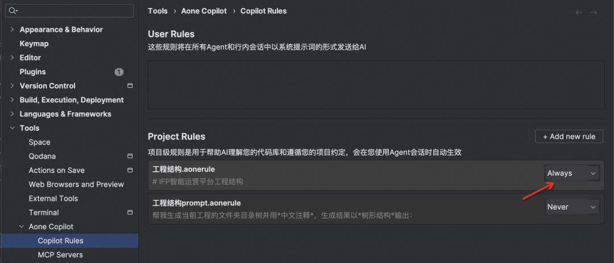

1\. 应用层

  * ###### 接口定义

> 参照三层架构，根据*接口定义prompt*的提示生成应用层的接口定义（包括出、入参定义），已存在的接口不要重复定义

  *   *   *   *   *

    【目标需求】根据__技术方案文档__中“应用服务”章节的*服务接口*和*服务方法*，为每个服务接口都生成相应的接口类代码，同时确保接口设计符合SOLID原则（**应用层接口定义**）。【设计要求】  1. **入参设计**：     - 复杂入参：方法入参个数大于3个时，首先将参数封装为 Request 后缀的复杂类型，然后再将 Request对象作为入参（比如 OrderRequest ），相同服务接口内方法的复杂入参须共享 OrderRequest。     - 简单入参：方法入参个数小于等于3个时，直接使用原始参数作为入参。  2. **出参设计**：     - 出参类以大写 DTO 作为后缀，比如 OrderDTO（简单类型除外，比如 Boolean）。     - 出参要合理且有意义，优先使用 Boolean 等简单类型，禁止使用void类型。     - 出参应使用 xxxResult 或 xxxResponse 类型再包装作为方法完整出参，比如 `SingleResult<OrderDTO>`、`SingleResult<Boolean>`（需替换为实际输入的合适代码类）。  3. **路径要求**：     - 接口路径需符合__工程结构文档__中的规范，确保代码组织清晰。  4. **注释要求**：     - 所有接口和参数类均需添加 JavaDoc 标准中文注释，说明其功能和用途。【实现步骤】1. **提取服务接口与服务方法**   - 遵照事实：仅从__技术方案文档__提到的内容进行分析，不要编造内容。   - 分析__技术方案文档__中的“应用服务”章节，列出所有服务接口及其对应的服务方法。每个服务接口应明确其职责范围，服务方法则描述具体的操作或行为。2. **设计参数类**   - 根据服务方法的描述，参考“业务实体”章节设计入参Request类和出参DTO类，每个字段都要加上 JavaDoc 标准的中文注解，不要省略或遗漏字段。     - 额外再追加字段：`id`（主键）、`gmtCreate`（创建时间）、`gmtModified`（修改时间），日期类型统一为 `Date`。     - 使用 Lombok 的 `@Data` 注解DTO类和Request类，且实现 `java.io.Serializable`。3. **编写接口代码**   - 根据上文的分析，生成每个服务接口的类定义，并以 ServiceI 作为后缀。4. **路径组织**   - 确保接口路径符合__工程结构文档__的规范要求。【输出内容】**根据<目标需求>严格按照上下文要求生成完整的目标代码，不要遗漏服务代码，也不要只给部分示例**- **入参类代码**：符合上文要求的入参Request类实现代码。- **出参类代码**：符合上文要求的出参DTO类实现代码。- **接口代码**：按照上文要求生成每个服务接口的类定义，服务接口间相互独立。

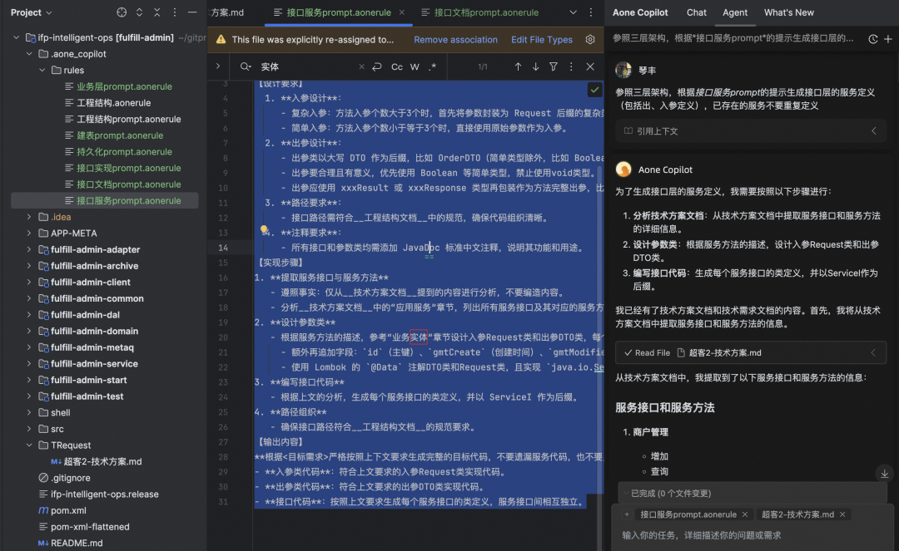

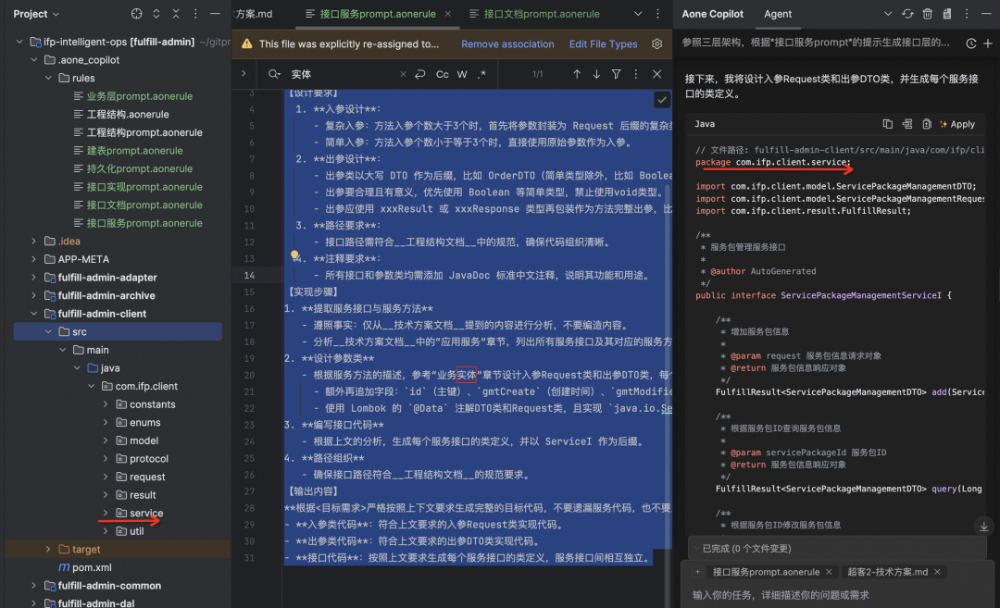

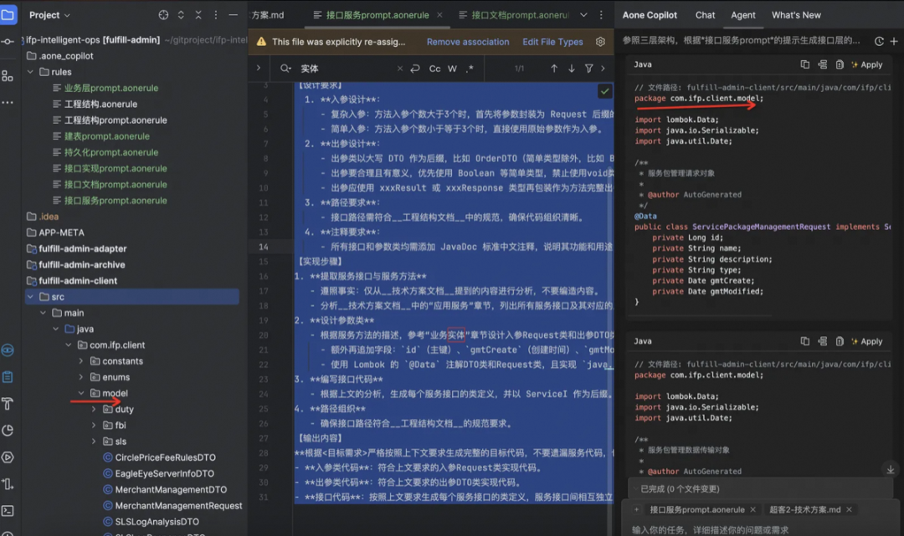

  * 接口文档

> 根据*接口文档prompt*和选择的类文件及相关代码，依次为选择的类文件生成每个接口方法的完整接口文档，不能假设不存在的字段

  *   *   *   *   *

    # 任务目标：你擅长根据程序上下文及打开的文件分析方法的签名结构，包括参数类的继承、组合等复杂关系。请根据方法签名生成详细的接口信息。
    # 要求及约束：* 接口的出参、入参以json格式输出。如果参数类有继承、组合关系，生成的json也应该包含继承、组合类的字段，否则只需包含自身的字段；* 严格根据方法签名及出入参数生成要求内容，不要做假设和猜测，也不要遗漏参数中的字段。
    # 输出内容：1. 接口签名及描述2. 接口入参：严格按照参数定义的字段解析并输出，不允许自定义字段3. 接口出参：严格按照参数定义的字段解析并输出，不允许自定义字段
    # 输出内容示例：1. 接口签名及描述* 签名：long com.ifp.client.service.BizQualityMonitorService.addDO(BizQualityMonitorDTO bizQualityMonitorDTO)* 描述：新增业务监控规则
    2. 接口入参{  "bizQualityMonitorDTO": {    "gmt_create": "2025-01-01 12:34:56",    "gmt_modified": "2025-0-01 12:34:56",    "type": "类型",    "team": "团队"  }}
    3. 接口出参{  "success": true,  "errorCode": "",  "errorMessage": "",  "data": {    "id": 1,    "data_source_id": 10,    "data_source_name": "数据源名称",    "field_name": "字段名称",    "field_desc": "字段描述",    "owners": "owner",    "report_link": "报表链接",    "report_tab": "报表tab",    "attribute": "扩展属性"  }}

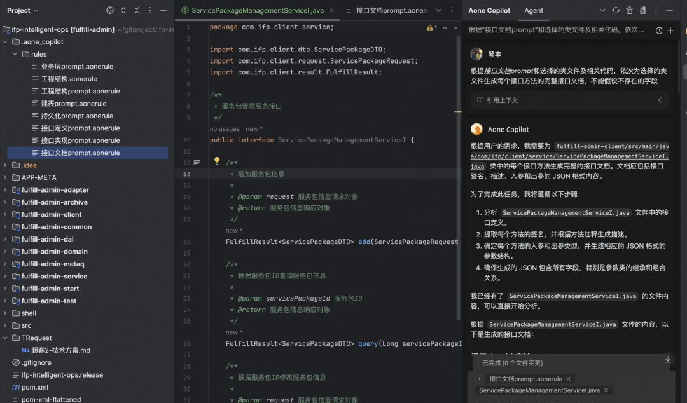

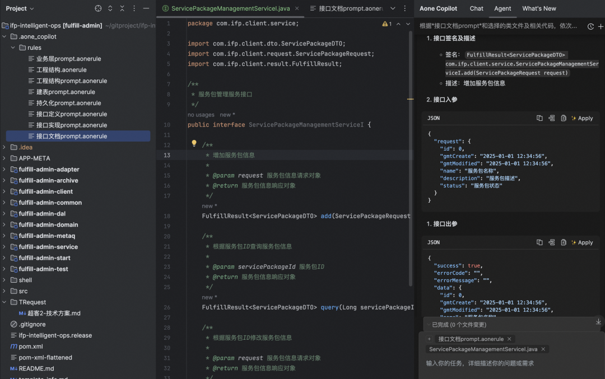

  * 接口实现

> 参照三层架构，根据*接口实现prompt*及相关代码实现应用层*服务包管理*功能模块，应用层接口定义已存在

  *   *   *   *   *

    【目标需求】根据__技术方案文档__中“应用服务”章节的*方法流程描述*和*校验约束*，请实现用户输入的功能模块（**应用层接口实现**）。代码实现需要满足良好的性能、健壮性和可读性要求，同时遵循代码规范和工程结构。【任务清单】1. 分析服务方法：分析<目标需求>包含哪些方法，每个方法的具体流程描述和校验约束是什么。2. 方法校验约束分析：针对每个方法，分析其实现过程中需要满足的校验约束。3. 代码实现：按照以下要求完成<目标需求>的代码实现。【具体要求】1. 方法定义与校验约束分析* 遵照事实：仅从__技术方案文档__提到的内容进行分析，不要编造内容。* 列出所有方法：提取<目标需求>的所有方法，并为每个方法提供清晰详细的描述， 不要输出与<目标需求>无关的方法。* 明确校验约束：分析每个方法在实现过程中需要满足的校验约束（如参数校验、数据校验、权限校验等）。2. 代码实现要求* 优先使用已有依赖：在实现过程中，优先复用已有的类或工具方法，避免重复造轮子。* 对象转换方法：如果涉及对象之间的转换，请编写专门的转换方法，确保字段映射完整，不要遗漏字段。禁止使用 BeanUtils 或类似工具。* 路径规范：参考__工程结构文档__，将代码文件放置到合适的路径下，优先选择已存在的路径，确保模块划分清晰。* 参数校验：入参字段为字符串时优先使用 `org.apache.commons.lang3.StringUtils` 工具校验。* 注释标准：所有代码文件必须添加符合 JavaDoc 标准的注释，包括类注释、方法注释以及关键逻辑的行内注释。3. 编码规范* 命名规范：  * 变量名、方法名和类名应具有语义化，避免使用无意义的缩写，DO、DTO、VO等专有词汇保持大写。  * 接口的实现类名以 ServiceImpl 作后缀。* 代码格式：遵循团队统一的代码格式规范（如缩进、空格、换行等）。* 注释清晰：对于复杂的逻辑，务必添加清晰的注释说明其目的和实现方式。4. 编码质量* 性能与健壮性：    * 确保代码具有良好的性能，避免不必要的计算或查询。    * 添加必要的异常处理逻辑，提升代码的健壮性。* 可读性：    * 确保代码具有良好的易读性、简单性以及最短层级嵌套。* 日志记录：    * 方法体使用 trycatch 包裹整个代码块，且在异常日志中要打印异常对象，catch 后不要再向外抛异常。    * 添加必要的中文日志，日志内容应包含问题定位的关键信息，例如：异常原因、方法入参和出参、异常堆栈等，复杂类型使用 JSON.toJSONString 工具转换为字符串。    * 日志格式要清晰易懂，包含异常堆栈的日志示例代码，`logger.error("签约失败，异常信息：{}，paramId：{}，param：{}”, e.getMessage(), paramId, JSON.toJSONString(param), eStack)`。其中`param`代表复杂参数，`eStack`代表异常堆栈，编码中需要将param*等字符替换为实际方法参数名称。【交付物】完整的<目标需求>代码实现，包括符合要求的日志等，禁止使用伪代码以及省略代码。

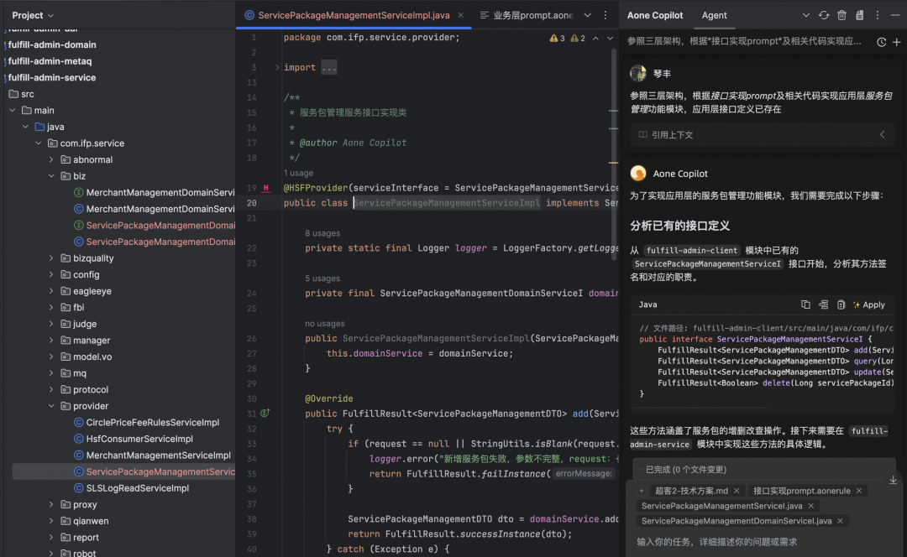

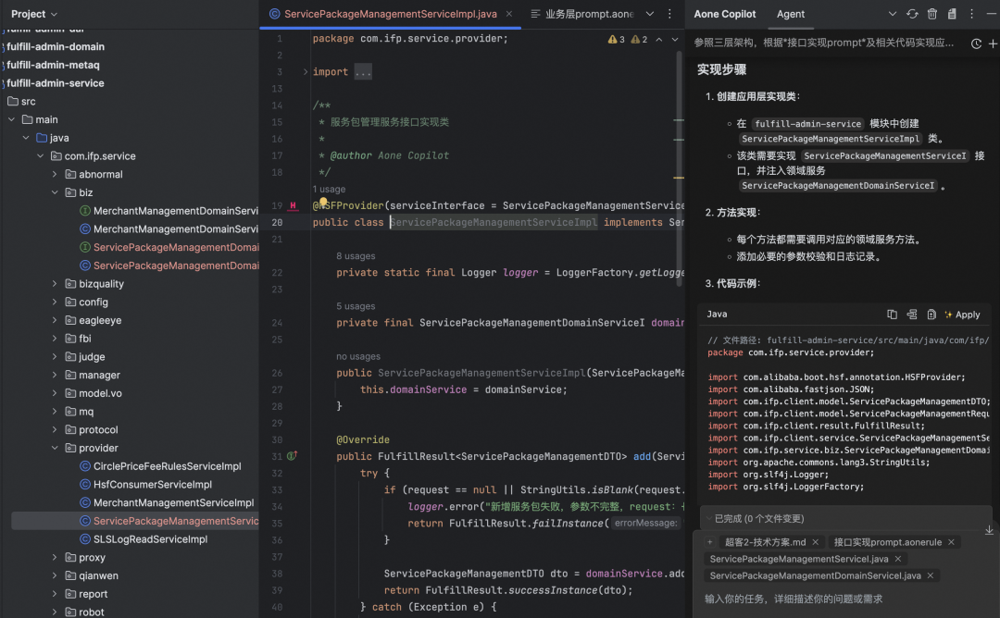

2\. 数据层

  * ###### 建表schema

> ## 根据*建表prompt*帮我生成技术方案中相关实体的建表schema

  *   *   *   *   *

    根据__技术方案文档__中的“业务实体”章节帮我建表，字段id、gmt_create、gmt_modified默认添加,并参考以下建表语句：CREATE TABLE biz_quality_monitor(id bigint(20) unsigned NOT NULL AUTO_INCREMENT COMMENT '主键',gmt_create datetime NOT NULL COMMENT '创建时间',gmt_modified datetime NOT NULL COMMENT '修改时间',type varchar(32) NOT NULL COMMENT '数据源类型',team varchar(32) NOT NULL COMMENT '团队名称',data_source_id bigint(20) NOT NULL COMMENT '数据源id',data_source_name varchar(64) NOT NULL COMMENT '数据源名称',field_name varchar(64) NOT NULL COMMENT '字段名称',field_desc varchar(64) NOT NULL COMMENT '字段描述',owners varchar(256) NOT NULL COMMENT '负责任，格式：花名-工号，多个用英文逗号隔开',report_link varchar(256) DEFAULT NULL COMMENT '报表连接',report_tab varchar(128) DEFAULT NULL COMMENT '数据源所在报表位置，格式：报表名-tab名',attribute text COMMENT '扩展字段',PRIMARY KEY (id),KEY idx_team (team),KEY idx_source_id (data_source_id),KEY idx_gmt_create (gmt_create)) ENGINE=InnoDB AUTO_INCREMENT=1 DEFAULT CHARSET=utf8mb4 COMMENT='业务质量预警规则';

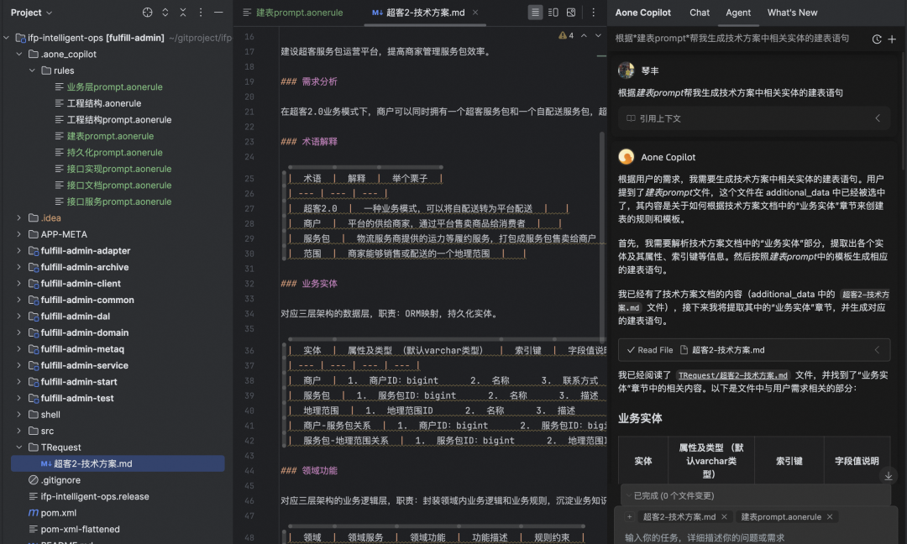

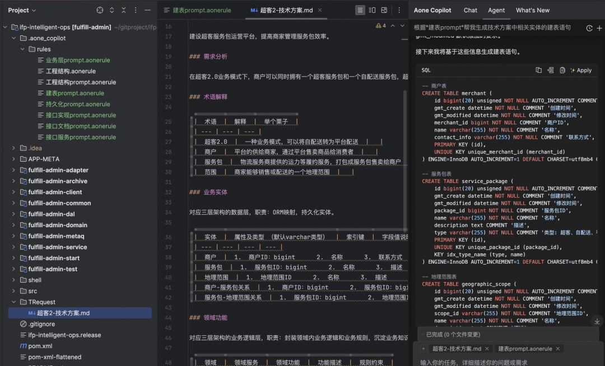

  * 持久化DAO

> ## 根据*持久化prompt*帮我生成数据访问层相关代码，下面是建表schema：

> ## \-- 服务包表（ 替换成自己的表schema ）

> ## CREATE TABLE service_package (

> id bigint(20) unsigned NOT NULL AUTO_INCREMENT COMMENT '主键',

> gmt_create datetime NOT NULL COMMENT '创建时间',

> gmt_modified datetime NOT NULL COMMENT '修改时间',

> package_id bigint NOT NULL COMMENT '服务包ID',

> ## name varchar(255) NOT NULL COMMENT '名称',

> ## description text COMMENT '描述',

> type varchar(255) NOT NULL COMMENT '类型: 超客、自配送、平台配送',

> ## PRIMARY KEY (id),

> ## UNIQUE KEY unique_package_id (package_id),

> ## KEY idx_type_name (type, name)

> ) ENGINE=InnoDB AUTO_INCREMENT=1 DEFAULT CHARSET=utf8mb4 COMMENT='服务包表';

  *   *   *   *   *

    # 你是java领域专家，擅长mysql及mybatis，请根据用户提供的建表schema生成包含CRUD操作的mapper.xml、Mapper.java及DO.java文件。
    # 下面是一个样例，输入或者选中：CREATE TABLE `question_exercise` (  `id` bigint(20) unsigned NOT NULL AUTO_INCREMENT COMMENT '主键',  `gmt_create` datetime NOT NULL COMMENT '创建时间',  `gmt_modified` datetime NOT NULL COMMENT '修改时间',  `type` varchar(32) NOT NULL COMMENT '类型',  `user_id` varchar(32) NOT NULL COMMENT '用户id',  `user_nick` varchar(32) NOT NULL COMMENT '用户nick',  `team` varchar(64) NOT NULL COMMENT '团队名称',  `question_code` varchar(32) NOT NULL COMMENT '问题编码',  `question` varchar(256) NOT NULL COMMENT '问题描述',  `answer` varchar(2048) DEFAULT NULL COMMENT '回题答案',  `score` decimal(10,2) DEFAULT NULL COMMENT '答题得分',  `attribute` varchar(4096) DEFAULT NULL COMMENT 'json扩展字段',  `status` varchar(32) NOT NULL DEFAULT 'INIT' COMMENT '状态',  PRIMARY KEY (`id`),  KEY `idx_gmt_type_team` (`gmt_create`,`type`,`team`),  KEY `idx_user_id` (`user_id`),  KEY `idx_status_type_gmt` (`status`,`type`,`gmt_create`)) ENGINE=InnoDB AUTO_INCREMENT=1 DEFAULT CHARSET=utf8mb4 COMMENT='问答得分表'# 输出1. com.ifp.dal.model.QuestionExerciseDO.javapackage com.ifp.dal.model;import lombok.Data;import java.io.Serializable;import java.math.BigDecimal;import java.util.Date;/** * @author AI * @date 2025/01/01 */@DatapublicclassQuestionExerciseDOimplementsSerializable {    privatestaticfinallong serialVersionUID = -1L;    /**     * 主键     */    private Long id;    /**     * 创建时间     */    private Date gmtCreate;    /**     * 修改时间     */    private Date gmtModified;    /**     * 类型     */    private String type;    /**     * 状态     */    private String status;    /**     * 用户id     */    private String userId;    /**     * 用户nick     */    private String userNick;    /**     * 团队名称     */    private String team;    /**     * 问题编码     */    private String questionCode;    /**     * 问题描述     */    private String question;    /**     * 回题答案     */    private String answer;    /**     * 得分     */    private BigDecimal score;    /**     * json扩展字段     */    private String attribute;}2. com.ifp.dal.mapper.QuestionExerciseMapper.javapackage com.ifp.dal.mapper;import com.ifp.dal.model.QuestionExerciseDO;import org.apache.ibatis.annotations.Mapper;import org.apache.ibatis.annotations.Param;import java.util.List;/** * @author AI * @date 2025/01/01 */@Mapperpublic interface QuestionExerciseMapper {    /**     * 新增     * @param questionExerciseDO DO对象     * @return 返回插入数据条数     */    intinsert(QuestionExerciseDO questionExerciseDO);    /**     * 根据id查询     * @param id 主键id     * @return 返回结果     */    QuestionExerciseDO getById(@Param("id") Long id);    /**     * 根据key查询     * @param gmtCreate 创建时间     * @param type 类型     * @param team 团队     * @param userId 用户ID     * @param status 状态     * @return 返回结果     */    List<QuestionExerciseDO> getByKey(@Param("gmtCreate") Date gmtCreate, @Param("type") String type,                                      @Param("team") String team, @Param("userId") String userId,                                      @Param("status") String status);    /**     * 根据id更新数据     * @param questionExerciseDO DO对象     * @return 返回结果     */    intupdateById(QuestionExerciseDO questionExerciseDO);    /**     * 根据ids物理删除     * @param ids 主键列表     * @return 返回结果     */    intdeleteByIds(@Param("ids") List<Long> ids);}3. question-exercise.xml<?xml version="1.0" encoding="UTF-8" ?><!DOCTYPE mapper PUBLIC "-//mybatis.org//DTD Mapper 3.0//EN""http://mybatis.org/dtd/mybatis-3-mapper.dtd"><mapper namespace="com.ifp.dal.mapper.QuestionExerciseMapper">    <resultMap type="com.ifp.dal.model.QuestionExerciseDO" id="questionExerciseDO">        <result column="id" property="id" />        <result column="gmt_create" property="gmtCreate" />        <result column="gmt_modified" property="gmtModified" />        <result column="type" property="type" />        <result column="status" property="status" />        <result column="user_id" property="userId" />        <result column="user_nick" property="userNick" />        <result column="team" property="team" />        <result column="question_code" property="questionCode" />        <result column="question" property="question" />        <result column="answer" property="answer" />        <result column="score" property="score" />        <result column="attribute" property="attribute" />    </resultMap>    <!-- 所有字段 -->    <sql id="questionExerciseDO_columns">    id,gmt_create,gmt_modified,type,status,user_id,user_nick,team,question_code,question,answer,score,attribute  </sql>    <insert id="insert" parameterType="com.ifp.dal.model.QuestionExerciseDO" useGeneratedKeys="true" keyProperty="id">        insert into question_exercise(gmt_create,gmt_modified,type,status,user_id,user_nick,team,question_code,question,answer,score,attribute)        values(CURRENT_TIMESTAMP(3),CURRENT_TIMESTAMP(3),#{type},#{status},#{userId},#{userNick},#{team},#{questionCode},#{question},#{answer},#{score},#{attribute})    </insert>    <select id="getById" resultMap="questionExerciseDO" parameterType="java.util.Map">        select        <include refid="questionExerciseDO_columns"/>        from question_exercise        where id = #{id}    </select>    <select id="getByKey" resultMap="questionExerciseDO" parameterType="java.util.Map">        select        <include refid="questionExerciseDO_columns"/>        from question_exercise        WHERE 1=1        <if test="gmtCreate != null">            and gmt_create &gt;= #{gmtCreate}        </if>        <if test="type != null">            and type = #{type}        </if>        <if test="team != null">            and team = #{team}        </if>        <if test="userId != null">            and user_id = #{userId}        </if>        <if test="status != null">            and status = #{status}        </if>    </select>    <update id="updateById"  parameterType="com.ifp.dal.model.QuestionExerciseDO">        update question_exercise        set gmt_modified = CURRENT_TIMESTAMP(3)        <if test="type != null">            ,type = #{type}        </if>        <if test="status != null">            ,status = #{status}        </if>        <if test="userId != null">            ,user_id = #{userId}        </if>        <if test="userNick != null">            ,user_nick = #{userNick}        </if>        <if test="team != null">            ,team = #{team}        </if>        <if test="questionCode != null">            ,question_code = #{questionCode}        </if>        <if test="question != null">            ,question = #{question}        </if>        <if test="answer != null">            ,answer = #{answer}        </if>        <if test="score != null">            ,score = #{score}        </if>        <if test="attribute != null">            ,attribute = #{attribute}        </if>        WHERE id=#{id}    </update>    <delete id="deleteByIds" parameterType="java.util.Map">        DELETE        FROM question_exercise        WHERE id in        <foreach item="item" index="index" collection="ids" open="(" separator="," close=")">            #{item}        </foreach>    </delete></mapper># 要求：1. 严格参照上面样例，禁止简化生成的内容。2. 生成的文件路径需符合__工程结构文档__中的路径规范，确保代码组织清晰。3. 给出文件的名称。

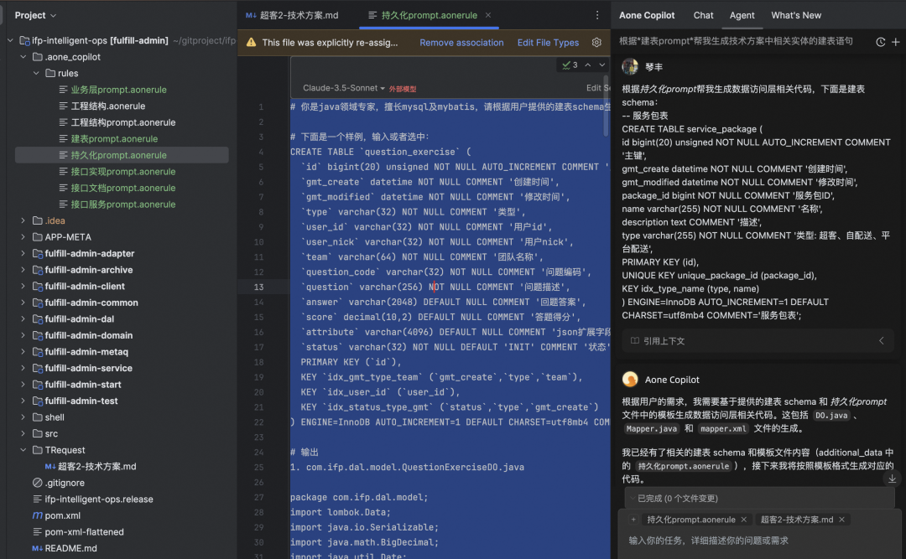

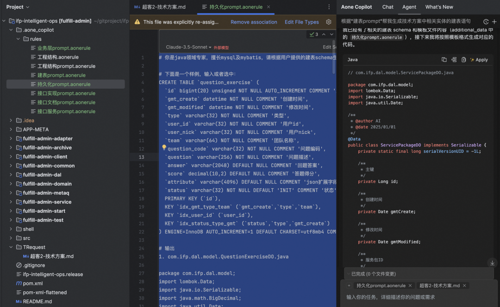

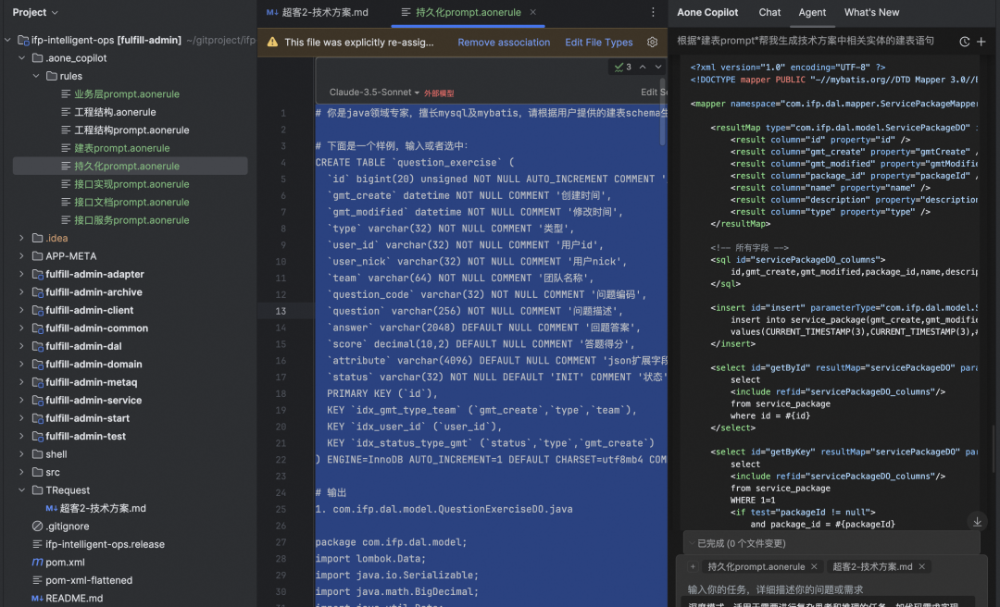

3\. 业务逻辑层

> ## 根据*业务层prompt*及相关代码帮我实现业务逻辑层*服务包管理*领域服务模块

  *   *   *   *   *

    【目标需求】根据__技术方案文档__中“领域功能”章节的*功能描述*和*规则约束*，请实现用户输入的功能模块（**业务逻辑层**）。代码实现需要满足良好的性能、健壮性和可读性要求，同时遵循代码规范和工程结构。【任务清单】1. 分析功能需求：分析<目标需求>包含哪些功能，每个功能的具体描述和规则约束是什么。2. 功能规则约束分析：针对每个功能，分析其实现过程中需要满足的规则约束。3. 代码实现：按照以下要求完成<目标需求>的代码实现。【具体要求】1. 功能定义与规则约束分析* 遵照事实：仅从__技术方案文档__提到的内容进行分析，不要编造内容。* 列出所有功能：提取<目标需求>的所有功能点，并为每个功能提供清晰详细的描述， 不要输出与<目标需求>无关的功能。* 明确规则约束：分析每个功能在实现过程中需要满足的规则约束（如权限控制、业务逻辑、规则条件等）。2. 代码实现要求* 优先使用已有依赖：在实现过程中，优先复用已有的类或工具方法，避免重复造轮子。* 对象转换方法：如果涉及对象之间的转换，请编写专门的转换方法，确保字段映射完整，不要遗漏字段。禁止使用 BeanUtils 或类似工具。* 路径规范：参考__工程结构文档__，将代码文件放置到合适的路径下，优先选择已存在的路径，确保模块划分清晰。* 注释标准：所有代码文件必须添加符合 JavaDoc 标准的注释，包括类注释、方法注释以及关键逻辑的行内注释。* 参数要求：  * 入参规范：入参超过3个时需要使用封装后的类型作为入参，比如相关实体的DO类型，避免使用Map类型。  * 出参规范：出参必须要有意义，避免使用void类型（优先使用boolean类型），不需要额外封装。3. 编码规范* 命名规范：  * 变量名、方法名和类名应具有语义化，避免使用无意义的缩写，DO、DTO、VO等专有词汇保持大写。  * 接口类名以 DomainServiceI 作后缀，实现类名以 DomainServiceImpl 作后缀。* 代码格式：遵循团队统一的代码格式规范（如缩进、空格、换行等）。* 注释清晰：对于复杂的逻辑，务必添加清晰的注释说明其目的和实现方式。4. 编码质量* 性能与健壮性：    * 确保代码具有良好的性能，避免不必要的计算或查询。    * 添加必要的异常处理逻辑，以提升代码的健壮性，异常信息要具有明确的中文语义，直接 throw 即可。* 可读性：    * 确保代码具有良好的易读性、简单性以及快速返回原则。【交付物】* 符合上文要求的领域服务功能的接口定义和完整代码实现，禁止使用伪代码以及省略代码。* 标准的 JavaDoc 中文注释。

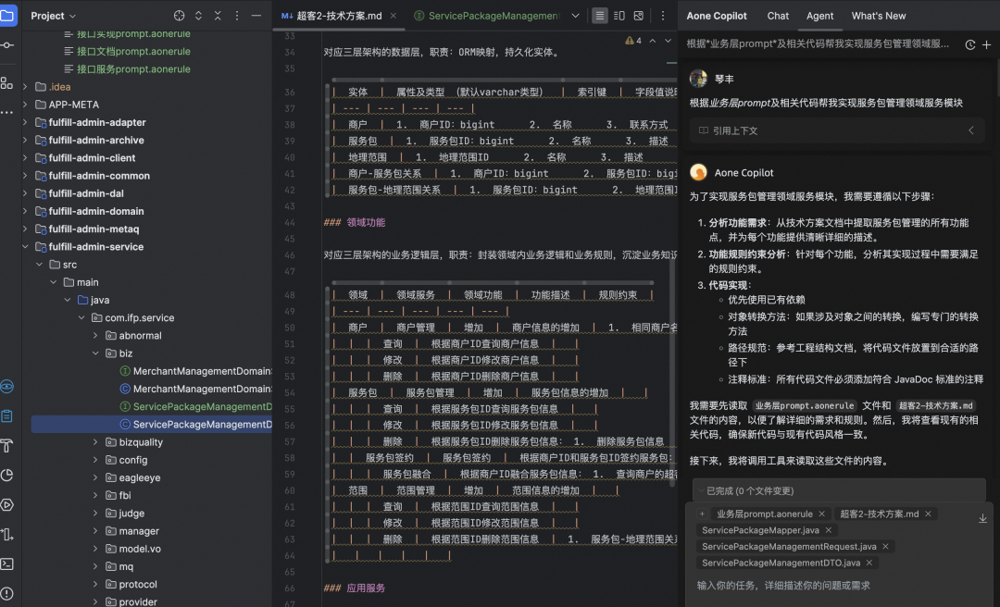

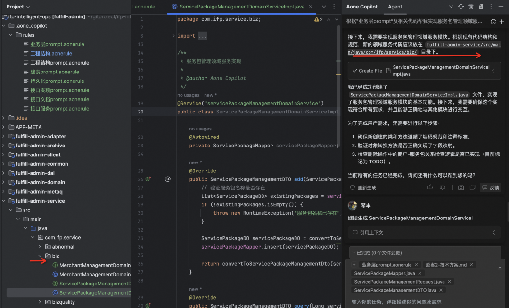

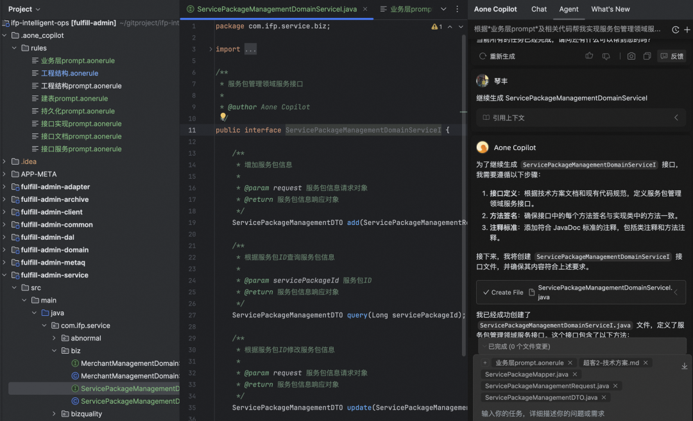

### Tips

1.关于代生成质量：

a.如果生成结果与预期相差较大，请再试一次，基本2次内即可满足期望；

b.通过多轮次对话，提出明确的修改要求；

c.明确选择主要相关代码文件作为模型上下文；

d.及时清理历史会话，避免影响模型下次输出，同时可节省token；

e.紧贴自己的工程特点微调Prompt Rule。

2.关于工程目录结构：

a.请使用Claude-4-Sonnet模型；

b.如果生成的结构不符合预期，请单独为每个模块生成工程结构，然后合并为整体；

c.如果生成的代码放置的位置不对，请为工程结构目录补充更详细的介绍说明，特别注意区分相似目录。

## 实践思考

怎么让AI更加丝滑的高效产出高质量的需求代码呢？本章节围绕上述实践试着从研发流程及架构设计视角来阐述背后的思考及设计。

### 实际应用Gap

自从AI编码火爆以来，特别是Cursor、Devin的出现，一句话需求、程序员被AI取代等消息如雨后春笋般铺天盖地，一时间让程序员们无所适从，焦虑感油然而生。诚然，AI编码可以很快速的完成原型实现及想法验证，那么实际应用过程中真的如此丝滑吗，又会面临哪些问题呢？

1.大模型天然具有幻觉，生成的代码质量不可控；

2.业务需求和系统行为的确定性，需要严格可控；

3.生产开发基本是基于已有系统做迭代开发，需要考虑现有系统的兼容性、复用性等；

4.现实世界更复杂：多样性、紧密联系性、更抽象也更细微。

### 研发流程说起

### 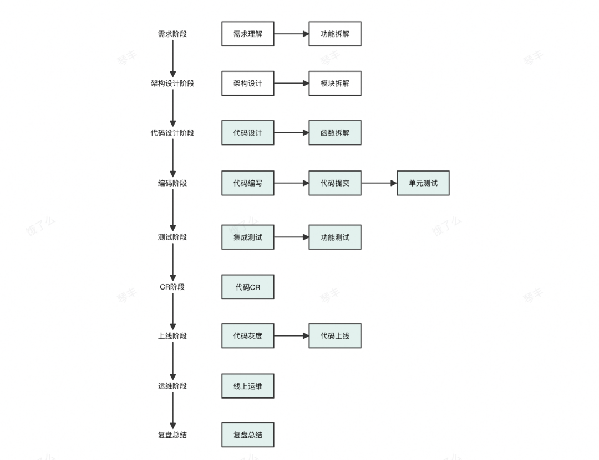

### 纵观以上研发流程，由下而上，抽象层度越来越高，不确定性也越来越高，沟通协作等软能力要求也越来越高，而这些正是AI不擅长的；另一方面考虑到任务拆解及提效颗粒度问题，太粗AI效果不好，太细提效又不明显，发挥不出AI的威力。

### 解决的问题

基于以上AI编程的能力边界分析，我们需要：

1.在确定性和不确定性之间寻找生产研发提效的最佳平衡点。

2.寻找研发提效的最大颗粒度，行级别？代码块级别？类级别 or 项目级别？

确定平衡点

  * 需求阶段：涉及大量的需求理解，需要不断的多轮次的沟通才能一步步明确需求流程和需求规则。人类的语言又具有多样性，同样的用词不同的场合、不同的语调意思可能完全不一样，这个阶段在AI当前的发展阶段显然不适合。

  * 架构设计阶段：这个阶段需求基本已经明确，更多要考虑的是跟当前系统兼容、复用性、编发规范等非功能需求，还是需要人来严格把控设计。

  * 代码设计阶段：这个阶段功能性需求与非功能需求均已明确，更多需要做的是提出规范及要求。

最大提效粒度

  * 代码设计阶段：至于说一个功能拆几个函数实现，用什么类库之类的可以让AI自由发挥，我们要做的是确保AI产出的代码符合我们的代码设计的规范及要求。

  * 编码阶段：这个阶段已经到了具体的函数级别，对于AI来讲控的太细了，发挥不了AI威力。

综上，我们选择将“代码设计阶段”作为分割点，以上工作由自然人来负责，以下可以交给AI自由发挥。

### 解决的方案

> 试想下，假如我们需要我们的同事配合做一些事情，我们需要做什么？首先要找对人（立人设），其次：1. 交代背景；2.交代目标；3.交代要求；事实上，AI就可以看成我们的同事，与AI对话就像与人对话一样，我们交代的越清楚，它反馈给我们的结果也就越明确，甚至有时候需要反复多轮沟通。

有了上述分析，我们的方案也显而易见：

1.通过技术方案模版将业务需求的不确定性转变为实现方案的确定性；

2.考虑到AI生成的代码与当前工程结构的适配性，我们需要交代当前系统的工程结构；

3.结合技术方案、工程结构，通过跟AI沟通（Prompt提示词）把我们的实现目标和要求交代清楚。

接下来我们针对三层架构（符合我们当前团队几乎所有应用的分层架构）进行落地实践的分析设计：

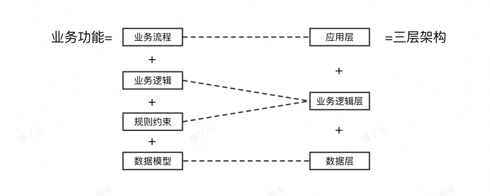

1\. 技术方案模版

> 为什么要设计模版，模版的作用是用来约束开发者，按照一定的规范来分析拆解，也可以理解成它是我们跟AI之间沟通的语言协议，保证了文档设计的质量，也就保障了我们输入给AI的背景信息。

我们通过技术方案模版设计的规范约束，来描述清楚需求的业务功能及架构分层，包括以下章节：

1.项目资料：主要是为了沉淀项目背景知识，方便后来人了解；

2.需求价值：灵魂自问，对齐团队OKR；

3.需求分析：自己对需求的概要理解；

4.术语解释：专有名词解释，便于AI理解专业术语；

5.业务实体：对应三层架构的数据层，职责：ORM映射，持久化实体；

6.领域功能：对应三层架构的业务逻辑层，职责：封装领域内业务逻辑和业务规则，沉淀业务知识，遵守领域内开闭原则；

7.应用服务：对应三层架构的应用层，职责：对外提供服务接口，组装业务流程，模型转换，必要的参数校验、事务及异常处理。

2\. 系统工程结构

我们的系统经过一代又一代人的不断努力和迭代，传到我们这代的时候可能早就说不清楚每个目录结构是干什么的了。不过幸运的是AI可以理解整个代码仓库，可以帮助我们生成整个系统的工程结构，然后再稍作调整即可，特别是针对相似的目录结构。

3\. Prompt分层

Prompt设计这里面又大有文章了，有一种职业叫做Prompt工程师。它好比算法工程师的调参，直接关系到AI输出的效果好坏。当前Prompt设计有很多范式，并没有一种设计能适应各个场景，但本质不变：好比人与人之间的交流，需要明确跟谁交流（角色）、背景是什么（背景）、有什么要求（要求）、想要达到怎样的目标（目标）。

  * 分层结构化扩展：明确了Prompt设计要素（角色、背景、目标、要求），最关键的就是结构化Prompt，类似我们的架构设计，Prompt也分了三层，针对每层的特点又进行结构化，方便进行局部调优和扩展。接口定义的Prompt栗子：

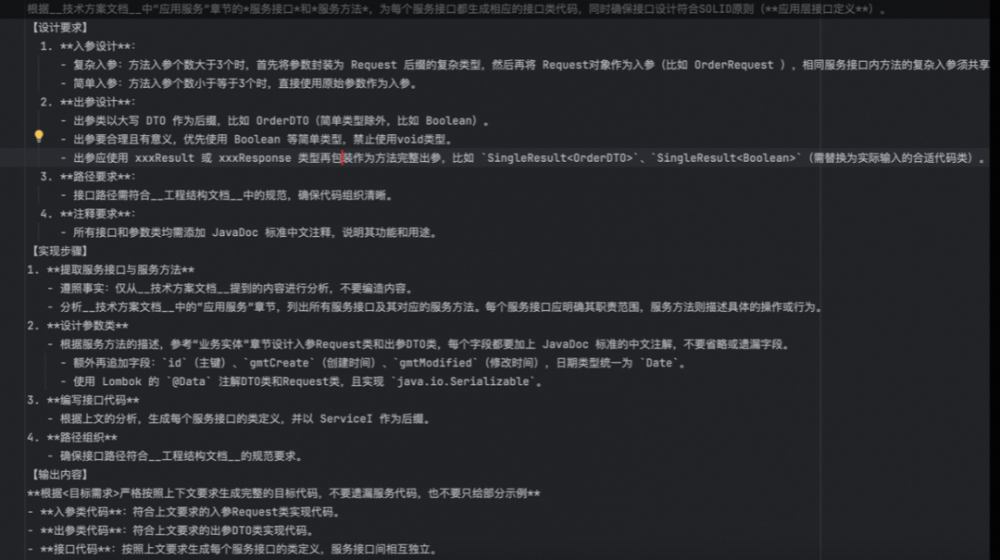

  * 架构规范融入：另外一个很大的好处，我们可以把我们的设计理念，如架构设计、编码规范、质量规范等放都在Prompt，AI会很听话的能够按照这些规范编写代码，这在以往也是很难做到的。

  * 沉淀复用：根据工程特性，在这套Prompt提示词基础上经过些许微调，沉淀为整个工程系统的Prompt，这样相关开发人员可直接使用，避免了Prompt的多次开发和调优，可随代码一起发布至git仓库。

上述方案中，工程结构及Prompt可直接共享并适时加以迭代，研发的工作重点更多的聚焦在了对业务需求逻辑的理解。

## 生产案例

通过类似AI编码方式，目前已上线需求3个，开发中2个，架构重构中1个。采纳行占比由4月份的8.9%提升至6月份的44.7%（官方统计口径），实际会有些虚高。下面列举3个案例简要说明：

### 案例1：低起送价转C配

项目背景：商家设置了起送价，但用户订单金额低于起送价，需要支付一定的配送费，产品上需要新建低起送价运营平台。

功能说明：

1.数层新增表5张；

2.5个领域服务的增删改查及相关业务逻辑。

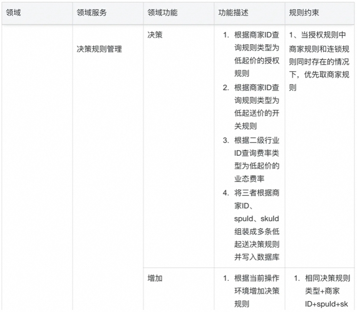

AI代码生成占比：保守估约70%+。

### 案例2：零售服务包推荐

项目背景：为商户推荐优质服务包及推荐语，并记录推荐服务调用现场。

功能说明：

1.数层新增表1张；

2.1个现有领域服务逻辑修改。

AI代码生成占比：保守估约50%+。

### 案例3：淘天逆向催支付

项目背景：淘天逆向商户存在大量退货已完结订单，但用户未支付物流费用的情况，直接影响了蜂鸟的收入，需要实现针对淘天逆向用户的短信催支付功能。

功能说明：

1.1个领域服务逻辑；

2.3个外部接口依赖。（需要在已有的技术方案和Prompt基础上增加“外部接口”依赖模块标准）

AI代码生成占比：保守估约70%+。

## 感想展望

### AI First

在团队布道过程中，听到太多质疑声，特别是讲到AI可以写业务逻辑，大家的第一反应基本都是：这玩意能写业务逻辑？它怎么知道如何写？写错了线上故障算谁的？改它写代码的时间比我自己写的时间还要多！But，这些都存在于未开始时的想象和质疑，大家应该能够多少感受到AI发展之快、热度之高、之持久。时代在快速进步，试问我们还有退路吗，但无论如何，最重要的是开始并参与其中！践行 AI Firsrt！

### 程序员发展

毫无疑问，AI编程对程序员这个职业的冲击很大，任何新兴技术带来一批淘汰是不可避免的，但它也会催生一批新的生产力，我们要做的就是迎着时代的发展，不断提高自身的能力，掌握并用好AI，让它成为我们的有力生产力。从上述的实践案例也可以窥探一二，未来基础的编码工作主要由AI来承担，程序员需要向更高阶的能力发展，如业务理解、架构设计等。不管怎样，Just do it，才不会患上AI焦虑症！

### 未来规划

从研发流程看，可尝试探索更高阶的AI辅助架构设计、技术方案生成、PRD规划等。

从自动化程度看，未来可整合各个分层任务，合并生成更加连贯更加自动化的长任务。

从增改场景看，本文的实践主要聚焦于代码新增。修改已有代码风险高、提效有限，但依然有机会沉淀适当Prompt。

* * *

## 技术方案模板参考

> AI编码配套的三层架构的技术方案模版，一方面控制任务拆分粒度，另一方面帮助理解业务逻辑及系统架构。
>
> 1\. 不需要的部分留白即可，文档内容仅模版示例，需要根据自己的需求进行分析改写。
>
> 2\. 修改类的小需求，没必要按照此模版来写，可直接在Agent窗口描述业务逻辑及要求。
>
> 3\. 同一个需求的不同迭代，可在技术方案名称上加上迭代日期作为版本区分。

### 项目资料

需求prd链接：xxx

技术方案链接：xxx

计划发布日期：YYYY-MM-DD

PD人员：xxx

开发人员：xxx

测试人员：xxx

### 需求价值

建设超客服务包运营平台，提高商家管理服务包效率。

### 需求分析

在超客2.0业务模式下，商户可以同时拥有一个超客服务包和一个自配送服务包，超客服务包只允许包含一个地理范围，自配送服务包可以包含多个地理范围。页面需要同时展示超客服务包、自配送服务包以及相应的地理范围。

### 术语解释

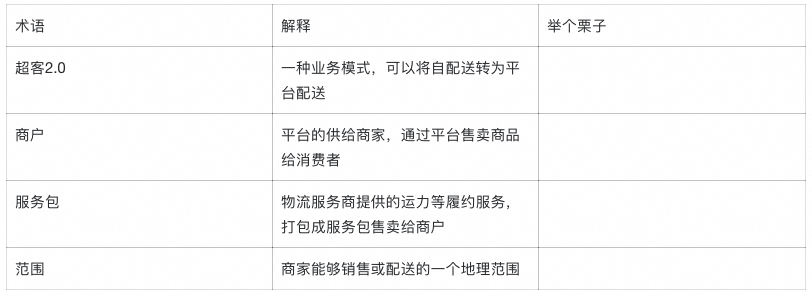

### 业务实体

对应三层架构的数据层，职责：ORM映射，持久化实体。

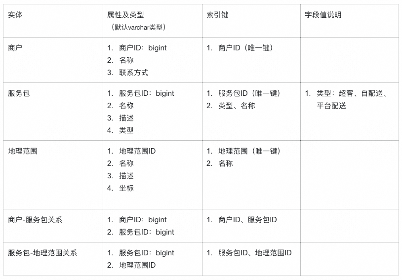

### 领域功能

对应三层架构的业务逻辑层，职责：封装领域内业务逻辑和业务规则，沉淀业务知识，遵守领域内开闭原则。

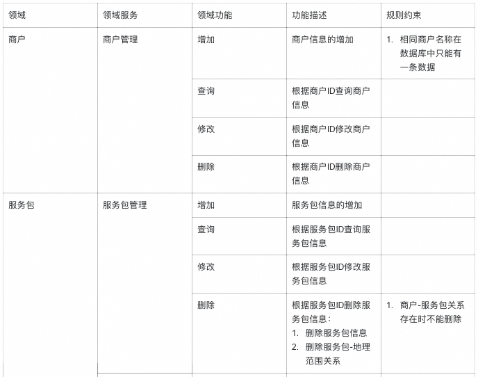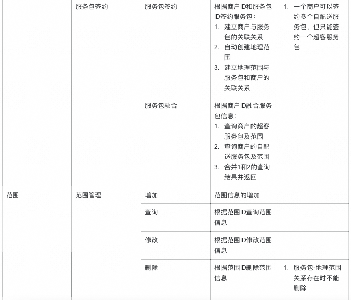

### 应用服务

对应三层架构的应用层，职责：对外提供服务接口，组装业务流程，模型转换，必要的参数校验、事务及异常处理。

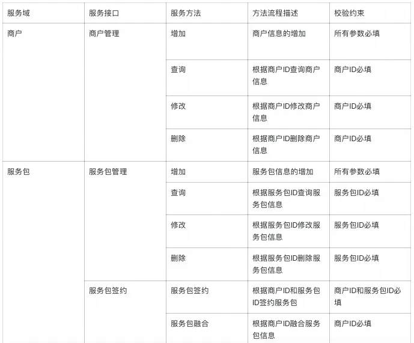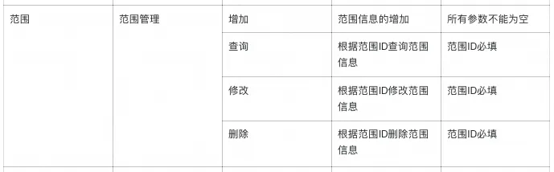

****

### Quick BI 助力企业构建智能商业分析

针对企业在数据分析过程中面临的取数难、报表效率低和数据割裂等问题，Quick BI 支持通过自然语言完成看板搭建与数据获取，借助 AI 发现异常并归因，真正实现“对话即分析”，显著提升数据使用效率与用户体验，助力企业高效运营、科学决策。

## 点击阅读原文查看详情。
