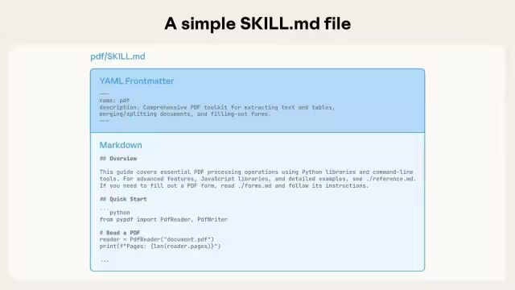
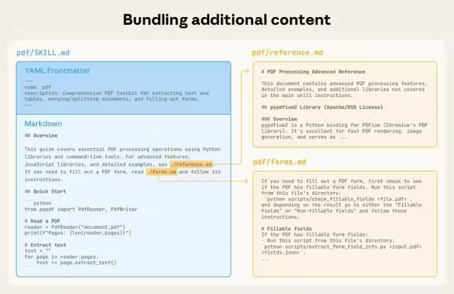
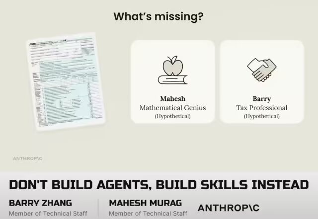
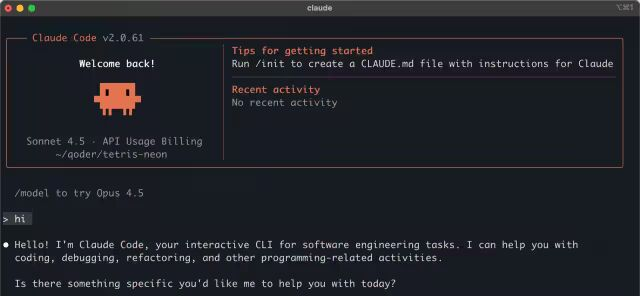
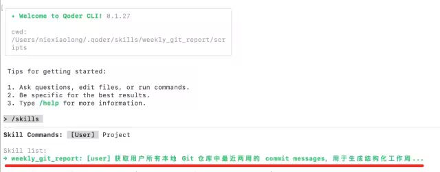
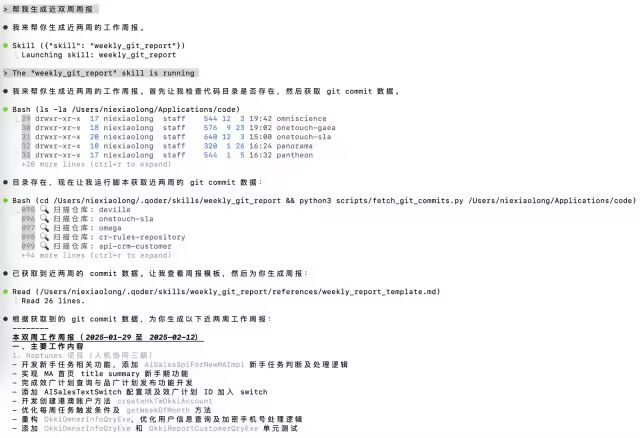

# Agent Skills：打通可复用专业领域知识的最后一公里

> **公众号**: 阿里云开发者  
> **发布时间**: 2026-04-01 08:30  

## 一、引言：Anthropic Agent Skills的发展史

  * 起源：时间拨回2025年10月16日，Anthropic在 Claude 3.7 Sonnet / Opus 中正式推出 Claude Skills 功能。定位解决通用大模型在垂直场景中“知道但不会做”的问题，提升任务执行的可靠性与一致性。刚一推出，在开发者社区获得高度评价。

  * 标准：再到2025年12月18日，Anthropic 联合多家生态伙伴在 agentskills.io正式开源 Agent Skills SpecificationV1.0，并发布官方 SDK（支持 Python、TypeScript、Java）。并与Anthropic一年前发布的 MCP形成互补——MCP 解决“能调什么工具”，Skills 解决“怎么完成任务流程”。

  * 响应：在2025年12月~2026年1月得到业界初步响应。微软宣布 Azure AI Studio 将原生支持 Agent Skills 格式；GitHub在 GitHub Copilot Workspace 中实验性支持 Skills；Cursor成为首个全面采用 Agent Skills 的 AI IDE，用户可安装并直接在编辑器中调用。Agent Skills 被 TechCrunch称为 “AI 领域的 Dockerfile”——它让 AI 能力变得可移植、可组合、可版本控制。

  * 生态：截至 2026年2月初：公开可用的 Agent Skills 超过 85,000 个；支持该标准的主流平台达 27 家，覆盖开发、设计、办公、电商、金融等领域；Linux 基金会也已启动讨论，拟将 Agent Skills 纳入其 AI & Data 基金会（AIDF）的候选标准之一。

## 二、什么是Agent Skills

> Skills are organized collections of files that package composable procedural knowledge for agents
>
> \-- Anthropic Don't Build Agents, Build Skills Instead
>
> 译：Skills是组织好的文件集合，其中包含了代理可组合的程序知识

SKILLS是一种约定标准，可通过专业知识和工作流程扩展 AI 代理的功能。本质来说SKILLS就是一个包含元数据、脚本、模板、参考指令等的文件夹。

  *   *   *   *   *

    my-skill/├── SKILL.md          #（必须）主文件: SKILL描述、逻辑编排、核心指令├── scripts/          #（可选）脚本: 可执行代码，*.py、*.sh等├── references/       #（可选）参考文档: 规则、规范、参考指南等└── assets/           #（可选）素材附件: 诸如一些icon、图片等资源

### 2.1. 核心文件SKILL.MD

SKILL.MD文件主要分为2块内容，一个是YAML元数据内容，一个是Markdown指令数据。其中YAML元数据内容有很多字段，其中必须存在得就是上述所示的name与description字段。

属性| 必需| 含义| 例如
---|---|---|---
`name`| 是| 描述SKILL名称，最多64个字符| name: pdf
`description`| 是| 描述该SKILL的作用以及何时使用，应包含有助于代理识别相关任务的特定关键词。| description: Comprehensive PDF toolkit for extracting text and tables,merging/splitting documents, and filling-out forms.
`license`| 否| 适用于该SKILL的许可证| license: Apache 2.0
`compatibility`| 否| 该SKILL存在的特定环境要求| Requires git, docker, jq, and access to the internet
`metadata`| 否| 任意键值映射，用于添加元数据信息| metadata: author: "xxx" version: "1.0"
`allowed-tools`| 否| 技能可使用的预先批准工具列表，以空格分隔| allowed-tools: Bash(git:*) Bash(jq:*) Read

### 2.2. 可选文件scripts/ref/assets等

  * scripts/：包含agent可以运行的可执行代码，一般为Python、Bash 和 JavaScript等脚本语言，类似MCP的效果，提供基础能力支持，更轻量。

  * references/：包含agent需要时可查阅的其他文档，比如UnitTestSpec.md、CodeSpec.md、ArchitectureSpec.md等。保持各个文件的简洁性，代理程序按需加载。

  * assets/：主要为一些包含静态资源，比如文档模板、表格示例，静态图片等等。

**2.3. 渐进式披露(Progressive disclosure)**

SKILL.MD建议控制在500行，多余的内容以其他文件承载并在SKILL.MD中指出对应引用。SKILL.MD的name和description会在启动时候加载，余下的内容会在模型识别到需要时才加载，这种模式也称为渐进式披露（Progressive disclosure）。

如上图所示为anthropic的官方说明，在SKILL.md中指定对应文件路径，当相关逻辑需要查阅到指定文件时，会按需加载，避免过多无效内容添加到上下文提示词中。

## 三、什么场景需要用到Skills

### 3.1. 数学天才与财务专家

当我们泛泛而用时，我们发现大模型很聪明，但当我们深入某个领域要用大模型解决具体问题时，又觉得大模型好像不懂我们，这就是领域专业知识。

Anthropic发了一则YouTube视频 Don't Build Agents, Build Skills Instead，其中提到一个例子，当你需要报税问题时，你是需要一个300IQ的数学天才还是经验丰富的财务专家。

  * 大模型 + 财务skills -> 财务专家

  * 大模型 + 金融skills -> 金融专家

  * 大模型 + 广告skills -> 广告专家

通过不断沉淀专业领域的skills，结合大模型的理解能力，形成针对某个领域的技术专家。因为skills的存在，让专家不再如过去顾问一般只是提供建议，而是实实在在的帮我们把具体的事情做完。不需要再建新的agent，只需要不断沉淀skills，基于 Claude Code底座就可以完成以前专业agent才能完成的工作。

### 3.2. a worker not an adviser

Skills依托Claude Code运行，我们发现它与传统的类ChatGPT不同的是，它是在命令行终端运行的。在Claude Code类产品出现之前，我们使用大模型辅助编程的体验是很割裂的，在WEB页面上输入提示词，然后把代码再拷出来，再修改我们的文件。

> A terminal is in every developer's workflow. Whether or not you're primarily in IDE or even if you're just like a Vim user,you're using terminal as part of your workflow in one shape or another.
>
> \-- Meaghan Choi design lead for Claude Code, Anthropic
>
> 译：终端存在于每一个开发者的工作流程中，无论你主要是使用 IDE，还是一个 Vim 用户，你都会以某种形式使用终端。

这种局限性其实是基于WEB模式造成的，在anthropic内部一次访谈 Designing Claude Code中，Claude Code的设计主管阐述了为什么将Claude Code栖身于终端之中。不管我们用得是何种图形化软件，本质都是在命令行中执行指令。这样就把原先只提供建议的顾问，变成了一个真正可以直接干活的靠谱伙伴。

### 3.3. 可复用的专业技能

我们都说2025年是agent的元年，从2025年开始我们不满足于AI只是给我们提建议，我们希望AI能在某一个特定场景从头到尾解决一个具体问题，于是我们建立了写单测的agent、作数据分析的agent、优化商品描述的agent等等。后面我们发现这些agent越来越多，workflow越来越多，维护越来越困难，并且agent于agent之间的联系与协同，也愈发复杂。

解决这个问题，anthropic给的答案是：我们缺得不是agent，而是被整理、被固化、在特定领域能反复调用、持续迭代的专业技能。这就是 Skill 出现的背景，封装得是我们在某个领域沉淀的一套成熟的方法论。在同一个大模型上下文中执行，可以理解为只有一个agent，天然不会存在跨agent协作的问题。不依赖精细的workflow，而是借助模型本身的理解能力，再基于渐进式披露适时加载对应Skills，整个过程也是从精细化workflow向agenticAI转变，处理过程更加AGI。

并且Skill本身是就是一个文件夹及部分md、py、sh等文件，我们可以很方便的将文件夹zip后分享给团队其他成员，因为它本质是文件及文件夹，所以我们也可以很好的通过git等工具来对其进行版本管理，持续改进与升级，让这份专业技能可复用可管理可分享可迭代。

### 3.4. Skills vs Prompt vs MCP

维度| Prompt| MCP | Skills
---|---|---|---
定位| 模型的“一次性指令”| 工具调用的“通信协议”| 任务执行的“标准能力包”
作用| 告诉模型“做什么”和“怎么做”的文本描述| 定义模型如何安全、发现、调用外部工具（如数据库、API、CLI）| 封装一个完整、可复用、可版本化的任务解决方案，包含目标、流程、工具依赖和执行逻辑
粒度| 单次对话上下文内的指令| 工具接口的标准化描述（类似 OpenAPI for AI）| 跨会话、跨应用的独立功能单元（类似 Docker 镜像）
可复用性| 低：需人工复制粘贴，易出错| 中：工具可被多个 Prompt 调用，但调用逻辑仍散落在代码中| 高：技能可被任意支持该标准的 Agent 直接加载使用
工程化程度| 脚本级| 接口级| 应用级

在skills诞生之前，我们通过prompt来编排流程，通过function calling/MCP来定义外部能力，最终基于我们自身的应用程序来实现函数调用。如同程序写好了一个基于扩展的填空题，大模型告诉我们现在到哪个空了，需要调用哪个能力来实现某个操作，本质上更像是一个精心设计的workflow。不断的打磨可以让它在这个场景上做得越来越精进，但又一个致命问题却解决不了，那就是“可复用性”，也可以定义为非AGI模式，不是通用型的。

  * Skills ≠ Prompt 的替代品，而是 Prompt 的容器。一个 Skill 必然包含精心设计的 Prompt（通常在 `SKILL.MD` 或指令模板中），但还额外包含脚本、依赖声明、测试用例等。

  * Skills ≠ MCP 的替代品，而是 MCP 的消费者。Skill 中的执行脚本（如 Python/JS）会通过 MCP 协议去调用外部工具。没有 MCP，Skill 就无法安全地连接真实世界。

  * 三者协同工作：Prompt 告诉模型“当前任务是什么” → 模型匹配到合适的 Skill → Skill 加载后，其内部逻辑通过 MCP 调用所需工具 → 完成闭环。

Skills 的本质，是把“AI 工作流”产品化、标准化、资产化。它让团队可以像管理微服务一样管理 AI 能力，真正迈向 AGI 时代的“能力即服务”（Capability-as-a-Service）。

## 四、Agent Skills实践与应用

上述整体介绍了什么是SKILLS，以及在什么时候适合使用它，现在让我们动手做一个小demo，来实际体验SKILLS是如何操作与如何运用的。

这里我们以一个小需求为例，基于git commit message的数据，来生成我们的每双周的周报。会涉及到基于py脚本来读取git的提交记录，基于reference来定义周报模板，并在SKILL.md中声明相关文件的引用。

### 4.1. 创建weekly_git_report SKILL

文件目录结构如下

  *   *   *   *   *   *

    weekly_git_report/├── SKILL.md                  # 主文件: SKILL描述、文件引用├── scripts/    ├── fetch_git_commits.py       # 脚本: 读取git提交记录├── references/     ├── weekly_report_template.md  # 模板文件: 周报模板文件

文件详细信息如下

SKILL.md

  *   *   *   *   *   *   *   *   *   *   *   *   *   *   *   *   *   *   *   *

    ---name: weekly_git_reportdescription: 获取用户所有本地 Git 仓库中最近两周的 commit messages，用于生成结构化工作周报。version: 0.0.1---
    # 概述本技能用于基于近14天git commit messages的数据，生成每双周的结构化工作周报。
    # 用户数据用户的所有代码父目录在/Users/niexiaolong/Applications/code所有代码仓库均在该目录下，需要遍历该目录下的所有一级目录，子目录下才有.git文件，才能获取到git commit messages注意：若用户无该目录/Users/niexiaolong/Applications/code，则询问用户“请输入您的git仓库地址”，然后再基于用户提供的地址再执行后续操作，确保找到.git文件
    # 数据获取- 基于scripts/fetch_git_commits.py脚本来获取近一周git commit messages的数据- 周报的样板参见references/weekly_report_template.md文件
    # 异常情况如果获取不到任何数据，周报就直接写“本周我在摸鱼”，意思为啥都没干。

fetch_git_commits.py

  *   *   *   *   *   *   *   *   *   *   *   *   *   *   *   *   *   *   *   *   *   *   *   *   *   *   *   *   *   *   *   *   *   *   *   *   *   *   *   *   *   *   *   *   *   *   *   *   *   *   *   *   *   *   *   *   *   *

    #!/usr/bin/env python3import osimport subprocessimport sysfrom datetime import datetime, timedelta
    # 配置你的代码父目录CODE_PARENT_DIR = "/Users/niexiaolong/Applications/code"
    def is_git_repo(path):    """判断路径是否是 Git 仓库"""    return os.path.isdir(os.path.join(path, ".git"))
    def get_commits_last_2week(repo_path):    """获取该仓库最近14天的 commit messages（只取第一行）"""    try:        # 计算14天前的日期（ISO 格式）        one_week_ago = (datetime.now() - timedelta(days=14)).strftime("%Y-%m-%d")        result = subprocess.run(            ["git", "log", f"--since={one_week_ago}", "--pretty=format:%s", "--no-merges"],            cwd=repo_path,            capture_output=True,            text=True,            check=True        )        messages = result.stdout.strip().split("\n") if result.stdout.strip() else []        return [msg.strip() for msg in messages]    except subprocess.CalledProcessError as e:        print(f"⚠️  跳过仓库 {repo_path}（Git 命令失败）", file=sys.stderr)        return []    except Exception as e:        print(f"⚠️  跳过仓库 {repo_path}（错误: {e}）", file=sys.stderr)        return []
    def main():    all_commits = []    repos_found = 0
        # 遍历所有子目录    for item in os.listdir(CODE_PARENT_DIR):        full_path = os.path.join(CODE_PARENT_DIR, item)        if os.path.isdir(full_path) and is_git_repo(full_path):            repos_found += 1            print(f"🔍 扫描仓库: {item}", file=sys.stderr)            commits = get_commits_last_2week(full_path)            if commits:                all_commits.append(f"### 项目: {item}\n")                for c in commits:                    all_commits.append(f"- {c}")                all_commits.append("")  # 空行分隔
        ifnot all_commits:        print("过去两周没有找到任何 Git 提交记录。")    else:        print("\n".join(all_commits))
    if __name__ == "__main__":    main()

weekly_report_template.md

  *   *   *   *   *   *   *   *   *   *   *   *   *   *   *   *   *   *   *   *   *   *   *   *   *   *

    # 本双周工作周报（{{date}}）
    ## 一、主要工作内容
    - 完成了 XXX 功能开发- 修复了 YYY 模块的性能问题- 参与了 ZZZ 项目的需求评审
    ## 二、遇到的问题与解决方案
    - 问题：部署时出现权限错误    解决：调整了 Dockerfile 中的用户组配置
    ## 三、下周计划
    - 继续开发 AAA 模块- 编写单元测试覆盖核心逻辑
    ## git commit message 附录
    - refactor(AISalesBuilder): 修改每周任务触发条件及优化getWeekOfMonth方法- allnum不为0时，返回集合也会是空的- feat(AiSalesSpiForNewMAImpl): 添加新手任务判断及处理逻辑---
    > 注：以上内容为模板格式，实际内容应基于 Git 提交记录生成；附录部分为真实git commit message

### 4.2. QoderCli平替与SKILL注册

由于claude code无法在国内访问，需要做代理绑定及claude密钥，这里我们用阿里系产品 Qoder CLI 做替代。Qoder CLI完美支持claude code的SKILL标准，无需任何改动。

Qoder CLI 支持两种 skill 存储位置：

类型 | 路径| 作用范围
---|---|---
个人 skill| ~/.qoder/skills/<skill-name>/| 所有项目可用
项目 skill| .qoder/skills/<skill-name>/| 仅当前仓库可用

这里我们把我们写好的skill文件夹放到指定目录下，这里我们直接放到个人 skill目录里。在qodercli控制台中，通过/skills命令就可以看到我们刚写好的skill。

### 4.3. SKILL发力周报生成

控制台输入“帮我生成近双周周报”，qodercli运行首先找到了我们预先定义好的SKILL，再按照我们SKILL.md中定义的流程进行文件夹目录判断，查找git仓库，运行py脚本读取git commit message等，最终生成一份周报。

  *   *   *   *   *   *   *   *   *   *   *   *   *   *   *   *   *   *   *   *   *   *   *   *   *   *   *   *   *   *   *   *   *   *   *   *   *   *   *   *   *   *   *   *   *   *   *   *   *   *

    本双周工作周报（2025-01-29 至 2025-02-12）                                                                                                                                                                  一、主要工作内容                                                                                                                                                                                            1. Neptunes 项目（人机协同三期）                                                                                                                                                                            - 开发新手任务相关功能，添加 AiSalesSpiForNewMAImpl 新手任务判断及处理逻辑                                                                                                                                  - 实现 MA 首页 title summary 新手期功能                                                                                                                                                                     - 完成效广计划查询与品广计划发布功能开发                                                                                                                                                                    - 添加 AISalesTextSwitch 配置项及效广计划 ID 加入 switch                                                                                                                                                    - 开发创建港澳账户方法 createHkTwOkkiAccount                                                                                                                                                                - 优化每周任务触发条件及 getWeekOfMonth 方法                                                                                                                                                                - 重构 OkkiOwnerInfoQryExe，优化用户信息查询及加密手机号处理逻辑                                                                                                                                            - 添加 OkkiOwnerInfoQryExe 和 OkkiReportCustomerQryExe 单元测试                                                                                                                                                                                                                                                                                                                                                         2. ICBU-CRM-AI-Web 项目                                                                                                                                                                                     - 开发 AI 服务报告查询接口（AIServiceReportSalesController、AIServiceReportIntlController）                                                                                                                 - 完成 AiWebSalesDebugController PVG 信息打印功能                                                                                                                                                           - 更新登录过滤器配置与逻辑（LoginFilter）                                                                                                                                                                   - 添加用户 Tair 信息及登录过滤器相关配置                                                                                                                                                                    - 更新 Spring Boot 版本并调整依赖项                                                                                                                                                                         - 添加 ICBU Session 依赖、健康检查依赖                                                                                                                                                                      - 调整包结构并更新相关引用                                                                                                                                                                                                                                                                                                                                                                                              二、遇到的问题与解决方案                                                                                                                                                                                    - 问题：新手任务状态判断存在空指针风险                                                                                                                                                                      解决：添加空值检查，优化剩余天数比较逻辑                                                                                                                                                                    - 问题：解密请求参数需匹配新 API 要求                                                                                                                                                                       解决：更新解密请求中的应用标识字段名和提供商应用标识配置值                                                                                                                                                  - 问题：单元测试覆盖率不足                                                                                                                                                                                  解决：补充 OkkiOwnerInfoQryExe 和 OkkiReportCustomerQryExe 的单元测试用例                                                                                                                                                                                                                                                                                                                                               三、下周计划                                                                                                                                                                                                - 继续完善人机协同三期剩余功能开发                                                                                                                                                                          - 跟进 CR 反馈进行代码优化                                                                                                                                                                                  - 完成 HSF 多地注册相关配置                                                                                                                                                                                                                                                                                                                                                                                             git commit message 附录                                                                                                                                                                                     neptunes                                                                                                                                                                                                    - feat(AiSalesSpiForNewMAImpl): 添加新手任务判断及处理逻辑                                                                                                                                                  - feat: 效广计划查询 / 品广计划发布                                                                                                                                                                         - feat(SwitchConfigPreInitializer): 添加AISalesTextSwitch配置项                                                                                                                                             - feat: 效广计划id加入switch                                                                                                                                                                                - refactor(AISalesBuilder): 修改每周任务触发条件及优化getWeekOfMonth方法                                                                                                                                    - fix(AiSalesNewBuilder): 修正剩余天数比较的空指针风险                                                                                                                                                      - fix(OkkiOwnerInfoQryExe): 优化用户信息查询及加密手机号处理逻辑                                                                                                                                            - test(OkkiOwnerInfoQryExe): 添加单元测试                                                                                                                                                                   - chore(pom.xml): 更新merchant-rating-client依赖版本                                                                                                                                                                                                                                                                                                                                                                    icbu-crm-ai-web                                                                                                                                                                                             - feat(AIServiceReportSalesController, AIServiceReportIntlController): 添加查询报告数据接口方法                                                                                                             - feat(AiWebSalesDebugController): 打印pvg信息                                                                                                                                                              - fix(LoginFilter): 更新登录过滤器配置与逻辑                                                                                                                                                                - chore(pom.xml): 更新Spring Boot版本并调整依赖项                                                                                                                                                           - chore(pom.xml): 添加ICBU Session依赖并更新过滤器配置                                                                                                                                                      - refactor: 调整包结构并更新相关引用                                                                                                                                                                        --------                                                                                                                                                                                                    | 注：以上周报基于 2025-01-29 至 2025-02-12 期间的 Git 提交记录自动生成

## 五、Skills内外部生态

### 5.1. Skills业界生态

截至 2026 年初，Skills 生态正处于爆发式增长与治理挑战并存的关键阶段。据 FreeBuf 与社区监测数据，公开可查的 Skills 数量已超过 10 万，且保持 每周数千新增 的速度（如 skills.sh 平台每小时新增 550+ 技能）。头部Skill如 `find-skills`（用于发现其他技能）安装量达 194.1K+，成为事实上的“技能搜索引擎”。Skills 正在成为 AI 时代的 “npm” 或 “App Store” —— 每个技能都是一个微型应用。

一些优秀的Skills集合分享

  * Anthropic官方Skills：https://github.com/anthropics/skills

  * 规模最大的Skills集合 SkillsMP：https://skillsmp.com/

  * 当下最火的Skills社区 Skill.sh：https://skills.sh/

## 六、结尾：当AI从"知道分子"变为"行动专家"

正如Anthropic在"Don't Build Agents, Build Skills Instead"中揭示的范式转变——AI能力的进化路径不是创造更多孤立的智能体，而是沉淀可组合的专业技能。本文展示的Agent Skills技术体系，正在重塑我们与AI协作的三个维度：

1.能力维度：从"百科全书式的建议者"进化为"开箱即用的执行者"。就像财务Skills让大模型瞬间获得报税专家的肌肉记忆，这种"即插即用"的专业能力加载模式，正在消弭通用模型与垂直场景间的最后一公里鸿沟。

2.工程维度：通过标准化文件包（SKILL.md+scripts+references）实现AI能力的"集装箱化"。开发者不再需要从零构建复杂工作流，而是像使用Docker镜像一样，通过git管理、版本控制、组合调用各类Skills，让AI能力真正成为可复用的数字资产。

3.交互维度：从Web对话框的"建议-复制-粘贴"循环，进化到终端环境的"指令-执行-交付"闭环。Claude Code与Skills的结合证明，当AI深度嵌入开发者原生工作流时，才能真正从"纸上谈兵的军师"转变为"并肩作战的队友"。

站在2026年这个AI应用爆发的临界点，Agent Skills或许正在书写新的摩尔定律——不是晶体管数量的指数增长，而是人类专业知识的数字化封装效率的持续突破。当每个领域的最佳实践都能被沉淀为Skills时，我们迎来的将不是少数几个超级AI，而是无数个随时待命的"数字专家军团"。

# 参阅资料

  * https://github.com/anthropics/skills

  * https://claude.com/blog/building-agents-with-skills-equipping-agents-for-specialized-work

  * https://docs.claude.com/en/docs/agents-and-tools/agent-skills

  * https://github.com/anthropics/skills/blob/main/skills/brand-guidelines/SKILL.md?plain=1

  * https://platform.claude.com/docs/zh-CN/agents-and-tools/agent-skills/overview

  * https://agentskills.io/

  * https://code.claude.com/docs/zh-CN/skills

  * https://www.youtube.com/watch?v=CEvIs9y1uog
