# Agent 时代的生产力悖论：当协作本身成为最大的瓶颈

> **公众号**: 阿里云开发者  
> **发布时间**: 2026-05-08 08:30  

阿里妹导读

文章内容基于作者个人技术实践与独立思考，旨在分享经验，仅代表个人观点。

> 19世纪末，美国的工厂纷纷将蒸汽动力替换为电力驱动，以为从此效率飞涨，结果却让人大跌眼镜——此后近三十年，生产力几乎毫无起色。真正的转折发生在1920年代前后：企业不再只是"换个引擎"，而是从车间动线、岗位协同到工艺流程来了一次彻底的重塑，流水线模式由此诞生，效率才实现了质的飞跃。正如一个比喻所说：光换引擎不改底盘，就像在牛车上绑火箭——不但快不了，搞不好还会四分五裂。

> 今天，同样的剧本正在AI领域上演。企业给每个人都装备了AI工具，底层的组织形态、协作机制、管理逻辑却纹丝未动。这就好比一支龙舟队，每个人手里都换上了最好的桨，但没有鼓手统一节奏、没有舵手校准航向——桨划得越猛，船反而越乱，不是原地打转，就是直接散架。

## 一、在 Agent 时代，传统的“协作”和“分工”是效率的阻碍

2025 年，AI 编程助手已进化为“AI 软件工程师”，但“Vibe Coding”生产力悖论正在浮现：Agent 生成代码的速度呈指数级增长，组织的整体研发效率却提升有限。问题不在于 AI 的能力，而在于我们仍用工业时代的协作模式来组织 AI 时代的研发。

传统的协作和分工旨在提升效率，但在 Agent 时代，这种传统分工反而成为了效率的阻碍。前端与后端、产品与开发、开发与测试的分离，在人力时代支持了专业化与规模化，而在 AI 时代则意味着上下文中断、信息损耗和协作摩擦。

> "约束不再是代码生产的速度，而是软件组织的结构。"

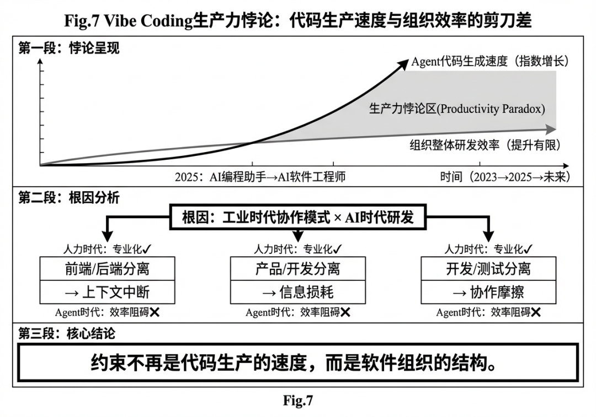

### 1.1 传统协作模式的结构性低效

传统软件工程将研发流程划分为多个专业领域：前端开发、后端开发、数据库管理、DevOps、测试等。每个领域由专门的团队或人员负责，通过接口契约进行协作。这种模式在人力主导的时代有其合理性——人类需要专业化来积累深度知识。然而，对于AI Agent而言，这种分工构成了严重的效率障碍：

  * 上下文碎片化：当AI需要完成一个端到端的功能时，它必须在多个团队、多个工具、多个代码库、多个文档系统之间来回切换，每次切换都意味着上下文的丢失和重建成本。

  * 接口摩擦：前后端之间的API契约定义、联调、变更管理，在AI时代成为了不必要的摩擦点。AI完全有能力理解完整的数据流并自动生成一致的前后端代码。

  * 知识孤岛：每个专业领域的知识被隔离在特定的团队或文档中，AI难以获得全局视角来做出最优的技术决策

### 1.2 研发阶段带来的信息断层

在传统的软件开发生命周期中，需求分析（由产品经理/PD负责）与代码实现（由开发负责）是两个明确分离的阶段。这种分离基于一个假设：需求必须被人理解和转化为技术规格后，才能进入实现阶段。

而在 Agent 时代，这个假设正在被打破

  * 自然语言即代码：AI可以直接理解自然语言描述的需求并生成实现，不再需要人工的"翻译"过程。

  * 需求即测试：好的需求描述本身就包含了验收标准，这些标准可以直接转化为自动化测试用例，由AI自动验证实现是否符合预期

当 AI 可以直接从Spec开始生成可用代码时，传统的分工和协作模式就是效率的阻碍。

### 1.3 协作带来的沟通成本

传统协作模式的核心是"人与人的沟通"。无论是站会、需求评审、技术方案讨论还是代码审查，本质上都是人类之间的信息交换。这种协作方式的成本随着团队规模呈几何级数增长。在AI时代，这种协作模式暴露出了根本性的局限：

  * 沟通带宽限制：人类处理信息的速度远远落后于AI生成信息的速度，导致AI的产出在等待人类反馈的过程中被闲置。

  * 信息损耗：每一次人与人之间的信息传递都会引入噪声和失真，多次传递后原始意图可能面目全非

在采用AI编程助手的团队中，开发者报告的主要痛点不再是AI生成代码的速度和质量，而是"等待人类反馈"和"协调多人协作"，这说明协作本身已经成为了新的瓶颈。

## 二、在Agent时代，传统的“研发资源组织形式”也是效率的阻碍

### 2.1 代码和代码是分离的

当一个 Agent 需要实现一个端到端的功能时，它面临的第一个挑战不是"如何写代码"，而是"代码在哪里"。客户端代码在一个仓库，前端代码在另一个仓库，后端服务分散在多个微服务仓库，SDK 又有独立的版本管理。每个仓库都有自己的分支策略、CI 流程、代码规范。Agent 必须在这些仓库之间来回切换，每次切换都意味着上下文的丢失和重建。更关键的是，这些仓库之间的依赖关系往往没有显式声明，Agent 无法通过程序化的方式理解"修改这个 API 会影响哪些前端页面"。

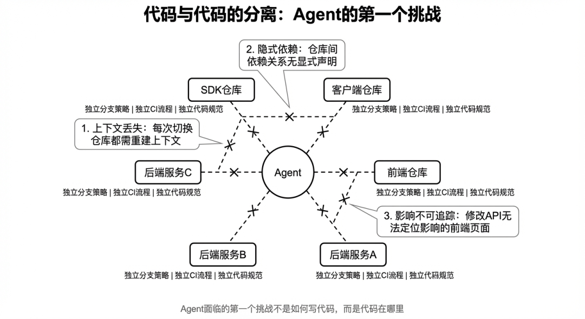

### 2.2 代码和文档是分离的

信息的碎片化不仅存在于代码层面，更存在于研发基础设施的各个角落。需求文档可能在语雀上，API 说明书可能在 Swagger 里，技术方案的讨论记录在钉钉聊天记录中，代码注释散落在各个文件里，Bug 历史躺在 Issue 系统中。这些信息实体之间没有关联，没有统一的索引，没有机器可读的元数据。对人类来说，可以通过搜索、询问同事、凭经验定位来拼凑出完整的上下文；但对 Agent 来说，这些信息孤岛是无法逾越的鸿沟。

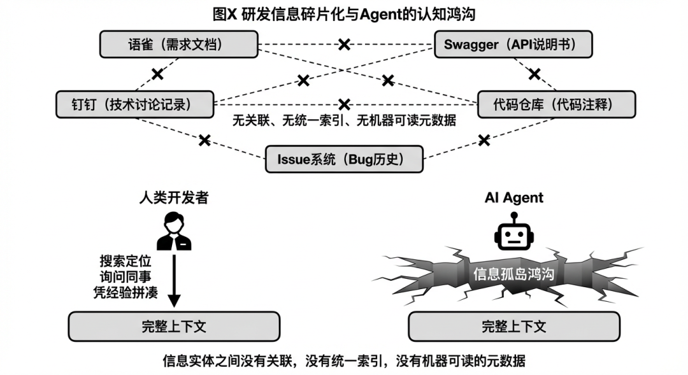

真正的面向 Agent 的研发范式，需要重构信息的组织方式：代码仓库应该按产品或者能力而非按技术栈划分，文档应该是机器可读的结构化数据而非 针对人去优化过的UI，知识应该 集中存储而非分散在各个孤岛中，上下文应该能够被程序化地收集注入而非依赖人工整理。

只有当信息基础设施为 Agent 优化时，AI 的自主执行潜力才能真正释放。

### 2.3 文档的主要维护者还是人

传统研发文档的另一个根本性问题是：它们由人编写、由人维护。这意味着文档的更新总是滞后于代码的变更，文档的质量依赖于个人的责任心和写作能力，文档的一致性无法被自动验证。当代码已经迭代了三个版本，API 文档可能还停留在第一个版本；当业务逻辑已经重构，技术文档上的流程图可能还在描述旧的系统架构。

这种"人维护文档"的模式在 AI 时代显得低效。人类编写文档需要投入大量时间，但文档的利用率却很低——大部分文档写完后就很少有人阅读，只有在出问题时才被翻出来。另外，最了解系统的人往往是最忙的人，他们没有时间更新文档；而有时间更新文档的人往往对系统了解不够深入，写出的文档质量有限。

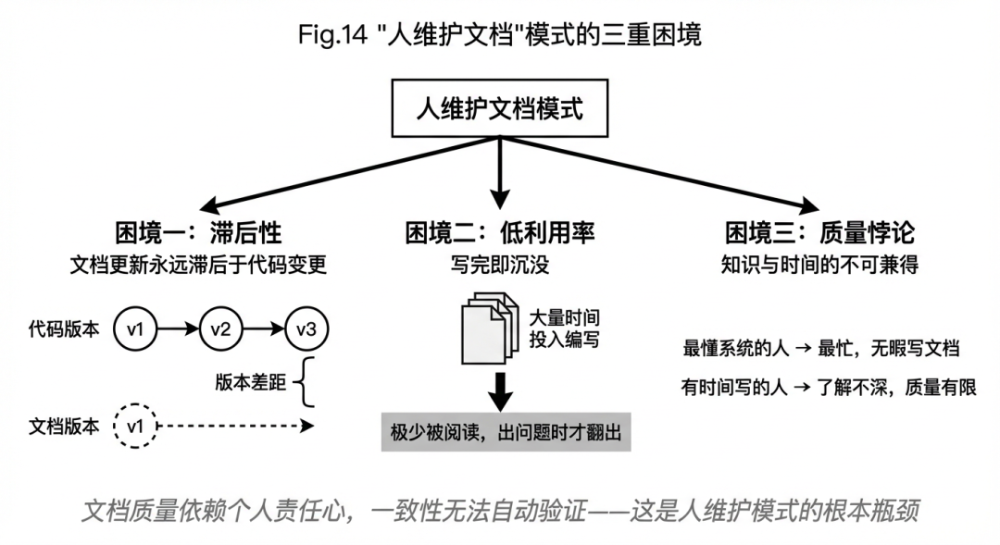

如果我们将文档视为一种特殊的"代码"，代码可以由 Agent 生成、修改、验证，文档同样可以。当 Agent 修改了一个 API 的实现，它可以同时更新 API 文档；当 Agent 重构了一段业务逻辑，它可以同步更新架构说明；当 Agent 修复了一个 Bug，它可以自动记录到变更日志中。文档不再是代码的附属品，而是与代码一起被版本控制、一起被审查、一起被自动化测试验证的公民。

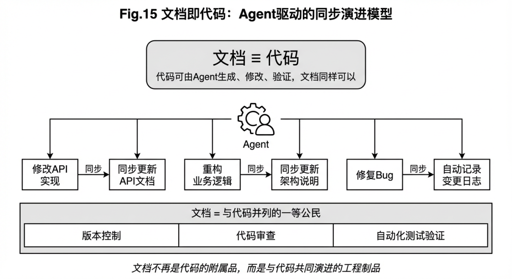

## 三、Agent 在交付和稳定性链路中的缺席

传统发布流程是 Agent 能力被系统性限制的典型场景。从代码提交到生产部署，整个链路充满了为人类设计的审批节点、手工验证步骤和断点式协作。Agent 可以生成代码、运行测试，却无法直接触发构建；构建通过了测试，却无法自动部署到预发；预发验证通过了，却无法推进到生产。权限被分散在不同的系统和角色手中，每一个环节都需要人类介入。更深层的问题是发布流程中的信息不透明。CI 日志、测试报告、性能指标、灰度数据散落在不同系统中，没有统一接口供 Agent 程序化访问。当发布失败时，Agent 无法自动分析原因、自动回滚、自动重试，只能等待人类处理。

传统流程中的决策机制也是为人类设计的。灰度比例调整、回滚时机判断、hotfix 优先级，这些决策通过站会、评审、即时沟通完成，Agent 无法参与这种非结构化的决策过程。即使 Agent 已通过数据分析得出最优建议，也没有渠道注入决策流程。

真正的面向 Agent 的发布流程，应该让 Agent 成为参与者而非旁观者：自动触发构建、自动部署、自动监控、自动根据预设规则调整灰度或回滚。人类从流程执行者变成规则制定者和异常处理者。

当 Agent 能够参与发布过程时，完整的自主闭环才真正形成：Agent 理解需求、生成代码、验证质量、交付价值。任何将 Agent 排除在外的环节，都是 AI 时代研发效率的瓶颈。

## 四、让 Agent 更好工作，任务完成度更高的关键要素

我认为面向Agent的协作模式不应该仅限于对现有产品和模式的演进，在对信息组织方式，写作模式上应该也要做一些创新。甚至要对传统的软件研发流程做一些适当“调整”，来降低 Agent 完成更高维度需求过程中的阻碍，不再让AI适应人的工作方式，而是构建一个让AI能够高效工作的环境，这里有几个点思考作为一些参考。

### 4.1 All In Code 的信息管理方式

传统研发中，代码、文档、测试、配置等资源分散在不同的系统中：代码在Git仓库，文档在语雀和钉钉，测试用例在测试管理系统，配置在配置中心。这种分散对于人类来说是可管理的（虽然也不高效），但对于AI来说却是巨大的认知负担。

All-in-One版本化管理要求将所有研发资源纳入统一的版本控制系统：

资源类型| 传统存储位置| 统一版本化管理
---|---|---
源代码| Git仓库| 统一Git仓库，代码即真相源
需求文档| Wiki/Confluence| Markdown文件，与代码同仓库
测试用例| 测试管理系统（单测，集成测试，e2e 测试方法）| 代码化测试，版本化存储
API文档| Swagger/Postman| OpenAPI规范文件，代码生成
配置| 配置中心| 环境配置文件，版本化
Skills/工具| 分散的脚本| CLI化工具，版本化发布
记忆/上下文| 无系统化管理| 结构化存储，可检索

AI可以在一个完整的上下文中工作，不需要在不同系统之间切换和整合信息。当AI需要实现一个功能时，它可以同时访问需求描述、相关代码、测试用例、历史变更记录，从而做出更准确的决策。

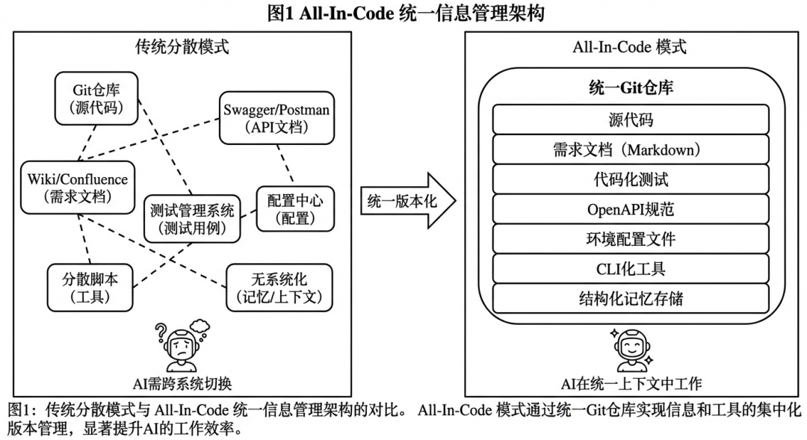

### 4.2 隔绝外部依赖：版本化一切

外部依赖是软件研发中的不确定性来源。外部API变更、第三方服务下线、文档链接失效——这些都会导致AI的行为不可预测。面向Agent的协作模式要求"隔绝外部依赖"，具体策略包括：

  * 外部文档版本化：将依赖的外部文档（如API文档、SDK文档）定期抓取并版本化存储，AI始终访问本地版本

  * 需求库版本化：需求不再存储在外部需求管理系统（如Jira），而是以版本化文件形式存在于代码仓库

  * 依赖锁定：所有外部依赖（包括AI模型版本）都被精确锁定，确保可复现性

  * Mock服务：外部服务调用通过Mock服务隔离，测试和开发不依赖外部可用性

这种"版本化一切"的理念，本质上是在构建一个自包含的、可复现的研发世界。在这个世界中，AI可以安全地工作，不受外部变化的干扰。

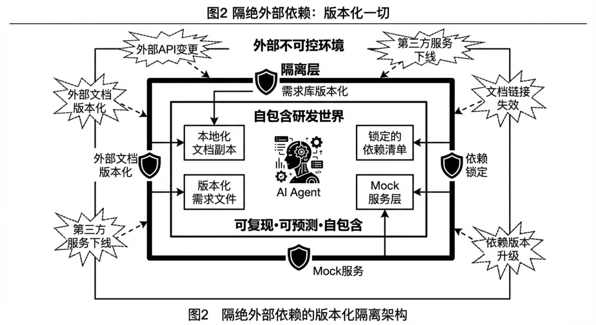

### 4.3 自学习和自我迭代能力

传统的研发流程是静态的——流程定义好后，除非人工调整，否则不会变化。而在AI时代，研发流程本身应该能够自学习和自我优化。比如遇到了什么问题，是怎样绕过的等，有一些基础原则不可触碰等。

自学习机制包括：

  * 反馈闭环：AI的每一次产出（代码、文档、测试）都会经过验证（编译、测试、人工审查），验证结果被记录并用于优化AI的后续行为

  * 模式学习：AI分析团队的代码库，学习编码规范、设计模式和架构偏好，生成的代码越来越符合团队风格

  * 效率分析：系统追踪每个任务的完成时间、迭代次数、缺陷率，识别流程瓶颈并建议优化

  * 知识沉淀：AI从每次交互中提取可复用的知识，丰富组织的集体记忆

这种自学习能力使得研发系统不再是一个静态的工具，而是一个持续进化的有机体

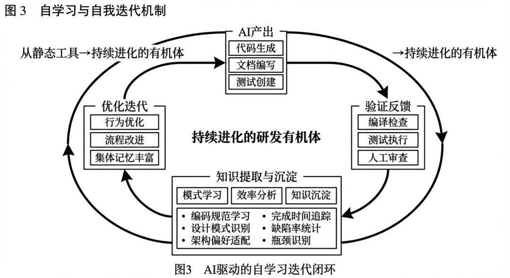

### 4.4 平台需要建设让 Agent 能安全执行的能力

基于现在的接口和 Skills 以及 CLI，很多 Agent 都能把一个需求从讨论到研发部署全链路走通，但如何让Agent能顺利的走通这些流程还需要建设安全能力，否则永远只能是在实验室中的一些 Demo。包括：

  * 沙箱和环境：AI在隔离的沙箱环境中运行，无法访问敏感数据和生产系统

  * 权限分级：Agent 不同级别的操作需要不同级别的授权，危险操作需要额外确认

  * 分批执行：大规模变更可以分批次执行，每批执行后验证效果，降低风险

  * 审计日志：所有AI的操作都被详细记录，便于事后审查和问题追溯甚至拦截

  * Dry Run模式：AI的所有操作可以先在Dry Run模式下执行，展示将要做什么而不实际执行，等待人类确认后再真正执行

  * 仿真环境：许多情况下需要准备一个模拟环境，让Agent能放心的去操作数据而不会产生副作用，尤其是DB，ES，MQ，Redis等中间件系统的模拟或者隔离

### 4.5 研发后的验证能力的建设

#### 4.5.1 E2E 测试环境需要建设

当前的研发验证基础设施——单元测试、集成测试、CI 流水线，可以解决某个模块的质量问题。但在端到端（E2E）测试环节，但当需要验证"前端按钮点击后是否正确触发后端逻辑"时，现有的容器化测试基础设施存在障碍。

例如在异步容器中自动化的测试，比如也无法搞定BUC的权限验证问题，在集团内部会受到 UI 测试卡点等方面的首要问题。而前后端联调场景也同样有这个问题，传统的研发方法中，修改了前端后信息要注入到配置中心，而配置中心又是另外一个系统，需要 Agent 去操作和理解。

可能得解决思路是将验证部署在日常环境，在研发过程中尽量简化，避免依赖配置，轻装简行。

#### 4.5.2 验证场景的局限

CI 流水线验证的是代码能否编译、测试能否通过，但无法验证业务语义是否正确、用户体验是否受损、性能是否退化。

这些验证在人类协作中通过 Code Review、产品验收、灰度发布来完成，但 Agent 无法参与这些非结构化的验证流程。即使 Agent 生成的代码通过了所有自动化测试，它仍然无法自主确认"这个功能是否真正满足了需求"

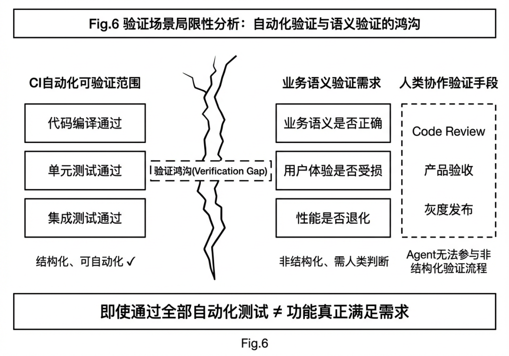

## 五、Aone 在面向 Agent 的研发模式升级上的探索

我们做了一些探索，希望将人和人协作，人和Agent，Agent和Agent的协作放到一个平面上，同时有一个端到端的 Loop 能推进需求到应用交付的完整链路。

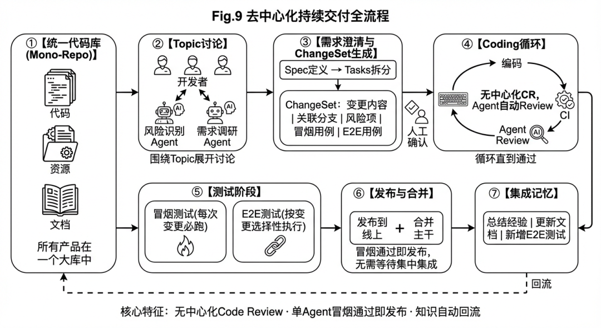

### 5.1 研发模式的变化

在传统研发模式下，大家习惯将 Coding、CI、CR 和 CD 等阶段割裂来看，各自建设成独立的系统，阶段之间依赖大量的人工协同与流转。而在新的产品和设计理念下，我们尝试将许多过程合并为一个连续的阶段——例如在 Coding 阶段就同步完成 Code Review，在 Coding 阶段就同步完成 CI 检查，从而彻底摒弃中心化的 Code Review 系统，将 Code Review 从传统的"以人为主导"的模式，转变为"以 Agent 为主导"的模式。

需求不再按照过去那种前端和后端的分工来推动，而是按照端到端的业务场景来组织交付。一个需求从提出到上线，由一个或一组 Agent 协同完成全栈实现——Agent 理解业务意图后，自主拆解任务、生成代码、发起自检与验证，必要时再交由人类进行最终确认。研发协作的基本单元从"人与人之间的分工协同"演变为"人与 Agent、Agent 与 Agent 之间的任务委托与自治执行"。

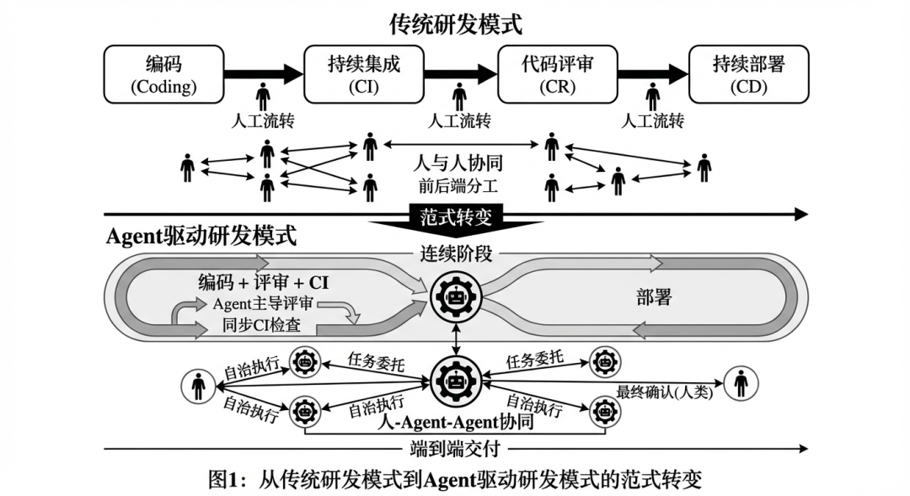

### 5.2 ALL In Code 的版本管理

把面向一整个产品或者整个应用的内容都以大库的形式来保存，例如代码平台设计10+个应用，全部放到一起

  * 前后端代码

  * Agents 需要的 Skills 和工具

  * 文档和操作手册

  * 发布信息

  * handbooks 等

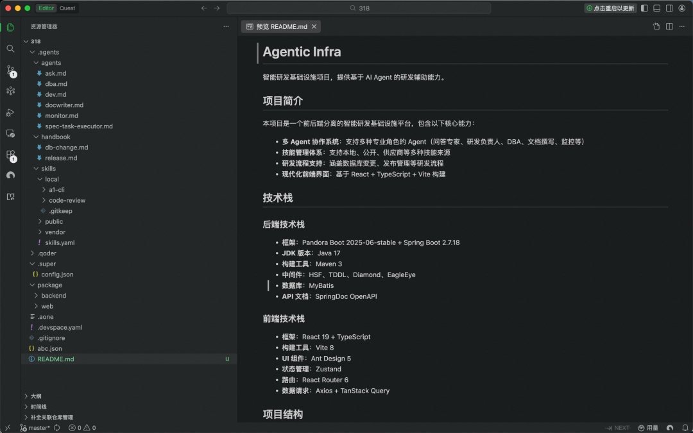

除了这些，我们还可以在代码中增加大量的信息，不仅仅是研发过程的，还可以包括运维态的等信息，这里的哲学是，代码库就是唯一的事实来源，一切需求从代码开始，也在代码中结束，形成闭环。

**5.3 使得多 Agent 能在一起协作的 Agent Teams**

探索一种新的，人和人，人和Agent协作的模式，使得人和异构的Agent能始终在一个上下文中讨论，需求在哪里，讨论就在哪里，讨论在哪里，上下文就在哪里。

  * 可以把多个Agent组成一个Teams 进行，他可以at一个前端Agent写前端

  * Agent 在这个平面中使得人可以操作一个Agent军团

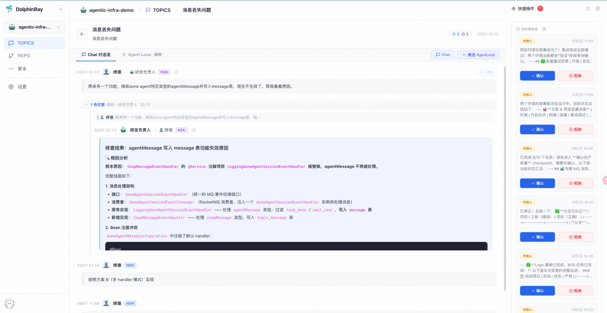

这需要建设一种能力，使得能任意的将长程的 Agent 组装在一起成为一个Teams，使得Teams中的各个Agent 能相互协作和甚至通信，这部分能力也在建设中，预计会尽快开源。

### 5.4 面向产品和应用建设长生命周期的 Claw 模式

将 Agent 视为公民，如同团队中的一名正式员工——不仅可以将任务主动交给他，也可以让他被动地承担一部分日常工作。他具备应用本身的记忆与开发运维资源，既能被动接受指令执行任务，也能以"管家"的身份主动巡检、发现问题并采取行动。

主动巡检与优化

  * 线上报警自动排查：接收报警信号 → 自动定位根因 → 生成排查报告 → 建议修复方案

  * 资源利用率优化：持续监控资源水位 → 识别浪费与瓶颈 → 生成优化建议

代码健康度维护

  * 技术债务追踪：定期扫描代码库 → 识别技术债务 → 生成债务报告 → 建议处理优先级

  * 死代码清理：识别未使用的代码 → 生成清理报告 → 自动删除

  * 依赖升级建议：监控依赖版本 → 发现安全漏洞或新版本 → 生成升级建议与影响分析

文档与知识自动维护

  * 文档自动更新：代码变更后 → 自动更新相关文档（API 文档、注释等）

  * API 文档同步：接口变更后 → 自动更新 API 文档和调用示例

  * 变更日志生成：根据提交记录 → 自动生成 Changelog

信息整理与归档

  * 知识沉淀：定期整理聊天记录、会议纪要 → 生成结构化的知识库条目

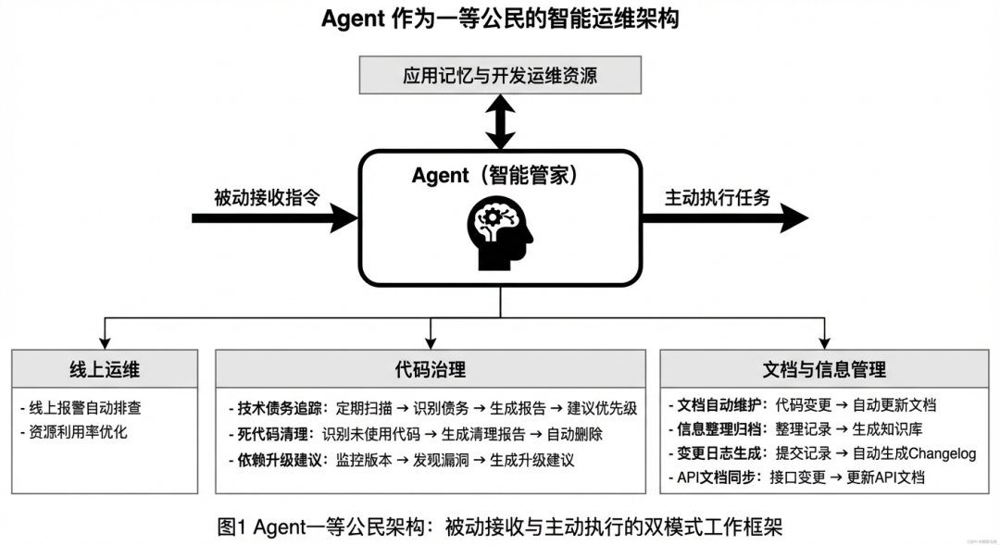

### 5.5 Agent 端到端的任务执行以及和人的协作关系

有些场景需要和人协同工作，比如需要人确认申请资源，需要人确认推进流程等，让人能看到进展，在需要的时候“点击确认”推进流程。

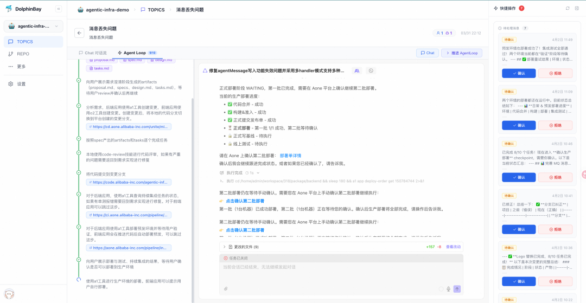

### 5.6 仿真验证环境建设

我们定义了一套语义，使 Agent 能够轻松地部署和测试应用，并在此基础上做了一些探索：

  * 主动卸掉历史包袱：在前后端联调场景中，尝试放弃一些传统依赖，如前端打包流程、配置中心等，以降低环境搭建的复杂度

  * Sandbox 中原地构建与启动：在 Sandbox 容器中直接构建服务端、启动服务端、构建前端，实现原地运行，从而摆脱对外部构建系统和制品仓库的依赖

  * Agent 驱动的 E2E 测试：在容器中直接让 Agent 进行端到端测试——Agent 自主打开浏览器、加载页面、执行交互验证，完成全链路测试闭环

  * 智能生成测试用例：根据本次需求描述、讨论上下文以及生成的代码 Diff 信息，自动生成所需的 E2E 测试或冒烟测试用例

### 5.7 针对 Agent 的身份权限的建设

当我们把一个任务委托给一个 Agent 来执行的时候，必然需要明确几个关键问题：这个 Agent 由谁负责、谁持有这个 Agent、这个 Agent 具备什么权限。而 Agentic IAM 正是面向 AI Agent 的完整身份与访问管理体系。它与传统 IAM 的核心差异在于：主体从"人"变成了"自主执行的软件实体"，由此带来的不是局部改造，而是对 IAM 每一个链路域的重新设计。

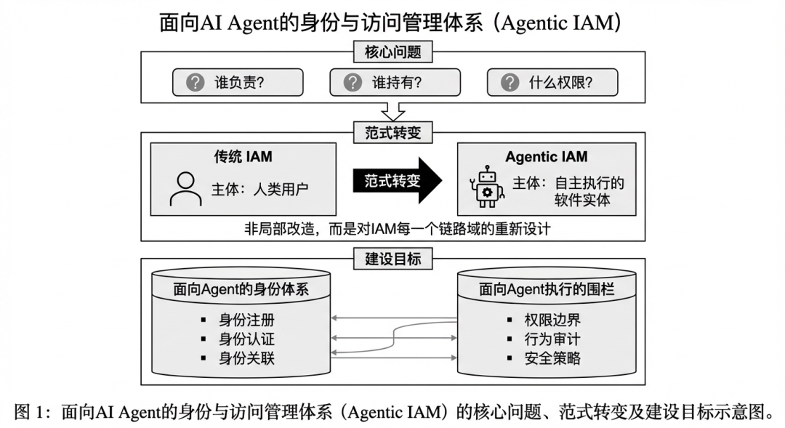

### 5.8 代码的合并模式是什么

在 Agent 成为主要代码生产者的研发模式下，设计一套完整的代码合并机制，使得多个 Agent 任务可以高效并行执行，安全合入主干，且主干始终保持可部署状态。采用 短生命周期分支 + 合并队列 + 分级质量门禁 的组合策略。每个 Agent 任务在独立分支上执行，完成后进入一个串行化的合并队列，先完成的先合并。合并前必须通过对应级别的质量门禁，合并过程中自动处理 rebase 和简单冲突，无法自动处理的冲突退出队列等待人工介入。

### 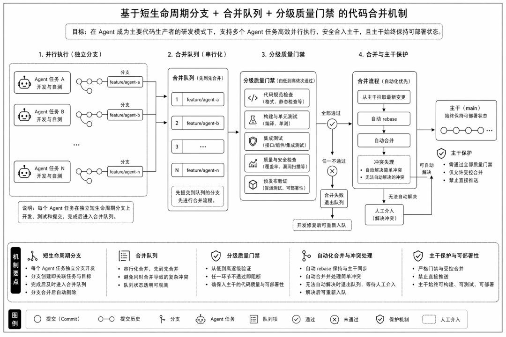

### 5.9 ChangeSet 的引入

将所有前端、后端代码都放在同一个代码库之后，虽然解决了 Agent 信息可得性的问题，但每次变更和发布所涉及的范围并不相同——有时只是换个 Logo，有时则需要改动更为复杂的前后端逻辑。有的变更需要做完整的端到端测试，有的变更只涉及 UI 调整，完全不触及主流程。正因为每次变更的复杂度参差不齐，传统的 Aone 变更或 O2 变更已经不足以记录更原始的变化信息。例如：这次变更修改了哪些文件、引入了哪些 Commit、需要执行什么 E2E 测试、当前变更处于什么状态……这些信息在传统模式下都缺乏系统化的承载方式。基于此，我们引入了 ChangeSet 的理念

设想以下几种场景：

  * 某次变更发布很久之后，想回溯当时到底做了什么，需要查看存档。

  * 并非每个需求、每次发布所需检查的内容都一样。发布必定是有先后顺序的，每次发布要做的测试也未必相同。

  * 本次发布需要关注什么，存在哪些风险。

  * 如果系统出了问题，应该回滚哪些 Commit。

用分支或 Topic 来表达"变更"都不够合理。分支与 Git 强绑定，表达能力有限，而且分支本身是动态变化的；Topic 则与平台强绑定，表达能力同样受限。两者都无法完整承载一次变更从发起到发布的全部上下文。

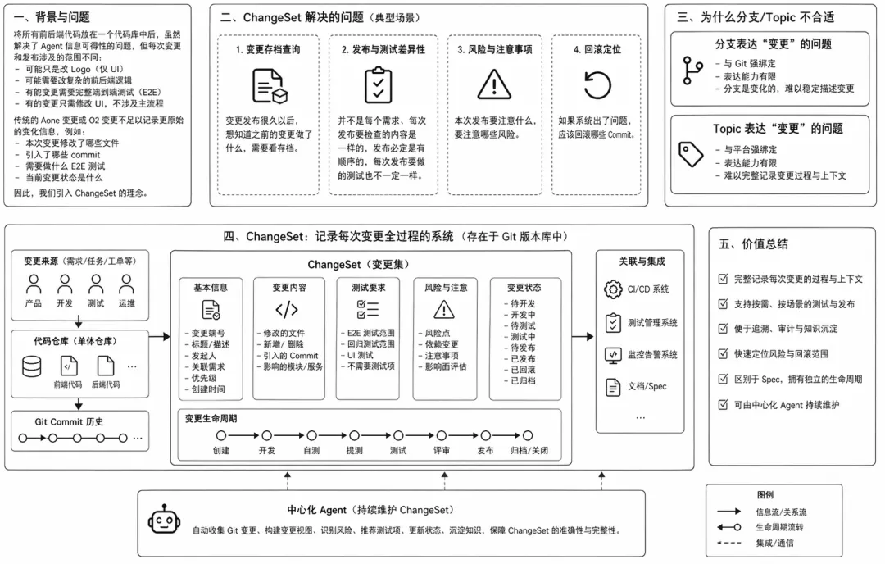

所以如果有一个存在git版本库中的，把每次变更的过程都记录下来的系统，这些问题才能得以解决。区别于Spec 文档，我们可以给ChangeSet设置不同的生命周期。而且可以开发一个中心化的Agent 来持续维护这个ChangeSet。

## 六、结语

就在 2023 年的这个时候，我们启动了 AoneCopilot 项目。那时，我们还在遥想软件研发的终局会是什么模样：一句话完成一个需求的时代，究竟是悬在天边的幻想，还是终将照进现实的微光。没想到，不过短短三年，那曾经遥不可及的未来，竟已近在咫尺；时间仿佛只翻过了几页日历，却又像悄然跨越了一个世纪。

作者介绍

向邦宇，在阿里工作超过10年，负责了阿里巴巴代码平台，在阿里内部建设了多个 AI Coding 工具，这些产品在阿里内部被广泛使用，同时也面向业界主导开发了一站式的，小白用户也能用 AI Development产品“搭叩”。
