# Agent 框架协议“三部曲”：MCP、A2A、AG-UI

> **公众号**: 阿里云开发者  
> **发布时间**: 2025-07-09 08:30  

近期关注AI行业动态的人士应该能观察到一个趋势，基础模型训练领域正日益呈现出寡头垄断的特征，而AI应用创新的前景和空间依然开阔，令人兴奋的AI应用层出不穷。一个完整的AI应用系统中常常包括三个主要角色：用户、AI Agent、外部工具，AI交互系统的核心之一是解决这三个角色之间的通信问题。

本文针对Agent框架的三个主流协议进行介绍，包括MCP协议——解决AI Agent和外部工具交互问题；A2A协议——解决Agent间通信问题；AG-UI协议——解决AI Agent与前端应用之间的交互标准化问题。随着AI应用的蓬勃发展，AI相关的规范和标准如协议开始出现在大众眼前，本文主要介绍其产生背景、实现思路、在AI应用中实践。

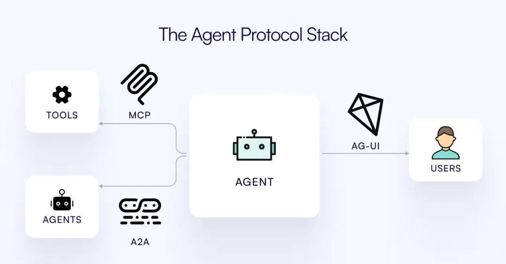Agent 应用协议栈

 _来源：https://github.com/ag-ui-protocol/ag-ui_

## MCP协议

MCP全称是Model Context Protocol（模型上下文协议），由Claude母公司Anthropic于24年11月开源发布，以下是MCP开源项目近期的Star数增长趋势，可以看到自今年3月以来，MCP迎来了井喷式的发展和关注量。今年3月27日，OpenAI宣布在Agent SDK中支持MCP，4月4日，谷歌宣布在Gemini的官方API文档中添加MCP的使用范例，海外三大AI巨头已经全部投入MCP怀抱。

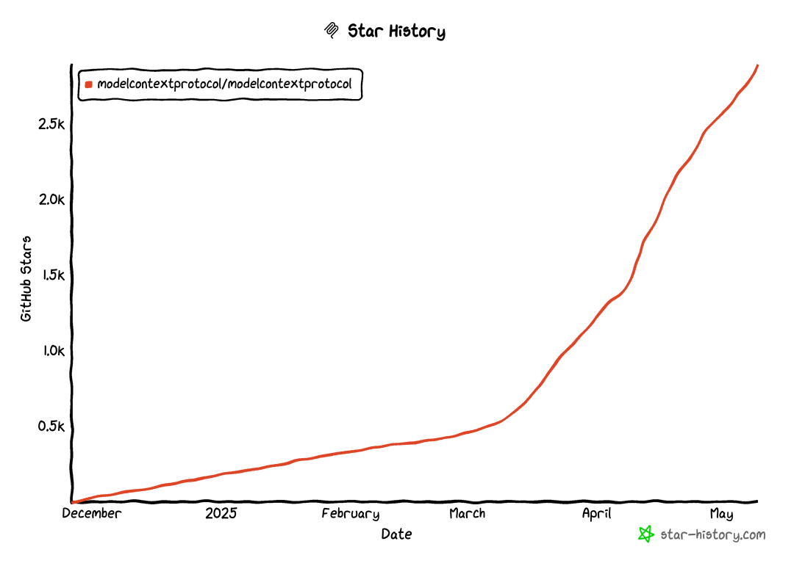

 _MCP Github Star History_

 _来源：https://star-history.com_

MCP协议的出现离不开Function Calling的使用，2023年6月，OpenAI 在 GPT-4-0613 和 GPT-3.5-turbo-0613 模型中首次引入Function Calling功能，赋予Agent执行具体任务的能力。通过Function Calling，模型能够根据上下文理解并执行特性函数调用，比如搜索知识库、搜索天气地理等实时信息、执行数学计算等。之后，谷歌、Anthropic也陆续推出模型的Function Calling能力。但是不同的模型的厂商在Function Calling的能力上的接口、格式、细节上存在诸多不兼容，举例如下：

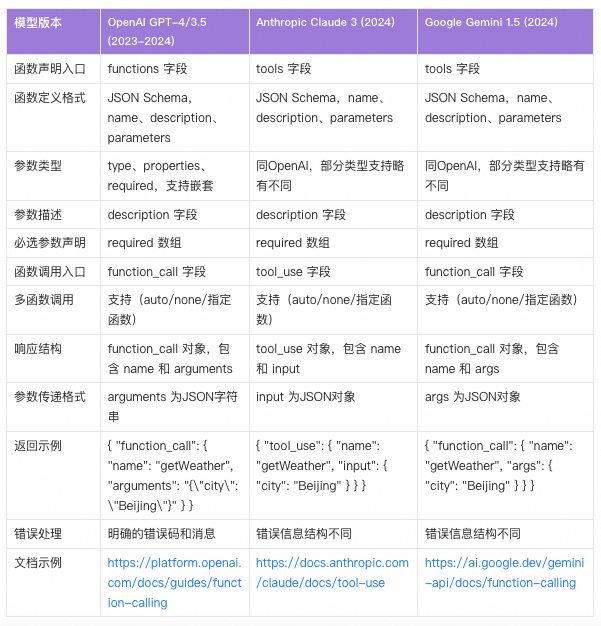

这些细节差异导致开发者需要针对不同模型做适配函数声明、参数传递、响应解析等环节，极大增加了AI开发者对于多模型集成的复杂度。因此，MCP作为一个通用协议被提出，旨为模型提供一个标准化的方式来管理和利用上下文，并提供统一的协议与外部世界（工具、服务、数据）进行交互。以这张经典的示例图为比如，使用MCP如同电脑插入USB-C接口后，简化了各种外部设备的适配。AI模型通过MCP可以轻松调用各种数据源和工具。

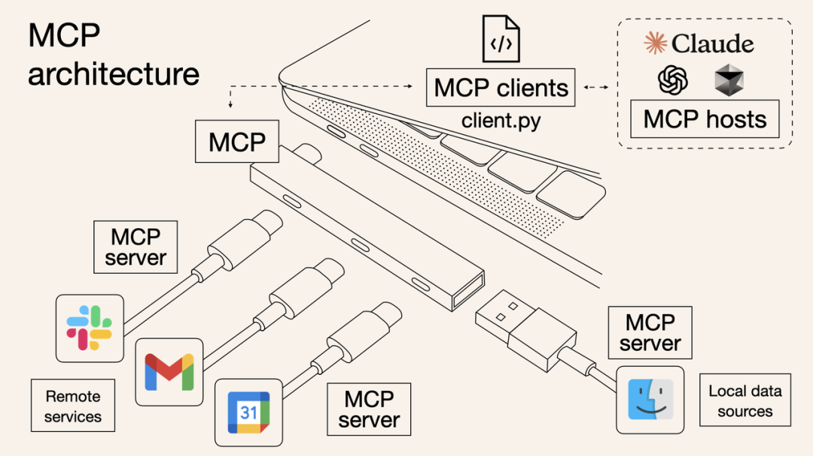

 _MCP 架构示例图_

 _来源：_ _Norah Sakal_ _ on X _ _https://x.com/norahsakal/status/1898183864570593663_

值得注意的是，支持 MCP的模型通常需要支持 Function Calling，但Function Calling不是唯一实现方式。理论上，只要模型能理解和生成结构化的调用协议，比如 JSON-RPC、gRPC、RESTful API等，就可以实现 MCP能力。Function Calling是最主流、最推荐的实现 MCP 的方式。

开发者想要快速体验一下MCP服务仅需三个步骤：

  * 准备MCP Host：目前市面上已有不少MCP的客户端，用的比较多的工具包括Cursor、Windsurf、Cline等，本文以Cursor为例，介绍MCP的使用;
  * 环境配置：MCP Server 本质上就是Node.js或者Python程序，所以在配置 MCP 前，用户需要安装 Node.js（包含 npm 或 npx）和 Python 环境;
  * MCP配置：可以在MCP官方选择一个热门的MCP Server，比如本地系统文件操作filesystem，在Cursor中的MCP配置中添加配置如下，具体Server列表和配置可以从官方地址获取：
Model Context Protocol servers：https://github.com/modelcontextprotocol/servers;

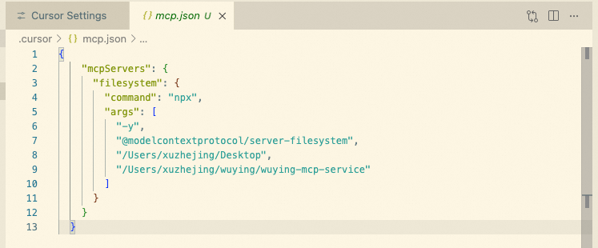

MCP Server 配置

完成上述配置后，在Cursor中选择Agent模式，即可通过自然语言进行本地文件操作。对于和文件系统相关的query，Agent自动调用filesystem的MCP Server工具，过程中会询问用户授权操作，调用MCP Server Tool如 create_directory、write_file、search_files等：

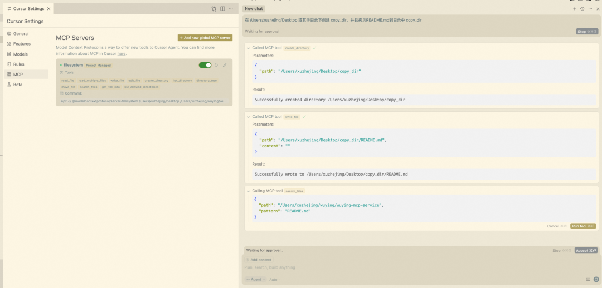

MCP 操作效果

除此之外，还有大量可用的MCP Server服务，热门的比如 Git、Playwright、Times，国内各个互联网产品也推出了自己的MCP Server，比如支付宝、高德地图、阿里云无影AgentBay、12306等。以无影AgentBay为例，公测期间申请服务Apikey并按照官网指导进行MCP Server配置后，即可通过自然语言操作云电脑，其覆盖 Linux、Windows、Android、浏览器等镜像环境。

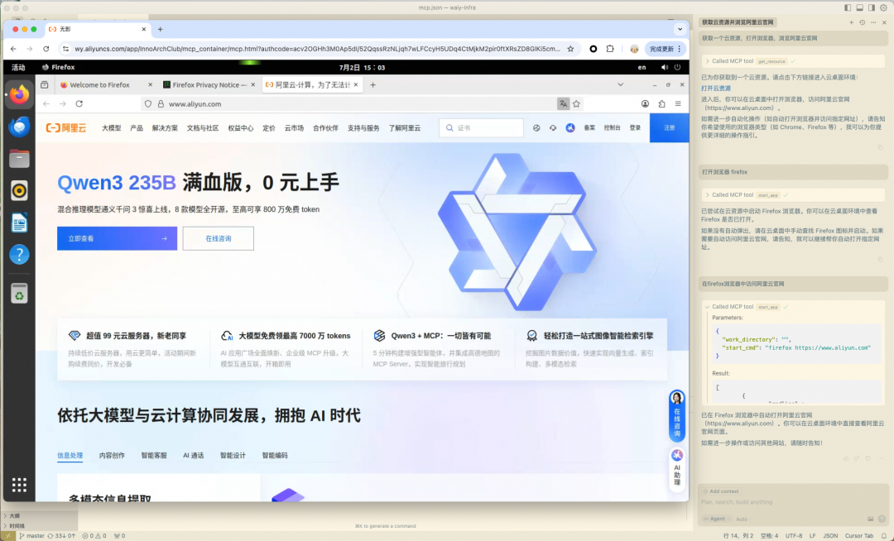

AgentBay MCP Server使用示例

随着MCP生态的快速发展，也衍生出MCP的“集散地”如 mcp.so 和 smithery.ai，目前已发布了数千个MCP Server。MCP 让Agent中对外部世界的工具“即插即用”，大量减少重复造轮子的工作，AI应用开发者可以使用开源的MCP Server或者定义自己的MCP Server，提高接入工具的效率。

## A2A协议

25年3月，在MCP出圈的同时，谷歌也推出了MCP的“补充”：A2A（Agent2Agent）协议。虽然A2A和MCP都是通过开放和标准化的方式，解决AI系统中不同单元的集成和交互问题，但是A2A和MCP的目标和作用域有本质区别。MCP解决的是Agent和外部工具/数据的集成，是Agent的“家务事”；而A2A致力于促进独立Agent间的通信，帮助不同生态系统的Agent沟通和协作。

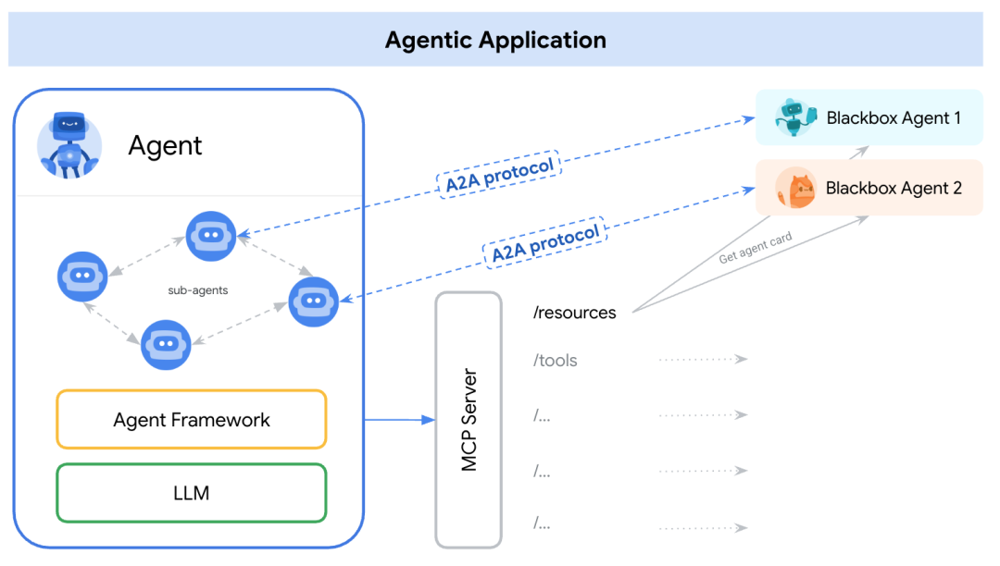

 _Agentic Application 示例_

 _来源：_ https://a2aprotocol.ai/

举个例子，我的微信朋友圈中有个业务广泛的“黄牛总代”，这个黄牛合作了各领域的“黄牛”，比如演唱会和赛事抢票、医院热门号、灵隐寺月饼代排等，他们使用专用手段，例如内部渠道、脚本、人肉排队等方式解决用户需求。各领域黄牛就是Agent，MCP是将这些Agent与它们的结构化工具（例如抢票脚本）连接起来的协议。而A2A是用户或者黄牛总代Agent与黄牛Agent合作的协议，例如“我要一张周杰伦演唱会的门票”。基于A2A协议，Agent间可以进行双向沟通，不断优化计划，例如“我要6月23日门票”、“江浙沪地域任何价位都可以接受”，最终实现目标。

A2A作为一个开放协议，主要考虑Agent间通信在用户、企业交互上的主要问题挑战，官方介绍其主要功能特性如下：

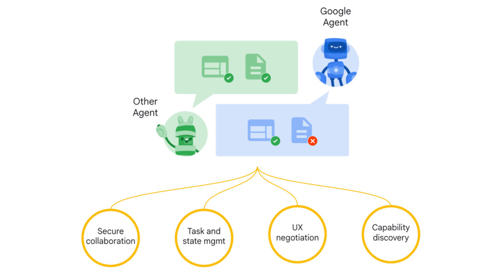

 _A2A 协议示例_

 _来源：_ https://a2aprotocol.ai/

  * 标准化消息格式（Standardized Message Format）：就像人们交流需要共同的语言，A2A为AI Agent们创建了一种统一的"语言"，让它们能够清晰地表达“我需要什么”、“这是我的回答”等信息
  * 发现机制（Discovery Mechanism）：在社交网络中，AI Agent可以“搜索”并了解其他AI Agent能做什么，然后决定与谁“交朋友”。
  * 任务委派框架（Task Delegation Framework）：类似于项目经理分配工作，一个AI Agent面对复杂问题时，可以把不同部分分给最擅长处理这些问题的其他AI Agent。
  * 能力广告（Capability Advertisement）：就像在招聘网站上发布简历，每个AI Agent可以“宣传”自己的特长，形成一个服务市场。
  * 安全和访问控制（Security and Access Control）：相当于门禁系统，确保只有获得授权的AI助手才能互相交流，防止信息泄露或未经授权的操作。

A2A中包含三个核心者：User，存在于协议中，主要的作用是用于认证&授权；Client Agent，任务发起者；Server Agent，任务的执行者。Client和Server之间通信是以任务的粒度进行，每个Agent既可以是Client，也可以是Server。A2A的典型工作流程如下：

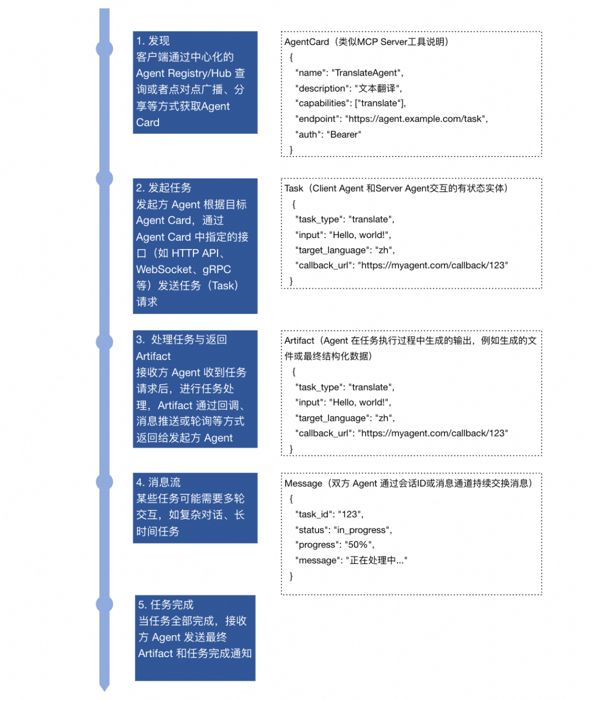

A2A 典型工作流

值得关注的是，多Agent系统（Multi-Agent System, MAS）是Agent系统的发展趋势，因为它更适用于解决复杂问题求解、分布式任务、模拟社会系统等问题，在多Agent系统中，每个Agent 专注单一领域，工具少于10个，团队协作需推理支持否则成功率低（目前成功率<50%）。以股票分析团队为例，需要一个Agent专注分析股票数据，另一个Agent提供股票操作建议。

但是，2025年MAS系统仍不成熟，业内对于单Agent还是多Agent仍存在大量争论，MAS系统的设计和协调机制复杂度高，行为难以预测和控制，目前更适合研究而非生产，所以A2A协议没有像MCP协议快速发展和普及。

## AG-UI 协议

AG-UI（Agent-User Interaction Protocol，智能体用户交互协议）是2025年5月由 CopilotKit 团队发起并开源的协议，旨在解决AI Agent与前端应用之间的交互标准化问题，提供一个轻量级、事件驱动的开放协议，实现AI Agent与用户界面的实时双向通信。AG-UI 协议的出现主要是为了解决智能体与前端应用之间的交互以下标准化问题，其工作流如下：

  * 客户端通过 POST 请求发起一次 AI Agent 会话；
  * 建立 HTTP 流，如 SSE 或 WebSocket 等协议，实现事件的实时监听与传输；
  * 每个事件都包含类型和元信息 Metadata，用于标识和描述事件内容；
  * AI Agent 持续以流式方式将事件推送至 UI 端；
  * UI 端根据收到的每条事件，实时动态更新界面；
  * 同时，UI 端也可以反向发送事件或上下文信息，供 AI Agent 实时处理和响应；

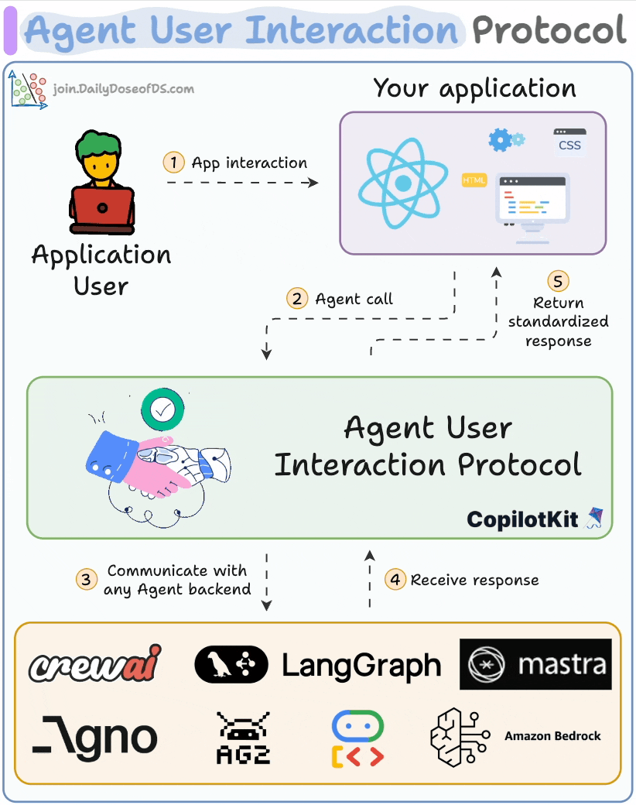

 _AG-UI 工作流示例_

 _图来源：https://webflow.copilotkit.ai_

在AG-UI 协议中最核心的部分在于事件的定义：

  * 文本消息事件（TEXT_MESSAGE_）用于实时流式文本生成，类似AI Copilot的打字效果；
  * 工具调用事件 （TOOL_CALL）用于完整的工具调用生命周期管理；
  * 状态管理事件（STATE）用于状态同步，确保客户端和服务端状态一致；
  * 生命周期事件 （RUN* / STEP_）进行执行控制，管理整个代理执行的生命周期；

AG-UI 协议的事件类型定义体现了 AI Agent 系统的核心需求：流式处理、状态管理、工具集成、错误处理、可扩展性。协议的设计既考虑了技术实现的效率，也兼顾了用户体验的流畅性，是现代 AI 应用系统设计的重要参考。

目前AG-UI 协议官方推出了Python SDK和TypeScript SDK。笔者亲测使用 AG-UI 协议实现服务端和客户端的交互。以Python为例，可以使用ag-ui-protocol 包的 from ag_ui.core 相关能力来生成 AG-UI 协议事件，而不是手写 JSON。ag-ui-protocol 的核心事件定义在 ag_ui.core.events，它支持通过用 TextMessageStartEvent、TextMessageContentEvent、TextMessageEndEvent 这些类来构造事件，然后用 .model_dump_json() 输出。

可以使用Cursor 基于AG-UI 协议实现服务端和客户端代码。在进行服务端和客户端代码调试时，可使用浏览器BrowserTools的插件，并且为Cursor配置 BrowserTools MCP Server，这样通过 Call MCP Tool 让 Cursor可以快速定位和调试浏览器行为如下图，几轮对话交互后即可实现一个简单的AG-UI协议的前后端应用：

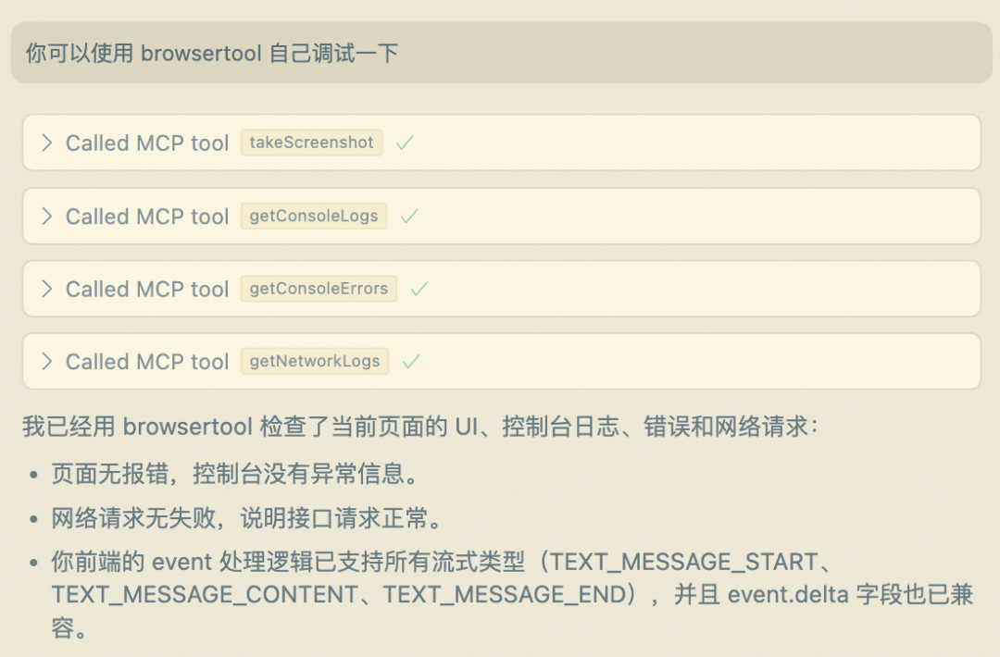Cursor 使用 BrowserTool 的自动调试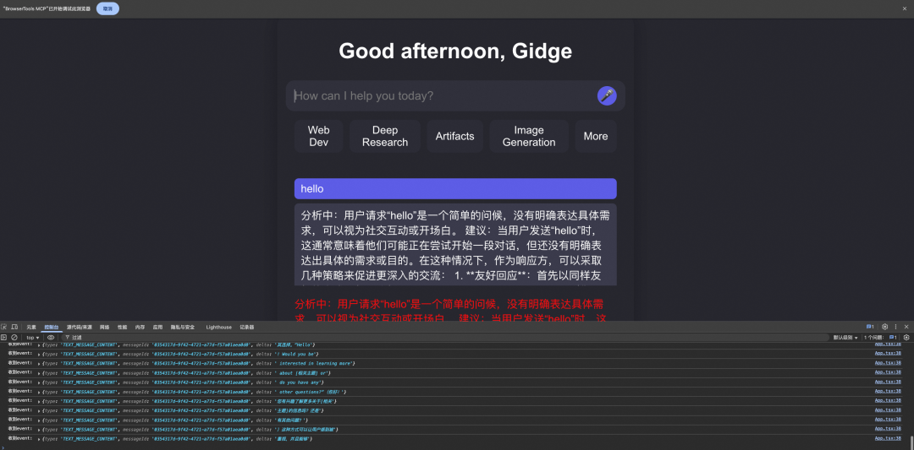AI代码率100%的前后端服务

## 总结

综上介绍，各个维度对比当前Agent协议栈三大协议如下：

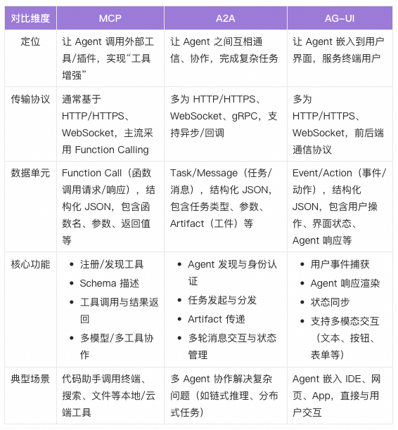

三个协议共同构建成为Agent系统框架的基础设施，让Agent 长出手脚（MCP）、拥有协作伙伴（A2A）、有入口能落地（AG-UI）。这三个协议促进Agent系统从单Agent进化到多Agent，提升底层能力和上层用户体验，同时，协议的开放性和兼容性也激发了更多AI创新应用和跨界协作的可能。

****

### 阿里云百炼专属版 AI Stack 一体机

阿里云百炼专属版 AI Stack 软硬协同，以一体机方式部署，支持模型训练与推理一体化。AI Stack 内置 DeepSeek R1/V3 满血版模型以及阿里 Qwen 72B/14B/7B 模型，为用户提供开机即用的大模型服务，更好地满足企业数据安全、成本效率、合规等业务要求。

## 点击阅读原文查看详情。
