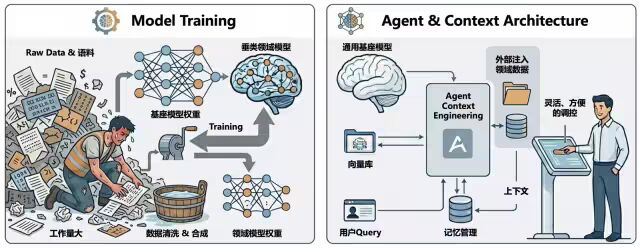
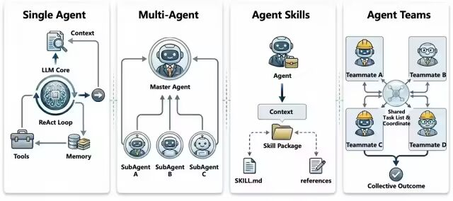
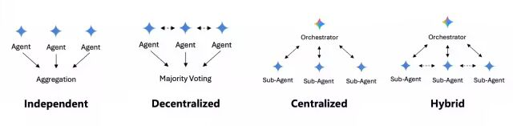
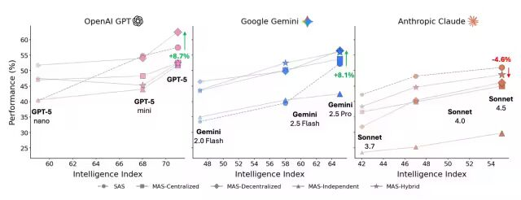
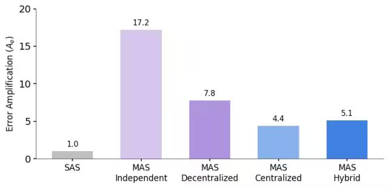
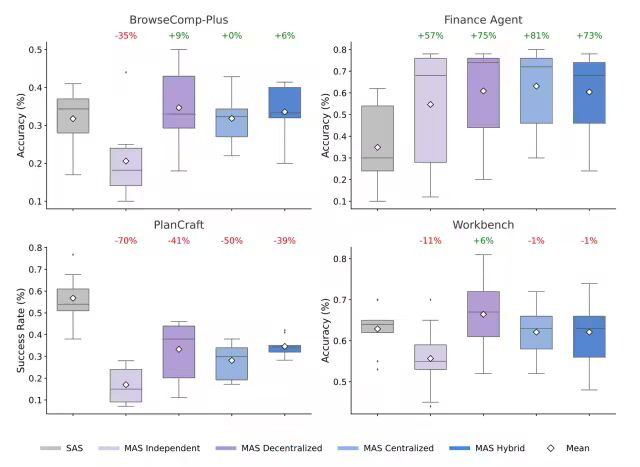
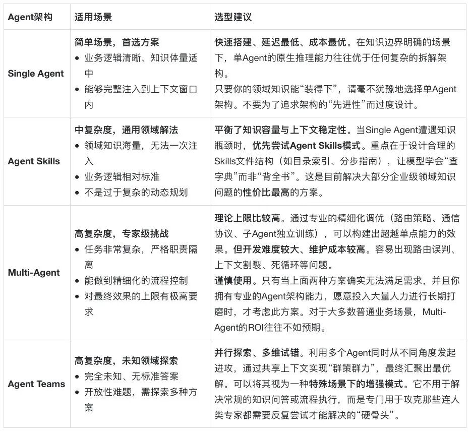

# Agent/Skills/Teams 架构演进过程及技术选型之道

> **公众号**: 阿里云开发者  
> **发布时间**: 2026-03-17 08:30  

## 背景

近几年，我一直从事于Agent领域的探索、应用与实践，也陆续沉淀了许多相关的技术文章，相信不少朋友都读过我之前那篇《[如何构建和调优高可用性的Agent？浅谈阿里云服务领域Agent构建的方法论](<https://mp.weixin.qq.com/s?__biz=MzIzOTU0NTQ0MA==&mid=2247550566&idx=1&sn=f4dedfb7bb47e02aa3b6e3478cc40d73&scene=21#wechat_redirect>)》。在那篇文章中，我们从Agent的概念起源聊到落地挑战，再到具体的解决方案，进行了一次较为系统的梳理。后来随着上下文工程、Multi-Agent、Agent Skills等技术的不断发展，我又通过《[如何让Agent更符合预期？基于上下文工程和多智能体构建云小二Aivis的十大实战经验](<https://mp.weixin.qq.com/s?__biz=MzIzOTU0NTQ0MA==&mid=2247554851&idx=1&sn=00e4cea8a7d444e07378e2143a3359b3&scene=21#wechat_redirect>)》
等文章详细介绍了我们在多个Agent技术细节上的一些落地实践经验。

从生成式LLM爆发的变革到催生Agent的快速发展，AI发展的浪潮从未停歇。随着近半年来，Anthropic在Claude Code上前后实践和推出了Agent Skills、Agent Teams等新技术范式，Agent的构建逻辑与能力边界正在被重新定义。站在当前这个时间节点，当我们再次探讨“如何构建一个优秀的 Agent”以及“如何进行技术架构选型”时，原有的视角或许已不足以应对各种场景及的变化。

我认为，在深入讨论具体的技术选型之前，首要任务是理清Agent的演化路径。这条路径其实整体上是清晰且可循的：从最初的单点提示词调用、工作流编排，再到多智能体协同、自主规划，到后来Agent Skills的可复用能力、Agent Teams的并行探索。只有理解了这一演化脉络，我们才能在面对复杂场景时，做出更精准的技术选型。

因此，本文将会根据我本身的实践经验，以及结合下面的几篇文章，重新整理并分享关于Agent、Multi-Agent，包括Agent Skills、Agent Teams的架构演进与选型的思考：

  * 《Towards a Science of Scaling Agent Systems》 By Google Deepmind[1]

  * 《The Complete Guide to Building Skills for Claude》 By Anthropic[2]

  * 《Orchestrate Teams of Claude Code Sessions》 By Anthropic[3]

## Agent架构的演化本质

为什么市面上会出现如此纷繁复杂的Agent架构？追根溯源，这并不是纯粹是为了炫技，而是对大模型底层能力缺失的一种补偿机制。本质上，Agent架构的演化史，就是因为我们在基础大模型无法完美内化“领域知识”和高效复用“长期记忆”的背景下，不断尝试“外挂”出这些能力的。本质上就是大家对大模型如何更好的注入领域知识和记忆管理这两方面的需求，不断促进了Agent架构的演化。

不妨畅享一下，假设某一天，我们已经实现了这样的效果：LLM基座模型天生就具备完美的领域知识注入和自主记忆的能力，只要我们将海量的行业文档、业务规则直接“喂”给模型，它就能瞬间记住并精准执行任务，那么今天我们所讨论的各种RAG、Multi-Agent、Workflow、Skills等架构模式可能都将失去存在的意义。因为大模型本身已经从根源上解决了“学什么”和“记什么”的问题。

然而，现实是骨感的。回想2023~2024年，在大模型发展的早期，业界普遍认为解决领域垂类知识注入问题的最优解是模型训练。这套从BERT时代就发展过来的“预训练-微调”范式一直走到了LLM时代，我们将基础模型作为底座，通过SFT、DPO等模型微调，再加上RLHF、GRPO等强化学习方式，试图将领域知识“刻录”进模型的参数中。在那个阶段，我们也基于Qwen早期版本作为基座模型进行了很多轮次的、深入的模型训练、微调实践。

但是，随着训练过程的深入，几个难以回避的痛点逐渐浮出水面：

  * 训练成本高昂且周期长：每一次针对垂直领域的训练，都需要投入巨大的人力物力去清洗数据、构造合成数据、设计评测集。这不仅需要昂贵的GPU算力资源，更伴随着漫长的训练时间周期。

  * 效果评测与泛化难题：训练完成后，如何科学地证明新模型相比基座模型有显著提升，同时又没有丧失通用的泛化能力，是一个巨大的挑战。很多时候，我们在提升特定任务表现的同时，却意外导致了模型在其他场景下的“灾难性遗忘”，这就导致模型在垂类某些特定任务上相对有效，但在其他任务上却很容易失去泛化效果。

  * 基座迭代速度远超训练周期：这是最致命的一点。开源或闭源的基座正以非线性的速度飞速迭代。往往当我们耗费数月心血、投入大量资源训练出一个专属领域模型时，新一代的基座模型已经发布，其原生能力可能已经轻松超越了我们辛苦训练的旧版本模型。这种“刚毕业就失业”的窘境，使得单纯依赖训练来构建领域模型变得极不划算。

除了成本与时效性问题，硬件门槛和模型生态的变化也加速了这一转变。随着Scaling Law的生效，顶尖模型的参数量日益庞大，传统的单机甚至小规模集群已难以承担训练任务。更重要的是，目前最强有力的模型多为闭源状态。即便我们使用开源的顶尖模型作为基础进行训练，其最终效果往往也难以匹敌闭源巨头的最新基座模型。在这种“投入产出比”严重失衡的背景下，继续死磕模型训练显然不再是明智之选。

这就说明，现阶段的LLM在特定领域的知识内化和长周期记忆管理上仍存在显著的挑战。既然“向内”修改模型参数的路走不通，或者性价比太低，我们自然开始转向“向外”寻求解决方案：如何在不改变模型权重的前提下，通过架构设计更高效地注入领域知识？

这正是Agent架构演化的逻辑起点，我们不得不在大模型外围构建层层叠叠的结构与工具，通过“工程化”的手段来辅助其完成知识的检索、上下文的组装以及记忆的维护。这也正是当前各类Agent架构百花齐放的最本质的原因。我们不再执着于让模型“记住”所有知识，而是转而设计一套机制，让模型能够“找到”并“理解”所需的知识。基于这一思路，Agent 架构的演化逐渐分化出了四条最主要的路径：“Single Agent → Multi-Agent → Agent Skills → Agent Teams”。

## Single Agent：知识注入与上下文窗口博弈

在探索 Agent 落地的过程中，我们最先尝试的往往是Single Agent架构（单智能体）。其核心逻辑非常直观：既然大模型无法直接内化我们特定的领域知识，那我们就通过System Prompt的方式，将这些知识“无脑”地注入到大模型的上下文中，期望它能基于这些注入的信息生成符合预期的答案。

这种做法最大的优势在于实现成本极低、开发效率极高。你只需要将领域知识整理好，配合清晰的指令写入系统级指令的System Prompt中，再使用基础模型原生的ReAct模式自主调用工具、记录上下文并解决问题。对于生成简单的代码段、写文案、执行某类标准化输出等场景，这种串行调用的单Agent模式往往能跑出最流畅的体验，是验证想法、ROI最高的原型方案。

然而，随着实践的深入，我们发现这种看似简单的架构隐藏着一个致命的瓶颈：Context Window会爆炸。

尽管当前主流大模型纷纷宣称支持百万甚至千万级的Token上下文长度，但在实际生产环境中，如果你真的将海量背景知识或长文档直接“扔”给模型，效果往往不尽如人意。这背后涉及到一个容易被忽视的技术真相：长上下文并不等于长记忆。当输入数据量达到一定阈值时，模型极易出现“Lost in the Middle”问题，也就是“注意力缺失”或者“关键信息遗忘”的现象，导致其无法精准定位到所需的领域知识，最终输出的结果偏离预期。

在这里，我们需要明确一下讨论的范畴。本文所指的Single Agent，主要指的是“狭义的”基于ReAct的自主Agent概念，使用System Prompt驱动、串行调用工具的原生Agent运行模式。至于那些结构复杂、包含多分支判断的Workflow，我们更倾向于将其视为一种高级的工具Tool或者Sub-Agent，而非单纯的Single Agent形态，因此就不在本章节重点展开了。

总结来说，单Agent优势和劣势非常明显：

  * 优势：最原生的架构、开发链路最短、运行效率极高，适合快速构建Demo或处理知识依赖较少的场景。

  * 劣势：极度依赖上下文窗口的质量与长度。一旦涉及大量领域知识的注入，极易引发上下文爆炸，导致模型注意力分散，稳定性大幅下降。

这也引出了我们后续需要思考的关键问题：当单点突破遇到上下文瓶颈时，我们该如何通过架构演进，在保持灵活性的同时解决知识承载的问题？

面对这一困境，行业普遍采用的解决方案是引入 RAG（检索增强生成）。

RAG 可以看作是在Single Agent基础上的一次重要演进。它的核心逻辑是“先搜后答”：在将知识注入大模型之前，先利用搜索工具进行一轮召回（Recall），仅将与用户问题相关度最高的那部分片段提取出来，作为上下文提供给 Agent。

这在一定程度上巧妙规避了 Context Window 的长度限制，让 Agent 能够“按需获取”知识，而非“全量吞咽”。然而，RAG架构的效果存在一个致命的依赖链——“垃圾进，垃圾出”（Garbage In, Garbage Out）。Agent 的最终表现高度依赖于前置搜索环节的准确率。如果检索阶段未能召回正确的知识片段，无论后端的大模型能力多强，都无法生成正确的答案。

这里存在一个显著的能力断层，就是RAG的前置检索过程，通常依赖于关键词匹配（比如BM25）或基于小参数量的Embedding模型（如BERT、BGE等）。尽管近年来出现了很多基于LLM的Embedding模型，但总体而言，这些专用检索模型的语义理解能力和推理深度，与大模型直接阅读并理解全文的能力相比，仍存在差距。这种“小模型前置辅助大模型”的模式，往往会导致关键信息的漏召或误召，成为制约Agent效果的瓶颈。

基于上述分析，我们可以清晰地界定单Agent的边界。它虽然并不适合所有场景，但在以下条件下，它依然是性价比最高、落地最快的选择：

1.场景复杂度较低：业务逻辑相对简单，不需要复杂的多步推理或长链条规划。

2.知识体量可控：领域知识总量适中，或者经过清洗后，核心指令和背景知识在2万个Token以内能表述清楚，可以直接通过System Prompt注入。

3.检索质量有保障：当必须使用RAG时，前提是你的知识库结构清晰，且现有的检索算法（关键词或向量）能够达到较高的召回准确率。

简而言之，如果你的需求是“小而美”，或者你的领域知识边界清晰、检索链路成熟，那么单Agent架构完全足以胜任，无需过度设计。但当面对海量非结构化数据、复杂推理需求或对检索准确率极其敏感的场景时，我们就需要跳出单点的思维，探索更复杂的架构演进了。

## Multi-Agent：架构隔离与通信带宽的权衡

面对单Agent在海量知识注入和复杂场景处理上的局限，Multi-Agent架构（多智能体）应运而生。这不仅是Agent数量的堆叠，更是质量的飞跃。以我们阿里云客户服务领域云小二Aivis的实践为例，通过构建 Planner（规划者）、Reasoner（推理者）、Executor（执行者） 等角色协同的架构，我们将复杂的宏观问题拆解为微观的子任务，由不同的Agent各司其职。

Multi-Agent的模式其实有很多种，在Google的论文里，主要列为四种：独立的（Independent）、去中心化（Decentralized）、中心化的（Centralized）、混合模式（Hybrid）。

  * Independent：多个Agent并行处理子任务而不进行沟通，仅在最后汇总结果。

  * Decentralized：一种点对点网状结构，Agent之间直接沟通以共享信息并达成共识。

  * Centralized：一种“中心辐射”模型，由中央Orchestrator将任务分配给工作者并综合他们的输出。

  * Hybrid：结合层级监督和点对点协调，以平衡中央Orchestrator的控制与灵活执行。

前面两种是Agent可以看做只有Sub Agent，后面两种都存在一个中央Orchestrator作为主Agent，这些Agent的核心逻辑在于“路由分发”与“领域隔离”：

  * 主Agent（Orchestrator）：扮演“大脑”角色，仅负责意图识别与任务路由，判断“这个问题该交给谁”，而无需背负所有领域的知识重担。

  * 子Agent（Sub-Agent）：拥有独立的 Identity 空间，内化特定领域的专业知识（如ECS远程诊断、RDS性能优化等）。每个子Agent只需专注于解决某一类垂直场景，其Prompt指令更精简，领域知识更聚焦。

这样，Multi-Agent架构带来了显著的优势：

  * 降低单体复杂度：将庞大的领域知识打散，避免了单个Agent Context Window的爆炸的可能性。

  * 独立调优：各个子Agent可独立迭代。若"ECS远程诊断”效果不佳，仅需针对性优化这一个子Agent的提示词或工具链，而不影响其他模块，极大提升了维护的灵活性。

然而，随着Agent数量的增多，比如我们在某个场景中通过一个Orchestrator来调度上百个Agent，新的瓶颈又随之出现，我们会发现其实Multi-Agent也并不是银弹，它引入了两个新的挑战：

  * 路由准确率压力：当Sub-Agent数量达到几十上百的时候，主Agent面临着巨大的分类决策压力。它需要在极短的上下文中精准判断用户意图并分发给正确的Sub-Agent。一旦主Agent发生错误路由（Misrouting），后续所有Sub-Agent 的努力都将南辕北辙。这种“一着不慎，满盘皆输”的风险，随着节点数量的增加也在不停的累积叠加

  * “局部最优”导致的上下文割裂：这是Multi-Agent架构中最隐蔽也最致命的痛点。由于子Agent往往只关注自身任务的局部最优路径，缺乏对全局上下文和用户完整意图的感知，极易出现以下现象：

  * 重复执行：比如用户询问“ECS远程无法连接”，Agent A诊断出“资源负载高”；用户追问“为何负载高”，Agent B接手后，因不知晓前文已做过负载检测，可能再次执行相同的查询步骤，造成算力浪费和响应延迟

  * 结论冲突：不同Agent基于局部信息得出的结论可能与前文矛盾，导致回答逻辑不自洽，给模型和用户都带来Confuse

Multi-Agent为了解决上下文割裂，是可以考虑让Agent之间共享Context历史的。但在工程实践中，这又会带来一个通信带宽的限制问题：

  * 信息有损压缩：Multi-Agent在通信的过程中，比如主Agent传递给子Agent的往往是经过Summary或 Rewrite后的上下文，而非原始对话流。这种有损传输很可能会导致关键细节的丢失

  * Token爆炸与耗时增长：若为了保证效果，如果强行让模型扩大通信带宽来传递更多上下文，则会迅速引发新的Context Window爆炸，并显著增加LLM的生成时间和整体链路耗时

所以，Multi-Agent架构虽然解决了知识隔离问题，却将复杂度转移到了Agent之间的通信带宽与协同上。如果想要保证Agent效果，就需要投入巨大的人力成本去打磨每一个Agent节点、通信协议、设计精细的摘要策略，以及处理各种边界Case。这就是一个典型的边际效应递减过程：随着Agent数量增加，系统整体的稳定性保障难度呈非线性上升，而效果的提升却越来越依赖繁琐的人工干预。

因此，Multi-Agent也是一把双刃剑：它能通过分工协作突破单点能力的上限，但也引入了复杂的协同损耗。如何在“架构隔离”带来的灵活性与“通信带宽”导致的信息损失之间找到平衡点，就成了构建高质量 Multi-Agent系统的关键所在。这也是为什么构建一个Multi-Agent系统非常困难的原因。

## Agent Skills：可复用与渐进式的能力披露

面对Multi-Agent架构中复杂的通信损耗、路由误判以及高昂的维护成本，其实很多大厂也在探索Agent还有哪些最佳实践，其中Anthropic就在《The Complete Guide to Building Skills for Claude》一文中提出了一种全新的思路：不再盲目堆砌Multi-Agents，而是转向构建基于文件系统的可复用能力包——Agent Skills。

这一转变其实是想说明，我们引入Multi-Agent的初衷，本质上是为了解决领域知识的隔离与高效注入问题，但是却带来了复杂的上下文管理和通信机制。如果有一种机制能在不牺牲上下文稳定性的前提下实现知识的动态加载，那么沉重的Mulit-Agent间通信或许就不再是必须的选项。

Agent Skills模式其实呢，是回归到了Single Agent的架构本体，但赋予了它极强的动态扩展能力：

  * 能力封装复用：将复杂的领域知识、操作规范、最佳实践封装成独立的"Skills文件包”（类似一本本具体的指导手册 Guide Book），使得这个能力可以在不同Agent中快速复用。

  * 按需调度：主Agent不再需要预加载所有知识，而是在运行过程中，根据当前任务需求，动态地“读取”并加载对应的 Skills文件。

  * 渐进式披露（Progressive Disclosure）：这确实是Agent Skills模式的精髓。Agent 先通过目录概览定位所需技能，再逐步深入阅读具体步骤。如果在执行中发现缺少知识，它可以主动触发下一个Skills的加载来补全信息。

这种模式让单个Agent具备了“局部专业化”的能力：它在宏观上保持统一的记忆和状态，微观上却能像调用工具一样灵活掌握成千上万种垂直领域的专业知识。

看到这里，你可能会问：“这不就是动态修改System Prompt吗？我们之前也尝试过，为什么不行？”

这里有一个比较关键的技术细节差异。早期的很多尝试中，许多人试图直接动态替换System Prompt。这种做法很容易导致模型产生认知冲突（Cognitive Dissonance）：比如，当 System Prompt 从指令A变为指令B时，对话历史（History）中保留的却是基于指令A生成的交互记录。模型会陷入困惑：“我现在的身份到底是遵循B，那之前的回答是基于哪个标准？”这种上下文与系统指令的错位，往往导致输出逻辑混乱甚至幻觉。

而Agent Skills则巧妙地避开了这个问题：System Prompt是恒定的，核心的系统指令，比如人设身份、基础要求保持不变，确保模型认知的统一。而User Prompt是动态注入，Skills的内容是以“用户输入”或“工具返回结果”的形式，通过User Prompt渐进式地披露给模型。这对模型而言，这就像是用户在对话过程中不断提供新的参考资料（Reference Material），而不是强行改变它的“人设”。模型能够清晰地感知到：“哦，我现在收到了关于ECS远程连接排查的新指南，我需要依据这个新信息来回答刚才的问题。”

因此，Agent Skills 架构带来了显著的收益：

  * 低成本的知识注入：真正实现了将海量领域知识“说明书化”，模型按需阅读，无需全量预加载，比Multi-Agent更轻量，而且也比RAG精准。

  * 全局上下文一致性：由于始终由同一个主Agent来执行（类似Multi-Agent里的Orchestrator），它完整知晓已执行的步骤、已读取的Agent Skills以及当前的任务状态，彻底消除了Multi-Agent中的信息割裂和重复劳动问题。

  * 规避Context爆炸：通过“读一点、做一点、再读一点”的流式处理，有效控制了瞬时上下文长度。

当然，Skills模式也不是万能的，非没有缺点。如果Skills切换过于频繁，累积的上下文依然可能变长。因此，在实际落地中，通常需要配合上下文压缩或滑动窗口的上下文管理策略，及时清理无效的中间过程信息，确保模型始终聚焦于当前最关键的推理路径。

从Multi-Agent的“分而治之”到 Agent Skills 的“聚而用之”，我们看到了一种Agent回归本质的、更加优雅的工程演进。它用文件系统的结构化能力替代了复杂的网络通信协议，用渐进式的信息披露替代了暴力的全量注入。对于大多数追求高稳定性、低维护成本且需处理海量领域知识的企业级场景而言，这或许才是当下构建Agent的最佳实践吧。

## Agent Teams：“协同共创”的探索式形态

在Agent架构演进的最新前沿，Anthropic 在其实验性文章《Orchestrate Teams of Claude Code Sessions》中提出了一个比较新的概念：Agent Teams。其主要的核心逻辑和上文中Multi-Agent架构里的“独立（Independent）”或者“去中心化（Decentralized）”比较像，但又不完全一样，主要面向解决的是复杂未知问题。

要理解Agent Teams的价值，首先需要理清楚它与传统Mulit-Agent模式的主要区别是什么：

  * 传统Mulit-Agent：传统的Multi-Agent架构下，Sub-Agent一般来说更像是独立的“员工”。它们接收指令，独立完成任务，然后仅向主模型（Master）提交一份最终结果报告。在此过程中，Sub-Agent之间是零交流的，或者通过Agent之间的通信协议进行交流，上下文隔离，彼此不知道对方在做什么，也无法利用对方的中间过程发现。（注：这里说的是大部分的Multi-Agent架构下的Sub-Agent之间是不交流的，但也不是绝对，比如Decentralized的模式下Agent之间也是可以设计成点对点交流的）

  * Agent Teams模式：这里的Agent被组织成了一个真正的“特种小队”：

  * 并行探索：多个具有不同Identity身份的Agent同时启动，针对同一问题从不同角度并发运行

  * 上下文共享：这是最关键的变化。所有队员在一个共同的Task List或Shared Context共享空间中实时写入进度、发现和思考

  * 动态协同：Agent不仅能感知自己的任务，还能“看到”队友正在做什么。这种机制打破了信息孤岛，实现了真正的团队智能的效果

  * 目标一致：Agent Teams中的Agent共享同一个终极目标（完成用户的主任务），只是过程中的分工有所不同。

那么，Agent Teams解决了什么问题？那么，在这里，Agent Teams的设计初衷就并不是为了解决前文提到的“领域知识注入”或"Context Window 爆炸”问题了。它的核心，更多是为了探索高度不确定性的决策难题。

当你面对一个完全没有标准答案、甚至不知道从何下手的，比较复杂的问题时：

  * 单一路径的风险：传统的单Agent或串行Multi-Agent往往只能沿着一条预设或概率最高的路径走到底，一旦方向错误，全盘皆输

  * 多维度的试错：Agent Teams允许系统动态发起多个子身份，分别尝试不同的解题思路（例如：一个尝试代码修复，一个尝试配置检查，一个尝试日志分析）

  * 最优解涌现：通过并行跑通多条路径，系统可以对比各条路线的中间结果，最终汇聚出效果最好的方案，或者融合多个方案的优点

Agent Teams其实代表了一种新的工程哲学：在未知面前，并行的多样性优于串行的确定性。适用于极度复杂的研发调试、开放式创意生成、多因素耦合的故障根因分析等“无明确路线图”的场景。当然，这种模式也有缺点，虽然避免了串行等待的时间损耗，但并行也意味着算力成本的成倍增加。同时，如何设计高效的“共享Task List”机制，让多个Agent在读写共享状态时不产生冲突、不陷入死循环，也是落地的一个关键难点。当然，Agent Teams也不是完全都是走并行运行的，主Agent会根据任务要求会进行分解，从而判断哪些子任务需要并行，哪些子任务是有前后串行依赖关系的，但是这种并行化的探索以及上下文的共享机制的确带来了不一样的质变。

## 如何科学地构建Agent系统

在Agent落地的浪潮中，前几年大家真的都是在“摸着石头过河”，基本上都是依赖直觉或经验来设计架构。一方面是因为Agent架构演化过程太快，没有太多精力去深入分析；另一方面就是基于LLM的系统和项目相比传统软件项目开发来说是具有极强的不确定性，但这样的架构选型方式依然非常不科学，因此，追求如何科学的构建Agent系统和架构选型，仍然是现在工业界和学术界讨论的核心话题。

Google DeepMind前段时间发表的论文《Towards a Science of Scaling Agent Systems》，翻译成中文就是“迈向智能体系统的科学”。这篇文章开启了科学设计Agent系统架构的新篇章，也给我们提供了一套基于大量Benchmark的实证方法论。不过这篇论文在撰写的时候，肯定是没有考虑到Anthropic后来会发布Agent Skills和Agent Teams机制的，但其对于Single Agent和Multi-Agent的讨论也已经提供了很多科学的、建设性的建议。

这篇论文通过对比了Single Agent和四种Multi-Agent架构，也就是上文所说的Independent、Decentralized、Centralized以及Hybrid共五种主流架构，得出了若干反直觉却极具指导意义的结论。

结合前文我们对Single Agent、Agent Skills、Multi-Agent及Agent Teams的探讨，我们可以参考这些结论来校准我们的选型策略：

### 1\. 模型越强效果越好，但并非Agent越多效果就越好

Google为了量化模型能力对Agent性能的影响，在OpenAI GPT、Google Gemini 和 Anthropic Claude上评估了Single Agent和四种Multi-Agent架构。结果可以看到，模型能力与架构之间复杂的关系。通常来说，上了越强大的模型，Agent的效果就越好，Agent的能力与模型能力基本上呈现正相关。

但Mulit-Agent并不是万能的解决方案，有时候上了Multi-Agent确实是显著提升了效果，有时候也会意外地降低效果。所以并不是“无脑”堆Agent数量，上Multi-Agent架构，就能明显的提高模型效果。

### 2\. 尽量降低沟通成本和通信带宽

Google的实验发现：在固定Token预算下，频繁的Agent间沟通会显著降低系统整体效果。

  * 原因：沟通本身会消耗宝贵的Context Window，挤占用于推理和知识注入的空间。

  * 启示：这再次印证了我们在“Agent Skills”部分的观点——能由单个Agent内部消化的逻辑，尽量不要拆分成多轮对话。过度的Agent之间通信往往导致信息噪声淹没核心指令。除非必要，否则应追求低通信带宽甚至零通信的架构。

### 3\. 单Agent的45%阈值法则

实验数据表明，当单个Agent的任务成功率达到45%以上时，单纯增加Agent数量带来的收益边际递减，甚至为负。

  * 核心价值：盲目增加Multi-Agent的数量并不一定能“提升上限”。

  * 警示：如果你的单智能体基线已经超过 45%，盲目增加复杂的Multi-Agent协同机制，反而会降低整体表现，带来负向收益，应该简化架构。

### 4\. 错误放大效应

这是最令人警醒的数据：纯粹的独立架构（Independent）可能将错误放大 17.2 倍，而引入中心化机制后，错误放大就可控制在4.4倍。

  * 解读：没有监管的“群策群力”极易演变成“集体幻觉”。如果缺乏一个强有力的Manager进行校验和纠偏，多个 Agent 同时犯错并相互印证的概率极高。

  * 结论：因此，在使用Agent Teams进行并行探索时，也必须配套强大的中心化决策机制，否则稳定性是无从谈起的。

### 5\. 场景决定架构：没有万能钥匙

Google在不同任务的Benchmark上跑了多种Agent架构，结论：任务类型决定最佳架构。

  * 规划类任务（PlanCraft）：Agent Planning任务。这类任务线逻辑性强、工具依赖少，Single Agent往往是最高效的选择，避免了不必要的工具、子Agent调度开销。

  * 工具使用类任务（WorkBench / BrowseComp-Plus）：包括工具规划、工具选择、浏览器获取信息。这类任务天然适合去中心化的Multi-Agent架构，才能充分发挥效率优势。

  * 垂类场景任务（Finance Agent）：如金融交易。这类场景对错误零容忍，中心化协作效果最佳。它能在保持一定并行度的同时，通过中心化Agent严格把控每一步操作，平衡了效率与安全。

## Agent架构选型之道

再来回顾我们探讨的四种 Agent 架构演进路径：“Single Agent → Multi-Agent → Agent Skills → Agent Teams”。它们并非相互替代的关系，而是针对不同复杂度场景的解决方案。在实际落地中，如何做出最合理的技术选型？基于我们的实践经验，再结合Anthropic、Google的几篇文章，我总结出一套"由简入繁、按需升级"的选型方法论：

### 架构选型建议

我认为理想的Agent建设路径，应当遵循 “奥卡姆剃刀” 原则：如无必要，勿增实体。把Agent架构选型的优先级路径列出来，基本上来看就是下面的排序：

  * P0：能用Single Agent解决的，绝不上复杂架构。

  * P1：遇到知识瓶颈，优先引入Agent Skills机制，通过动态渐进式加载Skills来扩展能力边界。

  * P2：仅在上述方案失效，且对效果上限有极致追求时，再谨慎启动Multi-Agent架构，并做好长期调优的准备。

  * P3：针对高度不确定的探索性任务，灵活叠加Agent Teams的并行协作能力。

Agent技术架构没有绝对的“最好”，只有“最合适”。希望这套选型思路能帮助大家在 Agent 落地的过程中，少走弯路，以更低的成本构建出更稳健、更智能的企业级、可落地的Agent。

## 总结

随着Agent技术的不断成熟和发展，Agent的建设正在从“凭感觉调优”转向“系统工程”。无论是Google论文里的实验数据，还是Anthropic博客里的最佳实践，再结合我们在云小二Aivis中走过的踩坑经验，都指向同一个真理：Agent架构的复杂度必须与问题的复杂度相匹配。

Manus AI的官网也一直有句口号，叫做“Less structure, More intelligence.”（更少的结构，更多的智能），如果盲目追求Multi-Agent的“高大上”，往往会陷入通信泥潭和错误放大的陷阱；而如果在应该并行的时候又固守单点Agent，又会失去效率的红利。只有基于场景特征，科学地权衡Agent的架构复杂度、成本、错误控制与并行收益，才能构建出真正健壮、高可用、可落地并且更加智能的Agent系统。

参考链接：

[1]https://arxiv.org/abs/2512.08296

[2]https://resources.anthropic.com/hubfs/The-Complete-Guide-to-Building-Skill-for-Claude.pdf

[3]https://code.claude.com/docs/en/agent-teams
