# Agentic 应用时代，Dify 全链路可观测最佳实践

> **公众号**: 阿里云开发者  
> **发布时间**: 2025-11-17 08:30  

阿里妹导读

本文讲述 Dify 平台在 Agentic 应用开发中面临的可观测性挑战，从开发者与运维方双重视角出发，系统分析了当前 Dify 可观测能力的现状、局限与改进方向。

## 前言

Dify 是时下热门的低代码 LLM 应用开发平台，其丰富的模型支持、Prompt 编排、RAG 引擎、Workflow/Agent 框架以及插件生态大大便利了 Agentic 应用的开发。

生产级的 Agentic 应用涉及大量动态内容，诸如历史会话、记忆处理，工具调用、知识库召回，模型生成，脚本执行和流程控制等环节给 Agentic 应用生成的效果带来很大不确定性。可观测性贯穿 Agentic 应用开发调试、运维迭代的全生命周期，并串联 Agentic 应用执行和上下游系统中的工具、模型和调用方，是支撑 Agentic 应用生产落地的关键。

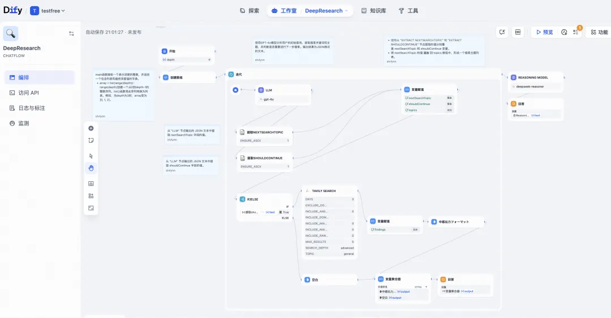

### Dify 可观测的两个视角｜开发者 & 运维方

对 Dify 这类低代码平台的可观测性需求，有开发者和平台运维两个视角。

Agentic 应用开发者使用 Dify SaaS 或自部署的 Dify 服务开发 Workflow 应用，专注于 Workflow 的构建，观测的主体是 Dify 平台上运行的一个个 Workflow 应用。关注点在于 Workflow 整体和其中 RAG、Tool、LLM 等各个步骤的执行，开发者依赖可观测服务监测大模型应用生成效果和性能，追踪用户多轮会话的交互体验。在 Agentic 应用开发构建和上线后的迭代维护阶段可观测能力都是 Agentic 应用持续优化的关键。

Dify 平台运维方关注 Dify 集群中从基础设施到各个组件的负载和异常情况，管理 Dify 和上下游的服务和依赖，观测的主体是 Dify 集群及其上下游依赖。Dify 集群包含执行引擎、插件引擎、任务队列、沙箱环境和存储服务等十多个组件；同时还涉及调用方、模型服务、工具访问、外部知识库等上下游依赖。请求过程的全链路可观测是线上问题追溯，性能瓶颈定位的关键工具。

### Dify 可观测现状 & 痛点

可观测性一直是 Dify 社区活跃的议题，目前 Dify 原生支持的可观测能力由三个方面组成。

其一是 Dify 内置的应用监控能力，数据采自 Dify 执行引擎运行过程中生成的执行明细记录，存储在 Dify 数据库内。其特点是和 Dify 自身的集成度最高，在开发调试阶段使用非常方便。

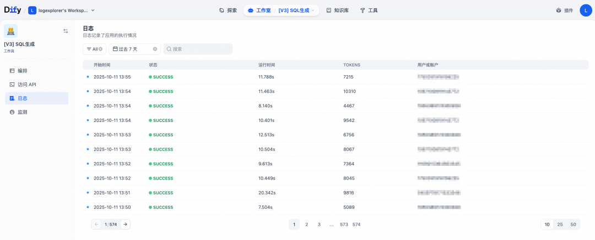

然而内置的应用监控在分析能力和性能两个方面存在不足。在分析能力上，Workflow 上线后对其观测数据需要多维度的聚合分析或二次加工，问题排查也需要关键字、时间范围、模糊匹配、错误类型等多维度的检索能力，但 Dify 自带的监控只能通过会话 ID 和用户 ID 等有限方式检索，不能满足数据分析和问题排查的需要。在性能上，受限于在 DB 中记录执行日志的数据存储方式，内置应用监控在大规模应用的生产环境下性能不佳，日志数据加载较慢甚至大量的执行明细数据会拖慢数据库整体性能，需要在后台 Celery 任务中配置清理任务周期性清理日志数据。

其二是 Dify 官方集成的第三方应用追踪服务，包括 云监控 / Langfuse 和 LangSmith 等。数据采自 Dify 特有的 OpsTrace 事件机制和 Dify 引擎生成的执行明细记录，主要采集 Workflow/Agent 层面的大模型、工具、知识库召回等节点信息。阿里云云监控从 Dify v1.6.0 起也集成了 Dify 官方可观测能力，提供全托管免运维的可观测服务。

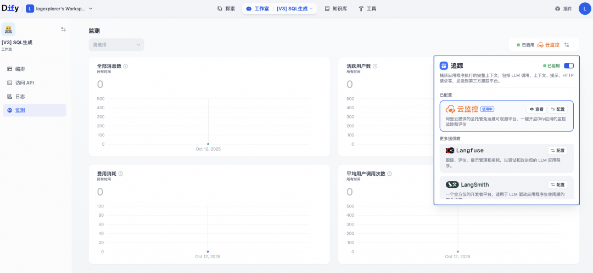

第三方集成的追踪服务痛点在于数据采集粒度受限且缺少全链路追踪能力。Dify 集成的第三方应用追踪服务主要关注 Agentic 应用开发者视角下的 Wrokflow 执行情况，更多地用于 Prompt 调优、Wrokflow 优化、数据分析等场景，但对于自建 Dify 集群时平台运维方的集群监控和上下游全链路问题排查能提供的帮助就很有限。同时受限于 Dify 的 OpsTrace 机制，能够采集的数据粒度在 Workflow 节点层面，其他更细粒度的数据支持起来比较困难。

其三是对 Dify 集群自身的可观测性，面向 Dify 集群各组件及上下游依赖的全链路可观测。目前 Dify 原生支持 Sentry 和 OpenTelemetry 两套可观测方式。两者主要采集 Flask、HTTP、DB、Redis、Celery 等框架层面的数据，对 Dify 自身的内部执行逻辑未做埋点。Sentry 由于相对封闭，目前社区 issue 主要转向更开放的 OTel 生态。

原生 OTel 方式的痛点在于采集的数据非常有限，无法串联上下游实现全链路追踪且无法与 Workflow 执行明细数据联动。原生的 OTel 只支持对 Dify 执行引擎和 Celery 任务组件埋点，采集的信息并不完整，同时由于 Dify 架构复杂且存在部分自定义协议，缺少全链路可观测以及和 Workflow 执行明细数据联动的能力。

## Dify 全景可观测——挑战与方案

针对现有可观测方案的痛点，云监控上线了 Dify 全组件无侵入探针 + Dify 官方集成的应用追踪服务 组合的 Dify 全景可观测解决方案，满足 Dify Agentic 应用开发者和 Dify 平台维护者两个视角对可观测性的需要，实现对执行引擎、插件引擎、沙箱环境、插件运行时以及 Workflow 应用的全方位监控。在这一过程中，因 Dify 架构复杂迭代迅速，全景可观测的实现面临多项挑战：

### 1.Dify 组件众多，执行链路复杂

Dify 请求经过 网关入口、执行引擎、插件引擎、代码沙箱、插件运行时等多个组件，关联 Cerey 后台任务队列，插件运行时受插件引擎的私有协议管理，链路复杂。

云监控为执行引擎、插件运行 提供 Python 探针，通过函数 Patch 实现零代码改动的无侵入埋点；为插件引擎和代码沙箱提供 Go 探针，通过编译时插桩实现无侵入注入；为 Nginx 和 Celery 任务队列提供 OTel 探针的解决方案；对于生命周期受插件引擎管控的插件运行时，通过代码插桩改造插件拉起流程，引入探针挂载逻辑。最终对 Dify 集群内的各个组件，只需配置环境变量并修改启动命令即可实现无侵入注入。

### 2.Dify 迭代迅速，代码变动频繁

Dify 社区已有1000+ 贡献者，经常一周甚至数天发布一个版本。Dify 实现的频繁变动给无侵入探针的实现带来很大挑战，纯无侵入方式很难跟上 Dify 的发版节奏。

云监控团队和社区积极合作，对接官方提供的第三方集成方式，对于 Dify 内部易变的 Workflow 执行逻辑采用官方方式上报，由社区维护版本更迭引起的改动。同时在无侵入探针中对 Dify 内部方法做最小依赖，仅处理框架层面的埋点和上下文传递过程中的断链问题。

### 3.Dify 官方集成的监测

### 和 OTel 生态割裂，难以串联

Dify 官方集成的第三方应用监控服务使用 Dify 自定义的 OpsTrace 机制，采用异步后聚合的方式上报追踪数据，这和标准的 OTel 实现存在较大差异。现有的集成方如 Langfuse 等都无法实现官方的应用追踪和全链路追踪结合。

云监控采用 OTel 格式上报数据，在 Dify 引擎挂载探针时将 traceId 信息透传到后台的 Celery 任务，通过 Trace Link 方式关联 Dify 官方集成方式上报的 Workflow 执行明细数据和无侵入探针上报的全链路追踪数据，实现全景可观测。

## 云监控可观测集成

### 接入速览

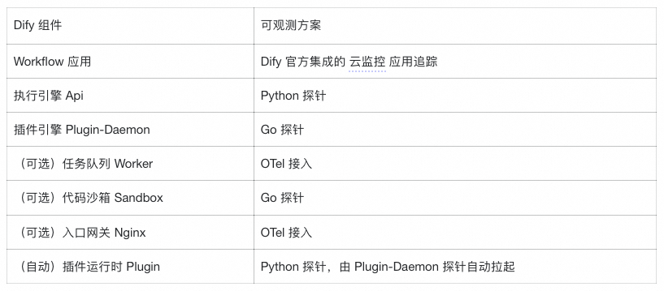

云监控给 Dify 的各个组件都提供了可观测方案，其中 Workflow 应用无需挂载探针，在 Dify 控制台上为需要监控的应用开启追踪即可。其余组件需要挂载探针实现监控，其中 API 和 Plugin-Daemon 是核心的工作流和插件系统执行引擎，推荐优先挂载。 Sandbox、Worker、Nginx 按需可选挂载。

### 版本要求

### Python 探针

使用最新版 Python 探针即可，Dify v1.x 版本都可用，因为只采 HTTP/Flask/Redis/DB 等框架层数据，所以 Python 探针对 Dify 版本无强要求。Dify v1.8.0 以后的版本支持通过 Trace Link 方式串联 Dify 官方集成上报的 Workflow 执行明细数据。

Go 探针

使用最新版本的Go探针即可，Dify v1.x版本都可用，提供对dify-plugin-damon的监控，同时支持对插件生命周期进行监控。

### Dify 原生监控

从 Dify v1.6.x 开始集成，更高的版本功能更全，推荐使用较新的版本。更新记录如下：

Dify 版本| 相关特性| 社区相关issue
---|---|---
v1.6.0 | init: 集成 Dify 官方可观测| https://github.com/langgenius/dify/pull/21471
v1.7.0| bugfix: 非 Chat 型 Workflow span 上报缺失| https://github.com/langgenius/dify/issues/22467
v1.8.0| feat: 支持 LLM 应用到微服务应用的 Trace Link| https://github.com/langgenius/dify/issues/23917
v1.9.1| feat: 支持云监控 2.0 Endpoint & gen_ai最新语义规范| https://github.com/langgenius/dify/issues/26170

### Opentelemetry 插件

推荐首选 Python 探针，阿里云 Python 探针按照 OTel 标准实现，并在探针基座和数据上报上做了增强。Dify 的 Worker、Nginx 可以使用 OTel 方案。Dify 从 v1.3.0 开始支持 OTel 配置，但上报端点存在兼容性问题，从 Dify v1.7.0 以后支持上报到阿里云的云监控2.0/ARMS 后端。

### 监控 Workflow 应用

使用 Dify 官方集成的云监控可采集 LLM、Tool、RAG 等 Workflow 层面的 Trace 数据，即 Dify 官方集成的监控采集大模型应用数据，一个 Workflow 对应一个大模型应用。

限于 Dify 框架特性，Dify 官方集成的云监控和 Python 探针采集的 Trace 无法直接联通，但可以通过 Trace Link 方式实现大模型应用和微服务应用的相关关联， 通过 Python 探针和 Dify 原生监控组合实现 Api 组件的可观测。

前提条件

Dify 版本 >= 1.6.0

步骤一：获取阿里云 Endpoint 和 License Key

方式一）云监控 2.0 且 Dify 版本 >= 1.9.1 的用户推荐使用云监控 2.0 的上报端点：

1.登录云监控 2.0 控制台，在左侧导航栏单击接入中心。

2.在应用监控&链路追踪区域单击 Dify 卡片。

3.在弹出的接入面板中选择数据上报地域，点击获取 LicenseKey。

4.记录生成的 LicenseKey 和 Endpoint。

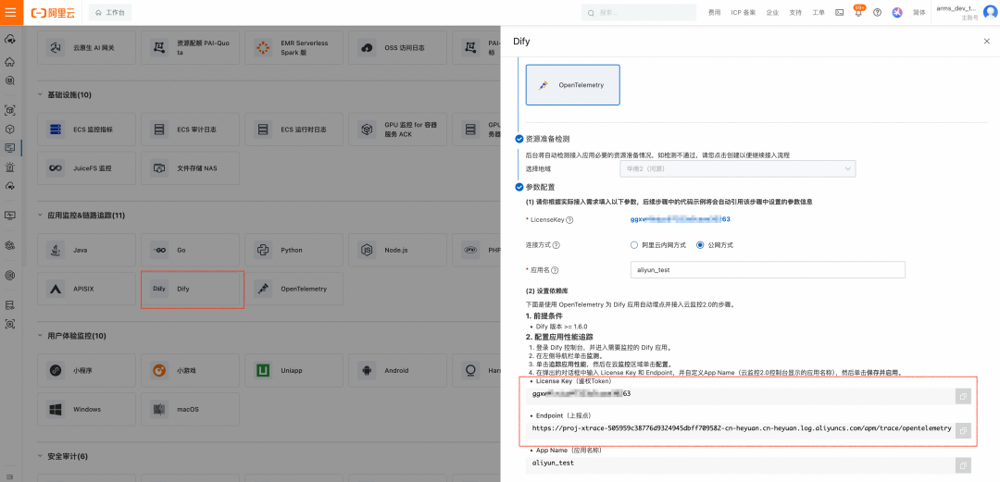

方式二） ARMS 用户或 Dify 版本在 1.6.0～1.9.0 的用户可以使用 ARMS 的上报端点，数据也会在云监控 2.0上同步呈现：

1.登录 ARMS 控制台，在左侧导航栏单击接入中心。

2.在服务端应用区域单击 OpenTelemetry 卡片。

3.在弹出的 OpenTelemetry 面板中选择数据上报地域，上报方式选 gRPC。

4.记录生成的 LicenseKey 和 Endpoint，注意 Endpoint 不要带端口号。

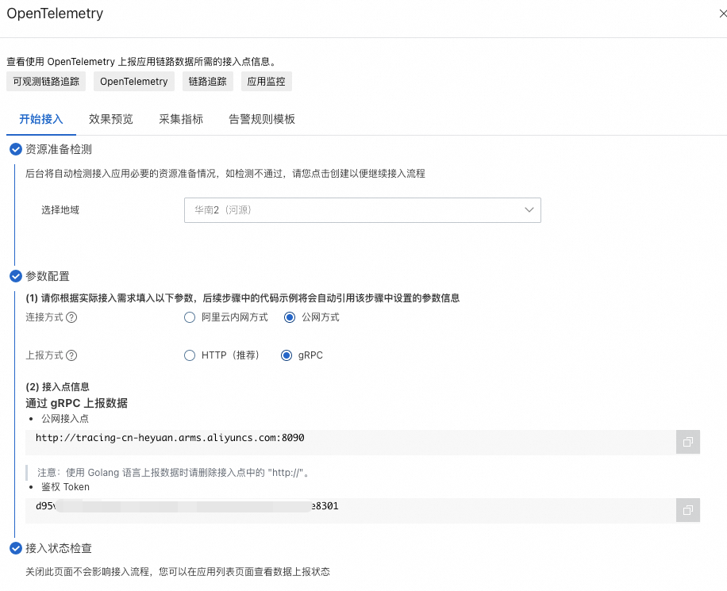

步骤二：配置应用性能追踪

1.登录Dify控制台，并进入需要监控的Dify应用。

2.在左侧导航栏单击监测。

3.单击追踪应用性能，然后在云监控区域单击配置。

4.在弹出的对话框中输入步骤一获取的 License Key 和 Endpoint，并自定义App Name（ARMS控制台显示的应用名称），然后单击保存并启用。

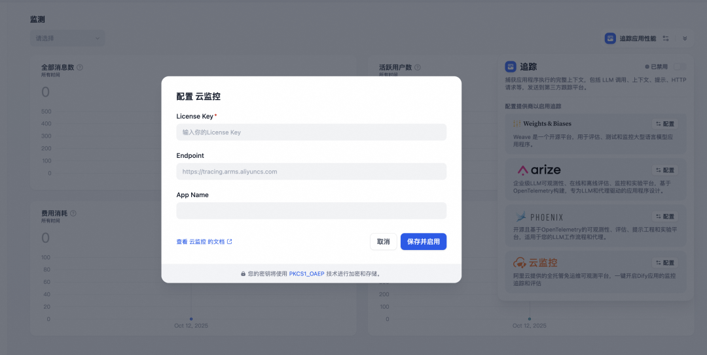

步骤三：查看 Dify 应用监控数据

配置完毕后在 Dify 控制台或通过 Dify Api 发起几次请求，稍等1～2分钟即可登录阿里云控制台查看上报的数据。

方式一：监控 2.0 用户在应用中心- AI 应用可观测 处查看

方式二：ARMS 用户在 LLM 应用监控 处查看

应用详情示例：

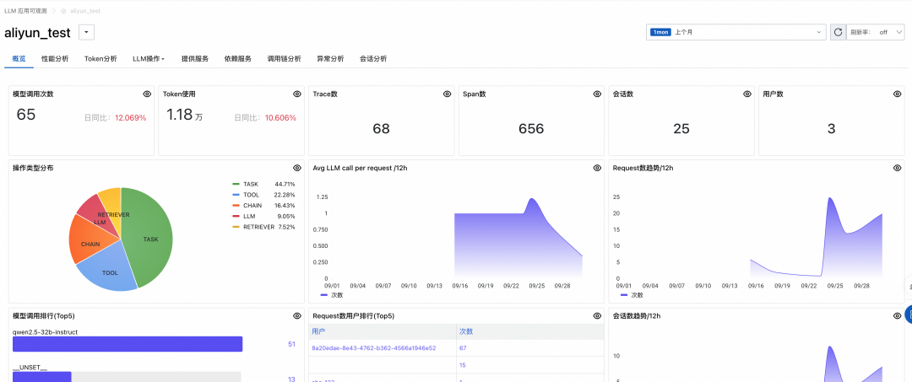

调用链详情示例：

LLM 节点会采集 系统/用户提示词、模型输出、模型提供商和型号、token 用量等信息。

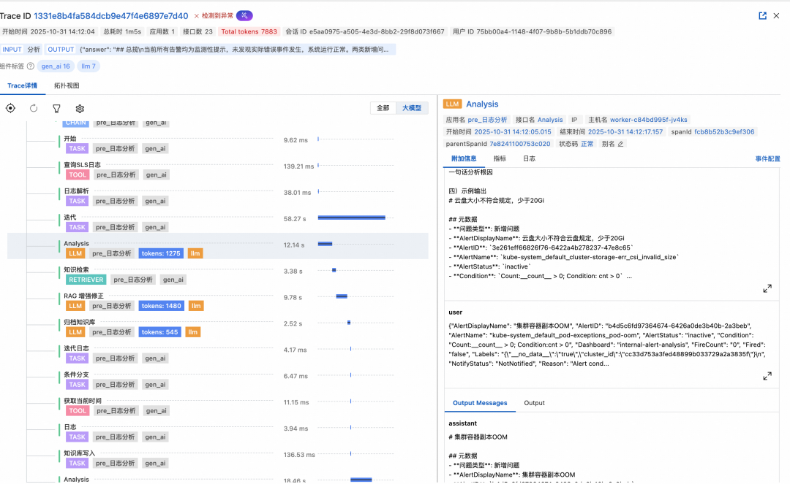

Retriever 节点会采集 查询语句、召回片段、关联文档元数据、embbeding 评分等信息。

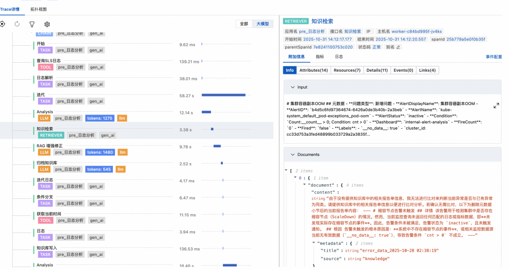

Tool 节点会采集 工具参数和调用结果、工具提供商和描述等信息。

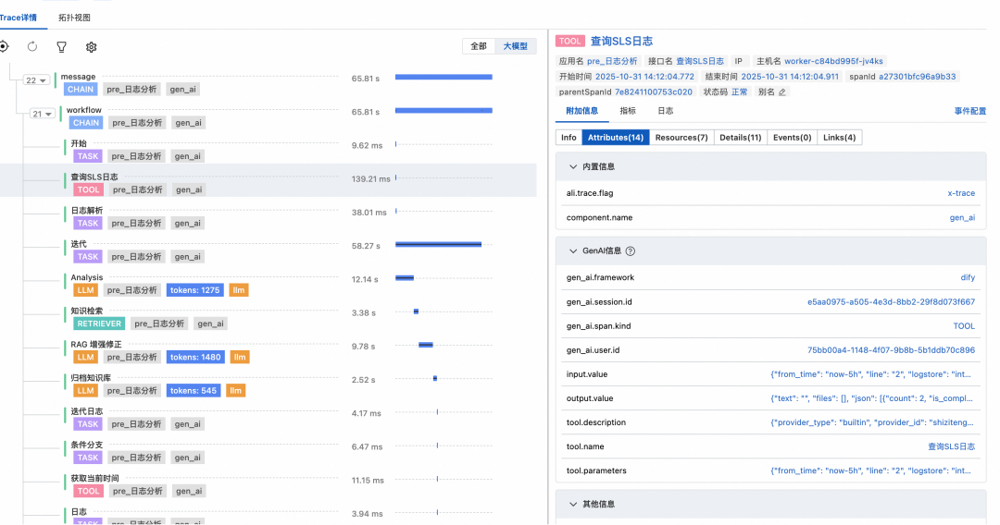

其他流程节点也都会采集节点的输入输出、会话ID、用户ID 等必要数据。

接入可参考文档[3][4]。

### 监控执行引擎 API

API 是 Dify 执行引擎。使用 Python 探针可采集 HTTP/Flask/Redis/DB 等框架层面的 Trace 数据，并关联上下游调用实现全链路追踪，即 Python 探针采集微服务数据， Api 组件对应一个微服务应用。

步骤一：安装 Python 探针

首先需要卸载冲突的 OTel 插件，下载并安装 Python 探针。

启动脚本开头改动

  *   *   *   *   *   *   *   *   *   *   *   *   *   *   *   *   *

    # 确保pip环境python -m ensurepip --upgrade
    # 卸载冲突的OTel插件pip3 uninstall -y opentelemetry-instrumentation-celery \  opentelemetry-instrumentation-flask \  opentelemetry-instrumentation-redis \  opentelemetry-instrumentation-requests \  opentelemetry-instrumentation-logging \  opentelemetry-instrumentation-wsgi \  opentelemetry-instrumentation-fastapi \  opentelemetry-instrumentation-asgi \  opentelemetry-instrumentation-sqlalchemy
    # 安装Python探针pip3 config set global.index-url https://mirrors.aliyun.com/pypi/simple/ && pip3 config set install.trusted-host mirrors.aliyun.compip3 install aliyun-bootstrap && aliyun-bootstrap -a install

提示：

可以通过 Docker 数据卷挂载方式用修改后的启动脚本替换原脚本（修改源码并重打镜像也可以）。即将修改后的脚本作为配置项挂载到容器目录内，并指定容器从此脚本启动。例如：

将修改后的脚本 entrypoint.sh 存储为配置项，并挂载到容器目录 /app/api/docker

指定启动命令：["/bin/bash","/app/api/docker/entrypoint.sh"]

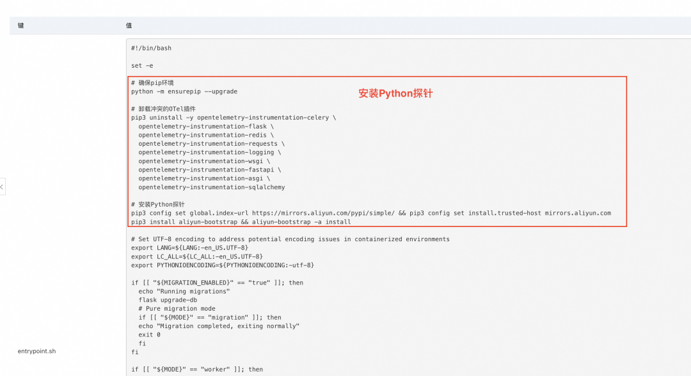

步骤二：修改启动命令

在启动脚本最后的应用启动部分做修改，从 aliyun-instrument 启动：

启动脚本末尾改动

  *   *   *   *   *   *   *   *

    # 使用aliyun-instrument启动exec aliyun-instrument gunicorn \      --bind "${DIFY_BIND_ADDRESS:-0.0.0.0}:${DIFY_PORT:-5001}" \      --workers ${SERVER_WORKER_AMOUNT:-1} \      --worker-class ${SERVER_WORKER_CLASS:-gevent} \      --worker-connections ${SERVER_WORKER_CONNECTIONS:-10} \      --timeout ${GUNICORN_TIMEOUT:-200} \      app:app

同理此步骤也可以通过修改镜像打包过程或通过挂载 K8S 配置项并替换 Dify 启动脚本的方式实现。

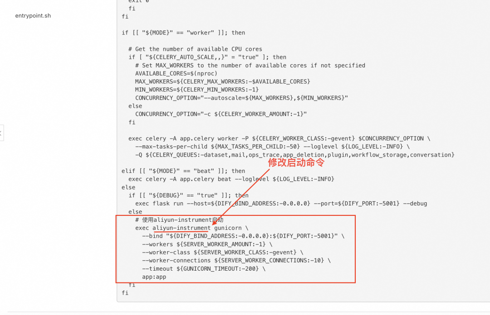

步骤三：配置环境变量

配置如下环境变量，应用名、地域和 License Key 根据实际情况填写。

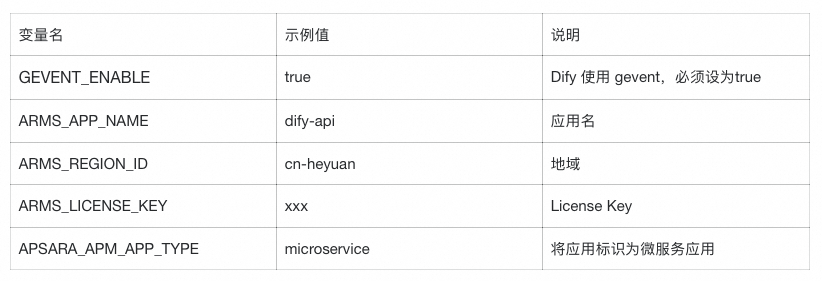

步骤四：部署并查看 Api 监控数据

进入应用监控列表可以看到 dify-api 应用，应用详情示例：

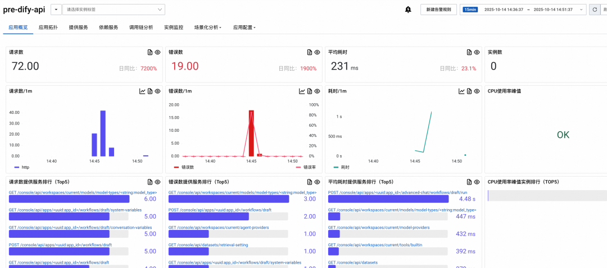

调用链会串联上下游调用信息，示例数据：

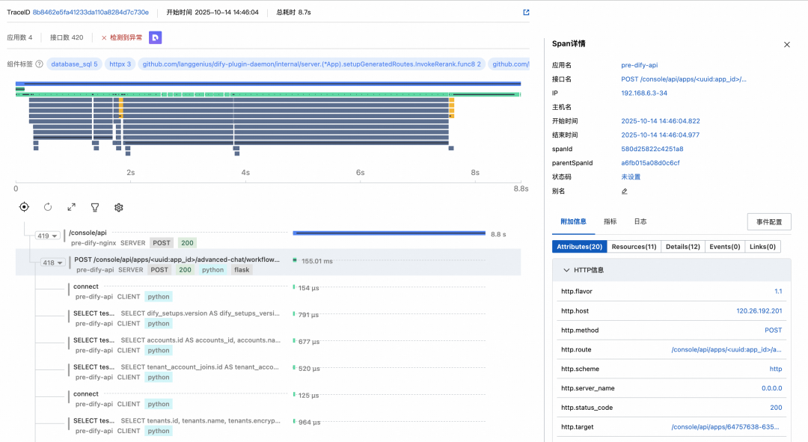

可以参考文档[5]，注意如果直接使用 ack-onepilot 自动注入，会存在 Dify 自带的 OTel SDK 和 Python 探针冲突的问题，还需要手动改启动脚本卸载冲突的 OTel 依赖。

### 监控插件引擎 Dify-Plugin-Daemon

Dify-Plugin-Daemon 是 Dify 的插件管理器，Dify 的 LLM、插件、Agent 策略的执行都依赖 Plugin-Daemon。Go Agent[2]支持监控 Dify-Plugin-Daemon，接入Go监控需修改Dockerfile、重新编译镜像后配置环境变量开启。Plugin-Daemon 的 Go 探针同时也会自动为插件运行时挂载 Python 探针。

步骤一：修改Dockerfile文件重新编译对应镜像

local.dockerfile 修改示例

DockerFile

  *   *   *   *   *   *   *   *   *   *   *   *   *   *   *   *   *   *   *   *   *   *   *   *   *   *   *   *   *   *   *   *   *   *   *   *   *   *   *   *   *   *   *   *   *

    FROM golang:1.23-alpine AS builder
    ARG VERSION=unknown# copy projectCOPY . /app# set working directoryWORKDIR /app# using goproxy if you have network issues# ENV GOPROXY=https://goproxy.cn,direct# download arms instgoRUN wget "http://arms-apm-cn-hangzhou.oss-cn-hangzhou.aliyuncs.com/instgo/instgo-linux-amd64" -O instgoRUN chmod 777 instgo# instgo buildRUN INSTGO_EXTRA_RULES="dify_python" ./instgo go build \    -ldflags "\    -X 'github.com/langgenius/dify-plugin-daemon/internal/manifest.VersionX=${VERSION}' \    -X 'github.com/langgenius/dify-plugin-daemon/internal/manifest.BuildTimeX=$(date -u +%Y-%m-%dT%H:%M:%S%z)'" \    -o /app/main cmd/server/main.go# copy entrypoint.shCOPY entrypoint.sh /app/entrypoint.shRUN chmod +x /app/entrypoint.shFROM ubuntu:24.04WORKDIR /app# check build argsARG PLATFORM=local# Install python3.12if PLATFORM is localRUN apt-get update && DEBIAN_FRONTEND=noninteractive apt-get install -y curl python3.12 python3.12-venv python3.12-dev python3-pip ffmpeg build-essential \    && apt-get clean \    && rm -rf /var/lib/apt/lists/* \    && update-alternatives --install /usr/bin/python3 python3 /usr/bin/python3.12 1;# preload tiktokenENV TIKTOKEN_CACHE_DIR=/app/.tiktoken# Install dify_plugin to speedup the environment setup, test uv and preload tiktokenRUN mv /usr/lib/python3.12/EXTERNALLY-MANAGED /usr/lib/python3.12/EXTERNALLY-MANAGED.bk \    && python3 -m pip install uv \    && uv pip install --system dify_plugin \    && python3 -c "from uv._find_uv import find_uv_bin;print(find_uv_bin());" \    && python3 -c "import tiktoken; encodings = ['o200k_base', 'cl100k_base', 'p50k_base', 'r50k_base', 'p50k_edit', 'gpt2']; [tiktoken.get_encoding(encoding).special_tokens_set for encoding in encodings]"ENV UV_PATH=/usr/local/bin/uvENV PLATFORM=$PLATFORMENV GIN_MODE=releaseCOPY --from=builder /app/main /app/entrypoint.sh /app/# run the server, using sh as the entrypoint to avoid process being the root process# and using bash to recycle resourcesCMD ["/bin/bash", "-c", "/app/entrypoint.sh"]

注意 INSTGO_EXTRA_RULES 选项会开启 Plugin 运行时自动监测功能，如果不需要在 Plugin-Daemon 启动时拉起对 Plugin 探针，可以去除编译文件中的`INSTGO_EXTRA_RULES="dify_python"。`

### 步骤二：配置环境变量

方式一）ECS 环境

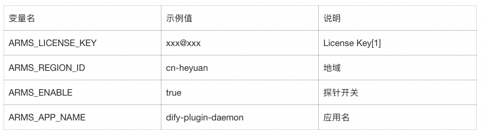

方式二）容器化 ack-onepilot 环境

在 dify-plugin-daemon 应用的 YAML 配置中将以下 labels 添加到 spec.template.metadata 层级下。

  *   *   *   *

    labels:  aliyun.com/app-language: golang  armsPilotAutoEnable: 'on'  armsPilotCreateAppName: "dify-daemon-plugin"

步骤三：部署并查看 dify-plugin-daemon 监控

在应用列表页面进入dify-plugin-daemon应用，监控详情如下：

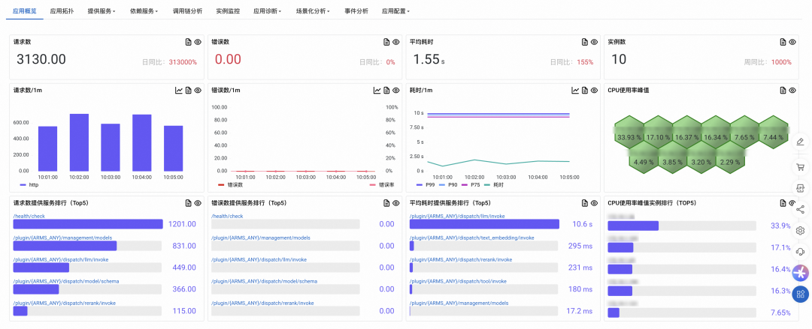

调用链详情：

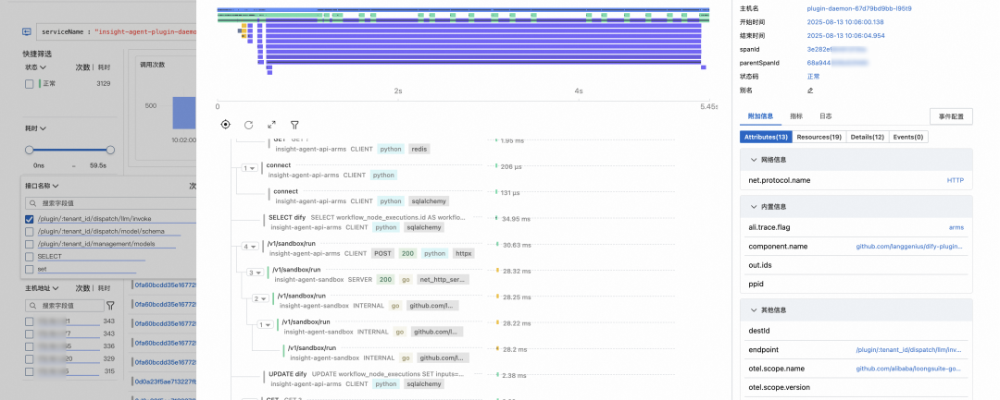

步骤四：查看 Plugin 监控

挂载探针后，Plugin-Daemon 会自动拉起插件运行时的探针。每个插件运行时对应一个可观测应用，应用名为 {plugin_daemon_name}_plugin_{plugin_name}_{plugin_version}。例如，Plugin-Daemon 配置的应用名为 local-dify-plugin-daemon，安装了 tongyi 的 version 0.0.53 插件时，会自动生成应用 local-dify-plugin-daemon_plugin_tongyi_0.0.53。

插件监控概览页示例：

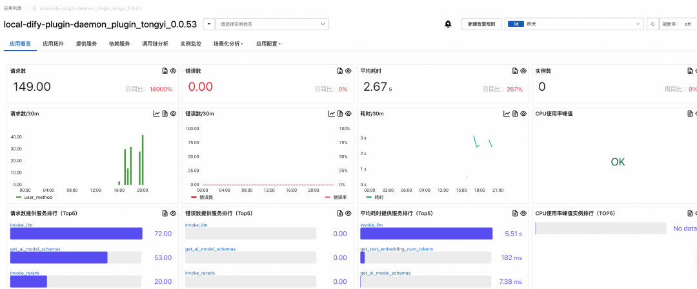

### (可选) 监控代码沙箱 Sandbox

Sandbox 是 Dify 代码沙箱引擎，负责执行 Workflow 中的 Python/Node.js 代码。Go 探针支持监控 Sandbox，需修改Dockerfile、重新编译镜像后配置环境变量开启。

### 步骤一：修改Dockerfile文件重新编译对应镜像

修改./build/build_[amd64|arm64].sh文件。

a.添加instgo下载命令。

下载命令示例如下，其他地域和架构的下载命令请参见下载 instgo。

（https://help.aliyun.com/zh/arms/application-monitoring/developer-reference/instgo-tool-introduction[#9b94bbe8a62ra](<javascript:;>)）

  *   *

    wget "http://arms-apm-cn-hangzhou.oss-cn-hangzhou.aliyuncs.com/instgo/instgo-linux-amd64" -O instgochmod 777 instgo

b.在 go build 前添加 `instgo` 命令。

以amd64为例，修改示例如下：

  *   *   *   *   *   *   *   *   *   *   *   *   *   *

    rm -f internal/core/runner/python/python.sorm -f internal/core/runner/nodejs/nodejs.sorm -f /tmp/sandbox-python/python.sorm -f /tmp/sandbox-nodejs/nodejs.sowget "http://arms-apm-cn-hangzhou.oss-cn-hangzhou.aliyuncs.com/instgo/instgo-linux-amd64" -O instgochmod 777 instgoecho "Building Python lib"CGO_ENABLED=1 GOOS=linux GOARCH=amd64 ./instgo go build -o internal/core/runner/python/python.so -buildmode=c-shared -ldflags="-s -w" cmd/lib/python/main.go &&echo "Building Nodejs lib" &&CGO_ENABLED=1 GOOS=linux GOARCH=amd64 ./instgo go build -o internal/core/runner/nodejs/nodejs.so -buildmode=c-shared -ldflags="-s -w" cmd/lib/nodejs/main.go &&echo "Building main" &&GOOS=linux GOARCH=amd64 ./instgo go build -o main -ldflags="-s -w" cmd/server/main.goecho "Building env"GOOS=linux GOARCH=amd64 ./instgo go build -o env -ldflags="-s -w" cmd/dependencies/init.go

步骤二：配置环境变量

方式一）无 ack-onepilot 环境

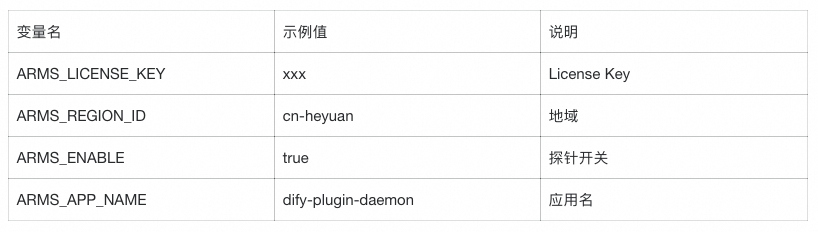

方式二）容器化 ack-onepilot 环境

在 dify-plugin-daemon 应用的 YAML 配置中将以下 labels 添加到 spec.template.metadata 层级下。

  *   *   *   *

    labels:  aliyun.com/app-language: golang  armsPilotAutoEnable: 'on'  armsPilotCreateAppName: "dify-daemon-plugin"

### 步骤三：部署并查看 sandbox 监控

在应用列表页面进入dify-sandbox应用，监控详情如下：

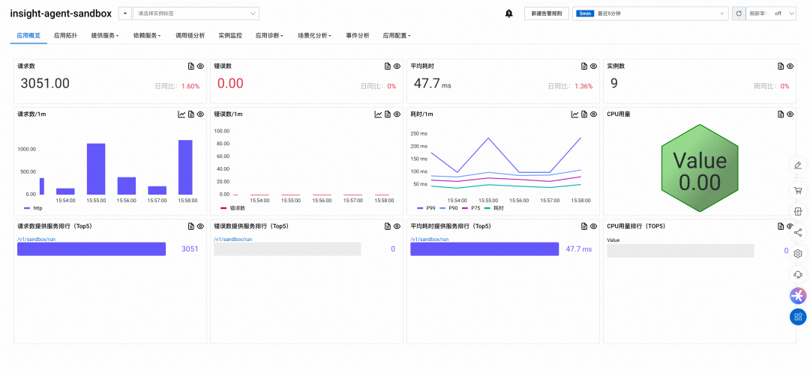

调用链详情：

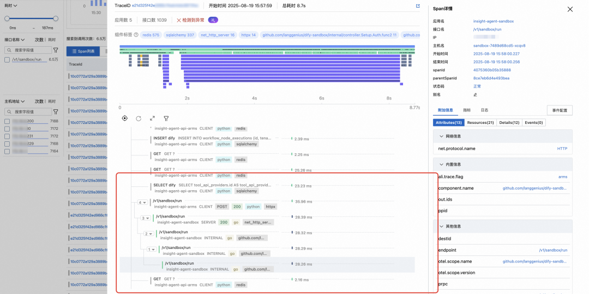

参考文档：

> ## 监控 Go 应用

> https://help.aliyun.com/zh/arms/application-monitoring/user-guide/monitoring-the-golang-applications/

> https://help.aliyun.com/zh/arms/application-monitoring/user-guide/connect-a-dify-application-to-arms-application-monitoring (步骤五)

### (可选) 监控任务队列 Worker

Worker 是 Dify 后台任务组件，知识库构建和周期性清理任务依赖 Worker 执行。按普通 Python Celery 应用方式接入即可。这里给出使用 Dify 内置的 OTel 插件上报数据的示例：

步骤一：修改 Worker 环境变量

OTel 插件是 Dify 内置功能，直接修改环境变量即可。注意要求 Dify 1.7.0 以上版本。

环境变量| 示例| 功能
---|---|---
ENABLE_OTEL| true| 开启 OTel 上报
OTLP_TRACE_ENDPOINT| http://tracing-cn-heyuan.arms.aliyuncs.com/{token}/api/otlp/traces| trace endpoint从 ARMS 接入中心取
OTLP_METRIC_ENDPOINT| http://tracing-cn-heyuan.arms.aliyuncs.com/{token}/api/otlp/metrics| metric endpoint从 ARMS 接入中心取
OTEL_SAMPLING_RATE| 1| 采样率
APPLICATION_NAME| dify-worker| 应用名默认值：langgenius/dify推荐配置以区分 api 和 worker

### 步骤二：部署并查看 Worker 监控

进入 应用监控/ OpenTelemetry 监控页面查看上报的数据。

Worker 执行的后台任务 Trace 详情示例：

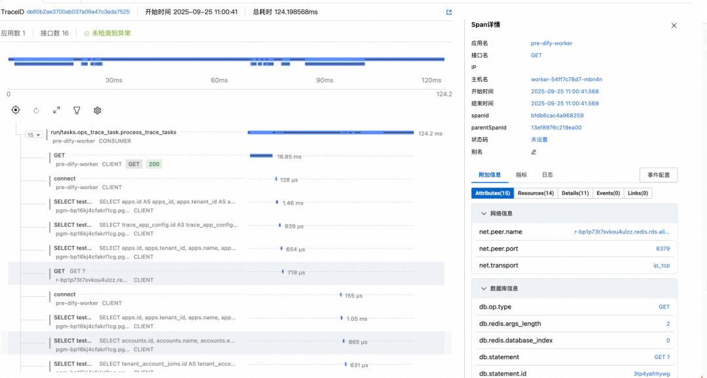

### (可选) 监控入口网关 Nginx

Nginx 是 Dify 的入口网关，一些超时问题和知识库/插件/Workflow的文件上传问题可能和 Nginx 配置有关。

直接使用 Opentelemetry 方式上报即可，推荐使用预构建的 Nginx-OTel 镜像方式。

步骤一：下载预构建Docker镜像

前往Docker官网，搜索并拉取带有-otel后缀的Nginx镜像（如nginx:1.29.0-otel），通过标准容器启动流程部署服务。

步骤二：获取 gRPC 接入点和鉴权 Token 信息

登录可观测链路 OpenTelemetry 版控制台，在接入中心选取OpenTelemetry卡片，选择gRPC协议上报数据。

记录接入点和鉴权Token备用。

在开源框架区域单击，在弹出的OpenTelemetry面板中选择数据需要上报的地域。

步骤三：启用 Nginx OTel 模块

修改 Nginx 配置文件 nginx.conf.template：

Nginx 配置文件

  *   *   *   *   *   *   *   *   *   *   *   *   *   *   *

    load_module modules/ngx_otel_module.so; # 加载 ngx_otel_module...http {    ...
        otel_exporter {        endpoint "${GRPC_ENDPOINT}"; # 前提条件中获取的 gRPC 接入点        header Authentication "${GRPC_TOKEN}"; # 前提条件中获取的鉴权 Token    }
        otel_trace on;                     # 开启链路追踪    otel_service_name ${SERVICE_NAME};  # 应用名    otel_trace_context propagate;         # 向下游服务注入Trace上下文    ...}

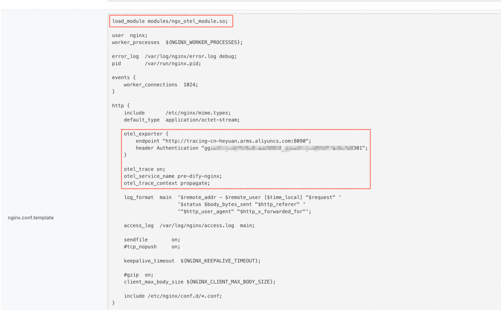

可参考文档[6]接入 Nginx 监控。

## 实践指南

### 关联 LLM Trace 和微服务 Trace

Dify 的 Workflow 执行数据通过官方集成方式上报 Trace，而 Dify-api、Dify-Worker、Dify-Plugin-Daemon 等基础设施通过无侵入探针按 OTel 标准上报 Trace。这两套割裂的体系无法直接融合，阿里云提供了 Trace Link 能力，将应用层和基础设施层的两条 Trace 串联。

从 LLM Trace 跳转 微服务 Trace：

进入一条 LLM Trace 的详情，可以看到完整的 Workflow 执行数据，但如何找到基础设施组件的 span 和上下游串联数据？

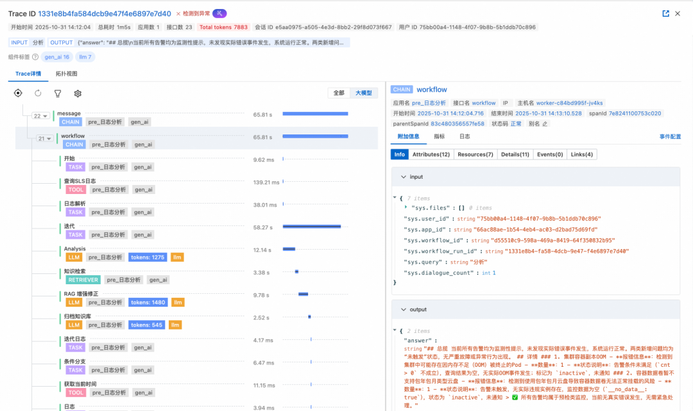

选中一个 span，在 span 右侧的附加信息面板选择 Links 标签页，可以看到和此 LLM Trace 相关联的基础设施 Trace 的信息。

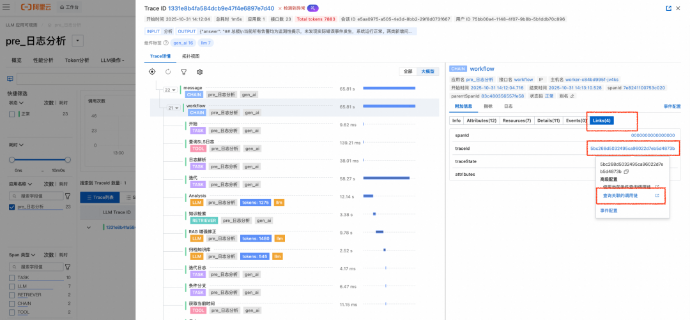

点击“查询关联的调用链”，可以直接跳转到关联的基础设施 Trace：

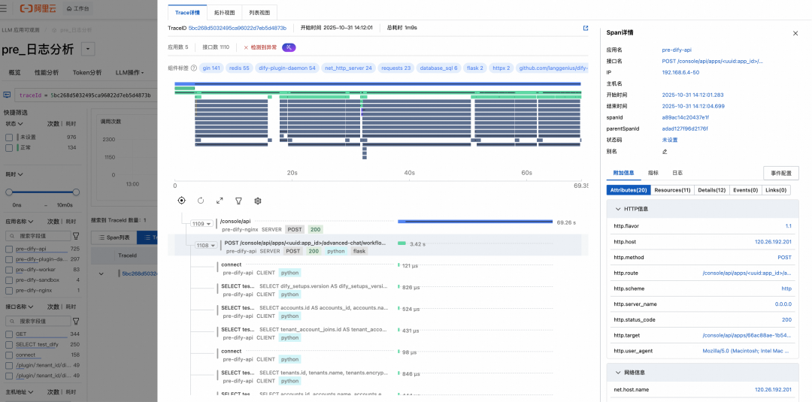

从 微服务 Trace 跳转 LLM Trace：

在基础设施的微服务 Trace 上，可以看到 nginx、dify-api、dify-plugin-daemon、dify-sandbox 等各个组件的 Trace 数据，是否可以将它关联到 Dify 官方集成的 Trace 数据上？

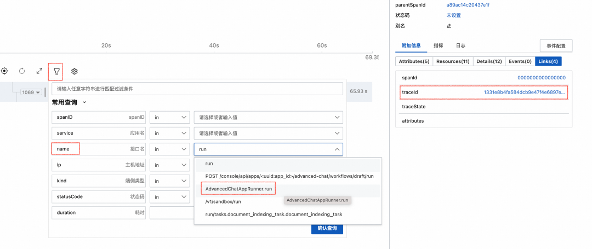

点击调用链上方的筛选功能，用 span 名称筛选，找到名称为 AdvancedChatAppRunner.run 或 WorkflowAppRunner.run 的 span。（取决于 Dify Workflow 的类型，如果调用了子 Workflow 可能会有多个这样的 span）。

如果对应的 Workflow 开启了云监控追踪，在 span 附加信息的 Links 页签可以看到关联的 LLM Trace Id，点击“查询关联的调用链”可跳转到相应 LLM Trace。

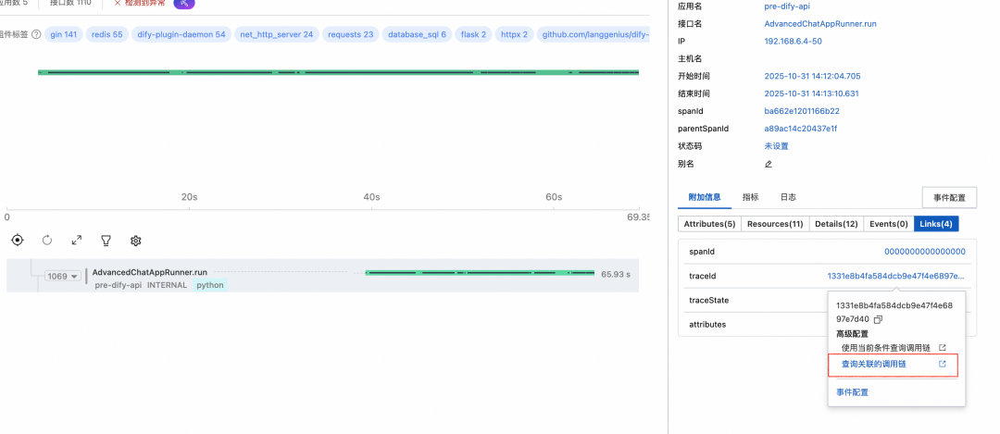

### 分析执行引擎异常根因

工作流层面的异常通常在 LLM Trace 或 Dify 日志追踪里可以看到直观的报错信息，但还有一类错误是底层 Dify 引擎的配置不当或内部 bug 引起的。无侵入探针提供了对这类错误的定位分析能力。

如图的示例场景，在 Dify Workflow 的某次执行中发现知识检索的输出总是为空，但是 Dify 控制台上又没有报错信息：

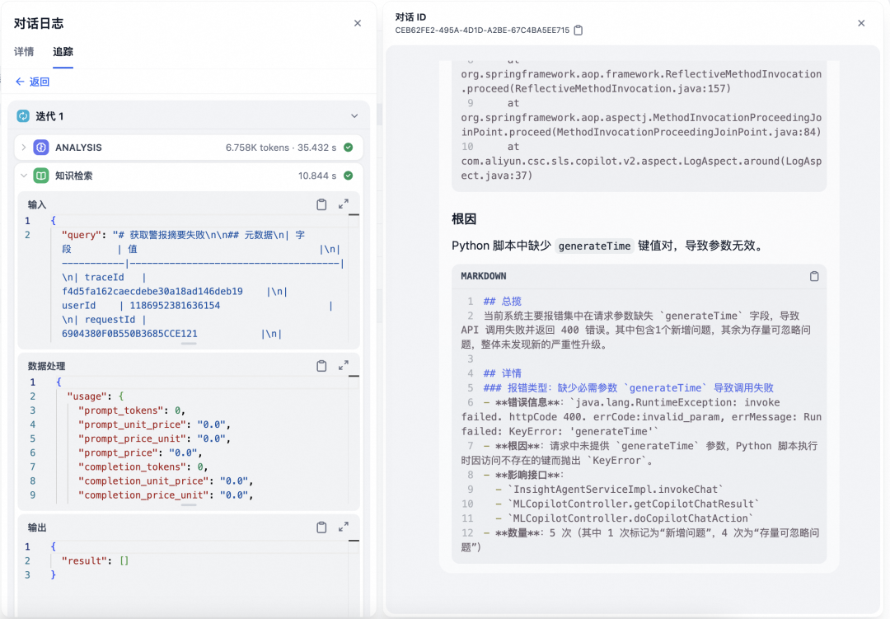

此时，可以根据 Dify 对话ID、用户ID 等信息在云监控上定位对应的 LLM Trace：

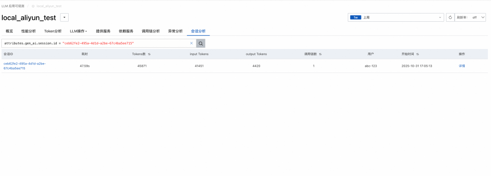进入会话详情，找到对应 Trace 和相关 Span，首先尝试在 Span 详情中查找相关信息：

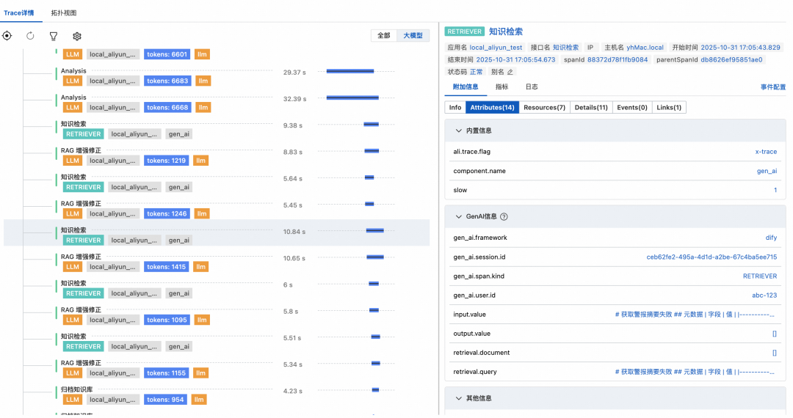

这个 Case 的问题不在 Wrokflow 层面，所以只能观察到输出异常，要定位具体原因，可以通过上一节介绍的 Links 功能，跳转到对应的 Dify infra 层 Trace：

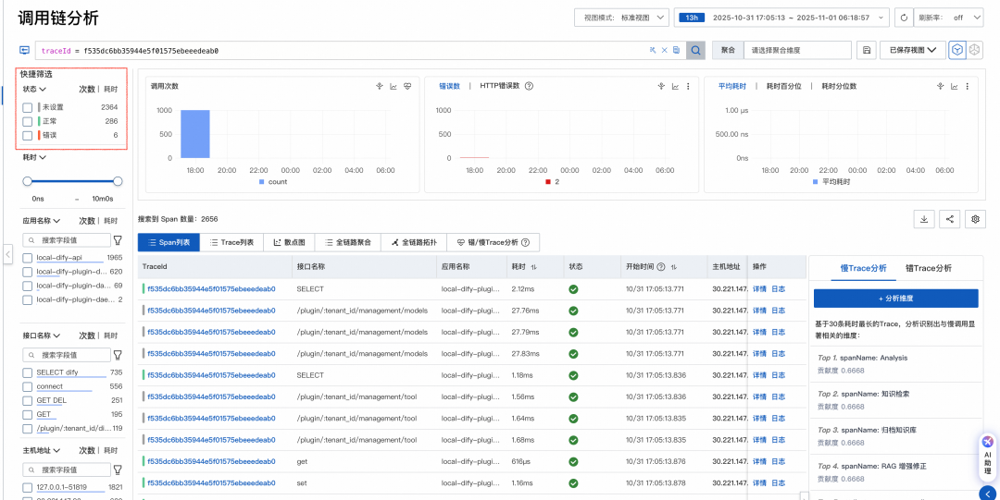

可以观察到 Trace 上存在部分错误 Span，通过快捷筛选直接定位错误 Span：

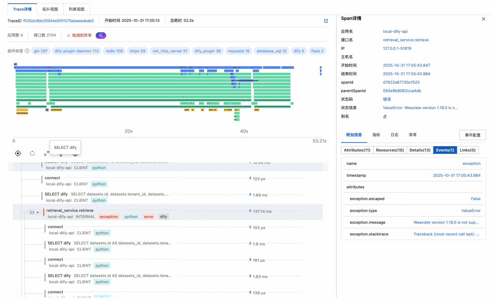

在错误 Span 的 Details 和 Events 中，可以看到错误信息和异常堆栈。并定位到根因是 Weaviate 向量存储配置引起的问题。

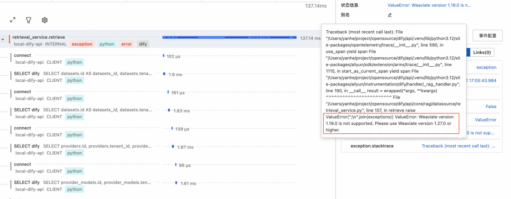

### 定位插件慢调用

Dify 社区提供了丰富的插件生态，但管理插件的 Dify-Plugin-Daemon 和插件运行时却是难以定位故障的黑盒。在 Dify 控制台上能清晰地看到各个工作流节点的运行记录，但对于流程节点之下 Dify infra 设施的故障却无从分析。一次 Workflow 调用链路涉及 Nginx、Api、Plugin-Daemon、Plugin 运行时和模型网关等多个组件，阿里云云监控提供的全链路追踪能力可以串联上下游的完整链路，定位插件内的错慢异常。

如图示例中“查询SLS日志”是一个 Dify 插件，正常调用只需 200 ms，但在这个 Trace 中却有 5 s多的慢调用。仅看 LLM Trace 或 Dify 执行日志，无法判断慢请求是因为 Dify-Api 引擎、Dify-Plugin-Daemon 插件引擎、Dify-Plugin 运行时或者 SLS 日志服务本身导致的。

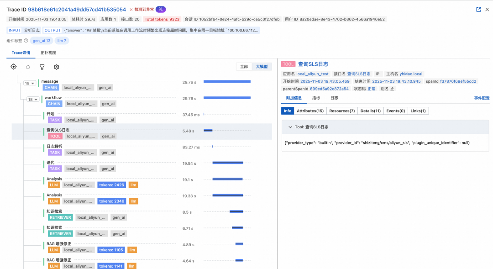

通过 Links 找到关联的 Infra 层调用，可以看到 Trace 详情：

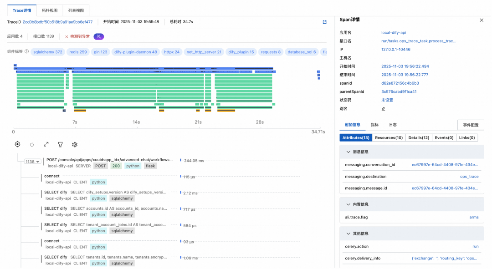

Dify 引擎会做大量 DB 和 Redis 访问，排查非 DB/Redis 类问题时，可以在组件标签处点选并滤去 sqlalchemy 和 redis 组件的 Span 以便排查。

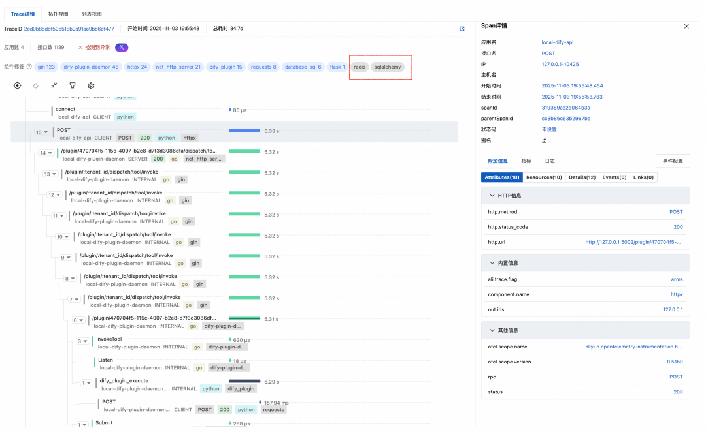

可以看到 dify 执行引擎（local-dify-api）发起了对 dify 插件引擎（local-dify-plugin-daemon）的POST 调用，插件引擎调用插件运行时（local-dify-plugin-daemon_plugin_cms_0.0.1）并转发请求给 SLS 服务端口。整个链路上耗时最长的是 dify_plugin_execute，这是插件运行时内部的入口方法，我们正是在此处注入了故障模拟的慢调用。

欢迎大家加入我们的钉钉群（开源群：Python(101925034286)、 Go(102565007776)，商业化群：159215000379），共同构建更好的Dify全链路监控能力。

参考

# [1] 获取LicenseKey：https://help.aliyun.com/zh/arms/application-monitoring/developer-reference/api-arms-2019-08-08-describetracelicensekey-apps

[2] ARMS应用监控支持的Go组件和框架：https://help.aliyun.com/zh/arms/application-monitoring/developer-reference/go-components-and-frameworks-supported-by-arms-application-monitoring

[3] Dify 官方监控接入：https://help.aliyun.com/zh/arms/tracing-analysis/untitled-document-1750672984680

[4] 集成阿里云云监控：https://docs.dify.ai/zh-hans/guides/monitoring/integrate-external-ops-tools/integrate-aliyun

[5] Dify Python 探针接入：https://help.aliyun.com/zh/cms/cloudmonitor-2-0/user-guide/monitor-dify-applications

[6] 使用OpenTelemetry对Nginx进行链路追踪：https://help.aliyun.com/zh/opentelemetry/user-guide/use-opentelemetry-to-perform-tracing-analysis-on-nginx

### Qwen-Image，生图告别文字乱码

针对AI绘画文字生成不准确的普遍痛点，本方案搭载业界领先的Qwen-Image系列模型，提供精准的图文生成和图像编辑能力，助您轻松创作清晰美观的中英文海报、Logo与创意图。此外，本方案还支持一键图生视频，为内容创作全面赋能。

## 点击阅读原文查看详情。
