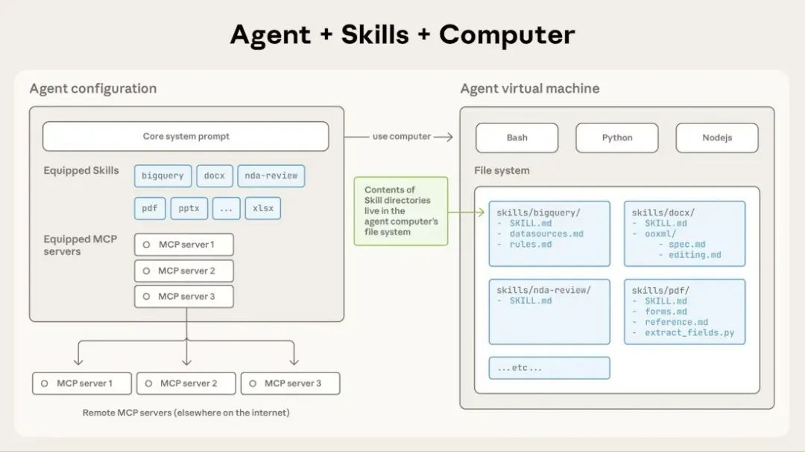
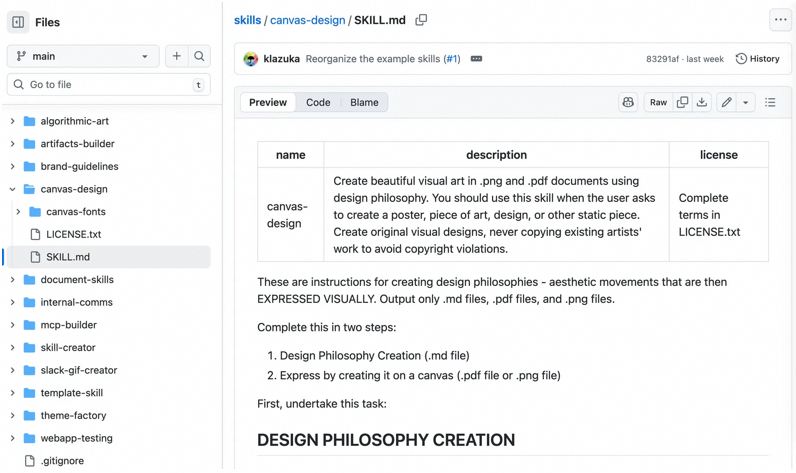
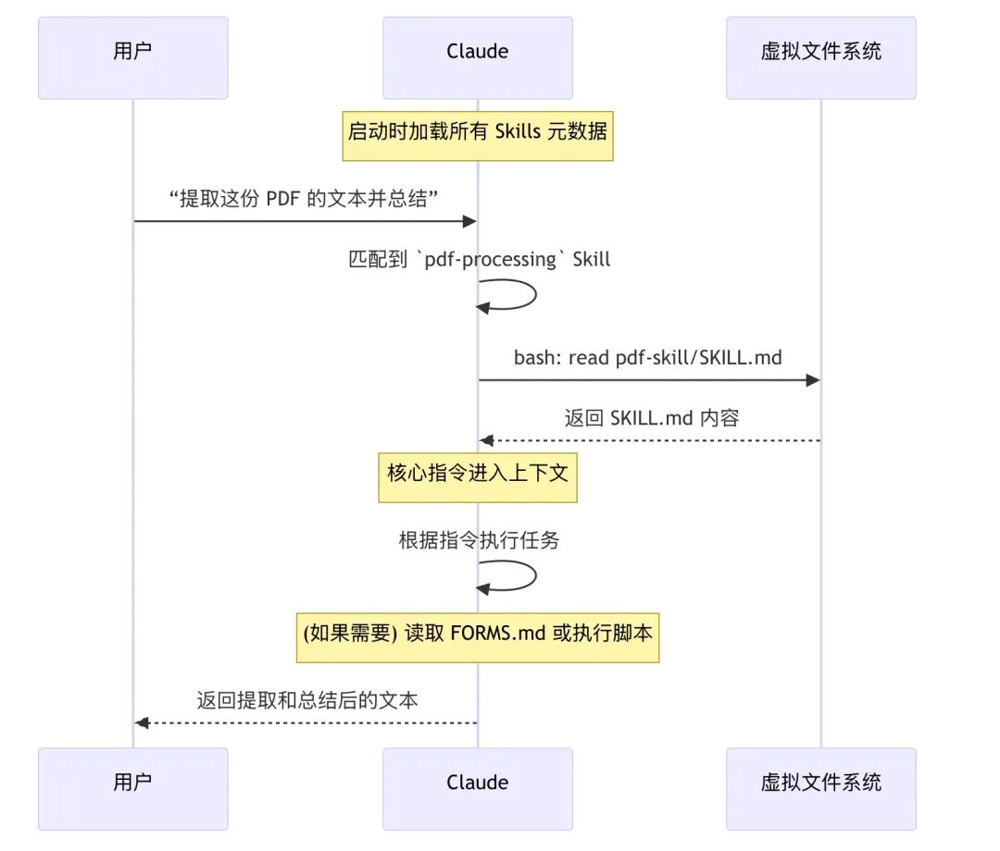
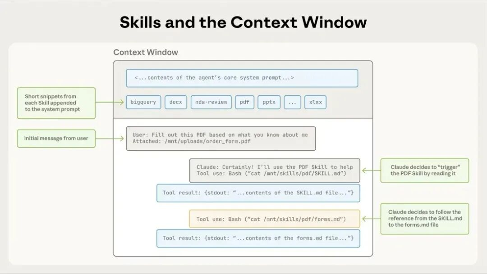
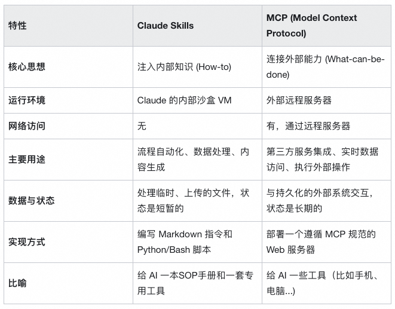
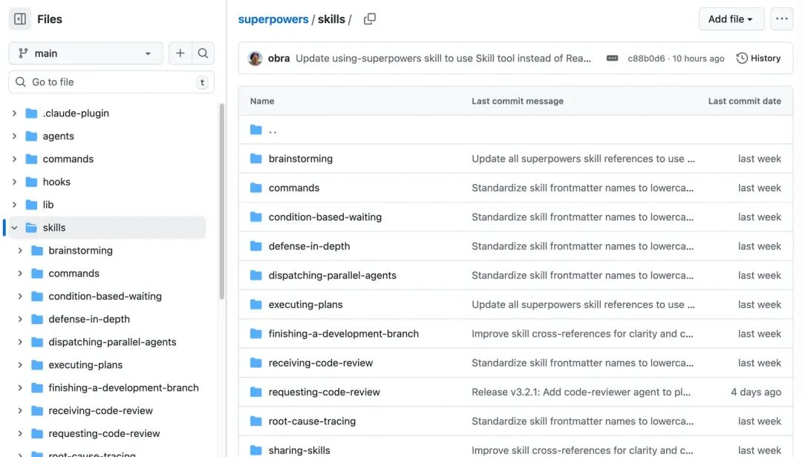
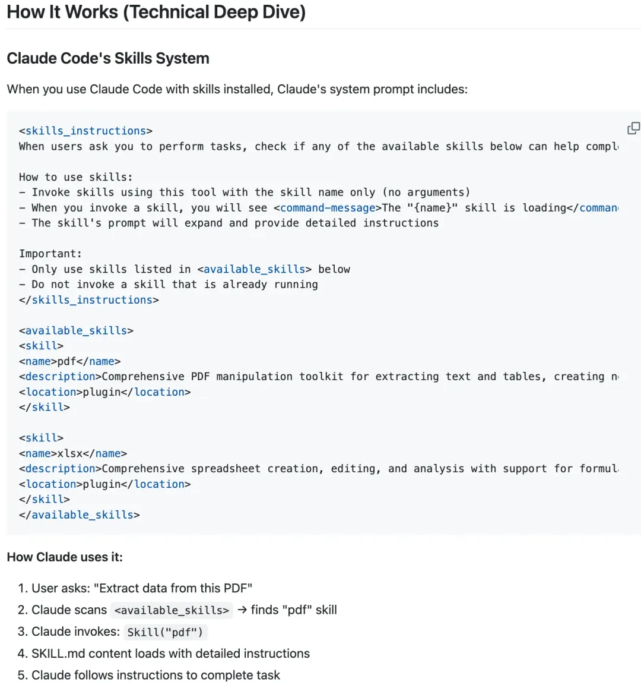

# Claude Skills｜将 Agent 变为领域专家

> **公众号**: 阿里云开发者  
> **发布时间**: 2025-12-15 08:30  

今年 10 月，Anthropic 推出了 Claude Skills 能力，在 Claude 网页端、API 以及 Claude Code等产品都可以使用。当前互联网对 Claude Skills 的关注度并不高，但仔细了解之后，我认为 Claude Skills（或者 Agent Skills）将会在短时间内成为工业级 Agent 标配的能力。

Claude Skills 解决了什么问题呢？一句话来讲，Claude Skills 是一种基于文件系统的、可复用的知识包，运行在 Claude 的沙盒虚拟机（VM）环境中，用于向 Agent 注入流程化、确定性的内部知识（SOP）的标准化方案。

## 一、什么是 Claude Skills

Anthropic 官方文档给出了 Agent Skills 的定义：

> Agent Skills are modular capabilities that extend Claude’s functionality. Each Skill packages instructions, metadata, and optional resources (scripts, templates) that Claude uses automatically when relevant.

> 智能体技能（Agent Skills）是一种模块化的能力，用于扩展 Claude 的功能。每个“技能”都封装了相应的指令、元数据和可选资源（例如脚本、模板）。当场景匹配时，Claude 会自动调用这些技能来完成任务。

Agent Skills 的三大组成要素，同时也构成了上下文的三个层级，从抽象到具体：

  * 元数据：Skill 的名称、描述、标签等信息；

  * 指令：Skill 具体的指令；

  * 资源：Skill 附带的相关资源（比如文件、可执行代码等）；

Anthropic 在 GitHub 上开源了一系列的 Agent Skills：

https://github.com/anthropics/skills/blob/main/theme-factory/SKILL.md

以画布设计的 Skill 为例，一个 Skill 就是一个文件夹，可以包含嵌套的子文件夹，形成 Skills 的嵌套层级。这个设计堪称大道至简，符合直觉且非常有效。

上面的三要素对应：

  * 元数据：包含在 `SKILL.md` 的 YAML 头中；

  * 指令：`SKILL.md` 的内容；

  * 资源：Skill 文件夹中的其他文件（例如下图中的 canvas-font 文件夹包含了设计画布时可使用的字体），资源可以在指令中被引用；

## 二、Claude Skills 是如何被 Agent 感知的?

Claude Skills 设计遵循了一个非常重要的原则：

> Progressive Disclosure - 渐进式批露：
>
> 分阶段、按需加载信息，而不是在任务开始时就将所有内容全部塞入本已宝贵的上下文窗口中。

整个加载过程分为三个层次，对应上面的三要素：

第一层：元数据（始终加载）

每个 Skill 都有一个 `SKILL.md` 文件，其头部的 YAML 元数据包含了名称和描述。

  *   *   *   *

    ---name: pdf-processingdescription: 提取 PDF 文件中的文本和表格，填写表单，合并文档。当处理 PDF 文件或用户提及 PDF、表单或文档提取时使用。---

元数据在 Claude 启动时加载，并始终保持在上下文窗口中，占用约 100 个 Token。

第二层：核心指令（触发时加载）

当 Claude 发现某个 Skill 与当前任务相关时，Claude 会使用 Bash 工具阅读 `SKILL.md` 文件的主体内容，例如：

  *   *   *   *   *   *   *   *   *   *   *   *

    # PDF 处理
    ## 快速入门
    使用 `pdfplumber` 提取 PDF 文本：
    import pdfplumber
    with pdfplumber.open("document.pdf") as pdf:    text = pdf.pages[0].extract_text()
    如需了解高级表单填写，请参阅 [FORMS.md](FORMS.md)。

如需了解高级表单填写，请参阅 [FORMS.md](FORMS.md)。

只有在这个时候，Skill 的核心指令和工作流程才会进入上下文窗口。Claude 开始学习如何完成这项具体任务。

第三层：代码与资源（按需加载）

一个复杂的 Skill 可能包含多个文件，形成一个完整的知识库。

  *   *   *   *   *   *

    pdf-skill/├── SKILL.md (核心指令)├── FORMS.md (表单填写指南)├── REFERENCE.md (详细的 API 参考)└── scripts/    └── fill_form.py (实用工具脚本)

Claude 会根据 `SKILL.md` 中的指引，在需要时才去读取 `FORMS.md` 或执行 `fill_form.py` 脚本。

执行脚本是最高效的方式。脚本代码本身永远不会进入上下文窗口，只有脚本的输出结果（例如 “验证通过” 或具体的错误信息）会作为反馈进入上下文。

下图说明了完整的渐进式披露的信息加载过程：

## 三、Claude Skills 和 MCP 的关系是什么?

  * Claude Skills 是一种基于文件系统的、可复用的知识包，运行在 Claude 的沙盒虚拟机（VM）环境中，用于向 Agent 注入流程化、确定性的内部知识（SOP）的标准化方案。

  * MCP 是一种开放 AI 工具的标准，允许任何外部服务（无论是 Jira、Stripe 还是内部 API）将自己的能力以一种标准化的方式暴露给 Agent，让 Agent 可以不关心工具注册、工具发现、工具调用等工程实现细节。

Claude Skills 和 MCP 是可以协同工作的，Claude Skills 为 Agent 提供领域知识、MCP 为 Agent 提供外部工具。

MCP 成为了 Agent 工具的事实标准，而且已经出现 Claude Skills Center，用于分享各种可拔插的专家知识包。

https://github.com/obra/superpowers/tree/main/skills

## 如何实现 Agent Skills

https://github.com/numman-ali/openskills

提供了一个与 Claude 官方近似的实现，思路非常直观，把 skills 写入 AGENTS.md 中，然后 Agent 可以通过 `Bash("openskills read pdf")`进行调用，这种方案可以支持 Claude Code 之外的其他 Agent，例如 Qwen Code、Codex 等。

****

### 主动式智能导购 AI 助手构建

为助力商家全天候自动化满足顾客的购物需求，可通过百炼构建一个 Multi-Agent 架构的大模型应用实现智能导购助手。该系统能够主动询问顾客所需商品的具体参数，一旦收集齐备，便会自动从商品数据库中检索匹配的商品，并精准推荐给顾客。

## 点击阅读原文查看详情。
