# DeepInsight x ChatBI：个人Agent助手养成计划

> **公众号**: 阿里云开发者  
> **发布时间**: 2025-12-05 08:30  

## 一、前言

这里我为什么取名为“个人Agent助手养成计划”，可以理解为个人Agent助手相当于你新招的一个员工，开始他可能什么也不会，双方也不太了解，而在不断使用的过程中，你慢慢理解怎么使用它，它也更懂你，而最终它会成为你一个很好的助理。它和人一样，需要不断学习，才能解决更多的问题。在这个过程中，我们需要不断对它进行调教。

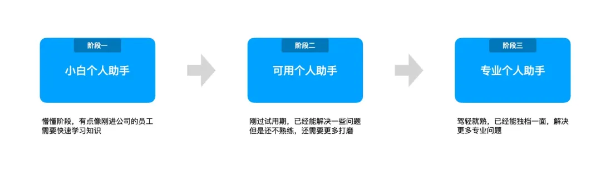

今天这篇文章，我们就看如何把它“打造成你的个人Agent助手”。要用好它就需要知道它的“习性”，如何一步一步养成能够解决实际问题的专业助理。从产品和技术的视角去分析每一个节点所碰到的困难，以及解决方案。

## 二、从用户视角一步一步拆解

接下来我们从用户的视角开始对整个使用流程进行一步一步拆解，在使用过程中会遇到哪些阻碍，以及我们的解决方案是什么？

用户在产品上核心会有这几步：

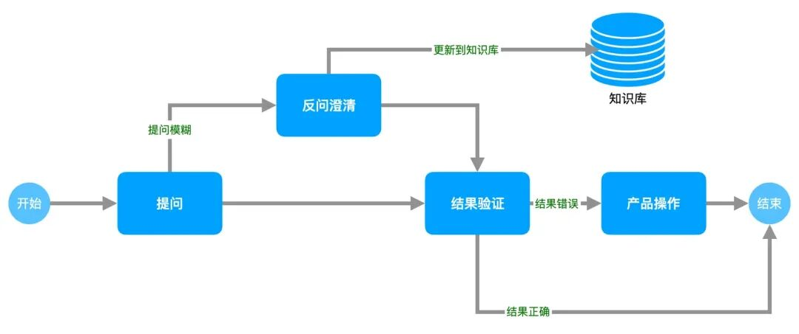

  * 自然语言提问，用户输入自己想问的问题，这里对用户有一个门槛就是什么算一个好的问题。

  * 反问澄清，如果提问模糊，会触发反问，用户补充信息。

  * 结果验证，对于用户来说有一个最大的问题就是这个结果是不是正确，产品层主要提供了三种校验方式：① AI校验；② 产品配置校验；③ 代码校验。

  * 产品操作，如果AI生成的结果错误， 通过产品操作的方式继续任务。

### 2.1. 如何提出一个好问题

很多人第一个反应一定是：用自然语言提问，这有什么不会的，我不会写代码，我还不会说人话吗？

然而实际情况下，确实提问是用户使用ChatBI碰到的第一个障碍，一般对于模型来说会有几大困惑：

  * 提问模糊，比如：“昨天的数据情况怎么样”，这里对于模型来说“数据”不知道用哪些指标进行表达。“怎么样”不知道是什么意思，什么算好，什么算差没有相对统一的标准。这样的问题模型给出来的答案就不一定尽如人意。一个比较好的问题：“昨天的取数Agent UV数是多少，相比上周同期增长多少”。这个指令就够明确。

  * 提问有歧义，比较常见的是时间选择，一个表里面很有可能有分区日期、创建日期等。那我在这里问“昨天的取数Agent UV数是多少，相比上周同期增长多少”，那模型也不知道这里的“昨天”是指创建日期还是分区日期。解决这个问题的办法一般是用知识进行约束，给这张表维护一个知识：“时间过滤请使用创建时间”，这样大模型就知道如何进行选择了。除了日期还有一些相似的度量都会导致模型出现“选择困难症”。这些问题我们人类解决都是“钉钉”对话进行询问。

  * 不知道怎么问，比如说有些度量用专业术语表达就会有困难，比如说“定义一个留存率的度量”，这里就会涉及到对哪个主体进行分析，以及留存率是周留存还是月留存。

  * 自然语言更麻烦，比较常见的就是计算列，用自然语言描述一个计算列的复杂度难以想象，这种用产品解决会更简单。

导致当前的现状主要两个原因：① 模型并没有想象的那么强；② 领域知识模型不具备。

解决这个问题，我们首先会在产品中生成一批问题，用户可以在里面进行选择。也可以基于这里的问题，进行相应修改，改成自己想问的一些问题。

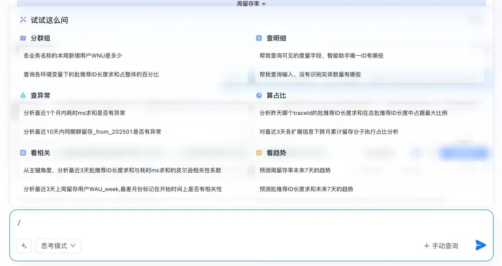

### 2.2. 增加反问澄清，让信息对齐变得更容易

前面提到了，人类的指令往往是模糊的，精准的指令需要额外的思考。比较典型的场景就是我们给老板写总结文字的时候都是“逐字斟酌”，反复看里面有没有歧义和表达不清楚的，原因就是要高效，不然就要反复对话来对齐信息。但是从人类大脑的构造来说，启动慢思考是一见非常耗能的事情，人类更倾向于用短句，不断补充。但是这在AI场景可能就非常灾难。大模型倾向于给出一个答案，而不是质疑你的问题。

为了使模型具备这个能力，我们专门设计了反问指令让模型具备反问的能力，下面就是一个实际案例：

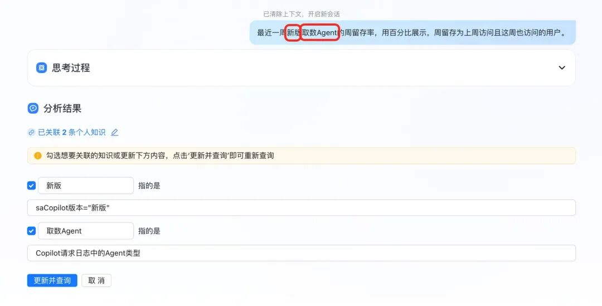

上面这个案例中就会有两个信息大模型不理解：一个是“新版”，一个是“取数Agent”。而这里我们就会模拟人类对话，在对话过程中，如果发现对方说的话有不太理解的地方，进行反问澄清。这个在人类对话中是一个非常常见的对齐信息的方式。

另外，这里对齐信息不是每次都要重复，系统会把这些信息存储在知识库中，下次用户提问的时候，如果在知识库中已经有这条知识，就不会触发反问澄清。这个机制也跟我们人类信息对齐是类似的，我们不需要每次都回到原点对齐信息。也就意味着，当我们不断使用的过程就是不断补齐知识，后续使用就会越来越方便。

> Tips：现在的知识只是在这个数据集下生效，如果要维护全局的知识需要去知识中心维护，我们会在11月份的版本解决这个问题。

下面是我们反问澄清的技术方案，核心是识别用户中的一些实体和数据集中的字段、维值和已有的知识进行比对，如果找不到相似的，则触发反问。

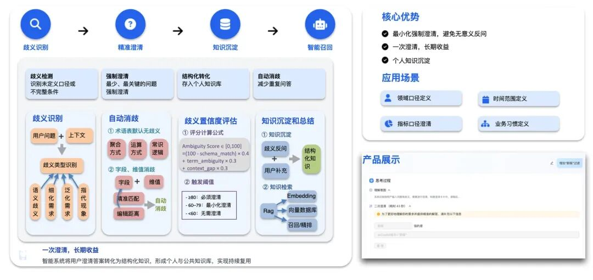

### 2.3. AI生成结果如何验证

前面讲用什么语言的时候讲到大模型一个天然特性就是“幻觉”，人类也有这个问题，人类解决这个问题的方法是通过多路径验证来解决，而这个方式我们用在了对大模型的结论中。

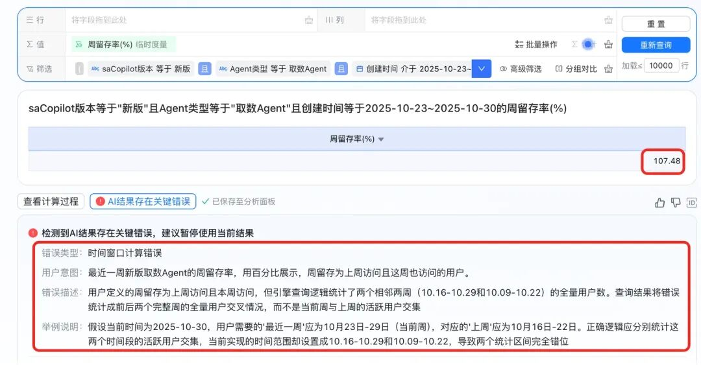

上面这张图就是一个例子，用户可以根据这个结论采取是否使用这个结果。

除了上面有AI的校验之外，用户还可以根据产品配置的方式进行验证。我们会把用户的查询转化成一个图表配置，用户可以根据这个配置判断是否和用户提问的意图保持一致，如果不一致还能基于产品配置继续修改。

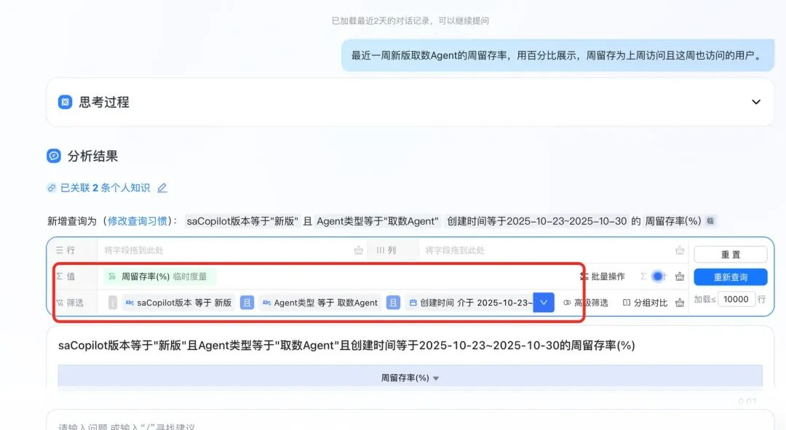

第三种方式就是直接看代码，最专业的方式肯定是直接看SQL或者DAL，当然也是门槛最高的方式。

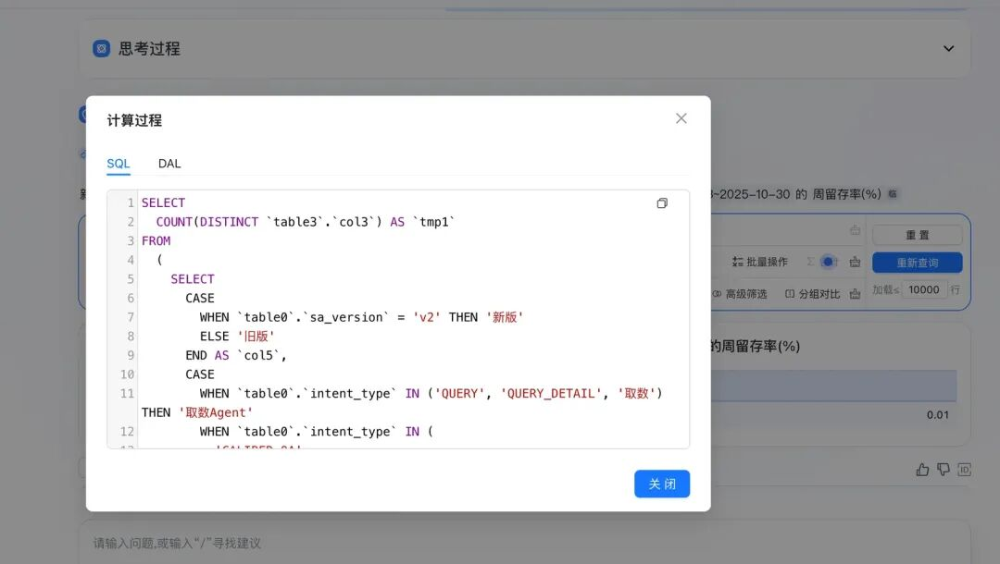

### 2.4. 模型生成错误后，用户如何操作

模型生成错误，是一个不可避免的事情，但是用户的任务还要继续，那么如何让用户无缝衔接成为我们优化的方向。解决方案类似于自动驾驶中的L2，在部分场景中，模型可以自运行，但是当碰到无法处理的路况时，智驾会让人类接管车机。而在我们这个场景也是如此。

如果用户发现生成的结果是错误时，那么用户可以通过配置化完成接下来的任务，而不需要再次修改问题提问。

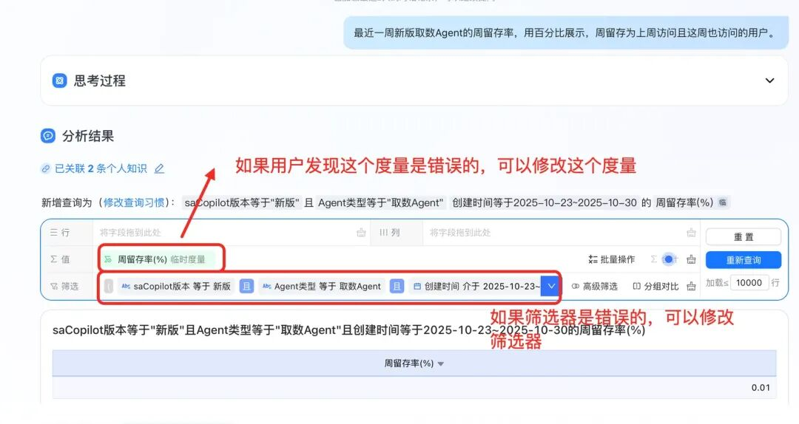

2.4.1. 自然语言结合产品交互的案例

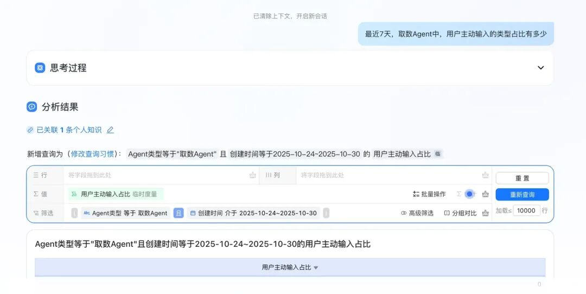

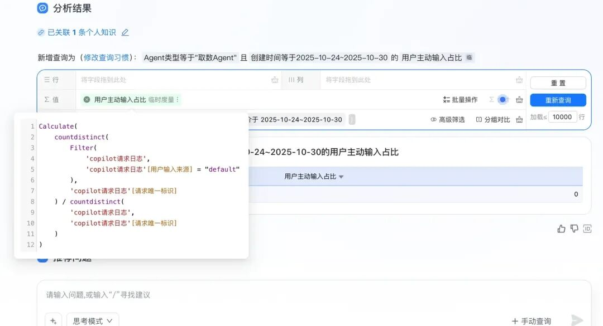

上面这个案例里面，度量生成的有点小问题，用户输入来源是“default”，实际上是“DEFAULT”，那么这里最快的方式就是修改这个度量。

第一步：找到度量编辑按钮

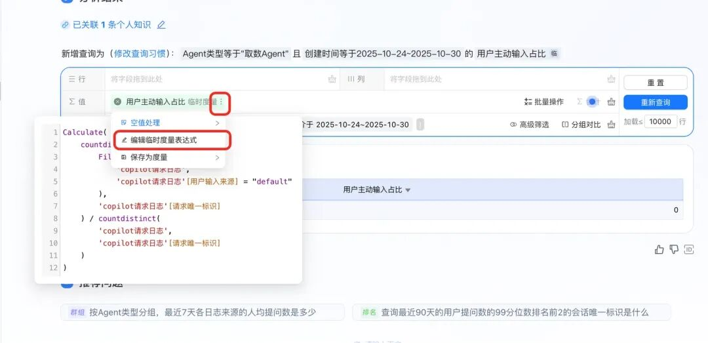

第二步：修改度量

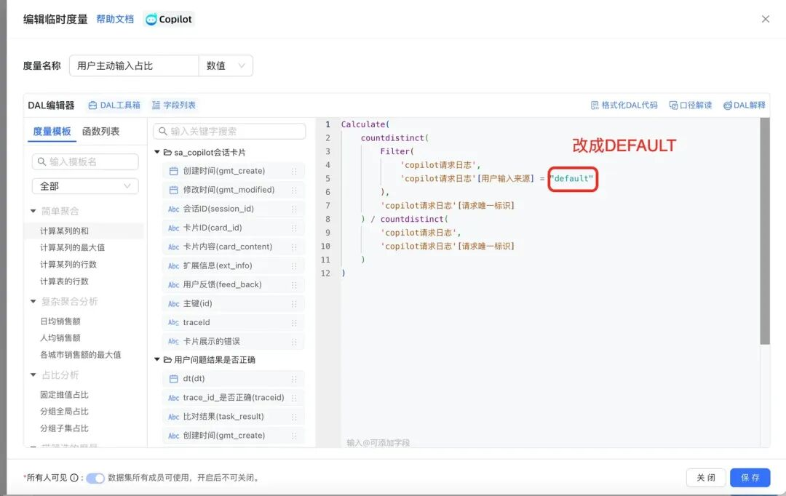

第三步：重新查询

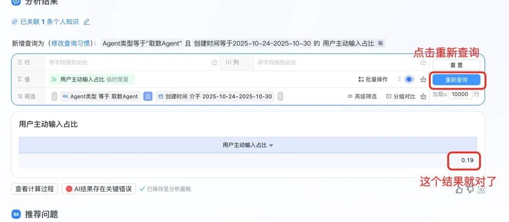

这样就可以在自然语言的基础之上，结合产品交互完成用户的需求。

录了一个完整视频，放在下面

已关注

__

关注

__ 重播 __ 分享 __ 赞

关闭 __

**观看更多**

更多 __

__

__

__

_退出全屏_

[ __](<javascript:;>)

_切换到竖屏全屏_ _退出全屏_

阿里云开发者已关注

[ __](<javascript:;>)

分享视频

 __，时长 00:31

0/0

00:00/00:31

切换到横屏模式

继续播放

进度条，百分之0

 __

[播放](<javascript:;>)

00:00

/

00:31

00:31

[倍速](<javascript:;>)

 _全屏_

 __倍速播放中

[ 0.5倍 ](<javascript:;>)[ 0.75倍 ](<javascript:;>)[ 1.0倍 ](<javascript:;>)[ 1.5倍 ](<javascript:;>)[ 2.0倍 ](<javascript:;>)

[ 超清 ](<javascript:;>)[ 流畅 ](<javascript:;>)

您的浏览器不支持 video 标签

__

继续观看

DeepInsight x ChatBI：个人Agent助手养成计划

观看更多 __

转载

,

DeepInsight x ChatBI：个人Agent助手养成计划

 __

阿里云开发者 已关注

分享点赞在看

 ____已同步到看一看[写下你的评论](<javascript:;>)

 __

[ 视频详情 ](<javascript:;>)

### 2.5. 当然，你也可以直接发起手动查询

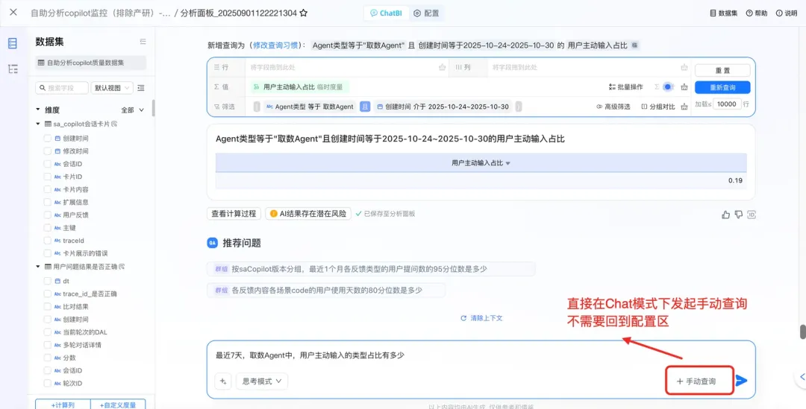

这里的设计逻辑在于，保证用户在这里沉浸式完成用户的任务，如果某些任务通过产品交互效率更高，可以直接通过产品交互完成。

## 三、总结

显然，大模型要真正解决用户问题，不是那么容易的事情。不在于产品有多绚丽，需要的是大模型和传统的工具进行紧密配合，需要扎实的解决每一个用户节点上的问题，我们相信一步一个脚印前行，一定会让ChatBI解决越来越多的问题。

****

### 通义千问3 + MCP：一切皆有可能

MCP 协议通过标准化交互方式解决 AI 大模型与外部数据源、工具的集成难题；通义千问3 原生支持 MCP 协议，能更精准调用工具；阿里云百炼上线了业界首个全生命周期 MCP 服务，大幅降低 Agent 开发门槛，用户只需 10 分钟即可构建增强型智能体。

## 点击阅读原文查看详情。
