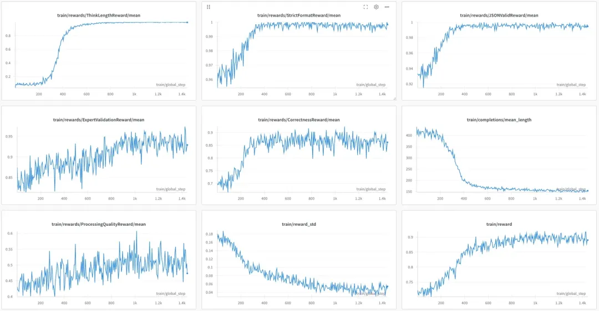
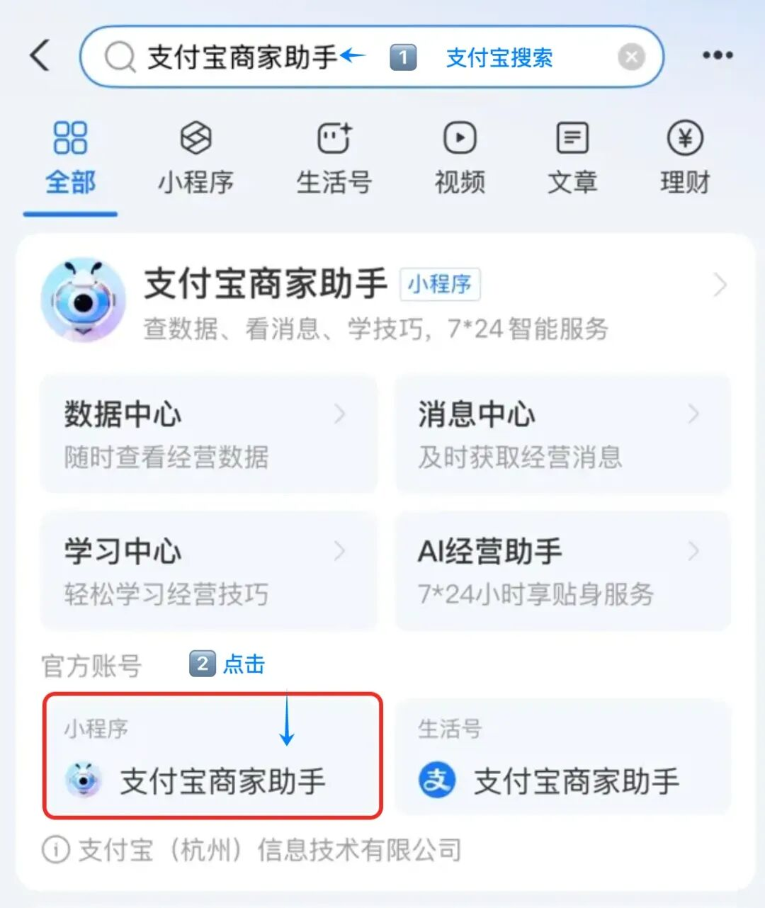
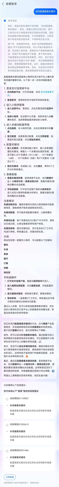
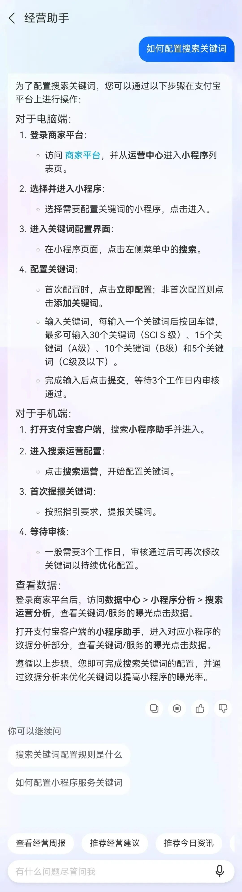
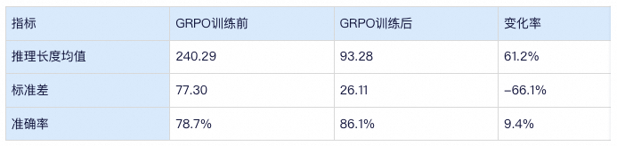
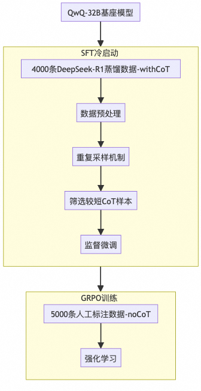
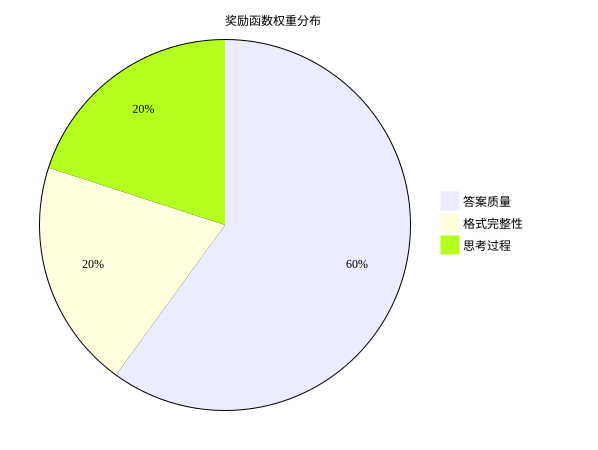
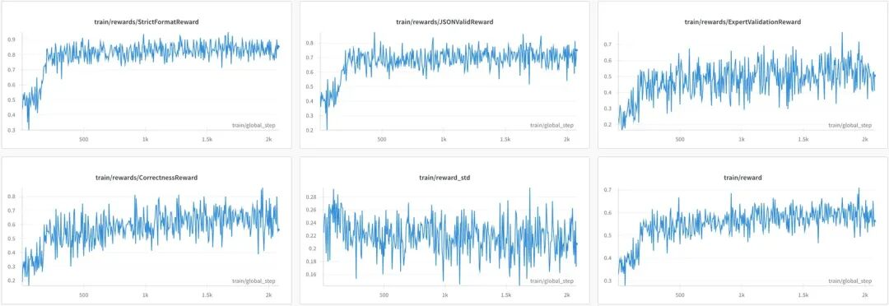
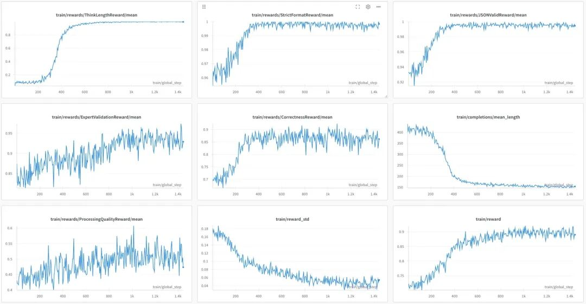
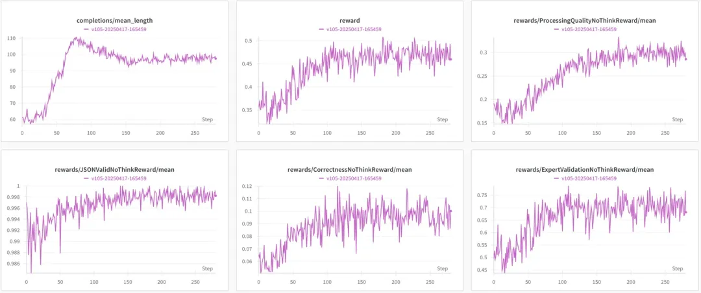

# Multi-Agent 的灵活编排之路

> **公众号**: 阿里云开发者  
> **发布时间**: 2025-05-26 08:30  

本文从 Copilot 3.0 架构中的规划（Planning）模块出发，结合 DeepSeek R1 的强化学习（GRPO）训练实践，深入探讨在多智能体（Multi-Agent）架构下，大模型如何灵活编排多个智能体，以更好地解决实际问题。

GRPO Trainning Table

## 背景

****

### 1\. 业务场景

商家经营Copilot作为一款专业的经营助手，主要服务于商家在日常经营中遇到的各类问题，其核心功能包括：

  * 基础业务支持：商家入驻、产品签约、运营工具使用等；

  * 运营服务：对账结算、数据分析、策略推荐等；

  * 智能优化：关键词配置、banner生成、商品图片优化等；

体验入口：支付宝APP搜索“支付宝商家助手”小程序。打开小程序可以直接体验经营助手Copilot。核心功能目前仅支持支付宝入驻商家。

从用户问题解决维度，Copilot需要具备以下核心能力：

1.全网搜索与自然语言解答

2.经营数据分析与可视化

3.平台策略智能匹配

4.图片素材生成与优化

5.精准用户群体圈选

### 2\. 问题分析

在总结Copilot2.0框架的局限性时，我们发现以下核心问题：

  * 单一LLM架构难以平衡业务需求与通用能力；

  * 意图识别、query改写、任务规划等子模块能力受限；

  * 对复杂query的处理效能不足；

基于这些挑战，我们在CY25对Copilot架构进行了重大升级，推出了3.0版本。该版本采用Multi-Agent架构，通过planning模型实现智能Agent调度，显著提升了系统的问题解决能力。

****

### 3\. Planning的角色

planning更像是去完成一道复杂的排列组合题，在充分理解用户问题的前提下（上下文），将用户问题分配给合适的一个或多个专家去解决问题，是同时包括改写、拆解、分配、生成执行顺序等多个环节的复杂任务。对于这样的复杂任务，我们首先会想到用CoT来提高准确率。CY24的Copilot2.0中的规划模块，我们首次尝试了短CoT模式，效果不错。在经过对比《没有思考过程》和《有思考过程》的planning准确率后，我们决定延用去年的CoT方式，并且在此基础上升级模型，显式地打印模型思考过程，让用户理解我们会有多个Agent共同服务他的问题。

举个例子，如果有三个 Agent（abc），理论上 planning 的分配方案至少有 15 种。再结合用户问题，给每个专家分配对应的需要解决的问题。

## 难点

****

### 1\. 鱼和熊掌如何兼得

用过 deepseek r1 深度思考模型的小伙伴都懂，有时候模型一思考起来就 “刹不住车”。思考过程太长，输出直接卡住；简单问题也翻来覆去地验证，说来说去都是车轱辘话。深度思考本来是为复杂问题设计的，可这也导致模型养成了反复验证的习惯。我们现在面临的难题就是，既要保证复杂问题的准确率，又得让简单问题的思考过程 “速战速决”，节省推理成本，提升用户体验。

### 2\. 思考过程如何标注

听说deepseek模型的很多数据是北大中文系的学生标注的，可我们的小二大多不是中文系专业，如何写出又符合业务又有逻辑性的思考过程？标一段思考过程耗时长，验收成本也高，真的有必要人工去写吗？带思考过程的数据标注，对于我们合成数据的要求更高。

### 3\. 每次产品迭代，历史数据都要重新标吗

业务迭代频繁，今天可能是5个Agent，明天升级成8个Agent，历史标注的数据都不能用了吗？如何在业务变更的情况下，低成本保证模型的迭代时效也很重要。

## 效果对比

### 1\. 从案例看

#### 1.1. 多agent案例对比

**Query**| **Copilot3.0**| **Copilot2.0**
---|---|---
**用户问题：** 如何配置搜索关键词
**对比分析：** Copilot3.0的planning模块将用户问题分配全网搜知识问答和策略推荐专家，即使用户问的是操作类，也为用户推荐合适的策略，更方便一键操作。预判用户的预判。
**执行计划：知识问答专家- >策略推荐专家**
Copilot2.0的意图直接判别为知识问答，用faq的形式回复用户，虽然没有错，但是不够智能。|
|

#### 1.2. 思考长度对比

Query| GRPO前| GRPO后
---|---|---
推荐今日资讯| | 

### 2\. 从指标看

GRPO训练后，推理长度均值由240.29降至93.28（降幅61.2%），长度波动性明显改善（标准差从77.30降至26.11），分布更趋集中。

同时，准确率由78.7%提升至86.1%，绝对提升7.4个百分点，相对提升9.4%。

同时验证了GRPO训练能在保障模型精度前提下，同时提升准确度和思考长度（即推理成本）。

（上面的结果是在标问3217条数据上跑批得到）

## 解决方案

### 1\. 数据集构造

#### 1.1. 输入输出定义

输入维度

  * 历史上下文窗口：采用动态滑动窗口（N轮对话）

  * 专家列表：Copilot中支持的Agent能力

  * 数据分析工具列表

  * 产品服务列表

  * ...

输出格式

  * 思考过程

  * 规划结果（补全问题+专家序列+专家处理的问题+执行顺序）

  *   *   *   *   *   *   *   *   *   *   *   *   *

    <think>好的，我现在需要处理用户的问题：“查看经营周报”。首先，根据提供的工具列表，用户问题属于其中的一项。因此，这个问题应该由数据分析专家来处理，因为他们负责查询和分析工具列表中的数据。接下来，检查是否有其他相关的子问题常要分解，但用户的问题很明确，所以不需要进一步拆解。最后，确认是否需要其他专家介入，但这里只需数据分析专家即可。</think>
    <answer>{  "补全后的问题": "查看经营周报",  "plan": [{    "专家": "数据分析专家",    "处理问题": ["查看经营周报"]  }]}</answer>

#### 1.2. 冷启动数据

使用Deepseek R1套取合成数据（思考过程+规划结果），筛选长度较短的样本，用于sft阶段的训练。该阶段主要让模型学会按照特定的格式输出。

#### 1.3. 人工标注数据

人工标注合成数据（仅规划结果），用于GRPO训练。通过人工标注，确保模型在规划结果上的准确性和一致性，为后续的强化学习提供高质量的训练数据。

### 2\. 多阶段训练（SFT+GRPO）

如果说sft是应试教育的话，grpo就是素质教育，给模型一个范围去探索，从更优的回答中找到下一步迭代的方向。sft的训练我不过多赘述，下面详细展开GRPO的训练过程。

#### 2.1. 训练配置

基座| QwQ-32B
---|---
GPU配置| 3机24卡A100
参数配置| 比较重要的设置是`lr`和`beta`，即KL散度的梯度的权重。这两个参数设置的越大，模型收敛原则上更快，但训练往往会不稳定。在实际训练中，请根据是否出现不稳定的震荡情况适当调整这两个参数。
训练框架| ModelScope的ms-swift

#### 2.2. 奖励函数设计

Reward系统主要从三个方向展开，涉及7个不同的reward function，可以根据每部分的重要性进行加权平均。

例如：

  *

    Reward = 0.1 * StrictFormatReward + 0.1 * JSONValidReward + 0.1*ThinkLengthReward + 0.1 * ThinkQualityReward + 0.2 * CorrectnessReward + 0.3 * ExpertValidationReward + 0.1 * ProcessingQualityReward

多维度奖励体系

格式完整性评估

  * StrictFormatReward：正则匹配XML标签结构有效性；

  *   *   *   *   *   *   *

    class StrictFormatReward(BaseReward):    _pattern = re.compile(r"^<think>\n.*?\n</think>\n\n<answer>\n.*?\n</answer>$", re.DOTALL)
        def __call__(self, completions, **kwargs) -> List[float]:        processed = self.preprocess(completions)        return [1.0if p.answer and self._pattern.match(c) else0.0                for c, p in zip(completions, processed)]

  * JSONValidReward：校验JSON结构完整性和字段合规性；

思考过程评估

  * ThinkLengthReward：限制思考文本长度；

  *   *   *   *   *   *   *   *   *   *   *   *   *   *   *   *   *   *

    class ThinkLengthReward(BaseReward):    def __call__(self, completions, **kwargs) -> List[float]:        processed = self.preprocess(completions)        rewards = []        for p in processed:            try:                length = len(p.think)                if min_length <= length <= max_length:                    rewards.append(1.0)                else:                    # 使用S形曲线计算惩罚                    deviation = abs(length - mid)/eps  #                     reward = 1.0 / (1.0 + np.exp(5*(deviation-0.5)))  # 平滑过渡                    rewards.append(float(reward))            except Exception as e:                logger.error(f"Error calculating think length reward: {e}")                rewards.append(0.0)        return rewards

  * ThinkQualityReward：关键词过滤机制（如"微信"等敏感词检测）；

答案准确性评估

  * CorrectnessReward：改写准确率，多维度评估（语义相似度/覆盖度）；

  * ExpertValidationReward：专家分配准确率；

  * ProcessingQualityReward：规划准确率，多维度评估（语义相似度/覆盖度/多样性）；

### 3\. 多任务混合训练

GRPO可以很好的保证模型的泛化能力，对于分配Agent的任务，模型学习的是在给定的列表中选择更合适的Agent。如果要加新的Agent，那么可以在原有数据集基础上增加新增任务的数据。在sft模型的基础上进行grpo训练。我们把历史数据和迭代后的数据混合在一起进行训练，并不影响模型的效果。在推理时，使用最新的推理prompt就可以满足迭代的效果。

举个例子：

因为业务变动原本分配给《策略Agent》的问题，需要剥离一部分分给《人群运营Agent》。

ToDo：在prompt中的专家列表新增《人群运营Agent》，新增相关训练数据，与历史数据混合。

Tips：这里不需要更改历史数据，因为历史的Prompt的专家列表没有《人群运营Agent》，《策略Agent》就是问题的当下最优选择。

## 实验现象

### 1\. 有思考过程

#### 1.1. 直接GRPO

现象：

所有reward func都是从一个较低的值开始震荡，reward最终在0.5-0.6之间收敛。

#### 1.2. 先SFT再GRPO

现象：

1.模型格式遵循、答案质量一开始就是比较高的水平。

2.随着模型迭代，改写、专家选择、规划reward都在提高。

3.思考长度显著下降，并最终收敛在 150 左右。

4.reward 最终在 0.9 左右收敛。

### 2\. 无思考过程

#### 先SFT再GRPO

现象：

1.经过GRPO之后，无思考过程的模型能力也可以有一定的提升；

2.模型的平均输出变长，最后稳定在100token左右；

3.改写能力一直很弱，可能需要回溯prompt和数据质量。

****

### 云上经典架构serverless版

本方案采用云上的Serverless架构，原生支持弹性伸缩、按量付费和服务托管，减少企业手动资源管理和性能成本优化的工作，同时通过高可用的配置，避免可能遇到的单点故障风险。

## 点击阅读原文查看详情。
