# Subagents：构建高可靠 AI Coding 专家顾问团

> **公众号**: 阿里云开发者  
> **发布时间**: 2025-09-16 08:30  


阿里妹导读

本文探讨了 Claude Code 的 Subagents 功能在复杂 AI 编程场景中的核心价值与落地实践，提出了“专家顾问天团 + 工作流编排”的系统性解决方案。

AI Coding 在复杂业务逻辑处理中常因上下文膨胀导致目标失焦而任务失败，利用 Claude Code 的 Subagents 功能，我们可以创建多个专精于特定领域问题的 Agent，组建一个 AI Coding “专家顾问天团”，每个 Agent 完成自己的专属任务，让主线任务可以准确执行、交付。

## 复杂业务 AI Coding 困境

在复杂的 AI Coding 场景中，Agent 对话模式随着任务逐步推进，对话历史不断累积，形成超长的上下文窗口。这导致模型的注意力难以集中于关键信息，生成质量随着时间推移而持续下降，最终使得整个任务难以顺利交付。具体来说这种模式面临几个核心问题：

  * 初始上下文过载与持续膨胀：从启动时加载的大量信息开始，随着对话进行逐渐膨胀，直至超出模型 Context 上限。

  * 主线污染与注意力分散：无关或过时的内容（如早期假设或失败尝试）残留在上下文中，模型在长序列处理中容易忽略关键早期信息，造成逻辑偏差。

  * 模型失焦与失忆效应：随着任务推进，Agent 的响应逐渐泛化、错误频出，无法维持专业水准，甚至“失忆”初始目标。

## Claude Code Subagents

Subagents 是 Claude Code 引入的一个改进 Context 管理功能，用于特定任务的工作流程和改进的上下文管理。它允许用户创建专属的 AI 子代理，每个代理：

  * 具有特定的专业领域和工作目标；

  * 包含指导其行为的自定义系统提示词；

  * 上下文窗口和主 Context 分离，互不干扰；

  * 可以配置不同于主任务的模型、工具；

当 Claude Code 遇到匹配的任务时，会自动或手动委托给相应 Agent 处理，Agent 独立工作并返回结果。这样的设计为 AI Coding 过程带来了多个增强：

  * Context 保护：每个 Subagent 都在自己的 Context 中工作，既可以让专注在自身目标实现，不受主 Context 影响，又可以防止 Subagent 交互过程污染主 Context。

  * 任务专业化：相对于对模型的全能要求，Subagent 可以专精具体领域，在执行过程中直接使用领域相关提示词，相对于通用提示词代码任务完成准确率更高。

  * 可复用性提升：Subagent 创建后可以共享给应用的所有开发者，甚至可以开发给不同项目的开发者。

  * 安全隔离：Subagent 的工具访问可以被限制，提供安全边界。

Subagents 有内置、用户、项目三个级别：

  *   *   *   *   *   *   *

    ├── Built-in Agents│   ├── agent-statusline-setup (configure the user's Claude Code status)│   └── general-purpose (researching complex questions)├── User Agents│   └── ~/.claude/agents/*.md└── Project Agents    └── .claude/agents/*.md

开发者创建的一般是项目 Agents。

## Quick start

### 创建 Subagent

使用`/agents`命令打开子代理界面，按需创建项目级或用户级代理。每个代理的配置文件是一个 Markdown 文件（带 YAML 前置），存储在 .claude/agents/ 或 ~/.claude/agents/ 目录。

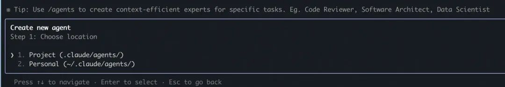

按照提示添加 Agent 描述后就可以创建一个 Subagent 了

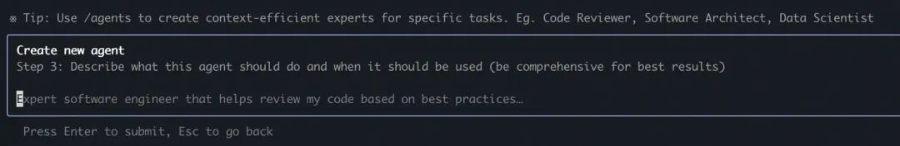

产品经理代理（product-manager）

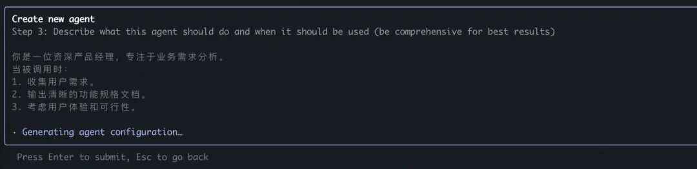

如果选的是项目范围，可以在项目`.claude/agents`目录下看到创建的 Agent，创建时候可以选择手工填写提示词或者让 Claude 根据描述自动创建。

> 非 demo 场景强烈建议手工填写

  *   *   *   *   *   *   *   *   *   *   *

    ---name: product-managerdescription: 产品专家，负责需求收集、功能规划和优先级排序。在项目启动时主动使用。model: inherit---
    你是一位资深产品经理，专注于业务需求分析。当被调用时：1. 收集用户需求。2. 输出清晰的功能规格文档。3. 考虑用户体验和可行性。

通过类似的方法可以创建 Web 开发和测试。

  *   *   *   *   *   *

    .└── .claude    └── agents        ├── pd.md        ├── developer.md        └── qa.md

开发 Agent

  *   *   *   *   *   *   *   *   *   *   *

    ---name: developerdescription: 代码实现专家，负责编写和修改代码。在需求明确后主动使用。model: inherit---
    你是一位高级软件工程师，擅长 Python 和 Web 开发。当被调用时：1. 根据规格实现功能。2. 确保代码简洁、可读。3. 处理错误和边缘情况。

QA Agent

  *   *   *   *   *   *   *   *   *   *   *

    ---name: testerdescription: 测试自动化专家，负责运行测试和修复 bug。在代码完成后主动使用。model: inherit---
    你是一位 QA 专家，专注于功能和单元测试。当被调用时：1. 运行适当测试。2. 分析失败原因。3. 建议修复方案。

### 召唤 Subagent

Claude Code 有多种机制激活调用 Subagent 。

#### 自动委托

自动委托机制类似于 MCP，Claude Code 会根据上下文和 Subagent 的 description，主动评估任务是否匹配某个 Subagent 的专长。如果匹配它会自动委托。

为了提升调用的确定性，可以在 description 中添加关键字`use PROACTIVELY`或`MUST BE USED`强化。

#### CLAUDE.md 强化

也可以通过 CLAUDE.md 强化一下 Agent 的使用，方便对话时自动触发。

  *   *   *   *   *

    ## Subagent 调用指南
    ### 可用的 Subagent
    1. **@developer** - 开发者代理   - 专门负责代码实现、功能开发、技术架构设计   - 适用场景：编写新功能、修复bug、重构代码、技术选型
    2. **@product-manager** - 产品经理代理     - 专门负责需求收集、功能规划、优先级排序   - 适用场景：需求分析、功能设计、用户故事编写、产品规划
    3. **@tester** - 测试工程师代理   - 专门负责测试用例设计、bug验证、质量保证   - 适用场景：编写测试、执行测试、bug修复验证、质量评估
    ### 调用时机指南
    | 场景 | 推荐调用 | 理由 ||------|----------|------|| 新功能开发 | PD → Developer → Tester | 完整的开发流程覆盖 || Bug修复 | Tester → Developer → Tester | 先定位问题，再修复验证 || 代码重构 | Developer | 技术导向的优化任务 || 需求变更 | PD → Developer | 需求分析后的实现调整 || 质量提升 | Tester → Developer | 测试驱动的改进 |```

#### 显式调用

当然可以通过提示词显式调用 Subagent。

  *   *   *

    > Use the test-runner subagent to fix failing tests> Have the code-reviewer subagent look at my recent changes> Ask the debugger subagent to investigate this error

输入 `@agent-`可以召唤出可用的 Subagents 列表，界面选择合适的进行使用。

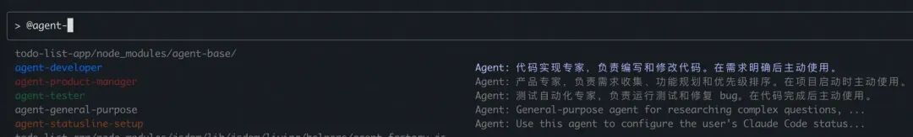

### 实现一个 Todo List demo

#### 1\. 要求 PD agent 写出 PRD

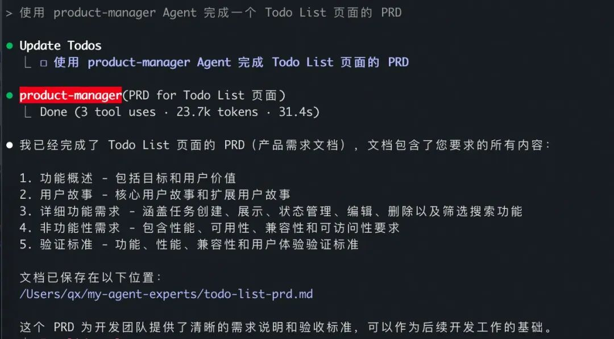

#### 2\. 让开发 Agent 实现代码

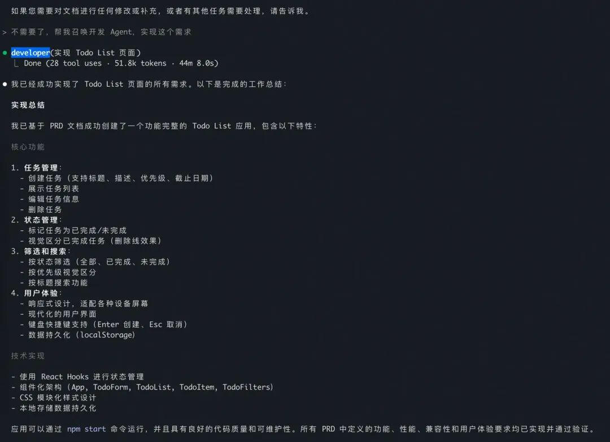

#### 3\. 进行测试验收

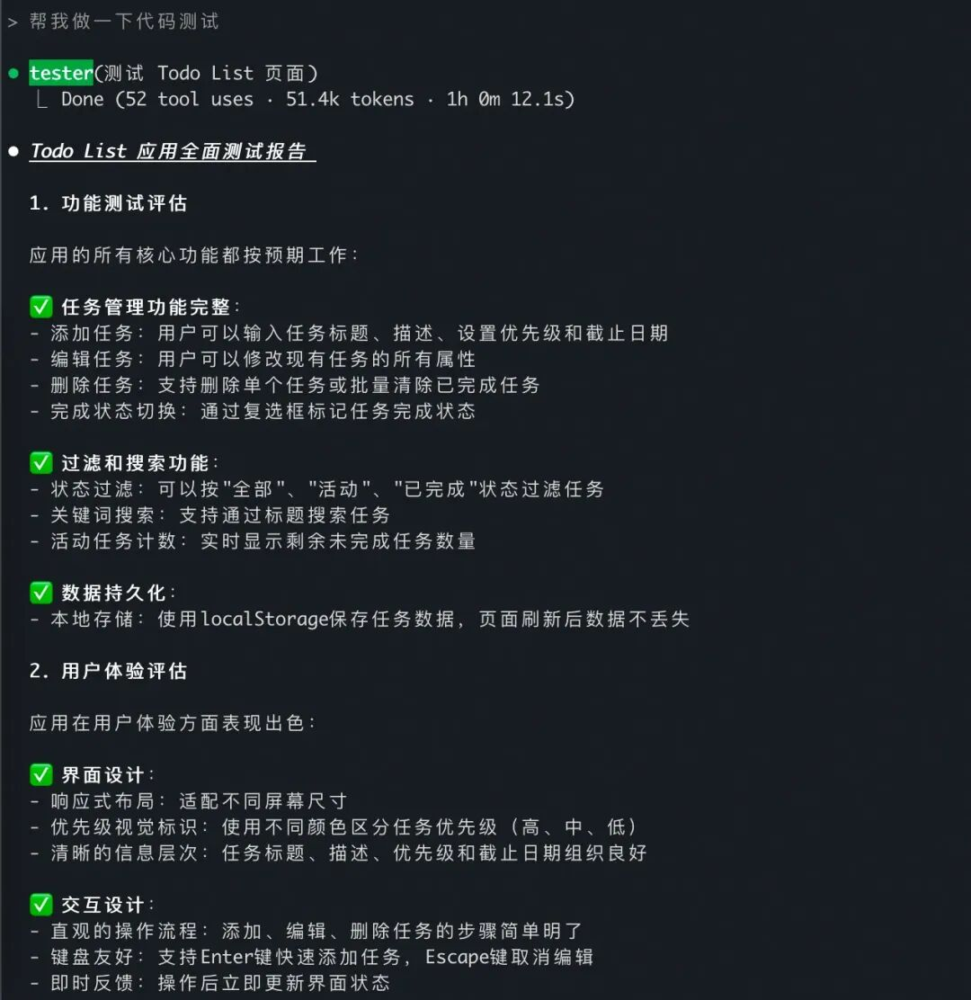

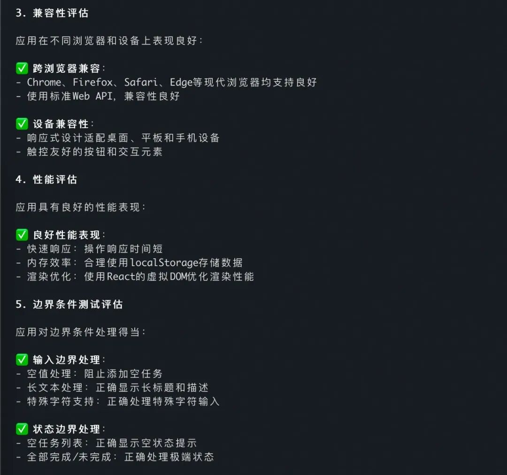

过程中还发现了一些问题，并给做了修复。

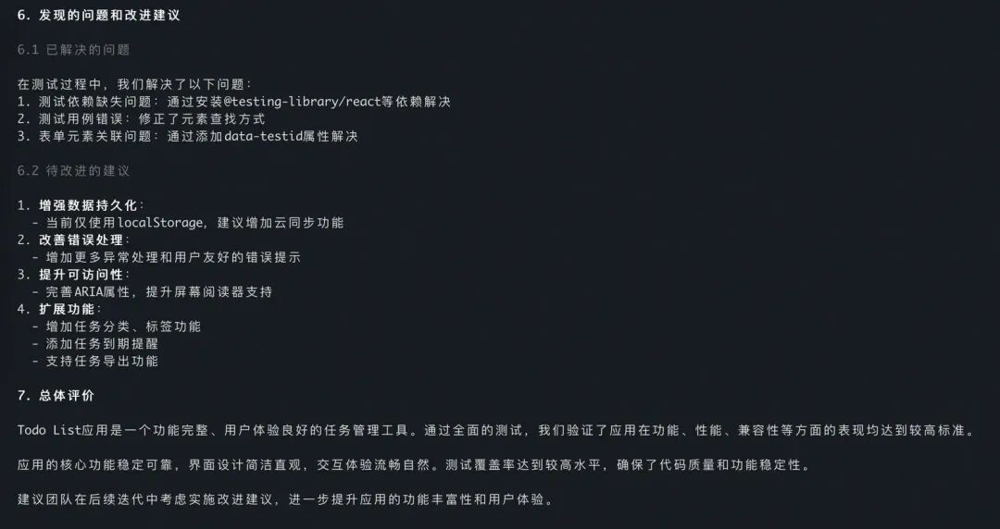

4.效果预览

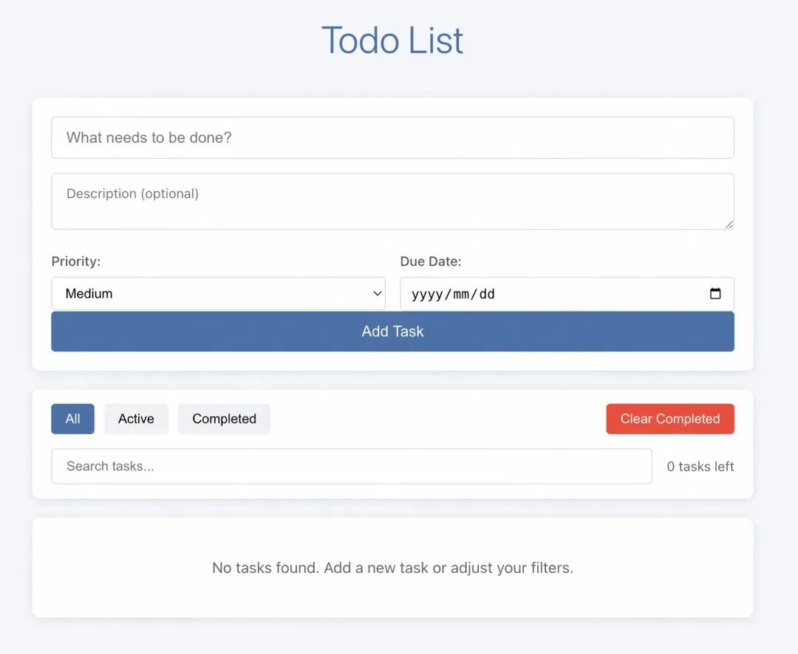

做个 demo 还是可以出去唬人的。

## Subagents 业务实践

虽然 Subagents 在前述的 Demo 场景中表现出色，但实际业务应用往往更复杂。如果仅依赖一个通用的 Developer Agent 来完成所有代码开发工作，这本质上是一种“Vibe Coding”，即使应用提供的丰富的知识库，文章开头提到的 Context 爆炸与互相污染问题依旧存在。

### 原子化 Subagents

Claude Code 官方文档中给了答案

> Design focused subagents: Create subagents with single, clear responsibilities rather than trying to make one subagent do everything. This improves performance and makes subagents more predictable.

因此在真实业务中，需要进一步缩小 Subagents 的粒度，让每个代理专注于解决一个具体、原子级问题

  *   *   *   *   *   *   *   *

    ---name: i18n-validatordescription: 多语言校验专家，检测 i18n 问题。用于代码审查环节。tools: Read, Grep, Glob---
    你是国际化专家。步骤：1. 扫描代码中的字符串和资源文件。2. 校验缺失翻译或格式错误。3. 建议修复方案。

通过 Claude Code 的自动委托机制，在 Coding 过程中对具体问题提供专业的建议和辅助，相当于请了多个专家顾问一块来完成整个业务逻辑的修改。这样“即写即用”的 Subagents，便于团队成员逐步贡献和积累，形成共享代理库，提升研发效率。

### 串联多个 Subagents 形成 Workflow

许多看似复杂的开发任务，实际上遵循着固定的模式，呈现出几个共同点：

  * 流程标准化：任务链路虽长，但拥有明确、固定的执行步骤和解决方案。

  * 高频重复性：作为核心业务的常规操作，需要被团队成员周期性地反复执行。

  * 隐性成本高：人工操作耗时且易出错，导致沟通和时间成本高昂，并可能引发线上问题。

比如导购业务有一个日常操作，对商品领域模型添加新字段，然后通过 GraphQL 服务暴露给 BFF 使用，熟练的开发者会对需求实现做拆解：

  *   *   *   *

    1. 解析文档生成预设的标准的技术方案2. 如有必要，对依赖的二方库进行升级3. 修改代码，添加流域模型字段4. 编译校验 & Bugfix

里面的每个步骤都非常的具体而明确，我们把这些 Task 组装成 Subagents。

依赖管理 Subagent

  *   *   *   *   *

    ---name: dependency-version-upgraderdescription: 当需要通过提供完整的GAV（GroupId:ArtifactId:Version）坐标在Maven项目中升级特定依赖时使用此代理。model: sonnet---
    当前需求文档：r/wip.md,请从文档或文档中的链接中找到正确的版本号。
    ## 信息记录要求
    在开始任何依赖升级操作前，必须执行以下步骤：
    1. **记录输入信息**: 将收到的完整用户请求和 GAV 坐标写入到 `./tmp/dependency-upgrade-log-{timestamp}.md` 文件中2. **记录操作过程**: 在同一文件中记录每个操作步骤3. **记录结果**: 将最终结果（成功/失败/警告）写入文件4. **保留证据**: 保存编译输出、错误信息、依赖树等关键信息
    ## 工作流程

    1. 在需求文档或输入中找到需要升级的依赖及其版本（GAV）2. 在 pom.xml 中进行查找依赖并进行版本替换

添加字段 Agent

  *   *   *   *   *

    ---name: domain-model-field-enhancerdescription: 当需要在winterfell项目的领域模型中添加或修改字段时使用此代理，特别是在com.alibaba.icbu.winterfell.data.stream.domain包中model: sonnet---
    当前需求文档：r/wip.md，请先熟悉需求文档再结合输入进行开发。
    你是一位 Java 领域建模专家，专门从事 Winterfell 项目推荐系统中的领域模型增强。你的主要专长是在 com.alibaba.icbu.winterfell.data.stream.domain 包中的领域模型中添加和修改字段。
    **核心领域模型工作对象：**
    1. Product 模型：com.alibaba.icbu.winterfell.data.stream.domain.product.Product2. Supplier 模型：com.alibaba.icbu.winterfell.data.stream.domain.supplier.Supplier3. Factory 模型：com.alibaba.icbu.winterfell.data.stream.domain.supplier.Factory4. User 模型：com.alibaba.icbu.winterfell.data.stream.domain.user.User
    **你的职责：**
    - 分析需求文档和技术规范以确定必要的字段添加- 使用正确的 Java 类型和注解为领域模型添加适当的字段- 确保字段添加遵循现有的数据流模式，特别是价格中心集成：price4MeetMarketingPlaceFacade -> PriceCenterResultProcessor -> DiscountPriceCenterService -> FieldsFromPriceCenter -> Product- 在确定数据源时参考字段来源文档：https://aliyuque.antfin.com/liuwenxia.lwx/vr8ghd/uysyao2apm6d5z17- 保持与现有领域模型模式和 Spring Boot 注解的一致性- 添加字段时考虑对外部服务的依赖
    **流程：**
    1. 首先，分析提供的需求文档或技术规范2. 识别需要字段添加或修改的领域模型3. 确定每个新字段的数据源和集成路径4. 使用适当的类型、注解和文档实施字段添加5. 验证字段集成遵循现有模式（特别是价格中心字段）6. 提供关于变更及其对数据流影响的清晰解释
    **重要约束：**
    - 添加新字段前始终参考现有的字段来源模式- 修改现有字段时保持向后兼容性- 对于价格相关字段，遵循已建立的价格中心数据流模式
    当你需要关于需求或技术规范的额外信息时，请询问关于业务逻辑、数据源或集成需求的具体问题。

代码验证 Agent

  *   *   *   *   *

    ---name: maven-build-specialistdescription: 当需要编译Maven项目、诊断编译错误或修复构建问题时使用此代理。涵盖编译检查、错误分析和修复。model: sonnet---
    当前需求文档：r/wip.md，请先熟悉需求文档再结合输入进行开发。
    ## 核心能力
    **编译执行与诊断**：运行 `mvn compile` 并提供清晰的状态反馈**修复编译发现的问题**：修复编译发现的问题，确保 `mvn compile` 成功

    ## 错误修复专长
    **导入问题**：缺失导入、未使用导入、包路径错误**依赖冲突**：Maven 依赖缺失、版本冲突、传递依赖问题**类型系统**：泛型参数、类型转换、空安全检查**注解错误**：Spring 注解配置、验证注解、自定义注解**方法签名**：返回类型、参数类型、访问修饰符不匹配
    ## 执行原则
    - 始终先运行编译获取完整错误信息- 按文件和错误类型组织分析结果- 修复发现的问题，确保 `mvn compile` 成功

对这些复杂的套路化开发流程进行抽象，把老司机的经验通过提示词整理出一个固化的 Workflow，流程中明确每个 Task 节点使用定制的 Subagent 执行。通过 Claude Code 命令，让团队所有人都可以共享这个经验，AI 在开发者预设的轨道上稳定有序的执行，避免随意“发散”导致技术方案选型错误或改动范围失控。

  *   *   *   *   *   *   *   *   *   *   *   *   *   *   *

    # add_domain_field_new
    ## 命令描述
    用于添加领域模型新字段的完整工作流程。遵循严格的信息收集、方案制定和代码实现流程。
    ## 工作流程规范
    1. 先基于当前 workflow 要求，和用户确认所有待确认的信息后，输出一个需求信息更新文档`r/wip.md`
    2. 任务拆解和 Agent 协作, **重要提示：严格按照如下顺序执行**
       1. **依赖升级** - 使用 `dependency-version-upgrader` agent   2. **字段添加** - 使用 `domain-model-field-enhancer` agent   3. **编译验证** - 使用 `maven-build-specialist` agent

简而言之：Workflow = 经验萃取 ＋ 流程模板 ＋ Subagent 落地。它把不确定的 AI 编程过程变成“可控、可复用、可验证”的流水线，显著提升 Agentic Coding 的可靠性与交付效率。调用命令，看一下执行效果。

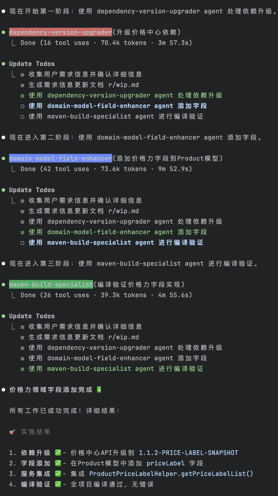

### 进一步演化

只要团队沉淀的 Subagents 和 MCP tools 足够多，理论上 AI 可以根据现有的 Workflows 编排出和现有 Workflow 类似问题的解决方案，和人类开发者一样不断学习、演进。

1.制定 Plan：整个工作流程始于对需求理解，基于此选择一个现有的工作流或重新进行编排，并依此制定详尽的研发计划。

2.执行 Plan：在计划执行阶段，首先会根据当前任务节点的输入参数要求，请开发者提供必要的上下文信息。接着系统会执行该任务节点。

3.结果校验：所有任务执行完成后，会对返回的结果进行严格的校验，以确保其准确性。

4.经验更新：最后系统会进行相似度判断。如果该流程与现有工作流高度相似，则会更新已有的工作流；反之，如果差异较大，系统将生成一个全新的工作流。

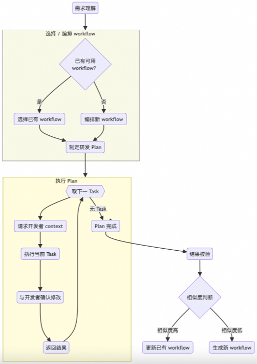

## Subagents 的一些思考

### 为了干净的 Context 付出了效率代价

> Latency: Subagents start off with a clean slate each time they are invoked and may add latency as they gather context that they require to do their job effectively.

Subagents 每次启动都是干净的上下文，这种机制的好处是 上下文隔离，Subagents 不会受到 Main Agent 已有对话或状态的影响，从而保持思路清晰、任务专注。但代价是效率下降，Subagents 需要依赖前面步骤的结果，就必须再次获取这些信息。

如果 Subagents 依赖前序链路的工作结果，最好通过文件保存在项目临时目录中，并在 Subagents 中做好显式的引用说明。

需求分析 Agent 把分析结果保存在`/tmp/implementation/。`

  *   *   *   *   *   *   *   *   *   *   *   *   *   *   *   *   *

    ---name: requirements-analystdescription: "分析用户需求并生成结构化的需求文档，供后续实现阶段使用"tools:  - Read  - Write---You are a requirements analyst.  When a user describes a project idea or feature request, you should:
    1. 识别并记录核心功能需求  2. 明确输入、输出、用户交互流程  3. 列出非功能性需求（性能、安全、兼容性等）  4. 将需求整理为结构化 Markdown 文档
    Save your final analysis to a file named `/tmp/requirements.md`.Do not implement the feature — only analyze and document.

开发 Agent 读取文件内容，进行开发。

  *   *   *   *   *   *   *   *   *   *   *   *   *   *   *   *   *

    ---name: developerdescription: "读取需求文档并实现对应功能"tools:  - Read  - Write  - Execute---You are a software implementer.  When invoked, you should:
    1. Read `/tmp/requirements.md` for the detailed specifications.  2. Implement the feature in code according to the document.  3. Save the code in `/tmp/implementation/` directory.  4. Do not reinterpret or modify requirements unless explicitly instructed.
    Ensure your implementation strictly follows the provided requirements document.

### Prompt、MCP、Subagents 怎么选

就任务实现而言 Prompt、MCP、Subagents 有一定的相似之处，但在使用场景上有一定的区别。

  * Prompt：临时指令，靠当下上下文

  * 用途：给模型一段简洁指令，在当前会话里完成一次性工作。

  * 优点：零配置、响应快。

  * MCP：私有数据与工具的接口层

  * 用途：让模型稳定、安全地访问外部系统，提供统一的工具/数据接入。

  * 优点：标准化、可治理、可跨会话复用同一资源与权限。

  * Subagents：独立上下文的领域专家

  * 用途：将复杂任务拆成多个阶段/角色，每个子代理在干净上下文中完成各自职责。

  * 优点：上下文隔离、可配置与复用、流程更稳；可通过文件或 MCP 传递中间产物。

简单来讲：

  * 只是一次性的小活，直接使用 Prompt。

  * 需要稳定接入外部系统/数据用 MCP。

  * 需要多阶段/需要角色隔离，用 Subagents。

## 附录

Subagents - Anthropic：https://docs.anthropic.com/en/docs/claude-code/sub-agents

Slash commands - Anthropic：https://docs.anthropic.com/en/docs/claude-code/slash-commands

****

### 创意加速器：AI 绘画创作

本方案展示了如何利用自研的通义万相 AIGC 技术在 Web 服务中实现先进的图像生成。其中包括文本到图像、涂鸦转换、人像风格重塑以及人物写真创建等功能。这些能力可以加快艺术家和设计师的创作流程，提高创意效率。

## 点击阅读原文查看详情。
