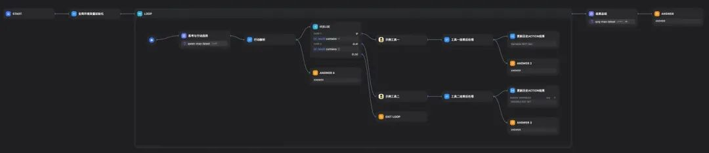
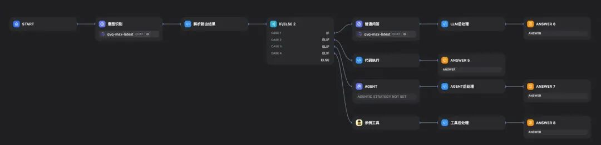
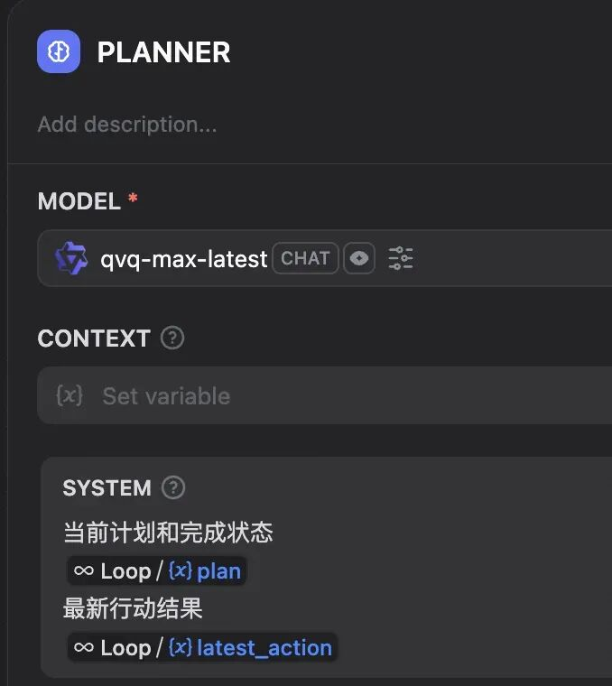
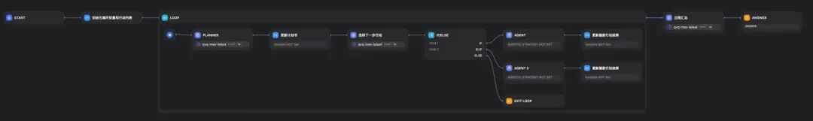
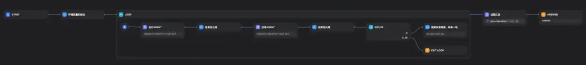
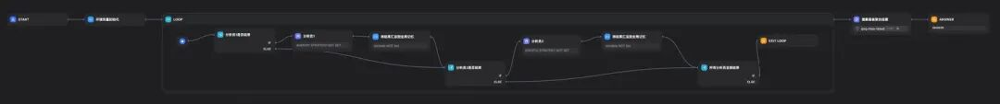
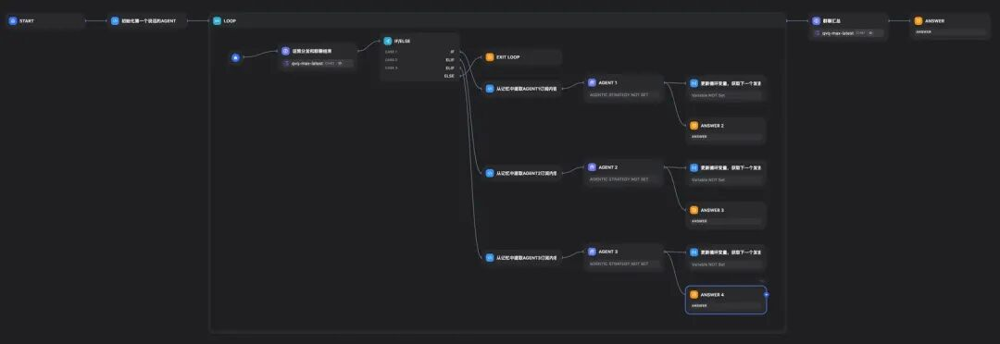
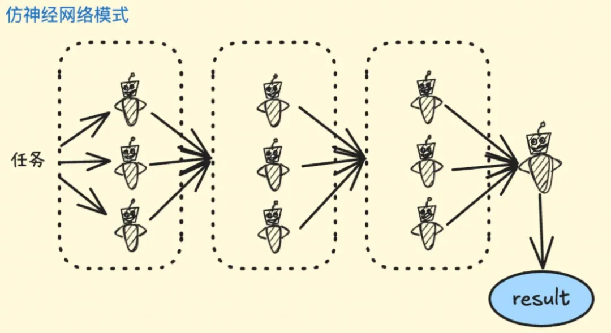

# workflow is all you need？探讨乐高式流程编排能否实现任意Multi-Agent模式

> **公众号**: 阿里云开发者  
> **发布时间**: 2025-06-27 08:30  

阿里集团安全部正在积极探索如何打造由多智能体组成的虚拟网络安全专家，以在工作中发挥创造性的积极作用。作为算法团队的一员，首先需要调研多种不同的MAS（多智能体系统）的协作方式，并验证其能否快速实现。在这个过程中发现，现有的AI workflow类型产品的功能比预想的更加广泛，因此希望通过这篇文章记录并分享一些思考的内容。“xxxx is all you need” 是我很喜欢的一个标题格式，它能够很旗帜鲜明地表达个人观点。这里的workflow不是指固定编排的系统设计模式，而是AI workflow产品（甚至特指有图形化画布编排的产品），例如百炼应用、Dify、扣子等等。

本文想借助“workflow is all you need”这个标题，探讨现有的AI workflow产品的能力范围，能否支持任意的MAS（多智能体系统）设计模式，不涉及具体业务相关的实现细节。将以Dify（https://github.com/langgenius/dify）作为workflow的示例平台，仅使用下列组件，探讨如何完成不同的多智能体协作模式，而这些组件在目前市面上的绝大部分AI workflow产品上，都是必备的：

  * LLM：大模型组件，一切的基础，无须多言。

  * 循环：实现多智能体协作最重要的组件，有了它就能够实现多智能体之间无固定顺序无固定次数的交互。并且循环组件里的循环变量能够作为记忆管理的载体，循环内的组件通过更新循环变量、读取循环变量实现对momery的管理和使用。

  * 代码执行：重要的胶水组件，一切LLM无法精确实现的都可以交给它。

  * 条件分支：实现AGENT自主决策的必备组件，不论是决定使用哪个工具，还是指定下一个由谁发言。

  * 工具：AGENT的手和脚，泛指一切的行动方式，包括外部的MCP工具、自定义代码、其他的workflow（这个是实现乐高积木式组合的必备条件）。

文章主要以个人主观观点描述，下列的所有示例中，因为精力有限的原因，不会将prompt，代码等具体描述出来，更多地是以框架图例加文字描述的形式。

## one Agent

大家可能看出来了，在使用workflow实现MAS时，上面列出的核心组件中没有单独的AGENT组件。如果workflow连单个agent都实现不了的话，all you need这个标题也就根本无从谈起了。我们可以用如下图所示的框架实现出一个ReACT AGENT：

我们在一开始的全局变量初始化组件里，初始化两个变量，分别是AGENT的行动列表（所有的行动都被工具化），以及历史行动结果（初始化为空）。那么在进入循环后，核心LLM组件根据任务输入，行动列表和历史行动的结果，思考并选择下一步行动。在行动结束后，向循环变量的历史行动结果增加最新的行动结果。通过这样不断的循环，直到达到循环次数上限或者LLM选择了退出循环这个action，整个工作流结束。

这是一个标准的ReACT AGENT的工作模式，咋一看可能会觉得做这样的编排有种脱裤子放屁的嫌疑，明明一个AGENT组件就可以搞定的事情需要弄这么多的组件。但展示这样编排的目的有两个：一方面这种编排形态稍加修改就演变成绝大部分的多智能体协作模式，它是一个模板，我们在后续的MAS搭建过程中单个AGENT不一定要采用这种方式而是直接使用AGENT组件；另一方面它也有现实意义，能够解决我们目前在业务上遇到的当前AGENT组件无法解决的两个需求：

1.工具输出结果的后处理。对于一些标准化工具来说，它的不同使用方，可能会有不同的后处理需求，例如不同的格式化/过滤方式、对不同字段的关注程度不同。因此这个后处理过程不适合放在工具侧，最好是放在调用方。

2.定制化输出中间过程。现在的AGENT的智能化水平被用户能有深切感受的方式，就是需要在交互过程中将AGENT中间过程暴露出来，不同的场景可能需要暴露不同的（工具输出、思考内容）。现有的AI workflow产品实现AGENT时，基本没有能够定制化输出中间过程的设计。

## 路由模式

非常简单的一种协作形式，甚至不需要用到循环组件。

在接受到用户输入后，由一个LLM负责识别意图，并且决定将原输入分配给哪个执行单元来解决，执行单元可以是任意有处理能力的组件，包括LLM、AGENT、代码、工具。这里LLM还可以做一些额外的工作，例如对用户输入进行改写以便更符合执行单元的能力需求。

这里之所以没有放置循环组件，是认为循环多次任务派发其实就跟下面的主从模式没有区别了。这一点在后面的主从模式章节可以看到。

## 简单顺序模式以及升级版狼人杀模式

一个团队内部多个Agent会被分配确定的子任务（Task），按照固定的顺序调度执行，并把子任务结果传递给下一个Agent，直到流程结束。这在我们的很多简单的或者有固定SOP的任务中，是最直接有效的方式。

这种顺序执行的复杂度可以进一步提升，例如我们模拟玩狼人杀游戏，这是一个不固定轮次但固定AGENT发言顺序的游戏模式，流程编排可以如下图搭建：

循环变量中需要设置保存历史发言的循环变量，在每个玩家发言后，将发言内容添加到循环变量中。以此做到每个LLM组件在发言前得到前面全部的发言记录（这里不讨论上下文是否过长的问题，可以添加缩短上下文的组件或者靠基模解决，也不是本文的重点）。

## 主从层次模式（类manus模式）

manus模式是主从模式的一种应用表现形式，总结来说就是用户输入任务后，由PLANNER先制定完整的任务解决计划，然后按照计划一步步调用对应的子AGENT完成。并且过程中可以根据任务进行情况，调整计划书，包括更新计划书中的子任务完成情况，增删改还未进行的后续子任务等。

PLANNER的prompt中使用循环变量如图：

需要的重要组件依然是循环，我们需要将计划书和行动结果放置在循环变量中，随着循环进行不断更新任务的进展。整个流程编排示例如下：

PLANNER和选择下一步行动两个组件也可以合并。大家可以发现去掉循环组件的话，这也和前面的路由模式区别不大了。

## 反思模式（二人转）

这是一种双Agent协作的典型模式：

  * 执行AGENT接受输入任务，进行输出；

  * 反思AGENT对执行AGENT的输出进行反思或审核并反馈给执行AGENT；

  * 重复，直到达到最大迭代次数或反思AGENT审核通过；

角色只有两个，是比较简单的一种协作模式，编排示例如下：

这种模式也不一定是一人执行，依然反思，它可以泛化为两人对话的协作模式。

## 辩论模式/stacking模式

在这种模式中，AGENT分类为多个有不同特长的解决问题的AGENT，以及一个负责聚合其他AGENT结果，做投票汇总的AGENT，工作模式为：

  * 用户输入问题，发给所有的求解AGENT；

  * 求解AGENT处理任务，并将结果发送给其他的求解AGENT；

  * 每个求解AGENT利用他人的信息，优化调整自己的结果；

  * 重复多轮，直到所有的求解AGENT都任务自己的结果不需要再更新；

  * 聚合AGENT使用决策机制（投票、加权投票等），绝对最后输出给用户的结果；

这种模式有些类似集成学习中的stacking模式，每个求解器可以设计为关注问题不同侧面（弱分类器），最后有聚合AGENT决策出结果。

利用dify实现的编排示例如下：

通过循环变量更新，使得每个求解AGENT能够获取到上一轮他人的分析结果。

## 群聊模式（非顺序多人转）

多个AGENT作为一个小组成员，通过群聊的方式解决用户输入。工作模式为：

  * 用户输入问题到群组，约定或者随机挑选一个AGENT开始发言；

  * 每个AGENT在发完言后，负责决定下一个发言的AGENT是谁；

  * 如此循环发言多轮；

  * 可以由任意AGENT负责决定是否结束群聊，或者由单独的角色来判断；

流程编排示意：

采用了循环入口一个单独的角色控制是否结束群聊，它指定下一个发言AGENT的依据仅来自上一个发言者的决定。

这里还加入了一个实现细节，就是每个AGENT可以有消息订阅机制，它可以选择性接受包含某些关键字，或者某些AGENT说的话作为自己的context，从而避免过长的上下文。

## 嵌套模式

这种模式也就是上述多种模式的任意组合，核心需要平台允许将工作流发布为工具，那么在上述任意的流程编排中，都可以将一种模式嵌入其中，实现多种模式的嵌套。相信大家看到这里也自然能想到如何嵌套，这也就是标题所说的”乐高“式的意思。

如果在模式嵌套之前都加上一个由大模型选择模式的过程，那么这也一定程度上实现了由AI自主决定协作模式。

## 无法支持的MAS模式

前面描述了多种多智能体协作模式，基本涵盖了目前主流的各种方式。现在回到标题，这里的问号是需要回答。目前看来我认为这个问题还不能得到肯定的回答，依然有多智能体协作模式是目前的主流AI workflow产品无法支持。

### 完全异步的多智能体群聊

这是前面提到的群聊模式的更加复杂化的设计，它的目的是完全模拟人类在群聊过程中的发言状态。我们人类聊天时，是完全异步的，我们说话与否，合适开始输出内容并不严格受限于他人的发言结果。不会因为没有人@你说话你就不说了。而这就需要底层框架支持完全异步的AGENT调用机制，每个AGENT可以在任意时间发起输出，AGENT的发言结果实时地添加到每一个AGENT的memory中。

### 动态智能体添加

上面列举的所有编排方式，都是提前将全部AGENT添加到了画布中。但如果需要动态添加一个新的AGENT是无法实现的。

这里多提一句，如果要实现已有AGENT的动态修改是可以的，因为它的prompt可以被作为变量修改。

### 并行化的MOA仿神经网络模式

MOA是形似神经网络计算的模式，在将任务分层后，每一层由多个数量不等的AGENT并行执行完成。如果每一层每次执行的AGENT都不相同，那么现有的AI workflow产品是很难做到的。它需要一个“多选”的组件（目前的条件分支组件每次只能选择一个分支），而“多选”组件需要支持每次选择不同的数量大于一的选项，用于单层的任务派发和并行执行。

(图片来自网络)

## 总结

本文的目的是为了讨论现在AI workflow产品在对多智能体支持的能力范围，上述的编排方式不代表就是实现该MAS模式的最佳实践，仅表示当我们需要快速实现demo时利用现有的资源可以做到什么程度。其实可以很容易看出来，当一个MAS涉及到的工具、AGENT数量非常庞大时，这种编排方式光是在画布上手动添加节点都是一件让人崩溃的事情，整个画布的可读性也会很差。目前业界对AGENT的实践和探索很广泛，每天都有新的项目/框架/产品诞生。希望未来能够非常优雅、高效、全能的多智能体研发产品出现。

****

### 即刻拥有 DeepSeek-R1-0528

开源推理新巅峰，性能媲美 OpenAI o3。传统方式部署 DeepSeek-R1-0528 需耗时十几小时手动下载 672 GB 模型，本方案支持零代码接入阿里云百炼的模型 API，也支持一键部署至人工智能平台 PAI（最快 35 分钟）以及 GPU 云服务器部署（最快 60 分钟），部署效率提升 10 倍以上。

## 点击阅读原文查看详情。
