# 万字解码 Agentic AI 时代的记忆系统演进之路

> **公众号**: 阿里云开发者  
> **发布时间**: 2025-08-14 08:30  

阿里妹导读

本文深入探讨了在 Agentic AI 时代，记忆（Memory） 作为智能体核心能力的定义、构建与技术演进。

## Memory 是什么

当下阶段 AI 应用正在从 Generative AI 向 Agentic AI 阶段迈进，2025 年被视为 Agent 市场元年，Agent 架构相关的技术讨论非常火热，技术演进也非常的快速。从目前的技术发展趋势看，各类开发框架逐渐从底层专注于与 LLM 的集成演进到上层关注于对 Agent 内部各类组件的抽象和集成，也有了像 MCP 和 A2A 这类定义了 Agent 如何调用工具以及如何与其他 Agent 交互的标准协议的建立，Agent 架构的各个部件逐渐被定义清晰并且形成标准。

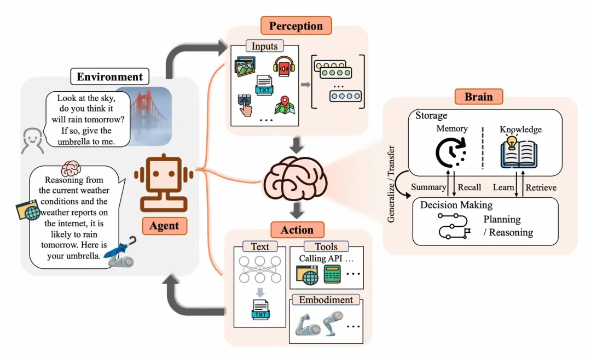

上图（来自 The Rise and Potential of Large Language Model Based Agents: A Survey）定义了 Agent 架构，其中包含几个重要部分：

1\. 感知能力（Perception）：让 Agent 具备环境感知能力，能接受多模态的信息输入。

2\. 决策能力（Brain-Decision Making）：让 Agent 具备自主决策和规划的能力，能够执行更复杂的任务。

3\. 记忆能力（Brain-Memory & Knowledge）：让 Agent 具备记忆能力，记忆内部存储了 Agent 的知识和技能。

4\. 行动能力（Action）：让 Agent 具备与外界交互的能力，通过行动与感知让 Agent 能自主完成更多复杂任务。

本文要探讨的就是这部分记忆能力，记忆对 Agent 至关重要：

1\. 让 Agent 具备持续学习能力：Agent 所拥有的知识主要蕴含在 LLM 的参数内，这部分是静态的，记忆让 Agent 具备了知识与经验积累和优化的能力。有研究表明配置了记忆的 Agent 能显著增强性能，Agent 能够从过去经历中总结经验以及从错误中学习，加强任务表现。

2\. 让 Agent 能够保持对话的连贯性和行动的一致性：拥有记忆能够让 Agent 具备更远距离的上下文管理能力，在长对话中能够保持一致的上下文从而保持连贯性。也能避免建立与之前相矛盾的事实，保持行动的一致性。

3\. 让 Agent 能够提供个性化的服务和用户体验：拥有记忆能够让 Agent 通过历史对话推断用户偏好，构建与用户互动的心理模型，从而提供更符合用户偏好的个性化服务和体验。

## 如何定义 Memory

大语言模型本质是对人脑神经网络的模拟，智能体记忆也可以通过模拟人脑记忆来实现更强的性能。

### 人脑记忆结构

记忆是人类编码、存储和提取信息的过程，使人类能够随着时间的推移保留经验、知识、技能和事实，是成长和有效与世界互动的基础。要弄清楚记忆的结构，需要搞明白记忆如何分类以及提供哪些操作。

### 记忆分类

记忆有不同维度的分类方法，常见的几个分类方法包括：

1\. 按存储时间进行分类

人类很早就开始对人脑记忆的研究，按照存储时间的记忆分类法最早是在 1968 年发布的 Atkinson-Shiffrin Memory Model 中提出，将记忆分为感知记忆（Sensory Memory）、短期记忆（Short-term Memory）和长期记忆（Long-term Memory）。感知记忆存储了人脑从环境中捕获的信息，例如声音、视觉等信息，在感知记忆区这类信息只能保留很短的时间。短期记忆存储人脑在思考过程中所需要处理的信息，也被称为工作记忆（在 1974 年 Baddeley & Hitch 模型中提出），通常也只能保留很短的时间。长期记忆用于长期保留人类记忆，如知识与技能。

这几类记忆实际代表着不同的记忆工作区，感知记忆是人脑的信息输入区，短期记忆（或工作记忆区）是人脑工作时的信息暂存区（或信息加工区），而长期记忆就是人脑的长期信息储存区。短期记忆的内容来自感知记忆区的输入以及从长期记忆区的记忆提取，人脑产生的新的信息也会暂存在工作记忆区。人脑对信息的处理通常会贯穿这几个记忆区，信息的输入、加工和变成长期记忆进行储存，这个过程贯穿这几个记忆区。

2\. 按内容性质进行分类

按照内容性质可以把记忆分为可声明式记忆（Declarative Memory）和不可声明式记忆（Non-Declarative Memory），也有另外一种称法为显式记忆（Explicit Memory）和隐式记忆（Implicit Memory）。

这两类记忆的主要区别在于：

a. 是否可以用语言描述：可声明式记忆可以用语言来描述，例如所掌握的某个知识内容。不可声明式记忆不可被语言描述，例如所掌握的某个技能如骑车。

b. 是否需要有意识参与：显式记忆需要有意识主动回忆，而隐式记忆无意识参与，所以也被称为肌肉记忆。

3\. 按存储内容进行分类

人类可以从记忆中提取不同类型的内容，我们可以回忆过去，这部分内容称为『经历』，也可以通过记忆掌握『知识』，同时也是通过记忆保存『技能』。所以可以抽象地把记忆内容分类为『经历』、『知识』和『技能』，更科学的命名是：

a. 情境记忆（Episodic Memory）：代表经历，存储了过去发生的事件。

b. 语义记忆（Semantic Memory）：代表知识，存储了所了解的知识。

c. 流程记忆（Procedure Memory）：代表技能，存储了所掌握的技能。

以上是常见的几种记忆分类方法，这几个分类方法并不矛盾，而是代表不同的维度，并且互相有一定的关系。比如通常情境记忆是显式记忆，因为需要主动回忆并且可以用语言来描述。技能通常是隐式记忆，例如骑车这个技能属于肌肉记忆，无需主动回忆也不可被语言描述。

我们可以把这几个维度结合在一起来定义记忆，描述为『存储在哪个记忆区』的『以什么形式存在』的『什么类型的』记忆。例如骑车这个技能就是存储在『长期记忆』区的以『隐式』形式存在的『流程』记忆，再比如在写这篇文章时脑子里的内容就是存储在『短期记忆』区的以『显式』形式存在的『语义』记忆。

### 记忆操作

记忆就是人脑对信息进行编码、存储和检索的过程，所以核心操作就是：

1\. 编码（Encode）：获取和处理信息，将其转化为可以存储的形式。

2\. 存储（Storage）：在短期记忆或长期记忆中保留编码信息的过程。

3\. 提取（Retrival）：也可称为回忆，即在需要时访问并使存储的信息重新进入意识的过程。

记忆还包含其他的一些操作：

1\. 巩固（Consolidation）：通过巩固将短期记忆转变成长期记忆，存储在大脑中，降低被遗忘的可能性。

2\. 再巩固（Reconsolidation）：先前存储的记忆被重新激活，进入不稳定状态并需要再巩固以维持其存储的过程。

3\. 反思（Reflection）：反思是指主动回顾、评估和检查自己的记忆内容的过程，以增强自我意识，调整学习策略或优化决策的过程。

4\. 遗忘（Forgetting）：遗忘是一个自然的过程。

### 智能体记忆

上面我们提到过，可以把几个维度结合在一起来定义记忆，描述为『存储在哪个记忆区』的『以什么形式存在』的『什么类型的』记忆。智能体记忆可以按照相同的方式对记忆进行分类，但是由于记忆存储区和存储形式的差异，与人脑记忆分类略有差别。

### 记忆存储区的差别

智能体内的记忆存储区主要包括：

1\. 上下文：上下文就是智能体的短期记忆或工作记忆区，窗口有限且容易被遗忘。

2\. LLM：蕴含了智能体的大部分知识，属于智能体的长期记忆区，包含了不同类型的记忆。

3\. 外挂记忆存储：由于 LLM 内知识不可更新，所以会通过外挂存储的方式来对记忆进行扩展，这部分也属于智能体的长期记忆区。与人脑记忆区对比的话，感知记忆和短期记忆对应智能体的上下文，长期记忆对应智能体的 LLM 和外挂记忆存储。

### 存储形式的差别

智能体内的记忆主要以两种形式存在，可以简单归类为参数形式（Parametric）和非参数形式（Non-parametric）。在智能体的短期记忆区和长期记忆区都会存在两种不同形式的记忆，比如 KV-Cache 可以认为是短期记忆区参数形式的记忆，LLM 是长期记忆区参数形式的记忆，外挂记忆存储是长期记忆区非参数形式存在的记忆。

### 智能体记忆分类

通过上面的内容我们了解到智能体的记忆存储区和存储形式与人脑有一定的差别，但是还是可以对应上来，如下图所示。

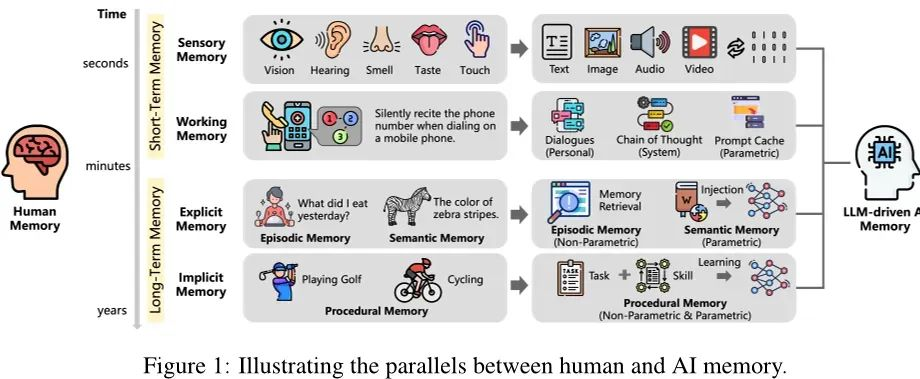

我们按照相同的维度但是不同的内容对智能体记忆做个分类，然后看下不同的记忆分类下目前有哪些技术实现（这里不通过记忆类型来分类，因为不影响技术实现分类）。

以下是截取自 MemOS 论文中对现有记忆实现的分类：

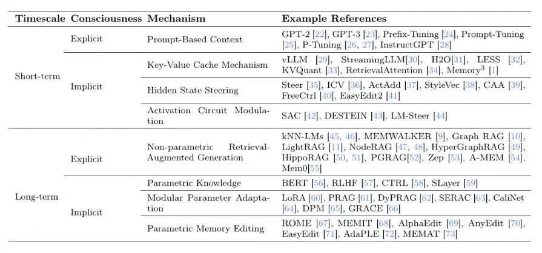

从上面的分类可以看到，智能体记忆的技术实现还是非常细分、多样的。挑几个我们熟悉的技术来说，提示词工程（Prompt Engineer）属于对短期记忆区的显示记忆的优化，知识库（RAG 技术）属于对长期记忆区的显示记忆的优化，模型微调（Fine-Tunning）属于对长期记忆区的隐式记忆的优化。

### 智能体记忆操作

智能体提供的记忆操作与人脑记忆是比较类似的，也包括编码、存储和提取。记忆编码包含了对记忆的获取和处理，通过对工作记忆区内容的处理发现新的记忆，编码成可存储的结构。记忆存储为参数或非参数的形式，非参数的形式通常以 Plaintext、Graph 或 Structure-Table 的结构存储。记忆提取通常通过检索来实现，具体技术实现包括全文检索、向量检索、图检索或者是混合检索，具体检索方式取决于存储的内容和结构。

## Agent Memory 实现

Agent Memory 的技术演进非常快，目前市面上已经有很多开源或商业的 Memory 产品。特别是在 2025 年，以更快的速度涌现出来一批新的产品。最近上海的一家初创公司『记忆张量』更是获得了亿元的天使轮融资，同时也开源了自家的 Memory 产品 MemOS。可见 Agent Memory 市场正在快速发展，商业前景也得到了认可。

接下来会逐个分析下目前的 Memory 产品的实现，主要的信息来自各自分享的论文，论文内容可能已经与最新版本的实现有所差异，感兴趣的可以去追踪最新的开源进展。通过分析，我们希望能总结一些技术演进趋势，了解下在 Memory 场景对底层存储会有怎么样的结构定义和存储的需求。

### MemoryBank

Memory Bank 在 2023 年就发布了论文，是比较早的对 Memory 的研究。彼时 AI 应用以 Chat 型应用为主，所以研究的目的也是为了如何让 Chat 机器人更具人性化。为了证明研究效果，还特地开发了一个名为硅基朋友（Silicon Friend）的 AI 陪伴聊天机器人。该机器人集成了 Memory Bank，并使用了心理对话数据进行训练，以增强其情感支持和个性化服务能力。实验结果表明，该机器人在记忆召回、提供同情心及理解用户性格方面表现突出，证明了 Memory Bank 能够显著提升 LLMs 在长期交互场景中的性能。

Memory Bank 提出的实现有几个特点：1）能对对话进行总结和定期回顾，存储摘要以便搜索记忆，以及通过对话总结用户画像提供更个性化的回答；2）借鉴了艾宾浩斯遗忘曲线理论的心理学原理，实现了记忆遗忘机制，模仿人类认知过程中的动态记忆机制。

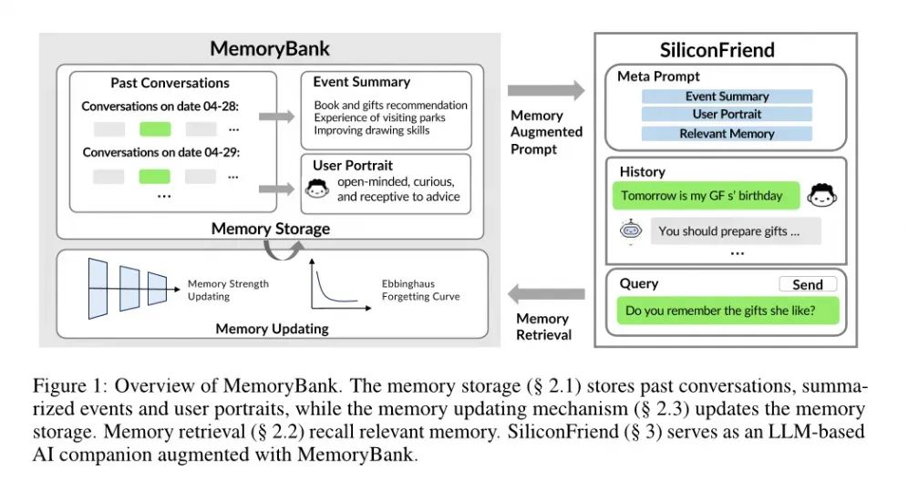

Memory Bank 在长期记忆和短期记忆内包含的内容如上图，底层存储分为三个部分：

1\. In-Depth Memory Storage：记录了多轮对话的详细内容，内容会包含时间戳，从而形成有序的交互内容便于回顾和总结。

2\. Hierarchical Event Summary：将对话内容进行处理和提炼，生成高层次摘要，类似于人类记忆中对关键经历的回顾。将冗长的对话压缩成简洁的摘要，然后再进一步整合为全局摘要。这一过程形成了一个层次化的记忆结构，让智能体能够以宏观视角回顾过去的互动和重要事件。

3\. Dynamic Personality Understanding：通过长期的互动不断评估和更新对个性的理解，会生成每日的个性洞察。这些日常洞察进一步被汇总，以形成对用户个性的全局理解。

对记忆的检索方式：每一轮对话和其摘要为一个记忆片段，这些记忆片段会通过 Embedding 存储到向量数据库内。当前对话的上下文会作为检索条件进行相似向量检索，检索到相关的记忆片段。

最终在上下文内会填充检索到的相似记忆以及用户个性提示，来提供更具个性化的回答。

### LETTA

LETTA 的技术源自 MemGPT 的研究，目前是独立的一个商业化产品。LETTA 提出的方法借鉴了操作系统虚拟内存分页的思想，这种技术最初是为了让应用程序能够处理远超可用内存大小的数据集而开发的，它通过在主内存和磁盘之间进行数据分页来实现这一目标。LETTA 模拟虚拟内存的实现，将 Context 分为 Main Context 和 External Context 两部分，当 Main Context 空间不够的时候可以与 External Context 进行数据交换。

要理解它的原理我们看这个图即可：

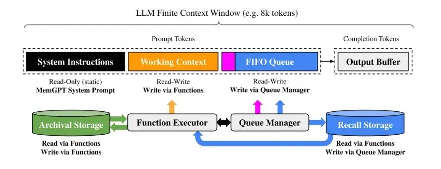

整体被分为 Main Context 和 External Context，类似内存和磁盘。Main Context 就是 Prompt Tokens 部分，又被分为三个小部分：

  * System Instructions：存储静态的系统提示词。

  * Working Context：在对话场景中，这部分存储 key facts、perferences 和其他重要的关于用户的重要信息，以及 Agent 的个性。

  * FIFO：存储滚动的历史对话记录，包含已经从 FIFO 队列中移除的对话记录的 Summary 以及最新的对话记录。

对记忆内容会做如下操作：

  * 递归的摘要总结（Recursive Summary）：基于当前的 Recursive Summary 和要从队列中移除的消息生成新的 Summary，通过这一步来压缩信息节省对 Context 的空间占用。

  * 记忆的更新与提取：这个动作通过 Function Executor 来完成。记忆的更新与提取是完全自驱动的，通过在系统指令中给出提示词，提示词中会包含：1）记忆层次结构及其各自的用户的详细描述；2）系统可调用的函数，通过自然语言来描述，以让 LLM 能够访问和修改记忆。

### ZEP

ZEP 号称更满足企业内的需求，传统的 RAG 是基于静态的文档数据，ZEP 能够根据对话和 Bussiness Data 来获取更实时的信息。它的主要创新在于记忆的存储结构，底层自研了一个图引擎 Graphiti，能够提供时间感知的知识图谱。由于在它之前也就 MemGPT（上面的 LETTA）表现比较优异，所以论文中主要与其做对比。DMR Benchmark 比 MemGPT 表现更优，94.8% vs 93.4%。同时在 LongMemEval benchmark，这是一个更符合企业用例的测试，包含一些复杂的时间推理任务，通过 ZEP 准确度提升了 18.5%。

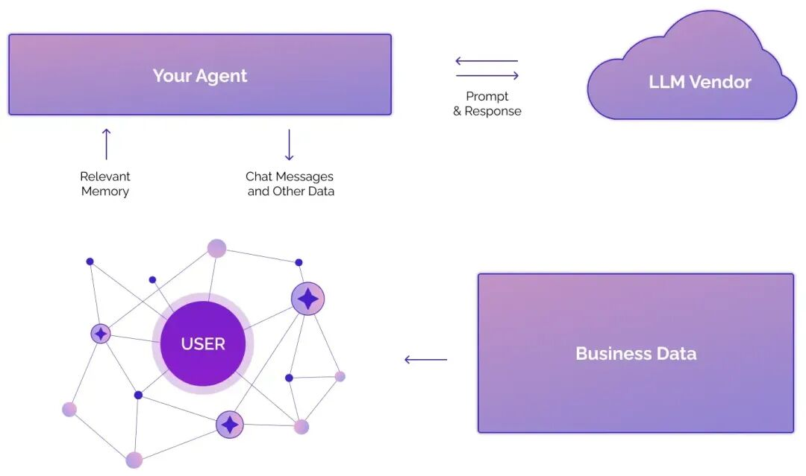

上面是官网截取的一个架构图，包含的信息比较少。它的核心部分都在其所构建的知识图谱内，整个知识图谱分三个层次：

1\. 情境子图（可以理解为用图的方式存储了情境记忆）：包含原始的输入数据，消息、问题或者 Json 格式，作为一个无损的数据存储。图中的 Node 是情境，Edge 连接到对应的语义实体。

2\. 语义子图（可以理解为用图的方式存储了语义记忆）：构建在情境子图之上，从中提取语义实体和关系。图中的 Node 是语义实体，Edge 表示语义实体之间的关系。

3\. 社区子图（语义记忆的更高层次的概括）：图中的 Node 表示强连接实体的 Clusters，为一个社区，社区包含了对聚类的高层次的概括，社区 Edge 将社区与其成员相连接。这部分实现参考了 GraphRAG 的思路，通过构建社区来实现对语义记忆有一个更全局的概括。

论文中解释了它的心理学原理，采用了原始情节数据与衍生的语义实体信息的双重存储方式，反映了心理学中的人类记忆模型。这个模型将记忆区分为情境记忆，即对特定事件的记忆，以及语义记忆，即对概念及其含义之间关联的记忆。这种双重结构使得使用 Zep 的智能体能够构建更加复杂和细致的记忆结构，更贴近对人类记忆系统的模拟。

ZEP 关于记忆的更新和提取的实现还有一些比较有意思的地方：

记忆更新

1\. 记忆去重：提取的语义实体会进行去重，避免存储冲突的记忆。对实体的去重会通过对实体名和实体摘要进行全文检索来找到相似的实体，通过 LLM 进行判重，如果判定重复会更新当前实体的相关信息。

2\. 时间信息提取与边失效机制：这是 Graphiti 相比其他知识图谱所具备的差异化能力。在图中会记录事实数据的产生时间和作用时间，当有新的事实数据引入时会通过 LLM 进行判重。如果有发现存在时间重叠的矛盾事实，会对该事实标记为失效并且记录失效时间。这样既能保留最新的事实，也能保留事实的变化。

3\. 采用标签传播算法构建社区子图：标签传播算法在动态扩展方面具备简单性的优势，使得系统在新数据不断进入图结构时，能够在更长时间内保持稳定的社区子图，从而延缓完全重新计算社区的需要。但是长时间后所形成的社区结构会逐渐偏离完整运行标签传播算法所得出的结果。因此，仍需定期对社区结构进行重新计算。

记忆的提取

抽象来讲通过一个 input string 作为检索条件，返回一个 output string，输出的 string 中包含了格式化后的 nodes 和 edges。详细的检索步骤分为三步：

1\. Search：通过多种检索方法结合进行检索，检索结果包含语义边列表、实体节点列表和社区节点列表——这三种图结构中包含了相关的文本信息。

2\. Reranker：对搜索结果进行重新排序。

3\. Constructor：将相关的节点和边转换为文本上下文。

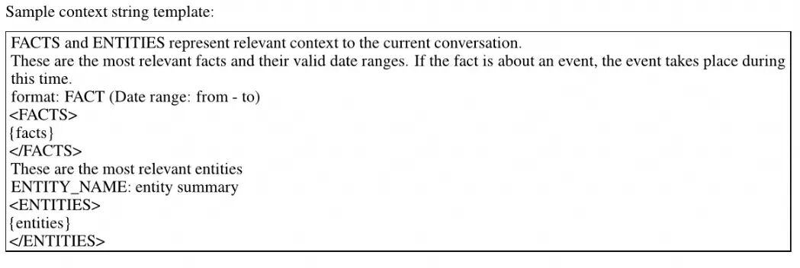

ZEP 实现了三种搜索功能：语义相似度搜索、BM25 全文搜索和广度优先搜索。这三种搜索方法分别针对不同层面的相似性：全文搜索识别词语层面的相似性，余弦相似性捕捉语义层面的相似性，而广度优先搜索揭示上下文层面的相似性 - 即图中距离较近的节点和边往往出现在更相似的对话上下文中。这种多角度的候选结果识别方法，最大化了发现最优上下文的可能性。

### A-MEM

A-MEM 的创新在于通过实现『Zettelkasten 知识管理方法』来提升智能体的记忆能力。Zettelkasten 是由一个德国的社会学家发明的知识管理方法，也称为卡片笔记法。每个卡片是一个知识点，每张卡片会有一个索引，根据知识类型进行分类，方便后续的检索。A-MEM 受到 Zettelkasten 方法的启发，允许记忆主动生成自己的上下文描述和有意义的连接。记忆笔记包含原始交互内容、时间戳、关键词、标签、上下文描述和链接集合。

A-MEM 的主要实现方法：

  * 分析历史记忆库，根据语义相似性和共享属性建立有意义的连接。

  * 当有新的记忆被纳入时，会触发对现有记忆上下文表示的更新，从而使整个记忆随着时间的推移不断细化并加深理解。

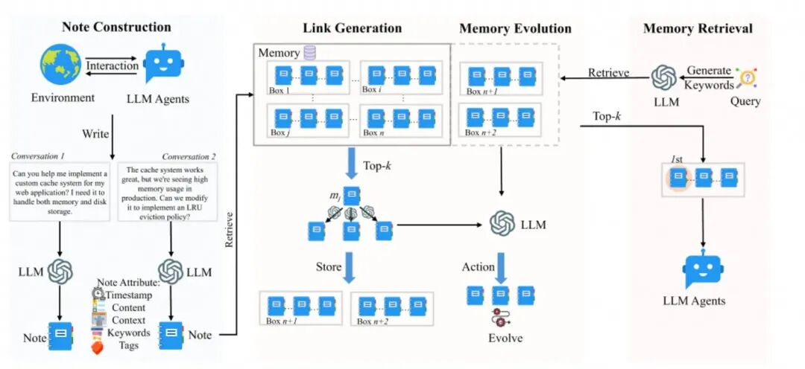

1\. Note Construction：系统会从最新交互中提取新的记忆，生成 Notes 并存储下来。

2\. Link Generation & Memory Evolution：检索与新记忆最相关的历史记忆，决定是否要建立连接。Notes 会放入 Box，Box 中的 Notes 通过相似的上下文描述相互关联。允许同一个 Notes 同时存在不同的 Box 中。

3\. Memory Retreval：会分析 Query 提取 Keywords，利用这些 Keywords 从记忆网络中进行检索。

在相同的测试数据集 LOCOMO 上的表现比 LETTA 和 Memory Bank 更好，但是没有与 ZEP 的对比结果。

### MEM0

MEM0 是目前开源 Memory 框架中 Star 数最多的，提供了两种实现，一种是没有利用图的 Mem0，另一种是基于 Graph 实现的 Mem0-G。下面分别介绍下两种实现方式：

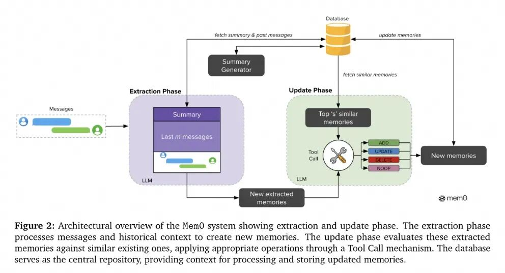

上图是 Mem0 的实现，几个主要步骤包括：

1\. 记忆生成：采用上下文感知的记忆生成方式，上下文中会包括当前问答 + 最近 M 条消息 + 会话的 Summary 这些内容。在后台会异步地生成对话 Summary，整个过程独立于主处理流程运行。

2\. 记忆更新：主要目的是为了保持记忆一致性以及避免冗余。会从数据库中检索语义相似的 N 个记忆，与候选 Facts 一起提供给 LLM，让 LLM 来判断是否需要对记忆进行增加、修改或者删除，或者是啥都不用做。

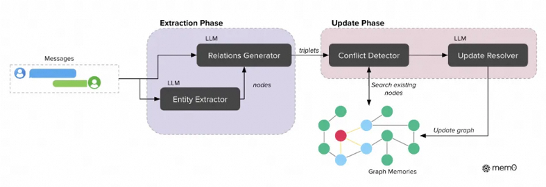

上图是 Mem0-G 的实现，主要总结下与 Mem0 实现的差异：

1\. 记忆生成：生成过程采用了一个两阶段的流水线，利用大语言模型（LLMs）将非结构化文本转化为结构化的图表示。首先实体提取模块处理输入文本，识别出一组实体及其对应的类型。接下来关系生成器模块在这些实体之间建立有意义的连接，生成一组关系三元组，以捕捉信息的语义结构。

2\. 记忆更新：对于每一个新的关系三元组，我们计算源实体和目标实体的 Embedding，然后搜索语义相似度高于设定阈值的现有节点。为了保持知识图的一致性，实现了一个冲突检测机制 ，用于在新信息到来时识别潜在的冲突关系。基于 LLM 的更新解析器会判断某些关系是否应被废弃，并将其标记为无效，而非物理删除，从而支持时间推理。（这个机制有点类似于 ZEP）

3\. 记忆检索：采用了实体中心法和语义三元组法双重检索机制，使 Mem0 能够高效处理聚焦实体的特定问题和更广泛的概念性查询：

a. 实体中心方法：首先识别查询中的关键实体，然后利用语义相似性在知识图中定位对应的节点。该方法系统性地探索这些锚点节点的入边和出边，构建一个涵盖相关上下文信息的完整子图。

b. 语义三元组方法：这个方法采取更整体的视角，将整个查询编码为一个 Embedding 向量。然后将该查询表示与知识图中每个关系三元组的文本编码进行匹配。系统计算查询与所有可用三元组之间的细粒度相似度得分，仅返回超过可配置的相关性阈值的三元组，并按相似度降序排列。

来看下 Mem-0 在 LOCOMO 数据集上的表现，相比上面的 Memory 框架综合表现更好，可能这也是为啥 STAR 数最多的原因。

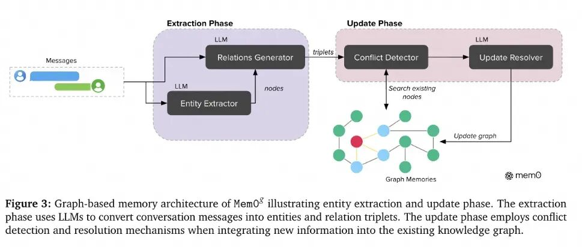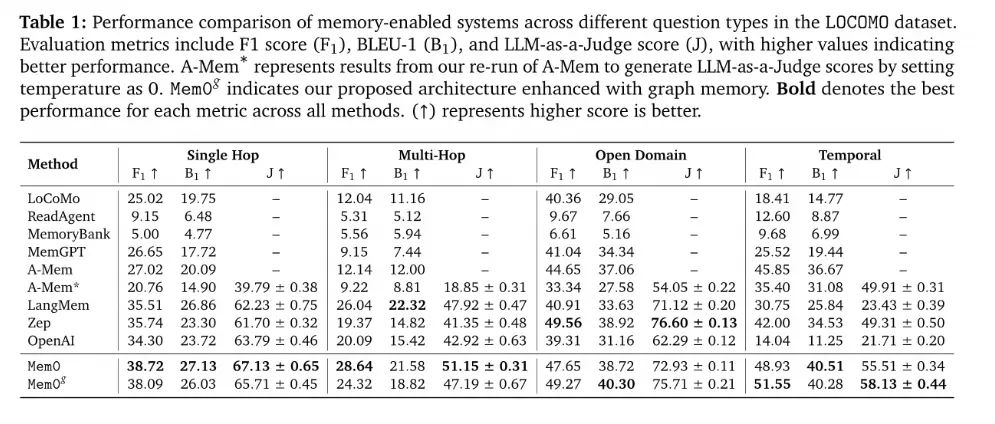

这里还有一个有意思的发现，Open Domain 和 Temporal 问题 Graph 的效果会更高，ZEP 这种专门做 Graph 的在 Open Domain 中取得最优的分数，但是在 Temporal 中 Mem0-G 分数更高。

### MemOS

MemOS 7 月才刚开源，由记忆张量出品，这是一家国内专做 Agent Memory 的初创公司，近期刚获得亿元的天使轮融资。MemOS 的愿景是希望构建面向下一代智能体的记忆基础设施，会包含三方面的核心能力：

1\. 记忆作为系统资源 ：将记忆抽象为可调度管理的一流系统资源，构建跨平台的记忆路径网络。

2\. 演进作为核心能力 ：构建记忆与模型协同进化的基础设施，实现智能体的持续学习和自我升级。

3\. 治理作为安全基础 ：建立全生命周期的记忆治理机制，确保智能体系统的安全性、可信性和合规性

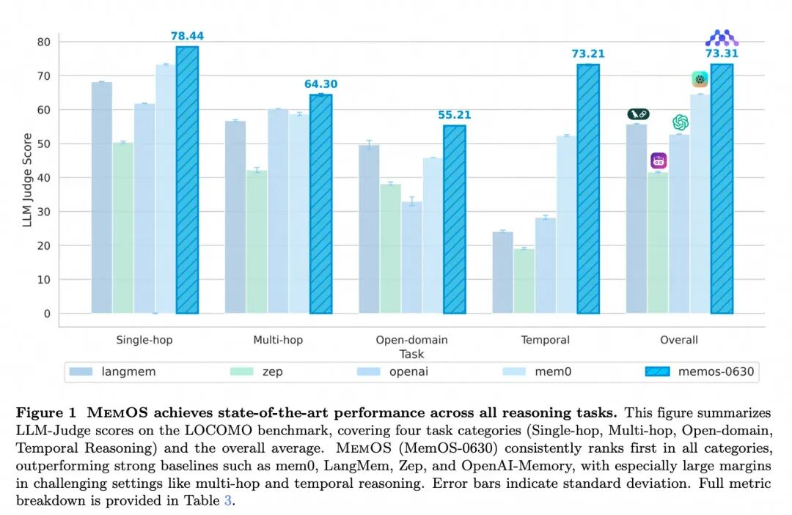

可以看到在 LOCOMO 测试数据集上的评测结果，拿到了更高的分数。综合看下来 MemOS 的实现有这么几个特点：

1\. 将记忆划为纯文本记忆（Plaintext Memory）、激活记忆（Activation Memory）和参数记忆（Parameter Memory）这三种类型，并且支持类型间的动态转换。

这里 MemOS 并没有按照记忆内容进行分类，而是按照记忆区和记忆形式进行分类。纯文本记忆对应的是长期记忆区的显式记忆，激活记忆对应的是短期记忆区的隐式记忆，参数记忆则对应长期记忆区的隐式记忆。上面提到的 Memory 框架基本都是只覆盖了长期记忆区的显式记忆，而 MemOS 额外覆盖了长短期记忆区的隐式记忆，这是实现的亮点之一。

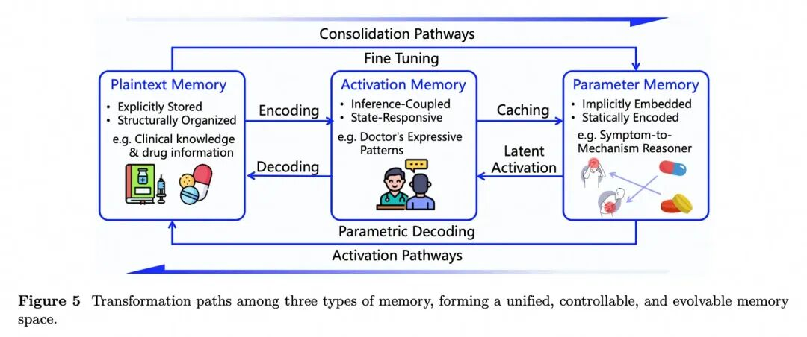

这三种记忆类型支持动态转换（如上图所示），可以根据记忆的『价值』和『活跃度』将其在不同形态间转换，以达到最佳的性能和管理效果，这是 MemOS 实现的另外一个亮点：

a. 纯文本记忆 -> 激活记忆：频繁使用的纯文本记忆可以预先转换为 KV-Cache 形式的激活记忆，能够大幅提升访问速度，降低首个 Token （TTFT）的延迟。

b. 纯文本/激活记忆 -> 参数记忆：如果某些纯文本记忆或激活记忆被认定为需要长期使用，也可以通过蒸馏（Distillation）或适配器（Adapter，如 LoRA）等技术，将其「固化」或「内化」到模型的参数中变成长期的参数记忆。

c. 参数记忆 -> 纯文本记忆：当参数记忆中的某些知识已过时、不准确或长期不使用，可以从参数记忆中『卸载』或『逆转』为纯文本形式，从而降低模型复杂度提升效率。

2.统一用记忆立方体（MemCube ）进行抽象

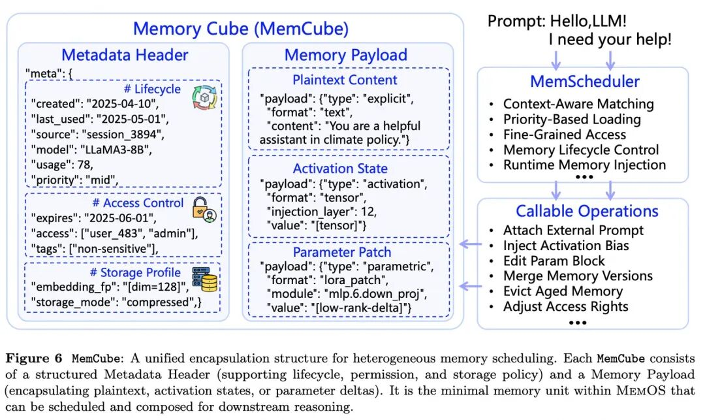

使用 MemCube 对不同类型的记忆做了一个统一的抽象，结构如上图所示。其中比较关键的部分是 Metadata，包含了描述信息、权限信息和一些动态指标。动态指标如 usage 统计了这段记忆被使用的频率，通过追踪这些动态指标来判断一个记忆是『热』还是『冷』，从而决定是否需要将其缓存、归档或在不同记忆类型间转换。

3\. 建立了一个以记忆为中心的系统框架

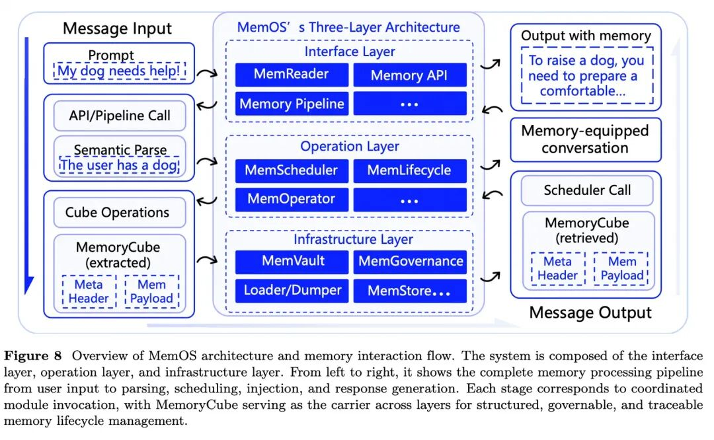

如上图是 MemOS 的完整架构，整体架构分为三层，共同构建了记忆的完整生命周期管理体系。每一层的作用以及各个模块的具体功能不展开来讲述，感兴趣的可以去看论文。我们重点讲下影响记忆性能的几个关键步骤设计：

1.根据用户输入识别意图，提取结构化的上下文信息，转换为对记忆的操作

所有的用户 Query 都会经过接口层最终转换为对记忆的操作指令，这个动作由内置的 MemReader 来完成。MemReader 会识别任务意图（task intent）、时间范围（time scope）、主题实体（topic entites）和上下文锚点（contextual anchors），以确定是否涉及记忆访问。如果需要访问记忆，MemReader 将提示转换为结构化的 MemoryCall，包括调用者 ID、上下文范围、内存类型、访问意图和时间窗口，封装成标准化的 Memory API 调用并传递给操作层执行。这些结构化的上下文信息能够帮助提升记忆检索的准确率，以及更好的组织记忆结构。

2.构建多视角的记忆结构（Multi-perspective Memory Structuring）

MemOS 内部采用了三种互补的机制来组织记忆，包括：

  * 标签系统：允许为每个记忆单元添加 Metadata 标注，如 topic、source 等用户定义或模型预测的标签。

  * 知识图谱：各个记忆节点通过语义边（semantic edge）进行连接，可通过连接关系进行遍历。

  * 语义分层：将记忆划分为 private、shared 和 global 层，便于在不同任务和角色之间实现记忆隔离和协同访问。

论文中关于这部分的细节比较少，只能了解一个大致的结构。不过能看到一些优化点，一是通过标签过滤能够提升局部记忆的检索准确率，二是通过知识图谱能够提供更广范围的检索。

3.混合检索与动态调度

这部分细节描述也比较少，简单来说 MemOS 支持标量和向量的混合检索。

整体来看 MemOS 的功能提供的是相对完整的，覆盖了对隐式和显式记忆的管理，提供了企业级所需的企业治理相关的功能。同时也描绘了一个宏大的商业场景，记忆是可以产生价值的，是可以通过市场进行交换的。

### MIRIX

MIRIX 的论文发布时间与 MemOS 相差几天，在 LOCOMO 测试数据集上也是取得了一个 SOTA 成绩，不过不知道与 MemOS 相比如何。

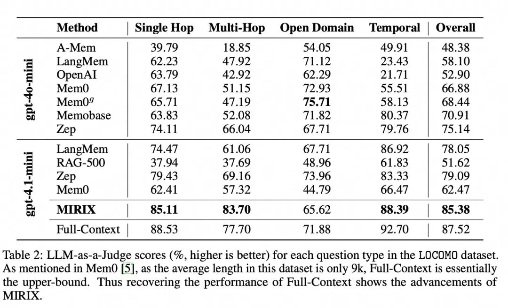

MIRIX 提出，要让 AI 真正具备「记忆」能力，不能仅仅依赖基础的存储和查找功能，而需要借鉴人类的记忆机制。人类的记忆系统并非简单的信息仓库，而是一个结构复杂、各司其职的认知网络。这种精细化的分类管理方式，让我们能够有针对性地保存、提取和运用各种信息。MIRIX 正是从这种「分工协作」的理念中获得灵感，为大语言模型智能体设计了一套相应的多模块记忆框架。其核心观点是，「精准的路径规划和信息提取」才是破解 AI 记忆难题的突破口。

所以 MIRIX 内部将记忆分为 6 个不同的组件，并且采取 Multi-Agent 架构进行管理：

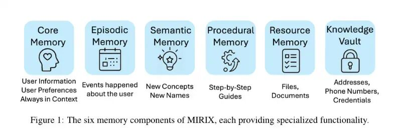

对于这些记忆分类下包含的具体内容，感兴趣的可以看论文。每类记忆下采取不同的存储结构，并且提供不同的检索方式。分享下它在记忆更新和记忆提取过程中一些优化的地方：

1.记忆更新

记忆更新前首先会根据用户输入检索记忆库，将检索结果和用户输入一起传递给元记忆管理器（Meta Memory Manager）。元记忆管理器主要负责记忆库的路由，根据输入分析确定此次更新与哪些记忆组件相关，将输入路由到对一的记忆管理器做最后的更新。

2.记忆提取

记忆提取先会从所有的记忆组件进行一个粗略的检索，返回高层次的摘要信息而非详细内容。Chat Agent 会根据返回结果和用户输入确定需要进一步搜索哪几个记忆组件，之后执行进一步搜索返回更详细的内容。

MIRIX 的核心思想就是区分了不同类型的记忆，在更新和检索时需要进行路由。不同类型的记忆采取不同的存储结构，以及提供不同的检索方式。

### 实现总结

从上面的 Memory 产品的演进趋势看，Memory 正在覆盖越来越多的场景，同时也在覆盖越来越多的记忆类型。早期 Memory 主要聚焦在对话记忆，现在已扩展到任务执行、决策支持、个性化服务等多个场景，覆盖的记忆类型也更加全面。

在技术实现方案上，有一些被验证的手段能够有效提升记忆的性能表现：

1\. 精细化的记忆管理：记忆在场景、分类和形式上有明确的区分，『分而治之』的思路被证明是有效的优化手段，这个和 Multi-Agent 的优化思路是类似的。

2\. 组合多种记忆存储结构：记忆底层存储结构可以大致分为结构化信息（Metadata 或 Tag 等）、纯文本（Text-Chunk、Summary、情境记录等）和知识图谱，会分别构建标签索引、全文索引、向量索引和图索引等提升检索效果。也有基于这些原子索引能力构建场景化的索引，如分层摘要、社区图等。不同的存储结构对应不同的场景，记忆框架由集成单一结构演进到组合多种架构，带来了一定的效果提升。

3\. 记忆检索优化：检索方式也在逐步演进，由单一检索演进到混合检索，也有针对 Embedding 和 Reranker 进行调优优化。

## 最后

笔者所负责产品为 Tablestore，是存储团队面向结构化数据存储所提供的产品。我们支撑了钉钉消息存储、夸克搜索存储和企业网盘元数据存储，这些应用在 AI 时代也面临着新的场景的挑战，自然而然衍生出新的存储需求，从目前的定义来看也属于 Agent Memory 这类的需求。

我们看到有此类需求的客户越来越多，为了简化与存储的集成，我们设计并发布了新的 Agent Memory SDK（关于此 SDK 的案例和详细说明，可以移步[《让 Agent 拥有长期记忆：基于 Tablestore 的轻量级 Memory 框架实践》](<https://mp.weixin.qq.com/s?__biz=MzIzOTU0NTQ0MA==&mid=2247552118&idx=1&sn=838360cbd080ba56d2b8fbe23b852e11&scene=21#wechat_redirect>)），同时我们也与 LangChain/LlamaIndex/LangEngine/SpringAI Alibaba 等开发框架做了集成。基于这个 SDK 我们接入了 Mem0 提供的 MCP 服务 OpenMemory，可以托管在 FC 上开箱即用。

Tablestore 在 Memory 存储场景有几个比较独特的优势：

1\. Serverless：Tablestore 支持计算与存储自动弹性扩展，按量计费，支持从 0 到 PB 级的弹性扩展。目前我们看到 Agent 应用的规模有两个极端：一个极端是海量小租户，每个租户规模都很小，此时低成本是很强的诉求；二是超大规模大租户，此时规模和弹性扩展能力是很强的诉求。Tablestore 能很好的满足这两个极端场景的需求。

2\. 高可用保障：Memory 是 Agent 应用非常核心的组成部分，高可用保障能力是必不可少的。Tablestore 支持多 AZ 容灾，也提供跨区域容灾能力。多 AZ 容灾是默认能力，无需额外的开通成本，不管是多小的租户都享受同等的高可用保障。

3\. 混合检索：Tablestore 提供 Memory 场景所需的 Json、标签、全文、向量等索引，支持单表多向量联合检索、标量和向量混合检索等多种检索方式。

最后，欢迎加入我们的钉钉公开群 (钉钉群号： 36165029092)，与我们一起探讨 Agent Memory 相关问题。

# 参考：

1.《The Rise and Potential of Large Language Model Based Agents: A Survey》

2.《From Human Memory to AI Memory: A Survey on Memory Mechanisms in the Era of LLMs》

3.《MemoryBank: Enhancing Large Language Models with Long-Term Memory》

4.《MemGPT: Towards LLMs as Operating Systems》

5.《ZEP: A TEMPORAL KNOWLEDGE GRAPH ARCHITECTURE FOR AGENT MEMORY》

6.《A-MEM: Agentic Memory for LLM Agents》

7.《Mem0: Building Production-Ready AI Agents with Scalable Long-Term Memory》

8.《MemOS: A Memory OS for AI System》

9.《MIRIX: Multi-Agent Memory System for LLM-Based Agents》

****

### 创意加速器：AI 绘画创作

本方案展示了如何利用自研的通义万相 AIGC 技术在 Web 服务中实现先进的图像生成。其中包括文本到图像、涂鸦转换、人像风格重塑以及人物写真创建等功能。这些能力可以加快艺术家和设计师的创作流程，提高创意效率。

## 点击阅读原文查看详情。
