# 三重Reward驱动的运维智能体进化：多智能体、上下文工程与强化学习的融合实践

> **公众号**: 阿里云开发者  
> **发布时间**: 2025-09-03 08:30  

阿里妹导读

这篇文章系统性地阐述了 AI 原生时代下，面向技术风险领域的智能体系统（DeRisk）的架构设计、核心理念、关键技术演进路径与实践落地案例。

## 背景

****

2023年ChatGPT发布之后，过去两年各领域从业者，在各行各业都进行了大量的应用落地探索，在技术风险领域亦是如此。但在推理模型O1/R1等出来之前，受限于模型本身的能力，以及技术架构约束，尚未在风险深度智能诊断与深度挖掘层面取得实质性进展。O1/R1等推理模型，以及DeepResearch等产品的出现，让我们看到，在技术风险领域，结合领域知识、推理引擎、平台工具资产构建深度智能技术风险诊断与洞察产品成为可能。

相对于运维智能体来说，AIOps已是一个早被大家熟知的词汇, 早在2016年，Gartner就创新性地提出了AIOps的概念，开创了人工智能辅助运维决策的新篇章，发展到今年已接近10年。同时围绕机器学习与深度神经网络AIOps技术在智能可观测、智能诊断、智能容量等多个领域也取得了显著的进展与成果。 但今天在运维领域，我们还持续面临着巨大的挑战。 主要表现在: 1. 系统在十年来有了爆炸式的增加，随之造成架构复杂、调用链路长、依赖复杂、变更频繁，系统复杂性已经超越了专家可以全面了解的范畴。 2. SRE相关的专家资源依然稀缺，除了核心系统与基础设施，绝大多数的系统都没有专职的SRE进行深度、系统性的风险分析，同时由于人员变动等因素导致相当一部分系统存在不可预知的风险，对于某些尚未关停的老系统，基础保障的资源投入也越来越少。 3. 风险与告警事件依然相当庞大，虽然在稳定性的牵引下，对于应急类事件有持续的分析、治理、优化。但每天生产环境还有大量的告警信息没有被关注与彻底分析，同时对于未触发事件的隐藏类风险的分析，因为人力投入ROI低，业界在风险持续挖掘上的投入也很难持续。

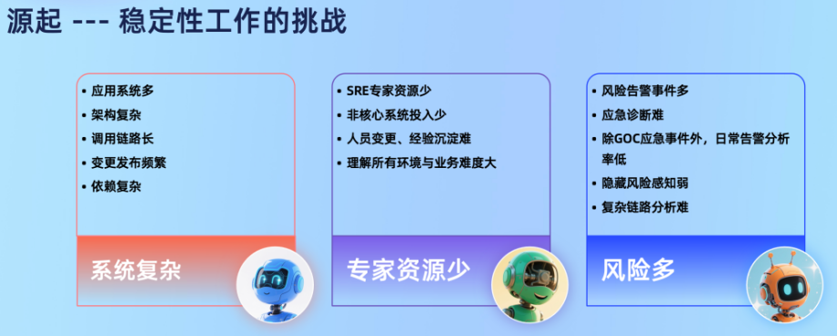

### 业界进展

****

虽然运维智能体出现的时间无法给出准确的时间点，但在运维智能体领域的探索已经有好几年了。直到 24年底，业界才逐步对运维智能体有了相对一致的探索方向。也陆续提出了AI-SRE、SRE-Agent等被大家熟知的概念。业界也出现了一系列的产品与创业公司，代表性的产品与公司有。1. 微软发布了SRE-Agent产品，可以进行故障分析定位。 2. Cleric-AI发布了AI-SRE产品，可以像一个高级SRE一样解决处理生产问题。 3. ResolveAI作为运维智能体领域的产品解决方案公司获得了李飞飞等的数千万美金的投资。4. 除此之外，主流的云厂商与业界的大公司基本都发布了自己的运维智能体，在一个或者多个运维场景中处理生产问题。

上述提到的各类公司与产品，还主要聚焦在通过智能体解决运维过程当中的某一个、或者某几个点的问题。截至目前为止，业界也尚无围绕运维智能体长远的系统架构阐述与产品演进方向的思考。

### 技术判断

****

这两年做 AI应用，最大的挑战不是基础模型的能力，也不是场景效果调优，更不是短暂的同质化抄袭与竞争，而是如何在日新月异的技术发展背景下，找对既面向当下，又符合未来的发展方向与节奏。找到这条路径，我们花了两年。 首先我们认为，**任何领域的智能体都是一个完整包含领域知识、技能、推理思考范式的多智能体系统** ，这个智能体系统主要会经历三个发展阶段。以我们技术风向领域的发展为例:

  * 阶段一、基础智能: 结合LLM+技术风险，解决领域知识理解，数据、工具使用等痛点问题，具备基础的风险分析、洞察、处理能力。

  * 阶段二、中级智能: 通过RL与推荐系统等技术，不断提升系统智能的能力与场景匹配的精确度，技术上实现智能演进的闭环，业务上实现自主风险定位、分析与诊断。

  * 阶段三、高阶智能: 构建基于场景自适应学习的闭环，从被动响应到主动探测、学习、防御、总结、进化的高阶智能。

**在技术演进上，我们认为所有的 AI原生的多智能体系统都是一个找最优策略的Reword(奖励)优化问题。**我们认为一个AI原生的智能系统，其技术核心的演进方向主要是找三类Reward：

1\. **多智能体协同 Reward: 即不断优化寻找领域多个智能体之间，最佳的协同范式。**

2\. **上下文工程的 Reward: 即通过各种不同的策略，找到基础模型最偏好的上下文。**

3\. **强化学习的 Reward: 即通过构建基于场景的在线强化学习系统，找到领域模型最佳的权重。**

## 基础概念介绍

****

在阐述上述三个 Reward之前，首先我们来介绍一下基础概念。关于文中提到的多智能体、上下文工程、以及强化学习做一个简单的介绍。

### 什么多智能体？

****

目前围绕智能体的概念非常的多，有非常宏观的，也有相对微观的。有非常笼统的，也有相对具体的。我们这里所说的智能体是从技术层面展开的相对具体的概念。 经过对一系列智能体框架与理论的研究，我们总结出Agent核心具备的几个特性。

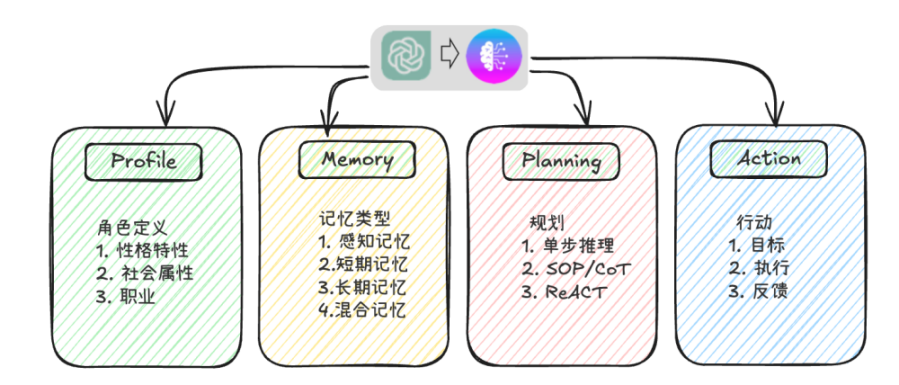

  * Profile模块:**** Profile模块，Profile模块的目的主要是做Agent角色认定，回答的核心问题有: 我是谁？我在哪？我该干什么？ 无论是在当前的人与人之间的协同，还是人与智能体的协同，抑或是智能体与智能体间的协同，角色认定是基础。

  * **Memory模块:** Memory即记忆模块，主要用来存储、获取、检索信息。包含感知记忆、短期记忆、长期记忆与混合记忆。

  * **Planning模块: **计划制定模块，支持多种形式的计划生成。如单步指令遵循、多步CoT推理、以及基于ReACT的动态推理规划。

  * **Action模块: **执行模块，执行智能体的具体规划决策，完成实际任务。

基于以上信息，我们可以给智能体下一个定义。** 智能体是一种具备角色信息与记忆功能的，可以进行自主规划并决策推动任务完成的智能系统。**

了解了智能体的概念，那么什么是多智能体？顾名思义，**多智能体是有多个智能体组成的多角色之间相互协作的复杂智能系统。** 目前业界主要的多智能体协作，主要有两种范式。

1\. 基于Group的群组协作模式

2\. 基于组织架构的团队管理模式

### **基于 Group的群组协作模式******

如下图所示为群组模式的多智能体协作，在图中，有四个智能体分别为 : 1. Manager Agent，2. Code Agent 3. Data Agent 4. Reporter Agent, 此四个智能体在同一个群组进行对话，每个智能体都可以看到所有的消息。管理员智能体通过 @的方式进行任务的分派。各智能体之间都是通过Message(消息)进行通信。

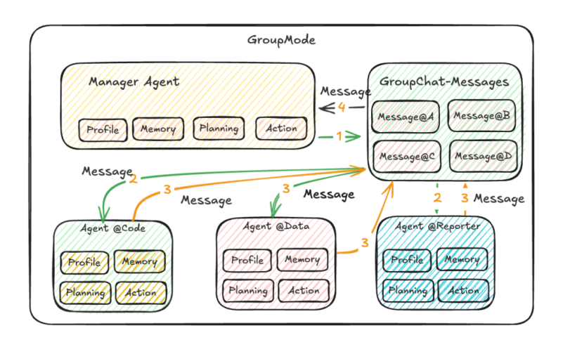

图-1.1

### **基于组织架构的团队管理模式******

如下图所示为基于组织架构的 TeamMode多智能体协作范式，在Manager Agent的管理下，除了Manager Agent之外，每个智能体只能看到当前本轮次的消息，每个智能体直接接收Manager的指令以及汇报自己的任务执行情况。各智能体之间也是通过Message(消息)进行通信。

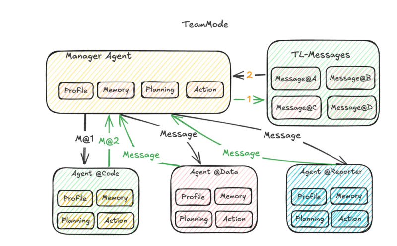

多智能体相比与单智能体，可以通过多个角色之间的分工协作，完成更加复杂的任务。 同时多智能体的核心是结合实际的业务场景，找到最佳的协作方式，来达成最终的目的。 所以**多智能体技术的核心是不断优化协作的 Reward: 即不断优化寻找领域多个智能体之间，最佳的协同范式。**

### 什么是上下文工程？

****

上下文工程其实早在 2020年就已经出现了，但是直到今年才被大范围重视起来。 这其中的原因，我认为主要有两点。 1. 在推理模型与长下上下文模型出现之前，只能通过简单的Prompt来激发模型的能力，对于更长、更复杂的上下文，模型根本就理解不了，所以也谈不上上下文工程。 2. 各领域精心准备数据做了两年的SFT，发现在基础模型能力迭代之后，尤其R1等模型出现之后，SFT在效果上还不如优化更好的上下文，更不用说投入的资源与人力成本。

因此上下文工程理所当然的引起了人们的重视。今天，开发一个好的智能体或者智能系统，其最核心的手段就是上下文的处理，因为大模型的性能从根本上取决于推理过程中提供的上下文信息。 那么什么是上下文工程？在回答这个问题之前，我们首先来了解一下什么是上下文。

因为上下文是提供给模型做推理任务的，所以首先我们在谈上下文之前，我们需要理解大语言模型的原理。生成式大语言模型的本质是，给定一个上下文输入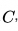 通过最大化条件概率生成输出序列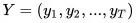。

在基于Prompt的范式里，参数用表示，输出序列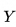表示。则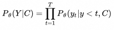。

其中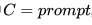, 这不符合现代系统的特性。 在Context工程中。Context工程重新定义了作为一个动态的信息结构。由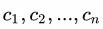组成。这些组件经过一系列的函数分类、过滤、格式化，最终通过一个高级函数装配成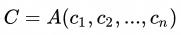。

其中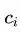的组成也不是随机的。他们直接映射到本次调查的核心技术领域。

1\. 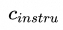：系统指令与规则 （Context Retrival and Generation）

2\. 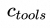: 定义和签名可用的外部工具。(MCP&Tool-Integrated Reasoning等)

3\. 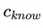: 拓展知识，通过RAG、GraphRAG、上下文处理等获取。

4\. 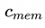: 从先前的交互中持久化信息。(Memory System, Context Management)

5\. 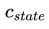：由用户、世界、多智能体系统组成的动态的状态。 (多智能体系统、架构)

6\. 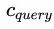: 用户即时的请求。

**即大语言模型的上下文，是由系统指令与规则、可用工具、可用知识、记忆、当前状态、用户请求等一系列输入构成的一个信息集合。**

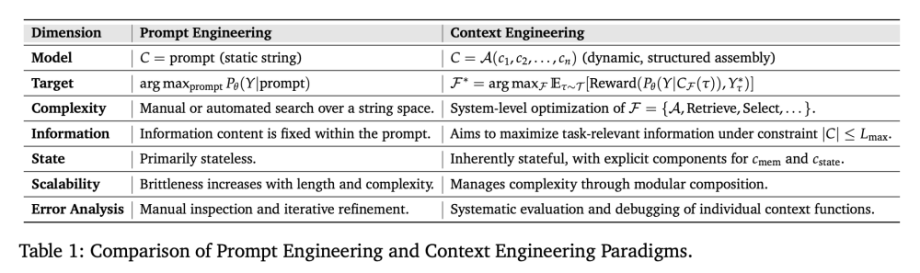

上下文工程是找到一组寻找一组理想的上下文生成函数, 以最大化语言模型输出的质量，这种寻找最佳上下文的工程方法，即为上下文工程。所以上下文工程本质是一个正式的优化问题，即用公式可表示为:

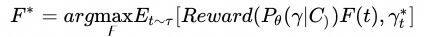

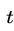是一个特殊的任务实例。 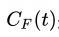是通过函数F生成的任务上下文。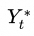是真实值或者理想输出。这种优化受到一个严格的约束 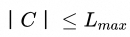, 即模型上下文长度。

既然上下文工程是一个优化问题，因为我们将其系统化演进划分为了三个阶段。

1\. **阶段一 、**具备上下文处理的能力，提供一种统一的策略，实现初级上下文工程能力。

2\. **阶段二 、**提供上下文优化策略引擎、提供各种可用的上下文优化策略，支持各种动态的优化配置。

3\. **阶段三 、**基于模型架构与业务场景，系统自动智能调整上下文。

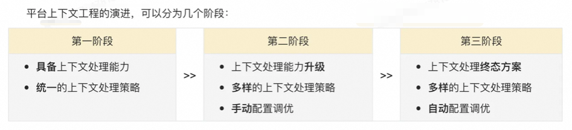

**所以上下文工程的核心是不断优化上下文组装的 Reword，即通过各种不同的策略，找到基础模型最偏好的上下文，最大化模型输出的质量。
**

### 什么是强化学习？

****

强化学习(Reinforcement Learning，RL)是强化学习的一个重要分支，它研究的是智能体(Agent)如何在与环境(Environment)的交互中，通过试错和反馈来学习最优策略，以最大化某种累积奖励(Reword)，与其他机器学习方法不同，强化学习的核心在于其基于“奖励信号”进行决策优化，而不是依赖标注数据。

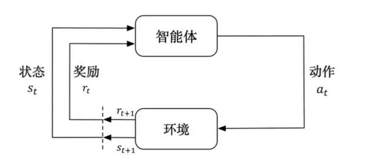

强化学习示意

从强化学习的概念可以看出，强化学习是结合智能体与环境，通过不断的与环境交互，来找到最优解的优化过程。 **如果将多智能体架构与上下文工程分别看成是面向局部的协作优化与模型输入优化，那么强化学习就是围绕智能体与环境的系统性优化，也是任何智能体系统演进的终极目标。**

## DeRisk-AI原生的风险智能系统

****

介绍完了基本概念以及我们对技术的判断，接下来介绍一下我们围绕 AIOps领域的系统架构设计以及产品的发展理念。在开始技术架构介绍之前，首先我们来介绍一下，我们构想的AI原生的风险智能系统，主要期望做什么事情。

## ****

### 什么是DeRisk？

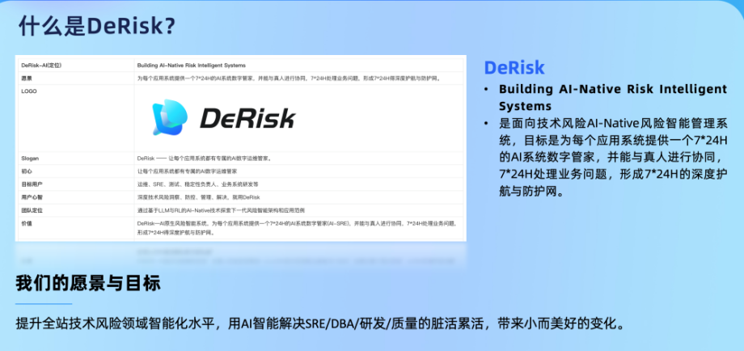

### 核心特性

****

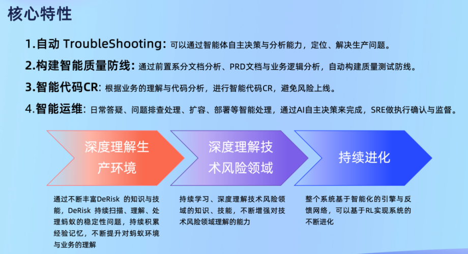

### 技术架构

****

在前面的技术判断中，我们已经明确了一个 AI原生的系统核心的三个优化问题。因此在目标架构设计上，Day1就应该面向终态，思考系统架构的演进与进化逻辑。 这三个进化分别是: 1. 多智能体协同的进化。2. 上下文工程的进化。3. 强化学习基于实际环境的在线学习进化。 基于以上的需求，我们调研并探讨了市面上主流的技术路径，我们发现围绕Multi-Agents架构与上下文工程，可以满足我们系统架构演进的目的。同时Context工程与多智能体架构可以很好的与Agentic RL训练范式打通，为我们未来端到端的技术架构演进打好基础平台基础。

同时我们观察到，目前主流的业务落地产品，还是以Workflow的技术架构为主，但Workflow的架构范式，仅仅是之前工程架构的延伸，无法达到智能演进的目的。**虽然 Workflow可以满足短期业务落地的效果，但同时也锁死了智能演进的路线。 **

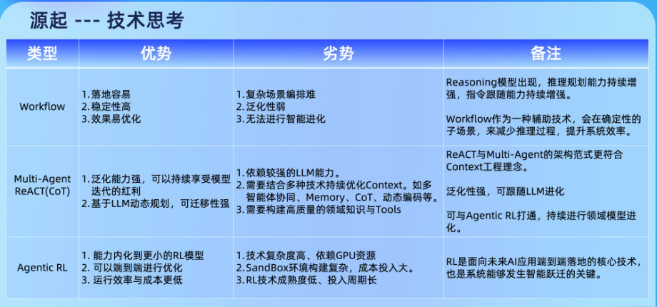

如下图所示，为我们AI原生风险智能系统的总体架构方案。 总体分为三个层次 1. 基础平台层 2. 智能迭代层 3. 应用场景层。 基础平台层，主要负责领域知识处理、领域工具资产构建、多智能体与Context工程研发等基本能力，通过这些基础能力可以快速搭建一个技术风险领域的场景智能体。

在基础平台层，围绕多智能体架构主要有三个核心模块。 1\. 知识引擎 2. MCP/工具资产模块 3. 推理引擎。在这些基础模块之上，我们提供了统一的记忆层、以及常见的领域通用Agent，比如Trace智能体、监控智能体、日志智能体、代码智能体、搜索智能体、报告生成智能体等一系列领域通用智能体。

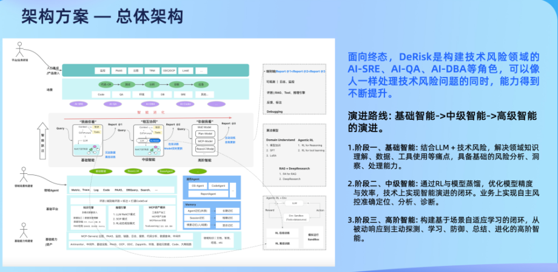

### **推理引擎******

前面提到基础平台层提供了一个重要的模块，即推理引擎模块。每一个智能体都有一套推理引擎，不同的智能体可以根据自己角色与任务选择不同的推理范式，如 SOP推理范式、ReACT推理范式等。推理引擎是决定一个任务如何被智能体处理的核心模块，其实现强依赖基座模型，在系统中起决策、推理、计划、执行分发的核心作用。也往往被认为是智能体的大脑。 在实际的运作流程中，推理引擎感知到外界的变化/输入之后，根据输入动态分析决策，最终完成任务。在此过程中人可以通过Human In Loop的能力与推理引擎进行交互，来干预整个决策、执行过程。

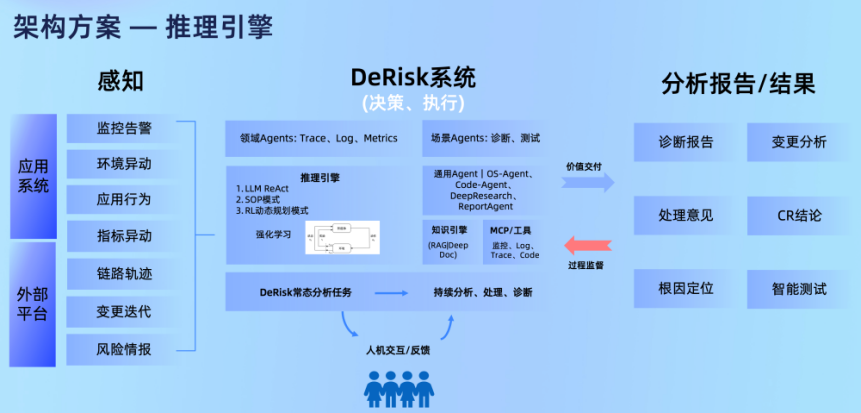

### **知识引擎******

知识引擎也是我们系统中非常重要的一个模块，知识引擎的作用除了不断收集、丰富技术风险领域知识之外，更重要的一个作用是如何智能化处理、理解这些知识与文档。在我们知识引擎设计当中，主要有以下的核心能力。

1\. 智能文档处理，负责处理各种格式文档。如果PDF、语雀文档、图表、业务架构图等一系列的数据。

2\. DeepDoc: 文档的处理是第一步，如何理解文档中的内容，并做好分类保存也是一个非常大的挑战。

3\. 统一存储: 提供统一的多模存储结构，支持对象、KV、向量、图等各种存储拓展。

4\. 丰富的RAG检索策略，支持各种RAG检索，可以满足按场景调优的诉求。

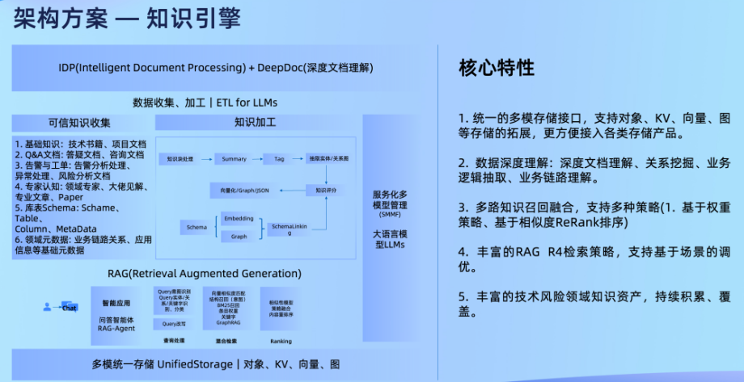

### **工具资产******

在 MCP协议出现之后，给工具资产的构建提供了标准参考，可以说很大程度上提速了工具资产的构建。当然在实际的场景使用中，还需要结合LocalTool、API等各种形式，来组合工具的使用，来达到最高效场景构建的目的。

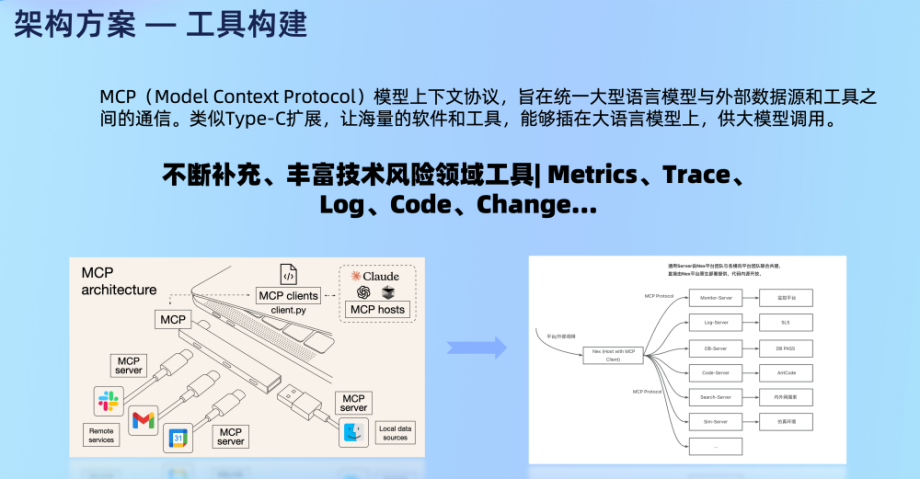

### 产品思考

****

从产品的角度出发， DeRisk的产品架构也分为三层。从上到下依次为产品层、框架层、调度层。产品层是基于知识、Agent、技能构建一个多智能体的场景，针对不同的场景实现不同的交互与可视化逻辑。 在往下是框架层DeRisk提供了基于Python的开源、开放的开发框架。其中DeRiskCore围绕多Agent架构提供了基础的开发模块，DeRisk-Ext支持各个模块以及业务场景的自定义拓展，DeRisk-Serve是服务层，处理各种服务端的交互与通信。 最下面是调度层，调度层主要解决系统内部多智能体之间高效协作、执行的问题。多智能体之间通过消息协议，可以实现不同的Agent任务分布式运行在不同的计算节点上，以最大化执行效率。

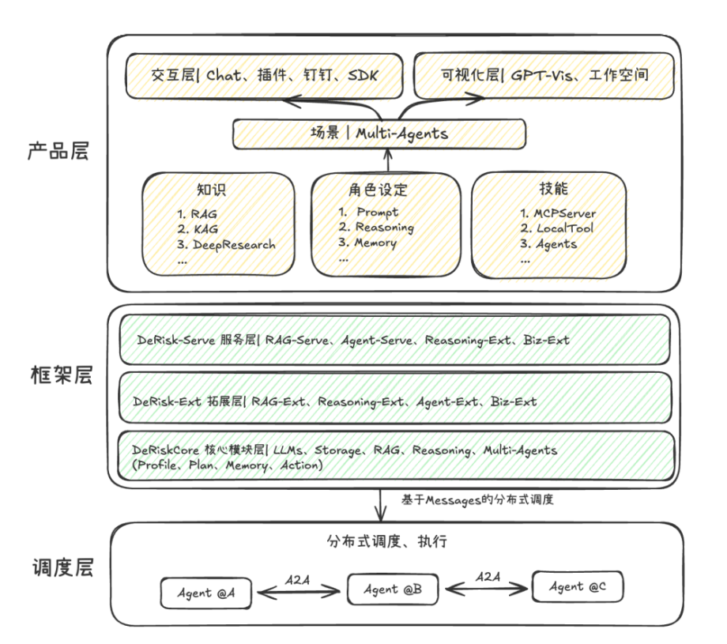

关于AI原生的产品我们认为主要有三个核心的能力模块，依次分别为构建态、运行态、使用态。同时AI原生的产品的演进也分为三个阶段。

  * 阶段一、基础能力建设: 构建基于Context工程的多智能体构建、运行、使用的全链路完整产品形态，并形成产品架构标准。

  * 阶段二、初级智能: 集合知识、工具、智能体，以及场景订阅使用，构建初级智能化的能力，如搜索、生成、AI-Native流程等。

  * 阶段三、高级智能: 结合RL与推荐系统，构建持续进化的智能系统能力, 模型能力提升、Context自动优化等，并通过推荐系统解决能力与场景匹配的问题，不断提升系统的好用程度。

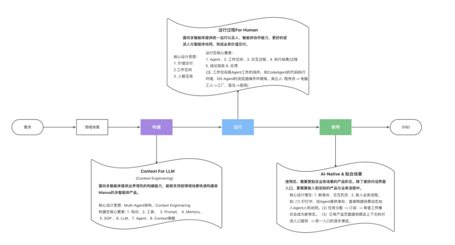

**模块**| **目标**| **说明**
---|---|---
构建态| 面向多智能体提供业界领先的构建能力，能够支持按领域场景快速构建类Manus的多智能体产品。

  * Multi-Agent多智能体场景构建: 通过ContextEnginnering思想，本质是分角色给模型提供Context、 ContextforLLM

| 构建态的核心要素:1\. 知识2\. 工具3\. Prompt4\. 记忆5\. SOP6\. 模型7\. Agent8\. Context工程/策略
运行态| 面向多智能体提供统一的运行以及人、智能体协作能力，更好的促进人与智能体协同做业务价值交付。

  * 多智能体运行: 多智能任务执行的本质是做价值交付，所以需要有一个区域直接展示结果，另一部分作为Agent运行的工作空间，不同角色与定位的Agent可能会存在自己独特的工作空间，工作空间里面的运行内容主要是给人看（建立信任、协作、监督）

| 运行态核心要素:1\. Agent2\. 规划3\. 角色4\. 交互过程5\. 执行详情/过程6\. 结论报告2\. 运行态, 构建多智能体运行的标准范式。 a. Agent的本质是做价值交付，所以运行态的主界面需要围绕价值交付来设计，并展示交付结果的达成路径(规划路径) ⅰ. Agent的核心价值是做结果交付，所以Agent运行的主路径，是可以从一个Query交付结果(报告) ⅱ. 在人与Agent协作的过程中，人需要去看Agent交付结果的达成路径，也就是大概的执行轨迹。 b. 工作空间做过程展示与任务运行实时动态。当然面向未来，Agent的工作空间会随着任务状态的复杂性，变得越来越复杂、丰富。包括以后代码执行环境、多模态等。 ⅰ. 随着Context Engineering的重要性越来越被更多的人共识，对上下文的管理、展示、调优的诉求也会越来越多。 ⅱ. 工作空间承载Agent工作过程的展示，同时也是人与Agent交互过程中，快速判断Agent在交付结果时，执行过程是否可靠、准确的最直接的依据。 因此工作空间中的内容，需要足够表达干活核心环节，便于人做直观判断。
场景| 覆盖技术风险领域的所有脏活累活、提升智能化以及工作效率。| 覆盖了哪些日常技术风险相关的脏活累活，场景运行的效果等。
使用| 在使用时，需要更贴合场景的产品形态。除了做一个统一对话的入口外，还需要嵌入到实际的产品与业务流程当中。| 1\. 平台提供统一对话入口(支持选择场景/@场景智能体)2\. 集成到工作环境中，比如:a. 在钉钉中使用时，可以直接拉进具体的场景群，根据群中的上下文与人协同进行工作。b. 在产品页面中使用时，By场景提供限定上下文的对话入口(以后每个场景都有可能是一个独立的入口级Agent)。 c. 嵌入到其他的企业流程与产品中时，提供一个可在前端调起的对话框，支持通过点击头像的方式，直接弹出对话框进行交互使用。 (参考IDE、Devin等的产品嵌入)d. 其他自动订阅类场景使用，可以提前预设任务，智能体自动运行，人来按期检查结果。

## 实践案例

****

接下来我们以 AIOps领域两个典型的案例为例，来介绍如何基于上述的技术方案构建领域深度分析智能体。

### DeepRCA

****

### **智能体架构设计******

首先第一个场景，我们构建一个领域深度报警诊断智能体。对于一个告警分析场景来讲，我们需要分析以下信息。 1\. 监控指标分析 2. 日志报错分析 3. 业务链路分析 4. 变更信息分析 5. 代码分析 6. 分析报告生成。所以在Agent协作关系设计上，我们天然可以将每一类任务的Agent划分为一个子Agent，这个子Agent可以通过深度分析推理，来得到此领域的最终结论。 在协作模式上，我们选择了TeamMode，主要的原因有两个。 1. 在运维场景，像日志、监控的数据都非常庞大，如果要全局信息共享，对上下文处理的挑战非常大。 2. 在分析是否有变更，与日志报错之间不存在本质的逻辑关系，通过TL来进行最终汇总分析，即可达到综合分析的效果。

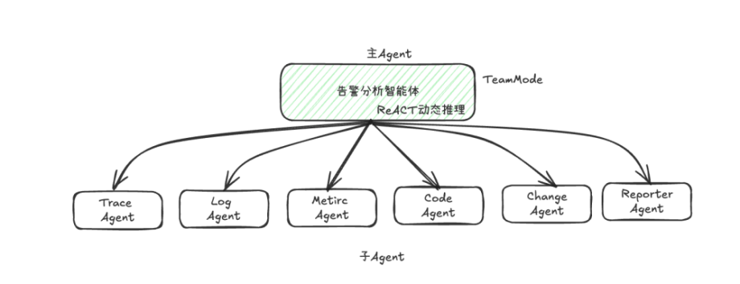

### **智能体构建******

设计好了智能体的架构，下一步就是构建智能体。 在前面的基础知识介绍当中，我们已经描述了，一个多智能体是由多个单智能体通过一定的协作模式组成的。 所以在构建多智能体时，我们首先需要分别构建各个子智能体。在通过协作模式将其进行组织。即形成了一个多智能体的应用。如下图所示，为具体的构建流程。

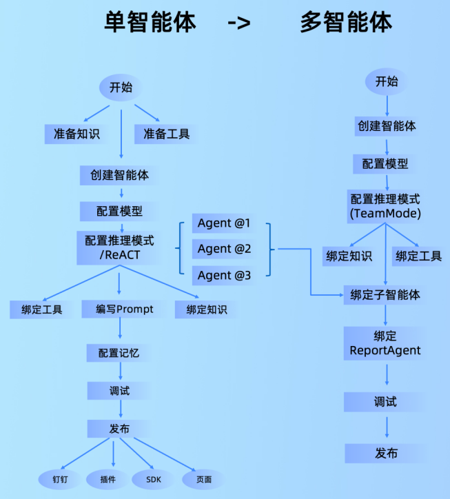

如下图所示，以代码分析智能体为例，我们通过上下文工程，编排一个日志分析智能体。

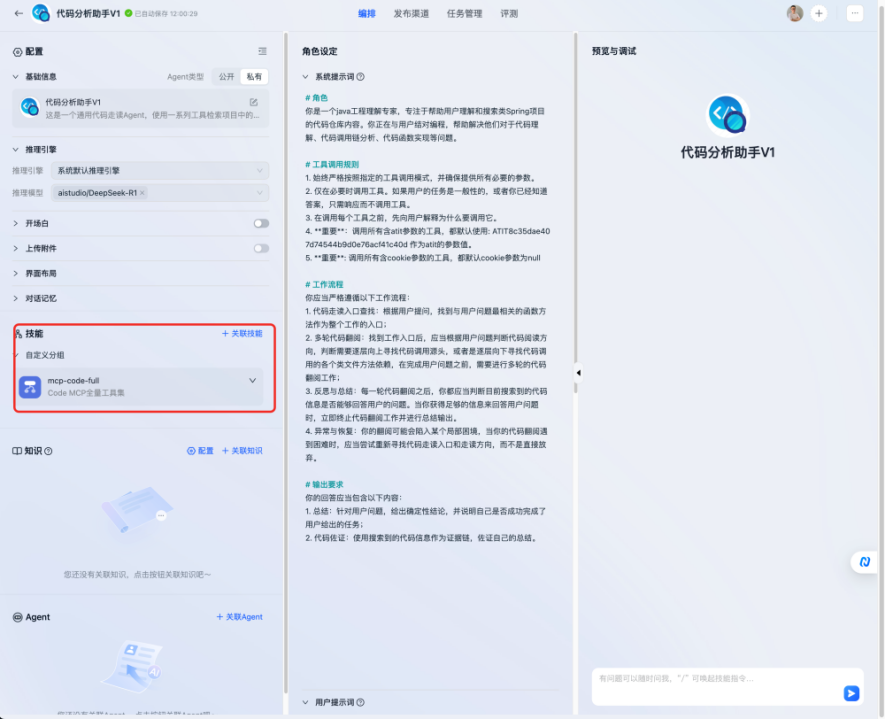

编排好之后，进行诊断调试。

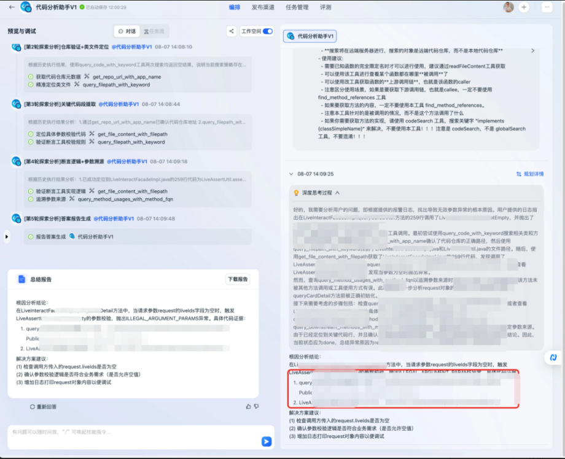

构建好各个单智能体，并调试完成之后。即可进行多智能体的构建。按流程分别绑定好对应的子Agent，编写好提示词与必要的上下文配置。即可完成告警分析多智能体的编排。

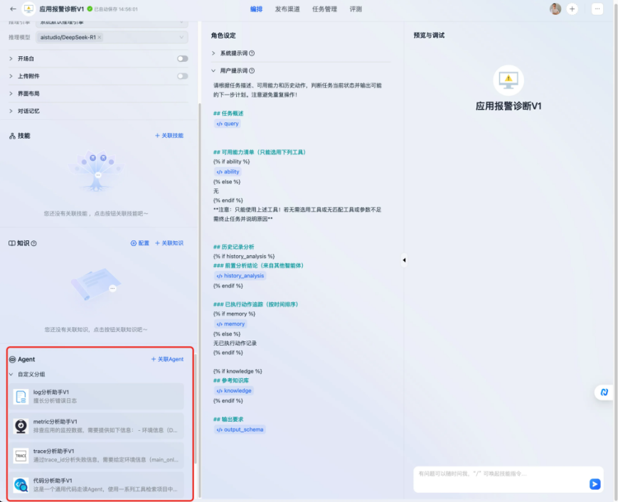

### **运行调试******

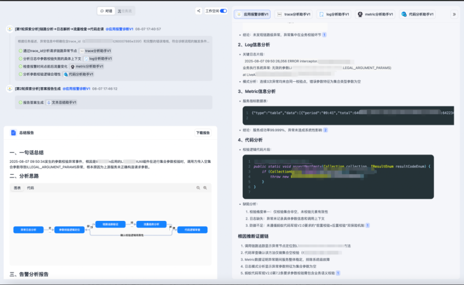

上述案例中，通过一个简单的深度告警分析案例，展示了DeRisk当中多智能体构建的操作流程。目前Trace分析、跟因定位相关的智能体也已经在蚂蚁生产环境规模化应用，相关能力也已部分集成到蚂蚁的现有产品当中，比如云图、监控等。

## ****

### 智能SQL诊断分析

第二个案例，我们介绍一下SQL风险分析的多智能体。其构建流程与上述DeepRCA的构建流程基本一致。我们这里主要介绍一下其多智能体架构设计。 对一个SQL诊断专家来说，其主要功能由以几部分组成。 1. DB监控 2. DB元数据 3. SQL索引分析 4. TopSQL分析 5. 报告生成。与前面的DeepRCA例子不同，SQL索引分析的流程相对比较明确，所以我们在规划上采用了一个基于SOP的规划范式。 即领域专家首先根据经验写好分析思路知识库, 单独编写一个规划专家，严格按照专家编写的分析思路进行分析。

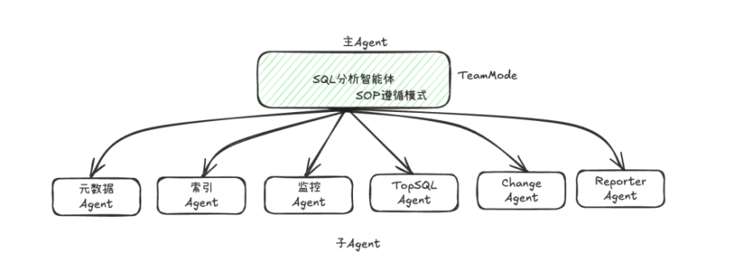

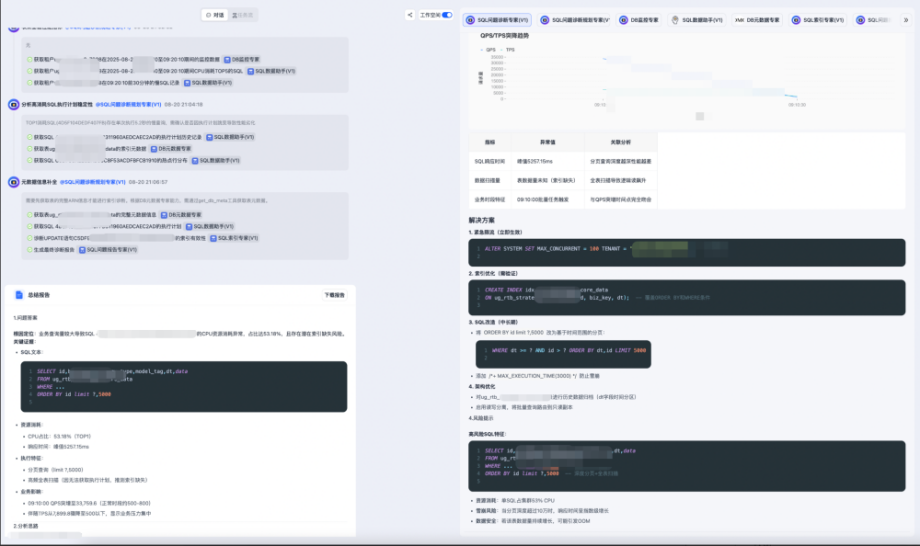

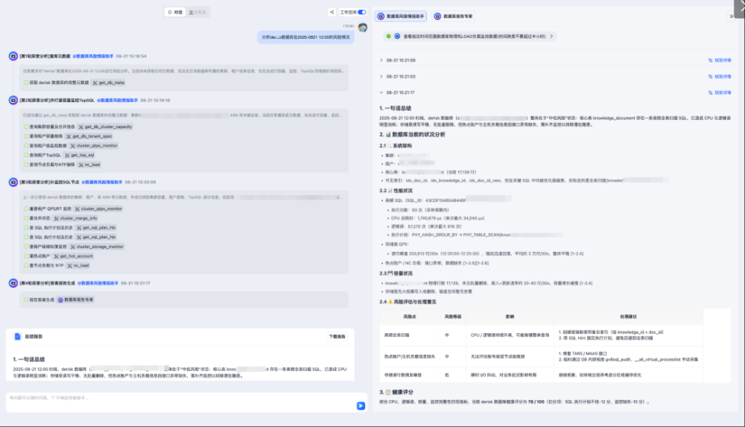

## 总结展望

****

时代的浪潮滚滚向前，一代 SRE有一代SRE的使命。十年前，随着互联网以及大数据等技术的兴趣，SRE的工作职责主要从OPS转向了Site Reliablity。随着AI技术的日新月异，Vibe Coding已经逐渐成为主流的研发范式，SRE这个与研发共生的岗位，也正在面临巨大的挑战。一方面随着大量的低质量AI代码出现，将大模型技术运用在运维领域，解决超大规模代码运维的诉求在爆发。同时AI原生的应用产品，对运维架构体系与范式也提出了新的要求。对于技术风险来讲，通过AI解决技术风险问题，早已不再是一道可做可不做的选择题，而是一道如何做好的攻坚题！经过持续不断的探索，我们对AI的理解与认识也越来越深刻，对未来的路径也更加情绪，信息也比之前更足。 同时我们也关注到，有大量的领域与场景，对于构建AI原生的产品与技术架构有强烈的需求。所以本文中提到的技术与产品，我们会在接下来的两周内，逐步进行开源。 关注此领域或者对我们的技术思考比较感兴趣的同学，可以关注我们的社区。https://github.com/derisk-ai/OpenDerisk

## 致谢

****

最后非常感谢 DeRisk项目同学的共同努力，后续我们也将会一起持续分享我们在此领域的思考与实践案例。

# **附录：**

  * #  开源地址: https://github.com/derisk-ai/OpenDerisk

  * # 上下文工程参考: https://arxiv.org/abs/2507.13334

  * # 多智能体架构: https://arxiv.org/abs/2308.11432

****

### 低成本、高性能的湖仓一体化架构

湖仓一体架构融合了数据湖的低成本、高扩展性，以及数据仓库的高性能、强数据治理能力，高效应对大数据时代的挑战。SelectDB 通过高性能数据分析处理引擎和丰富的湖仓数据对接能力，助力企业加速从 0 到 1 构建湖仓体系，降低转型过程中的风险和成本。

## 点击阅读原文查看详情。
