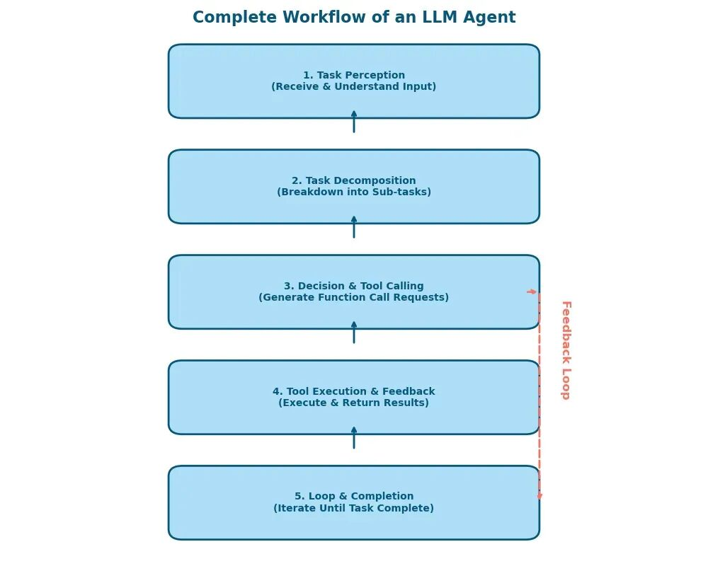

# 不到100行代码，实现一个简易通用智能LLM Agent

> **公众号**: 阿里云开发者  
> **发布时间**: 2025-04-27 08:30  

阿里妹导读

本文将分享如何使用不到 100 行的 Python 代码，实现一个具备通用智能潜力的简易 LLM Agent。你将看到整个实现过程——从核心原理、提示（Prompt）调优、工具接口设计到主循环交互，并获得完整复现代码的详细讲解。

## 一、引言：LLM Agent 的新思路

在人工智能领域，大型语言模型（LLM）如 GPT 系列，凭借其强大的文本生成能力，已在多种应用中展现出卓越的表现。然而，传统的 LLM 主要擅长生成文本，缺乏与外部环境交互的能力，无法执行如计算、网络抓取或文件解析等具体任务。为突破这一局限，LLM Agent 的概念应运而生：通过将 LLM 与外部工具相结合，使模型不仅能进行对话，还能通过函数调用实现更复杂的任务。

本文将分享如何使用不到 100 行的 Python 代码，实现一个具备通用智能潜力的简易 LLM Agent。你将看到整个实现过程——从核心原理、提示（Prompt）调优、工具接口设计到主循环交互，并获得完整复现代码的详细讲解。希望本文能启发你开发出更多满足实际需求的 Agent。

在构建 LLM Agent 时，提示工程（Prompt Engineering）是关键环节。通过精心设计的提示，可以引导模型生成更准确和有用的输出。

通过本文的实践，你将掌握如何在有限的代码量内，构建一个功能丰富的 LLM Agent，为人工智能应用的开发提供新的思路和方法。

## 二、核心原理详解

在动手实现之前，我们需要理解几个关键概念和 Agent 的整体运行逻辑。掌握这些核心机制，将帮助你深入理解 LLM Agent 背后的设计哲学，并在实际开发中更加灵活地构建自己的智能助手。

### 2.1 大语言模型（LLM）的能力与局限

LLM，如 GPT-4、Qwen 等，基于海量的文本数据训练，通过预测下一个词语的概率来生成自然且流畅的内容，表现出惊人的语言理解与生成能力。然而，LLM 本质上是一个语言预测器，这种机制天然存在以下局限：

计算与逻辑推理不足

尽管模型能识别并生成数学表达式，但当涉及较复杂的运算（如大数乘法、日期推算、数值精确计算）时，经常出现错误，缺乏精准推理能力。

知识时效性有限

LLM 的知识库通常在训练数据截止日期后无法自动更新。例如 GPT-4 的知识截止于2021年9月，因而无法回答实时性问题或获取最新资讯。

无法直接访问外部资源

LLM 本身不具备直接执行代码、查询数据库、抓取网页或处理文件的能力，仅凭纯文本预测无法完成需要外部环境协作的任务。

为弥补这些局限，我们可以引入“函数调用（Function Call）”机制，让模型通过调用外部工具来增强自身能力，间接赋予模型类似“动手”的执行能力。

### 2.2 Function Call：赋能 LLM 的关键机制

Function Call（函数调用）是当前提升 LLM 实用性最重要的手段之一。这种机制允许模型在生成文本之外，同时以结构化的数据形式发出明确的指令，调用预定义的外部函数或工具。

Function Call 的运行机制可拆解为以下几个步骤：

需求识别

当 LLM 在交互中意识到当前任务超出自身能力范围时，便主动触发外部函数调用请求。例如，面对一道数学难题或网页查询任务，模型会自行判断需要外援介入。

调用参数生成

模型以结构化的数据格式（通常采用 JSON），明确指定调用函数的名称和所需的具体参数。例如，模型可能输出类似：

  *   *   *   *   *   *   *

    {    "function_name": "calculate_date_diff",    "parameters": {        "start_date": "2024-02-12",        "end_date": "2025-03-15"    }}

外部执行

系统接收到模型提供的函数调用请求后，执行预定义的外部工具或函数（例如进行 Python 代码执行、调用网络接口、访问数据库等），并获取实际执行结果。

结果反馈

执行结果再回传给模型，模型将结合上下文生成用户期望的自然语言答案。这种双向互动，使 LLM 的能力从纯文本输出扩展至实际任务执行。

Function Call 机制不但突破了模型自身的限制，还让模型产生一种类似“自我决策”的能力，实现了真正意义上的“动手”和“自我纠错”机制，大幅提升了实用性和应用价值。

### 2.3 Agent 的完整运行机制

理解了 LLM 与函数调用机制后，我们可以更好地理解一个完整 LLM Agent 的工作流程。这一流程一般包含五个关键环节：

（1）任务感知

Agent 首先接收并理解用户的输入请求，明确用户的真实意图。此时良好的 Prompt 工程会提高模型识别准确性。

（2）任务拆解与规划

对于复杂任务，Agent 会自动进行任务分解，把大任务拆分为数个易执行的小步骤。例如，“查询最近天气”这一任务可被拆分为“获取当前位置 → 查询天气API → 整理结果 → 回复用户”这几个子任务。

（3）决策并调用工具

Agent 基于任务规划结果，生成具体的函数调用请求，决定何时调用何种外部工具，以及具体调用参数。此环节考验 Prompt 设计、模型推理能力以及工具设计的接口清晰度。

（4）工具执行与结果反馈

外部环境执行模型指定的工具（如 Python 代码执行函数 exec_python_code），并把执行结果回传模型。例如，模型请求执行代码进行数学计算或网页数据抓取，执行后结果会原路返回给模型。

（5）循环与完成任务

Agent 根据返回的执行结果持续调整规划、再次决策，进入新一轮工具调用循环，直至完整完成用户交付的任务，给出最终答案。

通过以上五步的循环互动，LLM Agent 能够解决比单一模型预测更复杂的问题，逐渐表现出具备通用智能的雏形。

（建议读者在实际开发过程中自行绘制此交互流程图，便于理解 Agent 的整体架构。）

理解这些核心机制后，我们将在下一章逐步进入实操阶段，详细探讨 Prompt 设计、工具接口构建、以及如何用不到100行代码，开发一个高效且通用的 LLM Agent。

## 三、逐步拆解：实现一个简易通用智能 Agent

接下来，我们详细讲解实现代码的每一步，让读者可以从零开始完整复现这个 Agent。

### 3.1 环境准备与库导入

首先，我们需要安装必要的依赖（以 openai 库为例），确保 Python 环境能够正确调用 API。

安装依赖：

  *

    pip install openai

导入必要库并初始化模型客户端：

  *   *   *   *   *   *   *   *   *   *

    import osimport jsonfrom openai import OpenAI
    # 设定模型名称，这里使用 qwen-plus，可根据实际情况替换MODEL_NAME = "qwen-plus"client = OpenAI(    api_key=os.environ.get("OPENAI_API_KEY"),    base_url="https://dashscope.aliyuncs.com/compatible-mode/v1",)

上述代码负责与 API 建立连接，并准备后续的对话交互。

这里我使用的是阿里云百炼平台，模型选用的是 qwen-plus，读者可自行使用将其替换为自己使用的平台和模型。注意这个模型需要支持 function call。

### 3.2 定义通用工具函数：exec_python_code

为了实现通用智能，我们必须让模型具备“执行”任意 Python 代码的能力。这里的 exec_python_code 函数便是核心，它允许模型生成代码，环境执行后返回结果。

  *   *   *   *   *   *   *   *   *

    def exec_python_code(code: str):    print(code)  # 打印代码便于调试    try:        exec_env = {}        exec(code, exec_env, exec_env)        return {"result": exec_env, "error": None}    except Exception as e:        print("执行失败，原因：%s" % str(e))        return {"result": None, "error": str(e)}

安全提示：使用 exec 存在风险。在生产环境中，请务必考虑使用沙箱技术（sandboxing）对执行代码进行严格隔离。

### 3.3 工具接口定义：告诉模型有哪些可调用工具

为了让 LLM 知道可以调用 exec_python_code，我们需要定义工具接口（Tool List），并明确参数要求。

  *   *   *   *   *   *   *   *   *   *   *   *   *   *   *   *   *   *   *   *

    tools = [    {        "type": "function",        "function": {            "name": "exec_python_code",            "description": "执行任意Python代码，并返回执行结果或报错信息。",            "parameters": {                "type": "object",                "properties": {                    "code": {                        "type": "string",                        "description": "要执行的Python代码片段。"                    }                },                "required": ["code"]            }        },        "strict": True    }]

这个工具定义不仅包括函数名称和描述，还规定了参数的 JSON Schema。这样一来，当模型决定调用函数时，会根据这个接口生成结构化的调用请求。

### 3.4 精心设计的 Prompt：引导模型自主决策

我在实践中花了大量时间调优 Prompt，确保模型能够准确拆解任务、制定分步计划，并按规定调用工具。下面是一个经过反复优化的 Prompt 示例：

  *   *   *   *   *   *   *   *   *   *   *   *   *   *   *   *   *   *   *

    messages = [{    "role": "system",    "content": (        "你是一个高效、灵活且坚持不懈的智能助手，能够自主分析并拆解用户提出的任务，"        "始终通过执行Python代码的方式给出有效的解决方案。\n\n"        "你拥有并必须调用的工具如下：\n"        "1. exec_python_code：执行Python代码并返回执行结果或错误信息。\n\n"        "执行任务时，必须严格遵循以下原则：\n"        "A. 每次调用工具前，都先给出明确的分步执行计划（步骤标题和目的）。\n"        "B. Python代码功能强大，能访问系统信息、网络资源、文件系统，"        "优先使用标准库完成任务，尽量避免依赖第三方库。\n"        "C. 若需访问特定网页或信息，必须首先执行Python代码调用搜索引擎（如百度或谷歌）搜索并确定目标页面的真实URL，"        "禁止自行猜测URL。\n"        "D. 若环境缺乏特定库或方法失败，必须主动尝试其他替代方法，而非中断任务。\n"        "特别注意：\n"        "- 必须确保返回结果与用户任务高度相关，绝不允许使用未经验证的URL或无关信息。\n"        "- 必须主动且深入地解决问题，不得泛泛而谈或笼统告知任务无法完成。\n"    )}]

这种详细而严谨的指令能够引导模型在任务拆解和执行过程中始终保持高度相关性和准确性。

### 3.5 主循环：模型交互与工具调用

最后，我们实现一个主循环，通过不断与模型交互，完成从用户输入到任务执行再到反馈的闭环流程。

  *   *   *   *   *   *   *   *   *   *   *   *   *   *   *   *   *   *   *   *   *   *   *   *   *   *   *   *   *   *   *   *

    while True:    # 获取用户输入    user_question = input("$ ")    messages.append({"role": "user", "content": user_question})
        # 调用模型，模型有可能生成函数调用请求    completion = client.chat.completions.create(        model=MODEL_NAME, messages=messages, tools=tools    )
        while True:        # 将模型生成的消息加入对话历史        messages.append(completion.choices[0].message)        if completion.choices[0].message.content:            print(completion.choices[0].message.content)        if completion.choices[0].finish_reason == "stop":            break        # 如果模型请求调用工具        for tool_call in completion.choices[0].message.tool_calls:            name = tool_call.function.name            args = json.loads(tool_call.function.arguments)            if name == "exec_python_code":                result = exec_python_code(args["code"])            messages.append({                "role": "tool",                "tool_call_id": tool_call.id,                "content": str(result)            })        # 再次调用模型，让它基于工具返回结果生成最终回答        completion = client.chat.completions.create(            model=MODEL_NAME, messages=messages, tools=tools        )

在这一段代码中，我们不断更新 messages 列表，确保模型每次都能看到完整的上下文。模型判断是否需要调用工具，如果需要，则执行相应的 exec_python_code，将返回结果反馈给模型，直至任务完成。

## 四、完整运行示例展示

为验证 Agent 的通用智能能力，下面举一个实际例子——获取我本机的所有硬盘容量。

示例请求：

  *   *   *   *   *   *   *   *   *   *   *   *   *   *   *   *   *   *   *   *   *   *   *   *   *   *   *   *   *   *   *   *   *   *   *   *   *   *   *   *   *   *   *   *   *   *   *   *   *   *   *   *   *   *   *   *   *   *   *   *   *   *   *   *   *   *   *   *   *   *   *   *   *   *   *   *   *   *   *   *   *   *   *   *   *   *   *   *   *   *   *   *   *

    $ 获取我本机的所有硬盘容量### 步骤 1：导入必要的模块目的：为了获取硬盘容量信息，我们需要使用`psutil`这个库，它提供了许多系统信息的访问接口。
    ### 步骤 2：获取硬盘分区及容量信息目的：通过`psutil.disk_partitions()`函数获取所有硬盘分区的信息，并且通过`psutil.disk_usage()`函数来获取每个分区的使用情况。
    现在我将执行Python代码来获取这些信息。import psutil
    # 获取所有磁盘分区的信息disk_partitions = psutil.disk_partitions()all_disks_info = []
    for partition in disk_partitions:    try:        # 获取单个分区的使用情况        usage = psutil.disk_usage(partition.mountpoint)        disk_info = {            'device': partition.device,            'mountpoint': partition.mountpoint,            'fstype': partition.fstype,            'total': usage.total,            'used': usage.used,            'free': usage.free,            'percent': usage.percent        }        all_disks_info.append(disk_info)    except PermissionError:        # 在某些情况下可能会遇到权限问题，这里简单地忽略        continue
    all_disks_info失败了 No module named 'psutil'看来当前环境中没有安装`psutil`库，这阻止了我们直接获取硬盘容量信息。不过，我可以尝试使用其他标准库方法来获取相关信息，尽管可能不如`psutil`那么直接。
    ### 步骤 3：尝试使用标准库获取系统磁盘信息目的：通过`os`和`shutil`等标准库函数间接获取磁盘空间信息。
    接下来我将尝试执行Python代码来实现这一目标。import osimport sysimport shutil
    def get_drives():    if sys.platform == 'win32':        importstring        from ctypes import windll
            drives = []        bitmask = windll.kernel32.GetLogicalDrives()        for letter in string.ascii_uppercase:            if bitmask & 1:                drives.append(letter + ':\\')            bitmask >>= 1        return drives    else:        # 对于非Windows系统，我们简化处理，仅列出根目录        return ['/']
    all_disks_info = []for drive in get_drives():    try:        total, used, free = shutil.disk_usage(drive)        disk_info = {            'drive': drive,            'total': total,            'used': used,            'free': free        }        all_disks_info.append(disk_info)    except Exception as e:        print(f"Error accessing {drive}: {e}")
    all_disks_info我已经成功获取了本机的硬盘容量信息。以下是每个驱动器的总容量、已用空间和可用空间：
    1. 驱动器 C:\   - 总容量: 1023 GB   - 已用空间: 918 GB   - 可用空间: 105 GB
    2. 驱动器 D:\   - 总容量: 3791 GB   - 已用空间: 3470 GB   - 可用空间: 320 GB
    3. 驱动器 E:\   - 总容量: 8001 GB   - 已用空间: 1551 GB   - 可用空间: 6449 GB
    请注意，这些值是以字节为单位计算的，并且我将它们转换为了GB以便于阅读。如果有进一步的需求或问题，请随时告诉我！

这个示例展示了 Agent 如何自主规划、生成代码、执行操作、自动纠错并反馈答案，体现了通用智能的潜力，相信你能立即感受到它和直接使用大模型的不同之处。

## 五、200 行代码实现更通用的 Agent

在简易版基础上，我还实现了复杂版 Agent，增加了如下工具：

  * google_search：利用搜索引擎获取网页链接；

  * fetch_webpage_content：抓取并解析指定 URL 的网页内容；

  * parse_pdf：解析本地 PDF 文件中的文本。

这些扩展让 Agent 能够处理更为复杂的任务，如：

  * 自动从网上搜索最新信息并总结内容；

  * 抓取并分析长篇文章或报告；

  * 对 PDF 文档进行全文解析与摘要生成。

复杂版实现思路与简易版类似，仅在工具接口和执行逻辑上增加了额外的处理步骤，仍保持高度的通用性和灵活性。读者可以基于简易版代码，逐步扩展和调试更多功能。

示例请求：

  *   *   *   *   *   *   *   *   *   *   *   *   *   *   *   *   *   *   *   *   *   *   *   *   *   *   *   *   *   *   *   *   *   *   *   *   *   *   *   *   *   *   *   *

    $ 将 DeepSeek 发布的 DeepSeek R1 的论文下载到 E:\output ，并简单评价一下为了完成这个任务，我将按照以下步骤进行：### 步骤 1: 搜索 DeepSeek R1 论文的下载链接- **目的**: 找到DeepSeek R1论文的官方或可信来源的下载链接。- **工具**: google_search- **关键词**: "DeepSeek R1 paper download"### 步骤 2: 下载论文- **目的**: 使用找到的链接下载DeepSeek R1论文至指定目录 E:\output。- **工具**: 这一步可能需要使用Python代码来实现文件下载。如果搜索结果直接指向一个PDF文件，则可以直接尝试获取该文件；否则，我将编写一段脚本来执行下载操作。### 步骤 3: 读取并评价论文- **目的**: 对下载后的论文内容进行简要概述和初步评价。- **工具**: parse_pdf 用于解析下载好的PDF文档，之后基于解析出的内容给出我的看法。现在开始第一步，搜索DeepSeek R1论文的下载链接。从搜索结果中，我们找到了几个可能的链接指向DeepSeek R1论文。最直接相关的是第一个链接：[GitHub上的PDF文件](https://github.com/deepseek-ai/DeepSeek-R1/blob/main/DeepSeek_R1.pdf) 和 第二个链接 [arXiv页面](https://arxiv.org/abs/2501.12948)，后者也提供了PDF版本。### 步骤 2: 下载论文我将尝试直接使用提供的GitHub链接来下载PDF文档到指定位置 E:\output。如果此方法不可行，我们将转向其他提供的链接作为备选方案。现在，我将编写一段Python代码来完成这个任务。import requests, osurl = 'https://github.com/deepseek-ai/DeepSeek-R1/raw/main/DeepSeek_R1.pdf'output_path = 'E:/output/'file_name = url.split('/')[-1]ifnot os.path.exists(output_path):    os.makedirs(output_path)response = requests.get(url)with open(os.path.join(output_path, file_name), 'wb') as f:    f.write(response.content)print(f'File saved to {os.path.join(output_path, file_name)}')File saved to E:/output/DeepSeek_R1.pdf论文已成功下载到 `E:\output\DeepSeek_R1.pdf`。### 步骤 3: 读取并评价论文接下来，我将使用 `parse_pdf` 工具来解析下载好的PDF文档，并基于其内容给出简要概述和初步评价。让我们开始解析文档。### 论文概述这篇论文介绍了DeepSeek团队开发的第一代推理模型，即DeepSeek-R1-Zero和DeepSeek-R1。DeepSeek-R1-Zero是通过大规模强化学习（RL）直接训练而成的模型，没有经过监督微调（SFT），它展示了卓越的推理能力，并自然地出现了许多强大的且有趣的推理行为。然而，该模型也遇到了诸如可读性差、语言混杂等问 题。为了解决这些问题并进一步提高推理性能，研究者引入了DeepSeek-R1，该模型在RL之前加入了多阶段训练及冷启动数据。DeepSeek-R1在推理任务上的表现与OpenAI-o1-1217相当。此外，为了支持研究社区，他们开源了DeepSeek-R1-Zero、DeepSeek-R1以及基于Qwen和Llama的六个密集模型（1.5B, 7B, 8B, 14B, 32B, 70B）。### 简要评价#### 优点- **创新性**：这项工作展示了纯强化学习方法能够有效激励语言模型发展出强大的推理能力，而不需要依赖于监督微调数据。- **开源贡献**：开放源代码不仅包括最终版本的模型，还包括中间版本以及一系列不同规模的基础模型，这极大地促进了相关领域的研究和发展。- **性能提升**：通过精心设计的训练流程，DeepSeek-R1不仅在数学、编程等逻辑推理任务上取得了优异成绩，在其他领域如写作、问答等方面也有不错的表现。#### 改进空间- **语言一致性**：虽然引入了语言一致性的奖励机制来缓解语言混用问题，但仍有改进的空间。特别是在处理非英语或中文的问题时，如何保持语言一致性是一个值得探讨的方向。- **通用能力**：相较于之前的版本DeepSeek-V3，DeepSeek-R1在某些功能如函数调用、多轮对话等方面的能力稍弱，未来可以考虑如何利用长链思考（CoT）来增强这些方面的表现。整体来看，DeepSeek R1代表了当前大模型领域内一个重要的进步，尤其是在探索如何使用强化学习来增强语言模型的推理能力方面提供了新的视角。这项工作不仅对于学术界具有重要意义，也为工业界的实践应用提供了宝贵的参考价值。这个示例展示了更强、更通用的 Agent 能力以及潜力。

这个示例展示了更强、更通用的 Agent 能力以及潜力。

## 六、总结与未来展望

在本文中，我们系统性地介绍了如何用不到 100 行 Python 代码构建一个具备通用智能潜力的简易 LLM Agent。从理论阐述到代码实操，我们强调了以下三个核心要点：

通用代码执行机制

利用 exec_python_code 这样的核心函数，赋予模型调用并执行任意 Python 代码的能力。这种设计突破了传统 LLM 仅能生成文本的局限，让 Agent 拥有真正意义上的“动手”能力，实现更广泛的任务处理范围。

精心调优的 Prompt 策略

通过设计精准而详细的 Prompt，引导模型明确任务目标，合理地拆解复杂任务，准确生成工具调用指令和参数。良好的提示工程，不仅提高了模型生成决策的准确性，还大幅降低了模型的“幻觉”和无效执行风险。

完整的交互循环机制

Agent 与外部工具通过连续的对话与反馈循环实现信息交换，不断更新和迭代任务上下文。依靠这种闭环交互，Agent 能够稳步推进任务进程，有效地处理复杂多步任务。

以上机制的融合，不仅体现了当前构建高效 LLM Agent 的技术路线，更为未来构建更具通用智能水平的 Agent 打下坚实基础。

未来探索方向：

安全性与隔离机制的强化

当前实现的 Agent 能执行任意代码，虽然灵活但同时存在安全隐患。如何构建更安全的代码沙箱、识别与阻止恶意代码调用，将成为未来 Agent 开发过程中必须攻克的核心问题之一。这需要设计严格的权限控制、资源限制和异常捕获机制，避免 Agent 的能力被滥用或误用。

更多工具扩展与深度融合

Agent 的能力将取决于可调用工具的丰富性。未来，可以集成数据库查询、API 服务交互、机器视觉、语音识别、自动化测试等丰富的工具模块，进一步拓展 Agent 在各行各业的落地应用潜力，逐渐实现真正意义上的通用智能。

持续优化 Prompt 与推理能力

Prompt 工程是 Agent 稳定高效运行的关键之一。随着实际应用场景的不断扩展，我们可以基于任务反馈数据持续优化 Prompt 的设计，让模型更精准地理解用户意图，更高效地执行决策与任务拆解。此外，也可以考虑结合少样本学习（Few-shot）和链式思考（Chain-of-Thought）策略，进一步提高模型推理的稳定性和可靠性。

## 写在最后

LLM Agent 的诞生，为我们提供了一个极具想象空间的技术路线，它将传统模型的强大语言理解能力，与外部工具的实际动手能力相结合，创造出无限可能的应用空间。希望这篇文章能够启发你进一步探索和创新，用有限的代码，创造出更加强大、高效且安全的智能体，推动人工智能真正落地到更多场景，惠及更多人群。

PS：本文大部分内容由大模型生成

****

### AI 剧本生成与动画创作

短视频行业的快速增长使得内容创作的速度和质量成为竞争关键。传统动画故事制作复杂且昂贵，限制了创作者对市场热点的快速反应和创新实现。本方案通过 AI 生成剧本和动画，简化创作流程并降低技术门槛，使创作者能高效生产高质量作品，迅速适应市场需求。

## 点击阅读原文查看详情。
