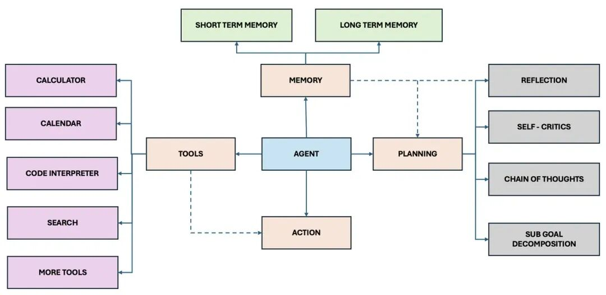
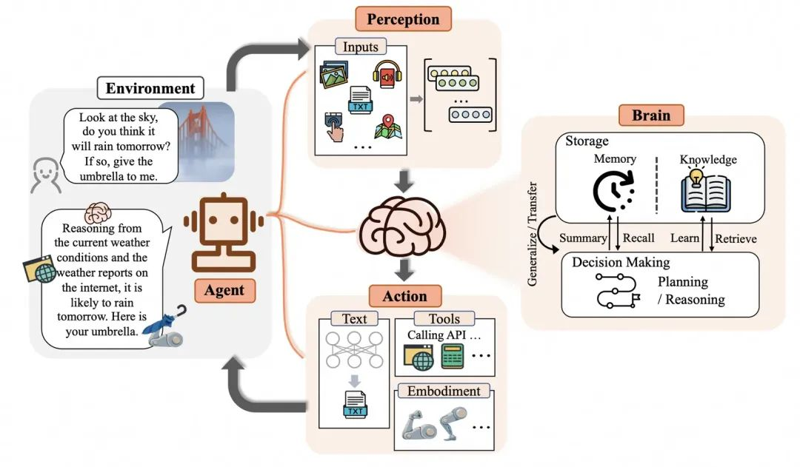
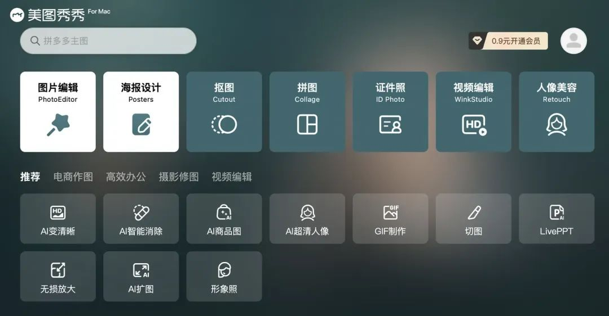
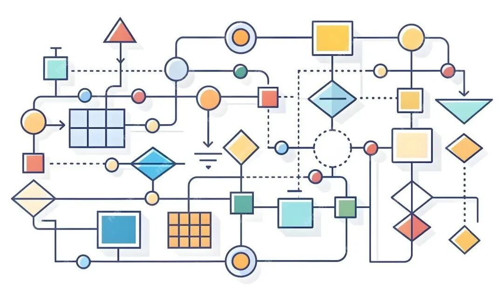
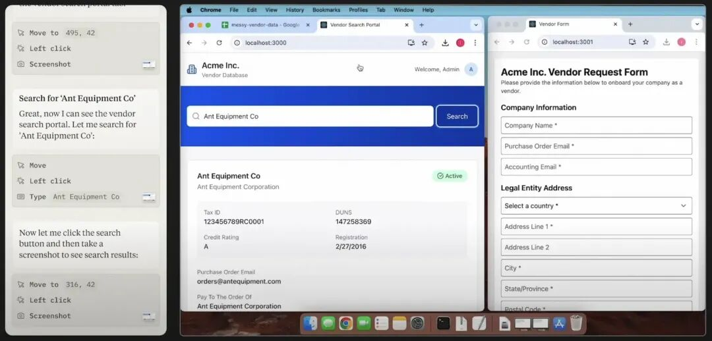
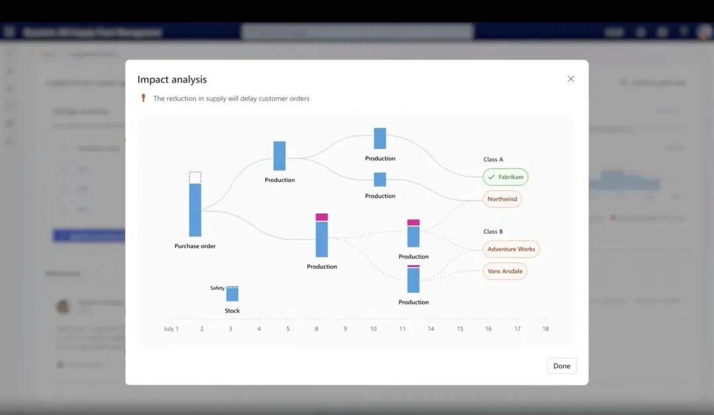
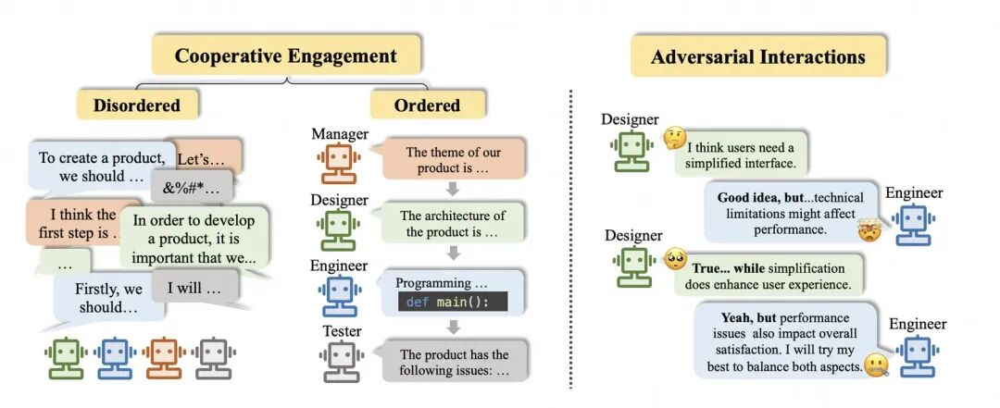
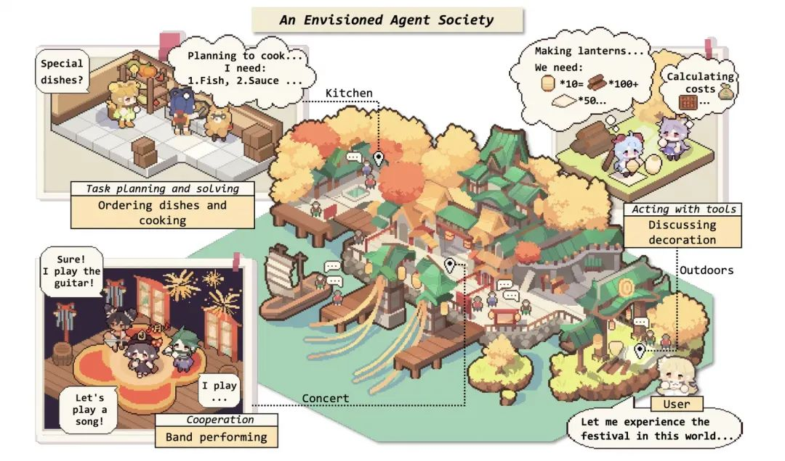
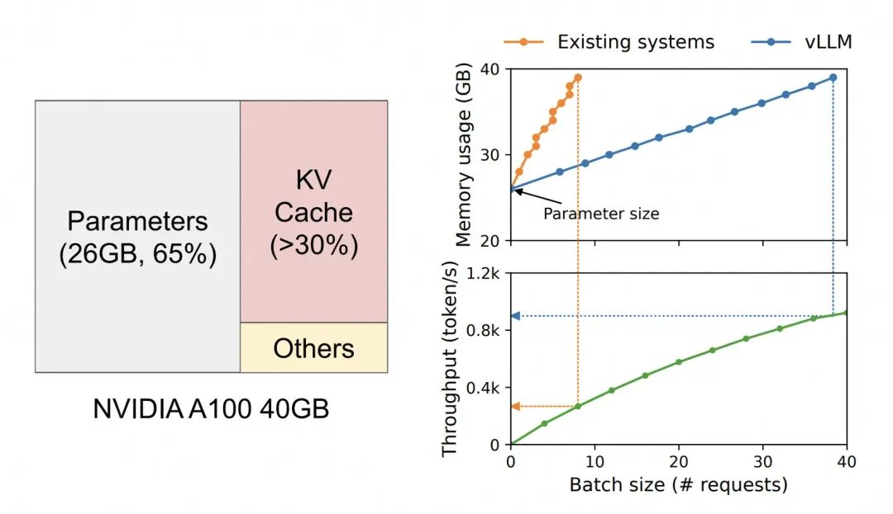

# 为什么一定要做Agent智能体？

> **公众号**: 阿里云开发者  
> **发布时间**: 2025-04-22 08:30  

阿里妹导读

作者通过深入分析、理解、归纳，最后解答了“为什么一定要做Agent”这个问题。

最近一直在从事Agent智能体相关的工作，主要是聚焦在阿里云客户服务领域，我之前写过的一篇Agent落地文章《[阿里云服务领域Agent智能体：从概念到落地的思考、设计与实践](<https://mp.weixin.qq.com/s?__biz=MzIzOTU0NTQ0MA==&mid=2247539551&idx=1&sn=b843b3a20de81d8e42c171781af61111&scene=21#wechat_redirect>)》很荣幸受到了大家的欢迎，说明大家对Agent的概念及落地都还是比较感兴趣的。

我们团队近一年多的时间一直在服务领域持续构建、深耕Agent能力，在这方面我本人也投入了大量的精力。不过呢，在进行Agent能力落地、推广的过程中，我经常被问到一个问题：为什么一定要做Agent智能体？或者换句话说，做Agent能够给业务带来什么价值？

提出这个问题的人也挺多的，其实逻辑也并不复杂：同样的业务场景，使用Agent无非就是构建了一个基于大模型按多步骤执行的流程，如果通过传统的开发方法，如硬编码（Hard Code）或者低代码的配置化平台（如一些SOP配置平台、流程编排平台等），其实也同样能实现类似Agent的流程功能。

说的具体一点，Agent其实就是让大模型去调用API接口完成一些相对复杂的步骤执行，也完全同样可以直接用代码去开发这个功能，或者使用低代码平台的表单配置、逻辑配置、API接口配置，通过不同执行节点之间的参数配置、映射来构建复杂的业务流程。也就是说，问这个问题的核心意图就是“Agent能做的事情，在Agent出现之前其实就能做”。

同时，使用大模型构建的Agent，还存在着非常多的挑战，其中最常见的三个挑战是：

  * Agent响应速度慢：由于Agent需要调用大模型，而大模型通常是流式输出，这就导致用户提问后需要等待一段时间，可能需要十几秒钟才能得到完整输出，如果Prompt再长一些，那么就连首次token的响应速度都会很慢。当然，Agent在执行过程中还涉及到思考（Thought）、推理（Reasoning）等中间过程，有时候还需要将复杂问题拆解为多个步骤，这些都会导致Agent的运行速度极其缓慢。

  * Agent会出现幻觉：由于大模型天然的设计问题，可能会产生事实性错误或不遵循指令的幻觉，相比运行速度慢，这更加引发了信任危机，对Agent执行结果的挑战就更大了。

  * 纯文本交互不友好：由于大模型是基于自然语言进行交互的，因此绝大部分的Agent的设计都是类似在机器人里使用对话流的形式提供服务的，输入阶段使用文本还相对好一些，输出阶段的时候很多Agent会有很多长篇大论的输出，啰里啰嗦字太多，人阅读起来就比较费劲，这样的交互相比传统的一些结构化的、卡片式、表单式的交互体验就差很多，因此很多人觉得这种对话式的交互并不是很友好。

相比而言，通过传统方式构建的流程，相比Agent的技术而言，优势就非常明显：运行速度非常快、稳定、可以专门设计前端交互。所以问题就来了，尤其是服务领域，既然传统的SOP或业务流程管理平台也能够完成这些复杂的任务，并且运行速度很快，很稳定、交互更好，那为什么要还非要使用Agent？还一定要建设一个Agent平台呢？更何况Agent还运行速度很慢、有幻觉、交互体验差。

这个问题我思考了很久，也在多个场合进行了解答，但我还是想通过撰写一篇文章来深入分析、理解、归纳，最后来解答一下“为什么一定要做Agent”这个问题。

## 什么是Agent

首先，要深入探讨这“为什么要做Agent”这个问题之前，我们先来看一下什么是Agent？也就是Agent的定义是什么？有很多人说，这还有什么好定义的，不就是大模型调用API吗？不，这只是对Agent概念的一个简单的认知，我们还是非常有必要了解一下真正的Agent的含义是什么。

目前，国内很多厂商和平台将Agent翻译为“智能体”，但我想说的是，这种翻译并不完全准确。如果从最原始的词典里去查的话，Agent这个英文单词实际上是代理的意思。这里的代理，我个人理解的含义指的是让大模型“代理/模拟”「人」的行为，使用某些“工具/功能”来完成某些“任务”的能力。所以，你会发现国外使用Agent这个词来代表让大模型调用工具或功能帮人完成某些事情的过程，其实还是比较形象的。因此，只要符合这个定义的，其实就是一种Agent。

我们可以看到有许多大厂、独角兽公司、研究所、高校，也给Agent下过许多定义，比较经典的一个定义是OpenAI的研究主管Lilian Weng给出的定义是：Agent = 大模型（LLM）+ 规划（Planning）+ 记忆（Memory）+ 工具使用（Tool Use）[1]。这个定义实际上是从技术实现的角度对Agent进行了定义，它指的是要实现一个Agent，就需要支持这些能力，它需要基于大模型，需要有规划的能力，能思考接下来要做的事情，需要有记忆，能够读取长期记忆和短期记忆，需要能够使用工具，他是将支持这些能力的集合体定义为了Agent。



图1 按照规划、记忆、工具、动作分解的Agent定义（OpenAI）

另外的一个定义是复旦大学NLP团队给出来的，他们认为Agent的概念框架包括三个组件：大脑、感知、行动[2]。大脑模块作为控制器，承担记忆、思考和决策等基本任务。感知模块从外部环境感知并处理多模态信息，而行动模块则使用工具执行任务并影响周围环境。比如：当人类询问是否会下雨时，感知模块将指令转换为大模型可以理解的表示，然后，大脑会根据当前天气和互联网天气报告开始推理，最后，行动模块作出回应并将雨伞递给人类。通过重复上述过程，Agent可以不断获得反馈并与环境互动。



图2 按照环境、感知、大脑、动作分解的Agent定义（复旦NLP）

其实这些各种版本的定义实际上是对我们刚才所说的Agent代理「人」做某些事情的一个更细致的拆解而已，大家仔细想想，人要做某件事情，也是需要根据自己的记忆（学过的知识、当前事情的上下文），需要先规划这个事情怎么做，可能需要做一些思考、问题拆解，这中间也可能会使用各种各样的工具，最终通过某些动作、操作去把把某件事情完成。

因此，国内将Agent翻译为智能体，也是在表达，一个能规划、有记忆、能使用工具的东西，它又不是一个人，也不是一个动物，又不能直接将其描述为一个机器人（因为不一定是机器人形态，但有大脑），所以就给他起了个名字，叫“智能体”。

## Agent的优势

在文章的开头，我列出来了很多人反馈的Agent的几大挑战或者说缺点，但任何新兴事务或者技术在发明初期都会存在这样或者那样的问题或者缺点，如果只看缺点，不看优点，可能很难看清事务发展的方向。

举个例子，就像第一次工业革命的时候，蒸汽火车被发明，相比前一代交通工具马车，火车的缺点是什么呢？它的缺点主要是只能沿着固定轨道走，比较费煤炭，或者速度相比马车太快，容易出现交通事故等等。但是，火车最终还是发展了起来，而马车反而被时代所抛弃，如果仅仅是因为看到火车更容易出现的这些问题，就停止对火车的发展，显然是非常武断和草率的。因为，相比马车来讲，火车速度更快，效率更高，跑起来更稳定，乘坐体验更好。而马车速度慢、十分颠簸，更重要的是驾驭马车是需要很高成本的，需要有骑马的技巧，还需要驯服马匹，毕竟动物没有机器那么容易控制。

 

图3 马车vs火车，第一次工业革命带来的交通工具的变革

那么，Agent的优势在哪里呢？Agent可以“代理/模拟”「人」来完成相关事情，它有一个非常聪明的大脑，甚至在很多领域比人都聪明，所以，从这个角度来看，Agent的出现，其实是“解放了人的生产力”，所以，从这个角度来说，Agent其实是一个极大提升效率的生产力。具体地，体现在下面几个方面，我将逐一展开分析。

### 降低应用开发门槛

首先，使用Agent智能体的第一个优势是降低了应用开发的成本和门槛。在工作和生活中，我们很多时候存在很多的需求，这些需求如果想要满足，要么就是寻找已经造好的轮子（比如现成的平台或APP），要么就是自己动手DIY一个定制化的轮子，那么就涉及到一个应用开发的问题。

过去，想要实现一个功能，我必须是一个专业的开发人员，必须能够编写专业的代码。但现在，如果你使用Agent而不是传统的硬编码方式，那么首先的好处就是你不需要编写代码，这降低了门槛。也就是说，如果我不是专业的研发人员，我是一个产品经理，或者是一个运营人员，我也可以通过自然语言描述prompt的方式实现一个Agent，来满足我的个性化需求的开发。这是需求开发的巨大的效率提升，也是应用开发的门槛的大幅降低。这是Agent与传统开发范式相比，最大的区别。

这么单纯的讲概念，大家体感还是会不够深，这里我类比两个经典的Case，第一个是字节跳动推出的剪辑软件剪映，它极大地降低了自媒体创作者制作视频的门槛。



图4 在剪映（专业版）中可以很方便的剪辑视频，AI识别字幕

在以前，拍摄视频、剪辑视频需要专业的技巧，尤其是剪辑视频，成本非常的高。你不仅仅是将视频切割成多个片段或者组合片段，更重要的是，还需要做各种转场、加各种元素、特效，甚至还要添加字幕。早期的字幕都是需要在软件里面一个时间帧一个时间帧进行插入和编辑的。但是现在有了剪映，它与传统软件最大的区别就是剪映加入了大量的模板和AI功能，极大地降低了普通人创作视频的难度。它除了提供了丰富的转场模板和特效，你可以直接使用，它更重要的是提供了许多AI带来的功能，比如AI快速剪辑、AI生成素材，甚至AI添加字幕。原来给一段视频添加字幕可能需要一天的时间，现在使用剪映的AI加字幕，几分钟就可以完成。人只需要检查一遍，调整一些小瑕疵，视频就剪辑完成了。这是一个内容创作门槛的巨大降低，使得视频创作越来越简单，让更多原本不能或不会制作视频的人能够制作出好的短视频。抖音、b站、小红书等短视频/内容平台能做的这么火爆，除了自身APP的运营推广之外，降低视频制作门槛，绝对是非常之重要的一个方面，只有提高了内容创作的生产力，才能带来更多内容，真正的让技术不再是门槛，发挥创意成了人要考虑的、最重要的事情，人人都是剪辑师。



图5 美图秀秀（电脑版）中支持的许多功能是基于AI增强的

同样的类似的Case，还有美图秀秀。早年如果你想修图，你必须学习Photoshop，这也是为什么修图也叫P图的原因，因为其首字母就是P开头，要想修图就必须要会用这款软件。你需要学习Photoshop复杂的抠图功能和调色、调光能力。现在有了美图秀秀，你只需要打开APP，它就提供了一系列低成本的工具和AI能力，甚至能够快速让你的图片一键变美。无论是变瘦、磨皮变美，都可以分分钟做到，你要做的只是需要选择一下，点击一下，就可以完成。所以现在修图，真的不需要再去找专业的修图师，完全可以通过这些APP自己完成图片的美化和创作，同样的让P图技术不再是门槛，人人都是修图师。

而在大模型时代，Agent的目标是解放需求开发的生产力。假如你想要做一个APP、一个网站，或者一个小程序来满足个人需求，你以后应该也几乎不需要专业的软件开发团队来完成了，通过Agent，即使你是一个不懂前端、后端、算法，也不懂产品设计的人，也能轻松地用大模型做出一款GenAPP（生成式APP），让代码开发、参数配置的技术不再是门槛。



图6 通义智能体平台上有着许多Agent，他们其实都是GenApp

其实我们可以看到，现在有包括我们在内的很多头部厂商或独角兽已经在加大投入做Agent平台了，这些人的目标也是致力于让更多普通人通过简单的自然语言描述和极为简单的配置，最低成本地实现一个能够解决更复杂问题、执行更复杂任务的Agent。所以这个事情已经不是在未来了，而是已经是进行时了，相信不在远的将来，我们会迎来GenAPP的大爆发时代，人人都是开发者。

### 简化流程复杂度

使用Agent的第二个优势是简化流程复杂度。大模型的引入，可以像“胶水”一样连接各个模块，比如能够自动处理参数转换、能够自动完成一些校验逻辑，这就极大的减少了流程配置的工作量。这种自动化的能力使得开发过程更加高效。



图7 传统的流程编排过程过于复杂

比如，在流程中通常会调许多API，如果是传统的流程编排，前一步的API返回结果传进来，与后一步API输入参数之间的映射，你必须得严丝合缝，包括变量类型和内容，你必须要有完备的转换过程，才能保证不会出现任何bug或错误。但有了Agent之后，你不需要做那么完备，你可以让大模型在中间像“胶水”一样去连接各个模块。大模型就像「人」一样，看到问题、API接口、参数时，它会自然而然地做转换。它可以把用户的问题输入内容自然地转换到相应的API入参上。所以大模型或Agent的出现，它可以做这个粘合剂，把那些不完备的地方，通过模型本身的强大理解能力给弥补完备。就是这样的一个能力，会大大降低一个流程或一个GenApp的构建复杂度。上一步是构建降低了构建的门槛，不但不用写代码和配置，只需要写字就可以，一些不必要的中间过程逻辑也可以不写，只需要关注在最主要、最核心的流程上即可。

对于流程复杂性这一点，在算法模型层面尤为明显。例如，如果我想用传统的方式开发一个APP或功能，需要开发许多小模型来完成某些功能。比如，在一些流程的开头，可能会需要一个“路由”模块，在以往的情况下，这需要训练一个单独的路由模型，从而来判断问题或者意图需要路由到哪个分支。其他类似的，在流程中间涉及到需要算法模型参与识别的地方，我仍然需要去调用或者SFT一些小模型来处理这些单独的任务。每个单独的小模型的训练，都需要收集相应的数据集，构建相应的Label标签，然后训练，最终部署，并且这些小模型最终也就只能做这么一件事情。

但是，基于大模型的Agent实际上就极大的避免了这种流程的复杂性并降低了成本，你完全可以通过prompt来让大模型完成一个简单的操作。大模型甚至自己可以给自己写prompt、自己分解一个复杂问题，分解完之后它自己判断是否需要路由、是否需要中间调用某些识别能力、是否需要做某些判断，它自己完全就可以做好这些事情。也就是说，大模型以及Agent的出现，它不需要你去做一个这样非常“完备”的流程。

### 交互方式多样性

第三点个优势，是关于交互层面的，也就是说是LUI（自然语言交互界面）还是GUI（图形交互界面）的问题。诶？等等，不对啊，在前面不是说，大模型是基于自然语言进行交互的，因此纯文本交互不友好，这应该是Agent的一个缺点吧！怎么放在优势里面讲了呢？其实，与其说是一个缺点，不如说这是一个“误区”。其实，Agent智能体并不局限于自然语言交互，它是可以处理多种形式的输入和输出，包括图形界面和动作执行。这意味着Agent可以适应不同的应用场景，提供更灵活的解决方案。

前面讲过，什么是Agent？让大模型“代理/模拟”「人」的行为，使用某些“工具/功能”来完成某些“任务”的能力就可以定义为Agent。那么，你会发现，这里面其实并没有提到交互的问题，并没有来说必须是自然语言交互还是什么其他形式的交互，所以，自然语言的交互界面，只是人和大模型、接口和大模型之间的交互方式，并不意味着Agent也要以自然语言的形式与大模型进行交互。

给大家看几个非自然语言交互的Agent的例子，大家就能看明白了。比如，国外大模型厂商Anthropic发布过一款控制电脑使用的Agent[3]，其效果比较惊艳，大家可以点此查看演示视频（https://www.youtube.com/watch?v=ODaHJzOyVCQ）：



图8 Anthropic研发的可以自主控制电脑的Agent

Anthropic的这个Agent，他可以帮我打开电脑上的某个浏览器，甚至都不需要指定浏览器的名称，只说帮我打开浏览器，帮我输入某个网址或打开某个网页搜索什么关键词，点击某个步骤就可以。可以完全用自然语言描述这个需求，描述完毕后，大模型在实际运行的时候，它会直接上去操作。它通过截图，然后给大模型通过多模态识别去获得屏幕上的内容，然后自己判断屏幕上哪个图标是浏览器，自己完成点击操作，然后自己去找哪个地方是地址栏，自动把你说的网站转换成网址填进去，然后帮你搜索东西。整个过程，只有输入是自然语言，但输出其实就是一个系列的操作动作的执行。

再比如，微软发布了十款非常受欢迎的Agent[4]，其中有一个是供应链分析Agent，它会通过自主跟踪供应商的表现，检测供应链延迟并做出响应，帮助企业优化供应链，让采购团队摆脱耗时的手动监控，减少供应链中断带来的额外成本。



图9 微软供应链分析Agent可以自主分析供应链延迟检测

在这个Agent里，输入都不是自然语言了，它们可能是一些预设的要求、选项或表单，让用户去交互。交互完毕后，它背后会整理成一个自然语言给到大模型，让大模型完成一些任务。比如，帮我分析这一周的销售情况，你可能就在前端的表单里选个时间，但背后的执行、分析、报告生成过程，是大模型自主思考去完成的。并且，最终生成出来的报告也并非是以自然语言形式，它是直接渲染成了一个图表、表格等在内的各种展示形式的集合体，甚至还有一些曲线预测这样的内容。

综上所述，挑战Agent是以对话形态为主的交互，其实是一个伪命题。Agent并不是一定是以纯自然语言形式去进行交互的，并且这在Agent的定义里面本身也是没有的。

### 协同完成复杂任务

最后，有一个现在非常火热的Agent热点，就是多Agent（Multi-Agent），Agent的存在形式并不是仅仅是单一的功能了，而是可以进行各种各样的组装、协同、竞争[2]。



图10 多Agent的协同模式，如合作方式、竞争方式等

比如多个Agent之间进行组装完成一些复杂的场景，比如在服务领域的某些工单里面，经常会出现客户在同一个工单中连续问多个问题，这个时候，就完全可以调用多个处理不同问题的Agent参与决策进行合作，就像人一样进行接力，把问题解决。有些时候，也可能会面临一些疑难杂症的问题，也可以有多个领域相关的Agent来进行专家会诊，甚至Agent之间都可以相互交流，最终讨论、解决同一个问题。

Agent之间也可以进行竞争，多个子任务Agent给出了多版不同方案，由一个决策Agent或者人来最终决定要使用哪款子任务Agent给出的方案等等。

甚至还有不少人在设想未来会出现由多个Agent组成的社会，甚至人类也可以参与其中。下面这张图就展示了这个多Agent社会中的一些特定场景。在厨房中，一个Agent负责点菜，另一个Agent负责规划和解决烹饪任务。在音乐会中，三个Agent正在合作参与乐队演出。户外有两个Agent正在讨论灯笼制作，计划所需的材料和财务，并选用工具。人可以参与这个社会活动的任何阶段，这个社会就仿佛一个小的世界一般。



图11 一种假想的多Agent社会

## 直面Agent存在的挑战

现在让我们继续把注意力转回到开篇我们讲的几点Agent的挑战，其中第三点关于交互的在前文中已经讲过了，现在说一下另外两个挑战。当然，只要是现在神经网络架构下的大模型，就仍然存在之前提到的速度慢以及幻觉问题。但是，其实这些问题一直在不断由各种方案优化中。

首先，在速度方面，我们已经可以看到许多公司通过芯片级别的提升，比如通过提升GPU的性能，或者在GPU上实现更多其他的芯片层面加速。也有许多像FlashAttention、vLLM这样的大模型部署框架，通过对Transformer中KV Cache的优化来提升推理速度等等。还有一些方法是通过减少模型的参数量，舍弃一些无用的参数，只保留重要的参数信息，尽量保持效果不变，这就是模型参数裁剪。还有使用更小参数的模型去针对大参数量的模型做模型蒸馏，其他的还有各种量化技术等等。通过这些从硬件到软件层面的优化，是可以不断的提高模型的运行效率的。当然，除了模型层面的优化之外，还有许多在工程层面的优化，比如对于大文本、大文档的读取，可以使用预处理的方式将其切块，对于一些冗长的Prompt，可以做一些Prompt层面的信息压缩，从而提高大模型的响应速度等等。

 

图12 AI芯片、优化KV Cache等各种大模型推理加速优化方案

至于幻觉问题，现在大部分的模型随着不断的迭代、更新，在Prompt写的比较明确的情况，基本上很少出现太离谱的事实性错误幻觉，更多是指令写的不明确，存在歧义，大模型没按照预期的情况去输出，导致被大家定义为了幻觉。这种情况，我们也会去引导Prompt的规范化书写，甚至还有一些类似于OpenAI的Meta-Prompting项目[5]，用Meta-Prompt指导大家优化Prompt的方案，也能进一步提升大模型对指令跟随的能力，产出更符合期望的Agent。同时，在模型推理层面，像DeepSeek R1或OpenAI o1/o3系列模型，基于慢思考的System2，通过引入hidden-thought等方法进行reasoning推理，从而提升了大模型的理解能力，进一步减少幻觉的比例。其他的还有类似GraphRAG等方案，在RAG中引入知识图谱推理，也能进一步减少大模型的幻觉比例，提升大模型的准确性和理解能力。

这里我提前预告一下，在提升大模型的运行速度和降低幻觉这方面，我们也在探索一些新的方法，从而来优化Agent的速度和稳定性。比如说我们在研究一种Agent预编译能力，即会去让大模型自动拆解哪些部分不需要大模型的参与，哪些部分就可以在Agent构建阶段进行提前预编译，这样在真正线上执行Agent时，大部分的场景下是不需要大模型参与实时生成的，只需要大模型参与必要的部分生成，从而缩短大模型的推理时长，并提高稳定性。这个方案我们还在研发中，具体详细的方案和效果会在后续的文章中进行介绍，这里大家可以点个关注、收藏，敬请期待吧~

综上所述，我们可以看到，尽管大模型存在着一些挑战，但是通过不断的技术创新和优化，我们正在努力提升Agent的性能和稳定性，降低幻觉的比例，使其更加高效和可靠。相比这些缺点（更何况未来会逐步解决），Agent的优点显然是更值得我们继续投入下去的动力，总而言之，一句话来说就是：做Agent相比不做Agent利大于弊，是一个值得我们长期重点投入下去的能力和形态。

## 总结

经过上述的分析和例子，我们可以看到做Agent相比不做Agent的优势是显而易见的。尽管现在的技术手段上存在一些问题和挑战，但这些短暂的问题不应该直接否定Agent发展前景，而是应该更加坚定的正确的方向上不断推进，继续优化Agent平台和能力，尽量减少问题的出现。

哲学里面有个基本规律叫“否定之否定”，历史的发展总体进程一定是“曲折向前”的，甚至是螺旋式发展，在新旧事物交替的期间，甚至很容易出现新旧事物杂糅的情况。举个例子，姜文导演的电影《让子弹飞》（申遗！）的开头有经典一幕，就是有几匹马拉着一列火车在铁路上狂奔，这种“马拉火车”的形式，的的确确在清末民初时期短暂出现过，这就是经典的新旧事物杂糅起来的情况，舍不得淘汰马车，同时又想使用新发明的火车，于是就变成了“马拉火车”的奇观。你可以想象一下，之所以出现这样的情况，是不是因为当时有人担心火车开太快，或者是担心煤炭不足，也可能有人担心马会“失业”等等，无论是哪种情况，最终折中和妥协的产物就是这种四不像的“马拉火车”的出现，其实是一种很“拧巴”的现象。



图12 电影《让子弹飞》中出现过的“马拉火车”景象

但我也能理解，任何事物的出现需要一定的时间取让大家接受，甚至很多创新、变革都是渐进式发生的，很难一蹴而就。但我们要做的，就是努力缩短像“马拉火车”这样的过渡阶段出现的时间，尽可能更加从本质上去提升生产力和效率，让新技术快速落地，避免陷入和老技术纠缠不清的泥潭和历史债务之中。

好了，说了这么长篇大论，也到了该结尾的时候了。本文是我个人对Agent的定义、优势、挑战，以及为什么要做Agent的一些分析和思考，是最近一段时间的所思、所想，很多想法确实也有些主观，但我希望能够和大家一起交流一下，看看能否更好地理解这个问题。如果大家有什么更好的想法或者其他的疑虑、问题，也可以在评论区发表您的想法或者私聊我进行交流。

# Reference

[1] Lilian Weng. LLM Powered Autonomous Agents

[2] Xi, Zhiheng , et al. The Rise and Potential of Large Language Model Based Agents: A Survey.

[3] Anthropic. Introducing computer use, a new Claude 3.5 Sonnet, and Claude 3.5 Haiku：https://www.anthropic.com/news/3-5-models-and-computer-use

[4] Microsoft Blogs. New autonomous agents scale your team like never before：https://blogs.microsoft.com/blog/2024/10/21/new-autonomous-agents-scale-your-team-like-never-before/

[5] Suzgun, Mirac , and A. T. Kalai . Meta-Prompting: Enhancing Language Models with Task-Agnostic Scaffolding.

****

在 App 上搭建开箱即用的 AI 助手

企业在移动应用中集成 AI 功能时往往面临开发周期长、技术复杂度高等问题，本方案基于多端低代码开发平台和大模型服务平台，通过构建非侵入式 Copilot 助理，提供意图识别、知识问答等智能服务，实现应用快速、无缝智能化升级，助力企业高效创新。

## 
