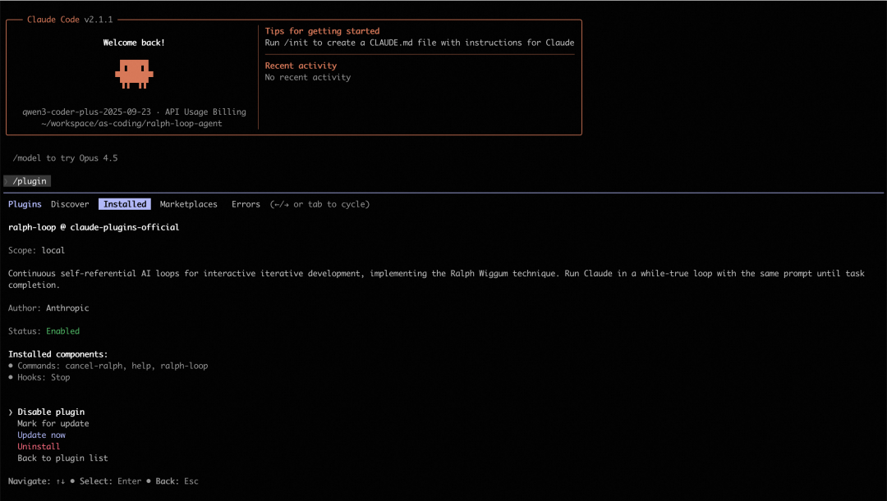
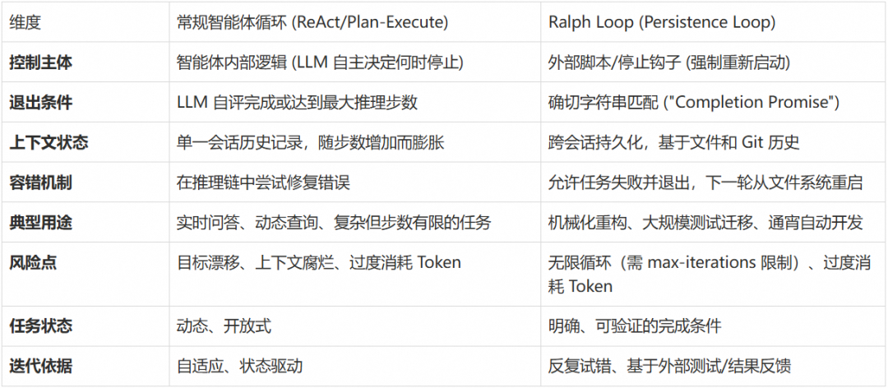
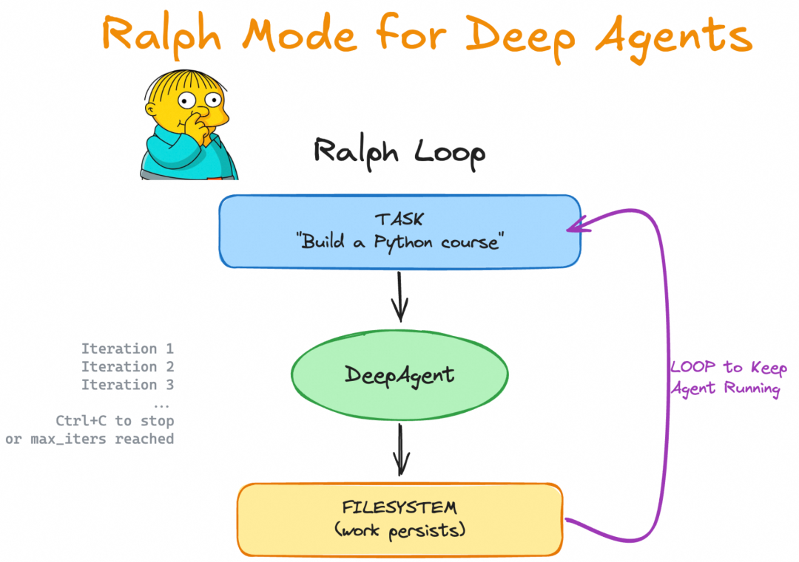
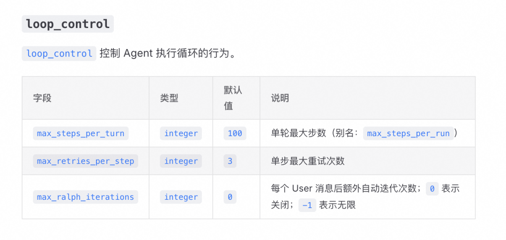
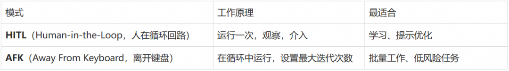
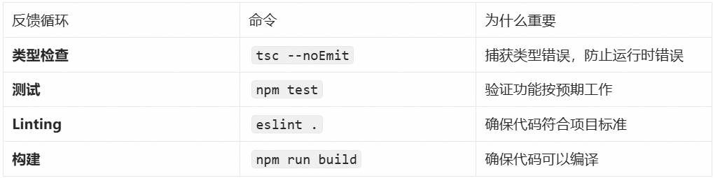
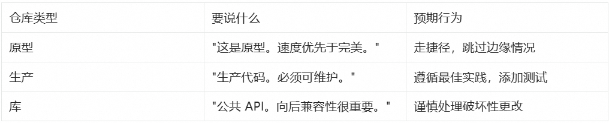
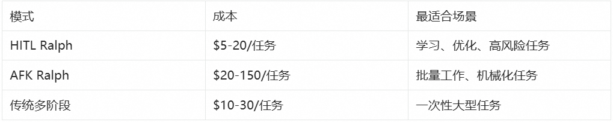
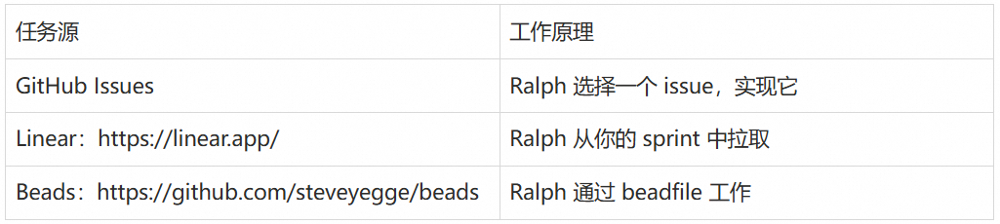

# 从 ReAct 到 Ralph Loop：AI Agent 的持续迭代范式

> **公众号**: 阿里云开发者  
> **发布时间**: 2026-01-27 08:30  

## 痛点：AI 编程助手为何总是“半途而废”？

在使用 AI 编程工具时，开发者经常遭遇以下困境：

  * **过早退出： AI 在它认为“足够好”时就停止工作，而非真正完成任务**
  * **单次提示脆弱： 复杂任务无法通过一次提示完成，需要反复人工干预**
  * **重新提示成本高： 每次手动重新引导都在浪费开发者时间**
  * **上下文断裂： 会话重启后，之前的所有进展和上下文全部丢失**

这些问题的本质是：**LLM 的自我评估机制不可靠** ——它会在主观认为“完成”时退出，而非达到客观可验证的标准。

## 解决思路：让 AI 持续工作直到真正完成

Claude Code 社区诞生了一种极简但有效的范式——**Ralph Loop（也称 Ralph Wiggum Loop）** ：

  *   *   *

    while :; do  cat PROMPT.md | claude-code --continuedone

核心思想：**同一个提示反复输入，让 AI 在文件系统和 Git 历史中看到自己之前的工作成果** 。这不是简单的“输出反馈为输入”，而是通过外部状态（代码、测试结果、提交记录）形成自我参照的迭代循环。其技术实现依赖于 Stop Hook 拦截机制。

Ralph Loop 让大语言模型持续迭代、自动运行直到任务完成，而不在典型“一次性提示 → 结束”循环中退出。这种范式已经被集成到主流 AI 编程工具和框架中，被一些技术博主和开发者称作“AI 持续工作模式”。

甚至 Ralph Loop 结合 Amp Code 被用来构建新编程语言（AFK）：https://x.com/GeoffreyHuntley/status/1944377299425706060

## TL;DR / 快速开始

**Ralph Loop 让 AI 代理持续迭代直到任务完成。**

核心三要素：

  * **明确任务 + 完成条件：定义可验证的成功标准**
  * **Stop Hook 阻止提前退出：未达标时强制继续**
  * **max-iterations 安全阀：防止无限循环**

最简示例（Claude Code）：

  *   *   *   *   *   *   *

    # 安装插件/plugin install ralph-wiggum@claude-plugins-official# 运行循环/ralph-loop "为当前项目添加单元测试  Completion criteria: - Tests passing (coverage > 80%) - Output <promise>COMPLETE</promise>" \  --completion-promise "COMPLETE" \  --max-iterations 50

**场景适用性** ：详见实践建议-场景适用性。

## Ralph Loop 概述

### 什么是 Ralph Loop？

**Ralph Loop** 是一种**自主迭代循环机制** 。你给出一个任务和完成条件后，代理开始执行该任务；当模型在某次迭代中尝试结束时，一个 Stop Hook 会拦截试图退出的动作，并重新注入原始任务提示，从而创建一个**自我参照的反馈循环** 。在这个循环中，模型可以读取上一次迭代改动过的文件、测试结果和 git 历史，并据此逐步修正自己的输出直到达到完成条件或达到设定的迭代上限。

简言之：

  * 不是简单的一次性运行，而是**持续迭代直到完成任务** ；
  * 循环使用**同一个 prompt** ，但外部状态（代码、测试输出、文件等）在每次迭代后发生改变；
  * 需要明确的**完成条件** （如输出特定关键字、测试通过等）和合理的**最大迭代次数** 作为安全控制。

### Ralph 起源

  * **Ralph Wiggum 名称 来自《辛普森一家》的角色，用于象征“反复迭代、不放弃”的精神，但实际实现是一个简单的循环控制机制，并非模型自身拥有特殊认知。**
  * 核心机制不是模型自行创造循环，而是 **Stop Hook** （详见 Stop-hook 拦截机制）在模型尝试退出时拦截，并重新注入 prompt，从而在**同一会话中** 形成“自我参照反馈”。
  * 迭代不是无条件持续，而是**依赖于明确可验证的完成信号或最大迭代次数** 。否则循环可能永不结束。
  * **哲学根源： Ralph 循环可以追溯到软件工程中的“Bash 循环”思维，其核心逻辑是“不断向智能体提供任务，直到任务完成为止”。这种极致的简化体现了将失败视为数据、将持久性置于完美之上的设计哲学。**

## 核心原理

### 与传统智能体循环的对比

为了深入理解 Ralph Loop 与常规智能体循环的区别，需要首先建立对“智能体”这一概念的通用语义框架。根据当代人工智能实验室的共识，智能体被定义为“在循环中运行工具以实现目标的 LLM 系统”。这种定义强调了三个关键属性：

  1. **LLM 编排的推理能力：智能体能够根据观察结果进行推理和决策**
  2. **工具集成的迭代能力：智能体可以调用外部工具并基于工具输出调整行为**
  3. **最小化人工监督的自主性：智能体能够在有限指导下自主完成任务**

在常规的智能体架构中，循环通常发生在**单一会话的上下文窗口内** ，由 LLM 根据当前观察到的结果决定下一步行动。

#### ReAct（Reason + Act）模式

ReAct 遵循“**观察（Observation）→ 推理（Reasoning）→ 行动（Acting）”** 的节奏。这种模式的优势在于其**动态适应性** ：当智能体遇到不可预见的工具输出时，它可以在当前的上下文序列中即时修正推理路径。

然而，这种“内部循环”受限于 LLM 的自我评估能力。如果 LLM 在某一步骤产生幻觉，认为任务已经完成并选择退出，系统就会在未达到真实目标的情况下停止运行。

#### Plan-and-Execute（计划并执行）模式

Plan-and-Execute 将任务分解为**静态的子任务序列** ，由执行器依次完成。虽然这在处理长程任务时比 ReAct 更具结构性，但它对环境变化的适应度较低。如果第三步执行失败，整个计划往往会崩溃，或者需要复杂的重计划机制（Re-planning）。

#### Ralph 循环的“外部化”范式

Ralph 循环打破了上述依赖 LLM 自我评估的局限性。其实现机制采用停止钩子（Stop Hook）技术：当智能体试图退出当前会话（认为任务完成）时，系统会通过特定的退出代码（如退出码 2）截断退出信号。外部控制脚本会扫描输出结果，如果未发现预定义的“完成承诺”（Completion Promise），系统将重新加载原始提示词并开启新一轮迭代。

这种模式在本质上是**强制性的** ，它不依赖智能体的主观判断，而是依赖外部验证。

#### 对比总结

在开发者语境中，"agent loop" 通常指智能体内部的感知—决策—执行—反馈循环（即典型的感知-推理-行动机制）。而 Ralph Loop 更侧重于**迭代执行同一任务直至成功** ，与典型智能体循环在目的和设计上有所不同：

比较结果表明：

  * **常规 Agent Loop 通常更通用： 用于决策型 agent，可以根据多种状态和输入动态调整下一步操作。ReAct 模式适合需要动态适应的场景，Plan-and-Execute 模式适合结构化任务分解。**
  * **Ralph Loop 更像是自动驱动的 refine-until-done 模式： 重点是让模型在固定任务上不断修正输出直到满足完成条件。它通过外部强制控制避免了 LLM 自我评估的局限性。**

因此，它与一般意义上 agent 的循环机制并不矛盾，但**定位更专注于可验证任务的持续迭代修正** ，而非全面的 agent lifecycle 管理。

### Stop-hook 拦截机制

Ralph 循环的技术优雅之处在于它如何利用现有的开发工具链（如 Bash、Git、Linter、Test Runner）构建一个闭环反馈系统。在常规循环中，工具的输出仅作为下一步推理的参考；而在 Ralph 循环中，工具的输出成为了决定循环是否存续的“客观事实”。

Ralph 循环的工业实现依赖于对终端交互的深度拦截。通过 `hooks/stop-hook.sh` 脚本，开发者可以捕获智能体的退出意图。如果智能体没有输出用户指定的承诺标识（如 `<promise>COMPLETE</promise>`），停止钩子会阻止正常会话结束。

这种机制强迫 LLM 面对这样一个事实：只要没有达到客观的成功标准，它就无法“下班”。这种外部施加的压力通过重复输入相同的提示词（Prompt）来实现，智能体在每一轮迭代中都能看到上一轮留下的改动痕迹和 Git 提交记录。

### 状态持久化与记忆管理

#### 解决上下文腐烂问题

常规智能体的一个核心痛点是“**上下文腐烂（Context Rot）”** ——随着对话轮次的增加，LLM 对早期指令的注意力和精确度会线性下降。Ralph 循环通过“刷新上下文”解决了这一问题：

  * 每一轮循环可以看作是一个全新的会话，智能体不再从臃肿的历史记录中读取状态
  * 智能体直接通过文件读取工具扫描当前的项目结构和日志文件
  * 这种模式将“状态管理”从 LLM 的内存（Token 序列）转移到了硬盘（文件系统）

由于 Git 历史记录是累积的，智能体可以通过 `git log` 查看自己之前的尝试路径，从而避免重复同样的错误。这种将环境视为“累积记忆”的做法，是 Ralph 循环能够支持持续数小时甚至数天开发的核心原因。

#### 核心持久化组件

在典型的 Ralph 实现中，智能体会维护以下关键文件：

  1. **progress.txt： 一个追加形式的日志文件，记录了每一轮迭代的尝试、遇到的坑以及已经确认的模式。后续迭代的智能体会首先读取该文件以快速同步进度。**
  2. **prd.json： 结构化的任务清单。智能体每完成一个子项，就会在该 JSON 文件中标记 **`passes: true`。这确保了即使循环中断，新的智能体实例也能明确接下来的优先级。
  3. **Git 提交记录： Ralph 循环被要求在每一步成功后进行提交。这不仅提供了版本回滚能力，更重要的是，它为下一轮迭代提供了明确的“变更差分”（Diff），让智能体能够客观地评估现状。**

##### 文件结构

  *   *   *   *   *

    scripts/ralph/├── ralph.sh├── prompt.md├── prd.json└── progress.txt

###### ralph.sh

  *   *   *   *   *

    #!/bin/bashset -eMAX_ITERATIONS=${1:-10}SCRIPT_DIR="$(cd "$(dirname \  "${BASH_SOURCE[0]}")" && pwd)"echo "🚀 Starting Ralph"for i in $(seq 1 $MAX_ITERATIONS); do  echo "═══ Iteration $i ═══"  OUTPUT=$(cat "$SCRIPT_DIR/prompt.md" \    | amp --dangerously-allow-all 2>&1 \    | tee /dev/stderr) || true  if echo "$OUTPUT" | \    grep -q "<promise>COMPLETE</promise>"  then    echo "✅ Done!"    exit 0  fi  sleep 2doneecho "⚠️ Max iterations reached"exit 1

##### prompt.md

每次迭代的说明：

  *   *   *   *   *

    # Ralph Agent Instructions## Your Task1. Read `scripts/ralph/prd.json`2. Read `scripts/ralph/progress.txt`   (check Codebase Patterns first)3. Check you're on the correct branch4. Pick highest priority story    where `passes: false`5. Implement that ONE story6. Run typecheck and tests7. Update AGENTS.md files with learnings8. Commit: `feat: [ID] - [Title]`9. Update prd.json: `passes: true`10. Append learnings to progress.txt## Progress FormatAPPEND to progress.txt:## [Date] - [Story ID]- What was implemented- Files changed- **Learnings:**  - Patterns discovered  - Gotchas encountered---## Codebase PatternsAdd reusable patterns to the TOP of progress.txt:## Codebase Patterns- Migrations: Use IF NOT EXISTS- React: useRef<Timeout | null>(null)## Stop ConditionIf ALL stories pass, reply:<promise>COMPLETE</promise>Otherwise end normally.

##### prd.json（任务状态）

任务清单：

  *   *   *   *   *   *   *   *   *   *   *   *   *   *   *   *   *

    {  "branchName": "ralph/feature",  "userStories": [    {      "id": "US-001",      "title": "Add login form",      "acceptanceCriteria": [        "Email/password fields",        "Validates email format",        "typecheck passes"      ],      "priority": 1,      "passes": false,      "notes": ""    }  ]}

##### progress.txt

任务进度日志：

  *   *   *   *   *   *   *   *   *   *   *   *   *   *   *   *

    # Ralph Progress LogStarted: 2024-01-15## Codebase Patterns- Migrations: IF NOT EXISTS- Types: Export from actions.ts## Key Files- db/schema.ts- app/auth/actions.ts---## 2024-01-15 - US-001- What was implemented: Added login form with email/password fields- Files changed: app/auth/login.tsx, app/auth/actions.ts- **Learnings:**  - Patterns discovered: Use IF NOT EXISTS for migrations  - Gotchas encountered: Need to handle email validation on both client and server---

##### 运行 Ralph

  *

    ./scripts/ralph/ralph.sh 25

运行最多 25 次迭代。Ralph 将：

  * 创建功能分支
  * 逐个完成任务
  * 每个任务完成后提交
  * 当所有任务通过时停止

#### 上下文工程的对比分析

常规智能体通常采用总结（Summarization）或截断（Truncation）来管理上下文。研究表明，相比于复杂的 LLM 总结，简单的“观察掩码”（Observation Masking，即保留最新的 N 轮对话，其余用占位符代替）在效率和可靠性上往往更胜一筹。然而，即使是最好的掩码策略也无法处理跨越数十轮、数千行代码改动的任务。

Ralph 循环绕过了这一难题，它不试图“总结”过去，而是通过提示词引导智能体进行“自我重新加载”。每一轮迭代的提示词始终包含对核心目标的清晰描述，而具体的执行细节则留给智能体去实时探索环境。这种“即时上下文”加载方式，使得 Ralph 能够处理规模远超其单次窗口容量的工程项目。

## 框架和工具实现示例

以下是一些主流框架和工具对 Ralph Loop 模式的支持：

### LangChain / DeepAgents

https://github.com/langchain-ai/deepagents/tree/master/examples/ralph_mode

DeepAgents 提供类似模式支持，需要程序化参数传递：

  *

    uv run deepagents --ralph "Build a Python programming course" --ralph-iterations 5

这里 `--ralph-iterations` 指定最大循环次数（详见实践建议-安全机制和资源控制）。

### Kimi-cli

https://moonshotai.github.io/kimi-cli/zh/configuration/config-files.html

loop_control 控制 Agent 执行循环的行为。

### AI SDK (JavaScript)

https://github.com/vercel-labs/ralph-loop-agent

社区实现的 `ralph-loop-agent` 允许更精细的开发控制：

  *   *   *   *   *   *   *   *   *   *   *   *

    ┌──────────────────────────────────────────────────────┐│                   Ralph Loop (outer)                 ││  ┌────────────────────────────────────────────────┐  ││  │  AI SDK Tool Loop (inner)                      │  ││  │  LLM ↔ tools ↔ LLM ↔ tools ... until done      │  ││  └────────────────────────────────────────────────┘  ││                         ↓                            ││  verifyCompletion: "Is the TASK actually complete?"  ││                         ↓                            ││       No? → Inject feedback → Run another iteration  ││       Yes? → Return final result                     │└──────────────────────────────────────────────────────┘

  *   *   *   *   *

    import { RalphLoopAgent, iterationCountIs } from 'ralph-loop-agent';const migrationAgent = new RalphLoopAgent({  model: 'anthropic/claude-opus-4.5',  instructions: `You are migrating a codebase from Jest to Vitest.    Completion criteria:    - All test files use vitest imports    - vitest.config.ts exists    - All tests pass when running 'pnpm test'`,  tools: { readFile, writeFile, execute },  stopWhen: iterationCountIs(50),  verifyCompletion: async () => {    const checks = await Promise.all([      fileExists('vitest.config.ts'),      !await fileExists('jest.config.js'),      noFilesMatch('**/*.test.ts', /from ['"]@jest/),      fileContains('package.json', '"vitest"'),    ]);    return {       complete: checks.every(Boolean),      reason: checks.every(Boolean) ? 'Migration complete' : 'Structural checks failed'    };  },  onIterationStart: ({ iteration }) => console.log(`Starting iteration ${iteration}`),  onIterationEnd: ({ iteration, duration }) => console.log(`Iteration ${iteration} completed in ${duration}ms`),});const result = await migrationAgent.loop({  prompt: 'Migrate all Jest tests to Vitest.',});console.log(result.text);console.log(result.iterations);console.log(result.completionReason);

### 关键特性：

  1. 提供模型与任务说明（包含明确的完成条件，详见实践建议-明确完成标准）
  2. stopWhen 和 verifyCompletion 定制循环退出逻辑
  3. `事件钩子用于日志和监控`

## Ralph Loop 最佳实践

如果你正在使用 AI 编程 CLI（如 Claude Code、Copilot CLI、OpenCode、Codex），以下实践指南将帮助你更高效地使用 Ralph Loop。

大多数开发者以交互方式使用这些工具：给出任务、观察工作过程、在偏离轨道时介入。这是“人在回路”（Human-in-the-Loop，HITL）模式。

但 Ralph 提供了一种新方法：让 AI 编程 CLI 在循环中运行，自主处理任务列表。你定义需要做什么，Ralph 负责如何做——并持续工作直到完成。换句话说，它是**长时间运行、自主、无人值守的 AFK（Away From Keyboard，离开键盘）编程** 。

提示：本节提供操作层面的具体技巧，原则层面的建议请参考实践建议部分。

### 技巧 1：理解 Ralph 是一个循环

AI 编程在过去一年左右经历了几个阶段：

**Vibe 编程** ：让 AI 写代码而不真正检查。你“感受”AI，接受它的建议而不仔细审查。速度快，但代码质量差。

**规划模式** ：要求 AI 在编码前先规划。在 Claude Code 中，你可以进入规划模式，让 AI 探索代码库并创建计划。这提高了质量，但仍受限于单个上下文窗口。

**多阶段计划** ：将大型功能分解为多个阶段，每个阶段在单独的上下文窗口中处理。你为每个阶段编写不同的提示：“实现数据库模式”，然后“添加 API 端点”，然后“构建 UI”。这扩展性更好，但需要持续的人工参与来编写每个提示。

**Ralph** 简化了这一切。不是为每个阶段编写新提示，而是在循环中运行相同的提示：

  *   *   *   *   *

    #!/bin/bash# ralph.sh# Usage: ./ralph.sh <iterations>set -eif [ -z "$1" ]; then  echo "Usage: $0 <iterations>"  exit 1fi# 每次迭代：运行 Claude Code，传入相同的提示for ((i=1; i<=$1; i++)); do  result=$(docker sandbox run claude -p \"@some-plan-file.md @progress.txt \1. 决定接下来要处理的任务。这应该是你认为优先级最高的，\   不一定是列表中的第一个。\2. 检查任何反馈循环，如类型检查和测试。\3. 将你的进度追加到 progress.txt 文件。\4. 提交该功能的 git commit。\只处理单个功能。\如果在实现功能时，你注意到所有工作都已完成，\输出 <promise>COMPLETE</promise>。\")  echo "$result"  if [[ "$result" == *"<promise>COMPLETE</promise>"* ]]; then    echo "PRD 完成，退出。"    exit 0  fidone

每次迭代：

  1. 查看计划文件，了解需要做什么
  2. 查看进度文件，了解已完成的工作
  3. 决定下一步做什么
  4. 探索代码库
  5. 实现功能
  6. 运行反馈循环（类型、Linting、测试）
  7. 提交代码

关键改进：**代理选择任务，而不是你** 。

使用多阶段计划时，人类在每个阶段开始时编写新提示。使用 Ralph 时，代理从你的 PRD 中选择下一步要做什么。你定义最终状态，Ralph 到达那里。

### 技巧 2：从 HITL 开始，然后转向 AFK

运行 Ralph 有两种方式：

对于 HITL，你观察它做的一切，在需要时介入。

对于 AFK Ralph，**始终限制迭代次数** 。随机系统的无限循环是危险的。关于如何设置迭代次数限制，详见实践建议-安全机制和资源控制。

HITL 类似于结对编程。你和 AI 一起工作，在代码创建时审查。你可以实时引导、贡献和分享项目理解。

这也是学习 Ralph 的最佳方式。你会理解它的工作方式，优化你的提示，并在放手之前建立信心。

一旦你的提示稳定，AFK Ralph 就能发挥真正的杠杆作用。设置它运行，做其他事情，完成后回来。

你可以构建通知机制（如 CLI、邮件或消息推送），在 Ralph 完成时提醒你。这意味着更少的上下文切换，你可以完全投入到另一个任务中。典型的循环通常需要 30-45 分钟，尽管它们可以运行数小时。

进展很简单：

  1. 从 HITL 开始学习和优化
  2. 一旦你信任你的提示，就转向 AFK
  3. 返回时审查提交

### 技巧3：定义范围

#### 为什么范围很重要

你不需要结构化的 TODO 列表。你可以给 Ralph 一个模糊的任务——“改进这个代码库”——让它跟踪自己的进度。

但任务越模糊，风险越大。Ralph 可能永远循环，找到无尽的改进。或者它可能走捷径，在你认为工作完成之前就宣布胜利。

**真实案例** ：某次运行 Ralph 来提高项目的测试覆盖率。仓库有内部命令——标记为内部但仍面向用户。目标是覆盖所有内容的测试。

经过三次迭代，Ralph 报告：“所有面向用户的命令都完成了。”但它完全跳过了内部命令。它决定它们不是面向用户的，并将它们标记为被覆盖率忽略。

**修复方法** ：明确定义你想要覆盖的内容：

#### 如何定义范围

在让 Ralph 运行之前，你需要定义“完成”是什么样子。这是从规划到需求收集的转变：不是指定每个步骤，而是描述期望的最终状态，让代理找出如何到达那里。

**核心原则** ：必须定义明确可机器验证的完成条件。模糊的标准会导致循环无法正确退出或产生无意义输出。

#### 推荐格式：结构化 prd.json

定义 Ralph 范围有多种方法（Markdown 列表、GitHub Issues、Linear 任务），但推荐使用结构化的 `prd.json`：

  *   *   *   *   *   *   *   *   *   *   *   *   *   *   *   *   *

    {  "branchName": "ralph/feature",  "userStories": [    {      "id": "US-001",      "title": "新聊天按钮创建新对话",      "acceptanceCriteria": [        "点击'新聊天'按钮",        "验证创建了新对话",        "检查聊天区域显示欢迎状态"      ],      "priority": 1,      "passes": false,      "notes": ""    }  ]}

Ralph 在完成时将 `passes` 标记为 `true`。PRD 既是范围定义，也是进度跟踪器——一个活生生的 TODO 列表。

提示：关于如何定义完成条件的更多示例和最佳实践，详见实践建议-明确完成标准。

### 技巧 4：跟踪 Ralph 的进度

Ralph 在迭代之间使用进度文件来解决上下文腐烂问题。通过维护 `progress.txt` 和 `prd.json`（详见状态持久化与记忆管理），Ralph 可以在每次迭代中：

  1. 读取 `progress.txt` 以了解已完成的工作和学到的代码库模式
  2. 读取 `prd.json` 以了解待办任务和优先级
  3. 追加本次迭代的进度和学到的模式
  4. 更新 `prd.json` 中已完成任务的 `passes` 状态

### 最佳实践：

  * 在 `progress.txt` 顶部维护“代码库模式”部分，方便后续迭代快速参考
  * 每次迭代只处理一个任务，完成后立即更新状态
  * 记录遇到的坑和解决方案，避免重复错误

这创建了一个累积的知识库，后续迭代可以快速同步，而不需要阅读整个 Git 历史。

### 技巧 5：使用反馈循环

反馈循环是 Ralph 的护栏。它们告诉代理它是否在正确的轨道上。没有它们，Ralph 可能会产生看起来正确但实际上有问题的代码。

#### 反馈循环类型

在你的 Ralph 提示中，明确要求运行这些反馈循环：

  *   *   *   *   *   *

    在每次迭代中：1. 实现功能2. 运行类型检查：`tsc --noEmit`3. 运行测试：`npm test`4. 运行 Linter：`npm run lint`5. 只有在所有检查通过后才提交

这确保 Ralph 不会提交破坏性代码。

### 技巧 6：小步迭代

Ralph 在小的、可验证的步骤中工作得最好。每次迭代应该：

  * 完成一个功能
  * 运行反馈循环
  * 提交代码

为什么？因为：

  1. **更容易调试： 如果某次迭代失败，你知道确切的问题所在**
  2. **更好的 Git 历史： 每个提交代表一个完整的功能**
  3. **更快的反馈： 小步骤意味着更快的迭代周期**

避免让 Ralph 一次处理多个功能。这会导致：

  * 混乱的提交
  * 难以追踪进度
  * 更高的失败风险

### 技巧 7：优先处理高风险任务

不是所有任务都是平等的。有些任务如果失败，会破坏整个项目。其他任务如果失败，只是一个小问题。

Ralph 应该优先处理高风险任务：

  1. **架构决策和核心抽象： 如果这些错了，整个项目都会受到影响**
  2. **模块之间的集成点： 这些是失败风险最高的地方**
  3. **未知的未知和探索性工作： 需要快速失败**
  4. **标准功能和实现： 风险较低，可以稍后处理**
  5. **抛光、清理和快速胜利： 最低风险，适合最后处理**

将 AFK Ralph **保留到基础稳固时** 。一旦架构得到验证，高风险集成工作正常，你就可以让 Ralph 在低风险任务上无人值守运行。

#### 尝试一下

在你的 Ralph 提示中添加优先级指导：

  *   *   *   *   *   *   *

    选择下一个任务时，按以下顺序优先处理：1. 架构决策和核心抽象2. 模块之间的集成点3. 未知的未知和探索性工作4. 标准功能和实现5. 抛光、清理和快速胜利在高风险工作上快速失败。将简单的胜利留到后面。

### 技巧 8：明确定义软件质量

并非所有仓库都是相同的。很多代码是原型代码——演示、短期实验、客户提案。不同的仓库有不同的质量标准。

代理不知道它在哪种仓库中。它不知道这是可丢弃的原型还是将维护多年的生产代码。你需要明确告诉它。

#### 要传达的内容

将此放在你的 `AGENTS.md` 文件、你的技能中，或直接放在提示中。

#### 代码库模式比指令更有影响力

Ralph 会同时参考你的指令和现有代码。当两者冲突时，代码库的影响力更大。

### 具体示例：

  *   *   *   *   *   *

    // 你的指令："永远不要使用 any 类型"// 但现有代码中：const userData: any = fetchUser();const config: any = loadConfig();const response: any = apiCall();// Ralph 会学习这种模式，继续使用 any

### 为什么会这样？

  * 指令只有几行文字
  * 代码库有数千行“证据”
  * AI 更倾向于模仿现有模式

### 解决方案：

  1. **在 Ralph 运行前清理代码库：移除低质量模式**
  2. **使用反馈循环强制执行标准：Linting、类型检查、测试**
  3. **在 AGENTS.md 中明确质量标准：让期望可见**

####  尝试一下

在你的 `AGENTS.md` 或 Ralph 提示中明确质量标准：

  *   *   *   *   *   *   *

    ## 代码质量标准这是生产代码库。请遵循：- 使用 TypeScript 严格模式，禁止 any 类型- 每个函数都需要单元测试- 遵循现有的文件结构和命名约定- 提交前必须通过所有 lint 和类型检查优先级：可维护性 > 性能 > 快速交付

### 技巧 9：使用 Docker 沙箱

AFK Ralph 需要编辑文件、运行命令和提交代码的权限。什么阻止它运行 `rm -rf ~`？你不在键盘前，所以无法介入。

Docker 沙箱是最简单的解决方案：

  *

    docker sandbox run claude

这会在容器内运行 Claude Code。你的当前目录被挂载，但其他什么都没有。Ralph 可以编辑项目文件和提交——但无法触及你的主目录、SSH 密钥或系统文件。

权衡：你的全局 `AGENTS.md` 和用户技能不会被加载。对于大多数 Ralph 循环，这没问题。

对于 HITL，沙箱是可选的——你在观察。对于 AFK Ralph，特别是过夜循环，它们是防止失控代理的基本保险。

### 技巧 10：控制成本

Ralph Loop 可能会运行数小时，成本控制很重要。以下是一些实用的成本管理策略：

#### 成本估算指南

**典型成本范围** （以 Claude 3.5 Sonnet 为例）：

  * 小任务（5-10 迭代）：$5-15
  * 中等任务（20-30 迭代）：$15-50
  * 大型任务（30-50 迭代）：$50-150

**影响因素** ：

  * 代码库大小（上下文窗口）
  * 任务复杂度（需要多少迭代）
  * 模型选择（GPT-4 vs Claude vs 本地模型）

#### 成本控制策略

### 1\. 从 HITL 开始

  * 先用人在回路模式学习和优化提示
  * 一旦提示稳定，再转向 AFK 模式
  * HITL 成本更可控，但仍有巨大价值

### 2\. 设置严格限制

  *   *

    # 始终设置最大迭代次数/ralph-loop "task" --max-iterations 20

### 3\. 选择成本效益最优的任务

  * 机械化重构：高效率，低风险
  * 测试迁移：明确标准，易验证
  * 避免创意性任务：需要人类判断

### 4\. 本地模型的现实

目前本地模型（如 Llama 3.1）在复杂代码任务上表现仍有差距。但可以考虑：

  * 用于简单任务的预处理
  * 作为成本敏感项目的备选方案

### 5\. 投资回报视角

如果 Ralph 能在几小时内完成原本需要几天的工作，即使花费 $50-150 也是值得的。关键是选择合适的任务和设置合理的期望。

### 技巧 11：让它成为你自己的

Ralph 只是一个循环。这种简单性使其无限可配置。以下是一些让它成为你自己的方法：

#### 交换任务源

本文中的示例使用本地 `prd.json`。但 Ralph 可以从任何地方拉取任务：

关键洞察保持不变：代理选择任务，而不是你。你只是改变该列表的位置。

#### 更改输出

不是直接提交到 main，每次 Ralph 迭代可以：

  * 创建分支并打开 PR
  * 向现有 issues 添加评论
  * 更新变更日志或发布说明

当你有一个需要成为 PR 的 issue 积压时，这很有用。Ralph 进行分类、实现并打开 PR。当你准备好时进行审查。

#### 替代循环类型

Ralph 不需要处理功能积压。我一直在试验的一些循环：

**测试覆盖率循环** ：将 Ralph 指向你的覆盖率指标。它找到未覆盖的行，编写测试，并迭代直到覆盖率达到你的目标。例如，可以将项目的测试覆盖率从 16% 提高到 100%。

**重复代码循环** ：将 Ralph 连接到 jscpd 以查找重复代码。Ralph 识别克隆，重构为共享实用程序，并报告更改的内容。

**Linting 循环** ：向 Ralph 提供你的 Linting 错误。它一个一个修复，在迭代之间运行 linter 以验证每个修复。

**熵循环** ：Ralph 扫描代码异味——未使用的导出、死代码、不一致的模式——并清理它们。软件熵的逆转。

任何可以描述为“查看仓库，改进某些东西，报告发现”的任务都适合 Ralph 模式。循环是相同的。只有提示改变。

#### 尝试一下

尝试这些替代循环提示之一：

  *   *   *   *   *   *   *   *   *   *   *   *   *   *   *

    # 测试覆盖率循环@coverage-report.txt查找覆盖率报告中的未覆盖行。为最关键未覆盖的代码路径编写测试。再次运行覆盖率并更新 coverage-report.txt。目标：至少 80% 覆盖率。# Linting 循环运行：npm run lint一次修复一个 Linting 错误。再次运行 lint 以验证修复。重复直到没有错误。# 熵循环扫描代码异味：未使用的导出、死代码、不一致的模式。每次迭代修复一个问题。在 progress.txt 中记录你更改的内容。

## 实践建议

 _提示： 本节提供原则层面的指导，具体操作技巧请参考 Ralph Loop 最佳实践部分。_

### 明确完成标准

无论是在 Claude Code 还是自己实现的 agent loop 模式中，**明确可机器验证的完成条件** 是 Ralph Loop 成功的关键（详见核心原理中关于完成条件的讨论）。

### 完成条件示例：

  * 所有测试通过
  * 构建无错误
  * Lint 结果清洁
  * 明确输出标记（如 `<promise>COMPLETE</promise>`）
  * 测试覆盖率 > 80%
  * 所有类型检查通过

**避免模糊标准** ：例如“让它好看一点”会导致循环无法正确退出或产生无意义输出。

### 示例：

  *   *   *   *   *   *

    构建一个 Todo REST API完成标准：- CRUD 全部可用- 输入校验完备- 测试覆盖率 > 80%完成后输出：<promise>COMPLETE</promise>

### 安全机制和资源控制

**始终设置**` --max-iterations`**保护你的钱包** ：

  *

    /ralph-loop "Task description" --max-iterations 30 --completion-promise "DONE"

### 建议的迭代次数：

  * 小任务：5-10 次迭代
  * 中等任务：20-30 次迭代
  * 大型任务：30-50 次迭代

### 成本控制策略：

  * 结合成本监控和 token 使用限制策略
  * 优先使用 HITL 模式学习和优化提示
  * 仅在提示稳定后使用 AFK 模式

### 场景适用性

**✅**** 适合场景：**

  * **TDD 开发： 写测试 → 跑失败 → 改代码 → 重复直到全绿**
  * **Greenfield 项目： 定义好需求，过夜执行**
  * **有自动验证的任务： 测试、Lint、类型检查能告诉它对不对**
  * **代码重构： 机械化重构、大规模测试迁移**
  * **测试迁移： 从 Jest 到 Vitest 等框架迁移**

**❌****不适合场景：**

  * 需要主观判断或人类设计抉择
  * 没有明确成功标准的任务
  * 整体策略规划和长期决策（常规 Agent Loop 更适合）
  * 成本敏感场景：ralph-loop 可能会运行数小时甚至几十个小时

## 结论

Ralph Loop 是一种**以持续迭代修正为中心的 agent 运行范式** ，通过 Stop Hook 和明确完成条件使代理不再轻易退出。它与一般意义上的 agent loop 并不冲突，而是在**特定类型任务（可验证目标条件）下的一种强化迭代模式** 。适当理解二者的适用边界，能帮助开发者在构建自动化代理流水线时更合理选择架构和控制策略。

## 参考资料：

  * https://www.aihero.dev/tips-for-ai-coding-with-ralph-wiggum
  * https://github.com/muratcankoylan/ralph-wiggum-marketer/
  * https://github.com/frankbria/ralph-claude-code
  * https://github.com/anthropics/claude-code/blob/main/plugins/ralph-wiggum/README.md
  * https://www.youtube.com/watch?v=dPG-PsOn-7A
  * https://www.youtube.com/watch?v=yi4XNKcUS8Q
  * https://www.youtube.com/watch?v=_IK18goX4X8
