# 从工单、文档到结构化知识库：一套可复用的 Agent 知识采集方案

> **公众号**: 阿里云开发者  
> **发布时间**: 2025-12-26 08:30  

阿里妹导读

我们构建了一套“自动提取 → 智能泛化 → 增量更新 → 向量化同步”的全链路自动化 pipeline，将 Agent 知识库建设中的收集、提质与维护难题转化为简单易用的 Python 工具，让知识高效、持续、低门槛地赋能智能体。

## 一、项目概述

定位：知识刮削助手旨在补齐知识从原始位置（工单/文档）到向量知识库之间的自动化链路的空缺。

核心能力：📥 多源接入 → 🤖 智能提取 → 🔄 知识泛化 → 💾 增量/全量更新 → 🔍 向量化同步

  * 多源接入:支持钉钉文档、工单、缺陷、SQL代码等主流平台；

  * 智能提取:基于 LLM 自动阅读内容并提取结构化知识；

  * 知识泛化:将单条 Q&A 扩展为多种提问方式,提升召回率；

适用场景

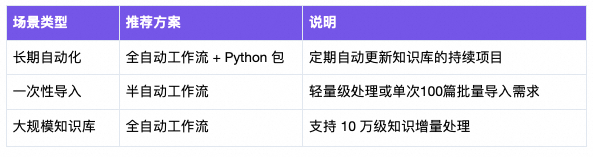

## 二、核心价值

****

### 2.1传统方案的困境

在大部分 Agent 项目里，一个绕不过去的问题是：知识从哪里来、怎么持续更新。

在日常工作中，大量有价值的知识分散存储在工单系统、文档库、甚至SQL代码等各个平台的各个角落。但 Agent 需要的是一份「结构化、可向量化、可持续维护」的知识库，因此当我们需要构建 Agent 知识库时，这些知识的收集、整理和维护成为了巨大的挑战。

传统做法存在两种路径，但都有明显缺陷：

路径一：人工精细化处理

优势：质量可控，准确性高；问题：耗时耗力，需要定期人工维护更新。

路径二：批量直接导入

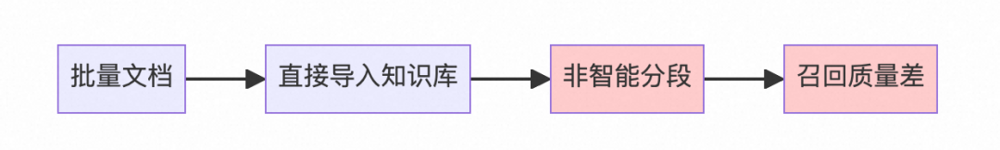

问题：切分不准确,知识未泛化,RAG 效果差。

### 2.2 核心痛点

知识收集困难

  * 分散存储：知识分布在多个平台（工单、文档等），人工收集效率极低。

  * 格式不统一：缺乏统一 标准，不同人提取的内容格式不一致，难以结构化管理。

RAG 召回质量差

  * 切分不准：原始文档直接导入，非智能分段导致切分不准确。

  * 覆盖不全：单一 Q&A 格式无法覆盖用户多样化的提问方式，换一种问法就检索不到知识。

维护成本高昂

  * 人工维护：需要专人定期检查更新，响应滞后。

  * 易遗漏：人工操作易遗漏，无法实现实时同步。

### 2.3 本方案的优势

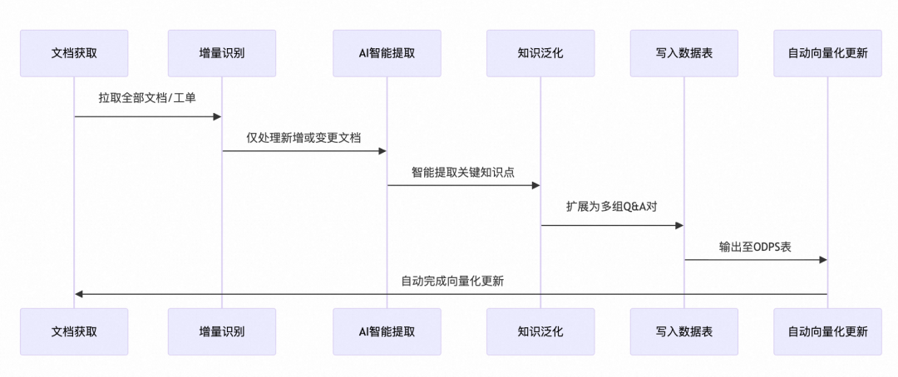

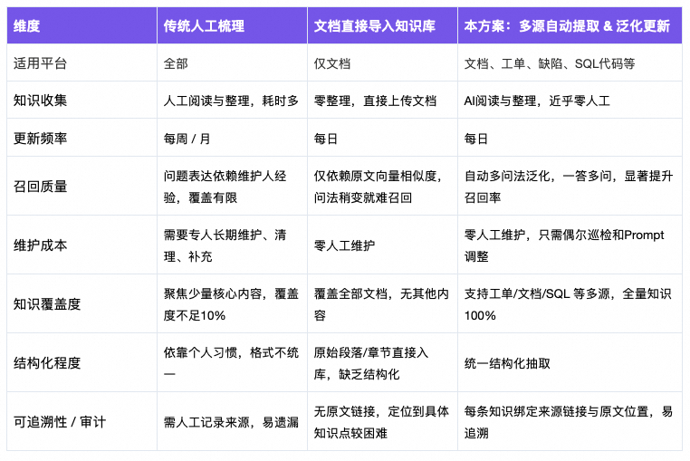

> 一句话总结：跟传统方案相比，本方案完全取代了人工；与文档直接导入知识库对比，本方案可以像人一样，更智能地梳理。

### 2.4 为什么做这个？

为了弥补知识从原始存储位置（工单/文档等）到AI应用开发平台向量知识库之间的自动化链路空缺，节省梳理知识这种重复性工作的繁重压力，让大家可以聚焦于高价值工作，我设计了这套端到端的自动化方案，并将其封装为 Python 包，确保即使是非技术同学也能开箱即用。

## 三、设计理念

传统的人工知识提取流程通常包含以下步骤:

> 打开工单空间 → 筛选出未处理过的新工单 → 逐条打开工单 → 阅读内容 → 提取知识 → 借助AI泛化知识 → 写入 ODPS 表/文档 → 传入Agent平台的知识库

要让 AI 自动化完成这一流程,我们采用了拟人化设计思路，工作流部分是"教会 AI 干活"，Python 包部分是"给 AI 派活"。

### 3.1 教会 AI 干活：给数字员工装上眼、脑和手

如果把 AI 当成一名“数字员工”，要让 TA 真正能上岗干活，至少要配齐三种能力：

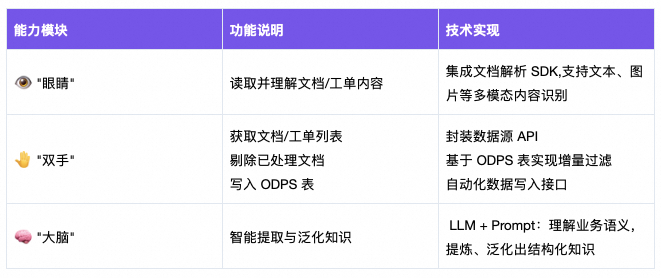

用一句话概括：AI 的眼负责“读数据”，脑负责“想清楚”，手负责“做结果落地”。

教会这三件事，AI 已经具备了“岗位能力”，能够作为一名可调度的数字员工参与到工作流程中。

### 3.2给AI派活：把调度系统当成“数字班长”

具备能力还不够，TA 还需要知道：

> “今天要干什么？从哪里开始？做到什么时候算收工？”

这就需要一个“数字班长”——也就是AI 任务调度系统：

  * 每天定时派活：按天 / 小时调度任务，每次告诉AI工作的要求和内容；

  * AI 负责按工单 / 文档逐条处理；

  * 调度统一收工：所有结果写入 ODPS，并同步到Agent平台知识库；

这种模式，其实就是在构建一个通用的"AI 任务调度"思想：人类只需要设计"班次"和规则，AI 数字员工每天按计划自动干活并汇报结果。

## 四、方案与架构

基于上述设计思路,我们构建了端到端的自动化链路:：

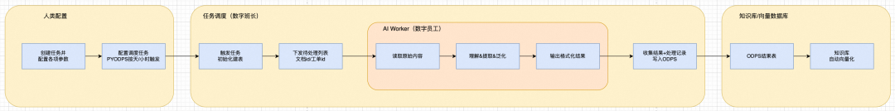

所有流程均已封装进工作流及 Python 包，用户只需配置参数即可一键运行，无需关心底层实现细节。

### 4.1 全自动化Python包+工作流：

为了实现完全自动化，把部分逻辑写在了Python里面，PyODPS节点负责读取文档列表、剔除已处理文档、最终知识写入ODPS。

文档获取 → 增量识别 → AI 智能提取 → 知识泛化 → 写入数据表 → 自动向量化更新

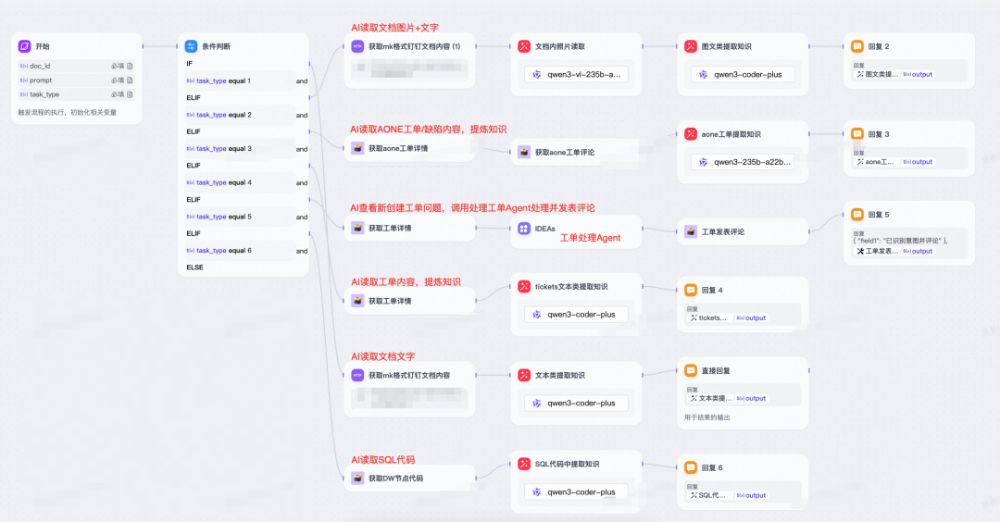

适用场景：需要定期自动更新知识库的长期项目

> PyODPS：PyODPS 是 MaxCompute（原ODPS）的 Python SDK，允许通过 Python 代码操作云端数据仓库。对于非阿里云用户可替换为其他数据仓库的 Python SDK（如SPARK），核心逻辑相同。

### 4.2半自动化纯工作流：

为了轻量或者单次实现，还可以把循环做到工作流里面，一次性批量处理100篇文档。

手动梳理待处理文档列表 → 循环处理文档 → AI 提取 → 批量写入/汇总输出

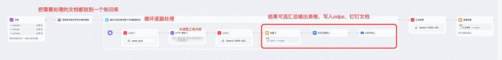

适用场景：一次性知识导入或轻量级处理需求。

### 4.3数据流转示意

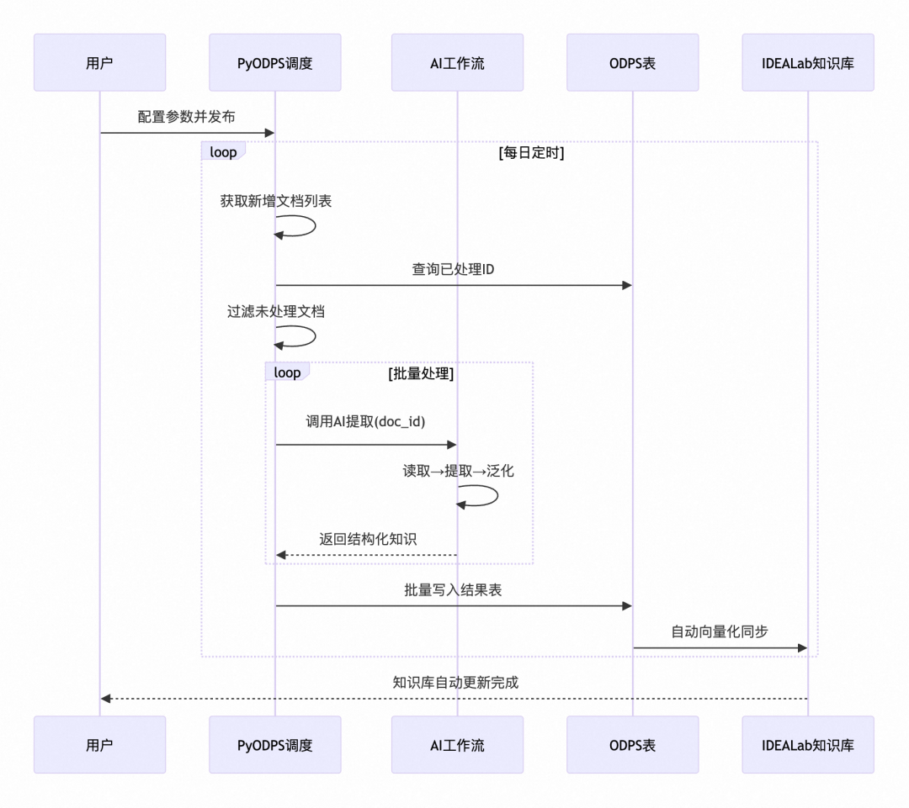

## 五、功能特性

### 5.1核心功能列表

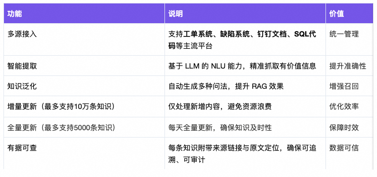

### 5.2 知识泛化效果对比

#### 文档类：

泛化前

  *   *

    Q: 支付买家数的定义A: 拍下并成功支付的买家去重人数,包含退款买家数

泛化后

  *   *   *   *   *   *   *   *   *   *   *   *   *   *   *

    {  "questions": [    "支付买家数是什么意思?",    "支付买家数是怎么定义的?",    "已经退款的买家算在支付买家数里吗?",    "同一个买家多次支付算几个?",    "支付买家数和下单买家数有什么区别?",    "为什么支付买家数要去重?",    ...共12条  ],  "answers": [    "指成功完成支付的买家人数..."  ]}

`
`

#### 工单类

泛化前：

  *   *

    Q: xx平台标签管理额度30,实际使用28个,为什么提示可使用额度为0?A: 有两个下线的标签占用名额导致，但是平台未显示已下线标签

  *   *   *   *   *   *   *   *   *   *   *

    {  "questions": [    "为什么我的标签可用额度显示为0,但实际上只用了28个?",    "已下线的标签是否还占用标签额度?",    "xx产品标签管理显示可使用额度为0,但实际未达到上限,是怎么回事?"  ],  "possible_causes": [    "已下线的标签不会已用额度中剔除..."  ]}

`
`

## 六、实现效果

### 6.1 知识库知识形式

表格类：

Q&A为索引字段，知识原文、URL、处理人等字段为RAG召回时连带带出内容。

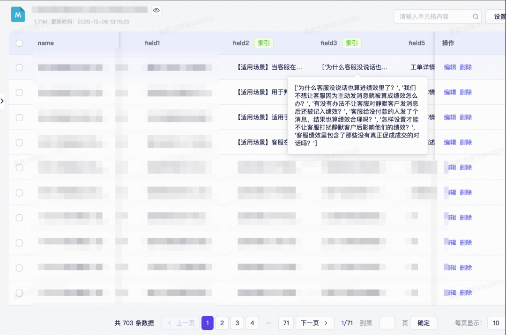

文本类：

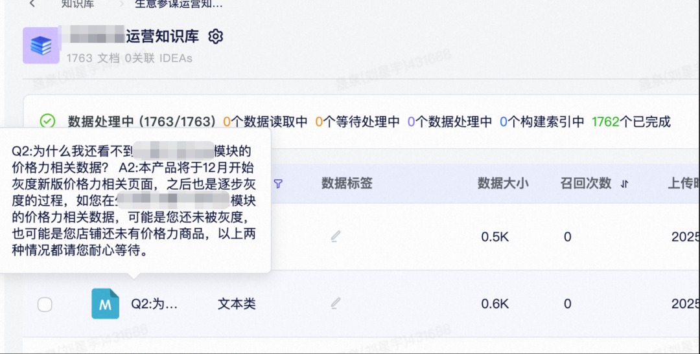

### 6.2 核心价值总结

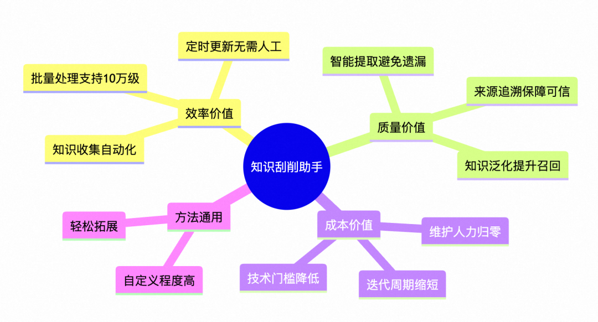

## 七、实践经验分享

### 7.1 工具开发占据大半工作量

> 现象:做Agent时,50%+的时间在开发/对接工具,而非优化提示词和流程

在实际做 Agent 的过程中，我发现真正耗时的部分并不在提示词工程，也不在流程编排，而是——开发和对接工具。目前平台生态还不算完备，很多能力要自己补齐。与此同时，做 Agent 的同学大多还有本职工作，通常只能利用周末或零碎时间开发。如果还要从零开始造工具，时间成本会被放大好几倍。

好消息是：平台能力在快速完善。去年和今年年初时，很多能力都需要自己搭，现在内部Agent平台上已经有了不少开箱即用的组件。现在再做类似 Agent，成本会比以前低很多。

### 7.2 工具缺失是最大瓶颈

### 不是 idea 不够，而是“实现不了”

一句话总结：Agent 效果不理想可以慢慢调，工具缺位则是“寸步难行
身边的同事一般不缺idea，真正的难点往往是——有了想法，却缺少落地所需的“工具”

要接一个外部平台的 SDK，顺利的话一小时，不顺的话能卡一两天天。尤其是：

  * 外部SDK文档不全,参数说明模糊

  * 非技术同学缺乏工程能力,有idea却无法落地

这些事情对我来说已经有挑战了，对非技术同学来说更难，他们有很多非常实用、非常有价值的 idea，因为缺少对应工具，根本没法落地。

### 7.3 工具开发一定要“反复可用”，避免一次性定制化

我一开始做工具时，只想着“这次能跑起来就行”，典型做法是：

  * 只写当前任务用得上的参数，其他场景先不管

  * 某些逻辑为了省事直接写死在代码里

这样做短期非常快，Agent 能尽快上线。但问题是：

当你想把工具分享给其他人用时，会发现：

  * 对方的场景参数一变，这个工具就不适配

  * 为了通用化，还得自己回来重构和二次开发

后来我意识到：写工具的目标不是“解决这一次”，而是“支撑一类问题”。能沉淀成通用能力，就尽量不要写成只服务某一个脚本的“拼接代码”。

### 7.4 共建生态，人人为我，我为人人

因为 Agent 的制作时间紧、任务重，最怕的就是每个人都在重复造轮子，而不是把主要的精力放在优化agent的效果上。

建议行动: 把做好的工具/agent/工作流上架到内部的AI应用开发平台社区

你的工具可能成为别人Agent的关键能力。大家共建生态、互惠互利、希望以后开发agent可以更加轻松。

### 7.5 知识库直接召回效果差

在实际使用中，向量召回经常会遇到一个现实问题：

  * 用户问的是口语化、多角度问题；

  * 知识库里存的是高度书面化、单一表达的文档描述；

  * 结果就是：语义距离算出来不够近，召回效果偏弱；

我目前在用的两类解决思路：

前置泛化(本文方案)

  * 在知识入库前，让 AI 对每条知识做“问法泛化”，把用户可能使用的说法预先展开。

  * 这样知识库就不再是“一问一答”，而是“一答对应多问”，有效提升召回率。

召回后质检

在 Agent 中单独设一个“知识质检节点”，负责：

  * 修改/重写用户问题，多次尝试召回；

  * 对召回知识进行相关性判断和“可信度打分”；

  * 必要时过滤掉相关性不够高的知识；

这两层处理叠加后，实际 RAG 体验会好很多。

## 八、扩展部分

### 8.1 简单应用拓展

本文的基础流程可以抽象为三步：

> 获取待处理对象列表 → AI 逐条读取与处理 → 结果汇总写入

AI阅读SQL提取知识

既然 AI 能够“读文档 + 提取知识”，那完全可以把“文档”替换为其他对象，例如 SQL 代码。

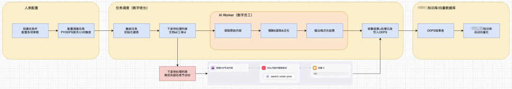

恰好作者这里已经有一套可以“读 SQL 代码”的工具，只需要简单修改工作流，复用Python包，即可实现AI读代码

读取 SQL 脚本，从中提取：指标口径、表间关系、关键业务字段、常见风控/过滤逻辑等知识。

应用：构建 NL2SQL、链路排查、逻辑确认等能力的知识库。

#### AI自动处理新工单

同上面一样，略微改动提示词和流程，就可以把对象从“文档”切换为“工单”，实现例如：

按小时调度Pyodps任务——自动识别新工单——调用AI处理工单——将AI结果回写为工单评论

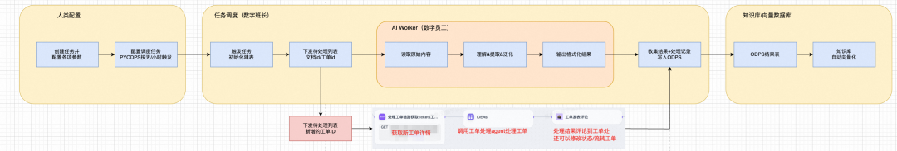

在这个基础上，还可以搭建一个“工单自动流转器”：

> 自动识别新工单 → AI 分析问题类型 → 自动流转给对应负责人 / 团队

### 8.2 复杂任务扩展

#### 从简单岗位到复杂工种

在本文中，我们更多是让 AI 扮演“知识整理员”——负责自动读文档、提取知识、泛化问法、写入知识库。这其实只是一个单步骤岗位。

这套“眼-脑-手”的思路，可以扩展到更复杂的任务，例如：

AI自动处理工单、AI存储治理

AI 自动读取工单+评论、查日志、执行 SQL查询、接口排查，数据逐层排查、调用知识库、输出结论、评论工单

> 作者在今年6月份，借助这套调度器+复杂的AI存储治理工作流，把整个数据产品下面几乎所有的表和节点都扫了一遍、借助AI治理了xxPB，将整个产品的ODPS存储降了接近50%，远超往年。

#### 多 AI 协作与质检

任务调度系统也可以做到更严谨，比如：

新增一个AI 作为“监工”，专门做质量检测、异常识别。

创建gpt、claude、qwen三个Agent，重要任务可以让 3 个 AI 并行处理，采用多数投票或最保守答案策略。

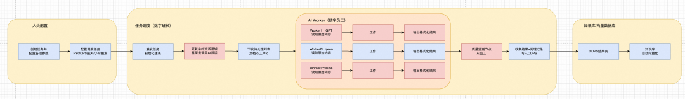

（只需要微改Python包，新增函数即可轻松实现）

### 8.3 通用工作流思想

抽象一下，本文的“AI 工作流 + 调度”的思路可以复用到很多场景：

1\. 把业务流程拆成若干“岗位步骤”（如：拉取 → 分析 → 决策 → 写入）；

2\. 给每个步骤配置好 AI 的“眼 / 脑 / 手”；

3\. 用调度系统 + 工作流 / 提示词，把这些步骤串成一条自动化流水线；

4\. 在关键节点插入“监工 AI”，负责质检、异常回退、告警通知；

这样一来，我们不是在做一个孤立的 Agent，而是在搭建一个可扩展的 AI 数字员工团队。

### 8.4 自建向量库

随着业务复杂度增大，部分场景对知识库的要求已经超出了AI应用开发平台自带向量库可配置范围，例如：

  * 更灵活的多字段索引与过滤

  * 自定义相似度计算策略

  * 与现有业务库的深度集成

  * 更实时的知识更新要求

在这类场景下，我们团队正在探索基于 PostgreSQL 自建向量数据库（结合 pgvector 等扩展），来支撑。

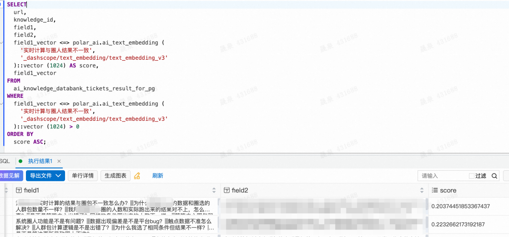

对于简单场景，AI应用开发平台自带向量库已经足够友好、快捷；当你发现配置项不够用时，自建向量库是一个值得考虑的升级选项。

## 九、总结与展望

通过构建“自动提取 → 智能泛化 → 增量更新 → 向量化同步”的全链路自动化 pipeline，有效解决了 Agent 知识库建设中的三大顽疾：

  * 收集难 → 自动化采集

  * 质量差 → AI 泛化增强

  * 维护繁 → 增量定时同步

更重要的是，我们将复杂的逻辑封装成简单易用的Python包和工作流，大幅降低使用门槛，希望可以帮助到你们。

尽管在工具集成过程中遇到了诸多挑战，但最终的效果证明：每一次“卡住”，都是通往自动化的必经之路。

****

### 主动式智能导购 AI 助手构建

为助力商家全天候自动化满足顾客的购物需求，可通过百炼构建一个 Multi-Agent 架构的大模型应用实现智能导购助手。该系统能够主动询问顾客所需商品的具体参数，一旦收集齐备，便会自动从商品数据库中检索匹配的商品，并精准推荐给顾客。

## 点击阅读原文查看详情。
