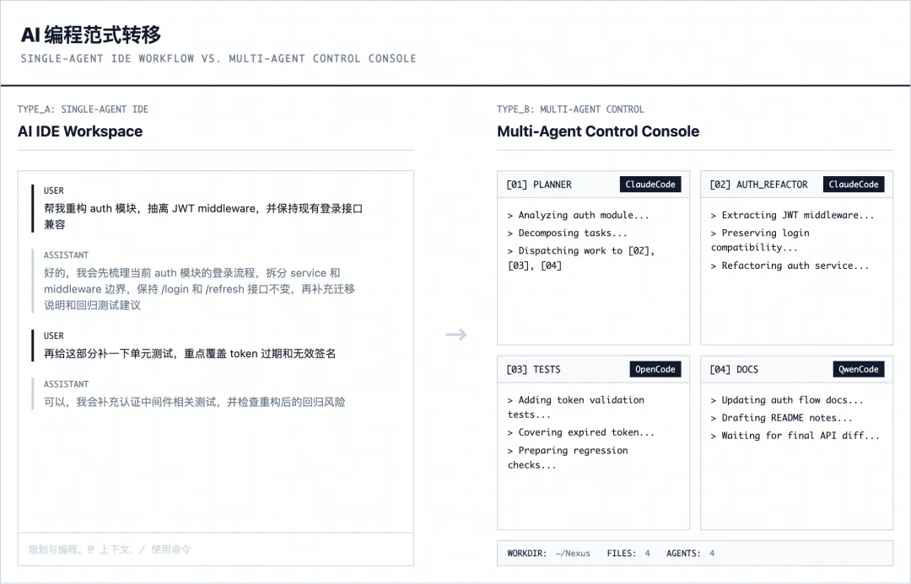
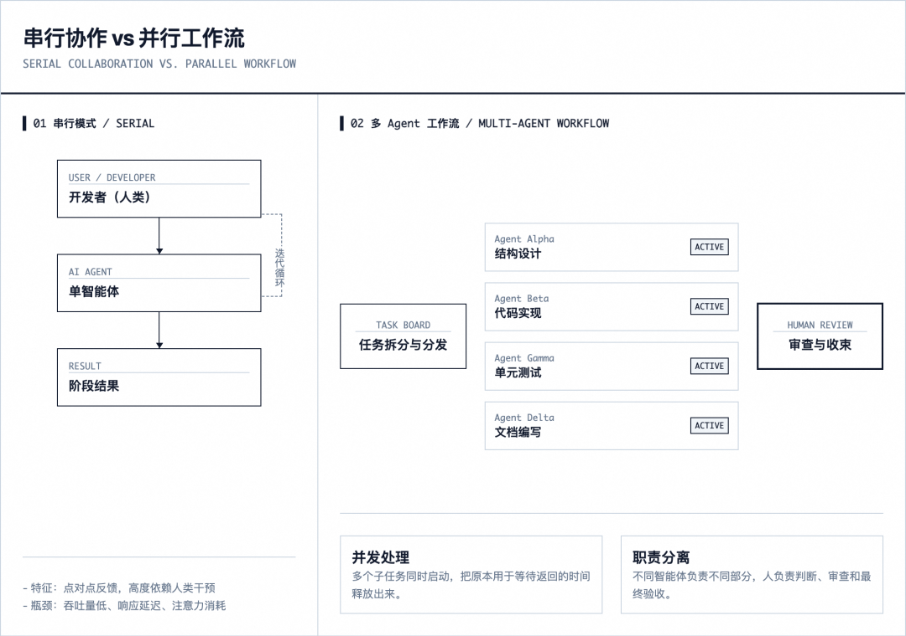
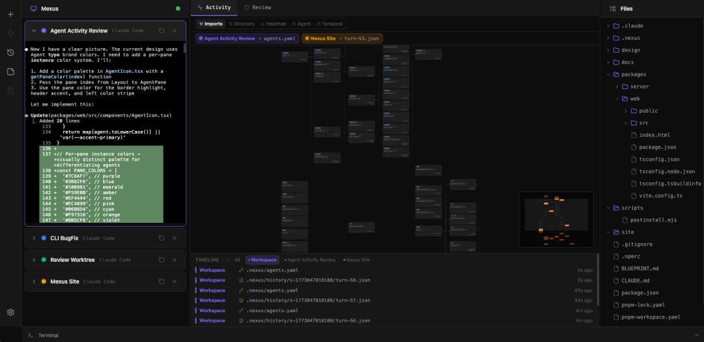
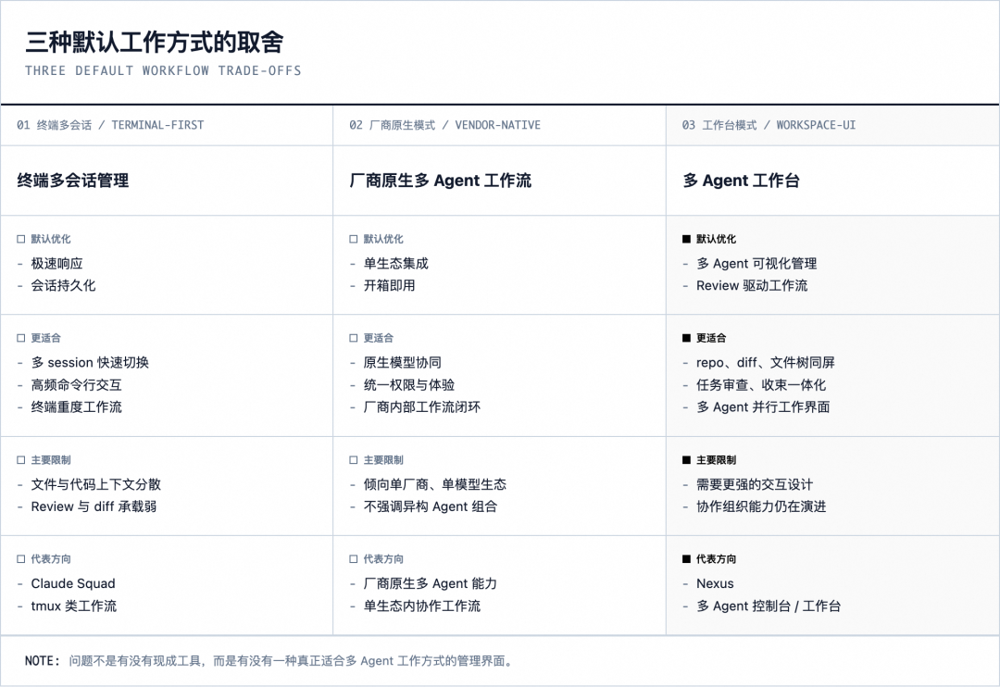
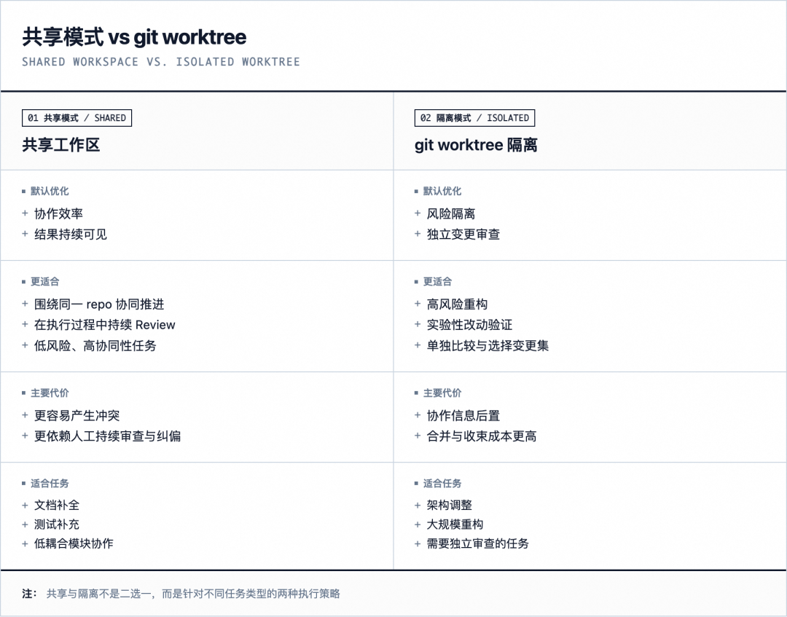

# 从聊天窗口到多 Agent 控制台：一次 AI 编程协作范式的转移

> **公众号**: 阿里云开发者  
> **发布时间**: 2026-04-16 08:30  

阿里妹导读

文章内容基于作者个人技术实践与独立思考，旨在分享经验，仅代表个人观点。

过去一段时间，随着工作中 AI Coding 的占比越来越高，我逐渐感觉到当前 AI Coding 的协作范式已经不适合我了。当前主流的 AI 开发过程，仍然是人与一个 Agent 围绕同一个任务持续协作。但我在日常工作中，已经习惯于同时操控多个 Agent 并行执行任务，在关键节点做 Review，并对最终结果进行验收和整合。这篇文章想讨论的，是 AI 编程协作范式的转移：人与 AI 该如何分工，多个 Agent 之间又该如何协作。

## 当单 Agent 协作开始不够用

AI IDE 本身的能力越来越强，但它提供的协作模式，还是以单线程为主。我通常是在和一个 Agent 持续协作：我提需求，它读取上下文、改动多个文件、执行命令，再返回结果，等我确认后进入下一轮。这种方式虽然能正常工作，但我的大量时间都消耗在"等它返回、看它改了什么、决定要不要继续"这条链路里。只要任务还在这条链上推进，人就没有真正从执行流程里抽离出来。于是，我开始尝试更加高效的协作模式，比如在 AI IDE 中开多个聊天窗口，在同一个工作空间指派 Agent 相对独立的开发任务，这样我就能把时间用在理解需求、拆解和分发任务、Review 已有代码、检查 Diff，以及对最终结果做验收和整合。这是我找到的比较理想的方式。但当我真正开始这样工作后，发现现有工具并没有为这种模式做好准备。

## OpenCode 的 Web 模式给了我最接近的雏形

明确了这种工作方式之后，我开始寻找能适配它的 Coding 工具。在用过的工具里，OpenCode 的 Web 模式最接近我的理想，它让我看到了一种有别于 AI IDE 的交互方式：Agent 先执行一段时间，我在关键节点回来看改动、给反馈、做验收。但对照我真正需要的能力：

  * 能承接多个 Agent 并行工作
  * Review 取代代码编写成为工作流中心
  * 能帮助我观测多个 Agent 的工作过程

OpenCode 对多 Agent 并行的支持还不够，本质上还是单 Agent 工作流。所以，我开始设计自己的工具。

## Mexus：我对新范式的一次设计实践

Mexus 的定位很简单：不再造一个 AI IDE，而是面向一个人同时管理多个并行 Agent 的场景，提供一个 WebUI 交互终端。它可以跑在本地，也可以部署在服务端；但不管在哪里运行，它解决的都是同一个问题：当你开始同时使用多个 Agent 时，怎么把它们放进一个可管理、可审查、可观测的工作界面里。Mexus 的界面借鉴了控制台（Dashboard）的设计思路：左栏放多个 CLI Agent 的 Pane，中间区域展示 Agent 活动和代码 Diff，右栏是当前工作空间的文件树。在这种模式里，我不需要亲自写代码，而是关注：

  * 当前有哪些 Agent 在执行
  * 它们各自负责什么工作
  * 我应该重点关注哪些文件的 Review
  * Agent 之间的工作是否有冲突

## Mexus 想解决什么问题

1\. 让多个 Agent 真正协作起来，而不只是并行执行

Mexus 里每个 Pane 都可以绑定自己的 workdir 和任务说明，任务拆分不再只是脑中的计划，而是能直接落到仓库结构里的执行单元。比如一个 Pane 处理 auth/，一个处理测试，一个处理文档，我负责看整体 Diff 和最后收束。但把任务拆开只是第一步。真正的问题是：当这些 Agent 围绕同一个仓库并行工作时，怎么避免互相踩踏，怎么让协作有序地发生。这是我在 Mexus 中正在设计的一套编排方案想回答的问题。虽然还没有完全落地，但核心思路已经比较清晰。以 Spec 为起点，而不是直接派发任务。 用户提出需求后，系统不会直接把任务拆开扔给多个 Agent，而是先由一个规划 Agent 生成结构化的 spec，包括目标、范围、验收标准、影响范围和任务拆解建议。用户审阅、反馈、批准后，系统再基于 spec 生成执行计划，明确每个 Agent 负责什么任务、可以改动哪些路径、任务之间有什么依赖关系。整个过程至少有两个人工确认点：批准 spec 和批准执行计划。共享工作区下的软边界和轻量 claim。 多个 Agent 默认在同一个工作区里协作，但每个 Agent 在执行计划中都会拿到自己的 ⁠allowedPaths，它被授权改动的文件范围。执行期间，系统维护一份轻量的 claim 记录，标记哪个 Agent 正在编辑哪些文件。claim 不是强锁，不会阻塞执行，但它让其他 Agent 和观察者都能看到当前的文件占用情况，为冲突发现提供事实信号。引入环境观察员做运行时协调。 除了执行任务的 Worker Agent，系统会额外启动一个 Observer Agent。它不写业务代码，而是持续观测执行环境：哪些文件正在被多人编辑、是否有 Agent 越界修改、是否有任务长时间停滞。发现轻量冲突时，它可以直接提示相关 Agent 避让；遇到更大的风险，它会向用户上报，由人来决策。Observer 拥有运行时的协调权限，但同时受到严格约束，有频率限制、有审计日志、用户可以随时冻结它的控制权。这套方案的本质是：用结构化的 spec 定义边界，用 claim 暴露事实，用 observer 做运行时仲裁，用人工确认点兜底关键决策。 不依赖任何单个 Agent 的"自觉"，而是通过机制设计让多 Agent 协作变得可观测、可约束、可干预。

2\. 让多 Agent 的工作过程可观测

当只有一个 Agent 时，你盯着它的输出就够了。但当三四个 Agent 同时在跑，你不可能逐个翻看每个终端的滚动日志。这时候需要的，是一层从执行细节中提炼出来的态势感知，而不是更多的终端窗口。这是 Mexus 活动面板想解决的问题。它提供了多个观测视角，对应不同的决策场景：

  * Agent 仪表盘：每个 Agent 一张卡片，展示改动行数、触及文件数、context 使用率、工作节奏曲线。一眼看出谁在持续产出、谁卡住了、任务分配是否均衡。
  * 模块视图：按功能模块而非目录聚合，展示各 Agent 的工作分区。两个 Agent 挤在同一个模块里，通常意味着需要协调。
  * 依赖视图：只聚焦被 Agent 触及的文件和它们的依赖链。Agent A 改了一个被多处引用的文件，所有下游文件会自动高亮，提示潜在的影响范围。
  * 冲突面板：把分散在各视图里的冲突信号集中呈现，直接冲突（多个 Agent 同时写同一个文件）、依赖冲突（上游文件被改，下游正在被另一个 Agent 编辑）、模块冲突（多个 Agent 在同一功能区重叠工作）。

这些视角的能帮助你更快地回答三个关键问题：现在有没有问题？问题在哪？我需要介入吗？更重要的是，这套观测设施现在是给人看的，但从一开始就不是只为人设计的。在 Mexus 的架构里，活动面板背后的数据，Agent 状态、文件 claim、冲突信号、依赖风险，会被统一沉淀为结构化的环境事实层。人类界面消费它做可视化，未来的 Observer Agent 消费同一份数据做运行时判断和协调。两者看到的是同一套事实，不会出现"UI 显示一种状态，Agent 依据另一种状态行动"的分裂。这意味着今天你在活动面板里靠眼睛做的事，发现冲突、判断某个 Agent 是否卡住、决定是否需要介入，未来可以由 Observer Agent 基于同一套数据自动完成。人的观测能力和 Agent 的观测能力，建立在同一层基础设施上。可观测不只是多 Agent 协作的基础设施，也是人逐步向 Agent 移交管理职责的前提。

3\. 把 Review 放回工作流中心

单 Agent 协作时，Review 通常发生在最后，Agent 做完了，你检查一遍，通过或者打回。但当多个 Agent 并行执行时，Review 的角色变了：它不再是终点的验收动作，而是你在整个执行过程中持续做判断的主界面。在 Mexus 里，中间区域可以直接看每个 Agent 的 Diff 和代码变化。我可以一边看结果，一边决定是继续、返工，还是收下。更关键的是，Review 不是停在"我看完了"这一步，我还可以把反馈直接发回对应的 Pane，让 Agent 继续改，整个循环不需要离开 Review 界面。这意味着 Review 取代了代码编辑器，成为我日常工作的主操作面。

4\. 把不同 Agent 放进同一个控制台里统一管理

Mexus 支持同时运行不同的 CLI Agent，Claude Code、Codex、OpenCode、Kimi Code CLI 等，混用不同 Agent，是实际工作中更合理的策略。模型和 Agent 通常成对搭配，原厂组合效果最好。但不同任务的难度不同，全部用最强的模型既不经济也没必要。核心模块用 Claude Code，测试和文档用更轻量的 Agent，整体 token 消耗会合理很多。此外，当某个 Agent 达到使用限额后，其他 Agent 可以接力继续工作，能力可能有降级，但好过任务中断。AI IDE 解决的是人与一个 Agent 如何协作。Mexus 想回答的是下一个问题：当 Agent 不再是一个，而是一组并行的执行单元时，人的工作界面应该长什么样。

## 为什么还要重复造轮子

另一个很自然的问题是：既然已经有 Claude Squad、Warp 这些工具在往多 Agent 方向走了，为什么我还要再做一个？这说明需求本身是对的：大家确实开始同时跑多个 Agent 了。但这些工具解决的重点，和我想做的东西还是不太一样。有的更偏终端里的多 Session 管理，有的更像 AI agent 的统一控制台，有的把多 Agent 能力直接做进终端或桌面环境里。这些方向都对，也都各有价值。尤其像 Claude Squad 这种，把 git worktree 隔离和终端工作流结合起来，思路很扎实。但我想做的不是终端里的多 Session 管理，也不是一个通用的 Agent 控制台，而是一个以 Review 为中心的多 Agent 工作界面，能看到并行执行的全貌，能在 Review 中直接把反馈送回对应的 Agent，能在同一个工作台里完成从任务分配到结果验收的完整循环。同时 WebUI 恰好有两个很实际的优势：一是门槛更低，二是交互能力更强。很多事情放在终端里能做，但不代表是最自然的体验；像文件树、diff、Review、把反馈直接发回 Agent 这类操作，放在 WebUI 里会顺手很多。

## 为什么默认共享工作区，

## 而不是默认 git worktree

Mexus 支持 git worktree，但它是创建 Pane 时的可选模式，不是默认值。默认隔离的问题在于，它预设了多个 Agent 之间不需要配合，只是各自完成各自的事，最后再合并。但实际的多 Agent 协作场景里，任务之间往往有依赖、有共享的接口和类型、有需要彼此感知的上下文。一上来就隔离，等于把这些协作需求全部后置到合并阶段，而合并阶段的冲突解决成本远高于执行过程中的及时纠偏。当然，共享工作区的风险是真实的，多个 Agent 同时改同一个文件、越界修改、互相覆盖，这些问题不会因为你选择了共享就自动消失。所以 Mexus 的多 Agent 编排方案里，共享不是"放进去让它们自己跑"，而是配套了一组具体的协作机制：

  * 每个 Agent 在执行计划中拿到明确的 ⁠allowedPaths，划定各自的修改边界
  * 执行期间维护轻量的文件 claim，标记谁正在编辑什么，让占用情况对所有参与者可见
  * Observer Agent 持续观测环境，发现冲突时可以直接协调相关 Agent 避让，或向用户上报
  * 冲突、越界、停滞等信号通过统一的观测层实时暴露，人和 Agent 都能看到

有了这些机制，共享工作区的核心优势才真正成立：改动实时可见，问题在执行过程中就能暴露，人可以随时介入纠偏，而不是等所有 Agent 都做完了再统一收拾。隔离仍然有它的位置。高风险重构、实验性改动、需要独立验证的任务，切到 git worktree 里执行是更稳妥的选择。在 Mexus 的执行计划里，每个任务可以单独指定 ⁠shared 或 ⁠isolated 模式，两种策略可以在同一个 plan 中并存。默认共享，是因为有机制管理冲突。在这个前提下，让 Agent 们围绕同一个仓库、同一个目标一起往前推进，是更高效的默认姿态。

## 重塑人与 AI 的协作关系

这轮 AI 编程范式变化的推动力已经不需要多说，模型在进步，Agent 在成熟，AI 能承担的任务链路越来越长，这些大家都看得到。但真正值得讨论的不是 AI 变强了多少，而是变强之后，瓶颈转移到了哪里。OpenAI 在今年初提出了 Harness Engineering 这个概念，我觉得它非常准确地描述了这个转移。他们用 Codex Agent 构建了一个超过百万行代码的产品，全程没有人类直接写过一行代码。但他们发现，早期进展比预期慢，不是因为 Agent 能力不够，而是因为环境没有准备好，Agent 缺少完成高层目标所需的工具、抽象和结构。他们的原话是："Humans steer. Agents execute." 工程师的核心工作从写代码变成了设计环境、定义意图、构建反馈循环，让 Agent 能够可靠地工作。这和我在 Mexus 中的体会高度一致。当你开始同时管理多个 Agent 时，工作重心会自然地往上移，从亲自写代码，转向构建让 Agent 稳定产出的系统，定义 spec 让 Agent 理解目标、划定边界让 Agent 知道能改什么不能改什么、构建观测层让自己和 Agent 都能看到执行状态、设计反馈机制让 Review 结果能回流到执行过程中。Harness Engineering 还有一个洞察对我启发很大：约束不是限制，而是放大器。 在人类主导的工作流里，严格的架构约束可能显得教条；但在 Agent 执行的场景下，一旦约束被编码，它就能同时作用于所有 Agent、所有任务。Mexus 里的 ⁠allowedPaths、文件 claim、Observer 的边界检测，本质上都是这个思路：通过prompt 告诉 Agent"请注意不要越界"是不够的，Mexus 的思路是用结构化的机制让越界行为可被检测、可被拦截。从这个角度看，问题不再是怎么把代码写得更快，而是怎么设计一个环境，让 Agent 能在其中可靠地替你把代码写好。Mexus 想做的，是为这种新的工作方式提供一个具体的操作界面：让你能在一个地方定义 spec、分发任务、观测执行、Review 结果、反馈修正，完成从意图到交付的完整循环。

## 结语

AI 编程范式的变化，最终会落在一个很具体的问题上：当 Agent 越来越能干，人应该做什么？这是我做 Mexus 的出发点，也是我现在对这件事的理解：人的工作重心会自然地往上移，从亲自执行，到判断方向、做关键决策；从逐行写代码，到定义目标、验收产物；从参与每一步实现，到定义什么值得被生产。
