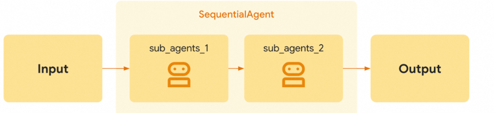
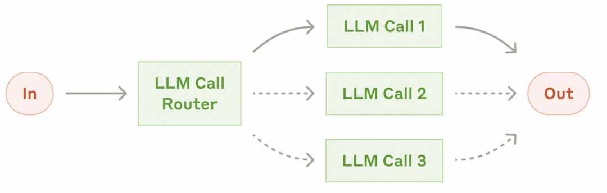
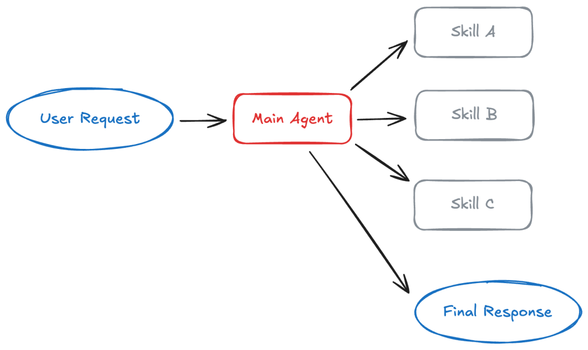
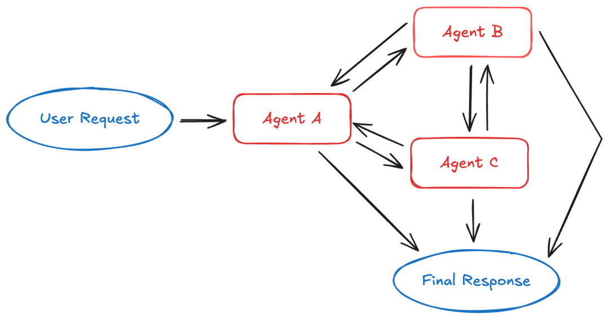
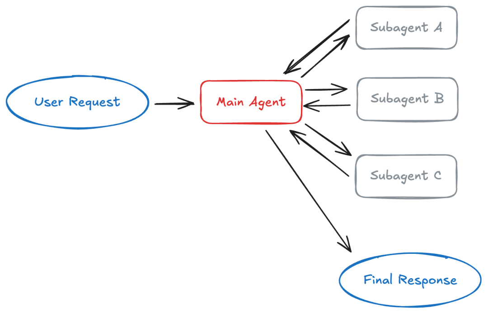

# 企业级 Agent 多智能体架构与选型指南 -- 来自1000+行业应用实践积累

> **公众号**: 阿里云开发者  
> **发布时间**: 2026-03-20 08:30  

阿里妹导读

本文基于我们服务阿里巴巴多条业务线（淘天、闪购、爱橙、云智能、高德、饿了么、1688、蚂蚁、菜鸟等）、众多社区用户（如友邦、海尔、建设银行等）、超 1000+智能体应用实践经验积累。

本文发表前，我们刚刚发布了框架新版本，Spring AI Alibaba 全面升级对 AgentScope 框架支持，以 AgentScope ReActAgent 为核心，全面支持基于 AgentScope 的多智能体编排。

## AgentScope Java 1.0.10 版本：

https://github.com/agentscope-ai/agentscope-java/tree/main/agentscope-examplesSpring

## AI Alibaba 1.1.2.2 版本：

https://github.com/alibaba/spring-ai-alibaba/releases/tag/v1.1.2.2

## 背景

## 随着智能体在企业的规模化落地，企业的核心关注点已从「大模型能做什么」转向「如何让 AI 真正驱动业务闭环」。单纯依靠大模型闲聊的时代正在结束，业界焦点越来越多地落在智能体流程自动化——即让多个专职智能体在清晰流程中协作，完成高价值、可复现的任务。业界一些实证研究表明，在处理多跳推理等复杂问题时，多智能体协作架构的准确率比单一基础模型可高出约 32%；通过引入专门的「批评」与「优化」智能体，事实检索准确率可提升约 26%，模型幻觉显著降低。

AgentScope 社区在服务企业用户智能体实践落地的过程中，积累了大量有效的、适用于不同业务场景的多智能体模式，包括 Supervisor、Handoffs、Subagent、Routing 等。在 **AgentScope** **Java** 生态中，我们将这些多智能体模式沉淀为具体的框架抽象与代码示例，用户可根据业务选型直接映射到对应的智能体实现，甚至可以基于我们提供的示例直接修改即可实现业务开发。

## 从最简单的 ReActAgent 单智能体开始

在构建复杂的 AI 应用时，AgentScope 强调一个务实的工程原则：**单智能体优先（Single Agent First）** 。

  *   *   *   *   *   *   *   *   *   *   *   *   *   *   *   *   *   *   *   *   *   *   *   *

    publicstaticvoidmain(String[] args){    // 准备工具    Toolkit toolkit = new Toolkit();    toolkit.registerTool(new SimpleTools());
        // 创建智能体    ReActAgent jarvis = ReActAgent.builder()        .name("Jarvis")        .sysPrompt("你是一个名为 Jarvis 的助手")        .model(DashScopeChatModel.builder()            .apiKey(System.getenv("DASHSCOPE_API_KEY"))            .modelName("qwen3-max")            .build())        .toolkit(toolkit)        .build();
        // 发送消息    Msg msg = Msg.builder()        .textContent("你好！Jarvis，现在几点了？")        .build();
        Msg response = jarvis.call(msg).block();    System.out.println(response.getTextContent());}

绝大多数日常业务需求，完全可以通过「一个单体大模型 + 一组精准适用的外部工具」来解决。单智能体具有低延迟、易于逻辑推理和方便故障排查的天然优势。只有当业务系统的需求跨越了特定的复杂度阈值时，才应考虑向多智能体架构演进。这些阈值包括：

  * **上下文管理（Context Management）** ：任务所需的专业知识体量过大，单个上下文窗口无法承载，需要按步骤或按智能体选择性呈现。
  * **职责分工（Division of Labor）** ：不同团队需要独立维护各自领域的专家能力与权限边界，并在清晰边界下组合使用。
  * **并行化加速（Parallelization）** ：复杂子任务必须并发执行以大幅降低系统延迟，例如多角度调研、多源查询。
  * **结构化流转（Structured Flow）** ：业务要求按照严格的工序（如分类、路由、处理）或角色状态（如销售到客服的切换）进行传递，单智能体难以自然保证这些约束。

在实践中，许多系统采用**混合级联范式（Agent Cascade）** ：前端通过轻量级模型评估任务复杂度，简单任务由单智能体处理，只有置信度低或高度复杂的请求才下放给多智能体网络。这种级联设计在保持整体准确率的同时，能显著降低部署与算力成本，在数学推理等极端任务中甚至可实现可观的算力削减。因此，建议**先单智能体 + 工具** ，再根据上述阈值判断是否引入多智能体。

## AgentScope 支持的多智能体模式

当前，AgentScope 提供多种开箱即用的多智能体模式，并支持通过 **StateGraph** （基于Spring AI Alibaba AgentScope 生态集成）实现自定义工作流。以下是我们总结的几种常用多智能体模式（包含它们的作用与适用场景）。

模式| 作用| 适用场景
---|---|---
**Pipeline**|  固定流程：顺序（A→B→C）、并行（同一输入给多智能体再合并）、循环（子流程重复直到条件满足）| 流程明确，如自然语言→SQL→评分，或一主题多角度调研→合并报告
**Routing**|  分类 → 专家 → 综合：路由器对输入分类，转发给一个或多个专家，结果合并为单一回答| 多垂直领域（如 GitHub、Notion、Slack），一次请求完成「分类→专家→合并」
**Skills**|  按需披露：智能体只看到技能名/描述，通过 `read_skill` 按需加载完整内容（如 SKILL.md）| 单智能体多种专长，不想一次性把所有领域文本塞进上下文
**Subagents**|  编排智能体通过 Task 工具将工作委托给子智能体；子智能体可用 Markdown 或代码定义，每次调用无状态| 领域清晰（日历、邮件等），希望单一入口完成路由与结果合并。

  * 和Supervisor类似，只是subagent定义方式不同。
  * 相比skills可以实现子智能体间上下文隔离。

**Supervisor**|  监督者将专家当工具调用（一专家一工具，如 schedule_event、manage_email）| 领域清晰（日历、邮件等），希望单一入口完成路由与结果合并。

  * 和Subagents类似，只是subagent定义方式不同
  * 相比skills可以实现子智能体间上下文隔离。

**Handoffs**|  状态驱动：工具更新状态变量（如 active_agent），图根据该变量路由到不同智能体| 按角色或顺序交接（如销售 ↔ 支持），对话中「当前负责」的智能体会变化
**Custom Workflow**|  StateGraph 自定图：顺序、条件、确定性步骤与智能体步骤混合| 以上模式不适用的情况下，如需要多阶段、显式控制或非 LLM 与 LLM/智能体步骤混合

从实现机制上可以这样理解：

  * **Pipeline** 通过全局的 `OverAllState` 在顺序（SequentialAgent）、并行（ParallelAgent）、循环（LoopAgent）三种子形态间传递状态；
  * **Routing** 作为分发枢纽，利用分类器解析输入意图并将任务送达领域专家，支持简单一次调用或基于 `StateGraph` 的前后处理扩展；
  * **Skills** 采用「选择性披露」——主智能体仅保留技能摘要，通过 `read_skill` 按需加载完整 `SKILL.md`，有效控制上下文膨胀；
  * **Subagents** 由编排者通过 Task 工具委派给在隔离上下文中运行的无状态子智能体；
  * **Supervisor** 则将专家视为对话中的工具，由监督者在动态上下文中决定唤醒谁；
  * **Handoffs** 通过工具调用更新 `active_agent` 等状态，依赖 `ReplaceStrategy` 与图条件边实现角色间平滑切换；
  * **Custom Workflow** 则直接使用 `StateGraph`，将确定性业务逻辑与 LLM 节点编织成自定义网络。

这些模式既可以单独使用，也可以组合使用——例如 Supervisor 监督者通过 Agent as Tool 调用专家、图中某段用 Handoffs、另一段用 Routing，按流程各部分需求选择最合适的模式即可。

## 多智能体模式分类：工作流 vs 对话

在上一节提到的所有多智能体模式，总体上可划分为两大类：**工作流模式（Workflow Patterns）与对话模式（Conversation Patterns）** 。企业开发者需要在这二者之间做出权衡，并理解各自的优势与局限。

### 工作流自动化（Workflow Automation）

工作流模式代表系统工程中的**确定性骨架** ：智能体被编排在预先定义好的有向无环图（DAG）或线性管道中，流程在智能体或节点之间流转，拓扑和状态在图或管道中显式定义。AgentScope 中的 **Pipeline** 、**Routing** 、**Handoffs** 、**Custom Workflow** 均属此类。

  * **优势** ：具有极高的可预测性、低资源消耗和良好的审计追踪能力。由于执行路径固定，非常容易调试，是金融审批、文档生成等高合规要求场景的常见选择。
  * **劣势** ：要求在开发初期对任务进行较完整的规约，对未曾设想的新型模糊输入适应性有限。

**对话模式 / 自治智能体（Conversational Agents）**

决策过程发生在一个**连续的对话上下文** 中，由大模型自主决定何时调用何种外部工具。通常只有主智能体与用户交互并将结果输出给用户。**Supervisor** 、**Subagents** 、**Skills** 属于对话模式。

  * **优势** ：能够优雅地应对复杂的边缘场景和开放式问题，在人类无法预判路径的环境中展现出较高的适应性。
  * **劣势** ：容易产生难以控制的「复合误差（Compounding Errors）」，计算 Token 成本较高，且非确定性导致系统调试相对困难。

### 最佳实践：混合工作流

生产环境的常见做法是采用**混合工作流** ——以确定的工作流作为应用的「脊椎」，仅在需要高度认知灵活性的特定节点（如意图分类、复杂草案生成）引入自治智能体，从而兼顾系统的可靠性与 AI 的智能弹性。其余能力（如 MsgHub、Multi-Agent Debate）可与上述两类组合使用，用于实现交接、辩论或「智能体即工具」等能力。

比较维度| 工作流模式（Workflow）| 对话模式（Conversational）
---|---|---
**控制流机制**|  显式的图拓扑或线性管道，可以是路径固定、也可以是基于意图的动态职责交接| 在连续对话上下文中完全由模型动态决策
**核心优势**|  高重复性、审计友好、极易调试| 适应开放式任务与未知输入
**关键局限**|  缺乏灵活性，需提前指定步骤或可能的流转方向| 易产生复合误差，Token 成本较高

## 核心模式详解

本节对其中五种最常用、最易混淆的模式做进一步展开，便于你在实现与选型时快速对标。

### Pipeline：顺序、并行与循环

Pipeline 为任务执行提供**序列与并发保证** ，是工作流模式的典型代表。

基于 Spring AI Alibaba 的 **SequentialAgent** 、**ParallelAgent** 、**LoopAgent** 与 **AgentScopeAgent** ，子智能体按固定拓扑执行，系统状态通过全局的 **OverAllState** 对象无缝传递，通过 `instruction` 与 `outputKey` 串联各环节的输入输出。

**典型场景** ：

  * **顺序** ：自然语言 → SQL 生成器 → SQL 评分器，前一环节输出作为下一环节输入。
  * **并行** ：同一主题从技术、金融、市场三个角度同时调研，再合并为一份报告。
  * **循环** ：生成 SQL 并评分，若得分低于阈值则迭代优化，直到满足条件或达到最大轮数。

**实现要点** ：

每个子环节用 ReActAgent 构建，再通过 `
`

`AgentScopeAgent.fromBuilder(...).instruction(...).outputKey(...)` 封装为管道节点；PipelineService 对外提供 `runSequential`、`runParallel`、`runLoop`，业务侧只需传入输入字符串即可获得结构化结果。

示例（顺序管道中定义 SQL 生成器与评分器并组装）：

  *   *   *   *   *   *   *   *   *   *   *   *   *   *

    AgentScopeAgent sqlGenerateAgent = AgentScopeAgent.fromBuilder(sqlGenBuilder)    .instruction("{input}")    .outputKey("sql")    .build();AgentScopeAgent sqlRatingAgent = AgentScopeAgent.fromBuilder(sqlRaterBuilder)    .instruction("Generated SQL: {sql}. User request: {input}.")    .outputKey("score")    .build();
    SequentialAgent sequentialAgent = SequentialAgent.builder()    .subAgents(List.of(sqlGenerateAgent, sqlRatingAgent))    .build();
    sequentialAgent.invoke(Map.of("input", "帮我生成查询用户统计的SQL"));

### Routing：分类 → 专家 → 汇总结果

在 Routing 模式中，**路由器** 作为**分发枢纽** ，对输入进行意图解析与分类，将子查询送达至特定领域专家（可并行调用），再将专家返回的结果合并为单一回答。适用于存在多个垂直领域的场景——例如 GitHub、Notion、Slack 各自有独立知识与对应智能体。

**目前在 AgentScope 中，我们提供了两种实现方式** ：

  * **Simple** ：业务只调 `RouterService.run(query)`，内部通过 **AgentScopeRoutingAgent** 一次 `invoke`完成分类、并行专家调用与框架内 merge；若需最终合成，可由 RouterService 再调用一次 LLM 将各专家结果整合成一条回复。
  * **Graph** ：使用 **StateGraph** ，流程为 preprocess → routing 子图 → postprocess。预处理做校验与规范化（如 traceId、截断长度），后处理做最终格式与日志；路由子图仍为「分类 → 并行专家 → merge」，但整条链路状态一致，便于扩展与观测。

**适用** ：输入类别清晰、希望一次请求完成「分类 → 专家 → 合并」时选用 Routing。

### Skills：渐进式披露

Skills 模式采用「**选择性披露（Selective Disclosure）** 」机制：让一个智能体具备多种专长，但**不一次性** 把所有领域文本塞进上下文，从而有效防止上下文窗口污染。智能体在系统提示中只看到技能的**名称与描述** ；当用户问题涉及某领域时，通过工具 **read_skill(skill_name)** 按需加载完整的 SKILL.md 内容，再基于该内容作答。

**实现要点** ：技能以目录形式存放在 classpath（如 `skills/sales_analytics/SKILL.md`），使用 YAML frontmatter 声明 `name`、`description`，正文为 schema、业务逻辑、示例等。**ClasspathSkillRepository** 加载这些技能，**SkillBox** 为智能体注入技能系统提示与 `read_skill` 工具；ReActAgent 搭配 DashScopeChatModel、SkillBox 与 InMemoryMemory 即可。

SQL 助手示例中，智能体会根据问题决定调用 `
`

`read_skill("sales_analytics")` 或 `read_skill("inventory_management")`，再生成 SQL。

**适用** ：单智能体多种专长、按需加载、不要求上下文隔离的场景。

### Handoffs：状态驱动的智能体交接

Handoffs 实现**状态接管** ：**当前负责对话的智能体** 会随流程动态变化。每个智能体可注册**交接工具** （如 `transfer_to_support`、`transfer_to_sales`），调用时更新图状态中的变量（如 `active_agent`）；图在节点完成后根据该状态走**条件边** ，路由到另一智能体或结束，实现不同职能角色间的平滑切换（如销售转客服）。用户始终只与「当前前台」对话，而前台身份由工具调用决定，适合客服、销售等需要按角色或按顺序交接的场景。

**典型场景** ：销售智能体与支持智能体并存——客户问价格时由销售处理，问技术故障时通过 `transfer_to_support` 转给支持；支持在处理完后若客户要下单，再通过 `transfer_to_sales` 转回销售。状态在多次对话轮次间保持，实现「谁负责当前轮」的显式切换。

**实现要点** ：各智能体以 **AgentScopeAgent** （ReActAgent + Toolkit）作为图的节点；交接工具为普通 `@Tool`，在工具内通过 `ToolContextHelper.getStateForUpdate(toolContext)` 写入 `active_agent` 等键，图需为该键配置 **ReplaceStrategy** 以便合并更新。每个节点出口配置条件边：根据 `active_agent` 决定下一节点或 `END`。示例见 `agentscope-examples/multiagent-patterns/handoffs`（销售/支持 + 交接工具 + RouteInitialAction、RouteAfterSalesAction、RouteAfterSupportAction）。

**适用** ：需要按角色或按顺序交接、且用户每次只与一个「当前负责」的智能体对话、该负责方可随工具调用切换时，选用 Handoffs。

**Subagents 与 Supervisor：中心编排与「专家即工具」**

两种模式都是「一个中心智能体协调多个专家」

两种模式的主要区别如下：

  * **Subagents** ：编排者（Orchestrator）拆解目标，通过 **Task** 工具（及可选的 **TaskOutput** 查后台任务）委派给无状态的子智能体。调用 Task 时传入 `subagent_type`（如 codebase-explorer、web-researcher）和任务描述；子智能体在**完全独立的隔离上下文** 中运行，防止指令集重叠导致的交叉污染，再将结果作为工具返回值交给编排智能体。子智能体可用 **Markdown 文件** （YAML frontmatter 定义 name、description、tools）或 **Java API** 定义，每次调用无状态，适合多领域、一个协调者、子智能体无需直接对用户说话的场景。
  * **Supervisor** ：监督者将各个领域的专家视为对话中的**工具** （如 `schedule_event`、`manage_email`），在动态演进的对话上下文中自主决定唤醒哪位专家。专家在限定上下文中执行并返回结果，仅监督者的回复会呈现给用户。对于每个专家子智能体，可通过 `includeContents`、`returnReasoningContent`等参数控制是否传入父流程中的上下文、是否返回当前专家推理过程，以实现灵活的上下文隔离目标。适合领域清晰、专家数量相对稳定、希望单一入口完成路由与合并的场景。

**与 Routing、Skills 的对比** ：Routing 是「预处理式」的独立分类步骤，不维护对话历史；Supervisor 是「对话中」由主智能体根据演进中的上下文动态决定调用谁。Skills 是上下文共享、按需加载技能文本；Subagents/Supervisor 是独立执行、结果汇总，上下文隔离，便于做权限与工具限制。

## 架构选型指南：如何在模式间做出抉择？

在实际业务中，相似的模式往往让人难以抉择。选型时，先想清楚你更需要的是「固定流程」「一次分类合并」「按角色交接」，还是「单智能体多专长」「编排/监督」「辩论/自定义图」。下面基于 AgentScope 提供明确的选型逻辑与对照表。

### 快速选型速查

**若你需要…**| **可考虑**
---|---
固定流水线（顺序、并行或循环）| Pipeline
一次分类后交给专家并合并结果| Routing
通过工具在智能体间切换（如销售 ↔ 支持）| Handoffs
一个智能体多种专长、按需加载上下文| Skills
一个编排智能体通过 Task 分发给多个子智能体| Subagents
一个监督者，每个专家一个工具（如日历、邮件）| Supervisor
自定义图（确定性 + 智能体步骤、多阶段）| Custom Workflow

### Routing vs Supervisor：怎么选？

两者都能把工作分发给多个智能体，区别在于**路由决策的方式** 与**是否保留对话记忆** ：

  * **Routing** ：有独立的**路由步骤** （如 LLM 分类或规则），对当前输入分类后分发给专家；路由器不维护对话历史，本质是**预处理** 。若业务只需要**一次性** 的意图分类，合并结果后**不需要** 保留各专家的历史交互记忆，应使用 **Routing** 。适合输入类别清晰、一次请求完成「分类 → 专家 → 合并」。
  * **Supervisor** ：由**主监督者** 在持续对话中**动态决定** 调用哪个专家（以工具形式）；主智能体维护上下文，可多轮多次调用不同专家。若需要进行**多轮对话的动态编排** ，且主智能体需要根据**不断演进的对话上下文** 来决定下一步调用谁，则必须使用 **Supervisor** 。

**建议** ：输入类别清晰、一次完成分类与合并用 **Routing** ；需要多轮对话、由主智能体根据上下文灵活调度用 **Supervisor** 。

**Skills vs Subagents / Supervisor：怎么选？**

主要区别在于**上下文是否隔离** 以及**安全与权限诉求** ：

  * **Skills** ：技能内容通过 `read_skill` **按需加载到主智能体的上下文中** ，与主智能体共享同一段对话上下文。当你希望将多种专长汇聚在**同一个上下文** 中让模型**全局统筹** 时，使用 **Skills** 。适合「一个智能体多种专长、按需加载」、不要求隔离的场景。
  * **Subagents / Supervisor** ：子智能体或专家在**独立调用/会话** 中执行，与主智能体上下文**隔离** ，结果汇总回主智能体。若面临**严格的安全要求** 、必须对不同专家的工具权限进行**物理级隔离** ，或为了**防止提示词交叉干扰（Context Contamination）** ，则应使用具有独立运行上下文的 **Subagents** 或 **Supervisor** 。

**建议** ：希望在一个对话里按需加载多领域知识且不介意上下文共享，用 **Skills** ；需要专职子智能体在隔离上下文中执行再汇总，用 **Subagents** 或 **Supervisor** 。

## 实现与生态：SAA Graph 编排带来了哪些额外能力

**Spring AI Alibaba 与 AgentScope 的定位与协同**

开源社区中逐渐形成两种不同的智能体应用架构取向：一种以 **Spring AI Alibaba** 为代表，以 **Graph 为核心** 的应用框架，强调工作流编排在 AI 应用开发中的重要性；另一种以 **AgentScope** 为代表，以 **Agentic 为核心** 的应用框架，最大化利用基础大模型的能力（ReActAgent、Memory、Context Engineering 等）。这两种取向都会是企业的主流选择，因此 Spring AI Alibaba 在底层全面支持 AgentScope，通过 **AgentScope Starter** 、**AgentScope Runtime Starter** 实现 AgentScope 与 Spring 生态的集成，让开发者可以按场景选型：**以 Agentic 为核心** 的 AI 应用推荐使用 AgentScope-Java，**以 Workflow 编排为核心** 的 AI 应用推荐使用 Spring AI Alibaba；二者结合时，即可在 Graph 中编排由 AgentScope 开发的智能体，将多个智能体与普通业务逻辑统一纳入同一套工作流。

Spring AI Alibaba 社区发布的 1.1.2.2 正式版本中，一项重要更新便是对 AgentScope 的编排支持：在 **Spring AI Alibaba Graph** 中可以直接编排由 AgentScope 开发的智能体（如基于 ReActAgent、Model、Toolkit、Memory 构建的 AgentScopeAgent），实现「工作流式」多智能体与确定性业务节点的混合编排。下文从 Graph 引擎为 AgentScope 生态带来的能力角度做简要展开。

### Graph 引擎为多智能体提供的核心能力

前文将多智能体模式归纳为「对话式」与「工作流式」两类；**Spring AI Alibaba Graph** 主要为 AgentScope 生态提供了编排「工作流式」多智能体的能力，并为长周期、有状态、可观测的智能体流程提供底层支撑。与仅靠单点调用智能体相比，基于 Graph 的编排能带来以下核心能力（可类比业界编排框架所强调的 持久化执行、状态与可观测性 等特性）：

**1\. 统一的编排 API**
Graph 提供一致的 **StateGraph** / **CompiledGraph** 抽象：节点可以是 AgentScopeAgent、普通函数或子图，边可以是固定边或条件边。开发者通过同一套 API 定义拓扑、编译图并调用，无需为每种模式手写调度逻辑，从而降低「多智能体 + 业务步骤」混合流程的开发与维护成本。**2\. 流程中的实时状态记录**
图执行过程中的状态（如 `OverAllState` 及各键上的消息、中间结果）由框架统一维护与传递。每个节点读写共享状态，便于审计、回放与问题定位；同时为「从断点恢复」「跨节点回溯」等能力奠定基础，适合需要 **持久化执行 （Durable Execution）**的长周期任务。**3\. 标准的状态传递机制**
通过 **KeyStrategy** （如 ReplaceStrategy、AppendStrategy）为每个状态键定义合并策略，避免各节点自行约定字段格式导致的耦合。前一节点的输出按约定写入指定键，后续节点从状态中按键读取，形成清晰的数据流，便于扩展新节点或调整顺序而不破坏既有契约。**4\. 适合长周期与可恢复任务**
工作流式编排天然支持多阶段、长时间运行的任务（如多轮调研、分步审批、迭代优化）。状态由框架管理后，可与持久化存储结合，在故障或重启后从上一检查点恢复，而不是重新跑完全流程，这对企业级可靠性与成本控制尤为重要。**5\. 对并行场景的原生支持**
Graph 层支持将同一输入分发给多个节点并行执行（例如 **ParallelAgent** 、Routing 中的多专家并行），再通过 **MergeStrategy** 等机制汇总结果。相比在应用层手写并发与合并逻辑，编排层原生支持能减少重复代码并统一超时、取消等策略。**6\. 流式与可观测支持**
执行过程可挂接流式回调与追踪（如 Spring AI Alibaba 与可观测设施的集成），便于将 token 级或节点级输出实时推送到前端，并记录执行路径、状态变迁与耗时，为调试、评估与运维提供可见性，与业界「可观测的智能体运行时」方向一致。

**Spring AI Alibaba Graph** 与 **AgentScope** 的协同，使开发者既能用 AgentScope 的 ReActAgent、Memory、Toolkit 等能力构建高质量的单智能体与多智能体组件，又能用 Graph 的 StateGraph、状态策略与编排 API 将这些组件与业务逻辑编排成可维护、可观测、适合长周期与并行的企业级工作流，形成「Agentic 能力 + Workflow 编排」的完整方案。

## 体验官方示例

针对本文提到的几种多智能体模式，我们在 AgentScope Java 官方仓库都提供了对应的示例实现，包括 SQL生成、RAG检索、客户服务等贴近企业实践的具体场景示例。

示例源码请参考：

https://github.com/agentscope-ai/agentscope-java/tree/main/agentscope-examples

模式| 实现要点| 示例路径
---|---|---
Pipeline| SequentialAgent / ParallelAgent / LoopAgent + AgentScopeAgent| `agentscope-examples/multiagent-patterns/pipeline`
Routing| AgentScopeRoutingAgent（Simple）或 StateGraph + 路由子图（Graph）| `agentscope-examples/multiagent-patterns/routing`
Skills| SkillBox + ClasspathSkillRepository + read_skill| `agentscope-examples/multiagent-patterns/skills`
Subagents| TaskToolsBuilder + Markdown/API 子智能体| `agentscope-examples/multiagent-patterns/subagent`
Supervisor| Toolkit.registration().subAgent()| `agentscope-examples/multiagent-patterns/supervisor`
Handoffs| StateGraph + 交接工具（更新 active_agent）+ 条件边| `agentscope-examples/multiagent-patterns/handoffs`
Custom Workflow| StateGraph + 自定节点与边（如 RAG、SQL 工作流）| `agentscope-examples/multiagent-patterns/workflow`

进入每个示例目录后，均可通过如下命令运行体验（需配置 DashScope API Key 等）：

  *

    mvn spring-boot:run

## 小结与下一步

AgentScope Java 提供 **Pipeline、Routing、Skills、Subagents、Supervisor、Handoffs、Multi-Agent Debate** 与 **Custom Workflow** 多种模式，你并不需要所有这些模式，它们只是提供了一些通用的参考，找到适合自己业务场景的设计模式，如果需要的话可组合使用。

对于绝大多数智能体场景，我们建议从最简单的 ReActAgent + Tools 的模式开始，在需要的时候引入多智能体架构方案。遇到标准模式无法表达的复杂流程时，再考虑自定义工作流或组合多种模式。

参考资料：本文部分图片、模式参考自 Langchain、Anthropic 等社区项目
