# 你的 AI Agent 真的在受控运行吗？

> **公众号**: 阿里云开发者  
> **发布时间**: 2026-03-13 08:30  

阿里妹导读

以 OpenClaw 为案例，从行业威胁态势与运行时防护的固有局限出发，系统拆解 AI Agent 可观测体系的设计方法论：通过 Session 审计日志、应用日志与 OpenTelemetry 遥测三条数据管道，构建行为审计、威胁检测、成本管控与运维观测的完整闭环。

* * *

## 一、为什么必须回答：「Agent 真的在受控运行吗？」

「受控」 至少包含四件事：谁在触发调用、花了多少钱、做了哪些操作（尤其是高危工具）、行为是否可追溯、可审计。回答不了这些问题，就不能说 Agent 在受控运行。

AI Agent 与传统后端服务有一个本质差异：Agent 的行为是非确定的。同样的用户输入，模型可能产生完全不同的工具调用序列。这意味着你无法像审计 REST API 那样通过代码审查预判所有行为路径。若不做可观测，你无法回答「谁在调你的模型、花了多少钱、有没有被注入恶意指令」——也就无法声称 Agent 在受控运行。

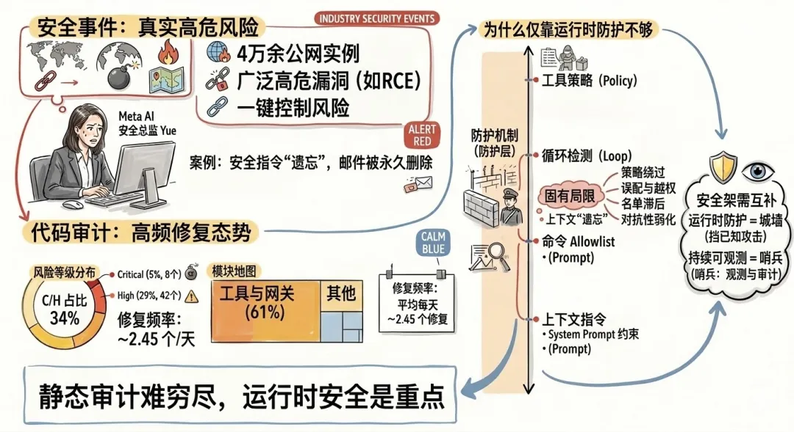

### 1.1 行业安全事件：风险不是假设，而是事实

OpenClaw 是 2026 年最受关注的开源 AI Agent 平台之一。它允许大语言模型直接操作文件系统、执行 Shell 命令、浏览网页、收发消息——将 LLM 的推理能力转化为真实的系统操作。这种"自主执行"能力是其核心价值，也是其核心风险。

2026 年初，多家安全厂商集中披露了一批 AI Agent 相关漏洞和事件：

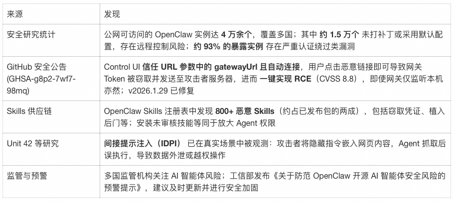

最具讽刺意味的案例来自 Meta 超级智能实验室的 AI 对齐总监 Summer Yue——一位职业敏感度高于 99% 用户的安全专家。她给 OpenClaw 下达了清理邮件的指令并明确设置了"未经批准不得操作"的限制，但在处理大量数据过程中，受限于大模型上下文窗口压缩机制，这条关键安全指令被"遗忘"了。最终，大量邮件被永久删除，连喊 3 次 STOP、跑去拔网线都已经来不及。

### 1.2 AI Agent 的攻击面

上述行业事件背后，是 AI Agent 天然宽广的攻击面：

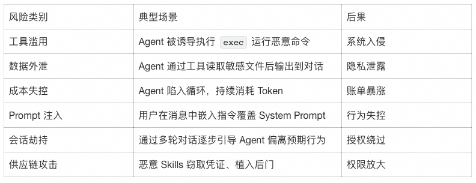

### 1.3 代码审计数据：攻击面的量化视角

行业报告说明了外部威胁态势。而对 OpenClaw 自身代码仓库的审计则揭示了另一个维度——项目本身在高频修复安全问题。通过基于 Git 历史与 commit message 的安全语义分析，可以量化一段时间内与安全相关的代码变更规模与分布，从而判断攻击面集中在哪些层次。

对 OpenClaw 最近 60 天（2026-01-05 至 2026-03-05）的 14,254 个 commits 进行筛选与分类，平均每天约 2.45 个安全修复，得到如下风险等级分布：

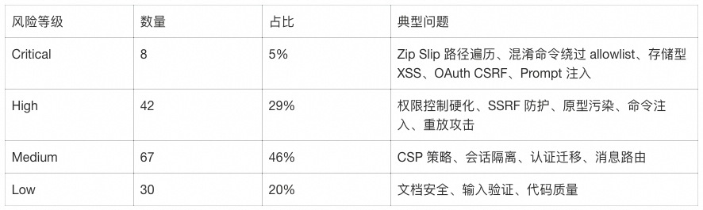

Critical 与 High 合计 50 个，约占明确安全修复的 34%。按代码模块分布，风险高度集中在入口与执行层：

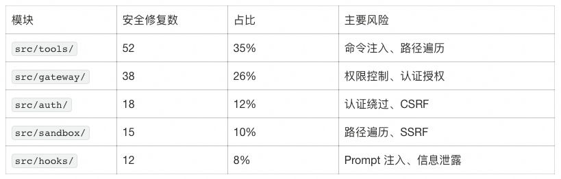

`tools/` 与 `gateway/` 两项合计 61%，对应 Agent 的"能执行什么"与"谁来调"两条主战线。

这些数据说明两件事：第一，OpenClaw 在代码层面持续投入安全修复，响应及时，说明项目在运行时安全上已有较好实践。第二，AI Agent 的攻击面天然宽广——工具执行层与网关层正是"自主操作"与"多入口接入"的代价所在；静态代码审计只能覆盖已提交的变更，无法穷尽运行时的行为变异、配置组合与外部输入驱动的攻击路径。

* * *

## 二、运行时防护的固有局限

OpenClaw 在架构上提供了多道预防性控制（Preventive Controls）：工具策略管道（Tool Policy Pipeline）在调用前做策略决策、Owner-only 封装对敏感操作做权限绑定、循环检测器识别无进展的会话、命令 allowlist/denylist 限制可执行命令集合。这些机制在正常配置下能有效缩小攻击面，但从安全工程角度看，它们属于同一信任域内的执行时校验，存在以下固有局限：

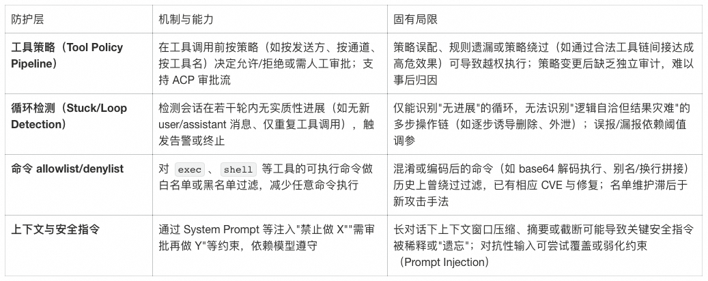

因此，运行时防护相当于"城墙"——能挡住绝大多数已知攻击路径，但无法保证配置永不出错、也无法覆盖未知绕过与逻辑性误用。 在安全架构上，需要与之互补的"哨兵"——用日志、指标与链路数据对 Agent 行为持续观测，在策略失效或遭遇新型攻击时及早发现并在影响扩大前响应。

* * *

## 三、可观测三支柱与全景架构

### 3.1 三支柱在 AI Agent 场景的映射

可观测性建立在 Logs + Metrics + Traces 三支柱之上。在 AI Agent 场景下，三者各自承担不同的观测职能，理解它们各自能回答什么问题，是后续搭建整套体系的基础：

  * Logs（Session 审计日志）：Agent 做了什么？调了哪些工具？传了什么参数？花了多少钱？

  * Logs（应用运行日志）：系统哪里出了问题？Webhook 失败、认证被拒、网关异常？

  * Metrics：现在花了多少钱？延迟正常吗？有没有会话卡死？

  * Traces：单条消息从接收到响应经历了哪些步骤？调用链如何串起来？

三支柱缺一不可：仅有 Metrics 无法回答"谁、因何"导致成本飙升；仅有 Session 日志无法从全局感知系统健康与异常拐点；仅有应用运行日志则看不到 Agent 的业务行为与工具调用序列。三者协同才能同时支撑安全审计、成本管控与运维排障。

### 3.2 数据 Pipeline

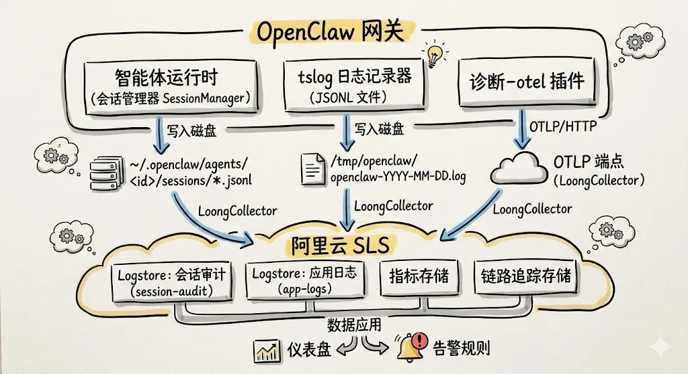

OpenClaw Gateway 内部存在三个独立的数据生产者：SessionManager 将每轮对话的完整结构化数据写入磁盘 JSONL 文件；tslog Logger 写应用运行日志；diagnostics-otel 插件通过 OTLP/HTTP 协议直接将 Metrics 与 Traces 推送到 OTLP 兼容后端。前两者通过日志采集器（如 LoongCollector、Filebeat、Fluentd 等）文件采集后转发到日志分析平台，后者直接对接任意支持 OTLP 协议的可观测后端。

### 3.3 数据源对照表

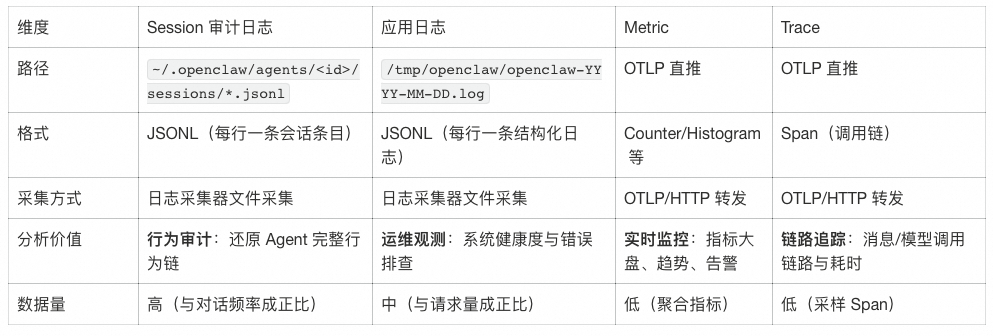

### 3.4 为什么选阿里云 SLS

阿里云日志服务（Simple Log Service, SLS）天然适合这个场景：

  * OTLP 友好接入：LoongCollector 原生支持 OTLP 协议，与 OpenClaw 的 `diagnostics-otel` 插件无缝对接，开箱即用

  * 算子丰富、查询灵活：内置多种加工与分析算子，对 Session 日志里的 JSON 嵌套字段（如 `message.content`、`message.usage.cost`）做解析、过滤、聚合很方便，写几条 SPL 就能做工具调用统计、成本归因、敏感模式匹配

  * 安全与合规能力：支持日志访问审计、RAM 权限管控、敏感数据脱敏与加密存储，满足审计留痕与合规要求；告警可对接钉钉、短信、邮件，便于安全事件及时响应

  * 日志分析一站式：「采集 → 索引 → 查询 → 仪表盘 → 告警」一条龙，小规模 Agent 日志量不大、按量计费成本低，流量上来也能自动弹性

* * *

## 四、Session 审计日志：行为链还原与威胁检测

Session 日志是 AI Agent 安全审计的核心数据源。它记录了每一轮对话、每一次工具调用、每一笔 Token 消耗——完整还原"Agent 到底做了什么"。

### 4.1 数据格式

每个会话对应一个 `.jsonl` 文件，每行是一个 JSON 对象，通过 `type` 字段区分条目类型。以下是一次典型的对话中产生的日志序列（以用户请求读取系统文件为例）：

用户消息

  *   *   *   *   *   *   *   *   *   *

    {  "type": "message",  "id": "70f4d0c5",  "parentId": "b5690259",  "message": {    "role": "user",    "content": [{ "type": "text", "text": "帮我读取 /etc/passwd 文件" }]  }}

`
`

Assistant 回复（含工具调用）

  *   *   *   *   *   *   *   *   *   *   *   *   *   *   *   *   *   *

    {  "type": "message",  "id": "3878c644",  "parentId": "70f4d0c5",  "message": {    "role": "assistant",    "content": [    {       "type": "toolCall", "id": "call_d46c7e2b...", "name": "read",       "arguments": { "path": "/etc/passwd" }     }],    "provider": "anthropic",    "model": "claude-4-sonnet",    "usage": { "totalTokens": 2350 },    "stopReason": "toolUse"  }}

`
`

工具执行结果

  *   *   *   *   *   *   *   *   *   *   *   *   *

    {  "type": "message",  "id": "81fd9eca",  "parentId": "3878c644",  "message": {    "role": "toolResult",    "toolCallId": "call_d46c7e2b...",    "toolName": "read",    "content": [{ "type": "text", "text": "root:x:0:0:root:/root:/bin/bash\n..." }],    "isError": false  }}

`
`

Assistant 最终回复（stopReason 为 stop，纯文本）

  *   *   *   *   *   *   *   *   *   *   *   *

    {  "type": "message",  "id": "a025ab9e",  "parentId": "81fd9eca",  "message": {    "role": "assistant",    "content": [{ "type": "text", "text": "文件 `/etc/passwd` 的内容如下（节选）：\n\nroot:x:0:0:..." }],    "usage": { "totalTokens": 12741, "cost": { "total": 0.0401 } },    "stopReason": "stop"  }}

`
`

从审计视角看，上面这段示例（一轮 user → assistant toolCall → toolResult → assistant stop）已经能回答几个关键问题：谁（user）让 Agent 做了什么（read 工具读 /etc/passwd），Agent 用了哪个模型（claude-4-sonnet），花了多少钱（$0.0401），结果是什么（成功读取了 /etc/passwd 内容）。

字段索引设计

对 Session 日志建立索引时，以下字段是审计分析的关键维度：

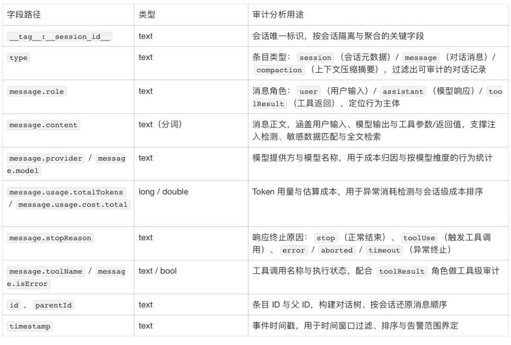

### 4.2 核心审计场景

#### 4.2.1 审计场景：敏感数据外泄检测

Agent 通过工具读取文件、执行命令后，返回内容会记录在 `toolResult` 条目中。如果返回内容中包含 API Key、AK、私钥、密码等敏感数据，意味着这些数据已经进入了 Agent 的上下文——可能被模型"记住"并在后续对话中泄露。

  *   *   *   *   *   *   *

    type: message and message.role : toolResult   | extend content = cast(json_extract(message, '$.content')  as array<json>)   | project content | unnest   | extend content_type = json_extract_scalar(content, '$.type'), content_text = json_extract_scalar(content, '$.text')   | where content_type = 'text' | project content_text   | where content_text like '%BEGIN RSA PRIVATE KEY%'or content_text like '%password%'or content_text like '%ACCESS_KEY%'or regexp_like(content_text, 'LTAI[a-zA-Z0-9]{12,20}')

`
`

#### 4.2.2 审计场景：Skills 调用审计

技能文件（如 `SKILL.md`）被 `read` 工具读取时，会在 Assistant 消息的 `content` 中以 `type: "toolCall"`、`name: "read"`、`arguments.path` 记录。可按路径统计哪些技能被调用、调用次数及最近调用时间，用于合规与使用分析。

  *   *   *   *   *   *   *   *

    type: message and message.role : assistant and message.stopReason : toolUse  | extend content = cast(json_extract(message, '$.content')  as array<json>)   | project content, timestamp | unnest   | extend content_type = json_extract_scalar(content, '$.type'), content_name = json_extract_scalar(content, '$.name'), skill_path = json_extract_scalar(content, '$.arguments.path')   | project-away content   | where content_type = 'toolCall'and content_name = 'read'and skill_path like '%SKILL.md'  | stats cnt = count(*), latest_time = max(timestamp) by skill_path | sort cnt desc

`
`

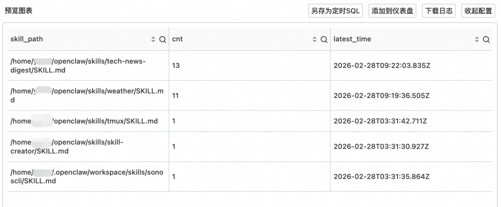

#### 4.2.3 审计场景：高危工具调用监控

OpenClaw 的工具权限体系（Tool Policy Pipeline + Owner-only 封装）已经在运行时做了管控，但可观测层应该独立于运行时防护进行监控——万一策略配置有误，可观测层是最后的发现机会。高危工具的定义按使用场景分为两类。

场景一：Gateway HTTP 默认禁止的工具

通过网关 `POST /tools/invoke` 调用时，以下工具默认拒绝，因为它们在非交互的 HTTP 面上风险过高或无法正常完成：

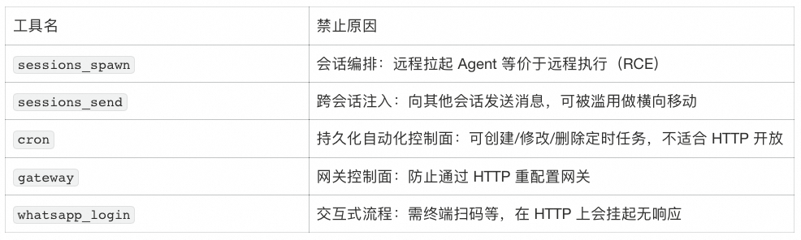

场景二：ACP 必须显式审批的工具

ACP（Automation Control Plane）是自动化入口，以下工具不允许静默通过，必须用户显式批准后再执行：

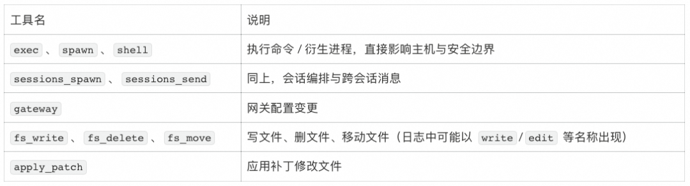

在 Session 日志中监控上述工具（及其在日志中的等价名称）的调用，可发现异常或越权行为；若某工具在 Gateway HTTP 场景下仍被调用成功，则可能存在配置绕过，需排查。

  *   *   *   *   *   *

    type: message and message.role : assistant and message.stopReason : toolUse  | extend content = cast(json_extract(message, '$.content')  as array<json>)   | project content, timestamp | unnest | extend content_type = json_extract_scalar(content, '$.type'), content_name = json_extract_scalar(content, '$.name'), content_arguments = json_extract(content, '$.arguments')   | project-away content   | where content_type = 'toolCall'and content_name in ('exec', 'write', 'edit', 'gateway', 'whatsapp_login', 'cron', 'sessions_spawn', 'sessions_send', 'spawn', 'shell', 'apply_patch')

`
`

#### 4.2.4 审计场景：成本分析

每条 Assistant 消息都携带 `usage`（含 `totalTokens`、`input`、`output`、`cacheRead`、`cacheWrite`）以及 `provider`、`model`。按 provider、model 汇总 totalTokens 可回答「用量花在哪了」；若上游提供 `usage.cost.total`，也可用同样方式按 provider、model 汇总做成本归因。

  *   *   *

    type: message and message.role : assistant   | stats totalTokens= sum(cast("message.usage.totalTokens" as BIGINT)), inputTokens= sum(cast("message.usage.input" as BIGINT)), outputTokens= sum(cast("message.usage.output" as BIGINT)), cacheReadTokens= sum(cast("message.usage.cacheRead" as BIGINT)), cacheWriteTokens= sum(cast("message.usage.cacheWrite" as BIGINT)) by "message.provider", "message.model"

> 关于费用数据： OpenClaw 原生不支持阶梯计费，仅按 inputTokens × input + outputTokens × output + ...估算单次调用费用。因此费用字段应视为成本估算的参考基线，而非精确账单。未配置 cost 的模型，费用列将为 0。

### 4.3 审计大盘设计方法论

上述查询覆盖了核心审计场景，但在日常安全运营中，逐条执行查询效率有限。将这些查询固化为仪表盘，可实现持续性的审计观测。以下是审计大盘的关键设计维度。

#### 4.3.1 安全审计统计概览

总览页应以指定时间窗口内的多维高危操作计数为核心，将 Agent 的安全态势压缩为一屏可读的风险快照。核心指标包括：高危命令执行数、网页请求外发数、命令行外发数、通信工具外发数、敏感文件访问数、提示词注入事件数，以及注入后的高危操作数。配合环比数据，帮助安全团队快速判断当前风险水位。

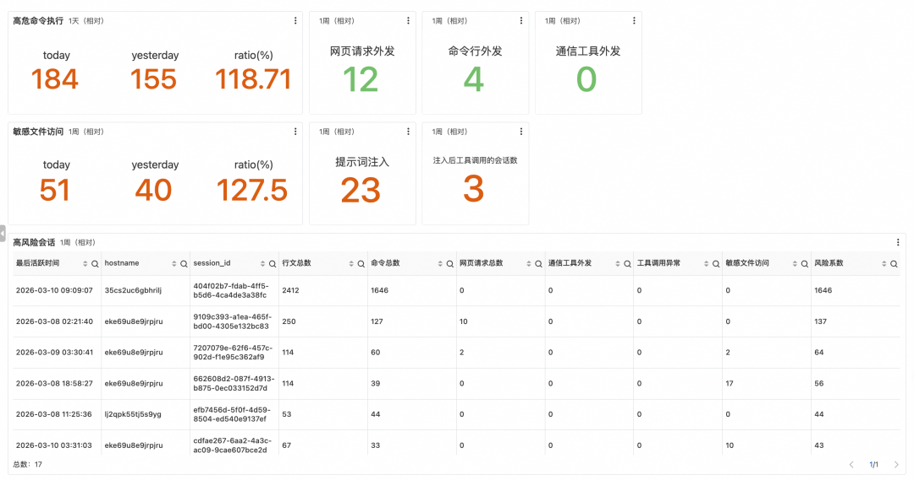

#### 4.3.2 Token 分析大盘

Token 消耗直接关联运营成本，且其波动往往是系统异常的早期信号。Token 分析大盘应包含以下维度：

  * 整体概览：今日 vs 昨日的 Token 与费用环比，日环比突破阈值（如 ±30%）是成本异常的第一道信号；

  * 按 Provider / Model 的时序趋势：按模型分色展示 Token 消耗与费用变化。Token 激增往往不只是成本问题——Prompt 注入导致上下文被恶意填充、工具调用陷入死循环、会话持续膨胀都会表现为曲线陡升；

  * 按会话与按主机的 Top 消耗：Agent 的成本分布呈长尾特征——少数会话占据绝大部分消耗，识别这些"头部会话"是成本优化的第一步；按主机/Pod 聚合则支持多实例部署下的成本分摊与风险定位；

  * 模型 Token 详情表：按模型列出 `totalTokens`、`inputTokens`、`outputTokens`、`cacheReadTokens`、`cacheWriteTokens` 及对应成本。其中 `inputTokens` 与 `outputTokens` 的比值反映 Agent 的交互模式（输入占比过高说明 Prompt 冗余），`cacheReadTokens` 占比直观体现缓存策略收益；

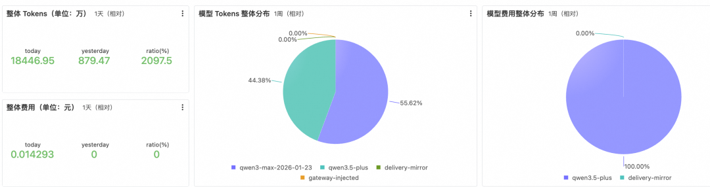

#### 4.3.3 行为分析大盘

行为分析大盘以会话为基本单位，回答"Agent 在当前时间窗口内做了什么"：

  * 会话统计：将工具调用按行为类型拆解为命令执行、后台进程、网页请求、通信工具、文件读写等维度，提供整体行为构成的快速快照。以 Session 为粒度展开，记录每个会话在各行为维度上的调用量，量级异常的 Session 值得优先审查

  * 工具调用量与错误分析：工具调用时间线按工具类型分色展示调用频次构成，异常尖峰是排查问题的第一入口。错误率趋势图与调用量时间线共享时间轴——错误率高峰不一定与调用量高峰重合，两者的时间差往往能揭示问题的真实来源

  * 外部交互：记录 Agent 发起的所有对外行为（API 调用、网页访问、消息发送、邮件外发），按会话、工具名与交互类型分类。外部交互既是完成任务的必要手段，也是潜在的风险出口

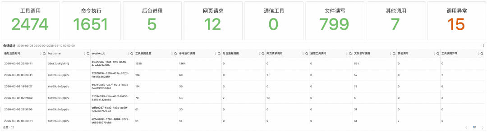

* * *

## 五、应用日志：系统运行状态与安全事件

应用日志的角色不同于 Session 日志。Session 日志记录的是 Agent 做了什么（面向审计），应用日志记录的是系统运行状态（面向运维）——Gateway 是否正常启动？Webhook 有没有报错？消息队列是否堆积？

### 5.1 数据格式

OpenClaw Gateway 使用 tslog 库写结构化 JSONL 日志：

  *   *   *   *   *   *   *   *   *   *   *   *   *   *   *

    {  "0": "{\"subsystem\":\"gateway/channels/telegram\"}",  "1": "webhook processed chatId=123456 duration=2340ms",  "_meta": {    "logLevelName": "INFO",    "date": "2026-02-27T10:00:05.123Z",    "name": "openclaw",    "path": {      "filePath": "src/telegram/webhook.ts",      "fileLine": "142"    }  },  "time": "2026-02-27T10:00:05.123Z"}

`
`

关键字段：

  * `_meta.logLevelName`：日志级别（`TRACE` / `DEBUG` / `INFO` / `WARN` / `ERROR` / `FATAL`）；

  * `_meta.path`：源码文件路径和行号，用于精确定位；

  * 数字键 `"0"`：JSON 格式的 bindings，通常含 `subsystem`（如 `gateway/channels/telegram`）；

  * 数字键 `"1"` 及后续：日志消息文本；

日志文件按天滚动（`openclaw-YYYY-MM-DD.log`），24 小时自动清理，单文件上限 500 MB。

索引设计

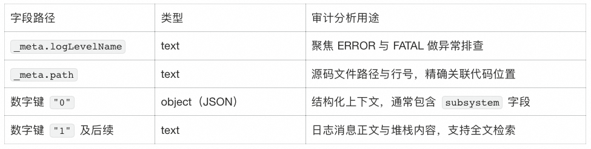

### 5.2 按子系统的错误聚合分析

应用日志以异常级别（WARN、ERROR、FATAL）和子系统为维度做聚合，可方便看出哪类异常集中在哪个组件：

  *   *   *   *   *

    _meta.logLevelName: ERROR or _meta.logLevelName: WARN or _meta.logLevelName: FATAL  | project subsystem = "0.subsystem", loglevel = "_meta.logLevelName"  | stats cnt = count(1) by loglevel, subsystem   | sort loglevel

`
`

### 5.3 典型安全审计场景

场景一：WebSocket 未授权连接

WebSocket 连接在鉴权阶段被拒绝时会打 WARN，便于发现 token 错误、过期或伪造导致的未授权访问。

  *   *   *   *   *   *

    {  "0": "{\"subsystem\":\"gateway/ws\"}",  "1": "unauthorized conn=e32bf86b remote=127.0.0.1 client=openclaw-control-ui webchat vdev reason=token_mismatch",  "_meta": { "logLevelName": "WARN", "date": "2026-02-27T07:46:20.727Z" }}

`
`

审计关注点：`subsystem: gateway/ws` 表示来自 WS 层；消息正文中 `conn=` 为连接 ID，`remote=` 为客户端 IP，`reason=token_mismatch` 表示 token 不匹配。同一 remote 在短时间大量 unauthorized 可能为撞库或盗用尝试。

场景二：HTTP 工具调用被拒或执行失败

`POST /tools/invoke` 的失败日志可发现谁在尝试执行被禁止的高危工具、或执行时触发的权限/沙箱异常。

  *   *   *   *   *   *

    {  "0": "{\"subsystem\":\"tools-invoke\"}",  "1": "tool execution failed: Error: EACCES: permission denied, open '/etc/shadow'",  "_meta": { "logLevelName": "WARN", "date": "2026-02-27T10:00:07.000Z" }}

`
`

`subsystem: tools-invoke` 可快速筛出此类事件；消息正文中的异常类型（如 EACCES、ENOENT）可区分"越权访问敏感路径"与"配置/路径错误"。

场景三：连接/请求处理失败

连接重置、解析错误等可暴露异常客户端行为、畸形请求或中间人干扰。

  *   *   *   *   *   *

    {  "0": "{\"subsystem\":\"gateway\"}",  "1": "request handler failed: Connection reset by peer",  "_meta": { "logLevelName": "ERROR", "date": "2026-02-27T10:00:08.000Z" }}

  *   *   *   *   *   *

    {  "0": "{\"subsystem\":\"gateway\"}",  "1": "parse/handle error: Invalid JSON",  "_meta": { "logLevelName": "ERROR", "date": "2026-02-27T10:00:08.100Z" }}

「Connection reset by peer」多为对端断开或网络中断，集中爆发疑似扫描或 DoS；「Invalid JSON」表示请求体非法，可能是恶意构造的畸形包。

场景四：设备权限升级

设备配对与权限升级会留下完整的审计迹：谁、从何角色/权限、升级到何角色/权限、来自哪 IP、何种认证方式。

  *   *   *   *   *   *   *   *

    {  "0": "{\"subsystem\":\"gateway\"}",
      "1": "security audit: device access upgrade requested reason=role-upgrade device=abc-123 ip=192.168.1.1 auth=token roleFrom=[ ] roleTo=owner scopesFrom=[ ] scopesTo=[...] client=control conn=conn-1",
      "_meta": { "logLevelName": "WARN", "date": "2026-02-27T10:00:09.000Z" }}

roleTo=owner 表示从无角色升为 owner，属高敏感操作。同一 IP 或同一 device 在非工作时间频繁升级应优先排查。

场景五：FATAL 与核心异常

FATAL 表示核心功能不可用，可能由配置被篡改、依赖失效或严重运行时错误导致。若 FATAL 伴随「bind」「config」「listen」等关键词，需优先排查暴露面与配置一致性。建议配置实时告警（如每分钟 `cnt > 0` 即推送），确保第一时间响应。

* * *

## 六、OTEL 遥测：实时监控与告警

Session 日志和应用日志以事件与审计迹为主，适合按条件检索与事后归因。若要掌握聚合指标、趋势与请求链路——成本/用量趋势、会话健康度、单次请求的耗时与依赖——需要借助 OTEL 的 Metrics 与 Traces，与日志一起构成完整的可观测能力。

### 6.1 接入配置

OpenClaw 内置了 `diagnostics-otel` 插件，支持通过 OTLP/HTTP (Protobuf) 协议导出 Metrics、Traces 和 Logs。

启用插件

执行命令` openclaw plugins enable diagnostics-otel`启动插件，通过 openclaw plugins list 命令查看插件状态，预期状态为 loaded。

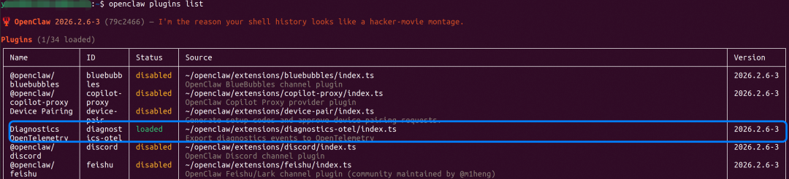

配置 `~/.openclaw/openclaw.json`

  *   *   *   *   *

    {  "plugins": {    "allow": ["diagnostics-otel"],    "entries": {      "diagnostics-otel": { "enabled": true }    }  },  "diagnostics": {    "enabled": true,    "otel": {      "enabled": true,      "endpoint": "<YOUR_OTLP_ENDPOINT>",      "protocol": "http/protobuf",      "headers": {        "Authorization": "Bearer <YOUR_TOKEN>"      },      "serviceName": "openclaw-gateway",      "traces": true,      "metrics": true,      "logs": false,      "sampleRate": 1.0,      "flushIntervalMs": 60000    }  }}

`
`

### 6.2 导出的指标与 Span

OpenClaw 通过 OTEL 导出的数据覆盖四个观测维度：

成本与用量指标

与 LLM 调用成本直接相关，是费用管控的核心。通过监控 token 消耗、估算费用、运行耗时和上下文占用，可掌握每次模型调用的成本，发现配置不当或使用低效导致的浪费。

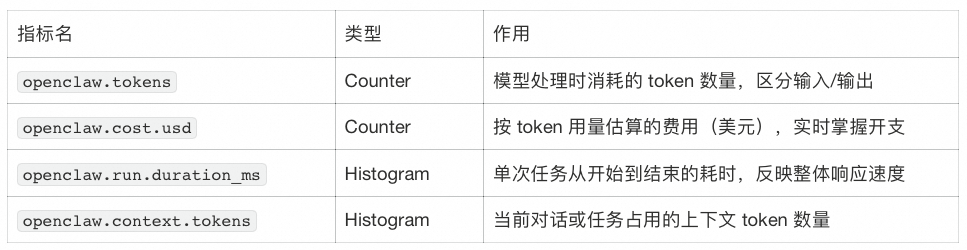

`openclaw.cost.usd` 仅在上游 `model.usage` 事件提供 `costUsd` 时才会产生数据。

Webhook 处理指标

Webhook 是 OpenClaw 与外部系统交互的重要入口。监控收到的请求量、错误次数和处理耗时，可及时发现外部调用异常，保障对接稳定。

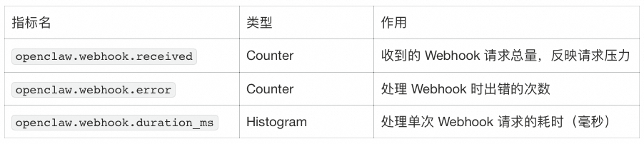

消息队列指标

消息队列是任务处理的中转站。关注入队/出队数量、队列深度和等待时间，可判断系统是否拥堵、任务是否积压，便于调整资源或排查瓶颈。

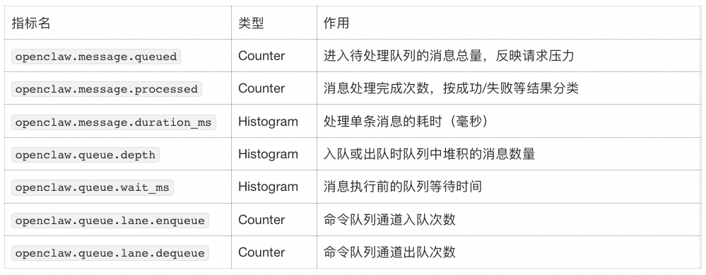

会话管理指标

会话状态变化与卡住会话数量反映交互健康度。监控卡住、重试等指标可快速发现陷入死循环或异常状态的对话，提升可观测与排障效率。

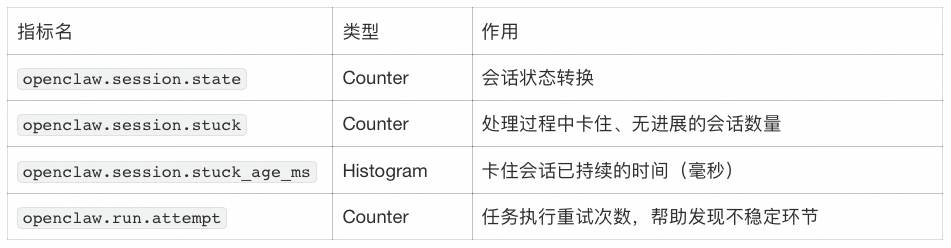

Trace Span

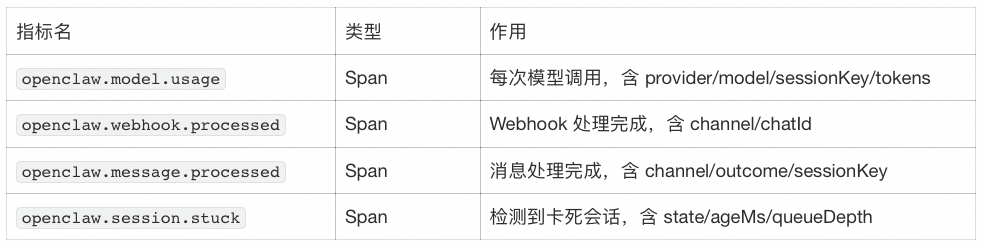

### 6.3 基于指标的告警与分析

场景：用量与成本分布

回答：用量与钱主要花在哪些模型、哪些 Provider？近期 Token 消耗趋势是否正常、有无突然飙升？按模型或 Provider 的累计用量如何排名？Token 增速异常时，可结合 Session 日志做进一步分析。

  *   *   *   *   *   *   *   *   *

    # Token 消耗增速（可设告警：如超过 N tokens/min）sum(rate(openclaw_tokens[10m]))
    # Token 消耗趋势（按模型）sum(rate(openclaw_tokens[5m])) by (openclaw_model)
    # 累计 Token（按 Provider）sum(openclaw_tokens) by (openclaw_provider)

`
`

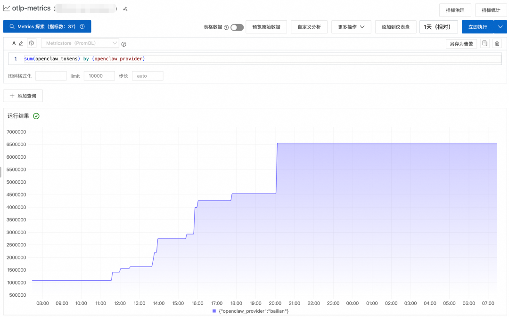

场景：会话卡死与执行过长

回答：当前是否存在卡死、无进展的会话？卡死发生的频率与时段如何？单次 Agent 执行耗时（P95/P99）是否超过预期、是否有长尾？

  *   *   *   *   *   *

    # 卡死会话（告警：> 0）sum(rate(openclaw_session_stuck[5m]))
    # 执行耗时 P95（告警：如 > 5 分钟）histogram_quantile(0.95, sum(rate(openclaw_run_duration_ms_bucket[5m])) by (le))

`
`

场景：Webhook 错误率与处理延迟

回答：各通道 Webhook 的请求量与错误次数如何、错误率是否在可接受范围？单次 Webhook 处理耗时与 Agent 执行耗时的分位数（P95/P99）是否恶化？按通道或按模型的延迟分布有何差异？错误率或延迟异常时，可结合应用日志按 Webhook 子系统查具体错误。

  *   *   *   *   *   *   *   *   *

    # Webhook 错误率（告警：如 > 5%）sum(rate(openclaw_webhook_error[5m])) / sum(rate(openclaw_webhook_received[5m]))
    # 执行耗时 P99（按模型）histogram_quantile(0.99, sum(rate(openclaw_run_duration_ms_bucket[5m])) by (le, openclaw_model))
    # Webhook 处理耗时 P95（按通道）histogram_quantile(0.95, sum(rate(openclaw_webhook_duration_ms_bucket[5m])) by (le, openclaw_channel))

`
`

场景：队列积压与等待时间

回答：各队列通道（lane）的深度与入队/出队速率是否健康？任务在队列中的等待时间（P95/P99）是否拉长、是否存在积压趋势？哪些 lane 最容易出现拥堵？便于在用户体感变差前发现瓶颈并调整资源。

  *   *   *   *   *   *

    # 队列深度（按 lane）histogram_quantile(0.95, sum(rate(openclaw_queue_depth_bucket[5m])) by (le, openclaw_lane))
    # 队列等待时间 P95（按 lane）histogram_quantile(0.95, sum(rate(openclaw_queue_wait_ms_bucket[5m])) by (le, openclaw_lane))

`
`

* * *

## 七、多源联动：从异常发现到根因定位

前面我们基于可观测数据介绍了数据的接入、内置大盘与自定义探索，在实际运维与审计中，可观测数据之间并非孤立使用，而是遵循一个固定的协作模式，逐层收敛、互相印证：

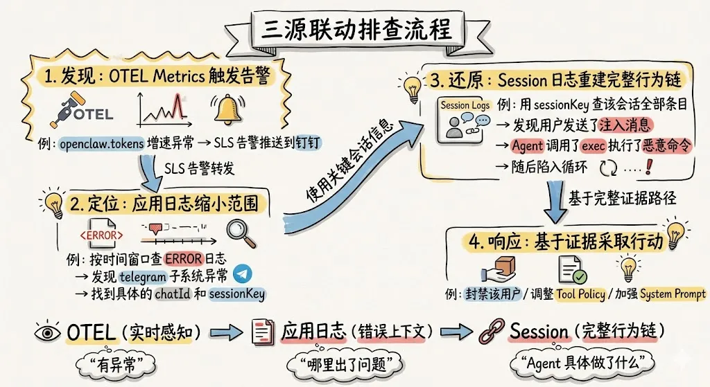

OTEL Metrics → 应用日志（错误上下文）→ Session 审计日志（完整行为链）。典型排查路径如下：OTEL 指标发现异常（如延迟飙升、Token 激增、错误率突增）；随即在应用日志中定位对应时间窗口的错误详情（Webhook 超时、认证失败、网关异常）；最后下钻到 Session 审计日志，还原该会话的完整工具调用序列、模型交互内容与成本消耗，确认根因并留存审计证据。

* * *

## 八、总结

回答「你的 AI Agent 真的在受控运行吗？」需要同时回答四件事：谁在触发调用、花了多少钱、做了哪些操作（尤其是高危工具）、行为是否可追溯、可审计。

行业安全报告和 OpenClaw 自身的代码审计数据都表明，AI Agent 的攻击面天然宽广——60 天内 147 次安全修复，`tools/` 和 `gateway/` 模块合计占比 61%；公网暴露实例超 4 万、恶意 Skills 达 800+、间接提示注入已在真实场景中被观测到。运行时防护（工具策略、循环检测、命令过滤等）不可或缺，但仅靠防护不足以声称受控——策略误配、规则遗漏、上下文压缩导致安全指令被"遗忘"等问题，决定了必须建立持续可观测体系，用数据回答上述问题。

本文以 OpenClaw 为案例，系统拆解了 AI Agent 可观测体系的三条核心数据管道：

  * Session 审计日志回答「Agent 做了什么、花了多少」，通过敏感数据外泄检测（漏斗式分析）、Skills 调用审计（攻击面视角）、高危工具监控（独立于运行时防护）、提示词注入检测（注入后高危操作关联）、成本归因五大审计场景，以及安全审计、Token 分析、行为分析三类审计大盘，实现可视化的持续观测

  * 应用日志回答「系统哪里异常」，通过 WebSocket 未授权连接、HTTP 工具调用失败、连接/请求异常、设备权限升级、FATAL 核心异常五类安全审计场景覆盖网关层面的风险信号

  * OTEL 指标与链路回答「当前状态与耗时」，通过 Token 消耗增速、会话卡死、Webhook 错误率、队列积压等指标实现实时告警

实践中，三条管道应协同使用：由 OTEL 告警发现异常，用应用日志缩小范围、定位子系统与会话，再用 Session 日志还原完整行为链并采取响应措施。只有三源联动，才能从「有异常」到「哪里出了问题」再到「Agent 具体做了什么」形成可查证的审计与运维闭环——这是 AI Agent 从"能用"走向"可信赖"的必经路径。
