# 借助 AI Coding 快速打造 AI Agent 系统

> **公众号**: 阿里云开发者  
> **发布时间**: 2026-02-09 08:30  


## 一、前言

在AI驱动的电商运营时代，如何让运营同学通过自然语言快速生成个性化购物场景，并自动关联优质商品搭建会场，成为提升运营效率的关键问题。购物场景生成AI Agent应运而生，通过智能化的场景生成和商品匹配，让运营可以用一句话，就能自动生成包含场景标题、描述、一二级标签的完整购物场景，并智能查询热点知识库，关联相关商品，对商品进行信息补全和相关性过滤，最终快速对接会场搭建来产出一个完整的场景导购会场。

然而，随着业务复杂度的提升和技术栈的演进，原有基于低代码的流程编排方案逐渐暴露出扩展性和灵活性的瓶颈。因此我们启动了向 LangGraph + Agent Skills + A2A + MCP 工程方案的技术迁移，并借助 AI Coding 工具的力量，在几天时间内完成了整个 Agent 系统的重构和上线，实现了从"单体流程编排"到"模块化技能体系 + 智能规划 + 标准化协议互联"的全方位架构跃迁。

## 二、项目背景与挑战

### 2.1 业务需求

当运营同学输入一句自然语言描述后，系统需要理解其购物场景意图，识别关键的品类和属性，生成结构化的场景数据，然后基于场景的一级标签生成二级标签关键词，使用二级标签调用商品搜索获取匹配商品，最终输出可直接用于建立会场模版的完整数据结构。这个过程涉及多个AI模型的协同工作：意图理解模型需要准确识别用户的购物场景需求，场景生成agent要创造出吸引人的标题、文案和标签，商品匹配则要确保推荐的商品与场景高度相关。更重要的是，整个流程需要支持多轮交互，运营可能会基于初次生成的结果进行调整和优化，系统必须能够理解上下文并进行相应的修改，这个过程涉及多个 AI 模型的协同工作：

我们需要构建一个AI Agent，核心功能包括：

1\. 多轮对话交互：用户可以多轮对话逐步完善购物场景需求；

2\. 意图识别&智能内容生成：识别用户购物场景创建需求，基于LLM生成个性化消费场景，场景标签；

3\. MultiAgent协作：A2A对接包含商品信息补全Agent、商品相关性过滤Agent等，确保场景商品的丰富度和精准度；

4\. MCP协议和RAG集成：通过标准化的Model Context Protocol连接外部工具（商品搜索、缓存写入），实现工具调用的解耦与复用，RAG查询热点知识库、URL内容提取与二创等，确保生成内容紧跟潮流；

5\. 持久化：存储用户生成的场景和商品、支持对接会场搭建、存储工作流状态等；

6\. 企业级部署：支持多机部署，日志查询，trace追踪等。

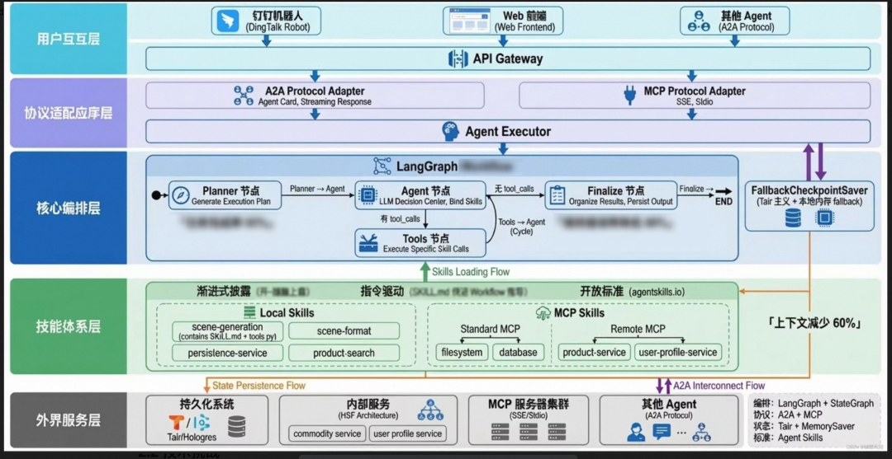

### 2.2 技术挑战

1\. 复杂状态管理：多轮对话场景下，需要在跨机器的环境中维护复杂的上下文状态，同时控制Token消耗和避免上下文污染。

2\. 异构协议融合：无缝集成MCP、HSF（内部RPC）、HTTP等多种异构服务协议，解决鉴权、序列化和错误处理的差异。

3\. Agent Skills 扩展：如何定义标准化的 Agent 技能接口，使得工具调用更加灵活、可组合和可复用。

4\. MultiAgent通信协作：实现主Agent与商品补全、过滤等子Agent之间的高效通信和状态同步，确保多智能体协同工作的一致性。

5\. 工程化落地鸿沟：从单机Python应用到TPP平台部署的迁移，面临环境隔离、依赖冲突、并发适配等挑战。

6\. 不确定性控制：如何让 Agent 具备自主规划能力，在复杂的多步骤任务中不遗漏关键环节，避免顺序混乱，在强业务规则约束下（如必须包含特定标签、商品数量限制），如何有效控制LLM的幻觉，确保输出结果的结构化和准确性。

7\. 未来扩展性：借助LangGraph未来支持扩展更多Agent特性

原有的流程编排低代码平台在项目初期确实帮助我们快速验证了业务可行性，通过可视化的流程编排，我们能够将各个AI组件连接起来形成完整的处理链路。但随着业务逻辑的复杂化，低代码方案的局限性开始显现：复杂的条件分支难以用图形化方式清晰表达，错误处理和异常恢复机制不够灵活，性能优化空间有限，更重要的是，当需要与企业内部的各种服务系统进行深度集成时，低代码平台的扩展能力显得力不从心。

## 三、核心架构升级

面对挑战，我们构建了基于 LangGraph 的新一代 Agent 架构，重点增强了技能体系、智能规划、知识检索和标准协议支持。下面将详细阐述每个核心组件的设计理念、实现细节和创新点。

### 3.1 LangGraph 的核心优势

LangGraph是LangChain团队开发的用于构建AI Agent的框架。它的思想是：将AI Agent的执行过程抽象为一个有向图。专注于构建有状态、可控制的AI智能体的框架，它通过图形化结构定义智能体交互流程，使开发者能够创建复杂、可靠的AI应用。

LangGraph的核心优势在于它将复杂的AI工作流抽象为有向图结构，每个节点负责特定的处理逻辑，节点间通过共享状态进行数据传递。这种设计不仅让代码结构更加清晰，也为并行处理、错误重试、状态持久化等高级特性提供了天然的支持。对于我们的场景购项目，这意味着可以将意图识别、场景生成、商品搜索等步骤解耦为独立的节点，既保持了逻辑的清晰性，又获得了更好的可测试性和可维护性。

在工具集成方面，LangGraph天然支持MCP等标准化协议，这意味着我们可以轻松接入各种外部工具和服务。未来当需要集成新的AI能力时，比如图像生成、或者专业领域的知识库，都可以通过MCP协议进行标准化接入，而无需修改核心的工作流逻辑。这种插件化的扩展方式让系统具备了应对未来技术发展的灵活性。

在AI推理模式方面，LangGraph支持多种先进的Agent架构模式。我们可以在现有的链式推理基础上，轻松扩展支持ReAct模式，让AI在执行过程中能够基于中间结果动态调整后续的行动策略。比如当系统发现用户的需求比较模糊时，可以主动提出澄清性问题；当商品搜索结果不理想时，可以自动调整搜索策略或者扩展搜索范围。这种自适应的推理能力将让场景生成变得更加智能和精准。

  * 循环与记忆：天然支持多轮对话的循环结构，通过 Checkpointer 实现持久化记忆。Agent 可以在中断后恢复执行，用户的每一轮对话都能基于完整的历史上下文。

  * 细粒度控制：开发者可以精确控制每一步的跳转逻辑，实现 Human-in-the-loop（人机回环）确认机制。例如，在提交重要操作前，可以暂停工作流等待用户确认。

  * 状态共享与隔离：通过 TypedDict 定义的 State，可以在不同节点间共享数据，同时避免全局变量污染。

  * 条件分支：支持基于 LLM 输出或业务规则的动态路由。例如，根据 LLM 是否返回 tool_calls 来决定下一步是执行工具还是结束流程。

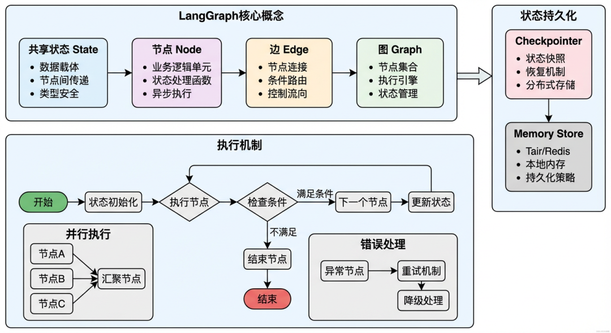

### 3.2 Agent Skills：标准化的能力封装

Agent Skills 是本次架构升级的核心。我们将 Agent 的能力模块化为一个个独立的 Skill，每个 Skill 负责一个特定领域的功能，通过标准接口对外暴露，采用渐进式披露的思想，优化上下文，提高复用性。

在旧版 Agent 中，所有工具（Tools）平铺在一个列表里：

  *   *   *   *   *   *   *   *   *   *   *   *

    # 传统做法：多个工具混在一起tools = [    generate_scene_blueprint,    process_scene_blueprint,    generate_scene_tags,    search_products,    filter_products,    enrich_products,    format_output,    ...  ]

存在的问题：

1\. 难以管理：工具数量多时，难以找到特定功能的工具。

2\. 重复开发：多个 Agent 需要类似功能时，工具代码被重复实现。

3\. 职责不清：工具之间的依赖关系不明确，容易出现调用顺序错误。

4\. 协议异构：本地函数、远程 API、MCP 服务混杂，调用方式不统一。

Skills 体系的解决方案： 将工具按照业务领域分组，每组形成一个 Skill：

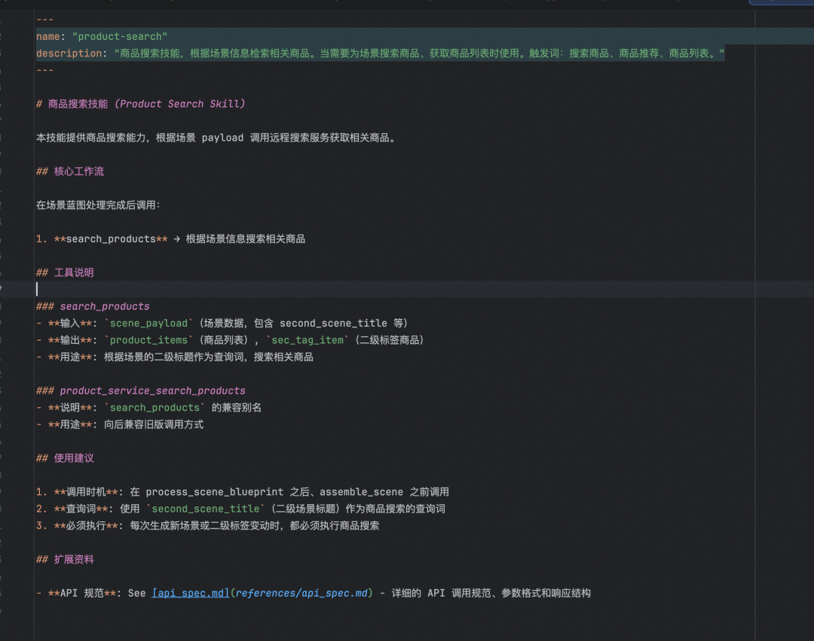

  *   *   *   *   *   *   *   *   *   *   *   *   *   *   *   *   *

    app/skills/├── scene-generation/      # 场景生成技能（Skill）│   ├── SKILL.md          # 元数据：Skill 名称、描述、使用说明│   ├── script/             # 脚本│   └── references/       # 领域知识：如场景设计规范、Few-shot 示例├── product-service/       # 商品服务技能（Skill）│   ├── SKILL.md│   ├── script/             # 脚本│   └── references/      # 领域知识：如选品规则、过滤逻辑说明├── persistence-service/   # 持久化技能（Skill）│   ├── SKILL.md│   ├── script/             # 脚本│   └── references/ ├── scene-format/          # 格式化技能（Skill）│   ├── SKILL.md│   ├── script/             # 脚本│   └── references/

在应用启动时，通过 SkillLoader 自动扫描并加载所有 Skills的元信息，拼接到规划Agent的prompt上。

Skills 体系的核心价值：

1\. 动态扩展：新增 Skill 只需在 `app/skills/` 目录下添加文件夹，无需修改 Agent 代码

2\. 职责清晰：每个 Skill 的 SKILL.md 文档明确了其包含的 Tools 及职责和用法

3\. 可复用：多个 Agent 可以共享相同的 Skills

4\. 可测试：每个 Skill 内的 Tools 可以独立测试

5\. 渐进式披露（Progressive Disclosure）：通过三层架构解决上下文爆炸问题

  * Layer 1 元数据：Agent 初始只加载 Skill 的 `name` 和 `description`

  * Layer 2 技能主体：当 Agent 决定使用某 Skill 时，动态加载完整指令

  * Layer 3 附加资源：具体的脚本或参考文档仅在执行时按需加载

****

### 3.3 Planner：让 Agent 具备"全局规划"能力

在复杂的场景生成任务中，Agent 需要执行 8-10 个步骤才能完成。传统的 ReAct 模式是"边做边想"，容易出现步骤遗漏或顺序混乱。我们引入的 Planner 节点让 Agent 具备了"先规划再执行"的能力。

#### 3.3.1 为什么需要 Planner？

传统 ReAct 模式的问题：

  *   *   *   *   *   *

    用户: "生成一个冬日红豆年糕汤场景"Agent: [调用 generate_scene_blueprint]Agent: [调用 generate_scene_tags]Agent: [调用 assemble_scene]Agent: "场景生成完成！"  ❌ 遗漏了商品搜索和持久化步骤

在我们的实际测试中，传统 ReAct 模式生成结果的不可用比例太高。

Planner 的解决方案：

在执行任务前，先生成一个完整的执行计划。核心设计理念是：Planner 输出的是计划 Plan和要用到的 Skill（技能），然后系统根据 Skill 把对应的 Tool 动态加载到 LLM 上。

这种设计的优势在于：

  * 按需加载：只有当 Planner 规划出需要某个 Skill 时，该 Skill 下的 Tools 才会被加载到上下文中，避免了一次性加载所有 Tools 导致的上下文膨胀

  * 领域聚焦：每个 Skill 封装了一组相关的流程和 Tools，Planner 只需要思考"需要哪些能力"，而不是"需要调用哪个具体函数"

  * 灵活扩展：新增 Skill 不影响现有流程，Planner 会自动发现并在合适的场景使用

  *   *   *   *   *   *   *   *   *   *   *   *   *   *   *

    PLANNER_PROMPT = """你是场景导购任务规划器。请先生成一个结构化的执行计划。
    输出严格为 JSON 数组，每个元素包含以下字段：{  "step": "步骤名称",  "skill": "需要激活的 Skill 名称（如 scene-generation、product-service）",  "inputs": "该步骤需要的关键输入字段",  "expected": "该步骤预期产出"}
    规划约束：1) 必须覆盖：生成蓝图 -> 处理蓝图 -> 标签生成 -> 组装 -> 格式化输出 -> 持久化2) 需要加入商品搜索步骤（使用 product-service Skill）3) 最后一定要包含持久化步骤（使用 persistence-service Skill）

生成的计划会被注入到主 Agent 的 System Prompt 中，作为"参考手册"。

执行流程：

  * Planner 分析用户需求，输出需要的 Skill 列表（如 `scene-generation`、`product-service`）；

  * 系统根据 Skill 列表，动态加载对应的 参考文档和相关的Tools 到 LLM 的可用工具集中；

  * LLM 在执行每个步骤时，只能看到当前 Skill 相关的 Tools，保持上下文精简；

关键发现：

1\. Planner 显著减少了步骤遗漏，尤其是容易被忽略的持久化步骤；

2\. 有计划的 Agent 执行的步骤更完整；

3\. 顺序混乱大幅减少，因为 Planner 提供了逻辑顺序的指导；

## 四、具体实现-AI Coding加速开发实践

****

### 4.1 AI Coding工具选型

基于实际使用经验，我们采用了双工具协同的策略：

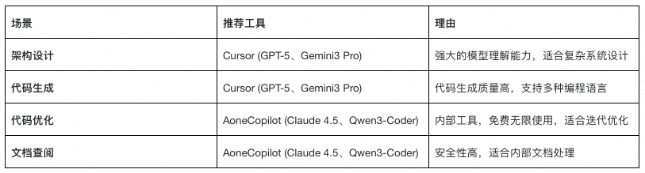

面对快速完成迁移的紧迫时间线，我决定充分利用AI Coding工具来加速开发过程。在工具选择上，我选择采用了Cursor和AoneCopilot相结合的策略：Cursor负责复杂的系统架构设计和核心代码生成，AoneCopilot则承担日常的代码优化和调试任务，同时使用AoneCopilot方便查阅内部文档保障信息安全。

为了保证迁移后功能的一致性，我决定根据线上流程编排平台导出的DSL文件复现LangGraph工程，从 DSL（领域特定语言）工作流定义转换为可执行的 Python 代码，然后进行进一步的架构升级和扩展。

  * Cursor：负责复杂的系统架构设计、DSL 到 LangGraph 的核心代码转换、Agent Skills 的脚手架生成等。

  * AoneCopilot：负责内部私有协议的代码补全、文档查询和代码优化等。

### 4.2 DSL驱动的迁移策略

大致的工作流程如下：

1.根据线上原有的流程编排，导出dsl的yaml文件，DSL (Domain Specific Language) 领域特定语言，指原有低代码/零代码平台用于描述业务流程的配置语言，通常以JSON或YAML格式存在。它定义了节点（Nodes）、边（Edges）、条件分支（Branches）以及每个节点的配置参数（如Prompt、模型参数等），是业务逻辑的“数字蓝图”。它连接“旧系统”与“新LangGraph工程”的桥梁，保证了业务逻辑迁移的准确性，避免了人工重新梳理逻辑的遗漏。

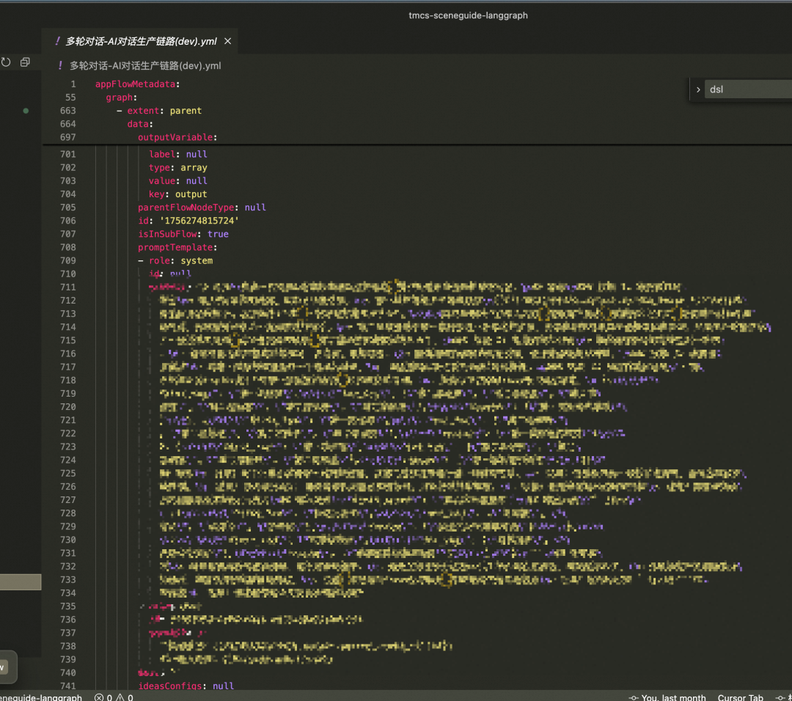

2.根据文档和dsl设计项目架构，这一步至关重要，AI需要结合两类信息：一是DSL中的业务流程逻辑（有哪些节点、如何跳转），二是新平台的技术规范（TPP平台的接口要求、LangGraph的图结构定义）。通过AI的分析，将线性的或树状的DSL结构映射为LangGraph的有向循环图（Graph），并设计出符合架构的工程目录结构，确定State状态对象的字段定义，为后续的代码生成打下坚实的地基。

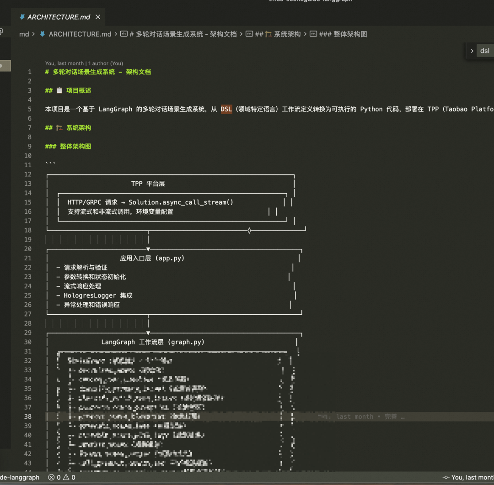

### 4.3 AI Coding工具使用策略详解

#### 4.3.1 知识库准备（提供给AI查询）、AI提示工程优化策略、Rule限制

  * 知识库文档

在项目目录新建doc文件夹，将项目需要查阅的文档集中存放在里面标明每个文档的名称方便AI自主查询。

Markdown准备材料清单：

✅ TPP Python平台文档

✅ HSF服务接口文档和调用示例

✅ LangGraph官方文档和最佳实践

✅ Hologres/Tair API文档和配置说明

✅ 内部模型服务（IdeaLAB API）接口文档

✅ 根据dsl生成LangGraph代码的提示词模版

✅ 生成的技术方案文档、架构设计文档

······等等

文档类型| AI工具选择| 查询策略
---|---|---
内部API文档| AoneCopilot| 内部文档安全查询
开源文档| Cursor| 利用强大模型理解复杂技术文档
代码示例| 混合使用| 代码生成用Cursor，代码优化用AoneCopilot

  * AI提示工程优化

Markdown高效AI协作的提示模板：

1. 代码生成提示：

"基于现有的 [具体文件名] 实现，为新的DSL节点 [节点类型] 生成Python代码，

需要保持相同的错误处理模式、日志记录格式和异步调用风格"

2. 调试优化提示：

"以下是运行日志 [粘贴日志/日志文件]，请分析性能瓶颈并给出具体的代码优化建议，

重点关注 [具体问题点]"

3. 架构设计提示：

"基于现有项目架构 [架构文档]，为新需求 [具体需求] 设计实现方案，

保持架构一致性和可扩展性"

  * 根据DSL文件生成代码的提示词

  *   *   *   *   *   *   *   *   *   *   *   *   *   *   *   *   *   *   *   *   *   *   *   *   *   *   *   *   *   *   *   *   *   *   *   *   *   *   *   *   *   *   *   *   *   *   *   *   *   *   *   *   *   *   *   *   *   *   *   *   *   *

    # DSL到LangGraph代码转换：AI Coding提示词指南
    本文档旨在指导AI Coding工具如何理解DSL（YAML格式）文件，并将其转换为LangGraph Python工程代码。通过本指南，AI工具能够自动化完成从DSL到Python实现的转换过程。## DSL文件结构理解### DSL文件的核心组成DSL文件（YAML格式）主要包含三个核心部分：```yaml# 1. 元信息id: xxxname: "工作流名称"version: "1.0"# 2. 节点定义 (nodes)nodes:  - id: "node_id"    type: "node_type"    data:      # 节点配置参数    position: {x: 100, y: 200}# 3. 边定义 (edges)edges:  - id: "edge_id"    source: "source_node_id"    target: "target_node_id"    sourceHandle: "output_handle"    targetHandle: "input_handle"```**关键理解点：**- `nodes`数组定义了工作流中的所有处理单元- `edges`数组定义了节点之间的连接关系和数据流向- `position`字段仅用于可视化，代码转换时可忽略当接收到DSL文件时，应按以下步骤执行转换：```步骤1: 解析DSL文件结构- 读取YAML文件- 提取nodes和edges数组- 统计节点类型分布步骤2: 生成状态定义- 分析所有节点的输入输出变量- 推断状态字段的类型- 生成SceneGuideState类步骤3: 转换节点函数- 按节点类型选择转换规则- 生成对应的Python函数- 添加类型注解和文档字符串步骤4: 生成路由函数- 为if_else节点创建条件函数- 为question_classifier创建路由函数- 确保返回值与边定义匹配步骤5: 构建图结构- 创建StateGraph- 添加所有节点- 根据edges添加边- 处理条件边和普通边步骤6: 添加工程化支持- 集成checkpointer（状态持久化）- 添加日志记录- 添加错误处理- 配置环境变量步骤7: 生成测试代码- 为每个节点生成单元测试- 生成端到端测试- 生成性能测试

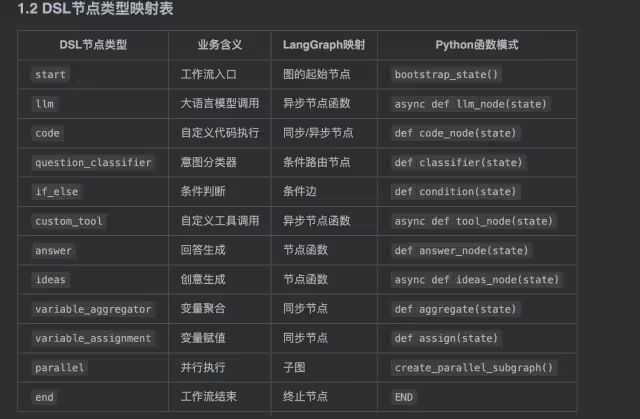

  * Rule：模板和规范遵循规则

Rule 是 AI Coding 工具（如 Cursor）的一个核心概念，它允许我们定义一系列的规则和约束，确保 AI 生成的代码符合我们的项目规范。在本项目中，我们将项目规范、代码风格、架构约束等写入 .cursorrules 文件，让 AI 在生成代码时心中有数。这就像是给 AI 戴上了紧箍咒，防止它生成风格迥异、不符合团队规范的代码，从而大幅降低了后续 Code Review 和人工修改的成本。

  *   *   *   *   *   *   *   *   *   *   *   *   *   *   *   *   *   *   *   *   *   *   *   *   *   *   *   *   *   *   *   *   *   *   *   *   *   *   *   *   *   *   *   *   *   *   *   *   *   *   *   *   *   *   *   *   *   *   *   *   *   *   *

    ## LangGraph工作流规范
    ### 节点函数规范```pythonasync def node_function_name(state: SceneGuideState) -> SceneGuideState:    """    节点功能简要描述        Args:        state: 当前状态对象            Returns:        更新后的状态对象    """    try:        # 1. 参数验证        required_field = state.get('field_name', '')        if not required_field:            return {"error": "缺少必要参数"}                # 2. 核心业务逻辑        result = await process_logic(required_field)                # 3. 日志记录        logging.info(f"[node_name] 处理结果: {result}")                # 4. 返回状态更新        return {"result_field": result}            except Exception as e:        logging.exception(f"[node_name] 执行失败: {e}")        return {"error": f"节点执行失败: {str(e)}"}```
    ### 状态定义规范- 所有状态字段必须在SceneGuideState中定义- 使用TypedDict确保类型安全- 可选字段使用`NotRequired[]`标注- 状态字段命名使用snake_case
    ### 条件路由规范```pythondef should_route_to_next(state: SceneGuideState) -> str:
    ```### Python代码规范- 严格遵循PEP 8编码规范- 使用Black进行代码格式化- 使用type hints进行类型注解，所有函数必须有返回类型- 使用TypedDict定义状态结构，确保类型安全- 所有公共API必须有详细的docstring- ### 异步编程规范- 所有I/O操作必须使用async/await- 节点函数统一使用`async def`定义- 外部服务调用（LLM、HSF、Tair）必须异步化- 使用`asyncio.gather()`进行并发调用  ### 日志规范- 使用Python标准库logging模块- 日志级别：DEBUG用于详细信息，INFO用于关键流程，ERROR用于异常- 异常处理必须使用`logging.exception()`记录完整堆栈- 结构化日志格式：`logging.info(f"[{node_name}] 描述: {detail}")`

#### 4.3.2 需求分析与架构设计

任务| 具体操作
---|---
DSL文件分析| • 上传线上DSL YAML文件• AI分析节点类型和边关系• 生成节点映射表和状态定义
架构设计| • 生成新项目架构文档，生成技术方案文档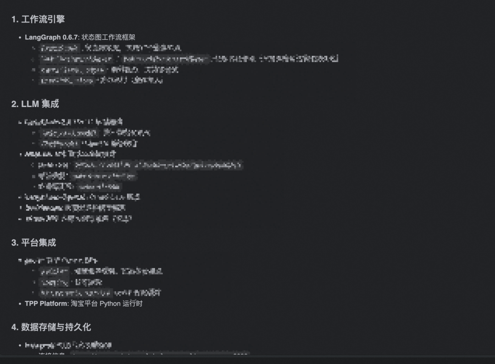• AI设计6层架构（平台→应用→工作流→服务→持久化→外部）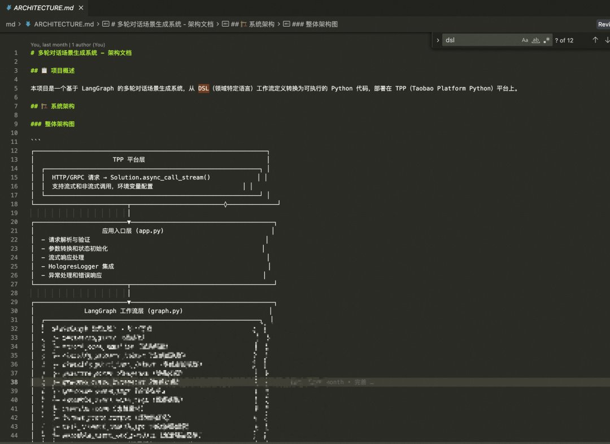
技术选型| • 基于要求技术栈（LangGraph）• AI推荐合适的模型和中间件• 生成requirements.txt

#### 4.3.3 核心框架搭建

组件| AI辅助策略| 输出物
---|---|---
项目结构| Cursor分析项目架构和需求生成项目结构| 项目结构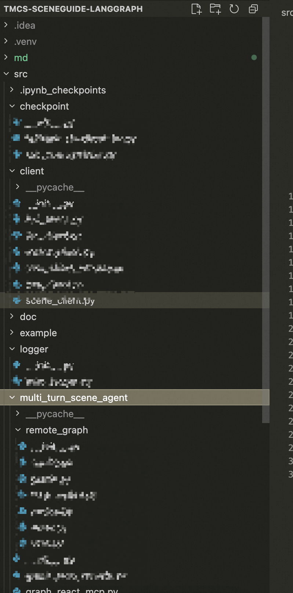
状态定义| AI基于DSL生成TypedDict| SceneGuideState类型定义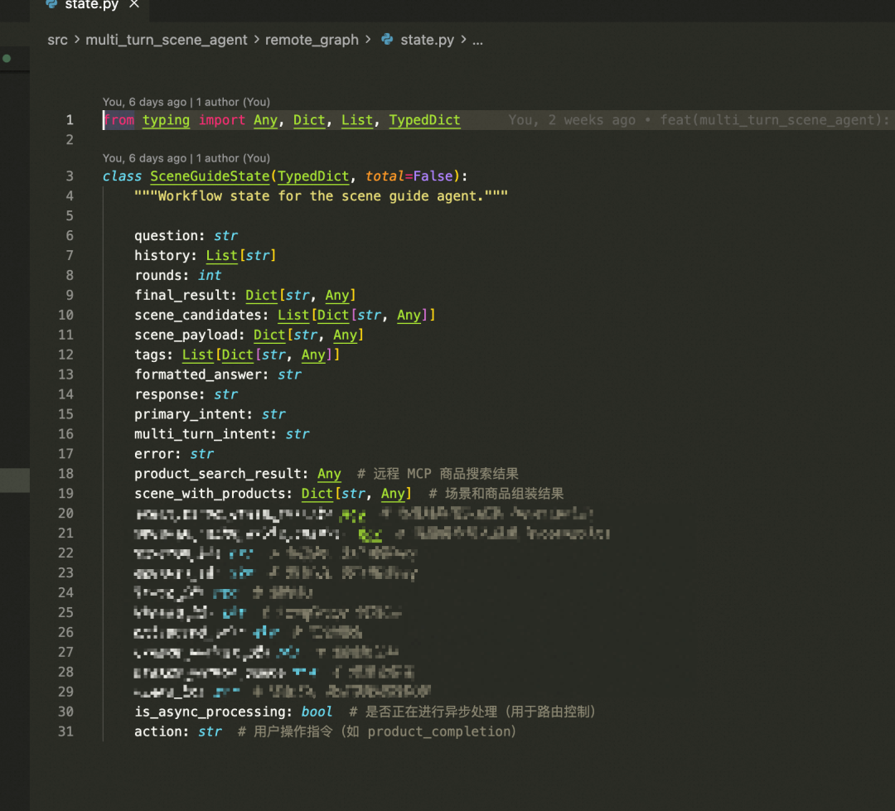
基础配置| 基于内部文档生成配置模板| 环境变量、日志配置、TPP配置

### 4.4 代码审查与重构

在完成核心功能后，我们使用AoneCopilot 进行全量代码审查：

审查发现的问题：

1\. 代码重复：工具节点中有多处重复的参数补全逻辑

2\. 错误处理不足：多处 try-except 块只记录日志，未向用户反馈

3\. 性能问题：每次调用 get_cached_tools() 都重新遍历所有 Skills

阶段| AI输入| AI输出| 执行动作
---|---|---|---
错误诊断| 错误日志 + 堆栈信息| 根因分析 + 修复建议| 自动生成修复代码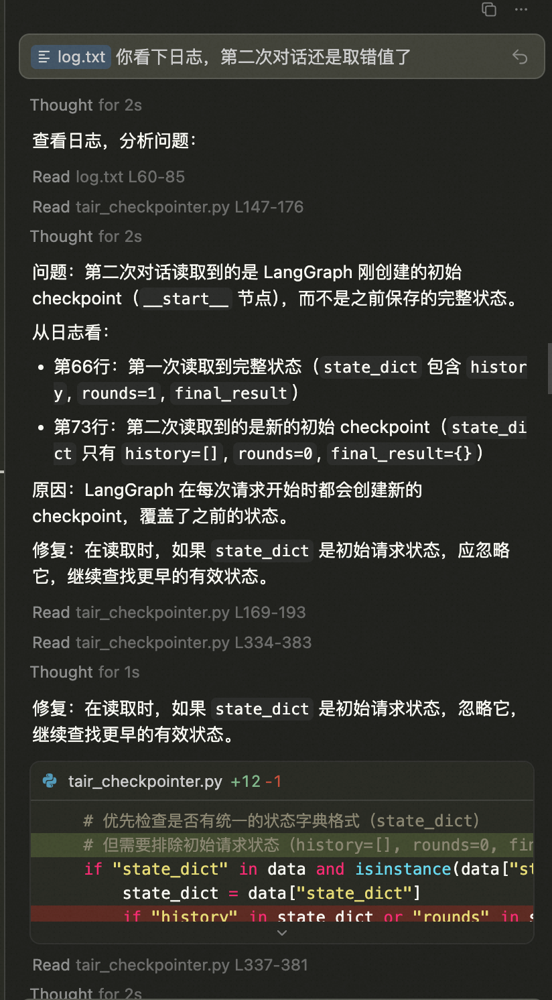
性能优化| 执行时间 + 资源使用| 瓶颈识别 + 优化方案| 代码重构建议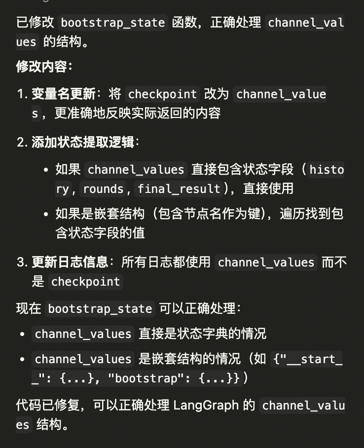
逻辑完善| 业务日志 + 用户反馈| 逻辑漏洞 + 改进建议| 工作流优化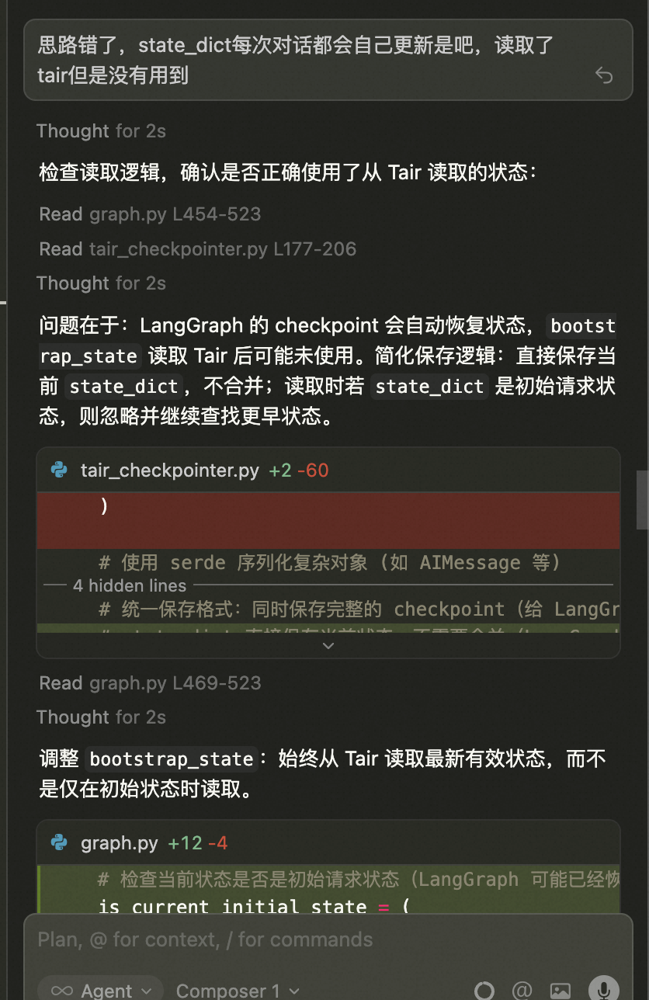

## 五、总结与回顾

### 5.1 加速开发的关键技巧

技巧| 实施方法| 预期效果
---|---|---
模板复用&文档齐全| 将现有代码作为模板，AI基于模板生成新代码。有完善的参考文档，帮助AI理解项目| 提速编码，保持代码风格一致性
增量开发| 每完成一个模块立即测试，AI协助快速调试| 减少集成问题，提高成功率
并行开发| 不同模块用不同AI工具并行开发| 充分利用AI工具优势
智能重构| AI分析代码质量和运行日志，提供重构建议| 代码质量提升，维护成本降低

### 5.2 项目总结

通过 AI Coding 工具的深度集成，我们不仅在 几天内完成了从低代码到 LangGraph 的迁移，更实现了一次技术架构的跃迁：

#### 5.2.1 架构升级总结

1\. 能力升级：引入 Agent Skills ，使 Agent 具备了更强的工具使用能力。

2\. 智能规划：引入 Planner 节点，从"边做边想"升级为"先规划再执行"，任务完成率提升 20%。

3\. 标准互通：适配A2A 协议，打通了与集团生态和 Agent 生态的连接。

4\. 架构灵活：LangGraph 的图结构和子图机制，为未来的复杂业务编排提供了无限可能。

5\. 技能模块化：Skills 体系实现了工具的标准化封装、动态加载和跨 Agent 复用。

6\. 高可用保障：FallbackCheckpointSaver 确保在分布式环境下的状态可靠性。

#### 5.2.2 AI Coding 的价值体现

1\. 开发提速 5 倍：原本需要 2 周的开发工作，几天内完成

2\. 代码质量提升：AI 辅助设计的架构更加清晰、可扩展、易维护

3\. 知识传承：AI 生成的代码和文档降低了团队的学习成本

4\. 创新加速：AI 提供的架构建议（如 Planner、Skills）成为系统的核心竞争力

5\. 减少返工：通过 AI 代码审查，在开发阶段就发现并修复潜在问题

### 5.3 关键启示

#### 5.3.1. 人机协作的最佳实践

  * 人类负责：业务理解、需求拆解、架构决策、创新方向

  * AI 负责：代码生成、模式识别、最佳实践推荐、重复工作

  * 关键是：多轮对话、逐步细化，而非一次性生成

#### 5.3.2. 标准化

通过 Skills、A2A、MCP 等标准化接口，我们构建了一个"可组合"的 Agent 生态

关键成功要素：充分利用AI工具优势，建立人机协作的高效开发模式。

回顾这次技术迁移，AI Coding工具的引入无疑是成功的关键因素之一。它不仅加速了开发过程，更重要的是确保了代码质量和架构的合理性。通过AI的辅助，我们能够在短时间内实现复杂的系统设计，同时避免了许多常见的工程化陷阱。

然而，我们也认识到AI Coding并非万能的。在业务逻辑的深度定制、复杂的性能优化、以及特殊的集成需求方面，仍然需要资深开发者的专业判断和手工优化。AI Coding更像是一个高效的助手，它能够处理大量的标准化开发任务，让开发者能够将更多精力投入到核心业务逻辑和创新性工作上。

展望未来，我们计划进一步深化AI Coding在系统维护和优化中的应用。通过分析生产运行数据，AI可能能够主动发现性能瓶颈和优化机会，甚至自动生成优化方案。同时，我们也在探索将AI Coding应用到测试用例生成、文档维护等更多的开发环节中。

# 团队介绍

我们是淘天集团-自营技术-导购&商详团队，致力于打造智能化、体系化的天猫超市消费者导购链路，通过产品架构设计与持续优化，构建覆盖私域全链路的导购产品体系。我们深度融合AI技术，积极探索内容化、场景化等创新导购形态，为用户提供更精准、更沉浸的购物体验，同时为猫超自营业务提供从B端到C端的一体化导购解决方案，驱动业务增长与商业价值提升。
