# 别让AI做它不擅长的事：Agent在业务场景中的工程实践

> **公众号**: 阿里云开发者  
> **发布时间**: 2025-08-28 08:30  

阿里妹导读

本文通过分享将AI Agent技术应用于“智能播报助手”和“批量建任务”两个真实业务场景的实践历程，深刻阐述了当下将AI Agent与传统工程系统深度融合，而非追求完全替代，才是实现业务提效和价值落地的有效路径。

Agent随着Agent相关技术的快速发展，验证其在企业实际业务场景中的价值已成为当务之急。脱离应用场景的技术创新终将沦为“空中楼阁”。本文分享我将agent与工程结合并应用于两个业务场景的历程，并在最后给出agent与工程的选型总结。

## 一、Agent + MCP 打造智能播报助手

### 1.1. 业务背景与问题

在我们的日常工作中会制作或使用大量统计报表。淘天会在一款数据产品上制作报表相关内容，制作好的报表会由关心报表数据的同学每隔一定周期去查看报表的数据是否出现异常。比如每天早上十点查看表A的数据、大促上下线时每隔半小时查看表B的数据。

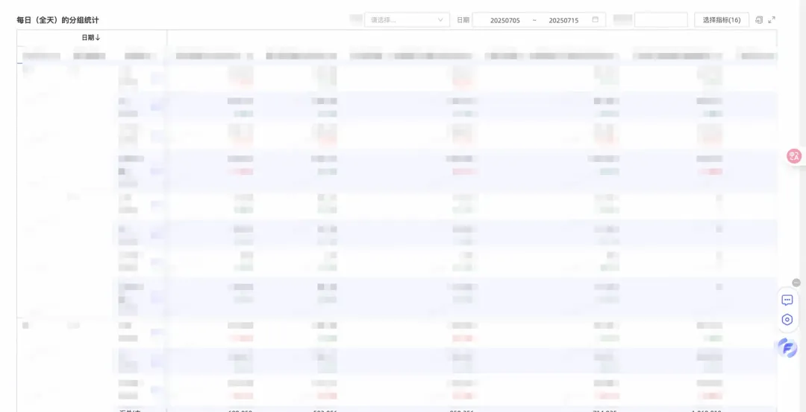

定时看报表的整体流程，简单概括就是打开网页，找到异常数据，基于异常数据采取某些行为。FBI拥有定时播报的能力，但是存在以下局限性：

  * 表格类型报表只能播报图片，若要导出报表数据，只能选择「邮件格式」并且只能把数据导出为excel格式。若用工程（编码）处理，需要对每一个表格类型定义接收对象。

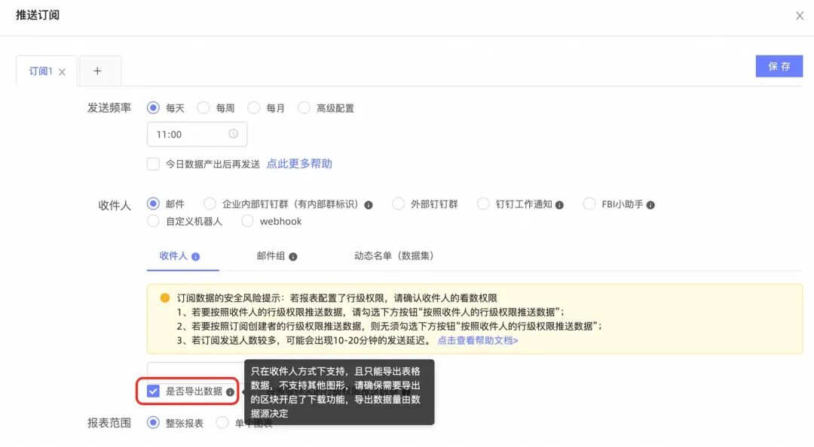

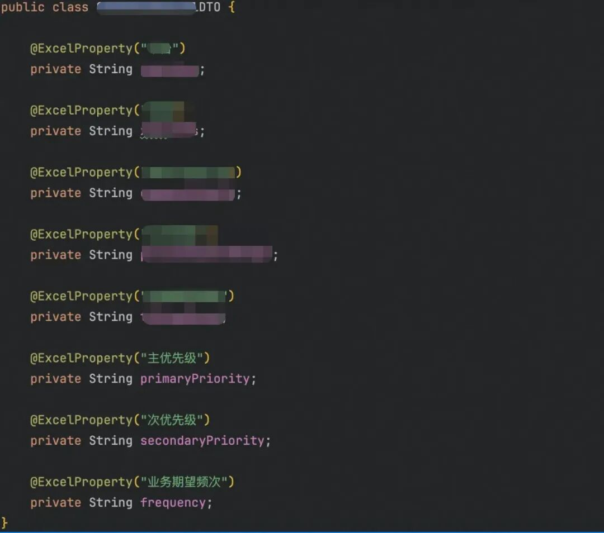

  * 文本类型报表可以定义异常指标，但只能修改异常指标的展示样式，满足不了「只有某指标出现异常时才播报给某些特定的联系人」的需求，并且无法基于异常数据进行后续动作。

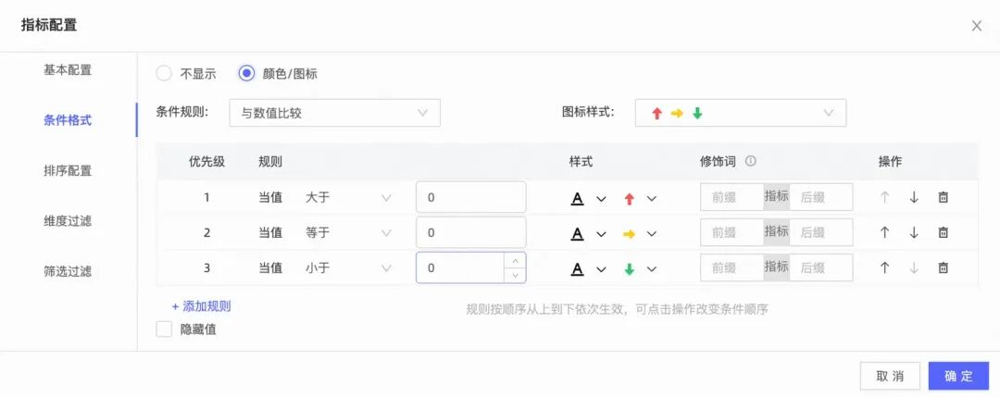

  * 虽然底表的数据我们可以直接获取，但无法拿到FBI加工过的数据如日环比。

比如下图中，定义异常数据为「指标1 < 10%或指标2 < 30%」。同学甲只关注A-aa1的数据、同学乙只关注A-aa2的数据、同学丙只关注B-bb1的数据。那么就期望在周期到达时，向同学甲和同学丙播报异常数据，甚至是基于异常数据进行下一步动作。FBI目前做不到这一点。

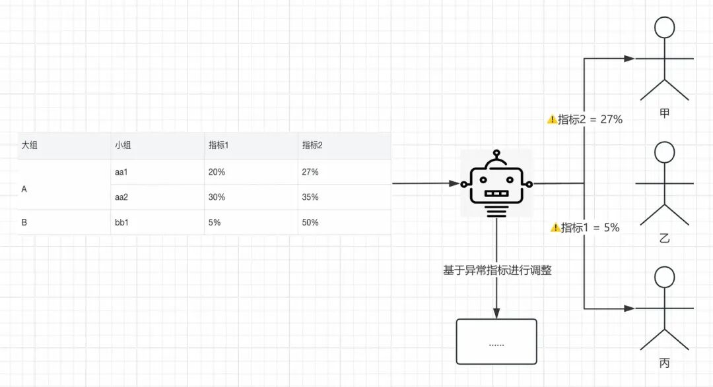

### 1.2. MCP介绍

事情的转折点在于LLM的不断进化（如claude4）以及MCP的横空出世。MCP （Model Context Protocol） ，翻译过来就是模型上下文协议，简单来说，它定义了一套标准规则，让LLM模型能够安全、有序地访问和使用各种外部资源，从而大大扩展Agent的能力边界。MCP中有两个重要角色：MCP Client和MCP Server。MCP Server提供各种各样的能力与工具，MCP Client是MCP Server的调用者。

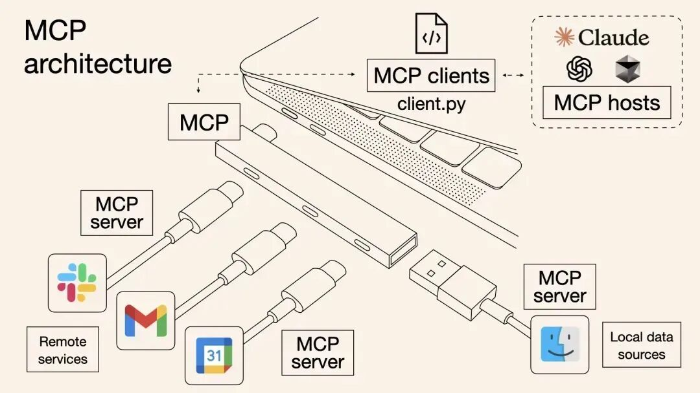

举一个通俗的例子，把MCP Client 想象成DVD播放器，DVD播放器可以放入不同的碟片（MCP Server），不同的碟片有不同的内容（能力），但肯定不能向DVD播放器中放入磁带（不符合MCP的Server）。在AI场景下，就是给予Agent通用地调用各种各样工具的能力。

可能会有同学好奇：让Agent调用工具难道是最近才有的能力吗？其实并不是这样，工具调用（Function Calling）是早于MCP提出来的能力，也就是说agent在MCP出现前就可以进行工具调用。过去只有Function Calling时，不同厂商（OpenAI、Anthropic......）的Function Calling协议都不同，并且许多开源模型不支持Function Calling。比如为OpenAI的某个模型开发了一个tool，想要复用到Anthropic（Claude的开发者）的某个模型，先要查看模型是否支持Function Calling，若支持还需要重新对tool进行适配开发。而MCP提供了一套通用的协议，免去了重复开发工具的问题，大大降低了工具使用的复杂度。

MCP目前有三种通讯方式：STDIO（Standard Input/Output）、SSE（Server-Sent Events，基于HTTP的单向数据流传输方式）和StreamableHttp。Mcp Client和Mcp Server部署在同一台机器上，通过标准输入输出通信的方式就是STDIO模式。部署在不同机器通过Http请求通信就是SSE模式和StreamableHttp模式。STDIO因为在本地运行，是绝对安全的；但SSE和StreamableHttp模式若暴露连接方式，可能会有安全问题。

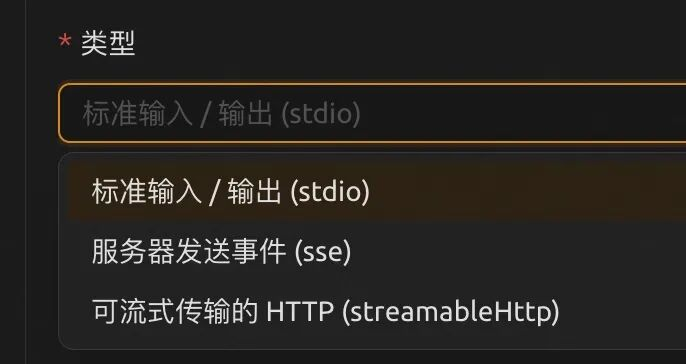

cherryStudio中连接类型设置

2025年3月26日，Anthropic在MCP规范中正式弃用SSE传输，全面转向StreamableHttp。为什么要用StreamableHttp替换SSE？SSE的原理是MCP Client与MCP Server通过HTTP建立SSE长链接，之后MCP Server就可以不断向Client发送数据，而不需要每次都进行三次握手；MCP Client可以主动关闭SSE长链接。问题在于SSE的整个通讯过程都需要依赖SSE长链接，一旦出现网络毛刺（短暂中断），那么MCP Server向MCP Client发送的数据就会丢失，并且MCP Server无法感知到数据的丢失。而Streamable方式中，MCP Server可以感知到数据丢失，连接恢复时可以持续地将没有发送给MCP Client的数据再次发送，保证长链接的高可用性。

随着MCP的流行，其社区也不断壮大，出现了越来越多符合MCP的工具，相关平台也在积极适配MCP模块。（mcp.so、魔搭社区）MCP就是模型进行工具调用的未来。

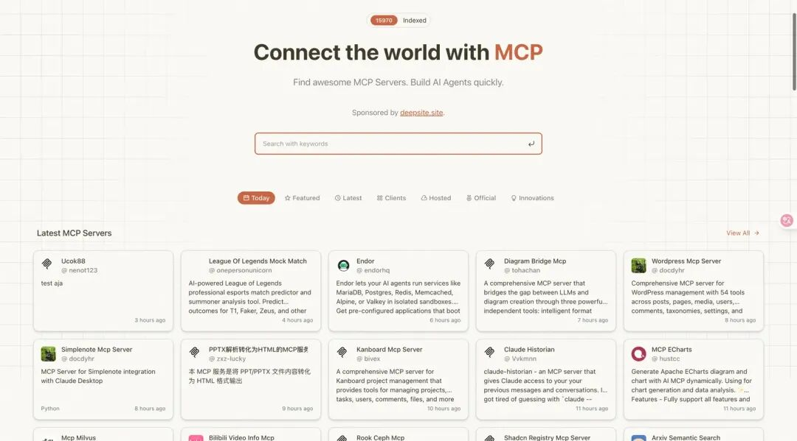

mcp.so

### 1.3. agent + MCP快速上手

没有使用过MCP的同学可以按照以下步骤快速上手体验一下，非常简单。

1.首先需要一个AI对话客户端。ideaLab就是这样的产品，但ideaLab目前不支持STDIO模式。市场上现在有大量的客户端，我们选择Cherry Studio快速体验。首先安装客户端。

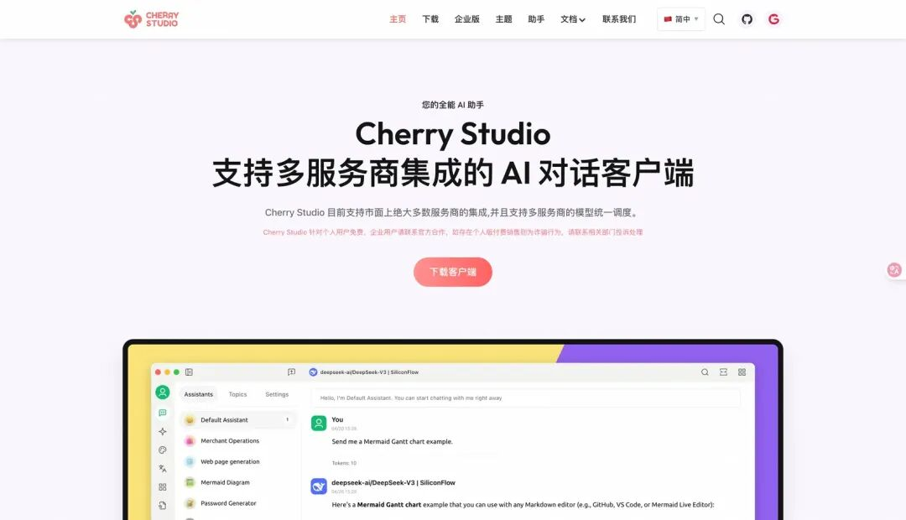

Cherry Studio官网

2.安装完成后，点击设置--模型服务--添加。随便填写“提供商名称”。若使用ideaLab的sk，提供商类型选择默认的OpenAI。

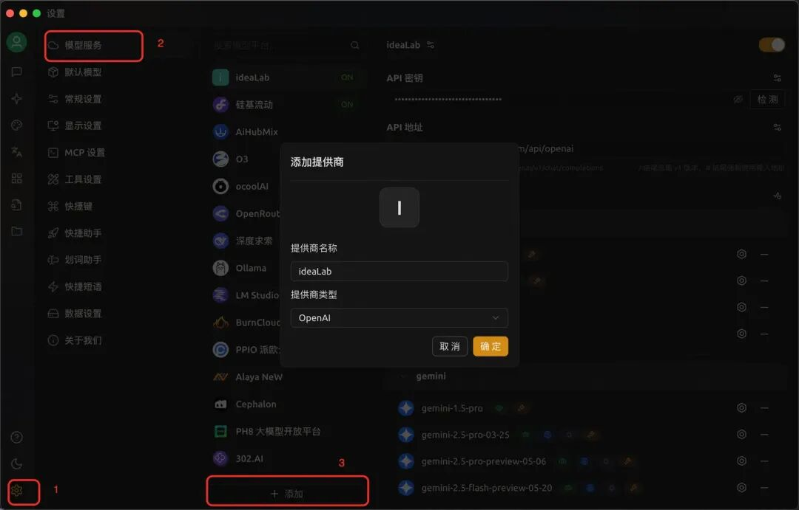

3.添加完成后，输入ideaLab的sk，填入API地址。

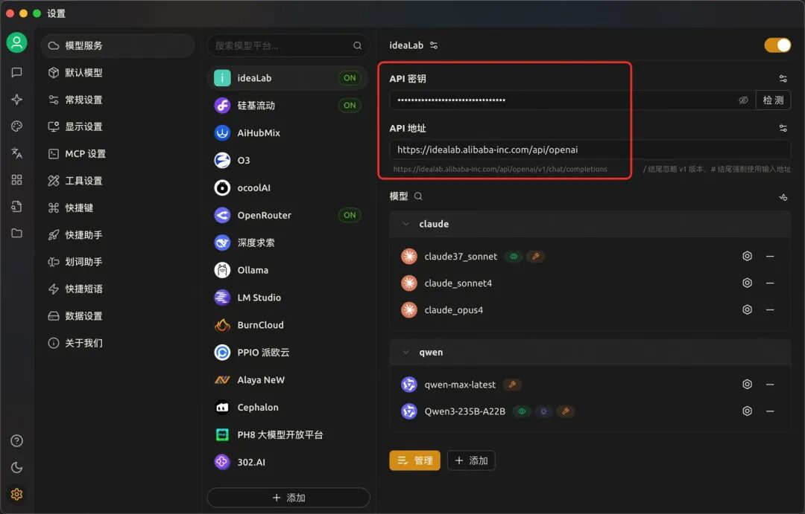

4.点击模型平台中的“添加”，这里需要填入模型ID。进入ideaLab提供的模型清单，复制模型ID，填入即可。注意，选择的模型必须要有工具调用能力。

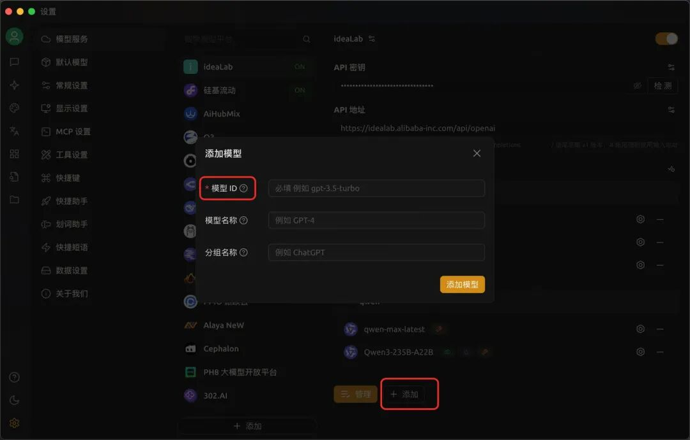

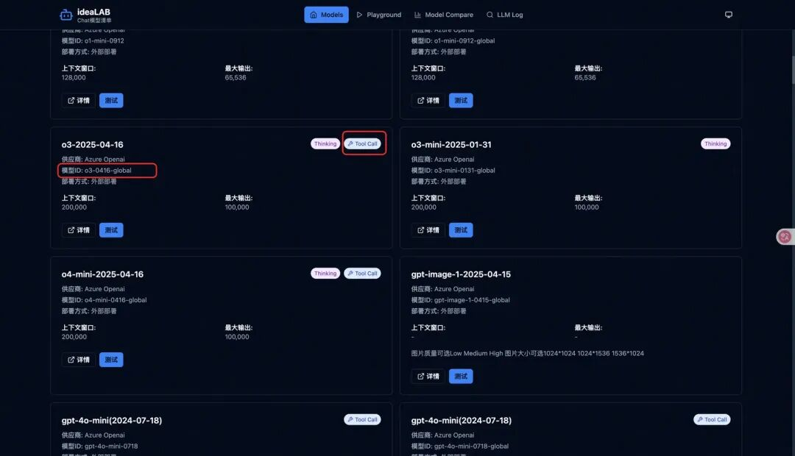

ideaLab模型清单

5.点击“助手”，选择配置的模型，测试连通性。

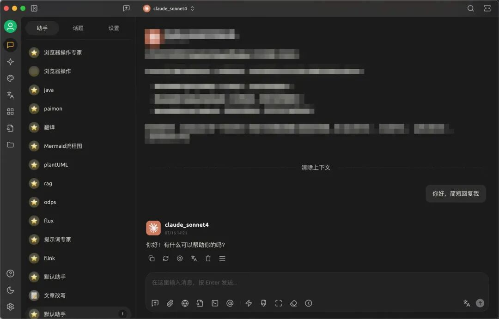

6.回到设置，选择“MCP设置”，点击添加服务器--快速创建。（若需要安装依赖，跟着客户端教程无脑安装即可）

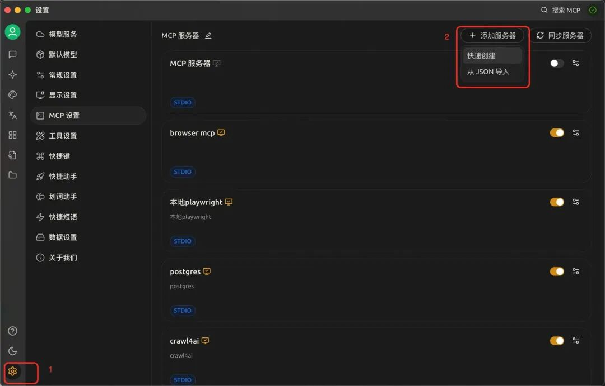

7.配置MCP Server。这里以魔搭社区提供的文件系统服务为例。

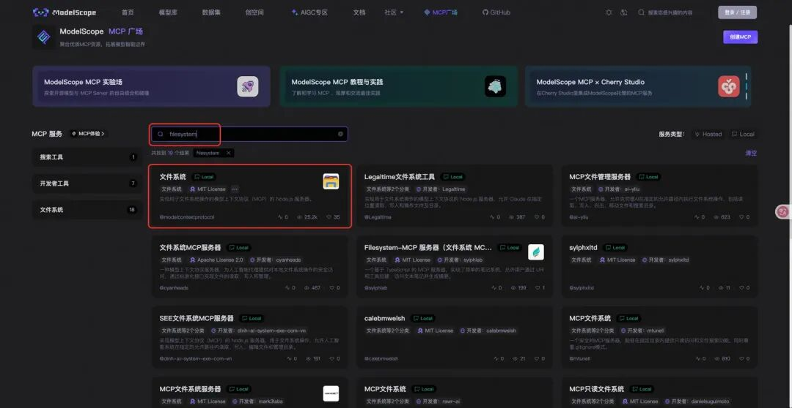

魔搭社区

8.进入后可以看到服务提供的工具，我们以stdio方式安装。

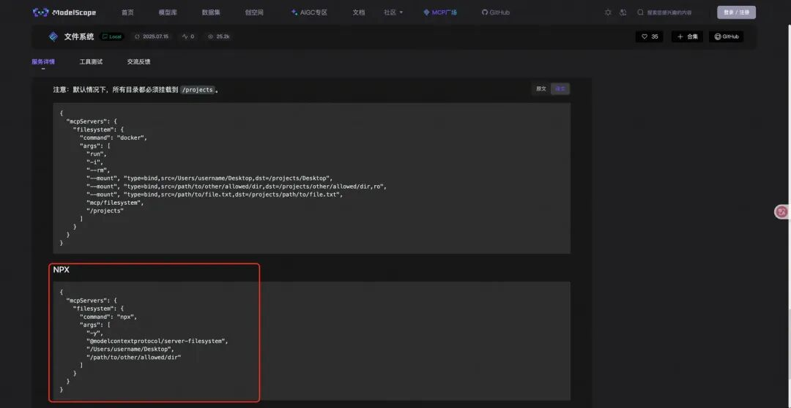

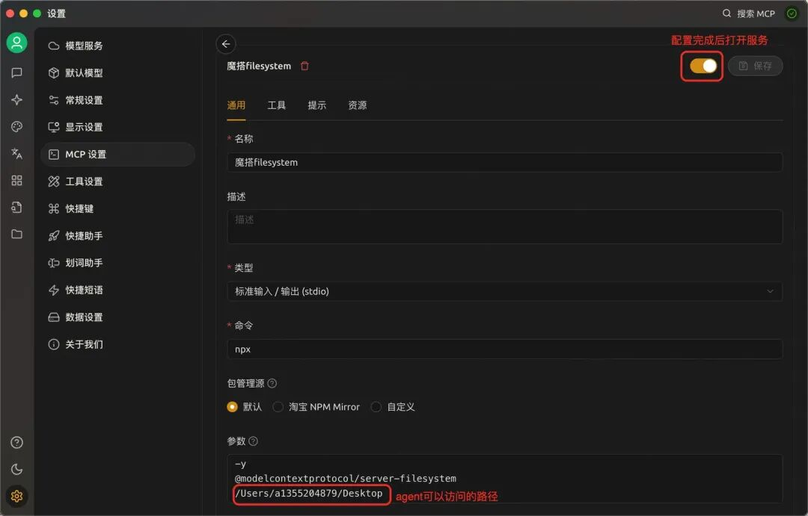

9.点击助手--MCP设置，选择刚才配置好的MCP Server。（再次强调，模型必须要有工具调用能力）

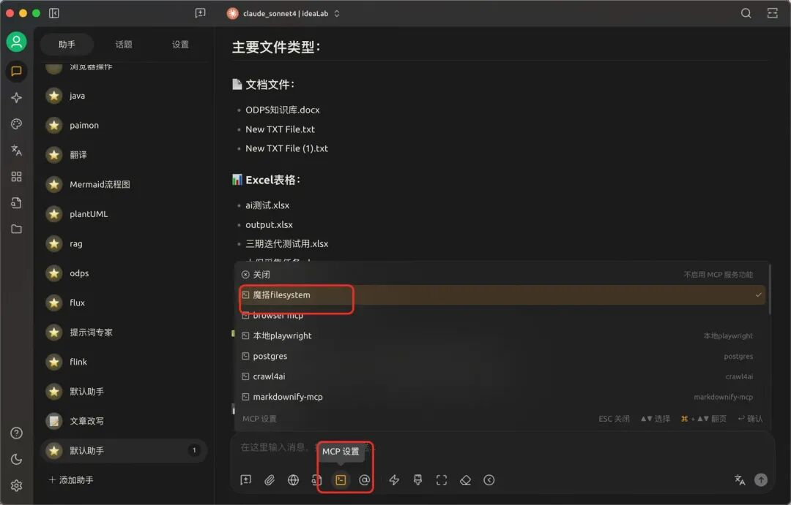

10.测试工具调用效果。

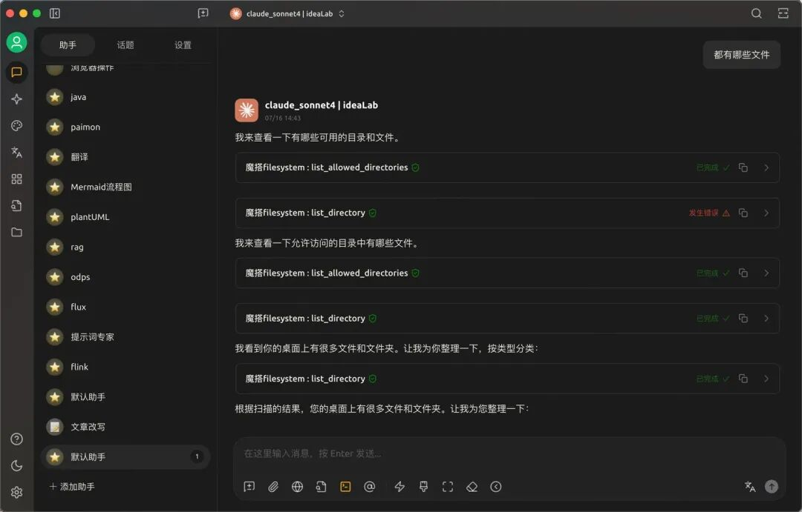

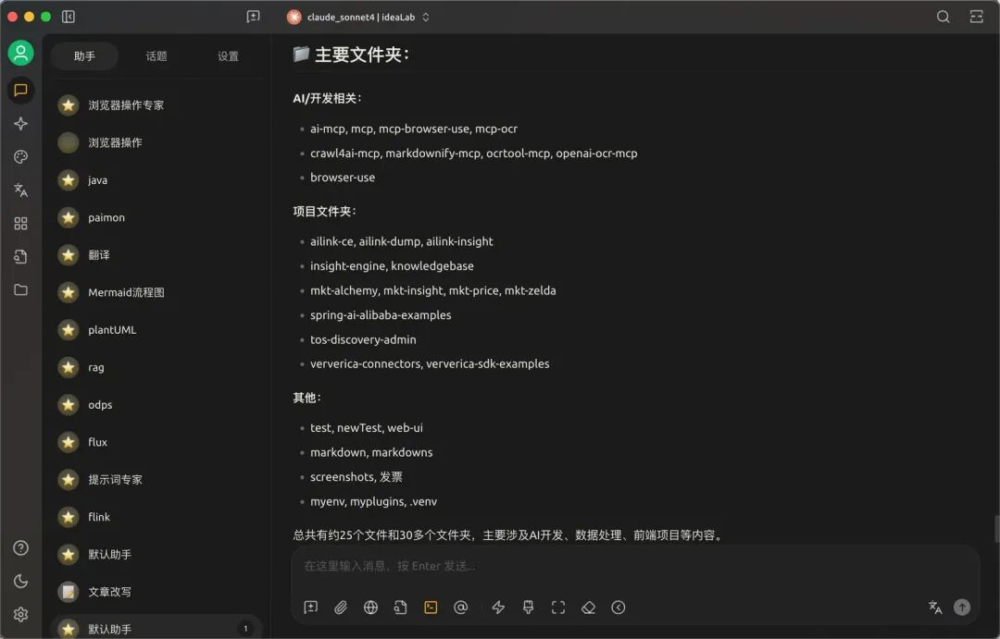

实际体验后，不知道大家有没有体会到MCP的作用：MCP Client使用统一的配置方式，可以快速接入各种各样的工具。没有工具调用能力的agent，最多就是充当「百科全书」的角色。而当agent可以进行工具调用，就可以把agent当作是一个「人」来看待了。工具调用大大拓展了agent的能力边界，它可以像我们一样写文件或是操作浏览器。那么上述的看报表场景痛点，或许可以通过agent + MCP的方式解决。

### 1.4. 浏览器操作探索过程

### 1.4.1. 服务选择

浏览器相关的MCP Server主要分为以下两类：

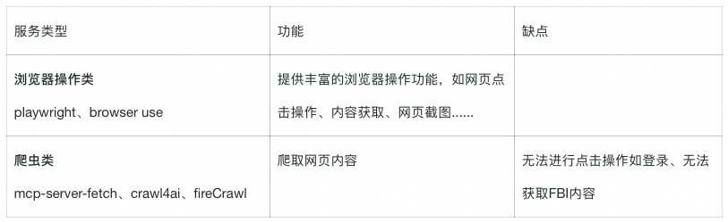

playwright-mcp：一个模型上下文协议（MCP）服务器，利用 Playwright 提供浏览器自动化功能。该服务器使大型语言模型能够通过结构化的可访问性快照与网页进行交互，无需依赖截图或视觉调优模型。目前仍在活跃更新中。

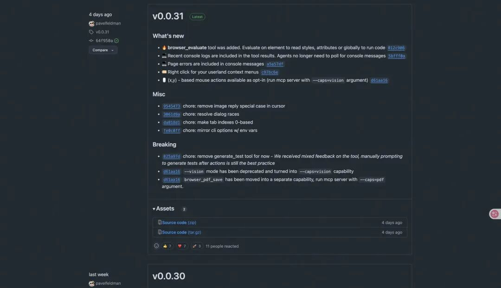

playwright Releases版本

其提供的工具列表如下，可以直接在github中查看：

能力| 工具| 解释
---|---|---
核心自动化功能| browser_click| 点击操作
browser_close| 关闭浏览器
browser_console_messages| 获取控制台消息
browser_drag| 按住鼠标左键进行拖拽
browser_evaluate| 评估JavaScript
browser_file_upload| 上传文件
browser_hover| 将鼠标悬停在页面上的某元素
browser_navigate| 导航到指定URL
browser_navigate_back| 返回上一页
browser_navigate_forward| 前进到下一页
browser_network_requests| 获取所有网络请求
browser_press_key| 模拟键盘操作
browser_resize| 调整浏览器窗口大小
browser_select_option| 在下拉列表选择选项
browser_snapshot| 获取页面快照
browser_take_screenshot| 截图
browser_type| 在可编辑元素中输入文本
browser_wait_for| 等待文本出现或消失，或等待指定时间
标签页管理| browser_tab_close| 关闭标签页
browser_tab_list| 列出标签页
browser_tab_new| 打开新标签页
browser_tab_select| 选择标签页
浏览器安装| browser_install| 安装配置中指定的浏览器
基于坐标使用 --caps=vision开启| browser_mouse_click_xy| 点击指定坐标
browser_mouse_drag_xy| 按住鼠标左键，拖拽到指定坐标
browser_mouse_move_xy| 把鼠标移动到指定坐标
PDF生成使用 --caps=pdf开启| browser_pdf_save| 将页面另存为PDF

测试playwright-mcp的效果，还是以cherry studio举例。

1.在设置--MCP服务器中，添加一个服务器，类型选择「stdio」，命令输入「npx」，写入参数如图。-y 可以让agent自动进行工具调用而无需等待用户同意；@playwright/mcp@0.0.27 指定安装的工具及版本，也可以指定@playwright/mcp@latest；--headless开启无头模式，agent的浏览器操作不会打开一个可见的浏览器，如果想要看浏览器的调用过程就移除这个参数。

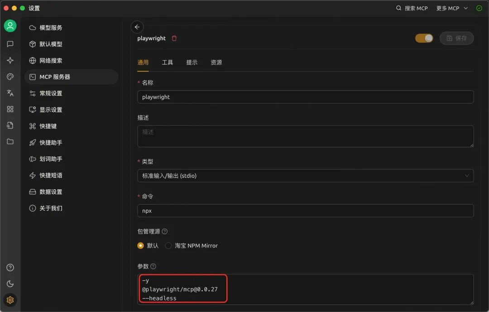

2.回到聊天助手页面，打开MCP服务器，选择刚才配置好的MCP Server。

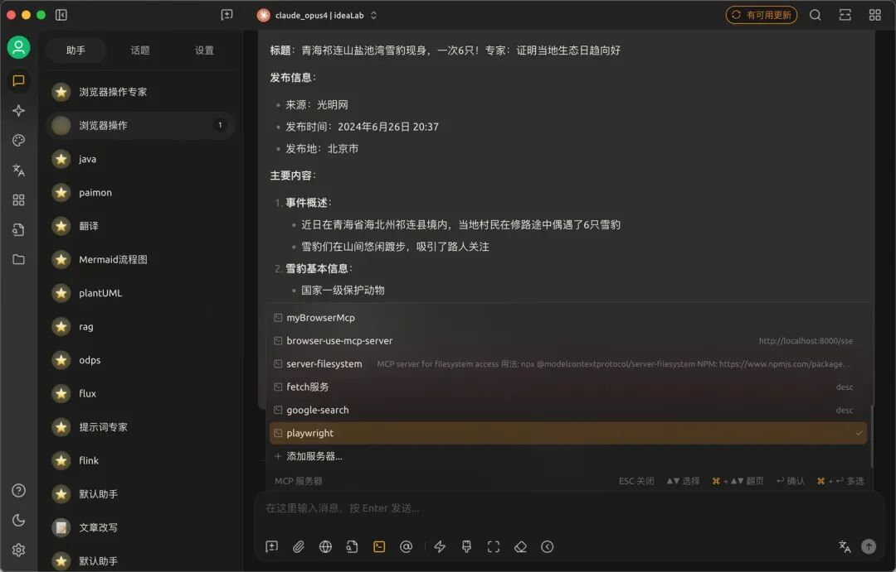

3.让agent总结网页内容，效果如下。

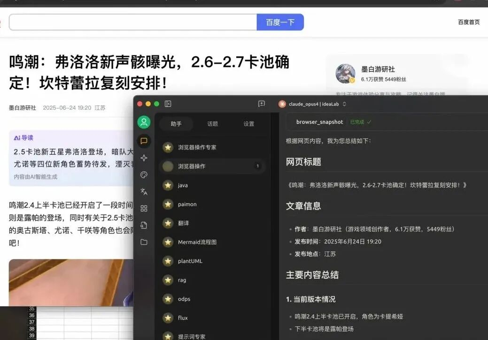

### 1.4.2. 环境准备

若要在项目环境中使用agent和mcp服务，需要以下准备。

1.工程dockerFile中需安装playwright，并解决大量的依赖问题。（也可以新建docker，但只能用sse或streamableHttp模式）

2.Java工程中需要使用Spring-Ai或Spring-Ai-Alibaba框架进行Agent开发。创建MCP Client时需确保是无头模式且要指定playwright的无头浏览器路径。

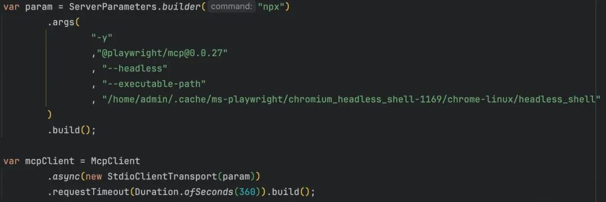

### 1.4.3. agent构建

有了工具的支持，就可以设置定时任务让agent看报表了。对于不同的报表场景，定时时间、具体的网页操作、要关注的指标、联系人等都各不相同。对数据类型进行划分，主要分为以下两类。

配置类：触发agent| 补充信息类：agent拿到后执行具体任务与生成结果
---|---
模型相关配置（选择什么模型，模型的温度）、定时时间、触发提示词。如图就是一段期望每天早上09:30执行的场景配置。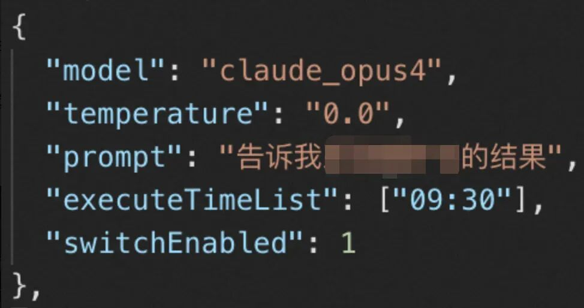| 不同场景的工作流、要打开的url、浏览器窗口大小、结果标题与内容格式、规定异常数据、具体示例等。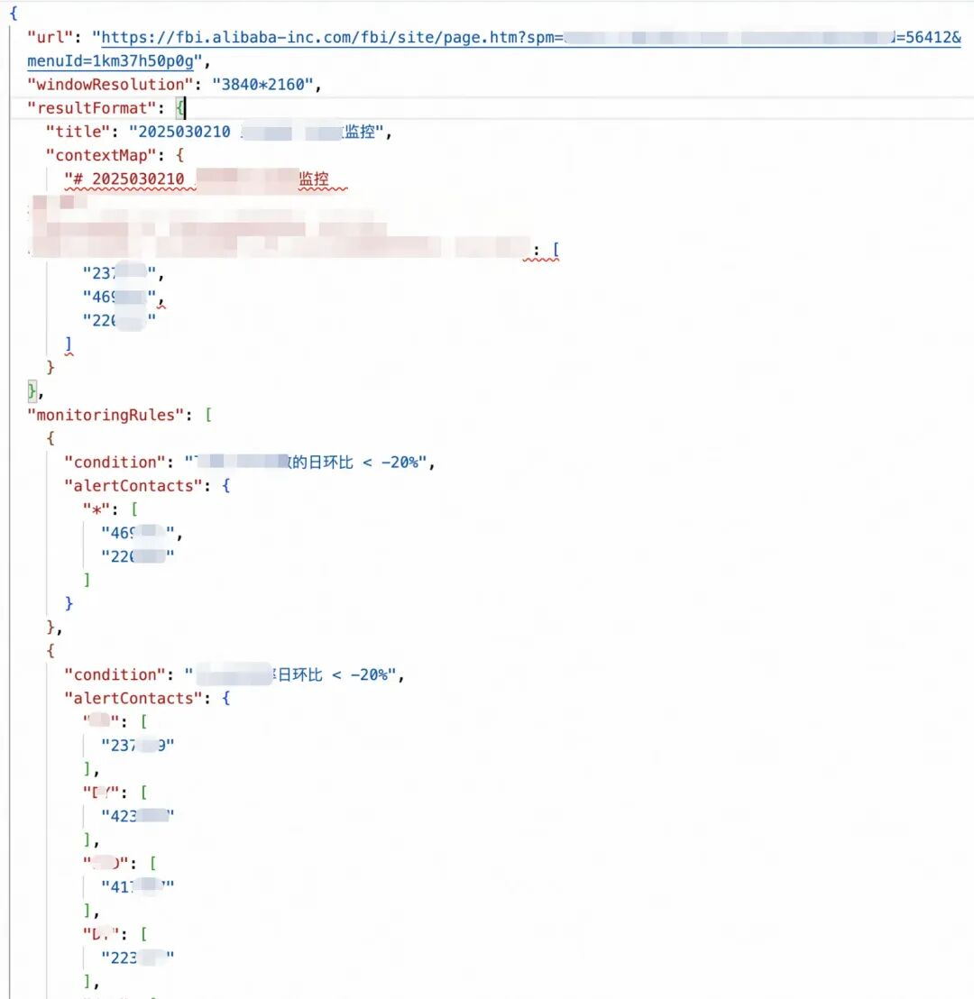

构建系统提示词时，先使用agent生成一个提示词框架（[Agent构建：Prompt工程、工作流设计与知识库优化实战](<https://mp.weixin.qq.com/s?__biz=MzIzOTU0NTQ0MA==&mid=2247552381&idx=1&sn=966dfc91ab7e75d349fcc82f0713ab04&scene=21#wechat_redirect>)），然后基于agent的行为与结果不断调整。

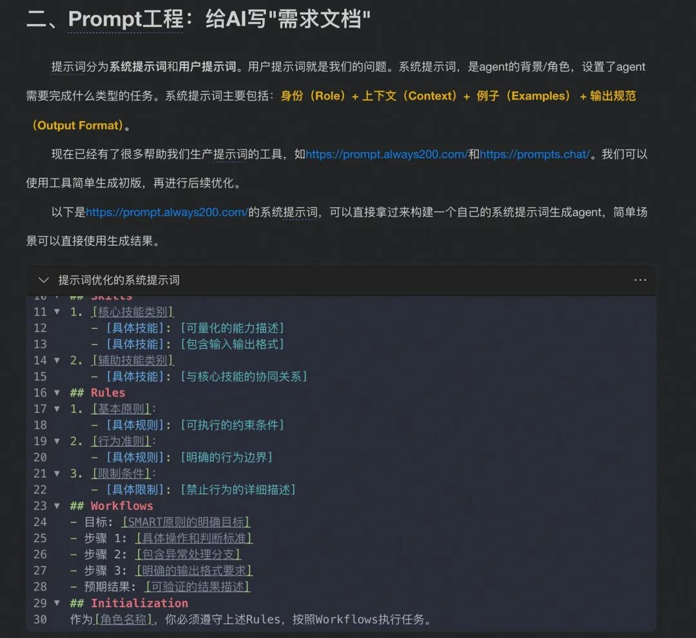

最开始构建时，我把不同的场景全部放到了系统提示词中，通过mermaid的选择节点来区分不同的场景，如下图。但随着场景的增多，会导致流程描述越来越复杂，这种方案肯定是不行的。

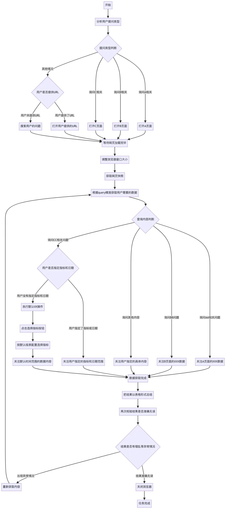

于是想到把不同场景的不同信息保存到向量数据库中，但向量数据库更适合保存非结构化文本。现在需要保存的是不同场景的元数据信息，不太适合保存到向量数据库中。于是尝试把数据保存到关系型数据库中，表结构中我设置了keywords列，用户提问后agent会先查询keywords，进行语意匹配，返回最适合的id，再查询id对应的其他信息。若没有匹配的keywords，则按照用户提供的信息进行任务，这一步其实就是RAG做的事情。流程如下。

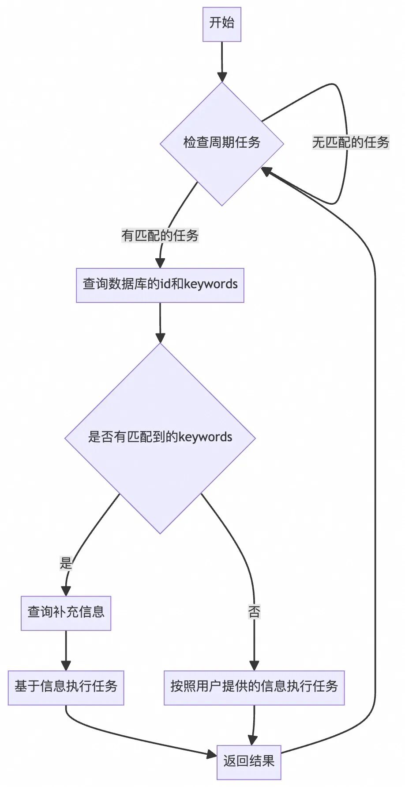

若担心agent生成危险的sql，也可以直接在系统提示词中写好需要执行的sql，并且创建一个只用来让agent调用的数据库，不要直接让agent调用线上的库表，降低风险。

### 1.4.4. 消息推送

消息推送可以在工程中结合钉钉机器人实现。只需要在知识库（数据库）中配置好场景结果的联系人工号或群id，让agent按照指定JSON格式返回结果，工程解析后就可以实现钉钉消息推送。

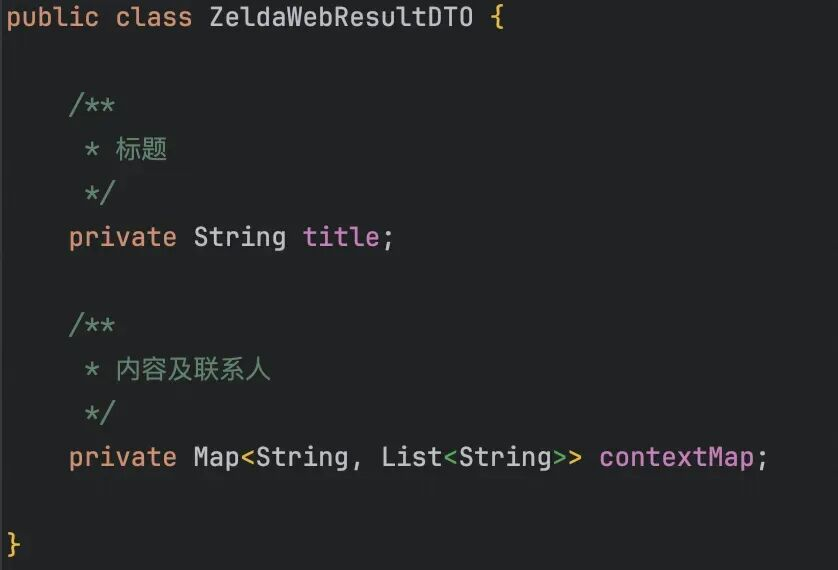

为了避免把消息发送给无关的人或群，在Switch中配置工号/群号白名单，工程中作强校验。

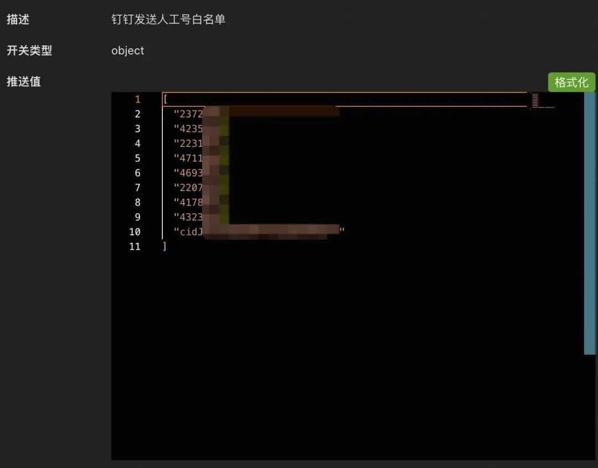

### 1.4.5. 已有场景介绍

目前有如下三个场景已验证且稳定执行，并且有其他场景待接入：

1.每天09:30查看某报表是否存在异常数据（指定日环比小于-20%），如果有异常数据，就发送钉钉消息给相应负责人。

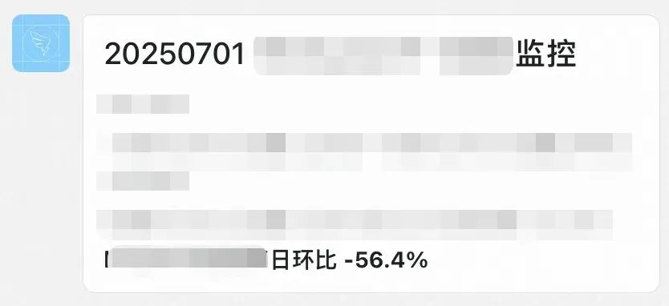

2.大促上线时，每半小时查看某任务的的执行情况并在群中播报。

3.每天11:00查看报表某指标，若小于90%，则打开另一个指定页面，筛选后关闭开关。

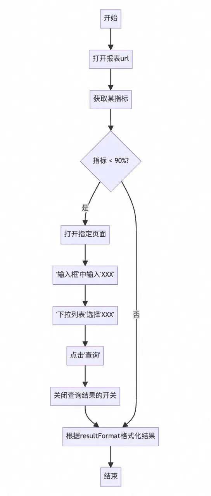

### 1.4.6. 问题汇总

使用过程中遇到的问题如下：

1.浏览器窗口大小会影响快照结果。基于实际经验设置窗口大小为3840*2160可以满足大部分场景。也可以在提示词中说“为了获取完整结果，你需要调整合适的窗口大小”。

2.表格数据容易出现数据错乱的情况，可能需要在examples中模拟表格数据。需要在灵活性与准确性中找到平衡点。

3.提示词中约束agent可以获取的快照内容，如“遵守快照内容最小获取原则”。否则容易导致token直接超出限制。

4.提示词中限制失败重试最大次数，否则agent可能会重复调用失败方法。如“若某操作执行失败，重试三次之后换一种操作方式。若仍然失败，则结束任务”。

5.浏览器操作最后一定要关闭浏览器。playwright执行新任务会默认打开新的浏览器窗口，若不关闭，可能出现资源泄漏和端口冲突问题。

6.钉钉markdown消息不支持表格类型，不适合返回大量数据的场景。

### 1.4.7. Agent看报表与FBI播报对比

对比如下表。总体来说，前者可以不局限于FBI平台，任何页面都可以通过agent + playwright-mcp 的方式进行操作处理，并且可以轻松获取页面的数据。但若只是定时播报，直接使用FBI的播报能力即可。

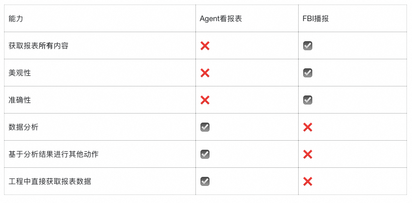

## 二、Agent批量建任务

### 1.1. 业务背景与问题

在大促与日常切换时，运营会在某平台基于excel的内容进行批量任务的创建与暂停操作。目前存在以下痛点：

1.任务量过多，任务的配置都不相同，每次操作需一小时左右。

2.需人肉对比excel中的任务与线上的任务，判断哪些任务应该新增创建、哪些任务应该修改，且要找到所有不存在于excel中的任务并暂停。

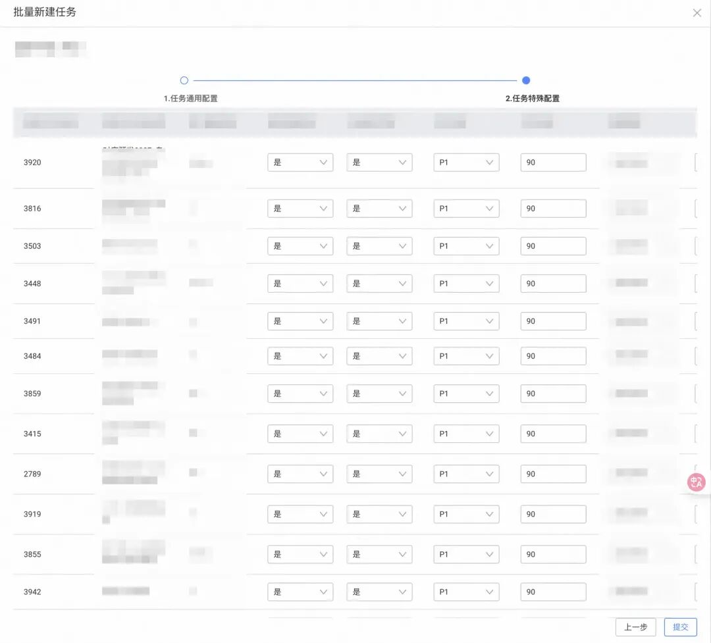

在这个背景下，尝试引入agent，期望让agent基于excel和已有的任务自动生成结果，解放人力。

### 1.2. Agent批量建任务探索过程

### 1.2.1. 能力尝试：只让Agent处理最简单的场景

首先只考虑最简单的情况，试验可行性：对于上传的所有任务，统一按照新增处理。通过工程解析excel，在ideaLab中配置agent，并在提示词中增加字段转换规则（即将excel的字段内容转换为枚举值）和补充信息规则（即给每个任务添加默认属性和默认值），agent处理流程图如下。

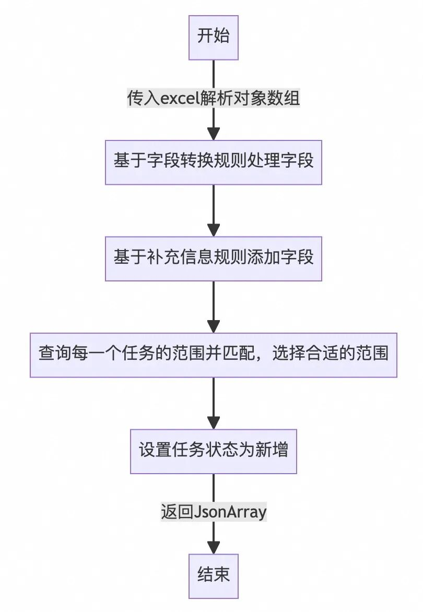

在该场景下，任务范围需要由agent调用工具并基于一定规则进行匹配。可以在ideaLab中添加工具实现。

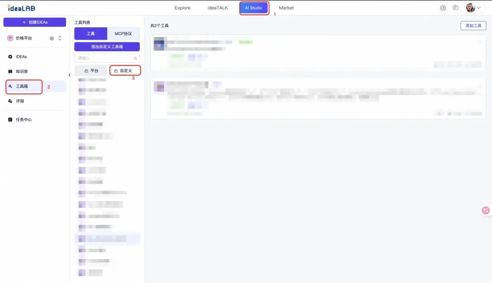

最终效果如下。Agent可以完成该场景下的“NL2Task”任务。于是继续探索更加复杂的场景。

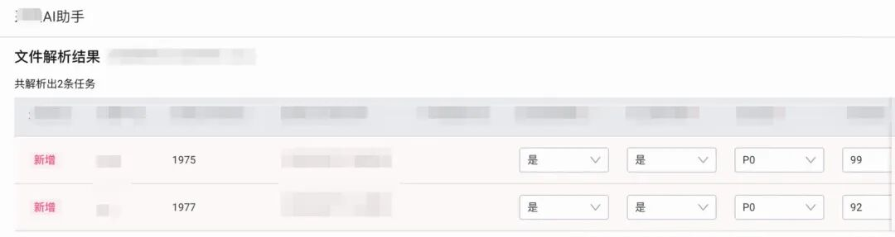

### 1.2.2. 初见端倪：完全让Agent处理复杂逻辑

现在需要让agent处理更加复杂的场景，要对比上传的任务和已经存在的任务。agent处理流程图如下。

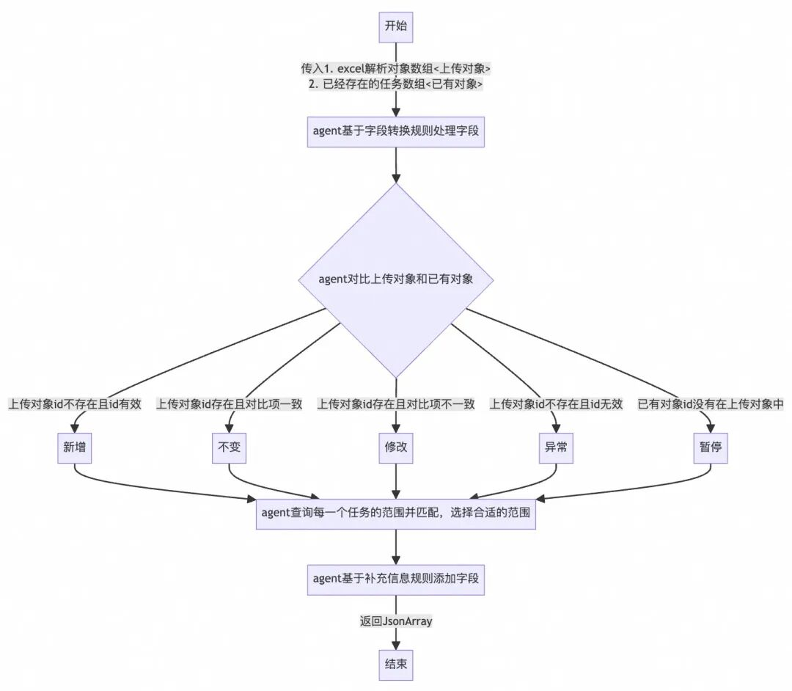

相比于初版，复杂点在于：

1.输入token更多：需要把已经存在的任务信息全部交给agent；

2.处理更加复杂：需要对比每一个上传对象和已有对象，寻找差异；

在与实际业务结合后，出现了以下问题：

1.运营每次需要处理50个左右的任务，若一次性让agent处理所有任务，agent的回答速度非常慢且质量很差；

2.小二工作台限制HSF方法等待时间最大为60s且不支持sse，无法保证agent在规定时间内完成响应；

解决方式如下：

1.拆分任务，并发调用。经过测试，调用ideaLab的agent请求接口最多支持10并发；

2.从同步等待改为异步轮询，将agent结果保存到redis中；

虽然拆分了任务，减少了每次处理的任务数量，但是我在调试时发现输入token数量非常庞大，一次调用就需要4w左右，再加上我把任务拆成了十份，那么调用一次成本就在40000/1000*0.1*10=40元左右。

成本问题无法避免。并且因为token输入过多，模型响应速度很慢，平均在25s左右才会进行首次响应。且我花费了大量时间调整提示词，生成的结果依旧无法保证比较高的准确性，包括但不限于字段转换错误、范围匹配错误、漏处理任务等问题。

现在回过头来重新考虑这个场景：

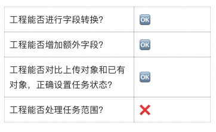

前面三点，工程不仅可以干，而且处理的更精准，更快！换句话说，这个事情本来就应该工程做，强行让agent做，耗费大量精力和财力，最终效果也是差到无法交付的地步！

### 1.2.3. 各取所长：工程 + agent结合高效处理

最终对流程进行重构，工程处理除了任务范围的所有工作，agent处理流程图如下。任务范围因为要根据excel的内容基于规则进行语意匹配，还是适合agent处理。

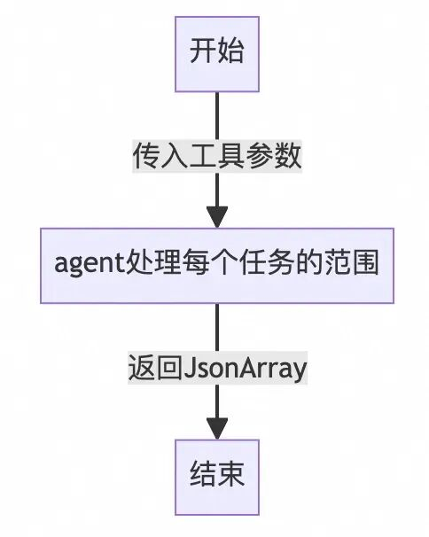

最终agent只干一件事情，减少了输入输出token，提高了响应速度和回答质量，再结合工程保障准确性，效果非常好。

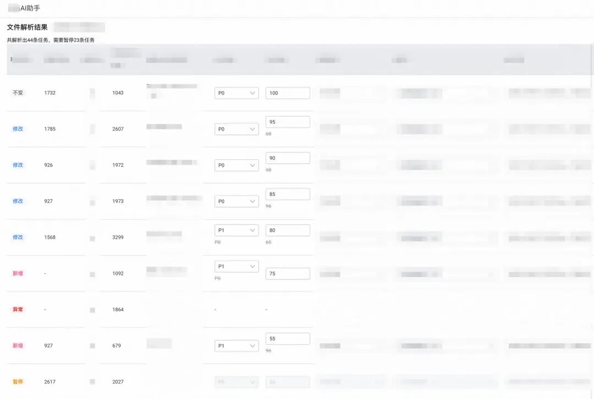

## 三、总结

以上两个场景都将agent与工程进行结合并作用于实际业务场景中，目的是为了利用Agent提效。但第二个场景起初让agent做了不适合的工作，反而降低了效率。以下列出agent和工程的能力对比。

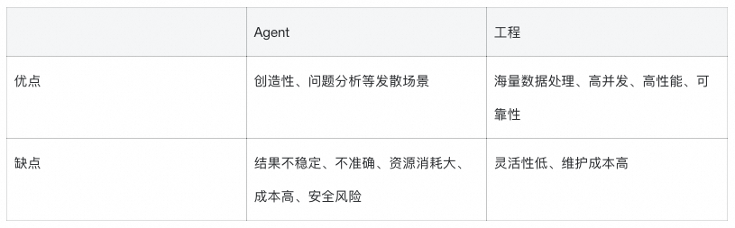

agent的本质还是概率游戏，它并不是万能的，千万不要把任何场景问题都一股脑全部丢给agent，期望它可以给出一个完美的结果。现阶段的最优策略是将agent与工程结合使用，扬长避短。在做技术方案时，要充分考虑每一环适合用什么工具解决。在具体实践时，若发现方向不对且尝试调整过后仍然得不到比较好的结果，就及时更换方向，不要死磕。只有准确理解各种技术的边界和长处，才能构建出真正高效、稳健的解决方案。

# 参考链接：

  * 大模型MCP更高效的通信：StreamableHTTP协议：https://blog.csdn.net/zhangzhentiyes/article/details/147855601

  * playwright-mcp：https://github.com/microsoft/playwright-mcp

  * 魔搭社区：https://modelscope.cn/mcp

  * Cherry Studio：https://www.cherry-ai.com/

****

### 创意加速器：AI 绘画创作

本方案展示了如何利用自研的通义万相 AIGC 技术在 Web 服务中实现先进的图像生成。其中包括文本到图像、涂鸦转换、人像风格重塑以及人物写真创建等功能。这些能力可以加快艺术家和设计师的创作流程，提高创意效率。

## 点击阅读原文查看详情。
