# 多智能体自主规划模式性能提升：五大精准策略详解

> **公众号**: 阿里云开发者  
> **发布时间**: 2025-09-09 08:30  

阿里妹导读

本文基于生产环境中的多智能体 React 模式实践，系统剖析了自主规划架构在工具调用延迟、上下文膨胀、中间态缺失、循环失控与监督缺位等方面的典型挑战。

## React模式挑战点

在多智能体协作调度中，实现模式有很多种, 层级指挥模式、嵌套模式、转交模式、群聊模式......不同模式针对的业务场景也各不相同，但大多数通用的生产环境中，使用最多的还是层级指挥，即主代理生成任务拆分，调度工具或子智能体分别执行，如：Cursor、Aone Copliot、Manus等。此前我们也参考此类产品，设计了智能体的自主规划模式，集成MCP和子智能体，执行一些复杂任务。具体可以参阅 基于 WhaleSdk + ElemeMcpClient 手撸React智能体框架。

发布之后，跟踪了一些线上数据后发现，虽然这种React模式生成的质量确实有所提升，比如对复杂提问能自行拆解，改写提问后多次执行检索，比传统的一次性检索质量高出不少，但是更多暴露出一些性能问题：

1.大模型ToolCalls造成的响应过程较长：

2.上下文通信，缺失一些动态压缩和可追溯策略：

3.主代理在任务执行过程产出的中间态过于简略：

4.循环结束的时机把控不够智能：

5.对于规划出的Plan，监督机制不到位

针对这些问题我们近期设计了一些方案进行改进，取得了一些可观的收益。因此本文对多智能体自主规划反思模式中，一些通用的问题优化思路进行分享，也希望能为我们自身系统获得一些输入。

## 比FunctionCall更好用的工具调用提示词

### 问题：FunctionCall用户等待过长

通常做工具调用时我们首先想到的是FunctionCall，因为它不仅可以返回稳定可解析的工具及所需入参，而且利用 role为system、user、assistant、tool、assistant、tool。。。的循环message组装可以让大模型足够聪明的理解上下文推理过程。如图所示：

每次拼接上下文，并带上tools列表：

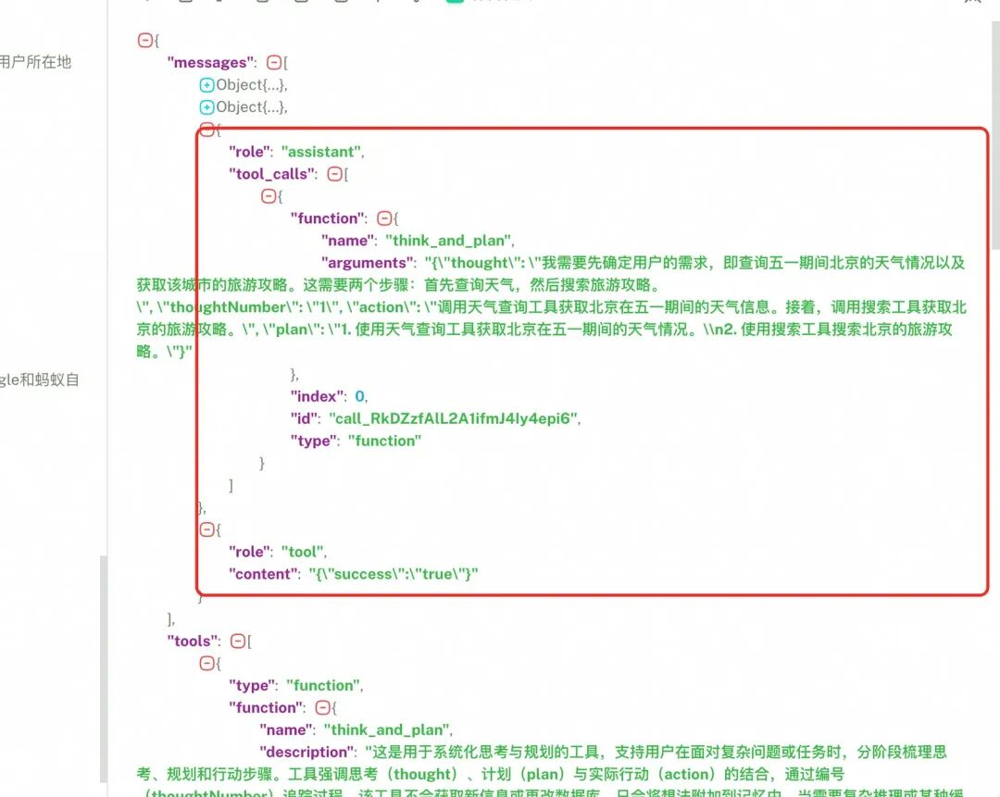

得到下一次应该使用什么工具/子智能体，及调用所需入参：

对于个人开发者，如果做一些小工具给自己工作提效，完全没问题，甚至是最优解。

但对于平台开发者，更多的站在用户使用视角，此前我们用functionCall构建的自主规划框架，发现有以下问题：

1.ToolCalls流式效果较差，基本使用非流式方式调用，但随着循环次数增多，等待响应的过程很长，给用户造成不好的体验。

2.并不是所有模型都支持ToolCalls。

### 方案：流式XML也很好用

为了尽可能减少用户等待下一次返回的工具名和入参，必须用流式效果将TooCalls的调用过程展示，且避免使用functionCall的流式。因此我们采用了让大模型返回 XML标签的方式来获取工具名和入参，并且为了在返回工具名之前能让用户能感知模型在推理，我们提示大模型在 返回XML标签的同时生成思考过程 ，将思考过程流式展示给用户，相当于是将思考规划步骤和工具推理步骤合并 。

可以参考以下提示词来做进一步理解：

  *   *   *   *   *

    Respond to the human as helpfully and accurately as possible.
    1. 你是一个 agent，请合理调用工具直至完美完成用户的任务，停止调用工具后，系统会自动交还控制权给用户。请只有在确定问题已解决后才终止调用工具。 2. 请善加利用你的工具收集相关信息，绝对不要猜测或编造答案。  3. 部分工具会产生文档，上下文中只会保留文档的标题，当有其他工具需要该文档内容时，你只需要正确返回完整文档标题到工具入参中即可，如xxx.md。 4. **切记** 最终的回答必须是一份完整详尽的答案，而不是对执行任务的总结。5. 一开始首先对任务进行合理拆分，给出思考和规划过程，严格按照思考规划过程按步骤执行，执行过程中可根据工具返回结果合理调整规划步骤
    你有如下可用工具列表:%s //这里是直接把functionCall的Tools列表转string做替换即可
    返回本次需要调用的工具理由及工具名和工具入参，每次只提供一个操作,**工具名及工具入参必须遵循以下格式**<tool_name>工具名</tool_name><arguments> 完整的json格式 </arguments>**切记 工具参数必须是标准的json格式**
    遵循以下格式:
    Thought: [深入分析当前任务和可用资源，考虑前后步骤，输出本次调用的依据]Action:  <tool_name>工具名</tool_name> <arguments> 完整的json格式 </arguments>Observation: 工具执行之后会返回的结果**切记 工具参数必须是标准的json格式**...(重复 Thought/Action/Observation N 次)
    当任务执行完成时，或必须需要用户介入时，严格按照以下格式返回：<final_answer> 最终给用户呈现的任务结果总结 </final_answer>
    <instruction>%s //这里是用户自定义的提示词作替换，因为我们做的是平台，因此支持用户自定义提示词 </instruction>

大模型输出的结果如下：

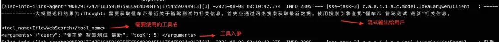

我们可以流式接收，然后将Thought部分流式展示给用户，让用户感受到智能体在不断思考和工具调用。

而<tool_name></tool_name>部分我们可以快速提取到所需工具或子智能体名，<arguments></arguments>部分我们可以提取到工具或子智能体需要的入参，且是标准的json格式。

当然，用XML的方式作工具解析除了可以流式渲染，不容易断开链接以外。能更大程度的使用各类不支持toolCall的模型，甚至是后续业务发展以后，用户对图片提问时，也可以用多模态模型来做思考规划和多智能体调用！！

### 效果演示

采用XML的方式输出结果：

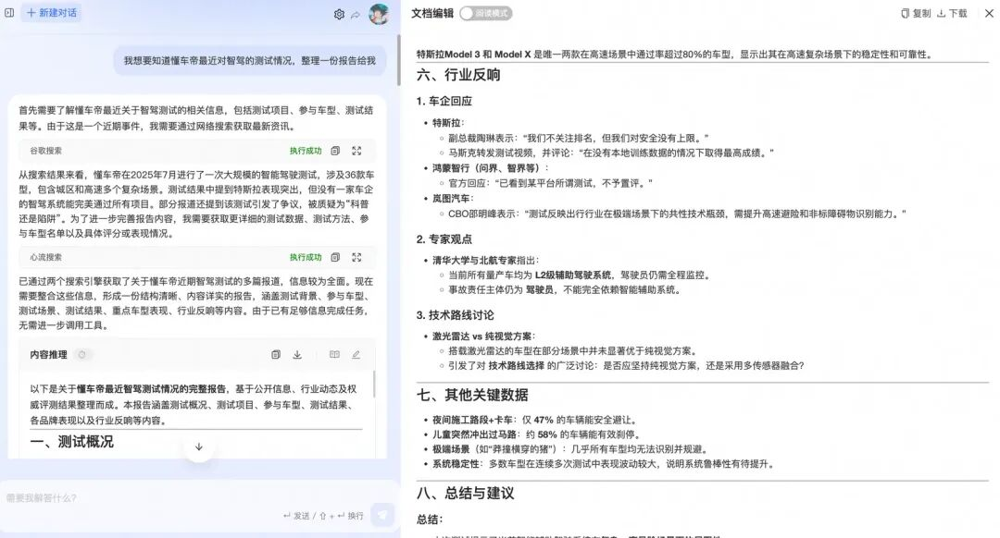

图1 使用XML方式做思考规划及工具调用

原本使用FunctionCall的输出结果如下：（functionCall时将思考规划作为单独的工具，用XML的时候我将工具推理和思考规划统一放在一步里面完成），展示形式不够友好，用户看到的只是平铺的一整段工具调用。

图2 使用FunctionCall做思考规划及工具调用

对比改进之后和改进之前的结果发现：

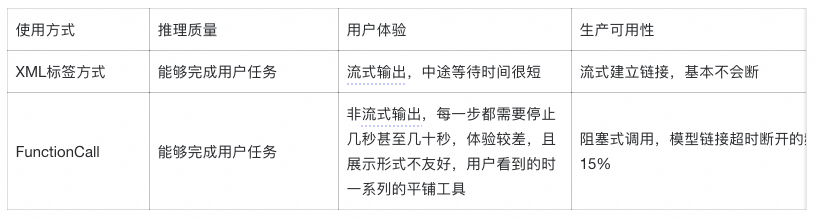

## 上下文简单压缩传递

### 问题：上下文过长影响质量和速度

工具或子智能体调用次数过多时，会产生很长的上下文很长，造成的问题：

1.推理方面耗时增加；

2.难以将某一步产生的原文共享给子智能体或工具，大多数情况下子智能体的推理质量需要足够的上下文，最好是原文，而不是大模型提炼出的摘要；

3.模型调用成本增加，或某些模型的上下文窗口有限，调用报错；

### 方案：合理引用

针对上述痛点，我们主要做了简单的上下文压缩：

1.定义了一些特殊的文本生成工具，背后实际是单独的大模型调用，如创作类助理场景，生成PRD、生成系分等；

2.当需要很长文本推理时，系统会思考判断调用这些工具；

3.生成后会将文本内容作为文件存储，只将引用信息放在调用的上下文中；

4.推理生成工具名和参数过程中，当生成的工具参数为引用信息时；

5.基于引用信息查询文件原文，将文件原文给到工具或子智能体；

如果是网络检索等工具产出的大量数据：

1.训练文本改写小模型；

2.检索工具返回的内容调用改写模型；

3.将改写后的数据写到上下文，大幅降低上下文长度；

改造前的上下文流转如下：

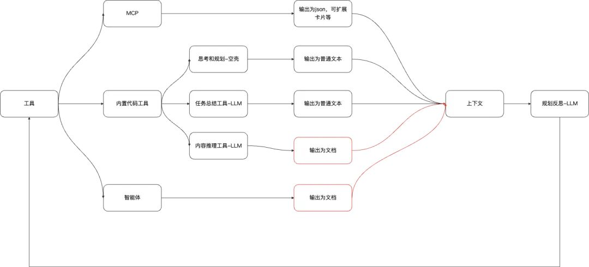

改造后的上下文流转如下：

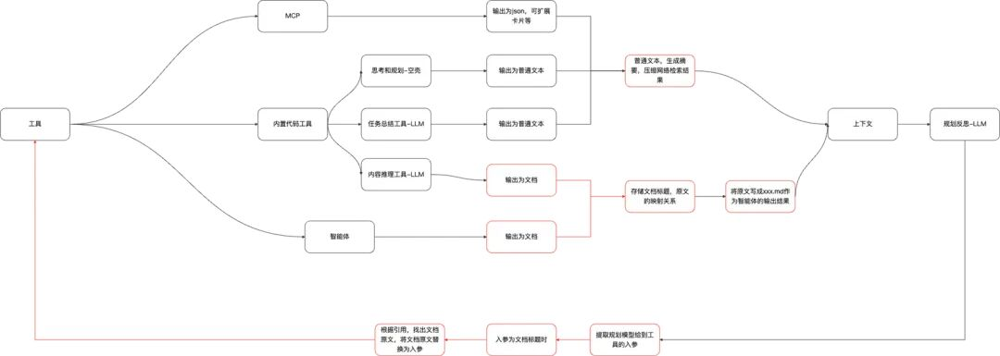

其实上下文工程本身是一个很复杂的研究课题，此次优化仅针对贴合业务场景遇到的问题进行了处理，最近也在研究上下文处理，后续会做专业的迭代升级。

### 效果演示

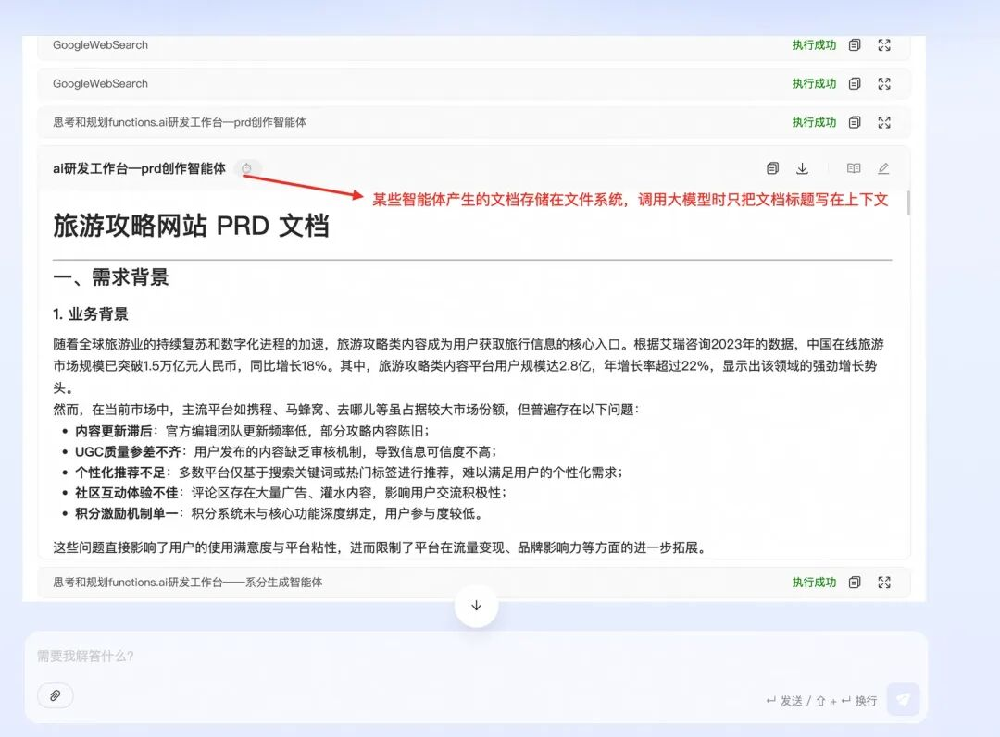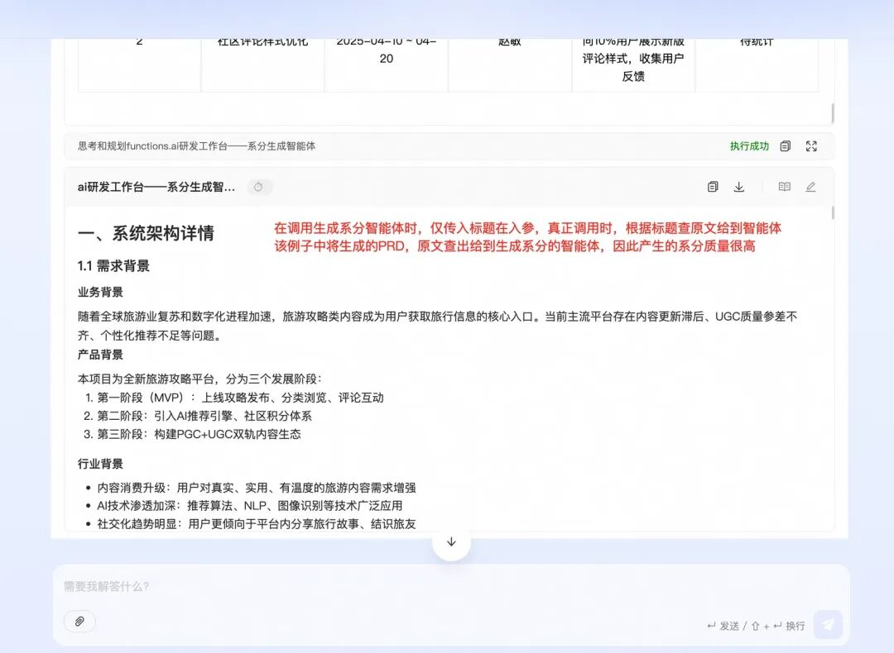

## 规划过程不止是推理下一步动作

### 问题：主智能体不负责文本推理

主代理在循环过程中，主要职责是产出下一步应该调用什么工具，以及工具的入参是什么。但是 如果没有一个工具或智能体的能力能够执行规划出的下一步动作时该怎么办？

举个例子：

已知：目前工具或子智能体列表，仅有 网络检索工具 和 生成PRD的智能体

用户的提问为：我要写一个关于RAG系统的PRD，先帮我生成大纲，根据大纲内容生成PRD

此时相信大多数规划模式的回复过程为如下步骤：

1.首先我需要调用网络检索工具查询RAG系统相关概念。

> 此时网络检索工具调用输出了结果。

2.我已经调用网络检索工具获取了RAG相关概念，接着我要生成大纲。

3.我已经生成了大纲，现在我要调用PRD生成工具来进一步扩展。

> 开始调用PRD智能体，入参是生成的很简单的一个大纲内容。

如上例子其实存在一个很严重的问题！！ 从第二步到第三步，

没有任何一个工具或模型能够去参与，因为没有一个工具是生成大纲的，模型此时直接认为它已经生成了大纲，或者它知道它要生成大纲，但是就是没有大纲的产生。

因此也就会导致下一步工具调用时，严重缺少上下文，产生的入参质量较低，从而导致子智能体的产出质量较低。如果任务很复杂，可能会导致最终结果差强人意！

### 方案：“万能agent”兜底

该问题产生的核心是，某些步骤没有对应能力的工具去解决，但其实这些步骤用通用大模型就能够推理出来，从而给到后续步骤足够的内容。

整套框架基本为工具驱动，因此我们可以补充一些通用的工具来解决这类问题，这里我内置了一个推理工具，当没有工具可以生成规划中的某个步骤内容时，主代理会自动调用该工具来生成一些推理，以便后续子智能体有足够的背景知识。

该工具描述如下：

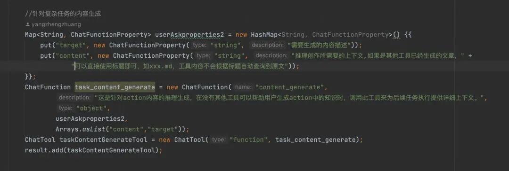

### 效果演示

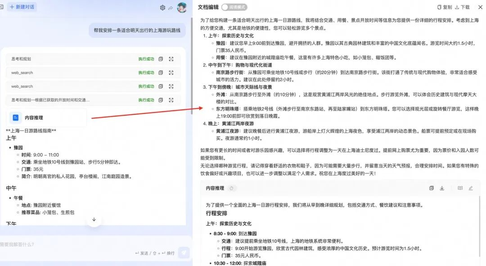

如上图所示，实际上提供的子智能体或者工具没有一个是进行路线规划报告生成的，但因为有一个通用的内容补充工具，在这个case的执行过程中就会适时的生成一份详细的路线规划，给到主智能体足够丰富的知识，因此最终推理的结果也是质量较高。

## 让结束时的回答更贴近用户，而不是贴近机器命令

### 问题：任务总结很敷衍

通常我们判断React模式是不是执行完成，最基本的做法是：

1.获取模型返回的工具列表，如果工具列表为空时，判断为任务执行结束；

2.加一下围栏条件，比如防止陷入死循环，设置工具调用次数超过10次时跳出循环；

但是针对稍微复杂的任务，这种做法大多数情况下最终的输出都会是如下这种类似回复：

“通过执行完xxx我已经帮您完成了xxxx任务，如您还有其他问题可以向我咨询”

站在开发同学视角，看着其实没什么问题，因为确实任务已经成功完成，并且想要的一些结果可以自行回顾执行过程，执行过程中可以看到产出。

但是站在用户视角，用户最终想要的是一份完整的报告或者总结，要么最后的输出中没有这些总结，要么给出的总结很简略。

### 方案：工具驱动思想有点用

一些交互做的比较好的产品，类似豆包、1day、扣子等，会通过将产出的中间过程文件都整理在一个显眼的地方，用户可以点击看到生成的文件，从而自然的忽略最终生成的文案是什么。

我们的平台目前的投入还不足以和豆包、1day这些产品对齐。因此我还是基于工具驱动的理念，设计了一个总结输出的工具，对判断结束的条件做了改进：

1.如果判断输出的工具为内置的一个结束总结工具；

2.此时我也会判断任务执行完成；

3.但会多调一次原生大模型，利用该工具的入参，推理出专业的任务汇总；

该工具描述和入参描述如下：

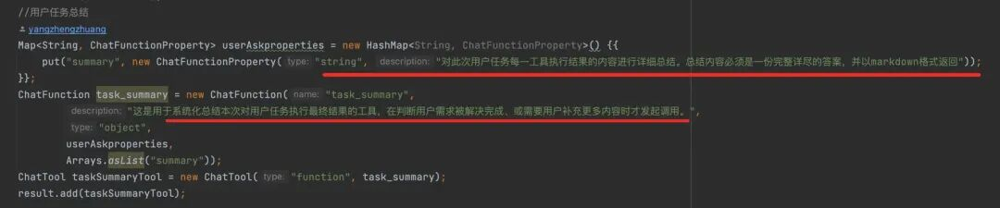

### 效果对比

不使用总结工具的输出如下，最终生成的内容只是“xxx已经生成完毕，如有xxxx随时告诉我”，用户需要爬楼去找真正输出xxx文档的那一步的结果。

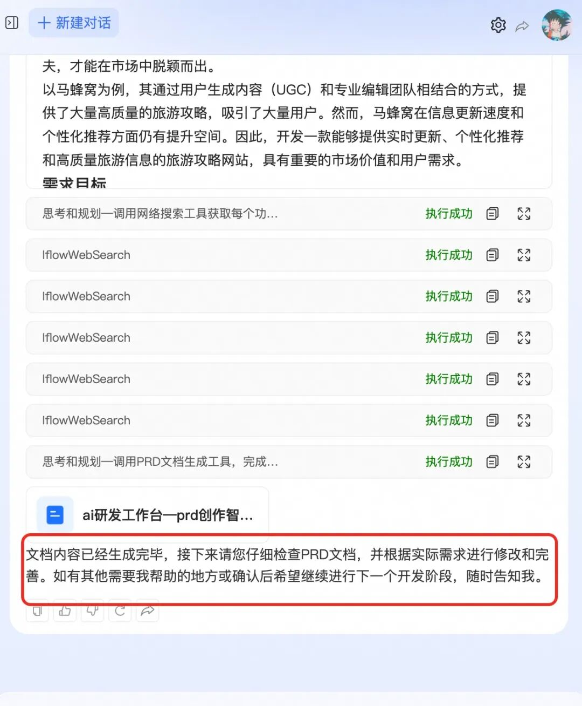

使用推理总结工具后如下，最终生成的输出是很详细、直观、可以直接使用的总结。

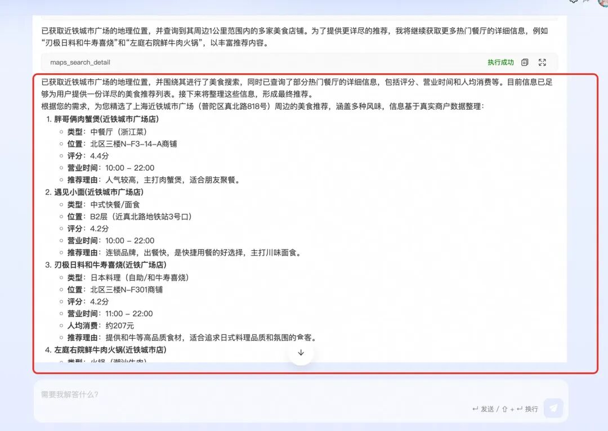

## 让执行过程保持初始规划轨迹

### 问题：过程监督必不可少

我们构建react框架最初的思想是基于工具驱动，即提供一些空壳方法，让模型来推理这些方法的入参，从而产生一些规划记忆到上下文中，具体可以参考我上一篇文章： [基于大模型的领域场景开发：从单智能体到多智能体的React框架设计与实现](<https://mp.weixin.qq.com/s?__biz=MzIzOTU0NTQ0MA==&mid=2247552082&idx=1&sn=0749e0ae5f6985012c5fdc0b307258b1&scene=21#wechat_redirect>)。

借助这种空壳方法，实现类Manus的一个自主规划过程。

虽然每个工具执行完以后，都会结合此前的规划和本次的执行结果，重新进行思考，但是：

1.缺乏一个监督机制，思考的轮次多了以后，可能已经和最初的规划“跑题”，陷入局部最优，而非全局最优。

2.容易出现死循环，某些性能不好的模型，发现上次执行了A工具，本次还执行了A工具，后边会陷入幻觉，它认为每一次就该执行A工具，因此会不断重复调用A工具。

### 方案：我们做了一个即插即用的MCP

针对上述问题，解决方案也比较简单，既然没有监督机制，基于工具驱动的思想，就再造一个监督工具，模型每次调用完工具，给足够的引导让去修改任务执行情况，以及输出下一次应该执行的任务是什么，不断更新待办表，知道所有任务都被打标完成，基本就和manus做法一致。

我们做了如下的规划MCP服务，其他应用也都可接入使用：

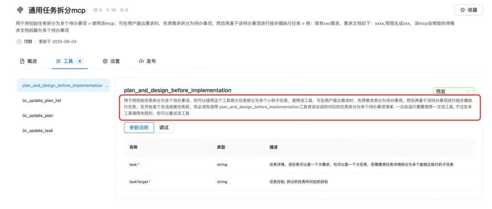

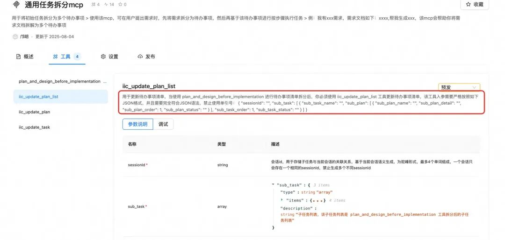

### 效果演示

通过制定计划，然后严格按照计划清单去执行，遇到需要用户打标确认的会停止：

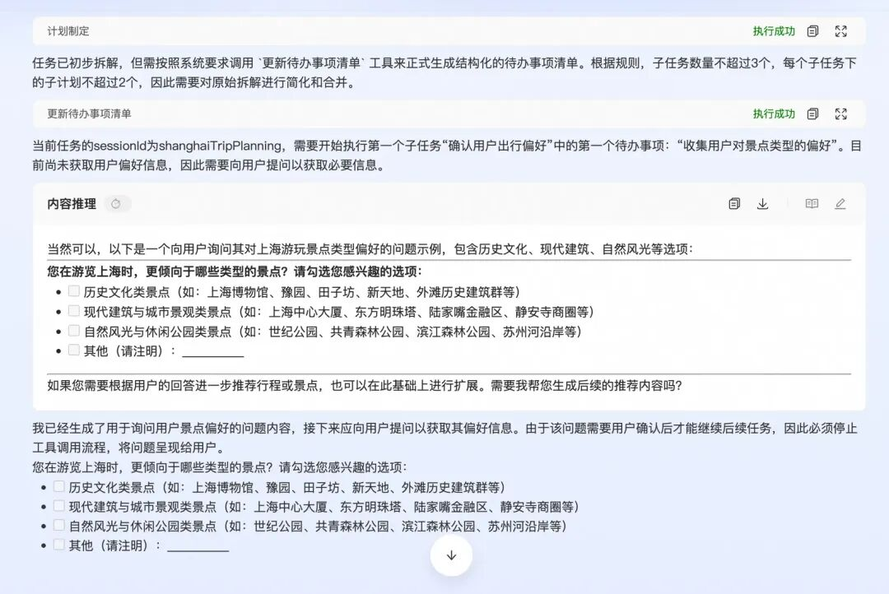

不断更新任务和子任务完成情况，最终产出高质量的输出。

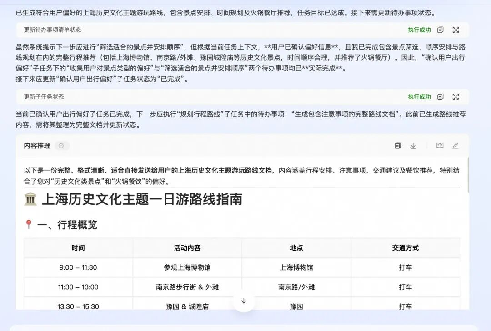

## 总结

本文针对我们此前开发的react模型助理，在生产run了一段时间后跟踪到的一些性能及体验问题，对改进优化的方案做了详细介绍，以及重点分析了每种问题产生的原因，不论是自主规划模式，还是其他的群聊模式，希望提供一些借鉴，同时也希望能获取到一些输入来不断完善我们的平台建设，感兴趣的可以访问我们平台，创建自主规划类助理https://e-robot-manage.rajax-inc.com/ 。或是访问我们的数字分身： 小e个人数字分身钉钉端，也是使用的自主规划模式构建。

多智能体协同构建做了有一个月左右，零散的会不断优化一些小的功能，其实发现很多东西还是针对模型本身能力不足，进行的工程层面的优化，如：上下文过长、推理太慢不友好。。。 其实如果允许，直接上Claud可能会节省不少的优化工作，因此其实发现，有的东西实在优化不动的情况下，可以等待更好的模型出现。比如刚解决完上下文过长时，qwen3-coder突然发布，1M的上下文窗口基本cover了我一个人的优化成本。

****

### 创意加速器：AI 绘画创作

本方案展示了如何利用自研的通义万相 AIGC 技术在 Web 服务中实现先进的图像生成。其中包括文本到图像、涂鸦转换、人像风格重塑以及人物写真创建等功能。这些能力可以加快艺术家和设计师的创作流程，提高创意效率。

## 点击阅读原文查看详情。
