# 如何像 Manus 交付业务需求-- OneAgent + MCPs 范式

> **公众号**: 阿里云开发者  
> **发布时间**: 2025-06-13 08:30  

Manus 交付(Deliver) 业务需求其实是一种新的单领域 Agent 开发范式，让我们从最简单的 LLM 调用讲起。

## Agent 发展简史

### 1\. 单一 LLM 调用

最开始将 LLM 当做一个好用的文本任务类万能接口，利用其完成单一的摘要、分类、翻译类工作。基于文本的调用交互虽然简单，但是依然是当前 AI 系统的本质。

### 2\. Workflow LLM 编排

随着应用需求的复杂化，单一的 LLM 调用往往不足以完成整个任务。于是发展到工作流（Workflows）模式：通过编排多个、预先定义好的 LLM 调用（或其他工具调用）来执行一系列步骤。这个阶段的核心思想是将一个大任务拆解成若干子任务，每个子任务可以由一个或多个 LLM 调用完成，并按照预设的逻辑顺序或条件分支执行。前一步的输出可以作为后一步的输入，形成数据流。例如：`意图识别 -> 资料收集 -> 阶段资料分析 -> 汇总资料分析 -> 报告产出`。

本质上这是类似于将传统的标准作业流程（SOP, Standard Operating Procedure）借助 LLM 进行增强或自动化实现，从而达到类似RPA（Robotic Process Automation）的效果。Workflow 使 LLM 能够融入SOP 处理复杂、多阶段的任务，但因为执行路径和工具选择通常是固定的，所以workflow 得为每一个业务场景都搭建一遍，难以覆盖大量长尾场景。

### 3\. Multi-Agent 系统

继而将 workflow 节点中相对简单的 LLM 调用扩展到 Agent 调用,组成多智能体（Multi-Agent) 系统。在这里开始出现 LLM Powered Autonomous Agents 中提出的 Agent 的概念：

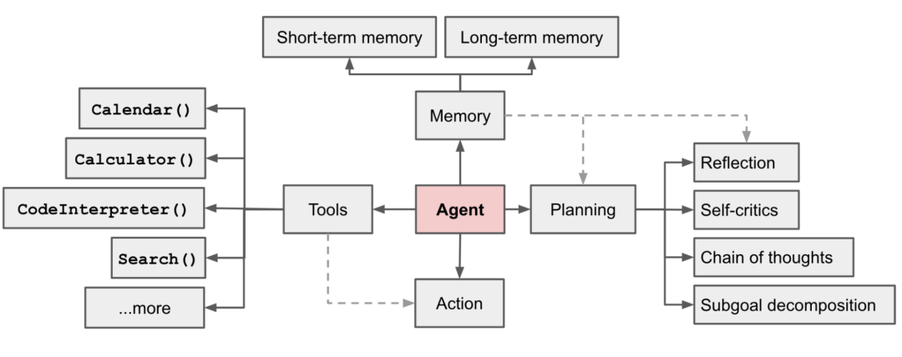

lilianweng 提出：

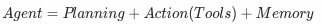

这时候各种多智能体框架也如火如荼的发展起来，比如 AutoGen、Crew AI 、 LangGraph 和 AgentUniverse等。多智能体的交互范式也基于不同的场景加以运用。之前我们实践过基于 AgentUniverse 和 PEER 模式的保险领域案件分析 LLM Agent 落地实践。不过当时公司内部只能使用 Qwen系列，不指导足够 COT 和 few-shot 的Agent 表现不太稳定。

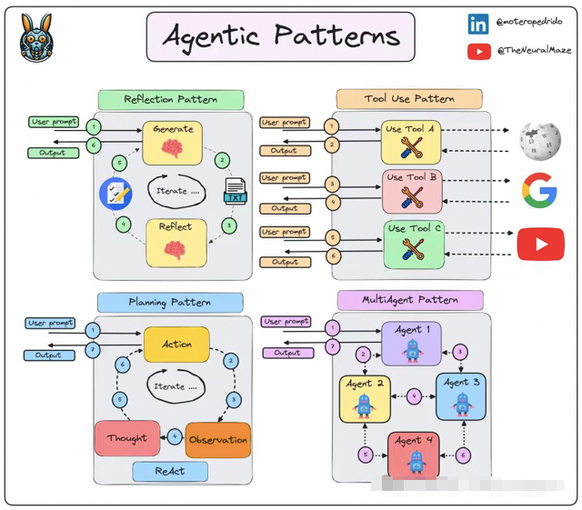

另一方面，Antropic的 Barry Zhang 提出 Agent 更简洁的概念，即**在循环（Loop）中使用工具的模型** 。

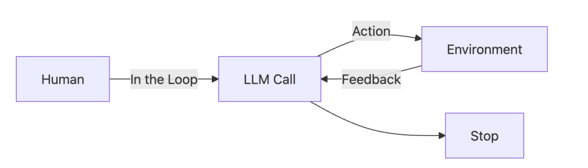

落实到代码层面，可以抽象表示如下：

  *   *   *   *   *   *   *   *

    env = Environment()tools = Tools(env)system_prompt = "Goals, constraints, and how to act"user_prompt = get_user_prompt()
    while True:    action = llm.run(system_prompt + user_prompt + env.state )    env.state = tools.run(action)

这其实是 ReAct 框架的变体，相比 ReAct, Barry Zhang 更加强调了他所认为的 Agent的抽象就是这样。这里不妨称其为 Loop框架以便区分。

### 4\. OneAgent + MCPs

从泄露的 Manus源码来看， Loop 框架一个典型的代表就是 Manus。

  *   *   *   *   *   *   *   *   *   *   *   *

    You are Manus, an AI agent created by the Manus team....<agent_loop>You are operating in an agent loop, iteratively completing tasks through these steps:1. Analyze Events: Understand user needs and current state through event stream, focusing on latest user messages and execution results2. Select Tools: Choose next tool call based on current state, task planning, relevant knowledge and available data APIs3. Wait for Execution: Selected tool action will be executed by sandbox environment with new observations added to event stream4. Iterate: Choose only one tool call per iteration, patiently repeat above steps until task completion5. Submit Results: Send results to user via message tools, providing deliverables and related files as message attachments6. Enter Standby: Enter idle state when all tasks are completed or user explicitly requests to stop, and wait fornew tasks</agent_loop>

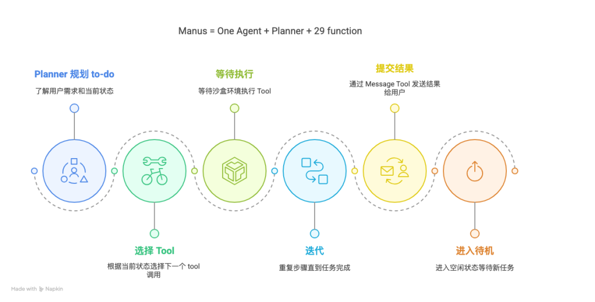

通过 Loop ,当前阶段 LLM 可以做到自主决定其行动轨迹，通过工具与环境交互，并根据反馈一步步推进或更新 plan中的进度。Manus 因此在最开始的宣传片里宣称是"世界上第一个通用智能体"。拥有一百多万用户的AI Coding 插件 Cline 也是 Loop框架，打开它的 task `index.ts` 可以看到：

  *   *   *   *   *   *   *   *

    initiateTaskLoop(userContent: UserContent): Promise<void> {        let nextUserContent = userContent        let includeFileDetails = true        while (!this.abort) {            ...        }    }

这启发了我们**如果将 Manus 和 Cline 的开发范式在企业内部落地** ，同时Manus的 29 个 function 换成企业内部领域内的 MCP Server，企业内部的Manus 就不仅仅可以完成诸如生成PPT、全网搜索分析之类的工作，还可以**完成企业内部的各个业务场景的业务需求** ，比如风控策略的部署、保险产品的精算、营销方案的策划以及从业务需求到 Coding、部署的每一步。 而在之前，为了保证效果，更多还是在每个业务场景内使用多智能体烟囱式开发，大大限制了 Agent 在各个业务场景下的应用。

MCP 最近的爆火，除了万物互联的理想、生态逐渐成熟，期望 Manus 范式在各行各业的赋能我觉得是根本原因之一。当然这里很容易被质疑，真的可以有通用的 God Agent，它可能什么都会吗？答案是肯定的否定：）GodAgent 不会存在，就好比世界上没有全知全能的人。但是**基于一个强大的基础Agent派生领域 Agent ，结合知识类 MCP/Planner的帮助，是完全有可能将Manus 范式在企业落地的。** 我们不妨将这种构建 Agent 的范式称之为 OneAgent + MCPs 范式。

OneAgent 将是每个闭环领域内的一种Agent 智能落地实践。在各个领域或组织都涌现出自己的 Agent 之后，Agent 与 Agent 更大维度上的交流合作也会随之发生(A2A, Agent2Agent 协议)。

当然 OneAgent 套 OneAgent 共同完成任务的情况也会自然出现：

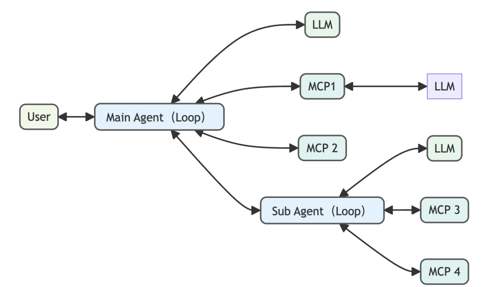

而这些具有一定自主能力的会形成一个 Agent Society。到那时Agent 就是我们同事的一份子。

### 如何选择Agent 范式？

我认为不管是哪种Agent 开发范式都是为了更好地完成业务需求，即使相对最简单的LLM 调用，它们之间也没有优劣，而且一个复杂的系统往往是他们的混合。这里引用 Anthropic 的《Build Effective Agents》以说明如何选择：

> 在使用 LLMs 构建应用时，我们建议先从最简单的方案入手，只在确实需要时才增加复杂性。这可能意味着你根本不需要构建 Agentic 系统。Agentic 系统通常会牺牲一些延迟和成本，来换取更好的任务表现，你应该仔细权衡这种取舍是否划算。
>
> 当确实需要更高复杂度时，Workflows 在处理界定清晰的任务时，能提供更好的可预测性和一致性；而当需要在规模化场景下实现灵活性和模型驱动的决策时，Agents 则是更好的选择。

现在让我们继续 OneAgent 的范式介绍。下面是一个OneAgent 回答精算师一个实际业务问题的案例。

## OneAgent + 精算 MCPs =

## 自动化分钟级交付精算定价方案

1\. 首先 OneAgent 会思考当前需求；

> 为定价方案... 寻找纯风险保费小于 100 的属性组合

2\. 当它发现这个需求是自己自己预训练的知识盲区，它会去询问 精算知识 MCP ，精算知识 MCP 会给他相关的精算业务知识补充，同时给了一个初步规划；3\. OneAgent 思考后规划出来详细的 todo ；4\. OneAgent 按照 todo 调用精算 MCP ；5\. 当 OneAgent 收到 MCP 各自的回复，会在文档中记录必要的信息备忘或适当更新 todo ；6\. OneAgent 有条不紊地调用 MCP 完成 todo ,最后交付定价方案；

这里限于企业内部数据，视频不予展示。

## OneAgent + MCPs Web端系统

### 组成部分

我们可以推理一下OneAgent Web端系统需要什么组件。可以从第一性原理出发，先从人的视角来看。我们接到任务后，先看看有什么工具能帮助自己。然后会不自觉地想下一二三怎么做。当我们有不清楚、不知道的事情时，会去问人、查资料，问专家。现实里也不存在全知全能的人，因此完全通用的 God Agent 也难以实现。所以我们如下推理：

1\. OneAgent 本身是一个 Web 端的 MCP Client；2\. OneAgent 作为一个通用的 Agent, 在每个领域或者特殊的 task 可以有自己的分身。创建分身时有自己经过调教的提示词，以及自带一些 MCP；3\. 有很多存量的 HTTP 与 TR/HSF服务如何转成 MCP Server？MCPBridge 帮助存量服务桥接为 MCP Server；4\. OneAgent 执行时如果已有的 MCP Server 不满足怎么办？所以还需要一个推荐 MCP 的 MCP，我们不妨起名 MCP0，寓意OneAgent 首先使用的第 0 个 MCP；5\. MCP0 所消费以及创建 MCP 分身时的 MCP 元信息从哪里来？MCP—Registry 提供注册以及展示 MCP 的注册中心；6\. OneAgent或分身在执行时还会发现用户总有问题进入到了自己的知识盲区，靠着预训练那一点知识不足以规划好的TO-DO，因此还会有一个充分掌握领域知识的 MCP，我们不妨称之为 KnowledgeMCP ,并且这个 MCP 不止一个，是随着领域不同而不同的。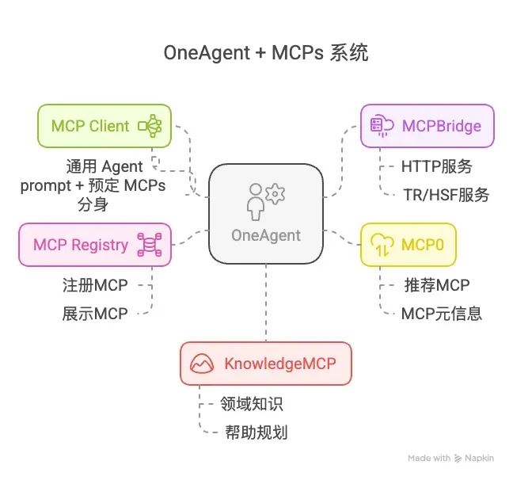

新建 OneAgent 分身过程示例：

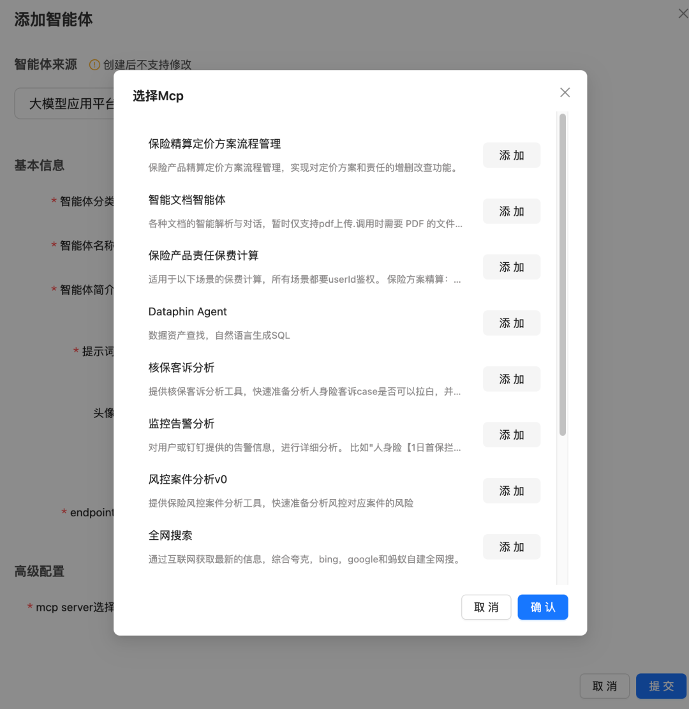

具体细节请关注文章中实践部分。

#### Planner 模块

这里其实缺少了 Manus 中一个很关键的 Planner 模块。每当我们有意识地完成一项任务时，我们会不自觉思考需要采取哪些行动序列来完成这项任务。这就是规划，而且大多数时候我们是**分层规划** 的。

例如，假设你五一决定去仙本那旅游。你知道你需要去机场并搭乘飞机。这时你就有了一个子目标：去机场。这就是分层规划的核心——你为最终目标定义子目标。你的最终目标是去仙本那，而子目标是去机场。那么怎么去机场呢？你需要走到街上，打车去机场。怎么走到街上呢？你需要离开这栋楼，乘电梯下楼，然后走出去。怎么去电梯呢？你需要站起来，走到门口，开门等等。到了某个程度，你会细化到一个足够简单的目标，以至于你不需要再规划，比如从椅子上站起来。你不需要规划，因为你已经习惯了，可以直接去做，而且你已经掌握了所有必要的信息。

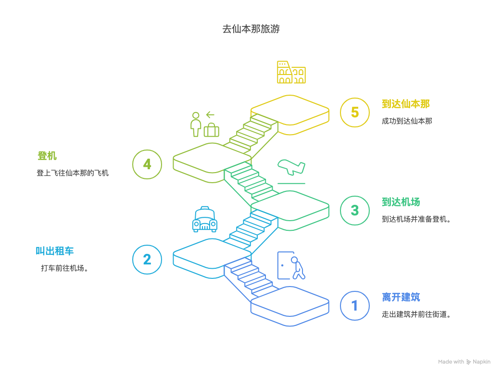

不过这个模块严格来说需要一个后训练的小模型来承担，如果有这个垂直小模型可以用来替代 KnowledgeMCP,这里我们先不考虑。

### OneAgent + MCPs 执行流程

通过上述 6 步，我们可以这样完成一个经典的 OneAgent 执行流程:

  * 当 OneAgent 的子 Agent 执行任务时，首先会尝试自己理解语义，规划 to-do；
  * 当发现自己不太清楚语义背后的知识时，会询问 KnowledgeMCP,之后更新 to-do ；
  * 基于 to-do 结合已知的 MCP Server 不断Loop；
  * 根据新的 MCP Server 返回的信息，不断更新 to-do 或 推进 to-do 进度；
  * 当已知的 MCP Server 也不满足时，会调用 MCP0 来推荐 MCP Server；
  * 不断 Loop 直到完成任务或者被用户取消任务；

OneAgent 执行流程：

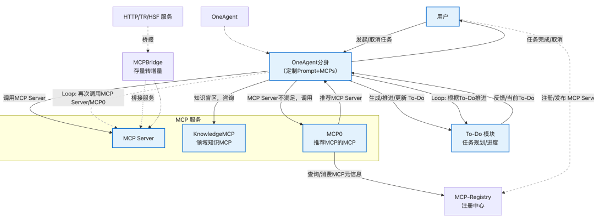

### OneAgent + MCPs 实现细节

#### MCP Server 如何封装

目前普遍的观点是 MCP 是 FunctionCall 的一个公共化、标准化的封装。我认为不止如此。FunctionCall中的 Function 是各种原子能力。但是 MCP Server 可以是多个原子能力的服务包装（SAAS）化。比如我有一个对某个实体对象的 CRUD 操作，我可以不单单透出 CRUD 的接口能力，而是CRUD 的某种组合可以完成一个简单但闭环的业务操作。这样的封装逻辑可以避免 Tool 的不断膨胀以及维护领域内能力。

基于这样的理念，MCP 本身可以封装 Agent,Agent 本身也会调用 MCP， 当然 Agent 和 Agent 之间也会交互。假如高德现在的 MCP 做的服务很好，我也有自己的贾维斯客户端可以用高德 MCP ，我还会打开高德地图 APP 吗？说的虚一点，这是从软件即服务（Software-as-a-Service）向服务即软件（Service-as-a-Software**）转变** 。

#### Loop 框架 与 Todo

Loop 框架的核心就是 Barry Zhang 的抽象：

  *   *   *   *   *   *   *   *

    env = Environment()tools = Tools(env)system_prompt = "Goals, constraints, and how to act"user_prompt = get_user_prompt()
    while True:    action = llm.run(system_prompt + user_prompt + env.state )    env.state = tools.run(action)

而Loop 中 to-do 是长流程 LLM 执行不偏离任务的关键，system_prompt 和 user_prompt 是否好坏的一个直接体现就是产出的 to-do 质量。好比我们码农写一个好的系分或者技术方案一样。一份好的 to-do 应该像说明书一样清晰,以最常见的 AI Coding 为例，todo 生成可以遵循以下规则：

  * 目标明确： 产品目标、核心功能、用户场景说清楚。
  * 接口先行：先定义好接口和数据结构、表的 Schema
  * 功能详述： 用大白话把每个功能点描述到位，无歧义。
  * 上下文给足： 引用相关代码文件路径、UI 库 (如 ShadCN)、现有模式、设计图链接等，给 AI 足够“线索”。
  * 结构清晰： 用 Markdown 的标题、列表等，方便机器解析。

to-do 的更新维护可以遵循以下规则:

  *   *   *   *   *   *   *   *   *

    <todo_rules>- Create todo.md file as checklist based on task planning from the Planner module- Task planning takes precedence over todo.md, while todo.md contains more details- Update markers in todo.md via text replacement tool immediately after completing each item- Rebuild todo.md when task planning changes significantly- Must use todo.md to record and update progress for information gathering task- When all planned steps are complete, verify todo.md completion and remove skipped items</todo_rules>

#### MCP Server 调用 Prompt

OneAgent 在一个 session 发起时即会有默认的一些 MCP，比如 MCP0 (推荐 MCP 的 MCP)、 KnowledgeMCP (领域知识 MCP) 等。同时也可能还有其他的 MCP 也在上下文中，为了更好地指示LLM 的调用，system prompt 中需要包含 MCP 的调用说明。

  *   *   *   *   *

    ### MCP Server Management- Special attention should be paid to the distinctions between domain terms.   - First identify core domain terms(风险分析, 特征开发, 策略部署, etc.)   - Strictly enforce domain isolation - NEVER cross-use MCP servers   - Immediate fallback behavior when:     * No direct MCP match found     * Request contains multiple domain terms- And some mcp selection rules:{  "mcpRules": {    "mcpUse":{        "servers":["MCP推荐、发现与安装"],        "description": "如果你不确定当前 MCP 是否合适，请求推荐MCP的MCP"    },    "knowledgeGet": {      "servers": [        "xxx知识获取 MCP"      ],      "description": "如果你不完全清楚用户意图，将完整用户问题请教Knowldge MCP"    }  },  "defaultBehavior": {    "priorityOrder": [      "mcpUse",      "knowledgeGet"    ],    "fallbackBehavior": "提示没有找到合适的 MCP,请求用户帮助"  }}

`
`

## 保险科技当前实践

以上是一些理念和设计。保险科技团队致力于通过 OneAgent + MCPs 方案以加速 Agent 应用。 目前链路简要可见：
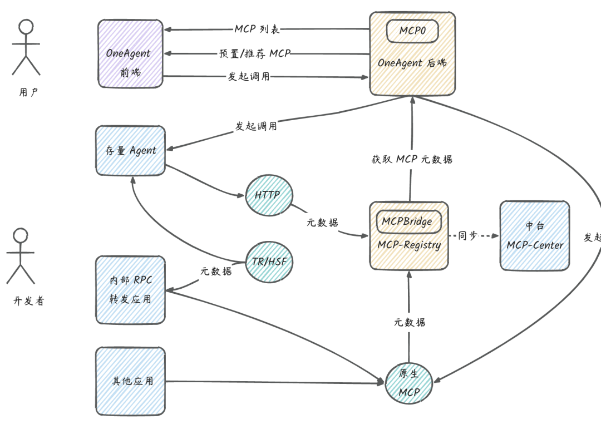

其中组件：

  * mcp-registry : 负责承载 MCP 的元数据，以及结合 MCP Bridge 转化 HTTP 和 内部 RPC（如 TR/HSF）接口变成 MCP；

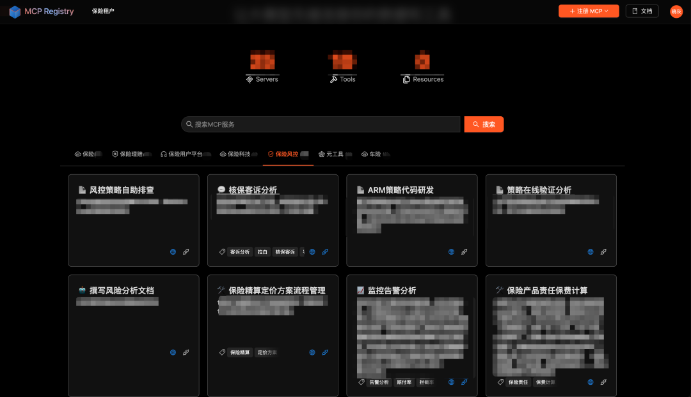

  * mcpbridge：将存量的 HTTP REST 接口转化为 MCP Server。之前在 ATA 上已经有过详细介绍。
  * mcp0：推荐与安装 MCP 的 MCP，可以感知业务的上下线与圈选等逻辑。
mcp0 基于标签匹配和 HNSW 向量索引实现了基本的 MCP 推荐逻辑，MCP 描述越丰富正确，推荐效果越好。长期来看可以引入在 MCP 选择的数据集做监督微调（Supervised Fine-Tuning）的小模型来优化效果。

我们 Web 端 MCP Client 上的 OneAgent分身智能体示例：

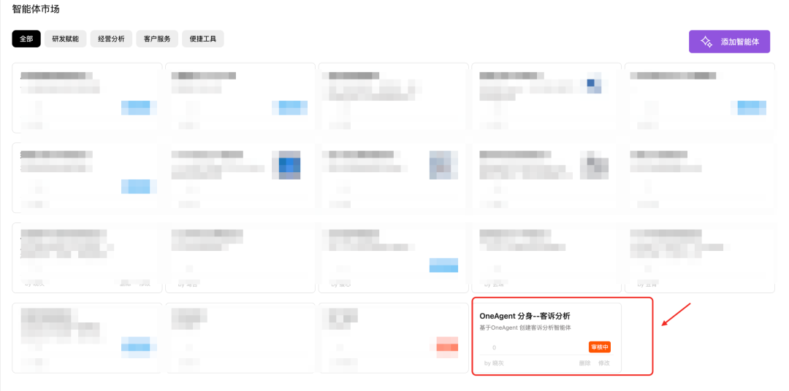

## 当前不足与发展方向

OneAgent + MCPs 范式旨在通过强大的基础Agent 结合 MCP 派生领域 Agent来完成复杂业务需求，然而在实践中，这一范式面临诸多挑战也还需要解决。

### 当前不足

`1. to-do`质量的强依赖性

Agent 的表现高度依赖 `to-do` 清单的质量。高质量的 `to-do` 往往需要经验丰富的人工介入，比如注入到 KnowledgeMCP 中，不过这也限制了 Agent 的自主性上限和扩展性。

2\. MCP 管理与交互的挑战

  * **错误传递与累积 : 单个 MCP 执行失败或返回不准确结果，如果 OneAgent 缺乏有效的验证、容错和纠错机制，错误会向后传递，影响最终结果的质量。尤其在长链条 MCP 调用中，问题会被放大。****
**

  * **上下文传递困境: 如何向 MCP 精准传递“恰到好处”的上下文信息是个难题。信息过少，MCP 可能无法准确理解意图；信息过多，则可能干扰 MCP 的核心任务处理，增加通信开销，甚至超出 LLM 的上下文窗口限制。****
**

  * **MCP 发现与选择的局限性: `MCP0` (推荐 MCP 的 MCP) 和 `MCP-Registry` 的设计是关键。但如果注册信息不完善、推荐算法不够智能，OneAgent 可能无法找到最优 MCP，或在面对新场景时束手无策。**

### 3\. 状态管理与鲁棒性

  * **状态管理复杂性： OneAgent 需要维护全局任务状态，并追踪各 MCP 的调用状态和中间结果。当任务链长、并发 MCP 调用或出现 Agent 嵌套（“OneAgent 套 OneAgent”）时，如果仅仅都是同步的还好，如果加上异步任务，状态追踪与推进变得复杂。**
  * **死循环或无效循环风险： 在 Loop 框架中，如果 LLM 在理解 MCP 返回结果或更新** `to-do` 时出现偏差，可能导致 Agent 陷入无效的重复尝试或死循环，消耗大量资源而无法完成任务。
  * **任务中断与恢复的缺失： 对于耗时较长的复杂任务，如果中途发生故障（如 MCP 服务不可用、网络问题），当前范式可能缺乏优雅的任务中断、状态保存及后续的无缝恢复机制。这与 Greg Benson 提到的 “Agent Continuations for Resumable AI Workflows” 概念息息相关，是企业级应用的关键需求。**

4\. 知识整合与运用的深度

  * **KnowledgeMCP 的依赖: Agent 的领域问题解决能力很大程度上依赖** `KnowledgeMCP`。如何保证 `KnowledgeMCP` 的知识覆盖度、时效性，以及 OneAgent 如何高效准确地从中检索和运用知识，是持续的挑战。

### 发展方向

上述问题也是业界当前普遍面临的挑战，这些提供一些已经能看到的发展方向：

### 1\. 构建标准化的 MCP/Agent 交互生态

  * **MCP 接口标准化： 推动 MCP 接口的标准化，不仅仅是技术层面的 API 格式，更包括能力描述、输入输出规范、错误代码、元数据等。这有助于实现 MCP 的即插即用和互操作性，呼应 A2A 的“发现能力”和“协商交互模式”。**
  * 任务委托与管理：在 SDK 层面，实现包括同步和异步任务的，标准化的任务分发、进度跟踪、结果回收机制。比如引入标准的事件驱动模型，MCP 可以通过事件领取任务、通知 OneAgent 任务状态的变化，OneAgent 可以根据事件做出相应的决策。

### 2\. 提升系统的鲁棒性、弹性和可观测性

  * **精细化错误处理与容错： 在 OneAgent层面实现更智能的错误检测、分类，并根据错误类型采取不同策略（如重试、切换 MCP、请求人工介入、优雅降级）。**
  * **任务持久化与可恢复工作流： 实现任务状态的持久化存储。当任务中断后，能够从最近的检查点恢复执行，而不是从头开始。这对长耗时、高价值的企业流程至关重要。**
  * **增强可观测性： 引入更完善的日志、追踪和监控机制，不仅记录 MCP 调用，也记录 OneAgent 的内部决策（如 LLM 的思考过程、**`to-do` 的变更），便于调试和性能优化。

### 3\. 优化 MCP 调用与管理

  * **异步与并发 MCP 调用： 对可以并行的 MCP 调用采用异步模式，减少整体等待时间。智能判断任务依赖，最大化并发度。**
  * **智能上下文管理： 研究更高效的上下文压缩、摘要、选择性传递技术，确保 MCP 获取必要信息的同时，降低通信和处理开销。**
  * **MCP 性能与成本感知： OneAgent 在选择 MCP 时，除了功能匹配，还应考虑其历史性能、调用成本、SLA 等因素，做出综合最优决策。**

### 4\. 系统智能提升

  * **强化学习 (RL) 应用： 如下文将介绍的，应用 RL 优化 MCP 选择、参数调整、任务序列规划等，使 OneAgent 能从历史经验中学习，持续提升效率和成功率。**
  * **知识库的动态构建与更新：**` KnowledgeMCP` 不应仅是静态知识库，OneAgent 在执行任务过程中，可以将新学到的知识、成功的解决方案模式反馈给 `KnowledgeMCP`，实现知识的持续进化。

## Agent 系统智能提升

当我们从 Workflow转向 OneAgent + MCPs 的Agent 范式时，长期来看，我们就可以避免图灵奖得主Richard S. Sutton 所说的 《苦涩的教训》：

> 1.AI 研究员总想着把知识注入到他们的模型中
>
> 2.短期是有帮助的，并且对研究人员个人来说是令人满意的
>
> 3.但从长远来看，它会停滞不前，甚至抑制进一步的进展
>
> 4.最终的突破性进展往往是通过一种相反的方法实现的，这种方法依赖于扩大搜索（search）和学习（learning）所需的算力

之所以说长期来看，因为这需要 Agent 能够不断从自身所处的环境中探索，从反馈中学习，最终超越人类经验。就像 OpenAI 对 o3 的tool use 进行了端到端的强化学习（RL，Reinforcement Learning），使其能够在推理过程中链式地调用外部工具（如搜索引擎、计算器、代码解释器等），甚至在思维链中进行图像推理。这种推理能力的涌现是基于 RL 的DeepResearch 的扩展。

回到我们业务现实中，想要系统性的提升业务应用的 Agent 智能，解决 MCP 的选择、多流程调用问题，离不开对模型的参数微调。我是工程同学，因为做 DeepResearch 多了解了一下 RL，这里简单介绍一下如何使用 RL 提升模型运用工具的推理能力。

### 什么是强化学习？

强化学习是三种主要的机器学习范式之一，区别于监督学习和自监督学习。监督学习（supervisor learning）是最经典的一种。

训练监督学习系统的方法是，比方说让一个系统识别图像。你给它看一张图片，比方说一张桌子，然后告诉它这是一张桌子，这就是监督学习，因为你告诉它正确答案是什么。这就是计算机的输出，如果你在表格上写了别的东西，那么它就会调整内部结构中的参数，从而使它产生的输出更接近你想要的输出。如果你继续用大量的桌子、椅子、汽车、猫和狗的例子来做这件事，最终系统会找到一种方法来识别你训练它的每张图片，同时也能识别它从未见过的与你训练它的图片相似的图片。

自监督学习(self-surpervised learning) 就是目前 LLM 的基本原理。它的核心不是训练系统完成任何特定任务，而是训练它学习输入(含输出)的内部依赖关系。对 LLM 来说，这种方法简单说就是截取一段文本，而文本中的最后一个单词不可见，于是可以训练系统预测文本中的最后一个单词。

而在强化学习(reinforcement learning)中，系统并不知道正确答案是什么，我们只会告诉它，它得出的答案是好是坏。某种程度上，这和人类学习有点像。比如你试着骑自行车，但不知道怎么骑，过一会儿摔倒了，于是你知道自己做得不好，然后你不断尝试如何平衡，直到学会骑自行车。强化学习是很有效的激发模型推理能力的范式，因此 AlphaGo 才能下出惊人的第 37 步。不过它的缺点是训练效率很低，需要大量的尝试反馈。

### 强化学习如何应用于 Agent？

Agent 的根本是模型的能力，而我们可以通过微调（Fine-Tuning）在预训练模型的基础上，使用特定任务或领域的数据进一步训练模型，使其满足特定场景的需求。使用强化学习的方法微调，被称作强化微调（Reinforcement Fine-Tuning, RFT）。这也是 OpenAI 在去年圣诞节发布的 LLM 最新功能。通过强化微调，可以做到让模型将MCP 作为推理链的一部分来使用。听到这里，你可能会疑惑，这和我之前介绍的 Loop 框架中调用MCP 有什么区别？

区别就是强化微调是“教模型如何自己用 MCP”，而 Loop 框架是“指示模型按to-do 或者规划用 MCP”。强化微调对于探索性、智能要求高的任务更有必要。比如 DeepResearch 的场景中，就需要 RL 来训练模型边思考边查资料，不偏离研究主题，以及什么时候停止。

### 如何做强化微调 ？

这里以ReSearch 框架为例，看怎么将搜索操作视为推理链的一部分。
ReSearch 基于Group Relative Policy Optimization (GRPO) 的强化学习算法，通过采样多个推理链（rollouts），优化模型以生成更高奖励的推理链。

1\. 模型先生成一段思考过程（用标签包裹），然后决定是否需要搜索（用标签包裹查询），搜索结果（用标签包裹）会反馈给模型，继续推理。比如对于“国富论出版那年中国皇帝是谁？”，模型可以这样推理：

  *   *   *   *   *   *   *   *   *

    <think>我需要先确定《国富论》的出版年份。</think>  <search>国富论出版年份</search>  <result>《国富论》由亚当·斯密于1776年出版。</result>
    <think>现在需要查找1776年对应的中国皇帝。</think>  <search>1776年清朝皇帝</search>  <result>1776年是清朝乾隆四十一年，当时在位的皇帝是乾隆帝（爱新觉罗·弘历）。</result>
    <answer>答案是\boxed{乾隆帝（Qianlong Emperor）}。</answer>

2\. ReSearch通过奖励信号（如答案的正确性）优化模型，使其学会何时搜索、如何搜索，以及如何利用搜索结果进行推理。训练过程中，模型会不断尝试不同的推理路径，最终找到最优的解决方案。3\. 奖励信号分为两部分：

  * 答案奖励（Answer Reward）：通过F1分数计算最终答案的正确性。不太熟悉F1 分数的可以看下我之前的文章: 向量与向量数据库简介；
  * 格式奖励（Format Reward）：检查推理链是否符合预定义的格式（如标签是否正确、答案是否用\boxed{}包裹）。

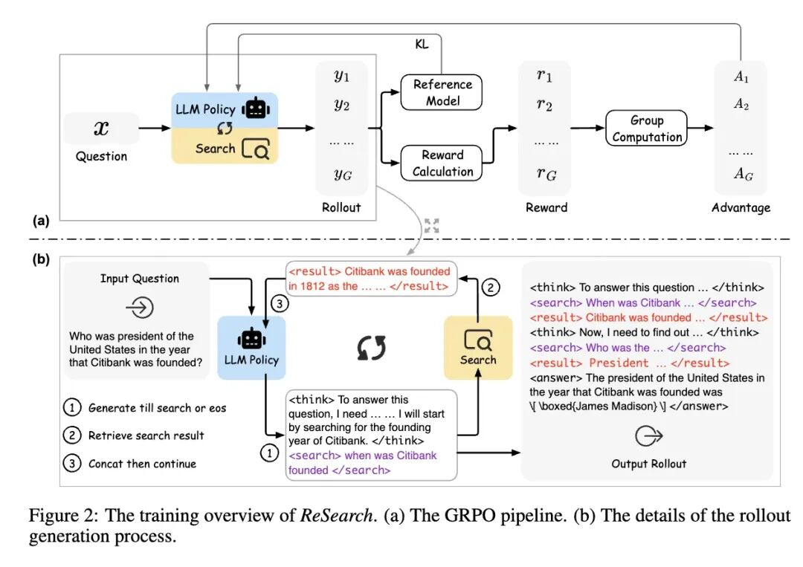

通过这种训练方式，模型能够逐步学习如何在推理过程中有效地利用搜索操作。基于强化学习的工具/MCP 调用融于推理链是大趋势--Model as Agent,模型即智能。除了 GRPO 的 RL 算法，还有 RLVR（Reinforcement Learning from Verifiable Rewards）更值得关注，其思想是引入真实环境反馈让模型自我学习，不依赖人类标注数据，通过环境奖励自博弈实现推理能力进化。

## 展望

最后需要强调下，我并不推崇 GodAgent 的模式，OneAgent + MCPs 致力于快速落地领域 Agent，特点是可以基于这个“基类” 快速搭建领域 Agent 完成很多长尾任务，而不是每一个场景都 workflow 编排，或者说可以做到让业务自己通过 prompt 编排。这个单领域 Agent 也远不是终点，围绕着文章中的不足与发展方向我们还在继续探索。

希望 OneAgent + MCPs 的范式能实现更多行业、领域、业务需求的 AI Coding，让 Agent 真的成为我们的同事。如果对文章有任何问题想要深入讨论，欢迎同行交流：xiaohui.wyh@antgroup.com

## 参考链接：

  * LLM Powered Autonomous Agents by Lilian Weng：https://lilianweng.github.io/posts/2023-06-23-agent/
  * 疑似Manus 源码 \- GitHub Gist：https://gist.github.com/jlia0/db0a9695b3ca7609c9b1a08dcbf872c9
  * Build Effective Agents by Anthropic：https://www.anthropic.com/engineering/building-effective-agents
  * Service-as-a-Software：https://news.marsbit.co/20240620165143890919.html
  * ReSearch 项目：https://github.com/Agent-RL/ReSearch
  * Greg Benson 教授关于分层多智能体架构的分析：https://github.com/SnapLogic/agent-continuations?tab=readme-ov-file
  * A2A (Agent2Agent) 协议：https://google-a2a.github.io/A2A/specification/#723-taskartifactupdateevent-object
  * 苦涩的教训：https://zhuanlan.zhihu.com/p/692633094

****

### 智能理解 PPT 内容，快速生成讲解视频

在制作线上课程、自媒体内容或者活动宣传视频时，用户通常需要撰写解说词、录制音频和剪辑视频，制作流程繁琐且周期较长。本方案利用大模型的理解和生成能力自动将 PPT 转化为讲解视频，提高了制作效率，使创作者能专注于内容创新。

## 点击阅读原文查看详情。
