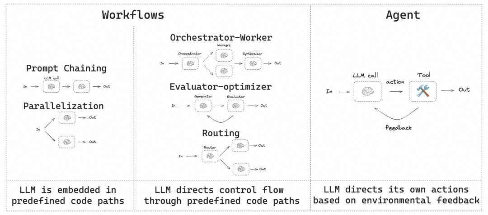
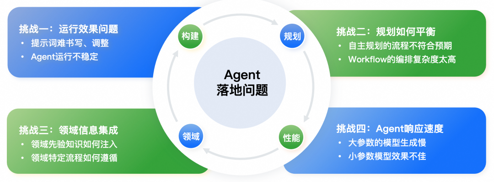
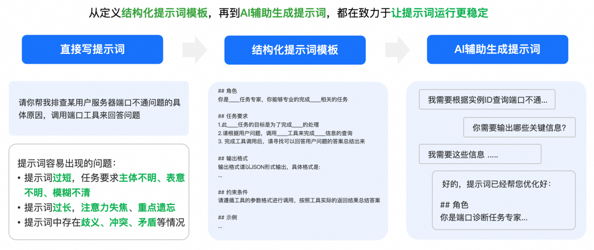
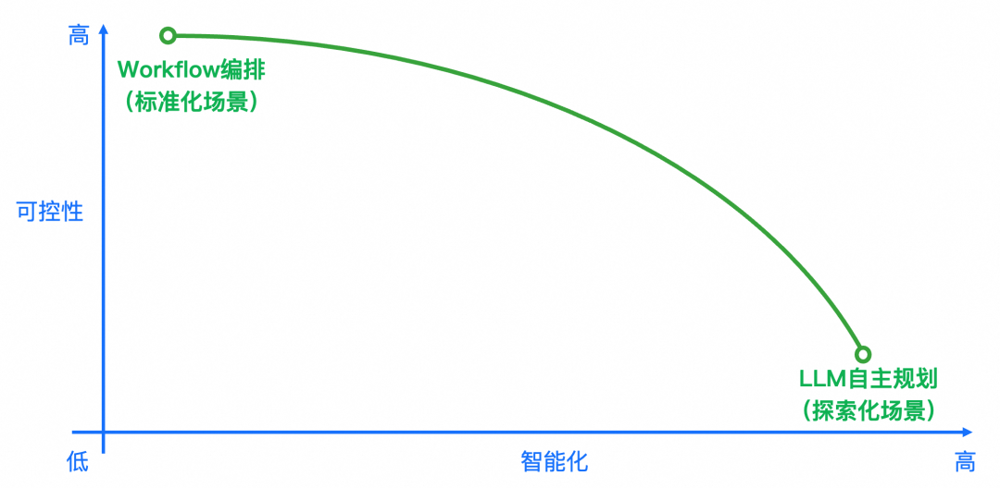
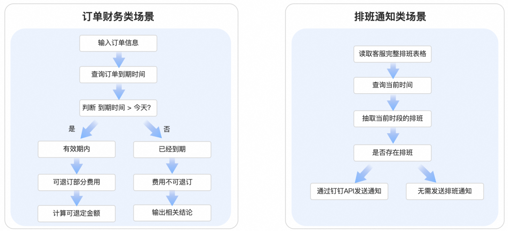
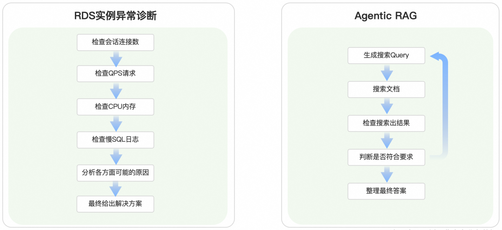
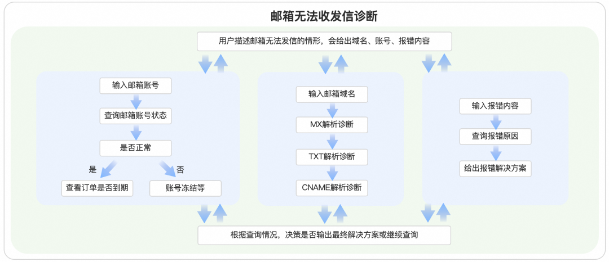
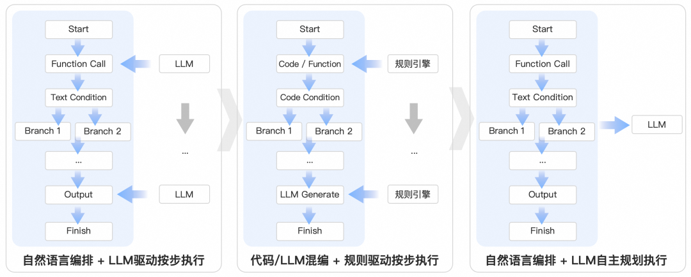
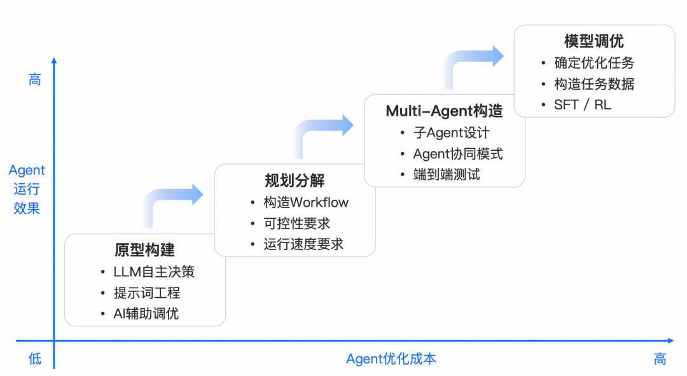

# 如何构建和调优高可用性的Agent？浅谈阿里云服务领域Agent构建的方法论

> **公众号**: 阿里云开发者  
> **发布时间**: 2025-06-20 08:30  

# 

## 背景

近一年多的时间，我一直在和Agent打交道，中间也产出了多篇Agent相关的思考文章， 从最早在阿里云客服机器人中引入Agent能力的实践文[《阿里云服务领域Agent智能体：从概念到落地的思考、设计与实践》](<https://mp.weixin.qq.com/s?__biz=MzIzOTU0NTQ0MA==&mid=2247539551&idx=1&sn=b843b3a20de81d8e42c171781af61111&scene=21#wechat_redirect>)，到后来开始深度探索Agent的时候发出的[《为什么一定要做Agent智能体？》](<https://mp.weixin.qq.com/s?__biz=MzIzOTU0NTQ0MA==&mid=2247548559&idx=1&sn=d24620926ed3708125668a57ba4da06b&scene=21#wechat_redirect>)的思考，再到对Manus这个当红通用Agent产品的剖析[《Manus的技术实现原理浅析与简单复刻》](<https://mp.weixin.qq.com/s?__biz=MzIzOTU0NTQ0MA==&mid=2247547559&idx=1&sn=e45051ae227c8356096cdef863465a24&scene=21#wechat_redirect>)，这些文章也从侧面反映出了我们在Agent这个技术领域上的各种思考和业务落地上的“心路历程”，欢迎有兴趣的朋友们前去阅读。

随着整个AI业界的发展，我逐渐发现无论是集团内外，还是各行各业，都有越来越多人开始关注、学习Agent，并且开始实践、开发、部署Agent。因此，无论是从Agent的概念，还是具体落地方法论上，也出现了越来越多的争议和讨论，当然，这种思维模式和落地实践上的百花齐放，也是非常有利于促进Agent这个新兴技术的持续发展的。

本文我想要探讨的一个主要话题就是“如何构建真正能在业务上落地的、可用性高的Agent”。当然，这个问题也是一个比较复杂、庞大的话题，我无法在文中给出通用的解决方案，仅仅是从阿里云服务领域的Agent构建视角出发，来讨论一下我们在Agent开发和调优的过程中走过的路、踩过的坑。也希望这些方法论，能够抛砖引玉、对其他领域（尤其是to B领域）提供一点点参考价值～

## Agent概念的争议

Agent这个技术近些年越来越火，各种Agent产品也是层出不穷，从早些年的各种大模型应用开发平台、大模型开源框架，到后面逐步发展成各种Agent产品和Agent平台，比较火的有阿里云百炼、Dify、Coze等通用Agent构建平台、AgentForce之类的垂类Agent平台，以及Manus、Opeartor、AutoGLM这样的通用Agent产品，还有许多如Cursor、Claude Code、TRAE这样的集成了Agent能力的AI项目。

以上这些，应该没有人会否认他们是Agent平台或Agent产品（包括含Agent能力的项目），但我也听到了许多人在Agent概念上存在着各种各样的讨论甚至是争论。究其根本原因，是Agent这项技术本身还在快速发展和演化中，因此会出现非常多不同的声音，我认为这是很正常的。

关于Agent的概念和定义，我在之前的文章[《为什么一定要做Agent智能体？》](<https://mp.weixin.qq.com/s?__biz=MzIzOTU0NTQ0MA==&mid=2247548559&idx=1&sn=d24620926ed3708125668a57ba4da06b&scene=21#wechat_redirect>)的“什么是Agent”部分中有过详细介绍和描述，在这里我就不赘述了，但是我曾参与过多次线上线下交流，也看过很多网上的争论，因此，本文我主要将大家对于Agent概念的争论的主要矛盾点总结一下，主要聚焦在以下几个方面：

  * **智能体 vs 代理：**

Agent一定是要“智能”的吗？这意味着Agent是否必须是由LLM驱动？满足“代理”能力的程序、代码块是否可以叫Agent？

  * **自主规划 vs 工作流：**

Agent一定是要能“自主规划”吗？预定义好的规划（如Workflow），是否能被叫做Agent？

  * **函数调用 vs 角色扮演：**

Agent一定要实现函数调用吗？如果只是通过Prompt完成一段指令，是否被称作Agent？Agent一定要有“人”的属性吗？角色扮演类的LLM，是否属于Agent？

关于上述这些争论，我们一个一个来讨论。

### 智能体 vs 代理

首先，是**“ 智能体”**和**“ 代理”**之争。

Agent这个词在英文语境下的原始词义，主要是**“ 代理人”**的含义，但是也有**“ 代理”**的含义。这里的“代理”指的是一种**行为** ，主要指的是可以代替人来完成某些事情的行为，而“代理人”这个词有一种**“人”** 的属性在里面，像客服、助手，很多时候在英文中就会翻译成Agent，更接近一种**有“智能”能力** 的生命体、智慧体。因此，国内的学术界、工业界很多就给Agent翻译成**“ 智能体”**，这其实是衍生出了一个更“高大上”的中文翻译，当然这么翻译也没问题，更加侧重于将它的“智能化”、“自主决策”能力比较形象的刻画了出来。

但是，另外也有一派人认为，Agent更应该翻译成“代理”，这样翻译不会刻意强调其“智能化”的属性，它更贴合Agent这个词在英文中的“代理”人做某件事情这个行为的本意。其次，他们认为，在LLM火爆之前，计算机领域和AI领域，也早就已经有了Agent这个技术名词了，Agent并非LLM时代才有的专属名词，只是LLM的出现让Agent这个技术的能力又进一步提升了一个更高的层次。

比如，在云计算领域，我们会在弹性计算服务器ECS上，安装“Agent”，这个Agent指的就是一种服务器代理程序，它是方便我们管理ECS资源、安全监控的一种**“ 代理程序”**，虽然阿里云将这种Agent起名叫“云助手”，但这个Agent他只是一个代码程序，并非真的存在“智能”能力。另外，在强化学习领域，也很早就有了Agent的概念，跟现在LLM驱动的Agent定义上更接近了，主要指的是一种可以**从环境学习、感知、更新的策略模块** ，但这个强化学习的概念提出的也比较早，这里的Agent未必一定是由大模型LLM驱动，他可以是小模型，比如BERT，甚至也可以是一段能更新固定参数的**策略代码** ，只要符合从环境中感知、学习、更新的这个行为，就可以称其为是一个Agent。

因此，Agent其实是一个早于LLM就有了的技术名词，所以也有很多人将现在的这种更加智能化的Agent称为**AI Agent** 或者**LLM Agent** ，来和之前的Agent程序做区分，大家如果看一些相对严谨的学术文章或者技术博客，确实会有在Agent前面加一些前缀，其目的就是为了避免与其他Agent混淆，让大家搞不清这篇文章究竟是在讲哪种Agent。

### 自主规划 vs 工作流

另外一个争论比较多的，就是Agent是不是应该必须要有**“ 自主规划”**能力。

这个争论，其实也是由“智能体”vs“代理”之争引申而来的，Agent如果定义为“智能体”，那么，他必须得有自主规划的能力，因为只有真正遇到问题的时候，能自己规划、分解、解决问题，才有了一种生命体、智慧体的感觉，才更符合大家对于“智能体”这个词的认知。

然而，认为Agent是“代理”的人，也会很自然而然的认为，只要Agent能够完成代理的这个行为，它就可以被称为是一种Agent，因此不一定非要强调Agent的自主规划能力；通过LLM或者程序硬编码等方式，即使按照人工提前预编排好的流程Workflow，它能一步一步执行下去，这也是一种代理模式，因此也符合Agent代理的概念。所以这一派会认为，无论是大模型自主规划、还是Workflow预先编排，只要能实现**“ 代理完成任务、解放生产力”**这个过程，他就是一种Agent。

下面是LangChain的一张描述Workflow和Agent的区别的图[3]，Workflow是通过预编排的流程来控制LLM作为嵌入节点，或者用LLM直接来控制流程，而Agent则是大模型自主进行环境感知作出反馈。而左侧这种继承了LLM能力的Workflow是否属于Agent，是目前存在争议的地方。

随着技术的发展，现在越来越多出现了Workflow和Agent的各种交叉组合，比如Agentic的Workflow，可以理解为是大模型自主规划的Workflow，大模型遇到复杂任务的时候，先生成Workflow，然后按照Workflow去运行；还有基于Workflow来构建的Agent或者Multi-Agent，是在Agent外层大的框架是由Workflow设定的，避免发散跑偏，但内部的模块是LLM驱动的，可以根据具体情况自主决策。

即使是像Manus/OpenManus这样的“通用AI Agent”，我们仔细来看其外部也是有一个大的Workflow框架来约束LLM的规划步骤，确保LLM不会彻底让流程发散失控，但其内部的每个节点都是由LLM进行自主规划，以实现更加灵活的效果，最终展示出来的也是一种很高度智能化、但同时又相对稳定的通用Agent效果，所以现在来看，Workflow和Agent已经是相互依赖、相辅相成的关系了，无法彻底切割清楚。

### 函数调用 vs 角色扮演

第三个争论点，聚焦在Agent承担的任务范围和交互形式上。

如果我们把Agent看做是“智能体”的概念，那么很容易会想到它要有一定的“人设”，所以很多人认为，角色扮演这类才属于Agent，必须要有一个“拟人”的属性在，类似“数字人”的概念，比如可以是一个云计算领域“专业客服工程师”、可以是一个“三甲医院的专家医生”，也可以是你喜爱的某个动漫人物、角色等。即使是仅仅是写了一个人设，写一段Prompt，使用LLM来运行，哪怕不需要规划、子任务分解、函数调用，只要有人设，这就算是一种Agent。

而将Agent看做“代理”的人会认为，Agent的重点不一定要有“拟人化”的属性，只要能完成规划、问题分解，甚至只要有函数调用，就可以认为是一种Agent，因为Agent只要是接入了函数调用能力，能够代理完成某个具体任务，这类大模型甚至是程序，就可以被认为是一种Agent。

### Agent的概念梳理

看完上面的各种派别，是不是感觉已经绕进去了，Agent由于概念的特殊性，不同人、不同企业、不同学者对它的认知其实是有较大差异的，会出现很多不同的理解，这个其实也很正常，因为很难统一所有人的想法，而且也不需要统一所有人的想法，这些想法的多样性，正恰恰促进了Agent这项技术的不停发展和革新。

前段时间吴恩达有一个采访[1]里，提到了一段话：

> 他指出，当时很多人在争论“这个系统到底是不是 Agent”、“它是否真正具备自主性”，但这类争论本身并没有太大价值。与其浪费时间在这些语义层面的问题上，不如换一种方式思考。他提出“agenticness 是一个光谱”的概念：不同系统具有不同程度的 agenticness，从几乎无自主性到高度自主都是合理的存在，只要系统具备一定程度的自主性，都可以归入 agentic 系统的范畴。
>
> “如果你想构建一个具备一点点或者很多自主性的 agentic 系统，那都是合理的。没必要去纠结它是否‘真正是 Agent’。”吴恩达说。

吴恩达所说的这个系统里的agenticness类似是一个光谱，指的是一个系统自主性的程度，可能是从完全没有智能能力到非常智能化的场景，因此这个agenticness是一个光谱。

为了让大家更好的理解Agent，我们暂且把Agent定义的分成**“ 广义的Agent定义”**和**“ 狭义的Agent定义**”两种类型。

  * **狭义的Agent定义：**

即理想状态下的“Agent”，是一种“智能体”，能够听懂人的自然语言指令，完成复杂任务的自主规划、分解、执行、反思、决策等，有较强的主观能动性，无需人为干预其内部细节。

  * **广义的Agent定义：**

更侧重于“自动化的任务代理”，不纠结于是否以大模型为基础，可以通过大模型、小模型、硬编码、规则引擎等在内的一种或多种技术的混合，以帮助人自动化完成任务为主要目标。

从这里能看到，广义的Agent概念里是包含了狭义Agent的，目前国内外许多企业研发的Agent平台，其实都在“广义Agent定义”的范畴里，因为“狭义的Agent定义”，目前来看还是一种**“ 技术理想主义”**，是一个我们需要不断努力为之奋斗的、美好的目标。然而，现实是比较残酷的，“狭义的Agent”虽然构建起来很简单，任务要求全盘交给大模型来做即可， 但是效果的稳定性不佳，落地过程中有太多的问题，导致大家不得不采用各种各样的方法来约束Agent，时期更加可控，所以说，想要做到理想状态下的大模型自主决策，现在技术还不够成熟。

## Agent落地过程中的挑战

“如何构建Agent”的问题已经有很多的文章在讨论了，比较好的一篇文章是Anthropic的《Building Effective Agents》[2]，这里面已经给出了许多构建Agent的范式和方法论，大家可以去阅读参考。本文更希望讨论的是如何构建更加“高可用性”的Agent。

前文说到“狭义的Agent”是一种技术理想主义，至少在现阶段的大模型的能力上还是不够完善和成熟的，无法做到完全达到预期的智能化，因此在这种背景下，大家在Agent构建落地的过程中很容易遇到非常多的挑战和问题，因此，接下来，我希望能在文章中探讨这些具体挑战应该如何解决，从而能总结出如何构建更加容易落地、更加高可用的Agent。

我总结了下Agent构建过程中的问题，大致可以分为以下四大类。

### 挑战一：运行效果不稳定

构建Agent非常重要的一项工作，就是提示词（Prompt）。提示词通俗来讲，其实就是用自然语言描述一下任务要求，看起来其实很简单，但实操过的话，大家会很容易发现，想要写出一个能够稳定运行的提示词，并不是很容易，甚至大家有的提示词写出来像小作文一样长，越写越复杂复杂。而且写完之后，提示词在运行过程中很容易出现不稳定的情况，然后还要不断去调优它，甚至出现无论怎么调优，Agent依然不稳定的情况，这是非常痛苦的一点。

### 挑战二：规划如何平衡

第二个痛点，之前我们讲到，广义的Agent里面是有很多种技术方案的，大致上可以分为大模型自主驱动的以及Workflow预编排的类型。然而大模型自主驱动的模式也是很容易不可控的，可能我的预期是这样运行，但它自己经过规划、执行、反思、总结之后变成了另外的方向，甚至完全走偏，这都是很有可能的。然而，如果通过Workflow的方式去做规划，又需要投入大量人力成本去编排，导致Agent的构建也会非常低效，有时候要好几天才能搞出一个相对完善的Workflow，这就让Agent的构建成本越来越高，因此怎样去平衡规划的问题也是一个比较痛的点。

### 挑战三：领域信息集成

第三个挑战，就是如何将领域信息或者领域知识注入到大模型里面。因为大家很多时候用的模型都是通用领域的基座大模型或者开源的基座大模型，基本上都不具备领域垂类的知识信息，因此，大模型对于领域特定词汇、特定知识、甚至领域特定流程的理解上就都会很难理解，因此怎样合理的把领域知识注入到Agent里面，也是一个挑战。

### 挑战四：Agent的响应速度

第四个痛点，是Agent的响应速度问题。如果将Agent上线到生产环境中，作为需要稳定运行的一段程序，这时候性能问题就变得非常重要。大家会发现，大参数的模型运行Agent的效果还不错，但速度实在是非常慢，尤其是带有思考的推理模型要更长的时间。而小参数的模型虽然速度快了很多，但运行Agent的效果又一般，经常不稳定。运行性能和推理效果是呈反比的关系，这也是让很多人对Agent落地比较头痛的一个问题。

## 从提示词调优出发

首先看第一个挑战：**Agent运行效果不稳定** 。Agent运行不稳定，大概率是提示词书写不当导致的不稳定。提示词确实还是不太容易写好的，一般情况下直接写很容易出现下面的问题：

  * **提示词过短：**

任务要求主体不明、表意不明、模糊不清；模型在不清晰的情况下，只能“脑补”，按照自己的理解来执行任务，容易与预期不符。

  * **提示词过长：**

注意力失焦，重点遗忘；现在的模型虽然都有长上下文的窗口，但从实际情况来看，当提示词比较长的时候，模型在运行过程中很容易顾头不顾尾，导致有些指令遵循，有些不遵循。

  * **提示词中存在冲突、矛盾等：**

这个很可能你自己都没有意识到提示词的冲突，这会让模型理解起来有些困困惑。模型会在运行过程中一会儿遵循你的某一条要求，一会儿遵循你的另一条冲突的要求，导致不稳定。

具体如何写提示词的文章、教程，公司内外各大平台如ATA、知乎、掘金等等已经非常之多了，在这里我不会具体去讲如何写提示词的结构和书写规范这些，而是关注在当我写完一套提示词，如果效果不好，该如何解决？

我们的解法，最开始是提供一套**提示词模板** 。这些模板经过大量调试、测试，发现运行已经比较稳定了。然后让写提示词的同学尽量遵循这个模板来写，相对来讲，就比每个人直接写要更容易稳定。但我们后来发现这个方式也有些问题，很多时候大家过度套用模板，不需要写的内容，也一定要生搬硬套写进来，或者模板有好几套，也不知道该选择用哪套。写的过程中也会出现一些跟模板冲突的问题等等。

之后，我们采用**AI辅助做提示词生成和调优** ，把提示词模板给到AI，结合你的需求，先写一版，你来确认提示词的逻辑是否正确，如果有问题，你可以及时跟AI提出来去调整，然后由AI来帮你继续调优。比如说冲突、矛盾的部分AI就是可以检测出来的，它可以告诉你这其中某些要求和另外一些要求之间是有逻辑问题的。因为“最懂大模型的是大模型自己”，所以我们可以先搞清楚大模型的“脑回路”，才能更好的让大模型理解我们的需求，可以不断的和大模型进行沟通，持续迭代的把提示词整理优化出来，再让它自己去运行这个提示词来看效果到底是否符合预期。

## Agent规划层的权衡

第二个挑战：**规划如何平衡** 。这里的规划（Planning），主要指的是Workflow和大模型自主规划如何权衡的问题。这里我参考LangChain的Blog画了一张图[4]来表达Workflow和自主规划的可控性和智能化能力，很显然会看到一个规律：**LLM自主规划的智能化程度越高，可控性越低，而Workflow编排的可控性越高，则智能化则越低** 。

可控性高但智能化要求低的场景，通常是一些**标准化、重复执行** 的场景，更适合Workflow。

从阿里云客户服务领域的视角来看，什么样的场景适合Workflow呢？比如订单财务类，就是典型的标准化场景，举个例子，要去查询某个订单有没有过期，或者要计算是否需要退订部分费用，这些都是标准化的，如果这类逻辑判断、数学计算类的场景让大模型深度参与，就很容易出现幻觉。

再比如，排班类场景也是类似，需要定时提醒客服具体的排版时间，这类情形需要严格按照排班表去推送，如果出现幻觉，比如遗漏了某些同学，没提醒到位，就可能会导致他没有按时上班，那就非常麻烦。所以像这些场景，我们为了避免出现这些不稳定、幻觉的问题，就可以选择通过Workflow的方式实现，确保可控性优先，适当降低自主性和智能化。

但智能化要求较高的场景，通常是一些**探索化、问题复杂** 的场景，更适合大模型自主规划。

比如RDS数据库的实例异常诊断，一般客户来咨询的时候就只是描述说“我的RDS查询非常缓慢”或者“实例有异常”，这类描述一般都比较模糊，但用户也很难给出更多信息了，因为这确实是需要我们要进入实例仔细排查、诊断的。比如需要诊断数据库的会话连接数有没有异常？QPS有没有异常？内存、慢SQL是不是都有可能导致这个问题？因此，它涉及到的可能性就非常之多，很难通过一个大而全的Workflow去承载所有的可能性。

如果针对这些场景要编排一个Workflow出来，可能要非常庞大，而且可能会出现很多排列组合的分支判断，这很可能会容易崩溃掉。这类场景就比较适合用大模型自主决策，因为首先大模型在训练阶段就学习过RDS数据库基础的技术语料，再结合我们通过提示词给它几个大的方向，比如检查会话连接数、CPU、内存、慢SQL等方向进行排查，它就能知道结合用户输入的问题，排查RDS异常时大概从哪几个维度开始，就可以通过我们的工具API去自主查询、诊断、决策、解决这些问题。它不一定要全部诊断完成，根据前一步的诊断结果，再进一步决定下一步要如何决策，这样一步步走下去，就非常适合用大模型自主规划。

还有一种场景比较适合大模型自主规划的是Agentic RAG。阿里云客户服务场景中，有许多的中长尾产品或场景，尤其是长尾产品，我们其实不一定都有梳理好的知识库，但是能找到相应的官方文档或者用户手册。在没有高质量的知识的情况下，又需要去解决这些问题，就可以用Agentic RAG的方式，让大模型自主生成搜索的query，搜索完成之后再进一步自主检查、反思搜索结果是否符合预期，然后决定是否自主去调整query重新搜索，进行这种更加deep search的搜索，最终经过多次搜索、检验的过程，找到最合理的答案。这种场景也非常适合大模型自主规划模的式。

那么，这两种情况是上面曲线图最两端的情况，能否实现上面曲线的中间状态呢？

答案是可以，如果想要实现上面曲线图里的中间状态，就需要做到LLM自主规划与Workflow相结合，也就是使用**Multi-Agent（多智能体）架构** 来实现。在阿里云服务领域，有个场景是“邮箱无法收发信诊断”，客户来咨询的时候一般会说我邮箱无法收发信了，有的用户会把邮箱账号发过来，有的用户会把邮箱域名发过来，有的用户会直接把具体报错发过来，可能性比较多。但排查邮箱账号的状态和域名状态，还有报错的时候，这些中间过程是可以编排一个确定性的排查过程的，所以我们就把这些中间过程做成了稳定、可控的Workflow，但是为了应对客户可能的多种不同类型的输入形式，为了让模型更加自主灵活的决策调度，于是在这些Workflow的外面，我们又使用一个LLM来动态决策调用哪个Workflow，实现了一种**“ 内部稳定可控+外部自主灵活”**的效果。

那么，这种“内可控、外自主”的模式就是一种基于Multi-Agent实现的模式，那么也可以反过来，比如“外可控、内自主”，比如前文提到过的Manus/OpenManus，也是外面有一个大的Workflow框架，内部的每个节点都是由LLM进行自主规划的模式。

## Workflow的演化路径探索

LLM自主规划这个其实主要就是提示词在驱动大模型完成复杂任务，大部分的过程也是都是模型黑盒的内部决策， 实际上没有太多技术上的方案。但是在Workflow这块的探索，其实就有非常多模式了。在这里，我也想花点篇幅，分享一下我们在Workflow这条路上探索过的一些演化路径。

首先，由于我们的Agent平台是面向客服和业务同学的，因此我们最开始的一版的Workflow实现，就树立了一个“**尽可能降低用户编排Workflow的成本和复杂度** ”的目标，因此，就让用户用自然语言来编排Workflow，当时的设计思路是“自然语言编排流程图+LLM驱动按步执行”。具体的操作过程，就是让用户先用自然语言描述出你的流程，然后通过AI大模型来帮你生成流程图（DAG图），然后让大模型驱动，按照流程图一步一步执行，直到最终完成整个流程节点。这样做的好处是构建方法和成本确实很低，自然语言描述即可，允许可以编排一个**“ 不完备”**的流程图，大模型运行过程中也会智能化的识别每个步骤的任务要求，自动补充节点之间的参数衔接问题。但也有其问题，比如运行速度太慢，因为每个环节都要大模型决策，节点一旦比较多，全部走完一遍要很长时间；并且只能从头开始执行，一路到结尾，暂时无法从中间某个环节直接进入。

所以后来为了提升速度和稳定性，我们就做了第二种Workflow，是“**代码/大模型混编 + 规则驱动按步执行 ”**，为了节省时间，不需要全部节点都用大模型来驱动，而且改用规则引擎驱动。用户描述流程，还是通过自然语言的方式描述，但经过大模型AI转换成流程图之后，所生成的流程图中间的节点除了必须用大模型来生成、总结的情况之外，其他节点类型你都可以用**代码、脚本、规则** 来实现，类似一种离线的预编译过程，尽可能减少大模型带来的耗时增加、幻觉、不稳定性的问题，将这些逻辑固化为代码、规则。经过这样的设计，我们发现运行速度确实变快了很多，但依然只能从头执行到尾，如果中间过程出现一些客户的问题，发生了转移或者跳转，我们没办法做非常灵活的控制；同时，由于引入了代码和大模型的混合编排，导致Workflow的构建成本比纯自然语言的形式高了很多，因为规则引擎驱动的流程图，必须是**“ 完备”**的流程图，节点之间的参数传递必须准确无误，否则就会报错，因为大部分客服和业务同学很难直接介入对代码、规则的调优，导致Workflow的构造过程门槛变的很高，AI生成的流程图很多时候也并非完全完备，导致构建过程频繁出现各类问题，需要花费大量人力去调试。

之后，由于更加灵活的场景的需要，我们需要大模型更灵活的在Workflow的流程的多个节点或者分支之间可以更灵活的识别和流转，我们演化出第三种Workflow思路，即**“ 自然语言编排 + 大模型自主规划执行”**。自然语言编排过程，与第一种没有什么太大差别，也还是自然语言描述，然后AI转换成**“ 不完备”**的流程图即可，但是在运行的时候，不是让大模型从头一步一步运行到结束，而是大模型基于这个流程图，直接去回复客户，执行相应动作。也就是说，我们不让大模型完全自己发挥去做规划，而是用这张流程图作为参考信息给大模型去做类似RAG的这种参考规划，这样的模式相比前两种模式，更加灵活、更加智能。

目前，这三种Workflow模式我们是并存的，在实际场景中具体应用哪一种更合理，是要具体问题具体分析的，没有一种完全完美的解决方案。

## 领域数据集成与响应速度优化

另外还有两个挑战，一个是领域数据集成的问题，另一个是响应速度优化的问题，我放在一起说下。

首先，如何在通用基座大模型中集成领域数据？这块主要有下面三个方法：

  * **Prompt中动态领域要求：**

根据服务场景匹配度，在Prompt加载的过程中动态引入领域先验知识，通过类似RAG的方式根据场景动态搜索和匹配加载领域的知识或者业务经验，能够更好的让模型了解领域知识，通常又不会占用太多的上下文窗口

  * **引入外部技能：**

通过调用领域工具、知识库、文档等，让LLM有更多方式自主选择获取领域数据，可以通过让模型自主选择在某些场景下是不是可以自主决策调用，这些工具、知识库、文档能够额外引入一些动态的领域信息

  * **领域大模型训练：**

在上面的方法实在搞不定领域知识理解的情况下，可以通过训练领域大模型来注入领域知识，将领域知识通过模型预训练、后训练等多阶段的训练可以将领域知识注入到大模型中，从根本上提高领域任务的精准性，但成本相对较高，比如先构造领域数据源，比如领域知识库、文档，SOP工具API、各领域产研提供的一些MCP Tools、阿里云的OpenAPI。接下来经过汇总、清洗，构造成语料，包括单步工具调用、多步工具调用、反问澄清、Multi-Agent调用、条件判断、场景拒识等等，然后给模型去做SFT/DPO/GRPO等等。评估的方式也有多种，比如说工具选择准确率、动作执行准确率、参数提取准确率，以及模型生成回复的效果评估。最后，模型可以在线上推理、规划、动作、观察反思、生成等环节得到相比通用模型更好的效果。

另外一个痛点是Agent的执行速度问题，大参数的模型速度慢、小参数的模型效果不好，应该如何解决呢？我们也有一些探索过的方法论给大家分享一下：

  * **代码参数预转换：**

在前文Workflow演化路径的这个探索过程中，我有提到，可以尽量减少Agent中大模型参与的比例，比如使用流程预编译好的Workflow，将非必要的LLM模块转换为代码或脚本语言，来提高运行效率

  * **各种推理加速方式：**

通过各种加速推理的优化方法来提升模型的运行效率，比如模型量化（Int4、int8等）、优化KV Cache、使用各种加速框架（如FlashAttention、vLLM等）、更换高性能GPU等

  * **降低模型参数量：**

在满足需求的前提下选用小参数模型，如果这是高频场景，比如Function call，那就非常适合小参数模型，用大参数量的LLM作为教师模型去蒸馏小参数量的LLM，也可以在提高速度的同时，尽量保留大参数模型的推理效果。

## Agent构建和持续调优的路径

根据上面的一些调优的方法论，我最后总结了一个**Agent构建和持续调优的路径图** ，如下所示。

首先，在尝试使用Agent来解决一个需求问题的时候，可以先从大模型自主决策的方式构建一个**原型Demo** 的Agent，因为通过提示词工程先做一版Agent，是ROI最低的方式，先通过简单的实现，看下初始的Agent版本形态是否符合业务或自己的需要。然后在提示词的基础上，按照上文所属的让提示词更稳定的调优方法多次调优几个版本，看看是否能保持稳定的运行。

如果发现效果依然不好，在某些情况下总是出现不稳定的情况，可以尝试第二步：在Agent的规划Planning层面，开始尝试**拆解Workflow** ，通过构造更加结构化的Workflow，来让Agent在一定的框架范围内驱运行，来提高它的稳定性，同时Workflow如果使用代码规则编排，也可以提升其运行速度，达到一些性能上的要求。

如果发现Workflow的方式虽然稳定，但智能化能力变弱，开始出现固化、不灵活等情况，或者分解了Workflow依然搞不定，比如说我需要某些地方足够的灵活，又需要某些环节足够可控，我们就需要设计更加复杂的**Multi-Agent架构** ，通过将复杂任务拆解成多个子任务，通过多个子Agent来承接这些子任务，并设计多个子Agent之间的通信方式和形态，最后进行端到端的测试，看这样部分灵活+部分可控的方式是否能够满足复杂场景下的要求。

最后，如果实在前面的方式都尝试了，某些情况下还是很难调优，或者对准确率、速度、稳定性、智能化能力都有着极高的要求，那么就需要对这个Agent的一些关键环节做**模型的定制化训练和调优** 了，这个步骤一版是先确定要训练的任务，然后需要花较大的经历去寻找和构造所需的训练数据，之后做相应的模型训练和调优。最终，来验证经过训练后的模型对相应的任务问题是否能到达预期。

从使用提示词开始构建原型，到Workflow的构造、Multi-Agent架构设计、模型的训练和调优，这个成本是随之不断的在上升的，但理想情况下，Agent的运行效果也是随着成本的投入在不断得到提升，至于要做怎样的技术选项、投入多大成本，最后达到怎样的效果，这取决于你的场景的具体要求。

## 总结与展望

在阿里云服务领域Agent建设这1年多的时间范围内，我们探索过很多，也走过很多弯路、踩过很多坑，今天我把这些自己这段时间探索的一些思考、方法论以文章的形式沉淀下来，也是希望能给其他从事Agent落地的同学们提供一些思路，少走一些弯路。当然，各个业务的场景复杂度也不尽相同，我们的服务领域也不能代表各行各业，在大家的领域里面一定有许多我们没有考虑到或者没有做过的方法论，也欢迎大家多多提出、交流，我们互相学习，共同提升，能够更好的利用Agent这个技术在自己所属的领域业务中应用落地。

## **Reference**

[1] 《Agent 进入工程时代！吴恩达详解 AI Agent 构建全流程，核心不在模型，而是任务拆解与评估机制》

[2] Building Effective Agents. https://www.anthropic.com/engineering/building-effective-agents

[3] Workflows and Agents. https://langchain-ai.github.io/langgraph/tutorials/workflows/

[4] How To Think About Agent Frameworks. https://blog.langchain.dev/how-to-think-about-agent-frameworks/

****

### 精准识别，轻松集成人脸比对服务

传统自建人脸比对应用面临着技术复杂、成本高昂及维护困难等挑战。通过采用本方案，企业无需自行训练和部署深度学习模型，快速接入人脸比对服务。人脸比对服务适用于人身核验与安防监控等多种场景，为企业提供高效、精准且易于实施的身份认证。

## 点击阅读原文查看详情。
