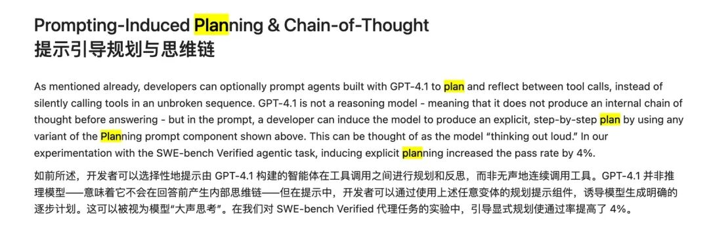
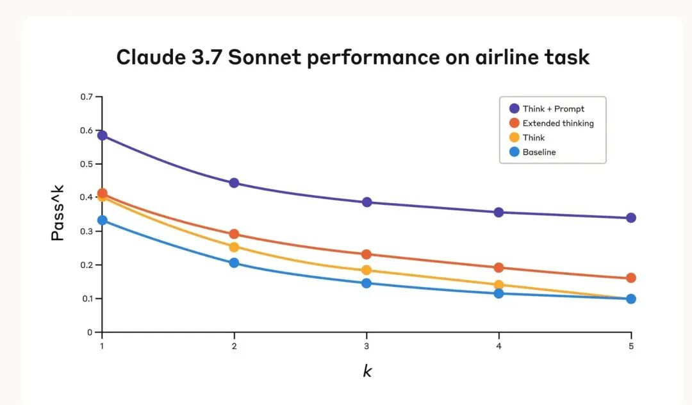
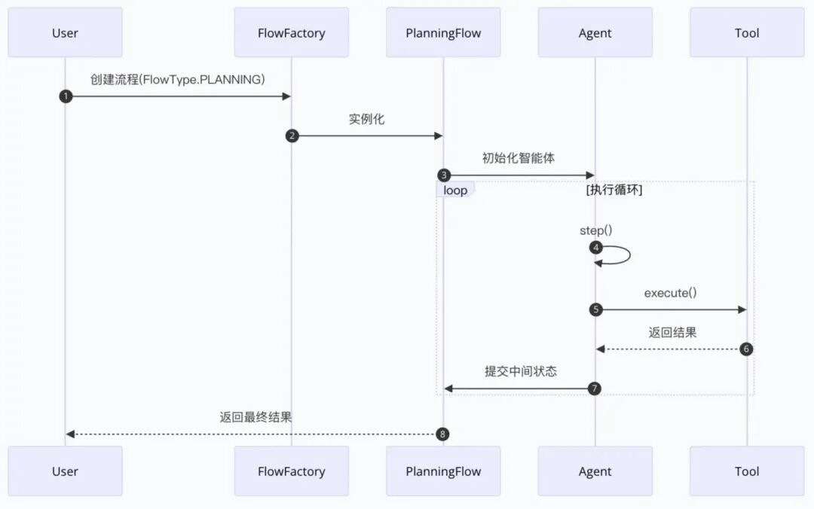
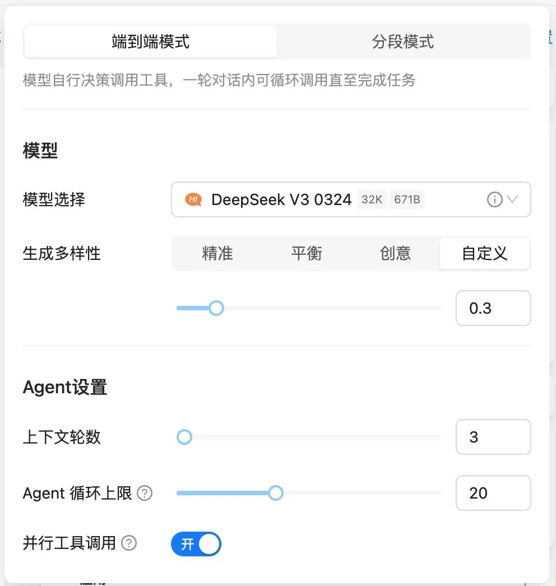
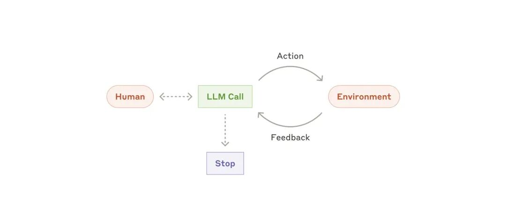
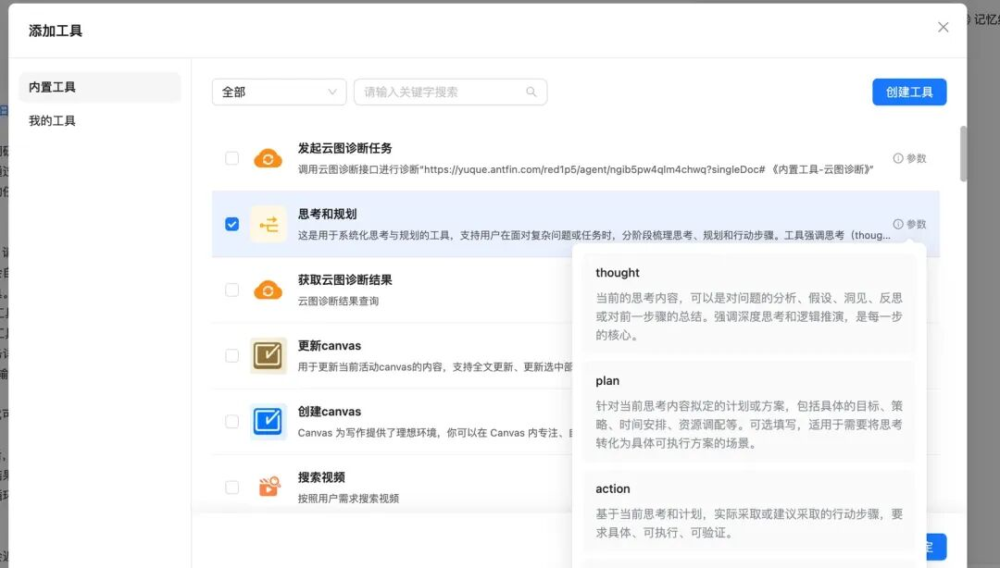
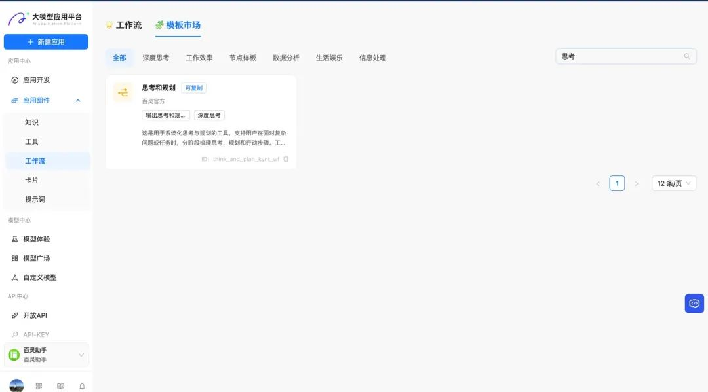
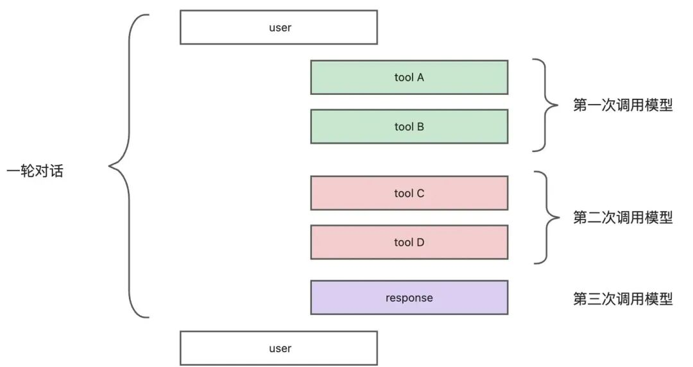
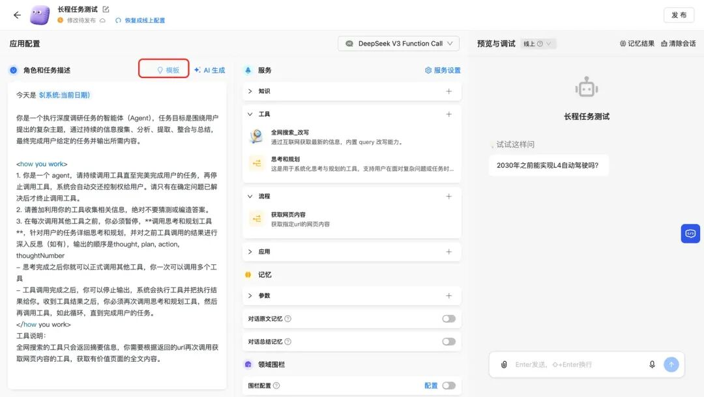

# 如何让 Agent 规划调用工具

> **公众号**: 阿里云开发者  
> **发布时间**: 2025-05-22 08:30  

阿里妹导读

本文主要从规划的重要性、工具设计的作用、优化实践、适用场景几个方面讲述在构建多工具智能体（Agent）系统时，通过引入结构化的“思考与规划”工具和合理的提示工程，能够显著提升模型解决问题的效率和效果。

## 为什么需要规划

根据 Anthropic 和 OpenAI 的建议，对于多工具的 Agent 智能体，让模型在调用工具前规划都能有效提升效果。

### OpenAI

OpenAI 通过引导显式规划[1]使得（SWE-bench）通过率提高了4%，OpenAI 是通过 Prompt 引导模型思考，Prompt 如下:

> You MUST plan extensively before each function call, and reflect extensively on the outcomes of the previous function calls. DO NOT do this entire process by making function calls only, as this can impair your ability to solve the problem and think insightfully.

翻译：你在每次调用函数之前必须进行充分的规划，并且在每次函数调用之后必须对结果进行充分的反思。不要仅仅通过不断调用函数来完成整个过程，因为这样会削弱你解决问题和深度思考的能力。

### Anthropic

Anthropic 的办法[2]是让模型调用思考工具，并提供示例，让模型调用工具前/调用工具后思考。思考工具的定义如下：

  *   *   *   *   *   *   *   *   *   *   *   *   *   *

    {  "name": "think",  "description": "Use the tool to think about something. It will not obtain new information or change the database, but just append the thought to the log. Use it when complex reasoning or some cache memory is needed.",  "input_schema": {    "type": "object",    "properties": {      "thought": {        "type": "string",        "description": "A thought to think about."      }    },    "required": ["thought"]  }}

Anthropic 使用 τ-bench 基准测试评估了"思考"工具，该基准专门用于测试模型在真实客户服务场景中使用工具的能力：

1.基线：无“思考”工具，无扩展思考模式；

2.单独扩展思考模式：即使用模型的推理模式；

3.单独“思考”工具；

4."思考"工具+针对任务领域优化的提示；

结果显示，当 Claude 3.7 在基准测试的“航空”和“零售”客户服务领域有效运用“思考”工具时，性能获得了显著提升：

  * 航空领域：经过优化的"think"工具在 pass^1 指标上达到了 0.570，而基线仅为 0.370——相对提升了 54%；

  * 零售领域：单独使用“think”工具达到了 0.812，而基线为 0.783。

### 我们选择的方案

我们最终选择了使用 Anthropic 的工具方案，让模型思考和规划。原因是 OpenAI 并不是单纯通过 Prompt 指令让模型规划，他们还通过后训练让模型严格遵循这一指令。而我们使用开源模型，没有经过微调的话，指令遵循的效果肯定会打折，而以工具的形式能够提升遵循能力：

1.模型调用工具有固定的格式，例如参数的 thought, plan, action，通过工具调用能够让模型以更结构化的方式输出，不会遗漏；

2.「调用xx工具」是一个可明确执行和评判的指令，而「做一个规划」是一个模糊的指令，相对来说以工具的形式指令遵循效果更好，尤其是在复杂 prompt 和多工具的场景。

当然类 manus 的方案通过链路工程让规划和执行分离（如下图），Agent 系统的规划和遵循规划的能力肯定会更好，尤其是针对15分钟甚至30分钟以上的长程任务。但是不是所有场景都需要类 manus 的长程任务规划，我在这里介绍的方案比较轻量，适用于快速任务（期望完成任务的时间较短）。

OpenManus 架构，planning 和 Agent 执行隔离

在蚂蚁集团内部的 Agent 平台：

已关注

__

关注

__ 重播 __ 分享 __ 赞

关闭 __

**观看更多**

更多 __

__

__

__

_退出全屏_

[ __](<javascript:;>)

_切换到竖屏全屏_ _退出全屏_

阿里云开发者已关注

[ __](<javascript:;>)

分享视频

 __，时长 00:57

0/0

00:00/00:57

切换到横屏模式

继续播放

进度条，百分之0

 __

[播放](<javascript:;>)

00:00

/

00:57

00:57

[倍速](<javascript:;>)

 _全屏_

 __倍速播放中

[ 0.5倍 ](<javascript:;>)[ 0.75倍 ](<javascript:;>)[ 1.0倍 ](<javascript:;>)[ 1.5倍 ](<javascript:;>)[ 2.0倍 ](<javascript:;>)

[ 超清 ](<javascript:;>)[ 流畅 ](<javascript:;>)

您的浏览器不支持 video 标签

__

继续观看

如何让 Agent 规划调用工具

观看更多 __

转载

,

如何让 Agent 规划调用工具

 __

阿里云开发者 已关注

分享点赞在看

 ____已同步到看一看[写下你的评论](<javascript:;>)

 __

[ 视频详情 ](<javascript:;>)

## Agent 实现

这里以我们内部 Agent 平台为示例介绍如何实现，了解原理之后用 LangChain 或者市面上的 Agent 平台也能复现。

选择恰当的模型

目前 DeepSeek V3 Function Call 模型在规划和工具调用方面能力是较强的。

生成多样性参数建议配置为0.3

请使用端到端模式，在该模式下，用户输入 query 之后，系统会循环调用模型，由模型决策使用工具或者直接回复。在以下两种情况会停止循环：

1.模型不再调用工具，而是直接回复；

2.模型调用次数（不是工具调用次数）达到设置的上限。

端到端的循环模式

问题：为什么使用 DeepSeek V3 而不是 DeepSeek R1？

回答：因为 DeepSeek R1 的思考时间特别长，而且根据 DeepSeek 的论文和我们的经验，R1 在多工具调用的能力并不是非常突出。相反，V3 的工具调用和遵循能力都比 R1 好，而且延时较低。

### 工具配置

### 思考工具配置

参考 Anthropic 的思考工具和 Sequential Thinking MCP [3]，我们定义的思考和规划工具如下：

  *   *   *   *   *

    {  "name": "思考和规划",  "id":"think_and_plan"  "description": "这是用于系统化思考与规划的工具，支持用户在面对复杂问题或任务时，分阶段梳理思考、规划和行动步骤。工具强调思考（thought）、计划（plan）与实际行动（action）的结合，通过编号（thoughtNumber）追踪过程。该工具不会获取新信息或更改数据库，只会将想法附加到记忆中。当需要复杂推理或某种缓存记忆时，可以使用它。",  "input_schema": {    "type": "object",    "properties": {      "thought": {        "type": "string",        "description": "当前的思考内容，可以是对问题的分析、假设、洞见、反思或对前一步骤的总结。强调深度思考和逻辑推演，是每一步的核心。"      },      "plan": {        "type": "string",        "description": "针对当前任务拟定的计划或方案，将复杂问题分解为多个可执行步骤。"      },      "action": {        "type": "string",        "description": "基于当前思考和计划，建议下一步采取的行动步骤，要求具体、可执行、可验证，可以是下一步需要调用的一个或多个工具。"      },      "thoughtNumber": {        "type": "string",        "description": "当前思考步骤的编号，用于追踪和回溯整个思考与规划过程，便于后续复盘与优化。"      }    },    "required": ["thought","plan","action","thoughtNumber"]  }}

你可以直接添加内置工具「思考和规划」，不支持流式输出思考内容；或者复制工作流模板的「思考和规划」，支持流式输出思考内容，然后根据自己的需求调整工具定义。

选择内置工具

复制工作流模板，支持自定义

### 并行调用配置

从上面模型选择的界面可以看到，我们打开了并行工具调用，在模型的一次调用中可以输出多个工具。

什么是并行调用

如下图，tool A 和 tool B 是调用一次模型，输出了两个工具，模型在输出 tool B 的时候并不会拿到 tool A 的执行结果，这种情况就是并行调用，适合没有依赖关系的工具调用。

> 例如用户问「北京和上海哪里比较热」，模型可以并行调用两次天气工具。

第二次调用模型输出 tool C 的时候，模型的上下文已经拿到了 tool A 和 tool B 工具的执行结果，这种情况适合工具之间有依赖的场景。

> 例如用户问「蚂蚁A空间附近有什么好吃的」，模型需要先调用坐标转换工具获取 A 空间的经纬度，再调用周边搜索工具。

在实践上，区分并行工具和串行工具，对模型智能的要求是比较高的，所以我们默认关闭并行调用，模型只能一个一个工具调用，否则在上面的例子里有些模型可能不等坐标工具返回经纬度，自己幻觉了执行结果继续调用周边搜索。甚至 GPT-4.1 的 Prompt 说明书里面，OpenAI 也说了工具并行调用可能有不符合预期的情况，这时可以关闭。

我们在 DeepSeek V3 0324 体验下来，发现 V3 的工具调用能力还是很强的，大家可以结合自己的业务测试。

业务工具

根据你的任务，选择任务需要的工具。例如我们要做深度搜索，那么就可以添加搜索工具和网页浏览工具。

### Prompt 配置

prompt如下：

  *   *   *   *   *   *   *   *

    <instruction>1. 你是一个 agent，请持续调用工具直至完美完成用户的任务，停止调用工具后，系统会自动交还控制权给用户。请只有在确定问题已解决后才终止调用工具。2. 请善加利用你的工具收集相关信息，绝对不要猜测或编造答案。3. 「思考和规划」是一个系统工具，在每次调用其他任务工具之前，你必须**首先调用思考和规划工具**：针对用户的任务详细思考和规划，并对之前工具调用的结果进行深入反思（如有），输出的顺序是thought, plan, action, thoughtNumber。- 「思考和规划」工具不会获取新信息或更改数据库，只会将你的想法保存到记忆中。- 思考完成之后不需要等待工具返回，你可以继续调用其他任务工具，你一次可以调用多个任务工具。- 任务工具调用完成之后，你可以停止输出，系统会把工具调用结果给你，你必须再次调用思考和规划工具，然后继续调用任务工具，如此循环，直到完成用户的任务。</instruction>

请注意：这部分 prompt 仅描述 Agent 如何调用「思考和规划」的工具，你还需要在这个基础上继续完善 prompt，让 Agent 知道如何调用你的业务工具。可以分系统 prompt 和工具描述两部分。

### 业务 prompt

在上述内置 prompt 的基础上，告诉模型针对什么任务调用什么工具，尤其是需要多工具配置的任务，需要详细描述先调用什么工具，再调用什么工具。例如在数据分析的 Agent，代码解释器和表格数据概览的工具需要互相配合：

  *   *   *   *   *

    ## 1. 代码解释器（Python）（适用于专项分析和可视化）### **何时使用**- 用户需要针对 **特定维度、类别或时间段** 的数据进行分析。- 需要执行 **复杂计算**（如数据聚合、回归分析、机器学习预测等）。- 需要进行 **数据可视化**（折线图、柱状图、饼图、散点图等）。### **调用方式**- 在调用 **代码解释器** 前，必须先使用 **表格数据概览**工具，检查数据结构，确保代码能正确处理数据。- 使用代码解释器时，请使用 pandas 库读取文件。用户提供的文件路径 file_path 在 /tmp/guest/ 目录下，不要使用其他工具输出的变量，也不要使用片段的数据。- 代码解释器在输出图表的同时，请打印相关的数据，方便大模型和用户进行分析。
    ---
    ## 2. 表格数据概览（仅用于辅助代码解释器）对任意 DataFrame 进行 全面的数据概览与质量检查，适用于任何 Excel/CSV 表格，快速了解数据概况。，帮助发现数据问题（如缺失值、异常值、重复行）。帮助发现数据问题（如缺失值、异常值、重复行）。作为数据清理和分析的第一步，为后续数据处理提供依据。分析数据包括：1.  数据基本信息（形状、数据类型、内存占用）。2.  每列的唯一值数量（识别分类字段的多样性）。3.  预览数据（前 5 行 + 随机 5 行，检查数据分布）。4.  数值型列的统计信息（均值、标准差、最大/最小值等）。5.  非数值型列的统计信息（类别分布，最常见值等）。6.  时间列范围检查（如果有 datetime 类型列，会输出最小和最大日期）。7.  缺失值统计（识别数据是否有空值）。8.  重复行统计（检查数据是否有完全重复的行）。9.  数值列的相关性分析（计算相关系数矩阵）。### **何时使用**- 需要了解 **数据结构**（字段名、数据类型、示例行）以便 **代码解释器** 正确执行。- **仅在调用代码解释器前使用**，不会单独调用。

### 工具描述

以下是来自 Anthropic 的建议[4]：

无论你构建的是哪种智能代理系统，工具都可能成为代理的重要组成部分。工具让 Agent 能够通过 API 中精确指定的结构和定义与外部服务及 API 进行交互。当 Agent 响应时，如果计划调用工具，它会在 API 响应中包含一个工具调用指令。工具定义和规范应与整体提示词一样受到提示工程的高度重视。

一个经验法则是，考虑在人机交互（HCI）上投入了多少精力，就应计划投入同等精力来打造良好的智能体-计算机接口（ACI，即模型看到的工具描述和参数）。以下是一些实现建议：

1.站在模型的角度思考。根据描述和参数，使用这个工具是否一目了然，还是需要仔细斟酌？如果是后者，那么模型很可能也会遇到同样的问题。优秀的工具定义通常包含使用示例、边界情况、输入格式要求，并明确与其他工具的区分界限。

2.如何调整参数名称或描述使其更加清晰？想象这是在为团队中的初级开发者撰写一份完美的文档注释。当使用多个相似工具时，这一点尤为重要。

3.测试模型使用工具的方式：在工作台中运行大量输入示例，观察模型容易犯哪些错误，并持续迭代改进。

4.为你的工具实施防呆设计：通过调整参数设置，降低犯错的可能性。

在构建 SWE-bench 智能体时，我们（Anthropic）实际投入更多精力优化工具而非整体提示。例如发现当智能体离开根目录后，模型在使用相对路径工具时容易出错。为此我们将工具改为强制要求绝对路径——结果发现模型能完美运用这种方法。

## 使用推理模型有同样的效果吗？

思考工具的作用是让推理模型先思考再调用工具，如果我们直接用推理模型，例如 Qwen3，效果是不是一样的呢？

第一节介绍 Anthropic 的实验结果表明，claude-sonnet-3.7 在非推理模式下使用思考工具，效果相比单纯的推理模式更好。

实验没有分析原因，我猜测有几个可能：

1.prompt 无法干预推理模型输出的思维链过程——推理模型的后训练一般只针对最终输出的结果，思维链的空间是由模型自由探索——而使用思考工具可以 prompt 大模型，提供 few shot 示例指导模型在特定的垂直领域该如何思考。

2.一般 chat template 会把推理模型的历史思考内容在上下文中删掉（Claude 是保留模型第一次调用工具前输出的思考内容，后续不再打开思考，参看Claude 文档[5]），而使用思考工具，模型可以在多工具调用的过程中任意使用，并且保留在上下文中，这对复杂的多工具调用是有益处的。

后续我们也会基于 Qwen3 实验哪种方法在复杂任务的工具调用效果最好，敬请期待。

参考链接：

[1]https://github.com/openai/openai-cookbook/blob/main/examples/gpt4-1_prompting_guide.ipynb

[2]https://www.anthropic.com/engineering/claude-think-tool

[3]https://github.com/modelcontextprotocol/servers/tree/main/src/sequentialthinking

[4]https://www.anthropic.com/engineering/building-effective-agents

[5]https://docs.anthropic.com/en/docs/build-with-claude/context-windows#the-context-window-with-extended-thinking-and-tool-use

### 云原生企业级数据湖

基于对象存储 OSS 构建的数据湖，可对接多种数据输入方式，存储任何规模的结构化、半结构化、非结构化数据，打破数据湖孤岛。

## 点击阅读原文查看详情。
