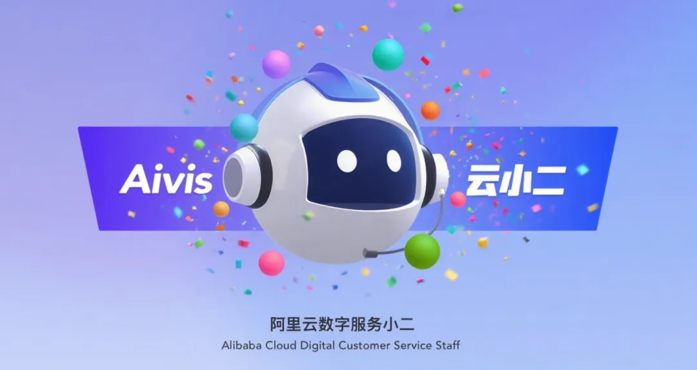
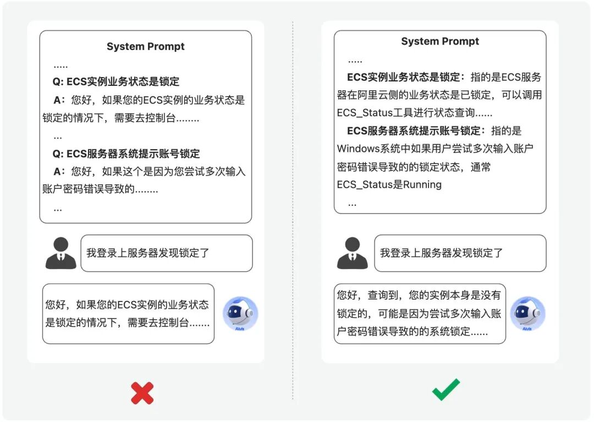
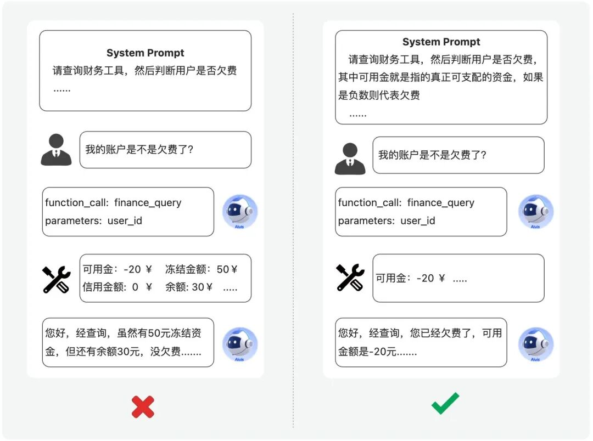
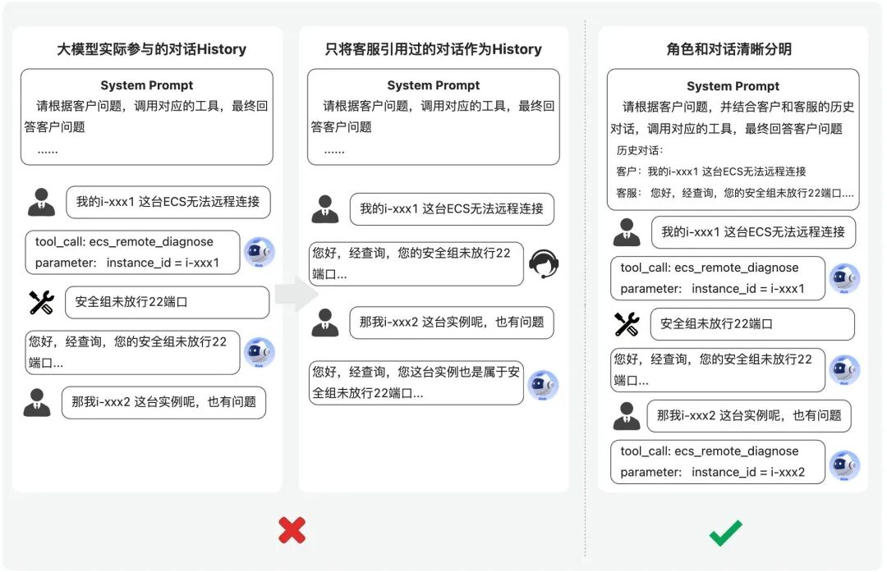
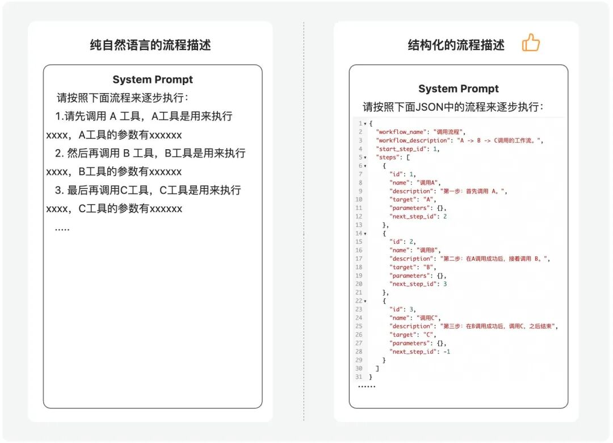
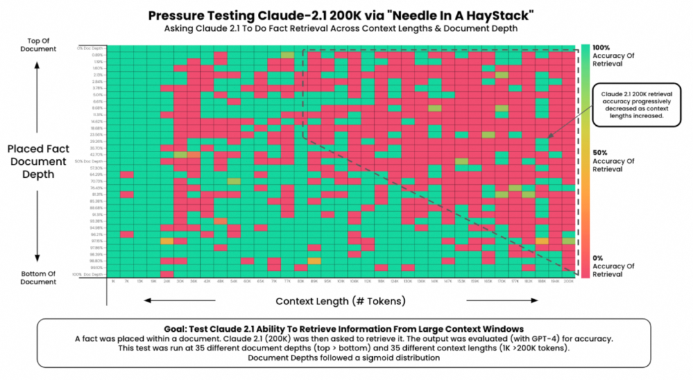
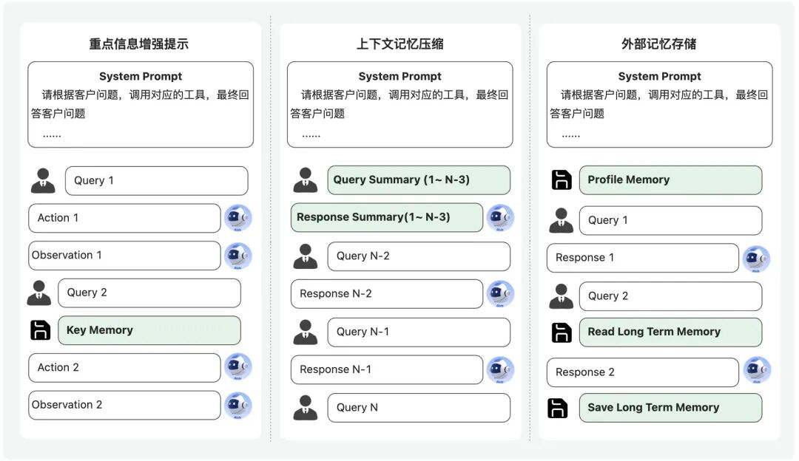

# 如何让Agent更符合预期？基于上下文工程和多智能体构建云小二Aivis的十大实战经验

> **公众号**: 阿里云开发者  
> **发布时间**: 2025-10-31 08:30  

## 背景

今年我们团队重点投入在“云小二 Aivis”项目中。云小二 Aivis 是阿里云服务领域的数字员工，它标志着我们从传统的智能辅助客服，迈向了更端到端 Multi-Agent 的数字员工能力的全新阶段。

云小二 Aivis 核心是基于 LLM 的思考推理能力，在 Multi-Agent 架构下，结合各类MCP Tool、Browser Use、Computer Use等工具调用能力，可以让数字员工更像人一样去思考和解决问题。这其实是一个非常有挑战的课题**，** 这背后涉及到算法、工程、数据等多个维度，对于云小二 Aivis 的介绍，大家可以看下我们团队 TL洪林在云栖大会上的介绍分享《云小二Aivis，迈向自主Agent的阿里云智能服务新形态》[1]，后续也会陆续会有一系列文章发出来，大家也可以期待一波~

“如何构建和调优一个效果好的 Agent”始终是一个庞大且复杂的课题，近一年的时间，我也在集团内外多个场合进行了一些 Agent 技术分享和布道，大家问的最多的问题基本上是：

  * “为什么我调了提示词，Agent 效果还是这么差？”
  * “为什么 Agent 运行不稳定，交互几轮后就开始不遵循指令了？”
  * “为什么 Agent 总是产生幻觉，不按预期输出？”

我们在云小二 Aivis 项目实践中也构建了大量的 Multi-Agent 协同和上下文工程上的优化，也走过不少弯路，从这一些真实踩坑实践经验中，我们总结出了几个我们认为行之有效的关键点，希望能为正在构建 Agent、Multi-Agent 的朋友们带来一些参考价值。

## 为什么Agent不按预期输出

为什么我的 Agent 不按照预期输出？这个问题，我们需要**拆解成两个子问题** ：

  * 你的预期是什么？也就是你期望 Agent 的输出是什么？
  * 为了这个预期，你的 Agent 是如何设计的？

围绕这两个问题，可以从两个方面的角度来分析 Agent 不按照预期输出的原因，一个是“**预期层面** ”的角度，另一个是“**技术层面** ”的角度。

我们先从**预期层面** 的角度来看，很多时候大家在构建 Agent 的时候，总是会发出“我希望它更智能一点”或者“它应该正确回答问题”，这都是常见的**模糊预期** 。这样的预期基本上是无法指导我们对 Agent 进行有效的优化。我们需要将模糊的预期转化为具体、可衡量的**清晰预期** 。

只有将预期足够的清晰，你才会拥有了一套尽量清晰的“衡量标准”。当 Agent 的输出不符合预期时，你可以精确地指出哪里错了，或者是提示词指令还是写的不够清晰、明白，让模型产生的困惑，而不是笼统地说“不符合预期”。

从**技术层面** 的角度来看，提升 Agent 效果的核心方法无非两种：一是优化**提示词工程** （Prompt Engineering）或上下文工程（Context Engineering），二是**优化模型** （如 SFT、DPO、RLHF等）。其实随着近期通义千问基座大模型版本的持续更新，Agent的执行效果也越来越好，模型训练的成本也变得非常高且必要性没那么大了，而且尤其不适合普通玩家了。因此，本文的重点将放在第一个角度：**如何通过上下文工程或者Multi-Agent架构层面来优化Agent效果** 。

现在，“提示词工程”早已经不是一个新概念了，但是很多人其实还是没怎么理解这里面的精髓，需要注意的是，**直接写个“提示词”并不是真正意义上的“提示词工程”** 。“提示词工程”的重点在于“**工程** ”两个字，也就是说在实际生产和应用的过程中，并不是像我们做测试或实验Demo一样，针对一个任务要求写一段提示词，模型去完成一个单次调用的任务即可。而大部分情况下，提示词都是在实际线上系统运行过程中动态获取和拼接的，以适应更加复杂的场景。

所以，现在大家也意识到了这个问题，叫“提示词工程”很容易将重点聚焦在“提示词”本身的书写上，行业内越来越多人开始称呼“**上下文工程** ”（Context Engineering），其实这两者本质的差别并不是很大，因为大模型本身就是一种**上下文学习** （In Context Learning），提示词本身就是上下文中的一部分，但是现在为什么重点提到“上下文工程”，也是因为行业中越来越多人会关注到，仅仅提示词的优化更多还是停留在提示词的质量、指令清晰度、书写规范上面，很少关注到上下文的动态组合，包括对系统指令的组装、对话History的组装、长期Memory的存储和读取等等更**工程的层面** 。前段时间，Manus也发表了一篇Blog《AI代理的上下文工程：构建Manus的经验教训》[2]专门探讨他们在上下文工程实践的经验教训，更是将这个概念进一步推广了出来。

## 实践总结的十大Agent优化经验

在云小二Aivis业务真实实践的过程中，前期我们也踩过许多坑，根据问题发生的原因和解决经验，我总结了几个相对比较核心的建议，希望能给大家带来一些参考价值。

### 经验一：清晰化你的预期

> 核心原则：避免模糊预期，给到足够清晰的预期，让大模型理解起来没有任何的歧义和困惑。

我们先从预期层面的角度来看，很多时候大家在构建Agent的时候，经常会说“希望它更智能一点”或者“它应该正确回答问题”，这都是常见的**模糊预期** 。这样的预期，会让大模型产生困惑**（Confuse）** ，并且基本上也是无法指导我们对Agent进行有效的优化，因此，我们必须要将模糊的预期转化为具体、可衡量的**清晰预期** 。

如何定义一个好的清晰预期？我们可以来问自己这么几个问题：

**1. 任务要求（Task）**：任务要求是否写得明确详细，判断条件的逻辑是否写明确了？你期望的判断规则是怎样？

  * **模糊预期** ：“根据查询的结果判断ECS的某端口的安全组是否放行”。
  * **清晰预期** ：“请判断ECS输出结果中的端口安全组的放行情况，如果该端口或者端口范围是-1/-1，并且ip段配置的是0.0.0.0，并且策略是Accept的，则是完全放行；如果端口上配置了特定源ip的，并且策略是Accept的，则是不完全放行；如果端口策略是Drop的，则是禁止放行”。

**2. 输出格式（Format）**：我期望的输出是JSON、Markdown、一段自然语言，还是一个特定的函数调用？JSON的Schema是什么样的？

  * **模糊预期** ：“给我一个ECS实例健康问题诊断报告。”
  * **清晰预期** ：“输出一个包含`instance_id`（实例ID）、`problem_category`（如'系统负载'、'防火墙'等）和`conclusion`（结论）的JSON对象。”

**3. 风格语气（Style）**：输出的语言风格应该是专业的、友好的、简洁的还是详细的？

  * **模糊预期** ：“输出一段排查过程中安抚用户的回复。”
  * **清晰预期** ：“当诊断流程超过3个步骤仍未解决问题时，以专业、礼貌、带有歉意的语气回复用户：‘非常抱歉给您带来了不便，正在为您进行更深入的排查，请稍等片刻。”

### 踩坑案例：问答场景下的专业术语歧义

在我们业务中，有一个典型的“ECS实例锁定”场景。这个问题其实是有两种情况：

**1. 业务锁定**：由于欠费等业务原因，ECS实例本身在业务层面被锁定。**2. 系统锁定**：由于多次输错登录密码，导致的Windows操作系统层面账户被锁定。

虽然我们在系统指令里对这两种情况做了区分，但当客户模糊地问“我的服务器锁定了怎么办？”时，模型大概率会搞混，并且**非常倾向于回复业务锁定的解决方案** ，而实际上客户经常高频遇到的往往是系统锁定。但是，实际分析的时候，你会发现大模型理解成业务锁定也是非常正常的， 因为客户没有明确说是系统锁定，只是说ECS锁定了，因为我们的提示词里要求模型按照阿里云的视角来进行回复，模型大概率就会理解成“实例本身锁定”。

**解决方案** ：我们需要将这两种锁定的区别，清晰的描述清楚，让大模型完全清楚的理解什么叫做“业务上的锁定”、什么叫做“系统账户锁定”，只有明确描述清楚两种锁定的区别，才能让模型清晰地get到这两者的差异，甚至可以提供一些候选工具，让模型可以通过查询实例状态来执行结果进行判断：

**1. 条件判断**：如果能获取到客户的实例ID，调用 API 查询其业务状态，如果实例确实处于业务锁定状态，才提供业务锁定的解决方案；如果业务状态正常，就判断为可能是操作系统锁定，并提供相应的排查方法。**2. 明确区分**：如果拿不到实例ID码，或者没有可用工具无法诊断的情况下，也可以进一步去向客户澄清：“请问您是控制台上看到实例被锁定，还是远程登录到系统里面提示账户被锁定”，根据用户的进一步回应来判断，尽可能更清晰的给到客户精准的解决方案。

通过这个精确化预期的过程，你就拥有了一套尽量清晰的“执行标准”。当Agent的输出不符合预期时，你可以精确地指出哪里错了，或者是提示词指令还是写的不够清晰、明白，让模型产生的困惑，而不是笼统地说“不符合预期”。

****

### 经验二：上下文精准投喂

> 核心原则：“给其所需，去其所扰”。模型需要且关心的信息，一定要给到；模型不需要且不相关的干扰信息，一定要想办法剔除。

这个原则听起来似乎理所当然，甚至有点废话文学，但在实践中，我们发现很多时候Agent效果不佳的核心原因，往往就是我们该给的信息没给全，或不该给的信息给得太多，从而引起了模型的困惑。

当模型困惑时，它就很有可能不会去执行任务，因为没理解你的预期意图，或者你的预期意图里面存在矛盾或者歧义点，所以很容易反过来向你澄清问题（“请问您提到的xxx是什么意思？”），或者按照它自己的理解去执行，就极容易导致结果与预期出现偏差。

### 踩坑案例：欠费诊断的信息干扰

在我们的业务中，有一个场景是“判断账户是否存在欠费”。逻辑上其实比较简单，就是去调用工具查询这个用户ID下的资金是否存在负数的情况即可。但是，当我们真的让大模型去调用财务的相关工具API的返回结果，我们会发现有非常多的字段，包括：可用金、冻结金额、信用金额、余额、退款金额、未结算的金额等等，别说大模型，这个情况人看了也得蒙，如果不是对业务深入了解，其实是很难知道应该如何判断是否欠费的。

因此，大模型的表现就出现了不稳定的情况，有时候根据余额为负数判定是否欠费，有时候又根据可用金为负数就判定是欠费，有时候又考虑了冻结金额、退款情况等等，导致多次调用大模型输出的判断结论反而是不统一的，这就是严重不符合预期的情况。

经过和业务的深入沟通之后，因为阿里云的产品有预付费、后付费等情况，所以有些金额是会预先扣除，有些不预先扣除但会提前冻结等等，所以最终其实只需要判断可用金是否负数即可。

**解决方案** ：我们不能粗暴的把财务工具接口返回的信息“一把梭”地给到大模型就万事大吉，因为这里面有太多业务领域特性的逻辑或者信息，这将会导致模型按照自己想法随意发挥去做判断，从而带来了不确定性，正确的做法是将该给到大模型的信息经过筛选和过滤之后，模型在判断欠费的时候需要关心的字段，我们一定要给到；模型不需要且不相关的干扰信息，一定要想办法剔除。

### 经验三：身份和历史执行清晰化

> 核心原则：模型需要明确知道有几方的身份，需要知道自己做过哪些事情，当前执行到哪个阶段。

大模型在对话中默认只有两个角色：`user`（用户）和 `assistant`（大模型助手）。但在我们的智能客服场景中，角色要复杂得多：`客户`、`客服（小二）`，以及`大模型`。其中，“小二”翻译成英文也是 Assistant，这就极易与模型的 Assistant 角色混淆。因此，必须要将身份信息非常明确的定义出来，让大模型很清楚“**谁在说什么，谁在做什么 ”。**

### 踩坑案例：三方角色不清晰导致模型“错乱”

我们最早的版本中，曾将客服小二与客户的对话直接作为 History 喂给大模型，当时的想法也比较朴实，就是希望模型能根据已有的对话信息，来去“续写”客服小二的下一步动作。这个逻辑在初期设计的时候感觉非常合理，所以也没有人发现有任何的问题。

但是我们实际运行的时候，就出现了一些比较奇怪的输出，并不符合预期。

比如，某个客户说他的一台实例远程无法连接，大模型开始会正常调用工具去进行诊断，然后反馈结论是安全组的问题，接着客户又说他的另一台实例也无法远程连接，这时候由于我们直接将小二与客户的对话直接作为History喂给大模型，希望让大模型基于这个对话History继续往下续写，结果是模型收到这个History的影响，并没有直接调用工具，而是自己幻觉编造了一个结果，没有做任何查询就直接说也是安全组未放行的问题，这就导致了严重的事实性错误。

造成这个问题的核心原因是，我们将大模型实际运行的过程在组装History的时候丢弃隐藏掉了，以为这些信息没有意义了，让大模型只关心小二和客户的真实对话记录即可，没想到模型强大的Few-Shot学习能力，让模型直接将History作为了一种学习源，这是因为大模型是一种Few-Shot Learner（学习器），很喜欢找例子，比较常见的Few-Shot示例是我们在System Prompt里面去构造，让模型参考，但同时，History中的历史对话，同时也是一种Few-Shot例子，大模型会学习自己之前处理过的内容来辅助生成新的内容。所以，这种方式造成的结果就是，它会**误以为自己之前也没有调用工具** ，而是直接进行了回复，那么现在他将也效仿之前的做法，不调用工具，直接回复，即使System Prompt里面要求调用工具，模型也不一定会遵循。

同时，客服小二的对话风格很多时候与模型执行的History风格的差异巨大，这种Mask掉历史执行记录的做法丢失了模型自己调用工具等 Action的历史记录，就让模型变得十分“困惑”，导致模型对角色认知产生了混乱，从而产生幻觉。

**解决方案** ：我们对上下文结构进行了重构：

**1. 主线回归用户与大模型**：对话的完整执行过程，必须还是以**用户和大模型** 之间的交互为主线。**2. 小二的对话作参考**：将客服与客户的真实对话，作为一种参考信息（Reference），被明确地标识为“对话记忆”（Dialogue Memory）的形式注入上下文。**3. 保留完整动作**：大模型自己真实执行过的 Action History 依然完整保留。

这样一来，模型就能清晰地知道：当前客服与客户的对话进展到了哪一步；它自己之前都做过哪些探索和尝试，之前是如何理解、思考、回复的客户问题；也明确知道小二是如何参考大模型的回复最终回复给客户，有哪些采纳、哪些未采纳，都是很清晰的。

Manus的经验里也提到过一个原则“Mask， Don't Remove”，比如在工具调用的时候，如果当先前的动作和观察仍然引用当前上下文中不再定义的工具时，模型会感到困惑；以及“Keep the Wrong Stuff In”，也就是“擦除失败会移除证据”。没有证据，模型就无法适应。这与我们遇到情况有异曲同工之妙。

经过这个调整，云小二Aivis在多个场景的准确率**有较明显的提升** 。这也再次说明，不要轻易删除或篡改模型完整的探索历史，即使是那些未被采纳的“错误”尝试。

### 经验四：善用结构化形式表达逻辑

> 核心原则：相对复杂的流程、逻辑，可以优先考虑形式化、结构化方式表达，不要只用自然语言。

相比于纯自然语言，尤其是最新版本的大模型，对结构化数据的理解能力要比自然语言强得多。最重要的一个原因，就是结构化的语言相比自然语言，他尽可能的消除了歧义，因为程序化的语言本身的设计就是为了“**运行** ”，天然就有着消除歧义的特性。比如，你可以使用 JSON、YAML、伪代码，最简单的Markdown，也比纯自然语言要更结构化，通过这样的结构化语言向模型传递复杂的业务逻辑或流程，会更加合适。

例如，“先调 A，再调 B，再调 C”这个流程，有时候用自然语言描述，让调用过程参数比较复杂的时候，模型未必能很好的遵循，有时候就会跳过B直接调用C了，但如果将其表达为类似下面的形式，模型的遵循能力会好很多，当然这个例子举的还是比较简单，一些复杂的逻辑通过自然语言描述就比较复杂了，但是通过结构化的形式就会清晰很多。

### 经验五：尝试自定义工具协议

> 核心原则：如果你的领域任务相对独特且对稳定性要求较高，自定义工具协议和指令是值得尝试的。

由于我们的Agent项目起步较早，在2023年Qwen模型刚推出的时候，我们就开始探索早期的Agent调用了，在当时业界的工具调用标准尚未统一，我们就自定义了一套工具调用协议。这套协议除了包含工具的Schema，还在Prompt中加入了一些针对我们领域的特定要求和提示词指令。

后来，业界标准逐渐向OpenAI的Function Call协议以及Anthropic 的MCP协议统一，我们也开始做相关的兼容测试。有趣的是，我们发现，在许多场景下，我们**自定义的协议在执行逻辑的准确性和稳定性上，反而优于通用的标准协议** 。

我的理解，这可能是模型在为通用协议进行训练时，其思考和调用逻辑相对收到了训练数据的影响和固化。当你的领域化需求遇上它的内在逻辑时，它会默认按照训练语料中的方式去理解和调用，所以不会完全遵循你的指令。因此，我们现在大部分的场景Agent从调用的协议从23年到现在还是以自定义的这套协议为主，经受住了诸多领域场景的考验和时间的检验。

### 经验六：Few-Shot要合理使用

> 核心原则：灵活性强的场景慎用Few-Shot，特定任务中建议用多样化的Few-Shot。

很多时候，为了提升模型在任务上的稳定性和表现，有时候指令写的再详细、再清晰，模型也还是会有幻觉或者不完全理解的时候，这个时候写上几条Few-Shot作为例子，模型的稳定性和指令遵循效果会迅速提升。对于人来说，这个Few-Shot就有点像教科书里的例题，假如只让你读一段教科书里的概念、术语和公式，让你看完后直接做题，其实还是挺大概率会做错的，但是有例题的情况下，就一目了然，能够比较快的提升学习效果，而且例题越多，学生就更容易理解。但也不是所有情况都适合用Few-Shot，在有些时候，随手写的几条Few-Shot，反而限制了模型的发挥空间，甚至有些时候会起反向作用，引入幻觉。所谓“成也Few-Shot，败也Few-Shot”。关于这方面，我的建议是：

**单任务中善用 Few-Shot** ：单任务指的是这个大模型的任务主要是完成一个特定的任务要求，比如从一堆对话数据中抽取某些参数，或者是判断安全组是否放行。这样的任务，为了提高稳定性，我们会使用 Few-Shot。

但是，这里还有一个建议，就是很多大模型会在宣传的时候说可以不用写Few-Shot或者写1-2条Few-Shot即可，这个我测试的情况来看，多给几条不同类型的Few-Shot，增加多样性的效果是最好的。比如说如果你的任务是抽取参数，那么你可以ECS的实例ID、RDS的实例ID、域名、备案号这些都提供一下，不同产品线都选择一个例子，甚至没有参数的情况，也可以提供一个例子，能让大模型更加清晰的知道什么情况下是不提取的。

**灵活任务中慎用 Few-Shot** ：在一些比较灵活的任务上，我们尽量减少使用 Few-Shot。因为在这个情况下，我们比较期望模型能够灵活、智能的处理各种情况，如果给了Few-Shot，就很容易让模型“过拟合”到这些示例上，丧失通用性和灵活性。尤其是遇到FewShot里没见过的情况，它可能会生搬硬套示例，导致更严重的错误。就比如说，我们期望大模型能够根据工具返回的结果，自主决策给客户的回复，这个情况下如果我们写了Few-Shot，有时候模型就会直接模仿Few-Shot中的句子和话术模板来生成回复，哪怕不是这个场景，也会强行硬凹一个别扭的回复，或者当上下文很长的时候甚至都会搞混Few-Shot和真实工具的返回结果，从而直接给出错误的回复。因此对于灵活、开放性任务，如果Agent表现不佳，与其硬塞 Few-shot，不如尝试增加更明确的任务要求，或开启模型的“深度思考”，让模型多思考一下再输出，效果可能会比提供Few-Shot更好。

### 经验七：保持上下文的“苗条”

> 核心原则：在不损失性能的前提下，尽可能对上下文进行“瘦身”。

虽然现在的大模型都号称支持百万甚至千万级Token上下文，但实际测试会发现，当上下文长度超过一定长度（例如1万Token以上），模型对历史信息的遗忘率会显著增加，就比如“大海捞针”（Needle In A Haystack）这类benchmark的准确率上看，token数量越多，超过某个阈值之后就开始急速下滑。甚至一些你写在前面的系统指令里的核心要求，都很可能会被模型间歇性遗忘，造成Agent行为的极度不稳定。如下图中对Claude 2.1版本的评测（虽然评测时间有点早了，但是结论基本还适用）。

仍然是不要“一把梭”地将所有信息都塞给大模型。这不仅会增加成本、降低速度，更重要的是会严重影响效果。建议通过RAG等技术，动态地筛选和提供当前任务真正需要的信息。这与我们的第二个原则“上下文精准投喂”不谋而合，不过本条建议更多强调的是即使上下文精准提供的情况下，也请尽量给上下文“瘦身”，不要提供太多不必要的token信息，比如一些重复的提示词要求，一些对最终结果影响不大的提示词要求等等都可以进行删减和精简，可以测试下某些指令移除之后，模型的反应是否敏感，如果不敏感，就可以进行精简。一个高效的 Agent，一定是精雕细琢的结果。

### 经验八：使用记忆管理来避免模型遗忘

> 核心原则：重点信息多次增强提示，上下文压缩减少历史对话轮次，外部存储帮助实时唤起更久的记忆。

**记忆（Memory）管理** 是近一段时间的一个比较火热的话题，一方面除了上面讲到的随着Agent多轮对话的轮次也越来越长，上下文窗口越来越大，模型的**“ 遗忘”**就越来越明显，甚至有时候连系统指令都开始间歇性的遗忘。再一个情况，就是有些Agent场景，需要模型记得上几次甚至前段时间对话中的关键信息，或者需要模型有能力持续记忆用户的个性化特征，针对用户的个性化的特征进行生成。因此，对多轮对话的记忆做有效的管理，才能让Agent越来越有**“ 记性”**。

在大模型目前实现的底层原理中，在不进行训练的前提下，模型是不会因为对话上下文的增加而动态更新模型权重的，所以这个记忆只能是在大模型的外部做文章，也就是通过一个外部的模块，来决定是否将这些需要记忆的信息作为上下文Context给到大模型。一般来讲这个外部模块就可以称为记忆管理模块，这里面其实有好几个不同的策略。

**1. 重点信息多次增强提示：**对于一些重点的信息，比如在阿里云服务场景中，客户提供的实例ID信息、操作系统版本、公网IP等信息，在前面客户提供过，或者通过工具获取到过，但是经过多轮对话之后，突然提到的时候，模型可能会有所遗忘，还有可能还会去询问客户这些信息，就会感觉很不智能。一个比较好的做法是这些重点信息在对话链路中多次增强提示，比如通过一个外部模块定期将这些信息追加到对话中，类似一种定期**“ 复习”**的感觉，或者在工具调用的时候，这些核心信息会作为类似“内部变量”持续传入传出不同工具的入参出参中，增强模型对这些信息的记忆能力，避免遗忘。**2. 上下文记忆压缩：**随着对话越来越长，History列表也会变得非常冗长，模型很多时候比较关心近期3~5轮的聊天信息和话题，那么这些早于最近3~5轮之前的信息，其实随着对话的持续进行越来越不重要，但是如果一直在History中存在，无疑会持续增长上下文窗口，这就不符合我们第七条经验了。因此，在组装History的时候，可以将一些比较早期的对话记录通过summary的方式总结提取成一些核心信息即可，这样就能大量节省上下文窗口和token量，同时还不对当前对话产生较大的影响，这就是对记忆进行压缩，只挑重点的信息记录，这个有点像我们计算机里的“**内存** ”。**3. 外部记忆存储：**即使是对历史History进行不停的提取压缩，时间久了还是会有很多信息，尤其是时间周期比较长的一些信息，比如客户上次的咨询历史、客户的一些个性化画像特征都需要进行记录，在需要使用的时候就要想起来，因此，除了“内存”，我们还需要有“**外存** ”，也就是将一些需要长期记忆的信息记录到一个专门的Memory的池子里面，在判断当前对话中需要调用的时候，可以专门有个记忆管理模块动态去查询然后注入到当前轮次的上下文中，或者将这个记忆管理模块做成一个工具Tool，让主链路Agent自行决定什么时候调用查询，并且需要对这个“外存”有着**“ 读”和“写”**的操作，能够做到在该需要记录的时候记录，该需要读取的时候读取。

当然，关于Memory管理这块的内容也是有很多细节问题，实现起来其实也比较复杂，比如要抽象出提取哪些信息作为关键信息，这些信息以什么形式存储，信息是否需要分类或者分层存放，如何查询和读取，这些细节都决定着记忆模块的效果好坏，如果细节处理不好，依然会让Agent给人一种“不太聪明”的感觉~

### 经验九： 使用Multi-Agent来平衡可控性与灵活性

> 核心原则：Workflow提升可控性，LLM自主决策提升灵活性，好的Multi-Agent设计既可控又能灵活。

在构建 Agent 时，我们既希望它能按照预期的路径可控地执行，又希望它在遇到未知情况（OOD）时能有一定的自主探索能力。在我之前的文章里有比较大的篇幅讲过Multi-Agent架构是实现这种平衡的有效手段。有兴趣的朋友们，可以来阅读[《如何构建和调优高可用性的Agent？浅谈阿里云服务领域Agent构建的方法论》](<https://mp.weixin.qq.com/s?__biz=MzIzOTU0NTQ0MA==&mid=2247550566&idx=1&sn=f4dedfb7bb47e02aa3b6e3478cc40d73&scene=21#wechat_redirect>)这篇文章中的**“ Agent规划层的权衡”**段落部分。

通常，我们会将大部分的场景进行一些拆分，比如主Agent负责用来进行调度决策，而子Agent则负责用来进行一些固定、复杂流程链路Workflow的诊断、查询。

**主Agent (调度决策)** ：负责整个任务的意图路由、子模块调度、最终生成的决策，通常使用**LLM大模型来进行自主决策** ，通过上下文中构造业务经验来帮助模型进行约束，通常负责一定的灵活性。

**子Agent/工具 (执行诊断)** ：将一些逻辑复杂的诊断、分析任务封装成独立的子Agent或Tool，供主 Agent 调用。这些子 Agent 内部可以采用纯Workflow编排，也可以是一些小的单任务的LLM Agent，以保证执行速度和准确性。这样一些非常强流程，需要稳定性较强的模块都可以收敛到这里面，主要是基于**流程规则引擎 + 单任务的LLM** 结合的形式来进行实现。

通过这样的Multi-Agent的这种架构设计，既实现了可控性与灵活性的平衡，也便于维护和扩展，在线上应用的效果相比传统的单Agent形式都要好很多。关于这两部分结合的内容在之前的文章中有较多介绍，此处就不再赘述了。

### 经验十： 只有HITL才能做出更好的Agent

> 核心原则：只有坚持人在回路（HITL），深入业务场景中，才能做出好的Agent。

这里回到Agent最本质的定义，我曾在[《为什么一定要做Agent智能体？》](<https://mp.weixin.qq.com/s?__biz=MzIzOTU0NTQ0MA==&mid=2247548559&idx=1&sn=d24620926ed3708125668a57ba4da06b&scene=21#wechat_redirect>)文章中写到过：

Agent就是让大模型**“ 代理/模拟”「人」**的行为，使用某些**“ 工具/功能”**来完成某些**“ 任务”**的能力。

那么，也就是说想要做好Agent，你**必须要先知道“人”是怎么做的** ，需要问自己几个问题：人是如何识别这个问题的？什么情况应该查哪个工具？查到工具之后如何回复给客户？也只有这样，你才能做出像人一样思考、推理、查询、解决问题的数字员工Agent。很多时候，在构建Agent的时候会忽略这一点，如果只从需求出发，你不清楚人的具体思考过程、操作过程，这样就很容易写出一些任务要求模糊的Agent，导致大模型自由发挥，效果很难达到人的预期。做个比喻，就像**“ 明星模仿秀”**一样，如果你要模仿某个明星， 不去深入研究这个明星的造型、动作，甚至演唱技巧，去尽可能找到他的明显特征，你就很难模仿的像这个明星。

另外，人在后期使用Agent的时候，也需要持续给出反馈，根据反馈中的错误信息来不断的给出优化方案，这就回到了我们的经验一，人也必须要先给出**清晰预期** ，然后才能不断指导Agent的持续迭代优化。

这个经验听起来感觉是很简单的，但实际上操作起来也是最难的（除非使用Agent的人也是开发Agent的人），因为很多时候想了解到“人”的具体操作过程本身就很难，就比如我们做云小二Aivis的时候，我们研发同学并不是真的了解客服是如何实际思考、处理问题过程，这个过程就需要不停的与客服、督导沟通，甚至去客服现场观察客服的真实接单过程，只有去深入了解客服小二同学实际的处理逻辑和处理习惯，才能做出更适合客服小二使用的云小二。

## 总结

以上是我们在构建“云小二Aivis”过程中，在上下文工程、Multi-Agent实践等多方面的一些感受和体会。之前我也分享过一篇的文章是[《如何构建和调优高可用性的Agent？浅谈阿里云服务领域Agent构建的方法论》](<https://mp.weixin.qq.com/s?__biz=MzIzOTU0NTQ0MA==&mid=2247550566&idx=1&sn=f4dedfb7bb47e02aa3b6e3478cc40d73&scene=21#wechat_redirect>)，主要侧重于提示词优化、Mutli-Agent权衡和领域数据集成。本文则更聚焦于上下文工程、通信协议等更加工程层面的思考，希望两篇文章的结合能为您带来更多启发。如果大家有任何问题，或者在实践中遇到了其他挑战，欢迎在评论区留言交流。我们也希望能借鉴大家的智慧，共同提升构建Agent的能力。

我们后续也会分享更多关于云小二Aivis的技术实践。本文是我个人的一些探索与心路历程，仅是一家之言，行文仓促，如有疏漏，还望各位不吝指正。

参考链接：

[1]https://yunqi.aliyun.com/2025/session?agendaId=6008

[2]https://manus.im/zh-cn/blog/Context-Engineering-for-AI-Agents-Lessons-from-Building-Manus

****

### 轻松实现客服数据智能分析与高效存储

针对大模型应用开发中存在的环境搭建复杂、数据库集成困难等问题，本方案基于阿里云 DMS 原生托管 Dify 工作空间，深度集成云数据库与阿里云百炼（简称“百炼”）大模型服务，快速搭建开箱即用的客服对话数据质检服务，显著降低数据库+AI 应用的开发门槛。

## 点击阅读原文查看详情。
