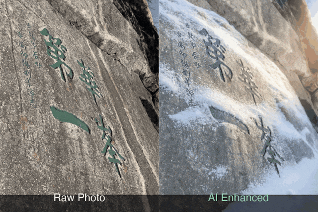
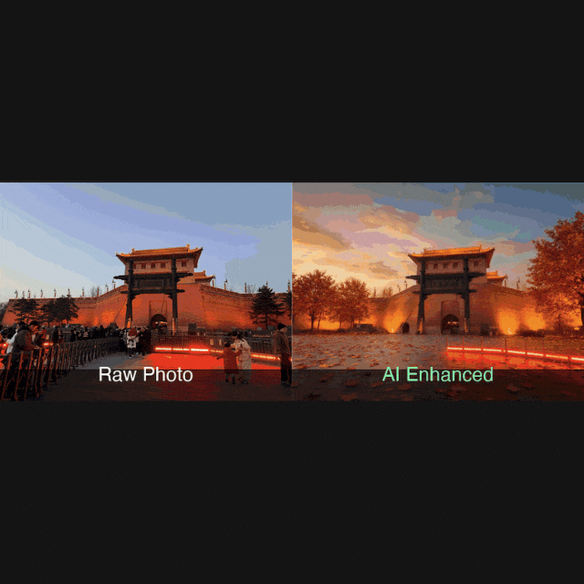
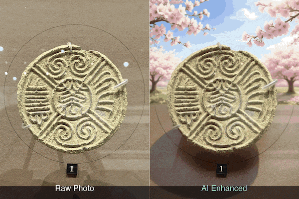
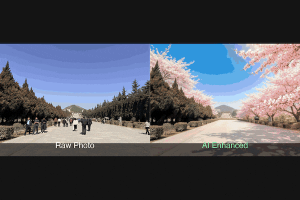

# 学习笔记：从 Agent 到 Skills — AI 智能体架构的范式转变

> **公众号**: 阿里云开发者  
> **发布时间**: 2026-03-30 08:30  

> 报告日期：2026-02-28 关键词： Agent Skills, MCP, OpenClaw, A2A, Agentic AI, 模块化架构

## 一、谁提出了从 Agent 到 Skills 的转变？

### 1.1 起源：Anthropic 的两步棋

Anthropic 在不到 14 个月内连续发布了两个开放标准：

时间| 事件| 意义
---|---|---
**2024年11月**|  Anthropic 开源 **MCP** （Model Context Protocol）| 解决 AI 模型与外部工具/数据的连接问题
**2025年10月**|  Anthropic 在 Claude Code 中推出 **Agent Skills**|  解决 AI 模型的领域专业知识加载问题
**2025年12月18日**|  Anthropic 将 Agent Skills 作为开放标准发布| 48小时内被 Microsoft、OpenAI 采纳
**2025年12月**|  MCP 捐赠给 Linux 基金会（Agentic AI Foundation）| 从公司项目升级为行业标准

> **Anthropic 工程博客原文：**
>  "Building a skill for an agent is like putting together an onboarding guide for a new hire. Instead of building fragmented, custom-designed agents for each use case, anyone can now specialize their agents with composable capabilities."

### 1.2 行业响应

Agent Skills 开放标准发布后，各家跟进很快：

  * **Microsoft： 48小时内宣布支持**
  * **OpenAI Codex： 迅速集成 Skills 格式**
  * **Cursor、Codebuddy： 原生支持**
  * **OpenClaw： 成为 Skills 生态最大的消费者之一，拥有 3000+ 社区 Skills**
  * **Spring AI： 2026年1月发布 Agent Skills 集成模式**

Gartner 2024年的预测已经应验：到2026年，75% 的 AI 项目聚焦于可组合的 Skills 而非单体 Agent。

## 二、一个真实项目：自动化美化相册

> 后续所有概念都将围绕这个项目展开，让读者在具体场景中理解抽象概念。项目所涉及的skills和代码均已开源，开源地址见文章最后。

### 业务目标

将旅行手机照片自动处理为社交媒体发布内容：

  *   *   *   *   *   *   *   *   *   *   *   *   *

    手机原图 → AI去杂物 → AI风格化(3种) → 拼接对比图 → 生成GIF → AI写推文 → 待发布

### 技术栈

组件| 技术选型
---|---
**AI 模型**|  Ming-flash-omni-2.0（多模态图文生成）
**API 网关**|  Zenmux（Vertex AI 兼容接口）
**Agent 运行环境**|  OpenClaw（本地自主代理框架）/ Claude Code（对比方案，详见第五章）
**Agent 推理模型**|  Kimi K2.5 (OpenClaw) / Claude Opus 4.6 (Claude Code，仅编写时)
**Skill 载体**| ` auto-twitter-campaign` Skill
**文件系统 MCP**| ` @modelcontextprotocol/server-filesystem`（stdio，已验证 14 个 Tools 全部可用）
**微信消息通道**|  键盘模拟直接控制（wechat-mcp v2 协议层可通但实际操作不可用，详见第五章）

### 实际目录布局

  *   *   *   *   *   *   *   *   *   *   *   *   *   *   *   *   *   *   *   *   *   *   *   *   *   *   *   *   *   *   *

    # === 独立工程（各有各的 Git 仓库）===# Filesystem MCP Server（Anthropic 官方维护，已验证可用）# 安装方式：npx -y @modelcontextprotocol/server-filesystem <允许目录># 提供 14 个 Tools：read_file, write_file, edit_file, #   list_directory, search_files, get_file_info, ...# 传输方式：stdio（标准输入输出）# === OpenClaw Skills — 两个目录，不同用途 ===~/.openclaw/workspace/skills/             ← "重型" Skills（带脚本的业务流水线）├── auto-twitter-campaign/                ← 本文主角：图片处理 + 文案生成│   ├── SKILL.md│   └── scripts/│       ├── campaign.py                   ← 编排器│       └── batch_compare.py              ← 图像处理流水线├── ming-flash-omni/                      ← 单图交互 Skill├── stock-analysis/                       ← 股票分析└── x-trends-nvdfx/                       ← Twitter 趋势~/.openclaw/skills/                       ← "轻型" Skills（MCP 的使用说明书）├── filesystem/                           ← 教 Agent 怎么用 Filesystem MCP│   ├── skill.json│   └── prompt.md└── wechat/                               ← 教 Agent 怎么用微信键盘模拟    ├── skill.json    ├── prompt.md    └── scripts/send_message.sh 等# === MCP 注册配置 ===~/.claude.json → mcpServers               ← 告诉 Agent 每个 MCP Server 怎么启动# === 业务数据 ===~/campaign_images/├── images/new/                           ← 待处理原图（输入）├── candidates/                           ← 中间产物└── results/                              ← 最终产出（对比图/GIF/推文）

    注意：它们是"分层引用"关系，不是"包含"关系。

层| 位置| 角色
---|---|---
**MCP Server**| ` @modelcontextprotocol/server-filesystem`| Anthropic 官方 Node.js 包（npx 直接运行）
**MCP 注册**| ` ~/.claude.json` 的 `mcpServers`| 告诉 Agent "Server 怎么启动"
**Skill 说明书**| ` ~/.openclaw/skills/filesystem/`| 教 Agent "MCP Tools 怎么用"
**Skill 业务脚本**| ` ~/.openclaw/workspace/skills/auto-twitter-campaign/`| 自包含流水线，不依赖 MCP

`auto-twitter-campaign` 里不需要放文件系统操作或消息通道的代码。它只负责图片处理和文案。需要读取文件时 Agent 会通过 Filesystem MCP Server 操作。

## 三、四个核心概念 — 用同一个项目逐一拆解

### 3.1 Agent：如果把一切塞进 Prompt

传统 AI Agent 是一个单体式的自主推理实体，将所有能力内嵌于一个大型系统提示或模型权重中。

  *   *   *   *   *   *   *   *   *   *   *   *   *   *

    ┌─────────────────────────────────┐│           Monolithic Agent       ││                                 ││  ┌───────────────────────────┐  ││  │   巨大的 System Prompt     │  ││  │   (所有知识 + 所有指令)     │  ││  └───────────────────────────┘  ││  ┌───────────────────────────┐  ││  │   硬编码的工具调用逻辑      │  ││  └───────────────────────────┘  ││  ┌───────────────────────────┐  ││  │   自定义 API 集成          │  ││  └───────────────────────────┘  │└─────────────────────────────────┘

    痛点：

  * 上下文窗口浪费（加载大量无关指令）
  * 不可复用（每个 Agent 重复造轮子）
  * 难以维护（修改一处可能影响全局）
  * 不可组合（无法在 Agent 之间共享能力）

### 反模式示例：如果用纯 Agent 实现这个项目

如果没有 Skill、没有 MCP，所有知识和工具调用都硬编码在一个巨大的系统提示和脚本中，代码会变成这样：

  *   *   *   *   *   *   *   *   *   *   *   *   *   *   *   *   *   *   *   *   *   *   *   *   *   *   *   *   *   *   *   *   *   *   *   *   *   *   *

    # ❌ 单体 Agent 方案 — 反模式示例# 一个 3000 行的 monolithic_agent.pySYSTEM_PROMPT = """你是一个图片编辑助手。你需要：1. 扫描图片中的游客、车辆、栏杆等杂物2. 用 Ming-flash-omni-2.0 模型进行 inpainting 去除3. 生成3种风格变体：氛围/戏剧/艺术4. 用 Pillow 拼接对比图5. 生成 GIF 动画6. 写 Twitter 推文（格式：📍地点 📅时间 🏔️场景...）7. 写小红书文案（格式：标题+正文+标签）8. 通过 Zenmux API 发送请求，endpoint 是 https://zenmux.ai/api/vertex-ai9. 图片压缩到 2MB 以内，最大边 2048px10. 评分标准：结构保持30分 + 清理质量25分 + 无幻觉25分 + 视觉质量20分... (还有 200 行指令)"""# 所有函数都在一个文件里defanalyze_cleanup(image): ...defedit_image(image, instruction): ...defscore_image(orig, edited): ...defanalyze_styles(image): ...defmake_comparison(orig, edited): ...defmake_gif(images): ...defgenerate_tweet(images, desc): ...defpost_to_twitter(tweet, media): ...      # 直接硬编码 Twitter APIdefpost_to_xiaohongshu(text, images): ...  # 直接硬编码小红书 APIdefsend_wechat_notification(msg): ...      # 直接硬编码微信 APIdefmain():    # 一个 main 函数串联所有逻辑，无法复用    images = scan_pending()    for img in images:        cleaned = cleanup(img)        styles = stylize(cleaned)        comparison = stitch(img, styles)        gif = animate(comparison)        tweet = write_tweet(comparison)        post_to_twitter(tweet, gif)         # 紧耦合        post_to_xiaohongshu(tweet, gif)     # 紧耦合        send_wechat_notification("Done!")   # 紧耦合

    问题：

  * 3000 行代码全部加载到上下文，浪费 token
  * Twitter/小红书/微信 API 硬编码，改一个平台要改整个文件
  * 无法在其他项目中复用图片处理能力
  * 无法让不同 Agent 共享这套流水线

### 3.2 Skills：模块化知识包

Skills 是 Anthropic 提出的模块化、文件系统驱动的能力包。思路是把专业知识从 Agent 中拆出来，变成可以发现、加载、共享的独立模块。

  *   *   *   *   *   *   *   *   *

    my-skill/├── SKILL.md          ← 主文件：YAML 元数据 + Markdown 指令├── scripts/│   ├── deploy.sh     ← 可执行脚本│   └── validate.py├── templates/│   └── config.yaml   ← 模板资源└── docs/    └── reference.md  ← 参考文档

    SKILL.md 的三层渐进式披露（Progressive Disclosure）：

层级| 内容| 何时加载
---|---|---
**Level 1：元数据**|  YAML frontmatter（名称、描述、触发条件）| Agent 启动时预加载到系统提示
**Level 2：指令**|  Markdown 正文（步骤、规则、约束）| 匹配到相关任务时按需加载
**Level 3：资源**|  脚本、模板、文档| 执行阶段才访问

好处在于：Agent 不用一次性吞下所有知识，按需加载，省上下文窗口。

**实战： auto-twitter-campaign Skill 的三层披露**

**Level 1：元数据 — Agent 启动时预加载（仅 30 字）**

  *   *   *   *   *   *

     ---name: auto-twitter-campaigndescription: Autonomous AI image campaign content generator. Processes pending  photos via Ming-flash-omni-2.0 (cleanup + style editing), creates side-by-side  comparison images and GIF showcases, then auto-generates tweet text using AI.---

    当用户对 OpenClaw 说"帮我处理照片"，Agent 扫描所有 Skill 的元数据，仅凭 description 这 30 个字就知道该加载这个 Skill，而不需要加载全部代码。

### Level 2：指令 — 匹配后按需加载

  *   *   *   *   *   *   *

    ## Quick Startpython3 {baseDir}/scripts/campaign.py runpython3 {baseDir}/scripts/campaign.py processpython3 {baseDir}/scripts/campaign.py showcase --description "大年初四唐乾陵"## Pipeline1. Cleanup Director → 2. Cleanup Creator → 3. Style Director→ 4. Style Creator → 5. Showcase → 6. Tweet Writer

    Agent 读到这里就知道该调用哪个命令、传什么参数。

### Level 3：资源 — 执行阶段才访问

  *   *

    # scripts/batch_compare.py 中的具体实现代码# Agent 直接执行 python3 命令，不需要理解内部逻辑

**Director-Creator-Critic 模式 — Skill 内部的多角色编排**

` batch_compare.py` 实际上实现了一个微型多 Agent 系统，但它被封装在单个 Skill 内部：

  *   *   *   *   *   *   *   *   *   *   *   *   *   *   *   *   *   *   *   *

    # === Director（导演）：决定做什么 ===defanalyze_cleanup(client, image_data):    """扫描图片，识别杂物，输出一条清理指令"""    prompt = (        "You are an expert photo retoucher. Your job is to find EVERY "        "non-natural element... Look for: People, vehicles, barriers..."    )    # 返回: "Repaint the silver car on the right with clean ground"    # 或:   "NONE"# === Creator（执行者）：生成候选方案 ===defedit_image(client, image_data, instruction, is_cleanup=False):    """根据指令生成编辑后的图片"""    # cleanup 模式: inpainting 去杂物    # style 模式: 风格迁移    # 每次调用生成 1 张，循环 3 次生成 3 个候选# === Critic（评审员）：打分选优 ===defscore_image(client, orig_data, edit_data, instruction):    """对比原图和编辑图，按 4 个维度打分 0-100"""    # 结构保持 (30分) + 清理质量 (25分)    # + 无幻觉 (25分) + 视觉质量 (20分)

值得注意的是：这三个"角色"都是同一个 LLM 模型（Ming-flash-omni-2.0）在不同 Prompt 下的表现，而不是三个独立的 Agent。**用 Prompt 编排代替 Agent 编排。**

  *   *   *   *   *

     Director (分析 Prompt)  →  "去除右侧三个游客"         │Creator ×3 (编辑 Prompt)  →  3 个候选图         │Critic (评分 Prompt)  →  "候选2最佳，85分"

不需要部署多个 Agent 就能实现多角色协作。同一个 LLM 在不同 Prompt 下扮演不同角色，全部封装在一个 Skill 的脚本中。这比部署 3 个独立 Agent + A2A 协议要轻量得多。

### 编排层 — campaign.py 的实际代码结构

  *   *   *   *   *   *   *   *   *   *   *   *   *   *   *   *   *

    # campaign.py — 薄编排层，不包含业务逻辑defcmd_process(args):    """动态导入 batch_compare.py 并执行"""    spec = importlib.util.spec_from_file_location(        "batch_compare", SCRIPT_DIR / "batch_compare.py"    )    mod = importlib.util.module_from_spec(spec)    spec.loader.exec_module(mod)    mod.main()  # 全部业务逻辑在 Skill 的脚本中defcmd_showcase(args):    """GIF 生成 + AI 写推文"""    generate_gifs(results_dir)       # Pillow 处理    generate_tweet_text(results_dir)  # Ming API 调用defcmd_run(args):    """完整流水线 = process + showcase"""    cmd_process(args)   # Stage 1: 图片处理    cmd_showcase(args)  # Stage 2: 展示 + 文案

### 3.3 MCP：标准化工具连接

MCP 是 Anthropic 于 2024年11月开源的 AI 模型与外部工具/数据源的连接协议，基于 JSON-RPC 2.0。有人叫它"AI 的 USB-C"。

  *   *   *   *   *   *   *   *

    ┌──────────────┐     JSON-RPC2.0      ┌──────────────┐│  MCPClient  │ ◄──────────────────► │  MCPServer  ││  (AI 应用)    │   StreamableHTTP     │  (外部服务)   │└──────────────┘                       └──────────────┘       │                                      │  Claude/GPT/                           GitHubAPI  Gemini 等                             数据库/                                        文件系统等

MCP 提供三类能力：

### 1\. Tools — 外部函数（查询数据库、发送消息）

**2\. Resources — 数据源（文件内容、API 响应）**

### 3\. Prompts — 提示模板

### 时间线：

  * 2024年11月：Anthropic 开源 MCP
  * 2025年3月：发布 spec 2025-03-26，Streamable HTTP 取代 SSE 成为推荐传输方式
  * 2025年12月：捐赠给 Linux 基金会 Agentic AI Foundation
  * 截至2026年初：9700万+ 月 SDK 下载量，10000+ 活跃 MCP Server

### 实战：Filesystem MCP Server 验证

  *   *   *   *   *   *   *   *   *   *

    // ~/.claude.json 中的 MCP 配置{  "mcpServers":{    "filesystem":{      "command":"npx",      "args":["-y","@modelcontextprotocol/server-filesystem","~/campaign_images"],      "type":"stdio"    }  }}

`@modelcontextprotocol/server-filesystem` 是 Anthropic 官方维护的 MCP Server，用 Node.js 实现，通过 stdio 传输与 Agent 通信。

### 实测验证过程（2026-02-26）：

  *   *   *   *   *   *   *   *   *   *   *   *   *   *   *   *   *   *   *   *   *   *

    # 1. MCP 握手 — 成功$ echo'{"jsonrpc":"2.0","id":1,"method":"initialize",...}' \  | npx -y @modelcontextprotocol/server-filesystem ~/campaign_images→ {"serverInfo":{"name":"secure-filesystem-server","version":"0.2.0"}}# 2. 工具发现 — 14 个 Tools→ read_file, read_text_file, read_media_file, read_multiple_files,  write_file, edit_file, create_directory, list_directory,  list_directory_with_sizes, directory_tree, move_file,  search_files, get_file_info, list_allowed_directories# 3. list_directory — 列出 pose 编辑结果$ tools/call list_directory {"path":"~/campaign_images/results/pose"}→ [FILE] pose_微信图片_20260226155545_1_248_rank1.jpg  [FILE] pose_微信图片_20260226155545_1_248_rank2.jpg  [FILE] pose_微信图片_20260226155545_1_248_grid.jpg  ...# 4. get_file_info — 查询文件元数据$ tools/call get_file_info {"path":"...rank1.jpg"}→ size: 218451, permissions: 644, isFile: true# 5. search_files — 搜索所有 prompts 文件$ tools/call search_files {"path":"...results/pose","pattern":"*prompts*"}→ pose_IMG_6382_prompts.txt  pose_微信图片_20260226155545_1_248_prompts.txt

Agent 不需要知道文件系统的具体实现（本地磁盘、NFS、云存储），只通过标准化的 `list_directory`、`search_files`、`read_file` 等 Tools 交互。换底层存储时，换 MCP Server 就行，Agent 代码不用动。

### Skill 与 MCP 的精确分界线

在这个项目中，`~/.openclaw/skills/` 下实际有两类 Skill：原生 Skill 和 MCP 封装 Skill。

### 原生 Skill（代码即能力）：

  *   *   *   *   *

    auto-twitter-campaign/├── SKILL.md          ← Agent 接口└── scripts/    ├── campaign.py   ← 自包含的 Python 脚本    └── batch_compare.py

Skill 内部直接调用 Zenmux API（genai.Client），不依赖任何 MCP Server。Agent 只需要执行 `python3 scripts/campaign.py run`，脚本自带一切。

**MCP 封装 Skill（Skill 是 MCP 的"使用说明书"）：**

  *   *   *   *   *   *   *   *   *   *

     filesystem/├── skill.json        ← Skill 元数据（触发条件）└── prompt.md         ← "怎么使用 Filesystem MCP"的说明wechat/├── skill.json├── prompt.md         ← "怎么使用微信键盘模拟"的说明└── scripts/    ├── send_message.sh   ← 简单的 shell 包装    ├── read_chat.sh    └── list_contacts.sh

MCP 封装 Skill 本身不含核心逻辑，就是一本"使用手册"，教 Agent 怎么调用已经运行的 MCP Server。

**MCP 是"递给你一把锤子"，Skill 是"教你怎么用这把锤子"。**

两者的协作关系：

  *   *   *   *   *   *   *   *   *   *

    Skill: filesystem/prompt.md  "当用户想查看处理结果时，先通过 MCP 的 list_directory 列出文件，   然后用 search_files 搜索特定模式的文件，   再用 get_file_info 获取文件大小和修改时间..."         │         ▼ Agent 按照 Skill 指令行动         │MCP Server: filesystem (stdio)  server.tool("list_directory", {path})  server.tool("search_files", {path, pattern})

简单说：能写成脚本跑完的，用 Skill；需要跟外部服务保持连接的，用 MCP。

场景| 正确方案| 原因
---|---|---
图片清理 + 风格化| Skill（batch_compare.py）| 一次性批处理，无需持续连接
读取/搜索文件| MCP（filesystem）| 需要运行时动态查询，数据随时变化
写推文文案| Skill（campaign.py）| 确定性的 Prompt + 模板，无需外部服务

### 3.4 OpenClaw：Agent 运行环境

OpenClaw 是奥地利开发者 Peter Steinberger（PSPDFKit/Nutrient 创始人）做的开源 AI 代理框架，目前是 Skills 生态里最活跃的平台。

### 改名历史：

  * 最初命名 Clawdbot（Claude 的谐音梗）
  * 2026年1月27日：因 Anthropic 商标问题更名为 Moltbot（龙虾蜕壳之意）
  * 3天后再次更名为 OpenClaw（强调开源 + 保留甲壳类品牌）
  * 从 9000 星到 180,000+ GitHub Stars 仅用数天

### 核心架构：

  *   *   *   *   *   *   *   *   *   *   *   *   *   *   *   *

    ┌─────────────────────────────────────────┐│              OpenClaw 架构               ││                                         ││  Gateway─── 消息平台连接层              ││    │         (WhatsApp/Telegram/Discord  ││    │          + 可桥接扩展其他平台)       ││    ▼                                    ││  Agent──── 推理引擎（理解用户意图）      ││    │                                    ││    ▼                                    ││  Skills─── 模块化能力扩展               ││    │         (3000+ 社区 Skills)         ││    ▼                                    ││  Memory─── 持久化存储层                 ││              (上下文 + 偏好)              │└─────────────────────────────────────────┘

### 特点：

  * 本地运行，数据不离开设备
  * 后台守护进程，监听文件变更、聊天消息、社交动态
  * 3000+ 社区 Skills，53+ 官方集成
  * 通过 MCP Server 连接外部服务

### 实战：完整生产架构

  *   *   *   *   *   *   *   *   *   *   *   *   *   *   *   *   *   *   *   *   *   *   *   *   *   *   *   *   *   *   *   *   *   *   *   *

    ┌─────────────────────────────────────────────────────────┐│              完整生产架构                                  ││                                                         ││  用户入口：                                              ││  ┌──────┐  ┌──────────┐  ┌───────┐  ┌──────┐          ││  │ 微信  │  │微信(桥接) │  │Telegram│  │CLI  │          ││  └──┬───┘  └──┬───────┘  └───┬───┘  └──┬───┘          ││     │      bridge_openclaw.py │         │               ││     │      (轮询+转发)        │         │               ││     └─────────┴──────────────┴─────────┘                ││                    │                                    ││              OpenClawGateway                           ││              (localhost:18789)                           ││                    │                                    ││              OpenClawAgent                             ││              (KimiK2.5 推理引擎)                       ││                    │                                    ││     ┌──────────────┼──────────────┐                     ││     ▼              ▼              ▼                     ││  ┌────────┐  ┌──────────┐  ┌──────────┐               ││  │Skills│  │   MCP    │  │  Memory  │               ││  └────┬───┘  └────┬─────┘  └──────────┘               ││       │           │                                    ││  ┌────┴────────────┴────────────────┐                  ││  │                                  │                  ││  │  Skill: auto-twitter-campaign    │                  ││  │  ├ campaign.py (编排)            │                  ││  │  └ batch_compare.py (处理)       │                  ││  │                                  │                  ││  │  Skill: ming-flash-omni          │                  ││  │  └ ming_image.py (单图交互)      │                  ││  │                                  │                  ││  │  MCP: filesystem                   │                  ││  │  └ stdio → 文件读写/搜索/列表     │                  ││  │                                  │                  ││  │  Skill: wechat-bridge              │                  │

> 注意：OpenClaw 原生支持 Slack、WhatsApp、Telegram、Discord 等渠道，但不包含微信。微信接入需要通过自定义桥接脚本 bridge_openclaw.py（轮询微信消息 + 转发给 openclaw agent），详见第五章。

### 一次完整的端到端执行流

用户在 **微信** 发送："帮我处理今天的唐乾陵照片，生成推文"

  *   *   *   *   *   *   *   *   *   *   *   *   *   *   *   *   *   *   *   *   *   *   *   *   *   *   *

    1. Gateway 收到 微信 消息   └→ Agent 推理引擎解析意图: "处理照片 + 生成文案"
    2. Agent 扫描 Skill 元数据   └→ 匹配 auto-twitter-campaign（description 包含 "process pending images"）
    3. Agent 加载 SKILL.md Level 2 指令   └→ 发现命令: python3 scripts/campaign.py run --description "大年初四唐乾陵"
    4. Agent 执行 Skill 脚本   └→ batch_compare.py Stage 1: 清理      ├→ Director: analyze_cleanup() → "去除前景三个游客和右侧金属栏杆"      ├→ Creator ×3: edit_image() → 3个清理候选      └→ Critic: score_image() → 选出 85 分的最佳候选   └→ batch_compare.py Stage 2: 风格化      ├→ Style Director: analyze_3styles() → 秋日暖色/夕阳/水墨      └→ Creator ×3: 每种风格各生成 1 张   └→ campaign.py showcase:      ├→ 拼接 compare_*.jpg → make_comparison()      ├→ 生成 showcase_all.gif → make_gif()      └→ AI 写推文 → generate_tweet_text()
    5. Agent 通过 MCP:filesystem 读取 results/ 目录   └→ 列出新生成的对比图和 GIF 文件
    6. Agent 通过微信桥接脚本发通知   └→ "唐乾陵照片处理完成 ✓"

> 上述流程中的微信通道在实际部署时需要通过桥接脚本接入（OpenClaw 不原生支持微信渠道）。Slack 通道可直接由 Gateway 处理。详见第五章中 bridge_openclaw.py 的实现。

OpenClaw 本身不做图片处理，也不做社交发布。它提供 Gateway（多通道接入）、Agent 推理（意图理解）、Skill 发现（按需加载）、MCP 编排（统一管理）和 Memory（跨会话记忆）。打个比方：它是操作系统，Skills 是应用程序，MCP 是驱动程序。

**3.5 A2A & Agent Teams：Agent 间协作**

Google 于 2025 年推出 A2A（Agent-to-Agent）协议，解决多个独立 Agent 之间的发现、认证和协作。

### 与 MCP 的关系：

  * **MCP = 纵向集成：AI 模型 ↔ 工具/数据（一个 Agent 连接多个工具）**
  * **A2A = 横向协作：Agent ↔ Agent（多个 Agent 之间互相发现、委派任务）**

  *   *   *   *   *   *

            A2A（横向：Agent 间协作）Agent A ◄─────────────────────► Agent B  │                                │  │ MCP（纵向：连接工具）           │ MCP  ▼                                ▼Tools/Data                    Tools/Data

有人将 MCP + A2A 的组合比作 AI 领域的 TCP/IP 时刻——一个处理数据传输，一个处理节点通信。

在本项目中，A2A 暂未使用——Director-Creator-Critic 的多角色协作被封装在单个 Skill 内部（见 3.2），无需跨 Agent 通信。但当任务复杂到需要独立 Agent 各自负责不同领域时（如代码审查 Agent + 部署 Agent），A2A 就是必要的协作层。

但是，A2A在coding agent领域并没有被广泛采用，感觉是“一个月前的工具已经落伍”了。目前Claude Code Agent Teams正在流行中，节前Claude使用16个agent通过Agent Teams在无人干预的情况下，2周实现了一个基于Rust的C编译器；

## 四、对比总结

### 4.1 定位对比

维度| Agent| Skills| MCP| OpenClaw
---|---|---|---|---
**本质**|  自主推理实体| 模块化知识包| 工具连接协议| Agent 运行框架
**类比**|  一个全能员工| 员工的培训手册| 员工的工具箱接口| 员工的办公室
**解决的问题**|  "谁来做事"| "怎么做事"| "用什么做事"| "在哪里做事"
**粒度**|  粗（整个系统）| 细（单个能力）| 细（单个连接）| 粗（整个平台）
**可复用性**|  低| 高| 高| 中
**标准化程度**|  无统一标准| 开放标准| 开放标准| 开源框架

### 4.2 技术架构对比

### MCP vs Skills 的常见比喻：

> MCP 是"递给你一把锤子"，Skills 是"教你怎么用这把锤子钉钉子"。 — dante.company

维度| MCP| Skills
---|---|---
**连接方式**|  运行时动态连接（客户端-服务器）| 静态文件系统加载
**内容类型**|  API 调用、数据查询、工具执行| 文档、指令、脚本、模板
**协议**|  JSON-RPC 2.0 over Streamable HTTP| 文件目录 + YAML + Markdown
**状态**|  有状态（会话连接）| 无状态（按需读取）
**适用场景**|  连接 GitHub、数据库、Slack 等外部服务| 教 Agent 如何做部署、写代码、处理数据
**开发成本**|  需要写 Server 代码| 只需写 Markdown 文件

实际上，Skills 并没有取代 MCP，而是取代了那些本不该用 MCP 实现的场景。之前很多开发者用 MCP Server 传递静态知识（编码规范、部署流程），这些事 Skills 更合适。MCP 该做的是动态数据和工具连接。

### 4.3 协议栈全景：它们如何协同工作

  *   *   *   *   *   *   *   *   *   *   *   *   *   *   *   *   *   *   *   *   *   *   *

    ┌─────────────────────────────────────────────────────┐│                  2026 Agentic AI 协议栈               ││                                                     ││  ┌───────────────────────────────────────────────┐  ││  │  应用层：OpenClaw / Claude Code / Cursor       │  ││  │         (Agent 运行环境)                       │  ││  └───────────────────┬───────────────────────────┘  ││                      │                              ││  ┌──────────┐  ┌─────┴─────┐  ┌──────────────────┐ ││  │  Skills   │  │   Agent   │  │      A2A         │ ││  │ (知识层)  │  │  (推理层)  │  │ (Agent间协作层)  │ ││  │ 教怎么做  │  │  决定做什么 │  │  跨Agent委派     │ ││  └──────────┘  └─────┬─────┘  └──────────────────┘ ││                      │                              ││  ┌───────────────────┴───────────────────────────┐  ││  │              MCP (工具连接层)                    │  ││  │         连接数据库/API/文件系统/SaaS             │  ││  └───────────────────────────────────────────────┘  ││                                                     ││  ┌───────────────────────────────────────────────┐  ││  │           基础设施：LLM API / 本地模型           │  ││  └───────────────────────────────────────────────┘  │└─────────────────────────────────────────────────────┘

### 一个完整的工作流示例：

  1. 用户通过 OpenClaw（WhatsApp）发送："帮我部署最新代码到生产环境"
  2. OpenClaw 的 Agent 推理引擎理解意图
  3. Agent 加载 `deploy-to-production` Skill（包含部署流程、检查清单、回滚策略）
  4. Skill 指导 Agent 通过 MCP 连接 GitHub（拉取代码）、AWS（执行部署）、微信（发送通知）、Slack（发送通知）
  5. 如果需要代码审查，通过 A2A 协议委派给另一个专门的审查 Agent

### 4.4 同一需求，四种实现

以"处理一张照片并查看结果文件"为例：

维度| 纯 Agent| Skill| MCP| OpenClaw 全栈
---|---|---|---|---
**代码组织**|  1 个 3000 行文件| SKILL.md + 2 个 Python 脚本| 3 个独立 MCP Server| Skill + MCP 分层组合
**上下文消耗**|  全部加载（~4000 token）| 按需加载（~200 token 元数据）| 工具列表（~500 token）| 元数据 + 工具列表（~700 token）
**图片处理**|  内嵌在 Agent 代码中| `batch_compare.py` 脚本| `ming-image-mcp` Server| Skill 封装脚本
**查看结果**|  硬编码 API 调用| 不负责（不属于此 Skill）| `filesystem` MCP Server| MCP + Skill 说明
**发微信通知**|  硬编码 API 调用| 不负责| 键盘模拟脚本| 桥接脚本 + Skill 说明
**可复用性**|  ❌ 无| ✅ 其他 Agent 可安装同一 Skill| ✅ 其他 Agent 可连接同一 MCP| ✅✅ 两者兼得
**新增平台**|  改代码| 写新 Skill / 不需要改| 写新 MCP Server| 装新 Skill + 连新 MCP
**团队协作**|  1人维护全部| 图片处理/文案/分发 各自独立| 每个 Server 独立开发| 完全解耦

## 五、实验验证：Claude Code vs OpenClaw

这个实验跑了同一个任务的两种实现，对比 Claude Code 和 OpenClaw 在架构、代码、行为上的差异。

### 实验任务

### 微信驱动的图片营销闭环

  *   *   *   *

    用户在微信发送"处理照片 xxx.jpg"  → AI 处理图片（清理+风格编辑+对比图+GIF）  → AI 生成推文文案  → 将结果汇报回微信

### 实验环境

组件| 配置
---|---
**硬件**|  macOS Darwin 22.6.0
**Claude Code**|  Claude Opus 4.6，Shell 直接运行
**OpenClaw**|  v2026.1.30，Gateway 守护进程 (port 18789)
**OpenClaw Agent 模型**|  Kimi K2.5 (Moonshot)
**图片处理模型**|  Ming-flash-omni-2.0 (Zenmux)
**微信控制**|  wechat_mcp 键盘模拟模块（wechat-mcp v2 的 MCP 协议层可通，但 WeChat 4.x 屏蔽了 AX API 和 AppleScript 键盘事件，所有实际操作均不可用，因此直接使用其内部的键盘模拟函数）

### 5.1 方案 A：Claude Code 硬编码方案

**文件：**` ~/.openclaw/skills/wechat-bridge/scripts/demo_case1.py`
**核心设计：** 一个 Python 脚本硬编码全部流程，直接 subprocess 调用 `campaign.py`。运行时没有 AI 参与决策，所有逻辑在编写代码时由 Claude Code 确定。

### 执行链路

  *   *   *   *   *   *   *

    demo_case1.py (Python 硬编码)  ├── open_chat_once("dandan")          ← wechat_mcp 键盘模拟打开聊天  ├── send_in_current_chat("收到...")    ← 剪贴板粘贴+回车  ├── subprocess: campaign.py run       ← 子进程执行图片处理  ├── count 新增 compare_* 文件         ← 修改时间差集  ├── send_in_current_chat("完成...")    ← 固定模板回复  └── send_in_current_chat("推文:...")   ← 读取 tweet.txt 回复

### 关键代码

### 微信消息发送 — 避免重复搜索聊天窗口

  *   *   *   *   *   *   *   *   *   *   *   *   *   *   *   *   *   *   *   *   *   *   *   *   *   *   *   *   *   *   *

    # 问题：每次 send() 都重新搜索 "dandan"，导致消息发到错误窗口# 解决：open_chat_once() 只在首次打开，后续复用已打开的窗口_chat_opened = Falsedefopen_chat_once():    """只在第一次打开聊天窗口，之后复用"""    global _chat_opened    ifnot _chat_opened:        from wechat_mcp.wechat_keyboard import open_chat_via_keyboard        open_chat_via_keyboard(CHAT_NAME)        time.sleep(0.5)        # Escape 确保焦点离开搜索框        subprocess.run(["osascript", "-e",            'tell application "System Events" to key code 53'], timeout=5)        time.sleep(0.3)        _chat_opened = Truedefsend_in_current_chat(msg: str):    """在已打开的聊天窗口中直接发送消息（不重新搜索）"""    from wechat_mcp.wechat_keyboard import _activate_wechat, _set_clipboard, _run_applescript    _activate_wechat()    time.sleep(0.2)    _set_clipboard(msg)    _run_applescript(        'tell application "System Events" to tell process "WeChat" '        'to keystroke "v" using command down'    )    time.sleep(0.3)    _run_applescript(        'tell application "System Events" to tell process "WeChat" '        'to key code 36'    )    time.sleep(0.3)

### 新增对比图计数 — 基于修改时间的差集

  *   *   *   *   *   *   *

    # 问题：同名文件被覆盖时，Path 集合差集为空，显示"新增 0 张"# 解决：记录处理前每个文件的 mtime，处理后比对# 处理前existing_results = {p: p.stat().st_mtime for p in RESULTS_DIR.glob("compare_*")}# 处理后new_results = sum(1 for p in RESULTS_DIR.glob("compare_*")                 if p not in existing_results or p.stat().st_mtime > existing_results[p])

### 固定模板回复

  *   *   *   *   *

    # 回复内容是硬编码的格式化字符串，无 AI 参与send(f"图片处理完成！新增 {new_results} 张对比图")send(f"处理完成！结果汇总:\n- 对比图: {len(compares)}张\n- GIF展示: {len(gifs)}个")tweet_preview = tweet_text[:300] + ("..."iflen(tweet_text) > 300else"")send(f"推文文案:\n{tweet_preview}")

### 5.2 方案 B：OpenClaw Agent 调度方案

**文件：**` ~/.openclaw/skills/wechat-bridge/scripts/bridge_openclaw.py`
**核心设计：** 一个轻薄的桥接脚本，只负责微信消息的收发，所有智能决策都交给 OpenClaw Agent（Kimi K2.5）。Agent 自主理解意图、匹配 Skill、执行命令、组织回复。

### 执行链路

  *   *   *   *   *   *   *   *   *   *   *   *   *   *   *

    bridge_openclaw.py (轮询 + 转发)  ├── read_chat("dandan")                ← 截图OCR读取微信消息  ├── is_actionable(msg)?                ← 简单噪音过滤（长度、黑名单）  ├── send_wechat("收到，正在处理...")     ← 确认回复  │  ├── openclaw agent --message "处理照片 xxx.jpg" --json  │     │  │     └── Kimi K2.5 推理引擎  │           ├── 扫描 12 个 Skill 的元数据  │           ├── 匹配 auto-twitter-campaign（语义理解）  │           ├── 读取 SKILL.md Level 2 指令  │           ├── 执行: python3 campaign.py run --image xxx.jpg  │           └── 组织回复（Markdown 表格 + emoji + 文件列表）  │  └── send_wechat(agent_reply)           ← 转发 Agent 回复

### 关键代码

### Agent 调用 — 单个函数替代整个编排逻辑

  *   *   *   *   *   *   *   *   *   *   *   *   *   *   *

    defcall_openclaw_agent(message: str, timeout: int = 600) -> str | None:    """调用 OpenClaw Agent 处理消息，返回 agent 的回复文本。"""    env = os.environ.copy()  # 传递 ZENMUX_API_KEY 等环境变量    result = subprocess.run(        ["openclaw", "agent", "--agent", "main",         "--message", message,         "--json", "--timeout", str(timeout)],        capture_output=True, text=True, timeout=timeout + 30,        env=env    )    data = json.loads(result.stdout)    # gateway 模式: result.payloads[].text    payloads = data.get("result", data).get("payloads", [])    texts = [p["text"] for p in payloads if p.get("text")]    return"\n".join(texts) if texts elseNone

### 消息过滤 — 替代硬编码的 parse_command()

  *   *   *   *   *   *   *   *   *   *   *   *   *

    defis_actionable(msg: str) -> bool:    """判断消息是否值得交给 Agent 处理（过滤噪音）。"""    msg = msg.strip()    iflen(msg) < 2:        returnFalse    noise = {"你好", "好的", "谢谢", "ok", "OK", "嗯", "哦", "收到"}    if msg in noise:        returnFalse    # 过滤 agent 自己的回复（避免循环）    if msg.startswith(("Agent ", "[OpenClaw]", "收到指令", "执行完成")):        returnFalse    returnTrue    # 注意：不需要 parse_command()，Agent 自己理解意图

### 轮询主循环 — 检测→转发→回复

  *   *   *   *   *   *   *   *   *   *   *   *   *   *   *   *   *   *   *

    def poll_loop(chat_name: str, interval: int, once: bool = False):    state = load_state()    while True:        messages = read_chat(chat_name)        current_hash = messages_hash(messages)        if current_hash != state["last_hash"] and messages:            latest = messages[-1]            if is_actionable(latest) and latest not in state["processed"]:                send_wechat(chat_name, f"收到，正在处理: {latest[:50]}...")                reply = call_openclaw_agent(latest)  # ← 核心：交给 Agent                if reply:                    for chunk in split_message(reply, max_len=500):                        send_wechat(chat_name, chunk)                state["processed"].append(latest)            state["last_hash"] = current_hash            save_state(state)        if once:            break        time.sleep(interval)

### 5.3 实验结果对比

### 运行记录

### Claude 方案（2026-02-26 14:50）：

  *   *   *   *   *   *   *   *   *   *

    ============================================================Case 1 Demo: 微信驱动的图片营销闭环============================================================[状态] pending/ 待处理: 15 张[状态] results/ 已有对比图: 24 张[微信] 发送: 收到指令：处理照片 正在处理: 20260219085128_1_14.jpg 请稍候...[Step 3+4] 处理图片 + 生成展示和推文...[微信] 发送: 图片处理完成！新增 9 张对比图...[微信] 发送: 处理完成！结果汇总: - 对比图: 24张 - GIF展示: 7个 ...[微信] 发送: 推文文案: 📍 Mount Hua (华山) — The Perilous Plank Walk...

### OpenClaw 方案（2026-02-26 15:20）：

  *   *   *   *   *   *   *   *   *   *   *

    [15:20:33] [微信→] 收到，正在处理: 处理照片 20260219085132_2_14.jpg...[15:20:41] [OpenClaw] 发送给 Agent: 处理照片 20260219085132_2_14.jpg...[15:21:02] [OpenClaw] Agent 回复: 照片 `20260219085132_2_14.jpg` **已处理完成** ✅**生成的文件：**| 文件 | 大小 | 说明 ||------|------|------|| compare_20260219085132_2_14_v1.jpg | ... | 原图 vs AI编辑对比 |...⚙️ Engine: Ming-flash-omni-2.0On the first day of the lunar new year...[15:21:05] [微信→] 照片 `20260219085132_2_14.jpg` **已处理完成** ✅ ...

### 行为差异对比

维度| Claude 方案| OpenClaw 方案
---|---|---
**指令理解**| ` parse_command()` 硬编码匹配，只认"处理图片"等固定前缀| Kimi K2.5 语义理解，"帮我修一下这张照片"也能识别
**Skill 匹配**|  硬编码 subprocess 调用 `campaign.py`| Agent 扫描 12 个 Skill 元数据，自动匹配 `auto-twitter-campaign`
**回复格式**|  固定模板字符串（f"新增 {n} 张对比图"）| AI 自由组织（Markdown 表格 + emoji + 文件大小 + 引擎信息）
**错误处理**|  固定错误文本（f"处理失败:\n{output[-200:]}"）| Agent 解释原因并建议修复（如"需要设置 ZENMUX_API_KEY"）
**加新 Skill**|  修改 Python 代码，加 elif 分支| 注册 skill.json + SKILL.md，Agent 自动发现
**运行时 AI**|  无（纯脚本执行）| Kimi K2.5 每次请求消耗 ~15K token
**首次响应延迟**|  < 1 秒（直接执行 Python）| ~20 秒（Agent 推理 + Skill 匹配）
**可预测性**|  完全确定性，输出可预测| 依赖 AI 理解准确性，偶有偏差

### 5.4 架构抽象对比

### Claude 方案的抽象层次

  *   *   *   *   *   *   *   *   *   *   *   *

    ┌──────────────────────────────────────┐│         demo_case1.py                ││                                      ││  1. open_chat_once()      ← 微信 IO ││  2. send_in_current_chat() ← 微信 IO ││  3. subprocess(campaign.py) ← 业务  ││  4. count_files()          ← 业务    ││  5. send_in_current_chat() ← 微信 IO ││                                      ││  所有逻辑在一个脚本中，              ││  编写时确定，运行时不变              │└──────────────────────────────────────┘

说白了，这就是个自动化脚本，不是 Agent。Claude Code 在写代码的时候提供了 AI 能力，但跑起来就是纯 Python。

### OpenClaw 方案的抽象层次

  *   *   *   *   *   *   *   *   *   *   *   *   *   *   *   *   *   *   *   *   *   *   *   *   *

    ┌──────────────────────────────────────┐│       bridge_openclaw.py             ││       (轻薄桥接层，~150 行)           ││                                      ││  1. read_chat()      ← 微信输入      ││  2. is_actionable()  ← 噪音过滤      ││  3. openclaw agent   ← 交给 Agent    ││  4. send_wechat()    ← 微信输出      ││                                      ││  不包含任何业务逻辑                   │└───────────┬──────────────────────────┘            │            ▼┌──────────────────────────────────────┐│       OpenClaw Agent(Kimi K2.5)     ││                                      ││  1. 理解自然语言意图                  ││  2. 扫描 Skill 元数据（12个）         ││  3. 匹配 auto-twitter-campaign       ││  4. 读取 SKILL.md 指令               ││  5. 执行 campaign.py                 ││  6. 组织回复文本                      ││                                      ││  运行时 AI 决策，行为可变             │└──────────────────────────────────────┘

桥接层就是个 IO 适配器（WeChat ↔ OpenClaw），Agent 才是推理引擎。业务逻辑通过 Skill 注入，不在桥接层。

### 5.5 设计启示

### 启示一：Agent 运行环境决定了"智能"在哪一层

| Claude Code 方案| OpenClaw 方案
---|---|---
**编写时的智能**|  Claude Opus 4.6（写代码、调试）| 人工编写桥接脚本
**运行时的智能**|  无（纯脚本）| Kimi K2.5（理解意图、匹配 Skill）
**智能的载体**|  代码（demo_case1.py）| Agent 推理 + Skill 元数据

Claude Code 将 AI 能力"固化"为代码——编写时聪明，运行时确定。OpenClaw 将 AI 能力保持在运行时——每次执行都有推理，灵活但不确定。

### 启示二：桥接层的薄厚反映架构成熟度

  *   *

    Claude 方案:  demo_case1.py = 微信IO + 业务编排 + 结果格式化 (170行，厚桥接)OpenClaw 方案: bridge_openclaw.py = 微信IO + 转发 (160行，薄桥接)

当 Agent 运行环境足够成熟时，桥接层应该趋向于纯 IO 适配器——只做消息的收发，不做业务判断。OpenClaw 方案中，`bridge_openclaw.py` 不需要知道"处理照片"应该调用哪个脚本、传什么参数，这些决策完全由 Agent 在运行时做出。

### 启示三：两种方案并非互斥

在实际生产中，两种方案可以并存：

  *   *   *   *

    ~/.openclaw/skills/wechat-bridge/scripts/├── demo_case1.py           ←Claude 方案：确定性高、延迟低、适合关键路径├── bridge_openclaw.py      ←OpenClaw 方案：灵活性高、可扩展、适合通用入口└── bridge.py               ← 原始版本：硬编码流程（已被上述两者取代）

### 选择建议：

场景| 推荐方案| 原因
---|---|---
固定流水线、高频执行| Claude 方案| 确定性高，无 AI 推理开销
多种任务、自然语言触发| OpenClaw 方案| 一个入口支持所有 Skill
新增功能时| OpenClaw 方案| 注册 Skill 即可，无需改桥接代码
关键业务、不容出错| Claude 方案| 行为完全可预测

这正是第四章"协议分层"的实践验证：Agent 运行环境可以替换，而 Skills 和 MCP 保持不变。无论用 Claude Code 还是 OpenClaw 执行，底层的 `campaign.py`（Skill）代码完全相同。

> 关于微信通道的技术选型说明： 两种方案中的微信消息收发均直接调用 wechat_mcp.wechat_keyboard 模块的键盘模拟函数，而非通过 MCP 协议调用 wechat-mcp Server。原因是：wechat-mcp v2 的 MCP 协议层（JSON-RPC 握手、工具发现）在测试中均能正常运行，但 WeChat 4.x 屏蔽了 macOS Accessibility API 和 AppleScript 键盘事件注入，导致所有实际操作（发消息、读聊天）均不可用。因此我们绕过 MCP 协议层，直接使用其底层的键盘模拟函数（剪贴板粘贴 + 回车发送）来实现微信消息通道。这也从反面说明了 MCP 适合连接真正可编程的外部服务（文件系统、数据库、API），不适合 GUI 自动化。

### 5.6 实际效果

**Day1:华山**
xhs：https://www.xiaohongshu.com/explore/6999c776000000002801faaf?xsec_token=YBDUH1xCPKcylkIiTLq7OAQC5wpVvpcXVzSmWyYid52mo%3D&xsec_source=pc_creatormng
twitter：https://x.com/forde450/status/2025106664245133472?s=20

Day2:西安城墙&西安博物院
xhs：https://www.xiaohongshu.com/explore/699a70d6000000001a027efa?xsec_token=YBpaxmbaaPPgR9AeWuzHkxq5ZNFKpgUHMKaQkcOEBYdSE%3D&xsec_source=pc_creatormng
twitter：https://x.com/forde450/status/2025374927520759975?s=20

**Day3:咸阳宫 &陕历博秦汉馆**
xhs：https://www.xiaohongshu.com/explore/699bdccd000000000a02b5e9?xsec_token=ABxfcEwhgaucdP_6iZCL0j1Hwik8JJMwVQAP2hAJHhAf0=&xsec_source=pc_user
twitter：https://x.com/forde450/status/2025799759794257962?s=20

**Day4:唐乾陵**
xhs：http://xhslink.com/o/7DEM8jXVvGE
twitter：https://x.com/forde450/status/2026133151228272699?s=20

## 六、趋势与展望

### 6.1 别造 Agent 了，写 Skill 吧

2026 年初流行的一个口号是 **"Stop Building Agents, Start Building Skills"** 。论点很直接：

### 旧范式：为每个用例构建一个定制 Agent

  *   *   *

    用例A → Agent A（包含所有知识和工具）用例B → Agent B（重复造轮子）用例C → Agent C（又一个单体）

**新范式：构建一个薄 Agent + 可组合的 Skills 库**

  *   *   *   *

                        ┌── Skill: 部署通用 Agent 引擎 ────┼── Skill: 代码审查                    ├── Skill: 数据分析                    └── Skill: 客户支持

### Skills 相比单体 Agent 的优势：

维度| 单体 Agent| Skills 架构
---|---|---
**知识更新**|  重新部署整个 Agent| 更新一个 Skill 文件夹
**团队协作**|  一个人维护整个 Prompt| 不同团队维护各自的 Skill
**版本控制**|  难以追踪变更| Git 原生支持
**测试**|  端到端测试，成本高| 单个 Skill 独立测试
**共享**|  无法跨组织复用| npm/pip 式安装分发

### 6.2 环境智能（Ambient Intelligence）

OpenClaw 在做一件有意思的事——把 Agent 变成后台守护进程。不用主动打开什么应用，它就一直在那儿：

  * 后台运行，监听文件变更、聊天消息、社交动态
  * 主动发现问题并提供建议，而不是等你提问
  * 同时连接 WhatsApp、Telegram、Discord、iMessage
  * 非原生平台（比如微信）通过轻量桥接脚本接入，桥接层只做 IO 适配

有人说这才是"Siri 本应成为的样子"。

### 6.3 协议分层与标准化

2026年的 Agentic AI 生态在形成协议分层：

层级| 协议/标准| 功能| 类比
---|---|---|---
**知识层**|  Agent Skills| 教 Agent 怎么做| 操作手册
**工具层**|  MCP| 连接外部工具和数据| USB-C 接口
**协作层**|  A2A| Agent 间发现和委派| HTTP 协议
**运行层**|  OpenClaw / Claude Code| Agent 执行环境| 操作系统

分层的好处是每层独立演进。你可以把 Agent 运行环境从 Claude Code 换成 OpenClaw，Skills 和 MCP Server 不用改。第五章的实验已经验证了这一点。

### 6.4 Skills 市场化与安全

Skills 用文件夹分发，天然适合 Git，生态长得很快：

平台| Skills 数量| 特点
---|---|---
**OpenClaw 社区**|  3000+| 最大的 Skills 消费者，涵盖日常自动化
**GitHub**|  18000+ Stars 的 Skills 仓库| 开发者主导，代码质量高
**Superpowers**|  -| 专注开发工作流
**Spring AI**|  -| 企业级 Skills 模式

装一个 Skill 跟装一个 npm 包差不多，门槛很低。
但 Agent 的自主权越大，安全问题越突出：

风险| 具体表现| 应对
---|---|---
**Skill 注入攻击**|  恶意 Skill 在 SKILL.md 中嵌入提示注入| Skills 审核机制、沙箱执行
**MCP Server 信任**|  第三方 MCP Server 可能泄露数据| OAuth 2.1 认证、权限最小化
**Agent 越权**|  Agent 自主执行破坏性操作| 人机协作确认、操作审计日志
**供应链攻击**|  社区 Skills 被篡改| 签名验证、VirusTotal 集成（OpenClaw v2026.2.6）

OpenClaw 在 2026年初曝出一个严重 CVE，整个社区因此重新审视安全问题，Skills 签名验证和沙箱执行加速落地。

### 6.5 从"造人"到"写手册"

以前做 Agent 开发，相当于培养一个全能员工——什么都塞进一个系统提示。Skills 的做法不同：只需要一个聪明的通才（LLM），然后给不同的操作手册（Skills）。做部署就翻部署手册，做分析就翻分析手册。

说到底就是把知识从模型里拆出来，变成可以单独管理的文件。

### 6.6 软件工程的历史回响

这个转变在软件工程里反复出现过：

时代| 旧范式| 新范式| 核心思想
---|---|---|---
**1990s**|  单体应用| 组件化（COM/CORBA）| 能力解耦为可复用组件
**2010s**|  单体服务| 微服务| 服务拆分为独立部署单元
**2020s**|  单体 Prompt| RAG / Function Calling| 知识和工具从提示中分离
**2025-2026**|  单体 Agent| Skills + MCP + A2A| 能力、连接、协作三层解耦

规律都一样：从一个大东西做所有事，变成很多小东西各司其职。

### 6.7 未来展望

方向| 预测| 时间线
---|---|---
**Skills 标准统一**|  Anthropic Skills 规范成为事实标准，类似 OpenAPI 对 REST 的意义| 2026 H1
**Skills 市场**|  出现类似 npm/PyPI 的 Skills 注册中心，支持付费 Skills| 2026 H2
**Agent 编排层**|  基于 A2A 的多 Agent 编排框架成熟，企业级部署| 2026-2027
**安全治理**|  Skills 签名、沙箱执行、审计日志成为标配| 2026
**垂直行业 Skills**|  医疗、法律、金融等行业出现专业 Skills 生态| 2026-2027

## 七、总结

### 一句话概括

Anthropic 在 14 个月内先后推出 MCP（2024.11）和 Agent Skills（2025.12）两个开放标准，把 AI 智能体架构从单体 Agent 推向"薄 Agent + 可组合 Skills + 标准化工具连接"的分层结构。OpenClaw 作为最大的开源实践者跑通了这条路线，Google A2A 补上了 Agent 间协作这一块。

### 核心要点

**1\. 谁提出的： Anthropic，2025年12月18日开放标准发布，48小时内 Microsoft 和 OpenAI 跟进**

### 2\. 四者关系：

     * Skills = 知识层（教 Agent 怎么做）
     * MCP = 工具层（连接外部数据和服务）
     * OpenClaw = 运行层（Agent 的执行环境和生态）
     * A2A = 协作层（Agent 间的发现和委派）

3\. **范式本质： 从"造一个全能 Agent"到"写可复用的操作手册"，跟软件工程从单体到微服务的演进类似****4\. 2026 趋势 ：Skills 市场化、环境智能、协议分层标准化、安全治理****5\. 实验验证（第五章） ：同一个任务（微信→图片处理→推文→微信回复）分别在 Claude Code 和 OpenClaw 两种环境中跑通，换运行环境时 Skills 和 MCP 代码不用改。Claude Code 方案确定性高、延迟低，适合固定流水线；OpenClaw 方案灵活，适合多任务自然语言入口**

## 参考资料

### 官方资源

  * Anthropic: Equipping agents for the real world with Agent Skills：https://www.anthropic.com/engineering/equipping-agents-for-the-real-world-with-agent-skills
  * Anthropic: Introducing Agent Skills：https://www.anthropic.com/news/skills
  * Model Context Protocol Specification (2025-03-26)：https://modelcontextprotocol.io/specification/2025-03-26

### 技术分析

  * Claude Skills: A Technical Deep Dive into Agentic Orchestration：https://avasdream.com/blog/claude-skills-technical-guide
  * Agent Skills vs MCP - How do you choose?：https://ravichaganti.com/blog/agent-skills-vs-model-context-protocol-how-do-you-choose/
  * Skills vs MCP: Understanding Two Layers of the Same Stack：https://www.getmaxim.ai/blog/the-skills-vs-mcp-debate-understanding-two-layers-of-the-same-stack/
  * Claude Skills vs MCP - What's the Difference：https://blog.dante.company/en/articles/claude-skills-vs-mcp-comparison
  * Stop Building Agents, Start Building Skills：https://www.brgr.one/blog/stop-building-agents-build-skills

### OpenClaw

  * OpenClaw Architecture, Explained：https://ppaolo.substack.com/p/openclaw-system-architecture-overview
  * OpenClaw: A Deep Dive into the Architecture：https://rajvijayaraj.substack.com/p/openclaw-architecture-a-deep-dive
  * OpenClaw: 180K GitHub Stars and Agentic AI's Security Wake-Up Call：https://learndevrel.com/blog/openclaw-ai-agent-phenomenon
  * OpenClaw Security Analysis：https://agenteer.com/blog/security-analysis-of-openclaw-and-the-ai-agent-era

### 行业趋势

  * The Rise of Skills: Why 2026 Is the Year of Specialized AI Agents：https://midokura.com/the-rise-of-skills-why-2026-is-the-year-of-specialized-ai-agents/
  * The Hard Truth About Agent Skills：https://www.teamday.ai/blog/agent-skills-hard-truth
  * MCP vs A2A: The Complete Guide to AI Agent Protocols in 2026：https://learndevrel.com/blog/mcp-vs-a2a
  * The Agent Protocol Stack: MCP + A2A + A2UI：https://subhadipmitra.com/blog/2026/agent-protocol-stack/
  * A Year of MCP: From Internal Experiment to Industry Standard：https://www.pento.ai/blog/a-year-of-mcp-2025-review

### 学术论文

  * Agentic AI: Architecture, Acquisition, Security, and the Path Forward (arXiv:2602.12430)：https://arxiv.org/html/2602.12430v1
  * A Survey of the Model Context Protocol (MCP)：https://www.preprints.org/manuscript/202504.0245/v1

## 写在最后

我的本职工作是百灵的多模态算法工程师。为了让自己开发的模型真正落地，我做了一些应用尝试，并把这过程中学到的东西写下来，与大家分享。若文中有不完善或不够准确的地方，欢迎大家批评指正。

文中提到的自动美化相册、微信消息自动发送、推文自动生成等相关 Skills 的代码，已开源在：👉 https://github.com/forde450/agent-skills-report

百灵 InclusionAI 团队一直以来都坚守开源的理念，我们深知每一次对开源社区的贡献，都是推动大模型技术进步的点滴努力。这其中的不易，或许只有亲历者才懂。我真诚地希望大家能够 **支持开源，支持百灵大模型** 。如果您觉得我们的工作有价值，请不吝点赞、关注，并亲自试用我们的模型，您的每一次反馈，都是我们前进的最大动力。

我们最新的 **Ming-flash-omni-2.0 模型** 的权重和推理代码也已经开源，欢迎大家前往：

  * Huggingface: https://huggingface.co/inclusionAI/Ming-flash-omni-2.0
  * ModelScope: https://www.modelscope.cn/models/inclusionAI/Ming-flash-omni-2.0
  * Github: https://github.com/inclusionAI/Ming

非常欢迎大家下载试用，踊跃反馈！您也可以在 zenmux.ai 和 tbox.cn 上体验。让我们携手，共同推动开源全模态模型的发展，一起探索 AI 的无限可能。
