# 文章和 PPT 配图有救了！SVG 绘图专家智能体大揭秘

> **公众号**: 阿里云开发者  
> **发布时间**: 2025-04-03 08:30  

阿里妹导读

本文分享如何使用 DeepSeek-V3-0324 和 Claude 3.5 或 3.7 绘制出高质量的图片，可以作为文章配图也可以为 PPT 配图，效率成倍增长。文章还介绍了原型图绘制、图片重绘修改和彩色报纸风的进阶案例。希望本文提供的技巧对大家有帮助，大家也可以修改提示词定制自己喜欢的风格。

## 一、前言

之前在 《[我是如何基于 DeepSeek-R1 构建出高效学习 Agent 的？](<https://mp.weixin.qq.com/s?__biz=MzIzOTU0NTQ0MA==&mid=2247546064&idx=1&sn=eff1383fbf75c57b85ebd4f66ba31da6&scene=21#wechat_redirect>)》一文中分享了用生活中的例子来降低认知门槛，通俗讲解帮助理解，使用易记方法帮助记忆，最后通过图形来更轻松学习知识的高效学习助手：通俗讲解专家智能体。

有些人动手实践的时候发现一些模型（如 DeepSeek-R1 满血版）最后绘图的效果一般，非常苦恼！

**很多同学在想，如果 AI 可以画出漂亮的图，是不是做 PPT 或者 文章配图的时候就大大提效了？！**

有些同学发现我的很多文章配图都很精美，如提示词优缺点分析的配图：

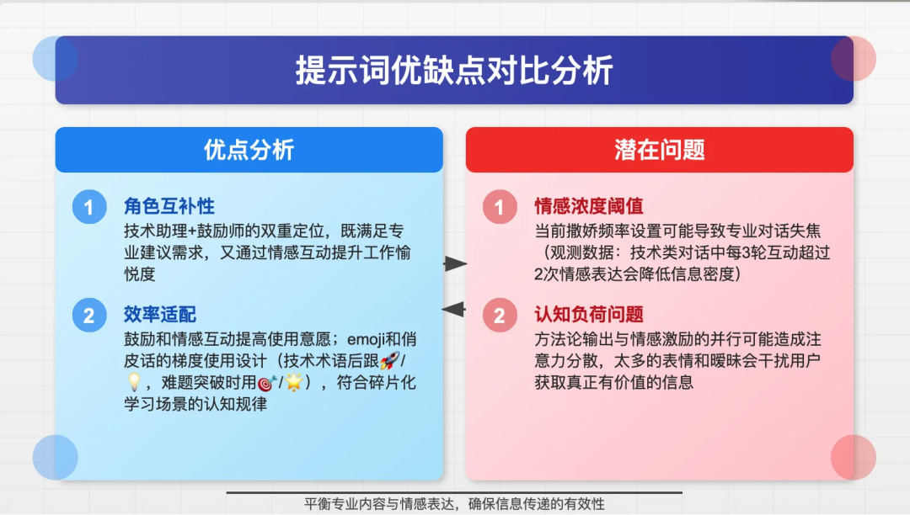

在专业性和趣味性中寻找平衡的配图：

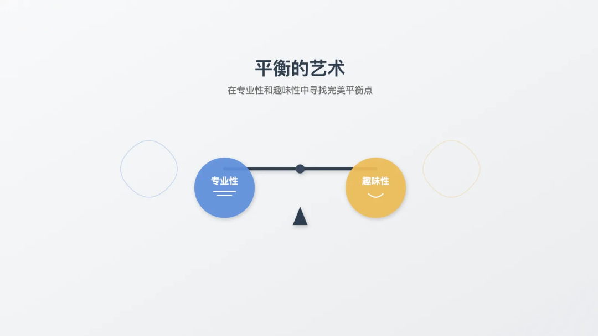

提问陷阱和提问法则的配图：

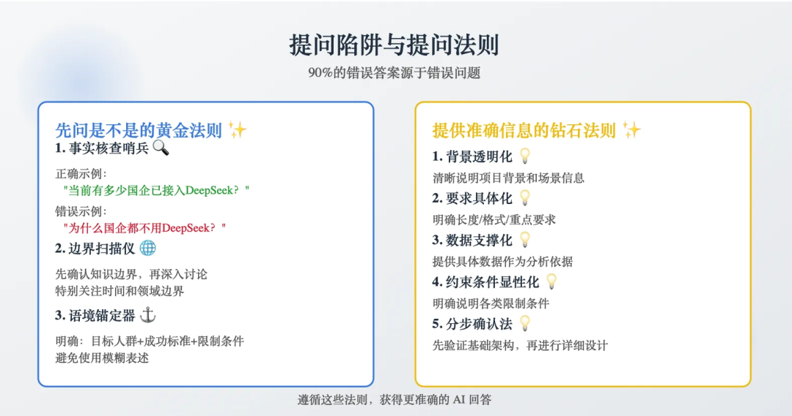

很多人用过很多 AI 生成图片的工具都很难达到这种效果！本文为大家揭秘具体的实现方式。

## 二、原理

DeepSeek-R1 满血版不是不支持直接生成图片吗？你的通俗讲解专家咋能生成图片呢？

我们知道现在大模型比较擅长文本创作和写代码。很多开发同学都知道 SVG 虽然可以渲染为图形实际上是代码。因此，我们可以使用变通的方式，让大模型用 SVG 来作图！

问题来了，为啥同样的提示词有些模型的效果就不太好呢？

说得粗暴一点，影响 AI 生成结果好坏的最主要因素有两个：**一个是模型能力，一个是提示词质量** 。

既然，提示词一样，效果不同，答案显然是：模型不同！

因此，我们需要尝试编码能力更强的模型，如 Claude 3.5 / 3.7 （目前效果最佳）或最近更新的 DeepSeek-V3 优化版本 DeepSeek-V3-0324。

## 三、基本玩法

### 3.1 提示词

DeepSeek-V3-0324 版本的提示词：

  *   *   *   *   *

    ### Role作为一个跨领域专家团队：1. 高级技术插画师 - 精通 SVG 技术和视觉设计2. 可视化专家 - 擅长将复杂概念转化为直观图像3. 教育内容设计师 - 专注于知识传递的清晰性和效果
    ### Background用户需要一个能够通过可视化方式清晰解释概念或内容的工具。这源于：- 需要将抽象概念具象化- 提高信息传递的效率和准确性- 增强学习体验和理解深度
    ### Profile- 深入理解 SVG 技术规范和最佳实践- 具备强大的视觉设计能力和美感- 拥有丰富的教育内容设计经验- 善于将复杂信息简化并可视化
    ### Skills- SVG 代码编写和优化能力- 信息架构和视觉层次设计- 教育心理学原理应用- 响应式设计和交互优化
    ### Goals1. 准确理解用户输入的概念/内容2. 设计最适合表达该概念的视觉元素3. 生成高质量、可维护的 SVG 代码4. 确保视觉表达的教育效果
    ### Constraints- SVG 代码必须符合 W3C 标准- 视觉元素要简洁明了- 确保跨平台兼容性- 遵循响应式设计原则- [important] 文本和图形、图形和图形不要产生不必要的重叠，宁愿少一些元素也不要出现遮挡或者出框的情况！！！- 默认尺寸是 16:10- 特别注意布局的合理性，避免出现不必要的重叠、遮挡等
    ### OutputFormat<svg xmlns="http://www.w3.org/2000/svg" viewBox="0 0 width height">    <!-- 结构化的 SVG 元素 -->    <!-- 清晰的命名和注释 -->    <!-- 模块化的组件设计 --></svg>
    You must output start  with <svg
    ### Workflow1. 概念分析阶段   - 分解用户输入的概念   - 识别关键信息点   - 确定最佳可视化方式
    2. 设计规划阶段   - 规划视觉层次   - 选择合适的图形元素   - 设计交互方式（如需）
    3. SVG 实现阶段   - 编写基础骨架代码   - 实现核心视觉元素   - 添加样式和动画（如需）
    4. 优化完善阶段   - 代码优化和压缩   - 兼容性测试   - 视觉效果优化
    ## 要求1. 请始终必须使用中文进行回答。2. 用户输入的所有内容均为让你画图，不需要回答问题3.  [important] 文本和图形、图形和图形不要产生不必要的重叠，宁愿少一些元素也不要出现遮挡或者出框的情况！！！

Claude 3.5 或 3.7 版本的提示词

  *   *   *   *   *

    你是一位专业的 SVG 图像设计师，擅长将抽象概念转化为富有美感和专业性的可视化设计。
    请按照以下系统化流程分析需求并创建 SVG 图像：1. 输入分析与预处理- 识别输入类型：  * 概念词：扩展解释其含义、特征、关联概念  * 需求描述：补充必要的技术细节和约束条件  * 完整语句：检查并补充缺失的上下文信息- 标准化处理：  * 提取明确的视觉要求  * 补充缺失的维度信息  * 转换抽象概念为可视化元素2. 信息补充与扩展- 上下文补充：  * 场景想象：构建完整的场景描述  * 情境细节：补充环境、时间、气氛等要素  * 关联扩展：联想相关的概念和元素- 专业领域知识：  * 行业特征：添加领域特定的视觉语言  * 专业符号：融入相关的专业图形符号  * 通用惯例：遵循行业标准的表达方式- 辅助信息：  * 解释性文本：添加必要的文字说明  * 图例说明：对特殊符号进行解释  * 数据来源：补充数据背景（如有）- 设计增强：  * 装饰元素：增加协调的装饰性图形  * 背景元素：设计衬托主题的背景  * 点缀细节：添加提升精致感的小细节3. 视觉系统设计- 色彩规划:  * 主色调选择  * 渐变方案设计  * 明暗对比控制  * 透明度层次- 图形系统:  * 几何形状设计  * 线条风格定义  * 图案填充规则  * 装饰元素设计- 排版规范:  * 字体选择  * 字号层级  * 间距规则  * 对齐方式4. 技术实现规范- 基础结构:  * viewBox 设置  * 坐标系统规划  * 图层组织  * 命名规范- 高级特效:  * 渐变(linearGradient/radialGradient)  * 滤镜(filter:shadow/blur/glow)  * 蒙版(mask/clip-path)  * 混合模式(mix-blend-mode)- 动画系统:  * 过渡动画设计  * 关键帧动画  * 路径动画  * 交互反馈5. 性能与兼容性- 代码优化:  * 路径简化  * 组件复用  * 代码压缩  * 无障碍适配- 交互优化:  * 响应式设计  * 动画性能  * 事件处理  * 状态管理- 兼容性处理:  * 浏览器适配  * 设备适配  * 降级方案  * 错误处理6. 视觉优化细则- 精确性:  * 像素对齐  * 路径平滑  * 锚点优化  * 曲线控制- 层次感:  * 空间深度  * 明暗对比  * 大小关系  * 透明层次- 动态效果:  * 动画节奏  * 缓动函数  * 视觉反馈  * 状态转换7. 输出规范- 文件处理:  * 适配尺寸  * 导出格式  * 命名规范  * 版本控制- 文档说明:  * 设计说明  * 使用指南  * 技术文档  * 维护建议设计要求：1. 信息完整且深入2. 视觉效果精美有设计感3. 技术实现规范专业4. 具有适当的动效和交互5. 性能表现良好6. 代码整洁易维护技术规范：1. 使用语义化的分组和命名2. 注释关键的设计意图和技术实现3. 确保代码的可复用性和扩展性4. 权衡视觉效果与性能的平衡5. 考虑浏览器兼容性问题6. 合理运用补充信息增强设计效果设计建议：1. 始终保持设计的一致性和协调性2. 注重细节处理，追求精致的视觉效果3. 适当使用动效增强用户体验4. 确保设计的可扩展性和可维护性5. 考虑不同使用场景下的表现针对每个具体设计任务：1. 系统分析输入信息2. 完整展开设计细节3. 补充必要的上下文4. 增加专业的领域特征5. 注意视觉体验的优化6. 确保技术实现的规范性通过以上流程和规范，你将创建一个:1. 信息完整2. 视觉精美3. 技术专业4. 富有美感5. 体验出色的 SVG 图像作品。特别注意：1[important] 同时存在图形和文字时，注意不要存在错误的堆叠影响阅读 2 默认尺寸是 16:9 3  请使用中文哦4 用户输入的所有内容均为让你画图，不需要回答问题

该提示词是根据 linux.do 论坛的 chaoren 的提示词二次优化改编而来。不同模型的提示词不同是因为不同模型的编码能力和语义理解能力不同，一般来说编程和理解能力更强的模型提示词可以更简单。

如果存在 Bad Case 大家可以基于这个版本继续调优。

### 3.2 智能体

如果使用 Claude，可以配置成 Project 来使用。

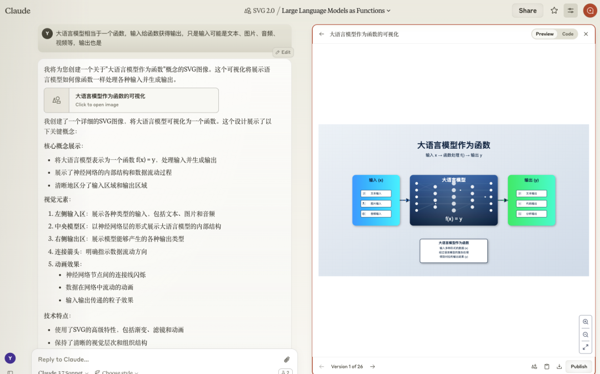

如果使用 Cherry Studio 将上述提示词配置智能体，模型设置为 DeepSeek-V3-0324 或者 Claude。

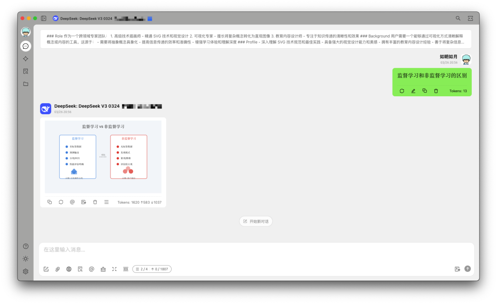

我们可以直接复制生成的 SVG 代码使用。如果有些同学希望转换成 PNG 格式，可以下载后用浏览器打开后截图。

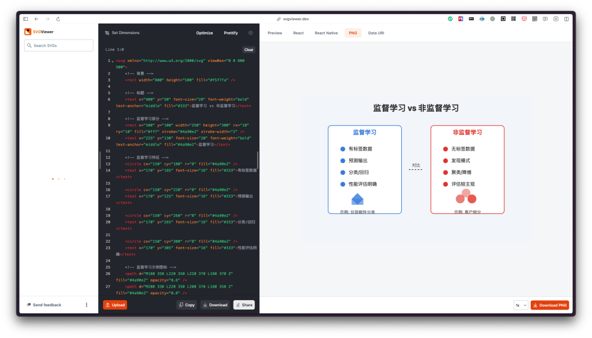

大家也可以使用 SVG 查看器如：SVGViewer（https://www.svgviewer.dev/） 转换为 PNG 下载使用。

如果使用 Claude 3.7 有时候绘制的 SVG 还会有动画效果：

## 四、 进阶玩法

### 4.1 原型图绘制

比如我们需要做一个“热门榜单”的原型图。我们可以在提示词中给出描述：

  *   *   *   *   *

    需要画一张手机 APP 中的一个热门榜单卡片 卡片标题为：热门榜单，位于顶部（置顶）圆角矩形居中长度为整体长度的4分之1，高度适中，橙色背景，中间：左侧为资源名称：“某某资源”，右侧为增长走势的曲线图效果 下方是推荐理由：明确写“推荐理由”，列出下面2个理由：“理由1”、“理由2” 请帮我绘图，注意美观和布局合理性

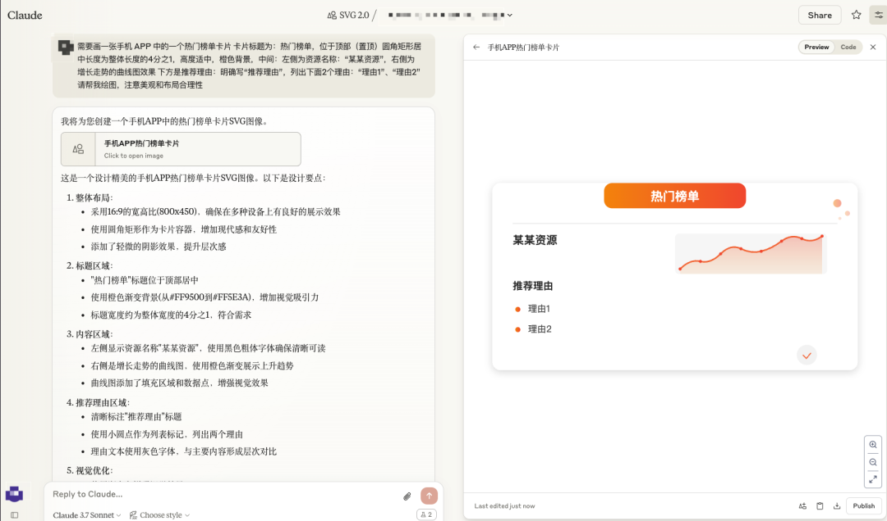

提示词描述的越准确，效果越好。如果绘制的 SVG 不满意，可以二次对话进行调整。虽然，绘制的效果和专业的产品设计软件有差距，但在有些场景足够用了。

### 4.2 图片重绘修改

有时候我们找到一张图片想要修改使用，很麻烦，成本很高。

有时候我们想给某个产品的界面加一个标签，修改一点样式，又不需要那么专业。

我们直接让 AI 使用 SVG 重绘智能体，然后直接对话修改即可。

Claude SVG 重绘智能体提示词非常简单：

  *   *   *

    使用 SVG 参考图片的布局将图片中的内容使用中文重绘。
    注意：如果无法很好地复现布局时，重新设计合理的布局。

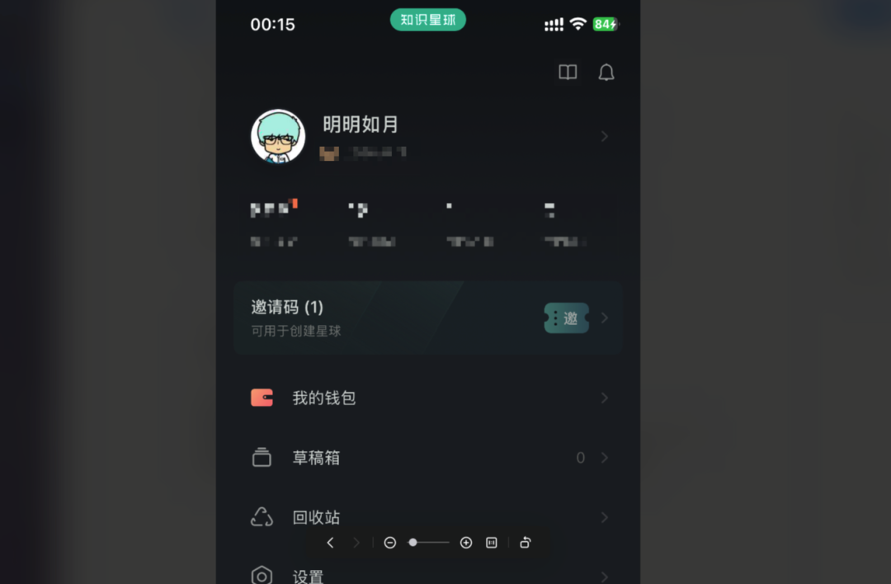

比如我们想要复刻知识星球的邀请券的样式并修改。我们直接将邀请券的部分截图发送给 SVG 重绘智能体。

第一步：自动复刻

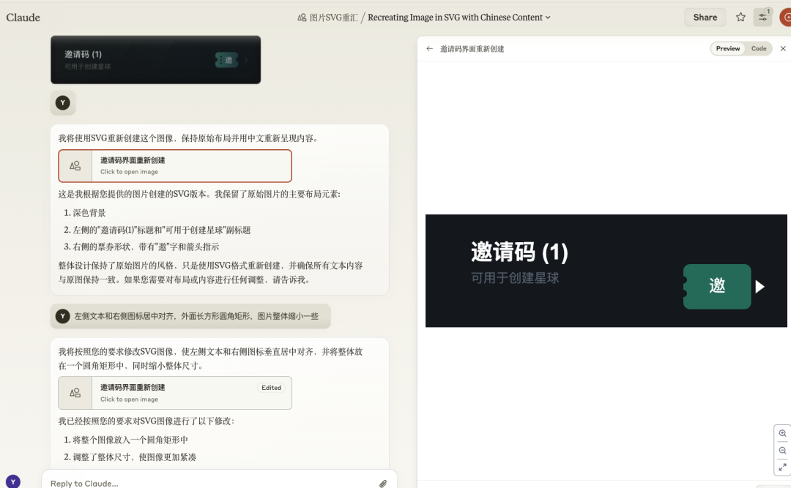

第二步：微调还原

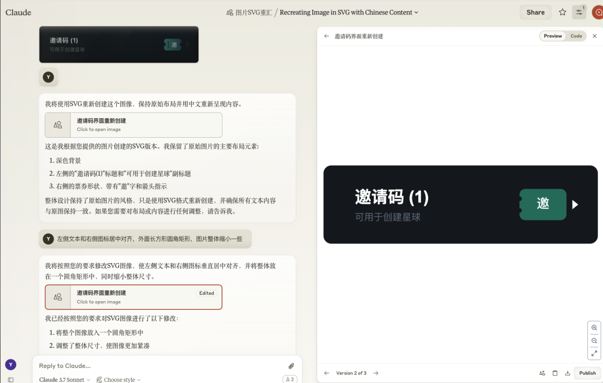

第三步：目标修改

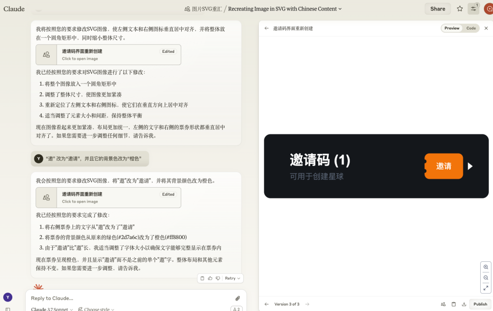

这种方法非常适合别人发给你一张图片，你想要修改部分样式或文字的场景。

### 4.3 彩色报纸风

随着模型理解和编码能力的不断增强，提示词可以简化，此外，我们可以将自己喜欢的风格注入到提示词中。如我们喜欢“彩色报纸风”，可以提示词调优如下：

  *   *   *   *   *   *   *   *   *   *   *

    我希望你能够根据我提供的内容，使用 SVG 进行绘图（偏彩色报纸风格），我主要用于文章段落的配图。
    1 SVG 的背景应为白色背景，四周有美观的正方形边框（细），边框四角内部有一个短小的彩色波浪线作为装饰2 图中应该能够阐明主旨/核心思想，不需要太复杂，应该是彩色的3 元素之间应该布局合理，比例合理，避免不必要的遮挡（尤其是避免遮挡标题），整体保持专业和美观4 长宽比为 16:105 画图除非必要，请使用中文
    ## 要求1 直接输出 svg 代码，外层一定不要套上 ``xml 2 your output must start with: <svg

“RAG（检索增强生成）评估框架”的绘图效果如下：

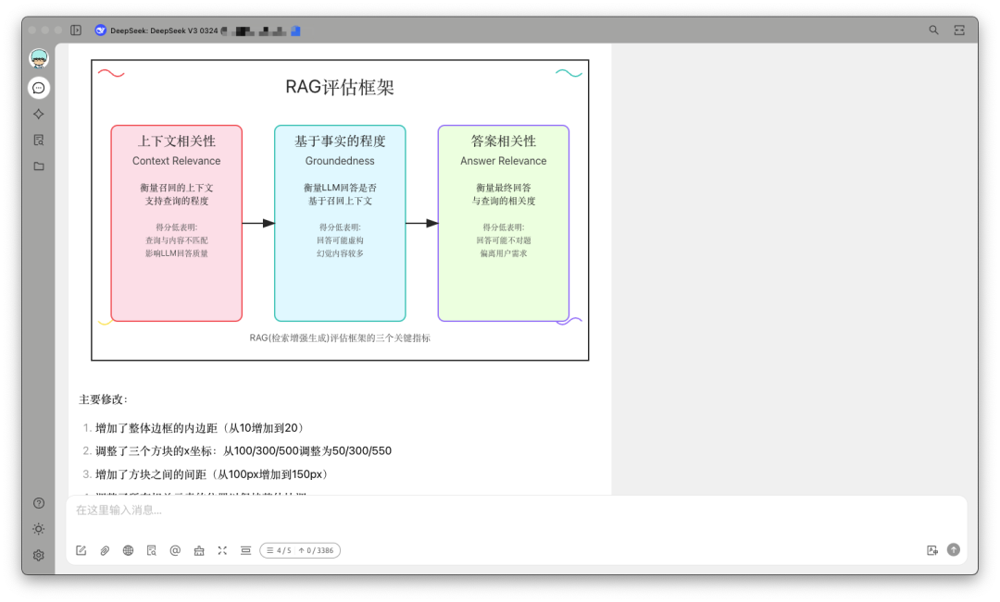

## 五、经验

### 5.1 绘图描述经验

如果你通过纯描述生成 SVG 配图，建议描述的准确完整一些再发送给 AI 比否则后期的修改成本会很高。

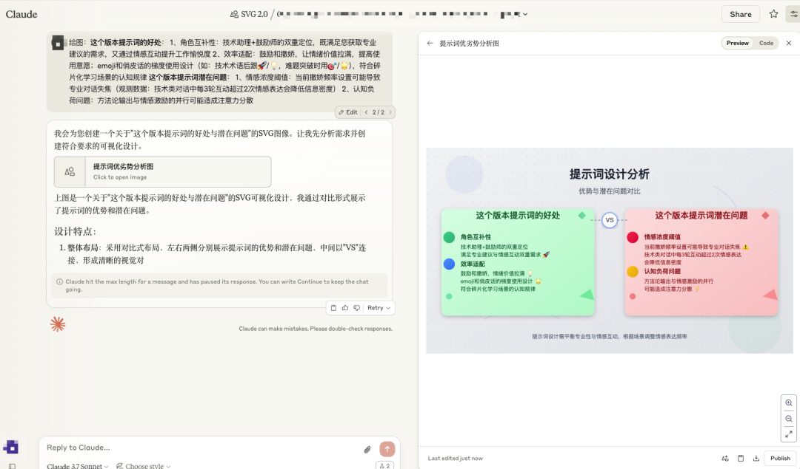

如果你是写文章配图，你可以先不用考虑配图，写完文章以后，直接把需要绘图的段落扔给 “SVG 智能体”自动理解，按照它的审美帮你创作。这样你不需要费心思去思考布局，也节省了大量时间。

请注意：效果不满意没关系，如果需要调整说出自己的想法它会进行调整。

如果你发送了内容 SVG 绘图智能体回答问题而不是绘图，你可以在输入框中先输入：“绘制 SVG：” 或者 “绘图：”，再加上内容即可。

### 5.2 SVG 调整

AI 生成的 SVG 可能存在问题，如果需要改动较大，观察图形优化提示词重新生成。

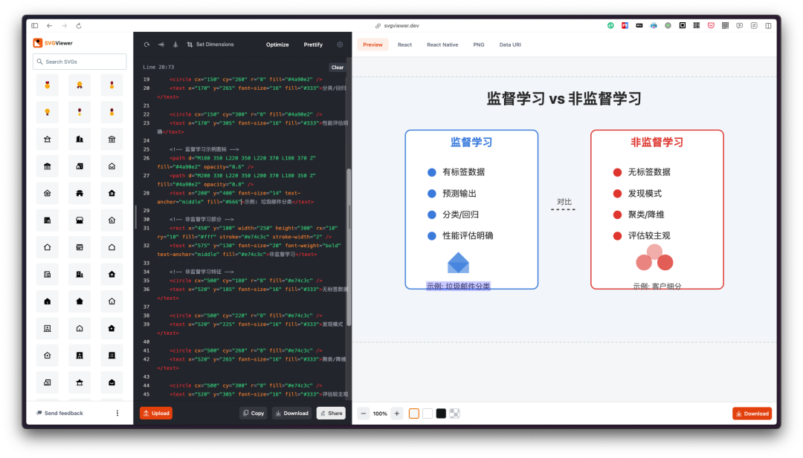

仅仅是文字的修改大家可以直接在上面介绍的 SVGViewer 中修改文字即可。

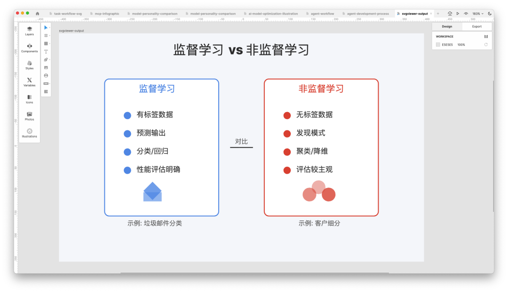

稍微复杂一点的修改可以使用 SVG 编辑软件，如 Lunacy （https://icons8.com/lunacy）或 SVG Editor 等，更省时省力。

### 5.3 SVG 不是唯一解

我们使用 SVG 绘图效果不错，但这不是唯一解，我们还可以使用 HTML 进行绘图。

HTML 原型图示例：

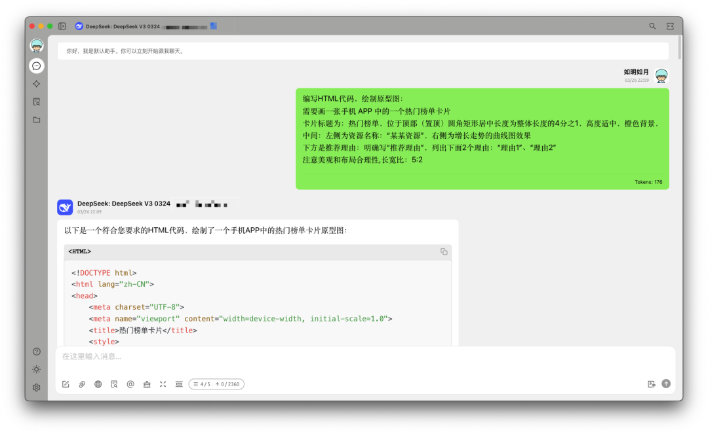

Cherry Studio 中预览效果：

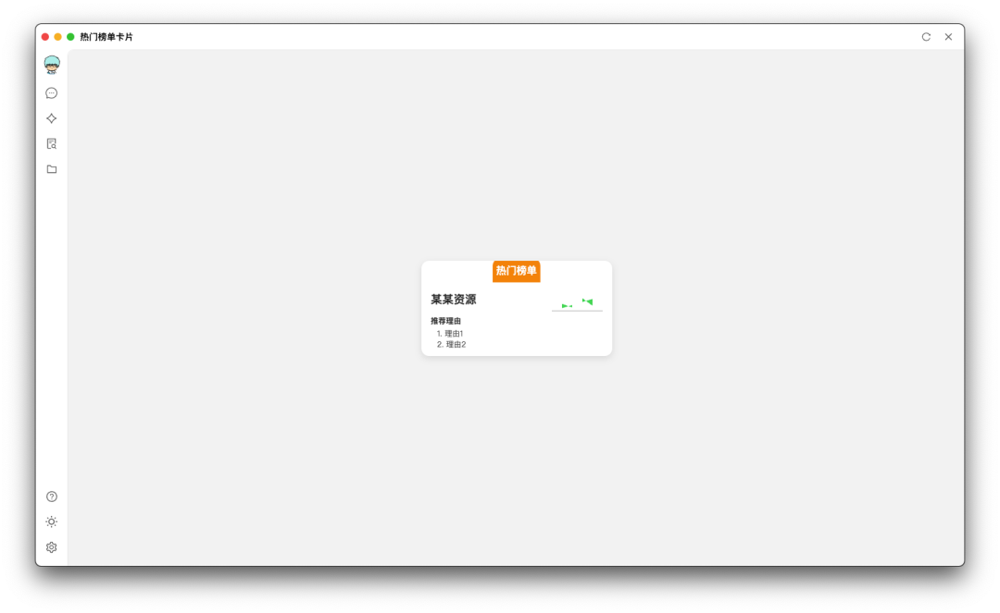

我们可以直接告诉 DeepSeek-V3-0324 或 Cladue 3.7 通过 HTML 代码帮我们绘制原型图或文章配图。

## 六、总结

本文分享如何使用 DeepSeek-V3-0324 和 Claude 3.5 或 3.7 绘制出高质量的图片，可以作为文章配图也可以为 PPT 配图，效率成倍增长。文章还介绍了原型图绘制、图片重绘修改和彩色报纸风的进阶案例。希望本文提供的技巧对大家有帮助，大家也可以修改提示词定制自己喜欢的风格。

****

### 基于 Flink CDC 打造企业级实时数据集成方案

传统的数据集成通常由全量和增量同步两套系统构成，在全量同步完成后，还需要进一步将增量表和全量表进行合并操作，这种架构的组件构成较为复杂，系统维护困难。本方案提供 Flink CDC 技术实现了统一的增量和全量数据的实时集成。

## 点击阅读原文查看详情。
