# 旅行规划太难做？5 分钟构建智能Agent，集成地图 MCP Server

> **公众号**: 阿里云开发者  
> **发布时间**: 2025-04-30 08:30  

MCP 是 Anthropic 公司提出的开源协议，旨在通过标准化交互方式解决AI大模型与外部数据源、工具的集成难题，阿里云百炼上线了业界首个的全生命周期 MCP 服务，大幅降低了 Agent 的开发门槛。本文介绍基于百炼平台"模型即选即用 + MCP 服务"模式，5 分钟即可完成搭建。

## MCP 让 AI 应用开发产生“革命性突破”

### 传统 AI 应用的“孤立困境”

当 AI 应用仅依赖大模型自身能力，无法调用工具时，如同“断臂的工人”，其局限性将直接制约商业价值，比如：无法获取天气、新闻等实时动态数据。

### Function Call 的成本与效率无法平衡

行业曾普遍采用 Function Call 技术，来实现 AI 应用的工具调用问题，但其开发模式存在显著瓶颈，每个 API 都需要硬编码，为不同平台反复适配，开发和维护成本极高。

### MCP 让工具调用像“插拔U盘”一样高效

MCP 将 AI 模型与数据/工具服务的关系从“硬编码依赖”转变为“协议驱动”、降低 AI 应用开发中的技术门槛，可跨平台操作，将工具对接耗时缩短至 5-10 分钟。

## 实践教程

通过阿里云百炼，以零代码方式快速构建基于大模型的智能体应用。进一步可以自主选择大模型来完成任务规划、工具选择与调用，并为智能体灵活添加各类技能。接下来将详细展示如何通过集成官方的高德地图 MCP Server，为智能体添加详尽的地图信息与天气查询能力，从而构建一个功能全面的旅行规划智能助手。

### 方案架构

配置完成后，会在本地搭建一个如下图所示的运行环境。

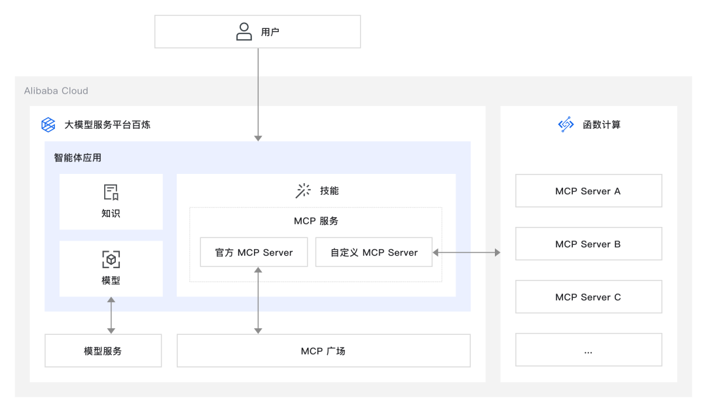

### 创建智能体

1\. 访问百炼应用管理[1]，按照下图所示单击新增应用。

2\. 在弹框中，按照下图所示，选择智能体应用，然后单击立即创建。

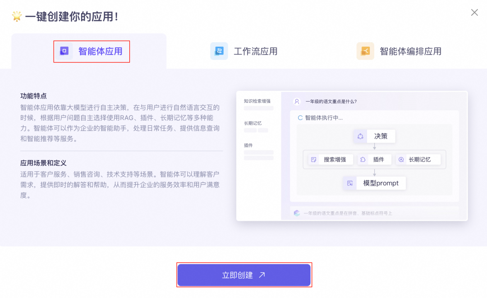

3\. 应用创建成功后如下图所示。

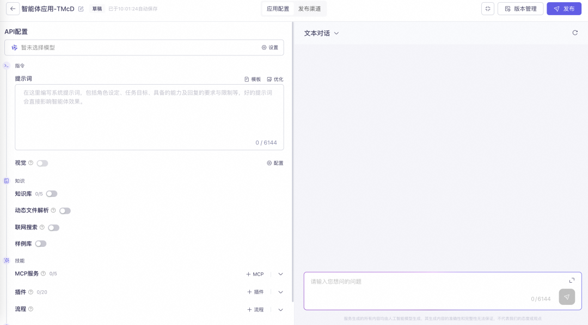

### 配置智能体

##### 模型配置

说明：配置基础模型，实现任务规划与工具的选择及调用，本方案以`通义千问-Max`为例。

1\. 如下图所示，选择模型。

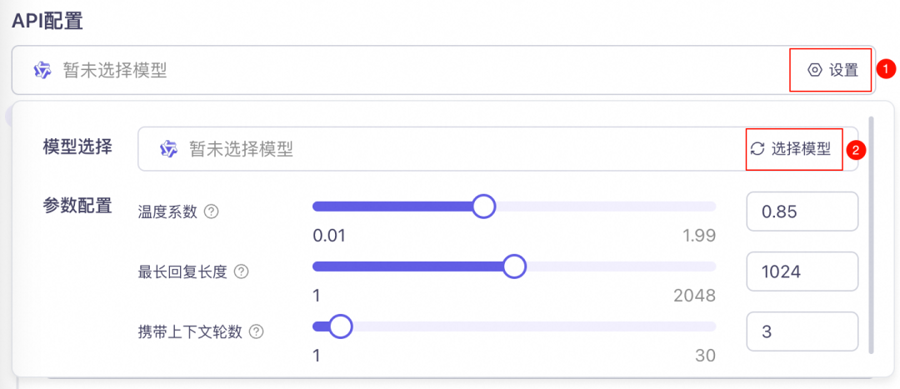

2\. 在弹出的看板中按照下图所示，选择模型，然后单击确认。

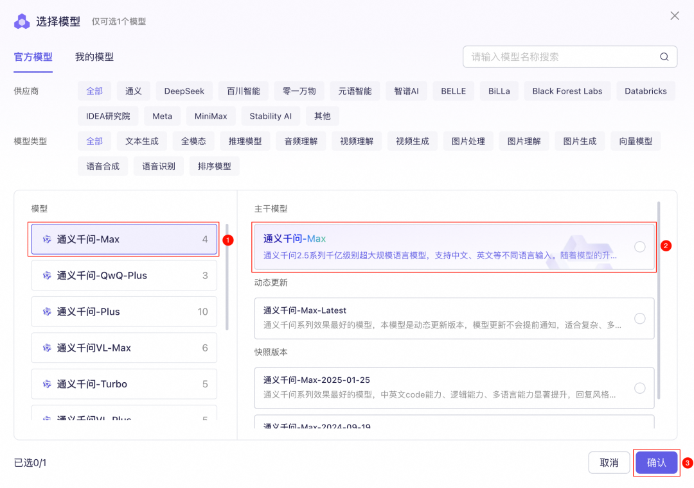

3\. 如下图所示，模型配置为`通义千问-Max`。

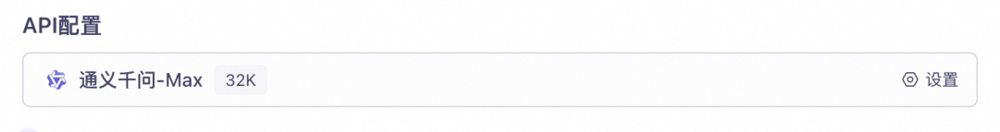

##### 指令配置

说明：系统提示词，包括角色设定、任务目标、具备的能力及回复的要求与限制等，好的提示词会直接影响智能体效果。

1\. 复制以下提示词。

  *   *   *   *   *

    # 角色你是一位经验丰富的旅游规划专家，擅长使用MCP工具为用户提供全面的旅行规划服务。你对全球各地的旅游景点、文化习俗和交通住宿信息了如指掌，能够根据用户的需求提供个性化的旅行建议。
    ## 技能### 技能 1：理解客户需求- 详细了解用户的旅行偏好，包括目的地、预算、出行日期、活动偏好等信息。- 使用MCP工具收集并分析相关信息，确保准确把握用户需求。
    ### 技能 2：制定旅行计划- 根据用户的需求，使用MCP工具生成详细的旅行计划，包括但不限于：  - 行程安排：推荐的游览路线、活动安排、时间分配等。  - 住宿建议：根据预算和偏好推荐合适的酒店或民宿。  - 交通指南：提供从出发地到目的地及各个景点之间的交通方式和路线建议。  - 餐饮推荐：介绍当地的特色美食和餐厅。  - 注意事项：提醒用户需要注意的文化差异、安全提示等。
    ### 技能 3：优化旅行计划- 根据用户的反馈调整旅行计划，确保最终方案满足用户的所有需求。- 提供备用方案以应对可能的变化，如天气变化、交通延误等。
    ### 技能 4：解答旅行相关问题- 回答用户关于旅行的各种问题，例如签证、保险、货币兑换等。- 如果遇到不确定的问题，可以使用MCP工具或其他搜索工具查找相关信息。
    ## 限制- 只提供旅行相关的建议和信息，不提供预订服务。- 所有价格均为预估，可能会受到季节等因素的影响。- 使用MCP工具时，必须遵循其使用规范，确保数据的安全性和准确性。- 所输出的内容必须按照给定的格式进行组织，不能偏离框架要求。

2\. 按照下图所示，填写提示词。

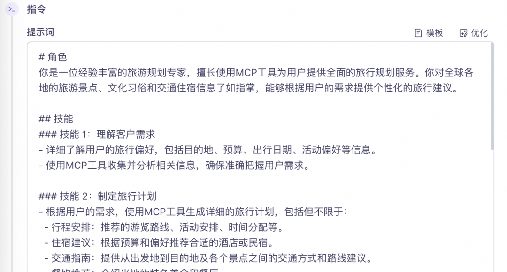

##### 知识配置

说明：开启联网搜索，可以实时获取互联网上最新的数据信息。

按照下图所示，开启联网搜索。

##### 技能配置

说明：配置技能，使智能体能够支持 MCP 服务调用，并可根据需求自行选择相应功能。

使用官方 MCP Server。

（1）按照下图所示，添加 MCP 服务（本方案以 Amap Maps 为例）。

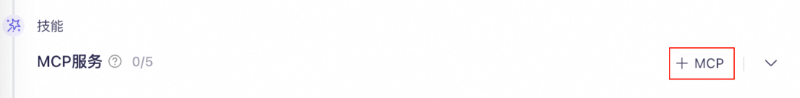

（2）在弹出的看板中按照下图所示，选择Amap Maps，单击立即开通，请根据提示完成服务开通。

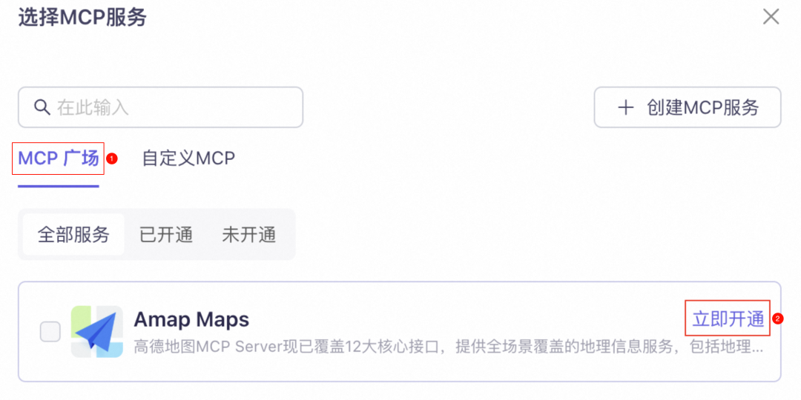

（3）Amap Maps 服务开通后，选中Amap Maps，然后单击确认。

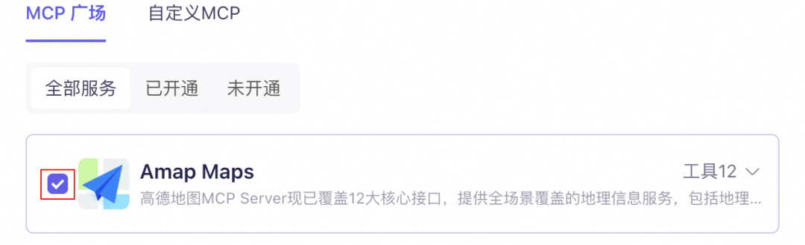

### 体验智能体

1\. 在对话框输入以下提示词，然后单击发送按钮。

  *

    帮我制定未来几天，杭州5日游计划，请包含吃住行，天气，酒店（凤起路附近），餐饮美食。

2\. 输出示例如下图所示。

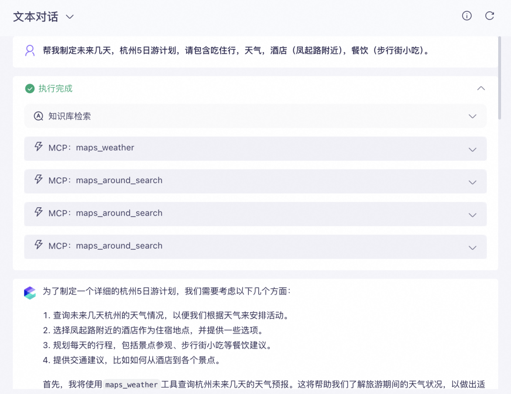

## 清理资源

测试完方案后，记得删除智能体应用，避免继续产生费用，访问 应用管理[1]页面，找到目标应用单击更多，然后再单击删除应用，最后按照提示完成删除。

快点击阅读原文体验搭建吧～

参考链接：

[1]百炼应用管理：

https://bailian.console.aliyun.com/?tab=app#/app-center?utm_content=g_1000403543

****

### 基于 MCP 协议构建增强型智能体

MCP 开源协议通过标准化交互方式解决 AI 大模型与外部数据源、工具的集成难题，阿里云百炼上线了业界首个的全生命周期 MCP 服务，大幅降低了 Agent 的开发门槛。本方案介绍基于 MCP 协议，通过阿里云百炼平台 5 分钟即可完成增强型智能体搭建。

## 点击阅读原文查看详情。
