# 极速开发出一个高质量 Claude Agent Skills 最佳实践

> **公众号**: 阿里云开发者  
> **发布时间**: 2026-01-16 08:30  

继 MCP（Model Context Protocol）之后，Anthropic 最近又推出了 **Skill（技能）** 。因工作需要，我近期快速上手并实践开发了一个 Skill，过程中积累了一些经验，整理成本文，希望能帮助更多同学：

  * 快速理解 **Skill 到底是什么** ？
  * 掌握关键要点，**提升 Skill 的开发质量与效率** 。

在第三部分，我将通过一个具体案例，完整展示如何将一个想法快速落地为可运行的 Skill。即使你对 Skill 还一知半解，只要能清晰描述需求、准备好相关资料，也能轻松开发出一个高质量的 Skill。

文章有很多主观性，仅供参考。

## 一、快速认识 Skill

## 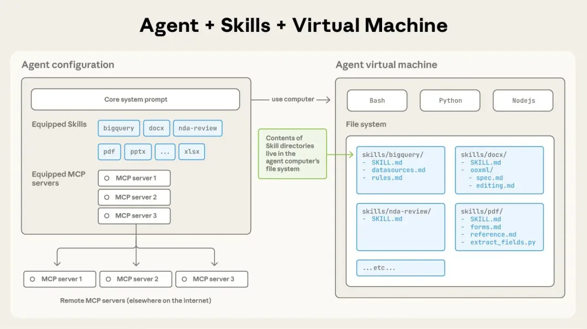

Skill 即技能，一般放在 skills 文件夹内，一个技能一个文件夹，一个技能通常包括 SKILL.md 文件，相关的文档和可运行的脚本等。

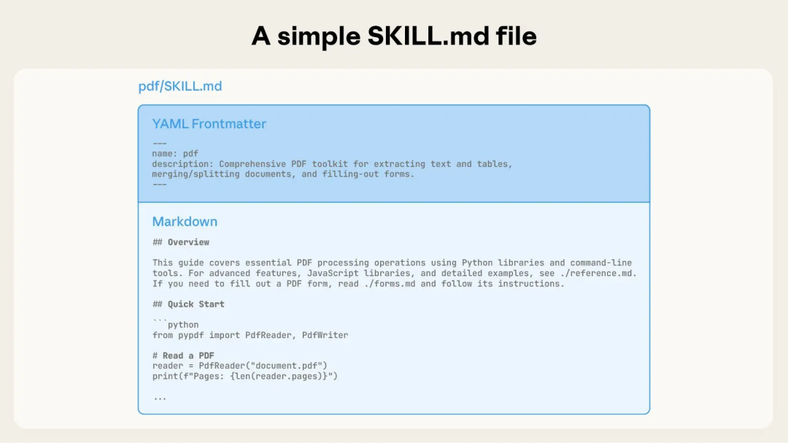

一个 SKILL 文件通常包括一个 YAML 头和 Markdown 格式的技能描述。

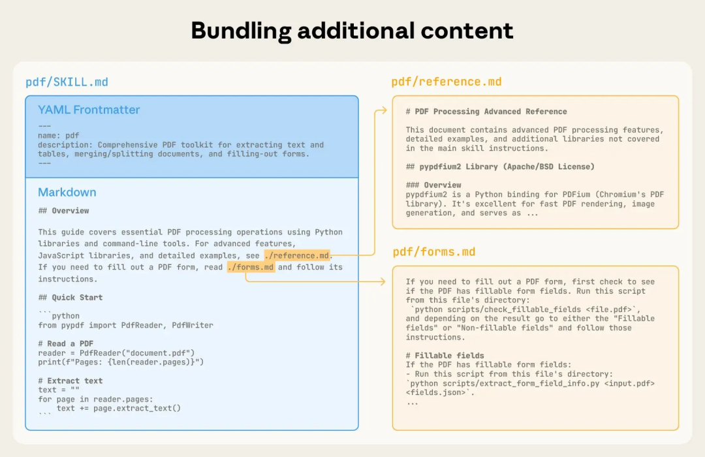

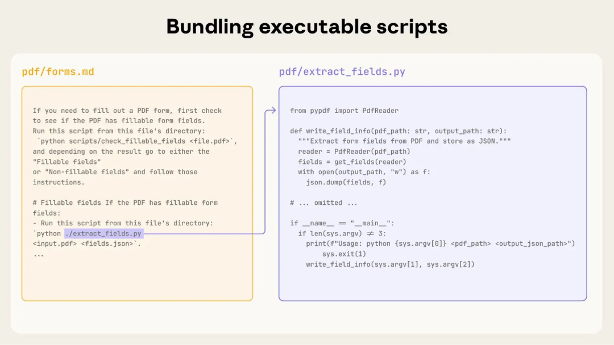

技能描述中可以提及 Skill 中的其他资和脚本等，Agent 会按需加载。

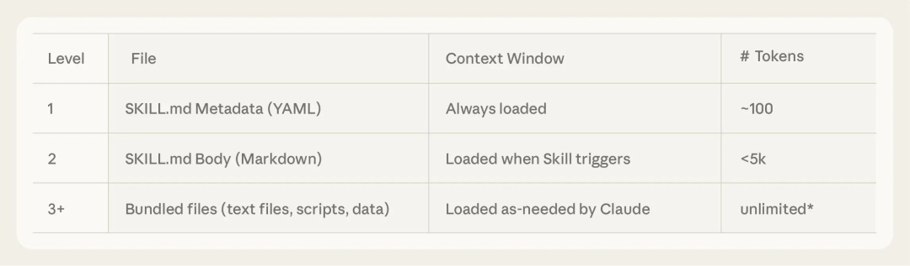

SKILL.md 中 YAML 的元信息，总是会放到上下文中， Body 部分在技能触发的时候才会加载，要小于 5K，其他的文件（文本文件、可运行的脚本、数据等）没有限制。

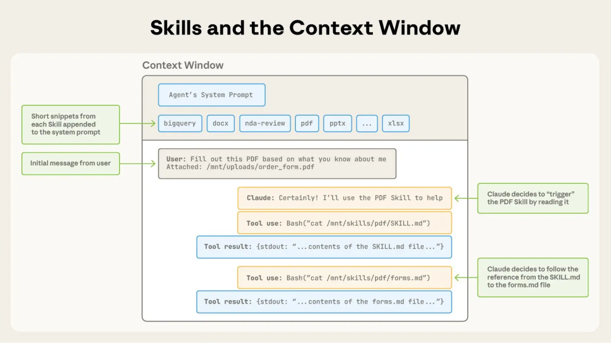

Agent 的系统提示词和 Skill 的元信息始终会在上下文中，这样 Agent 根据对话动态决策使用哪个技能，以及根据技能描述动态加载所需要的资源。

详情参见：https://www.anthropic.com/engineering/equipping-agents-for-the-real-world-with-agent-skills

补充：https://code.claude.com/docs/en/skills

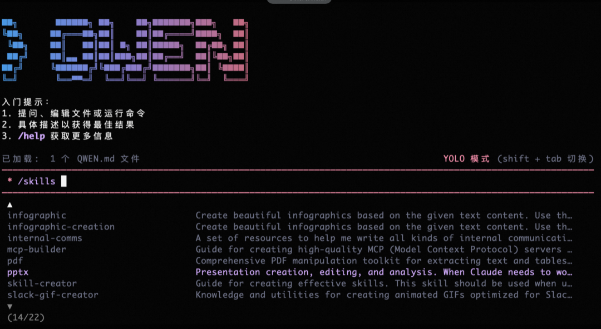

目前主要在 Claude 桌面、Claude Code 和 API 里面使用。很多其他 AI Coding 工具，如

Antigravity ：

参见：https://antigravity.google/docs/skills

Qwen Code

参见：https://qwenlm.github.io/qwen-code-docs/zh/users/features/skills/也已经支持 Skills。

如果工具本身暂时没有直接支持，可以借助 OpenSkills 这个开源项目来使用 Skills：

  *

    OpenSkills brings Anthropic's skills system to all AI coding agents(Claude Code, Cursor, Windsurf, Aider).

OpenSkills 可以非常方便地将 skill 安装到全局或项目级 skills 文件中，自动创建项目规则 Markdown 文件，“教会”其他 AI Agent 使用 Skills。

  * 常用命令

  * 安装工具：npm i -g openskills

  * 安装技能：openskills install anthropics/skills

  * 安装技能（全局）：openskills install anthropics/skills --global

  * 安装技能（通用模式）：openskills install anthropics/skills --universal

  * 安装技能（非交互）：openskills install anthropics/skills --yes

  * 同步到 AGENTS.md：openskills sync

  * 同步到自定义文件：openskills sync -o .ruler/AGENTS.md

  * 同步（非交互）：openskills sync -y

  * 读取技能：openskills read

  * 列出技能：openskills list

  * 管理技能（交互删除）：openskills manage

  * 删除技能：openskills remove

详情参见：https://github.com/numman-ali/openskills

## 二、Skill VS MCP

## 说实话，最开始听到的时候还是有点懵逼的，不是已经有了 MCP 了吗？为啥还出一个 Skill?

## 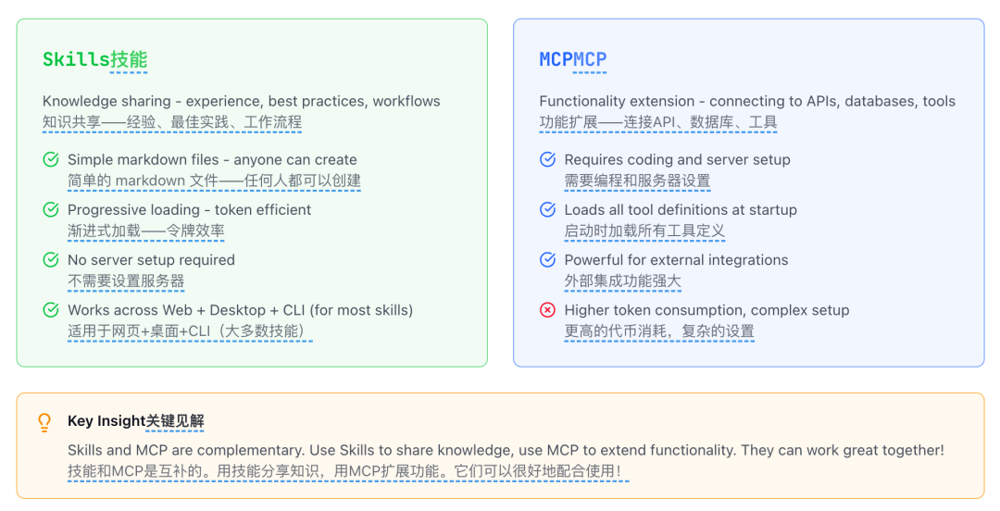

## 图片来源：https://skillsmp.com/docs

## 简单来说，技能就是怎么做；MCP 是有什么工具、有什么功能。

技能的话，主要是经验、最佳实践、流程的封装，而 MCP 是连接与交互的协议，主要是 API 调用、数据读写和工具等。

Skills主要是 Markdown 文件和一些脚本文件，优势在于渐进式加载，不需要服务器资源，适用性好；MCP 主要是客户端和服务端的架构，启动时加载所有工具定义，集成外部功能，Tokens 消耗更高，使用起来更复杂。

两者是互补的关系，Agent 可以通过 Skills 获取知识，通过 MCP 拓展功能。

当然，现在 Rule、MCP、Skill 边界也越来越模糊。

## 三、快速开发 Skill 的最佳实践

我们已经对 Skill 有了一个初步的认识，也大概了解它和 MCP 的区别。那么接下来，如何快速、高质量地开发一个 Skill？

这里分享自己总结的一套最佳实践。

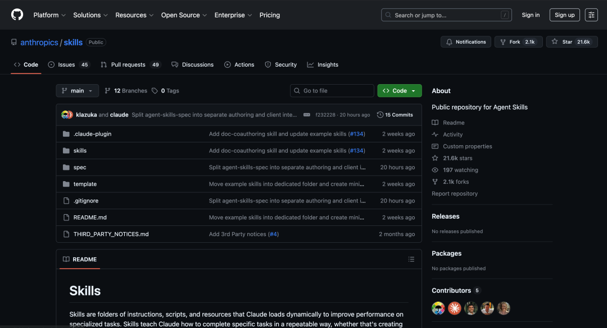

传送门：https://github.com/anthropics/skills

有些人知道官方给出了一个 skills 开源仓库，里面有很多 skill 示例。

有些同学可能想到了，我们下载下来学习一下，参考一下，自己写一个呗！

且慢！我们为啥要自己写？

说实话，如果我们自己手写，还是比较浪费时间的。我们需要去思考文件的结构、提示词的布局，要花很多时间，而且未必能写好。

### 上下文工程实践

这里分享一个自己探索的最佳实践。

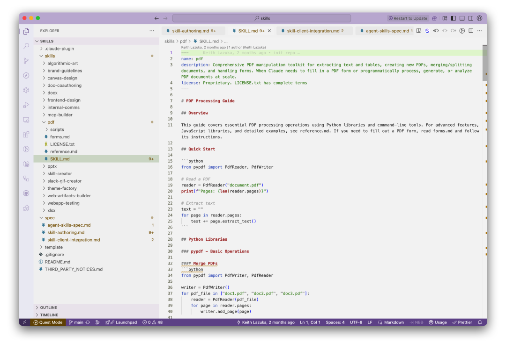

首先，咱们先把 Claude 的 Skills 仓库源码拉下来。

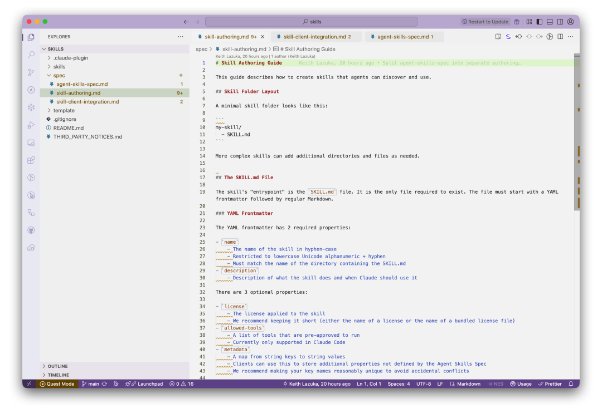

这里面不仅有 Skill 的例子，而且还有非常详细的规约。不过都是英文的。

已关注

__

关注

__ 重播 __ 分享 __ 赞

关闭 __

**观看更多**

更多 __

__

__

__

_退出全屏_

[ __](<javascript:;>)

_切换到竖屏全屏_ _退出全屏_

阿里云开发者已关注

[ __](<javascript:;>)

分享视频

 __，时长 00:57

0/0

00:00/00:57

切换到横屏模式

继续播放

进度条，百分之0

 __

[播放](<javascript:;>)

00:00

/

00:57

00:57

[倍速](<javascript:;>)

 _全屏_

 __倍速播放中

[ 0.5倍 ](<javascript:;>)[ 0.75倍 ](<javascript:;>)[ 1.0倍 ](<javascript:;>)[ 1.5倍 ](<javascript:;>)[ 2.0倍 ](<javascript:;>)

[ 超清 ](<javascript:;>)[ 流畅 ](<javascript:;>)

您的浏览器不支持 video 标签

__

继续观看

极速开发出一个高质量 Claude Agent Skills 最佳实践

观看更多 __

转载

,

极速开发出一个高质量 Claude Agent Skills 最佳实践

 __

阿里云开发者 已关注

分享点赞在看

 ____已同步到看一看[写下你的评论](<javascript:;>)

 __

[ 视频详情 ](<javascript:;>)

学习 AI 的开源项目我会习惯用 Qoder 对代码仓库生成一个仓库 Wiki。 可以快速熟悉对应的结构、原理和知识。

当然，我们还可以把 Skill 相关的高质量资料，灌到 NotebookLM 中，各种提问，生成信息图（上图）、视频概览、PPT 等快速学习。

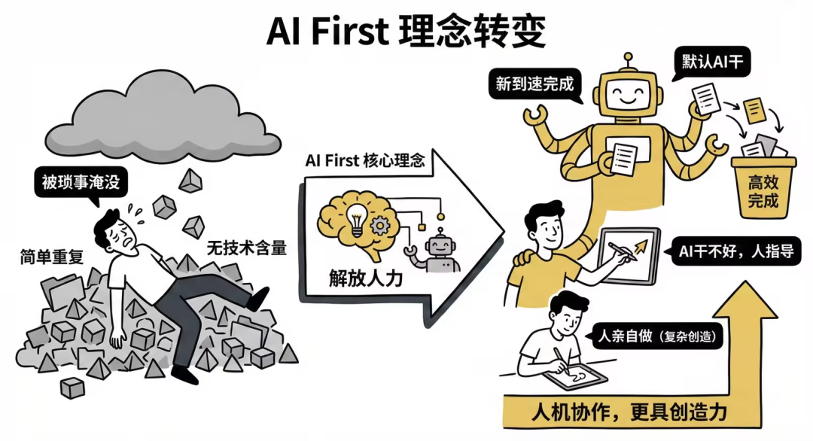

我们需要思想转变，一个是默认让 AI来做。因此，我们默认 Claude 的 Skills 就该 AI 来写。

一个是既然让 AI 做事情，就需要把任务拆解到模型能力以内，把任务描述清楚，并提供充足准确的上下文。

我们已经有了啥？

有了它的这些官方的优质案例、 Skill 的规约，还有了仓库 Wiki。

我们需要做的是把我们的任务表达清楚，然后把他写技能所需要的资料都给到它就可以了！

说了这么多，具体怎么做？

我一直想做一个“提示词优化专家”工具。

  * 现在很多提示词调优工具，没有澄清就直接优化，而且一般都会套一个比较通用的框架。

  * 最好是让 AI 判断是否存在错误或歧义，对焦好了以后再优化。通用提示词框架经常比不上最贴切和专业的框架，哪怕做 AI 业务的同学也不可能记住那么多专业框架，为啥比如不让 AI自动匹配呢？

趁着学习 Skill 的机会尝试搞成一个 Skill 试试看。

我只需要把逻辑捋清楚，还要把他需要的资料整理出来。

逻辑：

1\. 当用户给出原始提示词或创作想法时；

2\. 我们需要匹配最专业的提示词框架，判断是否存在歧义和遗漏。若存在，提示用户补充；

3\. 若不存在，则按最佳框架撰写成专业提示词。

素材：

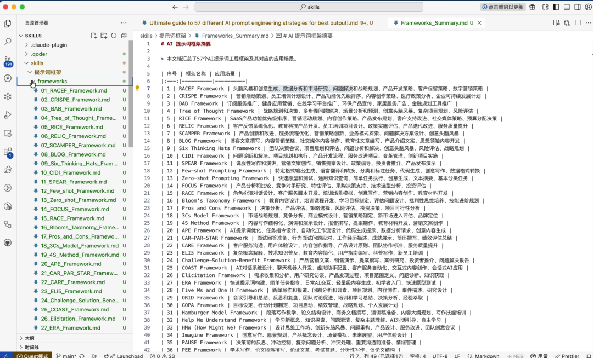

各种专业的提示词框架。 这些提示词框架，也是通过 AI Coding 工具中使用 MCP 爬下来的（如 Qoder MCP 广场中的 fetch 或者自己配置 Firecrawl）。

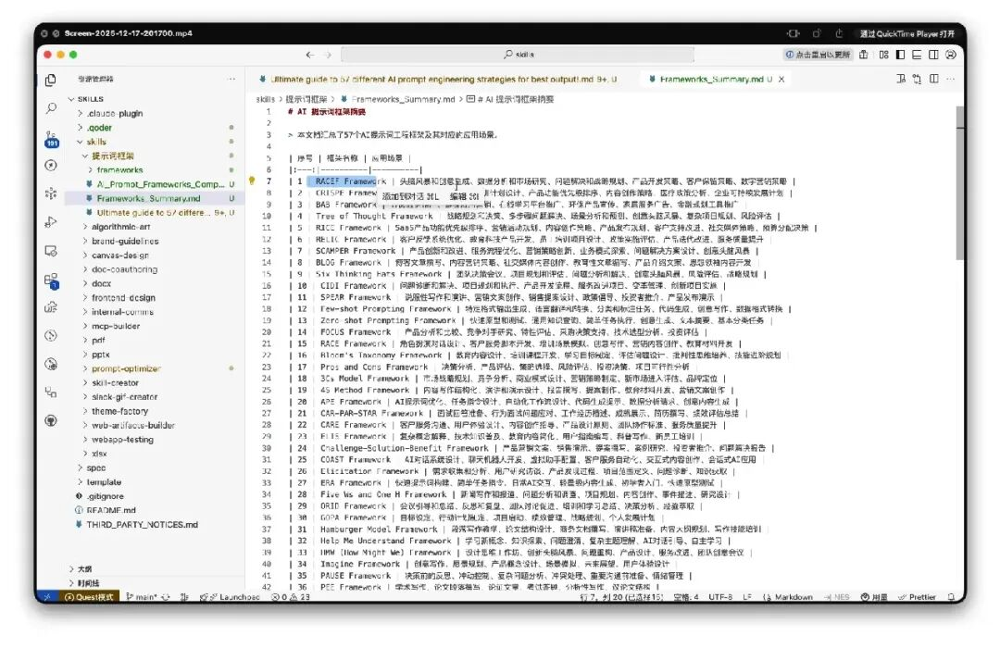

虽然，Claude 支持“渐进式加载”。

我们也不要让智能体把所有框架都加载进来，再做判断，这样既浪费 tokens 又慢。

我们把所有框架准备一份摘要 Markdown（摘要也是使用 Qoder 或 Cursor 这类工具， 根据 57个框架自动汇总出来的）。

它先看摘要，从中匹配出最合适的框架，再去针对性得读对应框架详情文件即可。

已关注

__

关注

__ 重播 __ 分享 __ 赞

关闭 __

**观看更多**

更多 __

__

__

__

_退出全屏_

[ __](<javascript:;>)

_切换到竖屏全屏_ _退出全屏_

阿里云开发者已关注

[ __](<javascript:;>)

分享视频

 __，时长 01:46

0/0

00:00/01:46

切换到横屏模式

继续播放

进度条，百分之0

 __

[播放](<javascript:;>)

00:00

/

01:46

01:46

[倍速](<javascript:;>)

 _全屏_

 __倍速播放中

[ 0.5倍 ](<javascript:;>)[ 0.75倍 ](<javascript:;>)[ 1.0倍 ](<javascript:;>)[ 1.5倍 ](<javascript:;>)[ 2.0倍 ](<javascript:;>)

[ 超清 ](<javascript:;>)[ 流畅 ](<javascript:;>)

您的浏览器不支持 video 标签

__

继续观看

极速开发出一个高质量 Claude Agent Skills 最佳实践

观看更多 __

转载

,

极速开发出一个高质量 Claude Agent Skills 最佳实践

 __

阿里云开发者 已关注

分享点赞在看

 ____已同步到看一看[写下你的评论](<javascript:;>)

 __

[ 视频详情 ](<javascript:;>)

那我们把我们的想法描述清楚，把我们的资源给到他，他就能够帮我们写出非常专业清晰的 Skill。说实话可能比我们自己写强很多。

当然，这也是有前提的：选择目前全球最顶尖的模型。

> 注：原本的“提示词框架”文件夹其实已经被修改为“prompt-optimizer” skill，只是为了让大家理解所以重新 Copy 进来。

我的 prompt-optimizer Skills Github 地址：

https://github.com/chujianyun/skills

已关注

__

关注

__ 重播 __ 分享 __ 赞

关闭 __

**观看更多**

更多 __

__

__

__

_退出全屏_

[ __](<javascript:;>)

_切换到竖屏全屏_ _退出全屏_

阿里云开发者已关注

[ __](<javascript:;>)

分享视频

 __，时长 01:50

0/0

00:00/01:50

切换到横屏模式

继续播放

进度条，百分之0

 __

[播放](<javascript:;>)

00:00

/

01:50

01:50

[倍速](<javascript:;>)

 _全屏_

 __倍速播放中

[ 0.5倍 ](<javascript:;>)[ 0.75倍 ](<javascript:;>)[ 1.0倍 ](<javascript:;>)[ 1.5倍 ](<javascript:;>)[ 2.0倍 ](<javascript:;>)

[ 超清 ](<javascript:;>)[ 流畅 ](<javascript:;>)

您的浏览器不支持 video 标签

__

继续观看

极速开发出一个高质量 Claude Agent Skills 最佳实践

观看更多 __

转载

,

极速开发出一个高质量 Claude Agent Skills 最佳实践

 __

阿里云开发者 已关注

分享点赞在看

 ____已同步到看一看[写下你的评论](<javascript:;>)

 __

[ 视频详情 ](<javascript:;>)

当然，我们也可以通过 Qoder 或 Cursor 把 Claude 的Skills 仓库压缩成一个 Skill 模板，后续作为 AI Coding 工具的项目 Rule，再让 AI Coding 工具拿到这个规则和我们的需求和上下文，帮我们生成也可以。

有些同学说了，你这个写得挺快的，看着也不错，但好不好使？

我们在 Claude Code 里试一试：

已关注

__

关注

__ 重播 __ 分享 __ 赞

关闭 __

**观看更多**

更多 __

__

__

__

_退出全屏_

[ __](<javascript:;>)

_切换到竖屏全屏_ _退出全屏_

阿里云开发者已关注

[ __](<javascript:;>)

分享视频

 __，时长 03:04

0/0

00:00/03:04

切换到横屏模式

继续播放

进度条，百分之0

 __

[播放](<javascript:;>)

00:00

/

03:04

03:04

[倍速](<javascript:;>)

 _全屏_

 __倍速播放中

[ 0.5倍 ](<javascript:;>)[ 0.75倍 ](<javascript:;>)[ 1.0倍 ](<javascript:;>)[ 1.5倍 ](<javascript:;>)[ 2.0倍 ](<javascript:;>)

[ 超清 ](<javascript:;>)[ 流畅 ](<javascript:;>)

您的浏览器不支持 video 标签

__

继续观看

极速开发出一个高质量 Claude Agent Skills 最佳实践

观看更多 __

转载

,

极速开发出一个高质量 Claude Agent Skills 最佳实践

 __

阿里云开发者 已关注

分享点赞在看

 ____已同步到看一看[写下你的评论](<javascript:;>)

 __

[ 视频详情 ](<javascript:;>)

我们创建了一个测试项目，叫 skill-test，然后在项目的 ``.claude/skill` 里把我们的技能放进去。

接着我们告诉它要优化一个提示词。

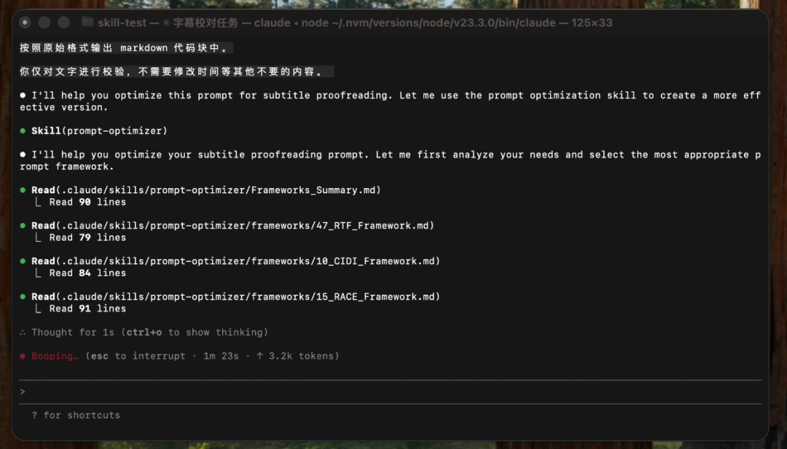

我们看到它匹配到了我们的技能，并按照技能中的指引读取了摘要文件，匹配到最适合的框架后，再去读取对应框架的详情。

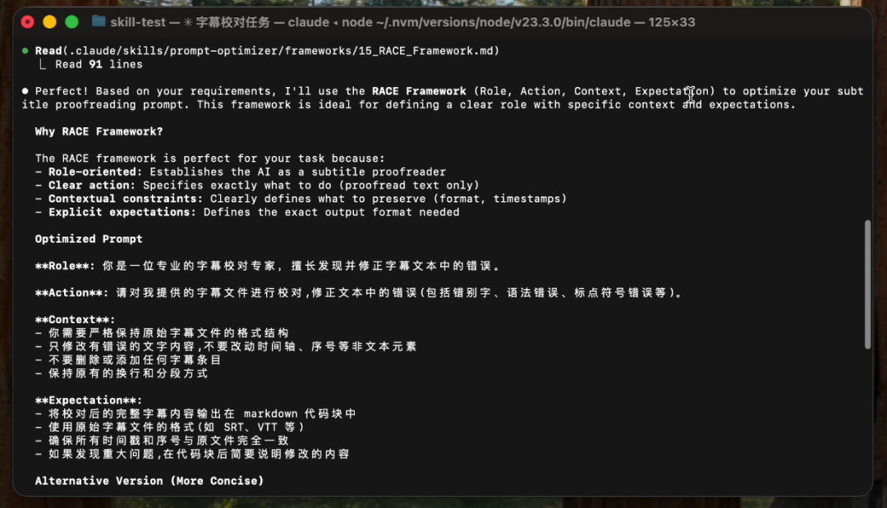

给出选择 RACE 框架的原因和优化后的提示词。

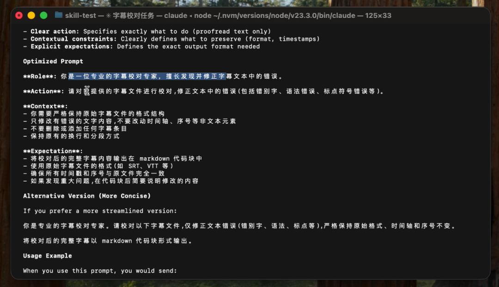

最后给出一个非常专业、全面的优化提示词，而且还贴心得给出了一个精简版。

这样的好处就是不需要依赖 Claude 的 Skill，也可以生成很高质量的 Skill。

### 官方 skill-creator

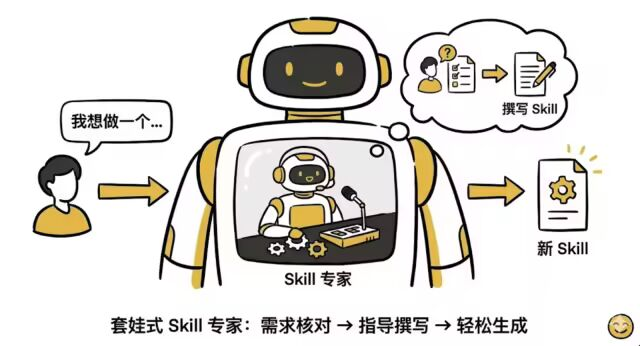

突发奇想，是不是可以搞一个 创建 skill 的 skill 呢？

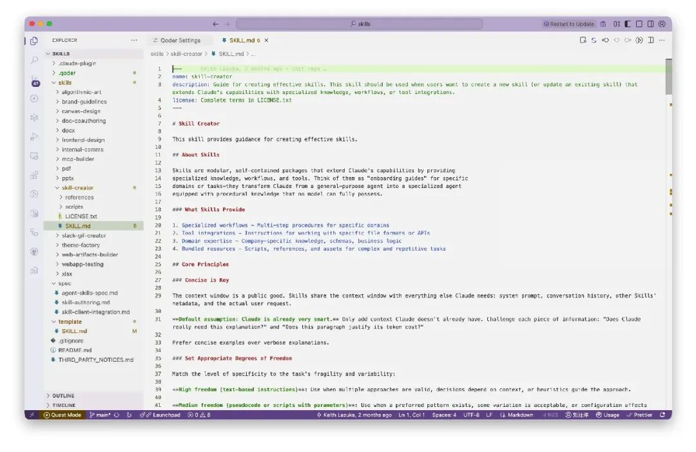

结果居然发现， Claude 也提供了一个 skill-creator ！！！！

已关注

__

关注

__ 重播 __ 分享 __ 赞

关闭 __

**观看更多**

更多 __

__

__

__

_退出全屏_

[ __](<javascript:;>)

_切换到竖屏全屏_ _退出全屏_

阿里云开发者已关注

[ __](<javascript:;>)

分享视频

 __，时长 02:37

0/0

00:00/02:37

切换到横屏模式

继续播放

进度条，百分之0

 __

[播放](<javascript:;>)

00:00

/

02:37

02:37

[倍速](<javascript:;>)

 _全屏_

 __倍速播放中

[ 0.5倍 ](<javascript:;>)[ 0.75倍 ](<javascript:;>)[ 1.0倍 ](<javascript:;>)[ 1.5倍 ](<javascript:;>)[ 2.0倍 ](<javascript:;>)

[ 超清 ](<javascript:;>)[ 流畅 ](<javascript:;>)

您的浏览器不支持 video 标签

__

继续观看

极速开发出一个高质量 Claude Agent Skills 最佳实践

观看更多 __

转载

,

极速开发出一个高质量 Claude Agent Skills 最佳实践

 __

阿里云开发者 已关注

分享点赞在看

 ____已同步到看一看[写下你的评论](<javascript:;>)

 __

[ 视频详情 ](<javascript:;>)

那么，大家就可以创建一个空的目录，像前面一样将资料放进去，把 skill-creator 放到技能目录中，让 它帮我们生成。

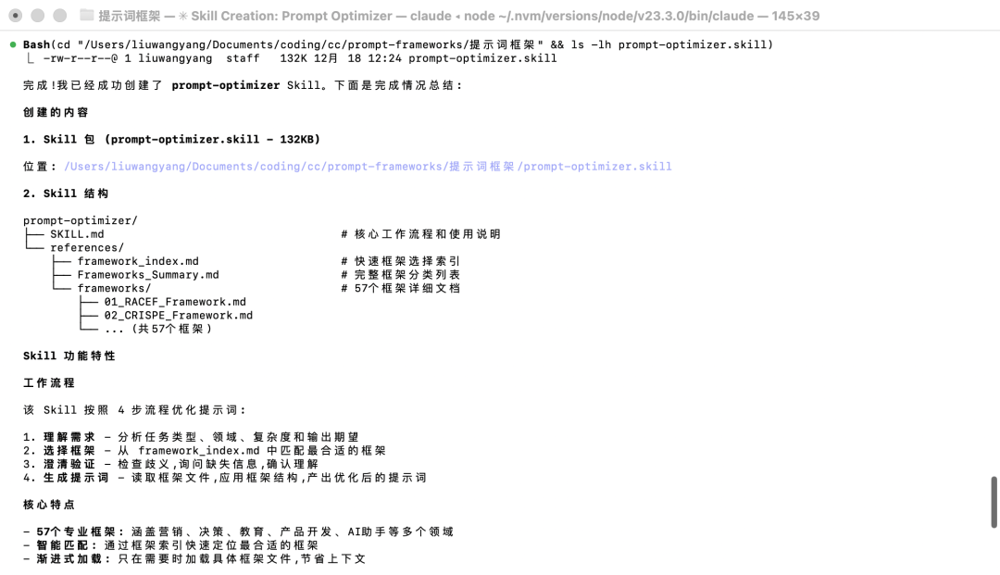

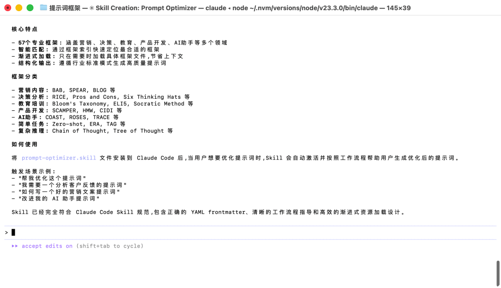

已关注

__

关注

__ 重播 __ 分享 __ 赞

关闭 __

**观看更多**

更多 __

__

__

__

_退出全屏_

[ __](<javascript:;>)

_切换到竖屏全屏_ _退出全屏_

阿里云开发者已关注

[ __](<javascript:;>)

分享视频

 __，时长 00:51

0/0

00:00/00:51

切换到横屏模式

继续播放

进度条，百分之0

 __

[播放](<javascript:;>)

00:00

/

00:51

00:51

[倍速](<javascript:;>)

 _全屏_

 __倍速播放中

[ 0.5倍 ](<javascript:;>)[ 0.75倍 ](<javascript:;>)[ 1.0倍 ](<javascript:;>)[ 1.5倍 ](<javascript:;>)[ 2.0倍 ](<javascript:;>)

[ 超清 ](<javascript:;>)[ 流畅 ](<javascript:;>)

您的浏览器不支持 video 标签

__

继续观看

极速开发出一个高质量 Claude Agent Skills 最佳实践

观看更多 __

转载

,

极速开发出一个高质量 Claude Agent Skills 最佳实践

 __

阿里云开发者 已关注

分享点赞在看

 ____已同步到看一看[写下你的评论](<javascript:;>)

 __

[ 视频详情 ](<javascript:;>)

生成出来的 Skill 非常专业。

所以，我们要做的不是关心 Skill 怎么写，而是如何表达清楚，如何给足 AI 上下文。

## 四、Claude Skill 自身的最佳实践

#### 1\. 核心设计哲学：不仅要写给 AI 看，还要省着写

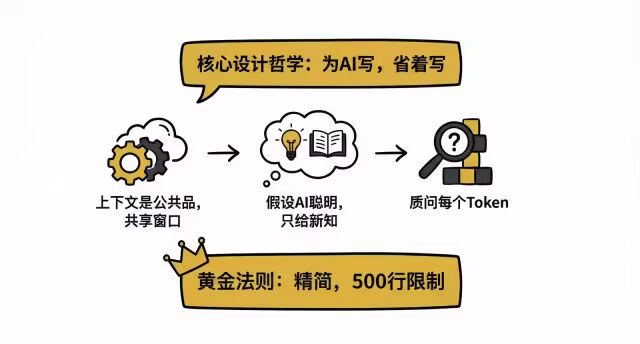

  * 上下文是公共品 (Public Good)：你的 Skill 会与系统提示词、对话历史和其他 Skill 共享上下文窗口。

  * 默认假设 Claude 很聪明：不要解释显而易见的概念（如“什么是 PDF”）。只提供它不知道的特定上下文。

  * 每个 Token 都要接受质问：“Claude 真的需要这句话吗？”、“删掉这段会影响效果吗？”。

  * SKILL.md 的黄金法则：

  * 保持精简：一旦加载，每个 Token 都在烧钱并占用注意力。

  * 500 行限制：主文件体保持在 500 行以内，超过则需拆分。

#### 2\. 自由度控制 (Degrees of Freedom)

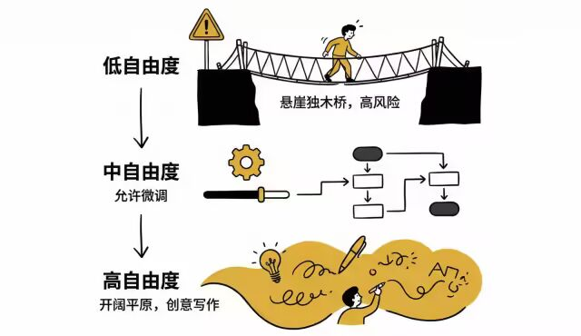

根据任务的容错率，设定不同的指令严格程度：

  * 低自由度 (Low Freedom)：适用于数据库迁移等高风险操作。

  * 比喻：悬崖边的独木桥。

  * 做法：提供精确的脚本、严格的步骤，不留发挥空间。

  * 中自由度 (Medium Freedom)：适用于有首选模式但允许微调的任务。

  * 做法：提供伪代码或带参数的脚本。

  * 高自由度 (High Freedom)：适用于代码审查或创意写作。

  * 比喻：开阔的平原。

  * 做法：提供大致方向，相信 Claude 的判断。

#### 3\. 结构与文件组织：渐进式披露 (Progressive Disclosure)

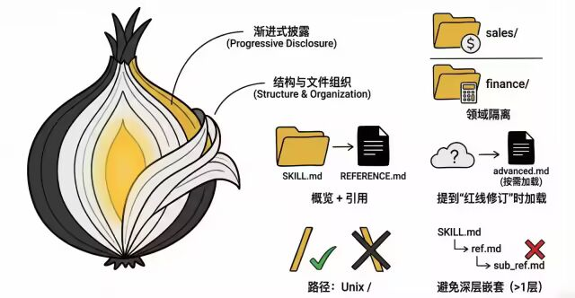

不要一次性把所有东西都塞进上下文，而是像“洋葱”一样一层层剥开。

  * 文件系统架构：Claude 像操作 Linux 文件系统一样操作 Skill。它只在需要时通过 `read` 工具读取特定文件。

  * 三种组织模式：

a.概览 + 引用：`SKILL.md` 只是目录，详情在 `REFERENCE.md`。

b.领域隔离：销售看 `sales/`，财务看 `finance/`，互不干扰。

c.按需加载：只有用户提到特定功能（如 "红线修订"）时，才去读对应的高级文档。

  * 避免深层嵌套：引用层级不要超过 1 层（`SKILL.md` -> `ref.md`，不要再 -> `sub_ref.md`），否则 Claude 可能偷懒只读部分内容。

  * 路径规范：永远使用正斜杠 `/`（Unix 风格），严禁使用 Windows 的反斜杠 `\`。

#### 4\. 命名与元数据规范

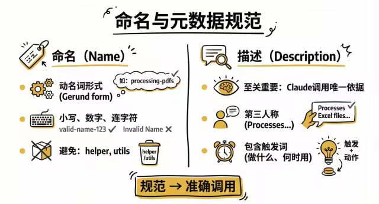

  * Name (名称)：

  * 推荐使用 动名词形式 (Gerund form)：如 `processing-pdfs`, `analyzing-spreadsheets`。

  * 规则：仅限小写字母、数字、连字符。

  * 避免：`helper`, `utils` 这种毫无意义的名字。

  * Description (描述)：

  * 至关重要：这是 Claude 在 100+ 个 Skill 中决定是否调用你的唯一依据。

  * 第三人称写法：不要用 "I can..." 或 "You use..."，直接写 "Processes Excel files..."。

  * 包含触发词：明确写出 Skill 做什么以及何时使用。

#### 5\. 迭代开发流：用 Claude 训练 Claude

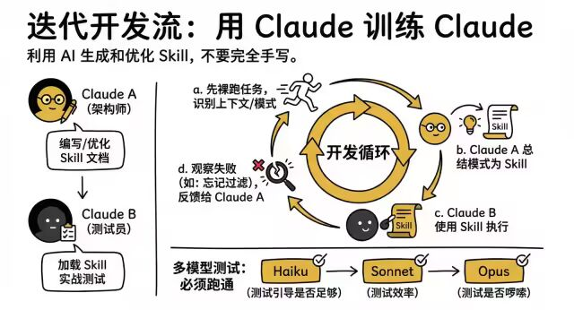不要完全自己手写，利用 AI 的能力来生成和优化 Skill。

  * 角色分工：

  * Claude A (架构师)：负责编写和优化 Skill 文档。

  * Claude B (测试员)：加载 Skill 进行实战测试。

  * 开发循环：

a.先裸跑任务，识别出必须的上下文和模式。

b.让 Claude A 将这些模式总结为 Skill。

c.让 Claude B 使用该 Skill 执行任务。

d.观察 Claude B 的失败点（如忘记过滤测试账号），反馈给 Claude A 修正。

  * 多模型测试：必须在 Haiku (测试引导是否足够)、Sonnet (测试效率)、Opus (测试是否啰嗦) 上都跑通。

#### 6\. 进阶：代码与执行 (Executable Skills)

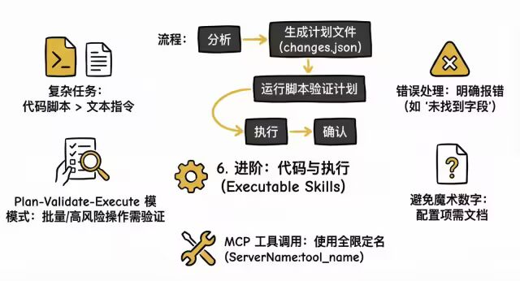

对于复杂任务，代码脚本 > 纯文本指令。

  * Plan-Validate-Execute 模式：

  * 对于批量或高风险操作（如修改 50 个表单字段），不要直接执行。

  * 流程：分析 -> 生成计划文件 (`changes.json`) -> 运行脚本验证计划 -> 执行 -> 确认。

  * 错误处理：脚本必须显式抛出具体错误（如 "Field 'date' not found"），而不是把报错扔给 Claude 去猜。

  * 避免魔术数字：所有配置项必须有文档说明，不要让 Claude 猜参数。

  * MCP 工具调用：必须使用全限定名 `ServerName:tool_name`（例如 `GitHub:create_issue`），防止工具冲突。

#### 7\. 避坑速查表

  * ❌ 拒绝：包含时间敏感信息（如 "当前是 2024 年"），除非放在 "Old Patterns" 章节。

  * ❌ 拒绝：术语不一致（一会叫 "URL"，一会叫 "Endpoint"）。

  * ❌ 拒绝：在 Windows 上写出 `scripts\run.py` 这样的路径。

  * ✅ 必须：为超过 100 行的参考文件添加目录 (TOC)。

  * ✅ 必须：在发布前创建至少 3 个评估测试用例。

参见：https://platform.claude.com/docs/en/agents-and-tools/agent-skills/best-practices

## 五、写在最后

这篇文章简单谈谈自己对 Skill 的理解，以及用一个具体的案例展示如何快速地开发出一个相对高质量的 Skill。

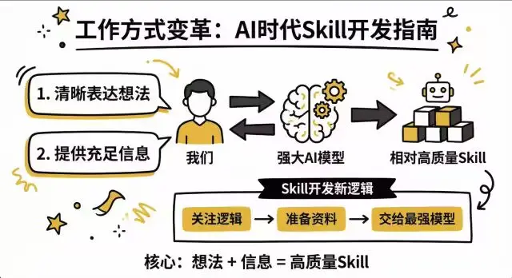

当模型足够强大的时候，我们的工作方式会发生比较大的变化。我们更多的是需要把自己的想法表达清楚，第二是把 AI 干活所需要的信息给充足。

因此，我们如果需要再去研发一些 Skill 的时候，我觉得可能更多的是关注其中的逻辑是什么样的，然后把资料准备充足。那具体怎么写，可以交给最强大的模型，帮我们去做。

参考资料：

[1] https://github.com/numman-ali/openskills

[2] https://github.com/anthropics/skills

[3] https://www.anthropic.com/engineering/equipping-agents-for-the-real-world-with-agent-skills

[4]https://code.claude.com/docs/en/skills
