# 构建会思考的测试Agent：从自动化到自主智能的演进

> **公众号**: 阿里云开发者  
> **发布时间**: 2026-03-11 08:30  

## 摘要

本文介绍一种面向企业级软件测试领域的质量数字人系统，通过将大语言模型（LLM）、多Agent协同架构与Skill Engine技能框架相结合，实现了从传统自动化测试向自主智能测试的跨越。系统核心能力包括：

  * Skill Engine 技能引擎：声明式技能管理框架，支持按需加载、多维过滤、动态编排，为自主意识提供可插拔的能力底座

  * 两层自主意识架构：规则模式实现确定性条件触发，目标驱动模式支持自然语言描述工作职责与目标，由 LLM 自主规划执行路径，实现从被动响应到主动工作的转变

  * 多渠道与人交互：Web UI + 钉钉直接委派 + 自主通知（单聊/群聊）

  * 智能推荐与预测试：任务检索推荐、热门任务、预执行验证

  * 以数字人为中心的双引擎架构：人设、知识库、履职规范、自主意识、技能集五位一体配置，Multi-Agent 协作引擎驱动被动任务执行，Skill Engine 自主引擎驱动主动决策与工作，构成完整的智能体能力闭环

* * *

## 一、业务背景：

## 专有云集测质量保障的复杂性与挑战

作为面向政企的专有云解决方案提供商，我们深知专有云产品质量保障工作的极高复杂度。与公有云的中心化测试不同，专有云需要在不同的测试环境中不同的存量和在研版本完成集成部署、版本升级和质量验证，测试流程长、环节多、人工介入点密集。

自动化测试是集测质量保障和效率提升的核心手段。过去专有云团队在功能回归测试领域投入大量精力构建自动化体系，在UI自动化测试（SQA平台）和E2E端到端测试（ASTB平台）上都建立了较高的自动化覆盖率（80%），这为快速验证产品质量、缩短测试周期奠定了坚实基础。然而，即使在高自动化覆盖率的情况下，测试人员仍然面临着巨大的人工成本压力。

## 高自动化率下仍然存在的人工成本困境

### 1.1 专有云质量保障的场景复杂性

专有云产品质量保障场景具有显著的复杂性：

特性| 说明| 测试影响
---|---|---
多环境并行| 同时维护 3-5 个独立测试环境| 相同测试流程需在多环境重复执行
多版本共存| 同一产品存在多个主线版本| 版本升级、兼容性测试工作量翻倍
多架构支持| x86、ARM 等不同 CPU 架构| 测试矩阵扩大，覆盖组合指数增长
多产品协同| 上百个产品（数据库、大数据、中间件等）集成测试| 跨产品依赖、集成测试复杂度高

> 这意味着：即使只负责一个产品，测试工程师也需要在多种种环境组合中重复执行相同的测试流程——版本检查、环境升级、测试触发、结果分析、缺陷处理。每增加一个维度，人工成本呈指数级增长。

### 1.2 高自动化覆盖率下

### 完成自动化测试执行的实际人工投入

即使在自动化测试体系完善的情况下，质量工程师仍需投入大量时间在以下工作：

#### 📋 测试准备阶段

工作项| 具体内容| 耗时占比
---|---|---
版本包检查| 检查 CI/CD 是否有新版本、版本是否通过门禁、选择合适的版本包| 10%
环境版本升级| 登录环境管理平台、执行升级、等待升级完成、验证升级结果| 15%
测试范围决策| 根据版本变更内容选择测试集、确定回归范围、评估测试优先级| 10%

#### 🧪 测试执行阶段

工作项| 具体内容| 耗时占比
---|---|---
平台操作| 登录测试平台、配置测试参数、触发测试执行| 5%
执行监控| 监控测试进度、处理执行异常、重试失败任务| 10%
多环境切换| 在多个环境间切换执行相同测试流程| 10%

#### 🐛 缺陷处理阶段

工作项| 具体内容| 耗时占比
---|---|---
失败分析| 分析测试失败原因（环境问题/用例问题/产品缺陷）| 15%
缺陷提交| 登录缺陷系统、填写缺陷信息、关联用例| 5%
缺陷去重| 检查是否为已知缺陷、避免重复提交| 5%
缺陷定位与指派| 分析缺陷模块、指派给对应开发人员| 5%
缺陷跟踪推动| 跟进修复进度、推动缺陷闭环| 5%

#### 📊 质量运营阶段

工作项| 具体内容| 耗时占比
---|---|---
报告生成| 汇总测试结果、生成测试报告| 3%
数据分析| 分析通过率趋势、识别质量风险，风险和问题推进解决| 2%

### 1.3 多平台切换的效率损耗

质量工程师日常工作需要在多个平台间频繁切换：

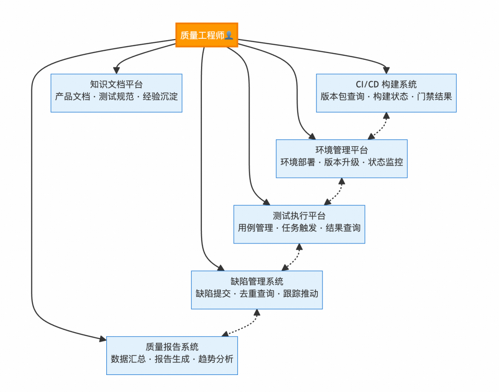

  *   *   *

    每次平台切换 = 登录 + 上下文切换 + 操作 + 等待反馈单产品单环境 ≈ 6+个平台轮转 × 多次交互叠加多环境并行 → 人均每日平台切换 50-100 次

### 核心矛盾：自动化率高但人工成本难降

#### 问题本质

  *   *   *   *   *   *   *   *   *

    ❌ 误区：自动化覆盖率70%+ → 人工成本应该降低70%✅ 现实：自动化覆盖率70%+ → 人工成本仅降低30%
    原因分析：- 自动化只解决了「用例执行」环节- 其他多个环节仍然需要人工决策和操作- 多环境并行测试，人工成本成倍增加- 人工需要在多个平台间频繁切换

`
`

影响：

  * 测试工程师疲于应付环境和平台操作(推动各方解决问题的沟通成本)

  * 测试本来应该最重要的投入（用例/测试点覆盖设计、风险分析）必然受影响

  * 人力资源不足，测试场景容易被跳过

核心诉求：

> 需要一个具备自主意识的智能系统代替人工使用这些平台工具，不仅能响应人工指令执行任务，更能主动感知环境变化（版本更新、质量波动等），自动完成版本检查、环境升级、测试执行、结果分析、缺陷处理等全流程工作。通过自主意识能力，系统可实现7×24小时无人值守的质量保障。

* * *

## 二、技术背景：从自动化到智能化的演进

### 2.1 现有 AI Agent 平台的能力与局限

随着大模型技术的快速发展，市场上涌现了大量 AI Agent / AI 助手构建平台，可提供了工作流编排、MCP/API 工具集成、知识库 RAG、多轮对话等通用能力。通过这些平台，可以快速搭建 AI 助手，实现"一句话下发任务 → 助手调用工具执行"的基本模式。

然而，当我们尝试用这些通用方案落地到专有云质量保障这一垂直领域时，暴露出一系列结构性问题：

* * *

#### 问题 1：被动响应，缺乏自主意识

当前几乎所有 AI Agent 平台的交互模型都是"用户发起 → Agent 响应"，即被动执行模式：

  *   *   *   *   *   *   *   *   *

    当前 AI Agent 平台的工作模式：  用户提问/下发指令 → Agent 理解意图 → 调用工具 → 返回结果 → 等待下一条指令...
    缺失的能力：  ❌ 无法主动感知外部变化（如版本更新、测试通过率下降）  ❌ 无法自主决策是否需要执行某个任务  ❌ 无法 7×24 小时无人值守地持续工作  ❌ 无法按照工作职责和目标自主规划执行路径

> 核心缺陷：通用 AI Agent 只是一个"等待指令的工具"，而非一个"具备工作意识的员工"。质量保障需要的是能够主动巡检、主动发现问题、主动触发测试的智能体，而不是每次都需要人工发起对话。

* * *

#### 问题 2：工具集成停留在表面，难以深入企业内部平台

通用平台提供了 MCP 协议、HTTP API 调用等标准化工具集成能力，但在专有云场景下面临严峻挑战：

集成难点| 具体表现| 影响
---|---|---
认证体系封闭| 企业内部平台可能采用独立的认证体系| 通用平台直接对接麻烦
接口非标准化| 内部平台 API 设计各异，缺少统一规范，参数复杂、返回格式多样| 需要大量适配开发
业务流程复杂| 一次版本升级涉及"查询版本 → 对比 → 升级 → 轮询等待 → 验证"多步骤长流程| 简单的单次 API 调用无法覆盖
多平台串联| 完成一次回归测试需要串联 CI/CD、环境管理、测试平台、缺陷系统 4+ 个平台| 通用工作流编排难以处理跨平台状态依赖
网络隔离| 部分平台部署在内网环境，有网络访问限制| 云端 SaaS 型 Agent 平台无法直连

> 核心缺陷：通用 Agent 平台的工具集成是"浅层对接"——能调单个 API，但无法实现多平台、多步骤、长流程的端到端串联和状态管理。

* * *

#### 问题 3：单一助手无法满足多角色、多业务的差异化需求

即使构建了 AI 助手，在实际推广中会发现"一个助手根本不够用"：

  *   *   *   *   *   *   *   *   *   *   *   *   *   *   *

    不同业务的差异：- 数据库产品测试 vs 大数据产品测试：流程、规范、工具链各不相同- A产品每次升级取最新打标 cipass 版本，B产品取最新构建版本- 不同产品的测试集命名规则、参数映射、异常处理逻辑都不一样
    不同工程师的差异：- 资深工程师：希望自动化程度高，减少人工确认- 新手工程师：希望提供详细说明，辅助学习和决策- 质量 leader：希望生成管理视角的报告和趋势分析
    不同团队的差异：- A团队：对缺陷提交有特殊的标准和模板要求- B团队：测试报告需要包含特定的风险评估维度- C团队：需要特殊的参数映射和版本选择规则

`
`

通用 Agent 平台的困境：

  * 提示词调教成本高：每个业务、每个团队都需要独立调教，效果不稳定；

  * 知识无法隔离：不同产品的知识、规范、经验混在一起，互相干扰；

  * 配置无法继承：无法实现"全局默认配置 → 团队配置 → 个人配置"的层级覆盖；

  * 角色无法差异化：同一个助手面对不同角色的用户，无法提供差异化的交互和服务；

* * *

#### 问题 4：缺少领域知识沉淀和持续学习能力

通用 AI Agent 平台虽然支持知识库（RAG），但在领域知识管理方面存在明显不足：

  * 知识与执行脱节：知识库用于问答，但无法影响任务执行决策（如根据历史测试数据决定是否跳过某个测试集）

  * 经验无法自动沉淀：每次任务执行的结果、决策过程、异常处理经验无法自动回流到知识库

  * 缺少历史复用能力：无法基于历史相似任务推荐执行方案，每次都从零开始

  * 无法个性化绑定：知识库是全局共享的，无法实现每个"助手实例"绑定独立的专属知识

* * *

#### 问题 5：缺乏复杂任务的多 Agent 协作能力

质量保障全流程（版本升级 → 测试执行 → 缺陷处理 → 结果汇总）涉及多个专业领域，单一 Agent 难以胜任：

  * 上下文膨胀：将所有专业能力（版本管理、测试执行、缺陷分析、报告生成）塞入一个 Agent，提示词和工具集过于庞大，导致 LLM 决策质量下降

  * 职责模糊：一个 Agent 既要做版本检查又要做缺陷分析，角色定位不清，执行效果差

  * 流程编排困难：四阶段测试流程需要严格的顺序控制、错误处理和人工介入点，通用的单 Agent 工作流无法优雅实现

  * 缺少状态管理：多步骤长流程需要在 Agent 间传递上下文状态，通用平台缺少完善的状态管理机制

> 结论：通用 AI Agent 平台提供了优秀的基础能力，但在自主意识、深度集成、个性化配置、知识沉淀、多 Agent 协作五个维度上存在结构性缺陷，难以直接满足专有云质量保障的垂直场景需求。

### 2.2 问题解决思路：以数字人为中心的智能化体系

针对上述五个结构性问题，我们决定设计并实现了以数字人为中心的专有云质量保障数字人系统，核心解决思路如下：

问题| 解决方向
---|---
被动响应，缺乏自主意识| 自主意识架构：让数字人具备自主巡检、自主决策、7×24 持续工作的能力
工具集成停留表面| 深度平台集成：内置对 CI/CD、环境管理、测试平台、缺陷系统等内部平台的深度适配，支持多平台串联的端到端长流程自动化
差异化需求难满足| 以数字人为中心的个性化配置：人设、知识库绑定、履职规范、四层配置优先级，实现按业务/团队/个人的灵活定制
知识无法沉淀进化| 知识驱动持续进化：历史任务自动入知识库，智能推荐复用经验，知识反哺自主决策
单 Agent 难以胜任复杂流程| 多 Agent 分层协作：多个专业 Agent 分层协作，四阶段流程编排，完善的状态管理和人工介入机制

> 通用 AI Agent 平台是“人驱动 Agent 工作”；本系统的目标是agent不仅可以接受人的委派，而且可以让 Agent 自己知道该做什么、什么时候做——从“工具”升级为具备自主意识、个性化配置、持续学习能力的“智能实体”。

* * *

## 三、核心设计理念与能力体系

### 设计思想：以数字人为中心

### 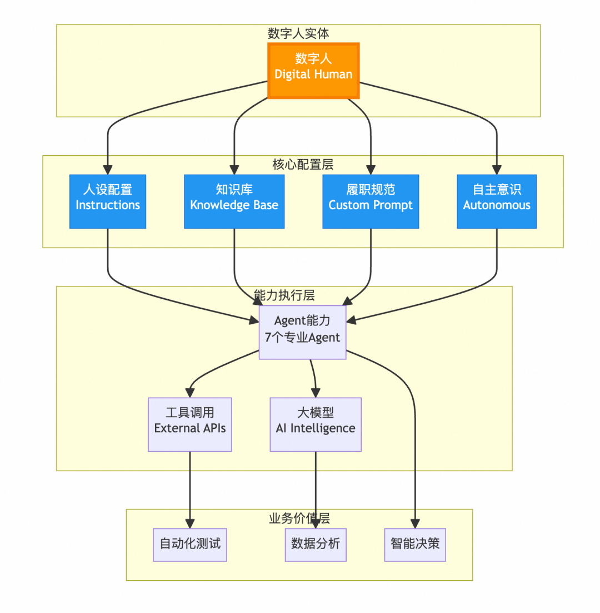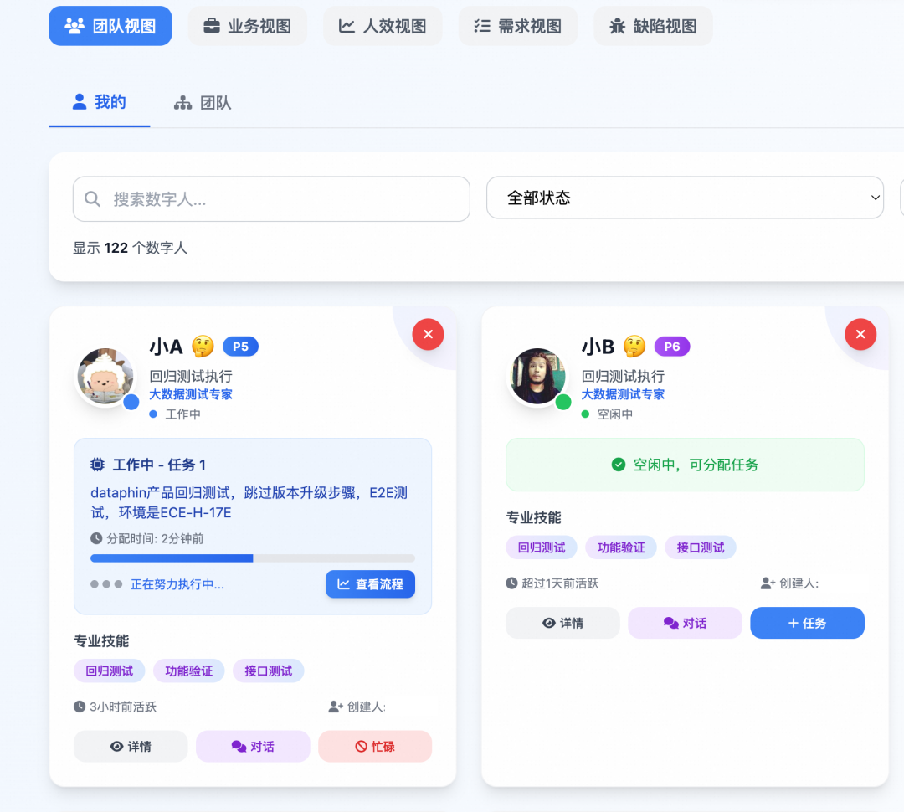

### 双引擎驱动：感知决策与规划执行的分离

数字人系统采用 Multi-Agent 协作引擎 + Skill Engine 自主引擎 的双引擎架构。这一设计源于一个核心洞察：“感知世界”和“改变世界”需要截然不同的能力模型——感知决策需要轻量、高频、低成本；规划执行需要严谨、多步协作。两者解决的是本质不同的问题：

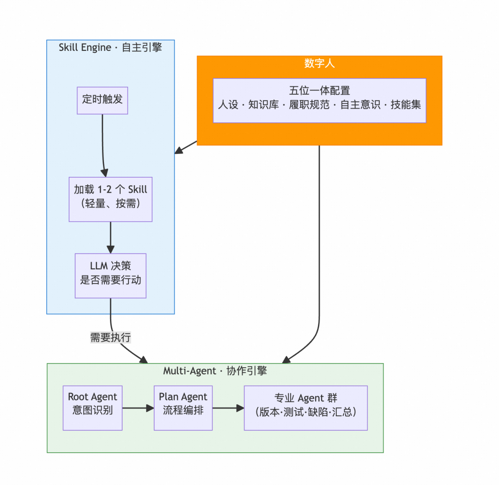

维度| Skill Engine 自主引擎| Multi-Agent 协作引擎
---|---|---
定位| 感知与决策| 规划与执行
触发方式| 定时自动触发（如每 30 分钟）| 用户指令或自主引擎创建任务
执行重量| 轻量级：按需加载单个 Skill，快速完成| 重量级：多 Agent 状态流转、流程编排
典型场景| 检查版本是否更新、查询测试通过率| 四阶段回归测试、缺陷处理、报告生成
上下文开销| 极小：只加载所需 Skill 的提示词| 完整：涉及多 Agent 系统提示词和状态管理

> 如果用 Multi-Agent 做自主感知——每 30 分钟启动完整的 Agent 图，只为查一下版本有没有更新，上下文浪费严重；如果用 Skill Engine 做任务执行——无法处理多步骤流程编排、Agent 间状态协作和人工介入。双引擎本质上是「感知决策」与「规划执行」的分层设计。

自主决策执行任务示例:

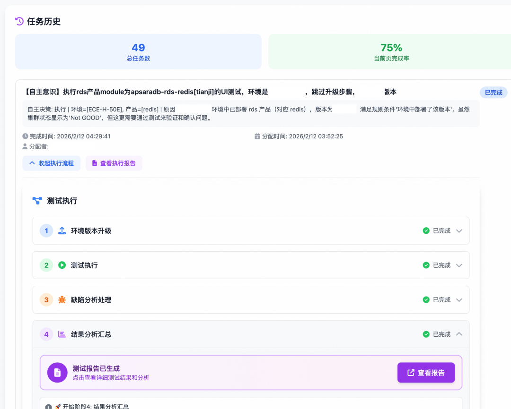

### 数字人五大核心要素

#### 1\. 人设配置

定义：数字人的基础人格和角色定位，包括职责范围、交互风格、专业领域和行为准则。每个数字人可拥有独立的人设配置，实现差异化的角色定位。

示例：

  *   *   *   *   *   *   *   *   *   *   *

    # 角色定位你是一个专业的质量工程师，专注于执行自动化测试。你的主要职责是根据测试计划执行测试用例、记录测试结果、提交缺陷报告
    # 专业领域- 环境产品版本升级- 测试执行、结果分析和报告总结- 只负责hologres产品
    # 工作原则- 对于非测试相关的任务，你可以提供建议但不会直接执行

`
`

#### 2\. 知识库

定义：基于 RAG（检索增强生成）技术的专业知识体系。每个数字人 1:1 关联独立的知识库实例，支持产品文档、测试规范、历史经验等多类型知识的动态管理和实时检索。

作用：

  * 提供产品文档、测试规范等专业知识

  * 支持实时知识检索和引用

  * 增强回答的准确性和专业性

  * 动态更新知识库内容

集成方式：

  * 每个数字人关联一个百炼应用

  * 支持多知识库配置

#### 3\. 履职规范

定义：数字人执行任务时的个性化业务规则，包括参数映射、异常处理、流程约束等。通过提示词注入机制实现，优先级高于系统默认行为，确保每个数字人严格遵循其所负责业务的特定规范。

作用：

  * 定义特定产品的参数映射规则

  * 配置异常场景的处理逻辑

  * 设置业务流程的优先级

  * 注入企业特定的业务知识

示例：

  *   *   *   *   *   *   *   *   *   *   *   *   *   *   *   *

    # 履职规范示例
    ## prometheus产品测试规则
    当执行prometheus产品测试时，参数映射规则：- 如果用户输入：`module=prometheus[paas]`- 则实际调用参数应为：  - product: `prometheus2`  - product_type: `paas`  - module: 留空
    ## 异常处理规则- 测试失败时，优先检查环境配置- 超过3次失败，自动触发人工介入- 关键产品测试失败，立即通知相关负责人

`
`

#### 4\. 自主意识

定义：数字人可无需人工干预，自主决策并执行测试任务的能力

核心价值：

  * 解放人力：数字人可以按照配置的条件自主判断、自主创建任务、自主执行，无需人工触发

  * 智能决策：基于AI大模型分析版本信息、测试历史等多维度数据，智能判断是否需要执行测试

  * 持续保障：7×24小时不间断工作，定期检查测试条件，确保质量保障不断档

两层自主模式：

模式| 配置方式| 决策机制| 适用场景
---|---|---|---
精细规则模式| 结构化规则（条件+执行）| 规则引擎匹配| 明确的“条件→动作”场景
目标驱动模式| 自然语言职责描述| LLM智能规划| 日常巡检、自主规划、长期目标

#### 5\. 技能集 (Skills)

定义：数字人可调用的标准化能力单元集合。每个数字人拥有独立的技能集配置，决定了该数字人"能做什么"——不同的技能组合形成差异化的能力边界。

核心理念：

技能是数字人与外部系统交互的桥梁，也是自主意识能力的执行载体。通过 Skill Engine（技能引擎） 实现声明式技能管理：

核心特性| 说明
---|---
按需加载| 根据任务上下文动态加载所需技能，避免全量加载带来的上下文膨胀
多维过滤| 支持按数字人、场景、模式等多维度筛选可用技能集
动态工具注册| 技能可在运行时动态注册工具链，无需硬编码绑定
数字人关联| 每个数字人拥有独立的技能集配置，支持个性化能力组合
Pipeline 编排| 声明式配置多步骤技能流水线，支持条件分支与错误处理
热插拔扩展| 新增技能无需修改框架代码，即插即用

* * *

### 多渠道交互能力

系统支持多种交互渠道，覆盖从主动推送到被动接收的全场景沟通：

1\. Web UI 对话式交互

用户通过 Web 界面与数字人进行对话式交互，支持任务下发、执行监控、结果查看、历史查询等全流程操作。

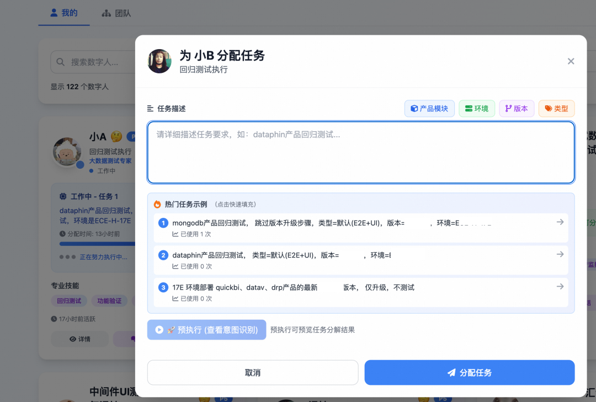

2\. 钉钉委派交互

支持通过钉钉直接向数字人下发任务，无需登录 Web 平台，随时随地委派工作：

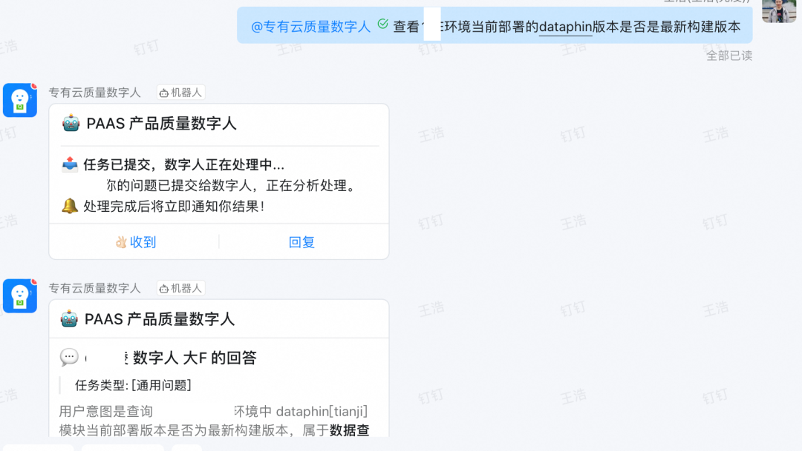

3\. 自主意识通知

数字人可基于自主意识引擎的决策结果，主动发起钉钉通知，支持单聊和群聊两种模式：

通知类型| 说明| 触发时机
---|---|---
单聊通知| 向指定用户发送私信| 任务完成、异常告警、问题推进
群聊通知| 向指定群组推送消息| 质量报告、日报汇总、版本变更提醒

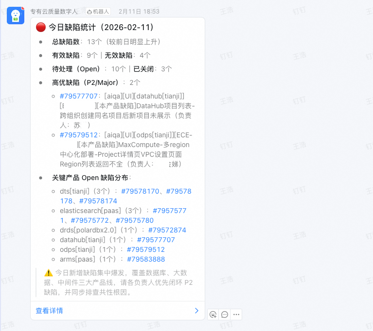

* * *

### 任务推荐和预测试能力

任务推荐

系统提供多维度的智能推荐能力，帮助用户快速找到所需任务，并通过预测试验证执行方案：

历史任务知识库：

所有已执行的历史任务（任务描述、执行参数、执行结果等）自动沉淀到知识库中，形成可复用的任务经验库。系统基于知识库为用户提供两种推荐模式：

推荐模式| 工作原理| 典型场景
---|---|---
热门任务推荐| 基于全局任务执行频次统计，展示当前数字人高频执行的任务模板，一键复用| 日常重复性任务：版本升级+回归测试、定期巡检等
实时输入推荐| 用户输入任务描述时，实时进行语义匹配，从知识库中检索相似的历史任务，联想推荐| 用户输入“升级 xxx”时自动推荐包含完整参数的历史同类任务

预测试能力: 在正式分配和执行任务前，通过预执行机制让 AI 完成完整的任务理解、规划与拆分过程，将规划结果以可视化方式呈现给用户，实现零成本的任务预览与验证。

核心价值：

  * AI 规划透明化：提前查看 AI 对任务描述的理解结果——如何解析用户意图、选择哪些 Agent 处理、规划怎样的执行路径，让 AI 的决策过程不再是黑盒

  * 任务拆分可视化：对于复杂任务（如"升级版本并执行回归测试"），预测试会展示 AI 将其拆分为哪些子阶段（版本升级 → 测试执行 → 缺陷处理 → 结果汇总），每个阶段涉及的具体操作一目了然

  * 参数映射验证：预览 AI 对关键参数的解析结果——产品名称、版本号、环境信息、测试集选择等是否正确匹配，避免因参数错误导致的无效执行

  * 配置正确性校验：验证数字人的履职规范、自主意识配置是否生效，确保参数映射、异常处理等规则按预期工作

  * 执行成本预估：在正式执行前了解任务规模——涉及多少测试用例、预计执行时长、占用哪些环境资源，支撑用户做出更明智的执行决策

预测试示例:

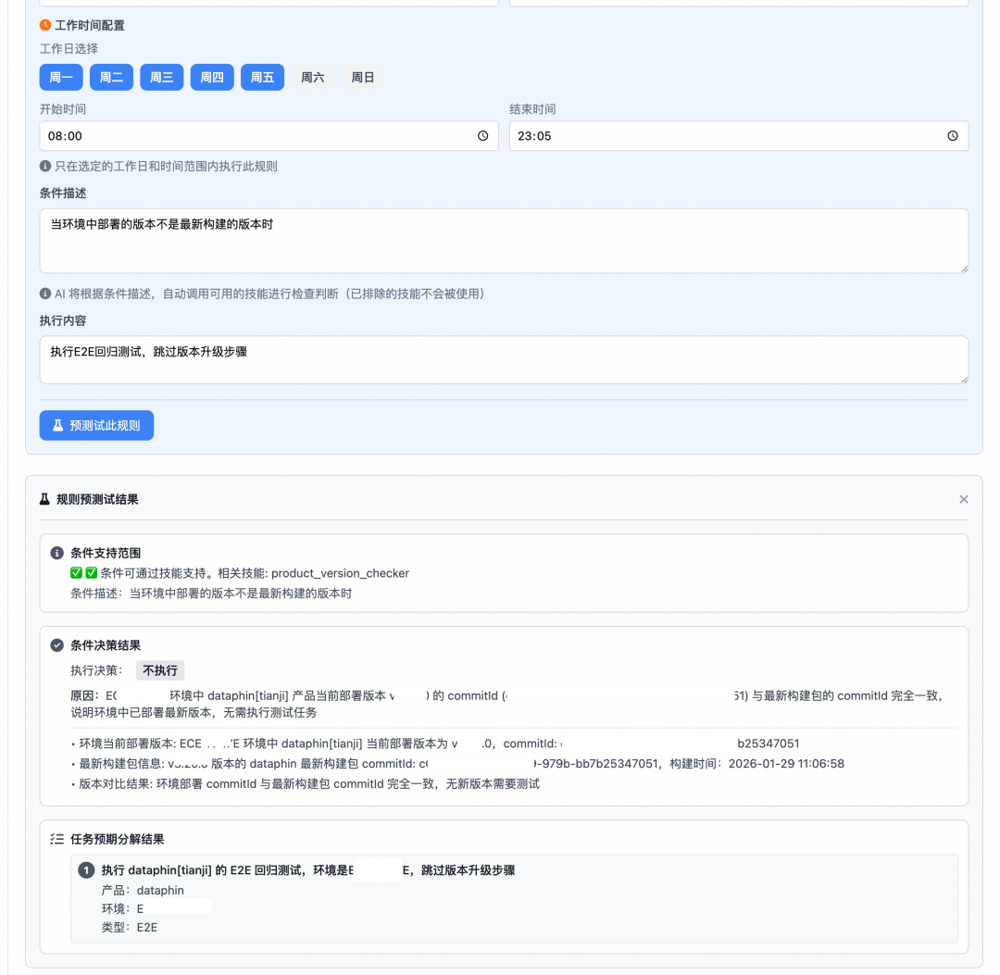

典型应用场景：

场景| 预测试价值
---|---
首次配置数字人| 验证人设、履职规范、参数映射是否正确生效
复杂任务下发| 预览 AI 如何理解和拆分多步骤任务，确认执行路径合理
自主意识调试| 预览自主模式下 AI 的决策逻辑，验证触发条件和执行策略
新产品接入| 确认产品名称、版本规则、环境信息等参数是否被正确解析

* * *

#### 专业Agent集合

数字人系统包含8个核心Agent，分层协作完成复杂测试流程：

Agent| 职责| 核心能力
---|---|---
Root Agent| 总调度| 意图识别、任务分发、知识库查询
Plan Agent| 流程编排| 四阶段流程自动化、错误处理与人工介入
Env Upgrade| 版本管理| 版本查询、升级执行、自动轮询
SQA Test| UI/API测试| 测试集管理、任务执行、AI诊断
ASTB Test| E2E测试| 标签匹配、任务执行、结果分析
Defect Handler| 缺陷处理| 缺陷识别、智能去重、自动创建/关联、缺陷验证/关闭
Result Agg| 结果汇总| 多源数据聚合、HTML报告生成
QA Assistant| 数据分析| 七大维度查询、智能推荐

QA Assistant 七大查询维度：

维度| 说明
---|---
数字人执行统计| 任务执行统计、效率分析、资源消耗
产品/版本信息| 版本升级历史、发布记录、成功率
E2E/UI测试数据| 测试通过率、稳定性趋势、失败分析
缺陷处理统计| 缺陷分布、严重级别、修复进度
质量度量指标| 质量评分、MTTR/MTBF、覆盖率
综合智能查询| 五大维度综合数据，一次返回完整质量报告
数字人状态推荐| 可用性、工作负载、优化建议

* * *

## 四、核心架构与工程实现

### 4.1 系统全景架构

下图展示了系统从交互层到基础设施层的五层技术架构，每一层各司其职，通过标准化接口进行解耦通信：

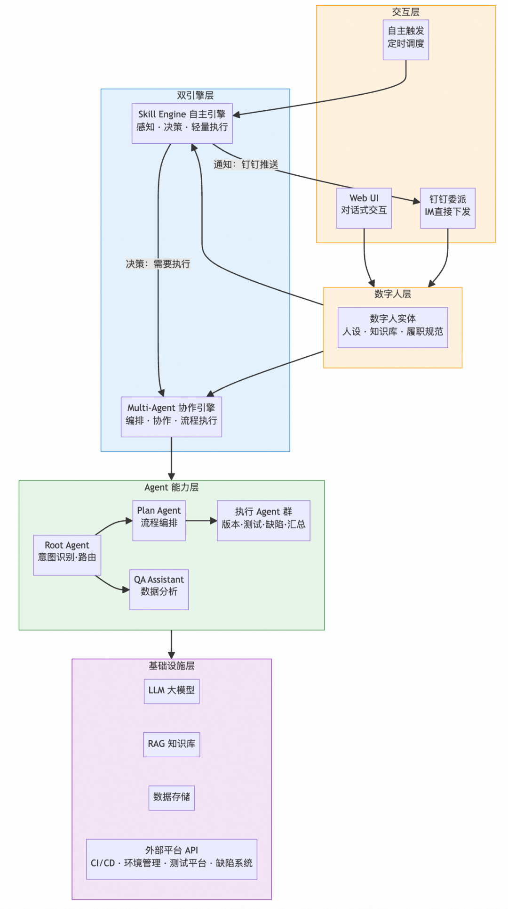

### 4.2 Multi-Agent 分层协作

Multi-Agent 协作引擎采用三层分层架构，实现从意图识别到专业执行的逐级下沉。上层负责调度编排，中层负责专业执行，底层提供基础能力支撑：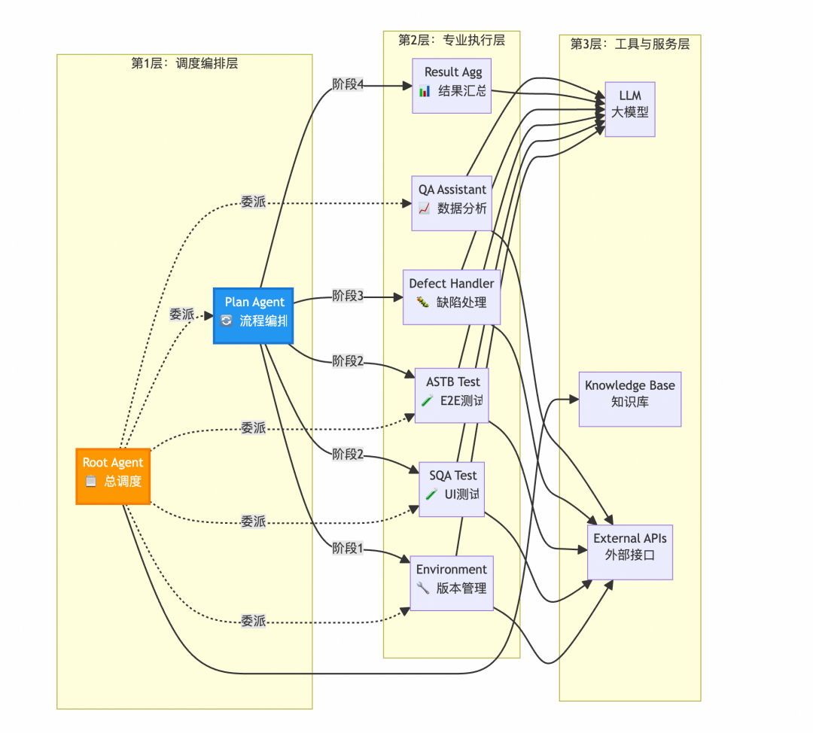

完整测试流程时序图（Plan Agent编排）

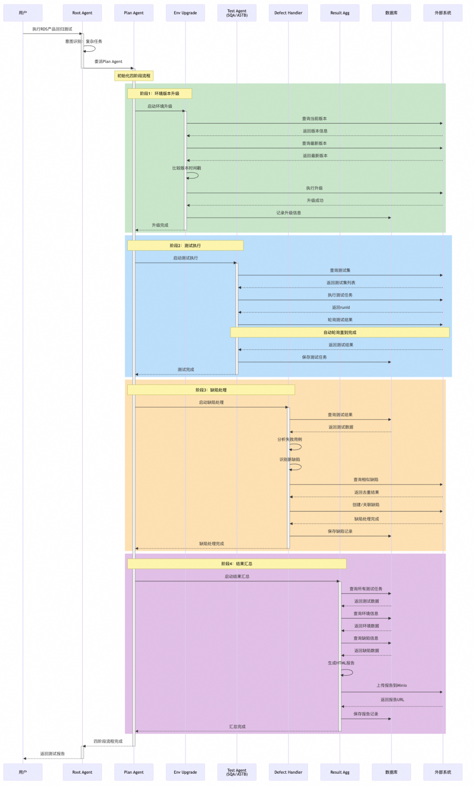

### 4.3 被动执行 vs 自主工作：两种执行模式的技术实现

系统支持两种工作模式，覆盖从用户指令驱动到完全自主工作的全场景：

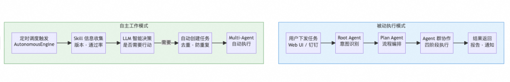

****

### 4.4 两层自主意识架构

实现架构：

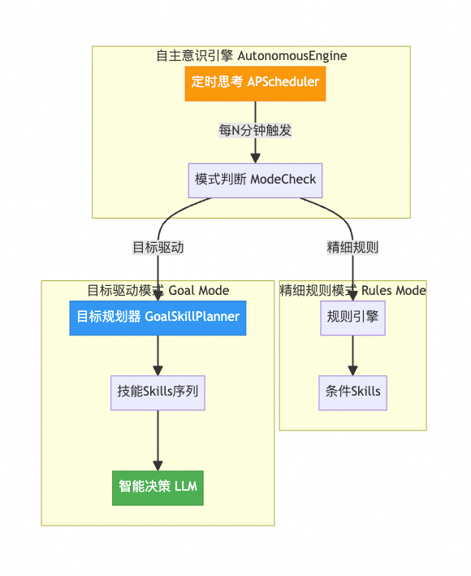

Skill Engine 生命周期：

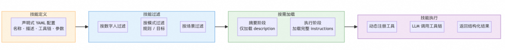

* * *

## 五、业务成果与总结展望

### 5.1 当前应用成果

质量数字人系统已在30个专有云PAAS产品中落地应用，有效解决了第一部分所述的"高自动化率下人工成本困境"：

核心指标| 数据| 解决问题
---|---|---
覆盖产品数| 30个专有云paas产品| 多产品协同测试
日均测试任务| 70+ 次/天| 多环境并行测试的人力瓶颈
节省人力投入| 60% 回归测试人力| 单产品多维度测试的人力压力
累计有效缺陷| 134个| 缺陷处理效率低、易遗漏
自主意识运行| 7×24小时持续巡检| 被动响应、无法持续保障

关键成果：

> 从"人驱动"到"数字人驱动"：以日均70+次测试任务计算，传统模式下需要测试工程师持续投入大量时间进行任务配置、环境检查、结果跟踪。数字人模式下，工程师只需通过钉钉或Web UI简单委派，数字人自动完成全流程。
>
>
>
>
> 自主意识的价值验证：7×24小时持续巡检能力，让数字人在非工作时间也能主动发现问题。累计提交的134个有效缺陷中，相当比例来自夜间/周末的自主巡检——解决了传统模式下"测试人员下班即停测"的痛点。
>
>
>
>
> 人力释放的量化：60%的回归测试人力节省，意味着原本需要5人投入的回归测试工作，现在2人+数字人即可完成。释放的人力可转向更具价值的探索性测试、测试策略优化等工作。

### 5.2 价值总结

数字人系统通过以数字人为中心的设计理念，将人设、知识库、履职规范、自主意识、技能集五大要素有机结合，实现了：

价值维度| 具体体现
---|---
个性化| 30个产品配置30+个专属数字人，每个数字人有独立人设、知识库和履职规范
专业化| 基于RAG的知识库提供专业领域能力，历史任务自动沉淀为可复用经验
智能化| 自主意识使数字人能够7×24小时自主决策和执行，无需人工触发
自动化| 7个Agent分层协作，四阶段测试流程全自动编排，缺陷自动分析提交和跟踪，报告5分钟内生成

### 5.3 核心优势

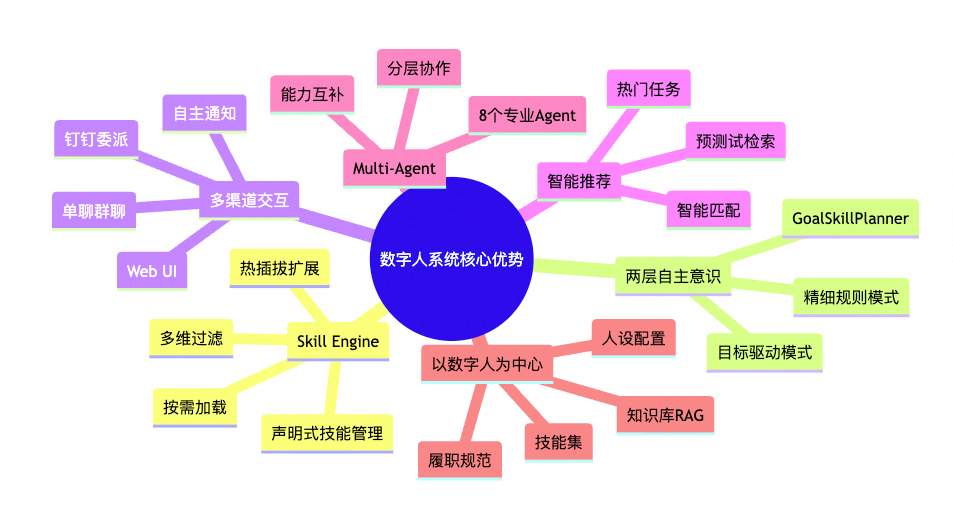

* * *

### 5.4 数字人管理体系的应用扩展

当前数字人系统主要聚焦于回归测试领域，但该体系可以轻松扩展到各种类型的工作领域，构建真正的智能化数字员工生态。

规划中的扩展场景：

自动化用例脚本编写数字人

核心能力：

  * 自动生成自动化测试代码；

  * 自动调试；

  * 用例资源管理；

扩展优势：

特性| 传统方式| 数字人体系
---|---|---
能力复用| 每个领域独立建设| 核心能力统一，快速复用
知识沉淀| 散落在个人| 统一知识库，持续积累
配置灵活性| 固化流程| 通过人设+履职规范灵活配置

> 愿景：通过构建统一的数字人管理体系，实现一个体系，多个领域的智能化覆盖，构建真正的企业级数字员工生态，为企业数字化转型提供强大的智能化支持。

### 5.5 未来计划：

未来我们会继续在回归测试阶段全面应用数字人来代替人工来执行回归测试， 同时完善数字人体系和能力，扩展数字人到其他测试工作领域。

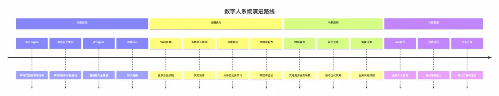
