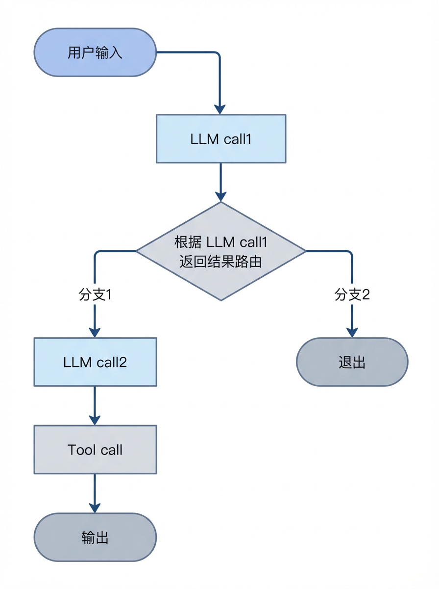
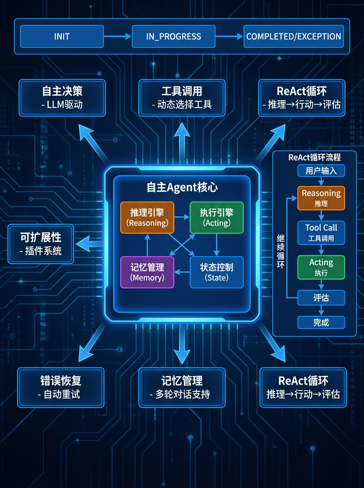
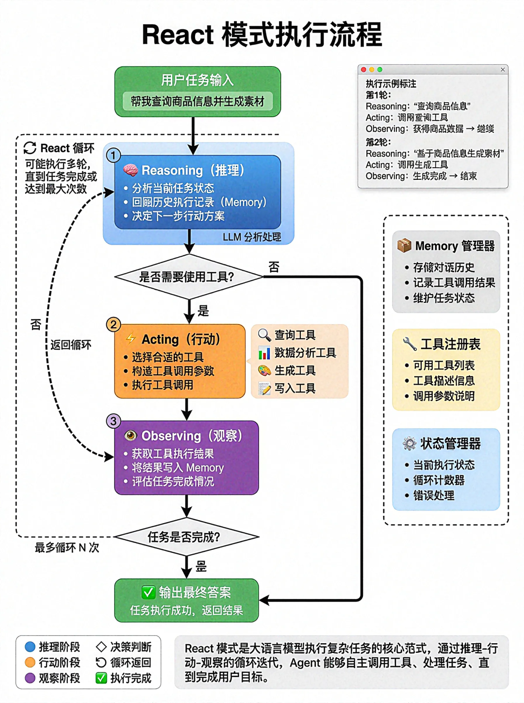
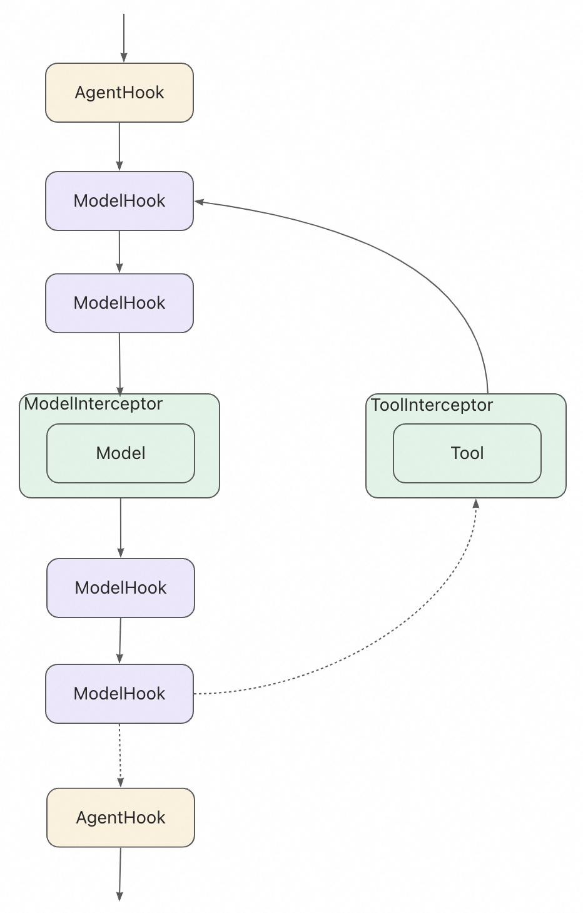
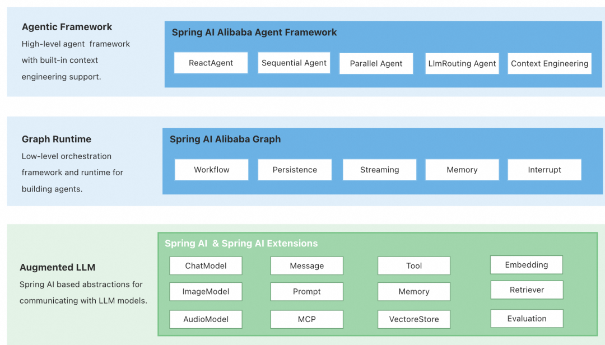
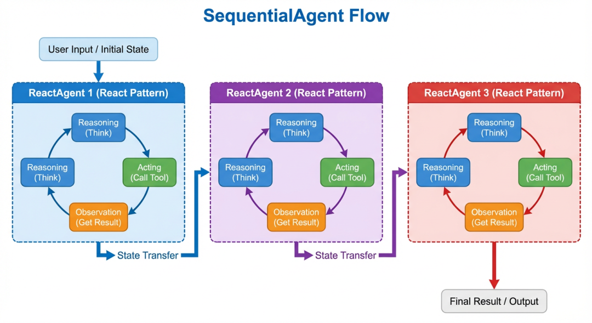
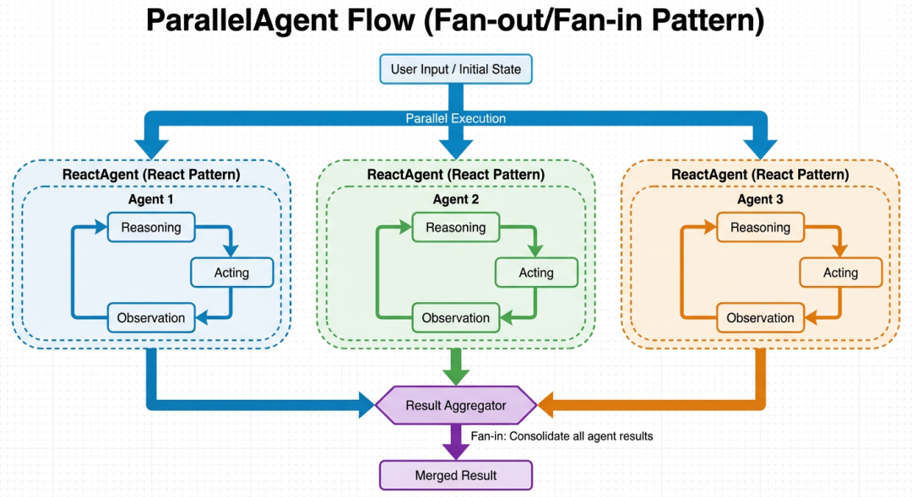
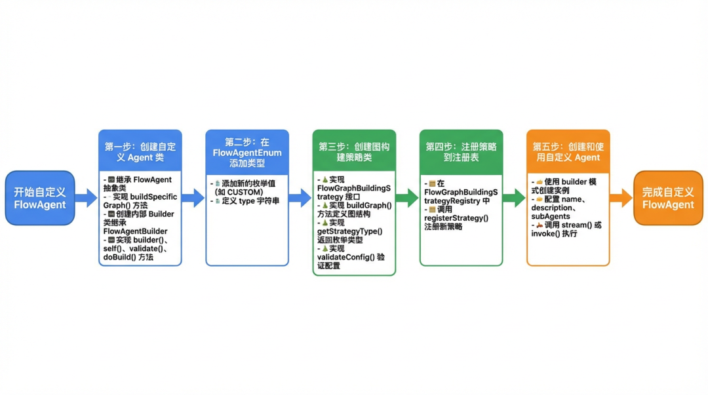
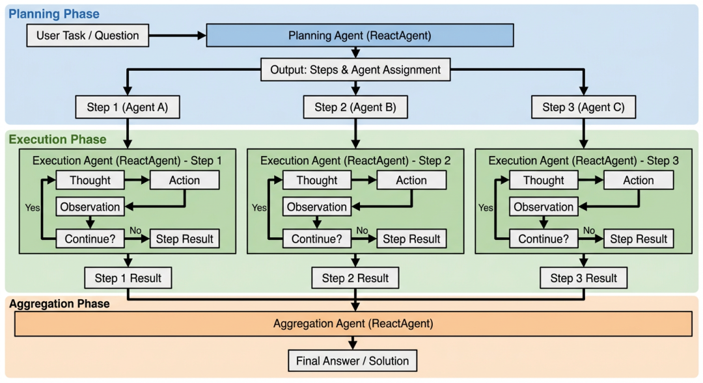

# 用Spring AI Alibaba把MultiAgent实现从5天压到5小时

> **公众号**: 阿里云开发者  
> **发布时间**: 2026-02-13 08:30  

## 一、前言

不久前，Spring AI和Spring AI Alibaba都迎来了新版本的发布，首次在框架层面支持了Multi-agent 编排能力，看到官方示例中的ReactAgent构建代码，以及其“10 行代码就可以启动并运行一个智能体应用”的宣传，决定试一试。结果花了5个小时把线上正在运行的Multi-agent框架基本重新实现了一遍，且功能基本一致，带来的感受的确不错。

本文将从Agent的核心模式（React、Planning）出发，给出基于Spring AI Alibaba的简单实现示例，帮助读者：

  * 理解Multi-agent系统的核心模式和实现原理

  * 认识手写框架与成熟框架的关键差异

  * 为技术选型提供参考依据

## 二、大模型应用的三个演进阶段

### 2.1 第一阶段：构建组件

核心：告诉模型它能做什么

这个阶段我们用大模型来：

  * 简单代码生成：快速生成样板代码。

  * 问题解答：技术问题的快速咨询，如用idealab搭建答疑机器人。

  * 文本处理：摘要、归类，如：利用模型能力进行相似类目聚合等。

### 2.2 第二阶段：工作流

核心：告诉模型它该怎么做

结合特定的业务场景，将多个步骤串联起来，形成一个工作流：

这种方式能够处理更复杂的任务，但问题也随之而来：

  * 流程固定：每个步骤都是预定义的，缺乏灵活性

  * 错误处理困难：某个环节出错，整个流程就会中断

  * 无法自主决策：不能根据中间结果动态调整后续步骤

### 2.3 第三阶段：自主Agent

核心：告诉模型我想做什么，它自主决策

这个阶段我们主要关注：

1.Agent定义：Agent = LLM + Planning + Memory + Tool（OpenAI Lilian Weng）。即Agent在LLM之上，还带有任务规划、记忆和环境交互能力。

2.ReAct 模式：使得Agent 具备了"思考-行动"的能力。

3.Multi-agent 协作：让不同专业的 Agent 可以相互配合，解决单个Agent无法完成的复杂任务。

这个阶段遇到的最大挑战就是：如何设计一个自主Agent。主流的AI框架、工具和活跃的社区讨论等都以python主导，作为java开发者只能通过“多看多学”来汲取经验，这里我们主要就是参考了OpenManus的实现思路，并将其核心理念用 Java 进行了复刻。（但是其核心的browser use等相关的Tool并不是我们需要的）。

## 三、React 模式

### 3.1 React模式执行流程

1.Reasoning（推理）：分析当前状态，决定下一步做什么

2.Acting（行动）：执行具体的动作（如调用工具、查询数据）

3.Observing（观察）：获取工具执行结果，评估任务完成情况

4.循环迭代：根据行动结果继续推理，直到完成任务

### 3.2 代码示例

  *   *   *   *   *

    /** * ReAct 智能体：推理(Reasoning) + 执行(Acting) 循环模式 */public abstract classAbstractReactAgentextendsAbstractAgent {    /**     * 主执行流程     */    @Override    public Result execute(Context context){        // 循环执行 ReAct 流程        for (int i = 0; i < maxRetryTimes; i++) {            currentLoop = i;                        // === 第一步：Reasoning（推理） ===            if (!reasoning(context)) {                continue;  // 推理失败，重试            }
                // === 第二步：Acting（执行） ===            Result result = act(context);                        // 如果任务完成，退出循环            if (result.isCompleted()) {                return result;            }        }                return finalResult;    }
        /**     * 推理阶段：让 LLM 思考并决策     */    private boolean reasoning(Context context){        // 1. 构建提示词（包含历史对话、可用工具等）        currentPrompt = buildPrompt(context);
            // 2. 调用 LLM        llmResponse = callLLM(currentPrompt, availableTools);
            // 3. 解析 LLM 响应        toolCalls = extractToolCalls(llmResponse);        textResponse = extractText(llmResponse);
            // 4. 判断是否有有效输出        return hasToolCalls || hasTextResponse;    }
        /**     * 执行阶段：调用工具并获取结果     */    private Result act(Context context){        // 情况1：没有工具调用，直接返回文本        if (toolCalls.isEmpty()) {            return Result.completed(textResponse);        }
            // 情况2：执行工具调用        try {            // 执行工具            toolResult = executeTools(toolCalls);
                // 更新记忆（将工具结果加入对话历史）            updateMemory(toolResult);
                // 检查是否可以终止            if (canTerminate(toolCalls)) {                return Result.completed(toolResult);            }
                // 继续下一轮循环            return Result.inProgress(toolResult);
            } catch (Exception e) {            return Result.error(e.getMessage());        }    }
        /**     * 构建提示词（由子类实现）     */    protected abstract Prompt buildPrompt(Context context);
        /**     * 更新记忆（由子类实现）     */    protected abstract voidupdateMemory(String toolResult);}

#### 问题

1.消息历史管理：如何正确维护对话历史？哪些消息应该保留？

2.工具注册：如何优雅地注册和管理工具？

3.RAG集成：缺少RAG相关处理

4.错误处理：工具执行失败如何处理？

5.循环控制：如何判断任务是否真正完成？

6.扩展性：扩展较差，开发者可定制的空间小，部分改动需要修改主链路。

### 3.3 Spring AI Alibaba如何实现

### ReactAgent

Spring AI Alibaba在框架层面提供ReactAgent的标准实现，开发者可以开箱即用，最重要的就是其清晰的构建模式、灵活的扩展机制，使得新人上手没有太大门槛，基本不需要顾虑上面手写框架面临的问题，而且核心组件的构建是基于Spring AI的，使得我们原有的工具接入成本极低。

使用方式

  *   *   *   *   *   *   *   *   *   *   *   *   *   *   *   *   *   *   *

    ReactAgent reactAgent = ReactAgent.builder()    .name(agentName)    //模型对象，spring-ai的ChatModel    .model(chatModel)    //系统提示词    .systemPrompt(systemPrompt)    //工具列表，spring-ai的ToolCallback    .tools(Lists.newArrayList(tool1, tool2,..))    //流程定制：interceptors    .interceptors(Lists.newArrayList(interceptor1,..))    //扩展机制：hooks    .hooks(Lists.newArrayList(hook1, hook2,..))    //短期记忆内存实现    .saver(new MemorySaver())    //输出格式化    .outputType(outputTypeClass)    .build();AssistantMessage response = reactAgentWrapper.call("今天苏州天气怎么样？");String textContent = response.getText();

### 模型（Model）

ReactAgent接受的Model是一个ChatModel，它是Spring AI API，被设计为一个简单且可移植的接口，用于与各种 AI 模型交互，允许开发者在不同模型之间切换时只需最少的代码更改。

### 工具(Tools)

Tools是Agent执行操作的组件，一般会利用大模型的Function Call能力，ReactAgent接受的Tools是ToolCallback，也是Spring AI API，对于之前使用Spring AI的工程，基本可以做到无缝切换。

### 记忆管理（Memory）

记忆部分都是由Graph框架的能力来实现，主要分为：

  * 短期记忆（会话记忆）：利用框架的Checkpointers机制，通过和会话机制结合，可以实现和大模型的多轮对话。框架内置了RedisSaver、MongoSaver等实现，也可以自定义实现其他更适合的存储。

  * 长期记忆（跨会话的记忆）：继承Store接口，框架内置了RedisStore、MongoStore等几种实现，支持跨会话的数据存储。

### 检索增强（RAG）

Spring AI Alibaba提供了一系列的RAG组件，包括：文本的分割、向量转化、向量存储及检索等，且支持多种向量数据库的读写。同时结合工具扩展，开发者也可以实现各种Agentic RAG。推荐直接使用百炼的RAG服务，结合下面的扩展机制，动态的扩充我们的上下文。

### 扩展机制

Hooks 和 Interceptors 使得开发者可以在Agent、Model、Tool等执行的前后进行自定义扩展，是实现上下文工程的有效手段，官方的示意图表达的十分清晰：

框架内置了一些Hooks和Interceptors，包括：

  * 消息压缩：当消息tokens超过阈值后，做一个简单的消息摘要。

  * 模型调用限制：限制模型调用次数以防止无限循环或过度成本。

  * 提示词编辑：特定场景下，动态地增加、删除或修改提示词。

  * 工具调用限制：限制工具的调用次数防止无限循环等。

  * ...

结合扩展机制，可以为Agent增加各种自定义能力，包括对模型、工具调用的日志、监控、内容审核等。

### 实现原理

Spring AI Alibaba项目架构包含三层，依次是：Spring AI -> Graph -> Agent Framework，Graph是一个轻量级的工作流编排框架，Agent Framework可以认为是在Graph的基础上提供的Agentic API，提供了开箱即用的ReactAgent和Multi-agent实现，同时围绕上下文工程提供智能体能力的扩展。对于简单的需求，你可以仅通过Agent Framework就能轻松的交付，而了解Graph，则可以帮助你构建出更多样的智能体。

以ReactAgent为例，它实际上就是一系列 Nodes（执行单元） 在 Edges（边） 的连接下，通过 OverAllState 进行数据传递，以形成一个有向无环图（DAG）。

## 四、Multi-agent

### 4.1 Multi-agent模式

Spring AI Alibaba支持以下Multi-agent模式：

  * Tool Calling：Supervisor Agent将其他Agent作为工具调用，通过AgentTool封装就可以将一个ReactAgent变为一个工具。

  * Handoffs：当前Agent将控制权转移给另一个Agent，框架提供了几种内置实现：顺序执行（Sequential Agent）、并行执行（Parallel Agent）、路由（LlmRoutingAgent）。

**4.2 Spring AI Alibaba内置的Multi-agent实现**

###  顺序执行（Sequential Agent）

  *   *   *   *   *   *   *

    SequentialAgent sequentialAgent = SequentialAgent.builder()  .name("sequentialAgent")  .description("")  .subAgents(List.of(agent1, agent2))  .build();Optional<OverAllState> result = sequentialAgent.invoke("");//可以根据outputKey获取对应Agent的结果

### 并行执行（Parallel Agent）

  *   *   *   *   *   *   *   *   *

    ParallelAgent parallelAgent = ParallelAgent.builder()  .name("parallelAgent")  .description("")  .mergeOutputKey("merged_results")  .subAgents(List.of(agent1, agent2, agent3))  .mergeStrategy(new ParallelAgent.DefaultMergeStrategy())  .build();Optional<OverAllState> result = parallelAgent.invoke("");Object mergedResults = state.value("merged_results").get();

****

### 4.3 利用FlowAgent 自定义Multi-agent

核心还是围绕Graph的工作流框架来定制，流程如下：

## 五、实战：用Spring AI Alibaba实现Plan-Execute模式

### 5.1 流程示意

### 5.2 实现思路

1.整体分为三个阶段：1）规划，由PlanningAgent生成可执行的步骤；2）执行，分步骤选取ReactAgent并执行；3）总结，由SummaryAgent将上面每个步骤的内容聚合分析，给出总结性的结论。

2.每个Agent实现都是ReactAgent。

3.合理的利用Function Call，比如生成计划和步骤，以及每个步骤使用的Agent。

4.步骤之前需要进行上下文和状态传递，下一个Agent需要感知环境信息。

5.用合理的方式将上面的流程编排在一起。

### 5.3 实现方案

### 5.3.1 手动编排

示例代码：

  *   *   *   *   *

    /** * Plan-Execute 模式简化示例 * 核心思想：先规划（Plan），再执行（Act），最后总结（Summarize） */publicclassSimplifiedPlanningCoordinator {
        /**     * Plan-Execute 模式的主入口     *      * @param laiContext 上下文信息     * @return 完整的规划和执行结果     */    public Planning execute(Context context){        // 第一阶段：Planning - 生成执行计划        Planning planning = generatePlanning(context);                // 第二阶段：Acting - 按计划执行步骤        executeSteps(planning, context);                // 第三阶段：Summarizing - 汇总结果        summarize(planning, context);                return planning;    }
        /**     * 阶段一：生成执行计划     * 根据用户输入，由 AI 生成结构化的执行步骤     */    private Planning generatePlanning(Context context){        // 步骤1: 创建 Planning Agent        // 这个 Agent 的职责是分析用户需求并制定执行计划        ReactAgent planningAgent = reactAgentFactory.createReactAgent(            context,             "planning"  // Agent 名称        );                // 步骤2: 构建 Planning Prompt        // 提示词中包含：用户需求、可用的 Agent 列表、当前时间等信息        String planningPrompt = buildPlanningPrompt(context);                // 步骤3: 调用 Planning Agent        // Agent 会分析需求，然后主动调用 PlanningTool 来创建计划        UserMessage userMessage = new UserMessage(planningPrompt);        AssistantMessage response = planningAgent.call(userMessage);                // 步骤4: 获取生成的计划        // PlanningTool 已经将计划保存到上下文中了        Planning planning = getPlanningFromContext(context);                return planning;    }
        /**     * 阶段二：按计划执行各个步骤     * 这是 Act 阶段，每个步骤由特定的 Agent 负责执行     */    privatevoidexecuteSteps(Planning planning, Context context){        List<PlanningStep> steps = planning.getSteps();                // 顺序执行每个步骤        for (PlanningStep step : steps) {            // 1. 获取该步骤对应的 Agent            String agentName = step.getAgent();            ReactAgent agent = reactAgentFactory.createReactAgent(              context,               agentName  // Agent 名称            );                        // 2. 构造该步骤的执行提示词            UserMessage userMessage = buildStepPrompt(step, context);                        // 3. 调用 Agent 执行            AssistantMessage response = agent.call(userMessage);                        // 4. 保存执行结果            step.setResult(response.getText());            step.markAsCompleted();        }    }
        /**     * 阶段三：汇总所有步骤的执行结果     * 由专门的总结 Agent 将各步骤结果整合成最终答案     */    privatevoidsummarize(Planning planning, Context context){        // 1. 收集所有步骤的执行结果        String allStepsResults = collectAllResults(planning);                // 2. 构造总结提示词，包含所有步骤的执行结果        UserMessage summaryPrompt = buildSummaryPrompt(allStepsResults, context);                // 3. 调用总结 Agent 生成最终结果        ReactAgentWrapper summaryAgent = createSummaryAgent();        AssistantMessage finalResult = summaryAgent.call(summaryPrompt);                // 4. 保存最终结果        context.setFinalResult(finalResult.getText());    }
        /**     * 构建 Planning Prompt     * 这是让 AI 能够制定好计划的关键     */    private String buildPlanningPrompt(Context context){        // 1. 获取所有可用的 Agent 配置        List<AgentConfig> availableAgents = getAvailableAgents(context);                // 2. 构建 Agent 信息描述        StringBuilder agentsInfo = new StringBuilder("可用的 Agent 列表：\n");        for (AgentConfig agent : availableAgents) {            agentsInfo.append("- Agent 名称: ").append(agent.getName()).append("\n");            agentsInfo.append("  描述: ").append(agent.getDescription()).append("\n");            agentsInfo.append("  擅长: ").append(agent.getCapabilities()).append("\n\n");        }                // 3. 组装完整提示词        String prompt = String.format("""            你是一个任务规划专家。请根据用户的需求制定详细的执行计划。                        用户需求：            %s                        %s                        请使用 PlanningTool 创建执行计划。计划应该：            1. 将复杂任务分解为多个可执行的步骤            2. 为每个步骤分配最合适的 Agent            3. 确保步骤之间的依赖关系合理            4. 步骤描述要清晰具体                        """,            context.getUserInput(),            agentsInfo.toString()        );                return prompt;    }      // ... 辅助方法省略 ...    private UserMessage buildStepPrompt(PlanningStep step, Context context){         return null;     }        private String collectAllResults(Planning planning){         return null;     }        private UserMessage buildSummaryPrompt(String results, Context context){         return null;     }        private ReactAgent createSummaryAgent(){         return null;     }}
    /** * Planning Tool 简化示例 * 这是一个供 AI 调用的工具，用于创建执行计划 */publicclassSimplifiedPlanningToolimplementsToolFunctionInterface<SimplifiedPlanningTool.PlanInput, String> {
        @Override    public String getDescription(){        return"用于创建和管理任务执行计划的工具";    }
        /**     * Tool 的核心逻辑     * 当 AI 决定使用这个工具时，会调用此方法     */    @Override    public String apply(PlanInput input, ToolContext context){        // 1. 根据 AI 生成的计划内容创建 Planning 对象        Planning planning = createPlanningFromInput(            context,             input.getTitle(),             input.getSteps()        );                // 2. 将计划保存到上下文中，供后续执行使用        savePlanningToContext(planning);                // 3. 返回结果给 AI（告知计划已创建）        return"执行计划已创建完成";    }
        /**     * Tool 的输入参数定义     * AI 会按照这个结构生成 JSON 参数     */    publicstaticclassPlanInput {        @ToolParam(description = "计划的标题")        private String title;
            @ToolParam(description = "计划步骤列表")        private List<StepInput> steps;                // getters and setters...    }
        /**     * 单个步骤的定义     */    publicstaticclassStepInput {        @ToolParam(description = "步骤的任务描述")        private String guide;
            @ToolParam(description = "执行该步骤的 Agent 名称")        private String agent;                // getters and setters...    }        // ... 辅助方法 ...}

5.3.2 基于Graph工作流框架来编排

#### Plan-Execute 三阶段 DAG 拓扑

  *

    __START__ → PlanningNode → ExecutionNode → SummaryNode → __END__

#### 类图关系

  *   *   *   *   *   *   *   *   *   *   *   *

    FlowAgent    ▲    │PlanActAgent ──uses──▶ PlanActGraphBuildingStrategy    │                          │    │                          ├──creates──▶ StateGraph    │                          │    │                          ├──adds──▶ PlanningNode (ReactAgent)    │                          ├──adds──▶ ExecutionNode (NodeAction)    │                          └──adds──▶ SummaryNode (ReactAgent)    │    └──uses──▶ PlanActTool (Function Calling)

示例代码

PlanActAgent

  *   *   *   *   *

    publicclassPlanActAgentextendsFlowAgent {    privatefinal ChatModel chatModel;    privatefinal Map<String, ReactAgent> availableAgents;    privatefinal PlanActTool planningTool;    ...
        protectedPlanActAgent(PlanActAgentBuilder builder) throws GraphStateException {        super(builder.name, builder.description, builder.compileConfig, builder.subAgents);        this.chatModel = builder.chatModel;        this.availableAgents = builder.availableAgents;        this.planningTool = builder.planningTool;        ...    }
        publicstatic PlanActAgentBuilder builder(){        returnnew PlanActAgentBuilder();    }
        @Override    protected StateGraph buildSpecificGraph(FlowGraphBuilder.FlowGraphConfig config) throws GraphStateException {        config.setChatModel(this.chatModel);        config.customProperty("availableAgents", this.availableAgents);        config.customProperty("planningTool", this.planningTool);        ...                return FlowGraphBuilder.buildGraph(PlanActGraphBuildingStrategy.STRATEGY_TYPE, config);    }
        publicstaticclassPlanActAgentBuilderextendsFlowAgentBuilder<PlanActAgent, PlanActAgentBuilder> {        private ChatModel chatModel;        private Map<String, ReactAgent> availableAgents;        private PlanActTool planningTool;
            publicPlanActAgentBuilder(){        }
            public PlanActAgentBuilder chatModel(ChatModel chatModel){            this.chatModel = chatModel;            returnthis;        }
            public PlanActAgentBuilder availableAgents(Map<String, ReactAgent> availableAgents){            this.availableAgents = availableAgents;            returnthis;        }
            public PlanActAgentBuilder planningTool(PlanActTool planningTool){            this.planningTool = planningTool;            returnthis;        }
            @Override        protected PlanActAgentBuilder self(){            returnthis;        }
            @Override        protectedvoidvalidate(){            ...        }
            @Override        public PlanActAgent build() throws GraphStateException {            this.validate();            returnnew PlanActAgent(this);        }    }}

PlanActGraphBuildingStrategy

  *   *   *   *   *

    publicclassPlanActGraphBuildingStrategyimplementsFlowGraphBuildingStrategy {    publicstaticfinal String STRATEGY_TYPE = "PLAN_ACT";        privatestaticfinal String PLANNING_NODE = "planning";    privatestaticfinal String EXECUTION_NODE = "execution";    privatestaticfinal String SUMMARY_NODE = "summary";
        @Override    public StateGraph buildGraph(FlowGraphBuilder.FlowGraphConfig config) throws GraphStateException {        validateConfig(config);                StateGraph graph = new StateGraph(config.getName(), config.getKeyStrategyFactory());                ChatModel chatModel = config.getChatModel();        PlanActTool planActTool = (PlanActTool) config.getCustomProperty("planningTool");        Map<String, ReactAgent> availableAgents = (Map<String, ReactAgent>) config.getCustomProperty("availableAgents");
            // 将PlanActTool转换为ToolCallback        ToolCallback planningToolCallback = FunctionToolCallback                .builder(planActTool.getName(), planActTool)                .description(planActTool.getDescription())                .inputType(planActTool.getInputType())                .inputSchema(planActTool.getParameters())                .build();
            // 1. 创建Planning Agent - 负责制定执行计划        ReactAgent planningAgent = ReactAgent.builder()                .name(PLANNING_NODE)                .model(chatModel)                .systemPrompt(buildPlanningSystemPrompt(availableAgents))                .tools(planningToolCallback)                .build();                // 2. 创建Execution Node - 负责执行计划中的各个步骤        ExecutionNode executionNode = new ExecutionNode(EXECUTION_NODE, availableAgents);                // 3. 创建Summary Agent - 负责汇总执行结果        ReactAgent summaryAgent = ReactAgent.builder()                .name(SUMMARY_NODE)                .model(chatModel)                .systemPrompt(buildSummarySystemPrompt())                .build();                // 添加节点到图        FlowGraphBuildingStrategy.addSubAgentNode(planningAgent, graph);
            graph.addNode(EXECUTION_NODE, node_async(executionNode));
            FlowGraphBuildingStrategy.addSubAgentNode(summaryAgent, graph);                // 添加边：构建线性工作流        graph.addEdge("__START__", PLANNING_NODE);        graph.addEdge(PLANNING_NODE, EXECUTION_NODE);        graph.addEdge(EXECUTION_NODE, SUMMARY_NODE);        graph.addEdge(SUMMARY_NODE, "__END__");                return graph;    }
        @Override    public String getStrategyType(){        return STRATEGY_TYPE;    }
        @Override    publicvoidvalidateConfig(FlowGraphBuilder.FlowGraphConfig config){        ...    }
        /**     * 构建规划阶段的系统提示词     */    private String buildPlanningSystemPrompt(Map<String, ReactAgent> availableAgents){        StringBuilder prompt = new StringBuilder();        prompt.append("我是一个任务规划专家，基于用户输入，创建一个合理的计划，包含清晰的步骤来完成任务，");        prompt.append("每个步骤使用一个Agent来完成。\n\n");        prompt.append("可用的Agent信息如下：\n");                int index = 1;        for (Map.Entry<String, ReactAgent> entry : availableAgents.entrySet()) {            prompt.append("Agent").append(index).append("：");            prompt.append(entry.getKey()).append(" - ");            prompt.append(entry.getValue().description()).append("\n");            index++;        }                prompt.append("\n请使用PlanActTool工具创建执行计划。");                return prompt.toString();    }
        /**     * 构建总结阶段的系统提示词     */    private String buildSummarySystemPrompt(){        return"""               # 角色               你是一个能够回应用户请求的AI助手，你需要根据这个分步骤的执行计划的执行结果，               进行信息汇总、提取关键信息，给出总结性的结论。                """;    }}

PlanExecutionNode

  *   *   *   *   *

    publicclassExecutionNodeimplementsNodeAction {  privatefinal String nodeId;  privatefinal Map<String, ReactAgent> availableAgents;  publicExecutionNode(String nodeId, Map<String, ReactAgent> availableAgents){    this.nodeId = nodeId;    this.availableAgents = availableAgents;  }  @Override  public Map<String, Object> apply(OverAllState state) throws Exception {    // 从state中提取Planning对象    Planning planning = extractPlanningFromMessages(state);    // 异常校验    ...    // 用户原始输入    String userInput = extractUserInput(messages);    // 执行每个步骤    List<Map<String, String>> stepResults = new ArrayList<>();    StringBuilder accumulatedContext = new StringBuilder();    accumulatedContext.append("用户请求：").append(userInput).append("\n\n");    for (PlanningStep step : planning.getSteps()) {      String agentName = step.getAgentName();      ReactAgent agent = availableAgents.get(agentName);      if (agent == null) {        // Agent不存在，判断是否需要继续        ...      }      // 构建执行消息，包含步骤指引和之前的执行结果      messages = (List<Message>) state.value("messages").orElse(new ArrayList<>());      List<Message> contextMessages = new ArrayList<>(messages);      String stepPrompt = buildStepPrompt(step, accumulatedContext.toString());      UserMessage stepMessage = new UserMessage(stepPrompt);      contextMessages.add(stepMessage);      // 记录步骤执行结果      Map<String, String> stepResult = new HashMap<>();      stepResults.add(stepResult);      try {        // 执行Agent        AssistantMessage response = agent.call(contextMessages);        String result = response.getText();        //填充stepResult        ...      } catch (Exception e) {        // 执行出错，记录错误并继续        ...      }      //手动更新状态      ...      // 累积上下文      accumulatedContext.append("步骤 ").append(step.getStepIndex())        .append(" (").append(agentName).append(")：\n")        .append("任务：").append(step.getStepGuide()).append("\n")        .append("结果：").append(result).append("\n\n");    }    // 返回执行结果    Map<String, Object> result = new HashMap<>();    result.put("step_results", stepResults);    result.put("execution_summary", accumulatedContext.toString());    // 将执行摘要添加到消息列表，供Summary节点使用    List<Message> newMessages = new ArrayList<>(messages);    newMessages.add(new UserMessage("按照计划所有步骤的执行结果如下：\n" + accumulatedContext.toString()));    result.put("messages", newMessages);    return result;  }  /**     * 构建步骤执行提示词     */  private String buildStepPrompt(PlanningStep step, String context){    StringBuilder prompt = new StringBuilder();    prompt.append("请执行以下任务：\n");    prompt.append(step.getStepGuide()).append("\n\n");    if (!context.isEmpty()) {      prompt.append("背景信息：\n");      prompt.append(context);    }    return prompt.toString();  }}

使用PlanActAgent示例

  *   *   *   *   *

    publicclassPlanActAgentExample {  publicvoidusePlanActAgent(String userQuery){    // 1. 首先注册PlanAct策略    PlanActStrategyRegistrar.register();        // 2. 创建可用的Agent映射    Map<String, ReactAgent> availableAgents = new LinkedHashMap<>();        // 翻译专家Agent    ReactAgent translationAgent = ReactAgent.builder()            .name("翻译专家")            .model(chatModel)            .systemPrompt("你是一个专业的翻译专家，能够准确地在中英文之间进行翻译。")            .description("专业的翻译专家，能够准确地在中英文之间进行翻译。")            .build();    availableAgents.put("Agent1", translationAgent);        // 天气专家Agent    ReactAgent weatherAgent = ReactAgent.builder()            .name("天气专家")            .model(chatModel)            .systemPrompt("你是一个天气专家，能够提供天气相关的信息和建议。")            .description("天气专家，能够提供天气相关的信息和建议。")            //查询天气的工具            .tools(weatherTool)            .build();    availableAgents.put("Agent2", weatherAgent);      // 交通专家    ReactAgent trafficAgent = ReactAgent.builder()            .name("交通专家")            .model(chatModel)            .systemPrompt("你是一个交通专家，能够提供交通相关的信息和建议。")            .description("交通专家，能够提供交通相关的信息和建议。")            //查询交通的工具            .tools(trafficTool)            .build();    availableAgents.put("Agent3", trafficAgent);        // 3. 创建规划工具    PlanActTool planningTool = new PlanActTool();        // 4. 创建PlanActAgent    PlanActAgent planActgent = PlanActAgent.builder()            .name("plan_act_agent")            .description("一个使用Plan-Execute模式的智能代理")            .chatModel(chatModel)            .availableAgents(availableAgents)            .planningTool(planningTool)            .compileConfig(CompileConfig.builder().build())            .subAgents(availableAgents.values().stream().collect(Collectors.toList()))            .build();      AssistantMessage response = agent.invoke(userQuery);  }}

#### 注意点

1.FlowGraphBuildingStrategy.addSubAgentNode(agentXXX, graph)，其添加的Node实例是AgentSubGraphNode，该Node默认返回的是流式数据，框架层在更新overallState时，对于流式数据和非流式数据是有差异的，前者只会保留本次的lastData，这个场景下带来的影响是：planning节点的过程消息会丢失，包括：llm首次返回结果、工具执行结果等。如果你希望保留这个过程数据，可以自己构建NodeAction。

2.ExecutionNode内部多个ReactAgent的执行状态没有更新到ParentState上，只返回了最终的结果，那么SummaryAgent就只能获取ExecutionNode的结果作为输入，当你需要这个过程数据时，那么可以在内部执行过程手动更新状态，或者直接在ExecutionNode的结果里填充过程数据。

3.如果需要会话记忆，BaseCheckpointSaver在Agent创建的时候需要手动初始化，在FlowAgent实现中可以通过compileConfig配置。

#### 优点

实际上，Graph编排与手动编排在代码量上并无显著差异。但对我们而言，采用Graph工作流框架的核心价值在于：

  * 统一的抽象层：PlanActAgent被封装为标准的Multi-agent实现，可以像使用ReactAgent一样便捷地创建和调用。

  * 协作友好性：在多人协作项目中，团队成员对Multi-agent的实现模式和功能边界有了统一认知，降低了沟通成本。

  * 可扩展性：基于这套标准化框架，可以快速扩展出适配特定业务场景的Multi-agent变体。

  * AI-Coding友好：在既定的模式下，扩展更多的Multi-agent实现，用AI来实现非常高效。

## 六、总结

### 开发效率的飞跃：5小时 VS 5天

本文标题提到的"5小时 VS 5天"这个对比，虽然看起来很有冲击力，但必须坦诚地说明几点前提条件：

  * 经验积累的差异：第一次实现时踩过的坑、积累的经验，在第二次实现时都成为了宝贵的财富；

  * 代码复用的优势：Tool等核心组件都是在原有基础上改写或复用，而非完全从零开始；

因此，这个对比更多是想说明：选对框架和方法论，能够显著降低Multi-agent系统的实现门槛。即使是首次接触，有了Spring AI Alibaba的加持，开发效率也能得到不错的提升。

### 从提示词到上下文工程

自主Agent以及Multi-agent场景下，开发者需要从单纯的提示词调优转为对上下文工程的关注，包括但不限于：

  * 工具调用结果的上下文整合，包括：工具结果的标准化、大结果的外部存储及检索机制。

  * 上下文的动态检索与注入，可以是静态的RAG和Agentic RAG，也可以是文件检索工具等。

  * 上下文的裁剪与优先级管理，包括：摘要、评分机制、总结等。ps：双刃剑。

  * 记忆系统的分层管理，短期记忆、长期记忆等。

  * 智能体间的上下文共享与传递机制，Multi-agent协作的关键在于智能体之间如何高效共享与隔离信息。

### Planning不是银弹：因地制宜选择架构

很多Multi-agent的案例都会强调Planning的重要性，但在实际业务场景中，并不是所有问题都需要复杂的规划能力：

  * 固定流程的场景：如果业务流程本身就是确定的（比如订单处理、审批流程），使用固定的Agent编排反而更加高效可控；

  * ReAct的适用性：对于需要一定自主性但又不需要复杂规划的场景，可以从子节点入手，使用ReAct模式提升Agent的决策能力；

  * 混合架构的价值：在实践中，有些业务场景用 固定流程 + 局部ReAct的混合架构往往是最优解；

### 最后

本文流程图和架构图都由nano banana pro生成，存在部分文字模糊的情况；本文部分代码示例由大模型生成。

团队介绍

本文作者式遂，来自淘天集团-淘特用户技术团队。团队主要负责淘宝行业&淘特C端链路的研发工作，包含：搜索推荐、互动游戏、导购、交易等基础服务及创新业务。当下我们积极拥抱AI时代，探索智能化在研发提效和业务场景中的无限可能。技术不只是工具，更是为用户创造价值的力量。
