# 自动化评测的九九归一——评测agent

> **公众号**: 阿里云开发者  
> **发布时间**: 2026-02-05 08:30  

阿里妹导读

本文提出并落地统一评测Agent架构，通过让Agent自主学习业务标注标准（如语雀文档），实现评测集生成、自动打分、结果验收与Badcase分析的全链路自动化。

## 背景

去年我们围绕商家经营助理场景的评测标注自动化，建设了以指标分级+基础模型池+可插拔task-head为技术路线的一系列自动打分能力，覆盖经营助理的对话全链路各环节打分，自动化机审率达80+%。

然而，随着芝麻信用域下各类AI应用场景的快速发展，AI助理、AI内容生成等技术的落地应用如雨后春笋般涌现——例如，去年我们仅支持一个商家经营助理场景，而今年仅对话式助理产品就已拓展出商家助理、租赁助理、回收助理、IM智能客服等多个产品，更不要说AIGC在用增投放场景的广泛应用。在这一背景下，原有的技术评测路线很快难以为继。

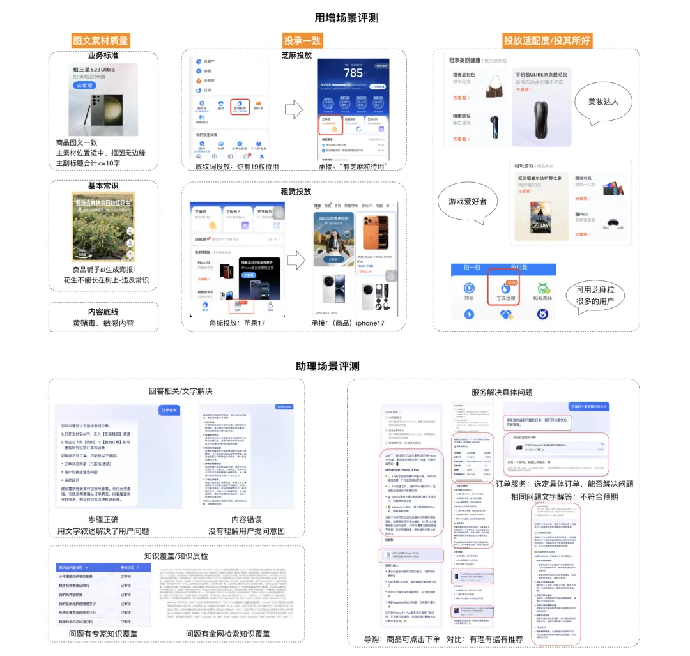

面对产品、技术链路和功能模块的快速迭代与持续新增，评测端有限的人力和资源已无法持续跟进十余个细分场景中某一两个环节的频繁升级，更不可能针对每一个指标的评分进行定向的方法开发与优化。当前我们正面临“一人应对数十项评测任务”的现实挑战，因此必须尽可能压缩人工在每个任务上的投入时间，通过更高效、更自动化的方式，以更少的人工干预快速获得评测结果，确保不拖慢每一个迭代的效率。

### 评测agent全链路提效

基于上述现状，我们今年就着手推进统一评测agent的建设，覆盖评测全链路各耗时环节的重点提效，包括评测集生成、标注、验收、badcase分析：

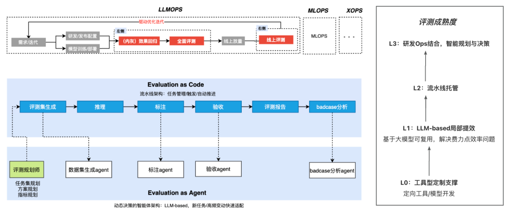

### 案例：功能展示

评测agent依托驯鹿平台开展功能，像一个真正的评测同学一样，学习标注文档和标注标准之后，就拥有做自动标注、验收、badcase分析的能力。同时，这个设计也统一了机审和人审（可以通过同一个文档培训评测agent，也培训标注小二），免去了业务一线同学很多沟通、传递信息的成本。

#### 新建评测agent能力：学习标准

在平台上可以通过“新增”评测agent创建一个新的评测标准。

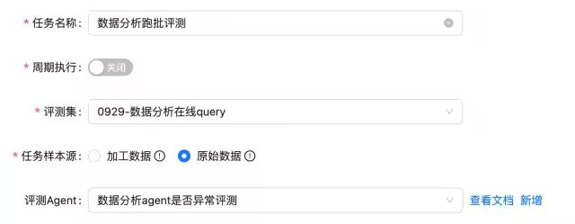

创建流程非常简单，只需要将完成本次评测任务应当学习的语雀文档（可以填N个）链接依次填入：

随后会进行学习，生成摘要，并自动生成打分prompt：

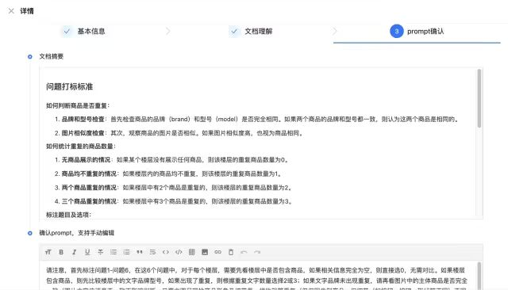

#### 样本学习

学习后，可以让评测agent针对当前任务进行试标打分，如果有错误，可以通过评价错误来让评测agent进一步自主学习。

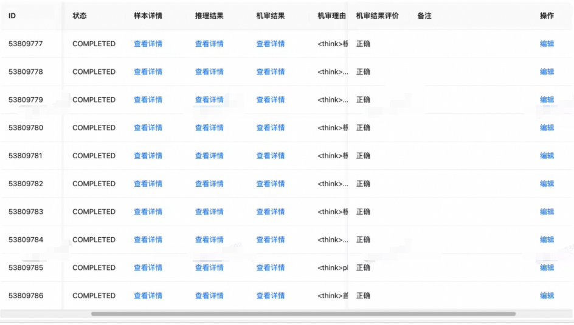

#### 自动打分

学习到满意后，就可以在评测任务上应用当前标注能力啦！

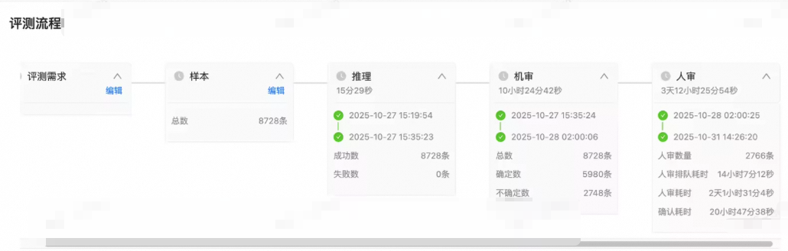

#### 人审预验收

人审验收过去也是评测流程中非常耗时耗精力的一个环节。而当前，对于配置了评测agent的任务，只要打开预验收，就可以在人审标注后自动获得一份预验收报告，根据报告内容进行review即可。

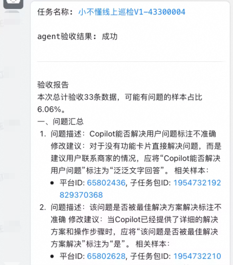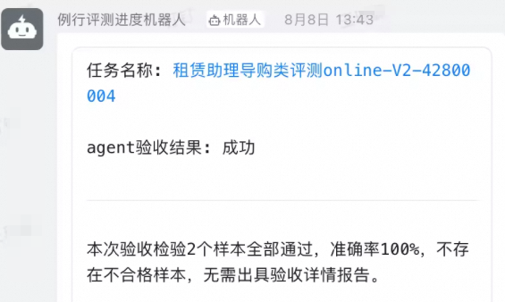

#### badcase分析

同上，评测流程完整结束后，可以触发badcase分析流程获取单条分析结果和整体分析报告。

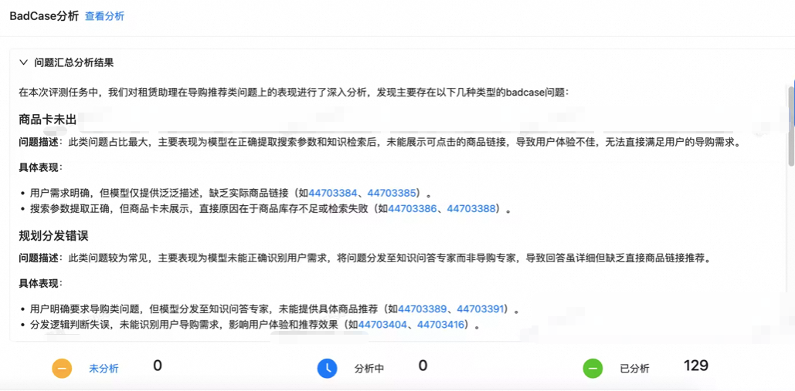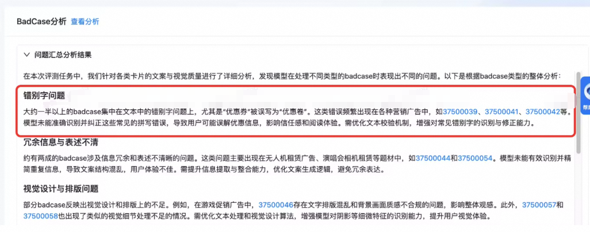

## 挑战与迭代方向

随着业务的快速增长，本年评测任务数与样本数飞速提升。而为了尽量保持标注人力成本不爆炸，需在准确率不降的情况下，持续迭代基础能力，提升机审覆盖率，才能维持评测效率和成本不降。在这种情况下，维持去年的80%自动化标注水位，是远远不能满足目标的。

而要进一步提升机审率，就要直面标注深水区的困难任务：背景更业务、标准更细、模态更复杂。

如何理解这几个难点，下面的几个例子，会有比较形象的展现：

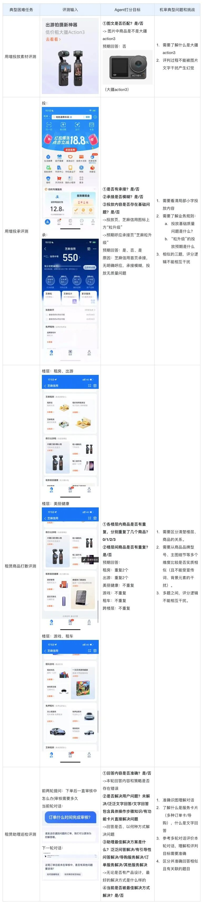

简言之，要对这些困难任务正确打分，就要在以下方向尽量优化和提升：

1.强化对各评测任务的业务背景与领域知识的理解能力；

2.抑制多模态输入在推理过程中的幻觉生成；

3.提升长程逻辑推理能力，保障多步推演过程中的逻辑一致性。

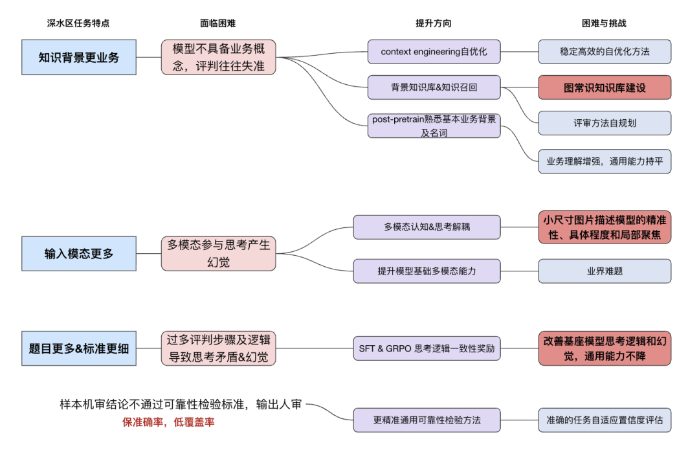

## 技术方案

### 评测agent架构

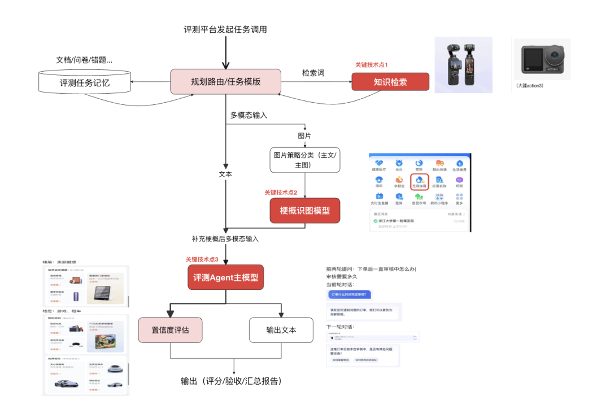

当前评测agent的主体架构如上：首先，发起调用后，路由到对应的任务模版。一方面从评测任务记忆中检索回文档、错题、问卷等上下文；同时在需要的情形下（非必须），生成检索词并召回相应的常识性知识，补充上下文。 接下来，输入中的图片/视频部分被单独拆分，经过图片描述策略分类（主文/主图）和梗概识图模型进行二次处理，并为原输入补充不同风格的图片梗概。经过上述一系列处理后，数据被送入评测Agent主模型，综合处理所有输入信息，最终输出生成文本和概率分数进行置信度评估，置信度评估的结果将用于修订评测agent的返回内容。

上述架构融合了基于业务语义与领域知识的上下文增强与知识召回机制、抑制多模态输入幻觉的图像梗概理解模块，以及基于置信度评估的人工复审样本筛选策略。该设计在一定程度上提升了评测Agent输出结果的可靠性，缓解了当前面临的关键问题，使得主模型本身的能力可以最大限度发挥作用。

### 识图-推理解耦

多模态大模型在复杂推理过程中普遍存在视觉幻觉问题，其核心机制在于：随着推理深度的增加，模型对原始视觉输入中浅层、细粒度感知信号的依赖逐渐衰减，导致生成内容偏离图像实际内容，即出现“推理越多，识图越差”的现象（More Thinking, Less Seeing）。

针对该问题，当前主流技术路径可分为三类：

1\. 解码阶段动态特征唤醒：在自回归生成过程中，通过设计动态校正机制，在解码每一步显式地重新激活或融合来自视觉编码器浅层的原始特征，以约束生成内容与图像证据的一致性，从而抑制幻觉。

2\. 训练目标引导的推理分解：在训练阶段引入结构化目标，强制模型先基于图像生成忠实的描述性中间表示，再基于该描述进行推理，从结果上进行奖励或惩罚。此类方法使模型在训练过程中前建立对视觉内容的准确语义锚点。

3\. 架构层面的多层级特征重注入：在模型主干架构中进行视觉特征的多重注入，在不同推理深度显式地将原始图像的多尺度视觉特征重新注入到语言生成模块中，维持视觉-语言对齐在整个推理链中的持续性，避免高层抽象过度主导而丢失底层感知依据。

这些方法都取得了不少成果，作为one-model控制幻觉的解决方案，给我们提供了更好更可用的多模态基座。不过，如果要在应用侧进一步抑制幻觉，提升推理效果，超过基座模型的固有水平，我们想到了一个非常简单低成本的方法：

评测agent的解决方案（简单、稳定、成本特别低）：做一个小尺寸模型单独识图，尽量避免思考评价，只做OCR级别的忠实描述，看完把文字识图梗概+图一起发给负责思考打分的主模型推理。

在小尺寸模型的选型上，我们使用7b~8b左右的vlm，经过简单的SFT，就可以实现理想的效果了。毕竟忠实复述任务不需要太强的推理能力，而生成时对多模态区域的注意力“塌陷”相较其他任务也是最轻微的。

对于这个描述模型，SFT的训练是必不可少的，一方面用来对齐输出格式，简化prompt长度和内容（在小尺寸模型上，过多的举例也会引入幻觉；而完全不举例，描述的方式、角度和内容可能会过于自由发挥，不符合要求）；另一方面，通过从擅长OCR文字复述和擅长精细图像细节描述的两类大尺寸模型中分别蒸馏其输出，融合各自优势，进一步增强了模型对视觉内容的忠实描述能力。

梗概识图模型经过多版迭代，效果也有了显著提升，例如：

这一识图-推理解耦的架构，可以使得基座模型的多模态幻觉抑制水平大大提升。我们在主模型仍然使用qwen-vl-2.5-72b基座微调的S1版本（且是awq量化版）下，仅仅通过加入上述架构优化，就在hallusion-bench（多模态幻觉的经典公共评测集）上轻松取得一流水平的高分：

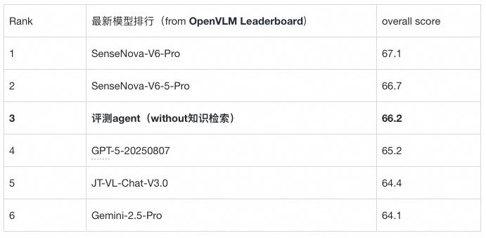

而根据qwen-vl 2.5 technical report，全参qwen-vl-2.5-72b基座在hallusion-bench上仅取得55.2分。这样一个trick方法甚至可以将原基座相关能力原地提升10个点，非常简易有效。而且由于梗概模型尺寸小、速度快、部署代价低、吞吐量更高，对于整体打分的耗时损失也处在可以接受的水平。

另外，我们在使用时，通过一个基于传统ConvNeXt-Tiny的图片策略分类模型，预先对图片进行描述策略的选择，使得90%都是文字的图片与90%都是图像元素的图片，以及根据单批次输入下的图文组合数量、模式，可以有不同的描述策略和整合策略，更加突出重点，节省资源。

### 主模型reasoning增强

为了在业务评测打分的推理模式下，我们对主模型进行了专项优化，以强化其多步推理与长程推理能力，并提升对长上下文任务的适配性。优化后的模型在 zero-shot 及 prompt 提供少量示例的 few-shot 场景下，能够更稳定、精准地执行推理与评分。

### 基座模型切换评估

如上文所述，我们在S1的时候，是在qwen2.5-vl-72b的基础上进行主模型优化，不过qwen2.5有其固有的缺陷，因此在10月qwen3-vl陆续发布后，我们就开始基座切换的评估。

根据官方技术报告，Qwen3 在多模态类任务上的整体表现普遍优于前代模型，而在纯文本类任务上则各有优势。为验证其实际潜力，我们开展了一轮简单的自测，从多个维度评估其综合能力：

1.回答准确率（涵盖常识、数学、逻辑推理、业务理解、图像识别与评分等任务）从 Qwen2.5 的 70.14% 提升至 Qwen3 的 74.86%；

2.但同时，指令格式遵循率却出现明显下降，从 Qwen2.5 的 100% 降至 Qwen3 的 51.49%。

其实qwen3-vl是一个优点和缺点都非常突出的模型。优点在于模型架构的改变（和前文“识图-推理解耦”一章的讨论类似，qwen3-vl就采取了多层融合图像信号的方式来减缓多模态幻觉），使得多模态能力相较qwen2.5时代有非常切实而显著的提升。但缺点也很显著：一个是上面验证的，指令格式遵循能力的下降（简言之，用户prompt里写一种要求的格式、字段、限制输出值等要求，但输出总有违反要求的地方）；另一个是长输出、长思考情形下，复读的风险大大增加（当然推理阶段可以通过改参数来抑制，但也会增加输出的不确定性，不适合打分）。

如果在大尺寸的dense模型，如32b上还不那么显著的话，当对模型进行量化（例如awq），或试验同系列稍小尺寸的模型或moe模型（例如30b-a3b、8b），这两项能力便会显著退化。qwen3-vl模型性能对改动极为敏感——轻微的压缩或调整即可导致这两项关键能力急剧下降，呈现出明显的“脆性”：稍有扰动，原本稳定的输出便迅速崩塌，格式错乱、内容失准等问题频发。这两项缺陷，使得它的文本能力、推理能力显得“不太扎实”，需要进一步的训练，使得一些特定的思考模式和场景方向下表现可以更加稳定。

（还有一个有趣的讨论：即使通过架构升级，在onemodel上尽量控制了幻觉，但是qwen3vl到底有没有解决多模态识图在逻辑思考中的幻觉问题呢？可以看下面的例子）

图片| qwen3的识图结果
---|---
| 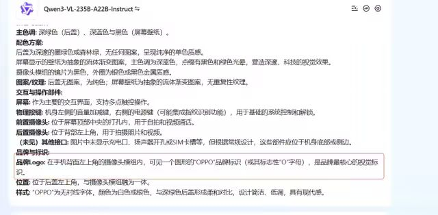

因此，基于上述分析，我们制定了以下决策：

1.梗概识图模型基座切换至Qwen3-VL-8B-Instruct并微调。

2.主模型选型：尽管 Qwen3 综合能力强，但因格式遵循问题和长输出复读问题，需经过针对性训练后方可作为主模型上线使用。

为此，我们试了一下任务维度的小样本sft，专门观测一下格式遵循率的回升情况。结果显示，至少在我们评测的几种任务下，调后格式遵循率可以显著提升，回到了100%的水平。也就说明这一缺陷在特定场景上有可能通过恰当的微调来缓解。

### 多阶段训练方案

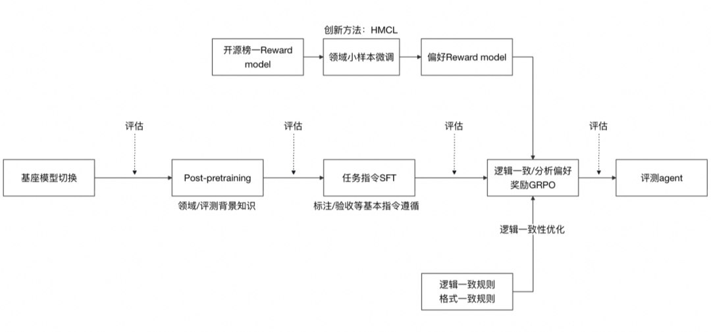

我们在训练过程中，结合边训边评，大体进行了3个阶段的训练：

1.post-pretraining：通用能力维持稳定的同时，具备基本的芝麻（用增、商家、回收、租赁等）领域内名词、背景知识、产品概念、专家评测范例（评测在做什么，评测方案怎么设计，好的评测报告怎么写）的认知。做这个阶段的训练也是到了sft+grpo后，在领域内问答类的检测上，唯一不那么掉点的方法。

2.SFT：主要进行指令对齐，在通用的指令遵循能力不下降的情况下，可以学习比较好的范式，进一步提升特定任务上的指令遵循能力。

3.GRPO：通过充分提升模型的长程思考和逐步思考能力。这个阶段的训练中，我们视当前阶段的主要问题和不同情况分别用了GSPO、DAPO等改进版训练方法，因为这些方法都属于GRPO的变种，因此统一归为GRPO阶段。

### Post-pretraining

在post-pretraining阶段，我们参照一些技术报告，大体遵循域内：域外约1:9，中文、英文、代码混合配比的原则，尝试了如下训练方案：

V1| V2
---|---
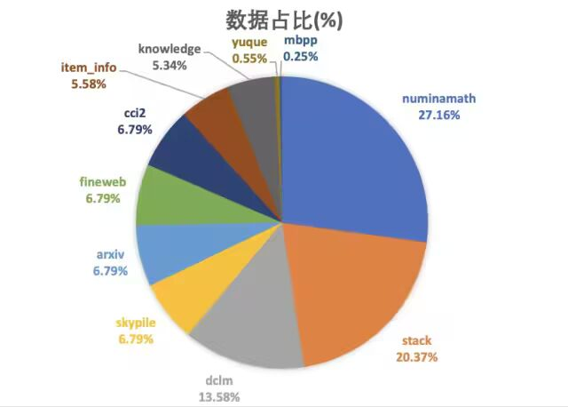| 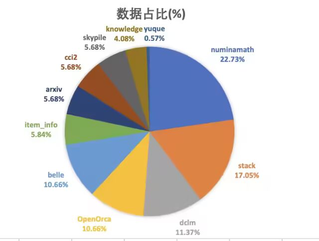
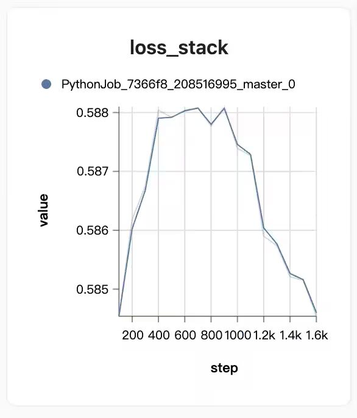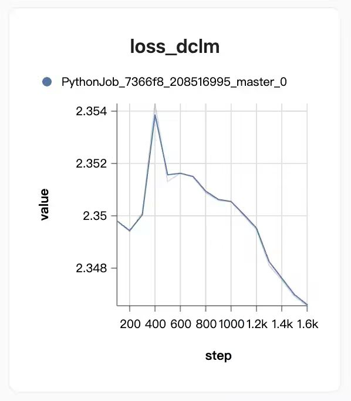*部分通用域channel loss有反抽。| 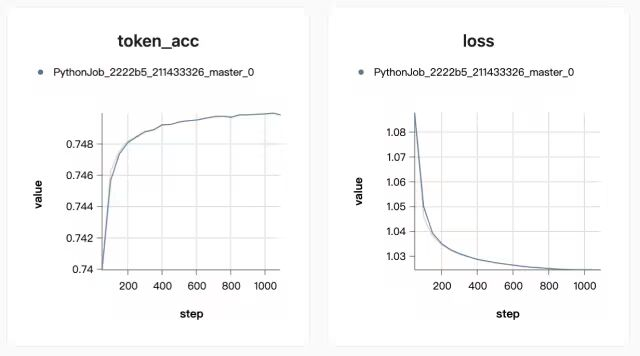*所有channel的eval-loss都平滑下降
通用指令对齐后效果：综合回答准确率：74.86%->59.36%| 通用指令对齐后效果：综合回答准确率：74.86%->77.21%

这段训练之后，模型会变回一个续写模型，可以用续写的内容来评估模型的能力掌握情况（特别是你希望模型掌握的那部分特定知识上）。此时经过简单对齐后，就可以将指令对齐恢复到比较好的水平（长推理仍然不够，不过可以放一放）。恢复指令对齐的数据集，我们大体采用ms-bench（魔搭通用sft数据集，很好用）+eqa-bench（多模态问答数据集）+deepseek-r1蒸馏数据集（deepseek-r1蒸馏带思考数据集），总体混合了5w数据，即可训回模型的指令对齐能力。

### SFT+GRPO课程学习

上面的方案图中，看似GSPO是SFT的后续阶段，但在实际落地中，其实跑了不止一段sft，也跑了不止一段gspo，在这段训练里，为了使模型在各类评测任务上，能够拥有更好的（思考更充分、合理、stepbystep、不互相干扰）的思考能力，我们借鉴了课程学习的思想，由简单至困难逐步训练，并根据实际情况，为每个阶段配备不同的数据集和策略。

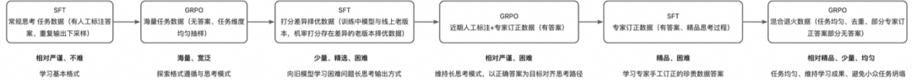

相较于前期的训练，在SFT+GRPO训练中，我们需要持续解决两个问题：

1.数据（尤其是标注数据）从哪里来；

2.如何适当地奖励模型。

#### 数据

在整个评测agent的训练过程中，我们本着节约成本的原则，并没有花费任何新增的人工标注成本，而是从历史数据中进行清洗。我们将训练数据分为三类：

（a）线上采集，有旧版本的输出作为基线，正确性未知。但是仅有这一部分数据覆盖了所有类型的任务，数据非常丰富。

（b）过去机审不确定给人审标注的数据，有人审标注结果作为标签。但人审标注是不是100%对的？是不是一定可以信任？从真实case来看，不一定，所以这部分的精品度低于c，也不必全量学习。

（c）专家手动订正数据，最珍贵的一部分，数量也非常少（百条）。来源是负责具体评测任务的同学，发现机审部分case标的不对，进行了手工订正，以便给业务快速交付正确结果。为了便于持续迭代，这类样本我们在平台打了标记，凡手工订正过的样本均有标签，可以作为错题集被快速收集起来。

上述数据中对于b和c，显然仅有答案，没有思考步骤，如果用sft的方式直接训练，这对于模型的学习显然是不合适的，因此我们用大模型参考正确答案补写思考过程，有些补的比较中规中矩（例如第一阶段的数据），仅仅作为格式填充的作用；一部分则进行精心补充（最后一阶段的sft），从思考过程的翔实性、步骤性、幻觉性上进行充分规范，并后置校验以保证正确性。

而对于我们可收集的99%的数据，都没有正确性比较确定的标答作为label，那么此时要如何训练模型，如何让模型充分而正确地利用这些数据。因此来到了我们的奖励阶段。

#### 奖励

（a）格式奖励：这一部分主要包含了可以代码化规则化的输出评分。从每种输出基础的格式要求（字数要求、json格式要求、xml闭合要求等等），到深入每个具体任务prompt的潜在性格式要求（key-value取值范围、必答选答、题目间输出值的内在逻辑关系、xml标签中的id合法性等等），能够规则化的部分都尽可能做了拆解和逐点打分，构成格式奖励函数。

（b）逻辑奖励：这一部分主要是开放性打分，用于在没有ground truth的情况下，评价输出的内在逻辑性（包含题目-思考过程的逻辑一致性、思考过程内部的逻辑一致性/翔实性与重复性、思考过程到输出结果的逻辑一致性，根据不同的任务类型细节上会有一定差异），从而间接奖励正确的思考和正确的回答。（即使有ground truth的情况下，仍然加上这一部分逻辑奖励，使得reward打分更加平滑，有助于将探索逐步引导到正确方向，避免同组内奖励趋同）这部分我们采用14b模型进行逐点打分。

（c）ground-truth奖励：仅用于标注类任务，直接解析打分结果，与标准答案进行key-value匹配，逐项打分。

（d）RM偏好奖励：仅用于分析类的完全开放性任务。这类任务只要满足基本的逻辑无幻觉，怎么分析都是正确的。但是就专家经验来说，分析的好不好对于可用性而言至关重要。这一部分的标准难以概括和描述，因此我们采取了通过少量专家数据微调，构建能够提供连续性分数的RM。由于这部分可利用的专家数据输入基数极少，采集和整理合成代价也比较大，所以在小样本微调的过程中，我们采取了HMCL的对比学习方法，使用恰当的框架进行3-level的对比学习，从而在小样本上取得更平滑细致的分数分布。详情可见我们发表的工作，不详述：

https://aclanthology.org/2025.findings-emnlp.727.pdf

不过这类高开放性的任务要做好偏好对齐仍然非常困难，今年做的比较浅，我们也在持续探索当中。

（e）其他奖励：一些重要的常规奖励函数，包括重复惩罚和soft-overlong惩罚。这两个函数都是抑制长推理复读的利器。

在最后一轮 SFT+GRPO 之前，当前评测的模型在长程推理能力上已经明显超过原始模型。这种提升不仅体现在领域内的评分任务上，在未经过训练的通用长推理数据集上也有小幅改善。不过，我们不仅要关注当前表现，还要兼顾长期稳定性与在多任务、未知任务上的泛化表现。为此，我们在最后阶段进行了“退火训练”，维持已有的学习成果并防止性能过拟合到特定任务。

一阶段的format、logic和repetition
---
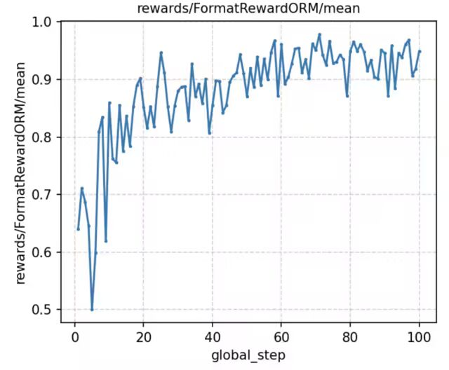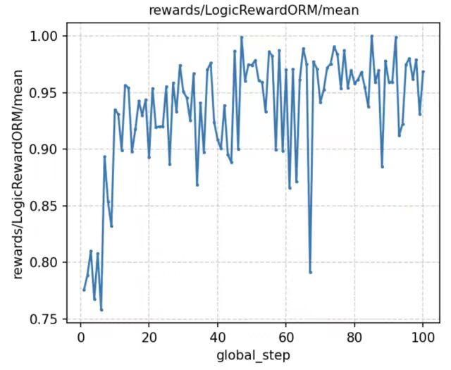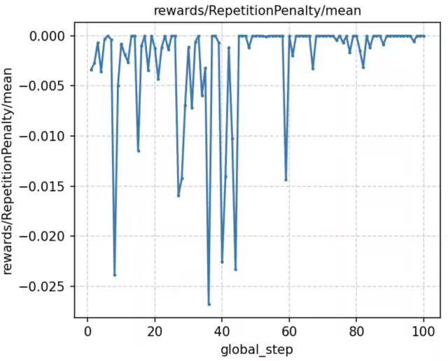
三阶段的reward总分、logic、correct
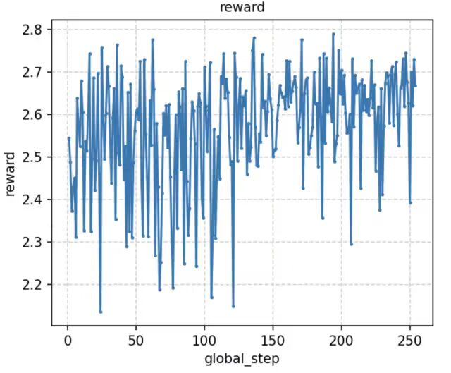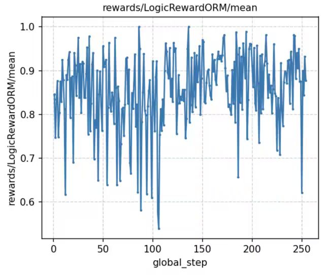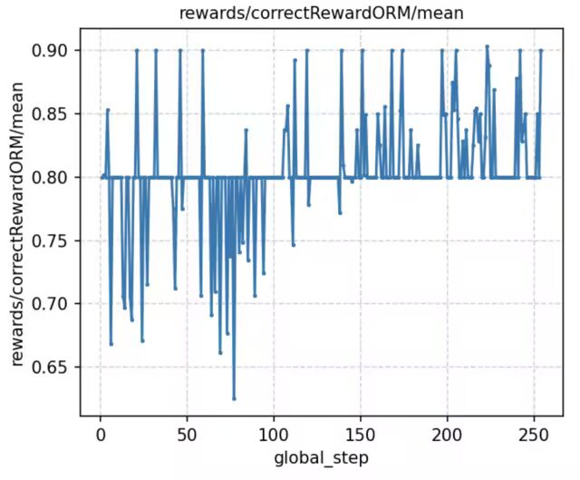

#### 评估

其实在多阶段后训练中，sft的eval-loss/acc、grpo的train/eval-reward等指标，已经很难再能客观全面反映模型能力的升降，评价训练效果了。因此如何评估并观测每个checkpoint的收益，决定是否需要下一步训练，下一步训练的目标和重点，以及是否本次训练存在问题需要回滚，成为了整个训练流程的重中之重。

我们重点设计了3个数据集，进行综合评估：

1.综合能力：有ground-truth，包含通用问答、简单数学（GSM8K水平，在业务评测场景下已经够用了）、语言逻辑、简单代码设计（mbpp水平）、长推理逻辑问题（logiquest）、域内简单问答、数据来自于各来源公共数据集抽样，重点选择了对评测推理有帮助或隐含帮助的维度。训练的目标是，综合能力尽量维持稳定，不需提点，也不能明显下降。这里除了整体指标外，着重观测当前模型在长推理逻辑问题类型下的表现，如果有明显掉点，就可能是训练过程需要优化，应当抛弃这个checkpoint。

2.评分准确性：均匀采样了各任务上人审标注的部分样本，以人审结果为ground-truth，仅计算评分最终结果json部分的key-value准确性。训练的目标是，这一评测集上能够尽量提升准确率。

3.一致性回归：线上所有任务+调用类型均匀抽取（量级一万左右），以线上模型答案为对比基线。在模型训练接近尾声，综合能力和评分准确性都比较理想之后，我们用当前模型重跑一遍回归集，并和线上模型的回答作对比。通过这个回归验证，可以快速定位出哪些任务下新旧模型行为差异明显，评判差异是否正向/继续训练优化/小修对应任务的prompt以适配新模型。

### 量化or不量化

由于资源有限，且质量团队的宗旨是花更少的钱办更多的事，因此我们的目标是让主模型支持40000+token的上下文及更高的并发，为了达成这一目的，我们最好将dense模型稍作压缩。

尝试下来，无论如何调整校准数据集，量化后模型在测困难任务的时候，效果都会有必然且明显的下降，打分一致率甚至下降15%左右。

面对这一现状，我们尝试了2种方法：

1.修改标准recipe，进一步减少量化参数量，例如self-attention部分全部忽略。这一措施可以起到比较明显的效果，但是到了部署阶段，当前vllm框架对部分量化的混合精度模型支持有限。因此如果最终要上vllm部署，recipe的调整也不能随心所欲，只能在vllm支持的极有限范围内进行修改。所以这一改动变得聊胜于无。

2.压缩上下文，部署全参模型。

最终出于成本、效果和上下文的平衡，回归到了方案2上，支持上下文32768左右（优先尊重效果）。为了配合这一改动，需要调整优化上下文自学习阶段、图像描述阶段的策略，尽量控制好上下文长度。

最终部署上线的版本，域内困难样本打分准确率比原基座提升一倍，也可以在多模态困难推理Zero-bench任务上维持住相对较高的水位。

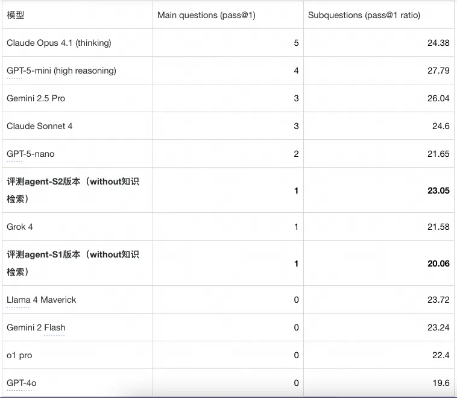

## 业务效果

用一张图来形象地展现我们各个模块、架构迭代的效果：

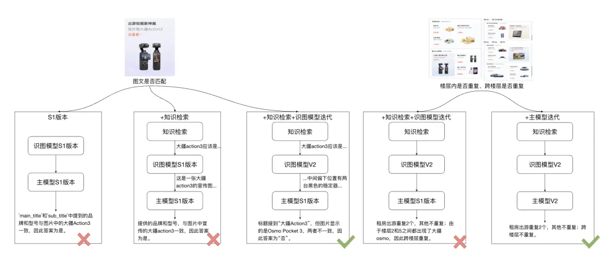

而基于上述迭代，我们在今年S1-S2业务快速增长，评测任务数、样本量、多样性都极速上升的背景下，机审率持续提升，维持人审样本量在一个比较稳定的水位。每月机审样本达百万级，机审覆盖率突破97%，年度节省千万级标注成本。

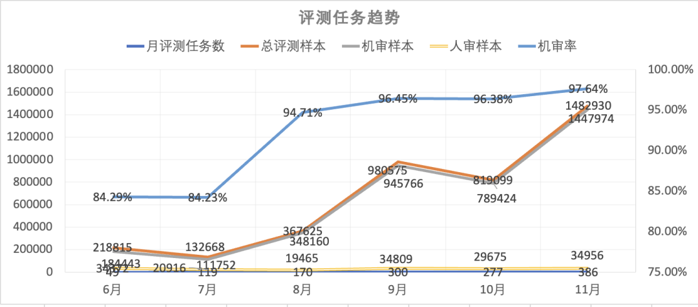
