# 自建一个 Agent 很难吗？一语道破，万语难明

> **公众号**: 阿里云开发者  
> **发布时间**: 2026-01-29 08:30  

最近花了一周左右的时间给内部的一个传统研发平台接入了 Agent 开发的能力，很多同学对 Agent 的底层实现非常感兴趣，所以此篇给大家介绍下我是怎么做的，希望能对想自建 Agent 的同学有所启发。

> 因人力原因，有些细节方案问题没太做深度评测，而是直接选择业界实践较多的成熟方案。主要参考思路和上下文管理的过程。
>
>
>
>
> 文中用到了一些内部平台的基础能力，比如 rag、代码管理、deepwiki等，外部开发者如需使用需要自行寻找替代品。

## 背景简介

奥德赛研发平台是 ICBU 买家技术的 TQL（淘宝基于开源 GraphQL 的定制版本） 研发平台，大量开发者会在上面通过编写 TQL 脚本来实现 BFF 接口。

近一年 AI Coding 工具层出不穷，在深度使用了 cursor、claude code 等顶尖产品后，大量解放了自己在前端的生产力，所以就在想让团队的后端兄弟（还有姐妹）们也吃好点，告别纯手搓代码，这不，BFF 的 Agent 模式（小 D 同学）来了～

已关注

__

关注

__ 重播 __ 分享 __ 赞

关闭 __

**观看更多**

更多 __

__

__

__

_退出全屏_

[ __](<javascript:;>)

_切换到竖屏全屏_ _退出全屏_

阿里云开发者已关注

[ __](<javascript:;>)

分享视频

 __，时长 01:35

0/0

00:00/01:35

切换到横屏模式

继续播放

进度条，百分之0

 __

[播放](<javascript:;>)

00:00

/

01:35

01:35

[倍速](<javascript:;>)

 _全屏_

 __倍速播放中

[ 0.5倍 ](<javascript:;>)[ 0.75倍 ](<javascript:;>)[ 1.0倍 ](<javascript:;>)[ 1.5倍 ](<javascript:;>)[ 2.0倍 ](<javascript:;>)

[ 超清 ](<javascript:;>)[ 流畅 ](<javascript:;>)

您的浏览器不支持 video 标签

__

继续观看

自建一个 Agent 很难吗？一语道破，万语难明

观看更多 __

转载

,

自建一个 Agent 很难吗？一语道破，万语难明

 __

阿里云开发者 已关注

分享点赞在看

 ____已同步到看一看[写下你的评论](<javascript:;>)

 __

[ 视频详情 ](<javascript:;>)

## 技术选型

原来的平台长这样，开发者在上面可以完成编码、调试、发布等工作：

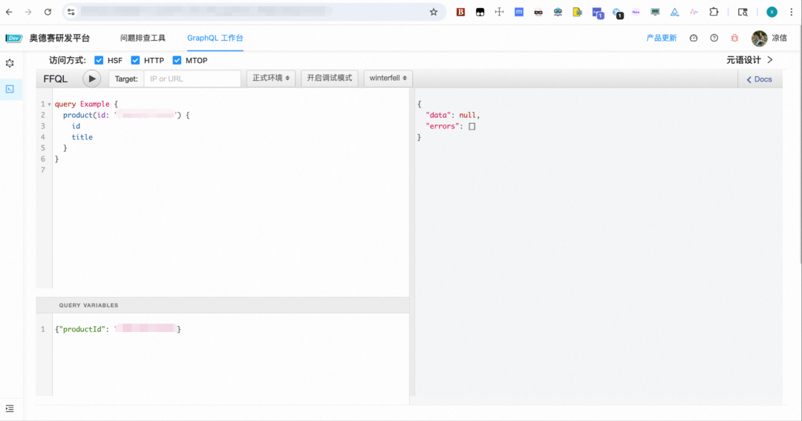

要在现有的平台内集成一个 Agent ，且能感知前台页面的环境，甚至对页面进行操作，一般有三种方式（默认都采用 AI 辅助 Coding）：

> 如果只是一般的对话 Agent，直接用一些开放的应用平台搭建就完事了，不必自己写。

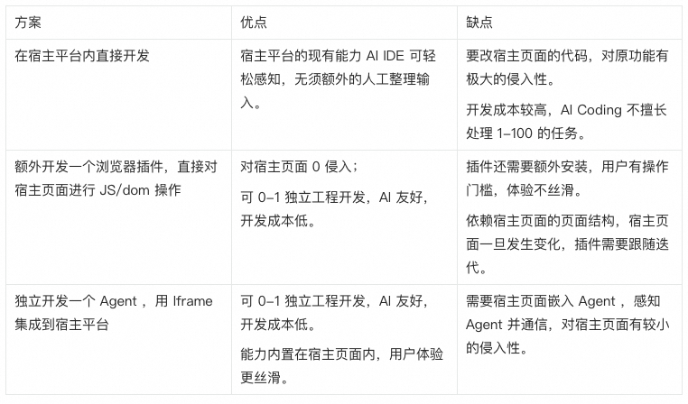

综合考量了三种方案后，我们决定优先保证用户体验&开发效率，选择了第三种。

### 宿主页面 Iframe 嵌入 Agent

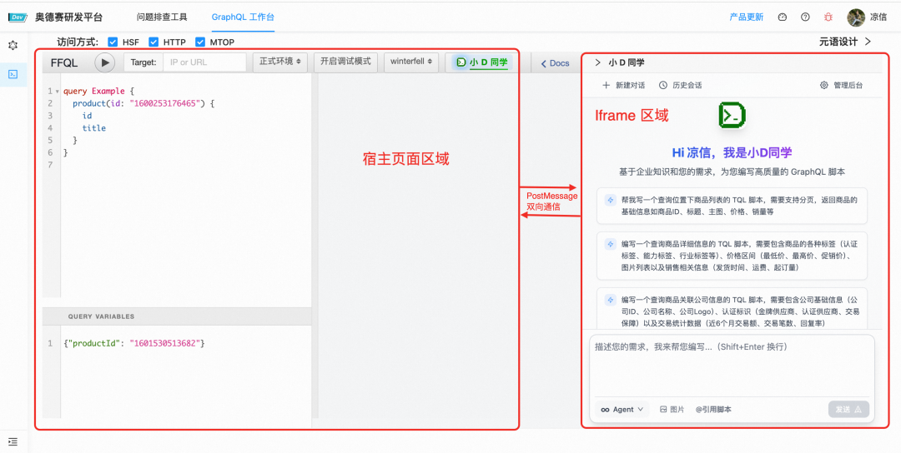

整体的数据流转概要：

1\. 宿主页面暴露 脚本内容、请求参数、调试结果 等上下文信息，以及脚本执行、脚本 Diff 预览等操作页面的工具接口给 Agent。2\. Agent 感知宿主页面上下文环境，然后请求服务，并推送内容编辑、脚本执行等工具执行 action 给宿主页面。

流程概要图如下：

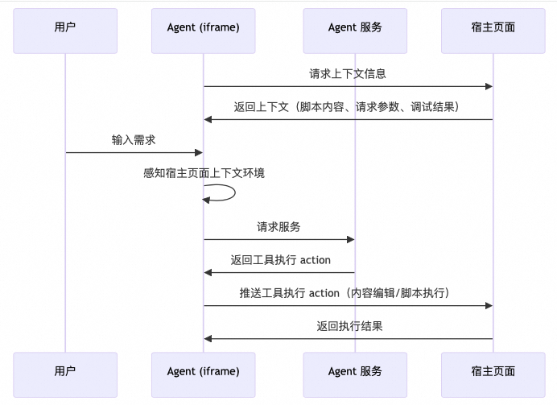

### 应用框架选择

应用框架选择上不做过多对比，直接给出我的选择，不一定最好，但是一定很契合我当前的场景。

#### 集团 Faas 基建

简介：FaaS（Function as a Service，函数即服务）平台是一个面向研发人员的全托管、事件驱动、弹性伸缩的 Serverless 计算基础设施，其核心目标是让开发者**只关注业务逻辑代码** 本身，无需操心服务器运维、资源扩缩容、中间件对接等底层细节。

划重点，Faas 可以让你只关注代码，免运维。这正是当前这种轻量 Agent 需要的。

#### Next.js + React

前后端应用框架我选择了 `Next.js + React`，为什么？

1\. 集团有前后端一体化的框架可以直接用。2\. 前后端共用一套开发语言（Nodejs、JavaScript），并集成在一个应用中，AI Coding 非常友好，谁用谁知道。可以真正做到只关注功能，AI 帮你做实现。

#### LangGraph

LangChain [1]团队在 WorkFlow/Agent 领域摸爬滚打了几年，高度抽象了 Agent 的开发模式。

LangGraph 其巧妙设计让你可轻松构建一个状态图，你可以只关注 系统提示词、工具节点（通常是 mcp）就可轻松实现一个会自主决策的 Agent。手残党友好。

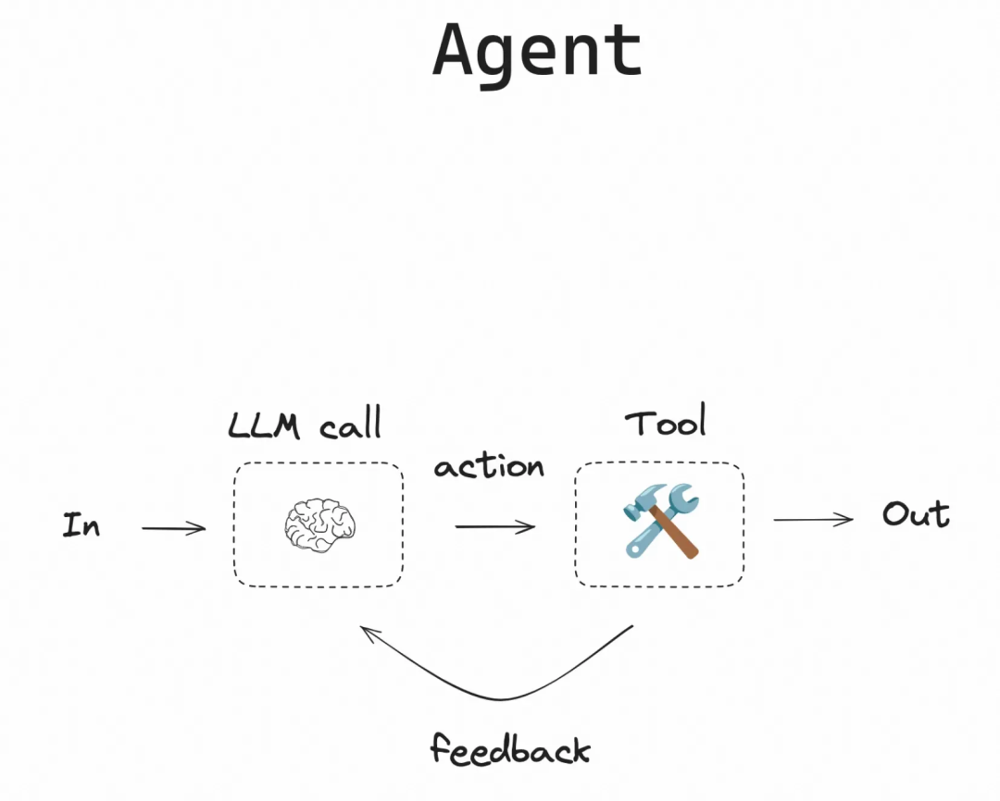

## 方案落地

### 应用框架初始化

如上文所述，结合当前场景，把 LangGraph 抽象出来的状态图展开，替换成自己的工具，就得到这样一个图和伪代码：

> 此处了解个大概就可以了，稍后会详解工具

BFF Agent 状态图：

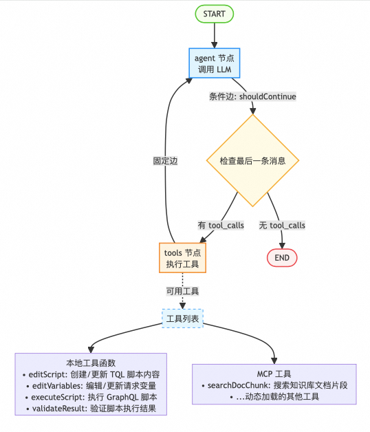

伪代码：

  *   *   *   *   *   *   *   *   *   *   *   *   *   *   *   *   *   *   *   *   *   *   *   *   *   *   *   *   *   *   *   *   *   *   *   *   *   *   *   *   *   *   *   *   *   *   *   *

    import { StateGraph, END, START } from '@langchain/langgraph';
    // 创建状态图const agentGraph = new StateGraph({  channels: {    messages: {      reducer: (prev, next) => [...prev, ...next],      default: () => [],    },  },});
    // 添加节点agentGraph.addNode('agent', async (state) => {  const response = await model.invoke(state.messages);  return { messages: [response] };});
    agentGraph.addNode('tools', async (state) => {  const lastMsg = state.messages[state.messages.length - 1] as AIMessage;  const toolMessages = [];  for (const toolCall of lastMsg.tool_calls || []) {    const result = await tools      .find((t) => t.name === toolCall.name)      .invoke(toolCall.args);    toolMessages.push(      new ToolMessage({ content: result, tool_call_id: toolCall.id }),    );  }  return { messages: toolMessages };});
    // 设置边agentGraph.addEdge(START, 'agent');agentGraph.addEdge('tools', 'agent');
    // 条件边：根据是否有 tool_calls 决定路由agentGraph.addConditionalEdges(  'agent',  (state) => {    const lastMsg = state.messages[state.messages.length - 1] as AIMessage;    return lastMsg.tool_calls?.length > 0 ? 'tools' : END;  },  { tools: 'tools', [END]: END },);
    // 编译图const graph = agentGraph.compile();

参考 LangGraph 的官方文档的介绍，用 Cursor 可以轻松实现上述一个基础的有向、有环状态图，至此，BFF Agent 服务的基础骨架就好了。模型选择上，由于需要生码，我还是直接使用了 Claude （Claude-4.5-haiku）的模型。

**那么接下来的重点就是从能用到好用，后续的内容非常关键。也就是上下文工程的优化，接下来的优化是不分顺序的，因为上下文工程是一个综合命题，比如你往往需要在系统提示词优化完成后，发现某些工具调用不符合预期，又回过头来优化系统提示词。不同类型的上下文往往是交叉影响的，要根据具体场景做甄别。**

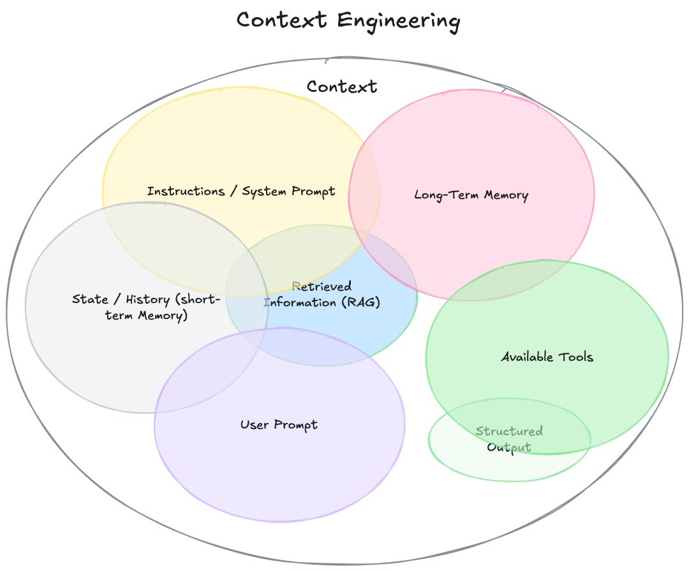

### 系统提示词优化

> Anthropic 官方推荐了提示词优化[2]的诸多技巧，非常有效！下面介绍我高频用到的几个基础技巧，更多技巧真的强烈建议直接学习原文。

1\. 角色设定

角色设定可以显著提高模型的性能（参考Qwen 的 MOE 机制），并改进模型的注意力，发现更多的关键问题。

2\. 使用 XML

Anthropic 官方推荐使用 XML 构建提示词[3]，有诸多好处，实测非常有效。遇到模型不遵循指令，或上下文过长，出现遗忘/幻觉时，试试更换提示词格式为 XML。

3\. 使用示例

也就是 few-shot ，给少量准确的示例，尤其对输出内容改善上有重大帮助。还有，一篇 research [4]有介绍，尽量直接给**模型正例而不是反例** ，保护模型的注意力。（比如我告诉你不要去想一会要吃什么，你反而会刻意去想如何不要去想这件事情，就浪费了你的注意力）

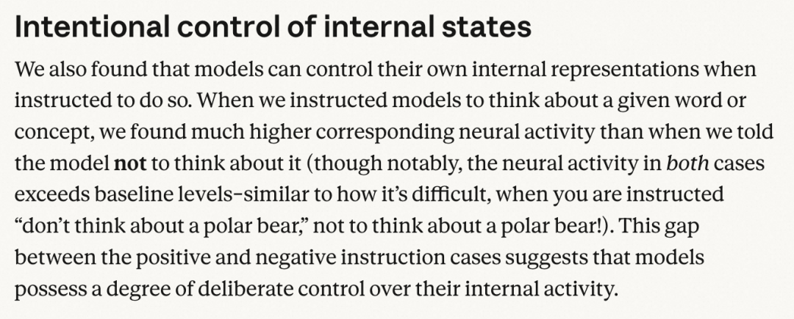

上述三个技巧是非常简单且行之有效的方法，全程指导了我去优化提示词，来看具体怎么用的 👇

#### 角色设定 & 使用 XML

淘宝的 TQL 本质上是一种 GraphQL 的方言，ICBU 还又在 TQL 的基础上做了定制，大模型是不可能会写的：

> 模型不了解私域知识这个问题，在自建 Agent 的时候往往是一个共性问题，所以才需要大量的提示词 & 工具 & 知识库。强如 Claude ，公司自己的 Qwen ，都不知道 TQL 的含义。

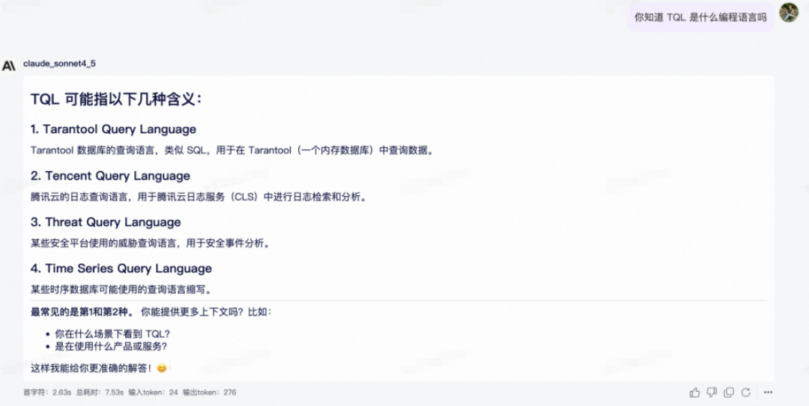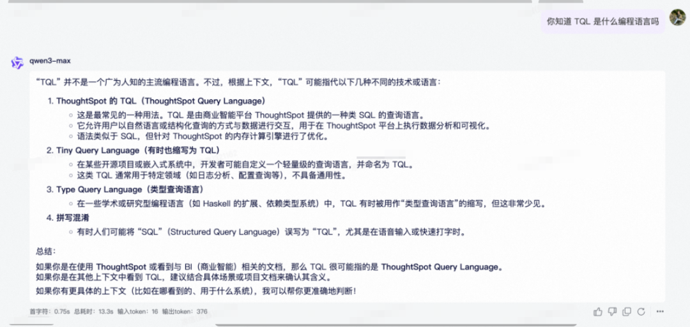

好在，模型不用从 0 开始，它会写 GraphQL，那么只需要阐述清楚二者的区别。不只是提示词，后续的知识库也是尽力在给模型解释私域知识。小 D 的提示词摘要：

  *   *   *   *   *   *   *

    <role>你是小 D 同学，一个专业的 TQL 脚本编写助手，TQL 是淘宝基于 GraphQL 扩展的查询语言，你只会写 TQL 语法，不会任何其它脚本。你的任务是帮助用户基于企业知识和用户输入，编写高质量的 TQL 脚本。</role><instructions>  <instruction>你非常欠缺 TQL 知识，但好在系统内置了很多工具，你可以充分使用这些工具来辅助你完成任务。</instruction>  <instruction>系统在开源 GraphQL 的基础上，扩展了很多自定义的指令，如果你遇到不确定或无法实现的需求，可充分用工具查询相关知识</instruction>  <instruction>回答要专业、友好、有条理。使用 Markdown 格式输出。</instruction>  <instruction>在编写 TQL 脚本时，要确保语法正确、查询结构清晰、字段选择合理。</instruction></instructions>

  * 角色设定上，让模型更多关注 GraphQL 方向的知识，并且申明 TQL 和 GraphQL 是有区别的，让模型谨慎操作。
  * instructions（命令）上，第一条命令比较有意思，在没有这条命令之前，模型会过于自信（即便已经是最严谨状态 temperature=0），拿到用户需求后，直接开始上手写 GraphQL ，出现了与 TQL 非常不相符的代码。用第一条指令弱化了模型的信心，模型才开始谨慎地调用知识库了解更多上下文信息。

TQL 在 GraphQL 的扩展内容部分，为了防止提示词内容爆炸，我做了一轮精简，只保留基础介绍部分（索引知识），放在提示词中，并引导模型在使用到具体能力的时候，**动态通过工具查询具体知识** ，从而保护了模型的注意力。

自定义指令：

  *   *   *   *   *   *   *   *   *   *   *   *   *   *   *   *

    <directives>    非常重要！系统有大量的扩展指令，具体用法需要通过工具查询相关知识，    在使用这些指令时，一定要先学习指令的用法，不要盲目使用。
        指令一般紧挨着字段或函数， fieldA @指令名 或 funcA(xx) @指令名 这样使用。        以下是常用指令（格式: "指令名":"描述|参数"）:                                                                <![CDATA[{      "转换类":{"unwrap":"解包/对象拍平/对象解构","toBool":"转布尔|not","encode":"编码|protocol=http","wrap":"包装","toInt":"转整数|offset","toUpperCase":"转大写","decode":"解码|protocol=http","autoflat":"自动扁平化"},      "字符串操作":{"suffix":"添加后缀|value","prefix":"添加前缀|value"},      "条件过滤":{"hide":"隐藏字段","filterBy":"表达式过滤|spel,aviator","include":"条件包含|if!","skip":"条件跳过|if!","default":"默认值|value"},      "列表操作":{"index":"取元素|offset","ascBy":"升序|path"},      "逻辑脚本":{"mapping":"映射|func","const":"常量|value,beforeExecute=false"},      "高级扩展":{"medusa":"Medusa服务|url,language","diamond":"Diamond服务|url"}    }]]>  </directives>

全局函数：

  *   *   *   *   *   *   *   *   *   *   *   *   *   *   *   *   *   *   *   *   *   *   *   *   *   *   *   *   *   *   *   *   *   *   *   *   *   *   *   *   *   *   *   *   *   *   *

    <TQLFunctions name="系统内置的全局函数">    <description>以下是 TQL 脚本中可直接使用的内置函数，详细用法请通过知识库查询。</description>    <![CDATA[    【字符串处理】    - QL_concat: 拼接三个字符串（a, b, c参数）    - QL_string_replace: 字符串替换（replaceText, searchString, replaceString）    - QL_stringToList: 字符串按分隔符转列表（data, delimiter）    - QL_stringToJSON: 字符串转JSON对象    - QL_jsonStringify: JSON对象转字符串    - QL_joinStringByPath: 通过JSON Path提取属性并拼接（object, path, delimiter）    - QL_urlDecode: URL解码    - QL_addHttpsSchema: 自动添加或转换为https协议头    - QL_addUrlParam: 给URL添加参数（url, param）
        【数值计算】    - QL_sumLong: 两数相加（addition1, addition2）    - QL_subtraction: 两数相减（minuend, subtrahend）    - QL_divideInt: 整数除法向下取整（dividend, divisor）    - QL_random_int: 生成指定范围随机整数（min, max）
        【条件判断】    - QL_if: 三元条件判断（condition, output, orElse）    - QL_conditional: 复杂条件表达式，支持#env.get()获取变量（exp, params）    - QL_defaultIfBlank: 空值时返回默认值（str, defaultValue）    - QL_timestampComparator: 判断当前时间是否在指定时间戳范围内
        【AB测试】    - QL_abTest: AB实验分流，返回命中的实验桶标识（experiment）    - QL_batchAbTest: 批量执行多个AB实验
        【数据处理】    - IDs_fromString: 从字符串解析ID对象，支持商品/类目/供应商/公司/国家（ids）【重要】    - QL_mergeList: 合并两个列表（aim主列表, tail尾部项）    - QL_subList: 截取列表子集（base, from, to）
        【国际化】    - QL_medusa: 美杜莎翻译，获取国际化文案（key）【所有文案必须使用】    - QL_countryFlag: 获取国家国旗链接（country）
        【数据脱敏】    - QL_desensitization: 数字脱敏，末位补0（value）
        【输出与重命名】    - TQL_output: 输出固定对象，包括布尔值、数字、数组、对象（object）    - 字段重命名: 使用GraphQL别名 或 @hide指令隐藏原字段    ]]>  </TQLFunctions>

#### 使用示例

至于示例部分，虽然上面讲到了要给模型一些正例，但我非常不建议一上来就瞎给模型一堆示例，先让模型发挥，在后续调试过程中，对模型容易出错的部分，直接给出正确引导。

比如我一开始遇到模型总是将请求参数硬编码在脚本中，没有抽离成查询参数，我就给了这样的示例：

  *   *   *   *   *   *   *   *   *   *   *   *   *   *

    <rule>  <title>参数分离原则</title>  <content>    建议将 GraphQL 请求的参数单独放在 variables    中，但要以实际需求为主。如果用户明确要求将参数写死在脚本中，或者参数是固定的常量值，可以直接写在脚本中。    当需要参数分离时：     - 脚本中使用变量定义（$variableName） - 参数值通过 editVariables 工具设置到    variables 中     - 使用 editScript 和 editVariables 两个工具分别更新脚本和变量 示例（参数分离）：    脚本：query($userId: String!) { user(id: $userId) { name } }     参数：variables：{"userId": "12345"}    这样做的好处：脚本可复用，参数和逻辑分离，便于维护和调试。  </content></rule>

类似的例子很多，不再展开讲，还是那句话，建议全文背诵 Anthropic 官方的优化教程[2]，有的技巧可能初识的时候不以为然也不要紧，但是当你遇到真正问题的时候，就能快速联想到，让你少走弯路。

### 知识库建设

紧接上文，系统提示词给了部分私域知识片段后，TQL 的详细用法（全局指令、函数）、服务端内部可用的查询接口字段、线上运行中的成熟脚本等等海量的知识，不可能一次性交给模型，Rag 目前最成熟的知识管理方式。小 D 的知识库主要分为下面三大类：

#### 线上热门脚本

通过对线上脚本调用量监控的采集，提取出了 top 100 的脚本。然后分别用 qwen 的小大模型，对脚本做一个初步的理解（wiki），生成一份格式化的文档，帮助模型快速理解脚本含义，简单示例：

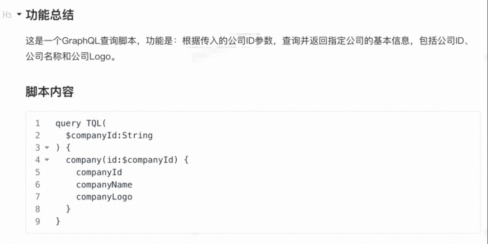

**Rag 的分片策略很大程度上直接影响了召回的质量。** 所以我预先对脚本做了切分，每个脚本独立一个文档，再直接导入到 kbase（内部 Rag 平台） 中使用。

> （kbase 是 aone 工程团队自建的知识库平台，支持嵌入和通过 mcp 召回知识）

#### 系统内置字段

包括 TQL & ICBU 在 GraphQL 上扩展的 TQL 指令、全局函数，以及服务端的领域模型字段。GraphQL 是一门支持自省的语言，（服务端用注解标注了这些字段，所以上述信息都可以被扫描出来）。然而这几年的膨胀，自省的内容已经长达 600w+ 字符。为了让 Rag 的召回效果好，对数据做了大量的清洗工具，包括：

  * 扫描出全局指令、全局函数、领域模型的全集，然后和线上脚本进行匹配，只保留高频（出现 3 次以上）使用的部分，语义相似的内容，人工介入做区分；功能相同语义不通的部分，选择性保留。
  * 剔除标注废弃的内容。
  * 和热门脚本一样，预先对文档对拆分，全局指令、函数独立文档，内置领域模型适当合并。

**清洗的过程非常耗时，需要有细心且耐心，可以借助 cc 的 skills ，帮你写脚本处理数据。**

系统内置字段也可用文档管理，方便导入到 Rag 中。

#### 服务端代码理解

上述梳理出来的知识更多是结果，为了帮助模型从源头理解字段背后的含义，TQL 对应的服务端源码也是很好的输入。这部分已经有成熟能力可以直接使用了，如内部 code 平台的 search 工具，还有内部的 deepwiki 平台。由于此前已经在 deepwiki 上解析过服务端应用（winterfell）的源码，且实测下来其 codebase 效果比较理想（不是拉踩哈，建议自行实践），所以选择了它提供的能力做代码片段召回。（据说是因为 deepwiki 使用了 openai 最好的文本嵌入模型。）

### 工具接入

回过头再来看看 Agent 的工具设计，分为两部分，本地工具和远程（MCP ）工具：

#### 远程（MCP）工具：

  * kbase 的 mcp server

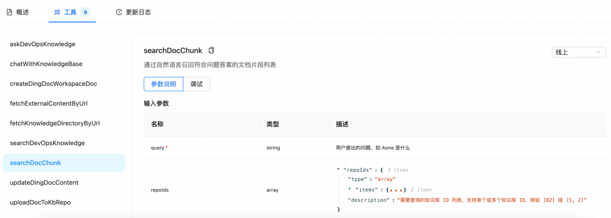

  * deepwiki 的 mcp server

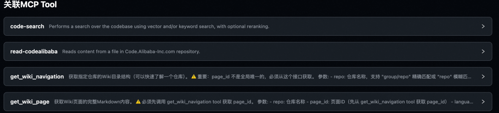

远程工具主要用来召回上文知识库建设的内容，由于其提供的工具比较全，而我实际只会用到其中的部分，所以在系统中设计了**白名单机制，只加载白名单内的工具，还是那句话节约上下文，保护注意力。**

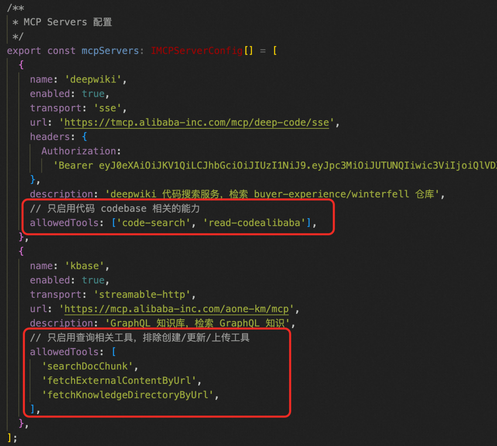

> btw，mcp 的鉴权认证需要自行参考官方文档，不做赘述。

#### 本地工具

  * 编辑脚本（editScript）

  * **功能** ：编辑/更新 GraphQL 脚本内容
  * **输入** ：`script` (string) - 完整的 GraphQL 脚本代码
  * **输出** ：返回更新状态

  * 编辑变量（editVariables）

  * **功能** ：编辑/更新 GraphQL 请求变量（mock 参数）
  * **输入** ：`variables` (string) - 完整的 variables JSON 字符串
  * **输出** ：返回更新状态

  * 执行脚本（executeScript）

  * 空方法，用于引导模型择机执行 GraphQL 脚本，实际的实现在前端宿主页面上。

  * 验证结果（validateResult）

  * **功能** ：验证 GraphQL 脚本的执行结果
  * **输入** ：

  * `prompt` (string) - 验证要求描述
  * `currentScript` (string, optional) - 当前脚本
  * `currentVariables` (string, optional) - 当前变量
  * 执行结果通过闭包注入（不在参数中传递）

  * **输出** ：返回结构化验证结果（passed、summary、problems、suggestions、needMoreContext、contextQueries 等）

#### 工具调用链路

注册注册到 Agent 中后，常规的工具调用链路如下：

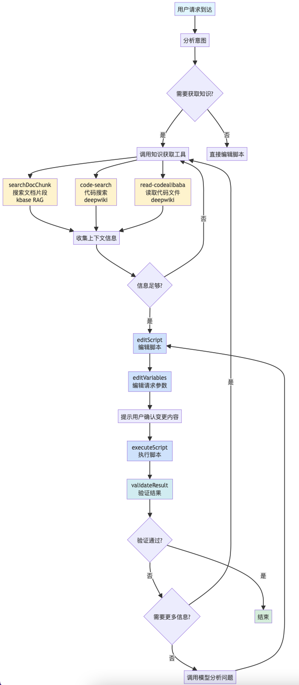

服务端内部的工具调用比较好理解，但服务端的工具调用是怎么触发前端 UI 侧的工具调用呢？

比如 Agent 在调用【执行脚本】的方法时，本质上还需要前端页面响应，点击执行按钮后，然后把执行结果回传给 Agent，Agent再继续处理。

已关注

__

关注

__ 重播 __ 分享 __ 赞

关闭 __

**观看更多**

更多 __

__

__

__

_退出全屏_

[ __](<javascript:;>)

_切换到竖屏全屏_ _退出全屏_

阿里云开发者已关注

[ __](<javascript:;>)

分享视频

 __，时长 00:07

0/0

00:00/00:07

切换到横屏模式

继续播放

进度条，百分之0

 __

[播放](<javascript:;>)

00:00

/

00:07

00:07

[倍速](<javascript:;>)

 _全屏_

 __倍速播放中

[ 0.5倍 ](<javascript:;>)[ 0.75倍 ](<javascript:;>)[ 1.0倍 ](<javascript:;>)[ 1.5倍 ](<javascript:;>)[ 2.0倍 ](<javascript:;>)

[ 超清 ](<javascript:;>)[ 流畅 ](<javascript:;>)

您的浏览器不支持 video 标签

__

继续观看

自建一个 Agent 很难吗？一语道破，万语难明

观看更多 __

转载

,

自建一个 Agent 很难吗？一语道破，万语难明

 __

阿里云开发者 已关注

分享点赞在看

 ____已同步到看一看[写下你的评论](<javascript:;>)

 __

[ 视频详情 ](<javascript:;>)

聪明的你肯定想到了：前后端用全双工通信，维护一个长连接，服务端调用 runScript 时，实际上什么也不做，就等待前台页面执行完工具后，将结果传回服务端，服务端再继续后续的状态流转链路。是的，确实如此，很多带 GUI 的工具也确实是这么处理的（在 LangGraph 中称之为中断，也就是人们常说的 HITL（human in the loop））

遗憾的是，Faas 的设计之初是不支持长连接的：

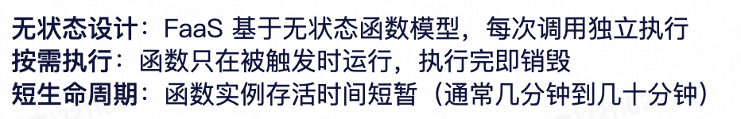

def 上函数能设置的最长保活时间是 300s（默认 50s）。

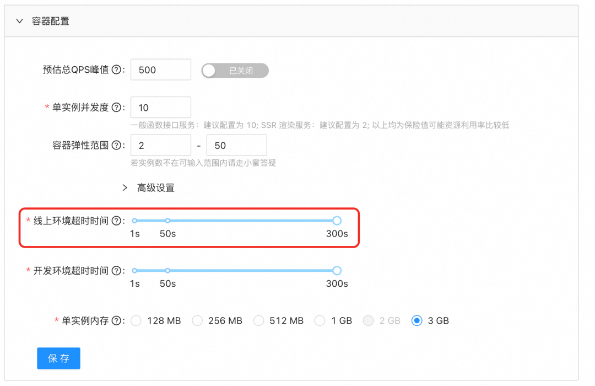

所以我们肯定得曲线救国了～ 允许我先卖个关子 😁

### 上下文管理

其实有了上面能力建设，现在已经有了一个可以帮助用户编写脚本，执行，验证的智能体了，但是面临两个非常现实的问题：

1\. 模型本身不支持连续对话，会话需要自己做持久化管理2\. 尽管在前期做了大量节约上下文窗口的优化工作，但真正要处理一个复杂脚本的时候，模型上下文窗口会快速膨胀，导致模型注意力变得稀疏，出现幻觉，准确率下降，用户体验下降。

一轮简单的对话，只要包含工具调用，就会耗掉 1/4 （5w）的 token。因为在默认的设计中，每个节点的返回消息，都是默认拼接到 LLM 消息列表中的。

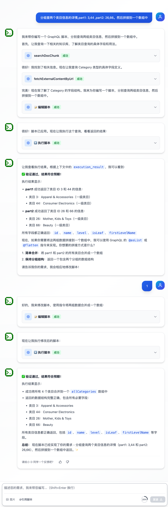

#### 连续对话

先来处理简单的，连续对话实现非常简单。也可以参考 LangGraph checkpoint [5]的设计，可以从任意节点重新开始。BFF Agent 暂时没用到这个能力。

在用户开始一次新对话时，创建一个 sessionId，用来记录存储消息列表，在消息列表每次发生变化的时候，持久化存储起来（这里我用的 tair），用户有新输入时，直接 sessionId 记录的历史消息列表做拼接，合并发给大模型，就可以实现连续对话了。

#### UI 工具是如何调用的

在支持连续对话的基础上，就有了一个非常巧妙的设计

1\. Agent 的接口设置为 SSE 的方式，服务端在收到请求后，流式向前端推送分片消息，同时，将每轮消息持久化存储起来。（SSE 的方式只支持服务端单向给客户端推送消息）2\. 当调用到需要前台 UI 响应的工具时，在把工具调用信息输出给前端后，直接退出 LangGraph 的状态流转，结束此次请求。**是的，直接结束** 。3\. 前端特殊处理该类工具调用后，（含 diff 脚本，接受或拒绝 Agent 的修改，执行脚本等），增加一条**隐藏消息** （如：【脚本执行成功，结果是xxx，请继续处理】）重新调用 Agent 的流式接口，接口内部取出之前持久化的消息内容，拼接上隐藏消息，从头开始初始化 AgentGraph 的调用。

用户在前台看到的：

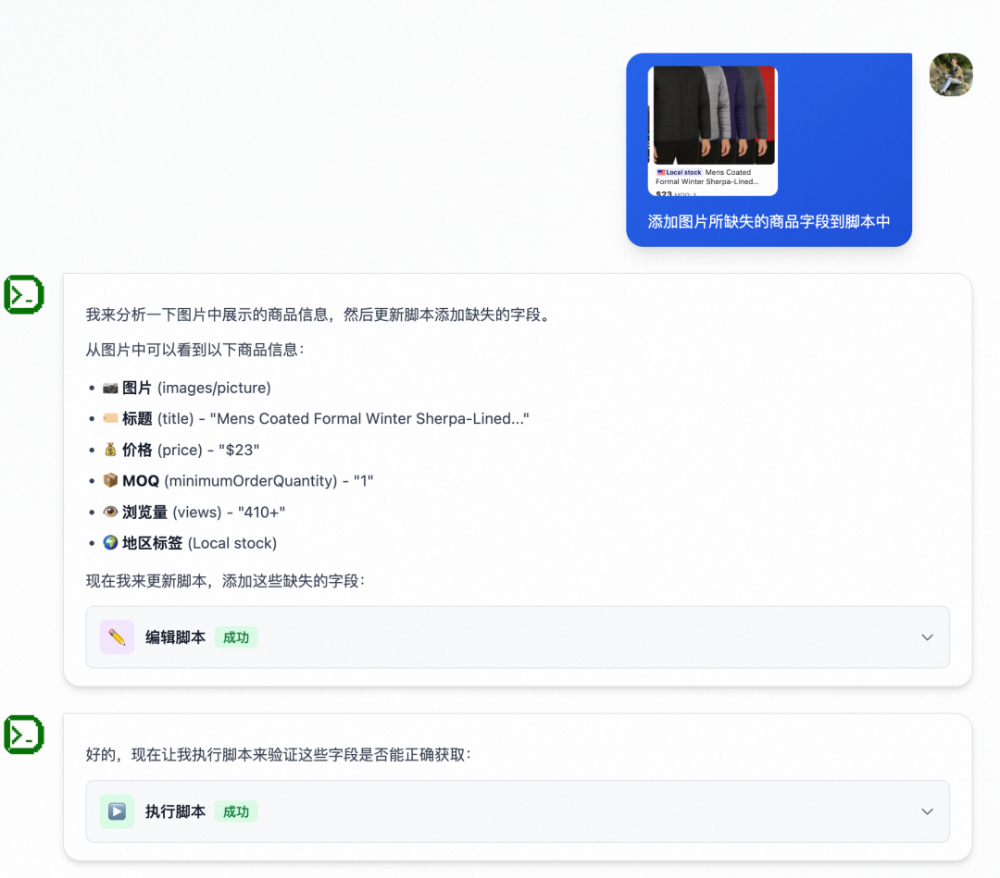

实际上发送给模型的：

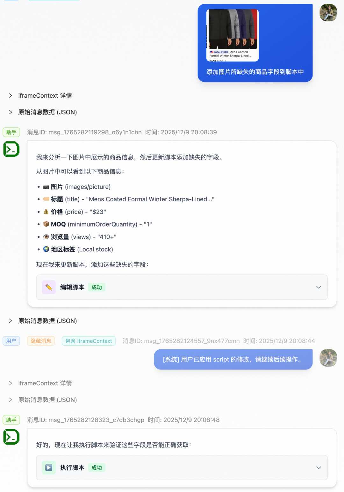

至此，就实现一个可以自己执行、验证、修复、再执行的智能体。

对应的，会话中断恢复也就不难处理了，因为在服务端完整缓存了会话内容，中断后，只需要发送新消息，接口内部就自动拼接上之前的会话，重新走进 Agent 的状态流转。

#### 会话压缩

解决了连续对话的问题，上下文超长的问题怎么办呢？

现在答案是**压缩** ，只保留摘要信息。（不知道以后模型是否可以自行处理～）

##### 压缩工具响应结果

既然调用外部工具如此废 token，那么如果先将工具的调用结果缓存起来，再用一个工具函数去精准检索内容，并只把检索后的内容放到消息列表中，就能极大的缓解问题了。

于是，我在 Agent 内部增加了工具结果缓存 + 检索详情的 tool （summaryToolResult)，在工具调用结束后，增加如下机制：

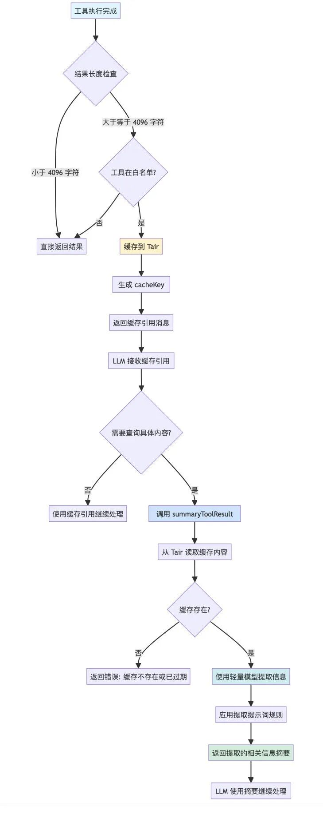

**当然，summaryToolResult 的任务非常明确，普通的模型也有不错的据实回答问题的能力，所以这里选择更轻量的 Qwen 模型做检索召回，还能省不少钱～**

**为了尽可能让 summaryToolResult 在回答时结构化且保留原始信息，我对工具的提示词作了优化，使用 xml 格式响应。**

**是的，还是 anthropic 优化提示词的那一招。**

  *   *   *   *   *   *   *   *   *   *   *   *   *   *   *   *   *   *   *   *   *   *   *   *   *   *   *   *   *   *   *   *   *   *   *   *   *   *   *   *   *   *   *   *   *   *   *   *   *   *   *   *   *   *   *   *   *   *   *   *   *   *   *   *   *   *   *   *   *   *   *   *   *   *   *   *   *   *   *   *   *   *   *   *   *   *   *   *   *   *   *   *   *   *   *   *   *   *   *   *   *   *   *   *   *   *   *   *   *   *   *   *   *   *   *

     <?xml version="1.0" encoding="UTF-8"?><prompt>  <role>你是一个数据提取助手。你的任务是从给定的工具调用结果中，根据用户的查询需求，提取并返回相关的事实信息。</role>    <extractionRules>    <rule>只返回与查询高度相关的事实信息</rule>    <rule>保持信息的准确性，不要编造内容</rule>    <rule>如果找不到相关信息，明确说明</rule>  </extractionRules>    <specialRules>    <description>当提取的内容涉及以下类型的功能说明时，必须使用对应的 XML 结构详细输出完整的用法信息：</description>        <featureType name="全局函数">      <xmlTemplate><![CDATA[<function>  <name>函数名称</name>  <description>函数功能说明</description>  <parameters>    <param required="true/false">      <name>参数名</name>      <type>参数类型</type>      <default>默认值（如有）</default>      <description>参数说明</description>    </param>    <!-- 更多参数... -->  </parameters>  <returns>    <type>返回值类型</type>    <description>返回值说明</description>  </returns>  <example>使用示例代码</example></function>      ]]></xmlTemplate>    </featureType>        <featureType name="领域模型字段">      <xmlTemplate><![CDATA[<field>  <name>字段名称</name>  <type>字段类型（标量/复合）</type>  <description>字段描述</description>  <arguments>    <arg required="true/false">      <name>参数名</name>      <type>参数类型</type>      <default>默认值（如有）</default>      <description>参数说明</description>    </arg>    <!-- 更多参数... -->  </arguments>  <subFields>    <subField>      <name>子字段名</name>      <type>子字段类型</type>      <description>子字段说明</description>    </subField>    <!-- 更多子字段... -->  </subFields>  <example>使用示例代码</example></field>      ]]></xmlTemplate>    </featureType>        <featureType name="内置指令">      <xmlTemplate><![CDATA[<directive>  <name>@指令名称</name>  <description>指令功能说明</description>  <locations>    <location>FIELD</location>    <location>QUERY</location>    <!-- 可应用的位置：FIELD, QUERY, FRAGMENT_SPREAD, INLINE_FRAGMENT 等 -->  </locations>  <arguments>    <arg required="true/false">      <name>参数名</name>      <type>参数类型</type>      <default>默认值（如有）</default>      <description>参数说明</description>    </arg>    <!-- 更多参数... -->  </arguments>  <notes>    <note>注意事项或限制</note>    <!-- 更多注意事项... -->  </notes>  <example>使用示例代码</example></directive>      ]]></xmlTemplate>    </featureType>        <featureType name="自定义标量类型">      <xmlTemplate><![CDATA[<scalarType>  <name>类型名称</name>  <description>类型说明</description>  <format>取值范围或格式要求</format>  <example>使用示例</example></scalarType>      ]]></xmlTemplate>    </featureType>  </specialRules>    <outputFormat>    <rule>涉及功能用法时，必须使用上述对应的 XML 结构输出</rule>    <rule>可以在 XML 结构前后添加简要的文字说明</rule>    <rule>如果有多个同类型功能，每个功能使用独立的 XML 块</rule>    <rule>XML 中的示例代码直接写入 example 标签内</rule>    <rule>如果某个字段没有值，可以省略该标签或留空</rule>  </outputFormat>    <outputHint>如果查询内容不涉及上述特殊功能类型，则按照常规方式简洁输出关键信息，无需使用 XML 格式。</outputHint></prompt>

这样 qwen 模型也能高质量输出结构化的信息，工具输出示例，包含具体字段的名称、描述、类型、出入参数等：

  *   *   *   *   *   *   *   *   *   *   *   *   *   *   *   *   *   *   *   *   *   *

    <field>  <name>freight</name>  <type>复合类型</type>  <description>物流模型</description>  <arguments>    <arg required=\"false\">      <name>dispatchCountryCode</name>      <type>String</type>      <description>发货地代码</description>    </arg>    <arg required=\"false\">      <name>needAlibabaGuaranteed</name>      <type>Boolean</type>      <description>是否返回半托管物流信息，false不返回，null 或 true均返回</description>    </arg>    <arg required=\"false\">      <name>moqType</name>      <type>String</type>      <description>MOQ档位，实验推全，全部第一档 first</description>    </arg>  </arguments></field>

对工具响应做优化后，同样一个问题，主 Agent 的上下文窗口占用只需要花不到原来 1/10 的 token 就能解决问题了。（从 5w 下降到 4k）

##### 上下文压缩

但即便是对工具响应进行了压缩，也还是会有窗口超限的问题，为什么 cursor 、cc 等产品好像从来没给用户暴露过这类问题呢？

GitHub 上有个 cc 的逆向工程，秘密就藏在上下文自动压缩的机制里 Claude-Code-Reverse[6]。

比较靠谱的说法是，有两个触发自动压缩的时机：

1\. 上下文窗口即将超限。（据传 cc 是窗口超过 82% 时触发自动压缩）2\. 新对话与历史对话毫无关联。

因为当前场景，Agent 的负担还算比较轻，所以我只选择了第一种压缩机制，就足够用了。

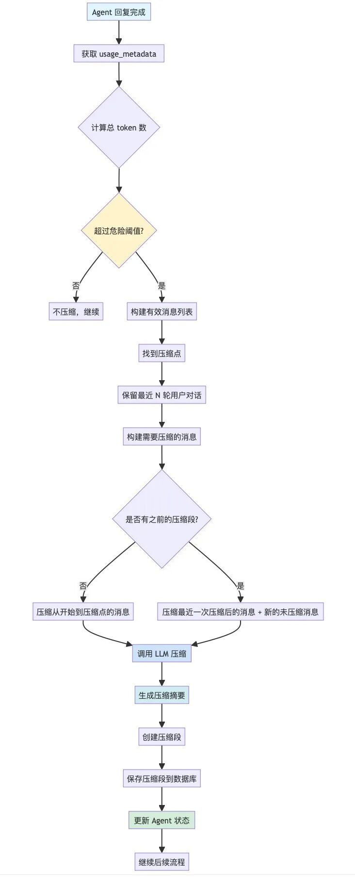

因为上下文压缩实际上是有损的，一旦触发压缩，Agent 就似乎忘记了之前的任务，所以 CC 在压缩的时候非常的谨慎：

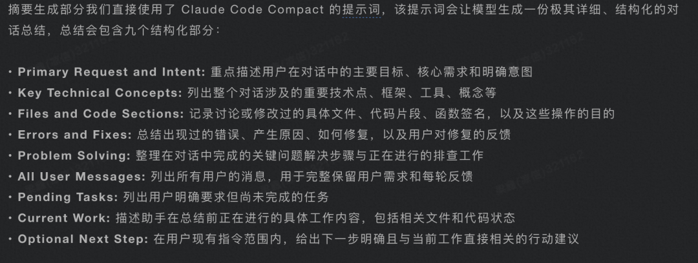

所以 BFF Agent 也直接复用了这份提示词做压缩。在这个基础之上，为了使用户近期的对话被完整保留，避免一旦压缩节点就瞬间遗忘的现象，压缩时我默认会完整保留自用户近 3 轮开始对话后的消息列表。

最终的线上配置为：

  *   *   *   *   *

    {  enabled: true, // 启用压缩  dangerThreshold: 80, // 1-100 当上下文窗口使用超过 80% 时触发压缩  keepRecentRounds: 3, // 保留最近 3 轮用户对话开始之后的消息不被压缩}

消息压缩图示：

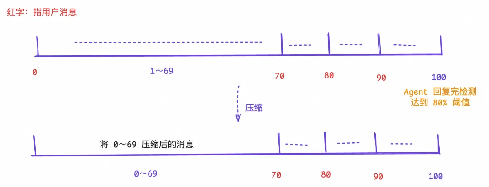

到这里，基础的优化工作就基本结束了，后续更多的优化工作，就需要采集用户的 bad case ，再不断优化提示词/工具/知识库。文章有点长，对熟练的同学来说有很多废话，但还是希望能帮助到大家～

## 材料链接：

Anthropic 的提示词优化技巧：https://platform.claude.com/docs/zh-CN/build-with-claude/prompt-engineering/overview

模型的自省现象：https://www.anthropic.com/research/introspection

CC 逆向工程：https://github.com/Yuyz0112/claude-code-reverse

参考链接：

[1]https://docs.langchain.com/oss/javascript/langgraph/overview

[2]https://platform.claude.com/docs/zh-CN/build-with-claude/prompt-engineering/overview

[3]https://platform.claude.com/docs/zh-CN/build-with-claude/prompt-engineering/use-xml-tags[#xml](<javascript:;>)

[4]https://www.anthropic.com/research/introspection

[5]https://docs.langchain.com/oss/javascript/langgraph/use-time-travel[#2](<javascript:;>)-identify-a-checkpoint

[6]https://github.com/Yuyz0112/claude-code-reverse
