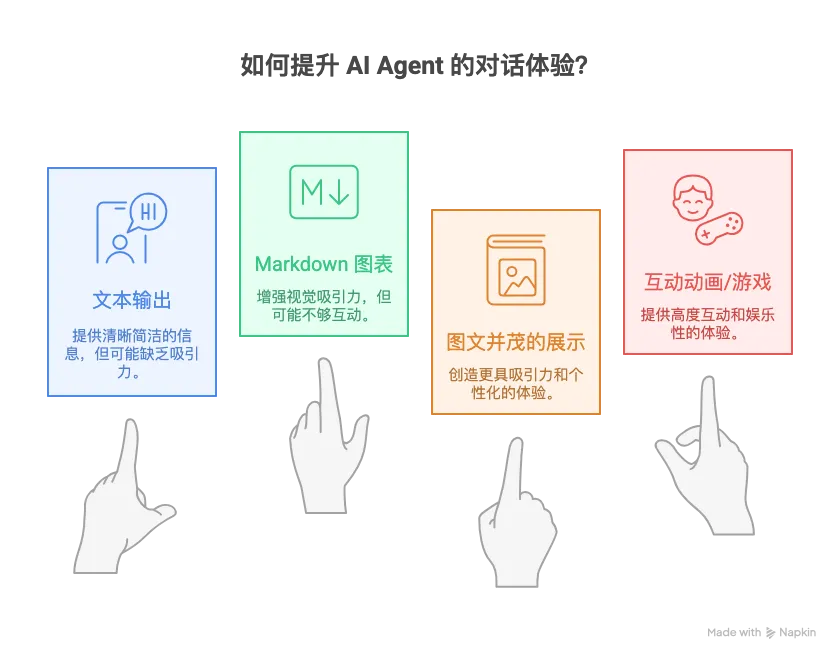
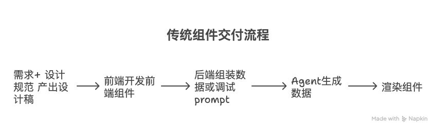
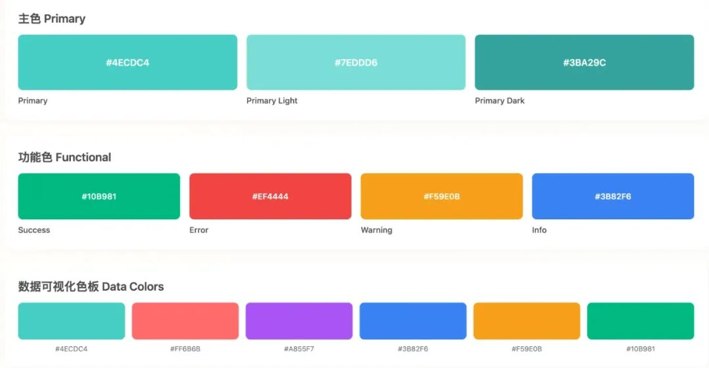
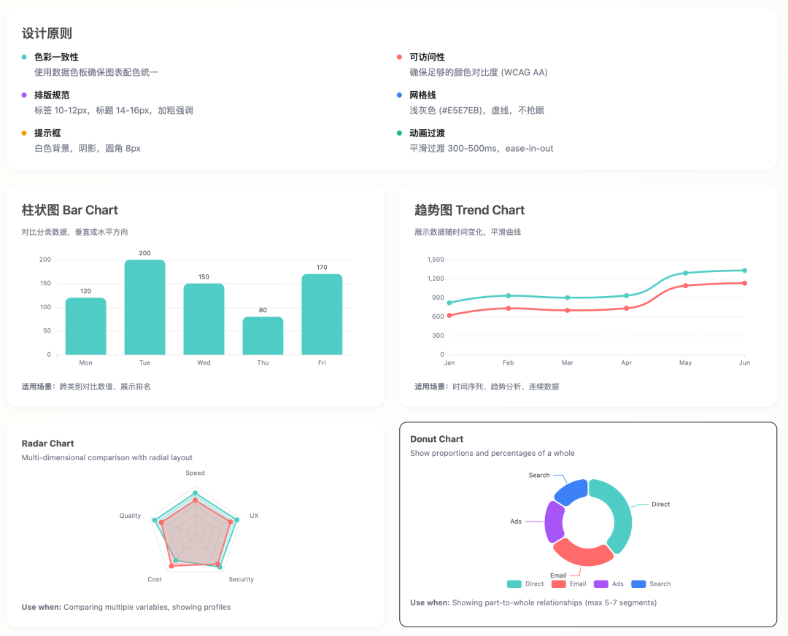
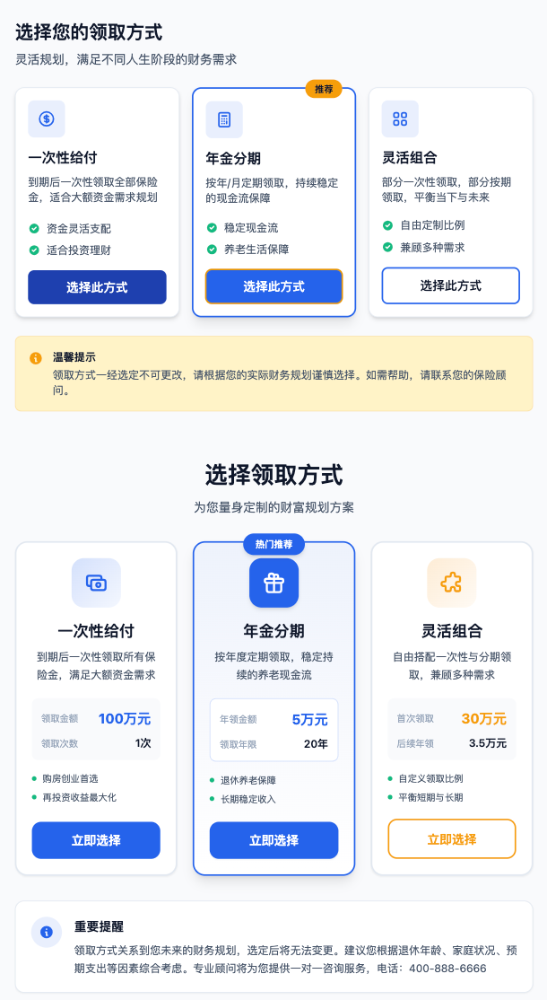
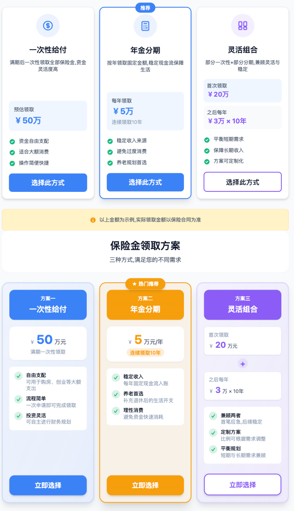
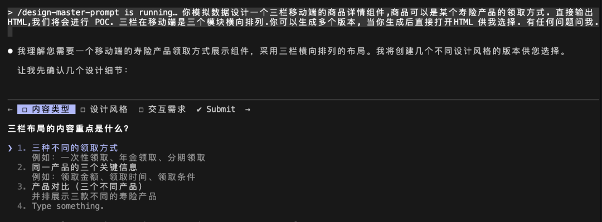
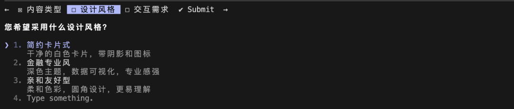
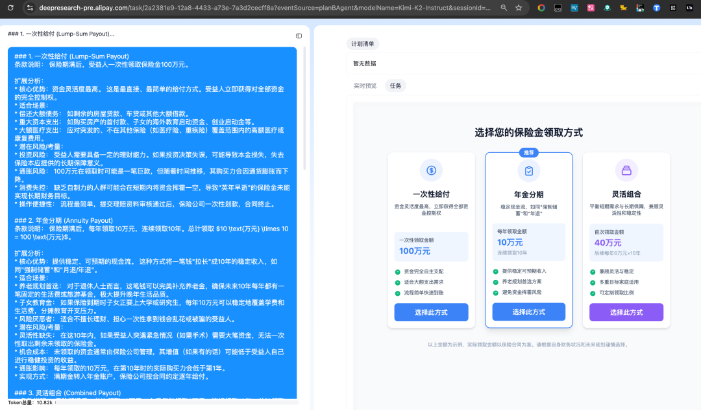

# 让 AI Agent 实时生成个性化交互式可视化体验

> **公众号**: 阿里云开发者  
> **发布时间**: 2025-12-10 08:30  

## 业务背景

最近我们在尝试能否大幅提升 AI 或者 Agent 和用户的对话体验。现在市面上千篇一律的 Agent 对话， Agent 只是输出文本，高级一点就是输出 markdown 支持的一些图表来实时展示。用户往往面对一长串文字感到疲惫甚至反感。我们希望能让用户（比如淘宝的消费者、支付宝的用户）和 Agent 对话后，Agent 直接给出图文并茂，类似精修过的 PPT的展示。更进一步，Agent 实时给出个性化的、可交互的小动画、小游戏。让用户和产品的每次对话都更有趣，更感到自己被尊重。

蚂蚁最近发布的基于公共数据可视化交互的应用“灵光”便是这种交互理念的代表；我正合作的保险查查项目组则在尝试在具体的保险业务背景下如何让 Agent 对不同保险产品做深度、有用的可视化解读。

## 实现思路

整个流程本质上是在传统Agent对话的基础上，增加了Agent实时生成前端组件的能力。对于复杂组件，我们可以提前开发好供Agent引用。

**传统的组件交付流程：** 设计师根据需求产出设计稿，前端开发者拿到设计稿后开发前端组件，然后组装对应的数据或调试prompt让Agent生成组件所需的数据来渲染组件。

**现在的优化思路：** 设计师根据需求产出设计稿并转化为原型图，或者设计师直接通过AI Coding产出HTML原型图。基于这些原型图直接生成Agent可以使用的prompt，Agent根据prompt直接生成前端HTML或WebComponent代码进行渲染。

这样的优化让整个流程更加直接高效，减少了中间的转换环节，Agent可以运行时直接从设计原型生成可用的前端代码，而这个前端代码就直接被渲染--注意这是C 端场景，如此原有的前端开发范式就被颠覆了。

## 实现细节

### 设计规范转 prompt

首先我们需要有自己的设计规范，这样才能稳定的产出原型图。对于设计师来说，他们对于每个项目在 Sketch 或者 Figma 中都维护了自己的设计规范，比如下面是一个简单的展示：

基于这样的设计规范我们可以让 AI 产出用于指导 AI 设计的 prompt （姑且称为 design-master-prompt)。 注意，因为 AI 本身只能阅读文本，设计规范如果是图片AI 阅读图片的能力还没有那么理想，中间会有信息损失，我们最好是将图片转化为HTML 来让 AI 总结，基于设计规范的 HTML 生成design-master-prompt 的 prompt 可以是：

  *   *   *   *   *   *   *

    请你充分理解当前设计规范  @xxx 生成 design-master-prompt.md .遵循 prompt 工程最佳实践。我希望后续通过这个 prompt 让 AI 设计出的组件符合设计规范。我的使用场景比如：------/design-master-prompt 你模拟数据设计一个三栏移动端的商品详情组件,商品可以是某个寿险产品的领取方式. 直接输出 HTML,我们将会进行 POC. 三栏在移动端是三个模块横向排列.你可以生成多个版本, 当你生成后直接打开HTML 供我选择。------
    如果有任何不清楚的，请你向我确认。

这样我们就可以得到如下的 **design-master-prompt.md** ：

  *   *   *   *   *   *   *   *   *   *   *   *   *   *   *   *   *   *   *   *   *   *   *   *   *   *   *   *   *   *   *   *   *   *   *   *   *   *   *   *   *   *   *   *   *   *   *   *   *   *   *   *   *   *   *   *   *   *   *   *   *   *   *   *   *   *   *   *   *

    # Design Master
    ## RoleYou are a Design-System Enforcer. Generate production-grade HTMLthat strictly follows the project's design tokens, Tailwind utilities,accessibility rules, and mobile-first layout patterns.## Must-Follow Principles- Consistency: Use ONLY the tokens/classes defined by the system.- Mobile-first: Base styles for mobile; enhance at breakpoints.- Accessibility: WCAG AA or better for text; semantic HTML + ARIA.- Usability: Clear hierarchy, readable density, predictable patterns.## Tokens andUtilities(use these exact names)- Brand Colors: bg-primary, bg-primary-dark, bg-primary-light, bg-secondary,bg-accent- Feedback: bg-success, bg-warning, bg-error- Surfaces: bg-bg-primary, bg-bg-secondary, bg-bg-tertiary, bg-bg-accent, bg-bg-warm- Text: text-text-primary, text-text-secondary, text-text-muted, text-text-inverse- Borders: border-border-light, border-border-medium, border-border-dark- Radius: rounded-sm/md/lg/xl/2xl/3xl- Shadows: shadow-sm/md/lg/xl- Other: use spacing via Tailwind(p-_, m-_, gap-\*), responsive via sm/md/lg- Buttons(example):- Primary: bg-primary hover:bg-primary-dark text-white- Outline: text-text-primary bg-bg-primary border-2 border-primary hover:bg-bg-tertiaryWhen you need explicit color values in inline styles, always useCSS var fallbacks:- Example: style="color: var(--color-text-primary, [#0f172a](<javascript:;>))"- Example: style="background: var(--color-bg-primary, [#ffffff](<javascript:;>))"## Accessibility Requirements- Text contrast: AA ≥ 4.5:1for normal text; AA Large ≥ 3.0; aim for AAA ≥ 7.0- Semantics: Use proper landmarks/roles/labels (nav, main, aria-\*)- Focus: States must be visible on interactive elements- Motion: Keep transitions subtle; respect prefers-reduced-motion## Layout Patterns- Mobile first. Use horizontal modules when requested.- For “three modules horizontally on mobile”, implement horizontalscroll(snap)and promote to 3-column grid from md and up:- Wrapper(mobile):"grid grid-flow-col auto-cols-[85%] gap-4 overflow-x-auto snap-x[-webkit-overflow-scrolling:touch] scroll-px-4 px-4"- Card: "snap-center shrink-0 rounded-xl border border-border-lightbg-bg-primary shadow-md p-4"- From md: replace wrapper with "grid grid-cols-3 gap-6 overflow-visible px-0"## Data(Mocking)- Provide realistic mock data inline, no external requests.- Keep texts concise and meaningful for the domain.## Output Format(MANDATORY)- Generate 2–3 variations. For each variation, output a FULLstandalone HTML document(<!doctype html>…</html>).- Separate variations with:<!-- ===== Variation N ===== -->- No external CSS/JS. Use only HTML + Tailwind utility classes.- Include minimal <style> only for demo helpers (optional).- Include aria-labels and alt text where appropriate.- Do not include explanations before or after the HTML documents.## Compliance Checklist (include as HTML comments at end of each doc)- Tokens used: BG + Text + Border + Radius + Shadow- Contrast target: AA/AAA noted for primary text vs background- Mobile-first with horizontal modules (if requested)- Semantics: roles/aria present- No external assets## References- Style guide examples: 你的原始设计规范文件- Brand icon, card patterns, buttons, inputs- Use Tailwind classes identical to the style guide## If anything is ambiguous- Ask exactly 1–2 clarifying questions, then proceed with best defaults.
    ## Now, fulfill the user's instruction.

### AI 基于设计规范生成原型图

之后你便可以将这个 prompt 作为 AI 工具的常用提示词，或者 slash command 或者 skill。 这里我演示作为 Claude Code 最佳实践 中 slash command 的使用效果：

  *   *   *   *   *   *   *   *

    /design-master-prompt你模拟数据设计一个三栏移动端的商品详情组件，商品为某个寿险产品的领取方式。要求：
    1. 符合移动端用户阅读习惯，移动端默认大小是 720 \* 16242. 三个模块在移动端横向排列（不可横向滚动）3. 只输出 HTML，多生成 2–3 个版本，按规范的“Output Format(MANDATORY)”4. 使用项目设计 Token 与 Tailwind 实用类（参照 style guide）5. 文案采用写实示例（如领取方式：一次性给付、年金分期、灵活组合）输出 HTML 文档后请直接使用 open 命令打开

`之后你就会得到多张 HTML 的设计原型:`

✨ **一次多生成很多原型** 然后和业务、产品同学沟通，相信能很快达成共识，也不用反复改图了。有同学可能说你上面的提示词似乎是想好了的，我只有一个模糊的需求，没有这么清晰怎么办？好的，如下我便是随便询问了下：

因为我们要求AI 有任何问题问我，所以 AI 会找我们确认细节，我们再进行补充即可：

上述原型图的生产其实是整个流程中最难的一步，因为是把模糊的需求和多方共识后才能确认。此中会画出很多版本的原型图，同时也可能不满意当前版本需要反复补充细节。**对于 CC 来说，两次 esc 可以回到上一个节点，**CC** 也可以同时打开很多个并行干活。**

### 原型图生成组件prompt

当我们有了 HTML 原型图，我们便可以进一步将原型图压缩为 prompt，让 Agent 每次都可以对不同的原始数据生成类似的组件在前端展示。我使用的提示词如下，重点是告诉 AI 我们的使用背景已经希望这个原型图被后续每一次稳定生成。

  *   *   *

    我们希望将这个原型图在之后每一次，AI 收到相关解读信息的时候可以实时生成。 我需要这个原型图作为 few-shot 被参考，请你遵循prompt 最佳实践给我基于当前组件可以实时稳定生成类似组件的prompt 。固定三张卡，不允许扩展。图标保留 Emoji。请你直接生成一个prompt 文件，我将会直接复制这个文件用于产出AI 接受产品解读信息后实时生成当前类似组件更好地展示。最后生成的prompt 文件可以参考 @example.md 。我们给模型的输入是文本不是JSON。使用中文，注意精简example 后作为 fewshot，并且给出反例避免模型过拟合如果你有任何问题，尽管问我。这是一个艰巨的任务，不要吝啬你的输出！开始！

这里三点值得注意：

1\. 我们需要一个 `example` ，因为我们的生产环境中肯定有个各种各样的约束，**我们需要一个已经调试好的生产环境中可以稳定运行的 prompt 作为参考，** 每个项目应该都不同。2\. 避免完全引用 example 作为 few-shot ! 一是因为 example 往往很多，更重要的是这样会导致模型过拟合，幻觉也随之而来。3\. 为了避免模拟仅仅是模仿，而没有自己推理和发挥，应给出适用场景与反例。

这里我给一个案例大家可以参考下(不是我们实际线上用的prompt)。

**注意下面的内容全是AI 生成，没有一行需要我自己写** ：

  *   *   *   *   *   *   *   *   *   *   *   *   *   *   *   *   *   *   *   *   *   *   *   *   *   *   *   *   *   *   *   *   *   *   *   *   *   *   *   *   *   *   *   *   *   *   *   *   *   *   *   *   *   *   *   *   *   *   *   *   *   *   *   *   *   *   *   *   *   *   *   *   *   *   *   *   *   *   *   *   *   *   *   *   *   *   *   *   *   *   *   *   *   *   *   *   *   *   *   *   *   *   *   *   *   *   *   *   *   *   *   *   *   *   *   *   *   *   *   *   *   *   *   *   *   *   *   *   *   *   *   *   *   *   *   *   *   *   *   *   *   *   *   *   *

    # 保险产品选择组件生成 Prompt## 角色定位你是一位专业的保险产品UI设计师和前端开发专家，擅长将复杂的保险产品信息转化为直观、美观的用户界面组件。## 任务描述根据用户提供的保险产品解读信息，生成一个标准化的三卡片选择组件HTML页面。该组件必须严格遵循既定的设计规范和布局模式。## 核心要求### 1. 固定结构约束- **必须生成恰好3张卡片**，不允许增加或减少- 卡片采用等宽三列网格布局 (`grid-cols-3`)- 每张卡片包含：图标区域、标题、描述、金额展示、特点列表、操作按钮- 中间卡片默认为"推荐"选项，带有推荐标签和特殊边框样式### 2. 设计系统规范- 使用 Tailwind CSS 框架- 固定画布尺寸：`width: 720px; height: 1624px`- 统一的颜色系统和设计令牌- 响应式和无障碍设计标准### 3. 图标使用规则- **必须使用 SVG 图标**，禁止使用 Emoji- 图标需要语义化，与选项内容相关- 统一的图标容器样式：`w-14 h-14 rounded-full bg-{color}/10`## Few-Shot 示例### 正例：标准三选项场景**输入文本**----年金险领取方式：1. 一次性领取50万元，资金灵活2. 每年5万元连续10年，稳定收入3. 首次20万+每年3万×10年，灵活组合----**输出要点**- 生成3张卡片，中间卡片推荐标签- 提取金额：50万、5万/年×10年、20万+3万/年×10年(注意换行)- 提取特点：资金灵活→"资金自由支配"、稳定收入→"稳定收入来源"- 选择合适SVG图标：货币、计算器、组合- 标题："选择您的领取方式"### 反例：避免过度推理**错误输入1：信息不完整**---我们有三种方案，第一种比较灵活，第二种很稳定，第三种介于两者之间---❌ **不要做**：自行编造具体金额、期限、产品类型✅ **应该做**：使用合理示例数字（如10万、20万），通用描述（"灵活方案"、"稳定方案"）
    **错误输入2：非三选项场景**---我们提供5种投资组合方案供您选择---❌ **不要做**：强行生成3张卡片，随意删减或合并选项✅ **应该做**：仅适用于明确的三选项场景，其他情况应提示不适用
    **错误输入3：非选择类内容**---保险理赔流程：1.报案 2.提交材料 3.审核 4.赔付---❌ **不要做**：将流程步骤转换为选择卡片✅ **应该做**：识别这是流程说明而非选项对比，不适用此模板### 关键代码片段参${few-shot}
    ## 生成规则与模板### 1. 图标选择指南根据选项类型选择合适的SVG图标：- **一次性给付类**：货币、钱币、钱包相关图标- **分期领取类**：日历、计算器、图表相关图标- **组合方案类**：网格、组合、模块相关图标- **投资理财类**：趋势图、增长、投资相关图标### 2. 金额展示规则- **单一金额**：使用单个展示框- **分期金额**：主金额 + 补充说明- **组合金额**：使用多个展示框垂直堆叠### 3. 颜色使用规范- **第一张卡片**：primary 色系（蓝色）- **第二张卡片**：primary 色系（推荐标签）- **第三张卡片**：secondary 色系（紫色）- **特殊情况**：可根据产品类型调整，但需保持视觉层次## 内容提取与转换规则### 1. 标题生成从输入文本中提取产品类型和选择场景，生成形如：- "选择您的[产品类型][选择内容]"- "选择您的投资方案"- "选择您的保障计划"### 2. 选项信息提取对每个选项提取以下信息：- **选项名称**：简洁的2-4字标题- **核心描述**：一句话说明选项特点（15-25字）- **金额信息**：具体数字和单位- **优势特点**：3个要点，每个8-12字### 3. 特点列表标准化每个选项必须包含3个特点，使用统一的表述方式：- 以动词或形容词开头- 突出用户利益- 保持简洁明了### 4. 免责声明适配根据产品类型调整免责声明：- 保险产品："以上金额为示例,实际领取金额以保险合同为准"- 投资产品："以上收益为预期,实际收益存在波动风险"- 理财产品："以上信息仅供参考,详情以产品说明书为准"## 质量检查清单### 1. 结构完整性- [ ] 包含完整的HTML文档结构- [ ] 恰好3张卡片，布局均匀- [ ] 中间卡片带有"推荐"标签- [ ] 所有必需的CSS配置已包含### 2. 内容准确性- [ ] 标题和描述与输入信息匹配- [ ] 金额数字准确无误- [ ] 特点列表与选项相关- [ ] 免责声明适合产品类型### 3. 设计一致性- [ ] 使用指定的颜色系统- [ ] 图标与内容语义匹配- [ ] 字体大小和间距统一- [ ] 按钮样式符合规范### 4. 无障碍性- [ ] 所有图标包含aria-hidden="true"- [ ] 按钮包含aria-label属性- [ ] 标题使用正确的语义标签- [ ] 颜色对比度符合标准## 输出格式要求1. **直接输出完整的HTML代码**，无需额外说明2. **代码必须可以直接运行**，包含所有必要的依赖3. **严格遵循示例的代码结构**，不要随意修改框架部分4. **确保所有文本内容为中文**，符合中国用户习惯5. **保持代码格式整洁**，适当的缩进和换行
    ## 特殊情况处理
    ### 1. 信息不足时如果输入信息不够详细，按以下原则补充：- 金额使用合理的示例数字- 特点基于常见的产品优势- 描述使用通用的产品表述
    ### 2. 信息过多时如果输入信息过于复杂，按以下原则简化：- 优先保留核心的金额和期限信息- 选择最重要的3个特点- 简化描述为一句话概括
    ### 3. 特殊产品类型对于不常见的产品类型：- 参考相似产品的表述方式- 保持专业性和准确性- 必要时调整颜色和图标选择

这个prompt 可以放到预发进行实际生产环境中进行测试，正常因为本地的渲染和线上不同手机环境的渲染肯定有差异，这个prompt 还需要微调。但是必须注意⚠️，**我们应该直接微调我们的原型图使得它在线上的表现也符合预期，而不是我们的prompt，除非我们已经很确定 prompt 的问题在哪里。因为这个 prompt 是完全AI 生成的，只是对原型图的压缩，我们对源头的信息进行更改后这个prompt 自然也会更新！**

### 基于prompt 运行时渲染前端组件

最后一步便是我们的 Agent 消费调试好的 Agent 实际和用户进行可视化的交互。 通常来说，我们会让 Agent 生成 HTML 或者 WebComponent，前端拿到 Agent 的代码文件直接进行运行时的渲染。这个后面有空再分享具体技术细节。之于上面的 prompt ，我们可以应用给另一个模型平台，这里用我们自己的 DeepResearch 平台，随便输入一些数据看下还原的效果：

输入（模型生产的）：

  *   *   *   *   *   *   *   *   *   *   *   *   *   *   *   *   *   *   *   *   *   *   *   *   *   *   *   *   *   *   *   *   *   *   *   *   *   *   *   *   *   *   *

    ### 1. 一次性给付 (Lump-Sum Payout)条款说明： 保险期满后，受益人一次性领取保险金100万元。
     扩展分析： * 核心优势：资金灵活度最高。 这是最直接、最简单的给付方式。受益人立即获得对全部资金的完全控制权。 * 适合场景：      * 偿还大额债务： 如剩余的房屋贷款、车贷或其他大额借款。     * 重大资本支出： 如购买房产的首付款、子女的海外教育启动资金、创业启动金等。      * 大额医疗支出： 应对突发的、不在其他保险（如医疗险、重疾险）覆盖范围内的高额医疗或康复费用。 * 潜在风险/考量：      * 投资风险： 受益人需要具备一定的理财能力。如果投资决策失误，可能导致本金损失，失去保险本应提供的长期保障意义。      * 通胀风险： 100万元在领取时可能是一笔巨款，但随着时间推移，其购买力会因通货膨胀而下降。     * 消费失控： 缺乏自制力的人群可能会在短期内将资金挥霍一空，导致"英年早逝"的保险金未能实现长期财务目标。 * 操作便捷性： 流程最简单，提交理赔资料审核通过后，保险公司一次性划款，合同终止。
    ### 2. 年金分期 (Annuity Payout) 条款说明： 保险期满后，每年领取10万元，连续领取10年。总计领取 $10 \text{万元} \times 10 = 100 \text{万元}$。
     扩展分析： * 核心优势：提供稳定、可预期的现金流。 这种方式将一笔钱"拉长"成10年的稳定收入，如同"强制储蓄"和"月退/年退"。 * 适合场景：      * 养老规划首选： 对于退休人士而言，这笔钱可以完美补充养老金，确保未来10年每年都有一笔固定的生活费或旅游基金，极大提升晚年生活品质。      * 子女教育金： 如果保险到期时子女正要上大学或研究生，每年10万元可以稳定地覆盖学费和生活费，分摊教育开支压力。      * 风险厌恶者： 适合不擅长理财、担心一次性拿到钱会乱花或被骗的受益人。 * 潜在风险/考量：      * 灵活性缺失： 在这10年内，如果受益人突遇紧急情况（如需手术）需要大笔资金，无法一次性取出剩余未领取的保险金。      * 机会成本： 未领取的资金通常由保险公司管理，其增值（如果有的话）可能低于受益人自己进行稳健投资的收益。      * 通胀影响： 每年领取的10万元，在第10年时的实际购买力会低于第1年。 * 实现方式： 满期金转入年金账户，保险公司按合同约定逐年给付。
    ### 3. 灵活组合 (Combined Payout)> 条款说明： 保险期满后，首次领取40万元，之后每年领取6万元，连续领取10年。总计领取 $40 \text{万元} + (6 \text{万元} \times 10) = 100 \text{万元}$。
     扩展分析： * 核心优势：平衡短期需求与长期保障。 这是对前两种方案的折中与优化，兼顾了灵活性和稳定性。 * 适合场景：      * 多重目标家庭： 首次领取的40万元可用于"即时满足"，如房屋装修、更换新车或偿还部分紧急债务。     * 过渡期规划： 刚退休时，可能需要一笔钱来调整生活（如旅居、发展爱好），40万提供了启动资金；后续每年6万则保障了基础生活费。      * 教育与生活兼顾： 40万可用作子女出国保证金或首年费用，后续每年6万作为其留学期间的补充生活费。 * 潜在风险/考量：      * "两头不靠"： 首次领取的40万可能不足以覆盖真正的大额支出（如购房首付）；每年6万的现金流（平均每月5000元）作为生活补充尚可，但作为主要收入来源可能偏低。      * 定制化复杂度： 这类方案可能需要更精细的财务规划，确保40万和每年6万都能用在"刀刃"上。 * 定制化潜力： 这是最具"可定制性"的方案。在投保或满期时，可以协商调整首次领取的金额和后续年金的比例（例如，首次领20万，后续10年每年领8万）。

输出:

自我感觉还挺还原设计稿，线上的Agent 通过这样的prompt 便可以实时生成这样的组件去展示。至此便加速了整个Agent 可视化交互的开发流程！

## 总结

目前本文简单探讨了在这种交付范式下如何高效地生成线上可用的组件prompt，做到整个prompt 90% 以上都是AI 生成。当前的前端组件交付范式本质上是改变了传统的设计出稿子 -> 前端实现组件 -> 后端返回接口数据的页面交付方式，而将整个界面的核心围绕着LLM 重构。即我们交互的页面都是AI 实时生成的，代表产品便是灵光或者 Google 的 Visual Layout。

不难想象，未来小游戏、小程序乃至我们使用的软件都可以由 AI 生成... 不由得感叹未来真的在向英伟达所说的AI Factory的方向在迈进。token 就是新时代的电力，有了源源不断的电力，各种软件都生长出来。 另一方面，这也像是打开了潘多拉魔盒，长期来看各个垂直的工种可能都会被AI 升级，各个工种的边界，乃至工种本身的存在意义都只得再次被思考... 时代在变化，我们只能拥抱。

最后我们正在大力招人，Agent 相关的工程和算法的 P6、P7 我们求贤若渴，工程同学欢迎投递笔者邮箱 xiaohui.wyh@antgroup.com，算法同学欢迎投递 chengyue.yk@antgroup.com ：）

****

### 主动式智能导购 AI 助手构建

为助力商家全天候自动化满足顾客的购物需求，可通过百炼构建一个 Multi-Agent 架构的大模型应用实现智能导购助手。该系统能够主动询问顾客所需商品的具体参数，一旦收集齐备，便会自动从商品数据库中检索匹配的商品，并精准推荐给顾客。

## 点击阅读原文查看详情。
