# 让Agent系统更聪明之前，先让它能被信任

> **公众号**: 阿里云开发者  
> **发布时间**: 2025-10-30 08:30  

阿里妹导读

当我们将所有希望寄托于大模型的「智能」时，却忘记了智能的不确定性必须以工程的确定性为支撑。一个无法复现、无法调试、无法观测的智能，更像是一场精彩但失控的魔法，而非我们真正需要的、可靠的生产力。本文尝试从系统工程的视角剖析 Agent 系统在可运行、可复现与可进化三个层次上不断升级的问题以及复杂度。进一步认识到：框架/平台让 Agent 「好搭」但没有让它「好用」，真正的复杂性，从未被消除，只是被推迟。

## 一、引子：一种“简单”的错觉

团队最近常出现一种论调：**“现在做 Agent 很简单，用 LangChain、百炼、Flowise 搭一搭就能跑。”**

这句话乍一听确实无法反驳 —— 框架确实降低了门槛。但那种“简单”，更像是复杂性暂时被平台吸收后的假象。从技术层面看，Agent 开发涉及：

  * 编排与任务规划；
  * Context 与 Memory 管理；
  * 领域知识融合（RAG）；
  * 以及业务逻辑的 agent 化。

这些环节并不是写几个 prompt 就能搞定的。 当开发者觉得“简单”其实是因为——复杂性被平台吸收了。 Agent 之难，不在跑通 Demo，而在让它长期、稳定、可控地运行。

## 二、Agent 开发为何被误以为“简单”？

从表面看，我们站在了一个 AI 爆炸的年代，各种平台与工具层出不穷。确实写几个 prompt、拼几层链路，一个“能动”的 Agent 就诞生了。但这并不是复杂性消失的标志，而是——**复杂性被转移了位置** 。

我把这层“简单”拆成三种幻觉：

### 2.1. 被封装的复杂性

框架帮你拼接 prompt、裁剪 context，让开发者远离细节，但调试、trace、状态恢复这些底层骨架，仍无人替你承担。

以 LangChain 为例，只需几行代码即可创建一个 “能回答问题” 的 Agent：

  *   *   *   *   *   *   *   *

    from langchain.agents import initialize_agent, load_toolsfrom langchain.llms import OpenAI
    llm = OpenAI(temperature=0)tools = load_tools(["serpapi", "llm-math"], llm=llm)agent = initialize_agent(tools, llm, agent_type="zero-shot-react-description")
    agent.run("给我查一下新加坡现在的天气，并换算成摄氏度")

这段代码几乎隐藏了所有复杂性：

  * prompt 拼装、调用链、上下文管理都在内部封装；
  * 但若任务出错（如 API 限流、工具失败），Agent 默认并不会重试或记录 trace。

看似“简单运行”，实则丧失了可观测与调试的接口。

### 2.2. 被外包的复杂性

Memory、RAG、Embedding 全交由平台托管，代价是失去了干预与解释的能力。

在 LangChain 中，你可以快速添加“记忆”：

  *   *

    from langchain.memory import ConversationBufferMemorymemory = ConversationBufferMemory(memory_key="chat_history")

但这只是短期记忆缓冲，它不会处理：

  * 旧信息冲突；
  * 多轮状态漂移；
  * 以及上下文过长导致的剪裁问题。

当 Agent 规模扩大，memory的一致性与状态清理反而成了新的系统复杂度。

### 2.3. 被推迟的复杂性

它不会消失，只会在运行阶段重新显现：

  * 输出漂移
  * 无法复现
  * 正确性与稳定性塌陷

能跑起来并不等于能长期跑得对。**所谓简单，其实是我们暂时不用面对复杂。**

## 三、Agent 系统的三层复杂度

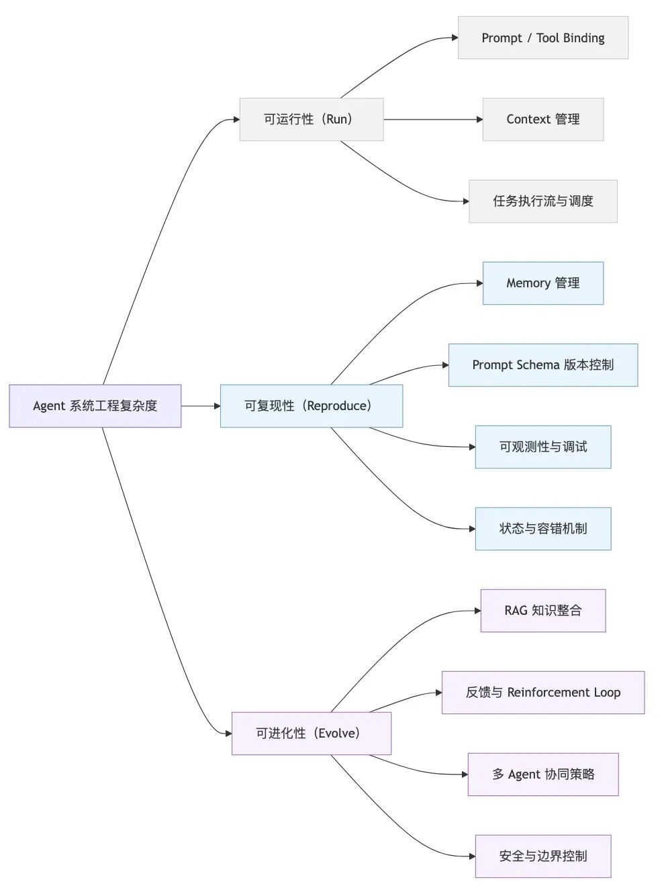

### 3.1. Agent复杂度

Agent 系统的复杂性体现在可运行、可复现、可进化。当下的 Agent 框架大多解决了「可运行性」，但「可复现性」与「可进化性」仍是系统工程难题。

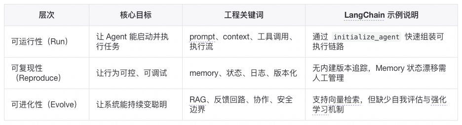

在“可运行性”层面，以LangChain为代表的框架的抽象设计确实高效。但若要让 Agent 行为稳定、可解释、可持续优化，仍需额外引入日志系统、prompt 版本管理、feedback loop 等基础设施。

从系统工程角度看，Agent 的难点并非在“生成”而在“执行”。所有平台最终都会在这两条生命线上暴露代价。

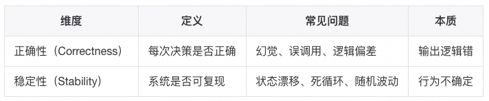

在落地阶段，稳定性往往比正确性更关键。只有稳定性存在，正确性才有被验证和优化的可能性。

智能的不确定性必须以工程的确定性为支撑。稳定与可观测，是 Agent 真正可演化的前提。

### 3.2. Agent放大效应

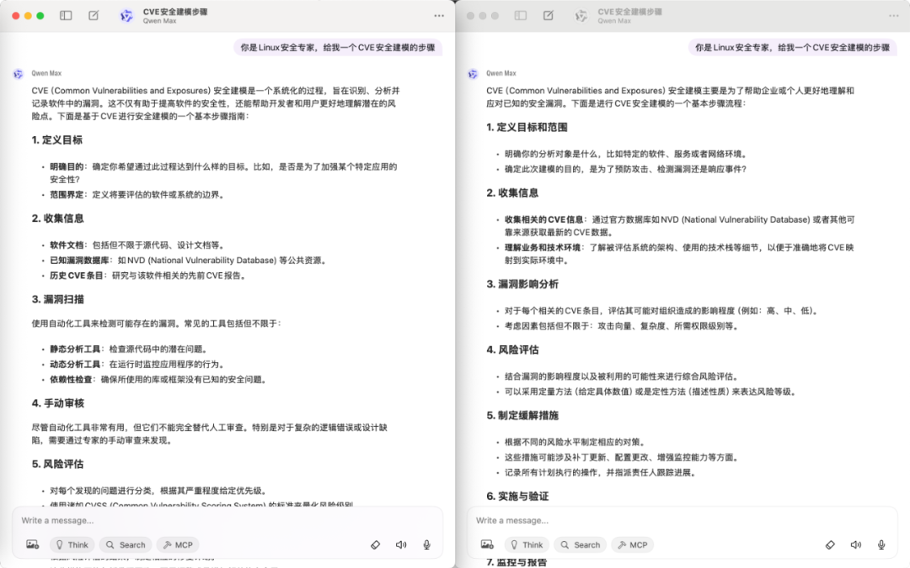

如上图所示，同样的模型(qwen-max)，同样的时间、同样的prompt，产生的结果缺不一样，这就是LLM的不确定性带给Agent的放大效应。相对于开发者最熟悉的传统软件系统的开发，Agent带来的复杂和难点就源于它被 LLM 的不确定性和语义层次的逐级放大了。假设一次LLM交互正确率为90%，一个Agent系统需要10次LLM的交互，那么这个Agent系统的正确率就只有35%，一个Agent系统需要20次LLM的交互，那么这个Agent系统的正确率只有12%。

#### Memory 的不确定性放大

相比传统软件的状态管理来说（是确定性的，例如数据库里有啥就是啥），Agent 的memory依赖 LLM 的解析、embedding、检索，结果高度不确定，所以memory不是存取问题而是语义一致性问题，这是 Agent 特有的。

#### 编排的动态性放大

传统系统里编排（workflow/orchestration）是固定的流程，预定义好。Agent 里编排常常是 LLM 动态决定下一步调用哪个工具、如何调用。这意味着编排问题不仅是“顺序/并发”的问题，而是决策空间爆炸，导致测试、监控、优化都更复杂。

#### 测试性的不可预测性放大

传统软件可预测：给定输入 → 预期输出。Agent 的输出是概率分布（LLM 输出 token 流），没有严格确定性。所以测试不能只用单元测试，而要引入回放测试、对比基线测试、模拟环境测试，这就远超普通应用测试的难度。

### 3.3. Agent从“能跑”到“能用”

#### 又不是不能跑，要什么自行车？

有人说，Agent开发的时候我修改修改提示词也能达到目标，是否是我自己放大了问题并不是Agent放大了上面提到的不确定性。

“改改提示词就能跑通”，本质上其实在说：`短期目标 + 容忍度高 = 足够好`，而Agent系统的目标是：`长期目标 + 工程级可靠性 = 难度激增`。

先看看为什么改改prompt就能跑通，很多 Agent Demo 或 POC（Proof of Concept）目标是 一次性任务，比如“帮我写个总结”“调用下 API”，在这种低要求场景里，LLM 本身的强大能力掩盖了很多问题：

  * Memory 可以只靠上下文传递（没真正测试过长时效）；
  * 编排可以写死流程或靠提示词 hint；
  * 测试性无所谓，跑一次能对上答案就算赢；

是我放大了问题还是Agent系统放大了问题，因为当需求从 “Demo” → “持续可用系统” 时，问题会迅速被放大：

  * `Prompt 修改 ≠ 可靠性保证，改提示词可能解决眼前 bug，但没有保证同类问题不会在别的 case 再次出现。你其实没有建立可复现、可维护的决策逻辑，只是调参式“玄学优化”。`
  * `Prompt 修改 ≠ 可扩展性，在单任务 Agent 下，prompt hack 有效。但在多工具、多场景 Agent 里，prompt 的复杂度指数级增长，最终失控。`
  * `Prompt 修改 ≠ 工程可控性，传统软件能写测试 case 保证逻辑覆盖，但是 prompt 只能部分缓解 LLM 的概率波动，没法做强保证。`

所以最终需要更结构化的 memory、编排和测试手段 —— Agent系统化。

#### Agent框架的局限

以Langchain框架为例，看看框架能够解决Agent三层复杂度的问题。LangChain 提供了基础的 **CallbackManager** 与 **LangSmith** 集成，用于追踪 Agent 的执行过程。这部分功能通常被忽略，却是理解「可复现性」与「可观测性」的关键。

  *   *   *   *   *   *   *   *   *   *   *   *   *   *

    from langchain.callbacks import StdOutCallbackHandler, CallbackManagerfrom langchain.llms import OpenAIfrom langchain.agents import initialize_agent, load_tools
    # 创建一个简单的回调管理器handler = StdOutCallbackHandler()manager = CallbackManager([handler])
    llm = OpenAI(temperature=0, callback_manager=manager)tools = load_tools(["llm-math"], llm=llm)
    agent = initialize_agent(tools, llm, agent_type="zero-shot-react-description")
    agent.run("计算一下 (15 + 9) * 2 是多少？")

执行时，LangChain 会在终端输出每一次 **思考（Thought）** 与 **动作（Action）** ：

  *   *   *   *   *   *

    Thought: 我需要使用计算工具。Action: CalculatorAction Input: (15 + 9) * 2Observation: 48Thought: 我现在知道最终答案了。Final Answer: 48

看似简单的输出，其实揭示了三个重要事实：

**1. Agent 内部决策过程可追踪（这是复现性的前提）；****2. CallbackManager 需要工程师主动启用（默认不会记录）；****3. 观测粒度受限（无法直接追踪上下文裁剪、记忆覆盖等细节）。**

LangSmith 提供了更完善的可视化 trace，但依然属于**外部观测工具** ，Agent 框架本身仍未内建可验证机制。也就是说，**框架给你“看”的能力，却不会替你“控”的问题。**

虽然Langchain这样的框架已经有意思的在解决Agent系统中的复杂问题，但是不得不承认当前大部分工程维度仍然是未解决的（简言之，框架解决了“调用 LLM 做事”的问题，但没有解决“让 LLM 做事像系统那样可控、可持续、可扩展”的问题）：

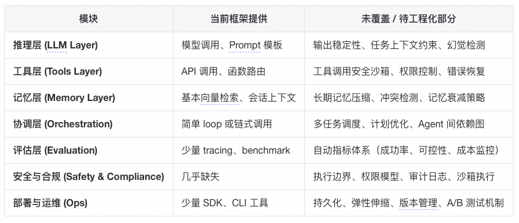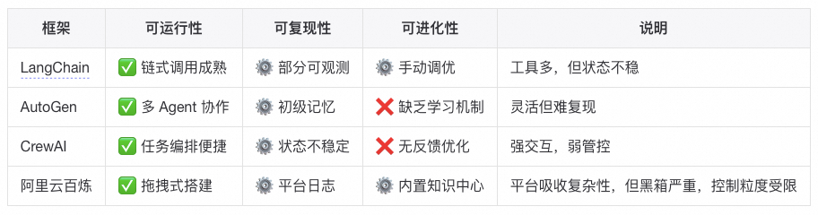

  * ✅ 可运行性：普遍支持良好（开发门槛低）
  * ⚙️ 可复现性：仅局部支持（需自建状态与观测层）
  * ❌ 可进化性：仍靠人工与系统设计

LangChain 让 Agent “能搭”，却让系统失去了“能解释”的能力。复杂性并未消失，只是从代码层迁移到了运行时。

我们再来深入的分析一下运行时的复杂度，即Agent系统带来的新问题——它不仅要运行，还要「持续思考」，而思考的副作用就是不稳定性。这些复杂性不是「传统的代码复杂度」，而是「智能行为带来的系统不确定性」。它们让 Agent 工程更像在管理一个复杂适应系统 ，而非线性可控的软件。

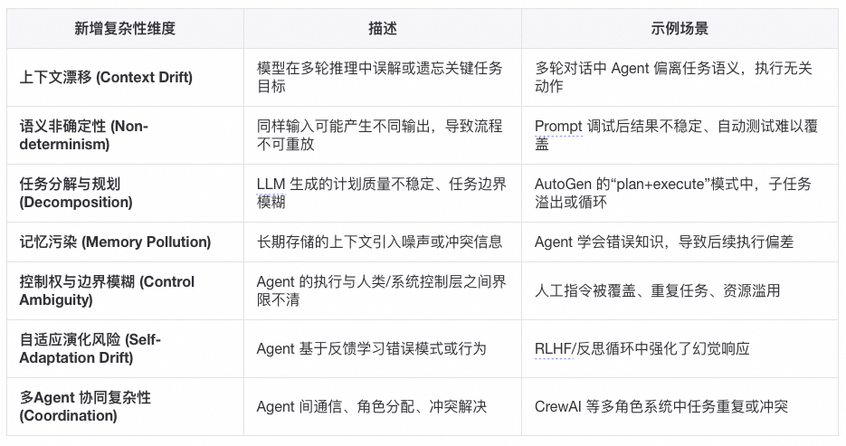

#### Agent唯一解是系统化

1\. 问题规模放大后 Prompt Hack 失效，单一问题场景，改 prompt 就能跑通，但是当任务复杂度、场景数量增加，prompt 就会变得臃肿不可控（比如一个 prompt 里要塞几十条规则），就像写 SQL 时拼接字符串，开始能跑，最后一定注入 + 维护灾难。系统化帮助Agent结构化约束 + 自动化编排，而不是人肉调 prompt。2\. 不确定性需要可控性，一次性跑出来成功就算赢，但是在生产环境必须 99% 正确（甚至100%），哪怕 1% 幻觉就会积累成灾难，例如像日志分析 Agent，错报/漏报一次可能导致线上事故没被发现。系统化通过测试、监控、回放验证，确保可控，而不是每次都赌运气。3\. 知识沉淀 vs 重复踩坑，Agent今天改 prompt 能解决 bug，明天来了新需求又重新摸索。知识没有沉淀，Agent 不能记忆/复用，最终不断重复劳动。同事抱怨过一个业务系统的开发中prompt修改的commit占所有代码提交的三分之一以上，但是另一同事遇到同类问题想复用这个prompt发现完全无法迁移还要重新 hack。系统化就是通过`Memory + 知识库`保证 Agent 能学到、积累下来，不是每次都重造轮子。

Prompt Hack/Demo Agent 能解决的是“小问题”，系统化 Agent 才能解决“扩展性、可靠性、沉淀”的问题。这些问题现在可能不明显，但随着使用时间和范围扩大，必然会爆发。

Demo Agent 确实能解决问题，但只能解决今天的问题，系统化 Agent 才能解决明天和后天的问题。

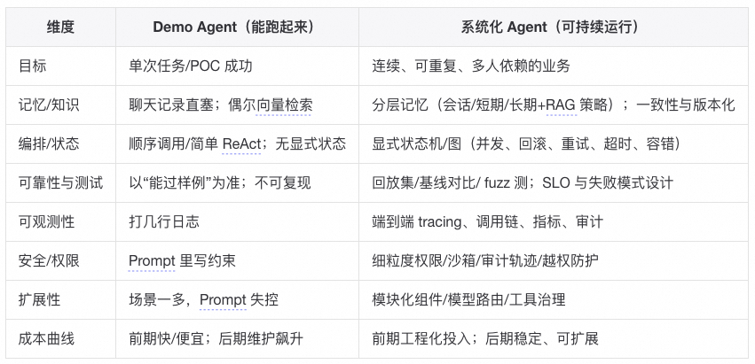

## 四、Agent从“聪明”到“可靠”

### 4.1. 一些真实Agent案例

以史为镜，可以知兴替；以人为镜，可以明得失，我在Agent系统开发过程中碰到的问题一定不止我一个人，我让ChatGPT帮我搜索了Reddit、GitHub、Blog中关于Agent开发的案例，想借助别人的案例来验证我自己的思考和反思是否一致：

#### 玩具级 Agent 的典型失败

  * Auto-GPT 社区多次反馈：循环、卡死、无法完结任务（早期最典型的“能跑但不可靠”），Auto-GPT seems nearly unusable[1]
  * 开发者质疑“代理能否上生产”，实际尝试后指出多步任务中跳步/幻觉严重（仅靠系统 prompt+函数调用不行），Seriously, can LLM agents REALLY work in production?[2]
  * OpenAI Realtime Agents 官方示例库 issue：即便是“简单 demo”，使用者也反馈幻觉过多，不具备非 demo 可用性，Lots of hallucinations?[3]

#### 上生产后暴露的工程问题（不是改 Prompt 能解决）

  * LangGraph 生产部署并发压力下“can't start a new thread”（Celery 内多节点并行触发的资源/并发问题），Handling "RuntimeError: can't start a new thread" error at production.[4]
  * LangChain 版本升级导致生产多代理应用直接崩（`__aenter__`）：显示依赖/版本锁定与回归测试的必要性，AgentExecutor ainvoke stopped working after version upgrade[5]

#### 行业/大厂公开复盘：为什么需要“系统化能力”

  * Anthropic：有效的代理来自“可组合的简单模式+工程化实践”，而非堆框架（从大量客户项目中总结），Building Effective AI Agents[6]
  * OpenAI：发布 Agents SDK + 内置可观测性，明确指出“把能力变成生产级代理很难，需要可视化/追踪/编排工具”，New tools for building agents[7]
  * AWS Strands Agents SDK：官方强调生产级可观测性是关键设计点，内建遥测/日志/指标钩子，Strands Agents SDK: A technical deep dive into agent architectures and observability[8]
  * Salesforce（Agentforce）博客：总结生产失败 5 大原因（检索静默失败、缺乏容错、把 ReAct 当编排等），主张工程化 RAG/容错/评估，5 Reasons Why AI Agents and RAG Pipelines Fail in Production (And How to Fix It)[9]
  * LangChain 团队：为什么要做 LangGraph/平台——为控制、耐久性、长运行/突发流量、检查点、重试、记忆而生，并称其已被LinkedIn/Uber/Klarna用于生产代理（厂商口径，但点出“系统化要素”），Building LangGraph: Designing an Agent Runtime from first principles[10]

#### 正向案例：当你用“分布式系统心态”做编排/容错

  * 社区经验：把 LLM 编排当分布式系统来做，通过重试/退避/幂等/断路器/持久化队列等模式把多步工作流完成率拉到 99.5%（工程实战帖，强调“系统化”方法论），Production LLM reliability: How I achieved 99.5% job completion despite constant 429 errors[11]

#### 社区实况：有人在生产用，但都在谈“去复杂化 + 有限代理”

  * LangGraph 在产线可用的开发者反馈：从 LangChain 的 Agent Executor 迁移；原型→精简→保留必要能力的路线更稳健（去幻觉/去花哨，保留可控），Anyone Using Langchai Agents in production?[12]

### 4.2. Agent开发的四个阶段

一年多的Agent开发，我经历Agent很简单到Agent真复杂的认知变化，最开始把框架当黑盒，写 prompt 拼拼凑凑，就能跑个 demo，随着场景复杂性提升需要往Agent系统研发的深处走时，难点就逐步暴露出来。我尝试把这个“简单 → 真难”的过程拆了一下：

#### 第一阶段：Hello World 阶段（看起来很简单）

用 LangChain / AutoGen / CrewAI 之类的框架，几行代码就能跑起来。大多数人停在“能对话”、“能调用工具”这层，所以觉得“AI Agent 开发不过如此”。

#### 第二阶段：场景适配阶段（开始遇到坑）

随着Agent解决问题的复杂度提升，慢慢会碰到LLM context窗口装不下，需要裁剪、压缩、选择（即Context 管理问题）；发现向量检索结果经常无关、答非所问，需要优化预处理、query 重写（RAG知识管理）。简单场景能跑，稍微复杂点就掉坑。

#### 第三阶段：系统化阶段（复杂性爆炸）

再进一步，Agent随着工具调用、上下文管理增加，需要保证跨会话、跨任务一致性，必须考虑持久化、版本控制、冲突解决。单个Agent无法适应复杂任务，需要多 Agent 协同，此时就必须解决 deadlock、任务冲突、状态回滚。任务的复杂性上来了Agent 流程调试就不是改改 prompt 能解决的，要加 tracing、可观测性工具。

#### 第四阶段：工程落地阶段（真正的硬骨头）

  * 业务逻辑 Agent 化：如何测试？如何保证可控性和稳定性？
  * 安全与合规：权限、越权调用、数据泄露，必须引入严格的安全边界。
  * 监控与 SLO：像运维微服务一样，需要监控、报警、故障恢复。

综上所述，Langchain等框架让Agent“起步门槛”变低，但没有降低“落地门槛”。

### 4.3. 我对Agent开发认知的演化

我一直围绕自己工作中涉及到的漏洞安全评估开发Agent系统，在经历上面提到的四个Agent开发的时候，我对Agent的思考和理解也在变化：

#### Level 0：框架幻觉层

  * **典型行为** ：装个 LangChain / AutoGen / CrewAI，跑个官方 demo，改一改 prompt。
  * **认知特征** ：觉得“Agent 开发=写 Prompt”，门槛极低，和写脚本差不多。
  * **误区** ：以为框架解决了一切复杂性，忽略了 memory、编排、测试、安全。

#### Level 1：场景拼接层

  * **典型行为** ：能把 RAG、工具调用、简单多 Agent 编排拼接在一起，做一个看似可用的原型。
  * **认知特征** ：开始意识到 context 管理、RAG 策略的重要性。
  * **痛点** ：遇到“答非所问”“记忆错乱”“任务无法稳定完成”。
  * **误区** ：尝试用 prompt hack 解决所有问题，忽略了底层信息管理和系统设计。

#### Level 2：系统设计层

  * **典型行为** ：将 Agent 当成微服务系统，需要考虑架构、可观测性、状态管理。
  * **认知特征** ：理解 memory 本质上是数据库/知识库问题，编排更像工作流调度而非聊天。
  * **痛点** ：debug 成本极高；需要 tracing、日志、指标监控。
  * **关键挑战** ：如何确保 Agent **鲁棒性、可控性、可复现性** 。

#### Level 3：工程落地层

  * **典型行为** ：将 Agent 投入业务生产环境。
  * **认知特征** ：把 Agent 开发当成 **SRE/安全/分布式系统** 一样的工程学科。
  * **痛点** ：

  * **测试性** ：LLM 的非确定性导致无法用传统单测保证稳定。
  * **安全性** ：权限管理、越权调用、prompt 注入防护。
  * **监控与SLO** ：Agent 必须像服务一样可观测、可恢复。

  * **关键挑战** ： **如何让 Agent 可靠到能承载关键业务。**

####  Level 4：智能演化层（前沿探索）

  * **典型行为** ：尝试构建有长期记忆、自主学习、可进化的 Agent 体系。
  * **认知特征** ：不再把 Agent 当 LLM wrapper，而是当 **新型分布式智能系统** 。
  * **挑战** ：

  * memory 变成知识图谱 + 自适应学习问题；
  * 编排涉及博弈、协作甚至涌现行为；
  * 安全需要“AI sandboxes”，避免失控；

  * **现状** ：大多数人还没到这个阶段，研究和实验为主。

结合当下对Agent的理解，当前我对Agent的定位是将其视作一个系统组件而非智能机器人，我的目标不是“偶尔惊艳”而是“持续可靠”。基本原则：

### 1\. 原则：

  * 先稳定，后聪明；
  * 先可观测，后优化；

### 2\. 功能：

  * 建立状态与日志的可回放机制；
  * 对 Prompt / Memory / RAG 做版本追踪；
  * 引入观测指标（成功率、漂移率、冗余调用）；
  * 明确每个 Agent 的边界与权限范围；
  * 在设计上预留“错误恢复”通道；

### 3\. 边界：

  * 若 Agent 仅用于一次性任务或探索性实验，复杂度控制可以放宽。
  * 若用于生产任务（监控、自动化操作），稳定性与安全边界优先。
  * 框架封装越深，越需要额外的可解释层。

### 4.4. Agent智能化之路

好像有人说2025是Agent元年，经过将近一年的Agent技术迭代，Agent也从工程角度有了比较长足的发展，Langchain基本上已经成为Agent system后端的优先选项，Agent研发也经历 prompt engineering --> context engineering的演变（如下图所示）。

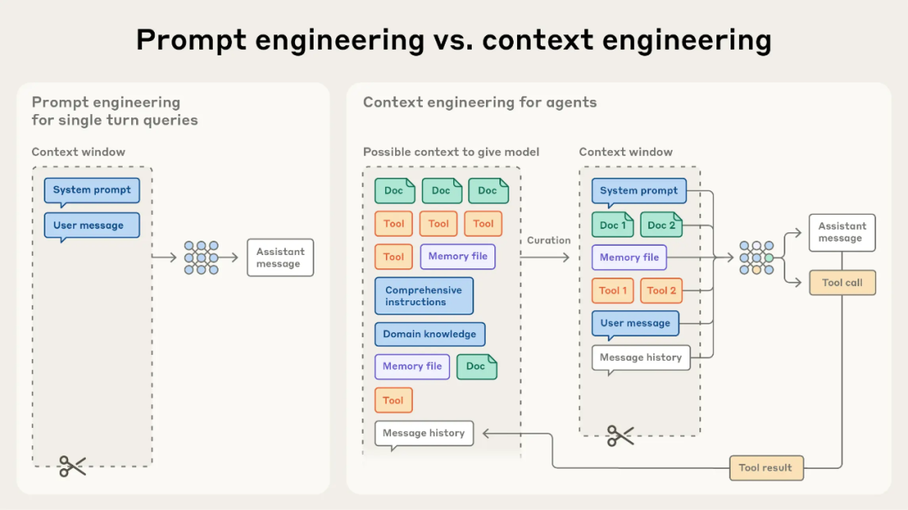

图片源自：Effective context engineering for AI agents | Anthorpic

#### Agent开发思路

Agent 不是万能药，关键在于为不同复杂度的任务选择合适的自动化阶段。我觉得从Agent的五个演进阶段可以看出：

1\. 复杂 ≠ 更好

  * 不要盲目追求“最强的 Agent 架构”；合适才是关键。
  * 对简单任务使用复杂系统，只会增加成本和风险。

2\. 真正的挑战是“人”

  * 许多失败案例源于设计者错误地选择架构、缺乏阶段性思维。
  * 模型和工作流不是问题所在，人是。

3\. 设计思维的重要性

  * 首先评估任务复杂度与可自动化程度；
  * 然后决定所需智能水平（脚本 → LLM → RPA → Agent → Multi-Agent）；
  * 最后匹配合适工具，而不是“一刀切”。

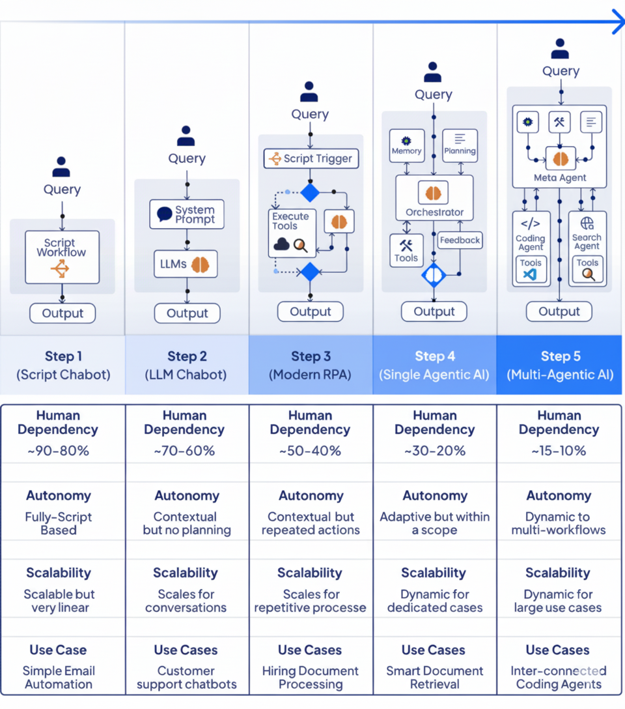图片源自：Progression of Agentic AI | LinkedIn

#### Agent设计模式

  * ReAct Pattern（Reasoning + Acting）

  * 结构：分为推理（Reasoning）与行动（Acting）两个阶段；
  * 机制：

  * LLM1：理解上下文、规划调用的工具/API；
  * LLM2：执行行动、返回结果；

  * 优点：推理与行动解耦、结构清晰；
  * 应用：问答、多步任务、工具驱动型工作流；

  * CodeAct Pattern

  * 流程：

  * User → Plan：用户给出任务，Agent 规划步骤；
  * Code → Feedback：生成并执行代码，根据结果修正；

  * 特征：引入反馈循环（代码执行→结果→反思）；
  * 应用：可验证型任务（数据处理、分析、API 调用）；
  * 代表思想：AI 通过代码行动；

  * Tool Use Pattern

  * 核心概念：从单一 API 调用升级为统一协议（MCP）管理工具；

  * 特点：

  * 工具抽象化与标准化；
  * 支持多模态、多来源工具接入；

  * 意义：大幅提高 Agent 的生态兼容性与扩展性；

  * Self-Reflection / Reflexion Pattern

  * 架构：

  * Main LLM：执行主任务；
  * Critique LLM(s)：批评/审查主模型输出；
  * Generator：结合反馈生成最终答案；

  * 优势：

  * 引入“自我反思”机制；
  * 降低幻觉率，提升逻辑与质量一致性；

  * 应用：科研、内容生成、高风险决策场景；

  * Multi-Agent Workflow

  * 结构：

  * Core Agent：协调任务分配；

  * Sub-Agents：各自专注于特定功能/领域；

  * Aggregator：整合子代理输出；

  * 特征：

  * 模拟真实团队协作；

  * 支持复杂、跨流程任务；

  * 应用：企业级系统、自动化编程、跨部门流程；

  * Agentic RAG Pattern

  * 流程：

  * Agent 使用工具执行 Web / Vector 检索；

  * Main Agent 融合检索结果与自身推理；

  * Generator 生成最终答案；

  * 特征：

  * 动态化的检索 + 推理；

  * Agent 能自主决定“是否、何时、如何”检索；

  * 意义：从静态 RAG → 智能、可决策的 Agentic RAG；

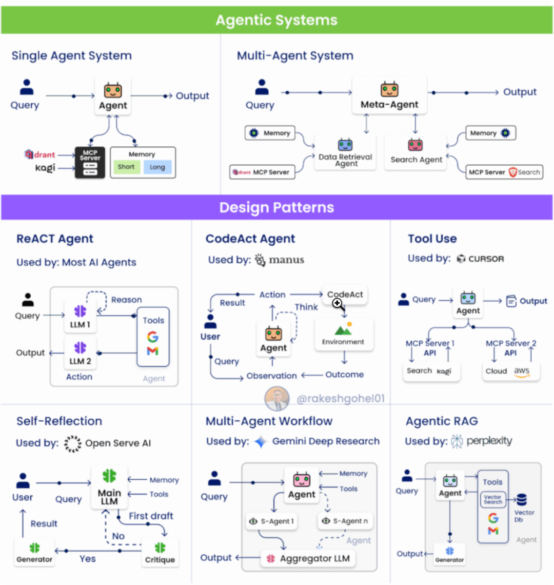

图片源自：Agentic System | LinkedIn

#### Agent最新进展

最后，我想总结一下当下Agent工程上最新进展以及Agent system最新的工程经验值得借鉴与学习：

  * Agentic Design Pattern(by Google Antonio Gulli)，PDF[13]
  * Build agentic AI systems(by Adrew Ng)，Course[14]

下面是Agent开发的一些takeaway，有心者可以找来看看各家Agent玩家是怎么计划自己的Agent战略的。

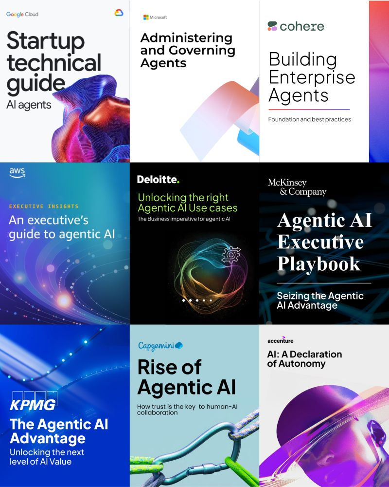

图片源自：Rakesh Gohel | LinkedIn

 _**最后，也许未来的框架能进一步吸收这些复杂性。但工程师的角色不会因此消失。我们要做的，是在复杂性被隐藏的地方，重新建立秩序 —— 让智能不只是可调用，更是可驯服。**_

参考链接：

[1]https://www.reddit.com/r/AutoGPT/comments/13gpirj/autogpt_seems_nearly_unusable/

[2]https://www.reddit.com/r/LocalLLaMA/comments/1cyuc07/seriously_can_llm_agents_really_work_in/

[3]https://github.com/openai/openai-realtime-agents/issues/2

[4]https://github.com/langchain-ai/langgraph/issues/2873

[5]https://github.com/langchain-ai/langchain/discussions/23762

[6]https://www.anthropic.com/engineering/building-effective-agents

[7]https://openai.com/index/new-tools-for-building-agents/

[8]https://aws.amazon.com/blogs/machine-learning/strands-agents-sdk-a-technical-deep-dive-into-agent-architectures-and-observability/

[9]https://www.salesforce.com/blog/ai-agent-rag/

[10]https://blog.langchain.com/building-langgraph/

[11]https://www.reddit.com/r/LLMDevs/comments/1mk12p9/production_llm_reliability_how_i_achieved_995_job/

[12]https://www.reddit.com/r/LangChain/comments/1i81qks/anyone_using_langchai_agents_in_production/

[13]https://drive.google.com/file/d/17a0Ld9TDHsVii-jbKdl-1Ycj9EgAou3b/view

[14]https://www.deeplearning.ai/courses/agentic-ai/

****

### 颠覆传统 BI，用自然语言与数据对话

针对企业在数据分析过程中面临的取数难、报表效率低和数据割裂等问题，Quick BI 作为企业级分析 Agent，支持通过自然语言完成看板搭建与数据获取，借助 AI 发现异常并归因，真正实现“ChatBI，对话即分析”，显著提升数据使用效率与用户体验，助力企业高效运营、科学决策。

## 点击阅读原文查看详情。
