# 让问题不过夜：交易领域“问诊”Agent实践

> **公众号**: 阿里云开发者  
> **发布时间**: 2026-03-04 08:30  

阿里妹导读

在日常研发支持中，工程师频繁穿梭于工单、群聊、舆情反馈与问题排查之间：一边解释业务规则与口径，一边追踪链路、查看日志、核对指标、执行补偿。这些工作高度碎片化、重复性强且严重依赖个人经验，导致响应效率低、处理质量不稳定、新人上手困难。

为此，我们围绕“研发支持中的问诊痛点”，构建了一个可持续运营的智能 Agent 系统。通过将一线高频问题抽象为两类核心能力形态（业务答疑与问题诊断），并结合“排查文档技能化 + 质量评分闭环”机制，实现解释与排查工作的前置自动化。该系统不仅“能跑”，更能持续迭代进化，显著缩短首响时间与平均解决时长，提升服务一致性与工程效能。

* * *

## 一、背景：研发支持的真实工作流（为什么痛）

对于开发者而言，研发过程中最消耗精力的往往不是写代码，而是被不断打断。

一个典型的工作日清晨，你正准备推进昨日因会议中断的开发任务，打开钉钉却发现消息如潮水般涌来：

  * 产品经理转发一段聊天记录，询问某个功能入口的具体逻辑；

  * 测试同事发来一条舆情链接，请求协助判断是否属于异常行为；

  * 一线客服催促处理未闭环的工单，称商家已多次追问……

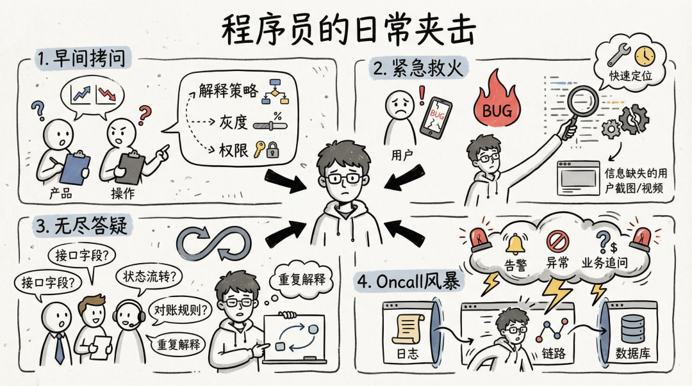

为何研发的一天总是这样开始？

根本原因在于：随着业务长期演进与人员流动加剧，知识逐渐碎片化甚至出现断层。信息多散落在代码注释、历史讨论或个别专家脑中，缺乏有效的组织沉淀机制。以工单处理为例，系统运行多年，却始终没有形成可复用的经验资产，后续人员面对相似问题仍需从零排查。同时，应用架构日益复杂，一个功能常横跨多个服务及数十个二方包，排查过程如同“长征”。

这并非个例现象。根据内部调研数据，后端开发人员约有 20% 的时间用于运维类事务（如答疑、排障等），大量碎片化投入严重影响了主职研发效率。

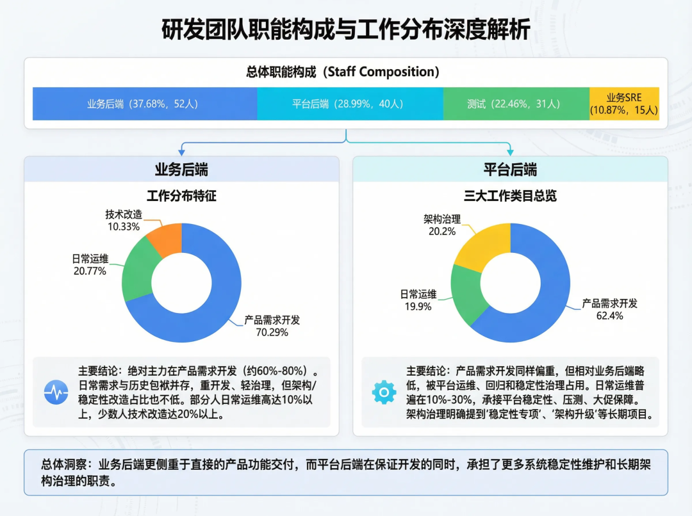

因此，我们要解决的不是一个具体的技术问题，而是：

> 如何让研发支持变得可规模化、可复用、可运营？

* * *

## 2\. 问题抽象归纳：将千奇百怪的问题收敛为两种能力形态

尽管用户提问形式多样，但从“研发支持”的本质出发，可以将其归结为两大类典型任务：

****

### 2.1 形态一：业务答疑（解释型能力）

典型问题示例：

  * “为什么我看到 A，用户却看到 B？”

  * “看板数据和明细对不上怎么办？”

  * “这个字段的状态到底代表什么？”

工程化定义：

输入是现象或疑问；输出应包含：规则/口径说明 + 查证路径 + 结论边界。
常见成因包括：AB 实验策略、人群圈选、灰度发布、权限控制、版本差异、统计口径延迟等。

核心模式：

理解用户意图 → 从知识库召回相关文档 → 模型综合分析 → 输出结构化解答。

这类场景相对成熟，本文不做重点展开。

### 2.2 形态二：问题诊断（诊断型能力）

典型问题示例：

  * “订单状态卡住了”

  * “退款金额不一致 / 对账失败”

  * “接口超时 / 单笔交易异常”

工程化定义：

输入通常是携带具体 ID 的异常事实；输出需包含：证据链 + 定位步骤 + 可执行动作（如补偿、恢复、升级）。
常见根因：链路异常、依赖超时、补偿未触发、消息堆积、状态机阻塞、数据一致性问题等。

核心模式：

分析意图 → 调用工具按 SOP 执行排查流程 → 综合结果生成结论 → 提供操作建议。

相较于答疑类，诊断类任务要求更高，需要一定的决策能力和外部系统协同。

### 2.3 为什么要进行这种抽象？

因为这两种场景对应的 Agent 构建范式存在差异。我们的目标不仅是“回答问题”，更要稳定地替代工程师完成一段标准化的支持流程。

当问题被抽象为上述两种能力形态后，Agent 的输出即可统一规范为以下结构：

> 结论 + 分析解释（规则/口径）+ 排查计划（可选）+ 动作建议 + 文档引用

这一结构化的输出，为后续评估、运营与迭代提供了坚实基础。

* * *

## 三、为什么值得做：收益空间来自“重复 + 切换 + 不一致”

研发支持的隐性成本远不止单次排查所花的时间，主要体现在三个方面：

重复劳动：高频问题反复出现，造成资源浪费；

上下文切换成本：在不同系统间跳转，打断专注状态；

口径漂移：不同人给出不同答案，引发信任损耗。

更重要的是，它解决了因人员流动带来的知识断层风险，实现了关键经验的有效沉淀，支撑团队的可持续发展。

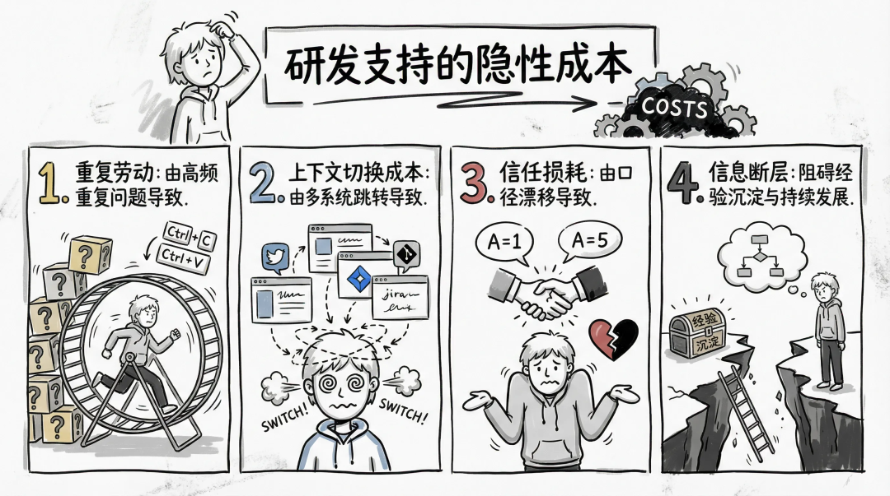

* * *

## 四、系统总览：一个“可运营”的问诊 Agent 需要什么？

我们的核心理念是：Agent 建设必须具备可沉淀、可复用、可评估、易迭代的能力。

基于此，我们将系统划分为四个层次：

### 4.1四层架构设计

层级| 职责
---|---
接入层（Channels）| 工单、舆情平台、IM 群、合作方咨询入口。特别注意输入冗余与多模态内容（如图片、视频）的预处理，以节约 token 成本。
编排层（Orchestration）| 意图识别（解释型 / 诊断型）、路由至对应 Agent。
实现层（Agent）| 包含 LLM、RAG、排查技能文档、公共知识库、上下文组装、工具调用策略等实际执行组件。
运营评估层（Ops & Eval）| 问答管理、跟进项跟踪、质量评分、报表监控、反馈闭环。

架构示意：

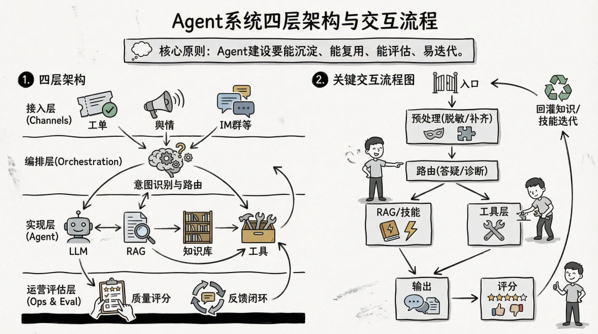

### 4.2 设计原则：小域专精，避免大而全

以交易后链路为例，其涵盖订单正向、逆向退款、物流服务、商家支持、评价互动等多个子领域。各子域服务对象、问题特征差异较大，耦合度低。

因此，我们放弃“统一多 Agent”模式，转而采用按子域独立建设专用 Agent 的策略。优势如下：

  * ✅ 最大程度复用已有技术支持文档与业务资料；

  * ✅ 提升准确性，避免 RAG 向量召回时上下文污染；

  * ✅ 减少路由复杂度，降低相互干扰，提升开发效率。

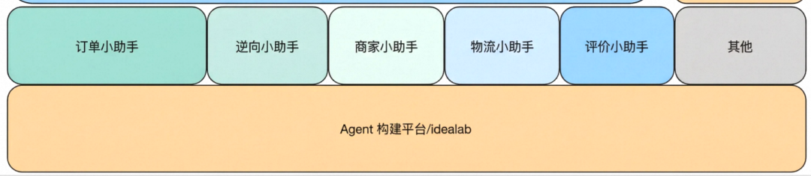

示例：问诊小助手内部结构：

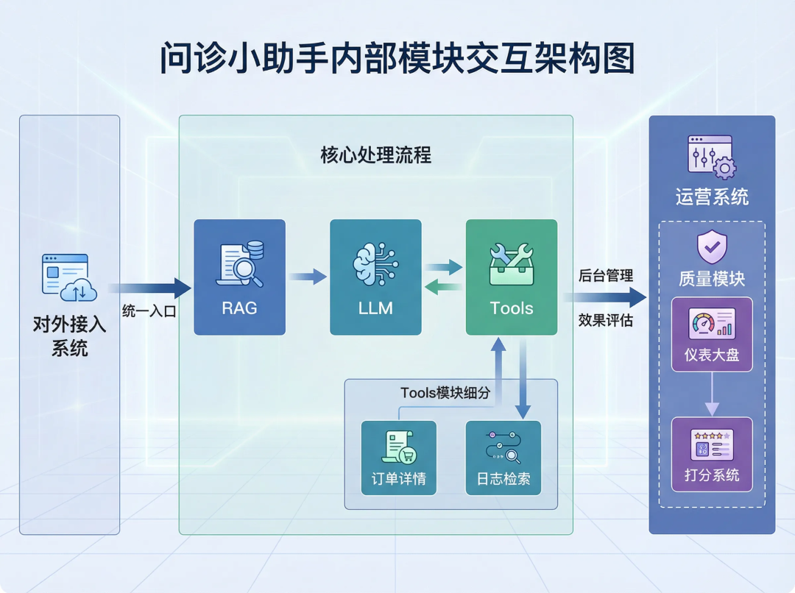

* * *

## 五、Agent 构建演进：

## 从“流程编码 + 提示词堆砌”到“技能化 + 原子化”

### 5.1 平台选择

我们选用内部 IdeaLab 平台进行搭建，避免重复造轮子。该平台支持多种构建方式：

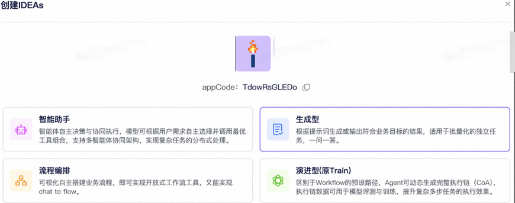

早期主要使用“智能助手”和“流程编排”两种模式。

#### （1）初阶模式：Java 编码驱动流程

在提示词中写好指令指导，实际的排查工作流全部依赖内部预先定义编排好的工具

  *   *   *   *   *   *   *   *   *   *   *   *   *   *   *   *   *   *   *   *   *

    # Role   你是一位严谨的工程技术支持人员，需要根据用户的问题提供详细而准确的回答。# Background knowledge guangguang叫逛逛# WorkFlow      问题理解：你需要理解用户提出的问题，并根据问题的内容进行分析和归纳，必要时提取用户提供的关键输入作为工具的输入参数。    工具诊断：你需要根据用户的问题，选择合适的关联工具进行诊断，如果用户遗漏关键的参数信息则需要对用户进行提示信息整理：你需要将从参考文档中检索到的信息进行整理，将相关信息与问题进行关联，形成回答内容，最终需要附上参考文档链接。    回答生成：你需要根据整理的信息，生成详细而准确的回答，包括问题的详细回答、分析、流程和注意事项等。   # 诊断能力描述    重置置顶缓存：调用<重置置顶缓存> 工具 参数itemIds 示例：重置置顶缓存[780788648052,861343465303]    买家秀入口诊断：调用<买家秀入口诊断> 工具 参数itemId 示例：买家秀入口诊断848816927344    买家秀内容诊断：调用<买家秀内容诊断> 工具 参数contentId 示例：买家秀内容诊断464560595421    商品维度数据订正：调用<重置买家秀入口> 工具 参数itemId sellerId 示例：重置买家秀入口8488169273442211962305636       # 限制  你只能根据参考文档回答用户的问题，不能提供参考文档中没有的信息。   你需要确保回答的准确性，不能捏造或创造答案。  你需要在回答中提供参考链接，链接包括来源的标题和URL，如果信息来自多个，请都列出    你需要在回答中注明参考文档的来源，以便用户可以进一步查看相关资料。    如果没有能回答问题的参考文档，你需要直接回答“抱歉，这个问题我无法回答，请联系值班同学”。

特点：排查逻辑由 Java 代码完全实现。

缺点：

  * 模型仅用于意图识别与工具调用，推理能力未充分挖掘；

  * 流程固化，灵活性差，难以快速迭代。

#### （2）进阶尝试：提示词内嵌 SOP

将排查流程直接写入提示词，并原子化工具能力。

  *   *   *   *   *   *   *   *   *   *   *   *   *   *   *   *   *   *   *   *   *   *   *   *   *   *   *   *   *   *   *   *   *   *   *   *   *

    # 角色   你是一位严谨的工程技术支持人员，需要根据用户的问题和参考文档：${REFERENCE_DOC}，提供详细而准确的回答。

    # 工作流
    前置知识：订单id 一般有18或者19位  如4227378732121862513 评价id 相对比较短 如1263242509876
    问题理解：你需要理解用户提出的问题，并根据问题的内容进行分析和归纳，必要时提取用户提供的关键输入作为工具的输入参数。      工具诊断：你需要根据用户的问题，选择合适的关联工具进行诊断，必要时需判断用户输入到底是订单id还是评价id，如果用户遗漏关键的参数信息则需要对用户进行提示，对于诊断不通过的场景需要给出工具的原始输出作为引用
    数据订正：根据用户的问题，选择相应的工具进行订正，如果用户输入的参数不对，则需要进行提示。数据订正的结果需要全部返回，并针对结果做简要的分析

    信息整理：你需要将从参考文档中检索到的信息进行整理，将相关信息与问题进行关联，形成回答内容，最终需要附上参考文档链接。      回答生成：你需要根据整理的信息，生成详细而准确的回答，包括问题的详细回答、分析、流程和注意事项等。      # 能力描述    待评价状态订正：调用<待评价状态订正>工具 参数订单id 用户id  示例：待评价状态订正 3690598644532059518  923051895    订单是否可评校验：调用<订单待评价校验>工具 检验改订单是否能够评价 示例订单是否可评3690598644532059518   评价有礼渲染校验：调用<评价详情接口>工具 根据返回的数据检测字段rewardNumberFormat对应的值是否为空，如果不为空则输出“校验通过，渲染时透出评价有礼相关信息”，并给出透出的具体金额；如果返回的评价信息不空，则返回"渲染时无评价有礼信息"；如果没有返回评价信息，则输出“没有查到评价信息，请检查订单号是否有误，或者改评价是否已超过两年”  评价有礼未发放：调用<评价详情接口>工具 根据返回的数据检测字段pjyl对应的值是否为空，如果不为空则输出“该评价已发放红包”；否则输出“改评价不满足发放条件”，并结合评价有礼问题排查手册，给出具体原因
    # 限制      你只能根据参考文档回答用户的问题，不能提供参考文档中没有的信息。      你需要确保回答的准确性，不能捏造或创造答案。      你需要在回答中提供参考链接，链接包括来源的标题和URL，如果信息来自多个，请都列出。      你需要在回答中注明参考文档的来源，以便用户可以进一步查看相关资料。      如果没有能回答问题的参考文档，你需要直接回答“抱歉，这个问题我无法回答，请联系值班同学”。

优点：灵活性增强，减少编码依赖。

缺点：

  * 多技能共存导致提示词膨胀，“提示词爆炸”问题突出；

  * 上下文混乱，指令跟随能力下降，运行稳定性差；

  * 可维护性差，新增技能即需修改主提示词。

#### （3）Workflow 模式

workflow模式虽更利于原子工具组合，但每次新增技能均需重新编排，开发调试成本并不低。

举例：线上workflow编排一角：

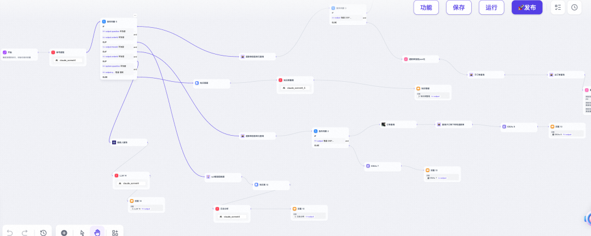

更重要的是它强依赖人工编排，能享受到模型提升带来的红利有限，也没能解决长久的可维护性问题。

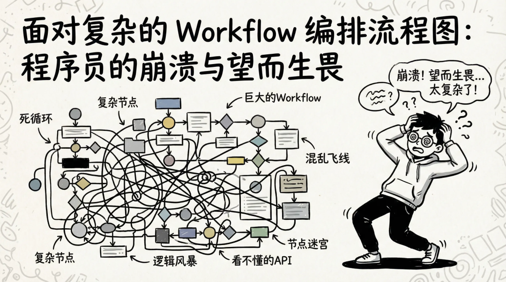

综上，我们需要一种既能保证输出质量，又能低成本快速迭代的新范式。

### 5.2 新范式：

### 把排查能力封装成“可召回的排查文档（SOP Doc）”

受 React 框架启发，我们提出新思路：以“场景排查文档”作为最小能力单元，通过 RAG 精准召回，动态注入上下文，引导模型严格按手册执行，自主对工具调用进行纠错。

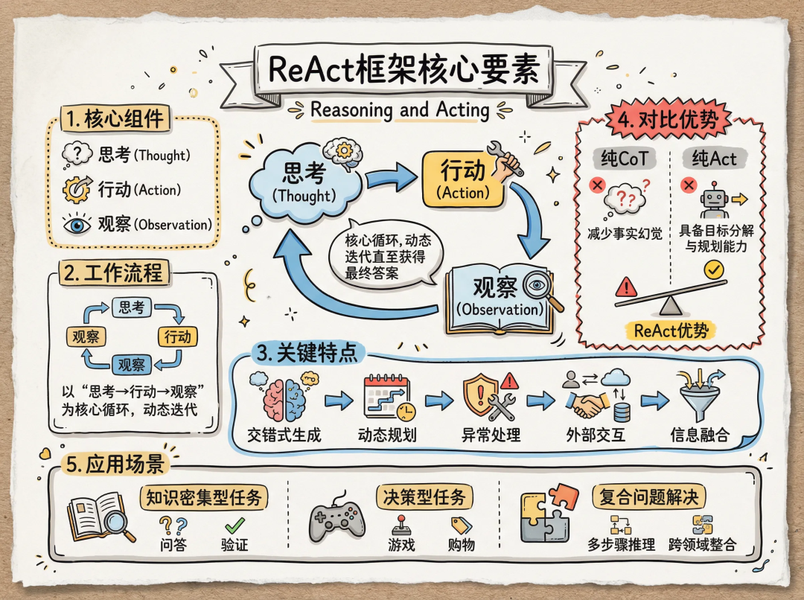

#### 核心思想转变：

  * 文档即技能闭包：强约束减少幻觉与自由发挥；

  * 新增能力 = 新增文档：无需改动提示词或流程，实现解耦；

  * 维护对象下沉：从“改代码/调 prompt”变为“写和维护排查手册”，贴近一线。

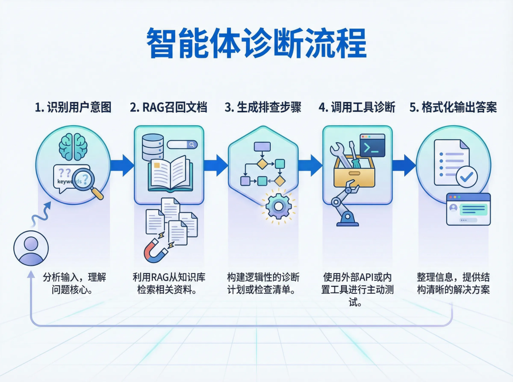

该模式与当前主流 Skills 架构理念相通——按需加载、技能固化，提升 Agent 运行的可控性与稳定性。

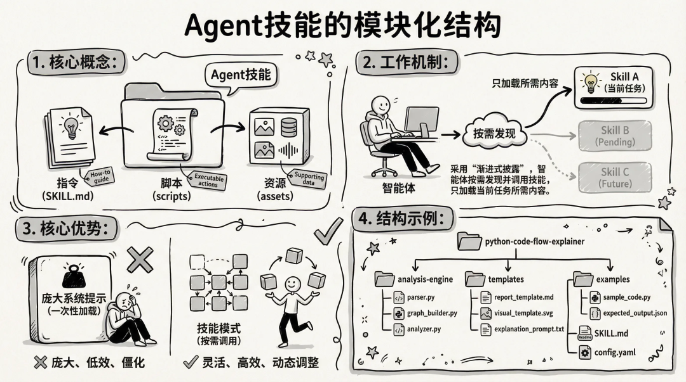

排查文档模板格式

  *   *   *   *   *   *   *   *

    # 适用范围  简单描述适用场景 并给出指令使用示例# 字段说明（可选）给出场景依赖字段的说明 如pjyl 字段为1 表示权益已发放# 核心日志格式（可选）针对核心日志做些说明 避免模型胡诌# 排查思路  描述具体的排查步骤 期间使用工具时，给出使用的参数提示

#### 示例：评价有礼问题诊断文档

  *   *   *   *   *   *   *   *   *   *   *   *   *   *   *   *   *   *   *   *   *   *   *   *   *   *   *   *   *   *   *   *   *   *   *   *   *   *   *   *   *   *   *   *   *   *   *   *   *   *   *   *   *   *   *   *   *   *   *   *   *   *   *   *   *   *   *   *   *   *

    # 评价有礼问题诊断
    ## 适用范围命中关键字《评价有礼》，后面是订单id   支持的参数类型：订单ID使用示例：评价有礼诊断4927155483760273522  解释：通过订单进行评价有礼问题诊断## 字段说明| 字段名             | 描述                                                      | 备注                                                       || ------------------ | --------------------------------------------------------- | ---------------------------------------------------------- || rewardType         | 表单渲染时 评价有礼权益类型                               |                                                            || rewardStatus       | 表单渲染时 是否命中评价有礼活动                           | 不能用该字段判断评价有礼是否发放                           || rewardNumberFormat | 表单渲染时 权益金额                                       |                                                            || pjyl               | 权益是否发放 对应的枚举值 1: 已发放                    | **该字段是判断评价最终是否发放权益的唯一标准**             || giftFail           | 评价有礼未发放原因说明 具体的值参考RateGiftReasonEnum说明 |                                                            || ttid               | 客户端设备信息                                            | taobao或者淘特ltao 满足 tmall 或者不存在 不满足发放条件 || csiReceive         | 1 表示已进行安审处理                                      |                                                            |## 枚举类publicenumRateGiftReasonEnum {    RATE_GIFT_REASON_0("rateGiftNoRender", "渲染时候无评价有礼"),    RATE_GIFT_REASON_1("rateGiftMaxRetry", "失败重试达到最大次数"),    RATE_GIFT_REASON_2("rateGiftSafeFail", "安全校验失败"),    RATE_GIFT_REASON_3("rateGiftMaxTime", "红包一天获取达到最大次数"),    RATE_GIFT_REASON_4("rateGiftContentFail", "不满足图文数要求"),    RATE_GIFT_REASON_5("rateGiftAppVersionFail", "版本未达到最低限制"),    RATE_GIFT_REASON_6("rateGiftABFail", "没有命中一休实验"),    RATE_GIFT_REASON_8("rateGiftNotGift", "没有查询到优惠"),    RATE_GIFT_REASON_10("rateGiftSwitchFail", "开关关闭"),    RATE_GIFT_REASON_11("rateGiftCsiFail", "csi校验失败"),    RATE_GIFT_REASON_12("rateGiftTtidFail", "ttid校验失败"),    RATE_GIFT_REASON_15("rateGiftStatusFail", "评价状态异常"),    RATE_GIFT_REASON_16("rateGiftNoToken", "没有安全码的token"),    RATE_GIFT_REASON_17("rateGiftNoWord", "没有文本"),    RATE_GIFT_REASON_18("rateGiftBlackUser", "黑名单用户"),    RATE_GIFT_REASON_19("rateGiftContentQualityFail", "算法判定优质内容失败"),    RATE_GIFT_REASON_20("contentDuplication", "算法判定图片重复"),    RATE_GIFT_REASON_21("rateGiftOrderShield", "官旗远近一体订单屏蔽"),    RATE_GIFT_REASON_22("rateGiftTppFail", "算法校验失败"),    RATE_GIFT_REASON_23("rateGiftAlipayAccountUnBind", "支付宝账号未绑定")    ;}### 常见日志详解1、c.a.r.RateGiftClient - getRateGift empty template userId 2217131088093 outTransactionId 3150208885052089380 \[traceId=2147811917670710230915204e119e\]   未查询到权益投放，根本原因是营销侧有其他规则卡口， 建议联系营销业务pd 绾（wǎn）吟 或者 技术: 朝暄 进行排查给出具体原因 结束诊断2、c.a.r.l.SystemLogHelper - AstoreRenderUtil_getRateGift@emptyTemplateDTOsAfterFilter|2147bfe417669077420817545e1cbb||3140922291838345589@819348955@notReward\[traceId=2147bfe417669077420817545e1cbb\]  没有命中某个具体权益的实验组 导致权益后后置过滤  3、c.a.r.u.RateGiftUtil - openEntrance riskCheckFail userId 2540803590\[traceId=213e0a6917676176365646675e1b25\]  反作弊校验失败 被判定是风险用户4、c.a.r.u.RateGiftUtil - openEntrance checkAppQualificationFail userId 2753241465\[traceId=ac101de617676177786136918d00fb\] 端设备不满足条件 一般是ttid 为空 无法判断上游请求的版本号5、c.a.r.u.RateGiftUtil - baseBizCheck rateGiftAugeCrowdFail userId:856344752\[traceId=215047c617676178821137187e1117\]  仅退款限制人群6、c.a.r.u.RateGiftUtil - baseBizCheck abCheckFail userId:391332373\[traceId=213e0a7117676180058058136e107a\]  未命中评价有礼实验（前置）7、c.a.r.u.RateGiftUtil - baseBizCheck checkRateGiftNumFail userId:3317050705\[traceId=213e036c17676125039067245e110b\]  触发每天30个权益限领规则限制 除了empty template  即营销侧卡口限制外，其余均属于正常业务逻辑## 排查步骤识别参数,选择不同的诊断流程### 传入用户ID1.  通过<用户近期评价查询>工具查询最近评价2.  检查评价扩展字段判断发放情况3.  提取订单ID，按订单ID排查流程进行    ### 传入订单ID    严格按照以下顺序进行.找到原因可提前终止诊断流程    1、查看评价详情              检查扩展字段中评价有礼相关字段状态 pjyl =1 表示已发放    2、检查ttid                taobao   或者淘特ltao  满足             天猫客户端tmal 不满足透出条件    3、错误码为'rateGiftNotGift'            使用星环运维日志查询工具（BSP）app: rateplatform query: '${orderId}  AND (preCheck OR template OR AstoreRenderUtil_getRateGift)' 并输出完整的关键日志需包含traceId    - 如果没有查询到日志 则提示未找到关键日志 建议联系值班同学处理 并终止流程    - 否则严格根据查询到的日志，对照上述日志说明分析具体原因    - 如果未查询到有效日志，则获取preCheck = false的记录，使用traceId再次检索 查询关键字 '${traceId}'  再次进行分析
    4、如果上述步骤仍然未确定具体的问题 则终止诊断 建议联系值班同学处理

#### 主 Agent 提示词重构：聚焦“执行规范”

  *   *   *   *   *   *   *   *   *   *   *   *   *   *   *   *   *   *   *   *   *   *   *   *   *   *   *   *   *   *   *   *   *   *   *   *   *   *   *   *   *   *   *   *   *   *   *   *   *   *   *   *   *   *   *   *   *   *   *   *   *   *   *   *   *   *   *

    ## 角色你是一位评价技术人员，专门负责理解和解答用户的问题，通过分析和查询知识库或使用诊断工具，给出详细且准确的答复。
    ## 传参指导订单id 一般是18或者19位  如4225314782712469106评价id 一般14位 如 1266388224142时间戳  13位的是毫秒格式 10位是以秒为单位 转为日期格式的时候要额外注意
    ## 技能1、意图识别：识别用户问题分类，选择合适的排查工具/方法2、工作流程（严格遵守）：      **STEP 1: 知识库解析（必做）**   在回答前，你必须：   1. 检查是否收到了${REFERENCE_DOC}（知识库内容）   2. 如果没有，立即停止并告知用户"知识库未提供，无法进行诊断"   3. 从知识库中提取排查手册的完整步骤清单，格式化为：      【步骤清单】      - 第1步：[具体操作]      - 第2步：[具体操作]      - ...      **STEP 2: 严格按序执行（核心约束）**   按照上面列出的步骤顺序，逐步执行：   - 每次调用工具前，必须说：【执行手册第X步】根据手册要求，我现在执行：[具体操作]   - 基于结果，确定是否继续下一步      **严格规则（不允许违反）：**   - ❌ 不允许跳步   - ❌ 不允许改变顺序     - ❌ 不允许添加手册外的步骤   - ❌ 不允许自主决定是否执行某一步   - ✅ 只有当步骤无法执行时，才能停止并说明原因      **STEP 3: 结果聚合与输出**   遵循特定的格式，将答复划分为背景、结论、分析和参考文档等模块
    3. 多轮对话：对于不清楚的问题，能够通过提问进一步明确用户需求，避免误解。4. 信息简化：能够判断哪些信息是必要的，并在必要时省略无关模块。
    ## 限制和约束（必须遵守）
    1. **你不是诊断专家，你是手册执行者**   - 不允许用自己的知识替代手册   - 不允许说"根据经验..."或"通常..."   - 必须说"根据手册..."
    2. **手册是唯一的真理来源**   - 如果手册说做A，你就做A   - 如果手册没说某个步骤，你就不做   - 如果无法按手册操作，告知用户"抱歉，这个问题我无法回答，可点击[创建工单]进行咨询"
    3. **思考过程必须透明**   - 用户必须能看到你的每一步思考   - 用户必须能追踪你的执行逻辑   4. **条件判断要显式化**   - 如果手册有分支（"如果X则执行A，否则执行B"）   - 你必须明确说："因为X条件为真，所以执行A"
    ## 回答格式1. **背景**：提炼输入文本中的关键信息。2. **结论**：提供清晰的解决方案或问题根源分析。3. **分析**：详细阐述结论的依据，按步骤解释（应包含【执行手册第X步】的标注）。4. **参考文档**：列出所有相关的文档链接（如果有）。5. **标准化格式**：保持结构化回答， 不同部分之间用一行空格分隔，不要输出格式无关内容。6. **结束语**："若仍有疑问，可点击[创建工单]进行咨询，将有专人跟进处理"。

#### 💡 平滑迁移方案：

  * 对原 Workflow 架构：增加兜底路由，将新能力导向新范式；

  * 对原智能助手：将提示词中的技能描述拆出，迁移到独立文档即可完成改造。

## 六、知识体系：双层召回，降低冗余与幻觉

尽管“排查文档”有效提升了规划能力，但在知识组织上仍有挑战：

****

### 6.1 问题1：背景知识重复冗余

字段定义、状态机、错误码等内容若分散在多个场景文档中，极易造成不一致与维护困难。例如多个技能都依赖“评价详情接口”，字段说明重复出现。

### 6.2 问题2：跨子域共性知识难以共享

最直接的例子就是参数识别，如“如何识别输入是订单 ID 还是用户 ID”这类通用问题，在各子域中描述各异，质量参差，不利于共建复用。

### 6.3 解决：公共知识库 + 场景技能文档 双层召回

类型| 内容| 特点
---|---|---
公共知识库| 系统级常识、领域通用概念、字段说明、状态机、错误码等| 稳定、通用、一次定义，多处复用
场景技能文档| 具体问题的诊断流程、工具调用顺序、分支逻辑| 聚焦、精准、低冗余

召回策略：

1\. 优先精确命中场景技能文档（强约束）；

2\. 辅助召回公共知识（通过 tag 筛选 + 自主识别）；

3\. 支持人工干预与权重调节。

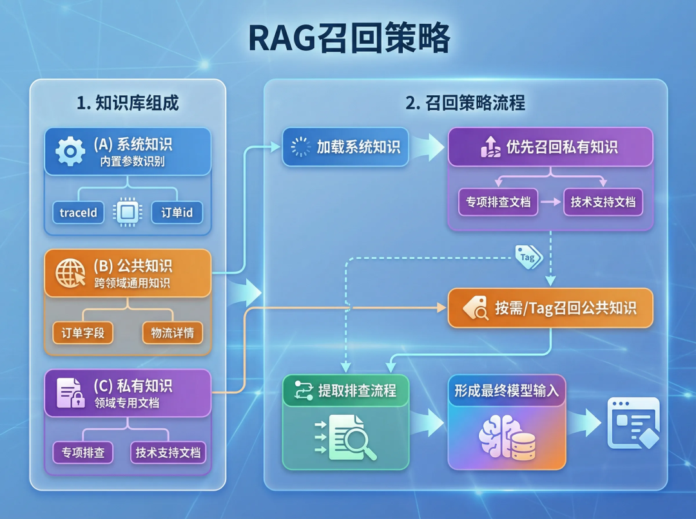

为便于管理，我们正在建设简易后台系统，支持专家编写与 AI 自动生成（进行中）相结合的混合模式。

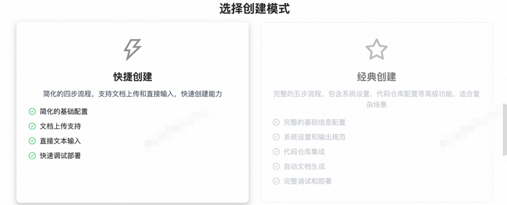

能力新建流程

从完整的能力构建视角，一次能力创建包含以下步骤（虚线部分进行中）

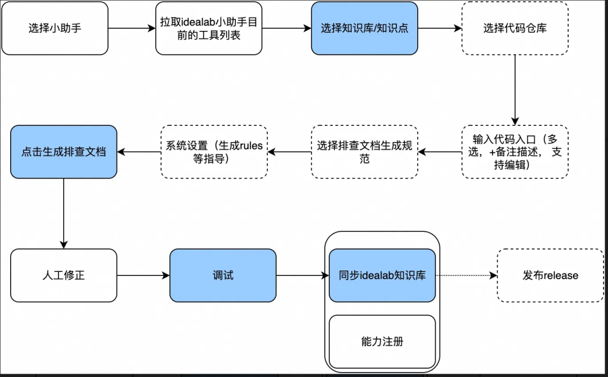

* * *

## 七、质量评估与闭环：让 Agent “可运营”

一个智能 Agent 系统能否真正落地并持续创造价值，不仅取决于其初始能力的构建，更关键的是是否具备可衡量、可迭代、可持续进化的运营机制。为此，我们建立了以“质量评估—反馈回流—知识优化”为核心的闭环体系，确保系统不是一次性的自动化工具，而是一个越用越聪明的“活体”。

### 7.1 多维度评估框架：从 F1 到 Q-score

在传统信息检索领域，我们常用 Recall（召回率） 和 Precision（准确率）来衡量系统的性能，并通过 F1-Score 进行综合评价：

  * Recall：衡量 Agent 是否覆盖了已知问题的知识面，即“有没有答出来”；

  * Precision：判断答案内容是否准确无误，是否存在误导或幻觉；

  * F1-Score：两者的调和平均，用于整体能力打分。

然而，在实际研发支持场景中，问答结果往往复杂多元：一次响应可能涉及多个排查步骤、多种工具调用、多份参考文档。此时，简单的“对/错”二值判断难以反映真实服务质量。例如：

  * 结论正确但分析过程有瑕疵；

  * 分析详尽但最终建议不完整；

  * 知识库无答案，Agent也识别出无答案，这类回答属于正确召回，但并没有解决实际问题

  * 回答虽未完全解决问题，但已提供足够线索供工程师快速收口。

因此，我们引入了更加细粒度的质量评分机制——Q-score（Quality Score），采用 0–10 分制 对单次问答进行综合性打分。

> ✅ 实践标准：我们将 Q-score ≥ 7 定义为“有效回答”。这类回答即使不够完美，也能显著降低人工介入成本，具备实际生产可用性。

该评分机制兼顾了实用性与容错性，为后续自动化评估与迭代优化提供了坚实基础。

### 7.2 自动化评估的价值：聚焦坏样本，驱动快速迭代

初期阶段，少量问答可通过人工标注完成质量评估。但随着系统上线运行，月均交互量迅速突破千条，纯人工打标已不可持续，效率瓶颈凸显。

我们的策略并非追求“全自动精准裁判”，而是利用 AI 实现低投入、高回报的异常检测：

> 目标是快速识别出低质量问答（坏样本），而非为每一条输出打准十分。

基于此，我们构建了专用的 “评分 Agent”，其核心逻辑如下：

1\. 输入：历史问答记录 + 当前知识库状态；

2\. 处理：结合少量高质量正例与典型负例（few-shot learning），辅以领域规则与扣分项模板；

3\. 输出：生成 Q-score 及对应的扣分明细，如“跳步执行”、“引用过时文档”、“未按手册顺序操作”等。

这套机制的优势在于：

  * ✅ 快速发现明显缺陷（如幻觉、流程错误）；

  * ✅ 显著减少人工复核工作量，仅需聚焦 ≤6 分的低分样本；

  * ✅ 支持高频监控与趋势追踪，及时感知能力退化。

### 7.3 闭环机制：从反馈到进化的正向循环

为了实现“越用越准”的目标，我们依托运营系统设计了一套完整的反馈回灌流程，将每一次低质量暴露转化为系统升级的机会：

  *   *   *   *

    线上问答 → 评分 Agent 打分 → 聚焦低分样本（≤6）→ 人工复核 → 根因归因                             ↓           更新排查文档 / 补充公共知识 / 优化提示词 → 回灌至训练集

`
`

这一闭环带来了三大收益：

  * 知识沉淀加速
每一次失败都成为新知识的来源。例如，某次因日志格式变更导致诊断失败后，我们在技能文档中补充了新版日志说明，避免同类问题重复发生。

  * 模型行为收敛
将典型错误样例持续注入评分 Agent 的 few-shot 示例库，使其识别能力不断增强，形成“防错—纠错—免疫”的正向演进。

  * 运营透明可控
所有修改均有迹可循，配合管理后台的版本对比与变更记录，保障系统演进过程始终处于受控状态。

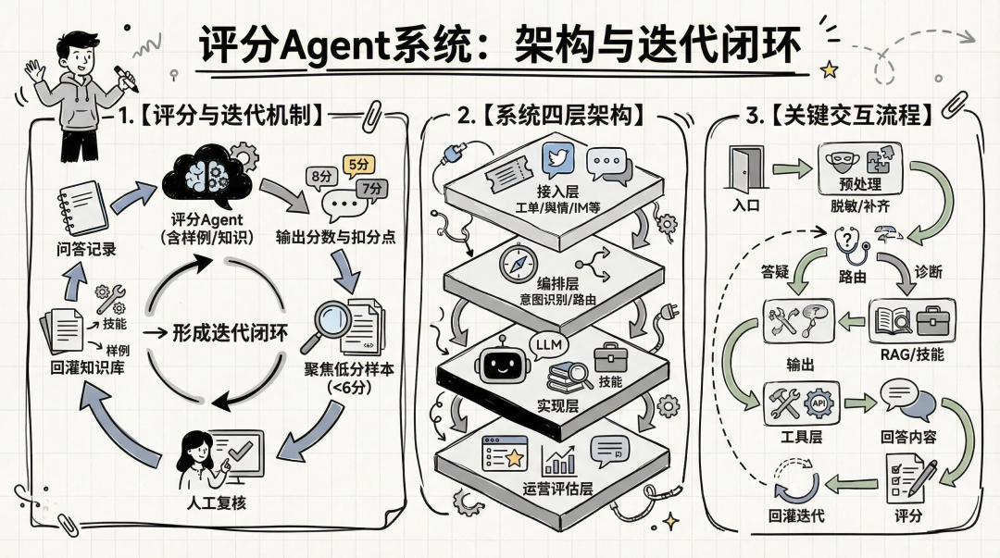

> 🔁 本质转变：Agent 不再是静态部署的一次性产物，而是一个依托数据反馈持续生长的“有机体”。

* * *

## 八、实战成效：多个领域落地验证

已覆盖几大核心场景：

  * 买家订单管理

  * 物流查询

  * 商家问题答疑

  * 评价场域支持 含问大家、买家秀、种草

  * 逆向流程诊断

部分因数据链路同步导致的问题（疑难杂症），如今运营小二可一键重置，研发零干预！

### 案例 1：评价场域问诊系统的投放使用情况

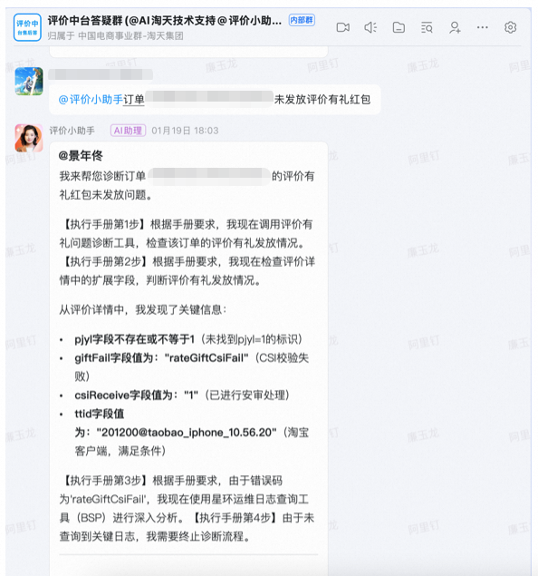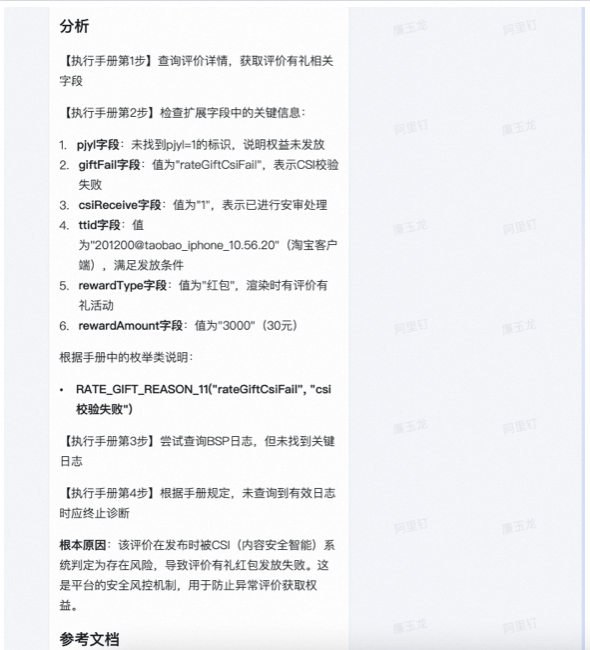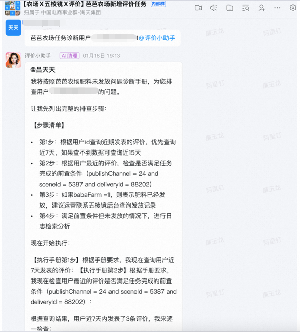

### 案例 2：逆向领域问题排查

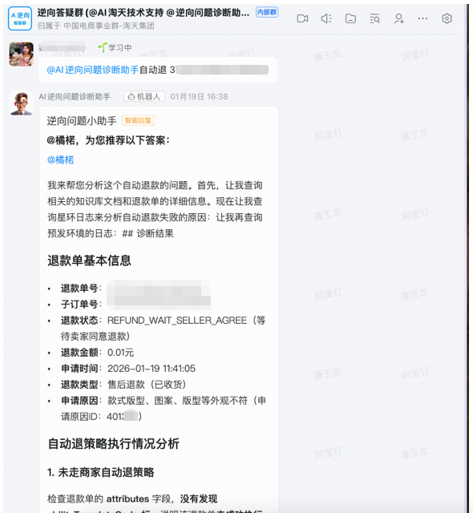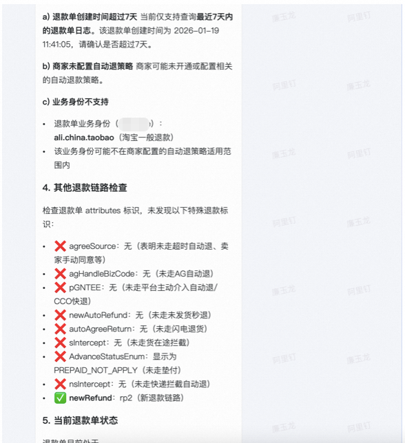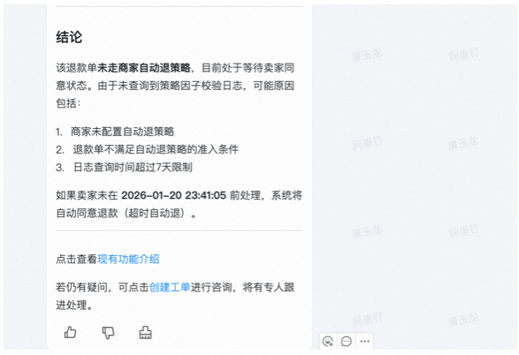

### 案例3：商家相关问题诊断

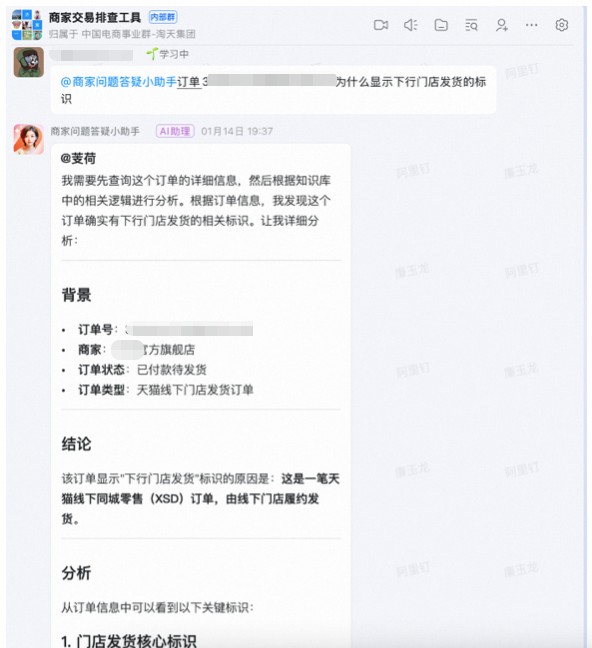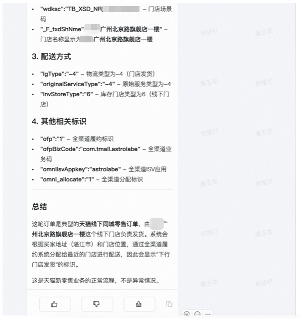

### 案例4：物流场景问诊

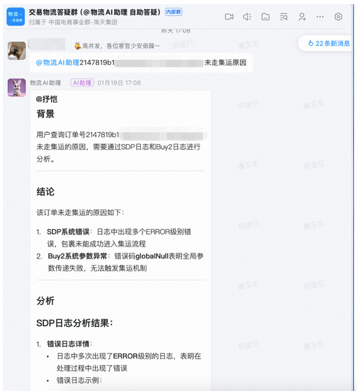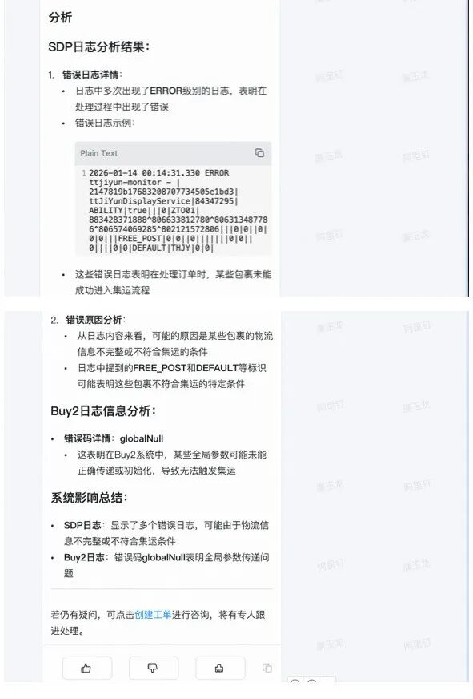

### 案例5： 订单相关问题诊断

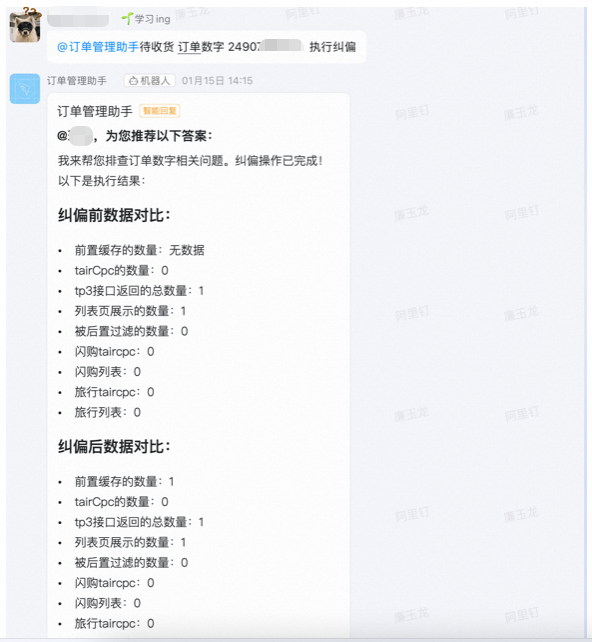

### 问诊Agent相关服务指标

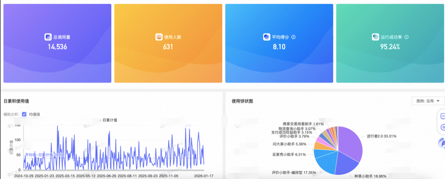

问诊小助手近几期的服务次数趋势：

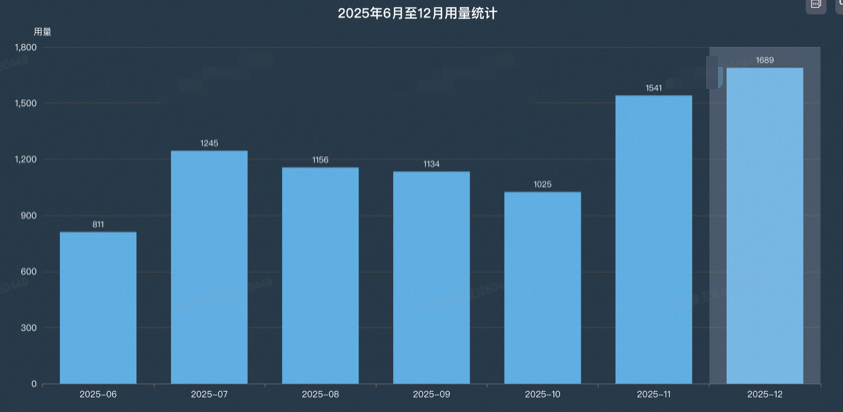

研发月度工单受理数：

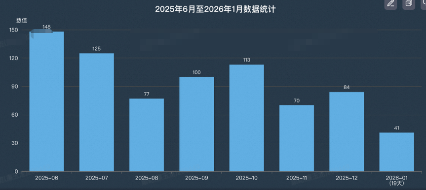

问答平均质量分AVG(Q-score)

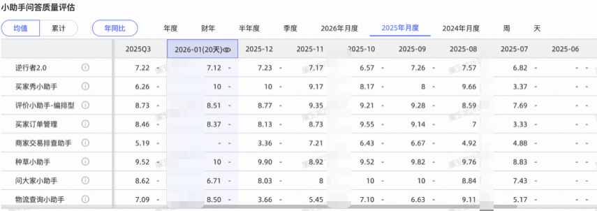

备注：部分小助手评分低是因为样本太少，稍微有一两个负面case 分数直线下降

问答有效率（Availble）（Q-score>= 7分）

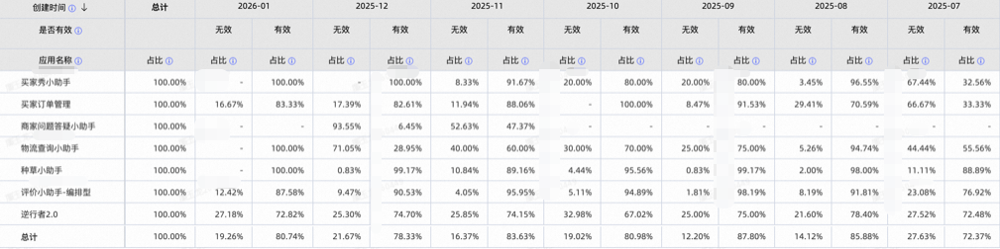

召回率（Recall）& 精准率（Precision）&F1

目前自动化链路构建中，以1月份人工标注数据计算

问诊助手| 召回率| 精准率| F1
---|---|---|---
买家订单管| 83.33%| 83.33%| 83.33%
物流查询小助手| 100%| 75.00%| 85.71%
商家问题答疑小助手| 80%| 75%| 77.42%
评价小助手| 90%| 85%| 87.43%
逆行者2.0| 90%| 80%| 84.7%

问诊Agent管理后台概览

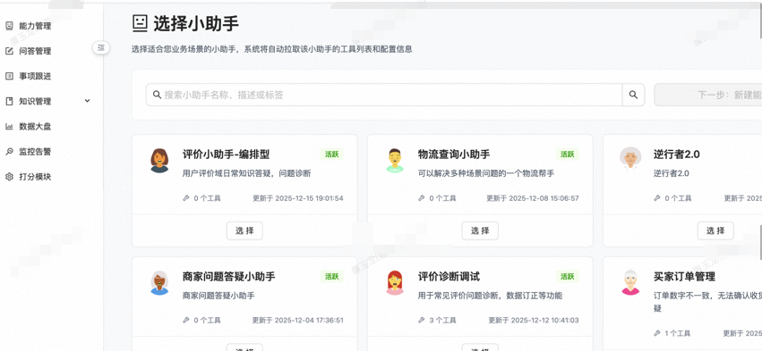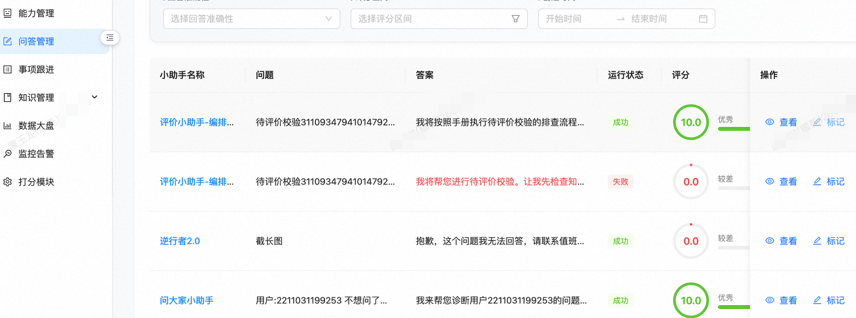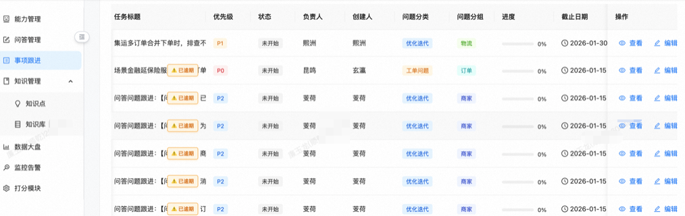

* * *

## 九、总结与展望：边界与下一步

本系统围绕“研发支持的问诊痛点”，介绍了一种运维友好型问诊Agent构建范式及运营体系。通过将大量高频的重复解释（规则、口径）与问题排查（追链路、查日志、对指标、做补偿）工作自动化，以标准化排查文档的形式，快速接入已有的问诊Agent，显著提升能力迭代效率，使新同学也能快速上手。

### 当前边界

  * 依赖专家经验：高质量 Skill Doc 的撰写仍需领域专家投入；

  * 长尾问题覆盖不足：完全依赖模型推理的部分可靠性待提升；

  * 知识固化 vs 模型泛化：随着模型能力增强，是否还需显式文档？需持续观察；

### 下一步方向

1\. 降低产出门槛

  * 探索基于链路标注、代码注释、接口文档 自动生成 Skill Doc 初稿；

  * 人工审核后快速上线，加速沉淀；

2\. 增强实时反馈能力

  * 当前纠偏依赖月度复盘 → 目标实现分钟级异常检测与自动告警；

3\. 探索“AI Native”知识组织方式

  * 若未来模型具备足够领域理解力，能否将代码转化为“可执行语义指令”？

  * 推动知识表达从“人类为主，AI为辅”向“AI为主，人类为辅”的演进。

💬 “让新人也能像老将一样从容应对复杂问题，这才是真正的工程提效。”
