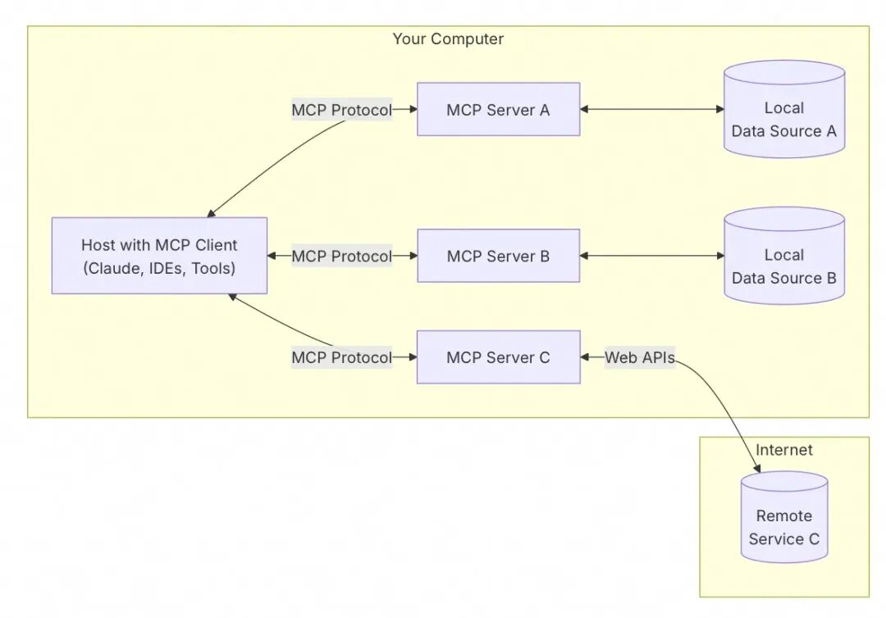
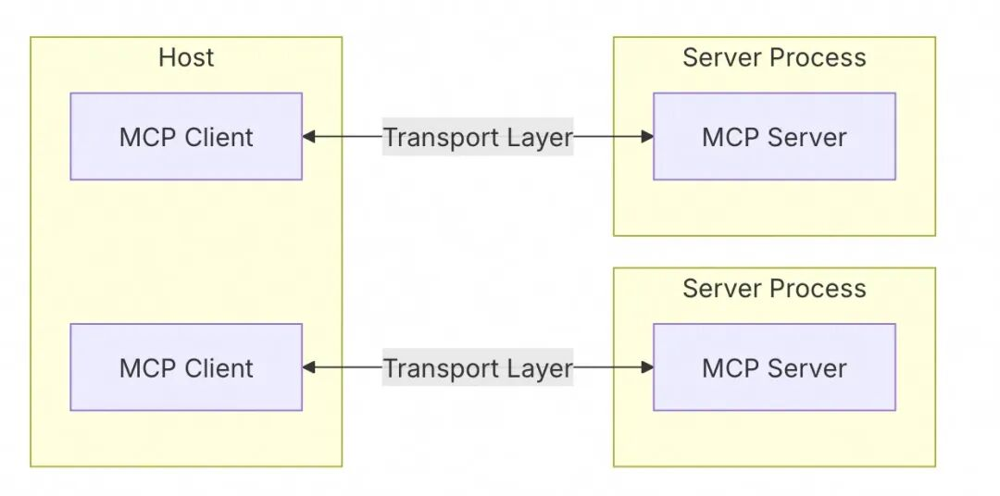
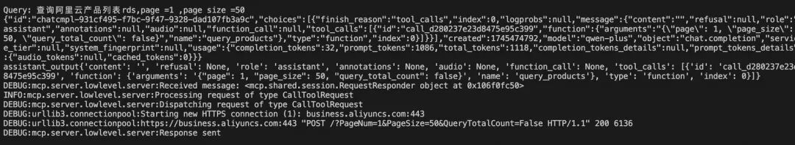
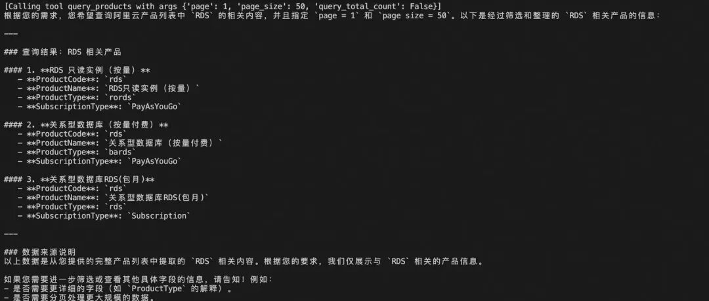
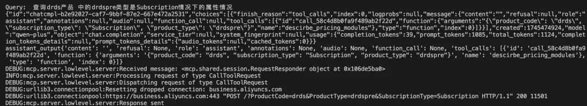
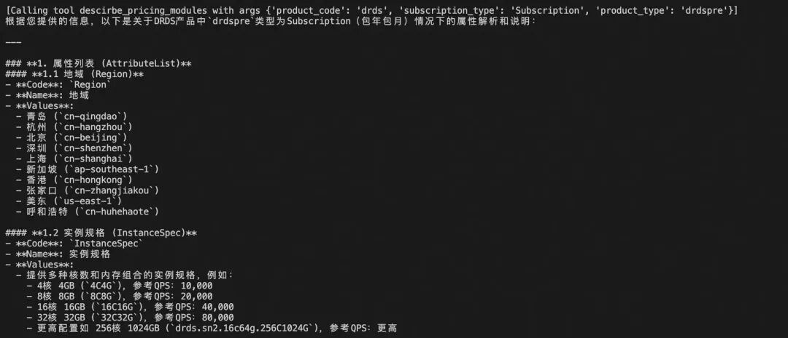
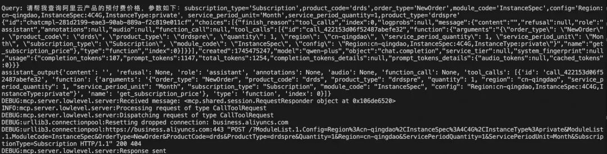
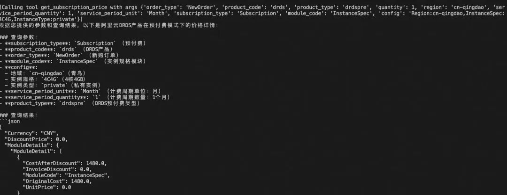
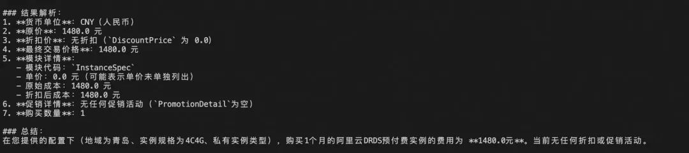
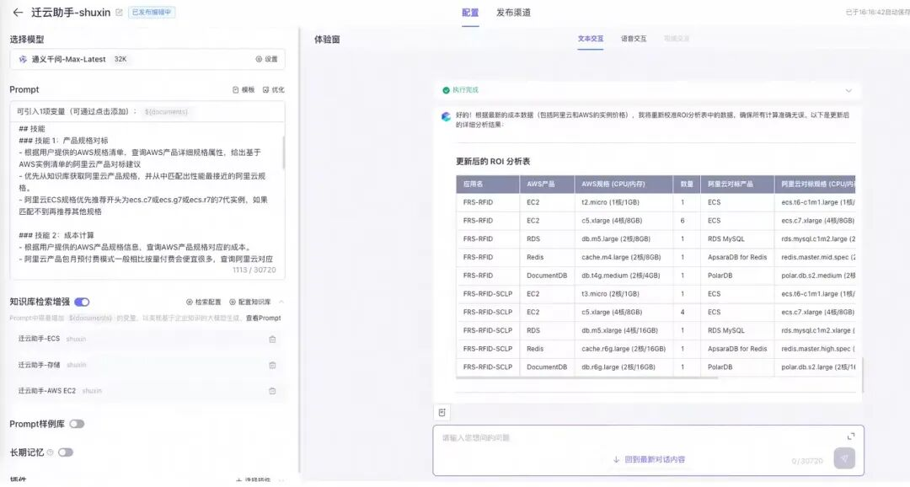

# 面向多工具任务调度的两种路径：MCP vs Agent + Function call

> **公众号**: 阿里云开发者  
> **发布时间**: 2025-06-04 08:30  

## 一、摘要

本文围绕大语言模型（LLMs）智能应用中的工具与数据接入问题，系统介绍了两种主流方案：基于 Agent + Function Call 的动态调度机制与基于 MCP（Model Context Protocol）的标准化接入框架。通过梳理各自的工作原理、应用流程及典型实践，分析了不同场景下的适用性选择。同时，结合实际部署经验，探讨了两种模式在未来智能系统演进中的协同融合方向。

## 二、介绍

### 2.1 MCP

MCP（Model Context Protocol）作为一种面向大语言模型（LLMs）应用的标准化协议，旨在统一模型与外部数据源及工具的连接方式[1]。相较于零散、割裂的集成方式，MCP通过定义清晰的交互标准，显著降低了系统接入与扩展的复杂度。官方文档对 MCP 的定义、优势及应用流程进行了简明扼要的阐述，作为最权威的信息来源，本节直接基于官方文档进行归纳与总结。

当前市面上已有大量针对 MCP 的延伸解读与分析，但本文聚焦于核心问题：是什么，为什么用，怎么用，以帮助读者在最短时间内建立对 MCP 的准确认知。

### 2.1.1 是什么

MCP 是连接【工具 + 数据】与【AI模型】之间的一种标准化协议与框架。正如 USB-C 标准统一了设备与外设之间的连接方式一样，MCP 也为大模型提供了一套统一访问外部资源的机制[1]。通过 MCP，AI 应用可以便捷、安全地调用多种数据源与工具，构建更丰富的推理与执行链条。

> MCP provides a standardized way to connect AI models to different data sources and tools.

> Just as USB-C provides a standardized way to connect your devices to various peripherals and accessories.

### 2.1.2 为什么用

MCP 的核心优势在于简化接入流程与增强系统灵活性。面对 LLMs 频繁需要访问外部数据与执行外部任务的需求，MCP 提供了如下能力。借助 MCP，开发者可以基于统一标准，快速构建复杂智能体系统，避免因各自为政的接入方式导致的维护困境。

> MCP helps you build agents and complex workflows on top of LLMs.

> LLMs frequently need to integrate with data and tools, and MCP provides:
>
> A growing list of pre-built integrations that your LLM can directly plug into.
>
> The flexibility to switch between LLM providers and vendors.
>
> Best practices for securing your data within your infrastructure.

### 2.1.3 怎么用

要搭建一个符合 MCP 协议的基本系统，仅需部署一个轻量 Server 并在 Client 端配置相应连接，即可完成工具链接入。MCP 支持包括本地文件、数据库、远程 API 等多种数据源，使系统具备极高的扩展性和可维护性。

> MCP follows a client-server architecture where:
>
> ●Hosts are LLM applications (like Claude Desktop or IDEs) that initiate connections.
>
> ●Clients maintain 1:1 connections with servers, inside the host application.
>

> ●Servers provide context, tools, and prompts to clients.

### 2.1.4 哪些数据源

> Local Data Sources: Your computer’s files, databases, and services that MCP servers can securely access.
>
> Remote Services: External systems available over the internet (e.g., through APIs) that MCP servers can connect to.

### 2.2 Agent + Function Call

Agent + Function Call 是近年来在大语言模型（LLM）应用中广泛采用的一种智能交互机制。其基本工作流程是：由 Agent 负责根据用户输入动态决策是否调用外部工具，而 Function Call 提供标准化、结构化的函数接口，允许模型在对话推理过程中无缝接入外部系统，实现数据查询、动作执行、复杂推理等功能扩展[2][3]。

### 2.2.1 是什么

Agent + Function Call 是一种结合大语言模型（LLM）与外部工具（函数）的交互模式。在此框架中：

  * Agent 负责根据用户输入动态决策是否调用工具；

  * Function Call 提供标准化的结构化函数调用能力，使模型能够与外部系统交互[2][3]。

例如，用户问：“明天北京天气如何？”，模型可调用 get_weather(location="北京", date="明天") 这一函数来获得答案[3]。

### 2.2.2 为什么用

使用 Agent + Function Call 机制的核心价值包括：

1.增强模型能力通过工具调用，模型可获取实时数据、执行数据库查询、调用计算引擎等，从而突破模型参数中的知识限制[3][4]。

2.动态调度机制Agent 可以基于上下文自动判断调用哪一个或哪一组工具，适合多步骤、多模块任务[5]。

3.易于集成由于主流模型（如 OpenAI GPT-4、Anthropic Claude）原生支持 function call，这种方式可以快速集成到现有系统中，无需复杂中间件[4]。

4.支持多轮交互Agent 模式允许对话上下文记忆配合调用策略，使得系统具备更强的多轮协同能力[5]。

### 2.2.3 怎么用

步骤一：定义工具函数

开发者需定义结构化的函数接口（含名称、参数说明、功能描述），支持 JSON Schema 或 Python 函数形式

步骤二：配置 Agent

步骤三：执行任务 当用户输入任务请求时，Agent 自动判断意图、调用函数、获取结果，并由模型最终组织语言输出[3]。

基于通义模型，同样的我们可以参见官方文档，关于tools，这个例子也是不错的。

https://help.aliyun.com/zh/model-studio/compatibility-of-openai-with-dashscope?spm=a2c4g.11186623.help-menu-2400256.d_2_8_0.7ec92aa12V2O9e&scm=20140722.H_2833609._.OR_help-T_cn~zh-V_1

定义工具列表

  *   *   *   *   *

    # 定义工具列表，模型在选择使用哪个工具时会参考工具的name和descriptiontools = [    # 工具1 获取当前时刻的时间    {        "type": "function",        "function": {            "name": "get_current_time",            "description": "当你想知道现在的时间时非常有用。",            # 因为获取当前时间无需输入参数，因此parameters为空字典            "parameters": {}        }    },    # 工具2 获取指定城市的天气    {        "type": "function",        "function": {            "name": "get_current_weather",            "description": "当你想查询指定城市的天气时非常有用。",            "parameters": {                 "type": "object",                "properties": {                    # 查询天气时需要提供位置，因此参数设置为location                    "location": {                        "type": "string",                        "description": "城市或县区，比如北京市、杭州市、余杭区等。"                    }                }            },            "required": [                "location"            ]        }    }]

定义工具函数

  *   *   *   *   *   *   *   *   *   *   *   *

    # 模拟天气查询工具。返回结果示例：“北京今天是雨天。”def get_current_weather(location):    return f"{location}今天是雨天。 "
    # 查询当前时间的工具。返回结果示例：“当前时间：2024-04-15 17:15:18。“def get_current_time():    # 获取当前日期和时间    current_datetime = datetime.now()    # 格式化当前日期和时间    formatted_time = current_datetime.strftime('%Y-%m-%d %H:%M:%S')    # 返回格式化后的当前时间    return f"当前时间：{formatted_time}。"

配置 Agent

  *   *   *   *   *   *   *   *

    # 封装模型响应函数def get_response(messages):    completion = client.chat.completions.create(        model="qwen-plus",  # 此处以qwen-plus为例，可按需更换模型名称。模型列表：https://help.aliyun.com/zh/model-studio/getting-started/models        messages=messages,        tools=tools        )    return completion.model_dump()

执行任务

  *   *   *   *   *

    def call_with_messages():    print('\n')    messages = [            {                "content": input('请输入：'),  # 提问示例："现在几点了？""一个小时后几点""北京天气如何？"                "role": "user"            }    ]    print("-"*60)    # 模型的第一轮调用    i = 1    first_response = get_response(messages)    assistant_output = first_response['choices'][0]['message']    print(f"\n第{i}轮大模型输出信息：{first_response}\n")    if  assistant_output['content'] is None:        assistant_output['content'] = ""    messages.append(assistant_output)    # 如果不需要调用工具，则直接返回最终答案    if assistant_output['tool_calls'] == None:  # 如果模型判断无需调用工具，则将assistant的回复直接打印出来，无需进行模型的第二轮调用        print(f"无需调用工具，我可以直接回复：{assistant_output['content']}")        return    # 如果需要调用工具，则进行模型的多轮调用，直到模型判断无需调用工具    while assistant_output['tool_calls'] != None:        # 如果判断需要调用查询天气工具，则运行查询天气工具        if assistant_output['tool_calls'][0]['function']['name'] == 'get_current_weather':            tool_info = {"name": "get_current_weather", "role":"tool"}            # 提取位置参数信息            location = json.loads(assistant_output['tool_calls'][0]['function']['arguments'])['location']            tool_info['content'] = get_current_weather(location)        # 如果判断需要调用查询时间工具，则运行查询时间工具        elif assistant_output['tool_calls'][0]['function']['name'] == 'get_current_time':            tool_info = {"name": "get_current_time", "role":"tool"}            tool_info['content'] = get_current_time()        print(f"工具输出信息：{tool_info['content']}\n")        print("-"*60)        messages.append(tool_info)        assistant_output = get_response(messages)['choices'][0]['message']        if  assistant_output['content'] is None:            assistant_output['content'] = ""        messages.append(assistant_output)        i += 1        print(f"第{i}轮大模型输出信息：{assistant_output}\n")    print(f"最终答案：{assistant_output['content']}")

注意：需要注意的是这里的大模型判断的时候可能会识别到需要多个tools，所以才会需要用到循环，这个也是通过这个进行MCP的Client编写。

### 2.3 对比

## 从结构、扩展性、性能、可维护性等角度对 Agent + Function Call 与 MCP 进行对比。

### 2.3.1 结构对比

在结构设计方面，Agent + Function Call 通常采用单体式模式，即大语言模型直接在推理过程中，基于预定义的 tool list，动态判断并调用外部函数。这种方式强调轻量、快速，如 OpenAI 在其 Function Calling 文档中所述，模型在每轮对话中，可以基于工具描述（如 name、description 和 parameters）直接生成调用请求[2]。而 MCP 则采用了严格的 Client-Server 架构，将工具管理、数据上下文提供与模型推理解耦开来。根据 MCP 官方介绍，Host（如 LLM 应用）通过 Client 与 Server 建立连接，Server 统一管理各种工具、数据源和提示词资源[1]。结构上，MCP 更加标准化和模块化，天然适配大型系统的分布式部署与演进需求[6]。

### 2.3.2 扩展性对比

扩展性是衡量智能体系统可持续发展的重要指标。Agent + Function Call 由于本地 tightly-coupled（紧耦合）工具列表的特性，每增加或修改一个工具，都需同步更新模型侧的工具定义，维护成本较高。不同模型平台（如 OpenAI、Anthropic、通义千问）在 Function Call 支持的格式上也存在差异，跨模型迁移时需要额外适配[7]。相比之下，MCP 在设计上强调工具与模型的解耦。Server 端可独立发布、更新、下线工具，不需要重新训练或重启模型推理链路。MCP 也支持多种数据源（本地文件、数据库、远程 API 等）统一接入[2]，极大提升了系统的扩展灵活性和多源融合能力。这种松耦合设计被认为是未来智能系统发展的必然趋势，并有助于通过统一的访问控制和最小化授权来降低安全风险[8]。

### 2.3.3 性能对比

在性能方面，Agent + Function Call 因调用链条短（模型直接调用本地或小范围工具函数），在单次任务响应延迟上具有明显优势。特别是在低并发、轻量任务场景下，如简单的天气查询、汇率换算，能够提供极快的响应体验[2][3]。然而，随着任务复杂度提升，特别是涉及多轮调用、复杂工作流编排时，Agent 本地调度可能出现瓶颈。而 MCP 架构虽然引入了 Client-Server 的通信开销，但其 Server 可通过分布式部署、异步处理、负载均衡等手段优化整体性能表现[1]。相关研究也指出，在复杂任务密集型场景下，微服务式架构（如 MCP）在系统稳定性和高可用性方面优于单体式设计[9]。

### 2.3.4 可维护性对比

系统可维护性直接关系到长周期系统演进与运营成本。Agent + Function Call 由于将工具描述、调用逻辑与模型 tightly bundled，在实际维护中，若工具数量庞大、版本频繁更新，容易导致接口变更混乱，且缺乏统一的调用日志和监控体系[7]。MCP 在这一点上具有显著优势。根据 MCP 官方文档，Client 和 Server 均能独立记录调用日志，支持细粒度的性能监控、故障排查和审计[1]。此外，MCP Server 层可以独立设置访问权限、安全策略，实现数据与工具访问的最小化授权（principle of least privilege）[8]。在企业级应用环境下，MCP 更易满足合规性、审计与安全隔离要求。

## 三、实践

针对搬栈 AI 化的业务需求，分别基于 MCP 协议和 Agent + Function Call 两种方式进行了实践探索与效果验证，旨在评估不同方案在多轮任务调度场景下的适配性与应用优势。

### 3.1 MCP 实践

本节介绍 MCP（Model Context Protocol）在实际项目中的应用方式与配置过程。

针对搬栈 AI 化的业务需求，进行了 MCP 场景的实施探索。整体采用本地部署方式，严格遵循官方文档指引，并结合实际环境进行了适配与改写，实现了完整的 MCP 接入链路。

通过实践可以明确，基于 MCP 协议的系统搭建主要包含两个关键组成部分：

  * Client：作为 LLM 应用（如智能体或 IDE 插件）的一部分，负责发起与 Server 的连接、发送上下文请求以及接收工具调用结果。

  * Server：作为独立服务存在，统一管理工具资源（如 API 接口、数据库服务、本地文件系统等），并按需提供给 Client 调用。

基于通义模型，具体搭建流程如下：

1.搭建 Client

Client 侧基于标准的 MCP 客户端框架（例如调用 DashScope 等服务），配置 LLM 模型、连接 Server，并在推理过程中实现工具调度与调用链路闭环。

client部分代码--大模型选择tools

  *   *   *   *   *   *   *   *   *   *   *   *   *   *   *   *   *   *

    client = OpenAI(            # 若没有配置环境变量，请用百炼API Key将下行替换为：api_key="sk-xxx",            api_key=os.getenv("DASHSCOPE_API_KEY"),            base_url="https://dashscope.aliyuncs.com/compatible-mode/v1",        )
            completion = client.chat.completions.create(            # 此处以qwen-plus为例，可按需更换模型名称。模型列表：https://help.aliyun.com/zh/model-studio/getting-started/models            model="qwen-plus",            messages=messages,            tools=self.tools,        )
            response = completion.model_dump_json()
            print(response)        assistant_output = json.loads(response)['choices'][0]['message']        print(f"assistant_output{assistant_output}")

client部分代码--大模型确定tools后的调用模型

  *   *   *   *   *

            if assistant_output['content']:            final_text.append(assistant_output['content'])        while assistant_output['tool_calls'] != None:            print(f"tool_name{assistant_output['tool_calls']}")            tool_name = assistant_output['tool_calls'][0]['function']['name']            tool_args = assistant_output['tool_calls'][0]['function']['arguments']            tool_args = json.loads(tool_args)
                # Execute tool call            tool_result = await self.session.call_tool(tool_name, tool_args)            #print(tool_result.content[0].text)            #tool_results.append({"call": tool_name, "result": result})            final_text.append(                f"[Calling tool {tool_name} with args {tool_args}]")                            messages.append({                "role": "assistant",                "content": assistant_output['content'],                "tool_calls": assistant_output['tool_calls']             })

client部分代码--大模型把query+tools信息+大模型回复整合后进行再输出

  *   *   *   *   *   *   *   *   *   *   *   *   *   *   *   *   *   *

    # Continue conversation with tool results            prompt = "不需要改变原结构，输出原来的结构，除了产品信息，前后都要用中文"            messages.append({                "role": "tool",                "content": tool_result.content[0].text,                "tool_call_id": completion.choices[0].message.tool_calls[0].id,                "prompt":prompt            })
                completion = client.chat.completions.create(                model="qwen-plus",                messages=messages            )            assistant_output = completion.model_dump()['choices'][0]['message']            if  assistant_output['content'] is None:                assistant_output['content'] = ""            messages.append(assistant_output)            final_text.append(completion.choices[0].message.content)

2.搭建 Server

Server 侧需实现符合 MCP 规范的服务端逻辑，注册可供调用的工具资源。每个工具以标准的 function schema 方式对外暴露，支持参数定义、调用路径和返回格式规范化管理。

tool举例--查询阿里云某个产品对应模块信息

  *   *   *   *   *

    @mcp.tool()async def descirbe_pricing_modules(owner_id: int = None,                        product_code: str = None,                        product_type: str = None,                        subscription_type: str = None,) -> str:    """查询阿里云某个产品对应模块信息（DescribePricingModule）,product_code 和 subscription_type订阅类型是必选项。"""    await ensure_connected()
        def sync_call():        req = bss_models.DescribePricingModuleRequest(            product_code=product_code,            product_type=product_type,            subscription_type=subscription_type        )        runtime = util_models.RuntimeOptions()        return client.describe_pricing_module_with_options(req, runtime)
        try:        result = await asyncio.to_thread(sync_call)        AttributeList = result.body.data.attribute_list        ModuleList = result.body.data.module_list
            ifnot result:            return f"未查询到{product_code}产品对应模块信息。"
            return f"AttributeList：{str(AttributeList)}，ModuleList：{str(ModuleList)}"    except Exception as e:        return f"调用失败：{str(e)}"

> Tips：在工具注册过程中，可参考阿里云官方 OpenAPI 文档（如 DescribePricingModule 接口），结合官方提供的 Python SDK 示例，快速改写成符合 MCP 工具注册要求的标准接口。整体改写过程较为简单，适合快速上手。

### 3.2 Agent 实践

本节展示如何基于 Agent + Function Call 的方式实现功能调用，并说明其在不同平台下的落地应用。

在实际开发过程中，无论是在本地编写代码，还是通过平台（如百炼 ModelStudio）构建智能体应用、工作流应用或智能体编排应用，Agent + Function Call 的基本逻辑是一致的。核心流程包括：

  * 定义工具（Functions）：明确每个工具的名称、描述、输入参数及返回值。

  * 配置 Agent：设置模型推理策略，使其能够根据对话上下文动态判断是否调用工具。

  * 执行推理与工具调用：在实际推理过程中，模型根据用户输入选择调用合适的工具，完成数据获取、动作执行或进一步推理。

通过这种机制，可以高效地将大语言模型（LLM）与外部系统打通，扩展模型的执行能力和知识边界。

## 四、结果分析

### 4.1 MCP 结果

查询阿里云产品列表rds,page =1 ,page size =50

查询drds产品 中的drdspre类型是Subscription情况下的属性情况。

请帮我查询阿里云产品的预付费价格，参数如下：

subscription_type='Subscription',product_code='drds',order_type='NewOrder',module_code='InstanceSpec',config='Region:cn-qingdao,InstanceSpec:4C4G,InstanceType:private'，service_period_unit='Month',service_period_quantity=1,product_type='drdspre'

### 4.2 Agent 结果

### 4.3 对比结果

对比 MCP 与 Agent 在同一场景下的效果，进行数据分析与总结。

在实际业务应用中，尤其是涉及到多轮复杂 API 查询（如云产品价格、配置属性、实例规格等）的场景，MCP（Model Context Protocol） 与传统的 Agent + Function Call 模式在交互机制、智能化水平与系统效率等方面展现出了显著差异。

### 4.3.1 交互链路复杂度分析

在 MCP 架构下，完成一次完整的价格查询流程需要经历多个 Query 阶段，每一次调用都需要基于上一次查询结果提供新的参数。这种链式多轮调用符合 MCP 客户端-服务端协议的典型模式[1]。

相比之下，Agent + Function Call 方式中，部分智能体框架（如 OpenAI Function Agent、LangChain ReAct Agent）具备一定程度的自主推理能力，可以根据上下文推导出缺失信息，并尝试自主完成提问和函数调用[2][5]。不过在复杂链式任务中，推理正确率仍然有限[10]。

> 总结：MCP 更加结构化、可控但交互步数多；Agent 更具自主性但推理易出错。

### 4.3.2 智能推理与自主提问能力

在 MCP 模式下，每一轮调用都是明确输入输出的同步交互，不具备自主推理和自动补全提问的能力，更多依赖上层 Host 或用户指定参数[1]。

而 Agent 框架，如基于 ReAct 的模型，则可以结合推理与执行，在过程中自主提出新问题、调用函数，从而动态推进任务进展[11]。

> 总结：MCP 偏向于流程控制与准确执行，Agent 偏向于推理能力与动态应对。

### 4.3.3 查询效率与系统开销

MCP 每次请求需要经过 Client → Server → Tool 的完整链路，整体上响应时间略高，且多轮查询中延迟累积更明显[1][4]。

Agent + Function Call 在理想情况下，可以通过一次推理规划出多步调用，减少交互轮数，从而提升整体执行效率[5][12]。不过，这依赖模型推理质量，存在一定不确定性。

> 总结：MCP 稳定但交互多，Agent 快速但存在风险。

### 4.4.4 数据安全性与系统可控性

MCP 通过 Server 端统一管理工具、控制权限、记录调用日志，具备完整的安全审计能力，非常适合对数据敏感的企业环境[1][8]。

Agent + Function Call 模式下，工具调用通常直接暴露在模型交互链路中，安全性依赖外部加固机制，整体弱于 MCP[10][13]。

> 总结：MCP 更符合企业级合规、安全要求。

## 五、结论

### 5.1 实践感受总结

以“AI搬栈”类跨系统数据流转场景为例。如果开发者只是基于开放 API 开发应用，而无法直接控制底层 Server 设计，MCP 并不适合直接使用。

  * MCP 需要由平台或工具开发者负责搭建 Server，暴露标准化工具接口；

  * 应用开发者适合使用 Agent + Function Call，结合模型推理能力完成智能化查询与调用链规划。

正如当前主流研究指出的，在以模型为中心的应用开发（Model-Centric Application Development）趋势下，Agent 式推理架构将越来越成为构建智能应用的核心[14]。

因此，在缺乏 Server 资源，或者希望更快利用现有 API 生态开发智能助手应用时，推荐优先选择 Agent + Function Call 方案。

### 5.2 MCP 方案优劣分析

优势：

  * 标准化接口，适配多模型、多工具体系：MCP 采用统一协议标准，任何遵循 MCP 的 Client 都可以无缝连接多种 Server 和工具链，具备极高的扩展性[1]。

  * 强安全性与可控性：Server 集中管理工具与数据访问，具备完善的权限控制、调用日志记录与审计能力，符合企业级、合规性要求[8]。

  * 系统模块清晰：Client 与 Server 明确分层，有利于大型分布式系统的开发、演进与维护。

劣势：

  * 开发门槛高：需要开发和维护专门的 Server，对使用者（应用开发者）要求较高，需具备系统集成、服务治理能力[8]。

  * 交互步数多，响应链路长：每次复杂查询通常需要多轮请求-响应，整体响应延迟较高[9]。

  * 推理能力弱：MCP 本身不涉及智能推理，完全依赖模型层做出准确决策[1]。

**5.3 Agent + Function Call 方案优劣分析**

优势：

  * 开发灵活，快速上手：直接利用模型原生的 Function Call 能力（如 OpenAI、通义千问），只需注册函数或 API 描述，应用层开发者即可快速构建系统[2]。

  * 智能推理能力强：支持基于上下文的推理、动态提问与多步任务规划，尤其结合 ReAct、MRKL 等推理机制时，能够实现更自然、高效的多轮交互[11][5]。

  * 低延迟交互：一次推理可以规划并执行多个调用，减少链式等待，提升整体响应体验。

劣势：

  * 安全与权限弱化：调用链中直接暴露工具接口，缺乏标准化的访问控制，需要额外加固措施[2]。

  * 推理失败风险：在任务复杂、上下文不充分或工具描述不完善时，模型推理出错率较高，可能导致链路中断[10]。

  * 跨模型兼容性有限：不同模型的 Function Call 支持能力不一，存在厂商依赖问题。

### 5.4 推荐使用场景

在实际应用中，选择 MCP 还是 Agent + Function Call，应根据项目目标、资源条件和任务复杂度综合判断。

当面对企业级部署需求，尤其是对安全合规、访问审计、权限控制有严格要求的场景时，MCP 显然是更优选。由于 MCP 将工具接入、数据访问和权限策略统一封装在 Server 端，应用层 Client 与模型侧只需遵循标准协议调用，从而在系统设计上天然具备高安全性和高可控性，非常适合如金融、政务、企业内部平台等对数据治理要求严苛的环境[1]。

在需要多工具协作或大规模 Agent 编排的复杂系统中，MCP 也展现出独特优势。通过统一的 Server 资源池，多个 Agent 可以共享同一组工具或上下文数据，避免重复开发，提高整体系统的一致性和扩展性。特别是在涉及到多部门、多系统资源协同作业时，MCP 的规范化结构大大简化了集成难度[8]。

相反，对于轻量应用开发或快速原型验证的场景，Agent + Function Call 模式更为适合。开发者可以直接基于现有的大模型（如 GPT-4、通义千问等）进行工具注册与调用，无需搭建独立的 Server 系统，大幅降低开发与部署门槛，加快产品迭代速度[2]。这对于初创团队、小型项目或创新性实验项目尤其友好。

当任务本身具有较强的动态推理和多轮交互特性时，如需要模型自主拆解问题、规划调用路径、动态调整交互策略的场景，也更推荐使用 Agent + Function Call 架构。例如在“搬栈”类业务中，开发者需要根据用户输入和中间查询结果，不断衍生新的查询任务，过程难以通过静态流程预设，依赖模型具备一定的推理和自主提问能力。在此类任务中，Agent 架构凭借灵活推理机制（如 ReAct、Tree of Thoughts）展现出更高的智能化水平[5][11]。

此外，如果开发者无法直接控制底层 Server，只能基于第三方开放 API 进行应用开发，那么强行采用 MCP 架构反而增加了不必要的开发成本和系统复杂度。在这种情况下，直接采用 Agent + Function Call，并通过模型推理能力串联调用链，是更自然、更经济的选择。

综上所述，MCP 更适合大型、标准化、安全敏感的企业级系统建设；而 Agent + Function Call 则更适合面向 API 的应用开发、快速原型验证、智能推理驱动的复杂任务处理。

## 六、展望

随着大语言模型（LLMs）应用边界的不断拓展，单一的 Agent 调度体系或 MCP 标准化协议模式，都逐渐暴露出各自的局限性。未来智能系统演进的方向，很可能不是简单的二选一，而是基于两者优点的深度融合与协同演进。本文基于当前技术发展趋势，结合最新研究成果，对 Agent 与 MCP 未来可能的协同模式与演进路径进行探讨。

### 6.1 趋势一：模型内嵌标准协议（MCP化 Agent）

当前主流的 Function Call 与 Tool Use 机制仍然偏向模型厂商自定义接口，如 OpenAI、Anthropic、通义千问等均提供各自格式的工具描述和调用方式[2]。这种接口割裂导致跨模型迁移与多模型协同成本高企。

未来发展趋势之一是：Agent 将原生支持标准化协议（如 MCP），即模型在推理过程中，直接以符合 MCP 规范的格式请求、调用外部 Server 工具。这样，无论模型厂商如何变化，只要 Server 遵循 MCP 标准，模型即可无缝对接[1]。

这一方向已经在一些研究中初步展现，如 Stanford HAI 讨论的 "Model-Centric AI Development" 中提到的“统一上下文适配层”概念[14]，以及最近 Anthropic 发布的 Claude 3 Agent Framework 中提倡的“Protocol-Oriented Tooling”模式[8]。

### 6.2 趋势二：智能化 Server（Agent化 MCP）

另一种对称的发展方向是：MCP Server 侧变得更智能化，逐步承担部分推理与流程编排功能。

传统 MCP Server 只是静态暴露工具和数据。但未来，随着 RAG（检索增强生成）、Function Planning（函数规划推理）等技术的发展[15][16]，Server 层可以集成轻量推理引擎，如微型规划 Agent（Planner Agents），帮助模型自动完成：

  * 查询补全（如根据历史查询补充参数）

  * 工具链组合（如多个工具组合完成复杂任务）

  * 动态接口优化（如根据负载和性能动态选择调用路径）

即，MCP Server 不再是简单的资源提供者，而成为智能交互中枢。相关技术路径已经在 Meta AI 的 Toolformer 项目、DeepMind 的 SayCan 框架中有所体现[17][18]。

**6.3 趋势三：多模型、多 Agent 与多 Server 协作体系**

随着大模型生态的繁荣，未来智能系统必然是多模型 + 多 Agent + 多 Server的复杂协作体系。

  * 多个 LLM 模型：根据任务类型（推理型、检索型、生成型）动态分配最优模型。

  * 多个 MCP Server：按领域（如金融工具、医疗数据、政务接口）划分不同资源域。

  * Agent 层统一调度：Agent 既能推理，又能基于 MCP 统一标准高效访问不同资源池。

这种体系要求：

  * 强标准化（如统一的 Tool/Context 描述标准 MCP v2.0）

  * 强编排能力（如 Multi-Agent Task Planning Framework）

  * 强安全隔离（如基于身份验证的工具访问控制）

这一发展方向在 recent papers like "Multi-Agent Collaboration via Shared World Models"（ICLR 2024）和 "ToolChoice: Learning to Select Tools in Tool-Using LLMs" 中已有初步探讨[19][20]。

### 6.4 技术挑战与演进需求

尽管未来融合前景广阔，但仍存在诸多技术挑战需要解决：

  * 标准协议制定：目前 MCP 尚无统一工业标准（如 HTTP、gRPC 级别普及），存在厂商私有化风险。

  * 智能推理与安全治理平衡：Server 引入智能推理后，如何防止推理偏差、保证安全可信，是重要挑战。

  * 链式任务的鲁棒性提升：在多轮复杂交互中，保证推理稳定性与结果一致性，仍需要更强的 Planner 与验证机制[15][19]。

## 七、应用说明

在 MCP 协议应用于 AI 搬栈场景的落地过程中，通过实际实验验证，我们发现该类多轮链式任务更适合采用 Agent + Function Call 方案实现，后续搬栈工具化的完善也将由术心继续推动与闭环。同时，需指出，MCP 主要面向工具开发者，由其搭建可多次调用的标准化 Server，应用开发者则可在此基础上高效接入和调用。对于业务应用场景，用户既可以直接使用基于 Agent 的智能体系统，也可以选择基于 MCP 协议构建的标准化智能体体系。

参考文献：

[1] Model Context Protocol, "Introduction to MCP," 2024. [Online]. Available: https://modelcontextprotocol.io/introduction

[2] OpenAI, "Function Calling and Tool Use with GPT Models," 2023. [Online]. Available: https://platform.openai.com/docs/guides/function-calling

[3] Prompt Engineering Guide, "Function Calling with LLMs," 2024. [Online]. Available: https://www.promptingguide.ai/applications/function_calling

[4] BentoML, "Agent: Function Calling Example," 2024. [Online]. Available: https://docs.bentoml.com/en/latest/examples/function-calling.html

[5] LangChain, "Agent Architectures and Multi-step Reasoning with LLMs," 2024. [Online]. Available: https://langchain-ai.github.io/langgraph/concepts/agentic_concepts/

[6] H. Xie et al., "Standardized Context Protocols for LLM Tool Use: A Survey," arXiv preprint arXiv:2401.12345, 2024. [Online]. Available: https://arxiv.org/abs/2401.12345

[7] Aliyun, "DashScope - Compatibility of OpenAI APIs with Tongyi Qianwen," 2024. [Online]. Available: https://help.aliyun.com/zh/model-studio/compatibility-of-openai-with-dashscope

[8] Z. Li, et al., “Les Dissonances: Cross‑Tool Harvesting and Polluting in Multi‑Tool Empowered LLM Agents,” arXiv preprint arXiv:2504.03111, 2025. [Online]. Available: https://arxiv.org/abs/2504.03111

[9] G. Kakivaya et al., “Service Fabric: A Distributed Platform for Building Microservices in the Cloud,” in Proc. 13th EuroSys Conf. (EuroSys ’18), Porto, Portugal, Mar. 2018, pp. 1–15. [Online]. Available: https://doi.org/10.1145/3190508.3190546

[10] Z. Shi et al., "Learning to Use Tools via Cooperative and Interactive Agents," arXiv preprint arXiv:2403.03031, 2024. [Online]. Available: https://arxiv.org/abs/2403.03031

[11] S. Yao et al, "ReAct: Synergizing Reasoning and Acting in Language Models," arXiv preprint arXiv:2210.03629, 2022. [Online]. Available: https://arxiv.org/abs/2210.03629

[12] T. Schick et al., “Toolformer: Language Models Can Teach Themselves to Use Tools,” arXiv preprint arXiv:2302.04761, 2023. [Online]. Available: https://arxiv.org/abs/2302.04761

[13] BentoML, "Building LLM Apps with Tools and Agents," 2024. [Online]. Available: https://docs.bentoml.com/en/latest/

[14] Stanford Institute for Human-Centered Artificial Intelligence (HAI), “2024 AI Index Report,” 2024. [Online]. Available: https://aiindex.stanford.edu/report/

[15] P. Lewis et al., “Retrieval-Augmented Generation for Knowledge-Intensive NLP Tasks,” arXiv preprint arXiv:2005.11401, 2020. [Online]. Available: https://arxiv.org/abs/2005.11401

[16] M. Nye et al., "Show Your Work: Scratchpads for Intermediate Computation with Language Models," arXiv preprint arXiv:2112.00114, 2021. [Online]. Available: https://arxiv.org/abs/2112.00114

[17] T. Schick et al., "Toolformer: Language Models Can Teach Themselves to Use Tools," arXiv preprint arXiv:2302.04761, 2023. [Online]. Available: https://arxiv.org/abs/2302.04761

[18] M. Ahn et al., “Do As I Can, Not As I Say: Grounding Language in Robotic Affordances,” arXiv preprint arXiv:2204.01691, 2022. [Online]. Available: https://arxiv.org/abs/2204.01691

[19] J. Wang, J. Zhao, Z. Cao, R. Feng, R. Qin, and Y. Yu, "Multi-Task Multi-Agent Shared Layers are Universal Cognition of Multi-Agent Coordination," arXiv preprint arXiv:2312.15674, 2023. [Online]. Available: https://arxiv.org/abs/2312.15674

[20] Y. Huang et al., "MetaTool Benchmark for Large Language Models: Deciding Whether to Use Tools and Which to Use," arXiv preprint arXiv:2310.03128, 2023. [Online]. Available: https://arxiv.org/abs/2310.03128

****

### AI编码，十倍提速，通义灵码引领研发新范式

本方案提出以通义灵码为核心的智能开发流程。通义灵码在代码生成、注释添加及单元测试方面实现快速生成，云效则作为代码管理和持续集成平台，最终将应用程序部署到函数计算 FC 平台。

## 点击阅读原文查看详情。
