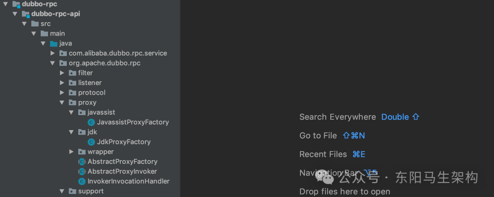
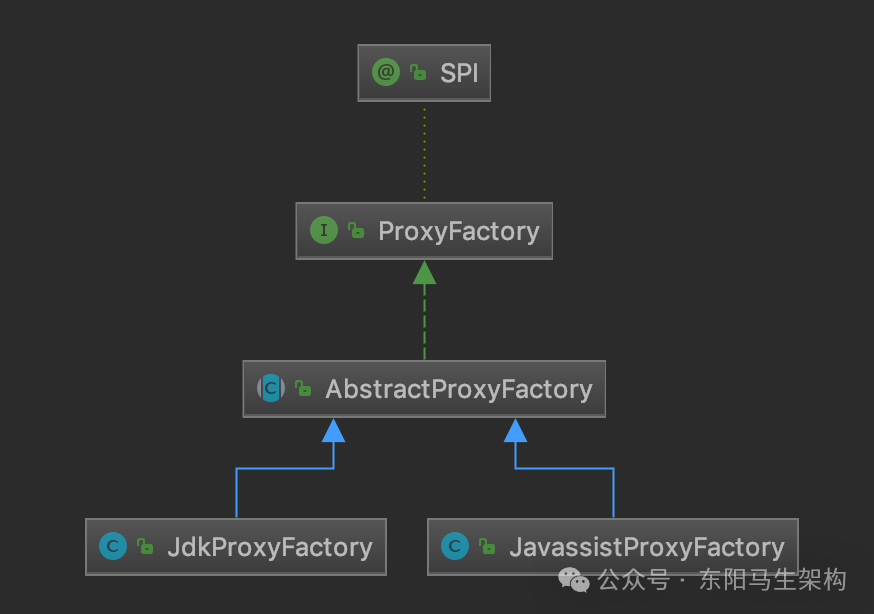
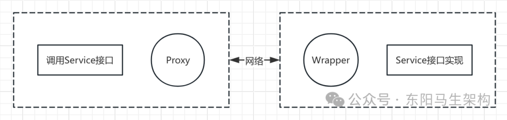

# Dubbo原理—10.RPC核心之Proxy代理

> **公众号**: 东阳马生架构  
> **发布时间**: 2025-07-29 09:00  

**大纲(17950字)**

- 1.Proxy代理层和动态代理实现
- 2.ProxyFactory实现Invoker和代理对象的转换
- 3.AbstractProxyFactory处理需要代理的接口
- 4.Proxy生成代理类的全流程
- 5.JavassistProxyFactory的getProxy()方法
- 6.InvokerInvocationHandler处理代理类的方法
- 7.Wrapper包装类生成过程和核心原理
- 8.Proxy代理总结


## 1.Proxy代理层和动态代理实现

### (1)Dubbo的Proxy代理层

### (2)Dubbo的动态代理简介

### (1)Dubbo的Proxy代理层

在前面介绍DubboProtocol的相关实现时，已经知道Protocol协议层及后面介绍的Cluster集群层暴露出来的接口都是Dubbo内部的概念，业务层无法直接使用。

为了让业务逻辑能够无缝使用Dubbo，需要将业务逻辑与Dubbo内部概念打通，这就用到了动态生成代理对象的功能。

Proxy层在Dubbo架构中的位置可参考Dubbo体系架构图，虽然在架构图中Proxy代理层与Protocol协议层距离很远，但Proxy的具体代码实现就位于dubbo-rpc-api模块中。

当Consumer进行服务调用时，Dubbo会通过动态代理将业务接口实现对象转化为相应的Invoker对象，然后在Cluster层、Protocol层使用Invoker对象。

当Provider进行服务发布时，也会有Invoker对象与业务接口实现对象间的转换，同样也是通过动态代理实现。

```cs
public class DubboProtocolTest {
    private Protocol protocol = ExtensionLoader.getExtensionLoader(Protocol.class).getAdaptiveExtension();
    private ProxyFactory proxy = ExtensionLoader.getExtensionLoader(ProxyFactory.class).getAdaptiveExtension();

    @Test
    public void testDemoProtocol() throws Exception {
        DemoService service = new DemoServiceImpl();
        int port = NetUtils.getAvailablePort();
        //服务端发布服务时，调用ProxyFactory的getInvoker()方法
        protocol.export(proxy.getInvoker(
            service,
            DemoService.class,
            URL.valueOf("dubbo://127.0.0.1:" + port + "/" + DemoService.class.getName() + "?codec=exchange")
        ));
        //客户端引用服务时，调用ProxyFactory的getProxy()方法
        service = proxy.getProxy(protocol.refer(DemoService.class, URL.valueOf("dubbo://127.0.0.1:" + port + "/" + DemoService.class.getName() + "?codec=exchange").addParameter("timeout", 3000L)));
        assertEquals(service.getSize(new String[]{"", "", ""}), 3);
    }
    ...
}
```

### (2)Dubbo的动态代理简介

实现动态代理的常见方案有：JDK动态代理、CGLib动态代理和Javassist动态代理。这些方案的应用都是比较广泛的，例如：Hibernate底层使用了Javassist和CGLib，Spring使用了CGLib和JDK动态代理，MyBatis底层使用了JDK动态代理和Javassist。

从性能方面看，Javassist与CGLib的实现方式相差无几，两者都比JDK动态代理性能要高，具体高多少，这就要看具体的机器、JDK版本、测试基准的具体实现等条件了。

Dubbo提供了两种方式来实现代理，分别是JDK动态代理和Javassist动态代理。可以在proxy这个包内看到相应的工厂类，如下图示：



## 2.ProxyFactory实现Invoker和代理对象的转换

ProxyFactory是一个扩展接口，其中定义了两个核心方法。一个是getProxy()方法，为Invoker对象创建代理对象。另一个是getInvoker()方法，将代理对象反向封装成Invoker对象。

```java
@SPI("javassist")
public interface ProxyFactory {
    //为传入的Invoker对象创建代理对象，一般用于客户端引用服务时
    @Adaptive({PROXY_KEY})
    <T> T getProxy(Invoker<T> invoker) throws RpcException;

    //为传入的Invoker对象创建代理对象，一般用于客户端引用服务时
    @Adaptive({PROXY_KEY})
    <T> T getProxy(Invoker<T> invoker, boolean generic) throws RpcException;

    //将传入的代理对象封装成Invoker对象，一般用于服务端发布服务时
    @Adaptive({PROXY_KEY})
    <T> Invoker<T> getInvoker(T proxy, Class<T> type, URL url) throws RpcException;
}
```

根据ProxyFactory上的@SPI注解可以知道，其默认实现使用Javassist来创建代码对象。AbstractProxyFactory是代理工厂的抽象类，其继承关系如下图示：



## 3.AbstractProxyFactory处理需要代理的接口

AbstractProxyFactory主要用来处理需要代理的接口，具体实现在getProxy()方法中：

```typescript
public abstract class AbstractProxyFactory implements ProxyFactory {
    //一般用于客户端引用服务时
    @Override
    public <T> T getProxy(Invoker<T> invoker) throws RpcException {
        return getProxy(invoker, false);
    }

    @Override
    public <T> T getProxy(Invoker<T> invoker, boolean generic) throws RpcException {
        //记录要代理的接口
        Set<Class<?>> interfaces = new HashSet<>();
        //获取URL中interfaces参数指定的接口
        String config = invoker.getUrl().getParameter(INTERFACES);
        if (config != null && config.length() > 0) {
            //按照逗号切分interfaces参数，得到接口集合
            String[] types = COMMA_SPLIT_PATTERN.split(config);
            for (String type : types) {
                //记录这些接口信息
                interfaces.add(ReflectUtils.forName(type));
            }
        }
        if (generic) {
            if (!GenericService.class.isAssignableFrom(invoker.getInterface())) {
                interfaces.add(com.alibaba.dubbo.rpc.service.GenericService.class);
            }
            String realInterface = invoker.getUrl().getParameter(Constants.INTERFACE);
            interfaces.add(ReflectUtils.forName(realInterface));
        }
        //获取Invoker中type字段指定的接口
        interfaces.add(invoker.getInterface());
        //添加EchoService、Destroyable两个默认接口
        interfaces.addAll(Arrays.asList(INTERNAL_INTERFACES));
        //调用抽象的getProxy()重载方法
        return getProxy(invoker, interfaces.toArray(new Class<?>[0]));
    }

    public abstract <T> T getProxy(Invoker<T> invoker, Class<?>[] types);
}
```

AbstractProxyFactory从多个地方获取需要代理的接口之后，会调用子类实现的getProxy()方法创建代理对象。

比如子类JavassistProxyFactory的getProxy()方法会委托dubbo-common模块中的Proxy工具类来动态生成代理类。

```typescript
public class JavassistProxyFactory extends AbstractProxyFactory {
    //一般用于客户端引用服务时
    @Override
    @SuppressWarnings("unchecked")
    public <T> T getProxy(Invoker<T> invoker, Class<?>[] interfaces) {
        return (T) Proxy.getProxy(interfaces).newInstance(new InvokerInvocationHandler(invoker));
    }
    ...
}
```

4.Proxy生成代理类的详细步骤

### (1)Proxy.getProxy()方法动态创建代理类的源码

### (2)步骤一.遍历接口类拼接生成代理类的缓存key

### (3)步骤二.查找代理类缓存PROXY_CACHE_MAP

### (4)步骤三.缓存中查找不到任何信息则生成代理类

### (1)Proxy.getProxy()方法动态创建代理类的源码

```java
public abstract class Proxy {
    //代理类缓存
    //第二层的key是根据传入的需要生成代理类的接口拼接而成的
    //第二层的value是被缓存的代理类的WeakReference弱引用
    private static final Map<ClassLoader, Map<String, Object>> PROXY_CACHE_MAP =
        new WeakHashMap<ClassLoader, Map<String, Object>>();

    private static final AtomicLong PROXY_CLASS_COUNTER = new AtomicLong(0);
    private static final String PACKAGE_NAME = Proxy.class.getPackage().getName();

    //占位符
    private static final Object PENDING_GENERATION_MARKER = new Object();

    //Get proxy.
    //@param ics interface class array.
    //@return Proxy instance.
    public static Proxy getProxy(Class<?>... ics) {
        return getProxy(ClassUtils.getClassLoader(Proxy.class), ics);
    }

    //Get proxy.
    //@param cl  class loader.
    //@param ics interface class array.
    //@return Proxy instance.
    public static Proxy getProxy(ClassLoader cl, Class<?>... ics) {
        if (ics.length > MAX_PROXY_COUNT) {
            throw new IllegalArgumentException("interface limit exceeded");
        }

        //1.首先遍历接口类并拼接生成代理类缓存的key
        StringBuilder sb = new StringBuilder();
        //循环处理每个接口类
        for (int i = 0; i < ics.length; i++) {
            String itf = ics[i].getName();
            //传入的必须是接口类，否则直接报错
            if (!ics[i].isInterface()) {
                throw new RuntimeException(itf + " is not a interface.");
            }

            Class<?> tmp = null;
            try {
                //加载接口类，加载失败则直接报错
                tmp = Class.forName(itf, false, cl);
            } catch (ClassNotFoundException e) {

            }

            if (tmp != ics[i]) {
                throw new IllegalArgumentException(ics[i] + " is not visible from class loader");
            }

            //将接口类的完整名称用分号连接起来
            sb.append(itf).append(';');
        }
        //use interface class name list as key.
        String key = sb.toString();

        //get cache by class loader.
        //2.然后查找PROXY_CACHE_MAP这个代理类缓存
        final Map<String, Object> cache;
        synchronized (PROXY_CACHE_MAP) {
            cache = PROXY_CACHE_MAP.computeIfAbsent(cl, k -> new HashMap<>());
        }
        Proxy proxy = null;
        synchronized (cache) {
            do {
                //接口列表将会作为第二层集合的Key
                Object value = cache.get(key);
                //获取到WeakReference
                if (value instanceof Reference<?>) {
                    proxy = (Proxy) ((Reference<?>) value).get();
                    //查找到缓存的代理类
                    if (proxy != null) {
                        return proxy;
                    }
                }

                //获取到占位符PENDING_GENERATION_MARKER
                if (value == PENDING_GENERATION_MARKER) {
                    try {
                        //阻塞等待其他线程生成好代理类，并添加到缓存中
                        cache.wait();
                    } catch (InterruptedException e) {
                    }
                } else {
                    //设置占位符，由当前线程生成代理类
                    cache.put(key, PENDING_GENERATION_MARKER);
                    //退出当前循环
                    break;
                }
            }
            while (true);
        }

        //3.生成代理类
        //3(1)从PROXY_CLASS_COUNTER字段中获取一个id值作为代理类的后缀
        //这主要是为了避免类名重复发生冲突
        long id = PROXY_CLASS_COUNTER.getAndIncrement();
        String pkg = null;
        ClassGenerator ccp = null, ccm = null;
        try {
            //3(2)调用ClassGenerator.newInstance()方法创建ClassLoader对应的ClassPool
            ccp = ClassGenerator.newInstance(cl);
            Set<String> worked = new HashSet<>();
            List<Method> methods = new ArrayList<>();

            //3(3)遍历全部接口并获取接口中的方法进行处理
            for (int i = 0; i < ics.length; i++) {
                if (!Modifier.isPublic(ics[i].getModifiers())) {
                    String npkg = ics[i].getPackage().getName();
                    //如果接口不是public的，则需要保证所有接口在一个包下
                    if (pkg == null) {
                        pkg = npkg;
                    } else {
                        if (!pkg.equals(npkg)) {
                            throw new IllegalArgumentException("non-public interfaces from different packages");
                        }
                    }
                }
                //向ClassGenerator中添加接口
                ccp.addInterface(ics[i]);

                //遍历接口中的每个方法
                for (Method method : ics[i].getMethods()) {
                    String desc = ReflectUtils.getDesc(method);
                    //跳过已经重复方法以及static方法
                    if (worked.contains(desc) || Modifier.isStatic(method.getModifiers())) {
                        continue;
                    }
                    if (ics[i].isInterface() && Modifier.isStatic(method.getModifiers())) {
                        continue;
                    }
                    //将方法描述添加到worked这个Set集合中，进行去重
                    worked.add(desc);
                    int ix = methods.size();
                    //获取方法的返回值
                    Class<?> rt = method.getReturnType();
                    //获取方法的参数列表
                    Class<?>[] pts = method.getParameterTypes();
                    //创建方法体
                    StringBuilder code = new StringBuilder("Object[] args = new Object[").append(pts.length).append("];");
                    for (int j = 0; j < pts.length; j++) {
                        code.append(" args[").append(j).append("] = ($w)$").append(j + 1).append(";");
                    }
                    code.append(" Object ret = handler.invoke(this, methods[").append(ix).append("], args);");
                    if (!Void.TYPE.equals(rt)) {
                        //生成return语句
                        code.append(" return ").append(asArgument(rt, "ret")).append(";");
                    }
                    //将方法对应的Method对象添加到methods集合(List类型)中
                    methods.add(method);
                    //将构造好的方法缓存到ClassGenerator中的mMethods集合中
                    ccp.addMethod(method.getName(), method.getModifiers(), rt, pts, method.getExceptionTypes(), code.toString());
                }
            }

            if (pkg == null) {
                pkg = PACKAGE_NAME;
            }

            //create ProxyInstance class.
            //生成并设置代理类类名
            String pcn = pkg + ".proxy" + id;
            ccp.setClassName(pcn);
            //添加字段，一个是前面生成的methods集合，另一个是InvocationHandler对象
            ccp.addField("public static java.lang.reflect.Method[] methods;");
            ccp.addField("private " + InvocationHandler.class.getName() + " handler;");
            //添加构造方法
            ccp.addConstructor(Modifier.PUBLIC, new Class<?>[]{InvocationHandler.class}, new Class<?>[0], "handler=$1;");
            //默认构造方法
            ccp.addDefaultConstructor();
            //通过ClassGenerator的toClass()方法生成代理类
            Class<?> clazz = ccp.toClass();
            clazz.getField("methods").set(null, methods.toArray(new Method[0]));

            //create Proxy class.
            String fcn = Proxy.class.getName() + id;
            ccm = ClassGenerator.newInstance(cl);
            ccm.setClassName(fcn);
            //默认构造方法
            ccm.addDefaultConstructor();
            //实现Proxy接口
            ccm.setSuperClass(Proxy.class);
            //实现newInstance()方法，返回上面创建的代理实例类的对象
            ccm.addMethod("public Object newInstance(" + InvocationHandler.class.getName() + " h){ return new " + pcn + "($1); }");
            //通过ClassGenerator的toClass()方法生成代理类
            Class<?> pc = ccm.toClass();
            proxy = (Proxy) pc.newInstance();
        } catch (RuntimeException e) {
            throw e;
        } catch (Exception e) {
            throw new RuntimeException(e.getMessage(), e);
        } finally {
            //release ClassGenerator
            if (ccp != null) {
                //释放ClassGenerator的相关资源
                ccp.release();
            }
            if (ccm != null) {
                ccm.release();
            }
            //加锁
            synchronized (cache) {
                if (proxy == null) {
                    cache.remove(key);
                } else {
                    //填充PROXY_CACHE_MAP缓存
                    cache.put(key, new WeakReference<Proxy>(proxy));
                }
                //唤醒所有阻塞在PROXY_CACHE_MAP上的线程
                cache.notifyAll();
            }
        }
        return proxy;
    }
    ...
}
```

### (2)步骤一.遍历接口类拼接生成代理类的缓存key

生成代理类的缓存PROXY_CACHE_MAP是一个WeakHashMap，第二层的key是根据传入的需要生成代理类的接口拼接而成的，value是被缓存的代理类的WeakReference弱引用。

WeakReference(弱引用)的特性是：它引用的对象的生命周期是两次GC之间。也就是说当垃圾收集器扫描到只具有弱引用的对象时，无论当前内存空间是否足够，都会回收该对象。由于垃圾收集器是一个优先级很低的线程，不一定会很快发现那些只具有弱引用的对象，所以WeakReference的特性决定了它特别适合用于数据可恢复的内存型缓存。

```typescript
public abstract class Proxy {
    //代理类缓存
    //第二层的key是根据传入的需要生成代理类的接口拼接而成的
    //第二层的value是被缓存的代理类的WeakReference弱引用
    private static final Map<ClassLoader, Map<String, Object>> PROXY_CACHE_MAP =
        new WeakHashMap<ClassLoader, Map<String, Object>>();

    public static Proxy getProxy(ClassLoader cl, Class<?>... ics) {
        ...
        //1.首先遍历接口类并拼接生成代理类缓存的key
        StringBuilder sb = new StringBuilder();
        //循环处理每个接口类
        for (int i = 0; i < ics.length; i++) {
            String itf = ics[i].getName();
            if (!ics[i].isInterface()) {
                //传入的必须是接口类，否则直接报错
                throw new RuntimeException(itf + " is not a interface.");
            }

            Class<?> tmp = null;
            //加载接口类，加载失败则直接报错
            tmp = Class.forName(itf, false, cl);
            if (tmp != ics[i]) {
                throw new IllegalArgumentException(ics[i] + " is not visible from class loader");
            }
            //将接口类的完整名称用分号连接起来
            sb.append(itf).append(';');
        }
        String key = sb.toString();
        ...
    }
    ...
}
```

### (3)步骤二.查找代理类缓存PROXY_CACHE_MAP

查找缓存的结果有如下三种情况：

情况一：如果缓存中查找不到任何信息，则会在缓存中添加一个占位符，当前线程后续创建生成代理类并最终替换占位符。

情况二：如果在缓存中查找到了占位符，说明其他线程已经在生成相应的代理类，当前线程会阻塞等待。

情况三：如果缓存中查找到完整代理类，则会直接返回，不会再执行后续动态代理类的生成。

Proxy.getProxy()方法对PROXY_CACHE_MAP缓存进行查询的相关代码片段如下：

```typescript
public abstract class Proxy {
    //代理类缓存
    //第二层的key是根据传入的需要生成代理类的接口拼接而成的
    //第二层的value是被缓存的代理类的WeakReference弱引用
    private static final Map<ClassLoader, Map<String, Object>> PROXY_CACHE_MAP =
        new WeakHashMap<ClassLoader, Map<String, Object>>();

    public static Proxy getProxy(ClassLoader cl, Class<?>... ics) {
        ...
        //1.首先遍历接口类并拼接生成代理类缓存的key
        StringBuilder sb = new StringBuilder();
        //循环处理每个接口类
        for (int i = 0; i < ics.length; i++) {
            String itf = ics[i].getName();
            if (!ics[i].isInterface()) {
                //传入的必须是接口类，否则直接报错
                throw new RuntimeException(itf + " is not a interface.");
            }

            Class<?> tmp = null;
            //加载接口类，加载失败则直接报错
            tmp = Class.forName(itf, false, cl);
            if (tmp != ics[i]) {
                throw new IllegalArgumentException(ics[i] + " is not visible from class loader");
            }
            //将接口类的完整名称用分号连接起来
            sb.append(itf).append(';');
        }
        String key = sb.toString();

        //2.然后查找PROXY_CACHE_MAP这个代理类缓存
        final Map<String, Object> cache;
        synchronized (PROXY_CACHE_MAP) {
            cache = PROXY_CACHE_MAP.computeIfAbsent(cl, k -> new HashMap<>());
        }
        Proxy proxy = null;
        synchronized (cache) {
            do {
                //接口列表将会作为第二层集合的Key
                Object value = cache.get(key);
                if (value instanceof Reference<?>) {
                    //获取到WeakReference
                    proxy = (Proxy) ((Reference<?>) value).get();
                    if (proxy != null) {
                        //查找到缓存的代理类
                        return proxy;
                    }
                }
                if (value == PENDING_GENERATION_MARKER) {
                    //获取到占位符
                    //阻塞等待其他线程生成好代理类，并添加到缓存中
                    cache.wait();
                } else {
                    //设置占位符，由当前线程生成代理类
                    cache.put(key, PENDING_GENERATION_MARKER);
                    //退出当前循环
                    break;
                }
            } while (true);
        }
        ...
    }
    ...
}
```

### (4)步骤三.缓存中查找不到任何信息则生成代理类

#### 一.从PROXY_CLASS_COUNTER中获取id值

#### 二.创建ClassLoader对应的ClassPool

#### 三.遍历全部接口并获取接口中的方法进行处理

#### 四.创建代理实例类(ProxyInstance)和代理类

#### 五.释放资源并添加生成的代理类到缓存

```java
public abstract class Proxy {
    //代理类缓存
    //第二层的key是根据传入的需要生成代理类的接口拼接而成的
    //第二层的value是被缓存的代理类的WeakReference弱引用
    private static final Map<ClassLoader, Map<String, Object>> PROXY_CACHE_MAP =
        new WeakHashMap<ClassLoader, Map<String, Object>>();

    private static final AtomicLong PROXY_CLASS_COUNTER = new AtomicLong(0);
    private static final String PACKAGE_NAME = Proxy.class.getPackage().getName();

    //占位符
    private static final Object PENDING_GENERATION_MARKER = new Object();
    ...

    public static Proxy getProxy(ClassLoader cl, Class<?>... ics) {
        ...
        //3.生成代理类
        //3(1)从PROXY_CLASS_COUNTER字段中获取一个id值作为代理类的后缀
        //这主要是为了避免类名重复发生冲突
        long id = PROXY_CLASS_COUNTER.getAndIncrement();
        String pkg = null;
        ClassGenerator ccp = null, ccm = null;
        try {
            //3(2)调用ClassGenerator.newInstance()方法创建ClassLoader对应的ClassPool
            ccp = ClassGenerator.newInstance(cl);
            Set<String> worked = new HashSet<>();
            List<Method> methods = new ArrayList<>();

            //3(3)遍历全部接口并获取接口中的方法进行处理
            for (int i = 0; i < ics.length; i++) {
                if (!Modifier.isPublic(ics[i].getModifiers())) {
                    String npkg = ics[i].getPackage().getName();
                    //如果接口不是public的，则需要保证所有接口在一个包下
                    if (pkg == null) {
                        pkg = npkg;
                    } else {
                        if (!pkg.equals(npkg)) {
                            throw new IllegalArgumentException("non-public interfaces from different packages");
                        }
                    }
                }
                //向ClassGenerator中添加接口
                ccp.addInterface(ics[i]);

                //遍历接口中的每个方法
                for (Method method : ics[i].getMethods()) {
                    String desc = ReflectUtils.getDesc(method);
                    //跳过已经重复方法以及static方法
                    if (worked.contains(desc) || Modifier.isStatic(method.getModifiers())) {
                        continue;
                    }
                    if (ics[i].isInterface() && Modifier.isStatic(method.getModifiers())) {
                        continue;
                    }
                    //将方法描述添加到worked这个Set集合中，进行去重
                    worked.add(desc);

                    int ix = methods.size();
                    //获取方法的返回值
                    Class<?> rt = method.getReturnType();
                    //获取方法的参数列表
                    Class<?>[] pts = method.getParameterTypes();
                    //创建方法体
                    StringBuilder code = new StringBuilder("Object[] args = new Object[").append(pts.length).append("];");
                    for (int j = 0; j < pts.length; j++) {
                        code.append(" args[").append(j).append("] = ($w)$").append(j + 1).append(";");
                    }
                    code.append(" Object ret = handler.invoke(this, methods[").append(ix).append("], args);");
                    if (!Void.TYPE.equals(rt)) {
                        //生成return语句
                        code.append(" return ").append(asArgument(rt, "ret")).append(";");
                    }
                    //将方法对应的Method对象添加到methods集合(List类型)中
                    methods.add(method);
                    //将构造好的方法缓存到ClassGenerator中的mMethods集合中
                    ccp.addMethod(method.getName(), method.getModifiers(), rt, pts, method.getExceptionTypes(), code.toString());
                }
            }

            if (pkg == null) {
                pkg = PACKAGE_NAME;
            }

            //create ProxyInstance class.
            //生成并设置代理类类名
            String pcn = pkg + ".proxy" + id;
            ccp.setClassName(pcn);
            //添加字段，一个是前面生成的methods集合，另一个是InvocationHandler对象
            ccp.addField("public static java.lang.reflect.Method[] methods;");
            ccp.addField("private " + InvocationHandler.class.getName() + " handler;");
            //添加构造方法
            ccp.addConstructor(Modifier.PUBLIC, new Class<?>[]{InvocationHandler.class}, new Class<?>[0], "handler=$1;");
            //默认构造方法
            ccp.addDefaultConstructor();
            //通过ClassGenerator的toClass()方法生成代理类
            Class<?> clazz = ccp.toClass();
            clazz.getField("methods").set(null, methods.toArray(new Method[0]));

            //create Proxy class.
            String fcn = Proxy.class.getName() + id;
            ccm = ClassGenerator.newInstance(cl);
            ccm.setClassName(fcn);
            //默认构造方法
            ccm.addDefaultConstructor();
            //实现Proxy接口
            ccm.setSuperClass(Proxy.class);
            //实现newInstance()方法，返回上面创建的代理实例类的对象
            ccm.addMethod("public Object newInstance(" + InvocationHandler.class.getName() + " h){ return new " + pcn + "($1); }");
            //通过ClassGenerator的toClass()方法生成代理类
            Class<?> pc = ccm.toClass();
            proxy = (Proxy) pc.newInstance();
        } catch (RuntimeException e) {
            throw e;
        } catch (Exception e) {
            throw new RuntimeException(e.getMessage(), e);
        } finally {
            //release ClassGenerator
            if (ccp != null) {
                //释放ClassGenerator的相关资源
                ccp.release();
            }
            if (ccm != null) {
                ccm.release();
            }
            //加锁
            synchronized (cache) {
                if (proxy == null) {
                    cache.remove(key);
                } else {
                    //填充PROXY_CACHE_MAP缓存
                    cache.put(key, new WeakReference<Proxy>(proxy));
                }
                //唤醒所有阻塞在PROXY_CACHE_MAP上的线程
                cache.notifyAll();
            }
        }
        return proxy;
    }
    ...
}
```

#### 一.从PROXY_CLASS_COUNTER中获取id值

当在缓存中查找不到任何信息而需要生成代理类时，首先会从PROXY_CLASS_COUNTER字段中获取一个id值。这个id值会作为生成的代理类的后缀，主要是为了避免类名重复发生冲突。

#### 二.创建ClassLoader对应的ClassPool

然后会调用ClassGenerator的newInstance()方法创建ClassLoader对应的ClassPool。

ClassGenerator中封装了Javassist的基本操作，还定义了很多字段用来暂存代理类的信息，在ClassGenerator的toClass()方法中会用这些暂存的信息来动态生成代理类。

ClassGenerator的字段如下，它的toClass()方法会根据这些字段使用Javassist来生成代理类。

```typescript
public final class ClassGenerator {
    private ClassPool mPool;
    private CtClass mCtc;
    //代理类的类名
    private String mClassName;
    //代理类父类的名称
    private String mSuperClass;
    //代理类实现的接口
    private Set<String> mInterfaces;
    //代理类中的字段
    private List<String> mFields;
    //代理类中全部构造方法的信息，其中包括构造方法的具体实现
    private List<String> mConstructors;
    //代理类中全部方法的信息，其中包括方法的具体实现
    private List<String> mMethods;
    //标识是否为代理类生成的默认构造方法
    private boolean mDefaultConstructor = false;
    ...

    public Class<?> toClass(ClassLoader loader, ProtectionDomain pd) {
        if (mCtc != null) {
            mCtc.detach();
        }
        //在代理类继承父类的时候，会将该id作为后缀编号，防止代理类重名
        long id = CLASS_NAME_COUNTER.getAndIncrement();
        CtClass ctcs = mSuperClass == null ? null : mPool.get(mSuperClass);
        if (mClassName == null) {
            //确定代理类的名称
            mClassName = (mSuperClass == null || javassist.Modifier.isPublic(ctcs.getModifiers()) ? ClassGenerator.class.getName() : mSuperClass + "$sc") + id;
        }
        //创建CtClass，用来生成代理类
        mCtc = mPool.makeClass(mClassName);
        //设置代理类的父类
        if (mSuperClass != null) {
            mCtc.setSuperclass(ctcs);
        }
        //设置代理类实现的接口，默认会添加DC这个接口
        mCtc.addInterface(mPool.get(DC.class.getName())); // add dynamic class tag.
        if (mInterfaces != null) {
            for (String cl : mInterfaces) {
                mCtc.addInterface(mPool.get(cl));
            }
        }
        //设置代理类的字段
        if (mFields != null) {
            for (String code : mFields) {
                mCtc.addField(CtField.make(code, mCtc));
            }
        }
        //生成代理类的方法
        if (mMethods != null) {
            for (String code : mMethods) {
                if (code.charAt(0) == ':') {
                    mCtc.addMethod(CtNewMethod.copy(getCtMethod(mCopyMethods.get(code.substring(1))), code.substring(1, code.indexOf('(')), mCtc, null));
                } else {
                    mCtc.addMethod(CtNewMethod.make(code, mCtc));
                }
            }
        }
        //生成默认的构造方法
        if (mDefaultConstructor) {
            mCtc.addConstructor(CtNewConstructor.defaultConstructor(mCtc));
        }
        //生成构造方法
        if (mConstructors != null) {
            for (String code : mConstructors) {
                if (code.charAt(0) == ':') {
                    mCtc.addConstructor(CtNewConstructor.copy(getCtConstructor(mCopyConstructors.get(code.substring(1))), mCtc, null));
                } else {
                    String[] sn = mCtc.getSimpleName().split("\\$+"); // inner class name include $.
                    mCtc.addConstructor(CtNewConstructor.make(code.replaceFirst(SIMPLE_NAME_TAG, sn[sn.length - 1]), mCtc));
                }
            }
        }
        //按照上述配置生成类
        return mCtc.toClass(loader, pd);
    }
    ...
}
```

#### 三.遍历全部接口并获取接口中的方法进行处理

首先将方法描述添加到worked集合(Set类型)中用来去重，然后获取方法的参数类型以及返回类型来构建方法体和return语句，接着将方法对应的Method对象添加到methods集合(List类型)，最后将构造好的方法缓存到ClassGenerator的mMethods集合。

```go
ccp = ClassGenerator.newInstance(cl);
Set<String> worked = new HashSet<>();
List<Method> methods = new ArrayList<>();

//遍历全部接口并获取接口中的方法进行处理
for (int i = 0; i < ics.length; i++) {
    if (!Modifier.isPublic(ics[i].getModifiers())) {
        String npkg = ics[i].getPackage().getName();
        //如果接口不是public的，则需要保证所有接口在一个包下
        if (pkg == null) {
            pkg = npkg;
        } else {
            if (!pkg.equals(npkg)) {
                throw new IllegalArgumentException("non-public interfaces from different packages");
            }
        }
    }
    //向ClassGenerator中添加接口
    ccp.addInterface(ics[i]);

    //遍历接口中的每个方法
    for (Method method : ics[i].getMethods()) {
        String desc = ReflectUtils.getDesc(method);
        //跳过已经重复方法以及static方法
        if (worked.contains(desc) || Modifier.isStatic(method.getModifiers())) {
            continue;
        }
        if (ics[i].isInterface() && Modifier.isStatic(method.getModifiers())) {
            continue;
        }
        //将方法描述添加到worked这个Set集合中，进行去重
        worked.add(desc);

        int ix = methods.size();
        //获取方法的返回值
        Class<?> rt = method.getReturnType();
        //获取方法的参数列表
        Class<?>[] pts = method.getParameterTypes();
        //创建方法体
        StringBuilder code = new StringBuilder("Object[] args = new Object[").append(pts.length).append("];");
        for (int j = 0; j < pts.length; j++) {
            code.append(" args[").append(j).append("] = ($w)$").append(j + 1).append(";");
        }
        code.append(" Object ret = handler.invoke(this, methods[").append(ix).append("], args);");
        if (!Void.TYPE.equals(rt)) {
            //生成return语句
            code.append(" return ").append(asArgument(rt, "ret")).append(";");
        }
        //将方法对应的Method对象添加到methods集合(List类型)中
        methods.add(method);
        //将构造好的方法缓存到ClassGenerator中的mMethods集合中
        ccp.addMethod(method.getName(), method.getModifiers(), rt, pts, method.getExceptionTypes(), code.toString());
    }
}
```

以dubbo-demo模块中的Demo的sayHello()方法为例，生成的方法如下，其中会委托InvocationHandler对象的invoke()方法来调用真正的实例方法。

```typescript
public java.lang.String sayHello(java.lang.String arg0) {
    Object[] args = new Object[1];
    args[0] = ($w)$1;
    Object ret = handler.invoke(this, methods[3], args);
    return (java.lang.String) ret;
}
```

#### 四.创建代理实例类(ProxyInstance)和代理类

首先会创建代理实例类，于是需要向ClassGenerator中添加相应的信息，这些信息包括类名、默认构造方法、字段、父类以及一个newInstance()方法。

此时的代理实例类中每个方法的实现，都类似上面sayHello()方法的实现：即通过InvocationHandler的invoke()方法来调用目标方法。

```php
//create ProxyInstance class.
//生成并设置代理类类名
String pcn = pkg + ".proxy" + id;
ccp.setClassName(pcn);
//添加字段，一个是前面生成的methods集合，另一个是InvocationHandler对象
ccp.addField("public static java.lang.reflect.Method[] methods;");
ccp.addField("private " + InvocationHandler.class.getName() + " handler;");
//添加构造方法
ccp.addConstructor(Modifier.PUBLIC, new Class<?>[]{InvocationHandler.class}, new Class<?>[0], "handler=$1;");
//默认构造方法
ccp.addDefaultConstructor();
//通过ClassGenerator的toClass()方法生成代理类
Class<?> clazz = ccp.toClass();
clazz.getField("methods").set(null, methods.toArray(new Method[0]));
```

然后才创建代理类，这个代理类实现了Proxy接口，并实现了newInstance()方法。该方法会直接返回上面代理实例类的对象，相关代码片段如下：

```php
//create Proxy class.
String fcn = Proxy.class.getName() + id;
ccm = ClassGenerator.newInstance(cl);
ccm.setClassName(fcn);
//默认构造方法
ccm.addDefaultConstructor();
//实现Proxy接口
ccm.setSuperClass(Proxy.class);
//实现newInstance()方法，返回上面创建的代理实例类的对象
ccm.addMethod("public Object newInstance(" + InvocationHandler.class.getName() + " h){ return new " + pcn + "($1); }");
//通过ClassGenerator的toClass()方法生成代理类
Class<?> pc = ccm.toClass();
proxy = (Proxy) pc.newInstance();
```

创建的代理类如下所示：

```typescript
public class Proxy0 implements Proxy {
    public void Proxy0() {

    }

    public Object newInstance(InvocationHandler h) {
        return new proxy0(h);
    }
}
```

#### 五.释放资源并添加生成的代理类到缓存

生成代理类后，会释放ClassGenerator资源，并将生成的代理类添加到PROXY_CACHE_MAP缓存中保存。同时会唤醒所有阻塞在PROXY_CACHE_MAP缓存上的线程，在while循环中重新检测需要的代理类是否已经生成完毕。

```javascript
//release ClassGenerator
if (ccp != null) {
    //释放ClassGenerator的相关资源
    ccp.release();
}
if (ccm != null) {
    ccm.release();
}
synchronized (cache) {
    //加锁
    if (proxy == null) {
        cache.remove(key);
    } else {
        //填充PROXY_CACHE_MAP缓存
        cache.put(key, new WeakReference<Proxy>(proxy));
    }
    //唤醒所有阻塞在PROXY_CACHE_MAP上的线程
    cache.notifyAll();
}
return proxy;
```

## 5.JavassistProxyFactory的getProxy()方法

JavassistProxyFactory工厂的getProxy()方法，首先会通过Proxy工具类的getProxy()方法获取Proxy对象，然后再调用newInstance()方法获取目标类的代理对象。

```typescript
public class JavassistProxyFactory extends AbstractProxyFactory {
    //一般用于客户端引用服务时
    @Override
    @SuppressWarnings("unchecked")
    public <T> T getProxy(Invoker<T> invoker, Class<?>[] interfaces) {
        return (T) Proxy.getProxy(interfaces).newInstance(new InvokerInvocationHandler(invoker));
    }
    ...
}
```

相比之下，JdkProxyFactory对getProxy()方法的实现就简单很多，它会直接使用JDK自带的java.lang.reflflect.Proxy生成代理对象。

```typescript
public class JdkProxyFactory extends AbstractProxyFactory {
    //一般用于客户端引用服务时
    @Override
    @SuppressWarnings("unchecked")
    public <T> T getProxy(Invoker<T> invoker, Class<?>[] interfaces) {
        return (T) Proxy.newProxyInstance(
            Thread.currentThread().getContextClassLoader(),
            interfaces,
            new InvokerInvocationHandler(invoker)
        );
    }
    ...
}
```

## 6.InvokerInvocationHandler处理代理类的方法

无论是Javassist还是JDK生成的代理类，都会将方法委托给InvokerInvocationHandler进行处理。

InvokerInvocationHandler中维护了一个Invoker对象，也是前面getProxy()方法传入的第一个参数。这个Invoker不是一个简单的DubboInvoker对象，而是在DubboInvoker之上经过一系列装饰器装饰的Invoker对象。

在InvokerInvocationHandler的invoke()方法中，首先会针对特殊的方法进行处理，如toString()、$destroy()等方法。之后对于业务方法，会创建相应的RpcInvocation对象调用Invoker的invoke()方法发起RPC调用。

```kotlin
public class InvokerInvocationHandler implements InvocationHandler {
    private final Invoker<?> invoker;
    private ConsumerModel consumerModel;

    public InvokerInvocationHandler(Invoker<?> handler) {
        this.invoker = handler;
        String serviceKey = invoker.getUrl().getServiceKey();
        if (serviceKey != null) {
            this.consumerModel = ApplicationModel.getConsumerModel(serviceKey);
        }
    }

    @Override
    public Object invoke(Object proxy, Method method, Object[] args) throws Throwable {
        //对于Object中定义的方法，直接调用Invoker对象的相应方法即可
        if (method.getDeclaringClass() == Object.class) {
            return method.invoke(invoker, args);
        }

        String methodName = method.getName();
        Class<?>[] parameterTypes = method.getParameterTypes();
        if (parameterTypes.length == 0) {
            //对toString()方法进行特殊处理
            if ("toString".equals(methodName)) {
                return invoker.toString();
            } else if ("$destroy".equals(methodName)) {
                //对$destroy等方法的特殊处理
                invoker.destroy();
                return null;
            } else if ("hashCode".equals(methodName)) {
                //对hashCode()方法进行特殊处理
                return invoker.hashCode();
            }
        } else if (parameterTypes.length == 1 && "equals".equals(methodName)) {
            return invoker.equals(args[0]);
        }

        //创建RpcInvocation对象，后面会作为远程RPC调用的参数
        RpcInvocation rpcInvocation = new RpcInvocation(method, invoker.getInterface().getName(), args);
        String serviceKey = invoker.getUrl().getServiceKey();
        rpcInvocation.setTargetServiceUniqueName(serviceKey);

        if (consumerModel != null) {
            rpcInvocation.put(Constants.CONSUMER_MODEL, consumerModel);
            rpcInvocation.put(Constants.METHOD_MODEL, consumerModel.getMethodModel(method));
        }

        //调用invoke()方法发起远程调用，拿到AsyncRpcResult之后，调用recreate()方法获取响应结果(或者Future)
        return invoker.invoke(rpcInvocation).recreate();
    }
    ...
}
```

7.Wrapper包装类的生成过程和核心原理

### (1)业务接口实现和Invoker对象

### (2)JdkProxyFactory的getInvoker()方法

### (3)AbstractInvoker和AbstractProxyInvoker

### (4)AbstractProxyInvoker的invoke()方法

### (5)JavassistProxyFactory的getInvoker()方法

### (1)业务接口实现和Invoker对象

Invoker是Dubbo的核心模型。在Dubbo中，Provider的业务层实现会被包装成一个AbstractProxyInvoker，然后这个AbstractProxyInvoker还会被Filter、Listener以及其他装饰器封装。ProxyFactory的getInvoker()方法就是将业务接口实现封装成Invoker对象的入口。

```java
@SPI("javassist")
public interface ProxyFactory {
    //为传入的Invoker对象创建代理对象，一般用于客户端引用服务时
    @Adaptive({PROXY_KEY})
    <T> T getProxy(Invoker<T> invoker) throws RpcException;

    @Adaptive({PROXY_KEY})
    <T> T getProxy(Invoker<T> invoker, boolean generic) throws RpcException;

    //将传入的代理对象封装成Invoker对象，一般用于服务端发布服务时
    @Adaptive({PROXY_KEY})
    <T> Invoker<T> getInvoker(T proxy, Class<T> type, URL url) throws RpcException;
}
```

### (2)JdkProxyFactory的getInvoker()方法

该方法会创建一个匿名AbstractProxyInvoker的实现，其中的doInvoke()方法是通过Java的反射技术来实现的。

```typescript
public class JdkProxyFactory extends AbstractProxyFactory {
    ...
    //一般用于服务端发布引用时
    @Override
    public <T> Invoker<T> getInvoker(T proxy, Class<T> type, URL url) {
        return new AbstractProxyInvoker<T>(proxy, type, url) {
            @Override
            protected Object doInvoke(T proxy, String methodName, Class<?>[] parameterTypes, Object[] arguments) throws Throwable {
                //使用反射方式查找methodName对应的方法，并进行调用
                Method method = proxy.getClass().getMethod(methodName, parameterTypes);
                return method.invoke(proxy, arguments);
            }
        };
    }
}
```

### (3)AbstractInvoker和AbstractProxyInvoker

Invoker接口有两个实现分支，一个是AbstractInvoker(其实现为DubboInvoker)，另一个是AbstractProxyInvoker(其实现类为ProxyFactory实现中的匿名内部类)。

```java
public interface Invoker<T> extends Node {
    //获取服务接口
    Class<T> getInterface();

    //进行一次远程调用
    Result invoke(Invocation invocation) throws RpcException;
}

//客户端的Invoker
public abstract class AbstractInvoker<T> implements Invoker<T> {
    //该Invoker对象封装的业务接口类型，例如Demo示例中的DemoService接口
    private final Class<T> type;

    //与当前Invoker关联的URL对象，其中包含了全部的配置信息
    private final URL url;

    //当前Invoker关联的一些附加信息，这些附加信息可以来自关联的URL
    //在AbstractInvoker的构造函数的某个重载中，会调用convertAttachment()方法
    //其中就会从关联的URL对象获取指定的KV值记录到attachment集合中
    private final Map<String, Object> attachment;
    ...

    public AbstractInvoker(Class<T> type, URL url, Map<String, Object> attachment) {
        this.type = type;
        this.url = url;
        this.attachment = attachment == null ? null : Collections.unmodifiableMap(attachment);
    }

    @Override
    public Result invoke(Invocation inv) throws RpcException {
        ...
        //首先将传入的Invocation转换为RpcInvocation
        RpcInvocation invocation = (RpcInvocation) inv;
        invocation.setInvoker(this);

        //将前面介绍的attachment集合添加为Invocation的附加信息
        if (CollectionUtils.isNotEmptyMap(attachment)) {
            invocation.addObjectAttachmentsIfAbsent(attachment);
        }

        //将RpcContext的附加信息添加为Invocation的附加信息
        Map<String, Object> contextAttachments = RpcContext.getContext().getObjectAttachments();
        if (CollectionUtils.isNotEmptyMap(contextAttachments)) {
            invocation.addObjectAttachments(contextAttachments);
        }

        //设置此次调用的模式，异步还是同步
        invocation.setInvokeMode(RpcUtils.getInvokeMode(url, invocation));

        //如果是异步调用，给这次调用添加一个唯一ID
        RpcUtils.attachInvocationIdIfAsync(getUrl(), invocation);

        AsyncRpcResult asyncResult;
        try {
            //调用子类实现的doInvoke()方法
            asyncResult = (AsyncRpcResult) doInvoke(invocation);
        } catch (InvocationTargetException e) {
            ...
        } catch (RpcException e) {
            ...
        } catch (Throwable e) {
            ...
        }

        //设置RpcContext中的信息
        RpcContext.getContext().setFuture(new FutureAdapter(asyncResult.getResponseFuture()));
        return asyncResult;
    }

    protected abstract Result doInvoke(Invocation invocation) throws Throwable;
}

//客户端的Invoker
public class DubboInvoker<T> extends AbstractInvoker<T> {
    private final ExchangeClient[] clients;
    private final AtomicPositiveInteger index = new AtomicPositiveInteger();
    private final String version;
    private final Set<Invoker<?>> invokers;

    public DubboInvoker(Class<T> serviceType, URL url, ExchangeClient[] clients) {
        this(serviceType, url, clients, null);
    }

    public DubboInvoker(Class<T> serviceType, URL url, ExchangeClient[] clients, Set<Invoker<?>> invokers) {
        super(serviceType, url, new String[]{INTERFACE_KEY, GROUP_KEY, TOKEN_KEY});
        this.clients = clients;
        this.version = url.getParameter(VERSION_KEY, "0.0.0");
        this.invokers = invokers;
    }

    @Override
    protected Result doInvoke(final Invocation invocation) throws Throwable {
        RpcInvocation inv = (RpcInvocation) invocation;

        //此次调用的方法名称
        final String methodName = RpcUtils.getMethodName(invocation);

        //向Invocation中添加附加信息，这里将URL的path和version添加到附加信息中
        inv.setAttachment(PATH_KEY, getUrl().getPath());
        inv.setAttachment(VERSION_KEY, version);

        ExchangeClient currentClient;
        if (clients.length == 1) {
            //1.选择一个ExchangeClient实例来发起此次调用
            currentClient = clients[0];
        } else {
            currentClient = clients[index.getAndIncrement() % clients.length];
        }

        //2.确定此次调用是否需要返回值
        boolean isOneway = RpcUtils.isOneway(getUrl(), invocation);
        //根据调用的方法名称和配置计算此次调用的超时时间
        int timeout = calculateTimeout(invocation, methodName);
        if (isOneway) {
            //不需要关注返回值的请求
            boolean isSent = getUrl().getMethodParameter(methodName, Constants.SENT_KEY, false);
            currentClient.send(inv, isSent);
            //返回一个其responseFuture是CompletableFuture的AsyncRpcResult
            return AsyncRpcResult.newDefaultAsyncResult(invocation);
        } else {
            //需要关注返回值的请求
            //获取处理响应的线程池
            //对于同步请求，会使用ThreadlessExecutor
            //对于异步请求，则会使用共享的线程池
            ExecutorService executor = getCallbackExecutor(getUrl(), inv);

            //3.使用上面选出的ExchangeClient执行request()方法，将请求发送出去
            //返回的request是一个DefaultFuture
            CompletableFuture<Object> request = currentClient.request(inv, timeout, executor);

            //4.添加一个回调，取出其中的AppResponse对象
            //也就是将request转换成CompletableFuture<AppResponse>类型
            CompletableFuture<AppResponse> appResponseFuture = request.thenApply(obj -> (AppResponse) obj);
            FutureContext.getContext().setCompatibleFuture(appResponseFuture);

            //通过构造方法将appResponseFuture赋值为AsyncRpcResult的responseFuture
            //所以会返回一个其responseFuture是DefaultFuture的AsyncRpcResult
            AsyncRpcResult result = new AsyncRpcResult(appResponseFuture, inv);
            result.setExecutor(executor);
            return result;
        }
    }
}

//服务端的Invoker
public abstract class AbstractProxyInvoker<T> implements Invoker<T> {
    private final T proxy;
    private final Class<T> type;
    private final URL url;

    public AbstractProxyInvoker(T proxy, Class<T> type, URL url) {
        this.proxy = proxy;
        this.type = type;
        this.url = url;
    }

    @Override
    public Result invoke(Invocation invocation) throws RpcException {
        try {
            //执行doInvoke()方法，调用业务接口的实现
            Object value = doInvoke(proxy, invocation.getMethodName(), invocation.getParameterTypes(), invocation.getArguments());    // 将value值封装成CompletableFuture对象
            //将value值封装成CompletableFuture对象
            CompletableFuture<Object> future = wrapWithFuture(value);
            //再次转换，转换为CompletableFuture<AppResponse>类型
            CompletableFuture<AppResponse> appResponseFuture = future.handle((obj, t) -> {
                AppResponse result = new AppResponse();
                if (t != null) {
                    if (t instanceof CompletionException) {
                        result.setException(t.getCause());
                    } else {
                        result.setException(t);
                    }
                } else {
                    result.setValue(obj);
                }
                return result;
            });
            //将CompletableFuture封装成AsyncRpcResult返回
            return new AsyncRpcResult(appResponseFuture, invocation);
        } catch (InvocationTargetException e) {
            if (RpcContext.getContext().isAsyncStarted() && !RpcContext.getContext().stopAsync()) {
                logger.error("Provider async started, but got an exception from the original method, cannot write the exception back to consumer because an async result may have returned the new thread.", e);
            }
            return AsyncRpcResult.newDefaultAsyncResult(null, e.getTargetException(), invocation);
        } catch (Throwable e) {
            throw new RpcException("Failed to invoke remote proxy method " + invocation.getMethodName() + " to " + getUrl() + ", cause: " + e.getMessage(), e);
        }
    }

    private CompletableFuture<Object> wrapWithFuture(Object value) {
        if (RpcContext.getContext().isAsyncStarted()) {
            return ((AsyncContextImpl)(RpcContext.getContext().getAsyncContext())).getInternalFuture();
        } else if (value instanceof CompletableFuture) {
            return (CompletableFuture<Object>) value;
        }
        return CompletableFuture.completedFuture(value);
    }

    protected abstract Object doInvoke(T proxy, String methodName, Class<?>[] parameterTypes, Object[] arguments) throws Throwable;
    ...
}

public class JavassistProxyFactory extends AbstractProxyFactory {
    //一般用于客户端引用服务时
    @Override
    @SuppressWarnings("unchecked")
    public <T> T getProxy(Invoker<T> invoker, Class<?>[] interfaces) {
        return (T) Proxy.getProxy(interfaces).newInstance(new InvokerInvocationHandler(invoker));
    }

    //一般用于服务端发布服务时
    @Override
    public <T> Invoker<T> getInvoker(T proxy, Class<T> type, URL url) {
        //通过Wrapper创建一个包装类对象
        final Wrapper wrapper = Wrapper.getWrapper(proxy.getClass().getName().indexOf('$') < 0 ? proxy.getClass() : type);

        //创建一个实现了AbstractProxyInvoker的匿名内部类
        //其doInvoker()方法会直接委托给Wrapper对象的invokeMethod()方法
        return new AbstractProxyInvoker<T>(proxy, type, url) {
            @Override
            protected Object doInvoke(T proxy, String methodName, Class<?>[] parameterTypes, Object[] arguments) throws Throwable {
                return wrapper.invokeMethod(proxy, methodName, parameterTypes, arguments);
            }
        };
    }
}

public class JdkProxyFactory extends AbstractProxyFactory {
    //一般用于客户端引用服务时
    @Override
    @SuppressWarnings("unchecked")
    public <T> T getProxy(Invoker<T> invoker, Class<?>[] interfaces) {
        return (T) Proxy.newProxyInstance(
            Thread.currentThread().getContextClassLoader(),
            interfaces,
            new InvokerInvocationHandler(invoker)
        );
    }

    //一般用于服务端发布服务时
    @Override
    public <T> Invoker<T> getInvoker(T proxy, Class<T> type, URL url) {
        return new AbstractProxyInvoker<T>(proxy, type, url) {
            @Override
            protected Object doInvoke(T proxy, String methodName, Class<?>[] parameterTypes, Object[] arguments) throws Throwable {
                //使用反射方式查找methodName对应的方法，并进行调用
                Method method = proxy.getClass().getMethod(methodName, parameterTypes);
                return method.invoke(proxy, arguments);
            }
        };
    }
}
```

AbstractProxyInvoker继承关系如下：

```java
Invoker (org.apache.dubbo.rpc)
  AbstractProxyInvoker (org.apache.dubbo.rpc.proxy)
    Anonymous in getInvoker() in JavassistProxyFactory (org.apache.dubbo.rpc.proxy.javassist)
    Anonymous in getInvoker() in JdkProxyFactory (org.apache.dubbo.rpc.proxy.jdk)
```

### (4)AbstractProxyInvoker的invoke()方法

该反复会将doInvoke()方法返回的结果封装成CompletableFuture对象，然后再封装成AsyncRpcResult对象返回。

```java
public abstract class AbstractProxyInvoker<T> implements Invoker<T> {
    ...
    @Override
    public Result invoke(Invocation invocation) throws RpcException {
        //执行doInvoke()方法，调用业务实现
        Object value = doInvoke(proxy, invocation.getMethodName(), invocation.getParameterTypes(), invocation.getArguments());    // 将value值封装成CompletableFuture对象

        //将value值封装成CompletableFuture对象
        CompletableFuture<Object> future = wrapWithFuture(value);

        //再次转换，转换为CompletableFuture<AppResponse>类型
        CompletableFuture<AppResponse> appResponseFuture = future.handle((obj, t) -> {
            AppResponse result = new AppResponse();
            if (t != null) {
                if (t instanceof CompletionException) {
                    result.setException(t.getCause());
                } else {
                    result.setException(t);
                }
            } else {
                result.setValue(obj);
            }
            return result;
        });
        //将CompletableFuture封装成AsyncRpcResult返回
        return new AsyncRpcResult(appResponseFuture, invocation);
    }
    ...
}
```

### (5)JavassistProxyFactory的getInvoker()方法

该方法首先会通过Wrapper创建一个包装类，然后创建一个实现了AbstractProxyInvoker的匿名内部类，其doInvoker()方法会直接委托给Wrapper对象的InvokeMethod()方法。

```typescript
public class JavassistProxyFactory extends AbstractProxyFactory {
    ...
    //一般用于服务端发布引用时
    @Override
    public <T> Invoker<T> getInvoker(T proxy, Class<T> type, URL url) {
        //通过Wrapper创建一个包装类对象
        final Wrapper wrapper = Wrapper.getWrapper(proxy.getClass().getName().indexOf('$') < 0 ? proxy.getClass() : type);

        //创建一个实现了AbstractProxyInvoker的匿名内部类
        //其doInvoker()方法会直接委托给Wrapper对象的invokeMethod()方法
        return new AbstractProxyInvoker<T>(proxy, type, url) {
            @Override
            protected Object doInvoke(T proxy, String methodName, Class<?>[] parameterTypes, Object[] arguments) throws Throwable {
                return wrapper.invokeMethod(proxy, methodName, parameterTypes, arguments);
            }
        };
    }
}
```

### (6)Wrapper如何创建一个包装类对象

#### 一.Wrapper类的作用

#### 二.Wrapper.getWrapper()方法的实现

#### 三.Wrapper.makeWrapper()方法的实现

#### 一.Wrapper类的作用

Wrapper类本身是抽象类，是对Java类的一种包装，Wrapper会从Java类中的字段和方法抽象出相应propertyName和methodName。在需要调用一个字段或方法时，会根据传入的方法名和参数进行匹配，找到对应的字段和方法进行调用。

Wrapper的getWrapper()方法会根据不同的Java对象，使用Javassist生成一个Wrapper实现对象。

#### 二.Wrapper.getWrapper()方法的实现

首先检测该Java类是否实现了DC这个标识接口，然后检测WRAPPER_MAP缓存中是否有对应的Wrapper实现对象。如果已缓存则直接返回，如果未缓存则调用makeWrapper()方法动态生成Wrapper实现类以及相应的实例对象并写入缓存中。

```typescript
public abstract class Wrapper {
    //class wrapper map
    private static final Map<Class<?>, Wrapper> WRAPPER_MAP = new ConcurrentHashMap<Class<?>, Wrapper>();

    public static Wrapper getWrapper(Class<?> c) {
        while (ClassGenerator.isDynamicClass(c)) {//can not wrapper on dynamic class.
            c = c.getSuperclass();
        }
        if (c == Object.class) {
            return OBJECT_WRAPPER;
        }
        return WRAPPER_MAP.computeIfAbsent(c, key -> makeWrapper(key));
    }
    ...
}
```

#### 三.Wrapper.makeWrapper()方法的实现

该方法会遍历传入的Class对象的所有public字段和public方法，构建组装Wrapper实现类需要的代码。

```php
public abstract class Wrapper {
    ...
    private static Wrapper makeWrapper(Class<?> c) {
        if (c.isPrimitive()) {
            throw new IllegalArgumentException("Can not create wrapper for primitive type: " + c);
        }

        String name = c.getName();
        ClassLoader cl = ClassUtils.getClassLoader(c);

        StringBuilder c1 = new StringBuilder("public void setPropertyValue(Object o, String n, Object v){ ");
        StringBuilder c2 = new StringBuilder("public Object getPropertyValue(Object o, String n){ ");
        StringBuilder c3 = new StringBuilder("public Object invokeMethod(Object o, String n, Class[] p, Object[] v) throws " + InvocationTargetException.class.getName() + "{ ");

        c1.append(name).append(" w; try{ w = ((").append(name).append(")$1); }catch(Throwable e){ throw new IllegalArgumentException(e); }");
        c2.append(name).append(" w; try{ w = ((").append(name).append(")$1); }catch(Throwable e){ throw new IllegalArgumentException(e); }");
        c3.append(name).append(" w; try{ w = ((").append(name).append(")$1); }catch(Throwable e){ throw new IllegalArgumentException(e); }");

        //<property name, property types>
        Map<String, Class<?>> pts = new HashMap<>();
        //<method desc, Method instance>
        Map<String, Method> ms = new LinkedHashMap<>();
        //method names.
        List<String> mns = new ArrayList<>();
        //declaring method names.
        List<String> dmns = new ArrayList<>();

        //1.public字段会构造相应的getPropertyValue()方法和setPropertyValue()方法
        //get all public field.
        for (Field f : c.getFields()) {
            String fn = f.getName();
            Class<?> ft = f.getType();
            if (Modifier.isStatic(f.getModifiers()) || Modifier.isTransient(f.getModifiers())) {
                continue;
            }

            c1.append(" if( $2.equals(\"").append(fn).append("\") ){ w.").append(fn).append("=").append(arg(ft, "$3")).append("; return; }");
            c2.append(" if( $2.equals(\"").append(fn).append("\") ){ return ($w)w.").append(fn).append("; }");
            pts.put(fn, ft);
        }

        //2.处理public方法，这些public方法会添加到invokeMethod方法中。
        Method[] methods = c.getMethods();
        //get all public method.
        boolean hasMethod = hasMethods(methods);
        if (hasMethod) {
            c3.append(" try{");
            for (Method m : methods) {
                //ignore Object's method.
                if (m.getDeclaringClass() == Object.class) {
                    continue;
                }

                String mn = m.getName();
                c3.append(" if( \"").append(mn).append("\".equals( $2 ) ");
                int len = m.getParameterTypes().length;
                c3.append(" && ").append(" $3.length == ").append(len);
                boolean override = false;
                for (Method m2 : methods) {
                    if (m != m2 && m.getName().equals(m2.getName())) {
                        override = true;
                        break;
                    }
                }
                if (override) {
                    if (len > 0) {
                        for (int l = 0; l < len; l++) {
                            c3.append(" && ").append(" $3[").append(l).append("].getName().equals(\"")
                                    .append(m.getParameterTypes()[l].getName()).append("\")");
                        }
                    }
                }

                c3.append(" ) { ");

                if (m.getReturnType() == Void.TYPE) {
                    c3.append(" w.").append(mn).append('(').append(args(m.getParameterTypes(), "$4")).append(");").append(" return null;");
                } else {
                    c3.append(" return ($w)w.").append(mn).append('(').append(args(m.getParameterTypes(), "$4")).append(");");
                }

                c3.append(" }");

                mns.add(mn);
                if (m.getDeclaringClass() == c) {
                    dmns.add(mn);
                }
                ms.put(ReflectUtils.getDesc(m), m);
            }
            c3.append(" } catch(Throwable e) { ");
            c3.append("     throw new java.lang.reflect.InvocationTargetException(e); ");
            c3.append(" }");
        }

        c3.append(" throw new " + NoSuchMethodException.class.getName() + "(\"Not found method \\\"\"+$2+\"\\\" in class " + c.getName() + ".\"); }");

        //deal with get/set method.
        Matcher matcher;
        for (Map.Entry<String, Method> entry : ms.entrySet()) {
            String md = entry.getKey();
            Method method = entry.getValue();
            if ((matcher = ReflectUtils.GETTER_METHOD_DESC_PATTERN.matcher(md)).matches()) {
                String pn = propertyName(matcher.group(1));
                c2.append(" if( $2.equals(\"").append(pn).append("\") ){ return ($w)w.").append(method.getName()).append("(); }");
                pts.put(pn, method.getReturnType());
            } else if ((matcher = ReflectUtils.IS_HAS_CAN_METHOD_DESC_PATTERN.matcher(md)).matches()) {
                String pn = propertyName(matcher.group(1));
                c2.append(" if( $2.equals(\"").append(pn).append("\") ){ return ($w)w.").append(method.getName()).append("(); }");
                pts.put(pn, method.getReturnType());
            } else if ((matcher = ReflectUtils.SETTER_METHOD_DESC_PATTERN.matcher(md)).matches()) {
                Class<?> pt = method.getParameterTypes()[0];
                String pn = propertyName(matcher.group(1));
                c1.append(" if( $2.equals(\"").append(pn).append("\") ){ w.").append(method.getName()).append("(").append(arg(pt, "$3")).append("); return; }");
                pts.put(pn, pt);
            }
        }
        c1.append(" throw new " + NoSuchPropertyException.class.getName() + "(\"Not found property \\\"\"+$2+\"\\\" field or setter method in class " + c.getName() + ".\"); }");
        c2.append(" throw new " + NoSuchPropertyException.class.getName() + "(\"Not found property \\\"\"+$2+\"\\\" field or setter method in class " + c.getName() + ".\"); }");

        //make class
        long id = WRAPPER_CLASS_COUNTER.getAndIncrement();
        ClassGenerator cc = ClassGenerator.newInstance(cl);
        cc.setClassName((Modifier.isPublic(c.getModifiers()) ? Wrapper.class.getName() : c.getName() + "$sw") + id);
        cc.setSuperClass(Wrapper.class);

        cc.addDefaultConstructor();
        //property name array.
        cc.addField("public static String[] pns;");
        //property type map.
        cc.addField("public static " + Map.class.getName() + " pts;");
        //all method name array.
        cc.addField("public static String[] mns;");
        //declared method name array.
        cc.addField("public static String[] dmns;");
        for (int i = 0, len = ms.size(); i < len; i++) {
            cc.addField("public static Class[] mts" + i + ";");
        }

        cc.addMethod("public String[] getPropertyNames(){ return pns; }");
        cc.addMethod("public boolean hasProperty(String n){ return pts.containsKey($1); }");
        cc.addMethod("public Class getPropertyType(String n){ return (Class)pts.get($1); }");
        cc.addMethod("public String[] getMethodNames(){ return mns; }");
        cc.addMethod("public String[] getDeclaredMethodNames(){ return dmns; }");
        cc.addMethod(c1.toString());
        cc.addMethod(c2.toString());
        cc.addMethod(c3.toString());

        //3.完成Wrapper实现类相关信息的填充后
        //会通过ClassGenerator创建Wrapper实现类
        try {
            Class<?> wc = cc.toClass();
            //setup static field.
            wc.getField("pts").set(null, pts);
            wc.getField("pns").set(null, pts.keySet().toArray(new String[0]));
            wc.getField("mns").set(null, mns.toArray(new String[0]));
            wc.getField("dmns").set(null, dmns.toArray(new String[0]));
            int ix = 0;
            for (Method m : ms.values()) {
                wc.getField("mts" + ix++).set(null, m.getParameterTypes());
            }
            return (Wrapper) wc.newInstance();
        } catch (RuntimeException e) {
            throw e;
        } catch (Throwable e) {
            throw new RuntimeException(e.getMessage(), e);
        } finally {
            cc.release();
            ms.clear();
            mns.clear();
            dmns.clear();
        }
    }
    ...
}
```

具体实现有如下三个步骤：

第一步：public字段会构造相应的getPropertyValue()方法和setPropertyValue()方法。例如，有一个名为name的public字段，则会生成如下的代码：

```typescript
//生成的getPropertyValue()方法
public Object getPropertyValue(Object o, String n) {
    DemoServiceImpl w;
    try {
        w = ((DemoServiceImpl)$1);
    } catch(Throwable e) {
        throw new IllegalArgumentException(e);
    }
    if ($2.equals("name")) {
        return ($w)w.name;
    }
}

//生成的setPropertyValue()方法
public void setPropertyValue(Object o, String n, Object v) {
    DemoServiceImpl w;
    try {
        w = ((DemoServiceImpl)$1);
    } catch(Throwable e) {
        throw new IllegalArgumentException(e);
    }
    if ($2.equals("name")) {
        w.name = (java.lang.String) $3;
        return;
    }
}
```

第二步：处理public方法，这些public方法会添加到invokeMethod方法中。以dubbo-demo模块中demo的DemoServiceImpl为例，生成的invokeMethod()方法实现如下：

```typescript
public Object invokeMethod(Object o, String n, Class[] p, Object[] v) throws java.lang.reflect.InvocationTargetException {
    org.apache.dubbo.demo.provider.DemoServiceImpl w;
    try {
        w = ((org.apache.dubbo.demo.provider.DemoServiceImpl) $1);
    } catch (Throwable e) {
        throw new IllegalArgumentException(e);
    }
    try {
        if ("sayHello".equals($2) && $3.length == 1) {
            return ($w) w.sayHello((java.lang.String) $4[0]);
        }
        if ("sayHelloAsync".equals($2) && $3.length == 1) {
            return ($w) w.sayHelloAsync((java.lang.String) $4[0]);
        }
    } catch (Throwable e) {
        throw new java.lang.reflect.InvocationTargetException(e);
    }
    throw new NoSuchMethodException("Not found method");
}
```

第三步：完成Wrapper实现类相关信息的填充后，会通过ClassGenerator创建Wrapper实现类。

## 8.Proxy代理总结

这里介绍了dubbo-rpc-api模块中代理相关的内容。首先从ProxyFactory的getProxy()方法开始，介绍了JDK方式和Javassist方式创建动态代理类的底层原理，以及其中使用的InvokerInvocationHandler的实现。接着通过ProxyFactory的getInvoker()方法，介绍了Wrapper的生成过程和核心原理。

下面这张Proxy和Wrapper远程调用简图很好地展示了Dubbo中Proxy和Wrapper的重要性：



Consumer端的Proxy屏蔽了网络交互、集群策略以及Dubbo内部的Invoker等概念，提供了可以给上层使用的是业务接口。Provider端的Wrapper则将个性化的业务接口实现统一转换成Dubbo内部的Invoker接口实现。

正是由于Proxy和Wrapper这两个组件的存在，Dubbo才能实现内部接口和业务接口的无缝转换。

```typescript
public class DubboProtocolTest {
    private Protocol protocol = ExtensionLoader.getExtensionLoader(Protocol.class).getAdaptiveExtension();
    private ProxyFactory proxy = ExtensionLoader.getExtensionLoader(ProxyFactory.class).getAdaptiveExtension();

    @Test
    public void testDemoProtocol() throws Exception {
        DemoService service = new DemoServiceImpl();
        int port = NetUtils.getAvailablePort();
        //服务端发布服务时，调用ProxyFactory的getInvoker()方法
        protocol.export(proxy.getInvoker(
            service,
            DemoService.class,
            URL.valueOf("dubbo://127.0.0.1:" + port + "/" + DemoService.class.getName() + "?codec=exchange")
        ));
        //客户端引用服务时，调用ProxyFactory的getProxy()方法
        service = proxy.getProxy(protocol.refer(DemoService.class, URL.valueOf("dubbo://127.0.0.1:" + port + "/" + DemoService.class.getName() + "?codec=exchange").addParameter("timeout", 3000L)));
        assertEquals(service.getSize(new String[]{"", "", ""}), 3);
    }
    ...
}

public class JavassistProxyFactory extends AbstractProxyFactory {
    //一般用于客户端引用服务时
    @Override
    @SuppressWarnings("unchecked")
    public <T> T getProxy(Invoker<T> invoker, Class<?>[] interfaces) {
        return (T) Proxy.getProxy(interfaces).newInstance(new InvokerInvocationHandler(invoker));
    }

    //一般用于服务端发布服务时
    @Override
    public <T> Invoker<T> getInvoker(T proxy, Class<T> type, URL url) {
        //通过Wrapper创建一个包装类对象
        final Wrapper wrapper = Wrapper.getWrapper(proxy.getClass().getName().indexOf('$') < 0 ? proxy.getClass() : type);
        //创建一个实现了AbstractProxyInvoker的匿名内部类
        //其doInvoker()方法会直接委托给Wrapper对象的invokeMethod()方法
        return new AbstractProxyInvoker<T>(proxy, type, url) {
            @Override
            protected Object doInvoke(T proxy, String methodName, Class<?>[] parameterTypes, Object[] arguments) throws Throwable {
                return wrapper.invokeMethod(proxy, methodName, parameterTypes, arguments);
            }
        };
    }
}
```
