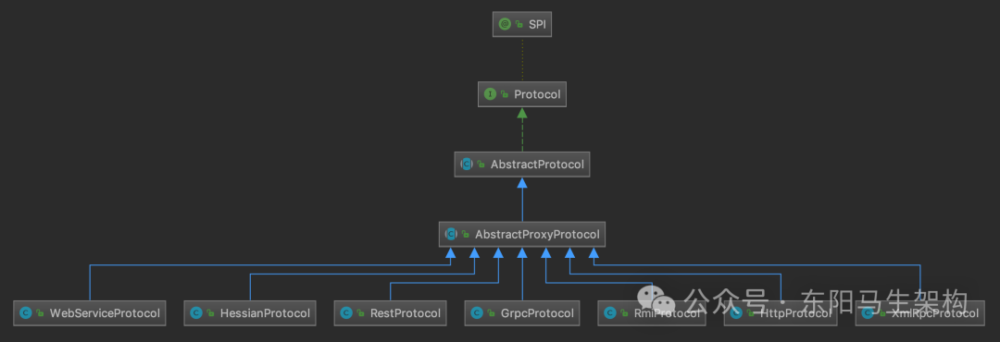
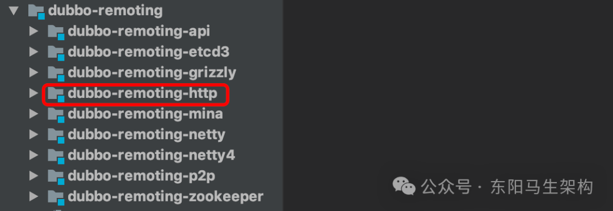
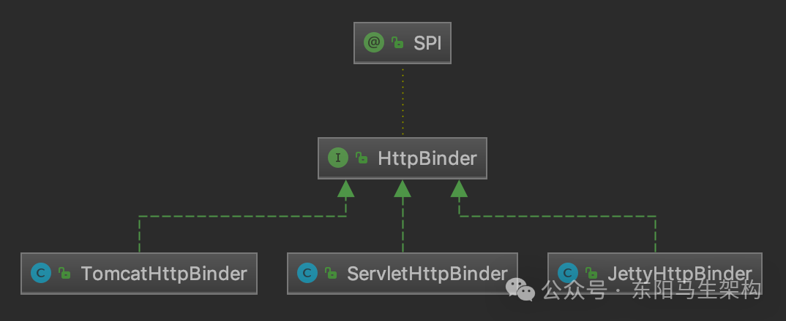
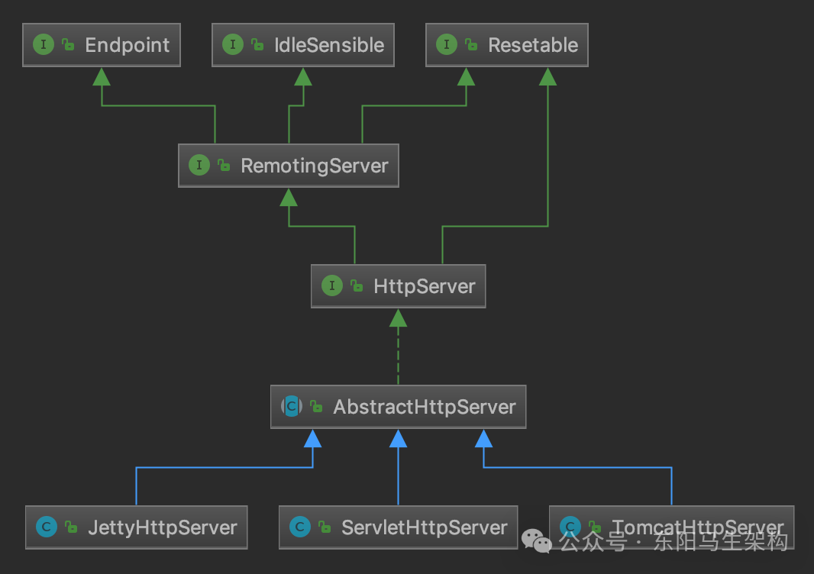
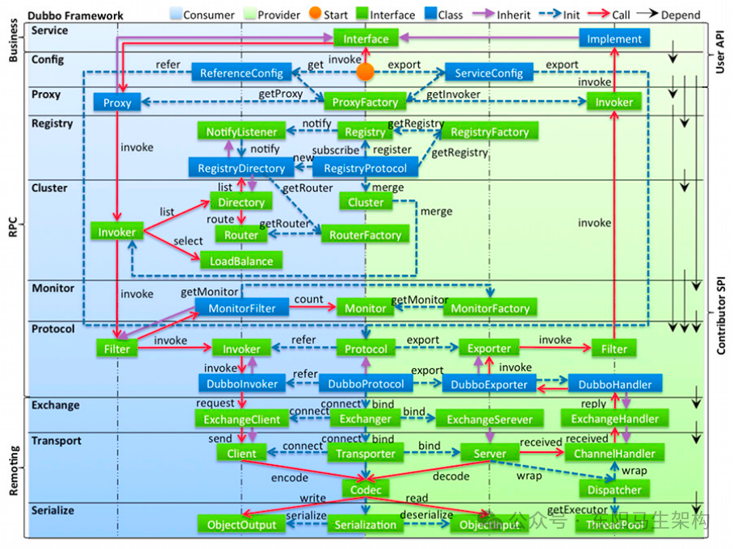

# Dubbo原理—11.RPC核心之协议和Filter接口

> **公众号**: 东阳马生架构  
> **发布时间**: 2025-07-30 09:00  

**大纲(20145字)**

- 1.Dubbo对HTTP协议的支持
- 2.扩展Dubbo功能的Filter接口


## 1.Dubbo对HTTP协议的支持

### (1)Dubbo对Dubbo协议的支持示例

### (2)Dubbo对HTTP协议的支持示例

### (3)AbstractProxyProtocol的实现和跨语言调用

### (4)JSON-RPC协议介绍

### (5)Dubbo基于jsonrpc4j实现JSON-RPC协议

### (6)HttpProtocol服务发布和引用的相关实现

### (1)Dubbo对Dubbo协议的支持示例

```java
public class DubboProtocolTest {
    //根据配置，这里使用的是DubboProtocol
    private Protocol protocol = ExtensionLoader.getExtensionLoader(Protocol.class).getAdaptiveExtension();
    private ProxyFactory proxy = ExtensionLoader.getExtensionLoader(ProxyFactory.class).getAdaptiveExtension();

    @Test
    public void testDemoProtocol() throws Exception {
        DemoService service = new DemoServiceImpl();
        int port = NetUtils.getAvailablePort();
        //基于Dubbo协议发布服务
        protocol.export(proxy.getInvoker(service, DemoService.class, URL.valueOf("dubbo://127.0.0.1:" + port + "/" + DemoService.class.getName() + "?codec=exchange")));
        //基于Dubbo协议引用服务
        service = proxy.getProxy(protocol.refer(DemoService.class, URL.valueOf("dubbo://127.0.0.1:" + port + "/" + DemoService.class.getName() + "?codec=exchange").addParameter("timeout", 3000L)));
    }
    ...
}

//在resources/META-INF/dubbo/internal/org.apache.dubbo.rpc.Protocol文件里的配置是：
//dubbo=org.apache.dubbo.rpc.protocol.dubbo.DubboProtocol
//表示使用的是DubbpProtocol
@SPI("dubbo")
public interface Protocol {
    //默认端口
    int getDefaultPort();

    //将一个Invoker发布出去
    //export()方法实现需要是幂等的
    //即同一个服务暴露多次和暴露一次的效果是相同的
    @Adaptive
    <T> Exporter<T> export(Invoker<T> invoker) throws RpcException;

    //引用一个Invoker
    //refer()方法会根据参数返回一个Invoker对象
    //Consumer端可以通过这个Invoker请求到Provider端的服务
    @Adaptive
    <T> Invoker<T> refer(Class<T> type, URL url) throws RpcException;

    //销毁export()方法以及refer()方法使用到的Invoker对象
    //释放当前Protocol对象底层占用的资源
    void destroy();

    //返回当前Protocol底层的全部ProtocolServer
    default List<ProtocolServer> getServers() {
        return Collections.emptyList();
    }
}

public class DubboProtocol extends AbstractProtocol {
    ...
    //服务端发布服务
    @Override
    public <T> Exporter<T> export(Invoker<T> invoker) throws RpcException {
        URL url = invoker.getUrl();

        //创建ServiceKey
        String key = serviceKey(url);

        //将上层传入的Invoker对象封装成DubboExporter对象
        //然后记录到父类的exporterMap集合中
        DubboExporter<T> exporter = new DubboExporter<T>(invoker, key, exporterMap);
        exporterMap.put(key, exporter);

        //export an stub service for dispatching event
        Boolean isStubSupportEvent = url.getParameter(STUB_EVENT_KEY, DEFAULT_STUB_EVENT);
        Boolean isCallbackservice = url.getParameter(IS_CALLBACK_SERVICE, false);
        if (isStubSupportEvent && !isCallbackservice) {
            String stubServiceMethods = url.getParameter(STUB_EVENT_METHODS_KEY);
            if (stubServiceMethods == null || stubServiceMethods.length() == 0) {
                if (logger.isWarnEnabled()) {
                    logger.warn(new IllegalStateException("consumer [ ...");
                }
            }
        }

        //启动ProtocolServer
        openServer(url);

        //序列化的优化处理
        optimizeSerialization(url);

        return exporter;
    }

    //客户端发起服务调用
    @Override
    public <T> Invoker<T> protocolBindingRefer(Class<T> serviceType, URL url) throws RpcException {
        //进行序列化优化，注册需要优化的类
        optimizeSerialization(url);
        //创建DubboInvoker对象
        //但首先需要通过getClients()方法获取ExchangeClient对象
        DubboInvoker<T> invoker = new DubboInvoker<T>(serviceType, url, getClients(url), invokers);
        //将上面创建DubboInvoker对象添加到父类的invoker集合之中
        invokers.add(invoker);
        return invoker;
    }
    ...
}

public abstract class AbstractProtocol implements Protocol {
    protected final Map<String, Exporter<?>> exporterMap = new ConcurrentHashMap<String, Exporter<?>>();
    protected final Map<String, ProtocolServer> serverMap = new ConcurrentHashMap<>();

    protected final Set<Invoker<?>> invokers = new ConcurrentHashSet<Invoker<?>>();
    ...

    //客户端发起服务调用
    @Override
    public <T> Invoker<T> refer(Class<T> type, URL url) throws RpcException {
        return new AsyncToSyncInvoker<>(protocolBindingRefer(type, url));
    }

    protected abstract <T> Invoker<T> protocolBindingRefer(Class<T> type, URL url) throws RpcException;
    ...
}
```

### (2)Dubbo对HTTP协议的支持示例

```java
public class HttpProtocolTest {
    @Test
    public void testJsonrpcProtocol() {
        HttpServiceImpl server = new HttpServiceImpl();

        //获取代理工厂，默认使用的是JavassistRpcProxyFactory
        ProxyFactory proxyFactory = ExtensionLoader.getExtensionLoader(ProxyFactory.class).getAdaptiveExtension();
        //根据配置，这里使用的是HttpProtocol
        Protocol protocol = ExtensionLoader.getExtensionLoader(Protocol.class).getAdaptiveExtension();

        int port = NetUtils.getAvailablePort();
        URL url = URL.valueOf("http://127.0.0.1:" + port + "/" + HttpService.class.getName() + "?version=1.0.0");
        //基于HTTP协议发布服务
        Exporter<HttpService> exporter = protocol.export(proxyFactory.getInvoker(server, HttpService.class, url));
        //基于HTTP协议引用服务
        Invoker<HttpService> invoker = protocol.refer(HttpService.class, url);

        //获取引用服务的代理
        HttpService client = proxyFactory.getProxy(invoker);
        //通过代理执行方法
        String result = client.sayHello("haha");

        invoker.destroy();
        exporter.unexport();
    }
    ...
}

//在resources/META-INF/dubbo/internal/org.apache.dubbo.rpc.Protocol文件里的配置是：
//http=org.apache.dubbo.rpc.protocol.http.HttpProtocol
//表示使用的是HttpProtocol
@SPI("dubbo")
public interface Protocol {
    //默认端口
    int getDefaultPort();

    //将一个Invoker发布出去
    @Adaptive
    <T> Exporter<T> export(Invoker<T> invoker) throws RpcException;

    //引用一个Invoker
    @Adaptive
    <T> Invoker<T> refer(Class<T> type, URL url) throws RpcException;

    //销毁export()方法以及refer()方法使用到的Invoker对象
    void destroy();

    //返回当前Protocol底层的全部ProtocolServer
    default List<ProtocolServer> getServers() {
        return Collections.emptyList();
    }
}

public class HttpProtocol extends AbstractProxyProtocol {
    private HttpBinder httpBinder;
    ...

    @Override
    protected <T> Runnable doExport(final T impl, Class<T> type, URL url) throws RpcException {
        //先查询serverMap缓存
        String addr = getAddr(url);
        ProtocolServer protocolServer = serverMap.get(addr);

        //查询缓存失败
        if (protocolServer == null) {
            //创建HttpServer
            //注意: 传入的HttpHandler实现是InternalHandler
            RemotingServer remotingServer = httpBinder.bind(url, new InternalHandler(url.getParameter("cors", false)));
            serverMap.put(addr, new ProxyProtocolServer(remotingServer));
        }

        final String path = url.getAbsolutePath();
        final String genericPath = path + "/" + GENERIC_KEY;
        //创建JsonRpcServer对象，并将URL与JsonRpcServer的映射关系记录到skeletonMap集合中
        JsonRpcServer skeleton = new JsonRpcServer(impl, type);
        JsonRpcServer genericServer = new JsonRpcServer(impl, GenericService.class);
        skeletonMap.put(path, skeleton);
        skeletonMap.put(genericPath, genericServer);

        //返回Runnable回调，在AbstractExporter中的unexport()方法中执行
        return () -> {
            skeletonMap.remove(path);
            skeletonMap.remove(genericPath);
        };
    }
    ...
}

public abstract class AbstractProxyProtocol extends AbstractProtocol {
    protected ProxyFactory proxyFactory;

    @Override
    @SuppressWarnings("unchecked")
    public <T> Exporter<T> export(final Invoker<T> invoker) throws RpcException {
        //首先查询exporterMap集合
        final String uri = serviceKey(invoker.getUrl());
        Exporter<T> exporter = (Exporter<T>) exporterMap.get(uri);
        if (exporter != null) {
            //When modifying the configuration through override, you need to re-expose the newly modified service.
            if (Objects.equals(exporter.getInvoker().getUrl(), invoker.getUrl())) {
                return exporter;
            }
        }

        //通过ProxyFactory创建代理类，将Invoker封装成业务接口的代理类
        //调用子类的doExport()方法，返回的Runnable是一个回调，它会销毁底层的Server
        //所以，将会在AbstractExporter的unexport()方法中调用该Runnable
        final Runnable runnable = doExport(proxyFactory.getProxy(invoker, true), invoker.getInterface(), invoker.getUrl());

        exporter = new AbstractExporter<T>(invoker) {
            @Override
            public void unexport() {
                super.unexport();
                exporterMap.remove(uri);
                if (runnable != null) {
                    try {
                        runnable.run();
                    } catch (Throwable t) {
                        logger.warn(t.getMessage(), t);
                    }
                }
            }
        };
        exporterMap.put(uri, exporter);

        return exporter;
    }

    @Override
    protected <T> Invoker<T> protocolBindingRefer(final Class<T> type, final URL url) throws RpcException {
        //调用子类的doRefer()方法
        final Invoker<T> target = proxyFactory.getInvoker(doRefer(type, url), type, url);

        Invoker<T> invoker = new AbstractInvoker<T>(type, url) {
            @Override
            protected Result doInvoke(Invocation invocation) throws Throwable {
                try {
                    Result result = target.invoke(invocation);
                    // FIXME result is an AsyncRpcResult instance.
                    Throwable e = result.getException();
                    if (e != null) {
                        for (Class<?> rpcException : rpcExceptions) {
                            if (rpcException.isAssignableFrom(e.getClass())) {
                                throw getRpcException(type, url, invocation, e);
                            }
                        }
                    }
                    return result;
                } catch (RpcException e) {
                    if (e.getCode() == RpcException.UNKNOWN_EXCEPTION) {
                        e.setCode(getErrorCode(e.getCause()));
                    }
                    throw e;
                } catch (Throwable e) {
                    throw getRpcException(type, url, invocation, e);
                }
            }
        };
        invokers.add(invoker);

        return invoker;
    }
    ...
}

public abstract class AbstractProtocol implements Protocol {
    protected final Map<String, Exporter<?>> exporterMap = new ConcurrentHashMap<String, Exporter<?>>();
    protected final Map<String, ProtocolServer> serverMap = new ConcurrentHashMap<>();
    protected final Set<Invoker<?>> invokers = new ConcurrentHashSet<Invoker<?>>();
    ...

    //客户端发起服务调用
    @Override
    public <T> Invoker<T> refer(Class<T> type, URL url) throws RpcException {
        return new AsyncToSyncInvoker<>(protocolBindingRefer(type, url));
    }

    protected abstract <T> Invoker<T> protocolBindingRefer(Class<T> type, URL url) throws RpcException;
    ...
}
```

### (3)AbstractProxyProtocol的实现和跨语言调用

AbstractProxyProtocol的继承关系图如下所示：



从图中可以看到：gRPC、HTTP、WebService、Hessian、Thrift等协议对应的Protocol实现都是继承自AbstractProxyProtocol抽象类。

由于很多公司会使用Node.js、Python、Rails、Go等语言来开发一些Web端应用，同时又有很多服务会使用Java技术栈实现，所以就出现了大量的跨语言调用的需求。

Dubbo作为一个RPC框架，自然也希望能实现这种跨语言的调用。Dubbo会使用"HTTP协议+JSON-RPC"的方式来达到这一目的，其中HTTP协议和JSON都是天然跨语言的标准，在各种语言中都有成熟的类库。

### (4)JSON-RPC协议介绍

Dubbo中支持的HTTP协议实际上使用的是JSON-RPC协议，JSON-RPC是基于JSON的跨语言远程调用协议。

dubbo-rpc-xml、dubbo-rpc-webservice等模块支持的XML-RPC、WebService等协议与JSON-RPC一样，都是基于文本的协议，只不过JSON的格式比XML、WebService等格式更加简洁、紧凑。

与Dubbo协议、Hessian协议等二进制协议相比，JSON-RPC更便于调试和实现，所以JSON-RPC协议还是一款非常优秀的远程调用协议。

在Java体系中，有很多成熟的JSON-RPC框架如jsonrpc4j、jpoxy等。其中jsonrpc4j本身体积小巧使用方便，既可以独立使用也可以与Spring无缝集合，非常适合基于Spring的项目。

#### 一.JSON-RPC协议中请求的基本格式

```javascript
{
    "id":1，
    "method": "sayHello",
    "params":[
        "Dubbo json-rpc"
    ]
}
```

#### 二.JSON-RPC请求中各个字段的含义

```bash
字段一：id
用于唯一标识一次远程调用。

字段二：method
指定了调用的方法名。

字段三：params数组
表示方法传入的参数，如果方法无参数传入，则传入空数组。
```

#### 三.JSON-RPC协议中响应的基本格式

在JSON-RPC的服务端收到调用请求之后，会查找到相应的方法并进行调用。然后将方法的返回值整理成如下格式，返回给客户端。

```javascript
{
    "id":1，
    "result": "Hello Dubbo json-rpc",
    "error":null
}
```

#### 四.JSON-RPC响应中各个字段的含义

```sql
字段一：id
用于唯一标识一次远程调用，该值与请求中的id字段值保持一致。

字段二：result
记录了方法的返回值，若无返回值，则返回空；若调用错误，返回null。

字段三：error
表示调用发生异常时的异常信息，方法执行无异常时该字段为null。
```

### (5)Dubbo基于jsonrpc4j实现JSON-RPC协议

#### 一.创建domain类以及服务接口

#### 二.实现服务接口

#### 三.将HTTP请求委托给JsonRpcServer处理

#### 四.创建服务端的入口类JsonRpcServer

#### 五.编写JSON-RPC的客户端JsonRpcClient

Dubbo使用jsonrpc4j库来实现JSON-RPC协议。下面使用jsonrpc4j编写一个简单的JSON-RPC服务端和客户端示例程序，并通过这两个示例程序说明jsonrpc4j最基本的使用方式。

#### 一.创建domain类以及服务接口

首先创建一个客户端和服务端都需要的User类作为最基础的数据对象。

```java
public class User implements Serializable {
    private int userId;
    private String name;
    private int age;
}
```

接下来创建一个UserService接口作为服务接口，其中定义了5个方法，分别用来创建User、查询User以及相关信息、删除User。

```cs
public interface UserService {
    User createUser(int userId, String name, int age);
    User getUser(int userId);
    String getUserName(int userId);
    int getUserId(String name);
    void deleteAll();
}
```

#### 二.实现服务接口

UserServiceImpl是UserService接口的实现类，其中使用一个ArrayList集合管理User对象。

```cs
public class UserServiceImpl implements UserService {
    private List<User> users = new ArrayList<>();

    @Override
    public User createUser(int userId, String name, int age) {
        System.out.println("createUser method");
        User user = new User();
        user.setUserId(userId);
        user.setName(name);
        user.setAge(age);
        users.add(user);
        return user;
    }

    @Override
    public User getUser(int userId) {
        System.out.println("getUser method");
        return users.stream().filter(u -> u.getUserId() == userId).findAny().get();
    }

    @Override
    public String getUserName(int userId) {
        System.out.println("getUserName method");
        return getUser(userId).getName();
    }

    @Override
    public int getUserId(String name) {
        System.out.println("getUserId method");
        return users.stream().filter(u -> u.getName().equals(name)).findAny().get().getUserId();
    }

    @Override
    public void deleteAll() {
        System.out.println("deleteAll");
        users.clear();
    }
}
```

#### 三.将HTTP请求委托给JsonRpcServer处理

需要创建一个继承自HttpServlet的子类RpcServlet类，并且覆盖HttpServlet的service()方法。HttpServlet在收到GET和POST请求时，会调用其service()方法进行处理。HttpServlet还会将HTTP请求和响应封装成HttpServletRequest和HttpServletResponse传入service()方法中。

这里的RpcServlet会创建一个JsonRpcServer，并在service()方法中将HTTP请求委托给JsonRpcServer进行处理。

```java
public class RpcServlet extends HttpServlet {
    private JsonRpcServer rpcServer = null;

    public RpcServlet() {
        super();
        rpcServer = new JsonRpcServer(new UserServiceImpl(), UserService.class);
    }

    @Override
    protected void service(HttpServletRequest request, HttpServletResponse response) throws ServletException, IOException {
        rpcServer.handle(request, response);
    }
}
```

#### 四.创建服务端的入口类JsonRpcServer

最后，创建一个JsonRpcServer作为服务端的入口类，在其main()方法中会启动Jetty作为Web容器。

```java
public class JsonRpcServer {
    public static void main(String[] args) throws Throwable {
        Server server = new Server(9999);
        WebAppContext context = new WebAppContext();
        context.setDescriptor("/dubbo-demo/json-rpc-demo/src/main/webapp/WEB-INF/web.xml");
        context.setResourceBase("/dubbo-demo/json-rpc-demo/src/main/webapp");
        context.setContextPath("/");
        context.setParentLoaderPriority(true);
        server.setHandler(context);
        server.start();
        server.join();
    }
}
```

这里使用到的web.xml配置文件如下：

```xml
<?xml version="1.0" encoding="UTF-8"?>
<web-app
    xmlns:xsi="http://www.w3.org/2001/XMLSchema-instance"
    xmlns="http://xmlns.jcp.org/xml/ns/javaee"
    xsi:schemaLocation="http://xmlns.jcp.org/xml/ns/javaee
    http://xmlns.jcp.org/xml/ns/javaee/web-app_3_1.xsd"
    version="3.1">
    <servlet>
        <servlet-name>RpcServlet</servlet-name>
        <servlet-class>com.demo.RpcServlet</servlet-class>
    </servlet>
    <servlet-mapping>
        <servlet-name>RpcServlet</servlet-name>
        <url-pattern>/rpc</url-pattern>
    </servlet-mapping>
</web-app>
```

#### 五.编写JSON-RPC的客户端JsonRpcClient

完成服务端的编写后，继续编写JSON-RPC的客户端。在JsonRpcClient中会创建JsonRpcHttpClient，并通过JsonRpcHttpClient请求服务端。

```cs
public class JsonRpcClient {
    private static JsonRpcHttpClient rpcHttpClient;

    public static void main(String[] args) throws Throwable {
        rpcHttpClient = new JsonRpcHttpClient(new URL("http://127.0.0.1:9999/rpc"));
        JsonRpcClient jsonRpcClient = new JsonRpcClient();
        jsonRpcClient.deleteAll();
        System.out.println(jsonRpcClient.createUser(1, "testName", 30));
        System.out.println(jsonRpcClient.getUser(1));
        System.out.println(jsonRpcClient.getUserName(1));
        System.out.println(jsonRpcClient.getUserId("testName"));
    }

    public void deleteAll() throws Throwable {
        rpcHttpClient.invoke("deleteAll", null);
    }

    public User createUser(int userId, String name, int age) throws Throwable {
        Object[] params = new Object[]{userId, name, age};
        return rpcHttpClient.invoke("createUser", params, User.class);
    }

    public User getUser(int userId) throws Throwable {
        Integer[] params = new Integer[]{ userId };
        return rpcHttpClient.invoke("getUser", params, User.class);
    }

    public String getUserName(int userId) throws Throwable {
        Integer[] params = new Integer[]{ userId };
        return rpcHttpClient.invoke("getUserName", params, String.class);
    }

    public int getUserId(String name) throws Throwable {
        String[] params = new String[]{ name };
        return rpcHttpClient.invoke("getUserId", params, Integer.class);
    }
}
```

### (6)HttpProtocol服务发布和引用的相关实现

#### 一.AbstractProxyProtocol的export()方法

#### 二.HttpProtocol的doExport()方法

#### 三.HttpBinder接口及其实现

#### 四.HttpServer接口及其实现

#### 五.HttpProtocol内部类InternalHandler

#### 六.HttpProtocol中服务引用的相关实现

#### 一.AbstractProxyProtocol的export()方法

该方法首先会根据URL检查exporterMap缓存。如果查询失败，则会调用ProxyFactory的getProxy()方法将Invoker封装成业务接口的代理类。然后通过子类实现的doExport()方法启动底层的ProxyProtocolServer以及初始化serverMap集合。

```java
public abstract class AbstractProtocol implements Protocol {
    protected final Map<String, Exporter<?>> exporterMap = new ConcurrentHashMap<String, Exporter<?>>();
    protected final Map<String, ProtocolServer> serverMap = new ConcurrentHashMap<>();
    protected final Set<Invoker<?>> invokers = new ConcurrentHashSet<Invoker<?>>();
    ...

    //客户端发起服务调用
    @Override
    public <T> Invoker<T> refer(Class<T> type, URL url) throws RpcException {
        return new AsyncToSyncInvoker<>(protocolBindingRefer(type, url));
    }

    protected abstract <T> Invoker<T> protocolBindingRefer(Class<T> type, URL url) throws RpcException;
    ...
}

public abstract class AbstractProxyProtocol extends AbstractProtocol {
    ...
    @Override
    @SuppressWarnings("unchecked")
    public <T> Exporter<T> export(final Invoker<T> invoker) throws RpcException {
        final String uri = serviceKey(invoker.getUrl());
        //首先查询exporterMap集合
        Exporter<T> exporter = (Exporter<T>) exporterMap.get(uri);
        if (exporter != null) {
            if (Objects.equals(exporter.getInvoker().getUrl(), invoker.getUrl())) {
                return exporter;
            }
        }

        //通过ProxyFactory创建代理类，将Invoker封装成业务接口的代理类
        //doExport()方法返回的Runnable是一个回调，该回调会销毁底层的Server
        //在AbstractExporter的unexport()方法中，会调用该Runnable
        final Runnable runnable = doExport(proxyFactory.getProxy(invoker, true), invoker.getInterface(), invoker.getUrl());
        exporter = new AbstractExporter<T>(invoker) {
            @Override
            public void unexport() {
                super.unexport();
                exporterMap.remove(uri);
                if (runnable != null) {
                    try {
                        runnable.run();
                    } catch (Throwable t) {
                        logger.warn(t.getMessage(), t);
                    }
                }
            }
        };
        exporterMap.put(uri, exporter);
        return exporter;
    }
    ...
}
```

#### 二.HttpProtocol的doExport()方法

在HttpProtocol的doExport()方法中，与前面介绍的DubboProtocol的实现类似，也要启动一个RemotingServer。为了适配各种HTTP服务器，如Tomcat、Jetty等，Dubbo在Transporter层抽象出了一个HttpServer的接口。

```java
public class HttpProtocol extends AbstractProxyProtocol {
    private HttpBinder httpBinder;
    ...

    @Override
    protected <T> Runnable doExport(final T impl, Class<T> type, URL url) throws RpcException {
        //先查询serverMap缓存
        String addr = getAddr(url);
        ProtocolServer protocolServer = serverMap.get(addr);

        //查询缓存失败
        if (protocolServer == null) {
            //创建HttpServer
            //注意: 传入的HttpHandler实现是InternalHandler
            RemotingServer remotingServer = httpBinder.bind(url, new InternalHandler(url.getParameter("cors", false)));
            serverMap.put(addr, new ProxyProtocolServer(remotingServer));
        }

        final String path = url.getAbsolutePath();
        final String genericPath = path + "/" + GENERIC_KEY;
        //创建JsonRpcServer对象，并将URL与JsonRpcServer的映射关系记录到skeletonMap集合中
        JsonRpcServer skeleton = new JsonRpcServer(impl, type);
        JsonRpcServer genericServer = new JsonRpcServer(impl, GenericService.class);
        skeletonMap.put(path, skeleton);
        skeletonMap.put(genericPath, genericServer);

        //返回Runnable回调，在AbstractExporter中的unexport()方法中执行
        return () -> {
            skeletonMap.remove(path);
            skeletonMap.remove(genericPath);
        };
    }
    ...
}
```

#### 三.HttpBinder接口及其实现

dubbo-remoting-http模块位置如下所示：



HttpBinder接口在dubbo-remoting-http模块中，它被@SPI注解修饰，是一个扩展接口。该接口有三个扩展实现，默认的实现是JettyHttpBinder，如下继承关系图所示。



```typescript
@SPI("jetty")
public interface HttpBinder {
    //bind the server.
    //@param url server url.
    //@return server.
    @Adaptive({Constants.SERVER_KEY})
    HttpServer bind(URL url, HttpHandler handler);
}

public class JettyHttpBinder implements HttpBinder {
    @Override
    public HttpServer bind(URL url, HttpHandler handler) {
        return new JettyHttpServer(url, handler);
    }
}

public class ServletHttpBinder implements HttpBinder {
    @Override
    public HttpServer bind(URL url, HttpHandler handler) {
        return new ServletHttpServer(url, handler);
    }
}

public class TomcatHttpBinder implements HttpBinder {
    @Override
    public HttpServer bind(URL url, HttpHandler handler) {
        return new TomcatHttpServer(url, handler);
    }
}
```

HttpBinder接口中的bind()方法被@Adaptive注解修饰，会根据URL的server参数选择相应的HttpBinder扩展实现，不同HttpBinder实现返回相应的HttpServer实现。

#### 四.HttpServer接口及其实现

HttpServer接口继承了RemotingServer接口，它的继承关系如下图示：



```java
public interface HttpServer extends Resetable, RemotingServer {
    //get http handler.
    HttpHandler getHttpHandler();

    //get url.
    URL getUrl();

    //get local address.
    InetSocketAddress getLocalAddress();

    //close the channel.
    void close();

    //Graceful close the channel.
    void close(int timeout);

    //is bound.
    boolean isBound();

    //is closed.
    boolean isClosed();
}

public abstract class AbstractHttpServer implements HttpServer {
    private final URL url;
    private final HttpHandler handler;
    private volatile boolean closed;

    public AbstractHttpServer(URL url, HttpHandler handler) {
        this.url = url;
        this.handler = handler;
    }
    ...
}
```

以JettyHttpServer为例，在其构造方法中会初始化Jetty Server，其中会配置Jetty Server使用到的线程池以及处理请求的Handler。

```java
public class JettyHttpServer extends AbstractHttpServer {
    private Server server;
    private URL url;

    public JettyHttpServer(URL url, final HttpHandler handler) {
        //初始化AbstractHttpServer中的url字段和handler字段
        super(url, handler);
        this.url = url;

        //添加HttpHandler
        DispatcherServlet.addHttpHandler(url.getParameter(Constants.BIND_PORT_KEY, url.getPort()), handler);

        //创建线程池
        int threads = url.getParameter(THREADS_KEY, DEFAULT_THREADS);
        QueuedThreadPool threadPool = new QueuedThreadPool();
        threadPool.setDaemon(true);
        threadPool.setMaxThreads(threads);
        threadPool.setMinThreads(threads);

        //创建Jetty Server
        server = new Server(threadPool);

        //创建ServerConnector，并指定绑定的ip和port
        ServerConnector connector = new ServerConnector(server);
        String bindIp = url.getParameter(Constants.BIND_IP_KEY, url.getHost());
        if (!url.isAnyHost() && NetUtils.isValidLocalHost(bindIp)) {
            connector.setHost(bindIp);
        }
        connector.setPort(url.getParameter(Constants.BIND_PORT_KEY, url.getPort()));
        server.addConnector(connector);

        //创建ServletHandler并与Jetty Server关联，由DispatcherServlet处理全部的请求
        ServletHandler servletHandler = new ServletHandler();
        ServletHolder servletHolder = servletHandler.addServletWithMapping(DispatcherServlet.class, "/*");
        servletHolder.setInitOrder(2);

        //创建ServletContextHandler并与Jetty Server关联
        ServletContextHandler context = new ServletContextHandler(server, "/", ServletContextHandler.SESSIONS);
        context.setServletHandler(servletHandler);
        ServletManager.getInstance().addServletContext(
            url.getParameter(Constants.BIND_PORT_KEY, url.getPort()),
            context.getServletContext());
        server.start();
    }
    ...
}
```

可以看到JettyHttpServer会将收到的全部请求委托给DispatcherServlet这个HttpServlet实现来处理，而DispatcherServlet的service()方法会把请求委托给对应端口的HttpHandler处理。

```java
public class DispatcherServlet extends HttpServlet {
    ...
    @Override
    protected void service(HttpServletRequest request, HttpServletResponse response) throws ServletException, IOException {
        //从HANDLERS集合中查询端口对应的HttpHandler对象
        HttpHandler handler = HANDLERS.get(request.getLocalPort());
        if (handler == null) {
            //端口没有对应的HttpHandler实现
            response.sendError(HttpServletResponse.SC_NOT_FOUND, "Service not found.");
        } else {
            //将请求委托给HttpHandler对象处理
            handler.handle(request, response);
        }
    }
    ...
}
```

#### 五.HttpProtocol内部类InternalHandler

HttpProtocol的doExport()方法会通过HttpBinder创建HttpServer对象，并记录到serverMap中用来接收HTTP请求。

HttpProtocol的doExport()初始化HttpServer以及处理请求时用到的HttpHandler是HttpProtocol中的内部类，在其他使用HTTP协议作为基础的RPC协议实现中也有类似的HttpHandler实现类。

在HttpProtocol.InternalHandler的handle()方法中，会将请求委托给skeletonMap集合中记录的JsonRpcServer对象进行处理。

```java
public class HttpProtocol extends AbstractProxyProtocol {
    ...
    private class InternalHandler implements HttpHandler {
        private boolean cors;

        public InternalHandler(boolean cors) {
            this.cors = cors;
        }

        @Override
        public void handle(HttpServletRequest request, HttpServletResponse response) throws ServletException {
            String uri = request.getRequestURI();
            JsonRpcServer skeleton = skeletonMap.get(uri);
            if (cors) {
                //处理跨域问题
                response.setHeader(ACCESS_CONTROL_ALLOW_ORIGIN_HEADER, "*");
                response.setHeader(ACCESS_CONTROL_ALLOW_METHODS_HEADER, "POST");
                response.setHeader(ACCESS_CONTROL_ALLOW_HEADERS_HEADER, "*");
            }
            if (request.getMethod().equalsIgnoreCase("OPTIONS")) {
                //处理OPTIONS请求
                response.setStatus(200);
            } else if (request.getMethod().equalsIgnoreCase("POST")) {
                //只处理POST请求
                RpcContext.getContext().setRemoteAddress(request.getRemoteAddr(), request.getRemotePort());
                skeleton.handle(request.getInputStream(), response.getOutputStream());
            } else {
                //其他Method类型的请求，例如，GET请求，直接返回500
                response.setStatus(500);
            }
        }
    }
    ...
}
```

skeletonMap集合中的JsonRpcServer是与HttpServer对象一同在HttpProtocol.doExport()方法中初始化的。

```java
public class HttpProtocol extends AbstractProxyProtocol {
    ...
    @Override
    protected <T> Runnable doExport(final T impl, Class<T> type, URL url) throws RpcException {
        //先查询serverMap缓存
        String addr = getAddr(url);
        ProtocolServer protocolServer = serverMap.get(addr);

        //查询缓存失败
        if (protocolServer == null) {
            //创建HttpServer
            //注意：传入的HttpHandler实现是InternalHandler
            RemotingServer remotingServer = httpBinder.bind(url, new InternalHandler(url.getParameter("cors", false)));
            serverMap.put(addr, new ProxyProtocolServer(remotingServer));
        }

        final String path = url.getAbsolutePath();
        final String genericPath = path + "/" + GENERIC_KEY;
        //创建JsonRpcServer对象，并将URL与JsonRpcServer的映射关系记录到skeletonMap集合中
        JsonRpcServer skeleton = new JsonRpcServer(impl, type);
        JsonRpcServer genericServer = new JsonRpcServer(impl, GenericService.class);
        skeletonMap.put(path, skeleton);
        skeletonMap.put(genericPath, genericServer);

        //返回Runnable回调，在Exporter中的unexport()方法中执行
        return () -> {
            skeletonMap.remove(path);
            skeletonMap.remove(genericPath);
        };
    }
    ...
}
```

#### 六.HttpProtocol中服务引用的相关实现

在AbstractProxyProtocol的protocolBindinRefer()方法中，首先会通过doRefer()方法创建业务接口的代理，然后再通过ProxyFactory的getInvoker()方法将doRefer()方法返回的代理对象转换成Invoker对象，并记录到Invokers集合中。

HttpProtocol的doRefer()方法会使用jsonrpc4j库中的JsonProxyFactoryBean与Spring进行集成。在JsonProxyFactoryBean的afterPropertiesSet()方法中会创建JsonRpcHttpClient对象。

```java
public abstract class AbstractProxyProtocol extends AbstractProtocol {
    ...
    @Override
    protected <T> Invoker<T> protocolBindingRefer(final Class<T> type, final URL url) throws RpcException {
        final Invoker<T> target = proxyFactory.getInvoker(
            doRefer(type, url),
            type,
            url
        );
        Invoker<T> invoker = new AbstractInvoker<T>(type, url) {
            @Override
            protected Result doInvoke(Invocation invocation) throws Throwable {
                Result result = target.invoke(invocation);
                return result;
            }
       };
       invokers.add(invoker);
       return invoker;
    }
    ...
}

public class HttpProtocol extends AbstractProxyProtocol {
    ...
    @SuppressWarnings("unchecked")
    @Override
    protected <T> T doRefer(final Class<T> serviceType, URL url) throws RpcException {
        final String generic = url.getParameter(GENERIC_KEY);
        final boolean isGeneric = ProtocolUtils.isGeneric(generic) || serviceType.equals(GenericService.class);
        JsonProxyFactoryBean jsonProxyFactoryBean = new JsonProxyFactoryBean();
        JsonRpcProxyFactoryBean jsonRpcProxyFactoryBean = new JsonRpcProxyFactoryBean(jsonProxyFactoryBean);
        jsonRpcProxyFactoryBean.setRemoteInvocationFactory((methodInvocation) -> {
            RemoteInvocation invocation = new JsonRemoteInvocation(methodInvocation);
            if (isGeneric) {
                invocation.addAttribute(GENERIC_KEY, generic);
            }
            return invocation;
        });
        String key = url.setProtocol("http").toIdentityString();
        if (isGeneric) {
            key = key + "/" + GENERIC_KEY;
        }

        jsonRpcProxyFactoryBean.setServiceUrl(key);
        jsonRpcProxyFactoryBean.setServiceInterface(serviceType);

        jsonProxyFactoryBean.afterPropertiesSet();
        return (T) jsonProxyFactoryBean.getObject();
    }
    ...
}

public class JsonProxyFactoryBean extends UrlBasedRemoteAccessor implements MethodInterceptor, InitializingBean, FactoryBean<Object>, ApplicationContextAware {
    ...
    public void afterPropertiesSet() {
        ...
        //create JsonRpcHttpClient
        try {
            jsonRpcHttpClient = new JsonRpcHttpClient(objectMapper, new URL(getServiceUrl()), extraHttpHeaders);
            jsonRpcHttpClient.setRequestListener(requestListener);
            jsonRpcHttpClient.setSslContext(sslContext);
            jsonRpcHttpClient.setHostNameVerifier(hostNameVerifier);
        } catch (MalformedURLException mue) {
            throw new RuntimeException(mue);
        }
    }
    ...
}
```

### (7)总结

这里介绍了在Dubbo中如何通过"HTTP协议 + JSON-RPC"的方案实现跨语言调用。首先介绍了JSON-RPC中请求和响应的基本格式，以及其实现库jsonrpc4j的基本使用。接着介绍了Dubbo中AbstractProxyProtocol、HttpProtocol等核心类，以及介绍了Dubbo中"HTTP协议 + JSON-RPC"方案的实现。

## 2.扩展Dubbo功能的Filter接口

### (1)ProtocolFilterWrapper的实现

### (2)ConsumerContextFilter

### (3)ActiveLimitFilter

### (4)ContextFilter

### (5)AccessLogFilter

### (6)ClassLoaderFilter

### (7)ExecuteLimitFilter

### (8)TimeoutFilter

### (9)TpsLimitFilter

### (10)自定义Filter实践

### (1)ProtocolFilterWrapper的实现

ProtocolFilterWrapper是Protocol的装饰器，它的refer()方法和export()方法都会调用buildInvokerChain()方法来构造一个Filter链。

ProtocolFilterWrapper的buildInvokerChain()方法首先会加载Dubbo以及应用程序提供的Filter实现类，然后构造成Filter链，最后通过装饰者模式在原有Invoker对象基础上添加执行Filter链的逻辑。

```java
public class ProtocolFilterWrapper implements Protocol {
    private final Protocol protocol;

    public ProtocolFilterWrapper(Protocol protocol) {
        this.protocol = protocol;
    }

    private static <T> Invoker<T> buildInvokerChain(final Invoker<T> invoker, String key, String group) {
        Invoker<T> last = invoker;
        //根据URL中携带的配置信息，确定当前激活的Filter扩展实现有哪些，形成Filter集合
        List<Filter> filters = ExtensionLoader.getExtensionLoader(Filter.class).getActivateExtension(invoker.getUrl(), key, group);

        if (!filters.isEmpty()) {
            //遍历Filter集合，将每个Filter实现封装成一个匿名Invoker
            for (int i = filters.size() - 1; i >= 0; i--) {
                final Filter filter = filters.get(i);
                final Invoker<T> next = last;
                last = new Invoker<T>() {
                    ...
                    @Override
                    public Result invoke(Invocation invocation) throws RpcException {
                        Result asyncResult;
                        try {
                            //调用Filter的invoke()方法执行Filter的逻辑，
                            //然后由Filter内部的逻辑决定是否将调用传递到下一个Filter执行
                            asyncResult = filter.invoke(next, invocation);
                        } catch (Exception e) {
                            ...
                        } finally {

                        }
                        return asyncResult.whenCompleteWithContext((r, t) -> {
                            if (filter instanceof ListenableFilter) {
                                ListenableFilter listenableFilter = ((ListenableFilter) filter);
                                Filter.Listener listener = listenableFilter.listener(invocation);
                                try {
                                    if (listener != null) {
                                        if (t == null) {
                                            listener.onResponse(r, invoker, invocation);
                                        } else {
                                            listener.onError(t, invoker, invocation);
                                        }
                                    }
                                } finally {
                                    listenableFilter.removeListener(invocation);
                                }
                            } else if (filter instanceof Filter.Listener) {
                                Filter.Listener listener = (Filter.Listener) filter;
                                if (t == null) {
                                    listener.onResponse(r, invoker, invocation);
                                } else {
                                    listener.onError(t, invoker, invocation);
                                }
                            }
                        });
                    }
                };
            }
        }
        return last;
    }

    @Override
    public <T> Exporter<T> export(Invoker<T> invoker) throws RpcException {
        if (UrlUtils.isRegistry(invoker.getUrl())) {
            return protocol.export(invoker);
        }
        return protocol.export(buildInvokerChain(invoker, SERVICE_FILTER_KEY, CommonConstants.PROVIDER));
    }

    @Override
    public <T> Invoker<T> refer(Class<T> type, URL url) throws RpcException {
        if (UrlUtils.isRegistry(url)) {
            return protocol.refer(type, url);
        }
        return buildInvokerChain(protocol.refer(type, url), REFERENCE_FILTER_KEY, CommonConstants.CONSUMER);
    }
    ...
}

@SPI
public interface Filter {
    //将请求传给后续的Invoker进行处理
    Result invoke(Invoker<?> invoker, Invocation invocation) throws RpcException;

    //用于监听响应以及异常
    interface Listener {
        //正常响应时的监听
        void onResponse(Result appResponse, Invoker<?> invoker, Invocation invocation);

        //异常响应时的监听
        void onError(Throwable t, Invoker<?> invoker, Invocation invocation);
    }
}
```

Filter链的组装逻辑设计得非常灵活，可以通过"-"配置手动剔除Dubbo原生提供的默认加载的Filter，可以通过"default"来代替Dubbo原生提供的Filter，这样就可以很好地控制哪些Filter要加载，以及Filter的真正执行顺序。

Filter是扩展Dubbo功能的首选方案，并且Dubbo自身也提供了非常多的Filter实现来扩展自身功能。

Filter在Dubbo架构中的位置如下：



### (2)ConsumerContextFilter

这是一个非常简单的Consumer端的Filter实现。它会在当前的RpcContext中记录本地调用的一些状态信息(会记录到LOCAL对应的RpcContext中)，例如调用相关的Invoker、Invocation以及调用的本地地址、远端地址信息等。它还会检查请求是否超时。如果请求超时，则不再发起远程调用，直接返回一个封装了RPC异常的AsyncRpcResult对象。

```java
@Activate(group = CONSUMER, order = -10000)
public class ConsumerContextFilter implements Filter {
    @Override
    public Result invoke(Invoker<?> invoker, Invocation invocation) throws RpcException {
        RpcContext context = RpcContext.getContext();
        //1.记录Invoker
        context.setInvoker(invoker)
            //记录Invocation
            .setInvocation(invocation)
            //记录本地地址以及远端地址
            .setLocalAddress(NetUtils.getLocalHost(), 0)
            .setRemoteAddress(invoker.getUrl().getHost(), invoker.getUrl().getPort())
            //记录远端应用名称等信息
            .setRemoteApplicationName(invoker.getUrl().getParameter(REMOTE_APPLICATION_KEY))
            .setAttachment(REMOTE_APPLICATION_KEY, invoker.getUrl().getParameter(APPLICATION_KEY));
        if (invocation instanceof RpcInvocation) {
            ((RpcInvocation) invocation).setInvoker(invoker);
        }

        //2.检测是否超时
        Object countDown = context.get(TIME_COUNTDOWN_KEY);
        if (countDown != null) {
            TimeoutCountDown timeoutCountDown = (TimeoutCountDown) countDown;
            if (timeoutCountDown.isExpired()) {
                return AsyncRpcResult.newDefaultAsyncResult(new RpcException(RpcException.TIMEOUT_TERMINATE, "..."), invocation);
            }
        }
        return invoker.invoke(invocation);
    }
}
```

这里使用的TimeoutCountDown对象用于检测当前调用是否超时，其中有三个字段。在TimeoutCountDown的isExpire()方法中，会比较当前时间与deadlineInNanos记录的超时时间。

```java
public final class TimeoutCountDown implements Comparable<TimeoutCountDown> {
    //超时时间，单位为毫秒
    private final long timeoutInMillis;

    //超时的时间戳，单位为纳秒
    private final long deadlineInNanos;

    //标识当前TimeoutCountDown关联的调用是否已超时
    private volatile boolean expired;

    public static TimeoutCountDown newCountDown(long timeout, TimeUnit unit) {
        return new TimeoutCountDown(timeout, unit);
    }

    private TimeoutCountDown(long timeout, TimeUnit unit) {
        timeoutInMillis = TimeUnit.MILLISECONDS.convert(timeout, unit);
        deadlineInNanos = System.nanoTime() + TimeUnit.NANOSECONDS.convert(timeout, unit);
    }

    public boolean isExpired() {
        if (!expired) {
            if (deadlineInNanos - System.nanoTime() <= 0) {
                expired = true;
            } else {
                return false;
            }
        }
        return true;
    }

    public long timeRemaining(TimeUnit unit) {
        final long currentNanos = System.nanoTime();
        if (!expired && deadlineInNanos - currentNanos <= 0) {
            expired = true;
        }
        return unit.convert(deadlineInNanos - currentNanos, TimeUnit.NANOSECONDS);
    }

    public long elapsedMillis() {
        if (isExpired()) {
            return timeoutInMillis + TimeUnit.MILLISECONDS.convert(System.nanoTime() - deadlineInNanos, TimeUnit.NANOSECONDS);
        } else {
            return TimeUnit.MILLISECONDS.convert(deadlineInNanos - System.nanoTime(), TimeUnit.NANOSECONDS);
        }
    }
    ...
}
```

### (3)ActiveLimitFilter

ActiveLimitFilter是Consumer端用于限制一个Consumer对于一个服务端接口的并发调用量，可称为客户端限流。

ActiveLimitFilter在实现Filter接口的同时，还实现了Filter.Listener这个内部接口。在ActiveLimitFilter的onResponse()方法中，不仅会调用RpcStatus的endCount()方法完成调用监控的统计，还会调用ActiveLimitFilter的notifyFinish()方法唤醒阻塞在RpcStatus对象上的线程。

```java
@Activate(group = CONSUMER, value = ACTIVES_KEY)
public class ActiveLimitFilter implements Filter, Filter.Listener {
    ...
    @Override
    public Result invoke(Invoker<?> invoker, Invocation invocation) throws RpcException {
        //获得url对象
        URL url = invoker.getUrl();
        //获得方法名称
        String methodName = invocation.getMethodName();
        //计算获取最大并发数
        int max = invoker.getUrl().getMethodParameter(methodName, ACTIVES_KEY, 0);
        //获取该方法的状态信息
        final RpcStatus rpcStatus = RpcStatus.getStatus(invoker.getUrl(), invocation.getMethodName());
        //尝试并发度加一
        if (!RpcStatus.beginCount(url, methodName, max)) {
            long timeout = invoker.getUrl().getMethodParameter(invocation.getMethodName(), TIMEOUT_KEY, 0);
            long start = System.currentTimeMillis();
            long remain = timeout;
            //加锁
            synchronized (rpcStatus) {
                //再次尝试并发度加一
                while (!RpcStatus.beginCount(url, methodName, max)) {
                    //阻塞等待降低并发度
                    rpcStatus.wait(remain);
                    //检测是否超时
                    long elapsed = System.currentTimeMillis() - start;
                    remain = timeout - elapsed;
                    if (remain <= 0) {
                        throw new RpcException(RpcException.LIMIT_EXCEEDED_EXCEPTION, "...");
                    }
                }
            }
        }
        //添加一个attribute
        invocation.put(ACTIVELIMIT_FILTER_START_TIME, System.currentTimeMillis());
        return invoker.invoke(invocation);
    }

    @Override
    public void onResponse(Result appResponse, Invoker<?> invoker, Invocation invocation) {
        //获取调用的方法名称
        String methodName = invocation.getMethodName();
        URL url = invoker.getUrl();
        int max = invoker.getUrl().getMethodParameter(methodName, ACTIVES_KEY, 0);
        //调用RpcStatus.endCount()方法完成调用监控的统计
        RpcStatus.endCount(url, methodName, getElapsed(invocation), true);
        //调用notifyFinish()方法唤醒阻塞在对应RpcStatus对象上的线程
        notifyFinish(RpcStatus.getStatus(url, methodName), max);
    }

    private void notifyFinish(final RpcStatus rpcStatus, int max) {
        if (max > 0) {
            synchronized (rpcStatus) {
                //唤醒等待的线程
                rpcStatus.notifyAll();
            }
        }
    }
    ...
}
```

ActiveLimitFilter的invoke()方法的核心实现与RpcStatus密切相关。远程调用开始前会执行RpcStatus的beginCount()方法，远程调用结束后会执行RpcStatus的endCount()方法。

RpcStatus的beginCount()方法会从它的两个集合中获取服务和服务方法对应的RpcStatus对象，然后分别将它们的active字段加一。

RpcStatus的endCount()方法会对服务和服务方法对应的RpcStatus的所有字段进行更新，完成统计。

```java
public class RpcStatus {
    //这个集合记录了当前Consumer调用每个服务的状态信息
    //其中key是URL，value是对应的RpcStatus对象
    private static final ConcurrentMap<String, RpcStatus> SERVICE_STATISTICS =
        new ConcurrentHashMap<String, RpcStatus>();

    //这个集合记录了当前Consumer调用每个服务方法的状态信息
    //其中第一层key是URL，第二层key是方法名称，第三层是对应的RpcStatus对象
    private static final ConcurrentMap<String, ConcurrentMap<String, RpcStatus>> METHOD_STATISTICS =
        new ConcurrentHashMap<String, ConcurrentMap<String, RpcStatus>>();

    //当前并发度
    private final AtomicInteger active = new AtomicInteger();
    //调用的总数
    private final AtomicLong total = new AtomicLong();
    //失败的调用数
    private final AtomicInteger failed = new AtomicInteger();
    //所有调用的总耗时
    private final AtomicLong totalElapsed = new AtomicLong();
    //所有失败调用的总耗时
    private final AtomicLong failedElapsed = new AtomicLong();
    //所有调用中最长的耗时
    private final AtomicLong maxElapsed = new AtomicLong();
    //所有失败调用中最长的耗时
    private final AtomicLong failedMaxElapsed = new AtomicLong();
    //所有成功调用中最长的耗时
    private final AtomicLong succeededMaxElapsed = new AtomicLong();
    ...

    public static boolean beginCount(URL url, String methodName, int max) {
        max = (max <= 0) ? Integer.MAX_VALUE : max;
        //获取服务对应的RpcStatus对象
        RpcStatus appStatus = getStatus(url);
        //获取服务方法对应的RpcStatus对象
        RpcStatus methodStatus = getStatus(url, methodName);
        if (methodStatus.active.get() == Integer.MAX_VALUE) {
            //并发度溢出
            return false;
        }
        for (int i; ;) {
            i = methodStatus.active.get();
            //并发度超过max上限，直接返回false
            if (i + 1 > max) {
                return false;
            }
            //CAS操作
            if (methodStatus.active.compareAndSet(i, i + 1)) {
                //更新成功后退出当前循环
                break;
            }
        }
        //单个服务的并发度加一
        appStatus.active.incrementAndGet();
        return true;
    }

    public static RpcStatus getStatus(URL url) {
        String uri = url.toIdentityString();
        return SERVICE_STATISTICS.computeIfAbsent(uri, key -> new RpcStatus());
    }

    public static RpcStatus getStatus(URL url, String methodName) {
        String uri = url.toIdentityString();
        ConcurrentMap<String, RpcStatus> map = METHOD_STATISTICS.computeIfAbsent(uri, k -> new ConcurrentHashMap<>());
        return map.computeIfAbsent(methodName, k -> new RpcStatus());
    }

    public static void endCount(URL url, String methodName, long elapsed, boolean succeeded) {
        //服务维度
        endCount(getStatus(url), elapsed, succeeded);
        //服务方法维度
        endCount(getStatus(url, methodName), elapsed, succeeded);
    }

    private static void endCount(RpcStatus status, long elapsed, boolean succeeded) {
        //请求完成，降低并发度
        status.active.decrementAndGet();
        //调用总次数增加
        status.total.incrementAndGet();
        //调用总耗时增加
        status.totalElapsed.addAndGet(elapsed);
        //更新最大耗时
        if (status.maxElapsed.get() < elapsed) {
            status.maxElapsed.set(elapsed);
        }
        //如果此次调用成功，则会更新成功调用的最大耗时
        if (succeeded) {
            if (status.succeededMaxElapsed.get() < elapsed) {
                status.succeededMaxElapsed.set(elapsed);
            }
        }
        //如果此次调用失败，则会更新失败调用的最大耗时
        else {
            status.failed.incrementAndGet();
            status.failedElapsed.addAndGet(elapsed);
            if (status.failedMaxElapsed.get() < elapsed) {
                status.failedMaxElapsed.set(elapsed);
            }
        }
    }
    ...
}
```

### (4)ContextFilter

AbstractInvoker的invoke()方法有如下一段逻辑，这段逻辑会将RpcContext中的附加信息添加到Invocation中，一并传递到Provider端。

```typescript
//这一段逻辑如下：将RpcContext的附加信息添加为Invocation的附加信息
Map<String, Object> contextAttachments = RpcContext.getContext().getObjectAttachments();
if (CollectionUtils.isNotEmptyMap(contextAttachments)) {
    invocation.addObjectAttachments(contextAttachments);
}

//具体的invoke()方法如下
public abstract class AbstractInvoker<T> implements Invoker<T> {
    ...
    @Override
    public Result invoke(Invocation inv) throws RpcException {
        //首先将传入的Invocation转换为RpcInvocation
        RpcInvocation invocation = (RpcInvocation) inv;
        invocation.setInvoker(this);
        //将前文介绍的attachment集合添加为Invocation的附加信息
        if (CollectionUtils.isNotEmptyMap(attachment)) {
            invocation.addObjectAttachmentsIfAbsent(attachment);
        }

        //将RpcContext的附加信息添加为Invocation的附加信息
        Map<String, Object> contextAttachments = RpcContext.getContext().getObjectAttachments();
        if (CollectionUtils.isNotEmptyMap(contextAttachments)) {
            invocation.addObjectAttachments(contextAttachments);
        }

        //设置此次调用的模式，异步还是同步
        invocation.setInvokeMode(RpcUtils.getInvokeMode(url, invocation));
        //如果是异步调用，给这次调用添加一个唯一ID
        RpcUtils.attachInvocationIdIfAsync(getUrl(), invocation);

        AsyncRpcResult asyncResult;
        //调用子类实现的doInvoke()方法
        asyncResult = (AsyncRpcResult) doInvoke(invocation);
        RpcContext.getContext().setFuture(new FutureAdapter(asyncResult.getResponseFuture()));
        return asyncResult;
    }
    ...
}
```

那么，在Provider端，会如何获取Invocation中的附加信息并设置到RpcContext中的呢？

ContextFilter是Provider端的一个Filter实现，它主要用来初始化Provider端的RpcContext。

ContextFilter的invoke()方法首先会从Invocation中获取Attachments集合，并对该集合中的key进行过滤，其中会将UNLOADING_KEYS集合中的全部key过滤掉。然后会初始化RpcContext以及Invocation的各项信息，这些信息包括Invocation、Attachments、localAddress、remoteApplication、超时时间等。最后调用Invoker的invoke()方法执行Provider的业务逻辑。

ContextFilter在实现Filter接口的同时，还实现了Filter.Listener这个内部接口。在ContextFilter的onResponse()方法中：会将SERVER_LOCAL这个RpcContext中的附加信息添加到AppResponse的attachments字段中，返回给Consumer。

```typescript
@Activate(group = PROVIDER, order = -10000)
public class ContextFilter implements Filter, Filter.Listener {
    ...
    @Override
    public Result invoke(Invoker<?> invoker, Invocation invocation) throws RpcException {
        Map<String, Object> attachments = invocation.getObjectAttachments();
        //过滤UNLOADING_KEYS集合的逻辑
        if (attachments != null) {
            Map<String, Object> newAttach = new HashMap<>(attachments.size());
            for (Map.Entry<String, Object> entry : attachments.entrySet()) {
                String key = entry.getKey();
                if (!UNLOADING_KEYS.contains(key)) {
                    newAttach.put(key, entry.getValue());
                }
            }
            attachments = newAttach;
        }

        //获取RpcContext
        RpcContext context = RpcContext.getContext();

        //设置RpcContext中的信息
        context.setInvoker(invoker)
            .setInvocation(invocation)
            .setLocalAddress(invoker.getUrl().getHost(), invoker.getUrl().getPort());
        String remoteApplication = (String) invocation.getAttachment(REMOTE_APPLICATION_KEY);
        if (StringUtils.isNotEmpty(remoteApplication)) {
            context.setRemoteApplicationName(remoteApplication);
        } else {
            context.setRemoteApplicationName((String) context.getAttachment(REMOTE_APPLICATION_KEY));
        }

        long timeout = RpcUtils.getTimeout(invocation, -1);
        if (timeout != -1) {
            //设置超时时间
            context.set(TIME_COUNTDOWN_KEY, TimeoutCountDown.newCountDown(timeout, TimeUnit.MILLISECONDS));
        }

        if (attachments != null) {
            //向RpcContext中设置Attachments
            if (context.getObjectAttachments() != null) {
                context.getObjectAttachments().putAll(attachments);
            } else {
                context.setObjectAttachments(attachments);
            }
        }

        if (invocation instanceof RpcInvocation) {
            //向Invocation设置
            ((RpcInvocation) invocation).setInvoker(invoker);
        }

        try {
            //在整个调用过程中，需要保持当前RpcContext不被删除，这里会将remove开关关掉，这样，removeContext()方法不会删除LOCAL RpcContext了
            context.clearAfterEachInvoke(false);
            return invoker.invoke(invocation);
        } finally {
            //重置remove开关
            context.clearAfterEachInvoke(true);
            //清理RpcContext，当前线程处理下一个调用的时候，会创建新的RpcContext
            RpcContext.removeContext(true);
            RpcContext.removeServerContext();
        }
    }

    @Override
    public void onResponse(Result appResponse, Invoker<?> invoker, Invocation invocation) {
        appResponse.addObjectAttachments(RpcContext.getServerContext().getObjectAttachments());
    }
    ...
}
```

### (5)AccessLogFilter

AccessLogFilter是用来记录日志的，它的功能就是将Provider或者Consumer的日志写入文件中。

AccessLogFilter的invoke()方法会调用log()方法将日志缓存到内存日志集合中。当缓存大小超过一定阈值之后，便会触发日志的写入。如果长时间未触发日志文件的写入，那么会由定时任务定时写入。

AccessLogFilter的log()方法首先会按照ACCESS_LOG_KEY的值找到对应的AccessLogData集合。然后判断该缓存集合的大小是否超过了阈值，如果缓存大小超过阈值，那么就调用writeLogSetToFile()方法将日志写入文件。

```typescript
@Activate(group = PROVIDER, value = ACCESS_LOG_KEY)
public class AccessLogFilter implements Filter {
    ...
    @Override
    public Result invoke(Invoker<?> invoker, Invocation inv) throws RpcException {
        try {
            //获取ACCESS_LOG_KEY
            String accessLogKey = invoker.getUrl().getParameter(ACCESS_LOG_KEY);
            if (ConfigUtils.isNotEmpty(accessLogKey)) {
                //构造AccessLogData对象，其中记录了日志信息
                //例如，调用的服务名称、方法名称、version等
                AccessLogData logData = buildAccessLogData(invoker, inv);
                //调用log()方法将日志写入缓存
                log(accessLogKey, logData);
            }
        } catch (Throwable t) {
            logger.warn("Exception in AccessLogFilter of service(" + invoker + " -> " + inv + ")", t);
        }
        //调用下一个Invoker
        return invoker.invoke(inv);
    }

    private AccessLogData buildAccessLogData(Invoker<?> invoker, Invocation inv) {
        AccessLogData logData = AccessLogData.newLogData();
        logData.setServiceName(invoker.getInterface().getName());
        logData.setMethodName(inv.getMethodName());
        logData.setVersion(invoker.getUrl().getParameter(VERSION_KEY));
        logData.setGroup(invoker.getUrl().getParameter(GROUP_KEY));
        logData.setInvocationTime(new Date());
        logData.setTypes(inv.getParameterTypes());
        logData.setArguments(inv.getArguments());
        return logData;
    }

    private void log(String accessLog, AccessLogData accessLogData) {
        //根据ACCESS_LOG_KEY获取对应的缓存集合
        Set<AccessLogData> logSet = LOG_ENTRIES.computeIfAbsent(accessLog, k -> new ConcurrentHashSet<>());

        //缓存大小未超过阈值
        if (logSet.size() < LOG_MAX_BUFFER) {
            logSet.add(accessLogData);
        } else {
            //缓存大小超过阈值，触发缓存数据写入文件
            writeLogSetToFile(accessLog, logSet);
            //完成文件写入之后，再次写入缓存
            logSet.add(accessLogData);
        }
    }
    ...
}
```

在AccessLogFilter的writeLogSetToFile()方法中，会按照ACCESS_LOG_KEY的值将日志写入不同的日志文件中。

如果ACCESS_LOG_KEY配置的值为true或default，会使用Dubbo提供的统一日志框架，将日志输出到日志文件中。

如果ACCESS_LOG_KEY配置的值不为true或default，则ACCESS_LOG_KEY配置值会被当作access log文件的名称，AccessLogFilter会创建相应的目录和文件，并完成日志的输出。

```typescript
@Activate(group = PROVIDER, value = ACCESS_LOG_KEY)
public class AccessLogFilter implements Filter {
    ...
    private void writeLogSetToFile(String accessLog, Set<AccessLogData> logSet) {
        try {
            if (ConfigUtils.isDefault(accessLog)) {
                //ACCESS_LOG_KEY配置值为true或是default
                processWithServiceLogger(logSet);
            } else {
                //ACCESS_LOG_KEY配置既不是true也不是default的时候
                File file = new File(accessLog);
                //创建目录
                createIfLogDirAbsent(file);
                //创建日志文件，这里会以日期为后缀，滚动创建
                renameFile(file);
                //遍历logSet集合，将日志逐条写入文件
                processWithAccessKeyLogger(logSet, file);
            }
        } catch (Exception e) {
            logger.error(e.getMessage(), e);
        }
    }

    private void processWithServiceLogger(Set<AccessLogData> logSet) {
        //遍历logSet集合
        for (Iterator<AccessLogData> iterator = logSet.iterator(); iterator.hasNext(); iterator.remove()) {
            AccessLogData logData = iterator.next();
            //通过LoggerFactory获取Logger对象，并写入日志
            LoggerFactory.getLogger(LOG_KEY + "." + logData.getServiceName()).info(logData.getLogMessage());
        }
    }

    private void createIfLogDirAbsent(File file) {
        File dir = file.getParentFile();
        if (null != dir && !dir.exists()) {
            dir.mkdirs();
        }
    }

    private void renameFile(File file) {
        if (file.exists()) {
            String now = FILE_NAME_FORMATTER.format(new Date());
            String last = FILE_NAME_FORMATTER.format(new Date(file.lastModified()));
            if (!now.equals(last)) {
                File archive = new File(file.getAbsolutePath() + "." + last);
                file.renameTo(archive);
            }
        }
    }

    private void processWithAccessKeyLogger(Set<AccessLogData> logSet, File file) throws IOException {
        //创建FileWriter，写入指定的日志文件
        try (FileWriter writer = new FileWriter(file, true)) {
            for (Iterator<AccessLogData> iterator = logSet.iterator(); iterator.hasNext(); iterator.remove()) {
                writer.write(iterator.next().getLogMessage());
                writer.write(System.getProperty("line.separator"));
            }
            writer.flush();
        }
    }
    ...
}
```

AccessLogFilter的构造方法会启动一个定时任务，定时调用writeLogSetToFile()方法来将集合中的日志缓存写入到日志文件中。

```typescript
@Activate(group = PROVIDER, value = ACCESS_LOG_KEY)
public class AccessLogFilter implements Filter {
    ...
    //启动一个线程池
    private static final ScheduledExecutorService LOG_SCHEDULED = Executors.newSingleThreadScheduledExecutor(new NamedThreadFactory("Dubbo-Access-Log", true));

    public AccessLogFilter() {
        //启动一个定时任务，定期执行writeLogSetToFile()方法，完成日志写入
        LOG_SCHEDULED.scheduleWithFixedDelay(this::writeLogToFile, LOG_OUTPUT_INTERVAL, LOG_OUTPUT_INTERVAL, TimeUnit.MILLISECONDS);
    }

    private void writeLogToFile() {
        if (!LOG_ENTRIES.isEmpty()) {
            for (Map.Entry<String, Set<AccessLogData>> entry : LOG_ENTRIES.entrySet()) {
                String accessLog = entry.getKey();
                Set<AccessLogData> logSet = entry.getValue();
                //调用writeLogSetToFile()方法将日志写入文件
                writeLogSetToFile(accessLog, logSet);
            }
        }
    }

    private void writeLogSetToFile(String accessLog, Set<AccessLogData> logSet) {
        try {
            if (ConfigUtils.isDefault(accessLog)) {
                //ACCESS_LOG_KEY配置值为true或是default
                processWithServiceLogger(logSet);
            } else {
                //ACCESS_LOG_KEY配置既不是true也不是default的时候
                File file = new File(accessLog);
                //创建目录
                createIfLogDirAbsent(file);
                //创建日志文件，这里会以日期为后缀，滚动创建
                renameFile(file);
                //遍历logSet集合，将日志逐条写入文件
                processWithAccessKeyLogger(logSet, file);
            }
        } catch (Exception e) {
            logger.error(e.getMessage(), e);
        }
    }
    ...
}
```

在processWithServiceLogger()方法中可以看到Dubbo是通过LoggerFactory来支持各种第三方日志框架的。

LoggerFactory中维护了一个LOGGERS集合(Map类型)，这个LOGGERS集合维护着当前使用的全部FailsafeLogger对象。

FailsafeLogger是Logger对象的装饰器，它会封装一个由Dubbo自定义的Logger对象，它会在Logger接口的每个方法实现中都添加try catch异常处理。由Dubbo自定义的Logger对象则会封装一个第三方的Logger对象，并将方法实现委托给第三方的Logger对象完成。

在LoggerFactory的getLogger()方法中，会通过LOGGER_ADAPTER字段(LoggerAdapter类型)获取由Dubbo自定义的Logger对象，比如Log4j2Logger。

一个LoggerAdapter对象对应第三方框架的一个实现，用于创建相应的由Dubbo自定义的Logger对象。比如Log4j2LoggerAdapter，它的核心方法是getLogger()方法，会创建Log4j2Logger对象。

```java
@Activate(group = PROVIDER, value = ACCESS_LOG_KEY)
public class AccessLogFilter implements Filter {
    ...
    private void processWithServiceLogger(Set<AccessLogData> logSet) {
        //遍历logSet集合
        for (Iterator<AccessLogData> iterator = logSet.iterator(); iterator.hasNext(); iterator.remove()) {
            AccessLogData logData = iterator.next();
            //通过LoggerFactory获取Logger对象，并写入日志
            LoggerFactory.getLogger(LOG_KEY + "." + logData.getServiceName()).info(logData.getLogMessage());
        }
    }
    ...
}

public class LoggerFactory {
    private static final ConcurrentMap<String, FailsafeLogger> LOGGERS = new ConcurrentHashMap<>();
    private static volatile LoggerAdapter LOGGER_ADAPTER;

    //search common-used logging frameworks
    static {
        String logger = System.getProperty("dubbo.application.logger", "");
        switch (logger) {
            case "slf4j":
                setLoggerAdapter(new Slf4jLoggerAdapter());
                break;
            case "jcl":
                setLoggerAdapter(new JclLoggerAdapter());
                break;
            case "log4j":
                setLoggerAdapter(new Log4jLoggerAdapter());
                break;
            case "jdk":
                setLoggerAdapter(new JdkLoggerAdapter());
                break;
            case "log4j2":
                setLoggerAdapter(new Log4j2LoggerAdapter());
                break;
            default:
                List<Class<? extends LoggerAdapter>> candidates = Arrays.asList(
                    Log4jLoggerAdapter.class,
                    Slf4jLoggerAdapter.class,
                    Log4j2LoggerAdapter.class,
                    JclLoggerAdapter.class,
                    JdkLoggerAdapter.class
                );
                for (Class<? extends LoggerAdapter> clazz : candidates) {
                    try {
                        setLoggerAdapter(clazz.newInstance());
                        break;
                    } catch (Throwable ignored) {
                    }
                }
        }
    }

    //Set logger provider
    public static void setLoggerAdapter(LoggerAdapter loggerAdapter) {
        if (loggerAdapter != null) {
            Logger logger = loggerAdapter.getLogger(LoggerFactory.class.getName());
            logger.info("using logger: " + loggerAdapter.getClass().getName());
            LoggerFactory.LOGGER_ADAPTER = loggerAdapter;
            for (Map.Entry<String, FailsafeLogger> entry : LOGGERS.entrySet()) {
                entry.getValue().setLogger(LOGGER_ADAPTER.getLogger(entry.getKey()));
            }
        }
    }

    //LOGGER_ADAPTER字段在如下方法中，是通过SPI机制初始化的
    public static void setLoggerAdapter(String loggerAdapter) {
        if (loggerAdapter != null && loggerAdapter.length() > 0) {
            setLoggerAdapter(ExtensionLoader
                .getExtensionLoader(LoggerAdapter.class)
                .getExtension(loggerAdapter)
            );
        }
    }

    //Get logger provider
    //之前会通过setLoggerAdapter()方法设置一个LoggerAdapter给LoggerFactory.LOGGER_ADAPTER
    //这里会先通过LOGGER_ADAPTER的getLogger()方法获取一个封装了第三方Logger对象的由Dubbo自定义的Logger对象
    //再将这个由Dubbo自定义的Logger对象封装成FailsafeLogger对象进行返回
    public static Logger getLogger(String key) {
        return LOGGERS.computeIfAbsent(
            key,
            k -> new FailsafeLogger(LOGGER_ADAPTER.getLogger(k))
        );
    }
    ...
}

public interface Logger {
    void trace(String msg);
    void debug(String msg);
    void info(String msg);
    void warn(String msg);
    void error(String msg);
    boolean isTraceEnabled();
    boolean isDebugEnabled();
    boolean isInfoEnabled();
    boolean isWarnEnabled();
    boolean isErrorEnabled();
    ...
}

public class FailsafeLogger implements Logger {
    //封装一个由Dubbo自定义的Logger对象，比如Log4j2Logger对象
    private Logger logger;

    public FailsafeLogger(Logger logger) {
        this.logger = logger;
    }

    @Override
    public void trace(String msg) {
        try {
            logger.trace(appendContextMessage(msg));
        } catch (Throwable t) {
        }
    }

    @Override
    public void debug(String msg) {
        try {
            logger.debug(appendContextMessage(msg));
        } catch (Throwable t) {
        }
    }
    ...
}

public class Log4j2Logger implements Logger {
    //封装一个第三方的Logger对象，比如log4j的Logger对象
    private final org.apache.logging.log4j.Logger logger;

    public Log4j2Logger(org.apache.logging.log4j.Logger logger) {
        this.logger = logger;
    }

    @Override
    public void info(String msg, Throwable e) {
        logger.info(msg, e);
    }
    ...
}

public class Log4j2LoggerAdapter implements LoggerAdapter {
    ...
    @Override
    public Logger getLogger(String key) {
        return new Log4j2Logger(LogManager.getLogger(key));
    }
}

@SPI
public interface LoggerAdapter {
    Logger getLogger(Class<?> key);
    Logger getLogger(String key);
    Level getLevel();
    void setLevel(Level level);
    File getFile();
    void setFile(File file);
}
```

LoggerFactory的使用总结：首先通过它的setLoggerAdapter()方法设置一个LoggerAdapter给LOGGER_ADAPTER，然后调用getLogger()方法获取Logger对象。在其getLogger()方法中，会先通过LOGGER_ADAPTER的getLogger()方法获取一个封装了第三方Logger对象的由Dubbo自定义的Logger对象，再将这个由Dubbo自定义的Logger对象封装成FailsafeLogger对象进行返回。最后，便可以基于FailsafeLogger对象进行日志的处理。

### (6)ClassLoaderFilter

ClassLoaderFilter是Provider端的一个Filter实现，它的功能是用来切换类加载器。

在ClassLoaderFilter的invoke()方法中：首先获取当前线程关联的contextClassLoader。然后将当前线程ContextClassLoader设置为invoker.getInterface().getClassLoader()，即加载服务接口类的类加载器。之后执行invoker.invoke()方法，执行后续的Filter逻辑以及业务逻辑。最后将当前线程关联的contextClassLoader重置为原来的contextClassLoader。

```java
@Activate(group = CommonConstants.PROVIDER, order = -30000)
public class ClassLoaderFilter implements Filter {
    @Override
    public Result invoke(Invoker<?> invoker, Invocation invocation) throws RpcException {
        ClassLoader ocl = Thread.currentThread().getContextClassLoader();
        //更新当前线程绑定的ClassLoader
        Thread.currentThread().setContextClassLoader(invoker.getInterface().getClassLoader());
        try {
            return invoker.invoke(invocation);
        } finally {
            //恢复当前线程板绑定的类加载器
            Thread.currentThread().setContextClassLoader(ocl);
        }
    }
}
```

### (7)ExecuteLimitFilter

ExecuteLimitFilter是Dubbo在Provider端的限流实现，与Consumer端的限流实现ActiveLimitFilter相对应。

ExecuteLimitFilter的核心实现与ActiveLimitFilter类似，也是依赖RpcStatus的beginCount()方法和endCount()方法来实现RpcStatus的active字段的增减。

```java
@Activate(group = CommonConstants.PROVIDER, value = EXECUTES_KEY)
public class ExecuteLimitFilter implements Filter, Filter.Listener {
    ...
    @Override
    public Result invoke(Invoker<?> invoker, Invocation invocation) throws RpcException {
        URL url = invoker.getUrl();
        String methodName = invocation.getMethodName();
        int max = url.getMethodParameter(methodName, EXECUTES_KEY, 0);
        //尝试增加active的值，当并发度达到executes配置指定的阈值，则直接抛出异常
        if (!RpcStatus.beginCount(url, methodName, max)) {
            throw new RpcException(RpcException.LIMIT_EXCEEDED_EXCEPTION, "...");
        }
        invocation.put(EXECUTE_LIMIT_FILTER_START_TIME, System.currentTimeMillis());
        return invoker.invoke(invocation);
    }

    @Override
    public void onResponse(Result appResponse, Invoker<?> invoker, Invocation invocation) {
        RpcStatus.endCount(invoker.getUrl(), invocation.getMethodName(), getElapsed(invocation), true);
    }

    @Override
    public void onError(Throwable t, Invoker<?> invoker, Invocation invocation) {
        if (t instanceof RpcException) {
            RpcException rpcException = (RpcException) t;
            if (rpcException.isLimitExceed()) {
                return;
            }
        }
        RpcStatus.endCount(invoker.getUrl(), invocation.getMethodName(), getElapsed(invocation), false);
    }
    ...
}
```

### (8)TimeoutFilter

首先在ConsumerContextFilter的invoke()方法中，如果RpcContext设置了TimeCountDown对象，那么就会对TimeoutCountDown进行检查，判断此次请求是否超时。

```typescript
@Activate(group = CONSUMER, order = -10000)
public class ConsumerContextFilter implements Filter {
    @Override
    public Result invoke(Invoker<?> invoker, Invocation invocation) throws RpcException {
        ...
        //pass default timeout set by end user (ReferenceConfig)
        //检测是否超时
        Object countDown = context.get(TIME_COUNTDOWN_KEY);
        if (countDown != null) {
            TimeoutCountDown timeoutCountDown = (TimeoutCountDown) countDown;
            if (timeoutCountDown.isExpired()) {
                return AsyncRpcResult.newDefaultAsyncResult(new RpcException(RpcException.TIMEOUT_TERMINATE, "..."), invocation);
            }
        }
        return invoker.invoke(invocation);
    }
    ...
}

public class RpcContext {
    private final Map<String, Object> values = new HashMap<String, Object>();
    ...
    public Object get(String key) {
        return values.get(key);
    }
    ...
}
```

然后在DubboInvoker的doInvoker()方法中，会在发起请求前调用calculateTimeout()方法确定该请求还有多久就过期。

```java
public class DubboInvoker<T> extends AbstractInvoker<T> {
    ...
    @Override
    protected Result doInvoke(final Invocation invocation) throws Throwable {
        RpcInvocation inv = (RpcInvocation) invocation;
        //此次调用的方法名称
        final String methodName = RpcUtils.getMethodName(invocation);
        //向Invocation中添加附加信息，这里将URL的path和version添加到附加信息中
        inv.setAttachment(PATH_KEY, getUrl().getPath());
        inv.setAttachment(VERSION_KEY, version);

        ExchangeClient currentClient;
        if (clients.length == 1) {
            //选择一个ExchangeClient实例
            currentClient = clients[0];
        } else {
            currentClient = clients[index.getAndIncrement() % clients.length];
        }

        boolean isOneway = RpcUtils.isOneway(getUrl(), invocation);
        //根据调用的方法名称和配置计算此次调用的超时时间
        int timeout = calculateTimeout(invocation, methodName);
        if (isOneway) {
            //不需要关注返回值的请求
            boolean isSent = getUrl().getMethodParameter(methodName, Constants.SENT_KEY, false);
            currentClient.send(inv, isSent);
            return AsyncRpcResult.newDefaultAsyncResult(invocation);
        } else {
            //需要关注返回值的请求
            //获取处理响应的线程池，对于同步请求，会使用ThreadlessExecutor
            //对于异步请求，则会使用共享的线程池
            ExecutorService executor = getCallbackExecutor(getUrl(), inv);
            //使用上面选出的ExchangeClient执行request()方法，将请求发送出去
            CompletableFuture<Object> request = currentClient.request(inv, timeout, executor);
            //这里将AppResponse封装成AsyncRpcResult返回
            CompletableFuture<AppResponse> appResponseFuture = request.thenApply(obj -> (AppResponse) obj);
            FutureContext.getContext().setCompatibleFuture(appResponseFuture);
            AsyncRpcResult result = new AsyncRpcResult(appResponseFuture, inv);
            result.setExecutor(executor);
            return result;
        }
    }

    private int calculateTimeout(Invocation invocation, String methodName) {
        Object countdown = RpcContext.getContext().get(TIME_COUNTDOWN_KEY);
        int timeout = DEFAULT_TIMEOUT;
        if (countdown == null) {
            //RpcContext中没有指定TIME_COUNTDOWN_KEY，则使用timeout配置获取timeout配置指定的超时时长，默认值为1秒
            timeout = (int) RpcUtils.getTimeout(getUrl(), methodName, RpcContext.getContext(), DEFAULT_TIMEOUT);
            //如果开启了ENABLE_TIMEOUT_COUNTDOWN_KEY，则通过TIMEOUT_ATTACHENT_KEY将超时时间传递给Provider端
            if (getUrl().getParameter(ENABLE_TIMEOUT_COUNTDOWN_KEY, false)) {
                invocation.setObjectAttachment(TIMEOUT_ATTACHENT_KEY, timeout);
            }
        } else {
            //当前RpcContext中已经通过TIME_COUNTDOWN_KEY指定了超时时间，则使用该值作为超时时间
            TimeoutCountDown timeoutCountDown = (TimeoutCountDown) countdown;
            timeout = (int) timeoutCountDown.timeRemaining(TimeUnit.MILLISECONDS);
            //将剩余超时时间放入attachment中，传递给Provider端
            //pass timeout to remote server
            invocation.setObjectAttachment(TIMEOUT_ATTACHENT_KEY, timeout);
        }
        return timeout;
    }
    ...
}
```

接着当请求到达Provider时，ContextFilter会根据Invocation中的attachment恢复RpcContext的attachment属性，其中就会包含TimeoutCountDown对象。

```typescript
@Activate(group = PROVIDER, order = -10000)
public class ContextFilter implements Filter, Filter.Listener {
    ...
    @Override
    public Result invoke(Invoker<?> invoker, Invocation invocation) throws RpcException {
        Map<String, Object> attachments = invocation.getObjectAttachments();
        //过滤UNLOADING_KEYS集合的逻辑
        if (attachments != null) {
            Map<String, Object> newAttach = new HashMap<>(attachments.size());
            for (Map.Entry<String, Object> entry : attachments.entrySet()) {
                String key = entry.getKey();
                if (!UNLOADING_KEYS.contains(key)) {
                    newAttach.put(key, entry.getValue());
                }
            }
            attachments = newAttach;
        }
        //获取RpcContext
        RpcContext context = RpcContext.getContext();
        //设置RpcContext中的信息
        context.setInvoker(invoker)
            .setInvocation(invocation)
            .setLocalAddress(invoker.getUrl().getHost(), invoker.getUrl().getPort());
        String remoteApplication = (String) invocation.getAttachment(REMOTE_APPLICATION_KEY);
        if (StringUtils.isNotEmpty(remoteApplication)) {
            context.setRemoteApplicationName(remoteApplication);
        } else {
            context.setRemoteApplicationName((String) context.getAttachment(REMOTE_APPLICATION_KEY));
        }

        long timeout = RpcUtils.getTimeout(invocation, -1);
        if (timeout != -1) {
            //设置超时时间
            context.set(TIME_COUNTDOWN_KEY, TimeoutCountDown.newCountDown(timeout, TimeUnit.MILLISECONDS));
        }

        if (attachments != null) {
            //向RpcContext中设置Attachments
            if (context.getObjectAttachments() != null) {
                context.getObjectAttachments().putAll(attachments);
            } else {
                context.setObjectAttachments(attachments);
            }
        }

        if (invocation instanceof RpcInvocation) {
            //向Invocation设置
            ((RpcInvocation) invocation).setInvoker(invoker);
        }

        try {
            //在整个调用过程中，需要保持当前RpcContext不被删除，这里会将remove开关关掉，这样，removeContext()方法不会删除LOCAL RpcContext了
            context.clearAfterEachInvoke(false);
            return invoker.invoke(invocation);
        } finally {
            //重置remove开关
            context.clearAfterEachInvoke(true);
            //清理RpcContext，当前线程处理下一个调用的时候，会创建新的RpcContext
            RpcContext.removeContext(true);
            RpcContext.removeServerContext();
        }
    }

    @Override
    public void onResponse(Result appResponse, Invoker<?> invoker, Invocation invocation) {
        appResponse.addObjectAttachments(RpcContext.getServerContext().getObjectAttachments());
    }
    ...
}
```

而TimeoutFilter是Provider端另一个涉及超时时间的Filter实现。其invoke()方法实现比较简单，直接将请求转发给后续Filter处理。其onResponse()方法则会从RpcContext中获取TimeoutCountDown对象，并检查此次请求是否超时。如果请求已经超时则将AppResponse中的结果清空，同时打印一条警告日志。

```java
@Activate(group = CommonConstants.PROVIDER)
public class TimeoutFilter implements Filter, Filter.Listener {
    ...
    @Override
    public Result invoke(Invoker<?> invoker, Invocation invocation) throws RpcException {
        return invoker.invoke(invocation);
    }

    @Override
    public void onResponse(Result appResponse, Invoker<?> invoker, Invocation invocation) {
        Object obj = RpcContext.getContext().get(TIME_COUNTDOWN_KEY);
        if (obj != null) {
            TimeoutCountDown countDown = (TimeoutCountDown) obj;
            //检查结果是否超时
            if (countDown.isExpired()) {
                //清理结果
                ((AppResponse) appResponse).clear();
                if (logger.isWarnEnabled()) {
                    logger.warn("...");
                }
            }
        }
    }
    ...
}
```

### (9)TpsLimitFilter

TpsLimitFilter是Provider端对TPS限流的实现，它维护了一个TPSLimiter接口类型的对象(默认实现是DefaultTPSLimiter)，由该对象来控制Provider端的TPS上限值。

```java
@Activate(group = CommonConstants.PROVIDER, value = TPS_LIMIT_RATE_KEY)
public class TpsLimitFilter implements Filter {
    private final TPSLimiter tpsLimiter = new DefaultTPSLimiter();

    @Override
    public Result invoke(Invoker<?> invoker, Invocation invocation) throws RpcException {
        //通过DefaultTPSLimiter的isAllowable()方法判断是否超过上限值
        //超过上限值后，直接抛出异常
        if (!tpsLimiter.isAllowable(invoker.getUrl(), invocation)) {
            throw new RpcException("...");
        }
        return invoker.invoke(invocation);
    }
}
```

DefaultTPSLimiter的isAllowable()方法会从URL中读取tps参数值(默认为-1即没有限流)，然后判断是否需要限流。

对于需要限流的请求，会从stats集合中获取或创建相应StatItem对象，然后调用StatItem的isAllowable()方法判断是否被限流。

```java
public class DefaultTPSLimiter implements TPSLimiter {
    private final ConcurrentMap<String, StatItem> stats = new ConcurrentHashMap<String, StatItem>();

    @Override
    public boolean isAllowable(URL url, Invocation invocation) {
        int rate = url.getParameter(TPS_LIMIT_RATE_KEY, -1);
        long interval = url.getParameter(TPS_LIMIT_INTERVAL_KEY, DEFAULT_TPS_LIMIT_INTERVAL);
        String serviceKey = url.getServiceKey();

        //需要限流，尝试从stats集合中获取相应的StatItem对象
        if (rate > 0) {
            StatItem statItem = stats.get(serviceKey);
            //查询stats集合失败，则创建新的StatItem对象
            if (statItem == null) {
                stats.putIfAbsent(serviceKey, new StatItem(serviceKey, rate, interval));
                statItem = stats.get(serviceKey);
            } else {
                //URL中参数发生变化时，会重建对应的StatItem
                if (statItem.getRate() != rate || statItem.getInterval() != interval) {
                    stats.put(serviceKey, new StatItem(serviceKey, rate, interval));
                    statItem = stats.get(serviceKey);
                }
            }
            //调用StatItem的isAllowable()方法判断是否被限流
            return statItem.isAllowable();
        } else {
            //不需要限流，则从stats集合中清除相应的StatItem对象
            StatItem statItem = stats.get(serviceKey);
            if (statItem != null) {
                stats.remove(serviceKey);
            }
        }
        return true;
    }
}

class StatItem {
    private long lastResetTime;
    //对应的ServiceKey
    private String name;
    //重置token值的时间周期，这样就实现了在interval时间段内能够通过rate个请求的效果
    private long interval;
    //初始值为rate值，每通过一个请求token递减一，当减为0时不再通过任何请求，实现限流作用
    private LongAdder token;
    //一段时间内能通过的TPS上限
    private int rate;
    ...

    public boolean isAllowable() {
        long now = System.currentTimeMillis();
        //周期性重置token
        if (now > lastResetTime + interval) {
            //重置token
            token = buildLongAdder(rate);
            //记录最近一次重置token的时间戳
            lastResetTime = now;
        }
        if (token.sum() < 0) {
            //请求限流
            return false;
        }
        //请求正常通过
        token.decrement();
        return true;
    }
    ...
}
```

### (10)自定义Filter实践

这里自定义了两个Filter实现类，可以通过这两个Filter来了解当前所有Consumer端升级接口jar包的情况。

```
一.JarVersionConsumerFilter
获取服务接口所在jar包的版本，并作为attachment随请求发送到Provider端。

二.JarVersionProviderFilter
统计请求中携带的jar包版本，并周期性打印(实践中一般会和监控数据一起生成报表)。
```

#### 一.JarVersionConsumerFilter的实现

说明一：它会被@Activate注解修饰，其中的group字段值为CommonConstants.CONSUMER， 会在Consumer端自动激活，order字段值为-1 ，是最后执行的Filter。

说明二：它维护了一个LoadingCache用于缓存各个业务接口与对应jar包版本号之间的映射关系。

说明三：它的invoke()方法会通过LoadingCache查询接口所在jar包的版本号，记录到Invocation的attachment，发送到Provider端。

```java
@Activate(group = {CommonConstants.CONSUMER}, order = -1)
public class JarVersionConsumerFilter implements Filter {
    private static final String JAR_VERSION_NAME_KEY = "dubbo.jar.version";

    private LoadingCache<Class<?>, String> versionCache =
        CacheBuilder.newBuilder()
        .maximumSize(1024)
        .build(new CacheLoader<Class<?>, String>() {
            @Override
            public String load(Class<?> key) throws Exception {
                return getJarVersion(key);
            }
        });

    @Override
    public Result invoke(Invoker<?> invoker, Invocation invocation) throws RpcException {
        Map<String, String> attachments = invocation.getAttachments();
        String version = versionCache.getUnchecked(invoker.getInterface());
        if (!StringUtils.isBlank(version)) {
            attachments.put(JAR_VERSION_NAME_KEY, version);
        }
        return invoker.invoke(invocation);
    }

    private String getJarVersion(Class clazz) {
        try (BufferedReader reader = new BufferedReader(new InputStreamReader(clazz.getResourceAsStream("/META-INF/MANIFEST.MF")))) {
            String s = null;
            while ((s = reader.readLine()) != null) {
                int i = s.indexOf("Implementation-Version:");
                if (i > 0) {
                    return s.substring(i);
                }
            }
        } catch (IOException e) {

        }
        return "";
    }
}
```

#### 二.JarVersionProviderFilter的实现

JarVersionProviderFilter会读取请求中的版本信息，并将关联的计数器加一。另外它的构造方法中会启动一个定时任务，每隔一分钟执行一次，将统计结果打印到日志中(在生产环境一般会将这些统计数据生成报表展示)。

JarVersionProviderFilter既然要运行在Provider端，那就需要将其@Activate注解的group字段设置为CommonConstants.PROVIDER常量。

```java
@Activate(group = {CommonConstants.PROVIDER}, order = -1)
public class JarVersionProviderFilter implements Filter {
    private static final String JAR_VERSION_NAME_KEY = "dubbo.jar.version";
    private static final Map<String, AtomicLong> versionState = new ConcurrentHashMap<>();
    private static final ScheduledExecutorService SCHEDULED_EXECUTOR_SERVICE = Executors.newScheduledThreadPool(1);

    public JarVersionProviderFilter() {
        SCHEDULED_EXECUTOR_SERVICE.schedule(() -> {
            for (Map.Entry<String, AtomicLong> entry : versionState.entrySet()) {
                System.out.println(entry.getKey() + ":" + entry.getValue().getAndSet(0));
            }
        }, 1, TimeUnit.MINUTES);
    }

    @Override
    public Result invoke(Invoker<?> invoker, Invocation invocation) throws RpcException {
        String versionAttachment = invocation.getAttachment(JAR_VERSION_NAME_KEY);
        if (!StringUtils.isBlank(versionAttachment)) {
            AtomicLong count = versionState.computeIfAbsent(versionAttachment, v -> new AtomicLong(0L));
            count.getAndIncrement();
        }
        return invoker.invoke(invocation);
    }
}
```

#### 三.添加SPI配置文件

在Provider项目的目录下添加如下SPI配置文件。

```shell
# 目录是：/resources/META-INF/dubbo
# 文件名是：org.apache.dubbo.rpc.Filter
version-provider=org.apache.dubbo.demo.provider.JarVersionProviderFilter
```

在Consumer项目的目录下添加如下SPI配置文件。

```shell
# 目录是：/resources/META-INF/dubbo
# 文件名是：org.apache.dubbo.rpc.Filter
version-consumer=org.apache.dubbo.demo.consumer.JarVersionConsumerFilter
```

### (11)总结

这里重点介绍了Dubbo中Filter接口的相关实现：首先介绍了Filter链的加载流程实现。然后介绍了Dubbo中多个内置的Filter实现，最后介绍了自定义Filter扩展Dubbo功能的流程。
